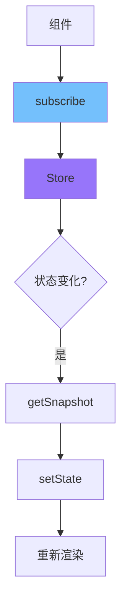
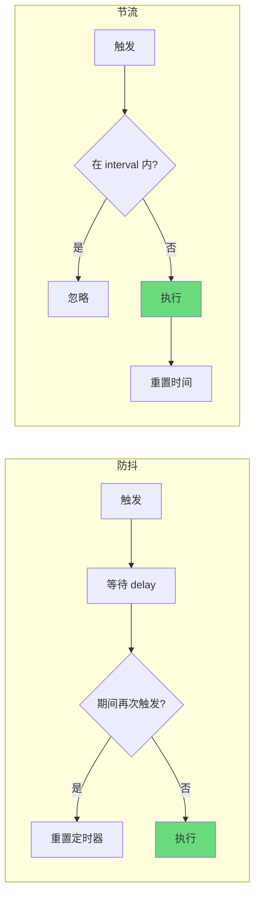
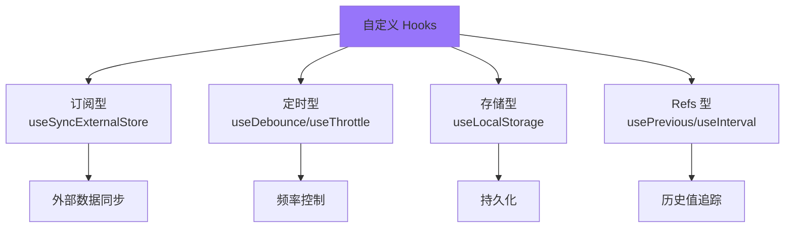

# React 手写代码题 (下)

> 本章节继续深入探讨 React 高级自定义 Hooks 的手写实现，涵盖状态同步、定时器、外部事件处理等核心模式。

---

## 1. 实现 useSyncExternalStore

`useSyncExternalStore` 是 React 18 引入的核心 Hook，用于安全地订阅外部数据源（如 Redux、Zustand、MobX 等状态管理器）。

### 基本实现

```javascript
/**
 * useSyncExternalStore - React 18 新增 Hook
 *
 * @param {Function} subscribe - 订阅函数，返回取消订阅的函数
 * @param {Function} getSnapshot - 获取当前状态的快照
 * @param {Function} getServerSnapshot - 服务端渲染时的快照获取函数
 * @returns {T} 返回的快照状态
 */
function useSyncExternalStore(subscribe, getSnapshot, getServerSnapshot) {
  // 1. 获取初始快照
  // useRef 用于存储最新的快照值，避免不必要的重新渲染
  const instRef = useRef(null);
  let inst;

  // 2. 判断是否为服务端渲染
  if (!useSyncExternalStore.isHydrating) {
    // 客户端：获取当前快照
    inst = getSnapshot();
  }

  // 3. 初始化 ref（仅首次渲染）
  if (instRef.current === null) {
    // 服务端渲染时使用专门的快照函数
    instRef.current = useSyncExternalStore.isHydrating
      ? getServerSnapshot?.() ?? inst
      : inst;
  }

  // 4. 使用 useState 管理状态更新
  // forceUpdate 用于触发组件重新渲染
  const [{ inst: value }, forceUpdate] = useState({ inst: instRef.current });

  // 5. 订阅外部 store 变化
  useEffect(() => {
    // 检查快照是否变化
    let prevSnapshot = instRef.current;
    let maybeSnapshot = getSnapshot();

    // 如果快照值发生变化，触发更新
    if (!Object.is(prevSnapshot, maybeSnapshot)) {
      instRef.current = maybeSnapshot;
      forceUpdate({ inst: maybeSnapshot });
    }

    // 订阅 store
    const callbackStore = subscribe((onStoreChange) => {
      // 每次 store 变化时，重新获取快照
      maybeSnapshot = getSnapshot();

      if (!Object.is(prevSnapshot, maybeSnapshot)) {
        prevSnapshot = maybeSnapshot;
        instRef.current = maybeSnapshot;
        // 批量更新
        flushSync(() => {
          forceUpdate({ inst: maybeSnapshot });
        });
      }
    });

    // 返回清理函数
    return () => callbackStore();
  }, [subscribe, getSnapshot]);

  // 6. 服务端渲染时验证快照一致性
  if (!useSyncExternalStore.isHydrating) {
    // 客户端 hydration 完成后检查一致性
    const snapshot = getSnapshot();
    if (!Object.is(value, snapshot)) {
      forceUpdate({ inst: snapshot });
    }
  }

  return value;
}

// 标记是否为 hydration 阶段
useSyncExternalStore.isHydrating = false;
```

### 简化版本

```javascript
// 简化版实现（适合面试）
function useSyncExternalStore(subscribe, getSnapshot) {
  const [state, setState] = useState(() => getSnapshot());

  useEffect(() => {
    // 订阅 store 变化
    const unsubscribe = subscribe(() => {
      // 获取新快照并更新状态
      const nextSnapshot = getSnapshot();
      setState(nextSnapshot);
    });

    return unsubscribe;
  }, [subscribe, getSnapshot]);

  return state;
}
```

### 常见使用场景

```javascript
// 场景1：订阅 Redux Store
import { useDispatch, useSelector } from 'react-redux';

// 底层实现
const selectCount = (state) => state.counter.count;
const subscribe = (callback) => {
  const unsubscribe = store.subscribe(callback);
  return unsubscribe;
};

function Counter() {
  const count = useSyncExternalStore(subscribe, selectCount);
  return <div>{count}</div>;
}

// 场景2：订阅自定义状态
const createStore = (initialState) => {
  let state = initialState;
  const listeners = new Set();

  return {
    getState: () => state,
    setState: (partial) => {
      state = { ...state, ...partial };
      listeners.forEach(listener => listener());
    },
    subscribe: (listener) => {
      listeners.add(listener);
      return () => listeners.delete(listener);
    }
  };
};

const store = createStore({ count: 0 });

function App() {
  const state = useSyncExternalStore(
    (cb) => store.subscribe(cb),
    () => store.getState()
  );

  return (
    <div>
      <p>Count: {state.count}</p>
      <button onClick={() => store.setState({ count: state.count + 1 })}>
        Increment
      </button>
    </div>
  );
}
```

### 设计原理图



---

## 2. 实现 useDebounce

防抖 Hook 用于延迟更新，常用于搜索输入、窗口调整等高频场景。

### 完整实现

```javascript
/**
 * useDebounce - 防抖 Hook
 *
 * @param {T} value - 需要防抖的值
 * @param {number} delay - 延迟时间（毫秒）
 * @returns {T} 防抖后的值
 *
 * 使用场景：
 * - 搜索框输入（等待用户停止输入后才搜索）
 * - 表单验证
 * - 窗口调整完成后再处理
 */
function useDebounce(value, delay = 500) {
  // 1. 使用 useState 存储防抖后的值
  const [debouncedValue, setDebouncedValue] = useState(value);

  // 2. 使用 useEffect 处理防抖逻辑
  useEffect(() => {
    // 3. 创建定时器
    const handler = setTimeout(() => {
      // 4. 延迟更新值
      setDebouncedValue(value);
    }, delay);

    // 5. 清理函数：value 或 delay 变化时清除旧定时器
    return () => {
      clearTimeout(handler);
    };
  }, [value, delay]); // 依赖项

  // 6. 返回防抖后的值
  return debouncedValue;
}
```

### 高级版本（带 loading 状态）

```javascript
/**
 * useDebounce - 高级版防抖 Hook
 *
 * 特点：
 * - 返回防抖值和防抖中状态
 * - 支持立即执行选项
 */
function useDebounce(value, options = {}) {
  const { delay = 500, immediate = false } = options;

  const [debouncedValue, setDebouncedValue] = useState(value);
  const [isDebouncing, setIsDebouncing] = useState(false);
  const timerRef = useRef(null);

  useEffect(() => {
    if (immediate) {
      // 立即模式：立即执行，然后防抖
      setIsDebouncing(true);
    }

    // 清除旧定时器
    if (timerRef.current) {
      clearTimeout(timerRef.current);
    }

    // 设置新定时器
    timerRef.current = setTimeout(() => {
      setDebouncedValue(value);
      setIsDebouncing(false);
    }, delay);

    // 清理
    return () => {
      if (timerRef.current) {
        clearTimeout(timerRef.current);
      }
    };
  }, [value, delay, immediate]);

  return {
    debouncedValue,
    isDebouncing
  };
}
```

### 使用示例

```javascript
function SearchComponent() {
  const [query, setQuery] = useState('');
  // 基础版
  const debouncedQuery = useDebounce(query, 300);

  // 高级版
  const { debouncedValue, isDebouncing } = useDebounce(query, { delay: 300 });

  // 搜索逻辑
  useEffect(() => {
    if (debouncedQuery) {
      fetchSearchResults(debouncedQuery);
    }
  }, [debouncedQuery]);

  return (
    <div>
      <input
        value={query}
        onChange={(e) => setQuery(e.target.value)}
        placeholder="搜索..."
      />
      {isDebouncing && <LoadingSpinner />}
    </div>
  );
}
```

---

## 3. 实现 useThrottle

节流 Hook 用于限制函数执行频率，常用于滚动事件、按钮防重复点击等场景。

### 完整实现

```javascript
/**
 * useThrottle - 节流 Hook
 *
 * @param {T} value - 需要节流的值
 * @param {number} interval - 节流间隔（毫秒）
 * @returns {T} 节流后的值
 *
 * 使用场景：
 * - 滚动事件处理
 * - 按钮防重复点击
 * - 窗口 resize 事件
 */
function useThrottle(value, interval = 100) {
  // 1. 使用 ref 存储上次更新的时间戳
  const lastUpdate = useRef(Date.now());

  // 2. 使用 ref 存储最新的值（立即可用）
  const valueRef = useRef(value);

  // 3. 更新 ref（每次 value 变化都立即更新）
  valueRef.current = value;

  // 4. 使用 useState 存储节流后的值
  const [throttledValue, setThrottledValue] = useState(value);

  useEffect(() => {
    // 5. 计算距离上次更新的时间
    const now = Date.now();
    const timeSinceLastUpdate = now - lastUpdate.current;

    if (timeSinceLastUpdate >= interval) {
      // 6. 间隔足够，直接更新
      lastUpdate.current = now;
      setThrottledValue(valueRef.current);
    } else {
      // 7. 间隔不够，设置定时器在合适时间更新
      const timerId = setTimeout(() => {
        lastUpdate.current = Date.now();
        setThrottledValue(valueRef.current);
      }, interval - timeSinceLastUpdate);

      // 8. 清理定时器
      return () => clearTimeout(timerId);
    }
  }, [value, interval]);

  return throttledValue;
}
```

### 简化版本

```javascript
// 经典节流实现
function useThrottle(value, interval) {
  const [throttledValue, setThrottledValue] = useState(value);
  const lastRan = useRef(Date.now());

  useEffect(() => {
    const handler = setTimeout(() => {
      if (Date.now() - lastRan.current >= interval) {
        setThrottledValue(value);
        lastRan.current = Date.now();
      }
    }, interval - (Date.now() - lastRan.current));

    return () => clearTimeout(handler);
  }, [value, interval]);

  return throttledValue;
}
```

### 使用示例

```javascript
function ScrollComponent() {
  const [scrollY, setScrollY] = useState(0);

  // 使用节流限制滚动事件频率
  const throttledScrollY = useThrottle(scrollY, 100);

  useEffect(() => {
    const handleScroll = () => {
      setScrollY(window.scrollY);
    };

    window.addEventListener('scroll', handleScroll);
    return () => window.removeEventListener('scroll', handleScroll);
  }, []);

  return (
    <div>
      <p>当前滚动位置: {throttledScrollY}</p>
    </div>
  );
}

function SubmitButton() {
  const [isThrottled, setIsThrottled] = useState(false);
  const lastClick = useRef(0);

  const handleClick = () => {
    const now = Date.now();
    if (now - lastClick.current > 1000) { // 1秒防抖
      lastClick.current = now;
      // 执行提交逻辑
      submitForm();
    }
  };

  return <button onClick={handleClick}>提交</button>;
}
```

### 防抖 vs 节流 对比



---

## 4. 实现 useLocalStorage

`useLocalStorage` Hook 实现 localStorage 与 React 状态的同步。

### 完整实现

```javascript
/**
 * useLocalStorage - localStorage 同步 Hook
 *
 * @param {string} key - localStorage 的键名
 * @param {T} initialValue - 初始值
 * @returns {[T, Function]} [值, 更新函数]
 *
 * 特点：
 * - 跨标签页同步
 * - 序列化支持（支持对象、数组等）
 * - SSR 兼容
 */
function useLocalStorage(key, initialValue) {
  // 1. 获取初始值的工厂函数
  const initializer = useRef((key) => {
    try {
      const item = window.localStorage.getItem(key);
      // 2. 解析 JSON，失败则返回初始值
      return item ? JSON.parse(item) : initialValue;
    } catch (error) {
      console.warn(`Error reading localStorage key "${key}":`, error);
      return initialValue;
    }
  });

  // 3. 使用 useState 存储状态
  // 惰性初始化避免 SSR 问题
  const [storedValue, setStoredValue] = useState(() =>
    initializer.current(key)
  );

  // 4. 封装的更新函数
  const setValue = useCallback(
    (value) => {
      try {
        // 5. 支持函数式更新
        const valueToStore = value instanceof Function
          ? value(storedValue)
          : value;

        // 6. 保存到 state
        setStoredValue(valueToStore);

        // 7. 保存到 localStorage
        // null/undefined 时移除键
        if (valueToStore === null || valueToStore === undefined) {
          window.localStorage.removeItem(key);
        } else {
          window.localStorage.setItem(key, JSON.stringify(valueToStore));
        }
      } catch (error) {
        console.warn(`Error setting localStorage key "${key}":`, error);
      }
    },
    [key, storedValue]
  );

  // 8. 跨标签页同步
  useEffect(() => {
    const handleStorageChange = (e) => {
      // 忽略同标签页的修改
      if (e.key !== key || e.storageArea !== window.localStorage) {
        return;
      }

      try {
        const newValue = e.newValue
          ? JSON.parse(e.newValue)
          : initialValue;
        setStoredValue(newValue);
      } catch (error) {
        console.warn(`Error parsing localStorage change:`, error);
      }
    };

    window.addEventListener('storage', handleStorageChange);
    return () => window.removeEventListener('storage', handleStorageChange);
  }, [key, initialValue]);

  return [storedValue, setValue];
}
```

### 简化和 SSR 安全版本

```javascript
// SSR 兼容版本
function useLocalStorage(key, initialValue) {
  // 状态初始化
  const [state, setState] = useState(() => {
    if (typeof window === 'undefined') {
      // 服务端渲染：返回初始值
      return initialValue;
    }
    try {
      const item = window.localStorage.getItem(key);
      return item ? JSON.parse(item) : initialValue;
    } catch {
      return initialValue;
    }
  });

  // 更新函数
  const setValue = useCallback(
    (value) => {
      const valueToStore = value instanceof Function ? value(state) : value;
      setState(valueToStore);

      if (typeof window !== 'undefined') {
        if (valueToStore === null) {
          window.localStorage.removeItem(key);
        } else {
          window.localStorage.setItem(key, JSON.stringify(valueToStore));
        }
      }
    },
    [key, state]
  );

  return [state, setValue];
}
```

### 使用示例

```javascript
// 基础用法
function ThemeToggle() {
  const [theme, setTheme] = useLocalStorage('theme', 'light');

  return (
    <button onClick={() => setTheme(t => t === 'light' ? 'dark' : 'light')}>
      Current: {theme}
    </button>
  );
}

// 复杂数据结构
function UserPreferences() {
  const [preferences, setPreferences] = useLocalStorage('preferences', {
    fontSize: 14,
    language: 'zh-CN',
    notifications: true
  });

  return (
    <div>
      <input
        type="number"
        value={preferences.fontSize}
        onChange={(e) =>
          setPreferences(p => ({ ...p, fontSize: Number(e.target.value) }))
        }
      />
    </div>
  );
}
```

---

## 5. 实现 usePrevious

`usePrevious` Hook 用于获取上一个渲染周期的值，常用于动画、比较值变化等场景。

### 核心实现

```javascript
/**
 * usePrevious - 获取上一个渲染周期的值
 *
 * @param {T} value - 当前值
 * @returns {T | undefined} 上一个值（首次渲染返回 undefined）
 *
 * 实现原理：
 * 使用 useRef 存储值，因为 ref 的更新不会触发重新渲染
 */
function usePrevious(value) {
  // 1. 创建 ref 存储上一个值
  const ref = useRef();

  // 2. 每次渲染后更新 ref
  // useLayoutEffect 确保在 DOM 更新后同步执行
  useLayoutEffect(() => {
    // 将当前值存入 ref
    ref.current = value;
  }, [value]); // 依赖项：value 变化时更新

  // 3. 返回上一个渲染周期的值
  return ref.current;
}
```

### 带初始值的版本

```javascript
/**
 * usePrevious - 支持初始值的版本
 */
function usePrevious(value, initialValue = undefined) {
  const ref = useRef(initialValue);
  const prevRef = useRef();

  // useLayoutEffect 在 DOM 更新后、浏览器绘制前同步执行
  useLayoutEffect(() => {
    prevRef.current = ref.current;
    ref.current = value;
  }, [value]);

  return prevRef.current;
}
```

### 进阶版本（带变化检测）

```javascript
/**
 * usePrevious - 进阶版，包含变化信息
 */
function usePrevious(value) {
  const prevRef = useRef();
  const isFirstRender = useRef(true);

  useLayoutEffect(() => {
    if (isFirstRender.current) {
      // 首次渲染：不更新 prevRef
      isFirstRender.current = false;
    } else {
      // 后续渲染：保存上一个值
      prevRef.current = value;
    }
  });

  // 另一种方式：立即返回当前值，同时更新 ref
  const currentRef = useRef(value);
  if (currentRef.current !== value) {
    prevRef.current = currentRef.current;
    currentRef.current = value;
  }

  return {
    previous: prevRef.current,
    current: value,
    changed: prevRef.current !== value,
    // 获取上 N 个值
    getPrevious: (n = 1) => {
      // 可以扩展为历史记录
    }
  };
}
```

### 使用示例

```javascript
// 场景1：检测值变化
function AnimatedNumber({ value }) {
  const prevValue = usePrevious(value);
  const [direction, setDirection] = useState('none');

  useEffect(() => {
    if (value > prevValue) setDirection('up');
    else if (value < prevValue) setDirection('down');
  }, [value, prevValue]);

  return (
    <div className={`number-animate-${direction}`}>
      {value}
    </div>
  );
}

// 场景2：条件 effect
function DataFetcher({ fetchId }) {
  const prevFetchId = usePrevious(fetchId);

  useEffect(() => {
    // 只在 fetchId 真正变化时请求
    if (fetchId !== prevFetchId) {
      fetchData(fetchId);
    }
  }, [fetchId, prevFetchId]);

  // ...
}

// 场景3：动画过渡
function TransitionWrapper({ isVisible }) {
  const wasVisible = usePrevious(isVisible);

  return (
    <div
      className={`transition ${isVisible ? 'enter' : 'leave'}`}
      style={{
        opacity: isVisible ? 1 : 0,
        transform: isVisible ? 'scale(1)' : 'scale(0.9)'
      }}
    >
      {isVisible && <Content />}
    </div>
  );
}
```

---

## 6. 实现 useInterval

`useInterval` Hook 提供一个稳定的定时器，自动处理清理逻辑。

### 核心实现

```javascript
/**
 * useInterval - 稳定的 setInterval Hook
 *
 * @param {Function} callback - 定时执行的回调函数
 * @param {number | null} delay - 间隔时间（毫秒），null 时暂停
 *
 * 特点：
 * - 回调函数变化时自动更新定时器
 * - delay 为 null/0 时暂停
 * - 组件卸载时自动清理
 */
function useInterval(callback, delay) {
  // 1. 使用 ref 存储最新的回调函数
  // 避免闭包陷阱：每次渲染回调函数可能变化
  const savedCallback = useRef(callback);

  // 2. 更新 ref（渲染完成后立即执行）
  useLayoutEffect(() => {
    savedCallback.current = callback;
  });

  // 3. 设置定时器
  useEffect(() => {
    // 如果 delay 为 null，不启动定时器
    if (delay === null || delay === undefined) {
      return;
    }

    // 4. 创建定时器
    const id = setInterval(() => {
      savedCallback.current();
    }, delay);

    // 5. 返回清理函数
    return () => clearInterval(id);
  }, [delay]); // delay 变化时重新创建定时器
}
```

### 动态delay版本

```javascript
/**
 * useInterval - 支持动态 delay
 */
function useInterval(callback, delay) {
  const savedCallback = useRef(callback);

  useLayoutEffect(() => {
    savedCallback.current = callback;
  });

  useEffect(() => {
    if (delay === null || delay === undefined) {
      return;
    }

    const tick = () => {
      savedCallback.current();
    };

    const id = setInterval(tick, delay);
    return () => clearInterval(id);
  }, [delay]);
}
```

### 带暂停/恢复功能

```javascript
/**
 * useInterval - 完整版
 */
function useInterval(callback, delay) {
  const savedCallback = useRef(callback);
  const [isRunning, setIsRunning] = useState(delay !== null);

  // 保存 delay 引用
  const delayRef = useRef(delay);

  useLayoutEffect(() => {
    savedCallback.current = callback;
  });

  useEffect(() => {
    if (!isRunning || delay === null) {
      return;
    }

    const id = setInterval(() => {
      savedCallback.current();
    }, delay);

    return () => clearInterval(id);
  }, [isRunning, delay]);

  const start = useCallback(() => setIsRunning(true), []);
  const stop = useCallback(() => setIsRunning(false), []);
  const toggle = useCallback(() => setIsRunning(s => !s), []);

  return { start, stop, toggle };
}

// 或者返回控制函数
function useIntervalControl(callback, delay) {
  const savedCallback = useRef(callback);
  const intervalRef = useRef(null);

  useLayoutEffect(() => {
    savedCallback.current = callback;
  });

  const start = useCallback(() => {
    if (intervalRef.current) return;
    intervalRef.current = setInterval(() => {
      savedCallback.current();
    }, delay);
  }, [delay]);

  const stop = useCallback(() => {
    if (intervalRef.current) {
      clearInterval(intervalRef.current);
      intervalRef.current = null;
    }
  }, []);

  // 组件卸载时清理
  useEffect(() => {
    return () => stop();
  }, [stop]);

  return { start, stop };
}
```

### 使用示例

```javascript
// 倒计时组件
function Countdown({ startTime, duration }) {
  const [remaining, setRemaining] = useState(duration);

  useInterval(() => {
    setRemaining((r) => {
      if (r <= 1) return 0;
      return r - 1;
    });
  }, remaining > 0 ? 1000 : null);

  return <div>{remaining} 秒</div>;
}

// 轮播组件
function Carousel({ images, autoPlay = true }) {
  const [currentIndex, setCurrentIndex] = useState(0);

  useInterval(() => {
    setCurrentIndex((i) => (i + 1) % images.length);
  }, autoPlay ? 3000 : null);

  return (
    <div>
      
    </div>
  );
}

// 动画帧控制
function useAnimationFrame(callback) {
  const requestRef = useRef();
  const previousTimeRef = useRef();

  useEffect(() => {
    const animate = (time) => {
      if (previousTimeRef.current !== undefined) {
        const deltaTime = time - previousTimeRef.current;
        callback(deltaTime);
      }
      previousTimeRef.current = time;
      requestRef.current = requestAnimationFrame(animate);
    };

    requestRef.current = requestAnimationFrame(animate);
    return () => cancelAnimationFrame(requestRef.current);
  }, [callback]);
}
```

---

## 7. 实现 useOnClickOutside

`useOnClickOutside` Hook 用于检测点击元素外部的事件，常用于下拉菜单、模态框、工具提示等场景。

### 核心实现

```javascript
/**
 * useOnClickOutside - 检测点击外部事件
 *
 * @param {RefObject} ref - 目标元素的 ref
 * @param {Function} handler - 点击外部时执行的回调函数
 * @param {Object} options - 配置选项
 * @param {string[]} options.enabled - 是否启用监听
 *
 * 实现原理：
 * 1. 给 document 添加 click 事件监听
 * 2. 当事件目标不在 ref 指向的元素内时触发 handler
 */
function useOnClickOutside(ref, handler, options = {}) {
  const { enabled = true } = options;

  useEffect(() => {
    // 如果没有 ref 或未启用，不添加监听
    if (!enabled || !ref.current) {
      return;
    }

    // 事件处理函数
    const listener = (event) => {
      // 如果点击目标不在目标元素内
      if (!ref.current || ref.current.contains(event.target)) {
        return;
      }

      // 执行回调
      handler(event);
    };

    // 使用 capture 阶段确保早期拦截
    document.addEventListener('mousedown', listener, { capture: true });
    document.addEventListener('touchstart', listener, { capture: true });

    // 清理
    return () => {
      document.removeEventListener('mousedown', listener, { capture: true });
      document.removeEventListener('touchstart', listener, { capture: true });
    };
  }, [ref, handler, enabled]);
}
```

### 带忽略元素列表的版本

```javascript
/**
 * useOnClickOutside - 增强版
 */
function useOnClickOutside(ref, handler, options = {}) {
  const { enabled = true, ignoreList = [] } = options;

  useEffect(() => {
    if (!enabled || !ref.current) return;

    const listener = (event) => {
      const target = event.target;

      // 检查是否在目标元素内
      if (ref.current && ref.current.contains(target)) {
        return;
      }

      // 检查是否在忽略列表内
      for (const ignoreRef of ignoreList) {
        if (ignoreRef.current?.contains(target)) {
          return;
        }
      }

      handler(event);
    };

    document.addEventListener('mousedown', listener, { capture: true });
    document.addEventListener('touchstart', listener, { capture: true });

    return () => {
      document.removeEventListener('mousedown', listener, { capture: true });
      document.removeEventListener('touchstart', listener, { capture: true });
    };
  }, [ref, handler, enabled, ignoreList]);
}
```

### 移动端兼容版本

```javascript
/**
 * useOnClickOutside - 移动端版本
 */
function useOnClickOutside(ref, handler) {
  useEffect(() => {
    if (!ref.current) return;

    const listener = (event) => {
      // 同时支持 mouse 和 touch 事件
      const isClickOutside =
        event.type === 'mousedown'
          ? !ref.current.contains(event.target)
          : // 对于 touch 事件，检查所有触摸点
            Array.from(event.changedTouches).every(
              (touch) => !ref.current.contains(touch.target)
            );

      if (isClickOutside) {
        handler(event);
      }
    };

    document.addEventListener('mousedown', listener, true);
    document.addEventListener('touchstart', listener, true);

    return () => {
      document.removeEventListener('mousedown', listener, true);
      document.removeEventListener('touchstart', listener, true);
    };
  }, [ref, handler]);
}
```

### 使用示例

```javascript
// 下拉菜单
function Dropdown() {
  const [isOpen, setIsOpen] = useState(false);
  const menuRef = useRef();

  useOnClickOutside(menuRef, () => setIsOpen(false));

  return (
    <div ref={menuRef}>
      <button onClick={() => setIsOpen(!isOpen)}>菜单</button>
      {isOpen && (
        <ul className="dropdown-menu">
          <li>选项1</li>
          <li>选项2</li>
        </ul>
      )}
    </div>
  );
}

// 模态框
function Modal({ isOpen, onClose, children }) {
  const modalRef = useRef();

  useOnClickOutside(modalRef, onClose);

  if (!isOpen) return null;

  return (
    <div className="modal-overlay">
      <div ref={modalRef} className="modal-content">
        {children}
      </div>
    </div>
  );
}

// Popover 组件
function Popover({ content, children }) {
  const [isOpen, setIsOpen] = useState(false);
  const popoverRef = useRef();
  const triggerRef = useRef();

  useOnClickOutside(popoverRef, () => setIsOpen(false));

  return (
    <>
      <span ref={triggerRef} onClick={() => setIsOpen(!isOpen)}>
        {children}
      </span>
      {isOpen && (
        <div ref={popoverRef} className="popover">
          {content}
        </div>
      )}
    </>
  );
}
```

---

## 8. 实现 useEventListener

`useEventListener` Hook 提供统一的事件监听管理，自动处理清理逻辑。

### 核心实现

```javascript
/**
 * useEventListener - 事件监听 Hook
 *
 * @param {string} event - 事件名称
 * @param {Function} handler - 事件处理函数
 * @param {Object} options - addEventListener 选项
 * @param {Element} options.target - 监听目标，默认 window
 * @param {boolean} options.enabled - 是否启用
 *
 * 特点：
 * - 自动清理
 * - 支持多种目标（window, document, 自定义元素）
 * - useRef 避免闭包问题
 */
function useEventListener(event, handler, options = {}) {
  const {
    target = typeof window !== 'undefined' ? window : null,
    enabled = true,
    ...listenerOptions
  } = options;

  // 使用 ref 存储最新的 handler
  const savedHandler = useRef(handler);

  // 每次渲染更新 ref
  useLayoutEffect(() => {
    savedHandler.current = handler;
  }, [handler]);

  useEffect(() => {
    // 如果未启用或没有目标，不添加监听
    if (!enabled || !target) {
      return;
    }

    // 确保目标支持 addEventListener
    if (!target.addEventListener) {
      console.warn(`Target does not support addEventListener:`, target);
      return;
    }

    // 创建事件监听器
    const listener = (event) => {
      savedHandler.current(event);
    };

    // 添加监听
    target.addEventListener(event, listener, listenerOptions);

    // 清理
    return () => {
      target.removeEventListener(event, listener, listenerOptions);
    };
  }, [event, target, enabled, listenerOptions.capture, listenerOptions.once, listenerOptions.passive]);
}
```

### 完整版本（支持更多事件类型）

```javascript
/**
 * useEventListener - 完整版
 */
function useEventListener(event, handler, options = {}) {
  const {
    target,
    enabled = true,
    capture = false,
    once = false,
    passive = false
  } = options;

  const savedHandler = useRef(handler);

  useLayoutEffect(() => {
    savedHandler.current = handler;
  }, [handler]);

  useEffect(() => {
    if (!enabled) return;

    // 解析目标元素
    let targetElement;
    if (typeof target === 'string') {
      targetElement = document.querySelector(target);
    } else if (target === null || target === undefined) {
      targetElement = typeof window !== 'undefined' ? window : null;
    } else {
      targetElement = target;
    }

    if (!targetElement) {
      return;
    }

    const listener = (event) => {
      savedHandler.current(event);
    };

    const eventOptions = { capture, once, passive };

    targetElement.addEventListener(event, listener, eventOptions);

    return () => {
      targetElement.removeEventListener(event, listener, eventOptions);
    };
  }, [event, target, enabled, capture, once, passive]);
}
```

### 自定义事件版本

```javascript
/**
 * useCustomEvent - 自定义事件 Hook
 */
function useCustomEvent(eventName, handler) {
  const savedHandler = useRef(handler);

  useLayoutEffect(() => {
    savedHandler.current = handler;
  }, [handler]);

  useEffect(() => {
    const listener = (event) => {
      savedHandler.current(event.detail);
    };

    window.addEventListener(eventName, listener);
    return () => window.removeEventListener(eventName, listener);
  }, [eventName]);

  // 返回发送函数
  const dispatch = useCallback(
    (data) => {
      window.dispatchEvent(new CustomEvent(eventName, { detail: data }));
    },
    [eventName]
  );

  return dispatch;
}
```

### 使用示例

```javascript
// 键盘事件
function KeyboardHandler() {
  const [key, setKey] = useState('');

  useEventListener('keydown', (event) => {
    setKey(event.key);
  });

  return <div>按下的键: {key}</div>;
}

// 窗口尺寸变化
function WindowSize() {
  const [size, setSize] = useState({
    width: window.innerWidth,
    height: window.innerHeight
  });

  useEventListener('resize', () => {
    setSize({
      width: window.innerWidth,
      height: window.innerHeight
    });
  });

  return (
    <div>
      窗口尺寸: {size.width} x {size.height}
    </div>
  );
}

// 滚动事件
function ScrollIndicator() {
  const [scrollPercent, setScrollPercent] = useState(0);

  useEventListener('scroll', () => {
    const scrollTop = window.scrollY;
    const docHeight = document.documentElement.scrollHeight - window.innerHeight;
    setScrollPercent(Math.round((scrollTop / docHeight) * 100));
  }, { target: window });

  return <progress value={scrollPercent} max={100} />;
}

// 条件性监听
function ConditionalListener() {
  const [enabled, setEnabled] = useState(true);

  useEventListener('mousemove', (e) => {
    console.log('Mouse position:', e.clientX, e.clientY);
  }, { enabled });

  return (
    <button onClick={() => setEnabled(!enabled)}>
      {enabled ? '禁用' : '启用'} 监听
    </button>
  );
}
```

---

## 常见自定义 Hooks 模式总结



---

## 面试要点总结

### 核心原理

| Hook | 核心原理 | 关键点 |
|------|----------|--------|
| `useSyncExternalStore` | 订阅外部 store，强制更新 | 服务端渲染兼容，snapshot 比较 |
| `useDebounce` | setTimeout 延迟更新 | 清理旧定时器，依赖数组 |
| `useThrottle` | 时间窗口控制频率 | 利用 setTimeout 或时间戳比较 |
| `useLocalStorage` | state + localStorage 同步 | JSON 序列化，跨标签页同步 |
| `usePrevious` | useRef 存储旧值 | useLayoutEffect 同步更新 |
| `useInterval` | useRef 存储回调，setInterval | 自动清理，delay 为 null 暂停 |
| `useOnClickOutside` | document 事件监听 + contains 检查 | capture 阶段，移动端 touch |
| `useEventListener` | 统一事件管理 | 自动清理，ref 避免闭包 |

### 常见陷阱

1. **闭包陷阱**：回调函数变化时定时器/监听器仍使用旧函数
   - 解决：使用 `useRef` 存储最新回调

2. **清理遗漏**：组件卸载时定时器/监听器未清理
   - 解决：务必在 `useEffect` 中返回清理函数

3. **依赖数组错误**：遗漏必要的依赖项
   - 解决：明确哪些变量变化需要重建定时器/监听器

4. **SSR 兼容**：`window`/`document` 在服务端不存在
   - 解决：使用条件判断或 `typeof` 检查

---

## 扩展练习

1. 实现 `useMediaQuery` - 响应式媒体查询 Hook
2. 实现 `useHover` - 检测鼠标悬停状态
3. 实现 `useCopyToClipboard` - 复制到剪贴板 Hook
4. 实现 `useAsync` - 异步操作状态管理 Hook
5. 实现 `useClickToggle` - 点击切换状态 Hook