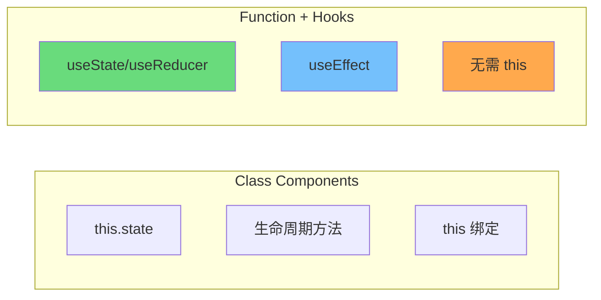
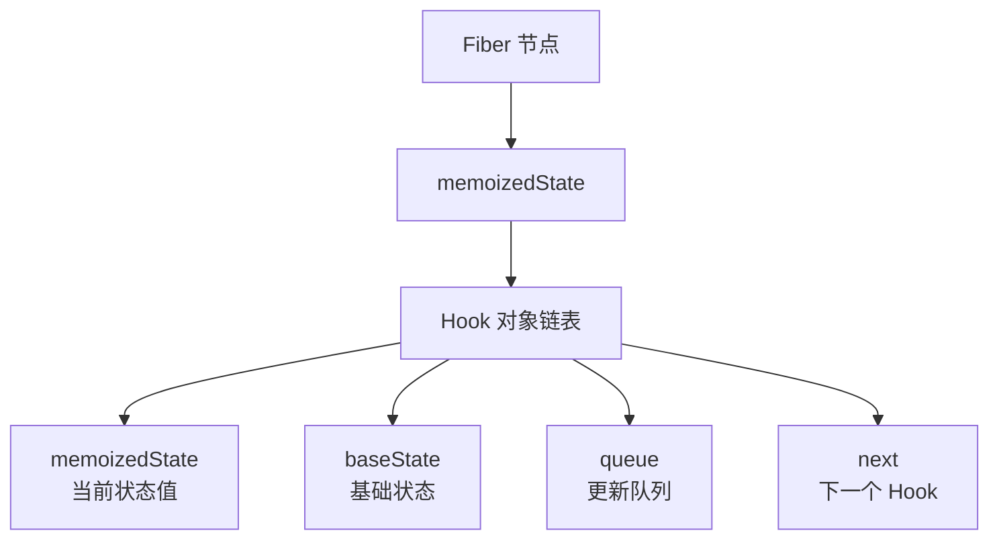
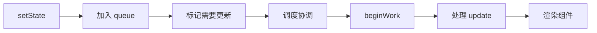
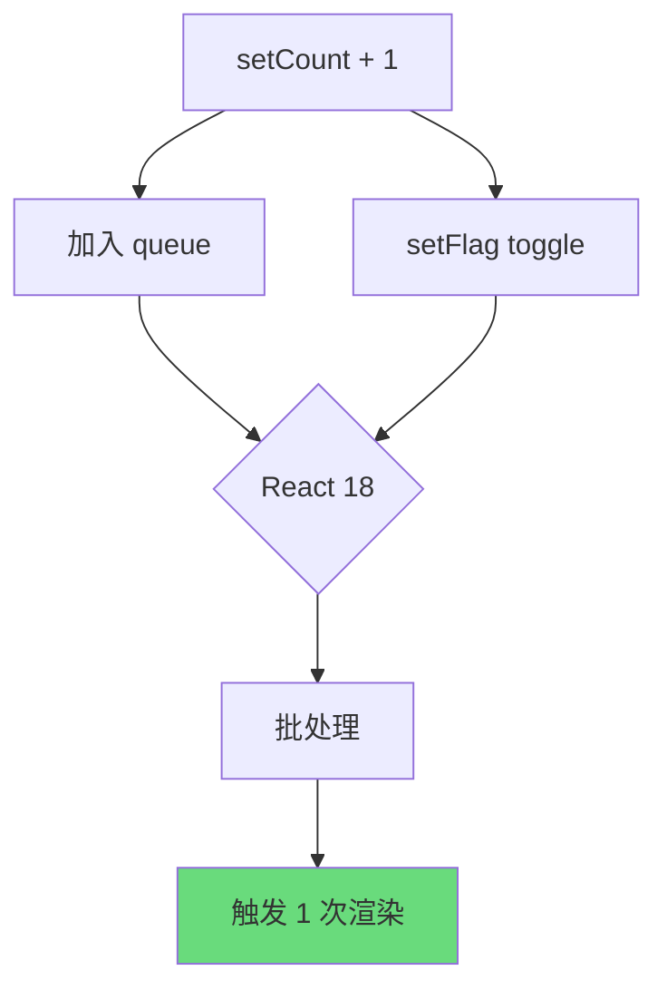
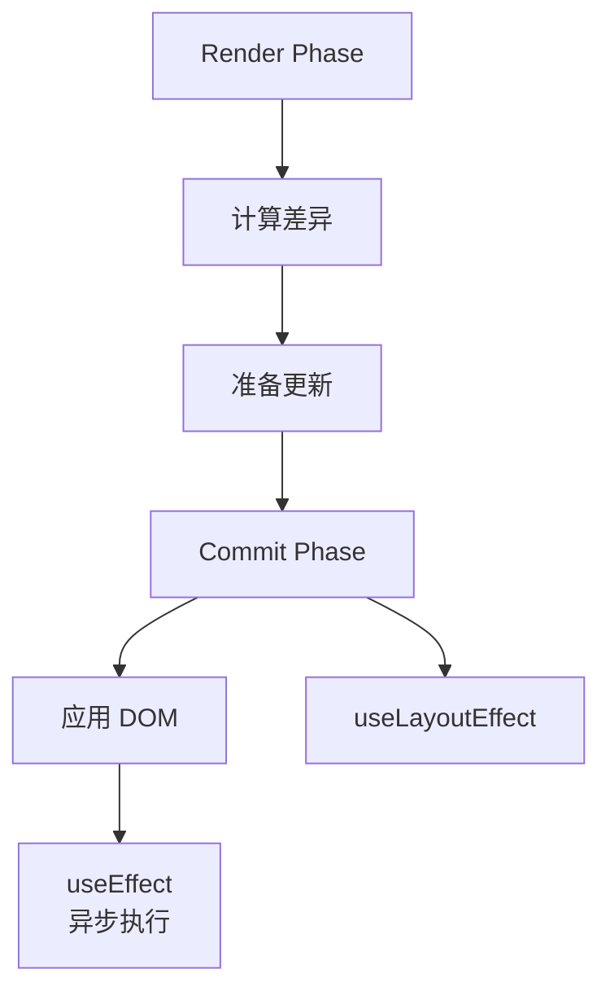
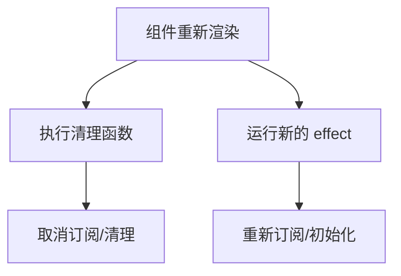
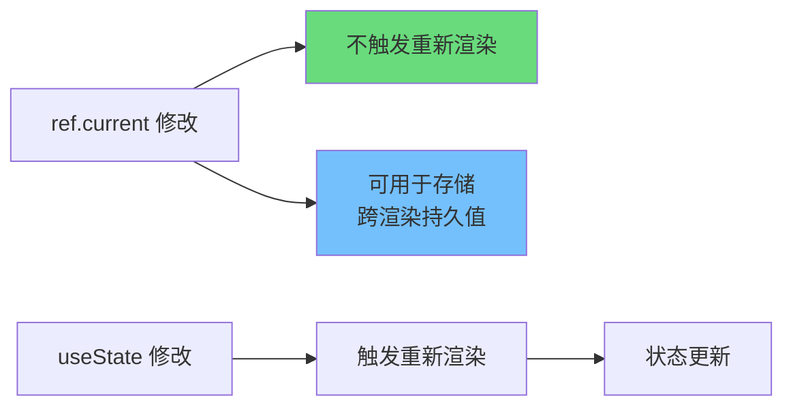
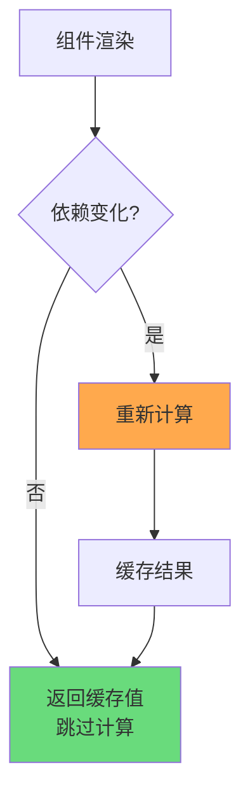
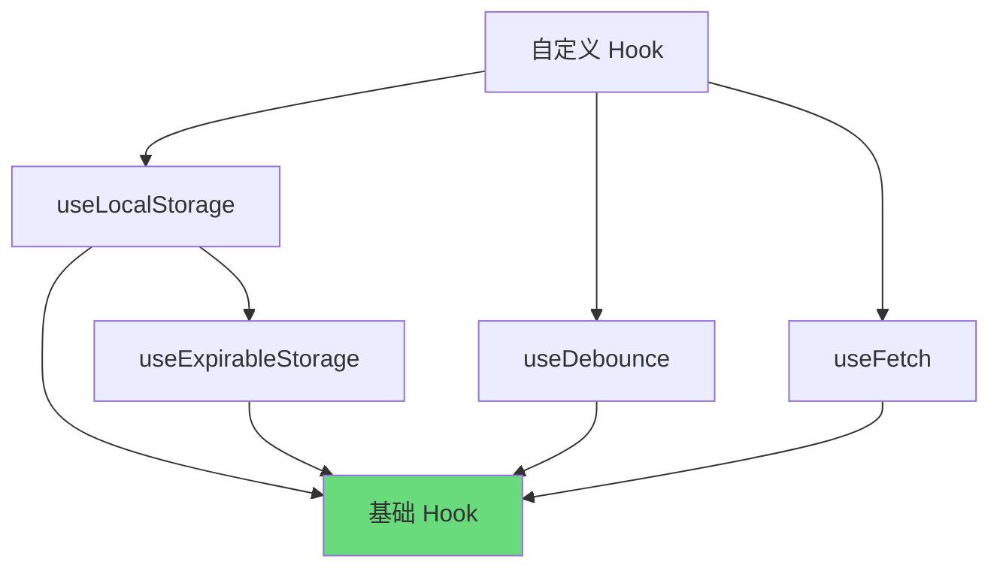
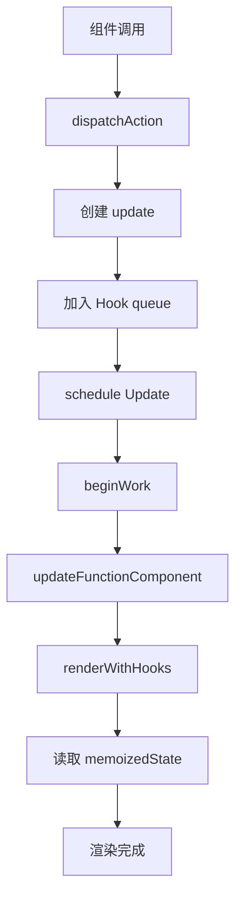

# React Hooks 深入原理

Hooks 是 React 16.8 引入的核心特性，它让我们在函数组件中使用状态和其他 React 特性成为可能。本文档深入剖析 Hooks 的内部实现原理，帮助你理解其工作机制，从而编写更高效的代码。

---

## 1. Hooks 设计理念

### 1.1 为什么引入 Hooks

在 Hooks 出现之前，组件逻辑复用主要依靠 render props 和高阶组件（Higher-Order Components）。这两种方式虽然有效，但存在明显的局限性：

| 模式 | 问题 |
|------|------|
| Render Props | 导致嵌套过深（Wrapper Hell） |
| HOC | 难以理解 props 来源，prop 命名冲突 |
| Class Components | 难以拆分级小的逻辑单元，难以测试 |

Hooks 的引入解决了以下核心问题：

1. **逻辑复用困境** — 告别嵌套地狱，用自定义 Hook 自由组合逻辑
2. **关注点分离** — 相关逻辑可以放在同一个地方，而非散落在多个生命周期方法中
3. **更简洁的代码** — 避免 Class 组件的 this 绑定、构造函数等样板代码

### 1.2 Hooks vs Class Components



**核心差异对比：**

| 维度 | Class Component | Function Component + Hooks |
|------|-----------------|---------------------------|
| 状态管理 | `this.state` | `useState` / `useReducer` |
| 副作用 | 生命周期方法 | `useEffect` |
| 性能优化 | `shouldComponentUpdate` | `React.memo` |
| 代码量 | 较多样板代码 | 简洁直观 |
| this 绑定 | 需要手动处理 | 无需处理 |

### 1.3 Hooks 规则与最佳实践

Hooks 的使用必须遵循两条核心规则，否则会导致不可预测的行为：

**规则一：只在顶层调用 Hooks**

不要在循环、条件语句或嵌套函数中调用 Hooks。这是因为 React 依赖 Hooks 的调用顺序来匹配 state 和对应的更新逻辑：

```javascript
// ❌ 错误：在条件语句中调用
function Example({ isLoggedIn }) {
    if (isLoggedIn) {
        const [name, setName] = useState('user'); // 可能导致 bug
    }
    const [age, setAge] = useState(25);
}

// ✅ 正确：将条件逻辑移到 Hook 内部
function Example({ isLoggedIn }) {
    const [name, setName] = useState(isLoggedIn ? 'user' : 'guest');
    const [age, setAge] = useState(25);
}
```

**规则二：只在 React 函数中调用 Hooks**

- ✅ 在函数组件中调用
- ✅ 在自定义 Hooks 中调用
- ❌ 不要在普通 JavaScript 函数中调用

**最佳实践：**

```javascript
// ✅ 使用有意义的命名
const [userName, setUserName] = useState('');
const [isLoading, setIsLoading] = useState(true);

// ✅ 合理拆分自定义 Hook
function useUserProfile(userId) {
    const [profile, setProfile] = useState(null);
    const [loading, setLoading] = useState(true);

    useEffect(() => {
        fetchUser(userId).then(setProfile).finally(() => setLoading(false));
    }, [userId]);

    return { profile, loading };
}

// ✅ 依赖数组要完整
useEffect(() => {
    document.title = `${count} items`;
}, [count]); // 包含 count
```

---

## 2. useState 与 useReducer 原理

### 2.1 函数组件状态存储位置（Fiber.memoizedState）

在 React 内部，每个组件都对应一个 Fiber 节点。Fiber 是 React 16 引入的新协调引擎，它将渲染工作拆分为可中断的小单元。

函数组件的状态存储在 Fiber 节点的 `memoizedState` 属性中：



**Hook 对象的结构：**

```typescript
interface Hook {
    memoizedState: any;      // 当前状态值
    baseState: any;          // 基础状态
    baseQueue: Update<any> | null;  // _pending queue
    queue: UpdateQueue<any>; // 待执行的更新队列
    next: Hook | null;       // 链表下一项
}
```

**状态更新的调用链路：**



### 2.2 批量更新机制

React 18 引入了**自动批处理（Automatic Batching）**特性，将多个状态更新合并为一次渲染。这意味着即使在异步回调（如 setTimeout、Promise）或原生事件处理器中触发多个 setState，React 也只会触发一次重新渲染。

```javascript
function Counter() {
    const [count, setCount] = useState(0);
    const [flag, setFlag] = useState(true);

    const handleClick = () => {
        // React 18: 批量更新，只会触发一次渲染
        setTimeout(() => {
            setCount(c => c + 1);  // +1
            setFlag(f => !f);      // toggle
        }, 0);
    };

    return <button onClick={handleClick}>Click</button>;
}
```

**批量更新的原理：**



### 2.3 函数式更新 vs 普通更新

```javascript
// 普通更新：直接传入新值
setCount(count + 1);

// 函数式更新：传入更新函数
setCount(prevCount => prevCount + 1);
```

**为什么需要函数式更新？**

当新状态依赖于前一个状态时，函数式更新可以确保获取到最新的状态值：

```javascript
// ❌ 普通更新可能产生 stale 数据
const handleClick = () => {
    setCount(count + 1);  // count 在闭包中是旧值
    setCount(count + 1);  // count 仍是旧值，结果只加了 1
};

// ✅ 函数式更新始终基于最新状态
const handleClick = () => {
    setCount(prev => prev + 1);  // prev 是最新值
    setCount(prev => prev + 1);  // prev 是上一步的新值，结果加了 2
};
```

**useReducer 是更优的选择** — 当状态逻辑复杂或存在多个子值时，`useReducer` 提供了更可预测的状态管理方式：

```javascript
const initialState = { count: 0 };

function reducer(state, action) {
    switch (action.type) {
        case 'increment':
            return { ...state, count: state.count + 1 };
        case 'decrement':
            return { ...state, count: state.count - 1 };
        case 'reset':
            return initialState;
        default:
            return state;
    }
}

function Counter() {
    const [state, dispatch] = useReducer(reducer, initialState);

    return (
        <div>
            <span>{state.count}</span>
            <button onClick={() => dispatch({ type: 'increment' })}>+</button>
            <button onClick={() => dispatch({ type: 'decrement' })}>-</button>
        </div>
    );
}
```

### 2.4 状态结构设计

良好的状态结构设计能显著提升应用性能和可维护性：

**原则一：保持状态扁平化**

```javascript
// ❌ 深层嵌套
const [form, setForm] = useState({
    user: {
        profile: {
            name: '',
            email: ''
        }
    }
});

// ✅ 扁平化设计
const [userName, setUserName] = useState('');
const [userEmail, setUserEmail] = useState('');

// 或者使用 useReducer 按领域分组
const [formState, dispatch] = useReducer(formReducer, {
    user: { name: '', email: '' },
    settings: { theme: 'light' }
});
```

**原则二：避免冗余状态**

```javascript
// ❌ 冗余：从 list 和 total 可计算
const [list, setList] = useState([1, 2, 3]);
const [total, setTotal] = useState(6);

// ✅ 单一来源：只存储 list，total 通过 useMemo 计算
const [list, setList] = useState([1, 2, 3]);
const total = useMemo(() => list.reduce((a, b) => a + b, 0), [list]);
```

---

## 3. useEffect 深度解析

### 3.1 执行时机：commit 阶段后

React 的渲染过程分为三个阶段：

1. **Render 阶段** — 计算差异，准备更新
2. **Commit 阶段** — 将变化应用到 DOM
3. **Commit 阶段后** — 执行 useEffect 和 useLayoutEffect



### 3.2 依赖检测：Object.is 比较

useEffect 通过浅比较来检测依赖是否变化。React 使用 `Object.is()` 进行比较：

```javascript
// Object.is 的行为
Object.is(1, 1);           // true
Object.is({}, {});          // false（引用不同）
Object.is([], []);          // false（引用不同）
Object.is(null, undefined); // false
Object.is(undefined, undefined); // true
```

**常见陷阱：**

```javascript
const [data, setData] = useState({ value: 0 });

// ❌ 每次渲染都触发 effect（新对象引用）
useEffect(() => {
    console.log(data);
}, [data]); // data 对象始终是新引用

// ✅ 使用函数式更新，或确保对象稳定
useEffect(() => {
    console.log(data.value);
}, [data.value]); // 只依赖具体值
```

### 3.3 清理函数机制

```javascript
useEffect(() => {
    const subscription = subscribeToData(id, (newData) => {
        setData(newData);
    });

    // 返回清理函数
    return () => {
        subscription.unsubscribe();
    };
}, [id]);
```

**清理函数的执行时机：**



### 3.4 依赖数组为空的特殊情况

```javascript
useEffect(() => {
    // 只在组件挂载时执行一次
    console.log('组件已挂载');

    return () => {
        console.log('组件即将卸载');
    };
}, []); // 空数组 = 挂载时执行，卸载时清理
```

**等价于 Class 组件的 componentDidMount 和 componentWillUnmount：**

```javascript
class Example extends React.Component {
    componentDidMount() {
        console.log('组件已挂载');
    }

    componentWillUnmount() {
        console.log('组件即将卸载');
    }
}
```

### 3.5 useLayoutEffect vs useEffect

| 特性 | useEffect | useLayoutEffect |
|------|-----------|-----------------|
| 执行时机 | 异步（在浏览器绘制后） | 同步（在 DOM 变更后，浏览器绘制前） |
| 阻塞渲染 | 否 | 是 |
| 使用场景 | 数据获取、订阅等副作用 | 需立即读取/修改 DOM（如测量元素尺寸） |
| 性能影响 | 较小 | 可能影响性能 |

```javascript
function Tooltip() {
    const [position, setPosition] = useState({ x: 0, y: 0 });
    const ref = useRef(null);

    useLayoutEffect(() => {
        // 同步执行，确保 tooltip 位置在视觉更新前计算好
        const rect = ref.current.getBoundingClientRect();
        setPosition(calculatePosition(rect));
    }, [dependency]);

    return <div ref={ref}>Tooltip</div>;
}
```

---

## 4. useRef 原理与应用

### 4.1 ref 的生命周期

useRef 返回一个可变的 ref 对象，其 .current 属性可以持有任意值。与 useState 不同，**修改 ref 不会触发组件重新渲染**。

```javascript
const Container = () => {
    const countRef = useRef(0);

    // 修改 ref 不触发重新渲染
    const handleClick = () => {
        countRef.current += 1;  // 只更新 ref，不更新 UI
        console.log(countRef.current);
    };

    return <button onClick={handleClick}>点击次数（不显示）</button>;
};
```

### 4.2 ref 与 render 的关系



### 4.3 ref 回调函数

当需要动态引用多个 DOM 元素时，ref 回调函数非常有用：

```javascript
function MultiInput() {
    const inputRefs = useRef([]);

    const setRef = (index) => (element) => {
        inputRefs.current[index] = element;
    };

    useEffect(() => {
        // 聚焦第一个输入框
        inputRefs.current[0]?.focus();
    }, []);

    return (
        <div>
            {[0, 1, 2].map((i) => (
                <input key={i} ref={setRef(i)} />
            ))}
        </div>
    );
}
```

### 4.4 forwardRef 与 useImperativeHandle

**forwardRef** 允许组件接收 ref 并传递给子组件：

```javascript
// ❌ 默认情况下函数组件不接受 ref
const Input = ({ value, onChange }) => (
    <input value={value} onChange={onChange} />
);

// ✅ 使用 forwardRef 转发 ref
const Input = forwardRef(({ value, onChange }, ref) => (
    <input ref={ref} value={value} onChange={onChange} />
));

const Parent = () => {
    const inputRef = useRef();
    return <Input ref={inputRef} />;
};
```

**useImperativeHandle** 限制暴露给父组件的属性和方法：

```javascript
const CustomInput = forwardRef(({ value, onChange }, ref) => {
    const inputRef = useRef();

    // 只暴露 focus 方法，不暴露整个 input 元素
    useImperativeHandle(ref, () => ({
        focus: () => {
            inputRef.current.focus();
        },
        select: () => {
            inputRef.current.select();
        }
    }), []);

    return <input ref={inputRef} value={value} onChange={onChange} />;
});
```

---

## 5. useCallback 与 useMemo

### 5.1 缓存策略



### 5.2 依赖数组的作用

```javascript
const memoizedCallback = useCallback(() => {
    doSomething(a, b);
}, [a, b]);

const memoizedValue = useMemo(() => computeExpensiveValue(a, b), [a, b]);
```

**工作原理：**

- 首次渲染时，执行函数并缓存结果
- 后续渲染时，比较依赖数组中的每个值
- 如果所有依赖都未变化，返回缓存的结果
- 如果依赖变化，重新计算并缓存新结果

### 5.3 过度使用的陷阱

**不是所有值都需要 memoization：**

```javascript
// ❌ 过度优化：简单计算不需要 memo
const a = useMemo(() => 1 + 1, []);          // 无意义
const handleClick = useCallback(() => doX(), []);  // 简单函数无需缓存

// ❌ 过度优化：基础类型不需要 memo
const name = useMemo(() => 'John', []);      // 直接用常量即可
```

**何时使用：**

| 场景 | 推荐方案 |
|------|----------|
| 传递给子组件的回调函数 | useCallback |
| 昂贵的计算（大量数据排序、复杂计算） | useMemo |
| 引用类型的基础值 | useMemo |
| useEffect 的依赖 | useCallback |
| React.memo 的子组件 props | useCallback |

### 5.4 memo 与 useMemo 的区别

| API | 作用对象 | 作用 |
|-----|----------|------|
| `React.memo` | 组件 | 包装组件，props 不变时跳过渲染 |
| `useMemo` | 值 | 缓存计算结果 |
| `useCallback` | 函数 | useMemo 的特例，专门缓存函数 |

```javascript
// memo 包装组件
const Button = memo(({ onClick, label }) => (
    <button onClick={onClick}>{label}</button>
));

// useMemo 缓存计算结果
const sortedList = useMemo(
    () => [...items].sort(comparator),
    [items]
);

// useCallback 缓存函数（等价于 useMemo 缓存函数）
const handleSubmit = useCallback(
    (data) => dispatch({ type: 'SUBMIT', payload: data }),
    [dispatch]
);
```

---

## 6. 自定义 Hooks 设计模式

### 6.1 提取逻辑为 Hooks

自定义 Hook 是一个以 `use` 开头的函数，内部可以调用其他 Hooks：

```javascript
// 提取数据获取逻辑
function useUser(userId) {
    const [user, setUser] = useState(null);
    const [loading, setLoading] = useState(true);
    const [error, setError] = useState(null);

    useEffect(() => {
        setLoading(true);
        fetchUser(userId)
            .then(setUser)
            .catch(setError)
            .finally(() => setLoading(false));
    }, [userId]);

    return { user, loading, error };
}

// 使用自定义 Hook
function ProfilePage({ userId }) {
    const { user, loading, error } = useUser(userId);

    if (loading) return <Spinner />;
    if (error) return <Error message={error} />;
    return <UserCard user={user} />;
}
```

### 6.2 Hooks 组合模式

自定义 Hook 可以组合使用，实现更复杂的功能：



**组合示例：**

```javascript
// 基础 Hook：localStorage 同步
function useLocalStorage(key, initialValue) {
    const [value, setValue] = useState(() => {
        const stored = localStorage.getItem(key);
        return stored ? JSON.parse(stored) : initialValue;
    });

    const setItem = useCallback((newValue) => {
        setValue(newValue);
        localStorage.setItem(key, JSON.stringify(newValue));
    }, [key]);

    return [value, setItem];
}

// 组合 Hook：带过期时间的 localStorage
function useExpirableStorage(key, initialValue, ttl) {
    const [value, setValue] = useLocalStorage(key, initialValue);

    useEffect(() => {
        const now = Date.now();
        const expiresAt = value?.expiresAt;

        if (expiresAt && now > expiresAt) {
            setValue(initialValue);
        }
    }, [value, initialValue, ttl]);

    const setValueWithExpiry = useCallback((newValue) => {
        setValue({
            value: newValue,
            expiresAt: Date.now() + ttl
        });
    }, [ttl]);

    return [value?.value, setValueWithExpiry];
}
```

### 6.3 常见自定义 Hooks 示例

**useDebounce — 防抖值：**

```javascript
function useDebounce(value, delay = 500) {
    const [debouncedValue, setDebouncedValue] = useState(value);

    useEffect(() => {
        const timer = setTimeout(() => setDebouncedValue(value), delay);
        return () => clearTimeout(timer);
    }, [value, delay]);

    return debouncedValue;
}

// 使用场景：搜索输入
function Search() {
    const [query, setQuery] = useState('');
    const debouncedQuery = useDebounce(query, 300);

    useEffect(() => {
        if (debouncedQuery) {
            searchAPI(debouncedQuery).then(setResults);
        }
    }, [debouncedQuery]);

    return <input onChange={(e) => setQuery(e.target.value)} />;
}
```

**useToggle — 切换状态：**

```javascript
function useToggle(initialValue = false) {
    const [value, setValue] = useState(initialValue);

    const toggle = useCallback(() => setValue(v => !v), []);
    const setTrue = useCallback(() => setValue(true), []);
    const setFalse = useCallback(() => setValue(false), []);

    return { value, toggle, setTrue, setFalse };
}
```

**usePrevious — 上一个值：**

```javascript
function usePrevious(value) {
    const ref = useRef();

    useEffect(() => {
        ref.current = value;
    }, [value]);

    return ref.current;
}

// 使用场景：检测值变化
function Counter() {
    const [count, setCount] = useState(0);
    const previousCount = usePrevious(count);

    return (
        <div>
            <p>当前: {count}</p>
            <p>上一个: {previousCount}</p>
            <button onClick={() => setCount(c => c + 1)}>增加</button>
        </div>
    );
}
```

**useAsync — 异步操作状态管理：**

```javascript
function useAsync(asyncCallback, immediate = true) {
    const [status, setStatus] = useState('idle'); // idle | pending | success | error
    const [value, setValue] = useState(null);
    const [error, setError] = useState(null);

    const execute = useCallback(async (...args) => {
        setStatus('pending');
        setValue(null);
        setError(null);

        try {
            const response = await asyncCallback(...args);
            setValue(response);
            setStatus('success');
        } catch (e) {
            setError(e);
            setStatus('error');
        }
    }, [asyncCallback]);

    useEffect(() => {
        if (immediate) {
            execute();
        }
    }, [execute, immediate]);

    return { execute, status, value, error };
}
```

---

## 附录：Hooks 调用链路总览



---

**参考资料：**

- [React 官方文档 - Hooks](https://react.dev/reference/react)
- [React Hooks 规则](https://react.dev/reference/rules/rules-of-hooks)
- [Deep Dive: React Fiber Architecture](https://github.com/acdlite/react-fiber-architecture)
- [Inside React: Understanding the Reconciliation Process](https://react.dev/learn/preserving-and-resetting-state)