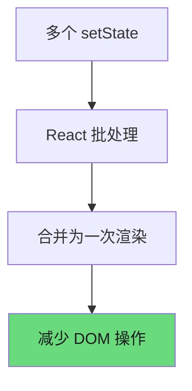
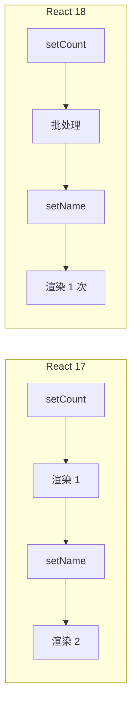
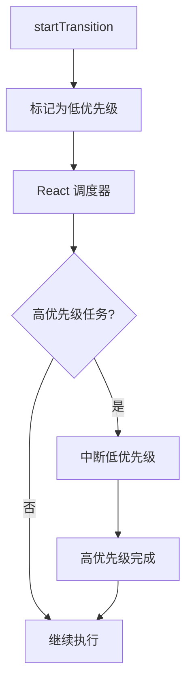
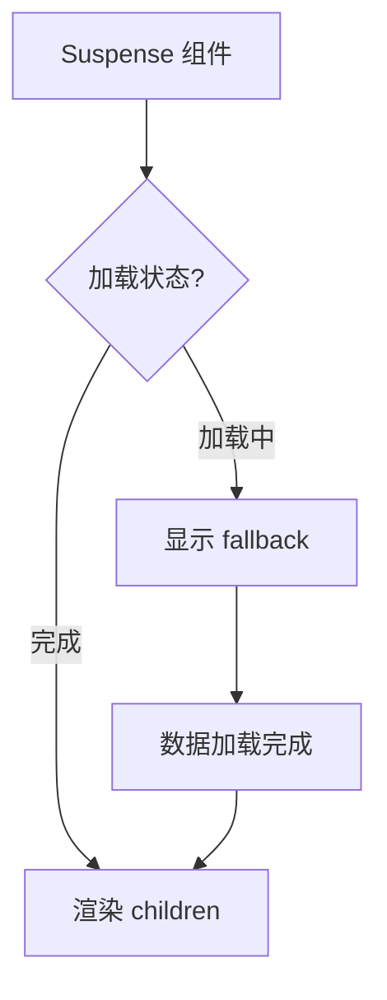
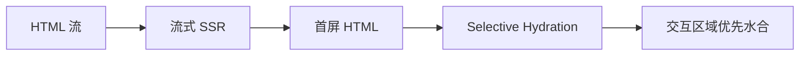
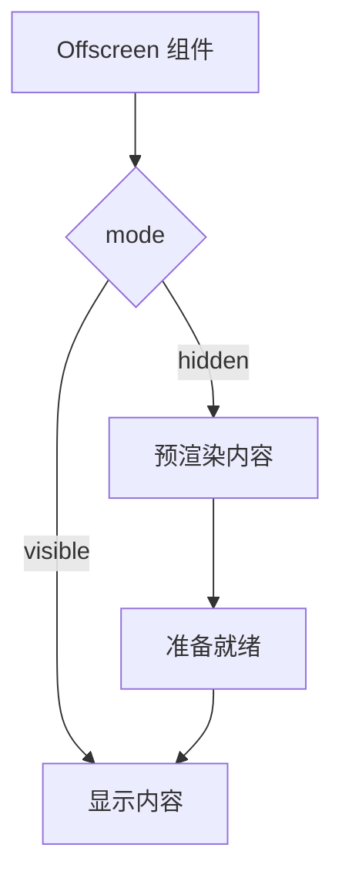

# React 18 新特性

React 18 于 2022 年 3 月正式发布，带来了革命性的并发渲染（Concurrent Rendering）能力。本文深入解析所有核心新特性。

---

## 1. Automatic Batching 详解

### 1.1 什么是批处理（batching）

批处理是 React 的一种优化机制，将多个状态更新合并为一次渲染，以减少不必要的 DOM 操作次数。



### 1.2 React 17 vs React 18 批处理差异表

| 场景 | React 17 行为 | React 18 行为 |
|------|---------------|---------------|
| 事件处理函数 | 自动批处理 | 自动批处理 |
| `setTimeout` 回调 | 不批处理，分别渲染 2 次 | 自动批处理，只渲染 1 次 |
| Promise 回调 | 不批处理，分别渲染 2 次 | 自动批处理，只渲染 1 次 |
| `fetch` 回调 | 不批处理，分别渲染 2 次 | 自动批处理，只渲染 1 次 |
| 原生事件处理 | 不批处理 | 自动批处理 |
| `flushSync` 包裹 | 立即执行，退出批处理 | 立即执行，退出批处理 |

### 1.3 代码对比

```javascript
// React 17: 仅事件处理函数内批处理
setTimeout(() => {
  setCount(c => c + 1);  // 触发一次渲染
  setName('Bob');         // 触发另一次渲染
}, 1000);

// React 18: 所有场景自动批处理
setTimeout(() => {
  setCount(c => c + 1);  // 合并，不触发渲染
  setName('Bob');        // 合并，合并后触发一次渲染
}, 1000);
```

### 1.4 执行流程对比图



### 1.5 性能收益

批处理带来显著的性能提升：

```javascript
// 之前的写法（React 17）
setTimeout(() => {
  setLoading(true);
  fetchData().then(() => {
    setLoading(false);  // 额外渲染
    setData(result);
  });
}, 1000);

// React 18 优化后
setTimeout(() => {
  setLoading(true);
  fetchData().then(() => {
    setLoading(false);  // 与下一个 setData 合并
    setData(result);    // 一起渲染
  });
}, 1000);
```

---

## 2. Concurrent Features 并发特性

React 18 引入了并发渲染，允许 React 在渲染过程中中断和恢复任务，为用户体验带来质的飞跃。

### 2.1 startTransition

`startTransition` 是标记非紧急更新的核心 API。

```javascript
import { startTransition } from 'react';

// 标记为非紧急更新
startTransition(() => {
  setSearchQuery(query);
  setSearchResults(results);
});
```

### 2.2 useTransition vs useDeferredValue 对比表

| 特性 | `useTransition` | `useDeferredValue` |
|------|----------------|---------------------|
| 用途 | 包装状态更新逻辑 | 包装派生状态值 |
| 返回值 | `[isPending, startTransition]` | `deferredValue` |
| 适用场景 | 状态更新操作 | 输入→输出的转换 |
| 控制粒度 | 粗粒度（整个更新） | 细粒度（单个值） |
| 代码示例 | `startTransition(() => setText(input))` | `const deferredText = useDeferredValue(text)` |

### 2.3 代码示例对比

```javascript
// useTransition 用法
// 第 1 段：引入并发渲染能力（React 18 才有的 Hook）
// useTransition 是 React 18 并发特性的一部分，它本身不产生任何状态，只提供"把某批更新标记为低优先级"的能力；
// 必须从 'react' 具名导入，低版本或没开并发特性时会直接报 undefined。下面代码里用到的 useState / Spinner / Results /
// computeResults 也需要各自导入或定义，示例为聚焦 useTransition 而省略了它们。
import { useTransition } from 'react';

function SearchComponent() {
  // 第 2 段：声明"紧急"与"非紧急"两套状态
  // useTransition 返回 [isPending, startTransition]：isPending 表示过渡更新是否还没提交，startTransition 是调度器。
  // 解构顺序固定，写成 [startTransition, isPending] 是常见笔误；这里 query/results 一起被降级，因为它们只服务于结果展示，
  // 而输入框的即时回显由 DOM 自己维护（见第 4 段），所以延迟它们不会让用户觉得"打字卡"。
  const [isPending, startTransition] = useTransition();
  const [query, setQuery] = useState('');
  const [results, setResults] = useState([]);

  function handleChange(e) {
    // 第 3 段：把输入引发的连锁更新降级为 transition
    // 关键认知：startTransition 的回调是"同步立即执行"的，它只改变内部 setState 的优先级，并不会把函数体丢到下一帧或 Web Worker；
    // 所以 computeResults 这段重计算依旧会阻塞主线程（真正要异步化需配 useDeferredValue / debounce / Worker）。
    // 另一个易错点：e.target 是合成事件对象，跨渲染读取有风险，稳妥做法是在 startTransition 之前先 const value = e.target.value 取出来。
    startTransition(() => {
      setQuery(e.target.value);
      setResults(computeResults(e.target.value));
    });
  }

  return (
    // 第 4 段：用 isPending 做渲染降级（保持界面的"响应感"）
    // input 是受控缺失写法（没有 value={query}），所以敲键时字符由 DOM 立刻显示，不会被低优先级更新拖慢；
    // 过渡期间渲染 Spinner，把旧结果换成 loading 提示，避免用户看到"输入已变、结果未变"的错位感。
    // 边界：若 computeResults 是同步且极快的，isPending 往往在同一个 tick 内就被清掉，Spinner 几乎闪不出来，属于正常现象。
    <div>
      <input onChange={handleChange} />
      {isPending ? <Spinner /> : <Results data={results} />}
    </div>
  );
}
```
```javascript
// useDeferredValue 用法
import { useDeferredValue } from 'react';

function SearchComponent() {
  const [query, setQuery] = useState('');
  const deferredQuery = useDeferredValue(query);
  const results = useMemo(() => {
    return computeResults(deferredQuery);
  }, [deferredQuery]);

  const isStale = query !== deferredQuery;

  return (
    <div>
      <input value={query} onChange={e => setQuery(e.target.value)} />
      <div style={{ opacity: isStale ? 0.5 : 1 }}>
        <Results data={results} />
      </div>
    </div>
  );
}
```

### 2.4 适用场景分析

| 场景 | 推荐方案 | 说明 |
|------|---------|------|
| 搜索输入，实时展示结果 | `useTransition` | 输入更新标记为非紧急 |
| 大列表渲染，数据来自 props | `useDeferredValue` | 对派生状态延迟处理 |
| 标签页切换 | `startTransition` | 整个切换作为非紧急更新 |
| 表单验证 | 不使用 | 需要立即反馈 |
| 文件上传进度 | 不使用 | 需要实时更新 |

### 2.5 并发调度流程图



---

## 3. Suspense 进阶

React 18 中的 Suspense 得到了显著增强，不再局限于代码分割。

### 3.1 配合 Data Fetching

Suspense 与 React Server Components 配合实现优雅的数据加载：

```javascript
import { Suspense } from 'react';

// 数据获取组件
function UserProfile({ id }) {
  const user = use(fetch(`/api/users/${id}`));
  return <div>{user.name}</div>;
}

// 列表组件
function UserList() {
  const users = use(fetch('/api/users'));
  return users.map(u => <UserProfile key={u.id} id={u.id} />);
}

// 页面组件
function App() {
  return (
    <Suspense fallback={<LoadingSkeleton />}>
      <UserList />
    </Suspense>
  );
}
```

### 3.2 配合 Code Splitting

```javascript
import { lazy, Suspense } from 'react';

// 第 1 段：引入代码分割所需的两个 API（这一步决定后面能做什么）
// lazy 只能在模块顶层调用，它会把「加载组件」这件事推迟到首次渲染；
// Suspense 则负责在加载期间接管渲染权，抛出并"兜住"内部的 Promise。
// 易错点：这两个名字是必须的，lazy 不能写在组件函数体里，否则每次渲染都会生成新组件类型而反复卸载重挂。

const HeavyComponent = lazy(() => import('./HeavyComponent'));

// 第 2 段：声明懒加载组件，标记出代码分割点
// 这里的 import() 是动态导入，打包器（webpack/Vite）会据此把 HeavyComponent 及其依赖拆成独立 chunk；
// 回调函数必须返回 Promise，且只在真正需要渲染时才执行一次，因此首屏 bundle 里不含它的体积。
// 边界条件：React.lazy 要求被导入模块提供 default 导出，否则运行时报错；加载失败时 Promise 被 reject，需配合 ErrorBoundary 兜底。

function App() {
  // 第 3 段：用 Suspense 边界包裹懒组件（控制加载态的作用范围）
  // Suspense 只包住 HeavyComponent，所以 fallback 的 Spinner 只在它未加载完成时出现，外层 div 立刻可渲染；
  // 若把 Suspense 提到 <div> 外面，整块 UI（含 div）都会被 fallback 顶替，页面结构会闪烁/塌陷。
  // 易错点：示例中 Spinner 并未导入，实际项目需自行引入；Suspense 只捕获"懒加载/异步数据"抛出的 Promise，不捕获普通运行时异常，异常仍要 ErrorBoundary。
  return (
    <div>
      <Suspense fallback={<Spinner />}>
        <HeavyComponent />
      </Suspense>
    </div>
  );
}
```

### 3.3 fallback 设计模式

#### 模式一：骨架屏

```javascript
function LoadingSkeleton() {
  return (
    <div className="skeleton">
      <div className="skeleton-avatar" />
      <div className="skeleton-text" />
      <div className="skeleton-text short" />
    </div>
  );
}

<Suspense fallback={<LoadingSkeleton />}>
  <Dashboard />
</Suspense>
```

#### 模式二：渐进式加载

```javascript
// 第一层：快速显示框架
<Suspense fallback={<BasicSkeleton />}>
  <CriticalContent />
</Suspense>

// 第二层：额外内容
<Suspense fallback={<null />}>
  <SecondaryContent />
</Suspense>
```

#### 模式三：流式加载

```javascript
function BlogPost() {
  // 第 1 段：组件骨架与"可独立等待"的页面结构
  // 用语义化 <article> 作为容器，内部拆成三个互不依赖的 Suspense 边界。
  // 关键意图：让加载状态按区块粒度隔离，而不是整页共用一个 loading 状态。
  // 边界条件：每个 Suspense 只"兜"自己的子树，兄弟区块的挂起不会互相阻塞。
  return (
    <article>
      // 第 2 段：页头区块——优先级最高的首屏关键内容
      // Header 通常只依赖轻量数据，最先就能渲染出来，单独设边界可让它尽早脱离骨架屏。
      // 易错点：Suspense 必须包在"会挂起的数据组件"外层；若 Header 内部没读异步数据，这里的 fallback 永远不会出现。
      <Suspense fallback={<HeaderSkeleton />}>
        <Header />
      </Suspense>
      // 第 3 段：正文区块——数据依赖最重的部分
      // ContentSkeleton 的尺寸应尽量贴近真实正文，否则内容到达时会产生布局抖动（CLS）。
      // 它独立于 Header：正文慢不影响页头先显示，这是流式渲染（streaming SSR）能分块下发的关键。
      <Suspense fallback={<ContentSkeleton />}>
        <Content />
      </Suspense>
      // 第 4 段：评论区——最不关键、往往也最慢的尾部内容
      // 评论数量不定、接口通常更慢，放最后独立兜底，避免它拖住前面已经就绪的内容。
      // fallback 组件应保持无副作用（不触发请求），因为它在重渲染路径上可能被多次挂载。
      <Suspense fallback={<CommentsSkeleton />}>
        <Comments />
      </Suspense>
    </article>
  );
}
```

### 3.4 Suspense 并发状态图



---

## 4. New Root API

React 18 引入了全新的 Root API，替代了传统的 `render` 方法。

### 4.1 API 对比

```javascript
// ============ React 17 ============
import { render } from 'react-dom';

const container = document.getElementById('root');
render(<App />, container);

// 卸载
unmountComponentAtNode(container);
```

```javascript
// ============ React 18 ============
import { createRoot } from 'react-dom/client';

const container = document.getElementById('root');
const root = createRoot(container);

// 渲染
root.render(<App />);

// 卸载（更清晰的 API）
root.unmount();
```

### 4.2 完整的初始化流程

```javascript
import { createRoot } from 'react-dom/client';

function main() {
  const container = document.getElementById('root');
  if (!container) {
    throw new Error('Root element not found');
  }

  // 创建 Root 实例
  const root = createRoot(container, {
    // 可选配置
    identifierPrefix: 'my-app',
    onRecoverableError: (error) => {
      console.error('Recoverable error:', error);
    },
  });

  // 渲染应用
  root.render(<App />);

  // 清理函数
  return () => root.unmount();
}

// TypeScript 类型
interface RootOptions {
  identifierPrefix?: string;
  onRecoverableError?: (error: Error) => void;
  transition?: Transition;
}
```

### 4.3 hydrate 变化

```javascript
// React 17
import { hydrate } from 'react-dom';
hydrate(<App />, container);

// React 18
import { hydrateRoot } from 'react-dom/client';
hydrateRoot(container, <App />);
```

---

## 5. Strict Mode 变化

React 18 的 Strict Mode 引入了开发时的双重渲染机制，帮助发现潜在问题。

### 5.1 双重渲染行为

在开发模式下，React 会故意挂载组件两次以检测副作用问题：

```javascript
import { StrictMode } from 'react';

function App() {
  console.log('渲染');  // 会打印两次
  useEffect(() => {
    console.log('副作用');  // 也会执行两次
    return () => console.log('清理');  // 清理也会执行两次
  }, []);

  return <div>Content</div>;
}

// StrictMode 会导致:
// 渲染 → 渲染 → 副作用 → 清理 → 副作用
```

### 5.2 副作用重试验证

```javascript
function DataFetcher() {
  // 第 1 段：声明组件的状态容器——数据的唯一"真相来源"
  // 初始值刻意用 null 而非 [] 或 ''，是为了让"尚未加载"和"加载到空结果"在语义上可区分；
  // 渲染层正是靠 data 的真假值来切换占位文案，所以这里的数据形状决定了后续判断方式。
  const [data, setData] = useState(null);

  // 第 2 段：挂载后发起一次异步请求，并用 isSubscribed 守卫过期响应
  // 依赖数组传 [] 表示只在挂载时执行一次；若漏掉该参数，每次渲染都会重新请求，形成死循环风险。
  // isSubscribed 是这一段的核心：fetchData 返回的 Promise 可能在组件已卸载后才 resolve，
  // 那时 setData 会触发"卸载后更新状态"告警并造成无意义的闭包常驻，守卫让结果被安全丢弃。
  useEffect(() => {
    let isSubscribed = true;

    fetchData().then(result => {
      if (isSubscribed) {
        setData(result); // 仅在组件仍存活时写入，防止迟到的响应覆盖更新的状态
      }
    });

    // 第 3 段：返回清理函数——卸载（或依赖变化重跑 effect）前把守卫关掉
    // 它相当于一个"取消订阅"开关，本质是让上面的闭包失效；
    // 易错点：它并不能真正 abort 网络请求，流量已经发出，只是拒绝消费其结果。
    return () => {
      isSubscribed = false;
    };
  }, []);

  // 第 4 段：渲染——依据 data 是否存在决定展示内容还是占位文案
  // data ? data.content : ... 利用短路求值保护了对 null 的解引用，null 时不会走到 data.content；
  // 边界条件：若接口返回 {} 这类"为真但缺字段"的对象，这里会渲染出 undefined，属于潜在坑点。
  return <div>{data ? data.content : 'Loading...'}</div>;
}
```

### 5.3 依赖检测增强

React 18 能更准确地检测依赖数组遗漏：

```javascript
// 在 React 18 Strict Mode 下更容易发现问题
function Component({ id }) {
  const [value, setValue] = useState(null);

  // 缺少依赖 [id]，React 18 会警告
  useEffect(() => {
    fetchData(id).then(setValue);
  }, []);  // ESLint 会报错

  return <div>{value}</div>;
}
```

### 5.4 Strict Mode 检查清单

| 检查项 | React 17 | React 18 |
|--------|----------|----------|
| 过期 setState 警告 | 有 | 有 |
| 意外副作用检测 | 无 | 有（双重渲染） |
| 过时的 Context API 警告 | 有 | 有 |
| 可恢复错误检测 | 无 | 有 |
| 检查不安全生命周期 | 有 | 有（增强） |

---

## 6. Client Rendering vs Streaming SSR

React 18 提供了更强大的服务端渲染能力，特别是流式 SSR。

### 6.1 renderToReadableStream

React 18 的服务端渲染使用流式 API：

```javascript
import { renderToReadableStream } from 'react-dom/server';
// 第 1 段：引入流式 SSR 渲染器
// 选 renderToReadableStream 而不是 renderToString，是为了让 React 边渲染边把 HTML 推出，
// 首字节时间（TTFB）更短，浏览器可以提前解析并开始下载 bootstrap 脚本；
// 它返回的是 Web Streams 的 ReadableStream，可直接喂给 edge runtime 的 Response。

async function handler(request) {
  // 第 2 段：请求处理入口
  // 这是典型的 edge/worker 风格 handler，签名接收 request 对象；
  // 代码里没有用到 request，说明示例只关注"渲染→响应"这条主链路，
  // 真实项目中可以从 request 取 URL、cookie、Accept-Language 等做数据预取与路由。

  const stream = await renderToReadableStream(
    <App />,
    {
      // SSR 配置
      // 第 3 段：渲染配置对象
      // 第一个参数是 React 元素树，第二个参数控制"外壳"与"注水"行为；
      // 这些选项决定客户端如何接管（hydrate）这份 HTML，配错会出现重复渲染或 hydration mismatch。

      bootstrapScripts: ['/main.js'],
      bootstrapModules: ['/module.js'],
      // 第 4 段：客户端引导资源
      // bootstrapScripts 注入经典 <script>（同步、按序执行，兼容老浏览器与 UMD 打包）；
      // bootstrapModules 注入 type="module"（defer 语义、支持 import/代码分割）；
      // 两者可共存，React 会把它们插到流末尾，需要几份就对应几套客户端入口。

      identifierPrefix: 'r18',
      // 第 5 段：ID 前缀隔离
      // React 生成的 useId、表单控件 id 都会加上 'r18' 前缀；
      // 当页面里存在多个独立 React 根（微前端、同页多实例）时，可避免 id/aria 属性撞车。

      namespace: 'HTML',
      // 第 6 段：命名空间
      // 默认按 HTML 序列化；换成 'SVG' 等可让 React 走对应命名空间的标签与属性处理，
      // 例如在自定义渲染场景下生成非 HTML 的标记。

      prologue: ['<!DOCTYPE html>'],
      // 第 7 段：文档序言
      // 把 DOCTYPE 放在流的最前端，浏览器收到后立即进入标准模式（standards mode）；
      // 若漏掉，HTML 会退化为怪异模式，盒模型与 CSS 行为都会偏离预期。

      onError: (error) => {
        console.error('SSR Error:', error);
      },
      // 第 8 段：错误兜底
      // 渲染过程中抛出的异常（含 Suspense 期间的服务端错误）会交给 onError；
      // 关键点：仅记录日志并不会中断流，React 会退回到客户端渲染（CSR fallback）；
      // 因此这里通常还要做上报/埋点，并按需决定是否返回 500。
    }
  );
  // 注意 await：renderToReadableStream 返回 Promise，解析完成时外壳 HTML 已可读，
  // 但 Suspense 边界内的内容仍会在后续 chunk 中继续流入。

  return new Response(stream, {
    headers: { 'content-type': 'text/html' },
  });
  // 第 9 段：构造响应
  // 直接把 ReadableStream 作为 body 交给平台，实现边生成边发送（chunked transfer）；
  // content-type 必须显式带上 charset（这里省略，边缘平台一般默认 utf-8），
  // 否则中文等非 ASCII 内容在部分浏览器上会乱码。
}
```

### 6.2 Progressive Hydration 渐进式水合



### 6.3 实现示例

```javascript
// 服务端：流式 SSR
// 第 1 段：引入流式渲染入口（用 Web Streams 而非一次性字符串）
// renderToReadableStream 与 renderToString 的本质差别：后者必须等整棵 React 树渲染完
// 才返回字符串，前者先吐出 <head> 与首屏 shell，浏览器可以立刻开始解析 HTML、预加载资源。
// 因此它的返回值是 Promise<ReadableStream>，在"shell 就绪"时就 resolve，而不是页面渲染完毕。
import { renderToReadableStream } from 'react-dom/server';

// 第 2 段：请求处理函数——把一次请求渲染成一个可读流
// 函数声明为 async，是因为上一段的 Promise 需要 await 才能拿到流；
// 但要注意语义：await 完成 ≠ 整页渲染完成，Suspense 边界内的内容会在流后续 chunk 中陆续补上。
// 数据流：request.url → 传给 <App> 做路由/数据决策 → 渲染结果写入 stream。
async function ssrHandler(request) {
  // 显式把 request.url 透传给组件：SSR 阶段没有浏览器 location，
  // 若组件内部各自去读全局 location，服务端与客户端 hydrate 时可能拿到不同结果而报 hydration 不一致。
  const stream = await renderToReadableStream(<App url={request.url} />, {
    // bootstrapScripts 会被注入到流式 HTML 中，让客户端下载 /client.js 并 hydrateRoot 接管这份 DOM。
    // 这是"流式 SSR 能继续交互"的开关：漏掉它，页面只是一坨看起来正常的死 HTML。
    bootstrapScripts: ['/client.js'],
  });

  // 第 3 段：把 ReadableStream 包装成 HTTP 响应，交给运行时边读边写
  // 直接返回流，运行时（undici/Node、Workers 等）会随 chunk 到达即刻写出，
  // 于是 TTFB 从 O(整页渲染时间) 降到 O(shell 渲染时间)，长尾数据不再阻塞首屏。
  return new Response(stream, {
    headers: {
      // 必须显式声明 text/html：Web Streams 本身不携带 MIME 信息，
      // 缺失时浏览器可能按 text/plain 处理，把 HTML 原样当文本显示出来。
      'content-type': 'text/html',
      // 易错点：transfer-encoding 属于"禁止由脚本设置的头部"，
      // 在 undici/浏览器 fetch 中常被静默忽略，chunked 由运行时自动协商，这里保留仅为语义表达。
      // 真正会毁掉流式效果的是反向代理（Nginx proxy_buffering、CDN）开启响应缓冲，
      // 它会攒完整页才下发——上线前务必确认代理层放行了分块传输。
      'transfer-encoding': 'chunked',
    },
  });
}
```
```javascript
// 客户端：hydrateRoot
import { hydrateRoot } from 'react-dom/client';
import { startTransition } from 'react';

const root = hydrateRoot(document, <App />, {
  onRecoverableError: console.error,
});
```

---

## 7. Offscreen API (实验阶段)

Offscreen API 允许组件在不可见时进行预渲染，为未来内容做准备。

### 7.1 Preparation 模式

```javascript
import { Offscreen } from 'react';

function App() {
  const [showPanel, setShowPanel] = useState(false);

  return (
    <div>
      <button onClick={() => setShowPanel(true)}>
        打开面板
      </button>

      {/* hidden 模式：预渲染内容，不显示 */}
      <Offscreen mode="hidden">
        <HeavyPanel />
      </Offscreen>

      {/* visible 模式：实际显示内容 */}
      {showPanel && (
        <Offscreen mode="visible">
          <HeavyPanel />
        </Offscreen>
      )}
    </div>
  );
}
```

### 7.2 预加载资源

```javascript
// 第 1 段：导入整段预加载方案所依赖的实验性组件 Offscreen
// Offscreen 的核心价值是把「渲染/挂载」与「显示到布局中」解耦：mode="hidden" 时 React 仍然
// 会构建这棵子树（副作用可以跑、请求可以发、缓存可以写），但它的结果不会参与可见布局与绘制。
// 易错点：Offscreen 属于实验特性（后续版本更名/演进为 Activity），不是稳定公共导出，线上使用需加兜底。
// 另注：本文件后面用到了 useState 却没有一并导入，这是原始代码的缺陷，注释不改动任何代码。
import { Offscreen } from 'react';

// 第 2 段：把「预加载」收敛成一个声明式的可复用函数 preloadRoute
// 为什么这样写：不做命令式的 loader(path) 调用，而是让 Offscreen 在后台真的挂载组件树，
// 于是组件自身的副作用逻辑（拉数据、prefetch 代码块、填充缓存）会自然执行，无需额外接口。
// 数据流：path 同时喂给 LinkPreview（预取链接元信息/悬停卡片）与 RouteCache（把路由模块与
// 数据写入缓存），两者共用同一个隐藏容器，保证挂载与销毁的时机完全一致。
// 边界条件：本函数只负责「造出预加载树」，并不返回/暴露任何缓存句柄，调用方需要自己渲染它。
function preloadRoute(path) {
  return (
    <Offscreen mode="hidden">
      <LinkPreview path={path} />
      <RouteCache path={path} />
    </Offscreen>
  );
}

// 第 3 段：NavLink —— 把「预加载」接到真实用户行为（鼠标悬停）上的交互组件
// 融合原有注释：鼠标悬停时预加载
// 设计要点：preload 是单向触发器，初始 false 表示零额外渲染成本；一旦为 true 就不回退，
// 避免鼠标在子元素间来回移动时反复挂载/卸载预加载树，造成抖动与重复请求。
// 说明：下面 JSX 内部不能再插入 `//` 行注释（JSX 文本位会被当作内容，属于语法/渲染错误），
// 因此把关键行说明集中写在 return 之前：
//  · onMouseEnter 用于代替 onMouseOver：前者不冒泡、仅在指针进入自身时触发一次，
//    后者会在子元素间穿行时反复触发，导致大量无谓的 setState。
//  · {preload && ...} 是短路渲染，第一次悬停才真正把隐藏子树挂进树里，之后一直保留。
//  · 易错点：这里隐藏子树里放的是裸字符串 {to}，并没有渲染 preloadRoute/LinkPreview，
//    所以它只产生一个文本节点、并不会真正预取数据；正确写法应是把预加载组件放进 Offscreen。
function NavLink({ to, children }) {
  const [preload, setPreload] = useState(false); // 一次性开关：false → true，用于把预加载绑定到首次悬停

  return (
    <div onMouseEnter={() => setPreload(true)}>
      <a href={to}>{children}</a>
      {preload && <Offscreen mode="hidden">{to}</Offscreen>}
    </div>
  );
}

// 第 4 段（整体回顾）：两段代码的耦合关系与复杂度
// 时间/空间复杂度都是 O(1) 的额外状态开销，真正的成本被推迟到 Offscreen 内部挂载的组件上，
// 即「用空间（保留一棵隐藏子树）换取交互时的零等待」。
// 遗留问题：preloadRoute 定义后未被任何地方调用，NavLink 的悬停路径也没复用它，
// 所以当前实现只是骨架，实际收益取决于把 preloadRoute(to) 接到 preload 为 true 的分支上。
```

### 7.3 API 参考

| 属性 | 类型 | 说明 |
|------|------|------|
| `mode` | `'visible' \| 'hidden'` | 显示或预渲染模式 |
| `children` | ReactNode | 子组件 |

### 7.4 技术原理图



---

## 8. 总结

React 18 的核心改进：

| 特性 | 主要收益 |
|------|---------|
| Automatic Batching | 减少渲染次数，提升性能 |
| Concurrent Features | 保持 UI 响应，避免卡顿 |
| Suspense 增强 | 优雅的数据加载体验 |
| New Root API | 更清晰的架构 |
| Strict Mode 增强 | 更可靠的代码 |
| Streaming SSR | 更快的首屏加载 |
| Offscreen API | 预加载未来内容 |

### 8.1 迁移检查清单

- [ ] 更新 React 和 React DOM 到 18.x
- [ ] 将 `render()` 迁移到 `createRoot()`
- [ ] 移除 `unmountComponentAtNode`，改用 `root.unmount()`
- [ ] 检查 setTimeout/Promise 中的状态更新
- [ ] 在适当场景使用 `startTransition`
- [ ] 启用 Strict Mode 发现潜在问题
- [ ] 测试 Suspense 边界行为

---

**延伸阅读**

- [React 18 官方博客](https://react.dev/blog/2022/03/29/react-v18)
- [并发渲染文档](https://react.dev/learn/concurrent-rendering)
- [useTransition API](https://react.dev/reference/react/useTransition)

## 深入阅读与参考

!!! tip "怎么用这些资料"
    先读「官方文档与规范」建立准确的概念，再读「源码与示例」核对细节，最后用「教程、书籍与视频」换一种讲法加深理解。每条都写明了读哪一节、带着什么问题读。

### 官方文档与规范

| 资源 | 为什么读 | 怎么读 |
|---|---|---|
| [createRoot](https://react.dev/reference/react-dom/client/createRoot) | New Root API 的权威定义，含 createRoot 与旧 ReactDOM.render 的差异说明。 | 重点读 Usage 与 Caveats；带着“为什么必须换根 API”读，再用 createRoot 改写一个旧入口。 |
| [hydrateRoot](https://react.dev/reference/react-dom/client/hydrateRoot) | hydration 与客户端渲染的官方说明，直接对应 Streaming SSR 一节。 | 读 hydrateRoot 参数与 hydrateRoot 注意事项，对照服务端输出决定何时用 hydrate 而非 render。 |
| [<Suspense>](https://react.dev/reference/react/Suspense) | Suspense 进阶必读，讲清了 fallback、边界与并发渲染的配合。 | 读“Revealing content together”与“Nested Suspense”，再用两个嵌套边界实测加载顺序。 |
| [Server-Side Rendering (SSR)](https://vite.dev/guide/ssr) | 官方 SSR 指南，串起服务端渲染、hydration 与流式输出的完整流程。 | 按步骤搭一遍 renderToString 与 renderToPipeableStream 两种服务端代码，比较首屏时间。 |
| [Async Rendering and SSR “Modes”](https://book.leptos.dev/ssr/23_ssr_modes.html) | 深入讲 SSR 各渲染模式的取舍，理解并发特性如何在服务端生效。 | 读各 Mode 的适用场景表，判断自己项目该用哪种，并在小结里记下取舍理由。 |
| [useTransition](https://react.dev/reference/react/useTransition) | 并发特性最常用的入口，解释不阻塞 UI 的状态更新。 | 读 isPending 与 transition 用法，把一次列表筛选改成非阻塞更新并观察输入是否卡顿。 |
| [Server React DOM APIs](https://react.dev/reference/react-dom/server) | 流式 SSR 相关 API 的官方索引，是 Client vs Streaming 对比的依据。 | 逐个看 renderToPipeableStream 的选项与返回值，列出与 renderToString 的能力差异表。 |
| [Static React DOM APIs](https://react.dev/reference/react-dom/static) | 静态预渲染与流式输出的官方说明，补齐 SSR 之外的第三种交付方式。 | 读 prerender 与 static 系列 API 的适用条件，判断本站哪些页面可以预渲染成静态壳。 |
| [React Labs: View Transitions, Activity, and more](https://react.dev/blog/2025/04/23/react-labs-view-transitions-activity-and-more) | Activity（原 Offscreen）最新进展，实验特性一章的权威来源。 | 读 Activity 与 View Transitions 两节，记录它与 React 18 Offscreen 设计目标的异同。 |

### 源码与示例

| 资源 | 为什么读 | 怎么读 |
|---|---|---|
| [ReactDOMRoot.js](https://github.com/facebook/react/blob/main/packages/react-dom/src/client/ReactDOMRoot.js) | createRoot/hydrateRoot 的实现入口，看清根对象如何被创建。 | 从 createRoot 追到 createContainer，带着“根对象存了什么”读，画出调用链简图。 |
| [ReactDOMClient.js](https://github.com/facebook/react/blob/main/packages/react-dom/src/client/ReactDOMClient.js) | 客户端导出面源码，一屏看清 18 新增了哪些 API。 | 对比导出列表与官方 API 文档，标出 18 新增项，确认 Automatic Batching 相关入口在何处。 |

### 教程、书籍与视频

| 资源 | 为什么读 | 怎么读 |
|---|---|---|
| [Josh Comeau：The Perils of Rehydration](https://www.joshwcomeau.com/react/the-perils-of-rehydration/) | 讲透 hydration mismatch 的成因与修复，比官方文档更贴近实战。 | 在自己的 SSR 页面里故意制造一次不一致，按文中排查思路定位并修掉。 |
| [React Fiber 架构笔记](https://github.com/acdlite/react-fiber-architecture) | 用通俗语言讲 Fiber 与可中断渲染，是理解并发特性的前置知识。 | 读 work loop 一节后自己画调度流程图，再回看 useTransition 为什么会“可中断”。 |

## 应用与行业实践

前面章节讲清了 React 18 的机制。这一章回答两个问题：这些机制在哪些真实页面里用得上，以及落地时怎么验证收益、怎么避免踩坑。

### 应用场景地图

| 场景 | 用到本页哪个知识点 | 典型技术选型 | 注意事项 |
| --- | --- | --- | --- |
| 后台管理的万行表格筛选 | Concurrent Features（useTransition / useDeferredValue） | React + 虚拟列表组件 | 过渡更新只降低优先级，不减少计算量；纯计算过重时仍要分片或移到 Worker |
| 低端安卓机上的商品详情首屏 | Streaming SSR + Suspense + New Root API | Node + renderToPipeableStream + hydrateRoot | 客户端必须用 hydrateRoot 水合，顺序与流式 HTML 一致 |
| 多人协作白板 | Concurrent Features | WebSocket + 状态库 + Canvas 自绘 | 拖拽过程要求即时反馈，不能被 startTransition 打断 |
| WebSocket 推送的实时看板 | Automatic Batching | createRoot + 原生 WebSocket | 不要在同一次回调里用 flushSync 破坏合并 |
| 电商详情页的慢接口区块 | Suspense + Streaming SSR | Next.js App Router 或自建流式服务 | 每个边界要配错误兜底，单接口失败不能让整段内容消失 |
| 搜索框联想输入 | useDeferredValue | 受控输入 + 结果列表 | 延迟值只作用于列表，不能作用到输入框的 value |
| 老项目升级到 React 18 | New Root API + Strict Mode 变化 | createRoot 替换 ReactDOM.render | 开发环境挂载两次，副作用清理函数必须补齐 |
| 标签页与弹窗内容的预渲染 | Offscreen API（实验阶段） | 官方实验分支 | 实验 API 不稳定，生产依赖前需核对官方文档：当前导出名与启用开关 |

### 三个场景拆解

#### 场景 1：后台管理的万行表格筛选

**业务背景**

运营后台的订单表常有上万行，筛选框每敲一个字符就重新过滤全量数据。连续输入时输入框回显滞后，用户会感到丢字，键盘连打时列表闪烁。

**怎么用本页知识解决**

思路是把"输入框回显"和"列表重算"拆成两种优先级：回显走紧急更新，过滤走过渡更新，新的按键可以打断尚未完成的过滤。数据量超过可视区时，还需要虚拟列表只渲染可见行，否则过渡更新节省的只是调度时间，不是渲染时间。

```jsx
import { useState, useTransition } from 'react';
function OrderTable({ rows }) {
  const [keyword, setKeyword] = useState('');   // 输入框即时值，保证回显
  const [filter, setFilter] = useState('');     // 过渡值，驱动重列表
  const [isPending, startTransition] = useTransition();
  function onChange(e) {
    const value = e.target.value;
    setKeyword(value);                          // 紧急更新：先显示字符
    startTransition(() => setFilter(value));    // 过渡更新：可被下次输入打断
  }
  const shown = rows.filter((r) => r.orderNo.includes(filter));
  return (
    <>
      <input value={keyword} onChange={onChange} />
      <RowCount count={shown.length} pending={isPending} />
      <VirtualList rows={shown} />
    </>
  );
}
```

- setKeyword 与 setFilter 分开，输入框的显示不等过滤结果。
- startTransition 只包住 setFilter，回显永远保持紧急优先级。
- isPending 用来把结果行数标成半透明，提示"数字还在更新"。
- 过滤逻辑放在渲染函数里，行数上万时先用 useMemo 缓存按首字母分桶的结果，再逐桶过滤。
- 如果列表已经用虚拟列表只渲染 20 行，过渡更新的收益主要来自调度，不是 DOM 数量。

**怎么度量收益**

打开 React DevTools Profiler，录制一段连续输入 10 个字符的操作，对比开启前后 input 组件的 commit 次数与最长单次 commit 时长。再用 Chrome DevTools 的 Performance 面板录制同一段操作，看主线程长任务的数量与时长。线上用 web-vitals 采集 INP，按设备型号分组对比。

**什么时候不该用**

- 输入内容要即时校验并给出结论（例如"该编号已被占用"），把校验放进过渡更新会让用户看到过期结论。
- 列表只有几十行、过滤耗时低于一帧时，加过渡更新只增加状态分支，没有观测到丢帧就不要加。

#### 场景 2：低端安卓机上的商品详情首屏

**业务背景**

详情页首屏依赖主信息、评论数、推荐位三个接口，其中一个接口偶发变慢。整页等齐再返回 HTML，会把首屏时间拉到最慢接口的水平，低端安卓机上表现最差。

**怎么用本页知识解决**

思路是先返回页面外壳，让用户看到导航、标题和骨架，慢接口的数据在服务端就绪后继续通过同一条响应补发，客户端用 hydrateRoot 接管。被 Suspense 包住的区块是补发的单位，边界划分决定了首屏能提前多少。

```jsx
// server.js：先发首屏外壳，慢数据后补
import { renderToPipeableStream } from 'react-dom/server';
import App from './App';
export function handler(req, res) {
  const { pipe, abort } = renderToPipeableStream(<App />, {
    bootstrapScripts: ['/main.js'],      // 客户端入口，用于水合
    onShellReady() {                     // 外壳就绪即发送，不等慢接口
      res.statusCode = 200;
      res.setHeader('Content-Type', 'text/html');
      pipe(res);
    },
    onShellError() { res.statusCode = 500; res.end('<!doctype html>错误页'); },
    onError(err) { console.error('降级片段', err); },  // 记录被降级的边界
  });
  setTimeout(abort, 10000);              // 超时兜底，避免连接悬挂
}
```

- onShellReady 里才开始 pipe，说明外壳已可渲染，慢区块仍是占位状态。
- bootstrapScripts 指向客户端入口，浏览器拿到外壳后即可开始水合。
- onError 记录被降级的边界，便于判断是哪个接口拖慢了补发。
- setTimeout 配合 abort 做过期放弃，避免慢接口把连接长期占住。
- 服务端不要在这里调用会阻塞事件循环的同步计算，流式输出依赖事件循环及时把数据写出去。

**怎么度量收益**

用 Lighthouse 跑移动端配置，对比 LCP 与 TBT。在 Chrome DevTools 的 Network 面板看文档请求的响应首字节时间与内容逐步到达的时间点。服务端记录 onShellReady 触发时刻到 pipe 结束时刻的差值，用于定位是外壳慢还是补发慢。线上用 web-vitals 上报 LCP，按网络类型分组。

**什么时候不该用**

- 页面内容之间有强顺序依赖（例如先算出价格才能决定展示哪个套餐），拆出外壳会把布局跳动暴露给用户。
- 客户端仍在用 ReactDOM.render 而没有改成 hydrateRoot，流式 HTML 与水合结果不一致时会触发整树重渲染，收益反转为损失。

#### 场景 3：WebSocket 推送的实时看板

**业务背景**

运营看板通过 WebSocket 每 500 毫秒收一条指标消息，一条消息里包含订单数、GMV、告警列表三个字段。升级前每条消息触发三次渲染，滚动时能观察到掉帧。

**怎么用本页知识解决**

思路是让同一次回调里的多次 setState 合并成一次提交，并把订阅与清理写对，保证 Strict Mode 下的双次挂载不会留下重复连接。代码结构不需要大改，收益来自 React 18 把批量范围扩展到了原生回调与定时器。

```jsx
import { useState, useEffect } from 'react';
function Dashboard() {
  const [orders, setOrders] = useState(0);
  const [gmv, setGmv] = useState(0);
  const [alerts, setAlerts] = useState([]);
  useEffect(() => {
    const ws = new WebSocket('/metrics');
    ws.onmessage = (e) => {
      const m = JSON.parse(e.data);
      setOrders(m.orders);   // 同一次回调里的三次更新
      setGmv(m.gmv);         // React 18 会把它们合并成一次渲染
      setAlerts(m.alerts);
    };
    return () => ws.close(); // StrictMode 会挂载两次，清理必须幂等
  }, []);
  return <Cards orders={orders} gmv={gmv} alerts={alerts} />;
}
```

- 三次 setState 在原生事件回调里，React 18 默认合并为一次提交。
- 清理函数必须调用 ws.close()，否则开发环境会留下第二条连接。
- 不要在回调里调用 flushSync 读取刚更新的 DOM，那会放弃合并。
- 告警列表如果要做入场动画，把动画状态与数据状态分开，避免动画触发额外渲染。
- 推送频率远高于屏幕刷新率时，先在回调外做节流，批量解决的是渲染次数，不是消息数量。

**怎么度量收益**

在 React DevTools Profiler 里录制 10 秒，数一次 onmessage 对应几次 commit，期望是一次。用 Chrome DevTools Performance 录制同段时间，看长任务数量与掉帧区间。线上可以在消息回调首尾打 performance.now()，统计回调到下一次绘制之间的间隔分布。

**什么时候不该用**

- 需要在同一事件里同步读取更新后的布局尺寸（例如测量新插入行的宽度），这时必须用 flushSync 强制同步提交，批量会把读取时机推迟。
- 消息本身已经按帧率节流、每次只更新一个 state 时，批不批没有差别，不必为此改动组件结构。

### 行业先进实践

**用 createRoot 与 hydrateRoot 替换 legacy 入口（出处：React 官方文档 React DOM Client）**

官方明确把 ReactDOM.render 标记为 legacy，新的根 API 才能启用并发渲染与自动批处理。做法是把入口文件的创建根节点调用一次替换掉，同时把水合路径改成 hydrateRoot。你的项目可以先用单页试用，确认没有依赖 legacy 行为的第三方组件再全量替换。

**流式 SSR 与 Suspense 边界配合（出处：React 官方文档 renderToPipeableStream）**

官方文档给出的模式是：用 renderToPipeableStream 渲染，在 onShellReady 里 pipe，慢数据区块用 Suspense 包住。这种分工让外壳与慢区块分两批到达浏览器，首字节时间不再受最慢接口支配。借鉴时先给每个 Suspense 边界写明确的 fallback 与错误兜底，再决定边界粒度。

**按路由段流式输出（出处：Next.js 官方文档 App Router 与 Streaming）**

Next.js App Router 把路由段与 Suspense 边界结合起来，loading 文件就是该段的流式占位。这样团队不需要手写 Node 层的 pipe 逻辑，边界位置由目录结构决定。自建流式服务的项目可以参考它的边界划分方式：先按数据依赖分组，再把不互相阻塞的组拆成独立边界。

**用 Strict Mode 双调用暴露不纯副作用（出处：React 官方文档 StrictMode）**

开发环境下 Strict Mode 会对组件进行额外的挂载与卸载，用来暴露缺少清理、在渲染中写外部变量这类问题。有效的原因是它把偶发问题变成了稳定复现。借鉴方式是在开发与 CI 环境保持 Strict Mode 开启，把控制台报出的清理缺失当作阻塞合并的问题处理。

**用 Profiler 与 DevTools 量化交互耗时（出处：React 官方文档 Profiler 与 React DevTools）**

官方提供的 Profiler 组件与 DevTools 的 Profiler 面板可以按 commit 记录渲染耗时，并支持在录制中看到"哪些组件重新渲染"。有效的原因是它把主观的"卡"变成可对比的 commit 时长与次数。你的项目可以在关键交互路径上临时包裹 Profiler，把录制结果附在性能相关的合并请求里。

**Offscreen 类预渲染能力的生产可用边界（需核对官方文档：react.dev 中该实验能力的当前导出名与启用开关）**

页面里提到的 Offscreen 属于实验阶段，导出名与启用方式在版本之间发生过变化。要做标签页预渲染时，先核对官方文档确认当前版本的 API 名称与稳定程度，再决定是否在生产使用。没核对清楚之前，用条件渲染加状态保留的方式实现，避免把实验 API 写进主干。

### 从学到用：落地路线

1. **试点**：选一个交互明确、可回滚的页面（例如后台的筛选表格），只改这一个页面的渲染入口与交互优先级。
   验收标准：该页面在开发环境使用 createRoot，且交互路径上有一处 startTransition 或 useDeferredValue。

2. **验证**：用 Profiler 录制试点页面改动前后的同一段操作，记录 commit 次数与最长 commit 时长，并采集一份线上 INP 基线。
   验收标准：改动前后各有可复现的录制文件，指标记录在同一个文档里，结论与录制一致。

3. **推广**：把验证通过的写法整理成团队约定，更新代码模板与代码评审清单，按页面分批替换渲染入口。
   验收标准：模板文件已更新，评审清单里有可勾选的检查项，新增页面不再出现 ReactDOM.render。

4. **防回退**：在持续集成里加静态检查与性能回归检查，拦截 legacy 入口与缺失清理函数的提交。
   验收标准：提交包含 ReactDOM.render 时流水线失败；关键页面的性能录制结果超出基线阈值时给出告警。

### 动手作业

**目标**

把一个已有的中等规模列表页面升级到 React 18 的并发渲染路径，并用可复现的方式量化输入卡顿的改善。

**步骤**

1. 准备一个包含 5000 行以上数据的列表页面，带一个文本筛选输入框，记录当前代码的提交哈希。
2. 把渲染入口从 ReactDOM.render 换成 createRoot。
3. 在开发环境打开 Strict Mode，修掉控制台报出的清理缺失问题。
4. 用 React DevTools Profiler 录制连续输入 10 个字符的操作，保存改动前的录制结果。
5. 把筛选状态拆成显示值与过滤值，用 useTransition 包住过滤更新，用 isPending 标记列表状态。
6. 再次录制同一段操作，比较两次录制的 commit 次数与最长 commit 时长。
7. 在筛选逻辑前加一层分桶缓存，重复第 5、6 步，观察指标是否出现新的变化。

**验收标准**

- 输入框在连续输入 10 个字符的过程中，字符回显与按键一一对应，没有丢字。
- 改动后的录制里，一次按键对应一次紧急提交与至多一次过渡提交，且过渡提交可被后续按键打断。
- 开发环境控制台在 Strict Mode 下没有清理缺失相关的报错。
- 筛选结果数量在列表中显示正确，且显示值在更新期间有可辨识的标记。
- 交付物包含两次录制文件、一份指标对比说明，以及未采用改动的反例说明（在什么条件下该页面不适合用过渡更新）。

