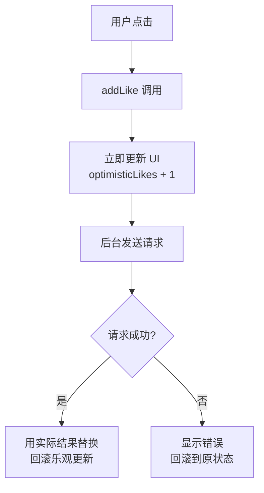
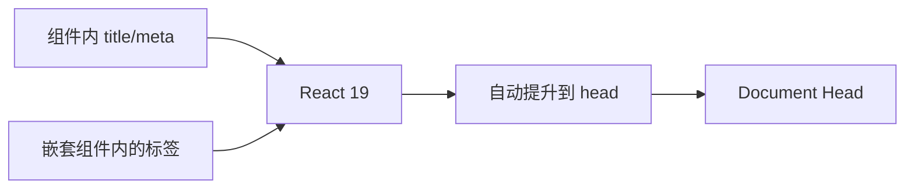
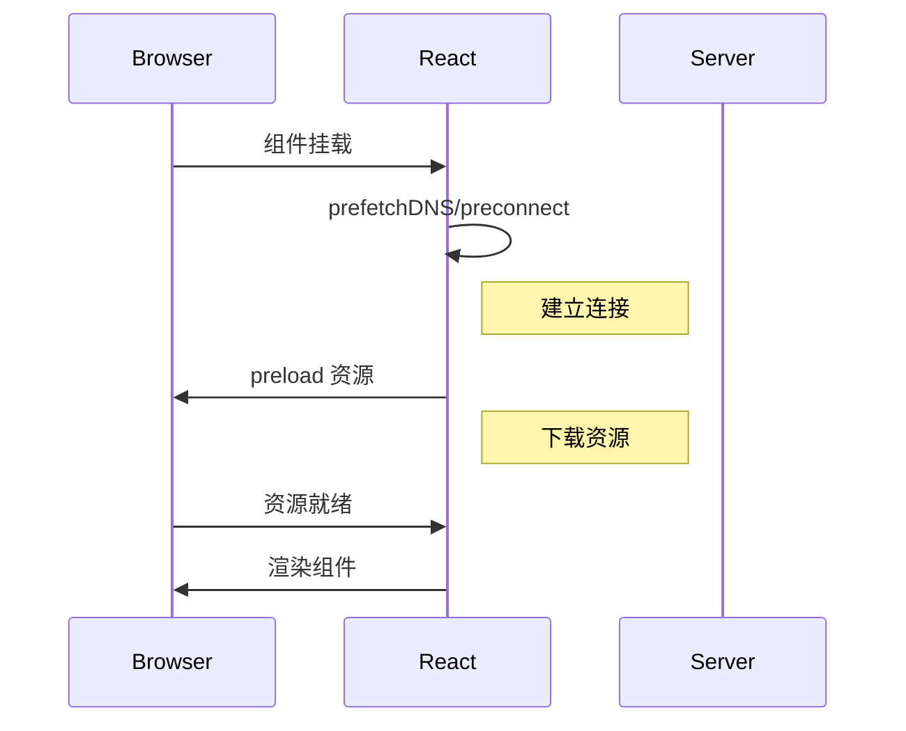
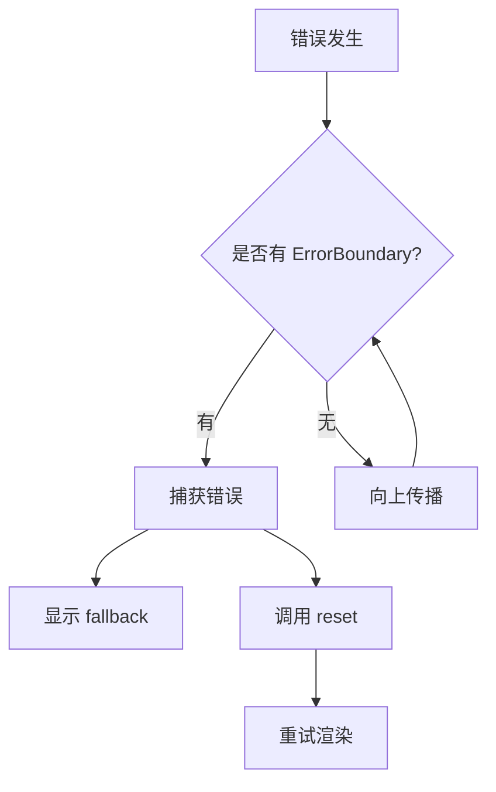
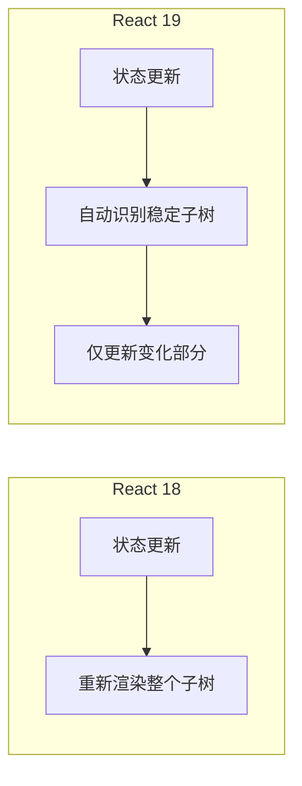
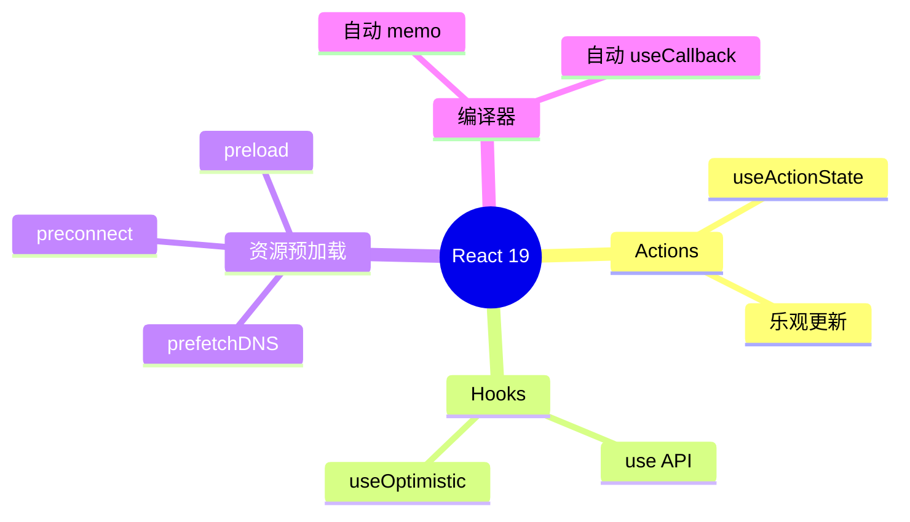
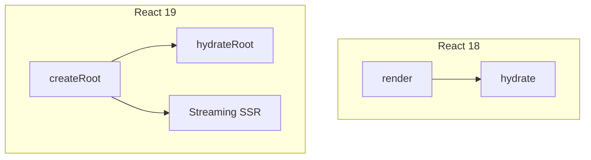
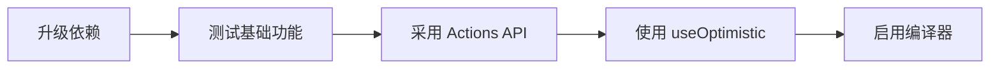

# React 19 新特性

> 本文档涵盖 React 19 的核心新特性，包括 Actions、新的 Hooks、资源预加载、错误边界改进等内容。
>
> **注意：** React 19 部分特性仍处于试验阶段，生产环境使用前请查阅官方文档确认稳定性。
>
> **最后更新：** 2026-05-15 | **版本：** 1.0 | **覆盖：** Actions / useOptimistic / use() / 资源预加载 / 错误边界

---

## 1. Actions 与 Pending States

### 1.1 useTransition 的新 API

React 19 增强了 `useTransition`，使其能够自动管理 pending 状态，不再需要手动维护加载状态。

```javascript
import { useTransition } from 'react';

// React 19：isPending 由 useTransition 自动管理
function Search() {
  const [isPending, startTransition] = useTransition();
  const [query, setQuery] = useState('');

  function handleSearch(e) {
    startTransition(() => {
      setQuery(e.target.value);
      // 异步操作会自动标记为过渡更新
      fetchResults(e.target.value);
    });
  }

  return (
    <div>
      <input onChange={handleSearch} />
      {isPending && <Spinner />}
      {/* 结果列表会自动在 pending 期间显示加载状态 */}
      <Results query={query} />
    </div>
  );
}
```

### 1.2 Pending 状态自动管理

传统方式需要手动管理 loading 状态，React 19 简化了这一流程：

```javascript
// 传统方式（React 18）
const [isLoading, setIsLoading] = useState(false);

async function handleSubmit(e) {
  e.preventDefault();
  setIsLoading(true);
  try {
    await submitForm(data);
  } finally {
    setIsLoading(false);
  }
}

// React 19：useActionState 自动处理 pending 状态
import { useActionState } from 'react';

function Form() {
  const [state, formAction, isPending] = useActionState(
    async (previousState, formData) => {
      const result = await submitForm(Object.fromEntries(formData));
      return result;
    },
    null  // 初始状态
  );

  return (
    <form action={formAction}>
      <input name="email" type="email" />
      <button type="submit" disabled={isPending}>
        {isPending ? '提交中...' : '提交'}
      </button>
      {state?.error && <p className="error">{state.error}</p>}
    </form>
  );
}
```

### 1.3 乐观更新模式

React 19 引入了 `useOptimistic`，支持乐观更新（Optimistic UI）模式：

```javascript
// 乐观更新：立即显示预期结果，后台异步处理
// 如果失败则回滚到实际状态
function LikeButton({ likes, onLike }) {
  const [optimisticLikes, addLike] = useOptimistic(
    likes,
    (state, newLike) => state + newLike
  );

  async function handleLike() {
    addLike(1);  // 立即更新 UI
    try {
      await submitLike();
    } catch {
      // 失败时自动回滚（由 useOptimistic 处理）
    }
  }

  return <button onClick={handleLike}>{optimisticLikes} 赞</button>;
}
```

---

## 2. useOptimistic Hook

```javascript
// React 19 新 Hook 签名
function useOptimistic<T>(
  initialState: T,
  updateFn: (state: T, ...args: any[]) => T
): [T, (...args: any[]) => void];
```

### 2.1 基本用法

```javascript
// 第 1 段：依赖导入——把服务端调用抽到 ./actions，组件只关心"何时调用"与"何时回显"
// 这样做的好处是网络层可被替换/打桩测试；useOptimistic 是 React 19 的内置 Hook，
// 它的定位是"把乐观态叠加到真值之上"，而不是自己再存一份状态副本。
import { useOptimistic, useState } from 'react';
import { createTodo, updateTodo } from './actions';

function TodoList() {
  // 第 2 段：状态设计——todos 是"服务端已确认"的真值源，乐观列表是它的叠加视图
  // 只有请求成功才会调用 setTodos，因此 todos 天然代表"已落库的真实数据"，
  // 真值源与乐观层分离，是这套模式能自动回滚的前提。
  const [todos, setTodos] = useState([]);
  // useOptimistic(baseState, reducer)：第一个参数是基础状态，第二个参数描述"一次乐观操作如何叠加到基础状态上"
  // 关键机制：addOptimisticTodo 并不会真的改写 todos，它只在当前这次 action/transition 进行期间临时生效；
  // 一旦 todos 被更新、或该次 action 结束，乐观叠加层就自动消失 —— 这正是"失败即回滚"的实现方式，无需手写回滚逻辑。
  const [optimisticTodos, addOptimisticTodo] = useOptimistic(
    todos,
    // reducer 的入参是 (当前基础状态, addOptimisticTodo 传入的那个值)，每次乐观更新都会重新执行一次
    // 用 id: Date.now() 造临时 key 是为了让 React 立刻能渲染出新行；副作用是同一毫秒内连续添加会产生重复 key
    // 易错点：这里的 newTodo 是下面传入的整个对象 { id, text, pending }，而非纯文本，
    // 于是 text 字段实际被赋成了对象 —— 渲染 {todo.text} 会抛 "Objects are not valid as a React child"，
    // 示例中应写成 text: newTodo.text（同时保留 newTodo.id 作为 key）。
    (state, newTodo) => [...state, { id: Date.now(), text: newTodo, pending: true }]
  );

  // 第 3 段：提交新待办——先乐观入列换取即时反馈，再等服务端回执落库；失败时"不做事"即完成回滚
  // （handleAddTodo 目前只被定义、未在下方 JSX 中调用，交给后续的表单/按钮触发。）
  async function handleAddTodo(text) {
    // 显式构造一份乐观项，形状必须与上面 reducer 的预期严格对齐（同一份数据结构被两处使用，这是最容易走偏的地方）
    const optimisticTodo = { id: 'temp', text, pending: true };
    // 触发乐观更新：必须在 action/transition 上下文中调用，直接写在事件处理器（或其中的同步前缀）里是合法的；
    // 在 await 之后再调用则会脱离 action 上下文，React 会告警甚至丢弃这次更新。
    addOptimisticTodo(optimisticTodo);

    try {
      // await 的这段时间里，UI 早已渲染出这条 pending 项，用户感知到的延迟趋近于 0
      const created = await createTodo(text);
      // 只有拿到服务端返回的"带真实 id"的记录后才写回真值源；
      // 用函数式更新 prev => [...] 是必要的：并发多次提交时都基于最新快照追加，避免相互覆盖。
      setTodos(prev => [...prev, created]);
    } catch {
      // 乐观更新失败，回滚
      // "回滚"在这里等价于无操作：不调用 setTodos，本次 action 一结束，乐观叠加层自动消失，列表回到服务端真值。
      // 易错点：空 catch 会静默吞掉网络错误，生产代码通常还要在这里提示用户或上报埋点。
    }
  }

  // 第 4 段：渲染——直接遍历乐观列表，用 pending 标记做视觉降级
  // 只需读 optimisticTodos 一个数组（它 = 已确认数据 + 本次叠加），不必手动合并两份状态；
  // 单次渲染复杂度 O(n)，列表很长时需配合 memo 或虚拟滚动控制成本。
  return (
    <ul>
      {optimisticTodos.map(todo => (
        // key 依赖 todo.id：已确认项用真实 id，乐观项只能用临时 id，若临时 id 重复会导致 React 复用错节点、错位渲染
        <li key={todo.id} style={{ opacity: todo.pending ? 0.6 : 1 }}>
          {todo.text}
        </li>
      ))}
    </ul>
  );
}
```
### 2.2 乐观更新的生命周期



### 2.3 表单乐观更新

```javascript
import { useActionState, useOptimistic } from 'react';

function CommentForm({ postId, addComment }) {
  const [optimisticComment, setOptimisticComment] = useOptimistic(
    null,
    (state, formData) => ({
      id: 'pending-' + Date.now(),
      text: formData.get('text'),
      author: '当前用户',
      pending: true
    })
  );

  const [state, formAction, isPending] = useActionState(
    async (prev, formData) => {
      const text = formData.get('text');
      return await addComment(text);
    },
    null
  );

  return (
    <form action={formAction}>
      <textarea name="text" placeholder="写评论..." />
      <button type="submit" disabled={isPending}>
        {isPending ? '发送中...' : '发送'}
      </button>
      {optimisticComment && (
        <div className="optimistic-comment">
          {optimisticComment.text}
        </div>
      )}
    </form>
  );
}
```

---

## 3. use() Hook

`use()` 是 React 19 引入的新 Hook，可以在组件中读取 Promise 或 Context。

### 3.1 读取 Promise

```javascript
import { use, Suspense } from 'react';

function UserProfile({ userPromise }) {
  // use() 暂停组件直到 Promise resolve
  const user = use(userPromise);

  return <h1>{user.name}</h1>;
}

// 使用 Suspense 包裹
function App() {
  return (
    <Suspense fallback={<div>加载中...</div>}>
      <UserProfile userPromise={fetchUser()} />
    </Suspense>
  );
}
```

### 3.2 读取 Context

`use()` 也可以读取 Context，与 `useContext` 的区别在于可以在条件语句中使用：

```javascript
import { use, useContext } from 'react';

const ThemeContext = createContext('light');
const UserContext = createContext(null);

function Greeting() {
  // useContext 必须放在组件顶层
  const theme = useContext(ThemeContext);

  // use() 可以在条件语句中使用
  const user = use(UserContext);

  if (!user) {
    return <div>请登录</div>;
  }

  return <div className={theme}>你好，{user.name}</div>;
}

// 更灵活的写法
function ConditionalGreeting() {
  const theme = use(ThemeContext);

  // 可以在条件中读取不同的 Context
  if (someCondition) {
    const user = use(UserContext);
    return <div>{user?.name}</div>;
  }

  return <div>默认主题：{theme}</div>;
}
```

### 3.3 读取 Thenable

`use()` 可以读取任何 thenable 对象（具有 `.then()` 方法的对象）：

```javascript
function DataFetcher({ dataSource }) {
  // 支持 Promise、自定义 thenable、或带缓存的 DataLoader 模式
  const data = use(dataSource);

  return <div>{data}</div>;
}

// 自定义 thenable
const customThenable = {
  then(resolve) {
    setTimeout(() => resolve('数据加载完成'), 1000);
  }
};

function App() {
  return (
    <Suspense fallback={<div>加载中...</div>}>
      <DataFetcher dataSource={customThenable} />
    </Suspense>
  );
}
```

---

## 4. 文档元数据 (Document Metadata)

React 19 允许在组件中直接渲染 `<title>`、`<meta>` 等标签，React 会自动将它们提升到文档的 `<head>`。

### 4.1 基本用法

```javascript
function BlogPost({ post }) {
  return (
    <article>
      {/* React 19：这些标签会自动移动到 <head> */}
      <title>{post.title}</title>
      <meta name="description" content={post.excerpt} />
      <meta property="og:title" content={post.title} />
      <link rel="canonical" href={post.url} />

      <h1>{post.title}</h1>
      <div>{post.content}</div>
    </article>
  );
}

// 在嵌套层级中也可以使用
function Layout({ children }) {
  return (
    <div className="layout">
      <Header />
      <main>
        {/* 即使在嵌套组件中也会提升到 head */}
        {children}
      </main>
    </div>
  );
}
```

### 4.2 元数据渲染流程



### 4.3 样式表支持

React 19 改进了样式表资源的处理：

```javascript
function ThemeProvider({ children }) {
  return (
    <>
      {/* 资源预加载 API */}
      <link
        rel="stylesheet"
        href="/themes/dark.css"
        precedence="medium"
      />
      {/* 或使用专门的 API */}
      <style href="/themes/dark.css" precedence="medium" />
      {children}
    </>
  );
}

// 样式表优先级
// precedence="low" - 低优先级，可被其他样式覆盖
// precedence="medium" - 默认优先级
// precedence="high" - 高优先级
```

---

## 5. 资源预加载 API

React 19 引入了一组新的 API 来预加载各种资源，优化加载性能。

### 5.1 预加载函数

```javascript
import {
  prefetchDNS,
  preconnect,
  preload,
  preinit
} from 'react-dom';

// DNS 预解析
function ExternalWidget() {
  useEffect(() => {
    prefetchDNS('https://api.external-service.com');
  }, []);

  return <Widget />;
}

// 预连接（建立 TCP/TLS 连接）
function AnalyticsDashboard() {
  useEffect(() => {
    preconnect('https://analytics.example.com', {
      crossOrigin: 'anonymous'
    });
  }, []);

  return <Dashboard />;
}

// 预加载资源
function ProductPage({ product }) {
  useEffect(() => {
    // 预加载产品图片
    preload(product.imageUrl, { as: 'image' });

    // 预加载字体
    preload('/fonts/product-font.woff2', { as: 'font', type: 'font/woff2' });

    // 预加载 JS 模块
    preload('/js/product-detail.js', { as: 'script' });
  }, [product]);

  return <ProductView product={product} />;
}

// 预初始化模块
function InteractiveComponent() {
  useEffect(() => {
    preinit('/js/interactive.js', { as: 'script', type: 'module' });
  }, []);

  return <Interactive />;
}
```

### 5.2 资源预加载时序图



### 5.3 资源加载状态追踪

```javascript
import { useResource } from 'react-dom';

function ImageGallery({ imageUrls }) {
  // 追踪资源加载状态
  const [status, loadImage] = useResource(
    (url) => new Promise((resolve) => {
      const img = new Image();
      img.onload = () => resolve('loaded');
      img.onerror = () => resolve('error');
      img.src = url;
    })
  );

  return (
    <div>
      {imageUrls.map((url, i) => (
        
      ))}
    </div>
  );
}
```

---

## 6. 错误边界改进

React 19 增强了错误边界的能力，提供更详细的错误信息和恢复机制。

### 6.1 新的错误边界 API

```javascript
import { ErrorBoundary } from 'react';

function ErrorFallback({ error, reset }) {
  return (
    <div role="alert">
      <h2>发生错误</h2>
      <p>{error.message}</p>
      <details>
        <summary>查看详情</summary>
        <pre>{error.stack}</pre>
      </details>
      <button onClick={reset}>重试</button>
    </div>
  );
}

function App() {
  return (
    <ErrorBoundary fallback={<ErrorFallback />}>
      <UserProfile />
    </ErrorBoundary>
  );
}
```

### 6.2 带状态恢复的错误边界

```javascript
// 第 1 段：类组件骨架与初始状态（错误边界的"未出错"基线）
// 错误边界必须是类组件：只有类组件能实现 componentDidCatch / getDerivedStateFromError 这对钩子，
// 函数组件目前没有等价 API（Hooks 无法捕获子树的渲染异常）。
// state 只存两件事：是否处于错误态、以及错误对象本身，保持最小化以便用 setState 整体重置。
class RecoverableErrorBoundary extends Component {
  constructor(props) {
    super(props);
    this.state = { hasError: false, error: null }; // 初始为"健康"状态，error 用 null 而非 undefined，便于 UI 判空
  }

  // 第 2 段：render 阶段捕获 —— 把异常"翻译"成 state 变更
  // 这是一个 static 方法：React 在渲染子树抛错时调用它，此时实例可能还没挂载完，拿不到 this，
  // 所以它只能返回"新的 state 片段"，由 React 自己去合并并触发一次重渲染。
  // 关键点：这里必须"纯"，不能有副作用（不能 fetch、不能 console 之外的副作用），因为它可能在渲染阶段被调用。
  static getDerivedStateFromError(error) {
    return { hasError: true, error }; // 只做状态降级，真正的上报逻辑放到下面的 componentDidCatch
  }

  // 第 3 段：commit 阶段捕获 —— 副作用与错误上报的合法位置
  // React 保证此方法在"已经提交、DOM 已更新为兜底 UI"之后调用，因此可以安全地做有副作用的事。
  // 与 getDerivedStateFromError 的分工：前者管"渲染什么"，后者管"做点什么"。
  componentDidCatch(error, errorInfo) {
    // 可以将错误上报到监控系统
    logError(error, errorInfo); // errorInfo.componentStack 能给出组件调用栈，是定位问题组件的关键线索
  }

  // 第 4 段：恢复入口 —— 把边界自身重置回健康状态
  // 用类字段箭头函数而不是普通方法：this 永久绑定到实例，
  // 直接作为 onClick 回调传给按钮时不会丢失 this，省掉 constructor 里的 bind。
  handleReset = () => {
    this.setState({ hasError: false, error: null }); // 清空 error 同样重要，否则下次判断仍可能读到旧错误
  };

  // 第 5 段：渲染分支 —— 错误态给兜底 UI，正常态直接透传子树
  render() {
    if (this.state.hasError) {
      // 易错点：React 在捕获到错误后会卸载（unmount）整棵失败的子树，
      // 所以这里"重置"后子树是被重新挂载的，其内部 state 会丢失、副作用会重跑，不会从崩溃点原地恢复。
      return (
        <div>
          <h2>哎呀，出问题了</h2>
          <p>我们可以尝试恢复。</p>
          <button onClick={this.handleReset}>
            重置应用状态
          </button>
        </div>
      );
    }

    // 未出错时边界是"零成本"的透明层：不额外包 DOM、不加工 children，只负责在出事时接管渲染。
    return this.props.children;
  }
}
```
### 6.3 错误边界架构

### 6.4 错误边界架构



### 6.5 错误边界架构（续）

React 19 改进了对 Web Components 的支持。

### 6.6 基本集成

```javascript
// 定义 Web Component
class MyDialog extends HTMLElement {
  connectedCallback() {
    this.attachShadow({ mode: 'open' });
    this.shadowRoot.innerHTML = `
      <dialog>
        <slot></slot>
      </dialog>
    `;
  }
}

customElements.define('my-dialog', MyDialog);

// 在 React 中使用
function App() {
  return (
    <div>
      {/* React 19 更好地处理自定义元素 */}
      <my-dialog>
        <h2>标题</h2>
        <p>内容</p>
      </my-dialog>
    </div>
  );
}
```

### 6.7 属性映射改进

```javascript
// React 19 支持更好的属性传递
function CustomInput() {
  return (
    <input
      is="custom-text-input"  // 自定义元素
      value={value}
      onValueChange={setValue}  // React 会自动处理事件
      placeholder="输入文字..."
    />
  );
}
```

---

## 7. React 编译器优化

React 编译器（原名 React Forget）会自动插入 `useMemo`、`useCallback` 和 `React.memo`，减少手动优化代码。

### 7.1 编译前

```javascript
// 开发者写的代码
function ProductList({ products, filter }) {
  const filteredProducts = products.filter(p =>
    p.name.toLowerCase().includes(filter.toLowerCase())
  );

  const sortedProducts = [...filteredProducts].sort((a, b) =>
    a.price - b.price
  );

  return (
    <ul>
      {sortedProducts.map(p => (
        <ProductItem key={p.id} product={p} />
      ))}
    </ul>
  );
}
```

### 7.2 编译后（自动优化）

```javascript
// React 编译器自动插入的优化
// 第 1 段：组件入口与整体职责（把"过滤 → 排序 → 渲染"三段有依赖关系的计算串起来）
// 这是一个无状态展示型组件：自己不持有 state，完全由父组件传入的 products / filter 驱动，
// 所以每次父组件重渲染都会重新执行整个函数体；能否避免重复劳动，全看下面两个 useMemo。
function ProductList({ products, filter }) {
  // 第 2 段：过滤——把"原始商品全集"收敛成"用户当前想看的子集"
  // 依赖数组 [products, filter] 决定重算时机：两者引用/值不变就复用上轮结果，跳过大 O(n) 的遍历。
  // 易错点：若父组件每次渲染都内联生成新产品数组（如 products={list.filter(...)}），引用永不相同，缓存直接失效。
  const filteredProducts = useMemo(() =>
    // 大小写不敏感的子串匹配：两侧统一 toLowerCase 后再 includes，比手写 indexOf 更贴近"搜索"语义。
    // 性能提示：filter.toLowerCase() 被放进了回调内，等于每个元素都重复调用一次；真实项目应提前提到循环外。
    products.filter(p =>
      p.name.toLowerCase().includes(filter.toLowerCase())
    ),
    [products, filter]
  );

  // 第 3 段：排序——关键点是 sort 会"原地修改"，必须先复制
  // [...filteredProducts] 是浅拷贝：只复制引用、不复制对象本身，耗时 O(n) 却不产生新商品对象。
  // 若省掉这层拷贝直接 filteredProducts.sort(...)，就会篡改第 2 段缓存下来的那个数组，属于典型的隐式副作用。
  const sortedProducts = useMemo(() =>
    [...filteredProducts].sort((a, b) => a.price - b.price),
    // 依赖 filteredProducts：它本身是 memo 产物、引用稳定，因此排序只在过滤结果真正变化时才重跑。
    // 数字相减的默认升序写法对 price 是数值类型才成立；若价格存成字符串会出现 "10" < "9" 的字典序陷阱。
    [filteredProducts]
  );

  // 第 4 段：渲染——把计算结果映射为 React 元素列表
  return (
    // ul 容器本身没有缓存，每次渲染都会重建；但下面的 key 让 React 的 diff 只需处理增/删/移的差量项。
    <ul>
      {sortedProducts.map(p => (
        // key 用 p.id 而不是数组下标：排序和过滤都会改变元素位置，用下标作 key 会让 React 错误复用组件实例，
        // 典型症状是输入框内容、展开状态、动画跟着错位到别的行。
        <ProductItem key={p.id} product={p} />
      ))}
    </ul>
  );
}
```
### 7.3 编译器安全规则

```javascript
// React 编译器规则
// 1. 不允许 mutations outside of component
// 2. 遵守 React 的 purity rules
// 3. 避免使用非确定性操作

// 可以被优化的模式
let cache = {};
function getData(key) {
  if (cache[key]) return cache[key];  // 可能导致问题
  cache[key] = fetch(key);
  return cache[key];
}

// React 编译器会警告这类代码
```

### 7.4 React 18 vs React 19 重渲染对比



---

## 8. React 19 架构总览

### 8.1 新特性全景图



### 8.2 渲染架构变化



### 8.3 并发特性演进

| 特性 | React 18 | React 19 | 改进 |
|------|----------|----------|------|
| `useTransition` | 手动管理 pending | 自动管理 | 简化 API |
| `useDeferredValue` | 原有 | 原有 | 保持不变 |
| 乐观更新 | 第三方库 | 内置 `useOptimistic` | 零配置 |
| 错误边界 | 基本支持 | 增强恢复 | 更详细的错误信息 |
| 资源预加载 | 手动 DOM 操作 | 内置 API | 原生支持 |

---

## 9. 升级注意事项

### 9.1 新增依赖

```bash
npm install react@19 react-dom@19
```

### 9.2 API 变化

| API | 变化 | 迁移建议 |
|-----|------|----------|
| `<form>` action | 新增 FormAction | 使用 `useActionState` |
| `useTransition` | 增加 isPending | 移除手动状态 |
| `useEffect` | 行为微调 | 测试验证 |

### 9.3 废弃警告

```javascript
// React 19 中已废弃
// 旧写法
const value = useRef(initialValue).current;

// 新写法
const value = useRef(initialValue);
```

### 9.4 推荐的迁移路径



---

## 10. 使用建议

### 10.1 新项目

新项目可以直接使用 React 19，利用全部新特性：

```javascript
// 使用最新的 API
import { useActionState, useOptimistic } from 'react';
```

### 10.2 现有项目升级

建议分阶段升级：

1. **第一阶段**：升级依赖，测试基础功能
2. **第二阶段**：采用新的 Actions API
3. **第三阶段**：使用 `useOptimistic` 改进 UX
4. **第四阶段**：启用 React 编译器

### 10.3 稳定性评估

```javascript
// React 19 特性稳定性矩阵

// 第 1 段：用「稳定性等级 → 特性名数组」的嵌套结构承载矩阵（这一段决定了后续所有查询/渲染的取数路径）
// 选型理由：教学与展示场景通常是「按等级分组遍历」（分三栏、三色标签），所以把等级放在外层键上，
// 取一整组只需 features.stable 一次属性访问，无需 filter 全表扫描。
// 易错点：反过来存成「特性名 → 等级」看似查询更直接，但一旦同一特性在不同版本被判为不同等级，
// 对象键会互相覆盖并静默丢数据；数组则天然允许并存、也保留了人工维护时的顺序。
const features = {
  // 第 2 段：stable —— 生产环境可直接使用的稳定 API 清单
  // 这些是 React 19 正式发布的对外契约，语义与签名受 semver 保护，可以放心写进业务代码。
  // 注意 'useTransition 增强' 是人为归纳项而非导出符号名，数组里混用「真 API 名」和「描述性文字」
  // 是这类矩阵的常见取舍：可读性优先，但无法直接拿去做静态导入检查。
  stable: [
    'use() Hook',
    'useActionState',
    'useOptimistic',
    'useTransition 增强',
    'Document Metadata'
  ],
  // 第 3 段：experimental —— 需要显式开启开关或承担破坏性变更风险的特性
  // 'React Compiler' 属于构建期工具链而非运行期 API（需要插件/配置接入），'部分资源预加载 API'
  // 也只覆盖了该系列的一部分；把「部分」写进字符串是在诚实标注边界，避免读者误以为全量可用。
  // 落地建议：这一组只做灰度或实验分支，升级小版本时必须重新核对。
  experimental: [
    'React Compiler',
    '部分资源预加载 API'
  ],
  // 第 4 段：deprecated —— 已过时、新代码不应再引入的历史 API
  // 单独成组是为了让迁移脚本/Lint 规则能一次性消费这个列表，把「不推荐」变成可检测的机器可读信号。
  // 注意：这里描述的是「弃用」而非「已移除」，两者升级风险不同，注释与文案不要混用措辞。
  deprecated: [
    '旧版错误边界 API'
  ]
};

// 第 5 段：数据结构本身的边界与不变性提示（不改变量逻辑，仅标注使用约束）
// 复杂度：读取某个等级是 O(1)；遍历全部特性名是 O(n)，n 为三个数组长度之和（当前 8）。
// 风险：三个数组都是可变引用，任何一处 features.stable.push(...) 都会污染全局矩阵；
// 若要作为配置分发，建议在导出前 Object.freeze 递归冻结，或只对外暴露拷贝。
```
---

## 11. 参考资源

| 资源 | 链接 |
|------|------|
| React 官方博客 | https://react.dev/blog |
| React 19 Alpha | https://react.dev/blog/react-19-alpha |
| React Compiler | https://react.dev/learn/compiler |
| RFC 文档 | https://github.com/reactjs/rfcs |

---

> **提示：** React 19 的部分特性可能随版本更新而调整，生产环境使用前请查阅最新的官方文档。

## 深入阅读与参考

!!! tip "怎么用这些资料"
    先读「官方文档与规范」建立准确的概念，再读「源码与示例」核对细节，最后用「教程、书籍与视频」换一种讲法加深理解。每条都写明了读哪一节、带着什么问题读。

### 官方文档与规范

| 资源 | 为什么读 | 怎么读 |
|---|---|---|
| [React 19 发布博客](https://react.dev/blog/2024/12/05/react-19) | 官方发布说明，Actions、use、元数据等新特性一网打尽 | 按章节跑通 Actions、use、ref 示例，整理一份与 18 的差异清单 |
| [use](https://react.dev/reference/react/use) | use() 读取 Promise 与 Context 的权威说明，含限制条件 | 读条件调用与 Suspense 两节，写一个 use(promise) 的组件 |
| [useOptimistic](https://react.dev/reference/react/useOptimistic) | useOptimistic 与 Actions 配合的官方用法和回滚语义 | 读参数与 Caveats，给表单加乐观列表并验证失败回滚 |
| [useTransition](https://react.dev/reference/react/useTransition) | useTransition 的 isPending 是 Pending States 的官方来源 | 读 Action 相关小节，用 isPending 给提交按钮加禁用与加载态 |
| [React DOM APIs](https://react.dev/reference/react-dom) | preload、preinit、preconnect 等资源预加载 API 的官方定义 | 只读预加载相关条目，为字体和首屏图片各写一处预热调用 |
| [`<head>` HTML document metadata (header) element](https://developer.mozilla.org/en-US/docs/Web/HTML/Reference/Elements/head) | 讲清 head 语义，理解 React 19 元数据提升到哪去 | 读元素说明与允许的子元素，推演组件内 title 被提升的位置 |
| [`<meta>` HTML metadata element](https://developer.mozilla.org/en-US/docs/Web/HTML/Reference/Elements/meta) | meta 各属性语义，是 React 元数据支持的底层依据 | 对比 name、http-equiv、charset 用法，写组件内 meta 并核对产物 |
| [captureOwnerStack](https://react.dev/reference/react/captureOwnerStack) | 错误边界新增能力，看清组件归属栈从哪来 | 读签名与示例，在 onCaughtError 中打印 owner stack 并解读 |
| [use memo](https://react.dev/reference/react-compiler/directives/use-memo) | 编译器指令的官方说明：何时手动保留记忆化 | 读注解语法与适用场景，在一个慢组件上试一次并测量收益 |
| [React Server Components 参考](https://react.dev/reference/rsc/server-components) | 服务端与客户端组件边界及序列化规则的官方界定 | 读边界与限制两节，各写一个服务端和客户端组件观察产物 |

### 源码与示例

| 资源 | 为什么读 | 怎么读 |
|---|---|---|
| [CHANGELOG.md](https://github.com/facebook/react/blob/main/CHANGELOG.md) | 升级前查破坏性变更与废弃 API 的第一手清单 | 搜 breaking change 与 deprecate，逐条对照项目自查并记录影响 |

### 教程、书籍与视频

| 资源 | 为什么读 | 怎么读 |
|---|---|---|
| [React Compiler 介绍](https://react.dev/learn/react-compiler/introduction) | 手把手启用 React 编译器，验证自动记忆化的真实效果 | 在 Vite 项目按文档开启编译器，用 Profiler 对比前后重渲染次数 |
| [Sentry React 指南](https://docs.sentry.io/platforms/javascript/guides/react/) | 错误边界落地的实操配置，包含组件栈信息验证 | 配好 ErrorBoundary 与上报，故意抛错确认栈信息是否可用 |
| [Josh Comeau：Server Components](https://www.joshwcomeau.com/react/server-components/) | 图解式讲解 Server Components，比官方文档更直观 | 读完画一张服务端与客户端组件边界图，对照自己项目代码 |

## 应用与行业实践

### 应用场景地图

| 场景 | 用到本页哪个知识点 | 典型技术选型 | 注意事项 |
| --- | --- | --- | --- |
| 后台管理的万行表格，行内改状态 | Actions 与 Pending States、useOptimistic | React 19 + 服务端 Action 函数 | 乐观值只在 Action 期间有效，失败要回到服务端值；排序与分页仍走服务端 |
| 低端安卓机的首屏加载 | 资源预加载 API、use() Hook、文档元数据 | React 19 + react-dom 的 preload/preinit + Suspense | preload 只下载不执行；字体要用 preinit 才生效 |
| 多人协作白板拖拽图形 | useOptimistic、错误边界改进 | React 19 + WebSocket 广播 | 只对可逆操作做乐观更新，冲突由服务端定序 |
| 内容站文章页做 SEO | 文档元数据、资源预加载 | React 19 + 流式 SSR | title 和 meta 写在组件里，由 React 提升到 head |
| 表单密集的注册与结算流程 | Actions、useFormStatus、错误边界 | React 19 的 form action + 服务端校验 | pending 状态要在子组件里读，写在 form 同一层读不到 |
| 图表仪表盘的筛选联动 | use() Hook、Actions | React 19 + 客户端查询库 | use() 读的 Promise 必须缓存，否则每次渲染都发请求 |
| 桌面端离线编辑器 | useOptimistic、错误边界 | React 19 + 本地写队列 | 断网重连后按序重放，冲突以服务端版本为准 |
| 营销落地页的第三方脚本 | 资源预加载 API | react-dom 的 preconnect、prefetchDNS、preloadModule | 先 preconnect 再 preloadModule，顺序反了收益丢失 |

### 三个场景拆解

#### 场景 1：后台管理万行表格的行内改状态

**业务背景**：后台列表页有上万行数据，运营每天要改几百次行内状态。

可复现测量：打开 Chrome DevTools 的 Performance 面板，录制连续 10 次行内改状态。

**怎么用本页知识解决**：思路是把每次改状态当成一次 Action 提交，本地先画出目标值，服务端确认后以服务端值为准。表格数据仍由服务端返回，前端不维护整表副本。

```jsx
function StatusCell({ row }) {
  // 乐观值：Action 期间用本地值渲染
  const [status, setStatus] = useOptimistic(row.status);
  async function action(formData) {
    setStatus(formData.get('status'));            // 先把目标状态画出来
    await saveStatus(row.id, formData.get('status')); // 成功保留，失败回到服务端值
  }
  return (
    <form action={action}>
      <select name="status" defaultValue={status} />  {/* 受乐观值驱动 */}
      <button type="submit">保存</button>
    </form>
  );
}
```

- 省略 useOptimistic 的第二个参数时走默认 reducer，新值直接覆盖旧值。
- setStatus 只能在 Action 或 transition 内调用，否则 React 会给出警告。
- Action 结束后乐观值自动丢弃，界面回到 row.status，不需要手写回滚。
- form 的 action 由 React 接管，提交期间不会触发浏览器默认的整页刷新。
- 表格只重渲染被改的那一行，前提是行组件用 key 稳定标识。

**怎么度量收益**：看 INP，用 web-vitals 的 onINP 采集；同时用 Performance 面板数一遍长任务条数。对比改造前后同一段操作脚本的记录。

**什么时候不该用**：

- 金额、额度这类必须先由服务端校验才能显示的字段。
- 依赖服务端返回排序结果的列，本地先改会让顺序错乱。

#### 场景 2：低端安卓机的首屏加载

**业务背景**：目标机型是入门安卓机，首屏要等接口和字体都到位才出内容。

可复现测量：Chrome DevTools 的 Network 面板按时间轴看请求发起时刻，或用 web-vitals 采集 LCP。

**怎么用本页知识解决**：思路是把请求发起时机从「组件渲染后」提到「路由模块求值阶段」，再由 Suspense 决定降级内容。字体和样式用 preinit，让 React 处理下载与插入。

```jsx
import { preinit, preload } from 'react-dom';
import { Suspense, use } from 'react';

preload('/fonts/body.woff2', { as: 'font' }); // 只下载，不立即应用
preinit('/theme.css', { as: 'style' });       // 下载并插入，省掉二次请求

function Feed() {
  const items = use(loadFeed());  // 读取已缓存的 Promise，由 Suspense 兜底
  return <ul>{items.map((it) => <li key={it.id}>{it.title}</li>)}</ul>;
}

export default function Page() {
  return (
    <Suspense fallback={<Skeleton />}>{/* 先出骨架，主线程留空 */}
      <Feed />
    </Suspense>
  );
}
```

- preload 放在模块顶层，路由 chunk 一求值就发出请求，早于组件渲染。
- 字体和样式用 preinit，React 负责插入与去重，避免同一资源请求两次。
- loadFeed 要在组件外创建并缓存 Promise，写在组件内会每渲染都新建。
- Skeleton 自身不要引用新资源，否则降级路径又增加等待。
- 页面标题与描述写进组件，React 19 会提升到 head，省掉手工操作 DOM。

**怎么度量收益**：看 LCP 和 TTFB，用 web-vitals 采集；再用 Network 面板核对字体与接口的发起时刻是否前移。

**什么时候不该用**：

- 服务端已经直出列表数据，再加 Suspense 只会多一层占位切换。
- 首屏资源本来就少且走同源缓存，preload 只是重复声明已有请求。

#### 场景 3：多人协作白板拖拽图形

**业务背景**：白板要支持多人同时拖动图形，每帧都发网络请求会拖慢本地响应。

可复现测量：用 performance.mark 和 performance.measure 量从 pointerup 到画面更新的耗时。

**怎么用本页知识解决**：思路是拖动期间只改本地坐标，松手后把结果发给服务端，由服务端定序并广播。乐观值随 Action 结束自动作废，其他人看到的是定序结果。

```jsx
function useMoveShape(shape) {
  const [shown, apply] = useOptimistic(shape, (cur, next) => ({ ...cur, ...next }));
  const [isPending, startTransition] = useTransition();
  const move = (pos) => startTransition(async () => {
    apply(pos);                       // 松手即更新本地坐标
    await socket.send({ id: shape.id, pos }); // 服务端广播给其他人
  });
  return [shown, move, isPending];
}
```

- 拖动过程只改本地状态，网络请求在松手后发出。
- startTransition 包住异步发送，发送结束后乐观值自动作废。
- 服务端按到达顺序广播，冲突由服务端结果覆盖本地坐标。
- 图形渲染抛错时由外层错误边界接管，显示重连按钮而不是整页白屏。

**怎么度量收益**：用 performance.measure 记录本地回声延迟，用 Performance 面板看长任务数量；同步统计错误边界的触发次数。

**什么时候不该用**：

- 删除、付款这类不可逆操作，先显示成功再回滚会让用户误判。
- 需要强一致锁定的场景，本地先行会与服务端顺序冲突。

### 行业先进实践

表单提交用 Actions（出处：React 官方文档 react.dev 的 form 与 useActionState 章节）。做法是把提交逻辑写成接收 FormData 的函数，交给 form 的 action，useActionState 返回 state、formAction 和 isPending。借鉴方式：把结算表单的校验与提交合并成一个服务端函数，前端只读 state。

聊天消息的乐观发送（出处：React 官方文档 useOptimistic 章节的示例）。做法是发送前把消息插入列表，Action 结束后乐观值自动丢弃。借鉴方式：把同一套写法用在评论和预约这类可逆操作上。

构建期自动记忆化（出处：React 官方文档 React Compiler 章节）。做法是编译器在构建阶段插入记忆化，减少手写 useMemo 与 useCallback。借鉴方式：先在一个子目录开启，用 React DevTools 的 Profiler 对比改造前后的渲染次数。

表单渐进增强（出处：开源项目 Next.js 文档的 Server Actions 章节）。做法是表单在 JS 未加载完时仍可提交，加载完成后由 React 接管交互。借鉴方式：把注册、搜索这类关键表单写成原生可提交，再叠加前端增强。

查询库的乐观更新与回滚（出处：开源项目 TanStack Query 文档的 Optimistic Updates 章节）。做法是在 onMutate 里写缓存并保存快照，onError 时恢复快照。借鉴方式：表单内的单条提交用 useOptimistic，跨页面共享的列表缓存交给查询库。

### 从学到用：落地路线

第 1 步：试点。选一个内部后台的独立表单模块，把提交改成 form 的 action 加 useActionState。验收标准：该模块的提交逻辑集中在一个函数里，组件内没有手写 loading 状态。

第 2 步：验证。用 DevTools 的 Performance 面板录制同一段操作 10 次，记录长任务条数与 INP。验收标准：改造前后各有一份可对比的录制文件，结论能附上测量方法而不是口头描述。

第 3 步：推广。把「提交走 Action、只对可逆操作做乐观更新」写进代码规范，新页面默认遵守。验收标准：新提交的代码评审里能按这条规范指出问题并给出改法。

第 4 步：防回退。在 CI 加静态检查，禁止新代码手写提交态与手动回滚逻辑。验收标准：规则命中时流水线阻断合并，规则文件里有说明与例外清单。

### 动手作业

目标：做一个会议室预订小页面，支持提交预订、乐观显示、失败回滚、资源预加载。

1. 用 createRoot 挂载应用，房间列表用 use() 读取一个在组件外缓存的 Promise。
2. 表单用 form 的 action 提交，服务端函数返回 { ok, message }。
3. 用 useActionState 读取返回状态与 isPending，提交期间禁用按钮。
4. 用 useOptimistic 把新预订插到列表顶部，Action 结束后以服务端列表为准。
5. 在路由模块顶层调用 preload 拉取房间接口，用 preinit 加载页面字体。
6. 用 Suspense 包住列表，fallback 显示 3 行骨架。
7. 加一个错误边界，捕获列表渲染异常并显示重试按钮。

验收标准：

- 断网提交时，列表先出现新行，随后回到提交前的列表，页面不白屏。
- Network 面板显示房间接口的请求发起时刻早于列表内容渲染。
- 提交期间按钮为禁用态，连续点击不产生第二次请求。
- Performance 面板录制一次提交，长任务列表与改造前逐条对比并有记录。
- React DevTools 的 Profiler 录制一次提交，确认未改动的行没有重渲染。

