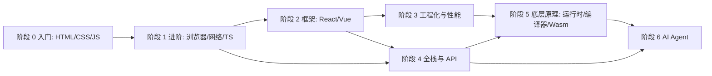

# 前端学习路线

本页给出一份可直接执行的七阶段课程表。每个阶段包含目标、按周的计划（学什么、做什么项目、怎么验证）、本站与外部的关键资料，以及一份自测清单。全部通过自测清单再进入下一阶段，比追求进度更重要。

默认每周投入 10 到 15 小时。有工作经验的读者可以跳过已通过自测的阶段。

## 阶段依赖关系

阶段 2 与阶段 4 可以交叉进行：学框架时顺手写一个后端接口，比单独学后端更容易坚持。

## 学习方法论

!!! tip "这一组怎么学"
    方法比资料数量重要。下面五条是贯穿所有阶段的做法，每个阶段的周计划都按这五条设计。

| 方法 | 具体做法 | 验证标准 |
| --- | --- | --- |
| 读规范与文档 | 遇到“为什么”类问题，先查 [MDN](https://developer.mozilla.org/zh-CN/)、[ECMAScript 规范](https://tc39.es/ecma262/)、[HTML 规范](https://html.spec.whatwg.org/multipage/)，再看博客 | 能指出结论对应的规范章节或文档页 |
| 读源码 | 按 [源码阅读路线](source-code-reading.md) 的顺序，每个仓库只读一个核心文件，带着一个问题读 | 能不看源码手写出核心 50 行 |
| 手写 mini 版 | 手写 Promise、事件总线、响应式、虚拟 DOM、状态库、打包器，参考 [Build your own React](https://pomb.us/build-your-own-react/) 和 [the-super-tiny-compiler](https://github.com/jamiebuilds/the-super-tiny-compiler) | 自己的实现通过原库的核心测试用例 |
| 刻意练习 | 每周一个小项目，只允许使用上周学过的知识；做完写 5 行复盘：卡在哪、查了什么、下次怎么避免 | 项目能部署到公网并有 README |
| 间隔重复 | 学完当天、第 3 天、第 7 天、第 21 天各复盘一次，用 [LeetCode](https://leetcode.cn/) 与 [面试题库](interview-practice.md) 做主动回忆，不重读笔记 | 第 21 天不看资料能口述核心概念 |

怎么使用本站：

1. 先按本页的周计划确定本周主题。
2. 进入对应栏目（例如 [JavaScript](../js/index.md)）读原理文章，再做文章后面的练习。
3. 概念查证时回到 [资源导航](index.md) 找权威外部资料。
4. 每个阶段末尾做一次自测，不通过的条目回到对应栏目补读。

## 阶段 0 入门：HTML、CSS、JavaScript

!!! tip "这一组怎么学"
    目标是能不看教程独立做出一个响应式静态页面，并用 JavaScript 完成交互与网络请求。每天写代码，不要只看视频。

目标：掌握语义化 HTML、CSS 盒模型与布局、JavaScript 语法与 DOM、fetch 请求，会用 Git 与 DevTools。

| 周 | 学什么 | 练习项目 | 怎么验证 |
| --- | --- | --- | --- |
| 1 | HTML 语义标签、表单、可访问性基础 | 个人简历页 | 通过 W3C Validator，用键盘能完整操作表单 |
| 2 | CSS 选择器、盒模型、定位、文本与颜色 | 复刻一个真实网站首页静态版 | 与原站在 1440 与 375 两个宽度下截图对比 |
| 3 | Flexbox、Grid、响应式、媒体查询 | 作品集页面 | 不使用 float，布局在 3 个断点下无溢出 |
| 4 | JavaScript 基础：类型、函数、作用域、数组与对象方法 | 20 道 [Exercism JavaScript](https://exercism.org/tracks/javascript) 练习 | 所有测试通过，能解释每个 `map`/`filter`/`reduce` 的返回值 |
| 5 | DOM、事件、事件委托 | 待办清单（增删改查，刷新不丢数据） | 使用 localStorage 持久化，无内联事件 |
| 6 | 异步：回调、Promise、async/await、fetch | 天气或 GitHub 用户搜索页 | 处理加载中、失败、空结果三种状态 |
| 7 | Git 基础、GitHub Pages 部署、DevTools | 把前 6 周项目部署上线 | 公网链接可访问，提交记录不少于 20 次 |
| 8 | 综合复盘 | 一个 500 行以内的小游戏（如 2048） | 自测清单全部通过 |

关键资料：

- 本站：[HTML](../html/index.md)、[CSS](../css/index.md)、[JavaScript](../js/index.md)
- 外部：[MDN Learn web development](https://developer.mozilla.org/zh-CN/docs/Learn_web_development)、[web.dev Learn](https://web.dev/learn)、[现代 JavaScript 教程](https://zh.javascript.info/)、[freeCodeCamp](https://www.freecodecamp.org/)、[The Odin Project](https://www.theodinproject.com/)

自测清单：

- [ ] 能说出块级与行内元素的区别，以及 `box-sizing` 的两种取值
- [ ] 能用 Flexbox 与 Grid 各实现一次圣杯布局
- [ ] 能解释闭包、`this` 的四种绑定、原型链
- [ ] 能手写 `fetch` 请求并处理错误状态码
- [ ] 能在 DevTools 的 Network 与 Elements 面板定位一个样式或请求问题

## 阶段 1 进阶：浏览器、网络与 TypeScript

!!! tip "这一组怎么学"
    目标是从“会用”变成“知道为什么”。每个知识点都要能回答一次“浏览器在这一步做了什么”，并用 TypeScript 把前一阶段的项目重写一遍。

目标：理解事件循环、渲染流水线、HTTP 与缓存、同源策略与常见攻击，掌握 TypeScript 类型系统。

| 周 | 学什么 | 练习项目 | 怎么验证 |
| --- | --- | --- | --- |
| 1 | 事件循环、宏任务与微任务 | 手写 Promise（符合 Promises/A+） | 通过 promises-aplus-tests |
| 2 | 渲染流水线：解析、样式、布局、绘制、合成 | 用 Performance 面板分析一个页面 | 能指出一次重排与一次重绘分别由哪行代码触发 |
| 3 | HTTP/1.1、HTTP/2、HTTPS、缓存 | 用 Node 写一个静态服务器，实现强缓存与协商缓存 | 用 DevTools 观察到 200 (from cache) 与 304 |
| 4 | 跨域、Cookie、同源策略、CORS | 搭建两个本地域名，复现并解决 CORS 与 Cookie 跨站问题 | 能解释预检请求何时触发 |
| 5 | XSS、CSRF、CSP | 给一个有漏洞的留言板修复漏洞 | 用 [OWASP](https://owasp.org/www-project-top-ten/) 的检查清单自测 |
| 6 | TypeScript 基础：接口、泛型、联合类型、收窄 | 把阶段 0 的待办清单改写为 TypeScript | `strict: true` 下零报错 |
| 7 | 高级类型：条件类型、映射类型、infer | [type-challenges](https://github.com/type-challenges/type-challenges) 完成 20 道 Easy 与 Medium | 提交通过类型测试 |
| 8 | 综合复盘 | 手写简易 `axios`（拦截器、取消、重试） | 有类型定义与单元测试 |

关键资料：

- 本站：[浏览器](../browser/index.md)、[网络](../network/index.md)、[安全](../security/index.md)、[TypeScript](../typescript/index.md)
- 外部：[How Browsers Work](https://www.html5rocks.com/en/tutorials/internals/howbrowserswork/)、[Inside look at modern web browser](https://developer.chrome.com/blog/inside-browser-part1)、[High Performance Browser Networking](https://hpbn.co/)、[TypeScript Handbook](https://www.typescriptlang.org/docs/handbook/intro.html)、[Total TypeScript](https://www.totaltypescript.com/tutorials)

自测清单：

- [ ] 能口述从输入 URL 到页面可交互的完整过程，覆盖 DNS、TCP、TLS、渲染
- [ ] 能画出一次事件循环的执行顺序，并预测 10 道输出顺序题
- [ ] 能区分强缓存与协商缓存，写出对应响应头
- [ ] 能说出 XSS 与 CSRF 的防御手段，各至少三条
- [ ] 能用泛型与条件类型实现 `Pick`、`Awaited` 的简化版

## 阶段 2 框架：React 与 Vue

!!! tip "这一组怎么学"
    只精读一个框架，另一个只读官方教程。目标是能解释“状态变化如何变成界面更新”，而不是记 API。

目标：熟练使用一个主流框架，理解其更新机制，能搭建中等规模应用。

| 周 | 学什么 | 练习项目 | 怎么验证 |
| --- | --- | --- | --- |
| 1 | 组件、Props、State、事件、列表与 key | 官方教程井字棋 | 能解释为什么需要 key |
| 2 | Hooks 或组合式 API、副作用与清理 | 带搜索与分页的数据列表 | 无多余请求，卸载后无警告 |
| 3 | 路由、表单、受控组件 | 多页面后台（登录、列表、详情） | 刷新页面保持路由状态 |
| 4 | 全局状态：Context、Zustand、Redux 或 Pinia | 购物车 | 状态可预测，有单元测试 |
| 5 | 服务端状态：缓存、失效、乐观更新 | 用 TanStack Query 改造第 2 周项目 | 弱网下界面不闪烁 |
| 6 | 更新机制：Fiber 或响应式依赖收集 | 手写 mini React 或 mini Vue 响应式 | 通过自己写的 10 个用例 |
| 7 | 另一个框架的官方教程 | 用另一个框架重写第 1 周项目 | 能列出两者在状态更新上的 3 条差异 |
| 8 | 综合复盘 | 完整的看板应用 | 自测清单全部通过 |

关键资料：

- 本站：[React](../react/index.md)、[Vue](../vue/index.md)
- 外部：[React 官方中文文档](https://zh-hans.react.dev/learn)、[Vue 官方教程](https://cn.vuejs.org/tutorial/)、[Build your own React](https://pomb.us/build-your-own-react/)、[TanStack Query](https://github.com/tanstack/query)

自测清单：

- [ ] 能解释一次 `setState` 到 DOM 更新的完整流程
- [ ] 能说明 `useEffect` 依赖数组的作用与常见陷阱
- [ ] 能解释 Vue 3 响应式依赖收集与触发
- [ ] 能为组件选择合适的状态存放位置：本地、提升、全局、服务端
- [ ] 能用 React Profiler 或 Vue Devtools 定位一次多余渲染

## 阶段 3 工程化与性能

!!! tip "这一组怎么学"
    工程化要在真实痛点里学：先让项目变慢、变大、变乱，再用工具解决。每次优化前后都要有数字。

目标：理解构建、包管理、质量保障与性能指标，能把一个项目的 LCP 与包体积降下来并留下证据。

| 周 | 学什么 | 练习项目 | 怎么验证 |
| --- | --- | --- | --- |
| 1 | 模块化、包管理、语义化版本 | 发布一个 npm 包 | 在另一个项目中成功安装使用 |
| 2 | Vite、Rollup、esbuild 的分工 | 从零配置一个 Vite 项目与一个自定义插件 | 插件能转换一类文件 |
| 3 | ESLint、Prettier、TypeScript、Git hooks | 给项目接入完整检查链 | 提交不合规代码会被拦截 |
| 4 | 单元与端到端测试 | 为阶段 2 项目补 Vitest 与 Playwright 用例 | 核心路径覆盖，CI 中通过 |
| 5 | CI/CD 与部署 | GitHub Actions 自动测试并部署 | 合并到主分支后自动上线 |
| 6 | Core Web Vitals 度量 | 用 Lighthouse 与 [PageSpeed Insights](https://pagespeed.web.dev/) 评估一个页面 | 记录 LCP、INP、CLS 基线 |
| 7 | 包体积与加载优化：拆包、懒加载、图片、缓存 | 把基线页面的 LCP 降低 30% 以上 | 前后对比数据与截图 |
| 8 | 监控与错误上报 | 接入 Sentry 或自建上报 | 能复现并定位一个线上错误 |

关键资料：

- 本站：[工程化](../engineering/index.md)、[构建工具](../build-tools/index.md)、[包管理](../package-manager/index.md)、[性能](../performance/index.md)
- 外部：[Vite 中文文档](https://cn.vitejs.dev/)、[web.dev 性能课程](https://web.dev/learn/performance)、[Core Web Vitals](https://web.dev/articles/vitals)、[Bundlephobia](https://bundlephobia.com/)
- 同栏目补充：[测试与监控](testing-monitoring.md)、[Web 平台 API](web-platform-apis.md)

自测清单：

- [ ] 能说明开发环境与生产环境构建流程的区别（以 Vite 为例）
- [ ] 能解释 tree-shaking 生效的前提条件
- [ ] 能读懂一份 Lighthouse 报告并给出三条有数据支撑的优化
- [ ] 能区分单元、集成、端到端测试各自的适用场景
- [ ] 能画出一个项目从提交代码到上线的流水线

## 阶段 4 全栈与 API

!!! tip "这一组怎么学"
    目标是独立交付一个带登录与数据库的完整应用。先用最简单的方案跑通，再讨论分层与扩展。

目标：掌握 Node.js 服务端、REST 与实时通信、数据库基础、认证与部署。

| 周 | 学什么 | 练习项目 | 怎么验证 |
| --- | --- | --- | --- |
| 1 | Node.js 模块、文件、流、HTTP 模块 | 不用框架写一个 JSON API | 用 curl 可完成增删改查 |
| 2 | Hono、Express 或 Koa 路由与中间件 | 用框架重写并加日志中间件 | 错误统一处理，返回正确状态码 |
| 3 | SQL 与 PostgreSQL 基础 | 为待办应用设计 3 张表 | 能写出带 JOIN 与索引的查询 |
| 4 | ORM（Drizzle 或 Prisma）与迁移 | 接入数据库 | 迁移可回放，种子数据可重置 |
| 5 | 认证：Session、JWT、OAuth | 登录与权限 | 未登录访问受保护接口返回 401 |
| 6 | API 设计：REST、分页、版本、错误格式，了解 tRPC 与 GraphQL | 写 OpenAPI 描述 | 前端可据此生成类型 |
| 7 | WebSocket、SSE | 实时聊天或通知 | 断线后自动重连 |
| 8 | 部署与可观测 | 容器化部署一个全栈应用 | 有健康检查与日志 |

关键资料：

- 本站：[网络](../network/index.md)、[安全](../security/index.md)
- 同栏目：[API 设计与通信](api-design-communication.md)、[后端与数据库](backend-database.md)
- 外部：[Node.js Learn](https://nodejs.org/en/learn)、[Hono](https://hono.dev/)、[PostgreSQL 教程](https://www.postgresql.org/docs/current/tutorial.html)、[Drizzle ORM](https://orm.drizzle.team/)、[tRPC](https://trpc.io/)、[Node Best Practices](https://github.com/goldbergyoni/nodebestpractices)

自测清单：

- [ ] 能解释 REST 的资源建模与幂等性，并为一个业务设计接口
- [ ] 能说出 Session 与 JWT 的取舍
- [ ] 能解释索引如何加速查询，并用 `EXPLAIN` 验证
- [ ] 能说明 WebSocket、SSE、长轮询的适用场景
- [ ] 能独立部署并回滚一个服务

## 阶段 5 底层原理：运行时、编译器与 WebAssembly

!!! tip "这一组怎么学"
    这一阶段不追求广，而追求“能手写一遍”。每个主题以一个可运行的 mini 实现收尾，并读一个真实项目的入口文件。

目标：理解 JavaScript 引擎与 Node 运行时的工作方式，了解解析、转换、生成的编译流程，会使用 WebAssembly。

| 周 | 学什么 | 练习项目 | 怎么验证 |
| --- | --- | --- | --- |
| 1 | V8 的解析、字节码、JIT、垃圾回收概览 | 用 `--trace-gc` 观察一次内存增长 | 能解释新生代与老生代回收差别 |
| 2 | Node 事件循环与 libuv、流与背压 | 写一个带背压的文件转换流 | 处理 1GB 文件时内存稳定 |
| 3 | 词法分析与语法分析 | 按 [Crafting Interpreters](https://craftinginterpreters.com/) 前几章写表达式解析器 | 能解析并求值四则运算与变量 |
| 4 | AST 与转换 | 用 [AST Explorer](https://astexplorer.net/) 写一个 Babel 插件 | 插件在真实项目中生效 |
| 5 | 打包器原理 | 手写 100 行的模块打包器 | 能打包含循环依赖的两个模块 |
| 6 | WebAssembly 基础 | 把一个计算密集函数编译为 Wasm 并在浏览器调用 | 与 JS 版本做基准对比 |
| 7 | Rust 入门 | 完成 [Rust 程序设计语言](https://kaisery.github.io/trpl-zh-cn/) 前 10 章 | 能用 `wasm-bindgen` 导出一个函数 |
| 8 | 综合复盘 | 写一个迷你模板引擎，含编译与运行两阶段 | 有测试并写出设计说明 |

关键资料：

- 本站：[运行时](../runtime/index.md)、[构建工具](../build-tools/index.md)
- 同栏目：[运行时、Wasm 与 Rust](runtimes-wasm-rust.md)
- 外部：[V8 文档](https://v8.dev/docs)、[WebAssembly 官网](https://webassembly.org/)、[MDN WebAssembly](https://developer.mozilla.org/zh-CN/docs/WebAssembly)、[Rust and WebAssembly](https://rustwasm.github.io/docs/book/)、[Babel Handbook](https://github.com/jamiebuilds/babel-handbook)

自测清单：

- [ ] 能解释 JIT 为什么会带来“去优化”
- [ ] 能画出 Node 事件循环的阶段并说明 `process.nextTick` 的位置
- [ ] 能说出编译器前端的三个阶段，并手写一个最小词法分析器
- [ ] 能说明 Wasm 适合与不适合的场景
- [ ] 能解释 Rollup 与 esbuild 在设计取舍上的差异

## 阶段 6 AI Agent

!!! tip "这一组怎么学"
    先读 Agent 的设计原则，再手写最小循环，最后读一个真实的 Agent 内核。每一步都要留下可运行的评测用例。

目标：能设计工具调用协议，写出带上下文管理与权限控制的 Agent 循环，并用评测验证效果。

| 周 | 学什么 | 练习项目 | 怎么验证 |
| --- | --- | --- | --- |
| 1 | LLM API、提示、结构化输出 | 一个命令行问答工具 | 输出可被 JSON Schema 校验 |
| 2 | 工具调用与 Agent 循环 | 手写 100 行的 Agent 循环，带 3 个工具 | 能完成需要两次工具调用的任务 |
| 3 | 上下文工程：压缩、检索、记忆 | 给 Agent 加会话压缩 | 长对话下仍能完成任务 |
| 4 | MCP 协议 | 写一个 MCP 服务器暴露两个工具 | 在客户端中成功调用 |
| 5 | 权限、沙箱与安全 | 为 Agent 加工具审批与目录白名单 | 越权调用被拦截 |
| 6 | 评测与可观测 | 建 20 条评测用例并记录 trace | 每次改动能看到通过率变化 |
| 7 | 多 Agent 与子任务 | 实现一个主 Agent 派生子 Agent 的流程 | 子任务失败时主流程可恢复 |
| 8 | 综合复盘 | 做一个代码审查 Agent | 对 10 个历史 PR 的结论可复核 |

关键资料：

- 本站：[AI Agent](../agent/index.md)、[Harness 概览](../agent/harness/harness-overview.md)、[手写 mini harness](../agent/harness/build-mini-harness.md)
- 外部：[Building effective agents](https://www.anthropic.com/engineering/building-effective-agents)、[Model Context Protocol](https://modelcontextprotocol.io/)、[Hugging Face Agents Course](https://huggingface.co/learn/agents-course)、[Microsoft AI Agents for Beginners](https://github.com/microsoft/ai-agents-for-beginners)
- 同栏目：[AI 与 Agent 资源](ai-agent.md)、[源码阅读路线](source-code-reading.md)

自测清单：

- [ ] 能解释工作流与 Agent 的区别，并为一个任务选择合适的一种
- [ ] 能写出工具的 JSON Schema 与错误返回约定
- [ ] 能说出三种上下文压缩策略及其风险
- [ ] 能为 Agent 设计权限模型与中止机制
- [ ] 能用评测集量化一次提示或工具改动的影响
