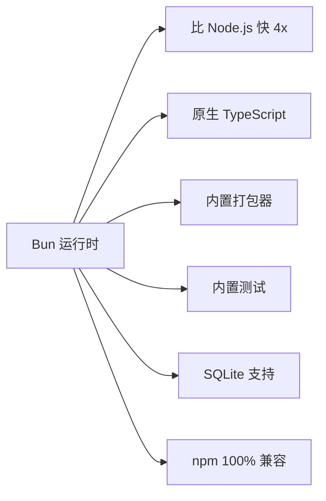

# Bun 2.x 使用指南

> Bun 是一个 all-in-one 的 JavaScript 运行时、打包器、测试框架和包管理器，比 Node.js 更快更简单。

## 核心特性概览



### 性能对比基准

| 操作 | Node.js | Bun | 提升 |
|------|---------|-----|------|
| HTTP 服务 (req/s) | ~50,000 | ~200,000 | 4x |
| npm install | 30s | 3s | 10x |
| TypeScript 启动 | 2-5s | 0.1s | 20-50x |
| 文件 I/O | 基准 | 1.5x | 1.5x |

---

## 快速上手

### 安装

```bash
# macOS / Linux
curl -fsSL https://bun.sh/install | bash

# Windows (PowerShell)
powershell -c "irm bun.sh/install.ps1 | iex"

# npm
npm install -g bun

# Homebrew (macOS)
brew install oven/bun/bun
```

### 基础命令

```bash
# 运行脚本
bun run index.ts
bun run --watch index.ts     # 监听模式
bun run --bun index.ts       # 使用 Bun 的 Node.js 兼容层

# 包管理
bun add express              # 安装包
bun add -d typescript        # 开发依赖
bun pm ls                    # 列出已安装

# 测试
bun test
bun test --watch             # 监听模式

# 构建
bun build ./src/index.ts --outdir ./dist --target bun

# 脚本命令 (package.json)
bun run dev
bun run build
```

---

## HTTP 服务

### 原生 HTTP 服务器

```typescript
// Bun 原生 API，无需 Express
const server = Bun.serve({
  port: 3000,
  hostname: '0.0.0.0',

  async fetch(req) {
    const url = new URL(req.url);

    if (url.pathname === '/api/users' && req.method === 'GET') {
      const users = await db.query('SELECT * FROM users');
      return Response.json(users);
    }

    if (url.pathname === '/api/users' && req.method === 'POST') {
      const body = await req.json();
      const result = await db.query(
        'INSERT INTO users (name, email) VALUES (?, ?) RETURNING *',
        [body.name, body.email]
      );
      return Response.json(result, { status: 201 });
    }

    return new Response('Not Found', { status: 404 });
  },

  error(error) {
    console.error('Server error:', error);
    return new Response('Internal Server Error', { status: 500 });
  },
});

console.log(`Bun server listening on http://${server.hostname}:${server.port}`);
```

### 使用 Express 风格框架

```typescript
import { Hono } from 'hono';
import { cors } from 'hono/cors';
import { logger } from 'hono/logger';

const app = new Hono();

// 中间件
app.use('*', cors());
app.use('*', logger());

// 路由
app.get('/', (c) => c.text('Hello from Bun + Hono!'));

app.get('/api/users', async (c) => {
  const users = await db.query('SELECT * FROM users LIMIT 10');
  return c.json(users);
});

app.post('/api/users', async (c) => {
  const { name, email } = await c.req.json();
  const result = await db.query(
    'INSERT INTO users (name, email) VALUES (?, ?) RETURNING *',
    [name, email]
  );
  return c.json(result, 201);
});

// 启动
export default {
  port: 3000,
  fetch: app.fetch,
};
```

---

## 内置 SQLite 支持

### 数据库操作

```typescript
// Bun 原生 SQLite，无需额外安装
import { Database } from 'bun:sqlite';

const db = new Database(':memory:');

// 创建表
db.exec(`
  CREATE TABLE users (
    id INTEGER PRIMARY KEY AUTOINCREMENT,
    name TEXT NOT NULL,
    email TEXT UNIQUE,
    created_at DATETIME DEFAULT CURRENT_TIMESTAMP
  )
`);

// 插入数据（参数化查询，防 SQL 注入）
const insert = db.prepare('INSERT INTO users (name, email) VALUES (?, ?)');
insert.run('张三', 'zhangsan@example.com');
insert.run('李四', 'lisi@example.com');

// 查询（返回数组）
const users = db.query('SELECT * FROM users').all();
console.log(users);
// [
//   { id: 1, name: '张三', email: 'zhangsan@example.com', created_at: '...' },
//   { id: 2, name: '李四', email: 'lisi@example.com', created_at: '...' }
// ]

// 查询单条
const user = db.query('SELECT * FROM users WHERE id = ?').get(1);
console.log(user);
// { id: 1, name: '张三', email: 'zhangsan@example.com', ... }

// 事务操作
db.exec('BEGIN TRANSACTION');
try {
  db.exec("INSERT INTO users (name, email) VALUES ('王五', 'wangwu@example.com')");
  db.exec("INSERT INTO users (name, email) VALUES ('赵六', 'zhaoliu@example.com')");
  db.exec('COMMIT');
} catch (error) {
  db.exec('ROLLBACK');
  throw error;
}

// 关闭连接
db.close();
```

### 使用 ORM（drizzle-orm）

```typescript
import { Database } from 'bun:sqlite';
import { drizzle } from 'drizzle-orm/bun-sqlite';
import { sql } from 'drizzle-orm';
import { text, integer, sqliteTable } from 'drizzle-orm/sqlite-core';

const sqlite = new Database('app.db');
const db = drizzle(sqlite);

// 定义 Schema
export const users = sqliteTable('users', {
  id: integer('id').primaryKey({ autoIncrement: true }),
  name: text('name').notNull(),
  email: text('email').unique(),
  age: integer('age'),
});

export const posts = sqliteTable('posts', {
  id: integer('id').primaryKey({ autoIncrement: true }),
  userId: integer('user_id').references(() => users.id),
  title: text('title').notNull(),
  content: text('content'),
});

// CRUD 操作
async function queryExamples() {
  // 插入
  const [newUser] = await db.insert(users).values({
    name: '测试用户',
    email: 'test@example.com',
    age: 25,
  }).returning();

  // 查询
  const allUsers = await db.select().from(users);
  const userById = await db.select().from(users).where(eq(users.id, 1));

  // 更新
  await db.update(users)
    .set({ age: 26 })
    .where(eq(users.id, 1));

  // 删除
  await db.delete(users).where(eq(users.id, 2));
}
```

---

## 内置 PostgreSQL / Redis 支持

### PostgreSQL 连接

```typescript
// 需要先安装：bun add postgres
import { Database } from 'bun:postgres';

const db = new Database({
  host: 'localhost',
  port: 5432,
  user: 'postgres',
  password: 'password',
  database: 'myapp',
});

// 连接测试
await db.connect();
console.log('PostgreSQL connected!');

// 查询
const { rows } = await db.query('SELECT * FROM users LIMIT 10');
console.log(rows);

// 事务
const transaction = await db.begin();
try {
  await transaction.query('INSERT INTO users (name) VALUES ($1)', ['张三']);
  await transaction.commit();
} catch {
  await transaction.rollback();
}

// 断开
await db.end();
```

### Redis 连接

```typescript
// 需要先安装：bun add redis
import { Redis } from 'bun:redis';

const redis = await Redis.connect({
  url: 'redis://localhost:6379',
});

// 字符串操作
await redis.set('key', 'value');
await redis.setex('token', 3600, 'abc123');
const value = await redis.get('key');

// 哈希操作
await redis.hSet('user:1', { name: '张三', age: '25' });
const user = await redis.hGetAll('user:1');
console.log(user);
// { name: '张三', age: '25' }

// 列表操作
await redis.lPush('queue', 'task1');
await redis.rPush('queue', 'task2');
const tasks = await redis.lRange('queue', 0, -1);

// 集合操作
await redis.sAdd('tags', ['js', 'ts', 'bun']);
const allTags = await redis.sMembers('tags');

// 关闭
await redis.close();
```

---

## 文件操作与 IO

```typescript
import { writeFile, readFile, mkdir, readdir } from 'fs/promises';
import { existsSync } from 'fs';

// 文件读写（Bun 自动支持 async）
async function fileExamples() {
  // 读取
  const content = await Bun.file('./data.json').text();
  const json = JSON.parse(content);

  // 二进制
  const buffer = await Bun.file('./image.png').arrayBuffer();

  // 写入
  await Bun.write('./output.txt', 'Hello, Bun!');

  // 追加
  await Bun.write('./log.txt', `${new Date()} - Log entry\n`, {
    createPath: true,
  });

  // 检查存在
  if (existsSync('./data')) {
    const files = await readdir('./data');
    console.log('Files:', files);
  }
}

// HTTP 客户端（内置 fetch，但更快）
async function httpExamples() {
  // GET
  const response = await fetch('https://api.example.com/data');
  const data = await response.json();

  // POST
  const postResponse = await fetch('https://api.example.com/users', {
    method: 'POST',
    headers: { 'Content-Type': 'application/json' },
    body: JSON.stringify({ name: '张三', email: 'zhangsan@example.com' }),
  });

  // 文件下载到磁盘
  const fileResponse = await fetch('https://example.com/file.zip');
  await Bun.write('./file.zip', fileResponse);
}
```

---

## 测试框架

```typescript
// Bun 内置测试，无需 Jest/Vitest
import { describe, test, expect, beforeAll, afterAll } from 'bun:test';

describe('数学工具函数', () => {
  // 测试用例
  test('加法', () => {
    expect(1 + 1).toBe(2);
  });

  test('数组操作', () => {
    const arr = [1, 2, 3];
    expect(arr.map(x => x * 2)).toEqual([2, 4, 6]);
  });

  test('异步操作', async () => {
    const result = await Promise.resolve(42);
    expect(result).toBe(42);
  });
});

describe('用户服务', () => {
  let db: Database;

  beforeAll(() => {
    // 测试前准备
    db = new Database(':memory:');
    db.exec('CREATE TABLE users (id INT, name TEXT)');
  });

  afterAll(() => {
    db.close();
  });

  test('创建用户', () => {
    db.exec("INSERT INTO users VALUES (1, '张三')");
    const user = db.query('SELECT * FROM users WHERE id = 1').get();
    expect(user).toEqual({ id: 1, name: '张三' });
  });
});

// 运行 mock 示例
import { spyOn } from 'bun:test';

test('spy 示例', async () => {
  const consoleSpy = spyOn(console, 'log').mockImplementation(() => {});

  console.log('Hello');

  expect(consoleSpy).toHaveBeenCalledWith('Hello');
  consoleSpy.mockRestore();
});
```

---

## 迁移策略

### 从 Node.js 迁移

```typescript
// ============================================
// 1. package.json 配置
// ============================================
{
  "name": "my-app",
  "type": "module",           // Bun 推荐 ESM
  "scripts": {
    "dev": "bun --watch src/index.ts",
    "build": "bun build src/index.ts --outdir dist --target bun",
    "start": "bun dist/index.js"
  },
  "dependencies": {
    "express": "^4.18.0"     // npm 包完全兼容
  }
}

// ============================================
// 2. 替换内置模块
// ============================================
// Node.js                    → Bun
// const fs = require('fs')  → import 'fs/promises' 或 Bun.file()
// const http = require('http') → Bun.serve()
// const crypto = require('crypto') → crypto 全局可用
// const path = require('path') → import path from 'path'

// ============================================
// 3. 环境变量
// ============================================
// Bun 自动加载 .env 文件
// 不需要 dotenv 包！

// .env
// DATABASE_URL=postgres://...
// API_KEY=secret

// 直接使用
console.log(process.env.DATABASE_URL);

// ============================================
// 4. 测试迁移
// ============================================
// Jest → Bun.test
// Vitest → Bun.test（配置兼容）
// 逐步迁移，先保证核心功能通过

// jest.config.js → bunfig.toml
// Bun 兼容 Jest 配置
```

### bunfig.toml 配置

```toml
# bunfig.toml - Bun 配置文件

[install]
# 缓存目录
cacheDir = ".bun-cache"
# 安装后运行脚本
postinstall = "tsc --noEmit"
# 使用国内镜像
registry = "https://registry.npmmirror.com"

[test]
# 测试环境变量
env = { NODE_ENV = "test" }
# 覆盖率报告
coverage = true
coverageDir = "coverage"

[run]
# 自动安装依赖
autoInstallPeers = true
# 工作目录
cwd = "./src"
```

---

## 常见问题与解决方案

### Q1: Bun 和 Node.js 的兼容性如何？

```typescript
// Bun 兼容 Node.js 内置模块和 npm 包
// 但存在一些差异需要注意：

// 1. Buffer
// Bun 中 Buffer 在全局可用，但推荐使用 Uint8Array
const buffer = Buffer.from('Hello'); // 兼容
const bytes = new Uint8Array([72, 101, 108, 108, 111]); // 推荐

// 2. __dirname / __filename
// Bun 使用 import.meta
import { dirname, resolve } from 'path';
const __dirname = dirname(import.meta.url);

// 3. process.chdir()
// Bun 不支持
```

### Q2: 如何调试 Bun 应用？

```bash
# 使用 --inspect-brk 启动调试器
bun --inspect-brk src/index.ts

# 使用 Chrome DevTools
# 1. 打开 chrome://inspect
# 2. 点击 "Open dedicated DevTools for Node"
# 3. 连接后设置断点

# 日志调试
BUN_DEBUG=1 bun run src/index.ts
```

### Q3: Bun 在生产环境可用吗？

```typescript
// Bun 1.x 已进入生产就绪状态
// 已有公司生产环境使用案例

// 推荐配置
const server = Bun.serve({
  port: Number(process.env.PORT) || 3000,
  // 生产环境使用 Bun.main
  fetch(req) {
    // ...
  },
  // 错误处理
  error(error) {
    // 生产环境不暴露错误详情
    console.error(error);
    return new Response('Internal Server Error', { status: 500 });
  },
});
```

---

## 参考链接

- [Bun 官方文档](https://bun.sh/docs)
- [Bun API 参考](https://bun.sh/docs/api)
- [Bun GitHub](https://github.com/oven-sh/bun)
- [Bun 与 Node.js API 对比](https://bun.sh/docs/runtime/nodejs-apis)
- [drizzle-orm](https://orm.drizzle.team/)