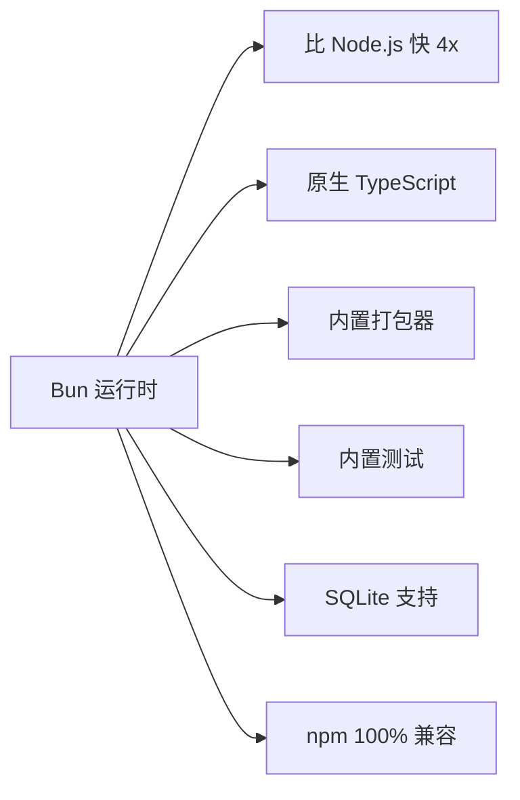

# Bun 2.x 使用指南

> Bun 是一个 all-in-one 的 JavaScript 运行时、打包器、测试框架和包管理器，比 Node.js 更快更简单。

## 1. 核心特性概览


```mermaid
graph LR
    A[Bun 运行时] --> B[比 Node.js 快 4x]
    A --> C[原生 TypeScript]
    A --> D[内置打包器]
    A --> E[内置测试]
    A --> F[SQLite 支持]
    A --> G[npm 100% 兼容]
```

### 1.1 性能对比基准

| 操作 | Node.js | Bun | 提升 |
|------|---------|-----|------|
| HTTP 服务 (req/s) | ~50,000 | ~200,000 | 4x |
| npm install | 30s | 3s | 10x |
| TypeScript 启动 | 2-5s | 0.1s | 20-50x |
| 文件 I/O | 基准 | 1.5x | 1.5x |

---

## 2. 快速上手

### 2.1 安装

```bash
# macOS / Linux
curl -fsSL https://bun.sh/install | bash

# Windows (PowerShell)
powershell -c "irm bun.sh/install.ps1 | iex"

# npm
npm install -g bun

# Homebrew (macOS)
brew install oven/bun/bun
```

### 2.2 基础命令

```bash
# 运行脚本
bun run index.ts
bun run --watch index.ts     # 监听模式
bun run --bun index.ts       # 使用 Bun 的 Node.js 兼容层

# 包管理
bun add express              # 安装包
bun add -d typescript        # 开发依赖
bun pm ls                    # 列出已安装

# 测试
bun test
bun test --watch             # 监听模式

# 构建
bun build ./src/index.ts --outdir ./dist --target bun

# 脚本命令 (package.json)
bun run dev
bun run build
```

---

## 3. HTTP 服务

### 3.1 原生 HTTP 服务器

```typescript
// Bun 原生 API，无需 Express
// 第 1 段：创建 HTTP 服务器与监听配置
// Bun.serve 直接内置 HTTP 服务器与路由入口，省掉 Express 中间件栈，冷启动和吞吐都更好；
// hostname 显式设为 0.0.0.0 是为了让容器/局域网外部也能访问，默认只监听 localhost 会导致外部连不上。
const server = Bun.serve({
  port: 3000,
  hostname: '0.0.0.0',

  // 第 2 段：请求分发入口（fetch handler）
  // 每个请求都会调用一次 fetch，req.url 是完整 URL，所以这里用 new URL 拆出 pathname 做路由匹配；
  // 注意这里没有路由框架，是靠 pathname + method 手写判断，因此匹配顺序会直接决定优先级（先匹配先返回）。
  async fetch(req) {
    const url = new URL(req.url);

    // 第 3 段：GET /api/users —— 列表查询
    // 同时校验路径和方法，避免 GET 之外的请求误入；await 让出事件循环，查询期间 Bun 仍能并发处理其他请求。
    // 复杂度取决于数据库查询本身，本函数只负责透传结果。
    if (url.pathname === '/api/users' && req.method === 'GET') {
      const users = await db.query('SELECT * FROM users');
      return Response.json(users); // 自动序列化并带上 Content-Type: application/json
    }

    // 第 4 段：POST /api/users —— 创建并回填
    // 先 await req.json() 解析请求体，再用占位符 ? 绑定参数，这是防 SQL 注入的关键，切勿用字符串拼接；
    // RETURNING * 让插入和读取合并成一次往返，省掉插入后再查一次的网络开销。
    if (url.pathname === '/api/users' && req.method === 'POST') {
      const body = await req.json();
      const result = await db.query(
        'INSERT INTO users (name, email) VALUES (?, ?) RETURNING *',
        [body.name, body.email] // 参数顺序必须与 VALUES 中的 ? 一一对应
      );
      return Response.json(result, { status: 201 }); // 201 Created 才符合 REST 语义，比默认 200 更准确
    }

    // 第 5 段：兜底 404
    // 放在所有路由之后，任何未命中的路径/方法都会走到这里；若放在前面会把后面的路由全部短路掉。
    return new Response('Not Found', { status: 404 });
  },

  // 第 6 段：全局错误处理器
  // fetch 内未捕获的异常会汇聚到这里，保证进程不因单个请求崩溃，同时向客户端返回统一的 500；
  // 生产环境应避免把 error 细节直接回给客户端，只记录到日志即可。
  error(error) {
    console.error('Server error:', error);
    return new Response('Internal Server Error', { status: 500 });
  },
});

// 第 7 段：启动确认日志
// server.hostname / server.port 反映的是实际生效值（例如传 0 让系统随机分配端口时，这里打印的才是真实端口），
// 比直接复用配置字面量更可靠。
console.log(`Bun server listening on http://${server.hostname}:${server.port}`);
```

### 3.2 使用 Express 风格框架

```typescript
import { Hono } from 'hono';
import { cors } from 'hono/cors';
import { logger } from 'hono/logger';

const app = new Hono();

// 中间件
app.use('*', cors());
app.use('*', logger());

// 路由
app.get('/', (c) => c.text('Hello from Bun + Hono!'));

app.get('/api/users', async (c) => {
  const users = await db.query('SELECT * FROM users LIMIT 10');
  return c.json(users);
});

app.post('/api/users', async (c) => {
  const { name, email } = await c.req.json();
  const result = await db.query(
    'INSERT INTO users (name, email) VALUES (?, ?) RETURNING *',
    [name, email]
  );
  return c.json(result, 201);
});

// 启动
export default {
  port: 3000,
  fetch: app.fetch,
};
```

---

## 4. 内置 SQLite 支持

### 4.1 数据库操作

```typescript
// Bun 原生 SQLite，无需额外安装
import { Database } from 'bun:sqlite';

const db = new Database(':memory:');

// 创建表
db.exec(`
  CREATE TABLE users (
    id INTEGER PRIMARY KEY AUTOINCREMENT,
    name TEXT NOT NULL,
    email TEXT UNIQUE,
    created_at DATETIME DEFAULT CURRENT_TIMESTAMP
  )
`);

// 插入数据（参数化查询，防 SQL 注入）
const insert = db.prepare('INSERT INTO users (name, email) VALUES (?, ?)');
insert.run('张三', 'zhangsan@example.com');
insert.run('李四', 'lisi@example.com');

// 查询（返回数组）
const users = db.query('SELECT * FROM users').all();
console.log(users);
// [
//   { id: 1, name: '张三', email: 'zhangsan@example.com', created_at: '...' },
//   { id: 2, name: '李四', email: 'lisi@example.com', created_at: '...' }
// ]

// 查询单条
const user = db.query('SELECT * FROM users WHERE id = ?').get(1);
console.log(user);
// { id: 1, name: '张三', email: 'zhangsan@example.com', ... }

// 事务操作
db.exec('BEGIN TRANSACTION');
try {
  db.exec("INSERT INTO users (name, email) VALUES ('王五', 'wangwu@example.com')");
  db.exec("INSERT INTO users (name, email) VALUES ('赵六', 'zhaoliu@example.com')");
  db.exec('COMMIT');
} catch (error) {
  db.exec('ROLLBACK');
  throw error;
}

// 关闭连接
db.close();
```

### 4.2 使用 ORM（drizzle-orm）

```typescript
import { Database } from 'bun:sqlite';
import { drizzle } from 'drizzle-orm/bun-sqlite';
import { sql } from 'drizzle-orm';
import { text, integer, sqliteTable } from 'drizzle-orm/sqlite-core';

const sqlite = new Database('app.db');
const db = drizzle(sqlite);

// 定义 Schema
export const users = sqliteTable('users', {
  id: integer('id').primaryKey({ autoIncrement: true }),
  name: text('name').notNull(),
  email: text('email').unique(),
  age: integer('age'),
});

export const posts = sqliteTable('posts', {
  id: integer('id').primaryKey({ autoIncrement: true }),
  userId: integer('user_id').references(() => users.id),
  title: text('title').notNull(),
  content: text('content'),
});

// CRUD 操作
async function queryExamples() {
  // 插入
  const [newUser] = await db.insert(users).values({
    name: '测试用户',
    email: 'test@example.com',
    age: 25,
  }).returning();

  // 查询
  const allUsers = await db.select().from(users);
  const userById = await db.select().from(users).where(eq(users.id, 1));

  // 更新
  await db.update(users)
    .set({ age: 26 })
    .where(eq(users.id, 1));

  // 删除
  await db.delete(users).where(eq(users.id, 2));
}
```

---

## 5. 内置 PostgreSQL / Redis 支持

### 5.1 PostgreSQL 连接

```typescript
// 需要先安装：bun add postgres
import { Database } from 'bun:postgres';

const db = new Database({
  host: 'localhost',
  port: 5432,
  user: 'postgres',
  password: 'password',
  database: 'myapp',
});

// 连接测试
await db.connect();
console.log('PostgreSQL connected!');

// 查询
const { rows } = await db.query('SELECT * FROM users LIMIT 10');
console.log(rows);

// 事务
const transaction = await db.begin();
try {
  await transaction.query('INSERT INTO users (name) VALUES ($1)', ['张三']);
  await transaction.commit();
} catch {
  await transaction.rollback();
}

// 断开
await db.end();
```

### 5.2 Redis 连接

```typescript
// 需要先安装：bun add redis
import { Redis } from 'bun:redis';

const redis = await Redis.connect({
  url: 'redis://localhost:6379',
});

// 字符串操作
await redis.set('key', 'value');
await redis.setex('token', 3600, 'abc123');
const value = await redis.get('key');

// 哈希操作
await redis.hSet('user:1', { name: '张三', age: '25' });
const user = await redis.hGetAll('user:1');
console.log(user);
// { name: '张三', age: '25' }

// 列表操作
await redis.lPush('queue', 'task1');
await redis.rPush('queue', 'task2');
const tasks = await redis.lRange('queue', 0, -1);

// 集合操作
await redis.sAdd('tags', ['js', 'ts', 'bun']);
const allTags = await redis.sMembers('tags');

// 关闭
await redis.close();
```

---

## 6. 文件操作与 IO

```typescript
import { writeFile, readFile, mkdir, readdir } from 'fs/promises';
import { existsSync } from 'fs';

// 文件读写（Bun 自动支持 async）
async function fileExamples() {
  // 读取
  const content = await Bun.file('./data.json').text();
  const json = JSON.parse(content);

  // 二进制
  const buffer = await Bun.file('./image.png').arrayBuffer();

  // 写入
  await Bun.write('./output.txt', 'Hello, Bun!');

  // 追加
  await Bun.write('./log.txt', `${new Date()} - Log entry\n`, {
    createPath: true,
  });

  // 检查存在
  if (existsSync('./data')) {
    const files = await readdir('./data');
    console.log('Files:', files);
  }
}

// HTTP 客户端（内置 fetch，但更快）
async function httpExamples() {
  // GET
  const response = await fetch('https://api.example.com/data');
  const data = await response.json();

  // POST
  const postResponse = await fetch('https://api.example.com/users', {
    method: 'POST',
    headers: { 'Content-Type': 'application/json' },
    body: JSON.stringify({ name: '张三', email: 'zhangsan@example.com' }),
  });

  // 文件下载到磁盘
  const fileResponse = await fetch('https://example.com/file.zip');
  await Bun.write('./file.zip', fileResponse);
}
```

---

## 7. 测试框架

```typescript
// Bun 内置测试，无需 Jest/Vitest
import { describe, test, expect, beforeAll, afterAll } from 'bun:test';

describe('数学工具函数', () => {
  // 测试用例
  test('加法', () => {
    expect(1 + 1).toBe(2);
  });

  test('数组操作', () => {
    const arr = [1, 2, 3];
    expect(arr.map(x => x * 2)).toEqual([2, 4, 6]);
  });

  test('异步操作', async () => {
    const result = await Promise.resolve(42);
    expect(result).toBe(42);
  });
});

describe('用户服务', () => {
  let db: Database;

  beforeAll(() => {
    // 测试前准备
    db = new Database(':memory:');
    db.exec('CREATE TABLE users (id INT, name TEXT)');
  });

  afterAll(() => {
    db.close();
  });

  test('创建用户', () => {
    db.exec("INSERT INTO users VALUES (1, '张三')");
    const user = db.query('SELECT * FROM users WHERE id = 1').get();
    expect(user).toEqual({ id: 1, name: '张三' });
  });
});

// 运行 mock 示例
import { spyOn } from 'bun:test';

test('spy 示例', async () => {
  const consoleSpy = spyOn(console, 'log').mockImplementation(() => {});

  console.log('Hello');

  expect(consoleSpy).toHaveBeenCalledWith('Hello');
  consoleSpy.mockRestore();
});
```

---

## 8. 迁移策略

### 8.1 从 Node.js 迁移

```typescript
// ============================================
// 1. package.json 配置
// ============================================
{
  "name": "my-app",
  "type": "module",           // Bun 推荐 ESM
  "scripts": {
    "dev": "bun --watch src/index.ts",
    "build": "bun build src/index.ts --outdir dist --target bun",
    "start": "bun dist/index.js"
  },
  "dependencies": {
    "express": "^4.18.0"     // npm 包完全兼容
  }
}

// ============================================
// 2. 替换内置模块
// ============================================
// Node.js                    → Bun
// const fs = require('fs')  → import 'fs/promises' 或 Bun.file()
// const http = require('http') → Bun.serve()
// const crypto = require('crypto') → crypto 全局可用
// const path = require('path') → import path from 'path'

// ============================================
// 3. 环境变量
// ============================================
// Bun 自动加载 .env 文件
// 不需要 dotenv 包！

// .env
// DATABASE_URL=postgres://...
// API_KEY=secret

// 直接使用
console.log(process.env.DATABASE_URL);

// ============================================
// 4. 测试迁移
// ============================================
// Jest → Bun.test
// Vitest → Bun.test（配置兼容）
// 逐步迁移，先保证核心功能通过

// jest.config.js → bunfig.toml
// Bun 兼容 Jest 配置
```

### 8.2 bunfig.toml 配置

```toml
# bunfig.toml - Bun 配置文件

[install]
# 缓存目录
cacheDir = ".bun-cache"
# 安装后运行脚本
postinstall = "tsc --noEmit"
# 使用国内镜像
registry = "https://registry.npmmirror.com"

[test]
# 测试环境变量
env = { NODE_ENV = "test" }
# 覆盖率报告
coverage = true
coverageDir = "coverage"

[run]
# 自动安装依赖
autoInstallPeers = true
# 工作目录
cwd = "./src"
```

---

## 9. 常见问题与解决方案

### 9.1 Q1: Bun 和 Node.js 的兼容性如何？

```typescript
// Bun 兼容 Node.js 内置模块和 npm 包
// 但存在一些差异需要注意：

// 1. Buffer
// Bun 中 Buffer 在全局可用，但推荐使用 Uint8Array
const buffer = Buffer.from('Hello'); // 兼容
const bytes = new Uint8Array([72, 101, 108, 108, 111]); // 推荐

// 2. __dirname / __filename
// Bun 使用 import.meta
import { dirname, resolve } from 'path';
const __dirname = dirname(import.meta.url);

// 3. process.chdir()
// Bun 不支持
```

### 9.2 Q2: 如何调试 Bun 应用？

```bash
# 使用 --inspect-brk 启动调试器
bun --inspect-brk src/index.ts

# 使用 Chrome DevTools
# 1. 打开 chrome://inspect
# 2. 点击 "Open dedicated DevTools for Node"
# 3. 连接后设置断点

# 日志调试
BUN_DEBUG=1 bun run src/index.ts
```

### 9.3 Q3: Bun 在生产环境可用吗？

```typescript
// Bun 1.x 已进入生产就绪状态
// 已有公司生产环境使用案例

// 推荐配置
const server = Bun.serve({
  port: Number(process.env.PORT) || 3000,
  // 生产环境使用 Bun.main
  fetch(req) {
    // ...
  },
  // 错误处理
  error(error) {
    // 生产环境不暴露错误详情
    console.error(error);
    return new Response('Internal Server Error', { status: 500 });
  },
});
```

---

## 10. 参考链接

- [Bun 官方文档](https://bun.sh/docs)
- [Bun API 参考](https://bun.sh/docs/api)
- [Bun GitHub](https://github.com/oven-sh/bun)
- [Bun 与 Node.js API 对比](https://bun.sh/docs/runtime/nodejs-apis)
- [drizzle-orm](https://orm.drizzle.team/)

## 深入阅读与参考

!!! tip "怎么用这些资料"
    先读「官方文档与规范」建立准确的概念，再读「源码与示例」核对细节，最后用「教程、书籍与视频」换一种讲法加深理解。每条都写明了读哪一节、带着什么问题读。

### 官方文档与规范

| 资源 | 为什么读 | 怎么读 |
|---|---|---|
| [Bun Runtime](https://bun.sh/docs/runtime) | 运行时总览，可快速定位各内置能力的官方入口。 | 先读概览与目录，标出 SQLite、Redis、HTTP 三节，再按需跳读对应页。 |
| [Writing an HTTP Server](https://docs.deno.com/runtime/fundamentals/http_server/) | HTTP 服务章节的一手出处，含 Bun.serve 与路由示例。 | 照示例起一个服务，对照 fetch 处理器签名，改写成自己的路由。 |
| [Bun APIs](https://bun.sh/docs/runtime/bun-apis) | 文件 IO、哈希、进程等 Bun 专属 API 的权威清单。 | 读文件读写两节，用 Bun.file、Bun.write 替换一遍项目里的 fs 写法。 |
| [SQLite](https://bun.sh/docs/runtime/sqlite) | 内置 SQLite 的官方用法，含预处理语句示例。 | 读快速开始与参数化查询两节，建表并跑通增删改查。 |
| [Redis](https://bun.sh/docs/runtime/redis) | 内置 Redis 客户端的连接方式与命令用法。 | 读连接与常用命令节，本地起 Redis 跑通 set/get 与订阅。 |
| [Migrate from Bun](https://docs.deno.com/runtime/migrate/migrate_from_bun/) | 迁移策略章的对照清单，列出与 Node 的差异。 | 对照兼容性表格，逐条标记项目中需替换的 API 并验证。 |
| [Bun 测试运行器](https://bun.sh/docs/cli/test) | 测试框架章节官方说明，含断言与 mock 能力。 | 读 expect 与 mock 两节，把现有 Vitest 用例改写一个跑通。 |
| [MDN HTTP 文档](https://developer.mozilla.org/zh-CN/docs/Web/HTTP) | HTTP 服务设计的底本，覆盖缓存、CORS、状态码。 | 按需读缓存与 CORS 两节，为自建服务设计响应头并验证。 |
| [RFC 9110 HTTP Semantics](https://www.rfc-editor.org/rfc/rfc9110) | HTTP 语义权威规范，界定方法与状态码含义。 | 读方法与状态码章，用 curl 验证幂等性，再比对自有接口。 |

### 教程、书籍与视频

| 资源 | 为什么读 | 怎么读 |
|---|---|---|
| [MDN CORS（中文）](https://developer.mozilla.org/zh-CN/docs/Web/HTTP/CORS) | 中文 CORS 教程，直击跨域调试中的常见报错。 | 读简单请求与预检两节，本地两端口复现并配置响应头。 |
| [Philip Roberts：What the heck is the event loop anyway?（JSConf EU）](https://www.youtube.com/watch?v=8aGhZQkoFbQ) | 讲透事件循环，帮助理解 Bun 的单线程异步模型。 | 看视频并用 Loupe 可视化，解释自家服务中回调执行顺序。 |

## 应用与行业实践

### 应用场景地图

| 场景 | 用到本页哪个知识点 | 典型技术选型 | 注意事项 |
|---|---|---|---|
| 后台管理的万行表格 | 内置 SQLite、HTTP 服务 | Bun.serve + bun:sqlite，前端虚拟滚动 | 大页码用游标替代 OFFSET |
| 低端安卓的首屏加载 | 打包器、文件操作与 IO | Bun.build 代码分割 + 静态托管 | 确认目标浏览器的语法支持范围 |
| 多人协作白板 | HTTP 服务、内置 SQLite | Bun.serve WebSocket + SQLite 落盘 | 广播限于单进程，跨进程要外部 pub/sub |
| 本地优先的笔记应用 | 内置 SQLite、文件操作与 IO | bun:sqlite + Bun.write | 事务合并提交，控制 fsync 次数 |
| 订单 CSV 导出任务 | 文件操作与 IO、测试框架 | Bun.file 流式读写 + bun test | 边读边写，避免整文件进内存 |
| 扫码点单的会话缓存 | 内置 Redis 支持、HTTP 服务 | Bun.redis + Bun.serve | 核对所用版本的 Redis 客户端 API |
| 迁移期的双跑测试 | 测试框架、迁移策略 | bun test 跑同一套用例 | 先跑通再切换默认运行时 |
| 内部工具的免安装分发 | 打包器、文件操作与 IO | bun build --compile | 逐平台编译并核对产物体积 |
| 报表接口的读缓存 | 内置 Redis、PostgreSQL | 查询结果写 Redis 并设 TTL | 缓存键要带租户与筛选条件 |

### 三个场景拆解

#### 场景 1：后台管理的万行表格

**业务背景**：运营后台的订单列表要展示十万行以上数据，前端一次拉全量会让首屏长时间空白。可复现的测量方式：本地 SQLite 灌入十万行订单，用 curl 给接口计时，再用 DevTools 录制首屏渲染。

**怎么用本页知识解决**：思路是把排序和截断放进 SQLite，HTTP 层只返回当前页。索引字段与 ORDER BY 字段保持一致，查询走索引扫描。

```ts
import { Database } from "bun:sqlite"; // 内置驱动，不需要装三方包
const db = new Database("orders.db"); // 打开本地数据库文件
db.run("CREATE INDEX IF NOT EXISTS idx_created ON orders(created_at DESC)"); // 建索引，避开全表扫描
const pageQuery = db.query( // 预编译一条分页语句，复用它
  "SELECT id, title, created_at FROM orders ORDER BY created_at DESC LIMIT ? OFFSET ?"
);
Bun.serve({ // 启动 HTTP 服务
  port: 3000,
  fetch(req) { // 每个请求进入这里
    const url = new URL(req.url); // 解析查询串
    const page = Number(url.searchParams.get("page") ?? 1); // 缺省为第 1 页
    if (!Number.isInteger(page) || page < 1) return new Response("bad page", { status: 400 }); // 非法页码直接拒绝
    const rows = pageQuery.all(50, (page - 1) * 50); // 绑定每页条数与偏移量
    return Response.json({ page, rows }); // 只发当前页的 50 行
  },
});
```

- `db.query` 在请求处理外调用，语句只编译一次，后续请求绑定参数即可。
- LIMIT 与 OFFSET 用占位符绑定，页码不会进入 SQL 文本。
- 索引顺序与 ORDER BY 一致时，`EXPLAIN QUERY PLAN` 会显示索引扫描。
- 响应体从十万行降到 50 行，前端渲染与网络传输同步下降。
- 页码校验放在查询前，脏输入不会打到数据库。

**怎么度量收益**：用 `autocannon -c 10 -d 30 "http://localhost:3000/?page=1"` 记录 P99 与每秒请求数。用 `EXPLAIN QUERY PLAN` 确认索引命中。用 Chrome DevTools Performance 面板统计 Long Task 数量。

**什么时候不该用**：

- 多台机器需要同时写同一张订单表，SQLite 单文件无法承担并发写。
- 需要行级权限、审计日志与多表聚合分析，改选 PostgreSQL。
- 排序字段经常变化且无法预建索引，分页会退化成全表扫描。

#### 场景 2：低端安卓的首屏加载

**业务背景**：低端安卓设备的 CPU 与内存受限，首屏在白屏状态等待整包 JS 下载与解析。可复现方式：Chrome DevTools 把 CPU 降速到 4 倍、网络设为 Slow 4G，记录白屏时长与 LCP。

**怎么用本页知识解决**：思路是用 Bun.build 拆分产物，让首屏只加载入口需要的 chunk，压缩交给同一套构建。产物目录再交给已有静态托管或 CDN。

```ts
const result = await Bun.build({ // 调用内置打包器
  entrypoints: ["./src/main.ts"], // 首屏入口
  outdir: "./dist", // 产物目录
  minify: true, // 压缩代码
  splitting: true, // 拆出共享依赖，首屏只取需要的 chunk
  target: "browser", // 产物面向浏览器
});
if (!result.success) { // 构建失败要阻断发布
  for (const log of result.logs) console.error(log); // 逐条输出错误
  process.exit(1); // 非零退出码交给 CI 判断
}
```

- `splitting` 把改动频率低的依赖单独成块，客户端缓存命中率提升。
- `target: "browser"` 决定输出语法，不要用它去适配老 WebView。
- `result.logs` 在 CI 日志里可直接定位失败文件。
- 产物大小用 `ls -lh dist` 记录到每次发布的说明里，便于对比回归。

**怎么度量收益**：用 Lighthouse 记录 LCP、TBT，用 web-vitals 在真实设备上报同一组指标。用 DevTools 的 Coverage 面板看首屏未使用的 JS 占比。构建侧记录 dist 目录总字节数。

**什么时候不该用**：

- 需要输出 ES5 语法以适配老 WebView，Bun.build 的目标范围不覆盖这类场景。
- 项目已用 Next.js 等框架，SSR、路由与资源指纹由其构建链统一处理，替换打包器会增加接缝。
- 首屏瓶颈在网络往返而非 JS 体积时，拆分产物对 LCP 没有帮助。

#### 场景 3：多人协作白板

**业务背景**：白板房间内多人同时画线，要求别人的笔迹在几百毫秒内出现在自己的屏幕上，广播与落盘不能互相阻塞。可复现方式：本机开两个浏览器标签连同一房间，用 DevTools 的 WS 帧时间戳比对收发时刻。

**怎么用本页知识解决**：思路是用订阅主题表示房间，笔迹到达就广播，同时把原始帧写入 SQLite 供重连回放。

```ts
import { Database } from "bun:sqlite"; // 内置 SQLite，用于落盘笔迹
const db = new Database("strokes.db"); // 打开本地库
db.run("CREATE TABLE IF NOT EXISTS strokes (room TEXT, payload TEXT)"); // 建落盘表
const server = Bun.serve({ // 启动服务
  port: 3000,
  fetch(req, server) { // HTTP 请求入口
    if (server.upgrade(req, { data: { room: "wall-1" } })) return; // 升级为 WebSocket
    return new Response("upgrade failed", { status: 400 }); // 非升级请求拒绝
  },
  websocket: {
    open(ws) { ws.subscribe(ws.data.room); }, // 进房间就订阅主题
    message(ws, msg) { // 收到一条笔迹
      server.publish(ws.data.room, msg); // 广播给同房间的所有连接
      db.run("INSERT INTO strokes (room, payload) VALUES (?, ?)", [ws.data.room, String(msg)]); // 落盘
    },
    close(ws) { ws.unsubscribe(ws.data.room); }, // 离开房间就退订
  },
});
```

- 主题名等于房间号，广播靠 `server.publish`，不用自己维护连接数组。
- `ws.data` 在升级时写入房间信息，后续回调都能读到。
- 消息里要带客户端 id 与序号，重连时按序号去重和排序。
- 落盘语句在消息回调里同步执行，写入量上涨时应改为批量提交。
- 重连后从 strokes 表读取最近若干条记录，补齐离线期间的笔迹。

**怎么度量收益**：服务端记录 message 回调用时与 publish 返回时刻，在 `/metrics` 暴露分位值。客户端用 DevTools 的 WS 帧时间戳算端到端延迟。用 bun test 起两个客户端连接，断言双方都收到同一条消息。

**什么时候不该用**：

- 需要真正的协同编辑语义，单人广播无法解决同一图形的并发冲突，要上 CRDT 或 OT。
- 房间数量增长到需要多进程共享状态时，进程内订阅不成立，要换外部 pub/sub。
- 笔迹必须长期可追溯并支持复杂查询时，SQLite 单文件要换成 PostgreSQL。

### 行业先进实践

静态路由交给运行时（出处：Bun 官方文档 HTTP 服务器章节）。把静态文件与健康检查注册为路由，应用层不再手写路径分发。这样能减少中间件层数，也便于把静态资源与 API 分开观测。借鉴方式：先核对你锁定的 Bun 版本是否支持该路由选项，再迁移首页与图标这类固定路径。

用 bun test 渐进迁移 Jest 用例（出处：Bun 官方文档 Test runner 章节）。bun test 提供 Jest 风格的 test 与 expect，多数用例可以原样执行。它自带运行器，不依赖额外配置即可跑通。借鉴方式：先在 CI 里加一条 `bun test` 的任务，收集失败清单后再决定是否替换原有运行器。

复用预编译语句（出处：Bun 官方文档 SQLite 章节）。`db.query` 返回可复用的语句对象，参数在调用时绑定。避免每个请求重复解析 SQL，同时让参数与语句文本分离。借鉴方式：把高频查询提到请求处理外，用 `EXPLAIN QUERY PLAN` 验证计划未变化。

单文件可执行交付（出处：Bun 官方文档 bun build --compile 章节）。把 CLI 或内部工具编译成单个可执行文件，目标机器不需要预装运行时。它把解释器与产物打包在一起，部署步骤因此减少。借鉴方式：为每个目标平台单独编译并在发布说明里记录文件体积。

在 Bun 上运行 Hono 路由（出处：Hono 官方文档 Bun 章节）。Hono 提供面向 Bun 的入口与示例，路由与中间件写法与运行时解耦。业务逻辑保持在框架层，切换运行时只需改入口文件。借鉴方式：把数据访问与校验写成纯模块，入口只做 `Bun.serve` 适配与错误码映射。

需核对官方文档：Bun 当前版本内置 Redis 客户端的连接方式、pub/sub API 名称，以及连接失败时的重连行为。核对方式是在你锁定的版本上跑一遍最小示例，并把结果写进项目的依赖说明。

### 从学到用：落地路线

第 1 步，选一个只读的内部接口做试点，用 Bun.serve 在测试环境跑起来。验收标准：同一批请求参数下，新接口与旧实现的响应字段逐个对齐。

第 2 步，为试点接口补齐 bun test 用例，覆盖分页、空结果、错误码与超时。验收标准：CI 全绿，且失败用例能定位到具体断言。

第 3 步，按模块分批切流，先切读接口再切写接口，保留回滚开关。验收标准：切流期间错误率与延迟分位值可从日志中对比，回滚在数分钟内完成。

第 4 步，锁定 Bun 版本与 lockfile，把版本号写进 CI 与部署脚本。验收标准：CI 使用 `bun install --frozen-lockfile`，生产运行时版本与本地一致。

### 动手作业

**目标**：做一个带分页的订单查询服务，接口用 Bun.serve，数据用 bun:sqlite，前端页面只渲染当前页。

**步骤**：

1. 用 `bun init` 建项目，确认 bun:sqlite 可直接引入。
2. 写脚本生成十万行订单数据，写入 orders.db。
3. 为排序字段建索引，用 `EXPLAIN QUERY PLAN` 确认走了索引。
4. 实现 `GET /orders?page=N`，非法页码返回 400。
5. 写一个静态 index.html，通过接口取当前页并渲染表格。
6. 用 bun test 覆盖第 1 页、最后一页、空结果、非法页码四类输入。
7. 用 autocannon 压测，把 P99 与每秒请求数记进 README。

**验收标准**：

- `bun test` 全部通过，四类边界输入都有对应用例。
- 查询计划输出为索引扫描，没有全表扫描字样。
- page=0 与 page=abc 返回 400，不返回 500。
- README 里有 autocannon 命令、P99 数值与测量时的并发参数。
- 前端 DevTools Performance 录制结果中，Long Task 数量写入 README 并附截图说明。

