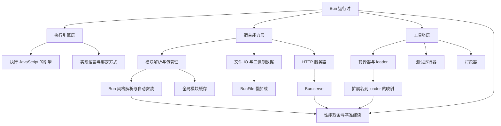
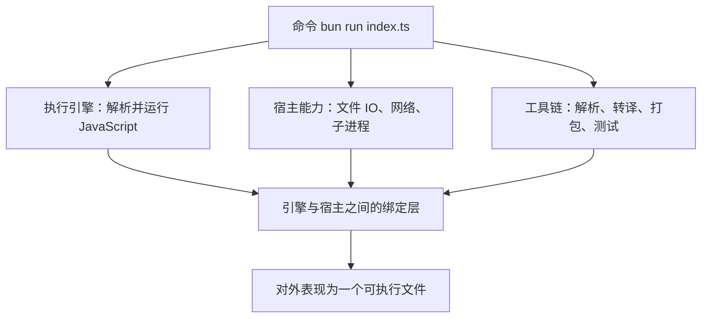
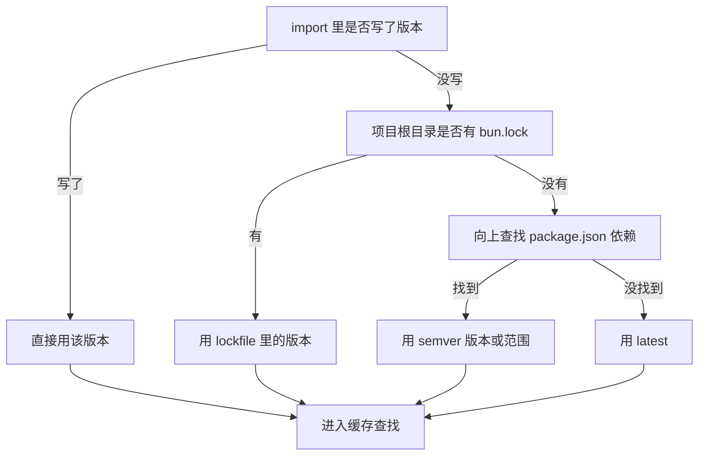
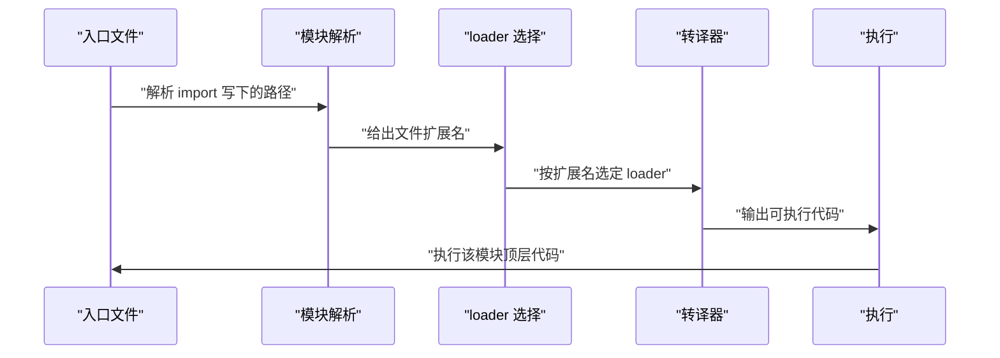
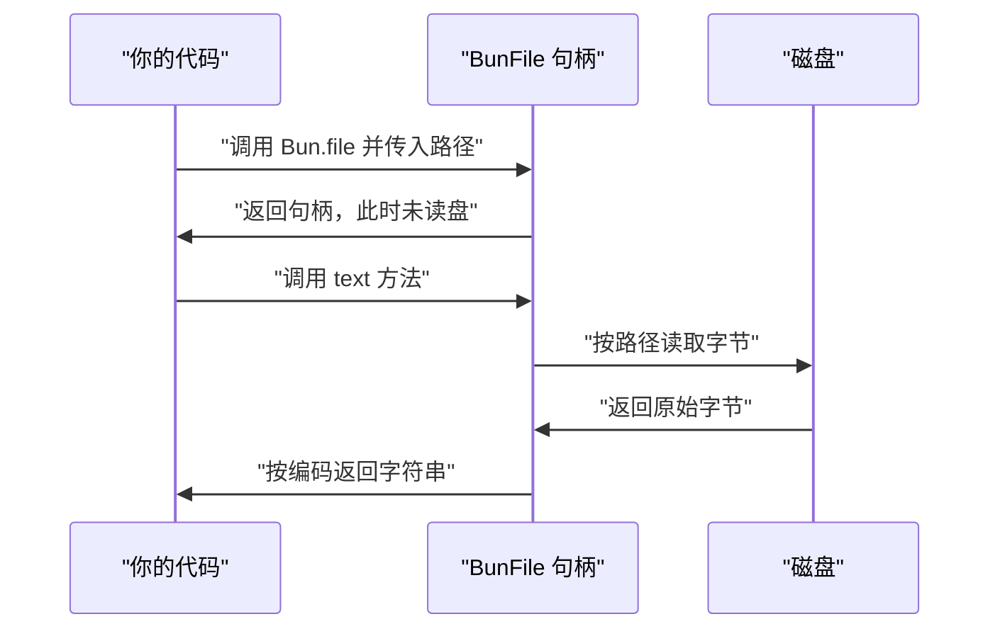
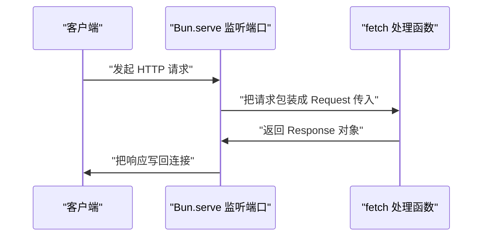
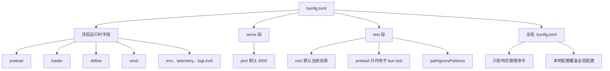
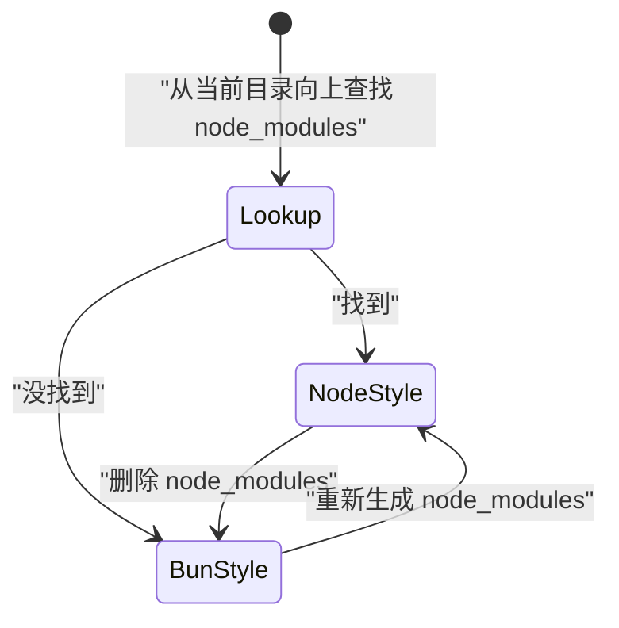
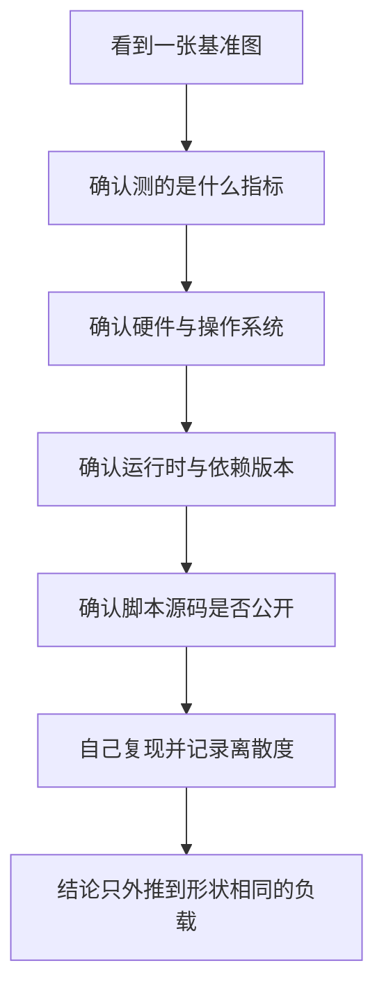

# Bun 内部原理：为什么快、快在哪、有哪些取舍

!!! abstract "学完这一页你能"
    - 说清运行时里执行引擎、宿主能力、工具链三块各自的职责，并标出哪些结论必须回官方文档核对。
    - 画出 Bun 模块解析的判定流程，写出"没有 node_modules 也能运行"的三步版本决策。
    - 用 Bun.file、Bun.write、Bun.serve 写出可运行的读写与 HTTP 示例，并指出懒加载发生在哪一步。
    - 拿到一张性能对比图时，列出六个必查项，判断它能不能外推到你的项目。

## 0. 知识地图



建议先读第 1 节，建立"引擎、宿主、工具链"三层的坐标。再读第 2 到第 5 节，看模块解析、转译、文件 IO、HTTP 各自怎么落地。

第 6、7 节讲内置工具链与兼容取舍，第 8 节讲怎么读性能数据。若只想知道"快在哪"，从第 1、3、4 节读起。

## 1. 执行引擎与实现语言：先分清哪部分是可核对的

**先想一个问题**

你敲下 `bun run index.ts`，脚本开始输出结果。这中间是谁在解析并执行 JavaScript？这一层决定了启动路径的长短，也是各类"为什么快"说法的落点。

**心智模型**

!!! tip "心智模型"
    一句话模型：运行时等于"执行引擎 + 宿主能力 + 工具链"，三者装进同一个进程。
    日常类比：厨房里灶台、水电、备菜台，三件东西紧挨着，端菜不用出房门。
    类比不成立处：厨房三件东西各自独立，而运行时里它们共享同一份内存与同一套对象，省下的是进程切换与跨进程数据传递，不是让灶台本身火力变大。

!!! note "术语：执行引擎"
    负责把 JavaScript 源码解析成字节码或机器码并运行的那段程序。例子：同一个 .js 文件在不同引擎上跑，输出一样，但内部执行方式可以不同。

**图解**



1. 命令进入可执行文件，也就是运行时的入口。
2. 入口把工作分成三条线：跑 JavaScript、提供宿主能力、提供工具链。
3. 三条线都通过绑定层访问同一份进程内资源。
4. 绑定层是"省掉进程间通信"这句话真正指向的位置。
5. 最终开发者看到的是一个命令，而不是三个独立程序。

**一步一步来**

**第 1 步：写下你要核对的断言。** 先把"听说"变成一句可验证的话，例如"这个运行时用某个特定引擎"。

```text
断言一：运行时使用哪个 JavaScript 引擎
断言二：运行时主体用什么语言实现
断言三：引擎与宿主能力之间如何绑定
每条断言都需要在官方文档里找到出处，找不到就标注未覆盖。
```

**这段代码在做什么**
1. 这只是核对清单，不是可执行代码。
2. 把模糊印象拆成三条彼此独立的断言。
3. 每条断言都要有出处，否则不能写进结论。
4. 本页资料未覆盖这三条断言的答案，需核对官方文档：运行时章节中关于引擎与实现语言的说明。

**第 2 步：在运行时里采集可观测信息。** 你能直接读到的是 `process.versions`，它反映运行时暴露的版本键。

```js
// process.versions 是一个对象，键名由运行时自己决定
const versions = process.versions;
console.log(Object.keys(versions).sort()); // 打印排序后的键名列表
console.log(typeof versions.node);          // Node 20 下是 string
```

**这段代码在做什么**
1. `process.versions` 由标准运行时环境提供，键名不固定。
2. `Object.keys` 取出全部键名，排序后方便对比两次输出。
3. `typeof versions.node` 在 Node 20 下返回 `"string"`。
4. 换运行时后，键集合会变化，需要重新运行再对比。
5. 键集合只能告诉你"暴露了什么"，不能告诉你"内部用了什么引擎"。

**运行结果**：Node 20 下会打印一组排序后的键名，并且第二行为 `string`。

**第 3 步：检查全局命名空间。** Bun 把自身 API 挂在全局 `Bun` 对象上，这是资料明确写到的。

```js
// typeof 对未声明的标识符是安全的，不会抛错
console.log(typeof Bun);        // Node 下是 undefined
console.log(typeof globalThis); // 两边都是 object
```

**这段代码在做什么**
1. `typeof` 遇到未声明的名字返回字符串，不会触发引用错误。
2. Node 下 `typeof Bun` 输出 `undefined`。
3. Bun 下 `Bun` 是可访问的命名空间，具体成员需核对官方文档。
4. 这一行只能证明"宿主有没有挂这个命名空间"。

**运行结果**：Node 20 下输出 `undefined` 和 `object`。

**动手验证**

把上面三步合成一个脚本。以 `.mjs` 保存，或在 `package.json` 里设置 `type` 为 `module`。依赖：仅 Node 内置模块 `node:assert`。

```js
// 文件：check-runtime.mjs
// 依赖：node:assert（Node 20+ 内置）
import assert from "node:assert/strict";

// 可观测信息一：运行时暴露的版本键
const versions = process.versions;
assert.equal(typeof versions, "object");       // 必须是对象
assert.equal(typeof versions.node, "string");  // Node 20 暴露该键

// 可观测信息二：全局是否存在 Bun 命名空间
const hasBunGlobal = typeof Bun !== "undefined"; // Node 下为 false

// 可观测信息三：整理成可复制的报告
const report = {
  nodeVersionKey: versions.node,                       // 本机 Node 版本
  hasBunGlobal,                                        // 是否有 Bun 全局对象
  keyCount: Object.keys(versions).length,              // 键的数量
  sortedKeys: Object.keys(versions).sort().join(","),  // 排序后的键名
};

console.log(JSON.stringify(report, null, 2));
console.log("运行时信息采集完成");
```

在 Node 下运行 `node check-runtime.mjs`。预期输出如下，其中版本号以你本机为准。

```text
{
  "nodeVersionKey": "你的本机版本",
  "hasBunGlobal": false,
  "keyCount": 一串数字,
  "sortedKeys": "一组排序后的键名"
}
运行时信息采集完成
```

在装有 Bun 的机器上执行 `bun run check-runtime.mjs`，`hasBunGlobal` 会变成 `true`，键集合也会不同。需核对官方文档：Bun 官方运行时章节里关于引擎与实现语言的页面名称。

**常见坑**

| 现象 | 原因 | 怎么修 |
| --- | --- | --- |
| 键名列表和同事的不一样 | 运行时版本不同，暴露的键会变 | 把运行时版本一起记录，别只对比键名 |
| 断言想验证"用了哪个引擎" | 可观测信息不包含引擎名 | 改为核对官方文档，把结论降级为待核实 |
| 脚本报语法错误 | 用了顶层 await 但文件是 CommonJS | 改用 `.mjs`，或设置 `type` 为 `module` |

**小结**

1. 运行时可以拆成引擎、宿主能力、工具链三层，绑定层是三者共享进程的位置。
2. `process.versions` 与全局命名空间只能证明"暴露了什么"，证明不了引擎身份。
3. 本页资料未覆盖引擎与实现语言，需核对官方文档后再下结论。

## 2. 模块解析：没有 node_modules 也能跑起来

**先想一个问题**

你把项目里的 `node_modules` 整个删掉，然后直接 `bun run index.ts`。脚本还能跑吗？资料给出的答案是能，前提是没有找到 `node_modules`，Bun 会切换到自己的解析算法。

**心智模型**

!!! tip "心智模型"
    一句话模型：没找到 node_modules 时，Bun 把"安装"从运行前挪到运行中，用全局缓存当仓库。
    日常类比：不把书搬回家，需要时去总馆取，并在总馆留一张按版本命名的索引卡。
    类比不成立处：图书馆取书有往返路程，Bun 缓存命中后只查本地磁盘路径，不产生网络往返，也不会把书还回去。

!!! note "术语：Node.js 风格模块解析"
    从当前目录逐级向上查找 `node_modules`，按其中的目录结构定位包的解析方式。例子：`import x from "foo"` 会命中最近的 `node_modules/foo`。

!!! note "术语：Bun 模块解析算法"
    没有找到 `node_modules` 时启用的解析方式，在运行过程中把每个被导入的包自动安装进全局模块缓存。例子：首次运行 `import { foo } from "foo"` 会安装 `latest` 并缓存，后续运行复用缓存。

**图解**



1. 第一步看 `import` 语句里有没有写版本号，写了就跳过后续决策。
2. 没写就看项目根目录有没有 `bun.lock`，有就用 lockfile 指定的版本。
3. 没有 lockfile 就向上查找 `package.json`，命中则用其中的 semver 版本或范围。
4. 两条都没命中，退回到 `latest`。
5. 版本确定后统一进入缓存查找阶段，缓存未命中才下载。

**一步一步来**

**第 1 步：判断走哪套解析。** 这一步决定后面所有行为，判定条件只有一个：能不能找到 `node_modules`。

```js
import { existsSync } from "node:fs";

// 从起点目录开始，逐级向上查找 node_modules
function findNodeModules(start) {
  let dir = start;
  while (true) {
    if (existsSync(`${dir}/node_modules`)) return `${dir}/node_modules`; // 命中
    const cut = dir.lastIndexOf("/");                  // 找最后一段分隔符
    if (cut <= 0) return null;                         // 已到根目录
    dir = dir.slice(0, cut);                           // 上移一层
  }
}
```

**这段代码在做什么**
1. 用 `existsSync` 判断某一层有没有 `node_modules` 目录。
2. 命中就返回该层路径，调用方据此选择解析模式。
3. 每轮循环用字符串切分上移一层，直到根目录。
4. 返回 `null` 表示整条祖先链都没有命中。
5. 只有在返回 `null` 时，Bun 才会启用自己的解析算法。

**运行结果**：需在你自己的项目目录里调用，输出取决于目录结构。

**第 2 步：决定安装哪个版本。** 决策是三段式的：lockfile、package.json、latest。

```js
// 输入来自三个地方：import 写法、bun.lock、package.json
function pickVersion({ importVersion, lockVersion, pkgVersion }) {
  if (importVersion) return importVersion; // import 里写死了版本
  if (lockVersion) return lockVersion;     // bun.lock 优先
  if (pkgVersion) return pkgVersion;       // package.json 的 semver
  return "latest";                         // 三者都没有时的兜底
}
```

**这段代码在做什么**
1. 参数顺序对应资料的决策顺序，`import` 里写死的版本排在最前。
2. `bun.lock` 存在时优先级高于 `package.json`。
3. `package.json` 里可以是精确版本，也可以是范围。
4. 三者都缺失才落到 `latest`。
5. 函数是纯函数，方便写断言测试。

**运行结果**：`pickVersion({})` 返回字符串 `latest`。

**第 3 步：查缓存，再决定是否下载。** 缓存命中就不联网；`latest` 有一个 24 小时的窗口。

```js
const DAY = 24 * 60 * 60 * 1000; // 一天对应的毫秒数

// 判断这次解析要不要走 npm registry 下载
function decideFetch({ hasCompatibleCache, latestCachedAt, now }) {
  if (hasCompatibleCache) return "cache";            // 有兼容版本
  if (now - latestCachedAt < DAY) return "cache";    // 24 小时内下过 latest
  return "download";                                 // 否则下载
}
```

**这段代码在做什么**
1. 兼容版本命中缓存时直接返回，不发起网络请求。
2. 解析目标是 `latest` 时，检查上次下载时间是否在 24 小时内。
3. 两条都不满足才返回 `download`。
4. 官方说明缓存目录形如 `<cache>/<pkg>@<version>`，同一包的多个版本可以并存。
5. 官方还说明会创建 `<cache>/<pkg>/<version>` 符号链接，用来加快查找已缓存版本。

**运行结果**：`decideFetch({ hasCompatibleCache: false, latestCachedAt: 0, now: DAY })` 返回 `download`。

**第 4 步：在 import 里直接写版本，跳过整条决策链。** 这条路径适合脚本与分享片段。

```js
import { z } from "zod@3.0.0";            // 精确版本
import { z as zNext } from "zod@next";    // npm 标签
import { z as zRange } from "zod@^3.20.0"; // semver 范围
```

**这段代码在做什么**
1. `@3.0.0` 是精确版本，解析时不需要查 lockfile。
2. `@next` 是 npm 标签，走注册表标签解析。
3. `@^3.20.0` 是 semver 范围，命中范围内任一兼容版本。
4. 官方说明这条路径让源文件自包含，分享脚本时不需要连 `package.json` 一起打包。
5. 官方同时说明，这种写法下 IDE 不会有智能提示，因为类型声明文件来自 `node_modules`。

**运行结果**：三条导入各自解析为 import 写法中指定的版本。

**动手验证**

把上面三个纯函数拼成一个脚本，用断言钉住顺序。依赖：仅 Node 内置模块 `node:assert`。

```js
// 文件：resolve-version.mjs
// 依赖：node:assert（Node 20+ 内置）
import assert from "node:assert/strict";

// 解析模式：找到 node_modules 走 Node 风格，否则走 Bun 风格
function pickMode(dirHasNodeModules) {
  return dirHasNodeModules ? "node-style" : "bun-style";
}

// 版本决策：import 写法、lockfile、package.json、latest
function pickVersion({ importVersion, lockVersion, pkgVersion }) {
  if (importVersion) return importVersion; // 最高优先级
  if (lockVersion) return lockVersion;     // 次高优先级
  if (pkgVersion) return pkgVersion;       // 再次
  return "latest";                         // 兜底
}

const DAY = 24 * 60 * 60 * 1000; // 一天毫秒数

// 是否下载：缓存命中或 24 小时内的 latest 都算命中
function decideFetch({ hasCompatibleCache, latestCachedAt, now }) {
  if (hasCompatibleCache) return "cache";
  if (now - latestCachedAt < DAY) return "cache";
  return "download";
}

assert.equal(pickMode(true), "node-style");    // 有 node_modules
assert.equal(pickMode(false), "bun-style");    // 没有 node_modules
assert.equal(pickVersion({}), "latest");       // 什么都不给
assert.equal(pickVersion({ pkgVersion: "^3.20.0" }), "^3.20.0");
assert.equal(pickVersion({ lockVersion: "3.0.0", pkgVersion: "^3.20.0" }), "3.0.0");
assert.equal(pickVersion({ importVersion: "3.0.0", lockVersion: "9.9.9" }), "3.0.0");
assert.equal(decideFetch({ hasCompatibleCache: true, latestCachedAt: 0, now: 0 }), "cache");
assert.equal(decideFetch({ hasCompatibleCache: false, latestCachedAt: 0, now: DAY - 1 }), "cache");
assert.equal(decideFetch({ hasCompatibleCache: false, latestCachedAt: 0, now: DAY }), "download");

console.log("模块解析与版本决策断言全部通过");
```

预期输出：

```text
模块解析与版本决策断言全部通过
```

**常见坑**

| 现象 | 原因 | 怎么修 |
| --- | --- | --- |
| 删掉 node_modules 后 IDE 没有类型提示 | 类型声明文件在 node_modules 里，官方 Limitations 已列出 | 需要类型提示时保留 node_modules，或接受该取舍 |
| 打补丁工具失效 | 官方 Limitations 明确不支持 patch-package | 改动上游包，或换用其他补丁方式 |
| 想直接 import 一个网址 | 官方 FAQ 说明 Bun 目前不支持 URL imports | 先下载到本地或用包管理安装 |
| 同一个包出现两个版本目录 | 缓存目录按版本命名，官方设计为可并存多版本 | 检查 bun.lock，确认需要的版本 |

**小结**

1. 判定条件只有一个：能不能从当前目录向上找到 `node_modules`。
2. 版本决策顺序是 import 写法、bun.lock、package.json、latest。
3. 官方列出的代价是：没有 IDE 智能提示，且不支持 patch-package。

## 3. 转译器与 loader：.ts 文件为什么能直接跑

**先想一个问题**

你直接 `bun run index.ts`，没有先执行 `tsc`。类型标注是谁去掉的？答案在扩展名到 loader 的映射表里。

**心智模型**

!!! tip "心智模型"
    一句话模型：转译只做语法到语法的替换，不做类型检查。
    日常类比：把中文稿翻成英文稿，改动的是文字形态。
    类比不成立处：翻译通常要理解语义才能选词，去掉类型标注只需按语法规则删除，不需要理解这段代码的业务含义。

!!! note "术语：loader"
    运行时按文件扩展名选择的一种处理方式，决定这个文件被当作哪类资源读入。例子：`bunfig.toml` 里写 `".bagel" = "tsx"`，导入 `.bagel` 文件时就按 tsx 处理。

**图解**



1. 入口文件先被执行，遇到 `import` 语句停下来。
2. 模块解析把路径换算成本地文件，顺便拿到扩展名。
3. loader 选择按扩展名查表，用户配置优先于内置表。
4. 转译器按选定 loader 处理源码，输出可执行代码。
5. 执行阶段运行该模块的顶层代码，再回到第 2 步处理下一层导入。

**一步一步来**

**第 1 步：认识内置 loader 表。** 扩展名决定用哪种方式读入文件。

```js
// bunfig 文档列出的内置 loader 名称
const BUILTIN = [
  "jsx", "js", "ts", "tsx", "css", "file",
  "json", "toml", "wasm", "napi", "base64", "dataurl", "text",
];
console.log(BUILTIN.length); // 打印条目数量
```

**这段代码在做什么**
1. 数组内容逐项照抄官方文档的 loader 列表，一个不漏。
2. `ts` 与 `tsx` 是两个独立条目，JSX 语法走 `tsx`。
3. `toml`、`wasm`、`napi` 表示这些格式可以直接导入。
4. `base64` 与 `dataurl` 把文件内容当字符串读入。
5. `file` 表示当作外部资源处理，具体行为需核对官方文档：`file` loader 的输出形态。

**运行结果**：打印该数组的长度，数字以官方列表为准。

**第 2 步：实现映射函数，用户覆盖优先。** 这一层是 `bunfig.toml` 的 `[loader]` 段生效的位置。

```js
// 扩展名到 loader 的映射：覆盖表优先，其次内置表，最后兜底
function pickLoader(fileName, overrides = {}) {
  const dot = fileName.lastIndexOf(".");        // 找扩展名起点
  const ext = dot === -1 ? "" : fileName.slice(dot); // 含点的扩展名
  if (overrides[ext]) return overrides[ext];    // 用户配置优先
  const name = ext.slice(1);                    // 去掉前导点
  return BUILTIN.includes(name) ? name : "file"; // 兜底为 file
}
```

**这段代码在做什么**
1. 没有扩展名的文件返回空字符串，落进兜底分支。
2. 覆盖表命中时直接返回，不会再看内置表。
3. 覆盖表里没有的扩展名才查内置列表。
4. 都不命中时兜底为 `file`，避免返回 `undefined`。
5. 这条链解释了为什么新增自定义扩展名只需要改配置。

**运行结果**：`pickLoader("a.ts")` 返回 `ts`。

**第 3 步：用 bunfig 覆盖映射。** 官方给出的示例就是把自定义扩展名指向 tsx。

```toml
# bunfig.toml
[loader]
# 导入 .bagel 文件时按 tsx 处理
".bagel" = "tsx"
```

**这段代码在做什么**
1. `[loader]` 是顶层字段，键是带点的扩展名。
2. 值必须是内置 loader 名称之一。
3. 官方示例注释写明：用它加载 Bun 原生不支持的文件类型。
4. 配置文件可选，Bun 在没有它时也能工作。
5. 键的优先级高于内置表，因此可以改写既有扩展名的行为，改动前要确认影响面。

**运行结果**：需实际导入一个 `.bagel` 文件才能看到效果。

**第 4 步：需要在代码里调用转译时看 Bun.Transpiler。** 官方 API 表把它归在 Transpiler 一行。

```text
核对清单，不是可运行代码
一：构造 Bun.Transpiler 时参数是什么形状
二：同步与异步方法分别叫什么
三：是否输出 sourcemap
本页资料只给出名称与文档路径，方法签名需核对官方文档。
```

**这段代码在做什么**
1. 官方 API 表列出了 `Bun.Transpiler` 这个名称。
2. 资料未覆盖它的构造参数与方法签名。
3. 清单里的三项在动手前必须去官方文档确认。
4. 不要凭名称猜方法名，猜错会在运行时报错。

**运行结果**：无，等核对文档后再写代码。

**动手验证**

把第 1、2 步合成一个脚本。依赖：仅 Node 内置模块 `node:assert`。

```js
// 文件：pick-loader.mjs
// 依赖：node:assert（Node 20+ 内置）
import assert from "node:assert/strict";

// 官方文档列出的内置 loader 名称
const BUILTIN = [
  "jsx", "js", "ts", "tsx", "css", "file",
  "json", "toml", "wasm", "napi", "base64", "dataurl", "text",
];

// 映射规则：覆盖表优先，其次内置表，最后兜底
function pickLoader(fileName, overrides = {}) {
  const dot = fileName.lastIndexOf(".");              // 扩展名起点
  const ext = dot === -1 ? "" : fileName.slice(dot);  // 含点的扩展名
  if (overrides[ext]) return overrides[ext];          // 用户覆盖
  const name = ext.slice(1);                          // 去掉前导点
  return BUILTIN.includes(name) ? name : "file";      // 兜底
}

assert.equal(pickLoader("a.ts"), "ts");                          // 内置命中
assert.equal(pickLoader("a.tsx"), "tsx");                        // tsx 独立条目
assert.equal(pickLoader("a.bagel"), "file");                     // 未命中兜底
assert.equal(pickLoader("a.bagel", { ".bagel": "tsx" }), "tsx"); // 覆盖生效
assert.equal(pickLoader("noext"), "file");                       // 无扩展名

console.log("loader 映射断言全部通过");
```

预期输出：

```text
loader 映射断言全部通过
```

**常见坑**

| 现象 | 原因 | 怎么修 |
| --- | --- | --- |
| 配置文件写了却报找不到 loader | 值不是内置 loader 名称 | 从官方列表里挑一个，或用 `file` 兜底 |
| 改写了 `.js` 的 loader 后行为异常 | 覆盖表优先级高于内置表 | 只覆盖新扩展名，别改常用扩展名 |
| 以为会做类型检查 | 转译只做语法转换 | 单独跑类型检查工具，别依赖运行时 |
| 调用 Bun.Transpiler 报方法不存在 | 方法签名未核对 | 先查官方文档：构造参数与转译方法名 |

**小结**

1. 扩展名到 loader 的映射决定文件怎么被读入，覆盖表优先于内置表。
2. 转译解决语法问题，不解决类型问题。
3. `Bun.Transpiler` 的方法签名本页资料未覆盖，需核对官方文档。

## 4. 文件 IO 与二进制数据：句柄先拿到，内容后读

**先想一个问题**

你要读一个很大的文件，会先把整个文件读进内存吗？Bun 的做法是先给你一个句柄，真正读取发生在你调用读取方法的那一刻。

**心智模型**

!!! tip "心智模型"
    一句话模型：`Bun.file(path)` 返回指向磁盘的句柄，调用 `bytes`、`text`、`blob` 时才真正读盘。
    日常类比：先拿到快递单号，再去取件。
    类比不成立处：单号有有效期，句柄只是路径的包装；文件在创建句柄之后被删除，报错会出现在读取那一步，而不是创建那一步。

!!! note "术语：BunFile"
    Bun 特有的类，继承自 Blob，代表磁盘上一个懒加载的文件，用 `Bun.file(path)` 创建。例子：`const f = Bun.file("./a.txt")` 这一行不触发磁盘读取。

!!! note "术语：Blob"
    一段只读的二进制数据，带 MIME（Multipurpose Internet Mail Extensions，多用途互联网邮件扩展）类型与大小，可转成 ArrayBuffer（二进制缓冲区）、ReadableStream（可读流）和字符串。

**图解**



1. 创建句柄阶段只记录路径，不做 IO（Input/Output，输入输出）。
2. 句柄对外表现为 Blob 的子类，因此具备转换方法。
3. 调用 `text` 时才触发读取，读取的是当前磁盘内容。
4. 磁盘返回原始字节。
5. 句柄按需把字节转成字符串、字节数组或 Blob。

**一步一步来**

**第 1 步：创建句柄，观察它不读盘。** 这一步只有一个调用。

```js
const file = Bun.file("./data.txt"); // 只记录路径，不读盘
console.log(file instanceof Blob);   // BunFile 继承自 Blob
```

**这段代码在做什么**
1. `Bun.file` 接收路径，返回 BunFile 实例。
2. 官方文档写明它是磁盘上文件的懒加载表示。
3. 因为继承自 Blob，它可以直接参与 Blob 相关的 API。
4. 此时文件不存在也不会报错，报错推迟到读取阶段。
5. `instanceof Blob` 检查用来确认继承关系。

**运行结果**：第二行输出 `true`。

**第 2 步：按需要的形态读取。** 同一份磁盘字节可以有三种出口。

```js
const text = await Bun.file("./data.txt").text();   // 转成字符串
const bytes = await Bun.file("./data.bin").bytes(); // 转成 Uint8Array
const blob = await Bun.file("./data.bin").blob();   // 转成 Blob
```

**这段代码在做什么**
1. `text` 适合读配置、模板、文本数据。
2. `bytes` 返回 `Uint8Array`，适合二进制处理。
3. `blob` 返回 Blob，可以直接交给需要 Blob 的接口。
4. 三种调用都会触发一次读取，读多次就多读几次。
5. 官方资料里的归档示例用的正是 `Bun.file(...).bytes()`。

**运行结果**：三种形态的内容一致，类型不同。

**第 3 步：写入用 Bun.write。** 归档示例里就是用它对磁盘写文件。

```js
await Bun.write("out.txt", "hello");                 // 写字符串
await Bun.write("out.bin", new Uint8Array([1, 2, 3])); // 写字节
```

**这段代码在做什么**
1. 第一个参数是目标路径，第二个参数是内容。
2. 内容可以是字符串，也可以是字节视图。
3. 官方归档示例用 `Bun.write` 把归档对象写到磁盘。
4. 写入是异步的，需要 `await`。
5. 资料未覆盖写入的原子性与覆盖语义，需核对官方文档：`Bun.write` 的覆盖与并发行为。

**运行结果**：磁盘上出现两个文件。

**第 4 步：处理二进制时用视图，而不是直接读 ArrayBuffer。** 官方文档写明 ArrayBuffer 不能直接读写。

```js
const buf = new ArrayBuffer(4);   // 预留 4 个字节
const dv = new DataView(buf);     // 创建读写视图
dv.setUint8(0, 3);                // 第 0 字节写 3
dv.setUint16(1, 513);             // 第 1 字节起写两个字节
console.log(dv.getUint8(1));      // 读取第 1 字节
console.log(dv.getUint8(2));      // 读取第 2 字节
```

**这段代码在做什么**
1. `ArrayBuffer` 只能查看大小和切片，不能直接读写值。
2. `DataView` 是按字节偏移读写的视图，适合二进制协议。
3. 513 等于 `2 * 256 + 1`，按大端序落到第 1、2 字节。
4. 高位落在第 1 字节，值为 2；低位落在第 2 字节，值为 1。
5. 写入超出缓冲区长度会抛 `RangeError`，官方文档给出了 `setFloat64` 的越界例子。

**运行结果**：先输出 `2`，再输出 `1`。

**动手验证**

把读写与视图合成一个脚本。以 `.mjs` 保存。依赖：仅 Node 内置模块 `node:assert`、`node:fs/promises`、`node:os`、`node:path`。

```js
// 文件：io-demo.mjs
// 依赖：node:assert、node:fs/promises、node:os、node:path（均为内置）
import assert from "node:assert/strict";
import { mkdtemp, readFile, writeFile } from "node:fs/promises";
import { tmpdir } from "node:os";
import { join } from "node:path";

const dir = await mkdtemp(join(tmpdir(), "io-demo-")); // 建临时目录
const file = join(dir, "data.txt");                    // 目标文件路径

await writeFile(file, "hello bun");            // 写入 9 个字节
const text = await readFile(file, "utf8");     // 按文本读回
assert.equal(text, "hello bun");               // 内容一致

const bytes = await readFile(file);            // 按字节读回
assert.ok(bytes instanceof Uint8Array);        // 是字节视图
assert.equal(bytes.byteLength, 9);             // 长度校验

const blob = new Blob([bytes], { type: "text/plain" }); // 带 MIME 类型
assert.equal(blob.size, 9);                    // 大小与字节数一致
assert.equal(blob.type, "text/plain");         // MIME 类型保留

const buf = new ArrayBuffer(4);                // 四个字节的缓冲区
const dv = new DataView(buf);                  // 读写视图
dv.setUint8(0, 3);                             // 第 0 字节写 3
dv.setUint16(1, 513);                          // 大端序写两个字节
assert.equal(dv.getUint8(1), 2);               // 高位在前
assert.equal(dv.getUint8(2), 1);               // 低位在后
assert.throws(() => dv.setFloat64(0, 3.1415), RangeError); // 越界抛错

console.log(text, blob.size, dv.getUint16(1));
```

预期输出：

```text
hello bun 9 513
```

**常见坑**

| 现象 | 原因 | 怎么修 |
| --- | --- | --- |
| 创建句柄后立刻读文件报不存在 | 句柄是懒加载，读取时文件已不在 | 先确认文件存在，再调用读取方法 |
| 读大文件时内存上涨 | 每次调用 `bytes` 都完整读入 | 需要分块处理时改用流式接口，具体 API 需核对官方文档 |
| 写入数字被当成字符串 | 值类型决定写入格式 | 二进制内容传 `Uint8Array` |
| `RangeError: Out of bounds access` | 写入长度超出缓冲区 | 按目标类型的字节宽度预留 ArrayBuffer |

**小结**

1. `Bun.file` 返回懒加载句柄，读取发生在调用 `text`、`bytes`、`blob` 时。
2. `Bun.write` 负责写盘，内容可以是字符串或字节视图。
3. 读写二进制要用 `DataView` 或 TypedArray（类型化数组）视图，直接操作 ArrayBuffer 不可行。

## 5. Bun.serve：请求进，响应出的内置服务器

**先想一个问题**

你要写一个返回 `Success!` 的接口，需要先装一个 Web 框架吗？官方 API 表把 HTTP 服务器列在 `Bun.serve` 一行，说明它属于内置能力。

**心智模型**

!!! tip "心智模型"
    一句话模型：服务器就是一个函数，Request（请求对象）进，Response（响应对象）出。
    日常类比：前台接待，访客说需求，前台给答复。
    类比不成立处：前台会主动找人、记会话状态，`fetch` 处理函数是一次输入一次输出的纯函数，会话状态要你自己用变量或存储维护。

!!! note "术语：Bun.serve"
    Bun 内置的 HTTP（HyperText Transfer Protocol，超文本传输协议）服务器 API，接收配置对象，其中 `fetch` 字段接收 Request 并返回 Response。

**图解**



1. 客户端向端口发起请求。
2. `Bun.serve` 负责协议解析，把报文包装成标准 Request 对象。
3. Request 被传进你写的 `fetch` 函数。
4. 函数返回 Response 对象，函数体不用关心连接细节。
5. 服务器把 Response 序列化后写回客户端。

**一步一步来**

**第 1 步：写出最小服务器。** 官方示例只有三行核心代码。

```js
Bun.serve({
  fetch(req) {                        // 每个请求调用一次
    return new Response("Success!");  // 直接返回响应体
  },
});
```

**这段代码在做什么**
1. `Bun.serve` 接收一个配置对象。
2. 配置里的 `fetch` 字段是请求处理函数。
3. 函数返回值必须是 Response，可以带响应体和响应头。
4. 官方文档说明这套 API 建立在 `Blob`、`URL`、`Request` 等标准对象之上。
5. 资料未覆盖 TLS（Transport Layer Security，传输层安全）配置字段，需核对官方文档。

**运行结果**：需实际运行并访问端口才能看到 `Success!`。

**第 2 步：端口从哪里来。** 官方给出三个来源。

```toml
# bunfig.toml
[serve]
port = 3000 # 未设置时的默认端口
```

**这段代码在做什么**
1. `[serve] port` 的默认值是 3000。
2. 官方还写明可以用 `BUN_PORT` 或 `PORT` 环境变量设置。
3. 命令行 `--port` 参数也可以设置端口。
4. 三个来源之间的优先级，资料未覆盖，需核对官方文档。
5. 部署到平台时，环境变量通常由平台注入，需要先确认平台用哪个变量名。

**运行结果**：不配置时监听 3000。

**第 3 步：WebSocket（全双工通信协议）也挂在这条路径上。** 官方 API 表写明服务端用 `Bun.serve`。

```js
// 客户端使用标准构造器，浏览器与 Bun 都可运行
const ws = new WebSocket("ws://localhost:3000"); // 地址按实际端口修改
ws.onopen = () => ws.send("hello");              // 连接建立后发送
ws.onmessage = (e) => console.log(e.data);       // 收到消息时打印
```

**这段代码在做什么**
1. 客户端用标准 `WebSocket` 构造器，不需要第三方库。
2. 服务端一侧按官方 API 表由 `Bun.serve` 承载。
3. 服务端具体配置字段资料未覆盖，需核对官方文档：`Bun.serve` 的 websocket 相关字段。
4. 这套写法与浏览器一致，代码可以在两端复用相同消息格式。

**运行结果**：需服务端配合才能看到消息。

**第 4 步：同类内置服务器还有三种。** 资料的表里各自列出对应 API。

```text
TCP（Transmission Control Protocol，传输控制协议）：Bun.listen 与 Bun.connect
UDP（User Datagram Protocol，用户数据报协议）：Bun.udpSocket
子进程：Bun.spawn 与 Bun.spawnSync
同时还有 Shell 的 $ 与打包器 Bun.build。
```

**这段代码在做什么**
1. TCP 与 UDP 各有独立的起步函数，不经过 HTTP 层。
2. 子进程有两个入口：异步的 `Bun.spawn` 与阻塞式的 `Bun.spawnSync`。
3. `$` 提供 Shell 能力，官方 API 表把它单列一行。
4. `Bun.build` 属于打包能力，后面第 6 节展开。
5. 这些名字都来自官方 API 表，参数细节需核对官方文档。

**运行结果**：无，本段是索引。

**动手验证**

Node 20 自带 `fetch`，可以用内置 HTTP 服务器模拟同样的"Request 进、Response 出"形状。依赖：仅 Node 内置模块 `node:assert`、`node:http`。以 `.mjs` 保存。

```js
// 文件：serve-demo.mjs
// 依赖：node:assert、node:http（均为内置）
import assert from "node:assert/strict";
import { createServer } from "node:http";

// 与 Bun.serve 形状对应的处理逻辑
const server = createServer((req, res) => {
  res.writeHead(200, { "content-type": "text/plain" }); // 状态码与响应头
  res.end("Success!");                                   // 响应体
});

// 端口传 0 表示让操作系统分配一个空闲端口
await new Promise((resolve) => server.listen(0, resolve));
const { port } = server.address();                          // 取出真实端口
const response = await fetch(`http://127.0.0.1:${port}/`);  // 自己请求自己
assert.equal(response.status, 200);                         // 状态码校验
assert.equal(await response.text(), "Success!");            // 响应体校验
server.close();                                             // 关闭监听

console.log("状态码", response.status, "响应体 Success!");
```

预期输出：

```text
状态码 200 响应体 Success!
```

**常见坑**

| 现象 | 原因 | 怎么修 |
| --- | --- | --- |
| 启动时报端口被占用 | 3000 被别的进程占用 | 换端口，或先用 `PORT` 环境变量指定 |
| 处理函数抛错导致请求挂住 | 异常没有被捕获 | 在 `fetch` 里加 try/catch，返回 500 响应 |
| 改了 `bunfig` 里的端口不生效 | 命令行或环境变量覆盖了配置 | 逐个排除三个来源，按官方文档确认优先级 |
| WebSocket 握手失败 | 服务端字段配置不对 | 核对官方文档：`Bun.serve` 中 websocket 相关字段 |

**小结**

1. `Bun.serve` 的处理函数只做一件事：Request 进，Response 出。
2. 端口有三个来源，默认 3000，优先级需核对官方文档。
3. TCP、UDP、子进程、Shell、打包器都在内置 API 表内，名字先记住，参数查文档。

## 6. 内置工具链：测试、打包与一份配置文件

**先想一个问题**

一个仓库要跑测试、要打包、要装依赖，你会装几个命令行工具？Bun 把这些能力放进同一个可执行文件里，配置也集中到一份 `bunfig.toml`。

**心智模型**

!!! tip "心智模型"
    一句话模型：工具链内置于运行时，和运行时共用同一套解析与转译代码。
    日常类比：一本装订在一起的册子，翻页不用换本。
    类比不成立处：册子内容是固定的，工具链可以通过 `bunfig.toml` 的 `loader` 段扩展可处理的文件类型。

!!! note "术语：bunfig.toml"
    Bun 的配置文件，只放 Bun 特有设置，可选。官方说明 Bun 在能复用 `package.json` 与 `tsconfig.json` 的地方就复用。

**图解**



1. 配置文件分成顶层运行时字段、`serve` 段、`test` 段。
2. 顶层字段管预加载、loader、常量替换、内存模式等。
3. `serve` 段目前只管端口。
4. `test` 段管测试根目录、测试预加载、忽略规则。
5. 全局配置文件只被包管理命令读取，本地文件覆盖同名的全局键。
6. 命令行参数在适用处覆盖配置文件。

**一步一步来**

**第 1 步：配置测试运行器。** 官方的 `[test]` 段有三个可用键。

```toml
# bunfig.toml
[test]
root = "./__tests__"      # 测试根目录，默认当前目录
preload = ["./setup.ts"]  # 只对 bun test 生效的预加载
pathIgnorePatterns = ["dist/**"] # 按 glob 排除文件与目录
```

**这段代码在做什么**
1. `root` 决定从哪个目录开始发现测试文件，默认是 `.`。
2. `test.preload` 与顶层 `preload` 同名但作用范围不同。
3. `pathIgnorePatterns` 用 glob（通配模式）排除文件，官方说明会剪掉匹配到的目录。
4. 顶层 `preload` 作用于运行文件与脚本，`[test] preload` 只作用于 `bun test`。
5. `--console-depth` 之类的命令行参数可以覆盖配置项。

**运行结果**：需实际跑 `bun test` 才能看到效果。

**第 2 步：打包能力看 Bun.build。** 官方 API 表把它列在 Bundler 一行。

```text
核对清单，不是可运行代码
一：入口字段名如何传多个文件
二：输出格式与目标平台怎么指定
三：是否输出 sourcemap 与代码分割
四项都需核对官方文档：Bun.build 的参数与返回值。
```

**这段代码在做什么**
1. 官方 API 表只给出名称 `Bun.build` 与文档路径。
2. 资料未覆盖参数列表，因此不写猜测的调用代码。
3. 清单里的三项是接项目时最先要确认的。
4. loader 配置对打包同样生效，这是与第 3 节的连接点。

**运行结果**：无，等核对文档。

**第 3 步：配置运行时行为。** 这几个键直接影响内存与可观测性。

```toml
# bunfig.toml
smol = true         # 降低内存占用，官方说明代价是性能
logLevel = "debug"  # 取值 debug、warn、error
telemetry = false   # 目前只控制匿名崩溃报告

[env]
file = false        # 关闭默认的 .env 加载
```

**这段代码在做什么**
1. `smol` 是官方明确写出取舍的开关：省内存，付出性能。
2. `logLevel` 有三个取值，官方逐个列出。
3. `telemetry` 默认开启，官方目前只用它收集匿名崩溃报告。
4. `env` 默认加载 `.env` 文件，可以关掉；关掉后用 `--env-file` 显式指定的文件仍会加载。
5. 生产环境想只依赖系统环境变量时，这个开关是官方推荐的用法。

**运行结果**：需实际运行观察内存与日志变化。

**第 4 步：常量替换、预加载与输出深度。** 这三个键对应构建与调试。

```toml
# bunfig.toml
preload = ["./preload.ts"] # 运行任何脚本前先执行

[define]
"process.env.bagel" = "'lox'" # 把该表达式替换为字符串 lox

[console]
depth = 3 # console.log 的对象展开深度，默认 2
```

**这段代码在做什么**
1. `preload` 是数组，适合注册插件或做全局初始化。
2. `define` 把全局标识符替换成常量表达式，值按 JSON（JavaScript Object Notation，JavaScript 对象表示法）解析。
3. 官方提醒 `define` 的值解析规则可能在未来版本改成纯 TOML，属于历史遗留。
4. `console.depth` 默认 2，调大能看深层属性，输出也会变长。
5. `--console-depth` 命令行参数可以覆盖这个键。

**运行结果**：需实际运行观察替换与打印效果。

**动手验证**

配置优先级可以用纯函数验证。依赖：仅 Node 内置模块 `node:assert`。以 `.mjs` 保存。

```js
// 文件：config-precedence.mjs
// 依赖：node:assert（Node 20+ 内置）
import assert from "node:assert/strict";

// 官方说明：本地配置覆盖全局配置，命令行参数覆盖配置文件
function resolveConfig(globalCfg, localCfg, cliCfg) {
  return { ...globalCfg, ...localCfg, ...cliCfg }; // 后写的键胜出
}

const merged = resolveConfig(
  { logLevel: "warn", smol: false }, // 全局
  { smol: true },                    // 本地
  { logLevel: "debug" },             // 命令行
);
assert.equal(merged.smol, true);        // 本地覆盖全局
assert.equal(merged.logLevel, "debug"); // 命令行覆盖两者

// 官方说明：只有包管理命令读取全局 .bunfig.toml
function readsGlobal(command) {
  const pmCommands = ["install", "add", "remove", "update", "pm", "x"];
  return pmCommands.includes(command); // 命中才读全局文件
}
assert.equal(readsGlobal("install"), true); // 包管理命令会读
assert.equal(readsGlobal("run"), false);    // 运行脚本不读

console.log(JSON.stringify(merged), "run 不读全局配置");
```

预期输出：

```text
{"logLevel":"debug","smol":true} run 不读全局配置
```

**常见坑**

| 现象 | 原因 | 怎么修 |
| --- | --- | --- |
| 改了全局配置文件但 `bun run` 没反应 | 只有包管理命令读全局文件 | 把运行时设置放到项目根的 `bunfig.toml` |
| 本地配置没生效 | 命令行参数覆盖了同名键 | 去掉对应命令行参数再试 |
| 打开 `smol` 后变慢 | 官方说明该模式降低内存的代价是性能 | 只在内存紧张时开启，并重新测一遍 |
| `define` 替换结果不是预期类型 | 值按 JSON 解析，规则有历史包袱 | 用单引号包字符串，并核对官方文档 |

**小结**

1. `bunfig.toml` 可选，只放 Bun 特有设置，其余配置继续用 `package.json` 与 `tsconfig.json`。
2. 全局配置文件只影响包管理命令，本地文件覆盖全局，命令行覆盖配置文件。
3. `smol` 是官方明确写出取舍的开关：省内存，代价是性能。

## 7. Node 兼容策略：两套解析模式之间切换

**先想一个问题**

你的旧项目里写了 `import fs from "node:fs"`，也用了 `Buffer`。搬到 Bun 要改代码吗？这一节看兼容是按什么条件切换的。

**心智模型**

!!! tip "心智模型"
    一句话模型：找到 `node_modules` 就走 Node 风格解析，找不到就走 Bun 风格解析。
    日常类比：路口两块路牌，一块写着去老城区，一块写着去新城区。
    类比不成立处：路牌同时可见，Bun 是二选一；而且切换方式是删掉或重建 `node_modules`，不是一个开关。

!!! note "术语：Buffer"
    Node.js 的 API，是 `Uint8Array` 的子类，带一批便捷方法。它在浏览器里不存在，Bun 实现了它。

**图解**



1. 进入状态机前先做一次查找，从当前目录逐级向上。
2. 命中任意一层就进入 Node 风格解析。
3. 整条祖先链都没有，就进入 Bun 风格解析。
4. 删除 `node_modules` 会让状态回到 Bun 风格，官方把这个动作写成一条切换命令。
5. 重新生成 `node_modules` 就回到 Node 风格。

**一步一步来**

**第 1 步：确认切换条件。** 条件不由配置决定，由目录是否存在决定。

```js
import { existsSync } from "node:fs";

// 官方：当前目录或更高层没有 node_modules 时改用 Bun 解析
const hasNodeModules = existsSync("./node_modules");
console.log(hasNodeModules ? "Node 风格解析" : "Bun 风格解析");
```

**这段代码在做什么**
1. `existsSync` 检查当前目录是否存在该目录。
2. 官方原文是"工作目录或更高层"，所以真实实现要向上查找。
3. 命中时保持 Node.js 风格的模块解析。
4. 未命中时切换到 Bun 模块解析算法。
5. 这条判定是整套兼容策略的分水岭。

**运行结果**：取决于当前目录是否存在 `node_modules`。

**第 2 步：Node 风格下的行为，仍然是"装好再跑"。** 此时 `package.json` 里的版本范围说了算。

```js
// 存在 node_modules 时，Bun 用 Node.js 风格解析
// package.json 里写的 semver 版本或范围决定用哪个版本
import { foo } from "foo"; // 从 node_modules 里解析
foo();
```

**这段代码在做什么**
1. 这一模式下不触发自动安装。
2. 版本由 `package.json` 里声明的 semver 范围决定。
3. 官方说明这条路径保证向后兼容，迁移成本低。
4. 想切到 Bun 风格，官方给的命令就是删掉 `node_modules` 再运行。
5. 只有在项目根没有 lockfile 时，才会向上查找 `package.json`。

**运行结果**：需要先安装依赖。

**第 3 步：Bun 风格下的行为，边跑边装。** 这条路径下不会创建 `node_modules`。

```js
import { foo } from "foo"; // 首次运行安装 latest 并缓存
foo();
```

**这段代码在做什么**
1. 首次运行时代码在这里触发自动安装。
2. 安装目标目录是全局模块缓存，不是项目里的 `node_modules`。
3. 官方说明 `bun install` 与运行时共用同一个缓存。
4. 缓存目录按 `<cache>/<pkg>@<version>` 组织，同一包多版本共存。
5. 官方还创建 `<cache>/<pkg>/<version>` 符号链接，用来加快查找已缓存版本。

**运行结果**：首次运行会联网，后续运行走缓存。

**第 4 步：记住官方列出的三条局限。** 这些代价在选型时要写进文档。

```text
局限一：没有 IDE 智能提示，类型声明来自 node_modules
局限二：不支持 patch-package
局限三：目前不支持 URL imports
```

**这段代码在做什么**
1. 第一条来自官方 Limitations，原因是类型声明文件在 `node_modules` 里。
2. 第二条同样是官方 Limitations 原文。
3. 第三条来自官方 FAQ 与 Deno 的对比段。
4. 三条都属于"能接受就切，不能接受就保留 node_modules"。
5. 与 pnpm 的差别是：pnpm 需要先 `pnpm install`，运行时读符号链接组成的一层目录。

**运行结果**：无，本段是代价清单。

**动手验证**

用虚拟目录树验证模式选择与缓存路径形状。依赖：仅 Node 内置模块 `node:assert`。以 `.mjs` 保存。

```js
// 文件：pick-mode.mjs
// 依赖：node:assert（Node 20+ 内置）
import assert from "node:assert/strict";

// layers 从当前目录开始，向祖先目录排列
function pickModeLayers(layers) {
  for (const has of layers) {     // 逐层检查
    if (has) return "node-style"; // 任一层命中即用 Node 风格
  }
  return "bun-style";             // 全部未命中则用 Bun 风格
}

assert.equal(pickModeLayers([true, false]), "node-style");  // 当前层命中
assert.equal(pickModeLayers([false, true]), "node-style");  // 祖先层命中
assert.equal(pickModeLayers([false, false]), "bun-style");  // 全都没有

// 官方说明的缓存路径形状：每个版本一份
const cachePath = (pkg, version) => `<cache>/${pkg}@${version}`;
assert.equal(cachePath("zod", "3.0.0"), "<cache>/zod@3.0.0");

// 官方说明会建一个按包名分组的符号链接
const linkPath = (pkg, version) => `<cache>/${pkg}/${version}`;
assert.equal(linkPath("zod", "3.0.0"), "<cache>/zod/3.0.0");

console.log("解析模式与缓存路径断言通过");
```

预期输出：

```text
解析模式与缓存路径断言通过
```

**常见坑**

| 现象 | 原因 | 怎么修 |
| --- | --- | --- |
| 以为会自动装包，结果报找不到模块 | 项目里存在 `node_modules`，走了 Node 风格 | 保留依赖安装流程，或删除 `node_modules` 后再试 |
| 切到 Bun 风格后没有类型提示 | 官方 Limitations 已说明 | 需要类型提示时保留依赖目录 |
| 补丁工具不再生效 | 官方不支持 patch-package | 换一种改动方式，或保留 Node 风格 |
| 缓存里出现同一包的多个版本 | 缓存按版本命名，官方设计为可并存 | 这是预期行为，用 lockfile 固定版本即可 |

**小结**

1. 切换条件是"能不能向上找到 `node_modules`"，命中走 Node 风格，未命中走 Bun 风格。
2. Bun 风格下边跑边装，装进全局缓存，不在项目里创建 `node_modules`。
3. 官方代价清单有三条：没有智能提示、不支持 patch-package、不支持 URL imports。

## 8. 性能数据的读法与局限

**先想一个问题**

你看到一张柱状图，标题写着某运行时的启动耗时对比。这张图能说明你的项目会变快吗？要回答这个问题，得先知道图里到底测了什么。

**心智模型**

!!! tip "心智模型"
    一句话模型：基准测的是"某台机器上的某个脚本"，结论只能外推到形状相同的负载。
    日常类比：试鞋只对同款鞋有意义。
    类比不成立处：试鞋试的是同一双鞋，基准里两边运行的是不同实现，脚本、依赖、版本都可能不同。

!!! note "术语：基准测试"
    用固定脚本、固定环境、重复多次测量，得到可比较数值的实验。例子：同一个 JSON 解析循环跑 21 次，取中位数。

**图解**



1. 先确认指标：启动时间、吞吐、内存占用，三者不能混在一起比。
2. 再确认硬件与操作系统，同一脚本在不同平台上数值会变。
3. 然后确认运行时版本与依赖版本，版本不同结论不能互相搬运。
4. 接着看脚本源码是否公开，不公开就无法判断测了什么。
5. 自己复现一次，记录多次测量的离散度，而不是只看一个数。
6. 最后判断你的负载形状是否与脚本相同，不同就只当作参考。

**一步一步来**

**第 1 步：先写下指标定义，再写代码。** 指标不写清楚，数字没法解读。

```js
// 指标定义要在跑之前写下来
const metric = {
  name: "json-parse-per-run", // 每次解析的耗时
  warmupRuns: 3,              // 预热次数，不计入结果
  measuredRuns: 21,           // 计入统计的次数
  summary: "median",          // 汇总方式取中位数
};
console.log(metric.name, metric.summary);
```

**这段代码在做什么**
1. 指标要有名字，避免事后换口径。
2. 预热次数单独列出，是因为前几次会包含初始化开销。
3. 计入统计的次数要写死，方便别人复现同样的样本量。
4. 汇总方式写清楚，中位数与平均值对离群值的反应不同。
5. 换成启动时间指标时，`measuredRuns` 需要调大，具体次数需自行标定。

**运行结果**：打印指标名与汇总方式。

**第 2 步：记录环境快照。** 数字离开环境就没有意义。

```js
// 环境快照写进结果里，方便别人复现
const env = {
  node: process.versions.node, // 运行时版本
  platform: process.platform,  // 操作系统标识
  arch: process.arch,          // CPU 架构
};
console.log(env.platform, env.arch);
```

**这段代码在做什么**
1. `process.versions.node` 给出运行时版本。
2. `process.platform` 给出操作系统标识。
3. `process.arch` 给出 CPU 架构。
4. 这三项之外还应记录依赖的精确版本，Bun 里来自 `bun.lock`。
5. 少了其中任一项，别人复现时可能得到不同数字。

**运行结果**：打印本机的操作系统标识与 CPU 架构。

**第 3 步：计时只包裹被测代码。** 计时范围过宽会把无关开销算进去。

```js
import { performance } from "node:perf_hooks";

const t0 = performance.now(); // 开始计时
JSON.parse('{"a":1}');        // 被测代码，单独一行
const t1 = performance.now(); // 结束计时
console.log(t1 - t0);         // 单次耗时，单位毫秒
```

**这段代码在做什么**
1. `performance.now()` 返回高精度时间戳，单位毫秒。
2. 计时范围只包含被测的那一行代码。
3. 单次结果波动大，必须多次测量后取汇总值。
4. 如果被测代码里有异步操作，计时方式要跟着改，需核对官方文档：`node:perf_hooks` 在异步场景下的用法。
5. 打印结果时不加单位换算，避免引入额外误差。

**运行结果**：打印一个小数，单位毫秒。

**第 4 步：把取舍写进结论。** 官方明确写出了一处取舍。

```toml
# bunfig.toml
smol = true # 降低内存占用，官方说明代价是性能
```

**这段代码在做什么**
1. 官方原文说明该模式降低内存占用，代价是性能。
2. 因此内存与吞吐这两类指标不能同时声称都变好。
3. 做基准时要把这个开关的状态写进环境快照。
4. 另一处取舍与模块解析相关：`latest` 有 24 小时缓存窗口，首次运行与后续运行的耗时不同。
5. 报告结论时要注明是冷启动数据还是热启动数据。

**运行结果**：需对比开启前后两组数字。

**动手验证**

一个最小的可复现基准脚本。依赖：仅 Node 内置模块 `node:assert`、`node:perf_hooks`。以 `.mjs` 保存。

```js
// 文件：bench.mjs
// 依赖：node:assert、node:perf_hooks（均为内置）
import assert from "node:assert/strict";
import { performance } from "node:perf_hooks";

// 被测负载：解析同一段 JSON 字符串
const payload = JSON.stringify({
  items: Array.from({ length: 100 }, (_, i) => i), // 100 个元素
});

function runOnce() {
  const t0 = performance.now();  // 开始计时
  JSON.parse(payload);           // 被测代码
  return performance.now() - t0; // 单次耗时，单位毫秒
}

const samples = Array.from({ length: 21 }, runOnce);   // 21 次样本
const sorted = [...samples].sort((a, b) => a - b);     // 升序排列
const median = sorted[Math.floor(sorted.length / 2)];  // 中位数
const spread = sorted[sorted.length - 1] - sorted[0];  // 极差

assert.ok(samples.every((n) => n >= 0)); // 耗时不为负
assert.equal(sorted.length, 21);         // 样本数量对得上
assert.ok(median >= sorted[0]);          // 中位数不小于最小值
assert.ok(spread >= 0);                  // 极差不为负

console.log("样本数", sorted.length, "中位数毫秒", median.toFixed(4));
```

预期输出形状如下，具体数字以你本机为准。

```text
样本数 21 中位数毫秒 0.0000
```

那四个断言只校验数据的形状，不校验快慢。数值本身离开本机环境没有意义。

**常见坑**

| 现象 | 原因 | 怎么修 |
| --- | --- | --- |
| 两次运行结果差很多 | 样本太少，或没有预热 | 增加样本量并写清预热次数 |
| 把内存结论和速度结论混在一张表 | 指标口径不同 | 一个指标一张表，分开报告 |
| 复现不出图中的倍数 | 硬件、系统、版本任一项不同 | 把环境快照一起贴出来 |
| 开启内存模式后吞吐下降 | 官方说明该模式代价是性能 | 两组数据分开报告，注明开关状态 |

**小结**

1. 读基准图先核对六项：指标、硬件、系统、版本、脚本、离散度。
2. 自己复现时，计时只包裹被测代码，并记录样本量与汇总方式。
3. 官方写明的取舍至少有两处：`smol` 以性能换内存，`latest` 有 24 小时缓存窗口。

## 综合对比

| 维度 | Bun 的做法 | 依据 |
| --- | --- | --- |
| 模块解析 | 找到 `node_modules` 走 Node 风格，否则走 Bun 风格 | auto-install 文档 |
| 安装时机 | Bun 风格下运行中自动安装，`bun install` 与运行时共用缓存 | auto-install 文档 |
| 缓存布局 | 路径为 `<cache>/<pkg>@<version>`，另有按包名分组的符号链接 | auto-install 文档 |
| 版本决策 | `bun.lock`、`package.json`、`latest` 依次兜底，import 写版本可跳过 | auto-install 文档 |
| 转译入口 | 扩展名映射到 loader，覆盖表优先；`Bun.Transpiler` 供代码内调用 | bunfig 与 bun-apis 文档 |
| 文件读取 | `Bun.file` 返回懒加载句柄，`Bun.write` 写盘 | bun-apis 与 binary-data 文档 |
| HTTP 服务器 | `Bun.serve`，`fetch` 收 Request 返 Response，默认端口 3000 | bun-apis 与 bunfig 文档 |
| 二进制数据 | TypedArray、Buffer、DataView、Blob、File、BunFile | binary-data 文档 |
| 归档 | `Bun.Archive` 支持创建、解压、不落盘浏览，默认不压缩 | archive 文档 |
| 测试配置 | `[test]` 段有 root、preload、pathIgnorePatterns | bunfig 文档 |
| 配置优先级 | 本地覆盖全局，命令行覆盖配置文件 | bunfig 文档 |
| 兼容代价 | 无智能提示、不支持 patch-package、不支持 URL imports | auto-install 文档 |
| 性能取舍 | `smol` 省内存、代价是性能 | bunfig 文档 |

## 应用与行业实践

### 应用场景地图

| 场景 | 用到本页哪个知识点 | 典型技术选型 | 注意事项 |
| --- | --- | --- | --- |
| 后台管理的万行表格导出 | Bun.serve、文件 IO 与二进制数据 | 游标分页接口 + 行分隔文本响应 | 分页与排序放服务端，前端不拉全量 |
| 低端安卓机上的 H5 首屏 | 转译器与 loader、内置工具链 | bun build 打包，动态 import 切 chunk | 真机测，桌面浏览器不能替代 |
| 多人协作白板 | Bun.serve 的 WebSocket 通道 | Bun.serve + 主题订阅广播 | 广播前做房间隔离，断线要能重连 |
| 内部命令行小工具 | .ts 直接执行、内置工具链 | bun run 脚本，bun build --compile 出单文件 | 依赖 Node 私有 API 时先核对兼容表 |
| 上传图片后生成缩略图 | 文件 IO 与二进制数据 | Bun.file 拿句柄，按需读字节 | 把读取放在真正需要内容那一步 |
| CI 里的单元测试门槛 | 内置工具链（测试） | bun test + 覆盖率阈值卡退出码 | 阈值要在流水线里比对，不靠人看 |
| Node 单体服务的灰度迁移 | Node 兼容策略 | 同一份代码分别用 node 与 bun 启动 | 先切读路径，写路径与连接池后切 |
| 短生命周期接口与边缘函数 | Bun.serve、打包 | 单文件可执行产物进镜像 | 产物体积与冷启动单独量一次 |

### 三个场景拆解

#### 场景 1：后台管理的万行表格导出

**业务背景**

后台需要把十万行级的订单导出成 CSV，用户点一次按钮就等。列表页走分页，导出接口却不分页，服务端要把结果拼成一个大响应。

量级用相对说法标定：先量 1 万行与 10 万行两档，记录 p95 响应时间与进程 RSS。

**怎么用本页知识解决**

思路：把导出拆成游标分页，一次只取一段，响应按行分隔输出，客户端边收边写文件。

```ts
// 换成你的数据库查询：按游标取一段，返回对象数组
async function queryRows(cursor: number, limit: number) {
  /* 你的查询实现 */
}

const server = Bun.serve({
  port: 3000,
  async fetch(req: Request) {
    const url = new URL(req.url);                              // 解析查询串
    if (url.pathname !== "/export") {
      return new Response("not found", { status: 404 });       // 只暴露一个路由
    }
    const cursor = Number(url.searchParams.get("cursor") ?? "0");
    const rows = await queryRows(cursor, 1000);                // 一次最多取 1000 行
    const body = rows.map((r) => JSON.stringify(r)).join("\n");
    return new Response(body, {
      headers: { "content-type": "application/x-ndjson" },     // 每行一条记录
    });
  },
});
console.log(`listening on ${server.port}`);                    // 端口从配置读
```

- 一次请求只占一段内存，导出总量不再决定单次响应体积。
- 行分隔格式让客户端可以边下载边追加，中断后从游标续传。
- 把路由收成一个，导出服务不背鉴权和页面逻辑，便于单独压测。
- 端口与每段行数都从配置读，压测时能直接调参。
- 需要核对官方文档：Bun.serve 的 fetch 返回体类型与超时相关选项。

**怎么度量收益**

- 指标：导出接口的 p95 响应时间、每秒完成请求数、进程 RSS 峰值。
- 方法：用压测工具（autocannon 或 oha，需确认本机可安装）固定并发发请求。
- 方法：在进程里定时打印 `process.memoryUsage().rss`，与压测时间轴对齐。
- 方法：用 `curl -w` 单独记录单次端到端耗时，作为人工复核样本。
- 需要核对官方文档：Bun 的 inspector 启动参数写法，再决定是否接 Chrome DevTools 看火焰图。

**什么时候不该用**

- 导出必须跨库读一致快照时，HTTP 处理器不适合承载事务编排，先落到离线任务。
- 已有 Node 框架承载鉴权、审计、限流时，另起一个 Bun.serve 会绕开这些能力。
- 报表只有几百行时，分页与游标带来的复杂度换不到收益，一次性查询即可。

#### 场景 2：低端安卓机上的 H5 首屏

**业务背景**

首屏要等一段重逻辑下载完才可交互，低端安卓机上这段等待被放大。痛点是首屏包体与主线程占用同时偏高。

量级自查方法：把首屏 JS 产物按 gzip 后体积排序，看前三个文件占了多少。

**怎么用本页知识解决**

思路：首屏只留事件注册，重逻辑改成点击后再加载，用打包器把它切成独立 chunk。

```ts
// src/main.ts：首屏只做事件注册，重逻辑等用户点击再拉
const trigger = document.querySelector("#open-report");
trigger?.addEventListener("click", async () => {
  const mod = await import("./report"); // 打包器切成独立 chunk
  mod.renderReport();
});

// 首屏自己不预热，把带宽留给可见内容
```

- 打包时用 `bun build ./src/main.ts --target=browser --minify --outdir=./dist`。
- 需要线上定位时再加 `--sourcemap=external`，映射文件单独托管。
- 动态 import 的边界决定首屏体积，把报表渲染这类重逻辑整体挪进去。
- 先确认目标浏览器矩阵支持 ESM，不支持就要另做降级产物。
- 需要核对官方文档：`--target`、`--sourcemap` 的取值与组合限制。

**怎么度量收益**

- 指标：LCP、TBT、INP，以及首屏 chunk 的 gzip 后体积。
- 方法：用 Lighthouse 跑移动端预设，记录同一设备的多次中位数。
- 方法：用 web-vitals 在真实设备上上报，分机型分位数看。
- 方法：用 Chrome 远程调试连真机，Network 面板看 transferred bytes。
- 方法：构建后统计 dist 下每个 chunk 的体积，与上次构建对比。

**什么时候不该用**

- 首屏本身就要渲染那张报表时，延后加载只是把等待挪到点击之后。
- 目标浏览器不支持 ESM 时，浏览器目标产物无法直接上线，要先出降级包。
- 页面依赖大量同步初始化的第三方脚本时，单独切自己的 chunk 改不动关键路径。

#### 场景 3：多人协作白板

**业务背景**

多人同时画同一块白板，笔迹要尽快出现在别人的屏幕上。痛点是广播范围必须按房间收窄，否则连接一多就互相拖慢。

量级自查方法：脚本开 10、100、1000 条连接，记录消息往返时间与进程 RSS。

**怎么用本页知识解决**

思路：用内置 WebSocket 通道，进房间即订阅主题，消息只发给同主题的订阅者。

```ts
const server = Bun.serve({
  port: 3000,
  fetch(req, server) {
    const room = new URL(req.url).searchParams.get("room") ?? "default";
    // upgrade 成功返回 true，失败则回退成普通响应
    if (server.upgrade(req, { data: { room } })) return;
    return new Response("upgrade failed", { status: 400 });
  },
  websocket: {
    open(ws) {
      ws.subscribe(ws.data.room);        // 进房间即订阅该主题
    },
    message(ws, msg) {
      ws.publish(ws.data.room, msg);     // 只广播给同房间的订阅者
    },
    close(ws) {
      ws.unsubscribe(ws.data.room);      // 断开时取消订阅
    },
  },
});
console.log(`listening on ${server.port}`);
```

- 房间标识放进连接附带数据，消息处理里不用再查会话表。
- 订阅在 open 里建立，close 里释放，避免主题列表随连接增长。
- 单进程内的广播不落存储，需要断线补发时要自己加一层历史。
- 白板消息是二进制时，注意区分字符串与字节两种入参形态。
- 需要核对官方文档：upgrade 的 data 字段类型，以及 publish 的可用重载。

**怎么度量收益**

- 指标：在线连接数、广播往返时间 p95、进程 RSS、事件循环延迟。
- 方法：用脚本开固定条数的连接，发送带时间戳的消息并统计差值。
- 方法：在 message 回调里打点，聚合后随接口暴露出来。
- 方法：压测期间定时打印 RSS，观察是否随连接数线性增长。
- 需要核对官方文档：是否有官方的连接数或主题数上限说明。

**什么时候不该用**

- 房间要跨多台机器同步时，单进程订阅只覆盖本进程，得先接消息总线。
- 需要消息持久化与离线补发时，内存广播不留历史，必须自己补存储。
- 连接规模很小、且已有稳定的 Node WebSocket 服务时，迁移的验证成本换不回收益。

### 行业先进实践

**锁定依赖树后再安装（出处：Bun 官方文档 bun install 章节 / Node.js 官方文档 npm ci 章节）**

做法是在 CI 里用冻结锁文件的安装方式，本地与流水线拿到同一棵依赖树。好处是解析结果不会因时间差漂移，排查问题时输入一致。你的项目可以把安装步骤设成构建前置门。需核对官方文档：当前版本冻结安装的 flag 名称与默认行为。

**用 exports 字段收敛包的对外入口（出处：Node.js 官方文档 Packages 章节）**

package.json 的 exports 决定外部能引用哪些路径，运行时按条件挑对应文件。好处是内部文件结构可以改，不影响使用者。自研包都写上 exports，别让调用方去猜内部路径。

**把类型检查与类型剥离分开跑（出处：TypeScript 官方文档 / Vite 官方文档）**

运行时剥离类型不做类型判断，类型错误要由 `tsc --noEmit` 这类命令单独拦。原因是两条流水线失败时机不同，混在一起会分不清是语法问题还是类型问题。你的 CI 里把两条命令分开命名、分开看日志。

**按兼容标志确认运行时能力（出处：Cloudflare 官方文档 Workers 的 nodejs_compat 章节）**

Cloudflare Workers 跑在 V8 isolates 上，Node 内置模块要靠兼容标志打开。好处是把"能跑"变成一条可以逐个模块核对的清单。迁移到任何非 Node 运行时前，先列出用到的模块再逐项核对，而不是先跑起来再救火。

**跨运行时优先选 Web 标准 API（出处：WinterTC 官方文档 Minimum Common Web Platform API）**

fetch、Request、Response、URL 这类接口在多数运行时都有实现，代码可移植。好处是换运行时只改宿主相关那几行。新代码先看标准 API 能不能覆盖需求。需核对官方文档：目标运行时的版本实现了该清单里的哪些条目。

### 从学到用：落地路线

第 1 步，挑一个无状态、可回滚的目标先试点，例如只读接口或内部脚本。验收标准：同一输入下新旧实现输出逐字段一致，差异为 0。

第 2 步，给试点加对照实验，固定输入规模，两个运行时各跑 5 次并记录数据。验收标准：p50、p95、RSS、启动时间连同复现命令一起写进仓库文档。

第 3 步，把通过验证的模块抽成包，按调用方逐个替换，替换一批观察一个发布周期。验收标准：替换清单、回滚开关、每个模块的负责人都记录在案。

第 4 步，把 Node 兼容清单、覆盖率阈值、冷启动预算做成 CI 卡点。验收标准：任一项不达标即阻断合并，失败样本能在流水线日志里定位到模块。

### 动手作业

**目标**

写一个本地图片目录的索引服务：索引阶段不读文件内容，请求时才读字节；提供列表与单文件两个接口；用内置测试覆盖判定逻辑；打包成单文件可执行产物。

**步骤**

1. 建仓库目录与 tsconfig，确认本机 bun 版本，并把版本写进 README。
2. 写 `readHeader(path)`：用 Bun.file 拿到句柄，只取前若干字节判断格式。
3. 写 Bun.serve：`GET /list` 返回索引 JSON，`GET /file/:name` 直接返回文件响应。
4. 用内置测试写 3 条用例：文件不存在、扩展名不是图片、正常图片。
5. 用 `bun build --compile` 产出单文件可执行，记录产物体积与启动耗时。
6. 用脚本请求两个接口，记录响应时间与进程 RSS，索引 100 个与 10000 个文件各测一次。
7. 写 README，列出全部测量命令与结果表格。

**验收标准**

- 未启动服务器时，测试命令全部通过且退出码为 0。
- 请求不存在的文件返回 404，进程继续服务，日志里没有未捕获异常。
- 索引 100 个与 10000 个文件两档的 RSS 与请求耗时都记录在 README，他人可原样复现。
- 单文件可执行产物在不安装 bun 的容器里能启动并响应 `/list`。
- 索引阶段不读取文件正文，可用"索引 10000 个文件时的总读取字节数"验证。

**需要核对官方文档**

`Bun.file` 的切片与读取方法语义、`--compile` 的 flag 组合与产物命名规则，以及内置测试命令的覆盖率选项。

## 深入阅读与参考

!!! tip "怎么用这些资料"
    先读「官方文档与规范」建立准确的概念，再读「源码与示例」核对细节，最后用「教程、书籍与视频」换一种讲法加深理解。每条都写明了读哪一节、带着什么问题读。

### 官方文档与规范

| 资源 | 为什么读 | 怎么读 |
|---|---|---|
| [Bun Runtime](https://bun.sh/docs/runtime) | 官方运行时总览，能界定哪些能力由 Bun 自身实现、哪些交给引擎。 | 先读架构与内置 API 概览，对照本页章节搭一张知识地图，标出需要核对的性能说法。 |
| [Bun APIs](https://bun.sh/docs/runtime/bun-apis) | Bun.file、Bun.serve 的一手接口定义，句柄与惰性读取写得最清楚。 | 读 Bun.file 与 Bun.serve 两节，注意返回 Promise 的时机，写一个先拿句柄再取内容的例子。 |
| [Node and npm Compatibility](https://docs.deno.com/runtime/fundamentals/node/) | 讲清 Node 兼容的范围与已知差异，是判断“能跑”边界的依据。 | 读兼容性总表与差异清单，挑一个 node: 模块实测，记录哪些行为与 Node 不一致。 |
| [Modules](https://docs.deno.com/runtime/fundamentals/modules/) | 官方模块解析规则，解释没有 node_modules 时路径如何被找到。 | 读解析顺序与 paths/imports 部分，用一个不装依赖的项目验证解析结果。 |
| [Loader hooks](https://docs.deno.com/runtime/reference/loader_hooks/) | loader 与转译入口的官方说明，回答 .ts 为何能直接运行。 | 读 loader 注册与文件类型映射，跑一个自定义 loader，观察转译发生在哪一步。 |
| [Node APIs](https://docs.deno.com/runtime/reference/node_apis/) | 逐项列出 node: 模块的实现状态，可当兼容性核对清单用。 | 当作查表工具，对照示例中用到的 node: 模块逐条确认实现程度与偏差。 |
| [Bun 测试运行器](https://bun.sh/docs/cli/test) | 内置测试与断言 API 的官方参考，是内置工具链的直接证据。 | 用 bun test 写几组用例并跑覆盖率，再与 node:test 的写法对照一次。 |
| [Bun 博客](https://bun.sh/blog) | 官方性能文章，给出数字及其取舍背景，便于判断宣传口径。 | 读性能相关文章，记下基准条件与硬件，思考自己复现时还缺哪些变量。 |

### 源码与示例

| 资源 | 为什么读 | 怎么读 |
|---|---|---|
| [vite](https://github.com/vitejs/vite) | 可读的工具链源码，能看到转译与开发请求处理如何组织。 | 从 server/index.ts 入手，顺着中间件看请求到转译的路径，画出一条调用链。 |
| [Node.js 贡献文档](https://github.com/nodejs/node/blob/main/doc/contributing) | 读 Node 源码前的入门说明，讲清目录结构与构建方式。 | 读目录结构与构建章节，遇到兼容性问题时按图索骥定位对应模块源码。 |

### 教程、书籍与视频

| 资源 | 为什么读 | 怎么读 |
|---|---|---|
| [TypeScript 模块解析](https://www.typescriptlang.org/docs/handbook/modules/introduction.html) | 官方文档，讲清 moduleResolution 各取值分别适用于什么场景。 | 对照 Bun 与 Node 的解析行为读差异，改一次 tsconfig 验证解析结果变化。 |
| [Node.js 内置测试运行器](https://nodejs.org/api/test.html) | node:test 官方文档，用来和 bun test 做横向对照最合适。 | 用 node:test 写一组用例，再改写成 bun test，比较启动时间与 API 差异。 |
| [Vite：为什么选 Vite（中文）](https://cn.vitejs.dev/guide/why.html) | 讲透原生 ESM 开发服务器与预构建，是理解取舍的好参照。 | 读预构建与按需转译两节，想清楚同样的问题在 Bun 里由谁承担。 |

## 自测题

??? question "1. Bun 在什么条件下放弃 Node.js 风格模块解析？"
    - 条件是在工作目录或更高层找不到 `node_modules` 目录。
    - 此时切换到 Bun 模块解析算法。
    - 这个判定由目录是否存在决定，不由配置开关决定。
    - 想切回 Node 风格，重新生成 `node_modules` 即可。

??? question "2. 没有 bun.lock、import 里也没写版本，版本怎么定？"
    - 先向上查找带该依赖的 `package.json`。
    - 找到就用其中声明的 semver 版本或范围。
    - 找不到才退回到 `latest`。
    - 如果 `bun.lock` 存在，它的优先级高于 `package.json`。

??? question "3. `latest` 的缓存时间窗口是多少？超时后发生什么？"
    - 官方给出的窗口是 24 小时。
    - 24 小时内下载并缓存过的 `package@latest` 可以直接复用。
    - 超过窗口就重新从 npm registry 下载。
    - 有兼容版本命中缓存时，不进入这个判断。

??? question "4. 调用 `Bun.file(path)` 的那一刻，磁盘读取发生了吗？"
    - 没有发生。
    - 它返回的是懒加载的 BunFile 句柄。
    - 调用 `text`、`bytes`、`blob` 时才真正读盘。
    - BunFile 继承自 Blob，因此具备 Blob 的转换方法。

??? question "5. 怎样在 import 里跳过版本解析？给出三种写法。"
    - 精确版本：`import { z } from "zod@3.0.0"`。
    - npm 标签：`import { z } from "zod@next"`。
    - semver 范围：`import { z } from "zod@^3.20.0"`。
    - 官方说明这种写法让源文件自包含，但 IDE 不会有智能提示。

??? question "6. `Bun.serve` 的 `fetch` 函数输入和输出各是什么？"
    - 输入是一个标准 Request 对象。
    - 输出必须是 Response 对象。
    - 服务器负责监听端口与解析协议，函数体不用管连接细节。
    - 默认端口 3000，可用环境变量或命令行参数改动。

??? question "7. `bunfig.toml` 里 `[loader]` 段的作用是什么？举一个官方示例。"
    - 作用是把文件扩展名映射到一个内置 loader。
    - 官方示例是把 `.bagel` 映射为 `tsx`。
    - 映射之后，导入该扩展名的文件就按 tsx 处理。
    - 可以用来加载 Bun 原生不支持的文件类型。

??? question "8. 看到一张性能基准图时，要核对哪几项？"
    - 测的指标是什么，是启动时间、吞吐还是内存。
    - 硬件、操作系统、运行时版本、依赖版本。
    - 测试脚本源码是否公开。
    - 自己复现一次，并记录样本量与离散度。
    - 结论只能外推到形状相同的负载。

## 延伸阅读

只列官方文档名称与章节名，具体页面地址请从文档站内导航进入。

- Bun 官方文档，Runtime 章节：auto-install（Bun 风格模块解析与自动安装）
- Bun 官方文档，Runtime 章节：binary-data（TypedArray、Buffer、DataView、Blob、File、BunFile）
- Bun 官方文档，Runtime 章节：bun-apis（内置 API 总表）
- Bun 官方文档，Runtime 章节：bunfig（bunfig.toml 全部字段）
- Bun 官方文档，Runtime 章节：archive（Bun.Archive）
- Bun 官方文档，Runtime 章节：file-io（Bun.file 与 Bun.write）
- Bun 官方文档，Runtime 章节：http/server（Bun.serve）
- Bun 官方文档，Runtime 章节：http/websockets（服务端 WebSocket）
- Bun 官方文档，Runtime 章节：transpiler（Bun.Transpiler）
- Bun 官方文档，Runtime 章节：child-process（Bun.spawn 与 Bun.spawnSync）
- Bun 官方文档，Runtime 章节：networking/tcp 与 networking/udp（Bun.listen、Bun.connect、Bun.udpSocket）
- Bun 官方文档，Runtime 章节：shell（`$`）
- Bun 官方文档，Bundler 章节：Bun.build
- Bun 官方文档，Bundler 章节：loaders（内置 loader 列表）
- Bun 官方文档，Package manager 章节：global-cache 与 cli/install
- Bun 官方文档，Test runner 章节（`bun test` 与 `[test]` 配置）
- Bun 官方文档，Benchmarks 章节（具体页面名需在站内核对）

需核对官方文档：runtime 章节中关于执行引擎与实现语言的页面名称，以及 Bun.Transpiler、Bun.build 的方法签名。
