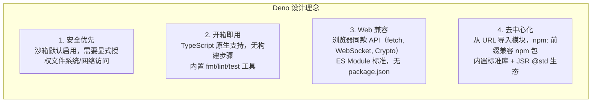

# Deno 2.x 使用指南

> Deno 是现代 JavaScript 和 TypeScript 的安全运行时，默认启用沙箱，提供开箱即用的工具链。

## 1. 核心哲学



### 1.1 与 Node.js 的关键差异

| 特性 | Node.js | Deno |
|------|---------|------|
| **安全模型** | 无限制 | 沙箱默认启用 |
| **模块系统** | CJS/ESM | 仅 ESM |
| **TypeScript** | 需配置 | 原生支持 |
| **权限控制** | 无 | 细粒度控制 |
| **内置工具** | 无 | fmt/lint/test/bundle |
| **依赖管理** | package.json | 无需，URL 导入 |
| **标准库** | 基础 | 完善 (std) |

---

## 2. 快速上手

### 2.1 安装

```bash
# macOS / Linux
curl -fsSL https://deno.land/install.sh | sh

# Windows (PowerShell)
irm https://deno.land/install.ps1 | iex

# npm
npm install -g deno

# Homebrew
brew install deno
```

### 2.2 基础命令

```bash
# 运行脚本
deno run server.ts
deno run --watch server.ts        # 监听模式
deno run --allow-net server.ts    # 允许网络访问
deno run --allow-all server.ts    # 允许所有权限（生产不推荐）

# 权限示例
deno run --allow-read --allow-net main.ts

# 格式化
deno fmt
deno fmt --check                 # 检查格式

# 代码检查
deno lint
deno lint --rules=no-explicit-any

# 测试
deno test
deno test --watch

# 依赖管理
deno add npm:express             # 添加 npm 包
deno add jsr:@std/assert         # 添加 JSR 包
deno remove npm:express           # 移除

# 信息查看
deno info                         # 查看缓存和依赖
deno eval "console.log(Deno.version)"  # 查看版本
```

---

## 3. 安全沙箱模型

### 3.1 权限系统详解

```typescript
// Deno 的安全模型基于权限标志
// 默认情况下，代码无法访问文件系统或网络

// ============================================
// 权限标志列表
// ============================================

// --allow-read     允许读取文件系统
// --allow-write    允许写入文件系统
// --allow-net      允许网络访问
// --allow-env      允许读写环境变量
// --allow-sys      允许访问系统信息（操作系统、CPU 等）
// --allow-run      允许运行子进程
// --allow-ffi      允许加载原生库（不推荐）
// --allow-hrtime   允许高精度时间测量

// 示例
deno run --allow-read=/tmp --allow-write=/tmp server.ts

// ============================================
// 运行时权限检查
// ============================================

// 检查当前是否有权限
if (Deno.permissions.querySync({ name: 'read', path: '/etc' }).state === 'granted') {
  const content = await Deno.readTextFile('/etc/hosts');
}

// 请求用户授权
const permission = await Deno.permissions.request({ name: 'net', host: 'example.com' });
```

### 3.2 安全最佳实践

```typescript
// 1. 最小权限原则 - 只授予需要的权限
// 好的做法：
deno run --allow-read --allow-net app.ts

// 不好的做法：
deno run --allow-all app.ts  // 危险！

// 2. 使用环境变量而非硬编码
// .env 文件（需要 --allow-env）
const apiKey = Deno.env.get('API_KEY');
if (!apiKey) {
  throw new Error('API_KEY is required');
}

// 3. 验证外部输入（即使有权限也要验证）
async function processUserFile(path: string) {
  // 安全检查：防止路径遍历
  const resolved = new URL(`file://${path}`).pathname;
  if (!resolved.startsWith('/safe/directory/')) {
    throw new Error('Access denied: outside allowed directory');
  }

  return await Deno.readTextFile(resolved);
}

// 4. 使用 Deno KV 进行安全存储
import { KV } from '@std/backend';

const kv = await Deno.openKv();
await kv.set(['users', '123'], { name: '张三', email: 'zhangsan@example.com' });
const user = await kv.get(['users', '123']);
```

---

## 4. HTTP 服务

### 4.1 原生 Deno.serve

```typescript
// Deno 2.x 原生 HTTP 服务
Deno.serve({ port: 8000 }, async (req) => {
  const url = new URL(req.url);

  // 路由处理
  if (url.pathname === '/api/hello') {
    return Response.json({
      message: 'Hello from Deno!',
      version: Deno.version.deno,
    });
  }

  // POST 请求
  if (url.pathname === '/api/users' && req.method === 'POST') {
    const body = await req.json();
    // 业务逻辑...
    return Response.json({ success: true, user: body }, { status: 201 });
  }

  // 静态文件
  if (url.pathname.startsWith('/static/')) {
    const filePath = `./public${url.pathname.slice(7)}`;
    try {
      const file = await Deno.open(filePath);
      return new Response(file.readable);
    } catch {
      return new Response('Not Found', { status: 404 });
    }
  }

  return new Response('Hello World!');
});

console.log('Server running on http://localhost:8000');
```

### 4.2 使用 Fresh 框架

```typescript
// Fresh 是 Deno 的全栈框架
// islands/ 目录下是客户端组件

// routes/api/joke.ts
import { HandlerContext } from '$fresh/server.ts';

export const handler: HandlerContext = {
  async GET(_req, ctx) {
    const jokes = [
      '为什么程序员总是分不清万圣节和圣诞节？因为 Oct 31 = Dec 25',
      '程序员的两大谎言：1. 代码写好了我就睡 2. 这bug很简单',
    ];
    const randomJoke = jokes[Math.floor(Math.random() * jokes.length)];
    return Response.json({ joke: randomJoke });
  },
};

// routes/index.tsx
import { Head } from '$fresh/runtime.ts';

export default function Home() {
  return (
    <>
      <Head>
        <title>My Fresh App</title>
      </Head>
      <main>
        <h1>Welcome to Fresh</h1>
        <p>Deno 的全栈框架</p>
      </main>
    </>
  );
}
```

---

## 5. 内置工具链

### 5.1 格式化工具

```bash
# 格式化所有代码
deno fmt

# 只检查，不修改
deno fmt --check

# 指定文件
deno fmt src/app.ts

# 忽略某些文件
deno fmt --ignore=vendor,dist

# 配置（deno.json）
{
  "fmt": {
    "useTabs": false,
    "lineWidth": 100,
    "indentWidth": 2,
    "semiColons": true,
    "singleQuote": true,
    "proseWrap": "preserve"
  }
}
```

### 5.2 Lint 检查

```bash
# 运行 lint
deno lint

# 指定规则
deno lint --rules=no-explicit-any,no-unused-vars

# 忽略某些文件
deno lint --ignore=vendor,dist

# 配置（deno.json）
{
  "lint": {
    "rules": {
      "tags": ["recommended"],
      "include": ["no-explicit-any"],
      "exclude": ["no-unused-vars"]
    }
  }
}
```

### 5.3 测试框架

```typescript
import { assertEquals, assertExists, assertThrows } from '@std/assert';

// 基础测试
Deno.test('加法运算', () => {
  const result = 1 + 1;
  assertEquals(result, 2);
});

// 异步测试
Deno.test('异步获取数据', async () => {
  const response = await fetch('https://example.com');
  assertEquals(response.ok, true);
});

// 带描述的测试
Deno.test({
  name: '数组过滤',
  fn: () => {
    const numbers = [1, 2, 3, 4, 5];
    const even = numbers.filter(n => n % 2 === 0);
    assertEquals(even, [2, 4]);
  },
});

// 快照测试
import { assertSnapshot } from '@std/testing/snapshot';

Deno.test('格式化输出匹配快照', async (t) => {
  const output = formatData({ name: 'Test', value: 42 });
  await assertSnapshot(t, output);
});

// Mock 时间
Deno.test({
  name: '缓存过期检查',
  fn: () => {
    using fakeTimer = useFakeTimers();
    const cached = new Cache();
    cached.set('key', 'value', 1000);
    assertEquals(cached.get('key'), 'value');

    fakeTimer.tick(1001);
    assertEquals(cached.get('key'), undefined);
  },
});
```

### 5.4 Bundle 打包

```bash
# 打包为单个 JS 文件
deno bundle src/app.ts app.bundle.js

# 打包为 ESM
deno bundle --lib src/app.ts app.bundle.mjs

# 打包为压缩格式
deno compile src/app.ts -o app.exe
# 生成独立的可执行文件
```

---

## 6. Node.js 兼容性

### 6.1 npm 包使用

```typescript
// 使用 npm: 前缀导入 npm 包
import express from 'npm:express@4';
import { z } from 'npm:zod@3';
import React from 'npm:react@18';

// Express 示例
import express from 'npm:express@4';

const app = express();

app.get('/api/hello', (_req, res) => {
  res.json({ message: 'Hello from npm package!' });
});

app.listen(3000, () => {
  console.log('Server running on :3000');
});
```

### 6.2 Node.js 内置模块兼容

```typescript
// Deno 2.x 兼容大部分 Node.js 内置模块
// 无需 --compat-node 标志

// fs 模块
import {
  readFile,
  writeFile,
  readdir,
  stat,
} from 'node:fs/promises';

import { join } from 'node:path';
import { EventEmitter } from 'node:events';
import { createServer } from 'node:http';

// 注意：某些模块可能需要 polyfill
import { Buffer } from 'node:buffer';

// Deno 独有的全局对象
console.log(Deno.cwd());          // 当前工作目录
console.log(Deno.version.deno);    // Deno 版本
console.log(Deno.version.v8);     // V8 版本
console.log(Deno.version.typescript); // TypeScript 版本
```

### 6.3 从 Node.js 迁移

```typescript
// ============================================
// package.json 到 deno.json
// ============================================

// Node.js package.json
{
  "name": "my-app",
  "type": "module",
  "scripts": {
    "dev": "tsx server.ts",
    "build": "tsc && node dist/server.js"
  },
  "dependencies": {
    "express": "^4.18.0",
    "dotenv": "^16.0.0"
  }
}

// Deno deno.json（放置在项目根目录）
{
  "imports": {
    "$std/": "jsr:@std/",
    "express": "npm:express@4",
    "dotenv": "npm:dotenv"
  },
  "tasks": {
    "dev": "deno run --watch --allow-net --allow-env server.ts",
    "dev:nodemon": "deno run --watch --allow-net --allow-env --allow-read server.ts"
  },
  "compilerOptions": {
    "strict": true,
    "lib": ["deno.window"]
  }
}

// ============================================
// 常见替换
// ============================================

// __dirname / __filename
// Node.js                           → Deno
// import { dirname, join } from 'path'    import { dirname, fromFileUrl, join } from '$std/path/'

// const __dirname = dirname(fileURLToPath(import.meta.url))
// 简化为：
const __dirname = dirname(fromFileUrl(import.meta.url));

// require() → import
// Node.js                           → Deno
// const fs = require('fs')           → import * as fs from 'node:fs'

// dotenv.config()
// Node.js                           → Deno
// require('dotenv').config()       → import 'dotenv/config'
// Deno 不需要手动调用，会自动加载 .env
```

---

## 7. Deno KV 内置存储

```typescript
// Deno KV - 内置键值存储
import { KV } from '@std/backend';

async function kvExamples() {
  const kv = await Deno.openKv();

  // 基础操作
  const key = ['users', 'u123'] as const;
  const value = { name: '张三', email: 'zhangsan@example.com', age: 25 };

  // 设置值
  const result = await kv.set(key, value);
  console.log('Version stamp:', result.versionstamp);

  // 获取值
  const user = await kv.get(key);
  console.log(user.value);        // { name: '张三', ... }
  console.log(user.versionstamp); // 版本号，用于乐观锁

  // 原子操作
  await kv.atomic()
    .set(['users', 'u123', 'lastLogin'], Date.now())
    .delete(['cache', 'temp'])
    .commit();

  // 批量查询
  const users = kv.list({ prefix: ['users'] });
  for await (const entry of users) {
    console.log(entry.key, entry.value);
  }

  // 范围查询
  const range = kv.list({ prefix: ['users'], start: ['users', 'u000'], end: ['users', 'u999'] });

  // 观察变更
  const changeStream = kv.watch([['users', 'u123']]);
  for await (const op of changeStream) {
    console.log('Change:', op);
  }

  // 事务
  const mutation = await kv.atomic()
    .set(['stats', 'count'], new Deno.KvU64(1n))
    .commit();

  // 计数操作
  const count = await kv.atomic()
    .mutate({ type: 'sum', key: ['stats', 'count'], value: new Deno.KvU64(1n) })
    .commit();

  kv.close();
}

// 可靠队列实现
import { KvQueue } from '@std/backend/queue';

async function queueExample() {
  const kv = await Deno.openKv();

  // 生产者
  const queue = new KvQueue<string>(kv, ['queue', 'jobs']);
  await queue.push('job-1');
  await queue.push('job-2');

  // 消费者
  const worker = new Worker(new URL('./worker.ts', import.meta.url).href, { type: 'module' });

  for await (const job of queue) {
    console.log('Processing:', job);
    await processJob(job);
    await job.finish();
  }
}
```

---

## 8. 常用标准库

```typescript
// ============================================
// @std/path - 路径操作
// ============================================
import { join, dirname, basename, extname, resolve } from '@std/path';

const fullPath = join('/home/user', 'project', 'file.ts');
const dir = dirname(fullPath);     // /home/user/project
const name = basename(fullPath);   // file.ts
const ext = extname(fullPath);     // .ts

// ============================================
// @std/encoding - 编码转换
// ============================================
import {
  encodeBase64,
  decodeBase64,
  encodeHex,
  decodeHex,
} from '@std/encoding';

const encoded = encodeBase64('Hello, 世界!');
const decoded = decodeBase64(encoded);

// ============================================
// @std/fmt - 格式化
// ============================================
import { printf, sprintf } from '@std/fmt';

printf('%s v%d.%d.%d\n', 'Deno', 2, 0, 0);
const msg = sprintf('Hello, %s!', 'World');

// ============================================
// @std/bytes - 字节操作
// ============================================
import { copy, concat } from '@std/bytes';

const buf = new Uint8Array(1024);
copy(buf, new Uint8Array([1, 2, 3]));
const combined = concat([new Uint8Array([1]), new Uint8Array([2])]);

// ============================================
// @std/collections - 集合操作
// ============================================
import {
  distinct,
  chunk,
  groupBy,
  distinctBy,
  sortBy,
} from '@std/collections';

const numbers = [1, 2, 2, 3, 3, 3];
console.log(distinct(numbers));     // [1, 2, 3]

const grouped = groupBy([1, 2, 3, 4, 5], n => n % 2 === 0 ? 'even' : 'odd');
console.log(grouped);             // { odd: [1, 3, 5], even: [2, 4] }

// ============================================
// @std/csv - CSV 解析
// ============================================
import { parse } from '@std/csv';

const csvData = `name,age,city
张三,25,北京
李四,30,上海`;

const records = parse(csvData, { skipFirstRow: true });
console.log(records);
```

---

## 9. 常见问题与解决方案

### 9.1 Q1: 如何管理依赖版本？

```typescript
// 方法 1: 直接 URL 锁定版本
import express from 'https://esm.sh/express@4.18.0';

// 方法 2: 使用 jsr: 前缀
import { encodeBase64 } from 'jsr:@std/encoding@^1.0.0';

// 方法 3: deno.json 导入映射
// deno.json
{
  "imports": {
    "$std/": "jsr:@std/",
    "express": "npm:express@4.18"
  }
}
// 使用
import { encodeBase64 } from '$std/encoding/base64';
import express from 'express';
```

### 9.2 Q2: 如何查看依赖关系？

```bash
# 查看缓存信息
deno info

# 查看特定模块信息
deno info jsr:@std/path

# 查看代码覆盖率
deno test --coverage=coverage
deno coverage coverage/
```

### 9.3 Q3: Deno 在生产环境的表现？

```typescript
// Deno Deploy 边缘部署
// 配置 deno.json
{
  "deploy": {
    "project": "my-app",
    "regions": ["hnd", "sfo", "nrt"]
  }
}

// 部署命令
deno deploy deploy --project=my-app

// 与 Vercel/Cloudflare Workers 兼容
// Deno.serve 格式在 Deno Deploy 上直接可用
```

---

## 10. 参考链接

- [Deno 官方文档](https://docs.deno.com/)
- [Deno 2.0 发行说明](https://deno.com/blog/v2.0)
- [Deno 标准库 @std](https://jsr.io/@std)
- [Fresh 框架](https://fresh.deno.dev/)
- [Deno 与 Node.js 差异](https://docs.deno.com/runtime/fundamentals/node_js_deno/)
- [Deno KV 文档](https://docs.deno.com/runtime/fundamentals/kv/)
- [npm 兼容模式](https://docs.deno.com/runtime/fundamentals/npm_nodejs_compatibility/)

## 深入阅读与参考

!!! tip "怎么用这些资料"
    先读「官方文档与规范」建立准确的概念，再读「源码与示例」核对细节，最后用「教程、书籍与视频」换一种讲法加深理解。每条都写明了读哪一节、带着什么问题读。

### 官方文档与规范

| 资源 | 为什么读 | 怎么读 |
|---|---|---|
| [Deno 1.x to 2.x Migration Guide](https://docs.deno.com/runtime/reference/migration_guide/) | 官方迁移清单，标出 2.x 破坏性变更与替代 API。 | 按小节对照自己项目，用 deno check 与 deno test 逐项验证迁移结果。 |
| [Configuration file (deno.json)](https://docs.deno.com/runtime/reference/deno_json/) | 讲清 deno.json 各字段，工具链与权限配置都收在这里。 | 先读 tasks、imports、permissions 三节，为示例项目补一份 deno.json。 |
| [Writing an HTTP Server](https://docs.deno.com/runtime/fundamentals/http_server/) | 最短路径跑通 Deno HTTP 服务，涵盖响应与流式处理。 | 照着写一遍，再用 curl 测 POST 与流式响应，观察 req.signal 行为。 |
| [Node.js Compatibility](https://bun.sh/docs/runtime/nodejs-compat) | 逐项列出 node: 内置模块的兼容程度与缺口。 | 迁移前先查用到的模块是否打勾；缺的用 npm: 包或 Deno 原生 API 顶上。 |
| [Migrate from Node.js](https://docs.deno.com/runtime/migrate/) | 从 Node 迁到 Deno 的实操路线，含依赖与配置对照。 | 带着自己的 package.json 逐节走，把 npm scripts 映射成 deno task。 |
| [Deno 文档](https://docs.deno.com/) | 权限标志与内置工具链的入口，沙箱模型从这里讲起。 | 读权限一节，跑 --allow-net 与 --deny-read 对比，体会最小授权。 |
| [deno compile](https://docs.deno.com/runtime/reference/cli/compile/) | 把 TS 项目编译成单文件可执行程序，部署时最常用。 | 按示例 compile 一个 CLI，用 --allow-* 显式声明运行时权限后分发。 |
| [deno lint](https://docs.deno.com/runtime/reference/cli/lint/) | 了解默认规则集与配置方式，配合编辑器即时反馈。 | 跑 deno lint 修完示例项目，再把规则开关写进 deno.json。 |
| [Node.js 内置测试运行器](https://nodejs.org/en/learn/test-runner/introduction) | 免依赖写测试的标准做法，与 deno test 思路相通。 | 为一个工具函数写 node:test 用例，再改写成 Deno.test 对比差异。 |

### 源码与示例

| 资源 | 为什么读 | 怎么读 |
|---|---|---|
| [Node.js 贡献文档](https://github.com/nodejs/node/blob/main/doc/contributing) | 想读 Node 源码前先看它，了解目录结构与构建流程。 | 读仓库概览与构建一节，再带着兼容问题定位 lib/ 下的实现。 |

### 教程、书籍与视频

| 资源 | 为什么读 | 怎么读 |
|---|---|---|
| [Node.js in Action（第 2 版，Manning）](https://www.manning.com/books/node-js-in-action-second-edition) | Node 服务端开发经典，迁移前先建立 HTTP 服务心智模型。 | 完成书中示例服务，再用 Deno 与 Hono 重写一遍对比代码。 |
| [Philip Roberts：What the heck is the event loop anyway?（JSConf EU）](https://www.youtube.com/watch?v=8aGhZQkoFbQ) | 十分钟讲清事件循环，直观理解 Deno 的异步调度。 | 看完用 Loupe 单步执行 Promise 示例，解释微任务与宏任务顺序。 |

## 应用与行业实践

### 应用场景地图

| 场景 | 用到本页哪个知识点 | 典型技术选型 | 注意事项 |
| --- | --- | --- | --- |
| 后台管理的万行表格（分页接口） | HTTP 服务、常用标准库 | `Deno.serve` + `@std/http` 的响应工具 | 单次响应只返回当前页，别把整表读进内存 |
| 低端安卓的首屏加载 | 内置工具链、Node.js 兼容性 | `deno info` 看依赖图，`npm:` 前缀按需引入 | 只把首屏用到的包放进入口文件，避免拉入整棵依赖树 |
| 多人协作白板 | Deno KV 内置存储、HTTP 服务 | `Deno.serve` + `Deno.upgradeWebSocket` + `kv.atomic()` | KV 只放房间快照与版本号，高频笔迹走增量广播 |
| 第三方 Webhook 接收与验签 | 安全沙箱模型、HTTP 服务 | `--allow-net` 白名单 + Web Crypto 的 HMAC | 验签失败返回 4xx，不写 KV、不碰业务数据 |
| 内部运维脚本分发 | 安全沙箱模型、内置工具链 | `deno run --allow-read=/var/log/app`、`deno task` | 读权限写路径白名单，替换整盘读权限 |
| 定时抓取 RSS 并入库 | Deno KV、内置工具链 | 系统 crontab 触发 `deno task fetch` | 任务入口写进 `deno.json`，命令行参数放任务里 |
| CI 中的格式化与检查 | 内置工具链 | `deno fmt --check`、`deno lint`、`deno test` | 把 `deno.lock` 提交进仓库，让本地与 CI 解析同一份依赖 |
| 事件转发服务（复用 npm 签名库） | Node.js 兼容性、HTTP 服务 | `npm:` 前缀引入，`Deno.serve` 暴露接口 | 被引包做动态加载时要补对应权限 |
| 本地优先的笔记同步 | Deno KV、常用标准库 | 本地 KV 存离线队列，版本号合并冲突 | 需核对官方文档：KV 本地文件后端的并发写入语义 |

### 三个场景拆解

#### 场景 1：内部运维脚本分发

**业务背景**
运维同学把脚本贴到聊天窗口分发，各人本机 Node 版本不一致，跑不起来要排查半天。机器数量从十台涨到上百台后，脚本版本靠口头同步会漏改。

**怎么用本页知识解决**
思路是收成单文件入口，权限在启动命令里逐项列明，脚本本身不改。

```ts
// scripts/collect.ts
const dir = Deno.args[0] ?? "/var/log/app"; // 允许调用方覆盖默认目录
const rows: string[] = [];
for await (const entry of Deno.readDir(dir)) { // 只列出目录项，不递归
  if (!entry.isFile || !entry.name.endsWith(".log")) continue; // 过滤非日志文件
  const text = await Deno.readTextFile(`${dir}/${entry.name}`); // 读取单个文件
  rows.push(`${entry.name}\t${text.split("\n").length}`); // 记录文件名与行数
}
console.log(rows.join("\n")); // 结果打到标准输出，便于重定向
```

- 启动命令是 `deno run --allow-read=/var/log/app scripts/collect.ts`，只开放一个目录。
- 默认不下发写权限，脚本误删文件这一步在权限层就被挡住。
- 分发方式是发文件或发仓库路径，接收方不用装 Node，也不用对齐版本。
- `deno.json` 里登记 `collect` 任务，各人敲的命令一致，默认目录写在任务里。
- 需要联网时再补 `--allow-net=内部域名`，一次只加一项权限。

**怎么度量收益**
指标看首次跑通耗时、权限拒绝次数、脚本退出码。测量用 `hyperfine 'deno run --allow-read=/var/log/app scripts/collect.ts'` 记录冷启动与运行时间；用 `deno task ci` 的退出码判断脚本在 CI 里是否稳定。

**什么时候不该用**

- 脚本要写回数据库或改动远端机器状态时，只读白名单会反复挡住流程，应改成带鉴权的服务端接口。
- 团队已统一 Node 版本并在 CI 里锁定，迁移只增加一套运行时的维护成本。

#### 场景 2：多人协作白板的房间状态同步

**业务背景**
一个房间几十个人同时画，笔迹事件按毫秒到达，服务端要留房间快照给新加入者。在线人数从个位数涨到几十人时，全量广播会拖垮连接。

**怎么用本页知识解决**
思路是快照走 KV，增量走 WebSocket，写入用事务拼成同一个版本号。

```ts
// server.ts
const kv = await Deno.openKv(); // 打开 KV，本地默认落盘
const rooms = new Map<string, Set<WebSocket>>(); // 房间号 -> 连接集合
Deno.serve(async (req) => { // 内置 HTTP 服务，无需框架
  const room = new URL(req.url).pathname.slice(1); // 路径即房间号
  if (req.headers.get("upgrade") !== "websocket") { // 普通请求返回快照
    const snap = await kv.get(["room", room]); // 新加入者拉取快照
    return Response.json(snap.value ?? { version: 0, strokes: [] });
  }
  const { socket, response } = Deno.upgradeWebSocket(req); // 升级连接
  socket.onmessage = async (e) => { // 增量笔迹到达
    const res = await kv.atomic() // 事务写入，避免并发覆盖
      .sum(["room", room, "version"], 1n) // 版本号自增
      .set(["room", room, "last"], e.data) // 只留最后一段增量
      .commit();
    if (!res.ok) socket.send('{"retry":true}'); // 冲突时让客户端重发
    for (const s of rooms.get(room) ?? []) s.send(e.data); // 广播给同房间
  };
  return response;
});
```

- 新加入者先发一个普通 GET 拿快照，不用重放整房间的笔迹。
- 版本号用 `sum` 自增，两个客户端同时写入时只有一个事务能提交成功。
- 提交失败回 `retry`，客户端重发，避免静默丢笔迹。
- 连接集合只存内存，进程重启后清空，快照仍从 KV 恢复。
- `socket.onopen` 里把连接加进 `rooms`，这段为控制行数省略。

**怎么度量收益**
指标看首屏拿快照的耗时（P50 与 P95）、广播延迟、事务冲突率。测量用 `Deno.bench` 跑本地写入压测；用浏览器 DevTools 的 Network 面板看 WebSocket 帧时间；冲突率用计数器打日志后聚合。

**什么时候不该用**

- 笔迹要求严格顺序且不能丢帧时，事务重试会引入延迟，应改用有序日志。
- 房间快照超过 KV 单条值上限时（需核对官方文档：键与值的大小上限），应把快照放对象存储。

#### 场景 3：第三方 Webhook 接收与验签

**业务背景**
支付平台和代码托管平台会往你的地址推事件，失败重试会重复投递同一条。日事件量从几百涨到几万时，重复处理会写出重复订单。

**怎么用本页知识解决**
思路是先验签再查重，两步都不过就不碰业务数据。

```ts
// webhook.ts
const SECRET = Deno.env.get("HOOK_SECRET")!; // 从环境变量读密钥
const kv = await Deno.openKv(); // 用 KV 存已处理的事件 ID
Deno.serve(async (req) => {
  const body = await req.text(); // 先读原始报文，验签必须用原文
  const sig = req.headers.get("x-signature") ?? ""; // 平台签名头
  const key = await crypto.subtle.importKey( // Web Crypto 全局可用
    "raw", new TextEncoder().encode(SECRET),
    { name: "HMAC", hash: "SHA-256" }, false, ["sign"]);
  const mac = await crypto.subtle.sign("HMAC", key, new TextEncoder().encode(body));
  const hex = [...new Uint8Array(mac)].map((b) => b.toString(16).padStart(2, "0")).join("");
  if (hex !== sig) return new Response("bad signature", { status: 401 }); // 验签不过直接拒绝
  const id = req.headers.get("x-event-id")!; // 平台的事件 ID
  const seen = await kv.get(["event", id]); // 查重
  if (seen.value) return new Response("duplicate", { status: 200 }); // 重复投递直接返回
  await kv.set(["event", id], Date.now(), { expireIn: 86400_000 }); // 保留一天
  return new Response("ok"); // 再交给后续处理
});
```

- 验签用原始报文字符串，先解析成 JSON 再验签会因空格差异失败。
- 密钥走环境变量，启动时用 `--allow-env=HOOK_SECRET` 把环境权限收窄。
- 查重放在处理之前，同一事件 ID 第二次到达直接返回 200，平台不再重试。
- `expireIn` 让查重记录自动过期，KV 不会因事件堆积无限增长。
- 网络权限收窄到平台域名，验签失败不写 KV。

**怎么度量收益**
指标看重复入库条数、验签失败率、处理耗时 P95。测量用 `deno test --coverage` 覆盖验签分支；线上用计数器日志统计 401 与 `duplicate` 的次数。

**什么时候不该用**

- 事件处理里有秒级以上的外部调用时，应先入队再返回 200，别把重活压在请求里。
- 平台签名算法不是 HMAC-SHA256 时（需核对平台文档：签名算法与头名称），照抄这段会一直验签失败。

### 行业先进实践

1. **权限白名单代替全量授权**（出处：Deno 官方文档 Permissions 章节）
   - 做法：启动命令把 `--allow-net`、`--allow-read` 指到域名和目录，未列出的能力直接拒绝。
   - 为什么有效：依赖被替换或代码被注入时，进程能拿到的能力被限制在清单内。
   - 如何借鉴：把生产启动命令写进 `deno.json` 的 tasks，评审时只审这一行。

2. **Node 兼容层按文件标记**（出处：Deno 官方文档 Node.js 兼容性章节）
   - 做法：内置模块用 `node:` 前缀引入，npm 包用 `npm:` 前缀引入，迁移时逐文件替换。
   - 为什么有效：明确标出哪些代码依赖 Node 语义，排查兼容问题有边界。
   - 如何借鉴：先迁纯计算模块，把依赖原生扩展的部分留在原运行时。

3. **依赖锁文件进仓库**（出处：JSR 官方文档）
   - 做法：用带版本的 `jsr:@std/http` 形式引入，配合 `deno.lock` 锁定解析结果。
   - 为什么有效：锁定文件让本地与 CI 解析到同一份依赖。
   - 如何借鉴：CI 里跑冻结安装（需核对官方文档：该开关在当前版本的名称与行为）。

4. **KV 事务与过期时间组合**（出处：Deno 官方文档 Deno KV 章节）
   - 做法：多键写入用 `kv.atomic()`，缓存类数据用 `expireIn` 设定存活时间。
   - 为什么有效：原子写避免并发覆盖，过期时间省掉手工清理任务。
   - 如何借鉴：可重算的数据都加过期时间，只给业务实体保留长期键。

5. **任务入口集中声明**（出处：Deno 官方文档 deno task 章节）
   - 做法：启动、测试、格式化、检查都写进 `deno.json` 的 `tasks`，CI 只调 `deno task ci`。
   - 为什么有效：本地与 CI 命令一致，参数变更只改一处。
   - 如何借鉴：任务名固定用 `dev`、`test`、`ci` 三个，新人不用查文档。

### 从学到用：落地路线

1. **试点**：挑一个只读的运维脚本，用 `deno run` 跑通，启动时加权限白名单。
   - 验收标准：同一脚本在两位同事的机器上不经改动跑出相同输出。
2. **验证**：给脚本补 `deno task` 入口和 `deno test` 用例，CI 跑格式化、检查、测试三条命令。
   - 验收标准：三条命令退出码为 0，且删掉任一权限后测试能失败。
3. **推广**：把带 HTTP 服务或 KV 存储的小服务迁过来，权限逐项加，锁文件提交进仓库。
   - 验收标准：任何人 clone 后一条 `deno task dev` 能起服务。
4. **防回退**：把权限清单、锁文件、任务入口写进 code review 检查项，改动启动命令要第二人确认。
   - 验收标准：连续四周的合并请求里，权限变更都有评审记录。

### 动手作业

**目标**
做一个内部小服务：接收第三方 Webhook，验签后去重写入 Deno KV，并提供查询接口。

**步骤**

1. 建目录并写 `deno.json`，登记 `dev` 与 `test` 两个任务。
2. 用 `Deno.serve` 起服务，`GET /events/:id` 读 KV 返回记录，找不到返回 404。
3. `POST /events` 先读原始报文，用 HMAC-SHA256 验签，不通过返回 401。
4. 用事件 ID 在 KV 查重，重复返回 200，不重复则写入并设 `expireIn`。
5. 启动时只给 `--allow-net=127.0.0.1:8000` 与 `--allow-env=HOOK_SECRET`，KV 落盘所需读写权限按启动报错提示补齐。
6. 写三个测试：正确签名、错误签名、重复事件 ID。
7. 本地连发两次同一事件，确认 KV 里只留一条记录。

**验收标准**

- 不带 `--allow-*` 启动时进程报错，报错信息指出缺少哪项权限。
- 错误签名返回 401，KV 里查不到该事件 ID。
- 同一事件 ID 连发两次，第二次返回 200，KV 中只存在一条记录。
- `deno fmt --check`、`deno lint`、`deno test` 三条命令退出码为 0。
- 服务端日志能区分 `bad-signature` 与 `duplicate` 两种拒绝原因。

