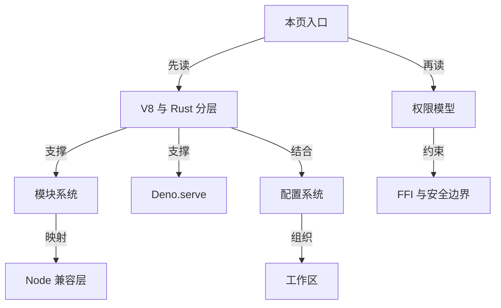
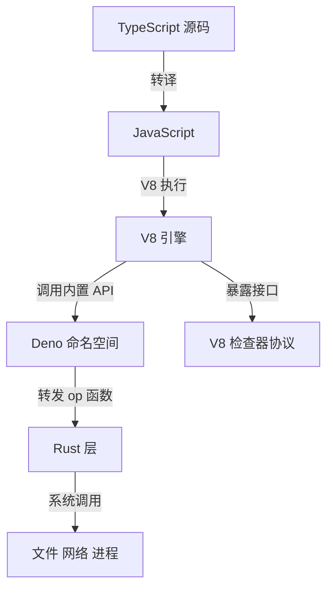
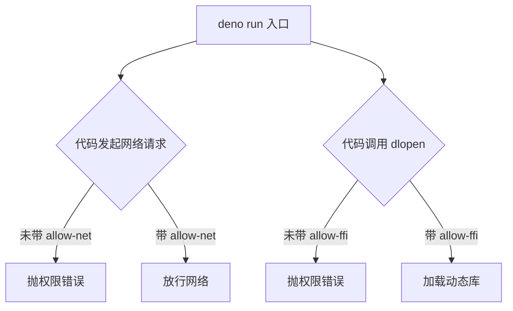
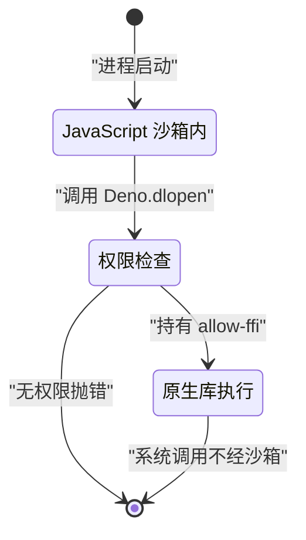
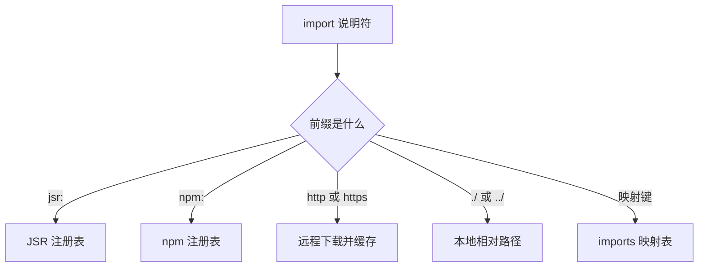
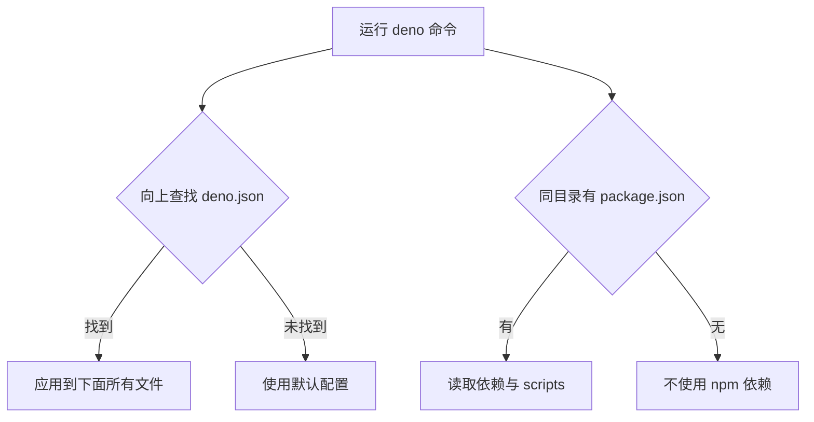
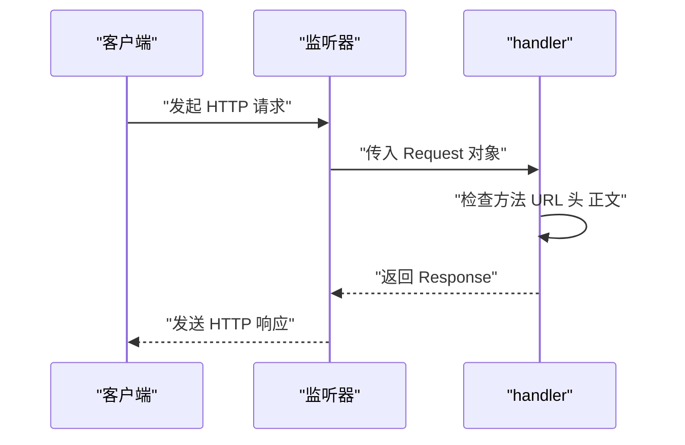
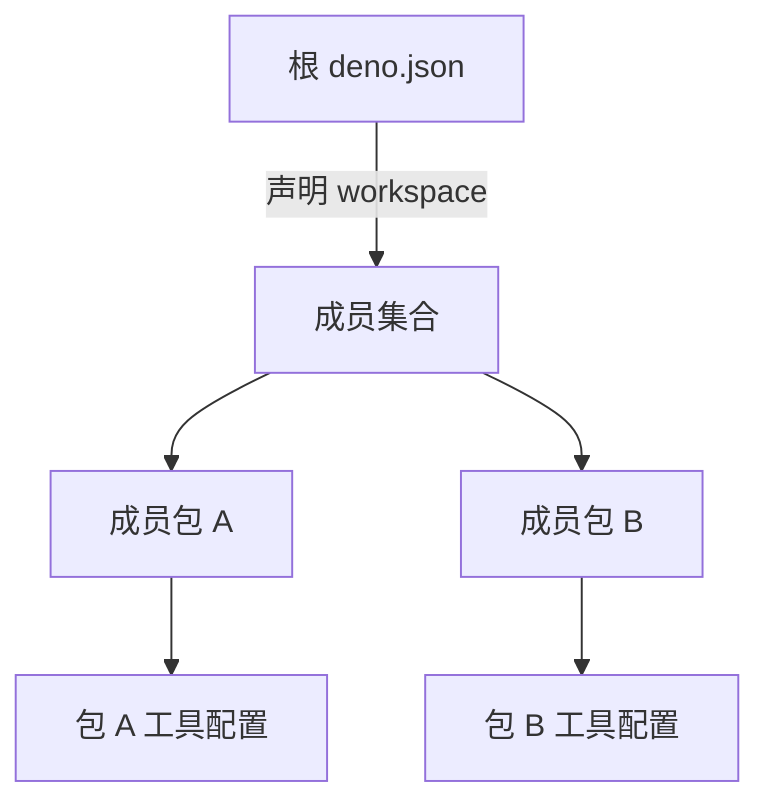
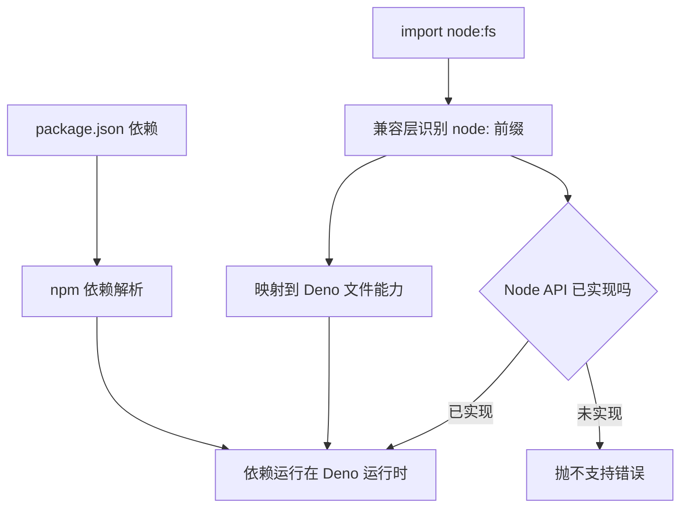

# Deno 内部原理：权限模型、Rust 内核与 Node 兼容

!!! abstract "学完这一页你能"
    - 说出 Deno 两层架构中 V8 与 Rust 层各自负责什么。
    - 写出开启网络权限的命令，并解释默认拒绝为什么重要。
    - 说出 deno.json 与 package.json 的分工，并写出最小配置。
    - 解释 Node 兼容层的边界，以及 FFI 为何会绕出沙箱。

## 0. 知识地图



先读第 1 节建立双层心智模型，再接第 2、3 节看权限与边界。第 4 到 8 节各自独立，可跳读。每节动手验证脚本都能在 Node 20 运行，不用装 Deno。

## 1. V8 与 Rust 的分层架构

**先想一个问题**：你写了一个 Deno.serve 服务器。TypeScript 代码由谁执行？真正的网络收发包又是谁在操作系统层面完成的？

**心智模型**

!!! tip "心智模型"
    一句话模型：Deno 拆成两层，V8 负责执行 JavaScript，Rust 层负责文件、网络、进程等系统能力。
    
    日常类比：V8 像大楼里的住户，Rust 层像物业。住户写需求，物业去开关水电阀门。
    
    类比不成立处：物业有全部钥匙而住户被门禁管着；Deno 里 JS 层要经过 op 函数调用边界才能进 Rust 层，不能直接访问系统资源。

!!! note "术语：op 函数"
    Deno 运行时从 JavaScript 层进入 Rust 层的内部函数。CPU 配置报告中名称以 op_ 开头，例：op_crypto_get_random_values。

**图解**



1. TypeScript 先被转译成 JavaScript，因为 V8 只认识 JavaScript。
2. V8 执行转译后的代码，同时通过检查器协议暴露调试接口。
3. 调用 Deno.cron、Deno.serve 等 API 时，先进入 Deno 命名空间里的绑定。
4. 绑定把请求转给 Rust 层的 op 函数。
5. Rust 层完成真正的系统调用。Rust 层使用 Tokio 处理异步 I/O，其线程与任务调度细节资料未覆盖，需核对官方文档。

**一步一步来**

第 1 步：写一个混合纯计算与系统调用的程序，区分两层。

```ts
// 纯 JavaScript 计算：只在 V8 内完成
function add(a: number, b: number): number {
  return a + b;
}

// 系统随机数：需要进入 Rust 层取系统熵
const random = crypto.getRandomValues(new Uint8Array(4));

console.log(add(2, 3));
console.log(Array.from(random));
```

**这段代码在做什么**：

- add 只做数值相加，不接触文件或网络，全程只在 V8 里完成。
- getRandomValues 需要操作系统提供随机源，会经过 Deno 内置路径进入 Rust 层。
- CPU 配置报告中可看到 op_crypto_get_random_values，它是 Rust 层导出的函数。
- 纯计算与系统调用在运行时被分到不同层，这就是两层架构的意义。

运行结果（随机字节每次不同）：

```
5
[ 12, 203, 41, 9 ]
```

第 2 步：用性能分析标志抓真实调用栈，观察 op 函数。

```sh
deno run --allow-all --cpu-prof --cpu-prof-md server.js
```

**这段代码在做什么**：

- --cpu-prof-md 在退出时同时写 .cpuprofile 与 Markdown 报告。
- 报告里 op_ 开头、位置标注为 [native code] 的函数就是 Rust 层入口。
- .js 文件里的同名前缀函数是 Deno 的 JavaScript 包装层。

**动手验证**

依赖：Node 20 内置模块，无第三方依赖。保存为 verify1.mjs 运行。

```js
import assert from "node:assert";

// 模拟 CPU 配置文件里出现的两类函数
const entries = [
  { name: "op_crypto_get_random_values", location: "[native code]" },
  { name: "getRandomValues", location: "00_crypto.js:5274" },
];

// 原生函数以 op_ 开头
assert.ok(entries.some((e) => e.name.startsWith("op_")));
// 包装函数位于 .js 文件（location 形如 "文件路径:行号"，需先取文件名部分再判断后缀）
assert.ok(entries.some((e) => e.location.split(":")[0].endsWith(".js")));
// 每个条目都有位置标注
assert.ok(entries.every((e) => e.location.length > 0));

console.log("预期输出: 两类函数都出现在配置里");
```

**常见坑**

| 现象 | 原因 | 怎么修 |
| 配置报告行号对不上源码 | V8 分析的是转译后的 JavaScript | 注意报告行号指向转译代码，不是 .ts 源码 |
| 默认采样太粗看不到短函数 | 默认间隔 1000 微秒 | 用 --cpu-prof-interval 调小，如 100 |

**小结**

1. V8 只执行 JavaScript，Rust 层通过 op 函数提供系统能力。
2. TypeScript 先转译，调试与性能报告的行号是转译后行号。
3. 分层的原因：JS 专注业务逻辑，系统能力交给另一层统一管理。

## 2. 权限模型：默认拒绝一切

**先想一个问题**：你从网上下了一段脚本直接运行。脚本要读你的 .ssh 目录。Deno 会怎么拦它？

**心智模型**

!!! tip "心智模型"
    一句话模型：Deno 不给进程任何系统权限，除非启动命令里一项一项列出。
    
    日常类比：新员工入职没有办公室钥匙，进哪个房间要单独申请门禁。
    
    类比不成立处：门禁可以临时补办并收回；Deno 的权限在进程启动时确定，运行中不能补发或收回。

!!! note "术语：权限清单"
    进程启动时收集的授权项集合。运行时每项系统能力都先查这个清单，再决定放行或抛错。例：启动加了 --allow-net，清单里就有 net 这一项。

**图解**



1. 进程在入口按参数建好权限清单。
2. 发起网络请求时，先对照清单里有没有 net。
3. 没有 net 直接抛权限错误，调用不会到达系统。
4. 有 net 才放行这次网络调用。

**一步一步来**

第 1 步：写一个需要网络的程序，不带权限运行看错误。

```ts
// net.ts：发起一次 HTTP 请求
const res = await fetch("https://example.com");
console.log(res.status);
```

**这段代码在做什么**：

- await fetch 要发起网络连接。
- 未授权时，Rust 层在做系统调用前查清单。
- 错误信息会提示你需要加什么参数。

运行 `deno run net.ts`，结果为权限错误，提示需要网络权限。

第 2 步：显式带权限运行。

```sh
deno run --allow-net net.ts
```

**这段代码在做什么**：

- --allow-net 只把 net 放进清单。
- 文件读写、环境变量等能力仍未授权。
- 运行结果为 200。

第 3 步：把权限持久化到 deno.json。

```json
{
  "tasks": {
    "dev": "deno run --watch main.ts"
  }
}
```

**这段代码在做什么**：

- deno.json 里有 permissions 字段，可持久化权限配置。
- 该字段的精确键名与格式资料未覆盖，需核对官方文档：deno.json 参考手册的 Permissions 章节。

**动手验证**

依赖：Node 20 内置模块，无第三方依赖。保存为 verify2.mjs 运行。

```js
import assert from "node:assert";

// 模拟启动时收集的授权清单
function makeChecker(grantedList) {
  const granted = new Set(grantedList);
  return (name) => granted.has(name);
}

const check = makeChecker(["--allow-net"]);

// 模拟一次网络访问判定
function runFetch(permission) {
  if (!permission("net")) {
    throw new Error('Requires net access, run with --allow-net');
  }
  return "fetch ok";
}

assert.strictEqual(check("net"), true);
assert.strictEqual(check("read"), false);
assert.strictEqual(runFetch(check), "fetch ok");
assert.throws(() => runFetch(makeChecker([])), /--allow-net/);

console.log("预期输出: fetch ok");
```

**常见坑**

| 现象 | 原因 | 怎么修 |
| 运行时报 net access 错误 | 启动没带 --allow-net | 加 --allow-net 或写进 deno.json |
| 一个脚本要文件又要网络 | 每条能力各自授权 | 逐项加参数，-A 全放行会撤掉默认拒绝保护 |
| 在 CI 里反复写参数 | 每次运行重复授权 | 把权限与任务一起写进 deno.json |

**小结**

1. 权限默认拒绝，启动时按清单判定。
2. 授权方式有命令行参数、deno.json、-A 全放行。
3. 授权在启动时固定，不逐次询问，这是安全边界的第一道门。

## 3. 权限的边界：FFI 与原生代码

**先想一个问题**：你用 Deno.dlopen 加载了一个 C 库。这个库里调用了 open 读文件。Deno 会要求 --allow-read 吗？

**心智模型**

!!! tip "心智模型"
    一句话模型：FFI 授权是打开大门，门后的原生代码不再受 Deno 沙箱约束。
    
    日常类比：施工队进场前你要签字放行，之后他们去哪个房间，不再过你逐房审批。
    
    类比不成立处：施工队撞坏墙你要追责索赔；原生库一旦运行，Deno 无法拦截它的系统调用，也无法事后回滚。

!!! note "术语：动态库"
    操作系统能直接加载的已编译代码文件。Linux 用 .so，macOS 用 .dylib，Windows 用 .dll。Deno.dlopen 把它加载进进程并创建函数绑定。

**图解**



1. JavaScript 代码在沙箱内运行。
2. 调用 dlopen 进入权限检查点。
3. 有 --allow-ffi 才加载动态库。
4. 原生库之后的文件、网络、环境变量、子进程调用都不再经过沙箱检查。

**一步一步来**

第 1 步：加载一个简单 C 库并调用函数。

```ts
// load.ts：动态库放在本文件旁
const path = new URL("./libexample.so", import.meta.url).pathname;

const dylib = Deno.dlopen(path, {
  add: { parameters: ["i32", "i32"], result: "i32" },
} as const);

console.log(dylib.symbols.add(5, 3)); // 8
dylib.close();
```

**这段代码在做什么**：

- new URL 让路径相对本模块位置解析，不依赖进程当前目录。
- as const 帮助生成精确的参数类型。
- symbols.add 是动态库导出的函数。
- close 释放句柄。

运行 `deno run --allow-ffi load.ts`，输出 8。

第 2 步：不带权限运行，记录报错。

```sh
deno run load.ts
```

**这段代码在做什么**：

- 不带 --allow-ffi 时，权限检查抛错。
- 错误会提示需要 FFI 权限。

第 3 步：处理加载失败两类错误。

```ts
try {
  Deno.dlopen("./libexample.so", {
    add: { parameters: ["i32", "i32"], result: "i32" },
  } as const);
} catch (err) {
  console.error("加载失败:", err.message);
  Deno.exit(1);
}
```

**这段代码在做什么**：

- 打不开文件报 Could not open library。
- 文件打开但符号缺失报 Failed to register symbol。
- Deno.exit(1) 让进程显式失败退出。

**动手验证**

依赖：Node 20 内置模块，无第三方依赖。保存为 verify3.mjs 运行。

```js
import assert from "node:assert";

// 按官方错误文案分类两类失败
function classify(message) {
  if (message.includes("Could not open library")) return "file";
  if (message.includes("Failed to register symbol")) return "symbol";
  return "unknown";
}

assert.strictEqual(classify("Could not open library: a.so"), "file");
assert.strictEqual(classify("Failed to register symbol add"), "symbol");

// 模拟权限判定
function loadNative(granted) {
  if (!granted.has("ffi")) {
    throw new Error('Requires ffi access, run with --allow-ffi');
  }
  return "native call ok";
}

assert.throws(() => loadNative(new Set()), /--allow-ffi/);
assert.strictEqual(loadNative(new Set(["ffi"])), "native call ok");
console.log("预期输出: 错误分类与权限判定都通过");
```

**常见坑**

| 现象 | 原因 | 怎么修 |
| 报 Could not open library | 相对路径按进程目录解析 | 用 new URL 配 import.meta.url |
| 报 Failed to register symbol | 声明的函数名不在库里 | 核对库的导出符号名 |
| 编译后二进制找不到库 | 动态库没打包进可执行文件 | deno compile 时加 --include |

**小结**

1. FFI 授权后原生代码跳出沙箱，可访问文件、网络、环境变量并执行命令。
2. 加载失败分两类错误，靠官方文案可以区分。
3. 只加载可信的动态库，授权等于放弃对它的约束。

## 4. 模块系统：URL、JSR 与 npm

**先想一个问题**：同一份代码里，你分别 import 了 JSR 包、npm 包和一个本地文件。Deno 怎么知道各走各的通道？

**心智模型**

!!! tip "心智模型"
    一句话模型：import 说明符的前缀决定模块从哪条通道解析。
    
    日常类比：快递面单上的发货地址决定走空运、海运还是同城配送。
    
    类比不成立处：快递统一一个中转站分拣；Deno 对 JSR、npm、URL 各有一套独立的解析与缓存规则，不是统一中转。

!!! note "术语：JSR"
    JavaScript Registry 的缩写，用 jsr: 前缀引用模块的注册表。例：jsr:@std/assert@^1 表示从 JSR 引入 std 断言库的 1 系版本。

!!! note "术语：imports 映射"
    deno.json 里把短名映射到真实模块说明符的表。例：把 @std/assert 映射到 jsr:@std/assert@^1，代码里写短名就行。

**图解**



1. 先看说明符前缀。
2. jsr: 走 JSR 注册表。
3. npm: 走 npm 注册表。
4. http 或 https 走远程 URL 下载。
5. ./ 或 ../ 走本地文件。
6. 裸名先查 imports 映射表。

**一步一步来**

第 1 步：从 JSR 导入标准库的断言函数。

```ts
import { assertEquals } from "jsr:@std/assert@^1";

assertEquals(2 + 2, 4);
console.log("JSR 导入通过");
```

**这段代码在做什么**：

- jsr: 前缀指向 JSR 注册表。
- @^1 是版本范围，表示 1 系版本。
- assertEquals 在断言失败时抛错。

运行结果：JSR 导入通过。

第 2 步：用 imports 映射写短别名。

```json
{
  "imports": {
    "@std/assert": "jsr:@std/assert@^1"
  }
}
```

```ts
import { assertEquals } from "@std/assert";

assertEquals(1 + 1, 2);
```

**这段代码在做什么**：

- imports 字段把短名映射到真实模块。
- 代码里写短名，不写长前缀。
- 映射集中管理，换版本只改一处。

第 3 步：由 package.json 引入 npm 依赖。

```json
{
  "dependencies": {
    "chalk": "*"
  }
}
```

```sh
deno install
```

**这段代码在做什么**：

- dependencies 声明 npm 依赖，星号是示例版本写法，请以实际包版本为准。
- deno install 直接安装这些依赖。
- npm: 前缀也可用于直接写说明符，如 npm:包名；具体包名与版本资料未覆盖，需核对官方文档。

**动手验证**

依赖：Node 20 内置模块，无第三方依赖。保存为 verify4.mjs 运行。

```js
import assert from "node:assert";

function classify(spec) {
  if (spec.startsWith("jsr:")) return "JSR";
  if (spec.startsWith("npm:")) return "npm";
  if (spec.startsWith("http://") || spec.startsWith("https://")) return "URL";
  if (spec.startsWith("./") || spec.startsWith("../")) return "相对路径";
  return "imports 映射";
}

assert.strictEqual(classify("jsr:@std/assert@^1"), "JSR");
assert.strictEqual(classify("npm:hono"), "npm");
assert.strictEqual(classify("https://registry.example/mod.ts"), "URL");
assert.strictEqual(classify("./mod.ts"), "相对路径");
assert.strictEqual(classify("@std/assert"), "imports 映射");
console.log("预期输出: 五类说明符全部判定正确");
```

**常见坑**

| 现象 | 原因 | 怎么修 |
| 裸名找不到模块 | 没有对应 imports 映射 | 在 deno.json 的 imports 里加映射 |
| package.json 依赖不可用 | 没跑 deno install | 执行 deno install 安装 |
| 版本漂移 | 不同包想要不同版本 | 用 lockfile 锁版本，细节需核对官方文档 |

**小结**

1. 前缀决定模块来源：jsr:、npm:、URL、相对路径、imports 映射。
2. package.json 的依赖由 Deno 直接读取安装。
3. 映射的作用是缩短 import 写法并集中管理来源。

## 5. 配置：deno.json 与 package.json

**先想一个问题**：团队项目里既有 package.json 也有 deno.json。改一个格式化选项该动哪个文件？

**心智模型**

!!! tip "心智模型"
    一句话模型：package.json 管依赖和脚本，deno.json 管 Deno 工具链。
    
    日常类比：package.json 像采购清单，deno.json 像车间设备设置。
    
    类比不成立处：设备设置坏了可以换一台；deno.json 会被自动向上查找，父目录的配置对子目录文件生效，换目录不换配置。

**图解**



1. 命令启动时，从当前目录开始向上查找 deno.json 或 deno.jsonc。
2. 找到就用该配置，找不到用默认配置。
3. 一个配置文件对它下面所有文件生效。
4. package.json 被独立读取，提供依赖与 scripts。

**一步一步来**

第 1 步：写最小 deno.json 并解释字段。

```json
{
  "tasks": {
    "dev": "deno run --watch main.ts"
  },
  "imports": {
    "@std/assert": "jsr:@std/assert@^1"
  },
  "fmt": {
    "lineWidth": 100
  }
}
```

**这段代码在做什么**：

- tasks 定义 deno task 可运行的命令。
- imports 定义依赖别名。
- fmt.lineWidth 定义格式化行宽为 100。
- 这个文件不写依赖本体，只写 Deno 自己的工具设置。

第 2 步：在 Node 项目里直接用 package.json。

```sh
deno install
deno task test
```

**这段代码在做什么**：

- deno install 读 package.json 的依赖安装。
- deno task 读 scripts 字段运行，如 test 脚本。
- 没有 deno.json 也能跑，这是渐进式接入的关键。

第 3 步：给配置文件加注释。

```jsonc
{
  // 这是注释，deno.jsonc 支持
  "fmt": {
    "lineWidth": 100
  }
}
```

**这段代码在做什么**：

- .json 不允许注释。
- .jsonc 允许注释和尾逗号。
- Deno 自动识别两种扩展名。

第 4 步：指定别的配置文件。

```sh
deno run --config custom.json main.ts
```

**这段代码在做什么**：

- --config 覆盖自动查找。
- 适合多套配置场景。

**动手验证**

依赖：Node 20 内置模块，无第三方依赖。保存为 verify5.mjs 运行。

```js
import assert from "node:assert";

function readProject(pkg, denoConf) {
  return {
    dependencies: pkg?.dependencies ?? {},
    tasks: pkg?.scripts ?? {},
    fmt: denoConf?.fmt ?? {},
  };
}

// 只有 package.json
const onlyPkg = readProject(
  { dependencies: { chalk: "*" }, scripts: { test: "node test.js" } },
  undefined,
);
assert.deepStrictEqual(onlyPkg.dependencies, { chalk: "*" });
assert.deepStrictEqual(onlyPkg.tasks, { test: "node test.js" });
assert.deepStrictEqual(onlyPkg.fmt, {});

// 两个文件都在
const both = readProject(
  { dependencies: { chalk: "*" }, scripts: {} },
  { fmt: { lineWidth: 100 } },
);
assert.deepStrictEqual(both.fmt, { lineWidth: 100 });
assert.deepStrictEqual(both.dependencies, { chalk: "*" });

console.log("预期输出: 依赖与脚本取 package.json，工具配置取 deno.json");
```

**常见坑**

| 现象 | 原因 | 怎么修 |
| 在子目录跑命令配置没生效 | deno.json 在父目录，查找会向上 | 确认文件放在项目根或所在目录 |
| 想同时换格式化与 lint | 两者是不同字段 | 在 deno.json 里分开写 fmt 与 lint |
| package.json 改不了 Deno 工具 | Deno 工具配置只读 deno.json | 把 fmt、lint 等写进 deno.json |

**小结**

1. package.json 管依赖与脚本，deno.json 管工具链。
2. Deno 自动向上查找 deno.json 直到根目录。
3. deno.jsonc 允许注释，--config 可换文件。

## 6. Deno.serve：内置 HTTP 服务器

**先想一个问题**：写一个 Web 服务器最少要几行？Deno 怎么处理协议与并发？

**心智模型**

!!! tip "心智模型"
    一句话模型：Deno.serve 内置 HTTP/1.1 与 HTTP/2，你只写一个从 Request 到 Response 的函数。
    
    日常类比：餐厅只要求你写"顾客点了什么就做什么菜"，传菜和后厨排班由餐厅负责。
    
    类比不成立处：餐厅你能看到传菜员；Deno.serve 的并发调度对你不可见，也不能手工分配线程。

!!! note "术语：Web 标准对象"
    Request 与 Response 来自 WHATWG Fetch 规范。Deno.serve 的原生对象就是这套标准对象，不用学专有接口。

**图解**



1. 客户端请求到达监听器。
2. 监听器构造 Request 传给 handler。
3. handler 检查方法、URL、头与正文。
4. handler 返回 Response 给监听器。
5. 监听器把 Response 编码后发给客户端。

**一步一步来**

第 1 步：写最小服务器。

```ts
Deno.serve((_req) => {
  return new Response("Hello, World!");
});
```

**这段代码在做什么**：

- Deno.serve 默认监听 8000 端口。
- 参数 _req 是 Request，因为不用所以下划线开头。
- 返回的 Response 是 Web 标准对象。

运行 `deno run --allow-net server.ts`，访问 localhost:8000 得到 Hello, World!。

第 2 步：指定端口与绑定地址。

```ts
Deno.serve({ port: 4242, hostname: "0.0.0.0" }, handler);
```

**这段代码在做什么**：

- port 4242 替代默认 8000。
- hostname 0.0.0.0 监听所有网卡。
- handler 是别处定义的函数。

第 3 步：用 URLPattern 做路由。

```ts
const pattern = new URLPattern({ pathname: "/users/:id" });

Deno.serve((req) => {
  const match = pattern.exec(req.url);
  if (match) {
    return new Response(`User ${match.pathname.groups.id}`);
  }
  return new Response("Not found", { status: 404 });
});
```

**这段代码在做什么**：

- URLPattern 是 Web 标准 API。
- exec 返回匹配结果，match.pathname.groups.id 取出路径参数。
- 不匹配时返回 404。

第 4 步：返回流式正文并处理客户端断开。

```ts
Deno.serve(() => {
  let timer;
  const body = new ReadableStream({
    async start(controller) {
      timer = setInterval(() => controller.enqueue("Hello\n"), 1000);
    },
    cancel() {
      clearInterval(timer);
    },
  });
  return new Response(body.pipeThrough(new TextEncoderStream()));
});
```

**这段代码在做什么**：

- start 每秒入队一次字符串。
- cancel 在客户端断开时被调用。
- 不清理 timer 会持续入队，最终耗尽内存。
- TextEncoderStream 把字符串流变成字节流。

**动手验证**

依赖：Node 20 内置模块，无第三方依赖。保存为 verify6.mjs 运行。

```js
import assert from "node:assert";
import http from "node:http";

// 把 handler 逻辑抽成纯函数
function handleRequest(rawUrl) {
  const pathname = new URL(rawUrl).pathname;
  const match = pathname.match(/^\/users\/([^/]+)$/);
  if (match) return `User ${match[1]}`;
  return "Not found";
}

assert.strictEqual(handleRequest("http://localhost/users/42"), "User 42");
assert.strictEqual(handleRequest("http://localhost/"), "Not found");

// 用 node:http 复现一次真实往返
const server = http.createServer((req, res) => {
  res.end(handleRequest(`http://localhost${req.url}`));
});
await new Promise((r) => server.listen(0, r));
const port = server.address().port;
const text = await fetch(`http://localhost:${port}/users/7`).then((r) => r.text());
assert.strictEqual(text, "User 7");
await new Promise((r) => server.close(r));

console.log("预期输出: 路由与一次真实请求都通过");
```

**常见坑**

| 现象 | 原因 | 怎么修 |
| 访问被拒 | 没带 --allow-net | deno run 加 --allow-net |
| 端口被占用 | 默认 8000 已有进程 | 传 options 换 port |
| 断开后内存涨 | 流未处理 cancel | 在 ReadableStream 写 cancel 清理 |

**小结**

1. Deno.serve 内置，默认监听 8000。
2. 参数是 Request 与 Response 两个 Web 标准对象。
3. 流式响应必须处理 cancel，否则客户端断开后持续入队耗尽内存。

## 7. 工作区：monorepo 组织

**先想一个问题**：仓库下有 10 个包，每个包有自己的 deno.json。根目录能统一管它们吗？

**心智模型**

!!! tip "心智模型"
    一句话模型：根 deno.json 声明 workspace，成员包各自保留配置。
    
    日常类比：公司总部管公共制度，各部门保留自己的内部规定。
    
    类比不成立处：部门不能随意脱离总部；workspace 成员可能单独发布或运行，其独立性细节资料未覆盖，需核对官方文档。

**图解**



1. 根 deno.json 标记哪些目录是成员。
2. 成员各自保留自己的 deno.json。
3. 根配置影响所有成员文件。
4. 成员配置保留自己的差异。

**一步一步来**

第 1 步：在根目录写 workspace 声明。

```jsonc
{
  "tasks": {
    "dev": "deno run --watch main.ts"
  }
  // 根配置文件里的 workspace 声明字段
  // 资料未覆盖其精确格式，需核对官方文档：工作区章节
}
```

**这段代码在做什么**：

- 资料确认根 deno.json 可以定义 workspace。
- workspace 成员各自携带自己的 deno.json。
- 声明字段的精确格式资料未覆盖，需核对官方文档。

第 2 步：成员包保留自己的配置。

```json
{
  "tasks": {
    "build": "deno run build.ts"
  }
}
```

**这段代码在做什么**：

- 成员目录放自己的 deno.json。
- 根配置与成员配置并存。
- 根配置通过自动查找规则应用到成员文件。

**动手验证**

依赖：Node 20 内置模块，无第三方依赖。保存为 verify7.mjs 运行。

```js
import assert from "node:assert";

function matchesMember(members, filePath) {
  for (const m of members) {
    if (filePath.startsWith(m)) return m;
  }
  return null;
}

const members = ["packages/a", "packages/b"];
assert.strictEqual(matchesMember(members, "packages/a/src/main.ts"), "packages/a");
assert.strictEqual(matchesMember(members, "packages/c/src/main.ts"), null);
console.log("预期输出: 成员匹配与未匹配都判定正确");
```

**常见坑**

| 现象 | 原因 | 怎么修 |
| 成员配置没生效 | deno.json 不在成员目录或其父目录 | 检查查找路径 |
| 想统一公共配置又保留成员差异 | 根与成员配置并存 | 根配公共项，成员只写差异 |
| workspace 声明不识别 | 字段名或格式不对 | 需核对官方文档：工作区章节 |

**小结**

1. 根 deno.json 声明 workspace。
2. 成员包保留各自配置。
3. 声明字段的精确格式需核对官方文档。

## 8. Node 兼容层的取舍

**先想一个问题**：旧项目 import 了 node:fs。Deno 直接跑会怎样？哪些 Node API 被支持？

**心智模型**

!!! tip "心智模型"
    一句话模型：兼容层把 node: 模块名映射到 Deno 自己的实现，并按 Node 的解析规则跑 npm 包。
    
    日常类比：双语客服听到英语用英语回答，但公司的退款政策仍按本地规定走。
    
    类比不成立处：客服是口头翻译；兼容层是 API 映射，未实现的接口直接报错，不是翻译或兜底。

!!! note "术语：兼容层"
    把 Node 模块的 API 映射到 Deno 对应实现的转接层。例：import node:inspector 在 Deno 里可用，它由兼容层提供。

**图解**



1. node: 前缀进入兼容层。
2. 已实现的 API 映射到 Deno 对应实现。
3. package.json 的 npm 依赖被解析。
4. npm 包最终运行在 Deno 运行时上。
5. 未实现的 Node API 抛错，不静默回退。

**一步一步来**

第 1 步：在 Deno 里用 node:inspector 开调试口。

```ts
import inspector from "node:inspector";

Deno.serve((req) => {
  const url = new URL(req.url);
  if (url.pathname === "/debug" && !inspector.url()) {
    inspector.open(9229, "127.0.0.1");
    console.log("调试口:", inspector.url());
  }
  return new Response("hello");
});
```

**这段代码在做什么**：

- node:inspector 是 Node 模块，被兼容层支持。
- inspector.open 让运行中的程序打开调试口。
- 绑定网络需要 --allow-net。
- 访问 /debug 后打开 chrome://inspect 连接。

运行 `deno run --allow-net server.ts`。

第 2 步：不重启进程也能开调试。

```sh
deno run server.ts &
kill -USR1 <pid>
```

**这段代码在做什么**：

- SIGUSR1 信号启动检查器，与 Node 一致。
- Linux 与 macOS 可用。
- 监听默认 127.0.0.1:9229。

第 3 步：旧 Node 项目无转换直接跑脚本。

```sh
deno install
deno task test
```

**这段代码在做什么**：

- deno install 读 package.json 依赖。
- deno task 跑 scripts。
- 不写 deno.json 也能启动。

**动手验证**

依赖：Node 20 内置模块，无第三方依赖。保存为 verify8.mjs 运行。

```js
import assert from "node:assert";

function mapSpecifier(spec) {
  if (spec.startsWith("node:")) return spec.slice(5);
  return spec;
}

assert.strictEqual(mapSpecifier("node:fs"), "fs");
assert.strictEqual(mapSpecifier("node:inspector"), "inspector");
assert.strictEqual(mapSpecifier("lodash"), "lodash");
console.log("预期输出: node: 前缀被兼容层映射");
```

**常见坑**

| 现象 | 原因 | 怎么修 |
| 某个 Node API 报不支持 | 兼容层未实现该接口 | 查官方 Node 兼容性页面找替代 |
| 调试口连不上 | inspector.open 要网络权限 | 加 --allow-net |
| 短进程来不及调试 | 程序先跑完 | 用 --inspect-wait 或 --inspect-brk |

**小结**

1. 兼容层映射 node: 模块名到 Deno 实现。
2. package.json 依赖无需转换即可安装运行。
3. 未实现的 Node API 明确报错，这是有取舍的兼容。

## 综合对比

| 维度 | Deno | Node.js |
| 配置文件 | 读取 package.json 与 deno.json | package.json 为主 |
| 权限模型 | 默认拒绝，启动时显式授权 | 默认授权为准，细节需核对官方文档 |
| HTTP 服务器 | Deno.serve 内置，支持 HTTP/1.1 与 HTTP/2 | node:http 模块 |
| 模块来源 | jsr:、npm:、URL 三类前缀 | npm 包名为主 |
| 原生调用 | FFI，需 --allow-ffi | 调用方式需核对官方文档 |
| 调试协议 | V8 检查器协议 | V8 检查器协议 |
| 配置文件注释 | .jsonc 支持 | package.json 不支持注释 |

## 应用与行业实践

### 应用场景地图

| 场景 | 用到本页哪个知识点 | 典型技术选型 | 注意事项 |
| --- | --- | --- | --- |
| 后台管理的万行表格 | 配置：deno.json 与 package.json 的分工 | Vite 构建 + deno task 调起 | npm 生命周期脚本不默认执行，产物生成要写进 task |
| 低端安卓的首屏加载 | Deno.serve 内置 HTTP 服务器 | 边缘 SSR，单进程处理请求 | 冷启动与内存上限影响首字节，压测要含弱网 |
| 多人协作白板 | Deno.serve + WebSocket、--allow-net 白名单 | 单进程房间表 + 外部 pub/sub | 房间状态在内存，重启即丢，扩容要外置 |
| CI 执行第三方格式化脚本 | 权限模型：默认拒绝一切 | deno run --allow-read=./src | 不要用 -A，放开前先看拒绝日志 |
| monorepo 共享工具库 | 工作区：monorepo 组织 | deno.json workspace + JSR 发布 | 子包的 exports 与版本要显式声明 |
| 把 Express 服务搬到 Deno | Node 兼容层的取舍、npm: specifier | Deno.serve 与 node:http 二选一 | 依赖 C++ 插件的中间件要先单独验证 |
| 调用本地 C 库做图像转码 | 权限的边界：FFI 与原生代码 | deno run --allow-ffi --allow-read | FFI 绕出沙箱，要靠容器补边界 |
| 定时抓取内部数据 | 权限的边界、--allow-net 域名白名单 | 系统 crontab 调 deno run | 只列目标域名，别给整网 |

### 三个场景拆解

#### 场景 1：CI 里执行第三方提交的格式化脚本

**业务背景**
内部代码平台允许各业务组上传格式化与校验脚本，合并前统一在构建机执行。脚本来源跨团队，构建机环境变量里放着发布用的 token，被读走就影响整条流水线。

**怎么用本页知识解决**
思路是不写参数就等于没权限。把脚本需要读的目录写进 --allow-read，网络、环境变量、写盘、子进程靠默认拒绝兜住。

```bash
# 只授予读取 src 与 tools 两个子树，其他路径读不到
deno run \
  --allow-read=./src,./tools \
  ./tools/format.js

# 确认脚本要联网时，再按域名放行
# deno run --allow-read=./src --allow-net=registry.npmjs.org ./tools/format.js
```

- --allow-read 后跟路径列表，脚本读 ~/.npmrc 会被拒绝并抛出错误。
- 不写 --allow-net，脚本发不出外连，回传 token 这条路径直接断掉。
- 不写 --allow-env，Deno.env.get("NPM_TOKEN") 抛权限错误。
- 拒绝信息会打印缺少哪个权限，以及可复制的授权命令，排查路径清楚。
- 需要联网时按域名放行，别写成 --allow-net 不带值。

**怎么度量收益**
指标是 CI 日志里权限拒绝的次数、脚本中读取环境变量的处数。测量方法：把 Deno 的 stderr 收进 CI 日志，按错误类型聚合；用 `grep -rc "PermissionDenied" ./ci-logs` 统计。

**什么时候不该用**
- 脚本要写回文件做自动修复时，只给 --allow-read 会让任务失败，得按目录加 --allow-write。
- 脚本是原生二进制或依赖 .node 插件，权限白名单管不住它，需要换成容器隔离。
- 一旦授予 --allow-ffi，脚本能调系统库读写任意文件，沙箱在这条路径上不生效。

#### 场景 2：在线教室的协作白板

**业务背景**
一间房几十人同时画，服务端要把笔画广播给同房间其他人。房间状态可以重建，但一条异常输入不能拖垮整个进程。

**怎么用本页知识解决**
思路是用内置 Deno.serve 处理 HTTP 与 WebSocket 升级，把连接按房间号放进内存集合，进程只开一个监听端口。

```ts
// rooms：房间号 → 该房间的连接集合
const rooms = new Map<string, Set<WebSocket>>();

Deno.serve({ hostname: "0.0.0.0", port: 8000 }, (req) => {
  const room = new URL(req.url).searchParams.get("room") ?? "lobby";
  const { socket, response } = Deno.upgradeWebSocket(req); // 同一次请求内握手升级
  socket.onopen = () => {
    if (!rooms.has(room)) rooms.set(room, new Set()); // 第一个进来的人建房间
    rooms.get(room)!.add(socket);
  };
  socket.onmessage = (e) => {
    for (const peer of rooms.get(room)!) {
      if (peer !== socket) peer.send(e.data); // 跳过发送者，避免回显自己的笔画
    }
  };
  socket.onclose = () => rooms.get(room)?.delete(socket); // 断开即清理连接
  return response;
});
// 启动：deno run --allow-net=0.0.0.0:8000 server.ts
```

- Deno.serve 直接接收请求返回 Response，不必引入 Express 这类框架。
- Deno.upgradeWebSocket 在同一个 handler 里完成握手，房间号从查询串取。
- 广播循环跳过发送者，客户端不会收到自己发出的笔画。
- 进程没有 --allow-read，也不碰磁盘，房间丢了重建即可。
- 启动参数把网络权限限在 0.0.0.0:8000，其他端口和出站连接都被拒绝。

**怎么度量收益**
指标是同房间广播的 p95 延迟、单进程并发连接数、常驻内存增长。测量方法：用 k6 的 WebSocket 场景脚本压测，读它输出的 `ws_msgs_received` 与自定义 Trend；内存用定时打印 `Deno.memoryUsage()` 画 heapUsed 曲线。

**什么时候不该用**
- 要开多实例时内存里的 rooms 不共享，必须接 Redis 之类的 pub/sub。
- 需要回放历史笔画做持久化，只给 --allow-net 不够，要加数据库域名白名单。
- 客户端是弱网低端安卓，重连风暴会顶满单进程连接数，前面得加限流网关。

#### 场景 3：monorepo 里先让测试跑在 Deno 上

**业务背景**
仓库里 6 到 10 个包共享工具函数，构建脚本用 npm scripts 串起来。开发机与 CI 的 Node 版本时常对不上，团队想先让测试与 lint 换到 Deno，业务代码继续跑 Node。

**怎么用本页知识解决**
思路是让两个配置文件各管一边：deno.json 管 Deno 侧的依赖、任务与工作区，package.json 继续服务 Node 的发布与工具链。

```jsonc
// deno.json：Deno 侧的入口，支持注释
{
  "workspace": ["./packages/core", "./apps/cli"], // 声明 monorepo 成员目录
  "imports": {
    "@std/assert": "jsr:@std/assert@^1"            // 走 JSR，版本固定在根
  },
  "tasks": {
    "test": "deno test --allow-read",              // 权限写进任务，本地与 CI 一致
    "lint": "deno lint"
  }
}
```

- workspace 列出子包目录，子包各自可有 deno.json，依赖解析收敛到根。
- imports 用 jsr: 前缀固定版本，不必在每个 package.json 里重复声明。
- tasks 把权限参数固化，任何机器执行同一条命令。
- package.json 保留 dependencies 与 Node 专用 scripts，给还在 Node 上的构建工具用。
- 引用 Node 内置模块的代码写成 node: 前缀，Deno 侧不改业务逻辑。

**怎么度量收益**
指标是 CI 测试任务耗时、依赖树条数、因 Node 版本不一致导致的失败次数。测量方法：用 `npm ls --all --parseable | wc -l` 数依赖条数，同一分支切换前后各记一次。

**什么时候不该用**
- 包里有原生插件（.node）或依赖 node-gyp 编译，兼容层覆盖不到，迁移会卡住。
- 代码依赖安装期的生命周期脚本生成产物，需核对官方文档：Deno 执行 postinstall 的条件与开关名称。
- 需要调本地 C 库时要用 FFI，进程能绕出权限模型，必须靠容器补边界。

### 行业先进实践

**默认拒绝、按需授权（出处：Deno 官方文档 Permissions 页面）**
文档列出 --allow-read、--allow-net 等开关，以及收窄写法 --allow-net=host:port。程序要碰什么就显式写出来，其余一律拒绝。借鉴方式：把权限参数写进 deno.json 的 tasks，让评审看得见。

**用 node: 前缀与 npm: specifier 做渐进迁移（出处：Deno 官方文档 Node compatibility 与 npm specifiers）**
业务代码不改就能先跑起来，之后逐个包换成 JSR 依赖。借鉴方式：新包直接用 jsr:，旧包保持 npm:，一个 PR 只换一个包。

**JSR 包必须显式声明 exports（出处：JSR 官方文档）**
发布到 jsr.io 的包要有 deno.json，name、version、exports 都显式写，发布时做类型检查。借鉴方式：内部工具库发布前补齐 exports，挡住深层路径导入。需核对官方文档：JSR score 对文档覆盖率与慢类型的具体要求。

**收窄 CI 令牌权限（出处：GitHub 官方文档 Workflow syntax for GitHub Actions 的 permissions 字段）**
workflow 或 job 里写 permissions: contents: read，默认令牌权限可在仓库设置改成只读。思路与默认拒绝一致。借鉴方式：把权限当配置项进评审，而不是沿用默认。

**安装依赖时关掉生命周期脚本（出处：npm 官方文档 config 的 ignore-scripts）**
打开后安装阶段不跑 preinstall 与 postinstall，减少供应链入口。借鉴方式：CI 装依赖时开启，确需编译的原生包单独放行。

### 从学到用：落地路线

1. 试点：挑一个不碰数据库、不出网的脚本（格式化或 lint），用 deno run 加最小 --allow-read 跑通。验收：CI 绿灯，日志里没有权限拒绝。
2. 验证：给试点补一条反向测试，故意读环境变量，确认进程被拒。验收：该用例稳定失败，stderr 打印缺少的权限名。
3. 推广：把权限参数写进 deno.json 的 tasks，其他流水线改为调用 deno task。验收：全仓搜不到 `deno run -A`。
4. 防回退：在 CI 加一条扫描，检查新增的 -A 与 --allow-ffi。验收：命中即流水线失败，并留下评审记录。

### 动手作业

**目标**
写一个带房间的聊天服务，用 Deno.serve 与 WebSocket 广播，并且只用一条网络权限启动，同时证明它读不到环境变量。

**步骤**
1. 新建目录，写 deno.json，声明 imports 里的 @std/assert 与 tasks 里的 start、test。
2. 写 server.ts，用 Deno.serve 加 Deno.upgradeWebSocket 实现按 room 广播。
3. 把启动命令固定成 deno run --allow-net=0.0.0.0:8000 server.ts，写进 tasks.start。
4. 用 Deno.test 与 @std/assert 写两个用例：同房间互相收到，不同房间互不串。
5. 写 probe.ts 读取 NPM_TOKEN 并打印，用带 --allow-net 的命令启动它。
6. 用浏览器开两个页签或 websocat 连两个客户端，手动发消息验证广播。
7. 把全部命令与权限参数记进 README，逐个原样复制验证一遍。

**验收标准**
- deno task test 全部通过，测试文件里不出现 -A。
- 启动命令只有 --allow-net=0.0.0.0:8000 一个权限参数。
- probe.ts 不加 --allow-env 时退出码非 0，stderr 含权限名。
- 两个不同房间的客户端互相收不到消息。
- README 里的每条命令可原样复制执行且不报权限错。

## 深入阅读与参考

!!! tip "怎么用这些资料"
    先读「官方文档与规范」建立准确的概念，再读「源码与示例」核对细节，最后用「教程、书籍与视频」换一种讲法加深理解。每条都写明了读哪一节、带着什么问题读。

### 官方文档与规范

| 资源 | 为什么读 | 怎么读 |
|---|---|---|
| [deno sandbox](https://docs.deno.com/runtime/reference/cli/sandbox/) | sandbox 子命令直接演示权限最小化如何落地 | 读权限参数与示例，对照默认拒绝模型，给一段脚本加最小权限再逐步放开 |
| [Deno 文档](https://docs.deno.com/) | 从权限标志入手，快速建立默认拒绝的心智模型 | 先读权限一节，用 --allow-read 等标志跑通示例，再故意去掉权限观察报错 |
| [Foreign Function Interface (FFI)](https://docs.deno.com/runtime/fundamentals/ffi/) | 讲清 FFI 如何突破权限边界，是理解模型局限的关键 | 读安全提示部分，思考 FFI 为何等于交出全部权限，再加载一个动态库验证 |
| [Rust Crates](https://rolldown.rs/apis/rust-crates) | 说明 Rust crate 如何被复用，衔接 Rust 内核与 FFI | 看导入方式与权限要求，跑通一个简单 crate，对比它与 FFI 的权限差异 |
| [Node and npm Compatibility](https://docs.deno.com/runtime/fundamentals/node/) | 官方为 Node/npm 兼容划定边界，避免误判为全兼容 | 带着哪些能力不支持的疑问通读，列出兼容清单，逐个核对项目依赖 |
| [Node APIs](https://docs.deno.com/runtime/reference/node_apis/) | 逐项列出内置 node: 模块的支持程度，是取舍依据 | 查项目用到的 node: 模块支持状态，标注需要改用 Deno 原生 API 的部分 |
| [Configuration file (deno.json)](https://docs.deno.com/runtime/reference/deno_json/) | deno.json 是权限、导入映射与工作区配置的统一入口 | 重点读 imports、tasks、workspace 字段，按项目结构写一份最小配置并验证 |
| [Writing an HTTP Server](https://docs.deno.com/runtime/fundamentals/http_server/) | 官方示例讲透 Deno.serve 的请求处理与运行时定位 | 照示例搭一个服务器，再读请求响应对象部分，对比 Node http 模块 |
| [Migrate from npm](https://docs.deno.com/runtime/migrate/migrate_from_npm/) | 给出从 npm 迁移到 JSR 与 deno.json 的实操路径 | 按迁移清单处理一个小项目，记录哪些依赖必须留在 npm、哪些可换 JSR |
| [URL 标准](https://url.spec.whatwg.org/) | URL 解析算法解释了 Deno 以 URL 为模块标识的行为 | 读解析与相对 URL 部分，用 Deno 导入几个相对和绝对 URL 验证解析结果 |
| [Cargo 手册](https://doc.rust-lang.org/cargo/) | Cargo 工作区概念可类比理解 deno workspace 的组织 | 只读工作区与特性两节，画一张结构图，再映射到 deno.json 的 workspace |

### 源码与示例

| 资源 | 为什么读 | 怎么读 |
|---|---|---|
| [N-API 的 Rust 绑定 napi-rs](https://napi.rs/docs/introduction/getting-started) | 用 Rust 写原生模块再从 JS 调用，是理解 FFI 的最短路径 | 照示例写一个函数并从 Node 调用，再想同样代码在 Deno 权限模型下的含义 |
| [Rolldown 入门](https://rolldown.rs/guide/getting-started) | Rust 工具链入门示例，直观感受 Rust 内核在 JS 生态的形态 | 跑通最小打包示例并读配置，关注 Rust 与 JS 的调用边界如何划分 |

### 教程、书籍与视频

| 资源 | 为什么读 | 怎么读 |
|---|---|---|
| [Programming WebAssembly with Rust（Pragmatic Bookshelf）](https://pragprog.com/titles/khrust/programming-webassembly-with-rust/) | 系统补齐 Rust 与 Wasm 结合的知识，理解原生扩展替代路线 | 读服务端 Wasm 章节做最小示例，对比 FFI 与 Wasm 在权限安全上的差别 |

## 自测题

??? question "为什么权限检查发生在启动时，而不是每次调用时？"
    权限清单在进程启动时建好，运行中固定。系统能力调用前只查清单，不逐次弹窗询问。这样安全策略可预测，也不会被运行中代码改动。

??? question "FFI 加载后，原生库能否绕过 Deno 权限？为什么？"
    能。--allow-ffi 让动态库进入进程后，原生库直接发系统调用，可访问文件、网络、环境变量并执行命令。这些调用不经过 Deno 沙箱检查，所以只加载可信库。

??? question "package.json 与 deno.json 的分工是什么？"
    package.json 管依赖与 scripts，Deno 直接读取，用于跑旧 Node 项目。deno.json 管 Deno 工具链，如 fmt、lint、tasks、imports、permissions，不写也不影响基本运行。

??? question "运行命令时 deno.json 的查找顺序是怎样的？"
    从当前工作目录开始向上查找 deno.json 或 deno.jsonc。找到就应用该配置，到根目录仍未找到就用默认配置。也可用 --config 指定文件跳过查找。

??? question "Deno.serve 默认监听哪个端口？想换端口怎么传参数？"
    默认监听 8000。换端口传给 options：Deno.serve({ port: 4242, hostname: "0.0.0.0" }, handler)。

??? question "import 一个裸名如 @std/assert 时，Deno 如何解析？"
    先查 deno.json 的 imports 映射表。映射表里 @std/assert 指向 jsr:@std/assert@^1，就按 jsr: 前缀去 JSR 注册表解析。没有映射就会报找不到模块。

??? question "流式响应中 cancel 函数为什么必要？"
    客户端断开连接时，监听器会调用流上的 cancel。若不在 cancel 里清理定时器，定时器会继续每秒入队字符串，最终耗尽进程内存。

??? question "--inspect-brk 与 --inspect 的区别是什么？"
    --inspect 启动检查器后代码立即执行，短程序可能来不及连。--inspect-brk 启动后停在断点，等你连上再执行，是 IDE 默认使用的调试方式。

## 延伸阅读

- Deno Runtime 基础 - 配置：package.json 与 deno.json
- Deno Runtime 基础 - HTTP 服务器：Deno.serve
- Deno Runtime 基础 - 外部函数接口 FFI：Deno.dlopen 与 --allow-ffi
- Deno Runtime 基础 - 调试：V8 检查器协议
- Deno Runtime 基础 - CPU 性能分析：--cpu-prof 标志
- Deno Runtime 基础 - 定时任务：Deno.cron
- Deno Runtime 基础 - 工作区：workspace
- Deno Runtime 基础 - 从 Node 迁移 与 Node 兼容性
