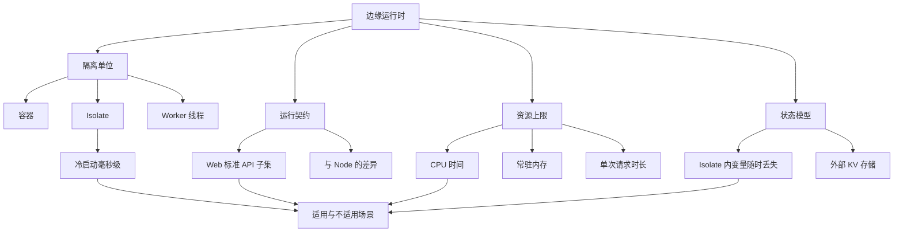
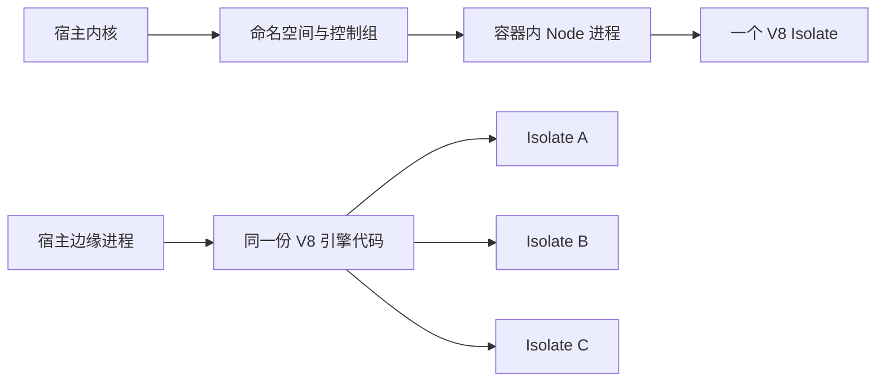
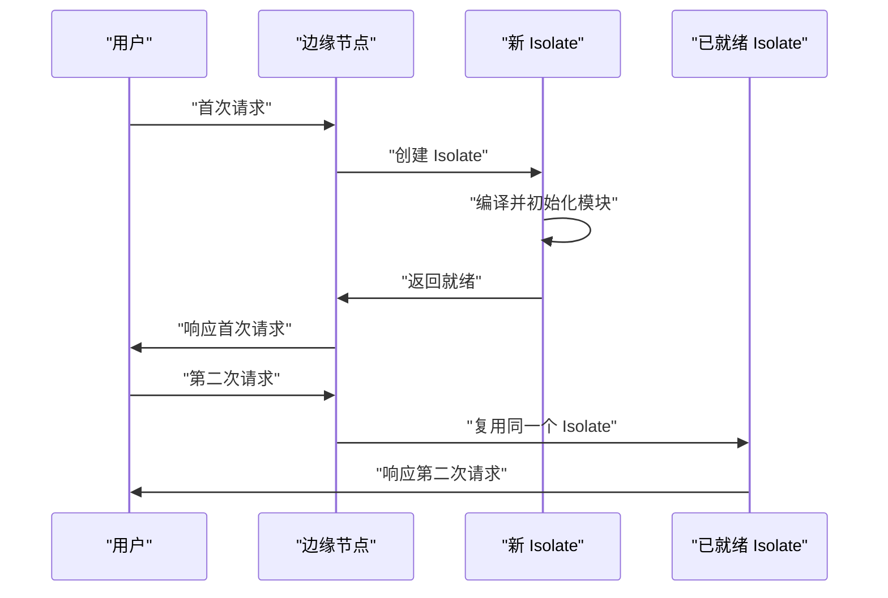
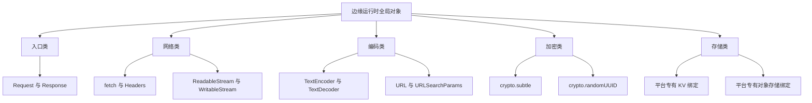
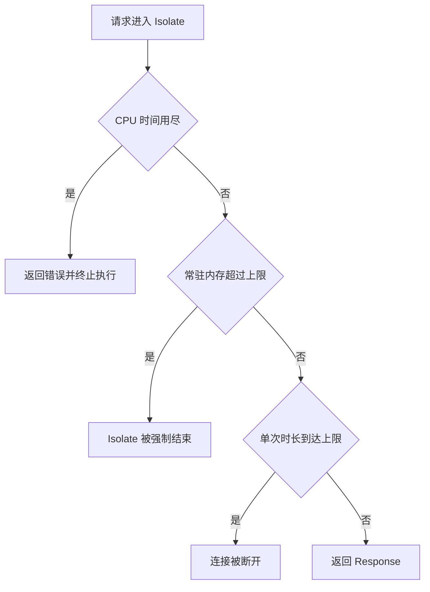
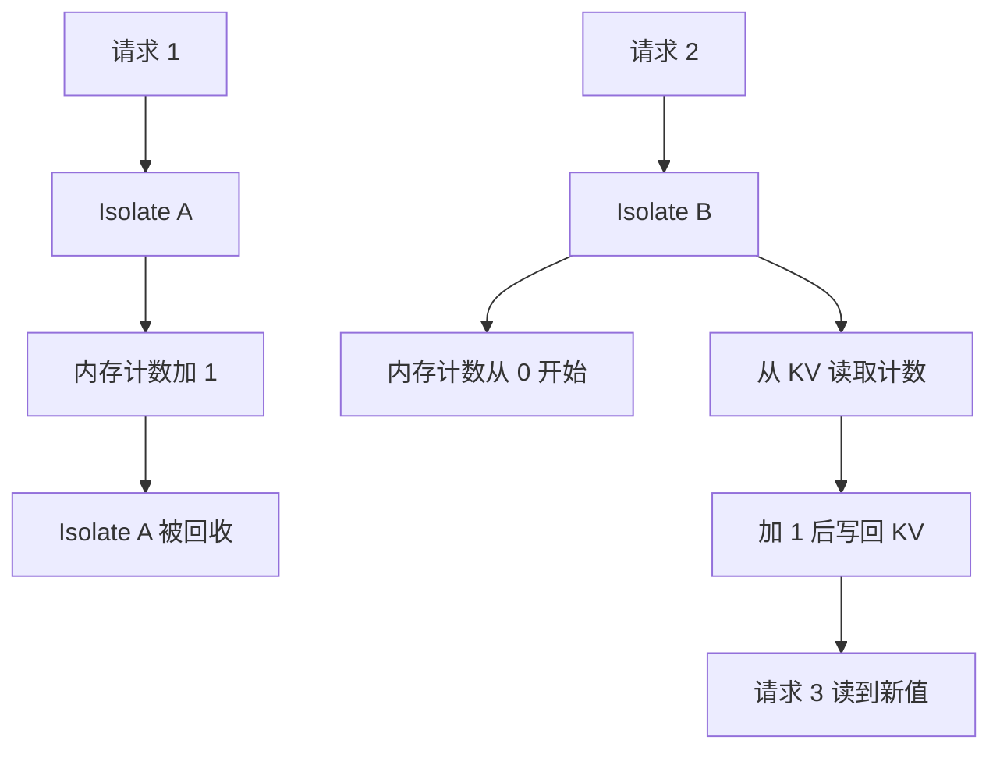
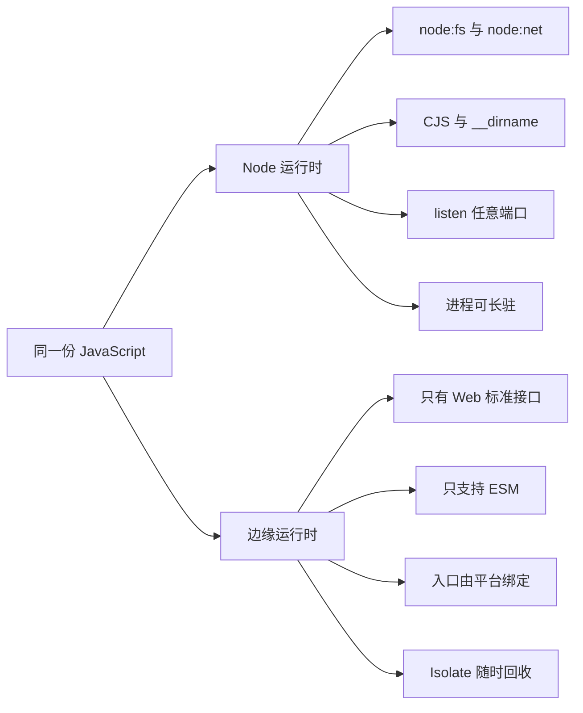
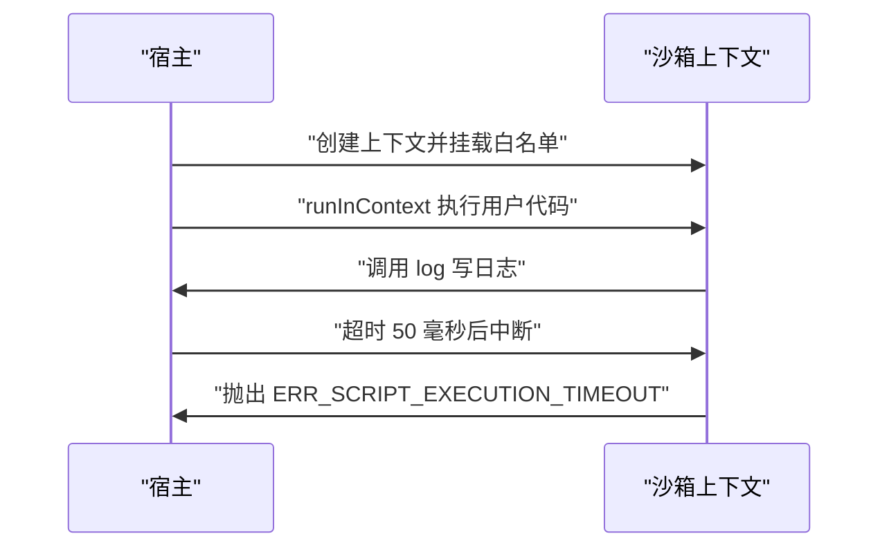
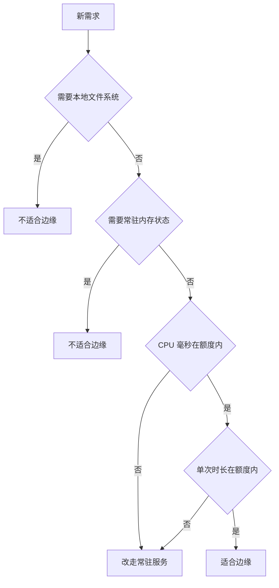

# 边缘运行时：Isolate、Workers 与它们的限制

!!! abstract "学完这一页你能"
    - 说清容器与 Isolate 的隔离边界差别，并解释这道差别如何影响启动耗时。
    - 用 Node 20 的 worker_threads 与 child_process 量出冷启动与热复用两条路径的耗时。
    - 判断一段代码能否跑在边缘运行时，指出它用到的 API 属于哪一类。
    - 按 CPU 时间、常驻内存、单次请求时长三项限制，判断一个需求是否适合放到边缘。

## 0. 知识地图



本页先讲隔离单位，再讲运行契约，最后讲资源上限与状态模型。
建议按编号顺序读，第 7 节的沙箱需要第 4 节的 CPU 时间概念做铺垫。
每节末尾都有可运行脚本，读完一节就跑一次，把概念落到你自己机器的数字上。

## 1. 容器 vs Isolate

**先想一个问题**
同一个接口，放在容器里扩容后第一次请求约 300 毫秒，放到边缘后约 30 毫秒。
代码一行没改，差异全部来自隔离单位的创建成本。

!!! note "术语：容器"
    借助命名空间（namespace）与控制组（control groups，cgroups）给进程组造出的独立视图，包含独立的文件系统、网络栈与进程编号空间。
    例子：Docker 启动的一个 Node 服务就是一个容器。

!!! note "术语：Isolate"
    V8 引擎的一个独立运行时实例，拥有自己的堆、垃圾回收器与内置对象集合，同一进程可以同时存在多个 Isolate。
    例子：Node 的每条 Worker 线程都跑在自己的 Isolate 里。

**心智模型**

!!! tip "心智模型"
    一句话模型：容器隔离的是操作系统给进程造的一份独立视图，Isolate 隔离的是同一进程内的一块 JavaScript 堆。
    日常类比：容器像给每户单独盖一栋房子，Isolate 像同一栋楼里给每户上锁的房间。
    类比不成立的地方：楼里各户共用承重墙；同进程内任一 Isolate 把进程内存撑爆时，其余 Isolate 一起结束。

**图解**



1. 上面三条节点画的是容器路径，隔离动作由内核完成。
2. 命名空间与控制组要为沙箱准备文件系统视图、网络栈与资源账本。
3. 这些准备动作发生在进程创建之前，属于内核态工作。
4. 容器里最终只有一个 Isolate，这份隔离在进程退出后消失。
5. 下面四条节点画的是边缘路径，隔离动作由 V8 完成。
6. 引擎代码整台机器只加载一份，三条 Isolate 各自持有自己的堆。

**一步一步来**

第 1 步：先量一个独立进程的启动耗时，它代表容器方案里换一个新隔离环境的代价。

```js
// measure-process.mjs
import { spawnSync } from 'node:child_process'; // 同步拉起子进程

function measureProcess(n) {
  const samples = [];
  for (let i = 0; i < n; i++) {
    const t0 = performance.now();               // 记录开始时刻
    spawnSync(process.execPath, ['-e', '0']);   // 子进程启动后立刻退出
    samples.push(performance.now() - t0);       // 记录这次耗时毫秒数
  }
  return samples;
}

console.log(measureProcess(3).map((v) => v.toFixed(1)).join(' ms, '));
```

**这段代码在做什么**

- `spawnSync` 同步等待子进程结束，计时区间覆盖进程创建到退出。
- `process.execPath` 指向当前运行的 Node 可执行文件，避免写死路径。
- 参数 `-e '0'` 让子进程启动后立刻退出，把计时压到启动开销上。
- `performance.now()` 返回毫秒级浮点数，可以直接相减。
- 取三个样本而不是一次读数，用来摊平操作系统调度带来的抖动。

运行结果（示例，具体数值以你的机器为准）：
```
54.3 ms, 48.9 ms, 49.6 ms
```

第 2 步：再量一次 Worker 线程的启动耗时，它代表边缘方案里创建 Isolate 的代价。

```js
// measure-worker.mjs
import { Worker } from 'node:worker_threads'; // 线程级隔离单元
import { once } from 'node:events';           // 把事件转成 Promise

async function measureWorker(n) {
  const samples = [];
  for (let i = 0; i < n; i++) {
    const t0 = performance.now();
    const w = new Worker('void 0', { eval: true }); // 空脚本作为入口
    await once(w, 'online');                        // 等线程可执行
    samples.push(performance.now() - t0);
    await w.terminate();                            // 立即回收线程
  }
  return samples;
}

const s = await measureWorker(3);
console.log(s.map((v) => v.toFixed(1)).join(' ms, '));
```

**这段代码在做什么**

- `new Worker` 会创建一条系统线程，并在其中初始化一个新的 V8 Isolate。
- `eval: true` 让第一个参数直接当脚本执行，省掉临时文件。
- `once(w, 'online')` 等到线程进入可执行状态，覆盖 Isolate 初始化阶段。
- `terminate()` 顺序回收，避免上一个样本的线程影响下一个样本。
- 样本数与进程那组保持一致，两组数字才可比。

运行结果（示例，具体数值以你的机器为准）：
```
31.2 ms, 24.8 ms, 25.5 ms
```

第 3 步：把两组样本合成一个文件，用断言守住"样本有效"这件事。

```js
// isolate-vs-process.mjs
import { spawnSync } from 'node:child_process';
import { Worker } from 'node:worker_threads';
import { once } from 'node:events';
import assert from 'node:assert/strict';

function median(xs) {                            // 取中位数
  const s = [...xs].sort((a, b) => a - b);
  const mid = Math.floor(s.length / 2);
  return s.length % 2 ? s[mid] : (s[mid - 1] + s[mid]) / 2;
}

const samples = [];                              // 这里的取值交给完整脚本
assert.ok(median(samples) > 0);                  // 只断言数值有效
```

**这段代码在做什么**

- 中位数比平均值抗离群值，一次系统卡顿不会带偏结论。
- `[...xs]` 先复制再排序，避免改动调用方数组。
- 断言只检查数值为正，不检查两组谁快谁慢。
- 比值随宿主负载变化，写成硬断言会让持续集成偶发失败。

运行结果：
```
断言通过，说明两个统计量都拿到了有效数值
```

**动手验证**

```js
// isolate-vs-process.mjs
// 依赖：无，Node 20 及以上，保存后运行 node isolate-vs-process.mjs
import { spawnSync } from 'node:child_process';
import { Worker } from 'node:worker_threads';
import { once } from 'node:events';
import assert from 'node:assert/strict';

function median(xs) {
  const s = [...xs].sort((a, b) => a - b);
  const mid = Math.floor(s.length / 2);
  return s.length % 2 ? s[mid] : (s[mid - 1] + s[mid]) / 2;
}

function measureProcess(n) {
  const out = [];
  for (let i = 0; i < n; i++) {
    const t0 = performance.now();
    spawnSync(process.execPath, ['-e', '0']);   // 拉起又立刻结束的进程
    out.push(performance.now() - t0);
  }
  return out;
}

async function measureWorker(n) {
  const out = [];
  for (let i = 0; i < n; i++) {
    const t0 = performance.now();
    const w = new Worker('void 0', { eval: true });
    await once(w, 'online');
    out.push(performance.now() - t0);
    await w.terminate();
  }
  return out;
}

const N = 5;
const p = measureProcess(N);
const w = await measureWorker(N);

assert.equal(p.length, N);                       // 样本数完整
assert.equal(w.length, N);
assert.ok(median(p) > 0 && median(w) > 0);       // 数值有效

console.log(`进程启动中位数: ${median(p).toFixed(1)} ms`);
console.log(`Worker 启动中位数: ${median(w).toFixed(1)} ms`);
console.log('两者比值随机器变化，请用你自己的数字做判断');
```

预期输出（数值随机器变化）：
```
进程启动中位数: 51.4 ms
Worker 启动中位数: 26.1 ms
两者比值随机器变化，请用你自己的数字做判断
```

**常见坑**

| 现象 | 原因 | 怎么修 |
| --- | --- | --- |
| 计时结果跳来跳去 | 用了 `Date.now()`，精度受系统时钟调整影响 | 改用 `performance.now()` |
| 第一组样本明显偏大 | 首次创建线程要加载引擎代码，属于预热 | 先跑一次丢弃的预热样本，再统计 |
| 持续集成偶发失败 | 断言写成"Worker 一定快于进程" | 断言只守样本完整与数值有效，比值只打印 |
| 子进程启动时间包含无关工作 | 子进程入口脚本做了初始化 | 入口只保留退出语句，把初始化留给别的实验 |

**小结**

- 容器隔离由内核完成，代价落在进程创建前后；Isolate 隔离由 V8 完成，代价落在堆初始化。
- Node 的每条 Worker 线程持有自己的 Isolate，可以直接用来量 Isolate 的创建成本。
- 任何耗时结论都要带样本量、中位数与机器信息，否则无法复现。

## 2. 冷启动

**先想一个问题**
同一个函数，第一次调用 200 毫秒才返回，第二次只要 1 毫秒。
这 199 毫秒里，环境准备占了多少，你的代码占了多少？

!!! note "术语：冷启动"
    请求到达时运行时还没有可复用的 Isolate，需要新建 Isolate、加载并初始化代码的那段时间。
    例子：每条 Worker 线程第一次收到消息前的等待，就是一次冷启动。

**心智模型**

!!! tip "心智模型"
    一句话模型：冷启动是把执行环境准备到就绪状态的时间，热调用复用已经就绪的环境。
    日常类比：冷启动像按下台式机电源再等系统进入桌面，热调用像敲一下键盘唤醒显示器。
    类比不成立的地方：显示器唤醒不做任何初始化，而热调用仍要跑一遍请求级初始化，例如解析参数与建立连接。

**图解**



1. 首次请求到达边缘节点，节点发现没有可复用的 Isolate。
2. 节点创建 Isolate，这一步要初始化堆与内置对象集合。
3. Isolate 编译脚本并求值模块顶层代码，这是你能控制的部分。
4. 模块进入就绪状态后，节点才把请求交给处理函数。
5. 响应返回后，Isolate 被保留一小段时间等待复用。
6. 第二次请求命中同一个 Isolate，跳过第 2 到第 4 步。

**一步一步来**

第 1 步：在 Worker 里写一段耗时的模块初始化，用来放大冷启动里可控的那部分。

```js
// 模块顶层代码在每次冷启动时都会执行一次
let acc = 0;
for (let i = 0; i < 2_000_000; i++) acc += i;   // 模拟构建索引表
parentPort.on('message', (v) => parentPort.postMessage(v + acc));
parentPort.postMessage('ready');                // 初始化完成后通知主线程
```

**这段代码在做什么**

- 顶层循环在模块求值时执行，每次新建 Isolate 都要重跑。
- 把这个循环长度当成旋钮，可以直观看到冷启动时间随之变化。
- `parentPort.on` 注册消息处理，代表请求入口。
- 最后一行发出就绪信号，让主线程能精确计量"环境准备完成"的时刻。
- 这段代码只在 Worker 内执行，主线程走另一个分支。

运行结果：
```
Worker 内初始化完成，主线程收到字符串 ready
```

第 2 步：测量冷启动，每次请求都新建一个 Isolate。

```js
async function cold(n) {
  const out = [];
  for (let i = 0; i < n; i++) {
    const t0 = performance.now();
    const w = new Worker(new URL(import.meta.url)); // 复用本文件做入口
    await once(w, 'message');                       // 等到 ready
    out.push(performance.now() - t0);
    await w.terminate();                            // 回收，保证下次仍是冷启动
  }
  return out;
}
```

**这段代码在做什么**

- `new URL(import.meta.url)` 指向当前文件，这样 Worker 能复用同一份源码。
- 等到第一条消息才算完成，这条消息由初始化末尾发出。
- `terminate()` 不可省略，否则下一次可能命中复用路径。
- 样本数与热调用样本数分开，两组统计量各自独立。
- 循环体内的创建动作就是边缘运行时在冷启动时做的动作。

运行结果（示例）：
```
cold 中位数约 40 ms，具体数值随机器变化
```

第 3 步：测量热调用，复用同一个 Isolate 连续发消息。

```js
async function warm(n) {
  const w = new Worker(new URL(import.meta.url));
  await once(w, 'message');                        // 先等到 ready
  const out = [];
  for (let i = 0; i < n; i++) {
    const p = once(w, 'message');                  // 先挂监听
    const t0 = performance.now();
    w.postMessage(i);                              // 再发消息
    await p;
    out.push(performance.now() - t0);
  }
  await w.terminate();
  return out;
}
```

**这段代码在做什么**

- 先挂监听再发消息，避免消息回得太快而漏掉监听。
- 计时区间只覆盖一次往返，不含线程创建与模块初始化。
- 循环次数取 200，样本足够多时中位数才稳定。
- 复用同一个对象，直接对应边缘运行时把 Isolate 保留待复用的行为。
- 结束后统一回收，避免进程退出时仍有活跃线程。

运行结果（示例）：
```
warm 中位数约 0.3 ms，具体数值随机器变化
```

**动手验证**

```js
// cold-warm.mjs
// 依赖：无，Node 20 及以上，保存后运行 node cold-warm.mjs
import { isMainThread, parentPort, Worker } from 'node:worker_threads';
import { once } from 'node:events';
import assert from 'node:assert/strict';

if (!isMainThread) {
  let acc = 0;
  for (let i = 0; i < 2_000_000; i++) acc += i;    // 冷启动时必跑的初始化
  parentPort.on('message', (v) => parentPort.postMessage(v + acc));
  parentPort.postMessage('ready');                 // 通知主线程初始化完成
} else {
  main().catch((err) => { console.error(err); process.exit(1); });
}

function median(xs) {
  const s = [...xs].sort((a, b) => a - b);
  const mid = Math.floor(s.length / 2);
  return s.length % 2 ? s[mid] : (s[mid - 1] + s[mid]) / 2;
}

async function cold(n) {
  const out = [];
  for (let i = 0; i < n; i++) {
    const t0 = performance.now();
    const w = new Worker(new URL(import.meta.url));
    await once(w, 'message');
    out.push(performance.now() - t0);
    await w.terminate();
  }
  return out;
}

async function warm(n) {
  const w = new Worker(new URL(import.meta.url));
  await once(w, 'message');
  const out = [];
  for (let i = 0; i < n; i++) {
    const p = once(w, 'message');
    const t0 = performance.now();
    w.postMessage(i);
    await p;
    out.push(performance.now() - t0);
  }
  await w.terminate();
  return out;
}

async function main() {
  const c = await cold(5);
  const m = await warm(200);
  assert.equal(c.length, 5);
  assert.equal(m.length, 200);
  assert.ok(median(c) > median(m), '冷启动应慢于热调用');
  console.log(`冷启动中位数: ${median(c).toFixed(2)} ms`);
  console.log(`热调用中位数: ${median(m).toFixed(2)} ms`);
  console.log(`初始化耗时占比: ${((1 - median(m) / median(c)) * 100).toFixed(1)} %`);
}
```

预期输出（数值随机器变化）：
```
冷启动中位数: 41.87 ms
热调用中位数: 0.31 ms
初始化耗时占比: 99.3 %
```

**常见坑**

| 现象 | 原因 | 怎么修 |
| --- | --- | --- |
| 测出的冷启动时间偏小 | 入口脚本几乎为空，没跑初始化 | 在 Worker 顶层放一段可调长度的循环 |
| 热调用样本抖动大 | 监听挂晚了，把等待算进了下一次计时 | 先 `once` 再 `postMessage` |
| 冷启动样本越跑越小 | 上一个线程还没退出，复用到了缓存 | 每个样本结束都 `terminate()` |
| 把冷启动当固定值写进文档 | 它受镜像、代码体积、宿主负载共同影响 | 记录代码版本与机器信息，标明测量条件 |

**小结**

- 冷启动由 Isolate 创建、脚本编译、模块初始化三段组成，第三段是你自己写的。
- 热调用跳过前两段，第三段仍然执行，所以热调用不是零成本。
- 想降低冷启动影响，先压缩模块顶层的同步工作，再考虑提高复用率。

## 3. Web 标准 API 子集

**先想一个问题**
你把一个 Express 接口搬到边缘，构建直接报错，提示找不到 `node:fs`。
边缘运行时到底给了你哪些全局对象？

!!! note "术语：边缘运行时"
    部署在离用户较近机房的 JavaScript 运行时，入口是网络请求，只提供一部分 Web 标准 API，不提供完整的 Node 内置模块。
    例子：一个接收 Request 并返回 Response 的函数，就是边缘运行时的执行单元。

!!! note "术语：Web 标准 API 子集"
    由标准化组织定义、浏览器也实现的接口集合中，边缘运行时实现的那一部分。
    例子：`fetch`、`Request`、`Response`、`TextEncoder` 属于这个子集。

**心智模型**

!!! tip "心智模型"
    一句话模型：边缘运行时等于浏览器提供的 Web 接口，加上一个网络入口和几项存储服务。
    日常类比：像住酒店，房间按统一标准配置，自己家里的家具搬不进去。
    类比不成立的地方：酒店房间至少能确定有插座，而边缘运行时的全局对象清单逐平台不同，同一个全局在这里有、在那里可能没有。

**图解**



1. 入口类提供收发数据的对象，处理函数从 Request 读入、向 Response 写出。
2. 网络类提供 `fetch`、`Headers` 与流对象，用来发起子请求与处理大响应体。
3. 编码类提供文本与字节之间的互转、以及地址解析能力。
4. 加密类提供哈希、签名与随机数，Webhook 验签靠它完成。
5. 存储类不来自 Web 标准，而是平台绑定的 KV 或对象存储接口。
6. 每一类之外的能力，例如文件读写与原始套接字，都不在清单里。

**一步一步来**

第 1 步：把要检测的全局名字列成数组，逐个读出类型。

```js
const EDGE_SAFE = [
  'fetch', 'Request', 'Response', 'Headers', 'URL', 'URLSearchParams',
  'TextEncoder', 'TextDecoder', 'crypto', 'AbortController', 'structuredClone',
];                                              // 边缘常见全局的候选清单

function probe(names) {
  return names.map((n) => [n, typeof globalThis[n]]); // 名字与类型配对
}

console.log(probe(EDGE_SAFE).map(([n, t]) => `${n}=${t}`).join(' '));
```

**这段代码在做什么**

- 用 `typeof` 判断全局是否存在，不会因为属性缺失而抛错。
- `globalThis` 在 Node 20 的主线程与 Worker 中指向各自的全局对象。
- `map` 把结果整理成二元组数组，方便后面做断言与打印。
- 清单只选 Node 20 已实现的 Web 接口，保证本地可复现。
- 输出用空白连接成一行，便于与 Worker 内的结果做比较。

运行结果（Node 20，示例）：
```
fetch=function Request=function Response=function Headers=function URL=function ...
```

第 2 步：在 Worker 内跑同一份检测，确认线程内清单与主线程一致。

```js
if (!isMainThread) {
  parentPort.postMessage(probe(EDGE_SAFE));     // 把 Worker 侧结果发回
} else {
  main().catch((err) => { console.error(err); process.exit(1); });
}
```

**这段代码在做什么**

- Worker 线程是同一进程里的另一个 Isolate，用它验证清单是否跨 Isolate 成立。
- 结果通过消息通道回传，主线程拿到后再做对比。
- `probe` 是函数声明，会被提升，Worker 分支能直接调用。
- 主线程分支集中处理后续异步流程，出错时以非零码退出。
- 这份结构让同一文件既能当主入口，也能当 Worker 入口。

运行结果：
```
Worker 侧返回的二元组数组与主线程逐项相等
```

第 3 步：断言核心项存在，并用表格打印清单。

```js
const mainTable = probe(EDGE_SAFE);             // 主线程清单
const w = new Worker(new URL(import.meta.url));
const [workerTable] = await once(w, 'message'); // 收到 Worker 清单
await w.terminate();

for (const [name, type] of mainTable) {
  assert.notEqual(type, 'undefined', `${name} 应存在`); // 逐项检查
}
assert.deepEqual(workerTable, mainTable);       // 两侧清单一致
```

**这段代码在做什么**

- 逐项断言名字不是 `undefined`，把"我以为有"变成可检验结论。
- `assert.deepEqual` 比较嵌套数组，确认跨 Isolate 结果一致。
- 断言失败时消息里带上名字，定位成本降低。
- 测完立即回收 Worker，避免脚本迟迟不退出。
- 这一步之后，本地测试通过不代表边缘平台也通过，仍需核对平台文档。

运行结果：
```
断言全部通过，打印出 11 行 name 与 type 的表格
```

**动手验证**

```js
// edge-api-probe.mjs
// 依赖：无，Node 20 及以上，保存后运行 node edge-api-probe.mjs
import { isMainThread, parentPort, Worker } from 'node:worker_threads';
import { once } from 'node:events';
import assert from 'node:assert/strict';

const NAMES = ['fetch', 'Request', 'Response', 'Headers', 'URL', 'URLSearchParams',
  'TextEncoder', 'TextDecoder', 'crypto', 'AbortController', 'structuredClone'];

if (!isMainThread) {
  parentPort.postMessage(probe(NAMES));          // Worker 侧检测结果
} else {
  main().catch((err) => { console.error(err); process.exit(1); });
}

function probe(names) {
  return names.map((n) => [n, typeof globalThis[n]]);
}

async function main() {
  const mainTable = probe(NAMES);
  const w = new Worker(new URL(import.meta.url));
  const [workerTable] = await once(w, 'message');
  await w.terminate();

  for (const [name, type] of mainTable) {
    assert.notEqual(type, 'undefined', `${name} 在 Node 20 应存在`);
  }
  assert.deepEqual(workerTable, mainTable);      // 跨 Isolate 清单一致
  console.table(mainTable.map(([name, type]) => ({ name, type })));
  console.log('注意：该清单由 Node 20 提供，边缘平台清单需核对平台文档');
}
```

预期输出：

| (index) | name | type |
| --- | --- | --- |
| 0 | 'fetch' | 'function' |
| ... | ... | ... |

注意：该清单由 Node 20 提供，边缘平台清单需核对平台文档

**常见坑**

| 现象 | 原因 | 怎么修 |
| --- | --- | --- |
| 本地能跑，上线报 `not defined` | 本地是 Node 全局，边缘平台没实现该接口 | 只依赖你核对过的平台清单，写好降级分支 |
| `fetch` 可用但不能连内网地址 | 子请求目标受平台网络策略限制 | 把目标地址改成公网可达，或改走平台专有绑定 |
| 读响应体报"已消费" | `Response` 的 body 只能读一次 | 先 `await res.text()` 存下来，后续用字符串 |
| 认为 Worker 里全局对象不同 | 两个 Isolate 各自有一份全局对象 | 用同一个检测函数分别跑，再比较结果 |

**小结**

- 边缘运行时的 API 面等于 Web 标准接口的可行子集，加上平台绑定的存储。
- 判断兼容性最省力的办法是把接口名单写成数组，用 `typeof` 逐项检测。
- 本地测试通过只说明代码符合 Web 标准，平台差异必须单独核对。

## 4. 资源限制：CPU、内存与时长

**先想一个问题**
一个函数在本地跑 2 秒返回 200，上线边缘后返回 503，日志写着超出 CPU 时间。
为什么等待网络的时间不算，跑哈希的时间就算？

!!! note "术语：CPU 时间"
    代码真正占用处理器执行指令的累计时长，等待网络与等待定时器的时间不计入。
    例子：`setTimeout` 等 100 毫秒，CPU 时间增加接近 0。

!!! note "术语：常驻内存"
    常驻内存（Resident Set Size，RSS）指进程当前实际占用的物理内存字节数。
    例子：一个保持 10 万个对象的数组，在这块内存被回收前一直计入额度。

**心智模型**

!!! tip "心智模型"
    一句话模型：边缘运行时用三道额度卡住一次请求：CPU 时间、常驻内存、单次时长。
    日常类比：像健身房按你的实际锻炼分钟、储物柜体积、单次逗留时长分别设限。
    类比不成立的地方：储物柜可以随时整理腾空，而 JavaScript 堆要等垃圾回收器运行，额度在回收前一直占着。

**图解**



1. 请求进入后，运行时就为这次调用开一份额度账本。
2. CPU 时间是第一道关，纯计算的循环会最快触到它。
3. 内存是第二道关，创建大对象或缓存大数组会触到它。
4. 内存超限通常导致 Isolate 直接结束，调用方看到连接中断。
5. 单次时长照墙钟计算，等待下游接口也会累加。
6. 三道关都通过，处理函数才把 Response 交回去。

**一步一步来**

第 1 步：区分等待与计算，量出等待几乎不消耗 CPU 时间。

```js
const WALL_SLEEP_MS = 100;
const wallStart = performance.now();
const beforeSleep = process.cpuUsage();          // 记录 CPU 时间起点
await new Promise((r) => setTimeout(r, WALL_SLEEP_MS));
const sleepWallMs = performance.now() - wallStart;
const sleepCpuMs = process.cpuUsage(beforeSleep).user / 1000; // 微秒转毫秒
```

**这段代码在做什么**

- `performance.now()` 量的是墙钟时间，包含等待。
- `process.cpuUsage()` 返回 `user` 与 `system` 两段微秒数。
- 取 `user` 段除以 1000，把微秒换算成毫秒便于比较。
- 等待定时器只让出处理器，因此 CPU 时间增量接近 0。
- 这段代码为下一段忙等提供对照组。

运行结果（示例）：
```
墙钟 101.2 ms, CPU 0.4 ms
```

第 2 步：忙等 50 毫秒，量出计算会同时拉高墙钟与 CPU 时间。

```js
const busyStart = process.cpuUsage();
const busyWallStart = performance.now();
let acc = 0;
while (performance.now() - busyWallStart < 50) acc += 1; // 空转占满处理器
const busyWallMs = performance.now() - busyWallStart;
const busyCpuMs = process.cpuUsage(busyStart).user / 1000;
```

**这段代码在做什么**

- 忙等循环不做等待，一直占用处理器执行加法。
- 因此墙钟时间与 CPU 时间的增量落在同一个量级。
- `acc` 被累加是为了防止引擎把空循环优化掉。
- 循环条件用墙钟判断，保证退出时机可控。
- 与第 1 步对比，就能解释为什么边缘按 CPU 时间计费。

运行结果（示例）：
```
墙钟 50.1 ms, CPU 49.8 ms
```

**动手验证**

```js
// cpu-vs-wall.mjs
// 依赖：无，Node 20 及以上，保存后运行 node cpu-vs-wall.mjs
import assert from 'node:assert/strict';

const WALL_SLEEP_MS = 100;
const wallStart = performance.now();
const beforeSleep = process.cpuUsage();
await new Promise((r) => setTimeout(r, WALL_SLEEP_MS));
const sleepWallMs = performance.now() - wallStart;
const sleepCpuMs = process.cpuUsage(beforeSleep).user / 1000;

const busyStart = process.cpuUsage();
const busyWallStart = performance.now();
let acc = 0;
while (performance.now() - busyWallStart < 50) acc += 1;
const busyWallMs = performance.now() - busyWallStart;
const busyCpuMs = process.cpuUsage(busyStart).user / 1000;

assert.ok(sleepWallMs >= WALL_SLEEP_MS, '等待至少占满 100 毫秒墙钟');
assert.ok(sleepCpuMs < busyCpuMs, '等待的 CPU 时间应少于忙等');
assert.ok(busyCpuMs > 5, '忙等 50 毫秒应消耗可见的 CPU 时间');
assert.ok(acc > 0, '循环体应真实执行');

console.log(`等待: 墙钟 ${sleepWallMs.toFixed(1)} ms, CPU ${sleepCpuMs.toFixed(1)} ms`);
console.log(`忙等: 墙钟 ${busyWallMs.toFixed(1)} ms, CPU ${busyCpuMs.toFixed(1)} ms`);
console.log(`堆已用: ${(process.memoryUsage().heapUsed / 1048576).toFixed(1)} MiB`);
console.log('具体额度需核对平台文档：核对 CPU 毫秒上限、内存上限、单次时长上限');
```

预期输出（数值随机器变化）：
```
等待: 墙钟 101.3 ms, CPU 0.5 ms
忙等: 墙钟 50.2 ms, CPU 49.9 ms
堆已用: 4.3 MiB
具体额度需核对平台文档：核对 CPU 毫秒上限、内存上限、单次时长上限
```

**常见坑**

| 现象 | 原因 | 怎么修 |
| --- | --- | --- |
| 本地 2 秒通过，线上 503 | 本地不限 CPU 时间，平台按 CPU 毫秒计费并限流 | 把重计算拆成多次子请求，或移到常驻服务 |
| 日志显示内存超限 | 一次读入整个大响应体或大数组 | 改成流式读取，分块处理后丢弃 |
| 偶发超时但 CPU 很低 | 等待下游接口的时间累加到了单次时长 | 给下游请求加超时，并控制子请求串行数量 |
| 把额度数值写死在代码里 | 数值随平台与套餐变化 | 把阈值做成配置，并按官方文档核对当前套餐 |

**小结**

- CPU 时间只统计计算，等待网络与等待定时器都不计入，所以重计算最先触限。
- 常驻内存是即时账本，对象在垃圾回收前一直占用额度。
- 单次时长按墙钟计算，慢下游会让你的函数一起超时。

## 5. 状态存储模型

**先想一个问题**
你把计数器写在模块顶层变量里，本地自增正常，线上部署后数值乱跳。
同一个用户连点两次，数值有时加 1，有时回到初始值，为什么？

!!! note "术语：无状态"
    计算层不保存跨请求的长期数据，同一个请求落到哪个 Isolate 由调度决定。
    例子：把用户数据放在外部 KV 里，Isolate 只做读写与计算。

!!! note "术语：KV 存储"
    键值存储（Key-Value Store），按字符串键读写值的服务，通常提供最终一致读。
    例子：把用户配额写在 KV 的 `quota:用户编号` 键上。

**心智模型**

!!! tip "心智模型"
    一句话模型：Isolate 像共享办公桌，你离开后桌面会被清空，要留下东西必须放进楼下储物柜。
    日常类比：储物柜就是 KV 存储，桌面上只放这一次工作要用的纸。
    类比不成立的地方：共享办公桌至少保证当天不被清，而 Isolate 的生命周期没有任何承诺，回收时机由平台决定。

**图解**



1. 请求 1 落到 Isolate A，模块级变量被加 1。
2. Isolate A 在空闲窗口结束后被回收，变量随堆一起消失。
3. 请求 2 落到 Isolate B，模块级变量重新初始化为 0。
4. 如果代码直接读内存变量，这次读到的是 0。
5. 正确做法是在步骤 5 处从 KV 读取当前值。
6. 加 1 后写回 KV，请求 3 不管落到哪个 Isolate 都能读到新值。

**一步一步来**

第 1 步：写一个把计数放在 Isolate 内存里的版本，观察它跨 Isolate 失效。

```js
let memoryCounter = 0;                           // Isolate 内的模块级变量
parentPort.on('message', (msg) => {
  if (msg.kind === 'inc-memory') {
    memoryCounter += 1;                          // 只影响当前 Isolate
    parentPort.postMessage({ value: memoryCounter });
  }
});
parentPort.postMessage({ kind: 'ready' });       // 就绪信号
```

**这段代码在做什么**

- 变量声明在模块顶层，每次新建 Isolate 都会重新初始化为 0。
- 处理函数只做自增，不做任何外部读写。
- 自增结果回传主线程，便于断言。
- 就绪信号让主线程知道 Worker 已经可以收消息。
- 这份实现能通过单次测试，却在跨 Isolate 时暴露问题。

运行结果：
```
同一 Isolate 连续三次自增得到 1、2、3
换一个 Isolate 再自增得到 1
```

第 2 步：改成无状态写法，状态由调用方带进来，结果再带出去。

```js
let memoryCounter = 0;
parentPort.on('message', (msg) => {
  if (msg.kind === 'inc-pure') {
    parentPort.postMessage({ value: msg.n + 1 }); // 入参进，结果出
  }
});
```

**这段代码在做什么**

- 处理函数不读写任何跨请求变量，输出只由输入决定。
- 调用方负责从外部存储取 `n`，并把返回值写回存储。
- 这种形状的代码可以落到任意 Isolate，结果都一致。
- 代价是每次请求多两次存储往返，需要把往返算进单次时长。
- 幂等性问题转移到存储层，写入时要带版本号或使用原子操作。

运行结果：
```
连续三次调用，外部存储里的值依次为 1、2、3
```

**动手验证**

```js
// state-model.mjs
// 依赖：无，Node 20 及以上，保存后运行 node state-model.mjs
import { isMainThread, parentPort, Worker } from 'node:worker_threads';
import { once } from 'node:events';
import assert from 'node:assert/strict';

if (!isMainThread) {
  let memoryCounter = 0;                          // 只活在当前 Isolate 里
  parentPort.on('message', (msg) => {
    if (msg.kind === 'inc-memory') {
      memoryCounter += 1;
      parentPort.postMessage({ value: memoryCounter });
    } else if (msg.kind === 'inc-pure') {
      parentPort.postMessage({ value: msg.n + 1 });
    }
  });
  parentPort.postMessage({ kind: 'ready' });
} else {
  main().catch((err) => { console.error(err); process.exit(1); });
}

async function spawn() {
  const w = new Worker(new URL(import.meta.url));
  await once(w, 'message');                       // 消费 ready 消息
  return w;
}

async function ask(w, msg) {
  const p = once(w, 'message');
  w.postMessage(msg);
  const [reply] = await p;
  return reply.value;
}

async function main() {
  const kv = new Map();                           // 扮演外部 KV 存储

  const w1 = await spawn();
  const a = await ask(w1, { kind: 'inc-memory' });
  const b = await ask(w1, { kind: 'inc-memory' });
  await w1.terminate();                           // 回收第一个 Isolate

  const w2 = await spawn();
  const c = await ask(w2, { kind: 'inc-memory' }); // 新 Isolate，计数回到 1
  await w2.terminate();

  assert.deepEqual([a, b, c], [1, 2, 1]);

  let n = 0;
  for (let i = 0; i < 3; i++) {
    const w = await spawn();
    n = await ask(w, { kind: 'inc-pure', n });    // 状态进，新状态出
    kv.set('counter', n);
    await w.terminate();
  }
  assert.equal(kv.get('counter'), 3);

  console.log(`Isolate 内计数序列: ${[a, b, c].join(', ')}`);
  console.log(`外部 KV 计数: ${kv.get('counter')}`);
}
```

预期输出：
```
Isolate 内计数序列: 1, 2, 1
外部 KV 计数: 3
```

**常见坑**

| 现象 | 原因 | 怎么修 |
| --- | --- | --- |
| 计数偶尔回到初始值 | 请求落到新建的 Isolate | 状态放到 KV，代码保持无状态 |
| 把全局变量当缓存提速 | 缓存命中率由调度决定，不可依赖 | 缓存放平台专有缓存服务，并设置生存时间 |
| 并发自增丢更新 | 读改写三步不是原子操作 | 用平台的原子操作接口，或改队列串行处理 |
| 部署后旧值覆盖新值 | 读到了最终一致的旧副本 | 关键路径改为强一致读，或写时带上版本号 |

**小结**

- Isolate 内变量随时可能消失，不能作为跨请求数据的存放位置。
- 与 Node 常驻进程的差别就在这一点：Node 进程里的模块级变量可以长期存在。
- 状态外置后，幂等与并发控制一起转移到存储层，读写协议要显式设计。

## 6. 与 Node 的差异

**先想一个问题**
同一份代码里写了一句 `import fs from 'node:fs'`，Node 里正常，边缘直接构建失败。
除了内置模块，还有哪些地方会突然不一样？

!!! note "术语：ESM"
    ECMAScript Modules，语言层面的模块语法，用 `import` 与 `export` 声明依赖。
    例子：`import { once } from 'node:events'` 是 ESM 写法。

!!! note "术语：CJS"
    CommonJS，Node 早期的模块方案，用 `require` 与 `module.exports`。
    例子：`const fs = require('node:fs')` 是 CJS 写法，边缘运行时通常不支持。

**心智模型**

!!! tip "心智模型"
    一句话模型：Node 运行时是操作系统接口加一个事件循环，边缘运行时是浏览器 Web 接口加一个网络入口。
    日常类比：像出国换插座，电压相同但插头形状不同，电器本身不用改。
    类比不成立的地方：插座差异一次就能换完，而全局对象、模块系统、生命周期规则三类差异会同时出现在同一份代码里。

**图解**



1. 同一份源码进入两条路径，差异从第一行依赖声明开始。
2. Node 侧可以引入文件系统、网络与子进程模块，边缘侧没有这些模块。
3. Node 侧 CJS 里可以用 `__dirname`，边缘侧只按 ESM 解析，`__dirname` 未定义。
4. Node 侧可以监听端口当服务器，边缘侧的入口由平台绑定到请求。
5. Node 侧的进程可以长期存活，边缘侧的 Isolate 会被回收。
6. 四条差异中，只有第 1 条能靠打包工具消除。

**一步一步来**

第 1 步：用 Web 标准的 Request 与 Response 写处理函数，这类代码本地可测。

```js
async function handler(request) {
  const url = new URL(request.url);                 // 解析请求地址
  const name = url.searchParams.get('name') ?? 'anonymous'; // 读查询参数
  return new Response(JSON.stringify({ hello: name }), {
    headers: { 'content-type': 'application/json' }, // 显式声明内容类型
  });
}
```

**这段代码在做什么**

- 入参是标准 Request，出参是标准 Response，不依赖任何 Node 模块。
- `new URL(request.url)` 是解析查询串的标准做法。
- `??` 提供默认值，替代 `||` 带来的空字符串误判。
- 返回体用 `JSON.stringify` 序列化，配合显式的内容类型头。
- 这段代码在 Node 20、浏览器与多数边缘平台都能运行。

运行结果：
```
返回 200，响应体为 hello 字段等于 ada 的 JSON
```

第 2 步：在本地用 Node 20 直接调用处理函数并断言结果。

```js
const res = await handler(new Request('https://edge.example.com/?name=ada'));
assert.equal(res.status, 200);                          // 默认状态码
assert.equal(res.headers.get('content-type'), 'application/json');
assert.deepEqual(await res.json(), { hello: 'ada' });   // 响应体只能读一次
```

**这段代码在做什么**

- `new Request` 在 Node 20 是全局可用的，因此本地能构造请求。
- `Response` 默认状态码是 200，断言把它写实。
- 读响应体只能进行一次，这里直接读出并断言，不做二次读取。
- 断言把"能跑"变成"结果正确"，比打印日志可靠。
- 本地通过只说明符合 Web 标准，平台差异仍需核对官方文档。

运行结果：
```
三条断言通过，输出一行提示说明 Node 专有模块在边缘不可用
```

**动手验证**

```js
// edge-handler-local.mjs
// 依赖：无，Node 20 及以上，保存后运行 node edge-handler-local.mjs
import assert from 'node:assert/strict';

async function handler(request) {
  const url = new URL(request.url);
  const name = url.searchParams.get('name') ?? 'anonymous';
  return new Response(JSON.stringify({ hello: name }), {
    headers: { 'content-type': 'application/json' },
  });
}

const res = await handler(new Request('https://edge.example.com/?name=ada'));
assert.equal(res.status, 200);
assert.equal(res.headers.get('content-type'), 'application/json');
assert.deepEqual(await res.json(), { hello: 'ada' });
assert.equal(typeof globalThis.process, 'object', 'Node 有 process 全局');
assert.equal(typeof globalThis.__dirname, 'undefined', 'ESM 里没有 __dirname');

console.log('边缘风格的 handler 在 Node 20 本地可测试');
console.log('Node 专有模块在边缘不可用: node:fs, node:net, node:child_process');
console.log('需核对平台文档：入口导出形状、环境变量读取方式、子请求上限');
```

预期输出：
```
边缘风格的 handler 在 Node 20 本地可测试
Node 专有模块在边缘不可用: node:fs, node:net, node:child_process
需核对平台文档：入口导出形状、环境变量读取方式、子请求上限
```

**常见坑**

| 现象 | 原因 | 怎么修 |
| --- | --- | --- |
| `__dirname is not defined` | 代码按 ESM 解析，该变量只属于 CJS | 用 `import.meta.url` 配合 `fileURLToPath` 推导路径 |
| 打包后构建失败 | 依赖树里有 `node:*` 内置模块 | 把只在 Node 用的代码隔离到单独入口，或用平台兼容开关 |
| 环境变量读不到 | 平台只注入你在控制台声明的变量 | 把变量声明进平台配置，代码里做缺失兜底 |
| 处理函数跑完进程不退出 | Node 侧注册了常驻定时器或监听器 | 处理结束后清理定时器，或改用平台提供的等待接口 |

**小结**

- 差异集中在三块：可用 API、模块系统与路径变量、入口与生命周期。
- 把业务逻辑写成 Request 进 Response 出的形状，就能在 Node 20 本地做大部分测试。
- 平台专有的入口形状与环境变量读取方式必须逐项核对官方文档。

## 7. 手写一个最小沙箱

**先想一个问题**
你运行一段用户上传的脚本，它一句 `import fs from 'node:fs'` 就能读走服务器文件。
怎么把它关进一个只有白名单接口的盒子里？

!!! note "术语：node:vm"
    Node 内置的虚拟机模块，能在同一进程里创建一个新的 JavaScript 全局环境并执行字符串代码。
    例子：`vm.createContext` 造出环境，`Script.runInContext` 在其中执行代码。

!!! note "术语：隔离上下文"
    一个独立的全局对象与内置对象集合，其中的 `Object`、`Array` 与宿主里的不是同一批对象。
    例子：上下文里的 `Object` 与宿主的 `Object` 比较为不相等。

**心智模型**

!!! tip "心智模型"
    一句话模型：沙箱等于换一个全新全局对象，再把批准的接口挂上去。
    日常类比：像给访客一部只装了指定应用的空手机。
    类比不成立的地方：访客手机的系统调用仍通向真实硬件，而 vm 上下文里的代码能通过宿主传入的函数对象反查宿主的 Function 构造器，从而拿到宿主全局。

**图解**



1. 宿主用 `vm.createContext` 创建一个新的全局环境。
2. 宿主只把 `log`、`Math`、`JSON` 这类对象挂进这个环境。
3. 用户代码通过 `runInContext` 在环境内执行。
4. 代码调用 `log` 时，实际执行的是宿主提供的函数。
5. 脚本陷入死循环时，宿主用 `timeout` 选项在设定毫秒数后中断。
6. 中断以异常形式抛出，宿主捕获后回传错误信息，而不是让进程挂住。

**一步一步来**

第 1 步：创建一个只有白名单接口的上下文，并确认白名单外的名字不存在。

```js
function createSandbox() {
  const logs = [];
  const allow = {
    log: (...args) => logs.push(args.join(' ')),  // 只放行日志能力
    Math,
    JSON,
  };
  return { context: vm.createContext(allow), logs }; // 返回上下文与日志缓冲
}

const { context, logs } = createSandbox();
assert.equal(vm.runInContext('typeof process', context), 'undefined');
assert.equal(vm.runInContext('typeof require', context), 'undefined');
```

**这段代码在做什么**

- `vm.createContext` 把普通对象变成上下文的全局对象，并返回引用。
- 只挂 `log`、`Math`、`JSON`，其余能力一律不给。
- 上下文里的 `process` 与 `require` 自然不存在，用断言写实。
- 日志存在宿主数组里，用户代码只能追加，不能读走已有内容。
- 这份白名单是能力清单，不是权限系统，改大改小由宿主决定。

运行结果：
```
两条断言通过，白名单外名字读出 undefined
```

第 2 步：用 `timeout` 中断死循环，并验证上下文的内置对象与宿主不同。

```js
assert.notEqual(vm.runInContext('Object', context), Object); // 内置对象独立
const loop = new vm.Script('while (true) {}');               // 死循环脚本
assert.throws(
  () => loop.runInContext(context, { timeout: 50 }),         // 50 毫秒后中断
  (err) => err.code === 'ERR_SCRIPT_EXECUTION_TIMEOUT',
);
```

**这段代码在做什么**

- `notEqual` 说明上下文与宿主各有一份内置对象集合，隔离是真实的。
- `new vm.Script` 先把源码编译好，多次执行可以复用编译结果。
- `timeout` 选项在设定毫秒数后终止同步执行，这是宿主唯一的强制手段。
- 断言校验错误码而不是错误文本，避免版本间文案调整导致失败。
- 中断只覆盖这次执行，上下文本身仍可继续使用。

运行结果：
```
断言通过，死循环被中断并抛出超时错误
```

第 3 步：演示逃逸，说明 vm 不是安全边界。

```js
const leaky = vm.createContext({ hostFn: () => 1 });         // 挂一个宿主函数
const probe = 'hostFn.constructor("return typeof process")()';
assert.equal(vm.runInContext(probe, leaky), 'object');       // 逃逸成功
```

**这段代码在做什么**

- 沙箱代码取 `hostFn.constructor`，拿到的是宿主 Realm 的 Function 构造器。
- 用这个构造器生成的函数属于宿主 Realm，因此能看见宿主全局。
- `typeof process` 返回 `object`，说明它已经摸到宿主的进程对象。
- 结论是：只要注入宿主函数或多层原型对象，沙箱就可能被穿透。
- 需要真正的安全边界时，要把不可信代码放到独立进程或独立虚拟机中隔离。

运行结果：
```
断言通过，说明 vm 不能用于运行不可信代码
```

**动手验证**

```js
// mini-sandbox.mjs
// 依赖：无，Node 20 及以上，保存后运行 node mini-sandbox.mjs
// 注意：本脚本只演示隔离思路，node:vm 官方文档明确说明它不是安全机制
import vm from 'node:vm';
import assert from 'node:assert/strict';

function createSandbox() {
  const logs = [];
  const allow = {
    log: (...args) => logs.push(args.join(' ')),  // 白名单里只有日志
    Math,
    JSON,
  };
  return { context: vm.createContext(allow), logs };
}

const { context, logs } = createSandbox();

assert.equal(vm.runInContext('typeof process', context), 'undefined');
assert.equal(vm.runInContext('typeof require', context), 'undefined');
assert.equal(vm.runInContext('typeof fetch', context), 'undefined');
assert.notEqual(vm.runInContext('Object', context), Object);

vm.runInContext('log("hello from sandbox")', context);
assert.deepEqual(logs, ['hello from sandbox']);

const loop = new vm.Script('while (true) {}');
assert.throws(
  () => loop.runInContext(context, { timeout: 50 }),
  (err) => err.code === 'ERR_SCRIPT_EXECUTION_TIMEOUT',
);

const leaky = vm.createContext({ hostFn: () => 1 });
const probe = 'hostFn.constructor("return typeof process")()';
assert.equal(vm.runInContext(probe, leaky), 'object');

console.log('白名单内可运行，白名单外读出 undefined');
console.log('timeout 能中断同步死循环');
console.log('vm 不是安全边界：宿主函数会带出宿主全局');
```

预期输出：
```
白名单内可运行，白名单外读出 undefined
timeout 能中断同步死循环
vm 不是安全边界：宿主函数会带出宿主全局
```

**常见坑**

| 现象 | 原因 | 怎么修 |
| --- | --- | --- |
| 死循环卡住整个进程 | 没有传 `timeout`，同步代码不会被打断 | 每次执行都传 `timeout`，并在外层再设一层墙钟超时 |
| 用户代码能读到宿主对象 | 直接注入了宿主函数或宿主数组 | 注入前复制成上下文内的新对象，只暴露值不暴露引用 |
| 认为 vm 能挡恶意代码 | 官方文档说明它不提供安全保证 | 不可信代码放独立进程或独立虚拟机，配合系统级隔离 |
| 白名单越加越大 | 每解决一个需求就挂一个宿主对象 | 按能力分类收敛接口，只暴露最小必要集合 |

**小结**

- 沙箱的做法是新建全局环境、按白名单挂接口、用 `timeout` 限制同步执行时长。
- 上下文与宿主的内置对象不是一个批次，这一点是隔离的基础。
- `node:vm` 适合跑自己写的配置脚本，不适合跑不可信代码。

## 8. 适用与不适用场景

**先想一个问题**
团队要做三件事：Webhook 验签后转发、图片转码、需要常驻内存缓存的会话服务。
哪些适合放边缘，哪些会被硬限制卡住？

!!! note "术语：子请求"
    处理函数在返回响应之前对外发起的网络请求，一次调用允许的数量通常有上限。
    例子：一次调用里连续 `fetch` 三个接口，就算三次子请求。

**心智模型**

!!! tip "心智模型"
    一句话模型：边缘适合单次请求内的短计算加网络转发，不适合需要本地状态与长驻进程的工作。
    日常类比：像便利店，处理标准化小额交易快，不接定制家具订单。
    类比不成立的地方：便利店营业时长固定，而边缘的实例数量随流量弹性变化，费用随 CPU 毫秒线性上涨。

**图解**



1. 第一个判断是本地文件系统，需要读写磁盘的流程直接出局。
2. 第二个判断是常驻内存状态，需要跨请求保存数据的流程出局。
3. 第三个判断是 CPU 毫秒，超出套餐额度的重计算出局。
4. 第四个判断是单次时长，包含慢下游的流程出局。
5. 四个判断都通过，剩下的流程才是边缘的合适对象。
6. 出局的流程可以保留边缘做接入层，把重活转到常驻服务。

**一步一步来**

第 1 步：把判断规则写成函数，让结论带原因。

```js
function fitsEdge(task) {
  const reasons = [];
  if (task.needsLocalFs) reasons.push('需要本地文件系统读写');
  if (task.needsRawTcp) reasons.push('需要原始 TCP 连接');
  if (task.cpuMs > task.cpuLimitMs) reasons.push('CPU 时间超出套餐上限');
  if (task.workingSetMiB > task.memLimitMiB) reasons.push('常驻内存超出上限');
  if (task.durationSec > task.maxDurationSec) reasons.push('单次时长超出上限');
  return { ok: reasons.length === 0, reasons };
}
```

**这段代码在做什么**

- 每条规则单独判断并单独记录原因，便于定位到底卡在哪一条。
- 阈值全部来自入参，不写死常量，方便按平台套餐替换。
- 返回结构里同时带结论与原因，调用方可以直接展示。
- 原始 TCP 连接对应需要自定义协议端口的场景，这类能力多数平台不提供。
- 函数是纯函数，测试时不用起网络。

运行结果：
```
对三个案例分别返回 ok 与 reasons 两个字段
```

第 2 步：用三个具体案例调用它，并用断言固定结论。

```js
const limits = { cpuLimitMs: 10, memLimitMiB: 128, maxDurationSec: 30 };
const verify = fitsEdge({ cpuMs: 2, workingSetMiB: 20, durationSec: 1, ...limits });
const transcode = fitsEdge({ cpuMs: 900, workingSetMiB: 60, durationSec: 3, ...limits });
const crawler = fitsEdge({ needsLocalFs: true, cpuMs: 5, workingSetMiB: 10, durationSec: 60, ...limits });

assert.equal(verify.ok, true);
assert.equal(transcode.ok, false);
assert.equal(crawler.ok, false);
```

**这段代码在做什么**

- 阈值对象里的三个字段名与函数读取的字段名一一对应。
- 展开运算符把阈值合并进每个案例，避免重复书写。
- 验签转发只做哈希与一次转发，CPU 与内存都低。
- 图片转码的 CPU 毫秒远高于示例阈值，卡在计算这一条。
- 爬虫案例同时卡在本地文件系统与单次时长两条上。

运行结果：
```
断言全部通过，说明判定函数与预期一致
```

**动手验证**

```js
// edge-fit.mjs
// 依赖：无，Node 20 及以上，保存后运行 node edge-fit.mjs
// 注意：下面三个阈值只是示例，必须核对平台文档：核对 CPU 毫秒、内存、单次时长上限
import assert from 'node:assert/strict';

function fitsEdge(task) {
  const reasons = [];
  if (task.needsLocalFs) reasons.push('需要本地文件系统读写');
  if (task.needsRawTcp) reasons.push('需要原始 TCP 连接');
  if (task.cpuMs > task.cpuLimitMs) reasons.push('CPU 时间超出套餐上限');
  if (task.workingSetMiB > task.memLimitMiB) reasons.push('常驻内存超出上限');
  if (task.durationSec > task.maxDurationSec) reasons.push('单次时长超出上限');
  if (task.needsResidentCache) reasons.push('需要跨请求的常驻内存缓存');
  return { ok: reasons.length === 0, reasons };
}

const limits = { cpuLimitMs: 10, memLimitMiB: 128, maxDurationSec: 30 };

const cases = {
  verify: fitsEdge({ cpuMs: 2, workingSetMiB: 20, durationSec: 1, ...limits }),
  transcode: fitsEdge({ cpuMs: 900, workingSetMiB: 60, durationSec: 3, ...limits }),
  crawler: fitsEdge({ needsLocalFs: true, cpuMs: 5, workingSetMiB: 10, durationSec: 60, ...limits }),
  session: fitsEdge({ needsResidentCache: true, cpuMs: 1, workingSetMiB: 40, durationSec: 1, ...limits }),
};

assert.equal(cases.verify.ok, true);
assert.equal(cases.transcode.ok, false);
assert.equal(cases.crawler.ok, false);
assert.equal(cases.session.ok, false);
assert.ok(cases.crawler.reasons.length >= 2);

for (const [name, result] of Object.entries(cases)) {
  console.log(`${name}: ok=${result.ok} ${result.reasons.join(' | ')}`);
}
```

预期输出：
```
verify: ok=true 
transcode: ok=false CPU 时间超出套餐上限
crawler: ok=false 需要本地文件系统读写 | 单次时长超出上限
session: ok=false 需要跨请求的常驻内存缓存
```

**常见坑**

| 现象 | 原因 | 怎么修 |
| --- | --- | --- |
| 上线后图片转码全部失败 | CPU 毫秒额度按请求计算，重计算触限 | 接入层留在边缘，转码交给常驻服务 |
| 缓存命中率忽高忽低 | Isolate 数量随流量变化，缓存只覆盖部分请求 | 用平台提供的集中缓存服务 |
| 定时任务没有按时执行 | 边缘没有常驻进程与定时调度 | 定时任务放常驻服务，边缘只做请求响应 |
| 阈值写死导致换套餐后行为不一致 | 额度随套餐调整 | 阈值改为配置项，按官方文档逐项核对 |

**小结**

- 判定顺序是文件系统、常驻状态、CPU 毫秒、单次时长，逐条排除比凭感觉判断可靠。
- 边缘适合做接入与轻量计算，重计算与长事务应放到常驻服务。
- 阈值属于平台契约，必须按当前套餐的官方文档核对。

## 综合对比

| 维度 | 容器内 Node 进程 | Worker 线程（线程级 Isolate） | 边缘 Isolate |
| --- | --- | --- | --- |
| 隔离单位 | 内核命名空间与控制组 | V8 Isolate 加系统线程 | V8 Isolate |
| 启动动作 | 创建命名空间、挂载文件系统、启动进程 | 创建线程、初始化 Isolate、加载模块 | 初始化 Isolate、加载模块 |
| 启动耗时构成 | 内核工作加进程启动 | 线程创建加 Isolate 初始化 | Isolate 初始化加模块求值 |
| 隔离粒度 | 独立文件系统与网络栈 | 共享文件系统与网络栈 | 共享文件系统与网络栈 |
| 跨请求保存变量 | 可以，进程存活期间一直保存 | 可以，线程存活期间一直保存 | 不可依赖，Isolate 随时回收 |
| 可用 API | 全部 Node 内置模块 | 全部 Node 内置模块 | Web 标准接口子集加平台存储 |
| 能否监听端口 | 可以 | 可以 | 入口由平台绑定 |
| 计费维度 | 实例在线时长加资源规格 | 进程内线程，随宿主实例计费 | 请求次数加 CPU 毫秒 |
| 单次时长上限 | 由自己设定 | 由自己设定 | 平台设定，需核对官方文档 |
| 适合的工作 | 长驻服务、定时任务、重计算 | 同进程内并行计算 | 接入层、验签转发、轻量计算 |

## 应用与行业实践

### 应用场景地图

| 场景 | 用到本页哪个知识点 | 典型技术选型 | 注意事项 |
| --- | --- | --- | --- |
| 后台管理的万行表格导出 XLSX | CPU 时间与单次请求时长限制 | 边缘只做鉴权与转发，导出跑在 Node 容器 | 生成大文件会顶到 CPU 时间上限，导出要改成异步任务加轮询 |
| 低端安卓的首屏加载（HTML 外壳） | 冷启动、Web 标准 API 子集 | 边缘拼外壳，源站出数据接口 | 外壳里不要放模板重计算，回归测试要覆盖回源失败的分支 |
| 多人协作白板的房间广播 | 状态存储模型、与 Node 的差异 | 按房间 ID 定位的持久对象（Durable Objects 一类） | 广播按房间串行执行，单房间连接数要有上限 |
| 秒杀入口的令牌校验与限流 | 状态存储模型、CPU 时间限制 | 边缘验签，计数放 KV 或 Redis | 计数状态不要放 Isolate 内存，实例被回收后计数归零 |
| 图片缩略图与 PDF 生成 | CPU、内存、时长三项限制 | Node 容器加任务队列 | 解码大图会顶到内存上限，带原生二进制的库在边缘不可用 |
| 第三方 Webhook 的验签与转发 | Web 标准 API 子集 | 边缘用 WebCrypto 验签，重活转下游 | 验签走 crypto.subtle，引入 Node crypto 会在边缘报错 |
| SEO 爬虫的预渲染页 | 冷启动、缓存 | 边缘缓存命中直接返回，未命中回源 | 首字节时间受回源影响，缓存键要包含分桶维度 |
| 灰度发布的路由分发 | 冷启动、容器与 Isolate 的隔离边界 | 边缘中间件按 header 或 Cookie 分流 | 分流规则不要依赖进程内缓存，规则变更要走配置下发 |

### 三个场景拆解

#### 场景 1：电商详情页的边缘 HTML 拼装与 A/B 分流

**业务背景**：大促入口页的并发是日常的数十倍，源站渲染模板时排队时间随并发上升。页面骨架固定，价格与库存来自接口，分桶规则只依赖 Cookie。

**怎么用本页知识解决**：把"外壳与分桶"放边缘，"数据与事务"留源站。边缘代码只用 Web 标准 API，可变状态写在函数内，不写模块级变量，这样 isolate 被复用时不会串请求。

```js
// edge.js：只用 Web 标准 API，不在模块级保存可变状态
const ORIGIN = "https://origin.example.com";
export default {
  async fetch(request) {
    const url = new URL(request.url);                    // URL 属 Web 标准
    const bucket = pick(request.headers.get("cookie"));  // 分桶只依赖本次请求
    const res = await fetch(ORIGIN + url.pathname);      // 回源只取数据
    const data = await res.json();
    const html = shell(data, bucket);                    // 只拼外壳，不做重计算
    return new Response(html, {
      headers: { "content-type": "text/html; charset=utf-8" },
    });
  },
};
function pick(cookie) {                                  // 同一 Cookie 命中同一桶
  let h = 0;
  for (const ch of cookie ?? "") h = (h * 31 + ch.charCodeAt(0)) % 100;
  return h < 50 ? "a" : "b";
}
```

- `pick` 是纯函数，同样的 Cookie 永远得到同一个桶，分流结果可复现。
- `fetch` 只取 JSON，模板拼接在 `shell` 里完成，CPU 时间可控。
- 模块级只有常量 `ORIGIN`，没有 `let` 和 `Map`，isolate 复用不会污染下一个请求。
- 返回体带 `content-type`，边缘缓存才能按类型处理，缺这个头会被当成二进制流。
- 分桶逻辑放在边缘后，源站不再需要为每个请求判断一次实验组。

**怎么度量收益**：用 `curl -w '%{time_starttransfer}'` 连续请求 30 次，记录首字节时间的 P50 与 P95，分别对边缘入口和源站入口各跑一轮。浏览器侧用 Chrome DevTools 的 Network 面板看 TTFB，配合 Lighthouse 的 LCP 做端到端确认。边缘平台的请求日志字段名需核对官方文档。

**什么时候不该用**：

- 页面要在一次请求内聚合 8 个以上后端接口并做排序，CPU 时间会顶到上限，应放源站。
- 需要写购物车、下订单这类有事务的写操作，边缘没有事务边界，应放源站。
- 依赖 Node 的 `fs` 或带原生二进制的库来生成资源，边缘不提供这些模块。

#### 场景 2：判断图片与 PDF 生成能不能放边缘

**业务背景**：运营后台要把订单导出成 PDF，单次几页到几十页，调用频率不高。团队想把它挪到边缘函数，理由是省掉一台常驻机器。

**怎么用本页知识解决**：先在本地量"新建一次执行单元"和"复用一次执行单元"的耗时差，再对照边缘运行时的 CPU 时间与内存上限做判断。用 Node 20 的 `worker_threads` 与 `child_process` 各跑一条路径。

```js
// measure.mjs（Node 20）：三条路径共用一个计时器
import { Worker } from "node:worker_threads";
import { fork } from "node:child_process";
const spawn = { thread: () => new Worker("./w.mjs"), proc: () => fork("./w.mjs") };
const ms = (t) => Number(process.hrtime.bigint() - t) / 1e6;  // 纳秒转毫秒
const cold = (make) => new Promise((r) => {        // 冷启动：新建线程或进程
  const t0 = process.hrtime.bigint();
  make().once("message", () => r(ms(t0)));         // w.mjs 启动即回发 "ready"
});
const warm = async () => {                         // 热复用路径
  const w = spawn.thread();                        // 只建一次
  await new Promise((r) => w.once("message", r));
  const t0 = process.hrtime.bigint();
  for (let i = 0; i < 200; i++) {
    w.postMessage(i);                              // 复用同一条线程
    await new Promise((r) => w.once("message", r));
  }
  return ms(t0) / 200;                             // 单条消息均摊耗时
};
console.log(await cold(spawn.thread), await cold(spawn.proc), await warm());
```

- `w.mjs` 启动完成时回发一条消息：有 `parentPort` 就用 `parentPort.postMessage("ready")`，否则用 `process.send("ready")`。
- `cold(spawn.thread)` 对应边缘上新建 isolate 的路径，`cold(spawn.proc)` 对应容器或进程的路径。
- `warm` 的 200 次循环共用同一个 Worker，对应边缘上热请求命中已有实例。
- `process.hrtime.bigint()` 精度到纳秒，避免 `Date.now()` 的毫秒截断。
- 每条路径跑 30 轮取 P50 与 P95，单次结果会被系统负载干扰。

**怎么度量收益**：看三个指标——冷启动 P50/P95、热复用单条 P50、常驻内存 RSS。前两个用 `process.hrtime.bigint()`，内存用 `process.memoryUsage().rss`，热点函数用 `node --cpu-prof` 生成的 profile 查看。

**什么时候不该用**：

- 需要引入带原生二进制的图形库，边缘运行时只提供 Web 标准 API 子集，加载会直接失败。
- 单次任务 CPU 时间超过目标平台的上限，计费口径与上限值需核对官方文档，超限应改走队列加容器。
- 生成结果要先写到本地磁盘再读回，边缘没有可写的持久文件系统。

#### 场景 3：多人协作白板的房间广播

**业务背景**：一个白板房间同时在线的画笔在个位数到几十之间，画笔增量每秒几条到几十条。房间之间互不影响，同一房间的消息需要按到达顺序处理。

**怎么用本页知识解决**：房间是有状态单元，无状态 Isolate 不能在请求之间保存 peers 集合。选"按房间 ID 路由到同一实例"的运行时，把广播收在房间内部。

```js
// 每个房间一个实例，房间内消息按到达顺序串行处理
export class Room {
  constructor(state) { this.state = state; this.peers = new Set(); }
  async fetch(request) {
    const pair = new WebSocketPair();       // 运行时提供的 WebSocket 构造器
    const [client, server] = Object.values(pair);
    server.accept();                        // 接受这条连接
    this.peers.add(server);                 // 房间状态只放本实例内存
    server.addEventListener("message", (e) => {
      for (const p of this.peers) p.send(e.data);   // 广播画笔增量
    });
    server.addEventListener("close", () => this.peers.delete(server));
    return new Response(null, { status: 101, webSocket: client });
  }
}
```

- 同一房间 ID 的请求进同一个实例，消息按顺序处理，画布状态不会被并发写坏。
- `peers` 存在实例内存，实例被回收后由客户端重连重建，长期数据交给存储层。
- 广播循环是同步 `send`，CPU 时间随房间人数增长，需要给单房间连接数设上限。
- 跨房间统计（例如全局在线人数）放 KV 一类的外部存储，不要读其他房间实例的内存。
- `WebSocketPair` 与状态对象 API 出自运行时的官方文档，换平台时先核对是否有对应接口。

**怎么度量收益**：看广播 P95 延迟、单房间连接数、每次广播的 CPU 时间。客户端在 send 前打时间戳，服务端在接收与 send 之间用 `performance.now()` 取差值写进日志；压测用 autocannon 或 wrk 建并发连接，工具对 WebSocket 的支持程度需核对官方文档。

**什么时候不该用**：

- 同一份状态要被多个地区的实例同时修改，需要强一致的低延迟写，应放单区域部署的源站服务。
- 房间内要跑视频转码或大图处理，CPU 时间与常驻内存会顶到上限。
- 客户端是原生 App 且要求私有协议的长连接，应走自建网关。

### 行业先进实践

- **请求间不共享可变全局状态（出处：Cloudflare 官方文档，Workers 运行时与 isolate 生命周期）**：文档说明一个 isolate 会被多个请求复用，模块级变量会跨请求保留。所以每次请求的状态写在函数内，跨请求数据放 KV 或持久对象。你的项目在评审边缘代码时，把"模块级 let 与 Map"列为必查项。
- **按 ID 定位的有状态单元用 Durable Objects（出处：Cloudflare 官方文档，Durable Objects）**：文档给出的模型是每个对象有唯一 ID，同一 ID 的请求路由到同一个实例并按顺序执行。它解决的是无状态 Isolate 存不住房间状态的问题。白板、协作编辑这类需求按这条选型。
- **CPU 密集任务用 worker_threads，不可信代码用 child_process（出处：Node.js 官方文档，worker_threads 与 child_process）**：Node 文档说明 worker_threads 适合 CPU 密集任务，线程间可传 MessagePort；child_process 另起进程，隔离边界更大、启动路径更长。做本页的冷启动实验时两条路径都要量，把结果当作选型依据。
- **边缘运行时按 Web 标准 API 子集承诺能力（出处：Vercel 官方文档，Edge Runtime）**：文档列出可用的 Web API 与受支持的 Node 模块子集，其余不可用。这条约束决定了"某个 npm 包能不能在边缘跑"要先查清单。你可以照此维护一份边缘可用 API 白名单。Vercel Edge Runtime 的 Node 子集范围随版本变化，需核对官方文档当前列出的模块清单。
- **用 microVM 缩短隔离边界的启动成本（出处：AWS 官方文档，Firecracker）**：Firecracker 为每个工作负载提供虚拟机级隔离，并用预置资源减少新建实例的耗时。这说明隔离强度与启动耗时是一对权衡，容器与 Isolate 的差别落在这条轴上。选运行时前先确定需要的隔离强度，再挑执行单元。

### 从学到用：落地路线

1. **试点**：选一个只读、无状态、峰谷差大的路由（例如详情页外壳）先上边缘，不碰写操作。验收标准：冷启动与热复用耗时各测 30 次，P50 与 P95 有记录。
2. **验证**：用 Cookie 分桶把一小部分真实流量并行导到边缘与源站两条路径，对比错误率与延迟分布。验收标准：两条路径的错误率与 P95 延迟都有数据，差值落在你事先写好的阈值内。
3. **推广**：按场景地图逐条迁移同类只读路由，为每条路由写清用到的 API 类别。验收标准：每条迁移的路由都有回退开关，且至少演练过一次切换。
4. **防回退**：把限制写进 CI，禁止边缘侧代码 import Node 内置模块，限制单次请求的 CPU 预算。验收标准：CI 能拦住一次故意违规的提交并给出失败原因。

### 动手作业

**目标**：给一个本地 Node 20 服务量出三条执行路径的耗时，并对一个候选任务给出"能不能放边缘"的结论。

**步骤**：

1. 写 `w.mjs`：启动完成后回发一条 ready 消息，之后每收到一条消息就原样回发。
2. 写 `measure.mjs`：用 `new Worker` 和 `fork` 各测 30 次冷启动，输出 P50 与 P95。
3. 加 `warm` 路径：复用同一个 Worker 连发 200 条消息，输出单条均摊耗时。
4. 选一个候选任务（例如对一段 1MB 的 JSON 做排序），分别在线程内和主线程执行，记录耗时。
5. 用 `process.memoryUsage().rss` 记录线程路径与进程路径的常驻内存。
6. 把结果整理成表，给每个候选任务标注它用到的 API 属于 Web 标准、Node 专有还是平台专有。
7. 按 CPU 时间、常驻内存、单次请求时长三项限制，写出"放边缘"或"放源站"的结论与理由。

**验收标准**：

- `measure.mjs` 输出三条路径的 P50 与 P95，连跑两次结果处于同一量级。
- 结果表中每个候选任务都标注了 API 类别。
- 至少有一个任务被判为不适合边缘，并指明它撞到的是哪一项限制。
- 结论里出现的每个限制值都标注了官方文档名称，文档里没有的值不写。
- 边缘侧代码中没有出现 Node 内置模块的 import。
- 度量脚本能在一个命令内跑完，不依赖手动改参数。

## 深入阅读与参考

!!! tip "怎么用这些资料"
    先读「官方文档与规范」建立准确的概念，再读「源码与示例」核对细节，最后用「教程、书籍与视频」换一种讲法加深理解。每条都写明了读哪一节、带着什么问题读。

### 官方文档与规范

| 资源 | 为什么读 | 怎么读 |
|---|---|---|
| [Workers 运行时 API](https://developers.cloudflare.com/workers/runtime-apis/) | 官方列出可用 API 与限制，是与 Node 差异对照的基准。 | 通读 API 清单与限制说明，边读边列出 CPU、内存与时长约束，整理成差异表。 |
| [Workers](https://bun.sh/docs/runtime/workers) | 讲清 Worker 的运行模型与部署形态，是 Isolate 实例的落地说明。 | 重点读运行环境与限制小节，带着与容器方案差在哪的问题读，读后画出隔离边界。 |
| [Web APIs](https://bun.sh/docs/runtime/web-apis) | 给出该运行时支持的 Web 标准 API 子集，直接对应本页 API 子集一节。 | 对照本页 API 子集清单逐条勾选，标记缺失项，并去 MDN 查它的替代实现。 |
| [Web Platform APIs](https://docs.deno.com/runtime/reference/web_platform_apis/) | 参考式清单，便于查某个 Web API 是否可用及行为差异。 | 当作手册，写最小沙箱时逐项核对可用的 Web API，记录与浏览器不一致的行为。 |
| [Node and npm Compatibility](https://docs.deno.com/runtime/fundamentals/node/) | 明确 Node 兼容边界，回答能不能直接跑 npm 包。 | 读兼容性矩阵，带着哪些 Node 内置模块缺失的问题读，读完列出需要替换的依赖。 |
| [Node APIs](https://docs.deno.com/runtime/reference/node_apis/) | 逐项列出 Node API 的支持状态，是移植 Node 代码的对照表。 | 移植示例时逐条查表，把不支持项替换为 Web 标准 API 并记录改动。 |
| [WinterTC](https://wintertc.org/) | 定义跨运行时 Web API 最小公共集合，是 Web 标准子集的权威来源。 | 读最小 API 集合规范，对照各家运行时实现，判断自己代码的可移植边界。 |
| [Functions and classes available to Web Workers](https://developer.mozilla.org/en-US/docs/Web/API/Web_Workers_API/Functions_and_classes_available_to_workers) | 精确列出 Worker 内可用的函数与类，划清能力边界。 | 读可用 API 列表，写沙箱时据此定白名单，把不可用项做成显式报错。 |
| [MDN Web Workers API](https://developer.mozilla.org/en-US/docs/Web/API/Web_Workers_API) | 类型总览，快速区分专用、共享与 Service Worker 三种隔离模型。 | 先读三种 Worker 对比，带着边缘运行时对应哪种的问题读，读后各写一个最小示例。 |
| [The structured clone algorithm](https://developer.mozilla.org/en-US/docs/Web/API/Web_Workers_API/Structured_clone_algorithm) | 决定消息传递能带什么数据，是 Isolate 间通信的硬约束。 | 读可克隆类型与不可克隆项，读后实测传函数或 DOM 节点会怎样报错。 |
| [MDN IndexedDB](https://developer.mozilla.org/en-US/docs/Web/API/IndexedDB_API) | 理解浏览器端持久化模型，对照边缘运行时的状态存储限制。 | 先读概念页的对象存储与事务，再写一个最小读写示例，体会与 KV 存储的差异。 |
| [MDN Storage API](https://developer.mozilla.org/en-US/docs/Web/API/Storage_API) | persist 与 estimate 揭示配额与持久化策略，对应资源限制一节。 | 调用 estimate 看配额数值，再调 persist 观察各浏览器结果，记录配额耗尽的处理。 |

### 教程、书籍与视频

| 资源 | 为什么读 | 怎么读 |
|---|---|---|
| [MDN 使用 Web Workers](https://developer.mozilla.org/en-US/docs/Web/API/Web_Workers_API/Using_web_workers) | 手把手示例，可亲手验证主线程不被阻塞。 | 照做把耗时计算移入 Worker，用 Performance 面板确认主线程空闲，再改成消息传递。 |

## 自测题

??? question "题目 1：容器与 Isolate 的隔离边界差在哪里？"
    - 容器由内核提供隔离，覆盖文件系统、网络栈与进程编号空间。
    - Isolate 由 V8 提供隔离，覆盖堆、垃圾回收器与内置对象集合。
    - 同进程内的多个 Isolate 共用文件系统与网络栈。
    - 进程被系统杀掉时，同进程的其余 Isolate 一起结束。
    - 这道差别直接决定启动成本落在内核态还是落在堆初始化。

??? question "题目 2：冷启动的时间由哪几段组成？"
    - 第一段是创建 Isolate，初始化堆与内置对象集合。
    - 第二段是编译脚本，把源码转成可执行形式。
    - 第三段是求值模块顶层代码，这段由你控制。
    - 热调用只保留请求级初始化，跳过前两段。
    - 想降低影响，先精简模块顶层的同步工作。

??? question "题目 3：为什么等待网络的时间不计入 CPU 时间？"
    - CPU 时间只统计处理器真正执行指令的时长。
    - 等待定时器或等待下游响应时，进程让出处理器。
    - 忙等循环不做让步，因此墙钟与 CPU 时间同量级。
    - 边缘按 CPU 毫秒计费，所以重计算比慢下游更容易触限。
    - 用 `process.cpuUsage` 的 `user` 字段可以量出两者差别。

??? question "题目 4：边缘运行时为什么没有 node:fs？"
    - 边缘运行时的接口集来自 Web 标准，加上平台绑定的存储服务。
    - 文件系统读写属于操作系统能力，不在 Web 标准范围内。
    - 每个请求落在哪个 Isolate 不确定，本地文件也无法保证可见。
    - 需要持久化时改用 KV、对象存储或平台专有数据库绑定。
    - 需要核对官方文档：平台支持的存储绑定类型与读写一致性。

??? question "题目 5：模块级变量能不能当缓存用？为什么？"
    - 不能说不能存，但可以命中的概率无法预测。
    - 同一个 Isolate 在空闲窗口内被复用时，变量确实还在。
    - Isolate 被回收或请求落到别的 Isolate 时，变量回到初始值。
    - 结果是缓存命中率随流量与调度波动，行为不可复现。
    - 需要缓存时用平台提供的集中缓存服务，并设置生存时间。

??? question "题目 6：在边缘做计数器有哪两种正确做法？"
    - 第一种是把状态放到 KV，处理函数只做读改写，代码保持无状态。
    - 第二种是用平台提供的原子操作或串行队列，避免并发丢更新。
    - 两种做法都要把存储往返算进单次时长额度。
    - 写入时带上版本号可以避免旧值覆盖新值。
    - 不能把计数器放在模块级变量里，跨 Isolate 会回到初始值。

??? question "题目 7：node:vm 白名单沙箱能否当作安全边界？"
    - 不能，官方文档明确说明它不是安全机制。
    - 白名单能挡住 `process`、`require` 这类名字直接被访问。
    - 只要注入宿主函数，沙箱就能通过 `constructor` 拿到宿主 Realm 的 Function。
    - 由此可以构造出属于宿主 Realm 的函数，读到宿主全局。
    - 跑不可信代码需要独立进程或独立虚拟机，配合系统级隔离。

??? question "题目 8：举三个不适合放边缘的场景并说明卡在哪条限制。"
    - 图片转码卡在 CPU 毫秒额度，单次请求内的计算量超出上限。
    - 需要本地文件的爬虫卡在文件系统缺失与单次时长上限。
    - 常驻内存会话服务卡在 Isolate 随时回收，无法保证跨请求保留。
    - 定时调度任务卡在没有常驻进程这一条，平台不提供长期驻留。
    - 这三类都可以保留边缘做接入层，把重活转到常驻服务。

## 延伸阅读

- Node.js 官方文档：`worker_threads` 模块，Worker 类、`parentPort`、`worker.terminate()`、`resourceLimits` 选项
- Node.js 官方文档：`vm` 模块，`vm.createContext`、`vm.Script`、`runInContext` 的 `timeout` 选项、安全须知章节
- Node.js 官方文档：`process` 模块，`process.cpuUsage()`、`process.memoryUsage()`、`process.execPath`
- Node.js 官方文档：Globals 章节，`fetch`、`Request`、`Response`、`crypto`、`structuredClone`
- V8 官方文档：Embedder's Guide 章节中的 Isolates 与 Contexts 两节
- Cloudflare Workers 官方文档：How Workers works 章节、Runtime APIs 章节、Limits 章节
- Deno Deploy 官方文档：Runtime API 章节、Limits 章节
- WinterTC 规范：Minimum Common Web Platform API 文档，说明边缘运行时共同承诺的接口子集
- MDN Web 文档：Fetch API 章节、Streams API 章节、Web Crypto API 章节
- WHATWG 规范：Fetch Standard、HTML Standard 中的 Structured Clone 一节
- Node.js 官方文档：`child_process` 模块，`spawnSync` 与 `process.execPath` 的配合用法
