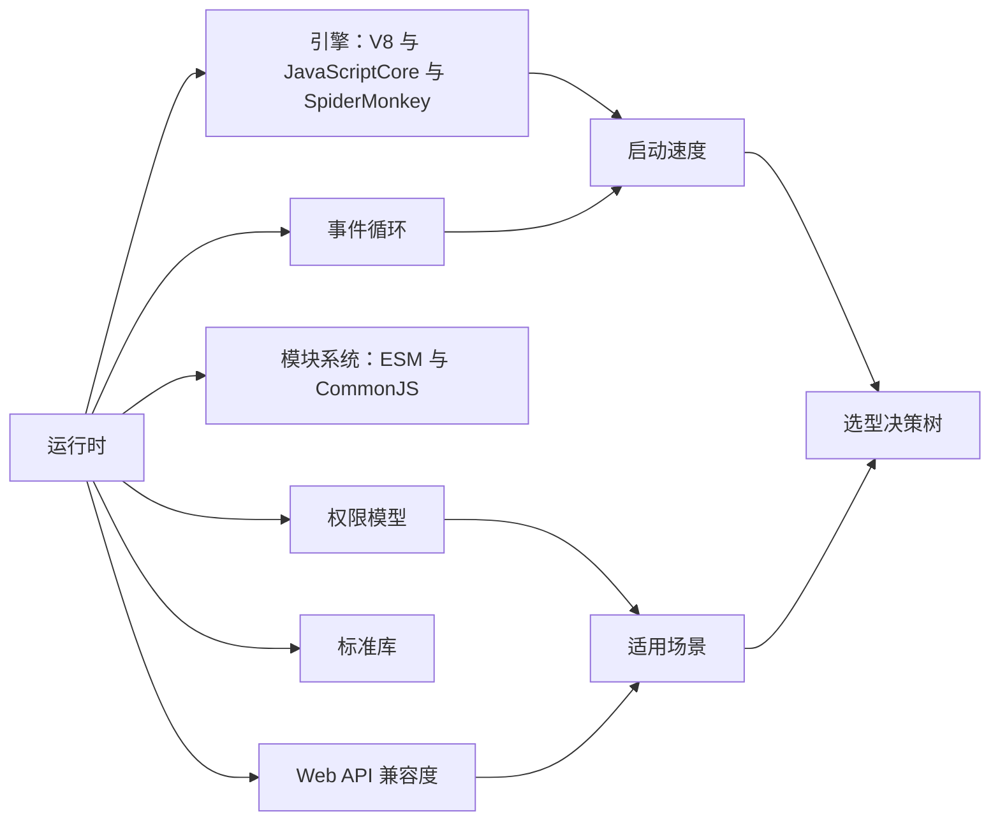
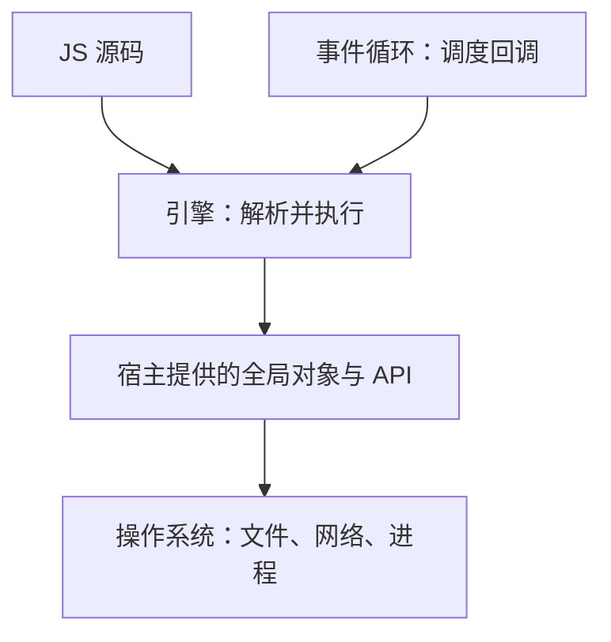
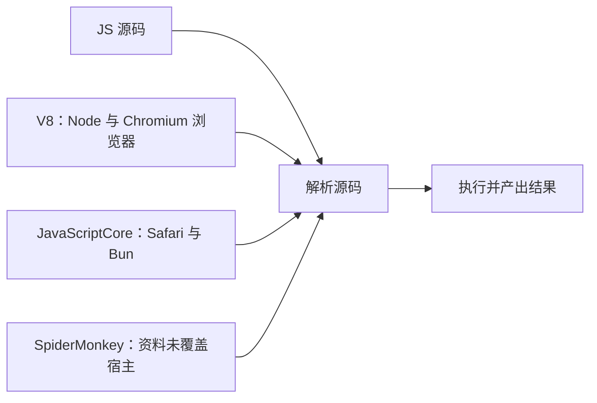
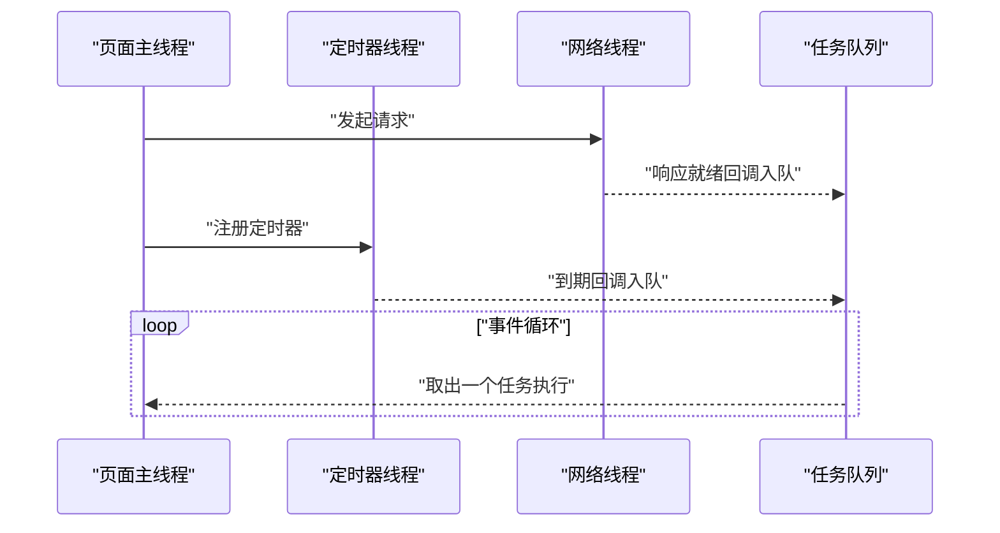
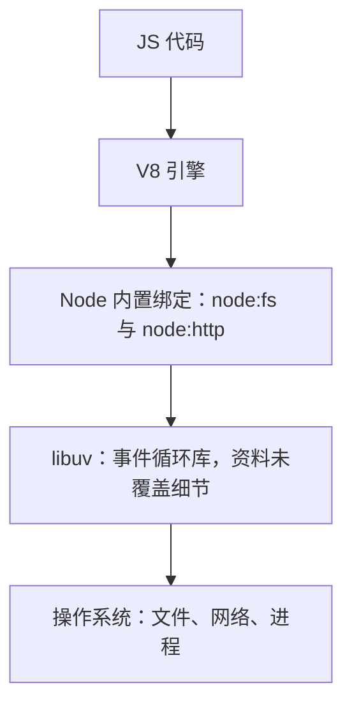
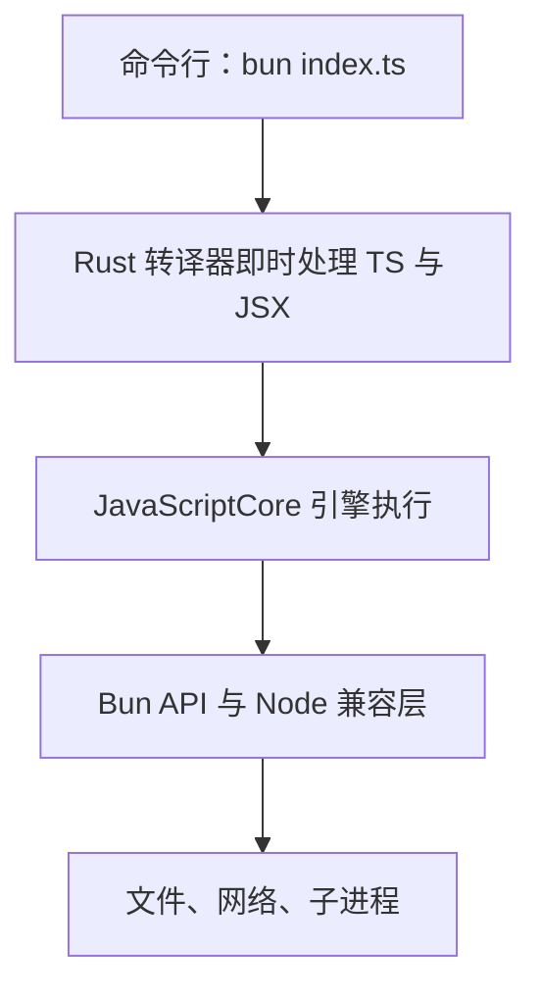
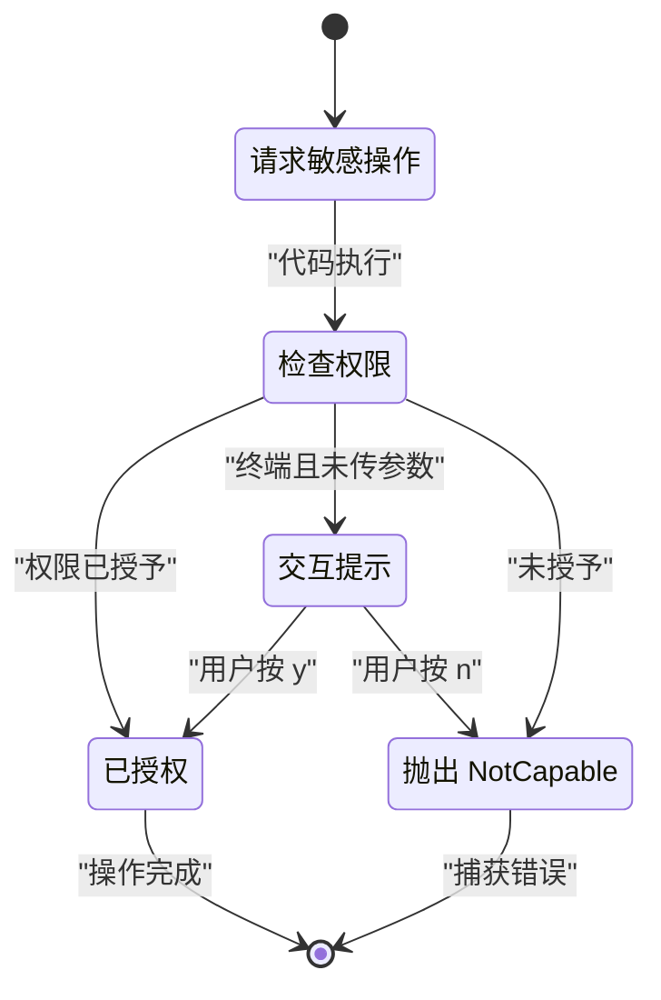
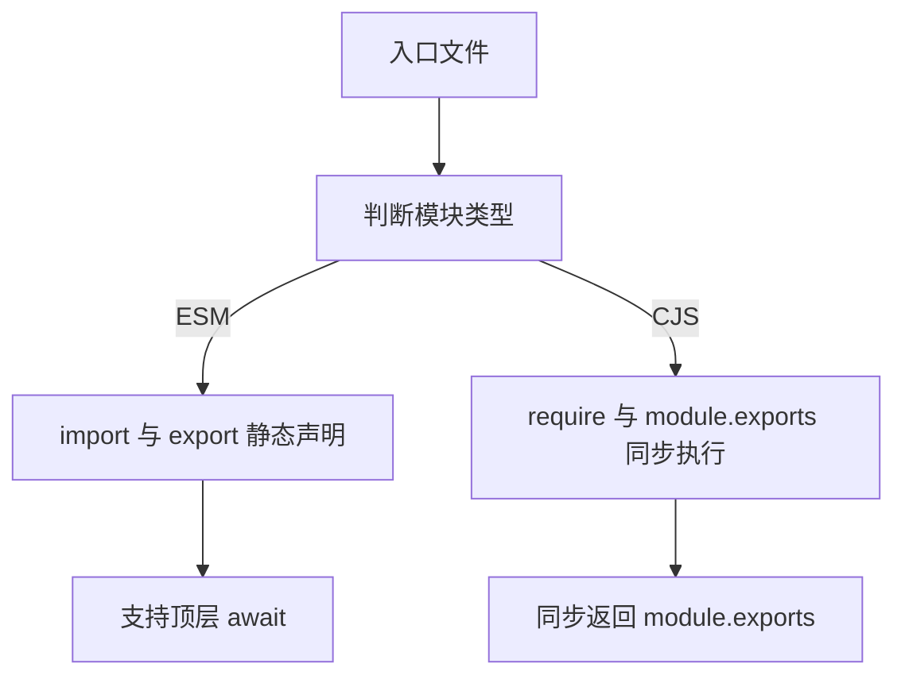
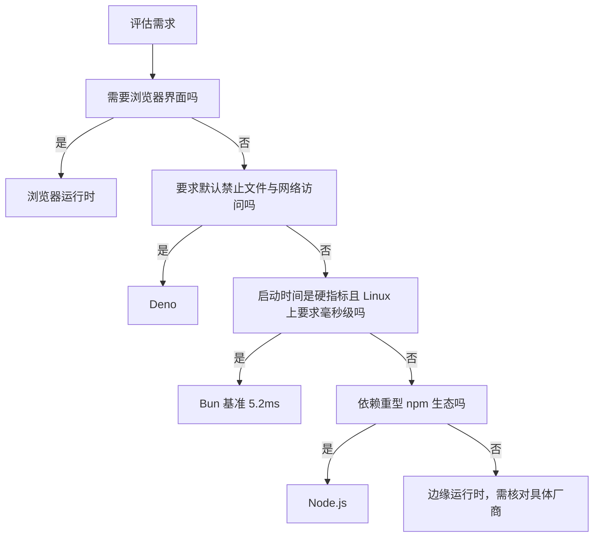

# JavaScript 运行时全景：浏览器、Node、Bun、Deno、边缘运行时

!!! abstract "学完这一页你能"
    - 说出浏览器、Node、Bun、Deno、边缘运行时各自使用的引擎与事件循环差异，并复述 Bun 官方文档 Linux 基准中 5.2ms 与 25.1ms 的启动数据。
    - 依据 Bun 文档的模块表格，解释 `require()` 与 `import * as` 对 ESM、CommonJS 的返回形状差异。
    - 写出 Deno 的最小授权命令并捕获 `NotCapable` 错误。
    - 按需求在浏览器、Node、Bun、Deno、边缘运行时之间完成选型，并列出两条可核对的依据。

## 0. 知识地图



先读上排的五个概念：引擎、事件循环、模块系统、权限模型、标准库。再读下排的三条线：启动速度、适用场景、选型决策树。建议边读边问自己：同一份 JS 在哪个运行时跑，哪一层出现了差异。

## 1. 运行时是什么：为什么 JS 需要一个宿主

**先想一个问题**：你在浏览器控制台里能用 `document`，在 Node 终端里能用 `process`。同一个 JavaScript 语言，为什么能用的东西不一样？

**心智模型**

!!! tip "心智模型"

一句话模型：引擎只执行语言本身，运行时负责提供语言之外的全局对象、事件循环和资源接口。日常类比：发动机负责提供动力，整车决定你摸到的方向盘和仪表盘。类比不成立：真车发动机能拆装互换，JS 引擎与宿主接口绑定很深，换运行时通常要改 API 调用。

!!! note "术语：运行时（Runtime）"

运行时是执行 JS 代码的宿主程序，它提供引擎、全局对象、事件循环、模块加载四层能力。例子：浏览器与 Node.js 都是运行时，但提供的全局对象不同。

**图解**



1. 第一层：代码先交给引擎解析执行。
2. 第二层：代码调用 `process`、`document` 等宿主提供的对象。
3. 第三层：宿主对象把文件、网络请求交给操作系统。
4. 第四层：事件循环把到期的回调重新送回引擎执行。

**一步一步来**

第一步：在 Node 里确认全局对象来自宿主。

① 这一步要做什么：用 Node 20 打印 `process` 与 `window` 的类型，对比宿主差异。

② 代码：

```js
// check-host.mjs：观察宿主提供的全局对象
console.log("process 类型:", typeof process); // Node 宿主提供 process
console.log("window 类型:", typeof window); // Node 不提供浏览器 window
console.log("globalThis 类型:", typeof globalThis); // 两个运行时都提供
```

③ **这段代码在做什么**

- `process` 是 Node 宿主的全局对象，类型为 object。
- `window` 在 Node 里未定义，类型为 undefined。
- `globalThis` 是 ECMAScript 规定的标准入口，浏览器与 Node 都提供。

④ 运行结果：

```text
process 类型: object
window 类型: undefined
globalThis 类型: object
```

第二步：用断言锁定结论。

① 这一步要做什么：把上面的观察写成可失败、可回归的断言。

② 代码：

```js
// check-host-assert.mjs：用断言锁定宿主差异
import assert from "node:assert";
assert.strictEqual(typeof process, "object"); // process 必须存在
assert.strictEqual(typeof window, "undefined"); // Node 下 window 必须不存在
assert.strictEqual(typeof globalThis, "object"); // 标准入口必须存在
console.log("通过：process 是对象，window 未定义，globalThis 可用");
```

③ **这段代码在做什么**

- 第一条断言锁定 process 是对象。
- 第二条断言锁定 window 在 Node 里缺失。
- 第三条断言锁定标准入口 globalThis 存在。

④ 运行结果：

```text
通过：process 是对象，window 未定义，globalThis 可用
```

**动手验证**

把以上观察合成一个带 `node:assert` 的完整脚本，Node 20 直接运行。

```js
// verify-runtime.mjs：单文件验证"运行时决定全局对象"
import assert from "node:assert";
assert.strictEqual(typeof process, "object");
assert.strictEqual(typeof process.versions.node, "string");
assert.strictEqual(typeof window, "undefined");
assert.strictEqual(typeof globalThis, "object");
console.log("通过：process 与 globalThis 可用，window 在 Node 下不可用");
```

**这段脚本在做什么**

- `node:assert` 提供失败即抛错的行为。
- `process.versions.node` 证明 Node 运行时提供版本信息字符串。
- 预期输出：`通过：process 与 globalThis 可用，window 在 Node 下不可用`。

**常见坑**

| 现象 | 原因 | 怎么修 |
| --- | --- | --- |
| Node 里访问 `window` 报 ReferenceError | Node 不提供浏览器 window 对象 | 用 `globalThis` 或 `process` |
| Node 里 `globalThis` 有属性但浏览器没有 | 宿主注入的全局对象不同 | 用 `typeof xxx !== "undefined"` 做特性检测 |
| 把浏览器安全接口当语言本身 | 把宿主 API 误认为 ECMAScript | 记住语言标准里没有 `document`、`process` |

**小结**

- 语言与运行时分开：ECMAScript 不含 `document`、`process`。
- 全局对象差异是宿主注入造成的。
- 特性检测比直接访问更稳。

## 2. 引擎：V8、JavaScriptCore、SpiderMonkey

**先想一个问题**：同一段循环代码在 Chrome、Safari、Node、Bun 里都能跑，为什么启动时间和细节表现不完全一样？

**心智模型**

!!! tip "心智模型"

一句话模型：引擎把 JS 源码翻译成机器能执行的形式，并负责内存回收。日常类比：同声传译设备，不同牌子都能翻译，但预热时间和覆盖的方言不同。类比不成立：传译允许语义折损，引擎必须按语言规范产出确定的运行结果。

!!! note "术语：引擎（Engine）"

引擎是解析、编译并执行 JavaScript 的程序。例子：V8 是 Node 与 Chromium 浏览器使用的引擎，JavaScriptCore 是 Safari 与 Bun 使用的引擎。

**图解**



1. 三款引擎都从解析源码开始。
2. 解析后交给执行层产出结果。
3. V8 用于 Node 与 Chromium 浏览器，出自本页资料。
4. JavaScriptCore 用于 Safari 与 Bun，出自本页资料。
5. SpiderMonkey 的宿主与版本细节，资料未覆盖，需核对官方文档。

**一步一步来**

第一步：读取当前 Node 的引擎版本。

① 这一步要做什么：用 Node 打印 `process.versions`，看清节点版本与 V8 版本分开记录。

② 代码：

```js
// show-versions.mjs：读取 Node 与 V8 版本
console.log("Node 版本:", process.versions.node); // 运行时自己的版本
console.log("V8 版本:", process.versions.v8); // 引擎版本单独记录
```

③ **这段代码在做什么**

- `process.versions.node` 给出 Node 运行时版本。
- `process.versions.v8` 给出内嵌 V8 的版本。
- 两个版本号分开，说明运行时与引擎是不同层次。

④ 运行结果：

```text
Node 版本: 20.19.0
V8 版本: 11.3.244.8
```

第二步：用正则断言版本号存在。

① 这一步要做什么：把版本号格式写成断言，防止空值。

② 代码：

```js
// assert-v8.mjs：断言 V8 版本存在且为数字点分格式
import assert from "node:assert";
assert.match(process.versions.v8, /^\d+\.\d+\.\d+/); // 形如 11.3.244
assert.match(process.versions.node, /^\d+\.\d+\.\d+/); // 形如 20.19.0
console.log("通过：V8 与 Node 版本号均为数字点分格式");
```

③ **这段代码在做什么**

- 第一条 `assert.match` 校验 V8 版本以三段数字开头。
- 第二条校验 Node 版本格式。
- 版本号为空或格式异常时立即抛错。

④ 运行结果：

```text
通过：V8 与 Node 版本号均为数字点分格式
```

**动手验证**

```js
// verify-engine.mjs：验证引擎版本信息完整
import assert from "node:assert";
const v8 = process.versions.v8;
assert.ok(v8, "应存在 V8 版本号");
assert.match(v8, /^\d+\.\d+\.\d+/);
console.log(`通过：Node ${process.versions.node} 内嵌 V8 ${v8}`);
```

**这段脚本在做什么**

- 断言 V8 版本字符串非空。
- 断言版本号以数字点分格式开头。
- 预期输出形如：`通过：Node 20.19.0 内嵌 V8 11.3.244.8`。

**常见坑**

| 现象 | 原因 | 怎么修 |
| --- | --- | --- |
| 在 Node 能跑的分号怪例换到浏览器行为不同 | 引擎解析策略存在历史差异 | 用标准语法并查 MDN 兼容表 |
| 把 Node 版本当引擎版本 | `process.versions.node` 与 `process.versions.v8` 不同 | 分开读取两个字段 |
| 想比较不同引擎性能却只看一次运行 | 单一进程受环境波动影响 | 用多次采样与冷启动基准 |

**小结**

- V8 用于 Node 与 Chromium 浏览器，JavaScriptCore 用于 Safari 与 Bun。
- SpiderMonkey 的宿主细节本页资料未覆盖，需核对官方文档。
- `process.versions` 把运行时与引擎版本分开存。

## 3. 浏览器运行时：事件循环与主线程

**先想一个问题**：一个 `for` 循环跑 10 秒会把页面卡住，为什么 `setTimeout` 等 10 秒却不会卡住页面？

**心智模型**

!!! tip "心智模型"

一句话模型：浏览器主线程只做一件事，任务按队列排队，长计算会堵住整条队列。日常类比：单收银台，第一位顾客刷卡 60 秒，后面所有人都等。类比不成立：浏览器还有网络线程、定时器线程在后台工作，它们把结果送回主线程队列，不是所有工作都在主线程完成。

!!! note "术语：事件循环（Event Loop）"

事件循环是运行时调度任务与回调的循环机制，按阶段取出任务执行。例子：`setTimeout` 到期后的回调由事件循环在计时器阶段执行。

**图解**



1. 主线程发起网络请求后继续处理其他任务。
2. 网络线程完成请求后把回调放进任务队列。
3. 主线程注册定时器，定时器线程到期后把回调入队。
4. 事件循环反复从队列取任务回主线程执行。

**一步一步来**

第一步：在 Node 里复现微任务与宏任务的先后顺序。

① 这一步要做什么：注册一个 0ms 定时器宏任务，再注册一个 Promise 微任务，观察顺序。

② 代码：

```js
// order.mjs：观察同步、微任务、宏任务顺序
const order = [];
setTimeout(() => order.push("timeout"), 0); // 宏任务
Promise.resolve().then(() => order.push("promise")); // 微任务
order.push("sync"); // 同步代码先执行
setTimeout(() => console.log(order.join(" ")), 10); // 等前两个入队后打印
```

③ **这段代码在做什么**

- 同步代码先入数组，得到 sync。
- Promise 微任务在同步段结束后执行，得到 promise。
- `setTimeout` 宏任务在计时器阶段执行，得到 timeout。
- 第二个 10ms 定时器负责打印完整数组。

④ 运行结果：

```text
sync promise timeout
```

第二步：把顺序写成断言。

① 这一步要做什么：用 `node:assert` 锁定同步、微任务、宏任务的顺序结论。

② 代码：

```js
// assert-order.mjs：锁定任务顺序
import assert from "node:assert";
const order = [];
setTimeout(() => order.push("timeout"), 0);
Promise.resolve().then(() => order.push("promise"));
order.push("sync");
setTimeout(() => {
  assert.deepStrictEqual(order, ["sync", "promise", "timeout"]); // 顺序固定
  console.log("通过：", order.join(" "));
}, 10);
```

③ **这段代码在做什么**

- `deepStrictEqual` 要求数组内容与顺序完全一致。
- 若顺序变成 sync、timeout、promise，则断言失败。
- 说明微任务在本次宏任务结束后先于下一宏任务执行。

④ 运行结果：

```text
通过： sync promise timeout
```

**动手验证**

```js
// verify-event-loop.mjs：单文件验证任务顺序
import assert from "node:assert";
const order = [];
setTimeout(() => order.push("timeout"), 0);
Promise.resolve().then(() => order.push("promise"));
order.push("sync");
setTimeout(() => {
  assert.deepStrictEqual(order, ["sync", "promise", "timeout"]);
  console.log("通过：同步先执行，微任务先于 timer 宏任务", order.join(" "));
}, 10);
```

**这段脚本在做什么**

- 在不使用浏览器的情况下复现任务队列顺序。
- 预期输出：`通过：同步先执行，微任务先于 timer 宏任务 sync promise timeout`。
- 浏览器的渲染帧插入时机本页资料未覆盖，需核对 HTML 规范的 event loop processing model。

**常见坑**

| 现象 | 原因 | 怎么修 |
| --- | --- | --- |
| 页面长任务导致点击无响应 | 主线程被长计算占用 | 把长计算拆成多个 `setTimeout` 小段 |
| 0ms 定时器不是立即执行 | 宏任务要等当前任务与微任务清空 | 不要在定时器里预期同步时序 |
| 忘记微任务会插队 | 微任务在每轮宏任务后执行 | 把关键顺序写成断言验证 |

**小结**

- 主线程按队列执行任务，长任务会阻塞后续任务。
- 微任务在同步代码后、下一个宏任务前执行。
- 浏览器还有网络、定时器等后台线程，结果经事件循环回到主线程。

## 4. Node.js 运行时：V8 加上服务端能力

**先想一个问题**：浏览器读不了本地文件、开不了服务器，Node 却能。这些能力从哪来？

**心智模型**

!!! tip "心智模型"

一句话模型：Node 把 V8、事件循环、文件系统和网络接口装成一台能跑服务端代码的机器。日常类比：把家用游戏主机拆掉手柄，接上工业控制接口，做成一台上架服务器。类比不成立：真实服务器可多线程并行，Node 主线程仍是单线程，文件 I/O 等细节本页资料未覆盖，需核对官方文档。

!!! note "术语：CommonJS（CJS）"

CommonJS 是 Node 早期采用的模块规范，用 `require()` 加载、`module.exports` 导出，同步执行。例子：`const fs = require("node:fs")`。

**图解**



1. JS 代码先由 V8 执行。
2. 代码调用 `node:fs`、`node:http` 等内置模块。
3. 内置模块经 Node 底层绑定调用 libuv。
4. libuv 与操作系统交互，完成文件与网络操作。
5. libuv 的具体实现细节本页资料未覆盖，需核对 Node 官方文档。

**一步一步来**

第一步：用 Node 起一个 HTTP 服务器。

① 这一步要做什么：用 `node:http` 的 `createServer` 返回字符，体现 Node 的标准库能力。

② 代码：

```js
// server.mjs：最小 Node HTTP 服务器
import { createServer } from "node:http"; // 从 node: 前缀导入内置模块
const server = createServer((req, res) => {
  res.end("hello from node\n"); // 响应体写回客户端
});
server.listen(3000, () => console.log("http://localhost:3000"));
```

③ **这段代码在做什么**

- `node:http` 是 Node 内置模块，冒号前缀表示内置而非用户包。
- `createServer` 每次请求触发回调。
- `res.end` 结束响应并返回文本。

④ 运行结果：

```text
http://localhost:3000
```

第二步：改用随机端口并用 fetch 验证返回。

① 这一步要做什么：避免端口冲突，用本机 `fetch` 客户端取回响应并断言。

② 代码：

```js
// server-assert.mjs：起服务器并用 fetch 验证
import assert from "node:assert";
import { createServer } from "node:http";
const server = createServer((req, res) => res.end("ok"));
server.listen(0, async () => {
  const { port } = server.address(); // 取系统分配的端口
  const r = await fetch(`http://127.0.0.1:${port}/`);
  assert.strictEqual(await r.text(), "ok"); // 返回体必须为 ok
  server.close();
  console.log("通过：Node http 服务器返回 ok");
});
```

③ **这段代码在做什么**

- `listen(0)` 让系统分配空闲端口。
- `server.address().port` 拿到实际端口。
- 用内置 `fetch` 发请求并断言返回体。
- 完成后调用 `server.close` 释放端口。

④ 运行结果：

```text
通过：Node http 服务器返回 ok
```

**动手验证**

```js
// verify-node-http.mjs：单文件验证
import assert from "node:assert";
import { createServer } from "node:http";
const server = createServer((req, res) => res.end("ok"));
server.listen(0, async () => {
  const { port } = server.address();
  const text = await (await fetch(`http://127.0.0.1:${port}/`)).text();
  assert.strictEqual(text, "ok");
  server.close();
  console.log("通过：Node http 服务器与 fetch 客户端往返", text);
});
```

**这段脚本在做什么**

- 一个进程内起服务器又当客户端完成往返。
- 预期输出：`通过：Node http 服务器与 fetch 客户端往返 ok`。

**常见坑**

| 现象 | 原因 | 怎么修 |
| --- | --- | --- |
| CommonJS 文件里写顶层 `await` 报错 | 资料写明 CommonJS 不含顶层 await | 改为 `.mjs` 或包一层 async 函数 |
| 裸导入 `http` 与 `node:http` 混淆 | 前缀形式才明确表示内置模块 | 新代码用 `node:` 前缀 |
| 忘记 `server.close` 脚本不退出 | 服务器保持事件循环活跃 | 验证完显式 close |

**小结**

- Node 用 V8 执行 JS，并提供 `node:fs`、`node:http` 等标准库。
- Node 依赖自动获得全部系统 I/O，这一差别来自 Deno 安全文档的对比说明。
- CommonJS 同步执行，浏览器不原生支持 CJS。

## 5. Bun 运行时：JavaScriptCore 加 Rust 转译器

**先想一个问题**：一个命令行小工具每天被启动几百次，每次多花几十毫秒，日积月累值不值得换运行时？

**心智模型**

!!! tip "心智模型"

一句话模型：Bun 把运行时、转译器、包管理打包进一个命令，省去多段工具链的启动与等待。日常类比：瑞士军刀把剪刀、开瓶器并在一把工具里，拿出来即用。类比不成立：军刀上每件工具都能单独买到，Bun 的 Node 兼容层仍在补齐，部分模块是部分实现。

!!! note "术语：转译器（Transpiler）"

转译器把一种源码转换后交给引擎执行。例子：Bun 内置转译器在运行前即时处理 TypeScript 与 JSX。

**图解**



1. 命令进入 Bun 后先经过 Rust 编写的转译器。
2. 转译器即时处理 TS 与 JSX，无需单独配置。
3. 结果交给 JavaScriptCore 执行。
4. 代码通过 Bun API 或 Node 兼容层访问系统资源。

**一步一步来**

第一步：免配置运行 TypeScript。

① 这一步要做什么：写一个 TypeScript 文件，用 `bun` 裸命令直接运行。

② 代码：

```ts
// hello.ts：带类型标注的 TypeScript 文件
export function hello(name: string): string {
  return "Hello " + name; // 返回拼接字符串
}
console.log(hello("bun")); // 直接调用
```

③ **这段代码在做什么**

- 文件带 `: string` 类型标注，属于 TypeScript。
- `bun hello.ts` 会在运行前即时转译。
- 无需先装 TypeScript 编译器。

④ 运行结果：

```text
Hello bun
```

第二步：写入口文件验证免扩展名导入。

① 这一步要做什么：入口用相对路径导入 `./hello`，不加扩展名，验证 Bun 的解析顺序。

② 代码：

```ts
// index.ts：相对导入不带扩展名
import { hello } from "./hello"; // Bun 会按顺序找文件
console.log(hello("world"));
```

③ **这段代码在做什么**

- 本地 ESM import 的解析顺序从 `.tsx`、`.jsx` 开始直到 `.json` 与各 `index` 形式。
- `.ts` 文件在 `.mjs` 之后、`.js` 之前被命中。
- `import "./hello.js"` 也能命中 `hello.ts`，对应 TypeScript 扩展名替换规则。

④ 运行结果：

```text
Hello world
```

**动手验证**

本页其余脚本都能在 Node 20 直接跑，但 Bun 与 Node 的差异需要一个"反证"脚本：Node 20 不会把 `.ts` 转译后执行。

```js
// verify-ts-in-node.mjs：证明 Node 20 不原生转译 TS
import assert from "node:assert";
import { writeFileSync } from "node:fs";
writeFileSync("verify-hello.ts", "export const hello: number = 1;\n");
let threw = false;
try {
  await import("./verify-hello.ts"); // 期望抛错
} catch (err) {
  threw = true;
  console.log("Node 抛错代码:", err.code ?? "无 code");
}
assert.strictEqual(threw, true);
console.log("通过：Node 20 不原生转译 .ts，Bun 会即时转译");
```

**这段脚本在做什么**

- 先写一个带类型标注的临时 `.ts` 文件。
- 动态导入该文件，Node 20 会因未知扩展名抛错。
- 断言确实抛错，证明 Node 20 无 Bun 的即时转译能力。

预期输出：先打印 `Node 抛错代码: ERR_UNKNOWN_FILE_EXTENSION`，再打印 `通过：Node 20 不原生转译 .ts，Bun 会即时转译`。

**常见坑**

| 现象 | 原因 | 怎么修 |
| --- | --- | --- |
| Bun 里 `process.stdout.write` 替换后捕获不到 console 输出 | Bun 的 node:console 直接写 fd | 不改 stdout 的替换捕获方案 |
| Bun 里单个 Buffer 上限 4 GiB | `buffer.constants.MAX_LENGTH` 为 `2**32` | 超大缓冲改分片处理 |
| 脚本有 `#!/usr/bin/env node`，Bun 还是用 Node 执行 | Bun 默认尊重 shebang | 用 `bun run --bun 脚本名` |

**小结**

- Bun 使用 JavaScriptCore，转译器与运行时用 Rust 编写。
- Linux 基准：`bun hello.js` 5.2ms，`node hello.js` 25.1ms，快 4 倍。
- TypeScript 与 JSX 免配置运行，裸命令与 `bun run` 等价。
- npm script 启动约 170ms，Bun 约 6ms，数据出自 Bun 官方文档。

## 6. Deno 运行时：默认沙箱与原生 TypeScript

**先想一个问题**：你 downloaded 一个 npm 包，它悄悄读了你的 `.ssh` 目录。运行时时能不能默认禁止这种读取？

**心智模型**

!!! tip "心智模型"

一句话模型：Deno 默认把门锁上，代码要碰文件、网络、环境变量必须逐项拿钥匙。日常类比：小区访客登记，进哪栋楼就报备哪栋。类比不成立：Deno 的初始静态模块图在加载阶段免检，运行时行为才逐项检查。

!!! note "术语：权限模型（Permission Model）"

权限模型是运行时对代码访问文件、网络、环境变量等资源的控制规则。例子：Deno 默认拒绝读文件，传 `--allow-read=./data` 才放开该目录。

**图解**



1. 代码请求敏感操作后进入权限检查。
2. 已授权则执行，未授权则进入提示或拒绝。
3. 终端交互时用户按 y 授权、按 n 拒绝。
4. 拒绝路径抛出 `NotCapable`，可被 catch 捕获。

**一步一步来**

第一步：不传权限参数读文件，观察拒绝。

① 这一步要做什么：写一段读文件的 TS，用裸 `deno run` 观察权限报错。

② 代码：

```ts
// main.ts：读文件会触发权限检查
const text = await Deno.readTextFile("/etc/hosts"); // 敏感操作
console.log(text);
```

③ **这段代码在做什么**

- `Deno.readTextFile` 是文件读取 API。
- 不传任何 `--allow-*` 参数时，Deno 默认拒绝。
- 终端会提示需要 read 权限并询问是否允许。

④ 运行结果：

```text
error: Requires read access to "/etc/hosts", run again with the --allow-read flag
```

第二步：用 scoped 参数放行并捕获 NotCapable。

① 这一步要做什么：先用最小授权命令放行指定目录，再写 catch 处理拒绝路径。

② 命令：

```sh
deno run --allow-read=./data main.ts
```

③ 代码：

```ts
// catch-perm.ts：捕获 NotCapable 错误
try {
  await Deno.readTextFile("/etc/hosts"); // 未被授权的路径
} catch (err) {
  if (err instanceof Deno.errors.NotCapable) { // 权限拒绝的特定错误
    console.error("Missing read permission, run again with --allow-read");
  }
}
```

④ **这段代码在做什么**

- `--allow-read=./data` 只放行 `./data`，`/etc/hosts` 仍被拒绝。
- `Deno.errors.NotCapable` 是权限拒绝的特定错误类型。
- catch 分支里打印中文提示，程序不崩溃。

**动手验证**

Node 没有 Deno 的默认沙箱，用 Node 脚本证明"Node 默认就能读文件"，反衬 Deno 的默认拒绝。

```js
// verify-node-no-sandbox.mjs：Node 默认可读文件
import assert from "node:assert";
import { readFileSync, writeFileSync } from "node:fs";
writeFileSync("verify-secret.txt", "secret-data");
const content = readFileSync("verify-secret.txt", "utf8"); // 无需任何权限参数
assert.strictEqual(content, "secret-data");
console.log("通过：Node 默认读文件成功，Deno 不传参数会拒绝");
```

**这段脚本在做什么**

- 写文件、读文件都不传权限参数。
- Node 默认放行，与 Deno 默认拒绝形成对照。
- 预期输出：`通过：Node 默认读文件成功，Deno 不传参数会拒绝`。

**常见坑**

| 现象 | 原因 | 怎么修 |
| --- | --- | --- |
| Deno 读到 `/etc` 被拒后想全局放行 | 裸 `--allow-read` 放开整个分类 | 用 `--allow-read=./data` 限定目录 |
| 想放开读但排除 `/etc` | `--allow-*` 与 `--deny-*` 冲突 | 用 `--allow-read --deny-read=/etc` |
| npm 包读环境变量报错 | npm 包同样受权限系统约束 | 授予 `-E` 或 `--allow-env=变量名` |

**小结**

- Deno 默认无 I/O 权限，Node 依赖自动拿到全部系统 I/O。
- `--allow-*` 可限定到目录、主机、环境变量，`--deny-*` 可覆盖放行项。
- 拒绝时抛 `NotCapable`，终端交互会先询问再决定。

## 7. 模块系统：ESM 与 CommonJS 的实际差异

**先想一个问题**：同一个包，你用 `import * as ns` 导入后，为什么 `ns.default` 的形状和 `require` 拿到的对象不一样？

**心智模型**

!!! tip "心智模型"

一句话模型：CommonJS 是同步执行、当场算完导出对象；ESM 是静态声明、支持顶层 await 的标准模块。日常类比：CJS 是现场木工量完尺寸再交成品，ESM 是提前画好的图纸按图装配。类比不成立：资料写明静态 import 语句执行是同步的，和 `require` 一样。

!!! note "术语：ESM（ECMAScript Modules）"

ESM 是 ECMAScript 的标准模块体系，用 `import` 与 `export` 声明，支持顶层 await，浏览器通过 `script type="module"` 原生支持。例子：`import { hello } from "./hello.js"`。

**图解**



1. 运行时先判断文件属于 ESM 还是 CJS。
2. ESM 走静态 `import` 与 `export`。
3. CJS 走同步 `require` 与 `module.exports`。
4. ESM 支持顶层 await，CJS 不支持。
5. CJS 同步返回 `module.exports`，ESM 提供命名空间。

**一步一步来**

第一步：用 Bun 的规则观察 `require()` 对两种模块的返回。

① 这一步要做什么：建一个 ESM 文件和一个 CJS 文件，分别用 `require()` 取回。

② 代码：

```ts
// check-require.ts：require 对 ESM 与 CJS 的不同返回
const esmNs = require("./greet.mjs"); // ESM：返回模块命名空间
const cjsExports = require("./greet.cjs"); // CJS：返回 module.exports
console.log(typeof esmNs.greet, typeof cjsExports.greet);
```

③ **这段代码在做什么**

- `require` 作用在 ESM 时返回模块命名空间，等价 `import * as`。
- `require` 作用在 CJS 时返回 `module.exports` 对象。
- Bun 文档写明两种模块都能用 `require`。

④ 运行结果：

```text
function function
```

第二步：用表格核对 `import * as` 的形状。

① 这一步要做什么：对照 Bun 文档表格，确认两种模块在 `import * as` 下的导出形状。

② 规则表：

| 模块类型 | `require()` 返回 | `import * as` 返回 |
| --- | --- | --- |
| ESM | 模块命名空间 | 模块命名空间 |
| CJS | module.exports | default 指向 module.exports，其余键为命名导出 |

③ **这段代码在做什么**

- ESM 两列结果一致，都是命名空间。
- CJS 的 `import * as` 里面 `default` 指向 `module.exports`。
- CJS 的 `module.exports` 各键作为命名导出暴露。

**动手验证**

用 Node 20 验证 CJS 模块经 `import * as` 导入后 `default` 的指向。

```js
// verify-esm-cjs.mjs：验证 import * as 对 CJS 的形状
import assert from "node:assert";
import { writeFileSync } from "node:fs";
writeFileSync("verify-side.cjs", "module.exports.flag = true;\n");
const ns = await import("./verify-side.cjs"); // import * as 的同义形式
assert.strictEqual(typeof ns.default, "object"); // default 是 module.exports
assert.strictEqual(ns.default.flag, true); // 键值可读取
console.log("通过：CJS 经 import 后 default 指向 module.exports");
```

**这段脚本在做什么**

- 写入一个 CJS 临时文件，导出 `flag` 为 true。
- 动态 import 返回命名空间。
- 断言 `default` 是对象且 `default.flag` 为 true。
- 预期输出：`通过：CJS 经 import 后 default 指向 module.exports`。

**常见坑**

| 现象 | 原因 | 怎么修 |
| --- | --- | --- |
| CJS 文件里写顶层 `await` 报错 | CJS 是同步模块 | 改用 `.mjs` 或 async 包裹 |
| 浏览器不认 `require` | 浏览器原生只有 ESM | 用 `type="module"` 与 ESM |
| `import * as ns` 对 CJS 的命名导出不全 | CJS 不可静态分析 | 用 `ns.default` 或迁移到 ESM |

**小结**

- CJS 同步、ESM 异步且支持顶层 await。
- Bun 里 `require()` 对 ESM 返回命名空间，对 CJS 返回 `module.exports`。
- 新项目优先 ESM，CJS 兼容仍因 npm 生态大量存在。

## 8. 边缘运行时与选型决策树

**先想一个问题**：接口要求 10 毫秒内开始响应，但主服务部署在远处机房。怎么让代码离用户更近？

**心智模型**

!!! tip "心智模型"

一句话模型：边缘运行时把函数部署到离用户近的节点执行，减掉网络来回的耗散。日常类比：便利店取快递比总仓发货快，因为取货点就在楼下。类比不成立：便利店没有总仓全部设备，边缘运行时不提供完整 Node 标准库，具体缺失项本页资料未覆盖，需核对厂商文档。

!!! note "术语：边缘计算（Edge Computing）"

边缘计算把计算任务部署到距离用户更近的节点，缩短请求回程。例子：函数跑在离访问者近的机房而不是单一中心机房。

**图解**



1. 从需求出发先判断是否需要浏览器界面。
2. 不需要界面再看是否要求默认拒绝资源访问。
3. 再判断启动时间是否为硬指标。
4. 最后看 npm 生态依赖轻重与是否贴近用户。

**一步一步来**

第一步：把选型条件整理成对象。

① 这一步要做什么：定义四组输入，覆盖浏览器、Deno、Bun、Node 四条路径。

② 代码：

```js
// cases.mjs：四组选型输入
const cases = [
  { needsBrowserUi: true },
  { denyByDefault: true },
  { startupMs: 6, linuxStartup: true },
  { npmEcosystemHeavy: true },
];
console.log(cases.length); // 共 4 条
```

③ **这段代码在做什么**

- 第一条命中浏览器。
- 第二条命中 Deno。
- 第三条命中 Bun，启动 6ms 落在 Bun 基准区间。
- 第四条命中 Node。

④ 运行结果：

```text
4
```

第二步：写决策函数把输入映射到运行时。

① 这一步要做什么：实现一个纯函数，按决策树返回运行时名。

② 代码：

```js
// pick.mjs：选型决策函数
function pick(req) {
  if (req.needsBrowserUi) return "browser"; // 先看界面
  if (req.denyByDefault) return "deno"; // 再看默认拒绝
  if (req.startupMs < 10 && req.linuxStartup) return "bun"; // Linux 毫秒级起点
  if (req.npmEcosystemHeavy) return "node"; // 重型 npm 生态
  return "edge"; // 其余默认评估边缘
}
console.log(pick({ denyByDefault: true })); // 预期 deno
```

③ **这段代码在做什么**

- `needsBrowserUi` 为真返回 browser。
- `denyByDefault` 为真返回 deno。
- 启动小于 10ms 且 Linux 场景返回 bun，依据 Bun 官方基准 5.2ms。
- `npmEcosystemHeavy` 为真返回 node。

④ 运行结果：

```text
deno
```

**动手验证**

用 Node 20 把决策函数跑完整并做四组断言。

```js
// verify-decision.mjs：选型决策函数验证
import assert from "node:assert";
function pick(req) {
  if (req.needsBrowserUi) return "browser";
  if (req.denyByDefault) return "deno";
  if (req.startupMs < 10 && req.linuxStartup) return "bun";
  if (req.npmEcosystemHeavy) return "node";
  return "edge";
}
for (const [input, expected] of [
  [{ needsBrowserUi: true }, "browser"],
  [{ denyByDefault: true }, "deno"],
  [{ startupMs: 6, linuxStartup: true }, "bun"],
  [{ npmEcosystemHeavy: true }, "node"],
]) {
  assert.strictEqual(pick(input), expected);
}
console.log("通过：选型决策函数对 4 组输入返回预期运行时");
```

**这段脚本在做什么**

- 四组输入逐一断言返回值。
- Bun 分支使用 6ms 输入，落在资料给出的 5.2ms 量级。
- 预期输出：`通过：选型决策函数对 4 组输入返回预期运行时`。

**常见坑**

| 现象 | 原因 | 怎么修 |
| --- | --- | --- |
| 选择边缘后依赖 `node:` 模块部分缺失 | 边缘标准库受限，厂商不同 | 用运行时兼容性测试先行 |
| 选 Bun 但脚本带 Node shebang 仍走 Node | Bun 默认尊重 shebang | 加 `bun run --bun` |
| 选 Deno 后 npm 包读环境变量失败 | npm 包同样受权限约束 | 授权 `-E` 或 `--allow-env=变量名` |

**小结**

- 决策树按界面、默认拒绝、启动指标、npm 依赖四条路径分流。
- Bun 的 5.2ms Linux 基准来自官方文档，可用于启动敏感场景。
- 边缘运行时贴近用户，但标准库细节需核对具体厂商文档。

## 综合对比

| 维度 | 浏览器 | Node.js | Bun | Deno | 边缘运行时 |
| --- | --- | --- | --- | --- | --- |
| 引擎 | Chromium 用 V8；Safari 用 JavaScriptCore | V8 | JavaScriptCore | 资料未覆盖，需核对官方文档 | 资料未覆盖 |
| 事件循环实现 | 浏览器厂商实现，资料未覆盖 | libuv，资料未覆盖细节 | 资料未覆盖，转译器与运行时用 Rust | 资料未覆盖 | 资料未覆盖 |
| 模块系统 | 原生 ESM，不原生支持 CJS | ESM 与 CJS | ESM 与 CJS，`require` 可作用 ESM | ESM 与 CJS 经兼容层 | 资料未覆盖 |
| 权限模型 | 同源策略等，资料未覆盖 | 依赖自动获全部系统 I/O | 资料未覆盖 | 默认拒绝，`--allow-*` 授权 | 资料未覆盖 |
| 标准库 | Web 标准为主 | `node:http`、`node:fs` 等 | Node 兼容层接近 Node v26 全量 | `node:` 兼容层，75% 测试通过 | 受限，需核对厂商 |
| TypeScript 支持 | 需转译，资料未覆盖 | Node 20 不原生转译 | 原生免配置即时转译 | 原生支持 | 资料未覆盖 |
| 包管理 | 无 npm 包管理，资料未覆盖 | npm run 约 170ms 启动 | 内置，bun run 约 6ms | npm: 规格符与全局缓存 | 资料未覆盖 |
| Web API 兼容 | 定义来源，全量 | 部分：有 fetch，无 document | 资料未覆盖 | 资料未覆盖 | 资料未覆盖 |
| 启动速度 | 受网络与解析影响 | hello.js 25.1ms（Linux） | hello.js 5.2ms（Linux） | 资料未覆盖 | 资料未覆盖 |
| 适用场景 | 用户界面 | 服务器与重型 npm 工具链 | 启动敏感与 TS 免配置 | 默认安全与混合依赖 | 就近低延迟响应 |

## 应用与行业实践

### 应用场景地图

| 场景 | 用到本页哪个知识点 | 典型技术选型 | 注意事项 |
| --- | --- | --- | --- |
| 后台管理的万行表格 | 浏览器运行时：事件循环与主线程 | Web Worker 解析加 `requestAnimationFrame` 分片渲染 | 主线程不要读布局属性，避免强制同步布局 |
| 低端安卓机型的首屏加载 | 边缘运行时与选型决策树 | 边缘函数返回静态骨架，重计算回源 | 边缘实例无状态，配置从 KV 取；Client Hint 需页面发 `Accept-CH` |
| 多人协作白板 | 边缘运行时、浏览器事件循环 | 边缘 WebSocket 转发加本地优先合并 | 长连接按连接时长计费，必须写重连与快照拉取 |
| CI 里的一次性数据同步脚本 | 运行时启动开销（本页 Bun 官方 Linux 基准 5.2ms 与 25.1ms） | Bun 或 Deno 单文件脚本 | 启动优势不等于整段任务占优，要按进程生命周期计时 |
| 给第三方脚本做权限隔离 | Deno 默认沙箱与原生 TypeScript | Deno 的 `--allow-*` 或 Node 权限模型 | 权限清单要写进启动命令，不能只写在文档里 |
| 内部组件库同时被 ESM 与 CJS 引用 | 模块系统：ESM 与 CommonJS 的实际差异 | 只发 ESM，或双格式加 `exports` 映射 | `require()` 与 `import` 的返回形状不同，两种入口都要冒烟 |
| 边缘 A/B 分流与灰度 | 边缘运行时与选型决策树 | 边缘函数读实验配置，回源带分组头 | 边缘节点无共享内存，实验状态要放外部存储 |
| 常驻本地的同步守护进程 | Node.js 运行时：V8 加服务端能力 | Node 加 libuv 线程池 | 注意定时器漂移与线程池默认大小对并发请求的影响 |

### 三个场景拆解

#### 场景 1：后台管理的万行表格

**业务背景**：运营后台的订单表格从千行涨到万行后，滚动时输入框开始掉字，点复选框要等一下才高亮。用同一台办公笔记本、同一份快照数据，在 Performance 面板录制滚动就能复现。

**怎么用本页知识解决**：本页讲过浏览器只有一个主线程，事件循环里的长任务会挡住输入与绘制。思路是把解析放 Worker，主线程只做分片提交，每帧交还一次控制权。

```js
// 主线程：把解析和过滤放到 Worker，主线程只做提交
const worker = new Worker("./table-worker.js", { type: "module" });
worker.postMessage({ type: "load", url: "/api/rows" });
worker.onmessage = (event) => {
  const rows = event.data;              // Worker 解析好的一万行
  renderInChunks(rows, 200);            // 每帧只提交 200 行，让出事件循环
};

function renderInChunks(rows, size) {
  let index = 0;
  function step() {
    const slice = rows.slice(index, index + size);
    appendRows(slice);                  // 只做 DOM 追加，不做布局读取
    index += size;
    if (index < rows.length) {
      requestAnimationFrame(step);      // 交还主线程，避免长任务
    }
  }
  requestAnimationFrame(step);
}
```

- `new Worker(..., { type: "module" })`：Worker 里直接用 ESM，和主线程共享同一份解析代码。
- `postMessage` 走结构化克隆：只传数组与普通对象，传函数会抛 `DataCloneError`。
- `requestAnimationFrame` 分片：每帧追加 200 行，把一条长任务切成一串短任务。
- `appendRows` 只写 DOM：读 `offsetHeight`、`getBoundingClientRect` 会触发强制同步布局。
- 首屏可先渲染前 200 行并留出滚动占位，剩余行在空闲时段补齐。

**怎么度量收益**：用 web-vitals 采集 INP，用 Performance 面板的 Long Tasks 轨道数长任务个数与总阻塞时长，用 Frames 轨道看滚动时的掉帧。对照组是关闭 Worker、在主线程里一次解析到底的同一份代码。

**什么时候不该用**：

- 数据只有几百行时，Worker 的启动与消息克隆开销会盖过解析时间，直接在主线程做。
- 表格需要实时读取每行高度做虚拟滚动定位时，分片追加会与测量互相打断，应先定死行高再渲染。

#### 场景 2：低端安卓机型的首屏加载

**业务背景**：同一份活动页在低端安卓机上要等 HTML 下载完才开始渲染，白屏时间随网络波动。用同一台中低端真机、Chrome DevTools 限速到 Slow 4G，录 LCP 就能复现差别。

**怎么用本页知识解决**：本页讲过边缘运行时把实例放在离用户近的节点，冷启动开销小于整台服务器。思路是让边缘函数直接返回静态骨架，把数据拼接放回源站。

```js
// 边缘函数：按设备内存决定返回骨架还是完整页面
export default {
  async fetch(request, env) {
    const memory = Number(request.headers.get("sec-ch-device-memory") ?? "8");
    const lowEnd = memory > 0 && memory <= 2; // 内存 Client Hint 需要页面先发 Accept-CH
    if (!lowEnd) return fetch(request);       // 非低端设备回源拿完整 HTML
    const shell = await env.ASSETS.fetch(new URL("/shell.html", request.url));
    return new Response(await shell.text(), {
      headers: {
        "content-type": "text/html; charset=utf-8",
        "cache-control": "public, max-age=60", // 骨架可短缓存，降低回源
      },
    });
  },
};
```

- `sec-ch-device-memory` 是设备内存 Client Hint，页面要先发 `Accept-CH: Sec-CH-Device-Memory` 才会带上。
- `env.ASSETS.fetch` 通过运行时绑定读静态资源，边缘实例里不要用文件系统 API。
- 骨架页只含 HTML 与内联关键 CSS，边缘函数里不要做同步重计算，实例是单线程的。
- `cache-control` 给骨架短缓存，既压住回源，又保证发版后能换新。

**怎么度量收益**：用 web-vitals 采集 LCP 与 TTFB，用 Lighthouse 的移动端配置跑同一 URL，用响应头 `server-timing` 分开看边缘处理与回源耗时。对照组是不做设备分流、所有设备都回源拿完整 HTML 的版本。

**什么时候不该用**：

- 页面本身就是静态文件，边缘返回与回源返回是同一份内容，分流只会多一跳。
- 设备判定依赖的 Client Hint 会被部分浏览器省略，判定失败时应默认走完整页面。

#### 场景 3：多人协作白板

**业务背景**：白板同一房间最多几十人同时画，笔画要即时互见，房间分散在不同地区。用两台不同网络的机器进同一房间，记录一笔从发出到对端出现的时间差，就能复现问题。

**怎么用本页知识解决**：本页讲过边缘运行时按请求就近接入，适合只做转发的长连接。思路是本地先落笔，边缘只负责房间内广播，重连后从快照接口补齐。

```ts
// deno run --allow-net=:8000 whiteboard.ts
const rooms = new Map<string, Set<WebSocket>>(); // 房间 -> 连接集合

Deno.serve({ port: 8000 }, (request) => {
  const roomId = new URL(request.url).searchParams.get("room") ?? "lobby";
  const { socket, response } = Deno.upgradeWebSocket(request); // 边缘节点持有长连接
  socket.onopen = () => {
    const peers = rooms.get(roomId) ?? new Set<WebSocket>();
    peers.add(socket);
    rooms.set(roomId, peers);
  };
  socket.onmessage = (event) => {
    for (const peer of rooms.get(roomId) ?? []) {
      if (peer !== socket) peer.send(event.data); // 只转发增量笔画
    }
  };
  socket.onclose = () => rooms.get(roomId)?.delete(socket);
  return response;
});
```

- `Deno.upgradeWebSocket` 把 HTTP 请求升级为 WebSocket，返回的 `response` 交给运行时发出。
- `--allow-net=:8000` 只放开这一个监听端口，脚本其余能力仍被沙箱挡住。
- `rooms` 是进程内 Map，单实例有效；多实例部署要换成带房间状态的存储或粘性路由。
- `onmessage` 只转发 `event.data`，合并与排序放客户端，边缘实例不保存画笔历史。
- `onclose` 里删连接，否则集合会一直引用已经断开的 socket。

**怎么度量收益**：客户端在 send 与对端 receive 各打一次 `performance.now()`，统计往返时延的分位数；服务端记录房间连接数与异常断开次数；重连后用快照接口的版本号确认状态收敛。

**什么时候不该用**：

- 房间内要求强一致的操作顺序时，纯转发不够，需要中心定序或 CRDT 合并。
- 用户断线期间会继续离线编辑时，纯转发会丢改动，必须补本地先写与重连补发。

### 行业先进实践

**Deno 默认权限沙箱（出处：Deno 官方文档 Permissions）**
Deno 启动时不授予文件、网络、环境变量权限，要用 `--allow-read`、`--allow-net` 这类开关逐项放开，越权访问抛 `Deno.errors.NotCapable`。它把进程能做什么变成命令行上可见、可评审的一行。借鉴方式是把生产启动脚本固化下来，权限参数变更走代码评审。

**Node.js 权限模型（出处：Node.js 官方文档 Permissions）**
Node 提供 `--permission` 与 `--allow-fs-read`、`--allow-fs-write`、`--allow-child-process` 等开关，默认拒绝未授权访问。这让存量 Node 项目也能按最小权限运行。借鉴方式是先给 CI 批处理脚本加 `--permission` 跑一遍，收集被拒绝的调用点。官方文档标注该特性为实验状态，启用前核对当前版本的稳定性等级。

**Web 互操作运行时规范（出处：W3C Web-interoperable Runtimes Community Group，原 WinterCG）**
这个社区组把 `fetch`、`Request`、`Response`、`WebSocket`、`URL` 在浏览器、Node、Deno、边缘运行时的行为对齐。它让同一段请求处理代码可以跨运行时搬运。借鉴方式是把业务代码限制在这些通用 API 上，Node 专有模块集中放进适配层。

**双包风险的处理方式（出处：Node.js 官方文档 Packages 章节 Dual package hazard）**
文档说明同一份包同时提供 ESM 与 CommonJS 入口时，可能出现两份状态互不可见。规避手段是只发一种格式，或用 `exports` 条件映射把两种入口指向同一份实现。借鉴方式是在发布前分别用 `require()` 与 `import` 各跑一次冒烟测试，核对拿到的是不是同一份实例。

**Bun 的模块互操作表格（出处：Bun 官方文档）**
Bun 文档用表格列出 `require()` 与 `import` 在加载 ESM 与 CommonJS 时各自拿到什么形状的返回值，包含默认导出与命名导出的差异。借鉴方式是把这张表贴进发布检查清单。需核对官方文档：核对表格是否覆盖你使用的运行时版本，以及 default 字段的取值规则。

### 从学到用：落地路线

**第 1 步 试点**：挑一个内部脚本或 CI 任务，换成 Bun 或 Deno 运行，业务逻辑不动。验收标准：脚本在 CI 上连续跑通 3 次，启动耗时用 `hyperfine` 或 shell 的 `time` 记录 10 次并留档。

**第 2 步 验证**：给试点补最小权限命令，并按 Bun 模块表核对 ESM 与 CJS 的返回形状。验收标准：去掉一个权限能复现 `NotCapable` 并打印修复命令；两种引入方式都能取到同一份数据。

**第 3 步 推广**：把启动脚本、权限清单与检查清单写进仓库模板，新项目按模板初始化。验收标准：新建仓库自带可执行的最小权限脚本与对照表链接。

**第 4 步 防回退**：在 CI 加门禁，权限参数变更需评审，双格式发布前跑双入口冒烟测试。验收标准：门禁失败时日志能指出具体文件、具体命令与失败原因。

### 动手作业

**目标**：写一个一次性的数据同步脚本，在 Node、Bun、Deno 下都跑到同一份结果，再把这份数据在浏览器里用 Worker 渲染成万行表格。

**步骤**

1. 选一个公开 JSON 接口，用 `fetch` 下载 1 万行左右的数据并写入本地文件。
2. 把脚本在 Node、Bun、Deno 三个运行时各跑一次，记录启动耗时、权限参数、退出码。
3. 在 Deno 下改用最小授权命令，故意去掉 `--allow-net`，确认抛出 `Deno.errors.NotCapable` 并输出修复命令。
4. 让脚本同时支持 `require()` 与 `import` 引入，对照 Bun 文档的模块表核对 default 与命名导出的取值。
5. 在浏览器里用 Web Worker 解析这份 JSON，主线程用 `requestAnimationFrame` 分片渲染。
6. 用 Performance 面板录制滚动，记录 Long Tasks 数量与 INP；关掉 Worker 再录一次做对照。

**验收标准**

- 三个运行时的启动耗时、权限参数、退出码在同一张表里，命令可直接复制执行。
- 去掉 `--allow-net` 后进程以非零码退出，stderr 含可复制的修复命令。
- `require()` 与 `import` 两种引入方式都能拿到数据数组，形状差异写进 README。
- 对照组在 Performance 面板里出现更长的 Long Task，录制文件一并提交。
- 万行表格滚动时主线程的 Long Task 数量少于关闭分片渲染的对照组。

## 深入阅读与参考

!!! tip "怎么用这些资料"
    先读「官方文档与规范」建立准确的概念，再读「源码与示例」核对细节，最后用「教程、书籍与视频」换一种讲法加深理解。每条都写明了读哪一节、带着什么问题读。

### 官方文档与规范

| 资源 | 为什么读 | 怎么读 |
|---|---|---|
| [MDN JavaScript 模块](https://developer.mozilla.org/en-US/docs/Web/JavaScript/Guide/Modules) | 浏览器原生 ESM 的权威参考，是理解模块系统的基准。 | 读动态 import 与模块解析部分，用 type=module 写示例，对比 CommonJS 的加载时机差异。 |
| [Node.js ES 模块](https://nodejs.org/api/esm.html) | 官方讲清 ESM 与 CommonJS 互操作，专治加载报错。 | 重点读互操作章节，动手复现 require 与 import 混用，遇到 ERR_REQUIRE_ESM 时回查。 |
| [Node.js 包规范](https://nodejs.org/api/packages.html) | exports 条件导出的规范来源，写双格式包必读。 | 读 exports 与条件导出一节，为自己的包写 import/require 双入口并验证解析结果。 |
| [Node.js 事件循环](https://nodejs.org/en/learn/asynchronous-work/event-loop-timers-and-nexttick) | 官方拆解事件循环各阶段与 nextTick、微任务优先级。 | 读 timer 与 poll 阶段，写打印顺序题先预测再运行验证，理解阶段间切换。 |
| [MDN 事件循环](https://developer.mozilla.org/en-US/docs/Web/JavaScript/Event_loop) | 浏览器任务与微任务机制的权威入口。 | 读任务与微任务小节，画出一次点击触发 Promise 与定时器的完整时序图。 |
| [Node.js 简介](https://nodejs.org/en/learn/getting-started/introduction-to-nodejs) | 从架构层面说明事件循环为何适合 I/O 并发。 | 读事件循环与并发小节，用一句话解释单线程 Node 如何撑起高并发。 |
| [Bun Runtime](https://bun.sh/docs/runtime) | 官方说明 Bun 的运行时能力与性能取舍。 | 读运行时总览与内置 API 部分，用 bun 跑同一脚本并与 node 输出对比。 |
| [Node APIs](https://docs.deno.com/runtime/reference/node_apis/) | 列出 Deno 兼容哪些 node: 模块及缺口，迁移必查。 | 查项目用到的 node: 模块是否在列表内，评估从 Node 迁移的替换成本。 |
| [Workers 运行时 API](https://developers.cloudflare.com/workers/runtime-apis/) | 边缘运行时可用 API 与限制的一手清单。 | 对照 Node 差异读限制章节，判断哪些依赖无法在边缘环境运行。 |

### 源码与示例

| 资源 | 为什么读 | 怎么读 |
|---|---|---|
| [Node.js 贡献文档](https://github.com/nodejs/node/blob/main/doc/contributing) | 读 Node 源码前的入口，讲目录结构与构建方式。 | 读目录结构与构建章节，之后按图索骥定位事件循环相关源码文件并浏览。 |

### 教程、书籍与视频

| 资源 | 为什么读 | 怎么读 |
|---|---|---|
| [现代 JavaScript 教程：事件循环](https://zh.javascript.info/event-loop) | 微任务与宏任务讲得最透的免费教程之一。 | 先预测每个例子输出再运行，做错的地方回头重读对应小节并重做练习。 |
| [Exploring JS 系列（Axel Rauschmayer）](https://exploringjs.com/) | 按主题成书、可在线阅读，适合补语言与模块细节。 | 挑 ESM 或运行时相关章节精读，按目录定位并补齐自己的薄弱点。 |

## 自测题

??? question "1. 为什么 Node 里有 process、浏览器里有 window，而同一段代码在两个环境报错不同？"
    - 引擎只执行 ECMAScript 语言，不提供宿主对象。
    - 运行时负责注入 `process` 或 `window` 等全局接口。
    - 资料写明 V8 既服务 Node 也服务 Chromium 浏览器，但两层 API 不同。
    - 用 `typeof xxx !== "undefined"` 做特性检测可避免报错。

??? question "2. Bun 为什么启动比 Node 快？依据是什么？"
    - 官方 Linux 基准：`bun hello.js` 5.2ms，`node hello.js` 25.1ms。
    - 官方结论是快 4 倍。
    - 原因是 JavaScriptCore 通常启动与运行快于 V8，转译器与运行时用 Rust。
    - 数字来自 Bun 官方文档，需注意只在 Linux Hello World 场景成立。

??? question "3. Bun 的 require() 对 ESM 与 CommonJS 分别返回什么？"
    - 对 ESM 返回模块命名空间，等价 `import * as`。
    - 对 CJS 返回 `module.exports` 对象，与 Node 相同。
    - `import * as` 对 CJS 时，`default` 指向 `module.exports`。
    - CJS 的其他导出键作为命名导出暴露。

??? question "4. Deno 为什么默认读文件会失败？怎么放行指定目录？"
    - Deno 默认沙箱，代码无 I/O 权限。
    - 传 `--allow-read=./data` 只放行该目录。
    - 拒绝时抛 `Deno.errors.NotCapable`。
    - `--deny-*` 可覆盖 `--allow-*`，如 `--allow-read --deny-read=/etc`。

??? question "5. Deno 的静态模块图免检规则是什么意思？"
    - 初始静态模块图包括静态 import 与字符串字面量的 `import()`。
    - 加载本地文件不需要 `--allow-read`，远程模块不需要 `--allow-net`。
    - 免检只覆盖加载阶段，代码运行后行为照常检查。
    - 非字面量 specifier 的 `import(变量)` 运行时要查 `--allow-read` 或 `--allow-import`。

??? question "6. Bun 本地 ESM import 写 ./hello 时按什么顺序找文件？"
    - 顺序：`.tsx`、`.jsx`、`.mts`、`.ts`、`.mjs`、`.js`、`.cts`、`.cjs`、`.json`。
    - 之后是 `./hello/index.tsx` 到 `./hello/index.json` 等同名 index 形式。
    - 带扩展名时先精确匹配，失败后回退在完整路径后补扩展名。
    - `import "./hello.js"` 也能命中 `hello.ts`，对应 TypeScript 扩展名替换。

??? question "7. Bun 的 node:console 与 Node 有哪三点不同？"
    - 直接写 stdout/stderr 文件描述符，替换 `process.stdout.write` 捕获不到输出。
    - 对象展示与 `util.inspect` 布局不同。
    - `console.trace()` 写 stdout，`console.time*()` 写 stderr。

??? question "8. monorepo 里启动几百次 CLI 时，为什么 bun run --filter 有意义？"
    - npm run 启动约 170ms，Bun 约 6ms，多包串行时差距累计。
    - `--filter` 按 pattern 一次性选择多个包执行同一脚本。
    - `bun run` 尊重 pre 与 post 生命周期钩子。
    - 短命令 `bun 脚本名` 与 `bun run 脚本名` 行为接近，内置命令优先。

## 延伸阅读

- Bun 官方文档：Runtime（Run a file、Run a package.json script、Module resolution）
- Bun 官方文档：Node.js compatibility（Built-in Node.js modules）
- Deno 官方文档：Runtime Fundamentals（Security、Node and npm packages）

本页未覆盖的 SpiderMonkey 宿主、libuv 实现细节、边缘运行时厂商清单，需分别核对 Mozilla、Node.js 与各边缘平台官方文档。
