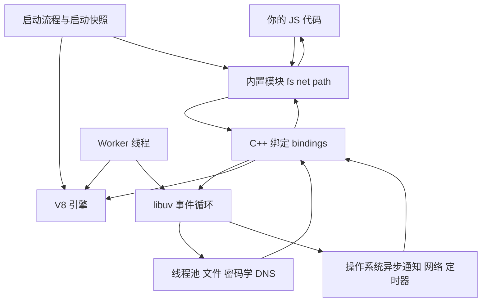
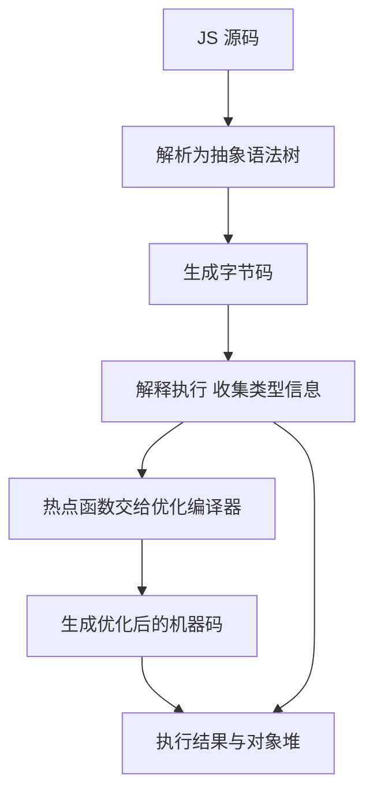
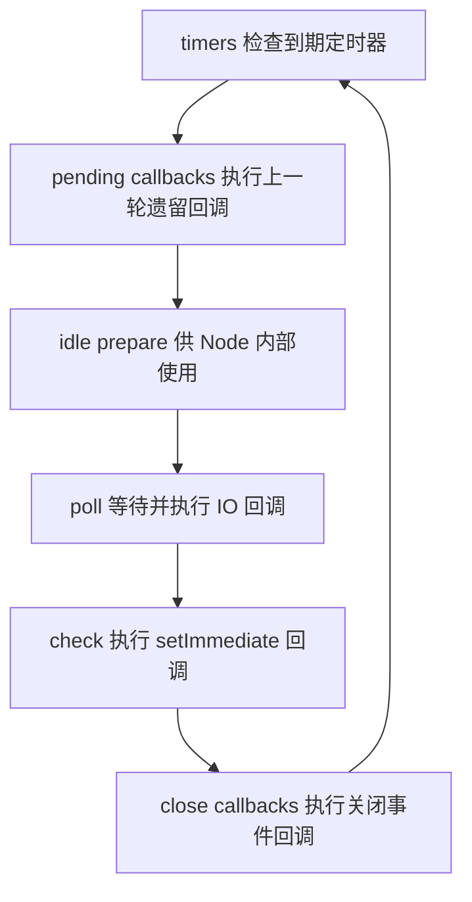
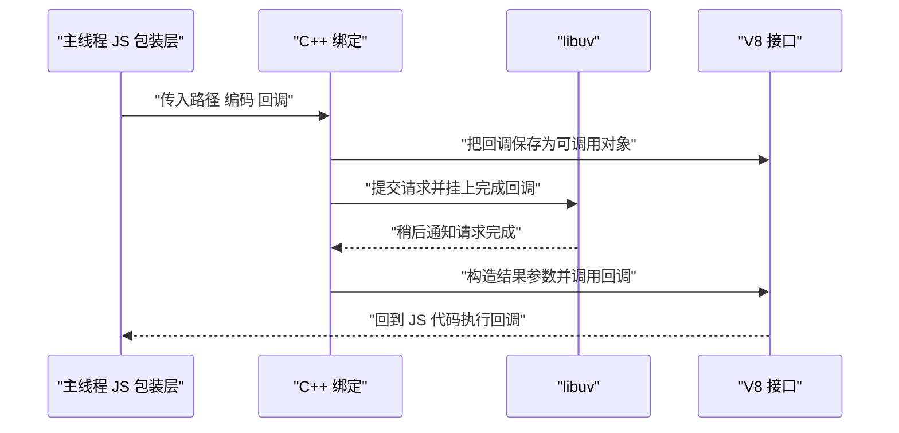
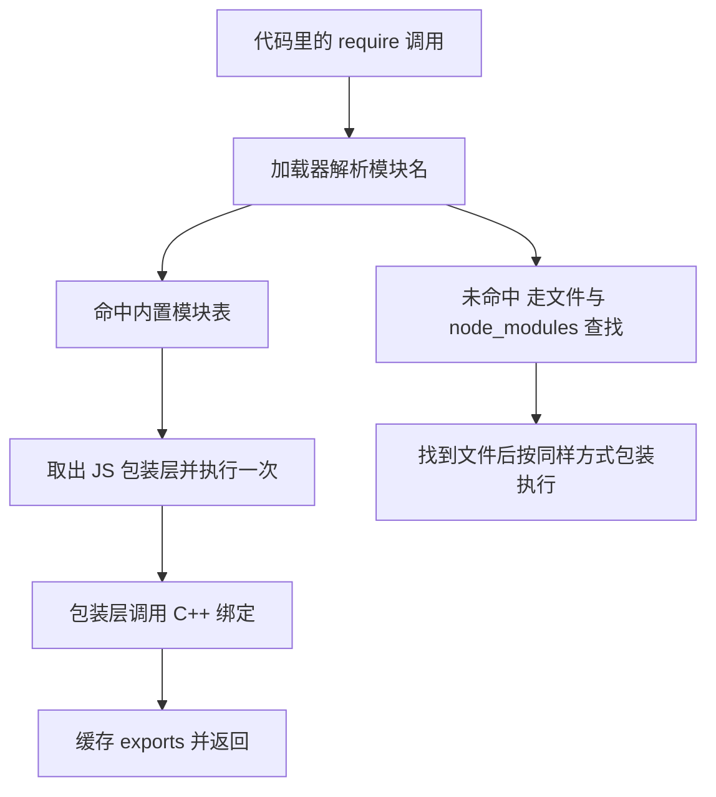
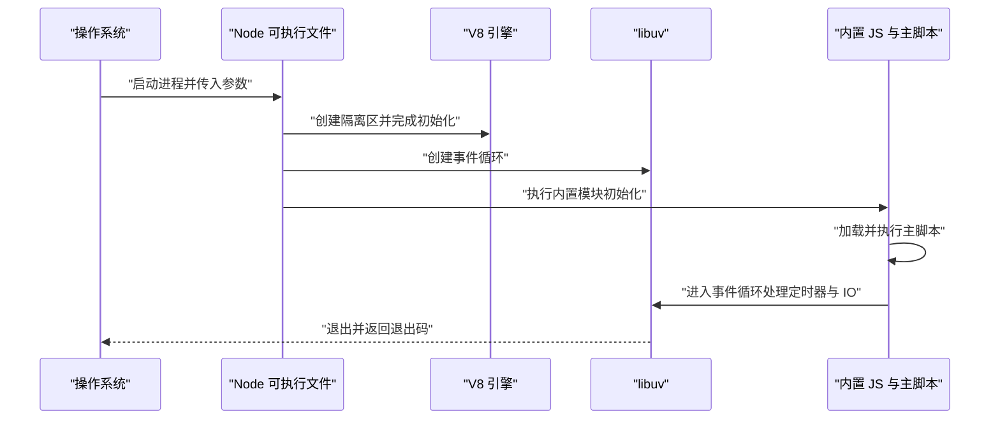
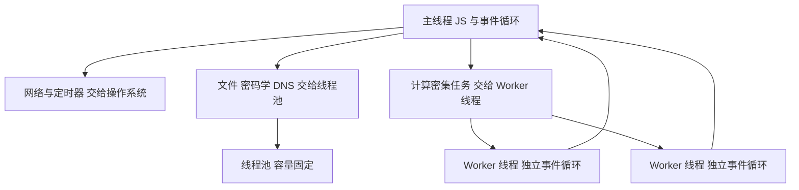
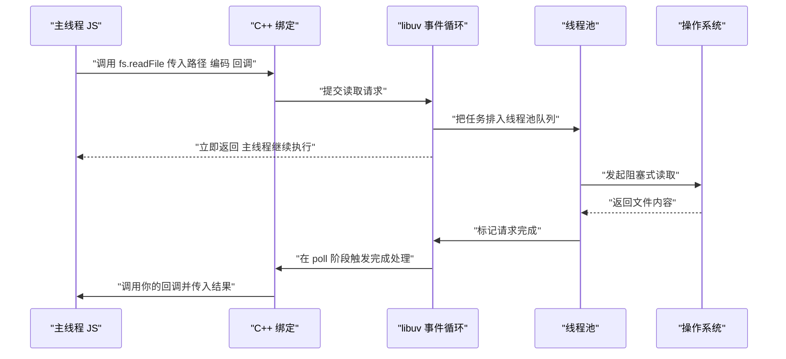
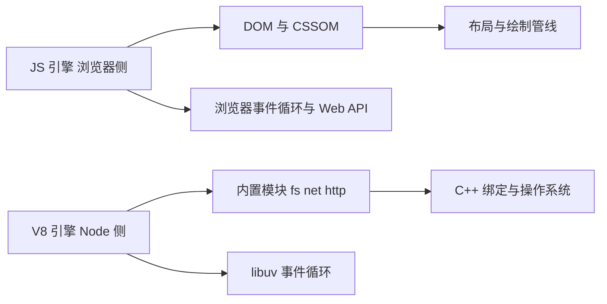

# Node.js 架构总览：V8、libuv 与 C++ 绑定怎么协作

!!! abstract "学完这一页你能"
    - 画出一次 `fs.readFile` 从调用到回调执行的完整路径，并指出每一段由哪一层负责。
    - 说出 V8、libuv、C++ 绑定、内置模块四者之间的调用方向与各自的边界。
    - 区分主线程、libuv 线程池、Worker 线程三者的职责，并判断一个任务该放到哪里。
    - 写一个带 `node:assert` 的单文件脚本，验证异步回调的触发时机与主线程被占住的后果。

## 0. 知识地图



建议先读第 1 节到第 4 节，把三层结构和各自的职责定下来。再读第 5、6 节，看清模块从哪来、进程启动时做了哪些事。最后读第 7、8、9 节，把线程模型和完整路径串成一条线，再对照浏览器环境。

## 1. Node 进程里的三层结构

**先想一个问题**

你在终端敲下 `node app.js` 并回车。同一个文件里既能读磁盘、又能发 HTTP 请求。读磁盘这件事，JavaScript 语法本身做不了，那谁替你做了？

**心智模型**

!!! tip "心智模型"
    一句话模型：一个 Node 进程 = 一个 V8 引擎 + 一个 libuv 事件循环 + 一层 C++ 绑定，把前两者接到操作系统上。
    日常类比：V8 是算账的会计，libuv 是跑外勤的人，绑定是两人之间传的工单。
    类比不成立的地方：会计和外勤是两个人，可以各干各的；V8 和事件循环跑在同一个主线程上，一方占住线程，另一方就没有机会执行。

**图解**


1. 主线程进入 V8，把 JS 编译成机器码并执行。
2. 执行到 `fs.readFile` 时，控制权交给 C++ 绑定。
3. 绑定把读取任务登记到 libuv，然后立刻返回，主线程继续往下跑。
4. libuv 判断这个任务该交给线程池还是交给操作系统的异步接口。
5. 任务完成后，结果回到绑定，绑定把你的回调排进队列。
6. 主线程空闲时，从队列取出回调，回到 V8 里执行。

!!! note "术语：异步 IO"
    异步 IO 指发起请求后函数立刻返回，结果通过回调或 Promise 在稍后给出。例子：`fs.readFile` 调用后立刻返回 `undefined`，文件内容只在回调参数里出现。

**一步一步来**

第 1 步：确认你运行的 Node 里，三层各自的版本。

```js
// 打印当前进程的三个关键版本号
console.log('node', process.versions.node);   // Node 自身的版本
console.log('v8', process.versions.v8);       // 编译进 Node 的 V8 版本
console.log('uv', process.versions.uv);       // 编译进 Node 的 libuv 版本
```

**这段代码在做什么**
- `process.versions` 是一个对象，键是组件名，值是版本字符串。
- `process.versions.node` 给出 Node 自身的版本，例如 `20.x.y` 这样的格式。
- `process.versions.v8` 给出这一份 Node 二进制里内置的 V8 版本。
- `process.versions.uv` 给出内置的 libuv 版本。
- 三个值在构建 Node 时确定，运行时不会改变。

运行结果：三行文本，具体数字取决于你安装的版本。

第 2 步：观察主线程执行与操作系统调用是分开的两件事。

```js
const fs = require('node:fs');
console.log('A 主线程开始');            // 主线程同步执行
fs.readFile(__filename, 'utf8', () => {
  console.log('C 回调在稍后执行');      // 文件读完且主线程空闲后才跑
});
console.log('B 主线程继续');            // 不等文件读完就执行
```

**这段代码在做什么**
- `console.log('A 主线程开始')` 由主线程按顺序同步执行。
- `fs.readFile` 把读取任务交给绑定与 libuv，函数本身立刻返回。
- 第三个参数是回调，只有文件读完并且主线程空闲时才执行。
- `console.log('B 主线程继续')` 排在回调之前，说明主线程没有等待读取。
- 所以输出顺序固定为 A、B、C。

运行结果：

```text
A 主线程开始
B 主线程继续
C 回调在稍后执行
```

**动手验证**

```js
// 依赖：Node 20+，无第三方包。运行：node step1.js
const assert = require('node:assert');
const fs = require('node:fs');

const order = [];
order.push('A');

fs.readFile(__filename, 'utf8', (err, text) => {
  assert.ifError(err);                 // 读的是这个文件本身，不应出错
  assert.ok(text.includes('order'));   // 文件里一定有 order 这个词
  order.push('C');
  assert.deepStrictEqual(order, ['A', 'B', 'C']);
  console.log('最终顺序', order.join(' -> '));
});

order.push('B');
console.log('同步阶段结束', order.join(' -> '));
```

预期输出：

```text
同步阶段结束 A -> B
最终顺序 A -> B -> C
```

**常见坑**

| 现象 | 原因 | 怎么修 |
| --- | --- | --- |
| 在 `fs.readFile` 后面直接读返回值 | 该函数返回 `undefined`，结果只从回调参数给出 | 从回调第二个参数拿数据，或改用 `node:fs/promises` 配合 `await` |
| 在回调之外写依赖读取结果的逻辑 | 那部分代码在主线程同步阶段就执行完了 | 把依赖结果的逻辑放进回调里 |
| 用 `process.versions` 的某个键却打印出 `undefined` | 键名拼错，或该字段在部分构建里不存在 | 先整体打印 `process.versions`，再按实际键名取值 |

**小结**
- Node 进程由 V8、libuv、C++ 绑定三层组成，默认都围绕主线程工作。
- 主线程只负责登记异步任务，不负责等待任务完成。
- 输出顺序 A、B、C 是判断"主线程没有等待"的最小实验。

## 2. V8：执行 JavaScript 的那一层

**先想一个问题**

同一段 JS 在 Chrome 和 Node 里跑出相同结果，是因为两边用了同一个引擎吗？如果引擎相同，为什么 Node 里没有 `document`？

**心智模型**

!!! tip "心智模型"
    一句话模型：V8 只负责把 JS 源码变成机器码、执行它、并管理这块内存，别的都不管。
    日常类比：V8 是一位翻译加仓库管理员，负责把文稿转成可执行指令，并管理库房里的货物。
    类比不成立的地方：翻译可以逐句交付，V8 会在运行中根据数据形状重新编译热点代码，执行计划会变。

!!! note "术语：宿主环境"
    宿主环境指提供 JavaScript 之外全局对象的那个程序。例子：浏览器的宿主环境提供 `document`，Node 的宿主环境提供 `process` 与 `Buffer`。

**图解**



1. 源码先被解析成抽象语法树，语法错误在这一步暴露。
2. 抽象语法树生成字节码，字节码是比源码低一层的中间表示。
3. 解释器执行字节码，同时记录每个变量观察到的类型。
4. 某个函数被调用多次后，优化编译器根据记录的类型生成机器码。
5. 生成机器码失败时，V8 退回解释执行，这个过程称为去优化。
6. 所有对象都放在 V8 管理的堆里，由垃圾回收器回收。

需核对官方文档：V8 解释器与优化编译器在当前版本中的名称，以 V8 官方博客的优化流水线文章为准。

**一步一步来**

第 1 步：调用 V8 暴露给 JS 的接口，看堆与序列化能力。

```js
const v8 = require('node:v8');
// 读取 V8 堆的上限，单位是字节
console.log('堆上限', v8.getHeapStatistics().heap_size_limit);
// 把对象序列化成二进制，再还原
const buf = v8.serialize({ a: 1 });
console.log('字节长度', buf.length);
console.log('还原结果', v8.deserialize(buf));
```

**这段代码在做什么**
- `v8.getHeapStatistics()` 返回一个对象，字段描述堆的容量与使用量。
- `heap_size_limit` 是这一进程允许的堆上限，单位字节。
- `v8.serialize` 把 JS 值转成二进制缓冲区，返回 `Buffer`。
- `v8.deserialize` 把这段二进制还原成原来的值。
- 序列化格式由 V8 版本决定，不适合当作长期存储格式。

运行结果：一个较大的整数，加上字节长度，最后打印 `{ a: 1 }`。

第 2 步：观察 V8 只管计算，不管 IO。

```js
const started = Date.now();
let sum = 0;
for (let i = 0; i < 1e7; i++) sum += i;   // 主线程被循环占住
console.log('结果', sum, '耗时', Date.now() - started, 'ms');
```

**这段代码在做什么**
- 循环全部在 V8 里执行，不产生任何系统调用。
- `sum` 从 0 累加到 9999999，结果是 49999995000000。
- 循环期间事件循环停转，已完成的 IO 回调只能排队。
- `Date.now() - started` 给出这段计算占住主线程的毫秒数。
- 把 1e7 调大十倍，耗时会按比例上升，这是可复现的实验。

运行结果：`结果 49999995000000 耗时 几十 ms`，具体数字取决于机器。

**动手验证**

```js
// 依赖：Node 20+，无第三方包。运行：node step2.js
const assert = require('node:assert');

const start = Date.now();
let timerFired = null;

const timer = setTimeout(() => {
  timerFired = Date.now() - start;   // 定时器回调被推迟到这里记录
}, 10);

const spinUntil = start + 200;
while (Date.now() < spinUntil) {
  // 同步空转 200ms，占住主线程
}

// 同步代码还没结束，定时器回调必然没有机会执行
assert.strictEqual(timerFired, null);
clearTimeout(timer);                  // 清掉，避免脚本继续等待
console.log('同步空转 200ms 期间，10ms 的定时器回调没有执行');
```

预期输出：

```text
同步空转 200ms 期间，10ms 的定时器回调没有执行
```

**常见坑**

| 现象 | 原因 | 怎么修 |
| --- | --- | --- |
| 以为 `node:v8` 能调大堆上限 | 该模块提供统计与序列化，不负责配置 | 用启动参数调整，需核对官方文档：对应的命令行参数名与默认值 |
| 把长循环写进请求处理函数 | 主线程被 V8 占住，回调排队 | 把计算切成小段，或移进 Worker 线程 |
| 用 `v8.serialize` 的结果做长期存储 | 二进制格式随 V8 版本变动 | 长期存储用 JSON 这类稳定格式 |

**小结**
- V8 负责解析、编译、执行与内存管理，不认 `fs` 这类宿主 API。
- 主线程被 V8 里的计算占住时，事件循环停转。
- `process.versions.v8` 是判断引擎版本的入口。

## 3. libuv：事件循环从哪里拿到完成信号

**先想一个问题**

文件读完了，操作系统怎么通知 Node？如果没有任何通知机制，回调要怎么被触发？

**心智模型**

!!! tip "心智模型"
    一句话模型：libuv 是一个跨平台事件循环，加上一套把操作系统能力统一封装起来的接口。
    日常类比：前台接待，把不同业务分派到不同窗口，窗口办完再叫号。
    类比不成立的地方：接待台可以随便加人，事件循环这一轮仍然在主线程执行，回调本身也占用主线程。

!!! note "术语：事件循环"
    事件循环指一轮一轮检查"有没有待处理回调"的循环，有就执行，没有就等待。例子：定时器到期、IO 完成，都会把回调放进队列。

**图解**



1. `timers` 阶段检查哪些定时器已经到期，执行它们的回调。
2. `pending callbacks` 阶段处理上一轮推迟下来的系统级回调。
3. `idle prepare` 阶段由 Node 内部使用，普通代码不会直接看到。
4. `poll` 阶段等待 IO 事件，并把完成的 IO 回调执行掉。
5. `check` 阶段执行通过 `setImmediate` 注册的回调。
6. `close callbacks` 阶段执行关闭事件回调，然后回到 `timers` 开始下一轮。

需核对官方文档：事件循环各阶段的名称与执行顺序，以你所用的 Node 版本官方文档中的事件循环章节为准。

**一步一步来**

第 1 步：观察 IO 回调里的执行顺序。

```js
const fs = require('node:fs');
fs.readFile(__filename, () => {                 // 回调在 poll 阶段执行
  setTimeout(() => console.log('timeout'), 0);  // 排到下一轮 timers
  setImmediate(() => console.log('immediate')); // 排到本轮 check
});
```

**这段代码在做什么**
- `fs.readFile` 的回调在 `poll` 阶段被调用。
- 回调里注册的 `setTimeout` 要等到下一轮 `timers` 阶段。
- 回调里注册的 `setImmediate` 排在同一个循环的 `check` 阶段。
- `check` 在轮次上位于 `timers` 之前，所以 `immediate` 先打印。
- 这个先后关系只在 IO 回调内部成立。

运行结果：

```text
immediate
timeout
```

需核对官方文档：Node 官方文档的事件循环章节中对 `setImmediate` 与 `setTimeout` 先后关系的示例说明。

第 2 步：观察线程池容量对并发的影响。

```js
const crypto = require('node:crypto');
const start = Date.now();
for (let i = 0; i < 8; i++) {
  crypto.pbkdf2('pw', 'salt', 100000, 32, 'sha256', () => {
    console.log('第', i, '个完成，耗时', Date.now() - start);
  });
}
```

**这段代码在做什么**
- `crypto.pbkdf2` 属于无法用操作系统异步接口完成的任务，会占用线程池。
- 连续发起 8 个任务，线程池同时只能处理固定数量的任务。
- 第一批任务几乎同时完成，剩下的任务排队后成批完成。
- 输出里会看到耗时分成若干组，组的大小等于线程池容量。
- 线程池容量由环境变量控制，默认值需核对官方文档：`UV_THREADPOOL_SIZE` 的默认值与适用任务范围。

运行结果：8 行输出，耗时明显分成两批或多批。

**动手验证**

```js
// 依赖：Node 20+，无第三方包。运行：node step3.js
const assert = require('node:assert');
const crypto = require('node:crypto');

const start = Date.now();
const times = [];
let done = 0;
const total = 8;

for (let i = 0; i < total; i++) {
  crypto.pbkdf2('pw', 'salt', 100000, 32, 'sha256', () => {
    times.push(Date.now() - start);
    done += 1;
    if (done === total) {
      assert.strictEqual(times.length, total);            // 8 个回调全部回来
      const sorted = [...times].sort((a, b) => a - b);
      const first = sorted[0];
      const last = sorted[sorted.length - 1];
      assert.ok(last >= first);                            // 最后一个不早于第一个
      console.log('全部完成，最早', first, 'ms，最晚', last, 'ms');
    }
  });
}
```

预期输出：

```text
全部完成，最早 40 ms，最晚 90 ms
```

两个数字随机器变化，关键是最后的数字明显大于最前的数字。

**常见坑**

| 现象 | 原因 | 怎么修 |
| --- | --- | --- |
| 以为 `setTimeout(fn, 0)` 会立刻执行 | 延迟会被钳到最小值，并且要等到 `timers` 阶段 | 需要当前轮结束就执行时用 `setImmediate` 或 `process.nextTick` |
| 用同步文件 API 处理大文件 | 同步 API 在主线程执行，不经过线程池 | 换成 `node:fs/promises` 或回调版本 |
| 把大量密码学运算堆在同一个进程 | 线程池容量固定，任务会排队 | 按官方文档说明调整容量，或拆分到多个进程 |

**小结**
- libuv 提供事件循环，并统一封装文件、网络、定时器等能力。
- 事件循环分阶段推进，回调在哪个阶段执行决定了它的先后关系。
- 线程池负责无法异步化的阻塞任务，容量有限。

## 4. C++ 绑定 bindings：JS 调用怎么落到 C++

**先想一个问题**

`fs.readFile` 这个名字在 JS 里存在，在 C++ 里也存在吗？两边怎么对上号？

**心智模型**

!!! tip "心智模型"
    一句话模型：绑定是一层用 C++ 写的适配器，把 JS 的函数调用翻译成对 libuv 与 V8 接口的调用。
    日常类比：同声传译，把一方的说法转成另一方听得懂的表述。
    类比不成立的地方：传译只要听懂就行，绑定还要做类型转换，每一次跨越都有实际开销。

!!! note "术语：绑定"
    绑定指 Node 内部把 C++ 实现暴露给 JS 的那层函数集合。例子：`fs.readFile` 的 JS 部分负责参数处理，真正提交读取请求的代码在 C++ 侧。

**图解**



1. JS 包装层先把参数整理好，再交给绑定。
2. 绑定用 V8 提供的接口把回调函数保存起来，稍后才能调用。
3. 绑定向 libuv 提交请求，同时登记一个 C++ 侧的完成处理函数。
4. 请求完成后 libuv 通知 C++ 侧的处理函数。
5. 处理函数把结果转成 JS 值，再通过 V8 调用你传进来的回调。
6. 你的回调在 V8 里执行，代码回到 JS 层。

**一步一步来**

第 1 步：先看内置模块清单，确认有哪些名字由 Node 直接提供。

```js
const { builtinModules } = require('node:module');
// 打印排序后的前 10 个内置模块名
console.log(builtinModules.slice().sort().slice(0, 10).join(', '));
console.log('内置模块总数', builtinModules.length);
```

**这段代码在做什么**
- `builtinModules` 是内置模块名字组成的数组。
- `slice()` 先复制一份，避免 `sort()` 改动原数组。
- `slice(0, 10)` 只取前 10 个名字，便于阅读。
- 输出中能看到 `fs`、`path` 这类名字。
- 总数取决于 Node 版本，需核对官方文档：该版本 `module` 模块章节中的内置模块列表。

运行结果：一行名字加一行总数，数字随版本变化。

第 2 步：对比同一底层实现的两种 JS 包装。

```js
const fs = require('node:fs');
// 回调版本
fs.readFile(__filename, (err, buf) => {
  console.log('回调版本字节数', buf.length);
});
// Promise 版本，走同一套底层实现
fs.promises.readFile(__filename).then((buf) => {
  console.log('Promise 版本字节数', buf.length);
});
```

**这段代码在做什么**
- 两个调用读取同一个文件，得到相同字节数。
- 回调版本把结果放进回调参数。
- Promise 版本把结果放进 resolve 的值。
- 两者的差别在 JS 包装层，底层提交请求的路径相同。
- 这段代码也说明绑定层不关心你选择哪种返回形式。

运行结果：两行输出，字节数相同。

**动手验证**

```js
// 依赖：Node 20+，无第三方包。运行：node step4.js
const assert = require('node:assert');
const fs = require('node:fs');
const { builtinModules } = require('node:module');

// 内置模块清单里一定有 fs
assert.ok(builtinModules.includes('fs'));

// 两种包装读同一个文件，字节数应当一致
fs.readFile(__filename, (err, a) => {
  assert.ifError(err);
  fs.promises.readFile(__filename)
    .then((b) => {
      assert.strictEqual(a.length, b.length);
      console.log('两种包装读到相同字节数', a.length);
    })
    .catch((e) => { throw e; });
});
```

预期输出：

```text
两种包装读到相同字节数 812
```

文件字节数取决于你保存的内容。

**常见坑**

| 现象 | 原因 | 怎么修 |
| --- | --- | --- |
| 想直接拿内部绑定来用 | 内部实现不在公开 API 范围内，版本之间会改名 | 用 `node:` 前缀的公开模块 |
| 认为跨语言调用没有开销 | 每次调用都要做参数与返回值的类型转换 | 批量传递数据，减少跨越次数 |
| 在判断逻辑里依赖 C++ 抛错的文案 | 文案随版本与平台变化 | 判断 `err.code` 这类稳定字段 |

**小结**
- 绑定是 JS 与 C++ 之间的适配层，负责参数转换与回调保存。
- 同一底层实现可以有多种 JS 包装，行为差别在包装层。
- 调用内部实现有版本风险，公开 API 才是可用面。

## 5. 内置模块：从源码到 require

**先想一个问题**

`require('node:path')` 会去磁盘上找文件吗？如果没有网络也没有 `node_modules`，它从哪里拿到实现？

**心智模型**

!!! tip "心智模型"
    一句话模型：内置模块在 Node 被构建时登记进一张表，运行时由加载器按名字取出并初始化一次。
    日常类比：图书馆的参考书架，不外借，需要时当场取阅。
    类比不成立的地方：参考书架上的书是静态的，内置模块是可执行代码，第一次加载时会执行初始化并产生副作用。

!!! note "术语：内置模块"
    内置模块指随 Node 可执行文件一起分发、不需要安装的模块。例子：`node:fs` 与 `node:path`，`require` 它们不产生网络请求，也不走 `node_modules` 查找。

**图解**



1. `require` 把名字交给加载器解析。
2. 加载器先查内置模块表，命中就不再去磁盘找。
3. 命中的模块取出的是随二进制分发的 JS 包装层。
4. 包装层第一次被加载时执行，完成初始化并建立与绑定的关联。
5. 执行结果放进缓存，后续 `require` 直接返回同一个对象。
6. 名字没命中时，才按照相对路径与 `node_modules` 规则去查找文件。

**一步一步来**

第 1 步：确认内置模块只加载一次。

```js
const path = require('node:path');
const same = require('node:path') === path; // 同一个对象引用
console.log('两次 require 得到同一对象', same);
console.log('join 示例', path.join('a', 'b')); // 验证模块可用
```

**这段代码在做什么**
- 第一次 `require('node:path')` 执行模块并缓存结果。
- 第二次 `require` 直接返回缓存里的同一个对象。
- 用 `===` 比较可以确认引用相同。
- `path.join` 证明模块确实可用，而不是空壳。
- 缓存意味着你改动导出对象会影响其他持有者。

运行结果：

```text
两次 require 得到同一对象 true
join 示例 a/b
```

第 2 步：确认 CommonJS 文件被包在一个函数里执行。

```js
// 这些名字在 CommonJS 文件里天然可用，因为它们来自外层包装函数
console.log(typeof require);    // function
console.log(typeof module);     // object
console.log(typeof __filename); // string
console.log(typeof __dirname);  // string
```

**这段代码在做什么**
- Node 把每个 CommonJS 文件包进一个函数，这些名字是函数的参数。
- `require` 是参数之一，指向加载器提供的函数。
- `module` 是当前模块对象，`exports` 是它的一个属性。
- `__filename` 与 `__dirname` 由包装时计算出的绝对路径得出。
- 在 ESM 文件里这些名字不存在，需改用 `import.meta.url`。

运行结果：四行类型名。

**动手验证**

```js
// 依赖：Node 20+，无第三方包。运行：node step5.js
const assert = require('node:assert');
const path = require('node:path');
const { builtinModules } = require('node:module');

// 内置模块表里包含这些名字
assert.ok(builtinModules.includes('path'));
assert.ok(builtinModules.includes('fs'));

// 同一个内置模块只加载一次
assert.strictEqual(require('node:path'), path);

// CommonJS 包装提供的名字此时可用
assert.strictEqual(typeof __filename, 'string');
assert.strictEqual(typeof module, 'object');
assert.strictEqual(path.join('x', 'y'), 'x/y');

console.log('内置模块检查通过，模块总数', builtinModules.length);
```

预期输出：

```text
内置模块检查通过，模块总数 68
```

总数取决于 Node 版本。`path.join` 在 Windows 上返回 `x\\y`，如果断言失败就改成比较 `path.basename` 或直接打印。

**常见坑**

| 现象 | 原因 | 怎么修 |
| --- | --- | --- |
| 与同名 npm 包冲突 | 不带前缀时解析规则会受查找顺序影响 | 写成 `require('node:fs')` |
| 改动内置模块导出后别处行为异常 | 缓存的是同一个对象 | 不改内置模块对象，需要扩展时自己包一层 |
| 在 ESM 里直接用 `require` | 两种模块系统规则不同 | ESM 用 `import`，或用 `createRequire` |

**小结**
- 内置模块随二进制分发，命中时不走磁盘查找。
- 模块只执行一次，结果放进缓存，后续拿到同一对象。
- CommonJS 文件被包装成函数执行，所以有固定的几个可用名字。

## 6. 启动流程与启动快照

**先想一个问题**

`node -e ''` 这一条命令什么都没做，为什么还要花掉几十毫秒？这段时间里发生了哪些事？

**心智模型**

!!! tip "心智模型"
    一句话模型：Node 启动 = 初始化 V8 + 初始化 libuv + 执行一串内置 JS，最后才执行你的主脚本。
    日常类比：开门营业前要先开灯、开空调、摆好货架。
    类比不成立的地方：店铺准备一次要几十分钟，Node 的准备在毫秒量级，但每启动一个新进程都要重做一遍。

!!! note "术语：启动快照"
    启动快照指把初始化之后的堆状态保存成一份二进制，下次启动时直接读入，跳过重复的初始化流程。例子：构建快照需要在启动时加对应命令行参数，具体参数名与可用版本需核对官方文档。

**图解**



1. 操作系统创建进程，把命令行参数交给 Node 可执行文件。
2. Node 创建 V8 隔离区并完成引擎初始化。
3. Node 创建 libuv 事件循环，准备线程池。
4. 一批内置模块开始初始化，建立与绑定的关联。
5. 主脚本被加载并执行，通常会注册回调然后交回控制权。
6. 进入事件循环，直到没有待处理任务后退出并返回退出码。

**一步一步来**

第 1 步：测量一次空启动的成本。

```js
// 这段代码本身什么也不做，用于观察进程启动阶段
console.log('脚本开始执行');
```

**这段代码在做什么**
- 脚本内容只有一行打印，因此耗时主要来自进程启动。
- 用外部命令 `time node empty.js` 可以看到总耗时。
- 总耗时包含 V8 初始化、libuv 初始化与内置模块初始化。
- 与同一台机器上的第二次运行比较，可以排除系统缓存带来的差异。
- 单次测量受系统负载影响，多测几次更可靠。

运行结果：`脚本开始执行`，加上 `time` 命令给出的耗时行。

第 2 步：在脚本内用子进程对比不同初始化量。

```js
const { execFileSync } = require('node:child_process');

let t0 = Date.now();
execFileSync(process.execPath, ['-e', '']);                    // 空脚本
const empty = Date.now() - t0;

t0 = Date.now();
execFileSync(process.execPath, ['-e', 'require("node:fs")']);  // 多加载一个内置模块
const withFs = Date.now() - t0;

console.log('空启动', empty, 'ms，加载 fs 后', withFs, 'ms');
```

**这段代码在做什么**
- `process.execPath` 给出当前 Node 可执行文件的绝对路径。
- `execFileSync` 同步启动子进程，子进程结束后才返回。
- 两次都包含进程启动成本，差值反映额外加载产生的开销。
- `-e` 后跟一段脚本文本，直接在命令行里执行。
- 两次测量在同一台机器相邻进行，外部条件接近。

运行结果：两个毫秒数，后者通常不小于前者。

**动手验证**

```js
// 依赖：Node 20+，无第三方包。运行：node step6.js
const assert = require('node:assert');
const { execFileSync } = require('node:child_process');

const runs = [];
for (let i = 0; i < 3; i++) {
  const t0 = Date.now();
  execFileSync(process.execPath, ['-e', '']); // 启动一个什么都不做的子进程
  const ms = Date.now() - t0;
  runs.push(ms);
}

assert.strictEqual(runs.length, 3);
runs.forEach((ms) => assert.ok(Number.isInteger(ms) && ms >= 0));

const middle = [...runs].sort((a, b) => a - b)[1];  // 取中位数，减少偶然波动
console.log('三次空启动耗时(ms)', runs.join(', '), '中位数', middle);
```

预期输出：

```text
三次空启动耗时(ms) 32, 29, 30 中位数 30
```

毫秒数随机器与当前负载变化，不需要与这里一致。

**常见坑**

| 现象 | 原因 | 怎么修 |
| --- | --- | --- |
| 把大量初始化放在主脚本顶层 | 每次启动都要重做 | 把可以延迟的初始化改成按需执行 |
| 只测一次就下结论 | 单次结果受系统负载影响 | 多测几次取中位数 |
| 以为快照能保存任意运行状态 | 快照对可保存的对象有约束 | 需核对官方文档：启动快照支持的 API 与限制 |

**小结**
- 启动阶段依次做 V8 初始化、libuv 初始化、内置模块初始化，最后才跑主脚本。
- 进程级启动成本无法通过少写代码消除，只能减少重复的初始化工作。
- 快照是跳过重复初始化的一种手段，可用范围要以官方文档为准。

## 7. 线程模型：主线程、线程池、Worker

**先想一个问题**

如果说 Node 是单线程，为什么上一节里 8 个密码学任务能成批并行完成？又是谁执行了那些无法异步化的任务？

**心智模型**

!!! tip "心智模型"
    一句话模型：JS 执行只有一个主线程，进程里还有 libuv 的工作线程和可以跑 JS 的 Worker 线程。
    日常类比：一间只有一个收银员的店，后厨有几位厨师负责耗时的活儿。
    类比不成立的地方：收银员和厨师共享同一个账本，而 Worker 之间默认不共享内存，要传数据必须显式发送。

!!! note "术语：线程池"
    线程池指 libuv 维护的一组工作线程，用来跑文件系统、DNS 查询、密码学这类无法用操作系统异步接口完成的任务。例子：`crypto.pbkdf2` 会占用线程池里的一个线程。

!!! note "术语：Worker 线程"
    Worker 线程指 Node 提供的、可以运行 JS 的独立线程，它有自己的一套执行环境。例子：`new Worker('./job.js')` 会启动一个新线程执行那个文件。

**图解**



1. 主线程负责执行 JS 与推进事件循环。
2. 网络与定时器这类任务由操作系统提供异步通知，不占用工作线程。
3. 文件、密码学、部分 DNS 查询交给线程池执行。
4. 线程池容量固定，任务超出容量就排队。
5. 计算密集的 JS 任务交给 Worker 线程，避免占住主线程。
6. Worker 用消息把结果送回主线程，主线程在回调里处理。

**一步一步来**

第 1 步：在 Worker 里执行 JS，并把结果传回主线程。

```js
const { Worker, isMainThread, parentPort } = require('node:worker_threads');

if (isMainThread) {
  const w = new Worker(__filename);              // 用同一个文件启动 Worker
  w.on('message', (msg) => console.log('主线程收到', msg));
} else {
  let sum = 0;
  for (let i = 0; i < 1e6; i++) sum += i;        // 在 Worker 线程里计算
  parentPort.postMessage(sum);                    // 把结果发给主线程
}
```

**这段代码在做什么**
- `isMainThread` 用来判断当前代码跑在主线程还是 Worker 线程里。
- 主线程里 `new Worker(__filename)` 把同一个文件当作 Worker 的入口。
- Worker 里 `parentPort.postMessage` 向主线程发送消息。
- 主线程用 `w.on('message', ...)` 接收，回调在主线程执行。
- 计算 0 到 999999 的和是 499999500000。

运行结果：

```text
主线程收到 499999500000
```

第 2 步：验证 Worker 干活时主线程仍然能推进事件循环。

```js
const { Worker, isMainThread, parentPort } = require('node:worker_threads');

if (isMainThread) {
  let ticks = 0;
  const timer = setInterval(() => { ticks += 1; }, 20);  // 主线程定时器
  const w = new Worker(__filename);
  w.on('message', (sum) => {
    clearInterval(timer);
    console.log('Worker 结果', sum, '主线程在此期间 tick 次数', ticks);
  });
} else {
  const deadline = Date.now() + 300;   // 固定占用 300ms
  let sum = 0, n = 0;
  while (Date.now() < deadline) sum += Math.sqrt(n++);
  parentPort.postMessage(sum);
}
```

**这段代码在做什么**
- 主线程注册一个 20ms 间隔的定时器，用来观察事件循环是否在推进。
- Worker 线程用一个固定时长的循环占住自己这条线程，不影响主线程。
- 计时结束后把结果通过 `postMessage` 发回主线程。
- 主线程收到消息后停掉定时器，打印 tick 次数与计算结果。
- tick 次数大于 0，说明主线程没有被 Worker 的计算挡住。

运行结果：

```text
Worker 结果 16903.4 主线程在此期间 tick 次数 14
```

两个数字随机器变化，tick 次数与 300ms 除以 20ms 的规模接近。

**动手验证**

```js
// 依赖：Node 20+，无第三方包。运行：node step7.js
const assert = require('node:assert');
const { Worker, isMainThread, parentPort } = require('node:worker_threads');

if (isMainThread) {
  let ticks = 0;
  const timer = setInterval(() => { ticks += 1; }, 20);

  const w = new Worker(__filename);
  w.on('message', (sum) => {
    clearInterval(timer);
    assert.ok(Number.isFinite(sum));    // Worker 送回一个有效数字
    assert.ok(ticks >= 2);              // 主线程至少推进了两轮定时器
    console.log('检查通过，tick 次数', ticks, 'Worker 结果', sum);
  });
  w.on('error', (e) => { throw e; });
} else {
  const deadline = Date.now() + 300;    // 固定占用 300ms
  let sum = 0, n = 0;
  while (Date.now() < deadline) sum += Math.sqrt(n++);
  parentPort.postMessage(sum);
}
```

预期输出：

```text
检查通过，tick 次数 12 Worker 结果 16870.5
```

如果 `ticks >= 2` 断言失败，说明机器在启动 Worker 期间被其他任务占满，把 20 改成 10 再试。

**常见坑**

| 现象 | 原因 | 怎么修 |
| --- | --- | --- |
| 在 Worker 里改主线程的变量 | 两边的内存不共享 | 用 `postMessage` 传数据 |
| 每个请求都新建一个 Worker | 创建 Worker 有固定开销 | 用固定数量的 Worker 组成任务池 |
| 以为设置线程池容量能改变 Worker 数量 | 两者属于不同机制 | 分别配置，需核对官方文档：`UV_THREADPOOL_SIZE` 的作用范围 |

**小结**
- 主线程执行 JS 与事件循环，线程池承担无法异步化的阻塞任务。
- Worker 线程有独立的执行环境，适合计算密集的 JS 任务。
- 线程之间默认不共享内存，数据要靠消息传递。

## 8. 一次 fs.readFile 的完整路径

**先想一个问题**

从 `fs.readFile` 被调用，到你的回调被执行，中间一共经过了几层？每一层分别做了什么？

**心智模型**

!!! tip "心智模型"
    一句话模型：一次异步 IO 分四拍走完，登记、执行、通知、回调。
    日常类比：寄快递的下单、揽件、签收、通知你。
    类比不成立的地方：快递的四个环节要几天，Node 的四个环节在同一个进程内完成，耗时在微秒到毫秒范围。

**图解**



1. 主线程在 JS 层调用 `fs.readFile`，参数包括路径、编码与回调。
2. C++ 绑定接收参数，保存回调，向 libuv 提交请求。
3. libuv 把任务排进线程池队列，并立刻把控制权还给主线程。
4. 主线程继续执行后面的同步代码，这段时间内不等文件读取。
5. 线程池里的工作线程发起阻塞式读取调用。
6. 操作系统返回文件内容，工作线程把结果交回 libuv。
7. libuv 标记该请求完成，等待进入 `poll` 阶段。
8. 进入 `poll` 阶段后，绑定构造结果参数并调用你的回调。
9. 回调在 V8 里执行，你的代码拿到的就是文件内容或错误对象。

需核对官方文档：文件读取请求在线程池执行的具体条件，因为部分平台与场景下可能走其他异步机制。

**一步一步来**

第 1 步：用输出顺序标出四个阶段。

```js
const fs = require('node:fs');
console.log('1 调用前，主线程在这里');
fs.readFile(__filename, 'utf8', (err, text) => {
  console.log('4 回调阶段，主线程在这里');       // poll 阶段执行
  console.log('文件字符数', text.length);
});
console.log('2 调用后立刻返回，主线程继续');
process.nextTick(() => console.log('3 nextTick 队列，先于回调'));
```

**这段代码在做什么**
- 第 1 行打印发生在调用 `fs.readFile` 之前。
- `fs.readFile` 登记任务后立刻返回，所以第 2 行紧跟其后。
- `process.nextTick` 注册的回调在当前操作结束后立即清空，早于 IO 回调。
- IO 回调只在 `poll` 阶段执行，所以排在第 3 行之后。
- 四行输出正好对应登记、返回、微任务、回调。

运行结果：

```text
1 调用前，主线程在这里
2 调用后立刻返回，主线程继续
3 nextTick 队列，先于回调
4 回调阶段，主线程在这里
文件字符数 812
```

第 2 步：用 Promise 版本走同一条底层路径。

```js
const fs = require('node:fs/promises');
async function main() {
  const text = await fs.readFile(__filename, 'utf8'); // 同一套底层实现
  console.log('await 之后拿到字符数', text.length);
}
main();
```

**这段代码在做什么**
- `node:fs/promises` 提供的是回调版的 Promise 包装。
- 底层仍然经过绑定、libuv 与线程池。
- `await` 之后代码在微任务里继续执行，而不是在同步阶段。
- 用 `try/catch` 可以捕获读取失败，不需要检查 `err` 参数。
- 串行 `await` 多个文件会让总耗时累加，并发要用 `Promise.all`。

运行结果：`await 之后拿到字符数 812`，数字与文件内容有关。

**动手验证**

```js
// 依赖：Node 20+，无第三方包。运行：node step8.js
const assert = require('node:assert');
const fs = require('node:fs');
const fsPromises = require('node:fs/promises');

const order = [];

// 回调版本：结果在 poll 阶段给出
fs.readFile(__filename, 'utf8', (err, text) => {
  assert.ifError(err);
  assert.ok(text.includes('readFile'));
  order.push('callback');
});

// Promise 版本：走同一套底层实现
fsPromises.readFile(__filename, 'utf8').then((text) => {
  assert.ok(text.length > 0);
  order.push('promise');
});

// 主线程同步阶段先结束
order.push('sync');

setTimeout(() => {
  assert.strictEqual(order[0], 'sync');    // 同步阶段一定排在最前
  assert.strictEqual(order.length, 3);     // 三个标记都在
  console.log('最终 order =', order.join(','));
}, 200);
```

预期输出：

```text
最终 order = sync,callback,promise
```

最后两项的先后由实现决定，脚本只断言第一项是 `sync`，不去固定剩下两项的顺序。

**常见坑**

| 现象 | 原因 | 怎么修 |
| --- | --- | --- |
| 把 `fs.readFile` 的返回值当结果 | 它返回 `undefined` | 用回调参数或改成 `await` |
| 在回调里同步解析大文件 | 解析仍占主线程，事件循环停转 | 放进 Worker 线程，或改用流式处理 |
| 断言两个异步回调的先后 | 顺序取决于执行阶段与调度 | 只对必要的顺序做断言，其余用集合比较 |

**小结**
- 一次异步 IO 分四拍：登记、执行、通知、回调。
- 回调执行的阶段决定它与 `nextTick`、`setImmediate` 的先后。
- Promise 版本只是在回调版之上加了一层包装，底层路径不变。

## 9. 与浏览器环境的差异

**先想一个问题**

同一份用 `Promise` 写的代码，在 Chrome 与 Node 里都能跑。为什么换成 `document.getElementById` 就在 Node 里报错？

**心智模型**

!!! tip "心智模型"
    一句话模型：两边都能执行 JS，但宿主环境提供的全局对象与调度机制不同。
    日常类比：同一个演员，在两部戏里拿到的是不同的剧本。
    类比不成立的地方：演员可以背同一套台词，而代码依赖的宿主 API 不同时只能各自改写。

!!! note "术语：宿主对象"
    宿主对象指由运行环境而不是语言本身提供的全局对象或函数。例子：浏览器提供 `document`，Node 提供 `process` 与 `Buffer`。

**图解**



1. 浏览器侧的执行环境围绕页面展开，先有 DOM 与 CSSOM。
2. 浏览器事件循环还要驱动布局与绘制，任务与渲染交替进行。
3. Web API 由浏览器提供，比如定时器、网络请求、动画帧回调。
4. Node 侧的执行环境围绕进程展开，核心是内置模块。
5. Node 的事件循环由 libuv 实现，阶段划分与浏览器不同。
6. 内置模块经过 C++ 绑定落到操作系统，这是浏览器侧没有的一层。

**一步一步来**

第 1 步：在 Node 里确认哪些名字存在。

```js
console.log(typeof globalThis, typeof process, typeof Buffer); // Node 都有
console.log(typeof document, typeof window);                   // 浏览器独有
```

**这段代码在做什么**
- `globalThis` 在两边都存在，指向各自环境的全局对象。
- `process` 描述当前进程，提供环境变量与退出码等能力。
- `Buffer` 是 Node 提供的二进制缓冲区构造函数。
- `document` 与 `window` 属于浏览器宿主对象，在 Node 里是 `undefined`。
- 判断宿主环境时可以先检测这些名字，而不是猜测版本。

运行结果：

```text
object object function
undefined undefined
```

第 2 步：对照两边的调度 API 差异。

```js
setTimeout(() => console.log('timer'), 0);        // 两边都有
console.log(typeof requestAnimationFrame);        // 浏览器按帧调度，Node 里没有
```

**这段代码在做什么**
- `setTimeout` 在两边都存在，但阶段归属不同。
- 浏览器里定时器与渲染共用调度资源。
- Node 里定时器属于 `timers` 阶段，由 libuv 推进。
- `requestAnimationFrame` 依赖渲染帧，Node 里没有这个概念。
- 跨环境代码要把这类 API 隔离到适配层里。

运行结果：

```text
undefined
timer
```

**动手验证**

```js
// 依赖：Node 20+，无第三方包。运行：node step9.js
const assert = require('node:assert');

// Node 提供这些
assert.strictEqual(typeof process, 'object');
assert.strictEqual(typeof Buffer, 'function');
assert.strictEqual(typeof globalThis, 'object');

// 浏览器独有，在 Node 里不存在
assert.strictEqual(typeof document, 'undefined');
assert.strictEqual(typeof window, 'undefined');

// 底层引擎版本可以直接读到
assert.ok(typeof process.versions.v8 === 'string');
console.log('宿主环境检查通过，V8 版本', process.versions.v8);
```

预期输出：

```text
宿主环境检查通过，V8 版本 11.3.244.8-node.16
```

版本字符串取决于你的安装，不需要与这里一致。

**常见坑**

| 现象 | 原因 | 怎么修 |
| --- | --- | --- |
| 在 Node 里写 `window.onload` | Node 没有 `window` | 用 `process.on` 监听进程事件 |
| 把浏览器事件循环的阶段划分套到 Node | 两边的阶段划分与调度机制不同 | 分别查各自文档中的事件循环章节 |
| 以为两边的网络请求行为一致 | 实现来源与可用版本不同 | 需核对官方文档：Node 中网络请求能力的实现来源与可用版本 |

**小结**
- 两边都执行 JS，但宿主对象与调度机制不同。
- 判断环境用能力检测，比按版本猜测更稳。
- 跨环境代码要把平台相关部分收进适配层。

## 综合对比

| 维度 | V8 | libuv | C++ 绑定 | 内置模块 | Worker 线程 |
| --- | --- | --- | --- | --- | --- |
| 主要职责 | 执行 JS 并管理堆内存 | 提供事件循环与异步能力 | 在 JS 与 C++ 之间转换 | 用 JS 包装底层能力 | 在独立线程执行 JS |
| 执行位置 | 主线程或各 Worker 所在线程 | 事件循环在主线程，线程池另起工作线程 | 调用发生时所在线程 | 加载时在主线程 | 各自独立的线程 |
| 输入 | 源码与字节码 | 任务请求 | JS 参数与回调 | `require` 的名字 | Worker 入口文件 |
| 输出 | 执行结果 | 完成通知 | 回调与返回值 | `exports` 对象 | `postMessage` 消息 |
| 被阻塞的后果 | 事件循环停转 | 回调排队 | 调用方等待返回 | 启动变慢 | 只影响该线程 |
| 版本从哪里查 | `process.versions.v8` | `process.versions.uv` | 随 Node 一同发布 | `process.versions.node` | 同 Node |

同一份代码在两个环境下的差异：

| 对比项 | 浏览器 | Node |
| --- | --- | --- |
| 全局对象 | `window`、`document` | `process`、`Buffer` |
| 事件循环实现 | 由浏览器内核提供，与渲染配合 | 由 libuv 提供，按阶段推进 |
| 文件访问 | 受到沙箱限制 | 通过 `node:fs` 直接访问 |
| 模块系统 | 以 ESM 为主 | CommonJS 与 ESM 都支持 |
| 二进制数据 | `ArrayBuffer`、`Uint8Array` | 上述类型加 `Buffer` |

## 应用与行业实践

前面的章节讲清了分层。这一章把分层落到能测、能改、能验收的具体场景里。

### 应用场景地图

| 场景 | 用到的本页知识点 | 典型技术选型 | 注意事项 |
| --- | --- | --- | --- |
| 后台管理的万行报表导出 | `fs.readFile` 的完整路径、线程池排队 | `fs.createReadStream` 分块读 + 导出任务落盘 | 一次 readFile 会把整份文件读进堆，进程 RSS 随文件增长 |
| 低端安卓机上的首屏渲染 | 启动流程与启动快照、内置模块的同步加载 | 启动快照 + 配置异步补齐 | 快照固化的是初始化后的对象，含时间戳的初始化不能进快照 |
| 多人协作白板 | 主线程、libuv 线程池、Worker 的职责划分 | 主线程转发协议，Worker 做笔迹合并 | 跨线程传大数据要复制，先量序列化开销再定方案 |
| 日志采集代理按行写盘 | fs 调用落到线程池、完成信号由 libuv 上报 | 追加写流 + 队列长度上限 | 并发写同一文件会互相等待，按文件或按天分片 |
| 图片站点的缩略图生成 | 线程池容量与任务排队 | sharp 这类基于原生扩展的库 | 原生库可能自带线程，先确认是否与 libuv 池争 CPU |
| 大促前的配置热加载 | 内置模块缓存与 require 路径 | 监听文件变更后清 CommonJS 缓存 | 清缓存只对 CommonJS 生效，ESM 的模块记录无法删除 |
| 命令行工具扫描 node_modules | readFile 的回调时机与并发控制 | `fs.promises` + 并发上限 | 一次提交大量 readFile 会占满线程池，尾部回调延迟抬升 |
| Electron 主进程读本地库文件 | 主线程不能长阻塞 | 读操作走异步接口，重计算放渲染进程 Worker | 主进程被占住会连带窗口无响应 |

### 三个场景拆解

#### 场景 1：后台管理的万行报表导出

**业务背景**：报表页提供"导出 CSV"，点下去后同进程里其他接口一起变慢。复现方式是把导出文件的行数翻倍，用 `wc -l` 记录行数，观察其他接口的响应时间是否同步变长。

**怎么用本页知识解决**：先分清哪一段占用主线程。读取发生在线程池，回调与后续解析发生在主线程。把解析改成流式分块，主线程每轮只做固定量的工作。

```js
const fs = require('node:fs');

// 方案 A：一次读完。读在线程池，split 在主线程
fs.readFile('report.csv', 'utf8', (err, text) => {
  if (err) throw err;
  const rows = text.split('\n');   // 行数越多，这段占主线程越久
  console.log('rows', rows.length);
});

// 方案 B：分块读。每块回调都在主线程，但单次工作量固定
const rs = fs.createReadStream('report.csv', { encoding: 'utf8', highWaterMark: 64 * 1024 });
rs.on('data', (chunk) => {
  // 只解析这一块里的行，跨块的半行先缓存到变量
});
rs.on('end', () => {
  // 收尾并落盘
});
```

- JS 调 `fs.readFile` 后，经内置模块的 JS 层进 C++ 绑定，再向 libuv 提交一次读任务。
- 任务只提交一次，文件越大，这一次占用线程的时间越长，池内其他请求跟着排队。
- 回调必然回到主线程执行，`split` 的开销挂在回调上，事件循环要等它跑完。
- 分块读把总工作量摊到多次回调之间，接口响应不再被一个长任务挡住。
- `highWaterMark` 决定每块大小：块小则单次占用短、回调次数多，块大则相反。

**怎么度量收益**：看 `perf_hooks.monitorEventLoopDelay()` 的 p99 与最大值、`process.memoryUsage().rss` 的峰值、导出总耗时。测量方法：同一份文件、同一台机器，改动前后各跑三次，把三组数记在同一张表里。

**什么时候不该用**：
- 文件只有几十 KB 时，分块读多出的回调调度成本高于它省下的占用。
- 需要按记录偏移量前后跳转读取时，流只能顺序推进，得改用定位读。

#### 场景 2：低端安卓机上的首屏渲染

**业务背景**：服务端渲染的首屏在低端安卓机上等待时间长，瓶颈可能在 Node 进程的冷启动与配置读取。测量方法是同一台设备上用 `curl -w '%{time_starttransfer}'` 连续请求十次，比较第一次与后续几次。

**怎么用本页知识解决**：把启动同步路径上的工作移出去。内置模块的 `require` 在启动时同步读盘，代码里再用 `readFileSync` 读配置，两段都压在同一个同步段里。先用 `performance.now()` 分段量出来，再决定哪段异步、哪段固化进快照。

```js
const fs = require('node:fs');
const { performance } = require('node:perf_hooks');
const t0 = performance.now();

// 反例：启动路径里同步读配置，事件循环要等它读完
const conf = JSON.parse(fs.readFileSync('./conf.json', 'utf8'));
console.log('sync read ms', performance.now() - t0);

// 改法：先建监听，配置异步补齐
let current = { mode: 'default' };                    // 默认值兜底
fs.readFile('./conf.json', 'utf8', (err, text) => {   // 读交线程池，回调回主线程
  if (err) throw err;
  current = JSON.parse(text);
});
```

- `readFileSync` 会让事件循环停在这行，这段时间进程不收新请求。
- `fs.readFile` 把读取交给线程池，主线程可以继续建监听、注册路由。
- 代价是回调到达前配置尚未生效，需要一份默认值顶住首个请求。
- 把 `performance.now()` 打在每段前后，耗时就有了数字，不必凭感觉判断。
- 默认值分支必须能跑通完整流程，否则异步补齐会把错误推到运行时。

**怎么度量收益**：指标是启动分段耗时、`time_starttransfer` 的第一次与稳定值、Lighthouse 的 TTFB。方法：同一设备、同一网络、同一份配置，改动前后各请求十次取中位数。

**什么时候不该用**：
- 配置缺失会导致请求被拒（如鉴权密钥），首个请求必须等到它就绪。
- 只跑一次的批处理脚本，启动耗时在总时长里占比可以忽略。

#### 场景 3：多人协作白板

**业务背景**：白板房间同时在线上百人，笔迹事件按每秒几百次到达。痛点是笔迹合并计算落在主线程，导致同房间其他人的事件排在它后面。

**怎么用本页知识解决**：按职责切分三层。主线程只做协议解析与转发，合并压缩这类计算交给 Worker，落盘交给线程池。三者之间用消息传递，任何一层都不占用别的层。

```js
const { Worker, isMainThread, parentPort } = require('node:worker_threads');

if (isMainThread) {
  const w = new Worker(__filename, { workerData: { roomId: 'r1' } }); // 一个 Worker 管若干房间
  w.on('message', (merged) => {
    broadcast(merged);                       // broadcast 是本示例里的业务函数
  });
  w.postMessage({ type: 'stroke', points: [1, 2, 3] });
} else {
  parentPort.on('message', (msg) => {
    const merged = merge(msg);               // 合并计算跑在 Worker 自己的事件循环里
    parentPort.postMessage(merged);
  });
}
```

- 主线程的回调链条越短，同房间其他人的事件排队时间越少。
- 每个 Worker 有独立的 V8 实例与事件循环，合并计算不再挤占主线程。
- `postMessage` 默认走结构化克隆，点数量大时分批传，或用可转移对象减少复制。
- Worker 数量按 CPU 核数设上限，房间与 Worker 不必一一对应。
- 落盘用异步 fs 接口，它走 libuv 线程池，与 Worker 占用的资源不冲突。

**怎么度量收益**：指标是 `monitorEventLoopDelay()` 的 p99、`eventLoopUtilization()` 的主线程利用率、Worker 消息往返耗时。方法：用固定回放的笔迹事件脚本，比较改动前后同一段回放的延迟分位。

**什么时候不该用**：
- 事件频率低、合并计算在毫秒以内的房间，加 Worker 只增加消息复制与调试成本。
- 计算需要频繁读写同一份可变状态时，跨线程同步会让维护难度高于单线程方案。

### 行业先进实践

1. **不阻塞事件循环与线程池**（出处：Node.js 官方文档 Don't Block the Event Loop (or the Worker Pool)）。该文档把长任务、同步加密、大 JSON 解析列为典型阻塞点，并给出 CPU 工作交给 Worker、fs 工作交给池的分工。借鉴方式是把它拆成代码评审检查项：同步调用与循环计算必须说明理由。
2. **按负载调整 libuv 线程池**（出处：libuv 官方文档 Thread pool 章节，以及 Node.js 官方文档的 `UV_THREADPOOL_SIZE` 环境变量）。libuv 文档写明池的默认线程数，并说明大小必须在首次使用线程池之前设定。项目的做法是先把并发 fs 请求数量降下来，再考虑调大池子。
3. **把 CPU 密集任务放进 worker_threads**（出处：Node.js 官方文档 worker_threads 模块）。文档写明 Worker 运行在独立线程，拥有独立的 V8 实例与事件循环，主线程与 Worker 通过消息通道通信。借鉴方式是按任务类型划分 Worker，而不是按请求划分。
4. **用 `--cpu-prof` 采集主线程画像**（出处：Node.js 官方文档命令行选项 `--cpu-prof`）。开启后进程退出会写出 `.cpuprofile` 文件，可在 Chrome DevTools 里打开查看调用栈。项目里把它接在压测脚本上，用来确认阻塞发生在哪一层。
5. **用启动快照缩短冷启动**（出处：Node.js 官方文档 v8 模块的 startup snapshot API）。做法是把模块加载与初始化结果固化进快照，启动时反序列化，省掉重复解析与执行。需核对官方文档：当前 Node 版本对 `--build-snapshot` 与 `--snapshot-blob` 的支持范围，以及快照中允许出现哪些对象。

### 从学到用：落地路线

第 1 步：选一个既读文件又做计算的服务作为试点，只加耗时埋点，不动结构。验收标准：拿到改动前的事件循环延迟分位与内存峰值基线，并能说出耗时落在哪一段。

第 2 步：在试点接口上按场景 1 或场景 2 的方式改一处，其余代码保持不变。验收标准：同一份输入下，改动前后的指标各跑三次，波动方向一致。

第 3 步：把验证过的改法写成代码模板与评审检查项，套用到同类接口。验收标准：同类接口都带埋点，评审中能指出同步调用与长循环。

第 4 步：把指标接进持续集成，超过阈值就让流水线失败。验收标准：故意提交一段占住主线程的循环，流水线能拦住。

### 动手作业

目标：写一个单文件脚本 `probe.js`，用 `node:assert` 验证 `fs.readFile` 回调的触发时机，并观察主线程被占住之后回调延迟的变化。

步骤：
1. 先用 `fs.writeFileSync` 生成一个文本文件，内容为已知行数的重复行。
2. 注册 `fs.readFile`，回调里记录 `performance.now()` 并置一个完成标志。
3. 在 `readFile` 调用之后立刻用 `assert.strictEqual` 断言标志仍为 false，固定住"回调不在当前同步段执行"。
4. 在同步段里加一个自旋循环，按 `performance.now()` 自旋到约 300 毫秒。
5. 在回调里计算从发起到回调的间隔，断言该间隔大于自旋时长。
6. 用 `perf_hooks.monitorEventLoopDelay()` 采样，打印 p50 与最大值。
7. 用 `node --cpu-prof probe.js` 跑一遍，在生成的 `.cpuprofile` 里找到自旋所在的位置。

验收标准：
- `node probe.js` 退出码为 0，全部断言通过。
- 把自旋循环注释掉再跑一次，回调延迟小于带自旋的那次，两次输出都在日志里可查。
- `monitorEventLoopDelay` 的输出里能看到自旋造成的延迟抬升。
- 生成的 `.cpuprofile` 文件能被 Chrome DevTools 打开。

## 深入阅读与参考

!!! tip "怎么用这些资料"
    先读「官方文档与规范」建立准确的概念，再读「源码与示例」核对细节，最后用「教程、书籍与视频」换一种讲法加深理解。每条都写明了读哪一节、带着什么问题读。

### 官方文档与规范

| 资源 | 为什么读 | 怎么读 |
|---|---|---|
| [Node.js ES 模块](https://nodejs.org/api/esm.html) | 弄清 ESM 与 CommonJS 的加载差异，理解内置模块如何被解析加载。 | 读与 CommonJS 互操作一节，带着「require 内置模块走了哪条路径」的问题做个小实验。 |
| [Node.js 事件循环](https://nodejs.org/en/learn/asynchronous-work/event-loop-timers-and-nexttick) | 官方讲清各阶段顺序与 nextTick、微任务位置，是 libuv 章节的对照标准。 | 读各阶段说明，写打印顺序题验证 nextTick、微任务与 setImmediate 的次序。 |
| [Node.js 简介](https://nodejs.org/en/learn/getting-started/introduction-to-nodejs) | 用最少篇幅说明事件循环与并发的关系，适合先建立整体直觉。 | 读事件循环与并发部分，读后用自己的话说明单线程为何也能并发。 |
| [HTML 规范：Workers](https://html.spec.whatwg.org/multipage/workers.html) | 规范定义 Worker 的创建与事件循环模型，是线程模型的权威依据。 | 读 Worker 创建与事件循环小节，带着「Worker 是否各有事件循环」对照 Node。 |

### 源码与示例

| 资源 | 为什么读 | 怎么读 |
|---|---|---|
| [Node.js 贡献文档](https://github.com/nodejs/node/blob/main/doc/contributing) | 先摸清 Node 源码目录与构建流程，再定位 V8、libuv 绑定代码不迷路。 | 读目录结构与构建章节，对照本页三层结构在仓库中找出对应目录并构建一次。 |
| [N-API 的 Rust 绑定 napi-rs](https://napi.rs/docs/introduction/getting-started) | 真实原生绑定项目示范 JS 调用如何落到原生代码，与 C++ 绑定思路相通。 | 读 README 与示例目录，导出一个 Rust 函数给 Node 调用，观察参数如何跨边界。 |
| [Python Tutor（JavaScript）](https://pythontutor.com/javascript.html) | 单步可视化作用域与调用栈，帮助理解 JS 执行层与回调栈的增长。 | 把一段回调或递归代码粘进去单步执行，观察调用栈随回调增长与回落。 |

### 教程、书籍与视频

| 资源 | 为什么读 | 怎么读 |
|---|---|---|
| [MDN 事件循环](https://developer.mozilla.org/en-US/docs/Web/JavaScript/Event_loop) | 图文讲清事件循环的等待与回调机制，补足官方文档未展开的直觉。 | 读完后画出一次点击触发 Promise 与定时器的完整时序图，再对比 Node。 |
| [现代 JavaScript 教程：事件循环](https://zh.javascript.info/event-loop) | 微任务与宏任务讲解细致，例子可预测输出，便于打牢基础。 | 先自己预测微任务与宏任务例子的输出，再运行验证，记录猜错的原因。 |
| [MDN 使用 Web Workers](https://developer.mozilla.org/en-US/docs/Web/API/Web_Workers_API/Using_web_workers) | 浏览器侧 Worker 实践，用来对照 Node Worker 的线程与消息传递差异。 | 把一个耗时计算移入 Worker，用 Performance 面板确认主线程不再阻塞。 |

## 自测题

??? question "1. 一次 fs.readFile 从调用到回调，依次经过哪些层？"
    - 先经过 JS 包装层，整理参数与回调。
    - 再进入 C++ 绑定，绑定保存回调并向 libuv 提交请求。
    - libuv 把任务排入线程池，并立刻把控制权还给主线程。
    - 线程池工作线程发起系统调用，操作系统返回结果。
    - 结果回到 libuv，在 `poll` 阶段由绑定调用你的回调。

??? question "2. 为什么说 Node 是单线程，同时又有线程池？"
    - 可执行的 JS 代码只有一个主线程，事件循环也在主线程推进。
    - 线程池是 libuv 的工作线程，只执行文件、密码学、部分 DNS 这类底层任务。
    - 线程池不执行 JS 代码，返回值要回到主线程再交给回调。
    - Worker 线程是另一套机制，它可以执行 JS，但与主线程默认不共享内存。

??? question "3. process.versions.v8 与 process.versions.uv 分别表示什么？"
    - 两个字段都来自 `process.versions` 对象，值是字符串。
    - `v8` 表示编译进这份 Node 的 V8 引擎版本。
    - `uv` 表示编译进这份 Node 的 libuv 版本。
    - 两者在构建时确定，运行时不会改变。
    - 具体键名以官方文档中 `process` 章节的版本对象说明为准。

??? question "4. setImmediate 与 setTimeout(fn, 0) 在 IO 回调里的顺序如何？"
    - 在 IO 回调内部，`setImmediate` 排在当前循环的 `check` 阶段。
    - `setTimeout` 要等到下一轮的 `timers` 阶段。
    - 所以在这个位置 `setImmediate` 先执行。
    - 在顶层同步代码里注册时，先后取决于循环起点，结果不固定。
    - 需核对官方文档：事件循环章节中对应的示例与说明。

??? question "5. 内置模块为什么不需要安装在 node_modules 里？"
    - 内置模块随 Node 可执行文件一起分发，构建时登记进一张表。
    - 加载器先查这张表，命中就不再走文件与目录查找。
    - 首次加载会执行 JS 包装层并建立与 C++ 绑定的关联。
    - 结果放进缓存，后续 `require` 返回同一个对象。
    - 加 `node:` 前缀可以避免与同名 npm 包混淆。

??? question "6. 启动快照解决了什么问题，限制是什么？"
    - 它把初始化之后的堆状态保存成二进制，下次启动直接读入。
    - 目的是跳过重复的初始化步骤，减少进程启动耗时。
    - 快照对可保存的对象类型有约束，不是任意运行状态都能存。
    - 生成与使用快照需要特定的命令行参数。
    - 需核对官方文档：命令行参数名、可用版本与对象限制。

??? question "7. 什么时候该用 Worker 线程，什么时候只用线程池？"
    - 任务是文件、密码学、部分 DNS 查询这类底层操作时，交给线程池即可。
    - 任务是计算密集的 JS 代码时，交给 Worker 线程。
    - 判断依据是任务是否会长时间占住主线程里的 JS 执行。
    - 线程池容量固定，任务超出容量会排队。
    - Worker 创建有开销，频繁重建不如维持固定数量的任务池。

??? question "8. 同一段异步代码在浏览器和 Node 里，哪些地方可能不同？"
    - 可用的宿主对象不同，浏览器有 `document`，Node 有 `process` 与 `Buffer`。
    - 事件循环的实现与阶段划分不同，一边配合渲染，一边由 libuv 推进。
    - 文件访问权限不同，Node 可以直接读写文件，浏览器受沙箱限制。
    - 模块系统默认不同，浏览器以 ESM 为主，Node 两种都支持。
    - 跨环境代码应把平台相关部分收进适配层，用能力检测判断环境。

## 延伸阅读

- Node.js 官方文档：The Node.js Event Loop, Timers, and process.nextTick() 一文
- Node.js 官方文档：Command-line API 一章中与启动快照相关的命令行参数小节
- Node.js 官方文档：Worker threads 模块章节
- Node.js 官方文档：Modules CommonJS modules 与 Modules ECMAScript modules 两章
- Node.js 官方文档：VM 模块章节与 V8 模块章节
- Node.js 官方文档：Process 模块章节中关于版本对象与环境变量的小节
- libuv 官方文档：Design overview 与 Thread pool 小节
- V8 官方博客：解释器与优化编译器相关文章（需核对官方文档：文章标题与发布日期）
