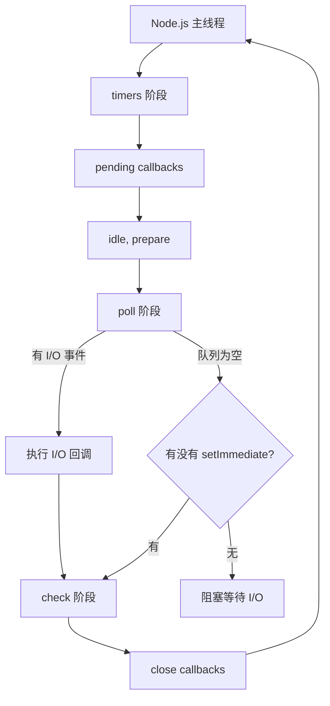

# Node.js 核心原理

> Node.js 是基于 Chrome V8 引擎的 JavaScript 运行时，采用事件驱动、非阻塞 I/O 模型。

## 架构概览

```
┌─────────────────────────────────────────────────────────────────┐
│                         Node.js 架构                             │
├─────────────────────────────────────────────────────────────────┤
│                                                                 │
│  ┌─────────────────────────────────────────────────────────┐   │
│  │                    JavaScript 代码                        │   │
│  │              (Buffer / Stream / EventEmitter)             │   │
│  └─────────────────────────┬───────────────────────────────┘   │
│                            │                                   │
│  ┌─────────────────────────▼───────────────────────────────┐   │
│  │                      V8 JavaScript 引擎                    │   │
│  │     ┌──────────────┐  ┌──────────────┐  ┌────────────┐  │   │
│  │     │   JIT 编译     │  │  内存管理     │  │   异步 I/O  │  │   │
│  │     │  (TurboFan)   │  │  (V8 Heap)   │  │   调度器   │  │   │
│  │     └──────────────┘  └──────────────┘  └────────────┘  │   │
│  └─────────────────────────┬───────────────────────────────┘   │
│                            │                                   │
│  ┌─────────────────────────▼───────────────────────────────┐   │
│  │                        libuv                              │   │
│  │  ┌──────────────────────────────────────────────────┐   │   │
│  │  │              线程池 (默认 4 线程)                  │   │   │
│  │  │   ┌────────┐ ┌────────┐ ┌────────┐ ┌────────┐   │   │   │
│  │  │   │线程 1  │ │线程 2  │ │线程 3  │ │线程 4  │   │   │   │
│  │  │   │I/O任务 │ │I/O任务 │ │I/O任务 │ │I/O任务 │   │   │   │
│  │  │   └────────┘ └────────┘ └────────┘ └────────┘   │   │   │
│  │  └──────────────────────────────────────────────────┘   │   │
│  │                                                          │   │
│  │  ┌──────────────────────────────────────────────────┐   │   │
│  │  │              事件循环 (Event Loop)                │   │   │
│  │  │   timers → pending callbacks → idle/prepare     │   │   │
│  │  │   → poll → check → close callbacks              │   │   │
│  │  └──────────────────────────────────────────────────┘   │   │
│  └─────────────────────────┬───────────────────────────────┘   │
│                            │                                   │
│              ┌─────────────┼─────────────┐                   │
│              ▼             ▼             ▼                     │
│         文件系统         网络          进程                    │
│        (fs/libuv)    (net/libuv)   (child_process)            │
│                                                                 │
└─────────────────────────────────────────────────────────────────┘
```

---

## 事件循环机制

### libuv 事件循环阶段



### 各阶段详解

| 阶段 | 说明 | 处理的回调 |
|------|------|-----------|
| **timers** | 执行 `setTimeout()` 和 `setInterval()` 的回调 | 定时器回调 |
| **pending callbacks** | 执行上一轮循环延后的 I/O 回调 | I/O 错误回调 |
| **idle, prepare** | 内部使用 | 准备阶段 |
| **poll** | 检索新的 I/O 事件，执行 I/O 回调 | 文件操作、网络 |
| **check** | 执行 `setImmediate()` 的回调 | 立即回调 |
| **close callbacks** | 执行关闭事件回调 | `socket.on('close')` |

### process.nextTick 与 Promise 对比

```typescript
// 三种微任务优先级（从高到低）
// 1. process.nextTick - 最高优先级
// 2. Promise.then / queueMicrotask - 中等
// 3. setImmediate - 最低（属于 check 阶段）

console.log('1 - 同步代码');

setTimeout(() => console.log('2 - setTimeout'), 0);
setImmediate(() => console.log('3 - setImmediate'));

Promise.resolve().then(() => console.log('4 - Promise.then'));
queueMicrotask(() => console.log('5 - queueMicrotask'));
process.nextTick(() => console.log('6 - nextTick'));

// 输出顺序：
// 1 - 同步代码
// 6 - nextTick      (微任务，最先)
// 4 - Promise.then  (微任务)
// 5 - queueMicrotask (微任务)
// 2 - setTimeout     (timers 阶段)
// 3 - setImmediate  (check 阶段)
```

### 经典面试题：async/await 执行顺序

```typescript
async function asyncMain() {
  console.log('1 - async 函数开始');

  await Promise.resolve();
  console.log('2 - await 之后');

  setTimeout(() => console.log('3 - setTimeout in async'), 0);

  await new Promise(resolve => {
    setTimeout(() => {
      console.log('4 - setTimeout 回调执行');
      resolve();
    }, 0);
  });

  console.log('5 - async 函数结束');
}

console.log('6 - 主代码开始');
asyncMain();
console.log('7 - 主代码结束');

// 输出：
// 6 - 主代码开始
// 1 - async 函数开始
// 7 - 主代码结束
// 2 - await 之后（微任务）
// 3 - setTimeout in async（timers）
// 4 - setTimeout 回调执行
// 5 - async 函数结束
```

---

## 模块系统

### CommonJS (CJS) vs ES Modules (ESM)

```typescript
// ============================================
// CommonJS (CJS) - Node.js 传统模块格式
// ============================================

// 导出方式
module.exports = { name: 'CJS' };
// 或
exports.add = (a: number, b: number) => a + b;

// 导入方式
const utils = require('./utils');
const { add } = require('./utils');
const fs = require('fs');

// ============================================
// ES Modules (ESM) - 现代标准
// ============================================

// 导入方式
import fs from 'fs';
import { readFile } from 'fs/promises';
import * as path from 'path';

// 导出方式
export const PI = 3.14159;
export default class App {}

// 或整体导出
export { PI, readFile };

// ============================================
// package.json 配置
// ============================================

// 方式一：显式 type
{
  "type": "module"  // 所有 .js 文件按 ESM 处理
}

// 方式二：使用 .mjs 和 .cjs 扩展名
// my-module.mjs  - 强制 ESM
// my-module.cjs  - 强制 CJS
```

### CJS 与 ESM 互操作

```typescript
// ESM 中导入 CJS（始终可行）
import cjsModule from './commonjs.cjs';  // 默认导入
import { named } from './commonjs.cjs';   // 具名导入（CJS 的 module.exports）

// CJS 中导入 ESM（需要动态 import）
async function loadESM() {
  const esmModule = await import('./esm.mjs');
  // CJS 无法同步 require ESM，必须用 async import
}
```

### 模块循环依赖

```typescript
// a.js
import { bMethod } from './b.js';
export const aValue = 'A';
export function aMethod() {
  console.log('A method');
  bMethod(); // 可能获取到 undefined
}

// b.js
import { aValue } from './a.js';  // 此时 a.js 尚未完全加载
export const bValue = 'B';

export function bMethod() {
  console.log(`B method, aValue = ${aValue}`); // aValue 是 undefined
}

// main.js
import { aMethod } from './a.js';
aMethod();
// 输出：
// A method
// B method, aValue = undefined (a.js 尚未完全加载)
```

### Node.js 模块解析算法

```typescript
// Node.js 模块解析顺序（假设导入 'utils'）

// 1. 内置模块（优先级最高）
// 'fs', 'path', 'http', 'crypto' 等

// 2. 文件模块（相对路径）
import fs from './utils';    // → ./utils.js / ./utils/index.js
import fs from '../utils';   // → ../utils.js

// 3. node_modules 查找
// 从当前目录向上遍历 node_modules
// node_modules/utils/index.js
// node_modules/utils.js
// node_modules/utils/package.json 的 main 字段

// 自定义查找路径
import myModule from '/absolute/path/to/module';
```

---

## 异步 I/O 与 Promise

### 异步编程模型演进

```typescript
// ============================================
// 回调地狱 (Callback Hell)
// ============================================
function fetchUserCallback(userId: string, callback: (err: Error | null, user?: User) => void) {
  db.findUser(userId, (err, user) => {
    if (err) return callback(err);
    cache.set(userId, user, (err) => {
      if (err) return callback(err);
      db.getOrders(user.id, (err, orders) => {
        if (err) return callback(err);
        callback(null, { ...user, orders });
      });
    });
  });
}

// ============================================
// Promise 链式调用
// ============================================
function fetchUserPromise(userId: string): Promise<User> {
  return db.findUserAsync(userId)
    .then(user => cache.setAsync(userId, user).then(() => user))
    .then(user => db.getOrdersAsync(user.id).then(orders => ({ ...user, orders })));
}

// ============================================
// async/await（推荐）
// ============================================
async function fetchUserAsync(userId: string): Promise<User> {
  const user = await db.findUserAsync(userId);
  await cache.setAsync(userId, user);
  const orders = await db.getOrdersAsync(user.id);
  return { ...user, orders };
}
```

### Promise 并发控制

```typescript
// ============================================
// Promise.all - 所有都成功才成功
// ============================================
const [users, posts, comments] = await Promise.all([
  fetchUsers(),
  fetchPosts(),
  fetchComments(),
]);

// ============================================
// Promise.allSettled - 不管成功失败，返回所有结果
// ============================================
const results = await Promise.allSettled([
  fetchUsers(),
  fetchPosts(),
  fetchComments(),
]);

results.forEach((result, index) => {
  if (result.status === 'fulfilled') {
    console.log(`成功: ${result.value}`);
  } else {
    console.log(`失败: ${result.reason}`);
  }
});

// ============================================
// Promise.race - 谁先完成返回谁
// ============================================
const response = await Promise.race([
  fetchWithTimeout(url, 3000),
  fetchWithBackup(url),
]);

// ============================================
// 并发限制
// ============================================
async function batchWithLimit<T>(
  tasks: (() => Promise<T>)[],
  limit: number
): Promise<T[]> {
  const results: T[] = [];
  const executing = new Set<Promise<void>>();

  for (const task of tasks) {
    const p = Promise.resolve().then(() => task());
    results.push(p);

    if (executing.size >= limit) {
      await Promise.race(executing);
      executing.delete(p);
    }
    executing.add(p);
  }

  return Promise.all(results);
}
```

---

## 内置模块详解

### fs (文件系统)

```typescript
import fs from 'fs/promises';
import { createReadStream, createWriteStream } from 'fs';
import path from 'path';

// ============================================
// 文件读取
// ============================================

// 异步读取（推荐）
async function readFileExample() {
  const content = await fs.readFile('./data.json', 'utf-8');
  const data = JSON.parse(content);
  return data;
}

// 流式读取（大文件推荐）
function streamFileExample() {
  const readStream = createReadStream('./large-file.log', {
    encoding: 'utf-8',
    highWaterMark: 64 * 1024, // 64KB 缓冲区
  });

  let lineCount = 0;

  readStream.on('data', (chunk) => {
    lineCount += chunk.split('\n').length;
  });

  readStream.on('end', () => console.log(`Total lines: ${lineCount}`));
  readStream.on('error', console.error);
}

// ============================================
// 文件写入
// ============================================

// 完整写入
await fs.writeFile('./output.txt', 'Hello, Node.js!', 'utf-8');

// 流式写入
const writeStream = createWriteStream('./large-output.txt');

for (let i = 0; i < 1000000; i++) {
  writeStream.write(`Line ${i}\n`);
}
writeStream.end();

// ============================================
// 目录操作
// ============================================
async function dirOperations() {
  // 创建目录（recursive 支持递归创建）
  await fs.mkdir('./deep/nested/dir', { recursive: true });

  // 读取目录
  const entries = await fs.readdir('./src', { withFileTypes: true });
  entries.forEach(entry => {
    console.log(`${entry.name} - ${entry.isDirectory() ? 'DIR' : 'FILE'}`);
  });

  // 复制文件
  await fs.copyFile('./source.txt', './destination.txt');

  // 获取文件信息
  const stat = await fs.stat('./file.txt');
  console.log(`Size: ${stat.size}, Modified: ${stat.mtime}`);
}
```

### Stream (流)

```typescript
import { Readable, Writable, Transform, pipeline } from 'stream';
import { createReadStream, createWriteStream } from 'fs';
import { promisify } from 'util';

const pipelineAsync = promisify(pipeline);

// ============================================
// 内置流类型
// ============================================
// Readable  - 可读流（文件读取、网络请求）
// Writable  - 可写流（文件写入、HTTP 响应）
// Transform - 转换流（压缩、加密）
// Duplex    - 双工流（TCP Socket）
// PassThrough - 直通流（监控数据）

// ============================================
// 自定义可读流
// ============================================
class NumberStream extends Readable {
  private current = 1;
  private max: number;

  constructor(max: number) {
    super();
    this.max = max;
  }

  _read() {
    if (this.current > this.max) {
      this.push(null); // 结束流
    } else {
      this.push(this.current.toString());
      this.current++;
    }
  }
}

// ============================================
// 自定义转换流
// ============================================
class UpperCaseTransform extends Transform {
  _transform(chunk: Buffer, encoding: string, callback: Function) {
    this.push(chunk.toString().toUpperCase());
    callback();
  }
}

// ============================================
// 流式处理大文件
// ============================================
async function processLargeFile(input: string, output: string) {
  await pipelineAsync(
    createReadStream(input),
    new UpperCaseTransform(),
    createWriteStream(output)
  );
}

// ============================================
// 对象模式流
// ============================================
const objectStream = new Readable({
  objectMode: true,
  read() {
    const obj = { id: 1, name: 'Object' };
    this.push(obj);
    this.push(null);
  }
});

objectStream.on('data', (obj) => console.log('Object:', obj));
```

### Buffer (缓冲区)

```typescript
import { Buffer } from 'buffer';

// ============================================
// Buffer 创建
// ============================================

// 从字符串
const buf1 = Buffer.from('Hello', 'utf-8');
// <Buffer 48 65 6c 6c 6f>

// 从字节数组
const buf2 = Buffer.from([72, 101, 108, 108, 111]);

// 指定大小（未初始化）
const buf3 = Buffer.alloc(10);
// 填充特定值
const buf4 = Buffer.alloc(10, 0x41); // 'A'

// ============================================
// Buffer 操作
// ============================================

const buf = Buffer.from('Node.js', 'utf-8');

// 长度
console.log(buf.length); // 7

// 转为字符串
console.log(buf.toString('utf-8')); // 'Node.js'

// 切片
const slice = buf.subarray(0, 4);
console.log(slice.toString()); // 'Node'

// 连接
const bufA = Buffer.from('Hello');
const bufB = Buffer.from(' World');
const combined = Buffer.concat([bufA, bufB]);
console.log(combined.toString()); // 'Hello World'

// 比较
const bufX = Buffer.from('ABC');
const bufY = Buffer.from('ABD');
console.log(bufX.compare(bufY)); // -1（字典序小于）

// 查找
const haystack = Buffer.from('Hello Node.js');
const needle = Buffer.from('Node');
console.log(haystack.indexOf(needle)); // 6

// ============================================
// Base64 编解码
// ============================================

const original = 'Hello, 世界!';
const encoded = Buffer.from(original).toString('base64');
const decoded = Buffer.from(encoded, 'base64').toString();

console.log(encoded); // 'SGVsbG8sIOS4rfftiIQ='
console.log(decoded); // 'Hello, 世界!'
```

---

## 面试常考问题

### Q1: Node.js 是单线程还是多线程？

```typescript
// Node.js 主线程是单线程的（执行 JavaScript 代码）
// 但底层 libuv 有线程池（默认 4 线程，处理 I/O 操作）

// JavaScript 执行：单线程（V8 主线程）
// I/O 操作：libuv 线程池（可配置，最多 1024）
//       ┌──────────────┐
       │  V8 主线程    │  ← JavaScript 单线程执行
       │  (JS 逻辑)    │
       └──────┬───────┘
              │ 调用异步操作
              ▼
       ┌──────────────┐
       │   libuv      │
       │  ┌────────┐  │
       │  │线程池  │  │  ← I/O 多线程处理
       │  │ 4线程  │  │
       │  └────────┘  │
       └──────────────┘
```

### Q2: Node.js 适合 CPU 密集型任务吗？

```typescript
// 不适合，Node.js 的 I/O 模型对 CPU 密集型任务无能为力
// 解决方式：
// 1. Child Process - 派生子进程处理
// 2. Worker Threads - 工作线程池
// 3. C++ Addons - 原生模块
// 4. GPU 加速 - torchserve 等

import { fork } from 'child_process';
import path from 'path';

// CPU 密集型任务用子进程处理
function runCpuTask(data: number[]) {
  return new Promise((resolve, reject) => {
    const child = fork(path.join(__dirname, 'heavy-task.js'));

    child.on('message', (result) => resolve(result));
    child.on('error', reject);

    child.send(data);
  });
}

// heavy-task.js
process.on('message', (data) => {
  // CPU 密集型计算
  const result = data.reduce((sum, n) => sum + n * n, 0);
  process.send(result);
  process.exit(0);
});
```

### Q3: setTimeout(fn, 0) vs setImmediate

```typescript
// 两者都用于推迟执行，但时机不同

// I/O 回调内：setImmediate 通常先执行
fs.readFile('./file.txt', () => {
  setTimeout(() => console.log('timeout'), 0);
  setImmediate(() => console.log('immediate'));
  // 输出顺序不确定，取决于系统调度
});

// 主模块：setTimeout(fn, 0) 先执行
setTimeout(() => console.log('timeout'), 0);
setImmediate(() => console.log('immediate'));
// 输出：timeout → immediate

// 原因：
// setTimeout 进入 timers 阶段
// setImmediate 进入 check 阶段
// timers 在 check 之前
```

### Q4: 如何保证 Node.js 服务不崩溃？

```typescript
// 1. 优雅关闭
import http from 'http';

const server = http.createServer((req, res) => {
  res.end('Hello');
});

process.on('SIGTERM', async () => {
  console.log('收到 SIGTERM，开始优雅关闭...');
  server.close(() => {
    console.log('HTTP 服务器已关闭');
    process.exit(0);
  });
});

// 2. 未捕获异常处理
process.on('uncaughtException', (err) => {
  console.error('未捕获异常:', err);
  // 记录日志后退出
  process.exit(1);
});

process.on('unhandledRejection', (reason, promise) => {
  console.error('未处理的 Promise 拒绝:', reason);
});

// 3. 内存监控
setInterval(() => {
  const used = process.memoryUsage();
  console.log(`Heap Used: ${Math.round(used.heapUsed / 1024 / 1024)}MB`);
}, 30000);
```

---

## 参考链接

- [Node.js 官方文档](https://nodejs.org/docs/)
- [libuv 设计文档](http://docs.libuv.org/)
- [Node.js 事件循环详解](https://nodejs.org/zh-cn/guides/event-loop-timers-and-nexttick)
- [Stream 官方指南](https://nodejs.org/api/stream.html)
- [Buffer 文档](https://nodejs.org/api/buffer.html)