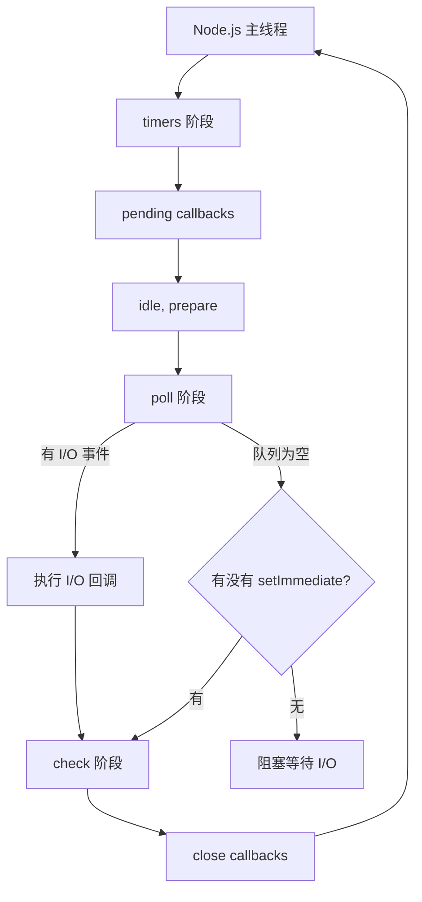

# Node.js 核心原理

> Node.js 是基于 Chrome V8 引擎的 JavaScript 运行时，采用事件驱动、非阻塞 I/O 模型。

## 1. 架构概览

```
┌─────────────────────────────────────────────────────────────────┐
│                         Node.js 架构                             │
├─────────────────────────────────────────────────────────────────┤
│                                                                 │
│  ┌─────────────────────────────────────────────────────────┐   │
│  │                    JavaScript 代码                        │   │
│  │              (Buffer / Stream / EventEmitter)             │   │
│  └─────────────────────────┬───────────────────────────────┘   │
│                            │                                   │
│  ┌─────────────────────────▼───────────────────────────────┐   │
│  │                      V8 JavaScript 引擎                    │   │
│  │     ┌──────────────┐  ┌──────────────┐  ┌────────────┐  │   │
│  │     │   JIT 编译     │  │  内存管理     │  │   异步 I/O  │  │   │
│  │     │  (TurboFan)   │  │  (V8 Heap)   │  │   调度器   │  │   │
│  │     └──────────────┘  └──────────────┘  └────────────┘  │   │
│  └─────────────────────────┬───────────────────────────────┘   │
│                            │                                   │
│  ┌─────────────────────────▼───────────────────────────────┐   │
│  │                        libuv                              │   │
│  │  ┌──────────────────────────────────────────────────┐   │   │
│  │  │              线程池 (默认 4 线程)                  │   │   │
│  │  │   ┌────────┐ ┌────────┐ ┌────────┐ ┌────────┐   │   │   │
│  │  │   │线程 1  │ │线程 2  │ │线程 3  │ │线程 4  │   │   │   │
│  │  │   │I/O任务 │ │I/O任务 │ │I/O任务 │ │I/O任务 │   │   │   │
│  │  │   └────────┘ └────────┘ └────────┘ └────────┘   │   │   │
│  │  └──────────────────────────────────────────────────┘   │   │
│  │                                                          │   │
│  │  ┌──────────────────────────────────────────────────┐   │   │
│  │  │              事件循环 (Event Loop)                │   │   │
│  │  │   timers → pending callbacks → idle/prepare     │   │   │
│  │  │   → poll → check → close callbacks              │   │   │
│  │  └──────────────────────────────────────────────────┘   │   │
│  └─────────────────────────┬───────────────────────────────┘   │
│                            │                                   │
│              ┌─────────────┼─────────────┐                   │
│              ▼             ▼             ▼                     │
│         文件系统         网络          进程                    │
│        (fs/libuv)    (net/libuv)   (child_process)            │
│                                                                 │
└─────────────────────────────────────────────────────────────────┘
```

---

## 2. 事件循环机制

### 2.1 libuv 事件循环阶段


```mermaid
graph TD
    A[Node.js 主线程] --> B[timers 阶段]
    B --> C[pending callbacks]
    C --> D[idle, prepare]
    D --> E[poll 阶段]
    E -->|有 I/O 事件| F[执行 I/O 回调]
    E -->|队列为空| G{有没有 setImmediate?}
    G -->|有| H[check 阶段]
    G -->|无| I[阻塞等待 I/O]
    H --> J[close callbacks]
    J --> A
    F --> H
```

### 2.2 各阶段详解

| 阶段 | 说明 | 处理的回调 |
|------|------|-----------|
| **timers** | 执行 `setTimeout()` 和 `setInterval()` 的回调 | 定时器回调 |
| **pending callbacks** | 执行上一轮循环延后的 I/O 回调 | I/O 错误回调 |
| **idle, prepare** | 内部使用 | 准备阶段 |
| **poll** | 检索新的 I/O 事件，执行 I/O 回调 | 文件操作、网络 |
| **check** | 执行 `setImmediate()` 的回调 | 立即回调 |
| **close callbacks** | 执行关闭事件回调 | `socket.on('close')` |

### 2.3 process.nextTick 与 Promise 对比

```typescript
// 三种微任务优先级（从高到低）
// 1. process.nextTick - 最高优先级
// 2. Promise.then / queueMicrotask - 中等
// 3. setImmediate - 最低（属于 check 阶段）

console.log('1 - 同步代码');

setTimeout(() => console.log('2 - setTimeout'), 0);
setImmediate(() => console.log('3 - setImmediate'));

Promise.resolve().then(() => console.log('4 - Promise.then'));
queueMicrotask(() => console.log('5 - queueMicrotask'));
process.nextTick(() => console.log('6 - nextTick'));

// 输出顺序：
// 1 - 同步代码
// 6 - nextTick      (微任务，最先)
// 4 - Promise.then  (微任务)
// 5 - queueMicrotask (微任务)
// 2 - setTimeout     (timers 阶段)
// 3 - setImmediate  (check 阶段)
```

### 2.4 经典面试题：async/await 执行顺序

```typescript
async function asyncMain() {
  console.log('1 - async 函数开始');

  await Promise.resolve();
  console.log('2 - await 之后');

  setTimeout(() => console.log('3 - setTimeout in async'), 0);

  await new Promise(resolve => {
    setTimeout(() => {
      console.log('4 - setTimeout 回调执行');
      resolve();
    }, 0);
  });

  console.log('5 - async 函数结束');
}

console.log('6 - 主代码开始');
asyncMain();
console.log('7 - 主代码结束');

// 输出：
// 6 - 主代码开始
// 1 - async 函数开始
// 7 - 主代码结束
// 2 - await 之后（微任务）
// 3 - setTimeout in async（timers）
// 4 - setTimeout 回调执行
// 5 - async 函数结束
```

---

## 3. 模块系统

### 3.1 CommonJS (CJS) vs ES Modules (ESM)

```typescript
// ============================================
// CommonJS (CJS) - Node.js 传统模块格式
// ============================================

// 导出方式
module.exports = { name: 'CJS' };
// 或
exports.add = (a: number, b: number) => a + b;

// 导入方式
const utils = require('./utils');
const { add } = require('./utils');
const fs = require('fs');

// ============================================
// ES Modules (ESM) - 现代标准
// ============================================

// 导入方式
import fs from 'fs';
import { readFile } from 'fs/promises';
import * as path from 'path';

// 导出方式
export const PI = 3.14159;
export default class App {}

// 或整体导出
export { PI, readFile };

// ============================================
// package.json 配置
// ============================================

// 方式一：显式 type
{
  "type": "module"  // 所有 .js 文件按 ESM 处理
}

// 方式二：使用 .mjs 和 .cjs 扩展名
// my-module.mjs  - 强制 ESM
// my-module.cjs  - 强制 CJS
```

### 3.2 CJS 与 ESM 互操作

```typescript
// ESM 中导入 CJS（始终可行）
import cjsModule from './commonjs.cjs';  // 默认导入
import { named } from './commonjs.cjs';   // 具名导入（CJS 的 module.exports）

// CJS 中导入 ESM（需要动态 import）
async function loadESM() {
  const esmModule = await import('./esm.mjs');
  // CJS 无法同步 require ESM，必须用 async import
}
```

### 3.3 模块循环依赖

```typescript
// a.js
import { bMethod } from './b.js';
export const aValue = 'A';
export function aMethod() {
  console.log('A method');
  bMethod(); // 可能获取到 undefined
}

// b.js
import { aValue } from './a.js';  // 此时 a.js 尚未完全加载
export const bValue = 'B';

export function bMethod() {
  console.log(`B method, aValue = ${aValue}`); // aValue 是 undefined
}

// main.js
import { aMethod } from './a.js';
aMethod();
// 输出：
// A method
// B method, aValue = undefined (a.js 尚未完全加载)
```

### 3.4 Node.js 模块解析算法

```typescript
// Node.js 模块解析顺序（假设导入 'utils'）

// 1. 内置模块（优先级最高）
// 'fs', 'path', 'http', 'crypto' 等

// 2. 文件模块（相对路径）
import fs from './utils';    // → ./utils.js / ./utils/index.js
import fs from '../utils';   // → ../utils.js

// 3. node_modules 查找
// 从当前目录向上遍历 node_modules
// node_modules/utils/index.js
// node_modules/utils.js
// node_modules/utils/package.json 的 main 字段

// 自定义查找路径
import myModule from '/absolute/path/to/module';
```

---

## 4. 异步 I/O 与 Promise

### 4.1 异步编程模型演进

```typescript
// ============================================
// 回调地狱 (Callback Hell)
// ============================================
function fetchUserCallback(userId: string, callback: (err: Error | null, user?: User) => void) {
  db.findUser(userId, (err, user) => {
    if (err) return callback(err);
    cache.set(userId, user, (err) => {
      if (err) return callback(err);
      db.getOrders(user.id, (err, orders) => {
        if (err) return callback(err);
        callback(null, { ...user, orders });
      });
    });
  });
}

// ============================================
// Promise 链式调用
// ============================================
function fetchUserPromise(userId: string): Promise<User> {
  return db.findUserAsync(userId)
    .then(user => cache.setAsync(userId, user).then(() => user))
    .then(user => db.getOrdersAsync(user.id).then(orders => ({ ...user, orders })));
}

// ============================================
// async/await（推荐）
// ============================================
async function fetchUserAsync(userId: string): Promise<User> {
  const user = await db.findUserAsync(userId);
  await cache.setAsync(userId, user);
  const orders = await db.getOrdersAsync(user.id);
  return { ...user, orders };
}
```

### 4.2 Promise 并发控制

```typescript
// ============================================
// Promise.all - 所有都成功才成功
// ============================================
const [users, posts, comments] = await Promise.all([
  fetchUsers(),
  fetchPosts(),
  fetchComments(),
]);

// ============================================
// Promise.allSettled - 不管成功失败，返回所有结果
// ============================================
const results = await Promise.allSettled([
  fetchUsers(),
  fetchPosts(),
  fetchComments(),
]);

results.forEach((result, index) => {
  if (result.status === 'fulfilled') {
    console.log(`成功: ${result.value}`);
  } else {
    console.log(`失败: ${result.reason}`);
  }
});

// ============================================
// Promise.race - 谁先完成返回谁
// ============================================
const response = await Promise.race([
  fetchWithTimeout(url, 3000),
  fetchWithBackup(url),
]);

// ============================================
// 并发限制
// ============================================
async function batchWithLimit<T>(
  tasks: (() => Promise<T>)[],
  limit: number
): Promise<T[]> {
  const results: T[] = [];
  const executing = new Set<Promise<void>>();

  for (const task of tasks) {
    const p = Promise.resolve().then(() => task());
    results.push(p);

    if (executing.size >= limit) {
      await Promise.race(executing);
      executing.delete(p);
    }
    executing.add(p);
  }

  return Promise.all(results);
}
```

---

## 5. 内置模块详解

### 5.1 fs (文件系统)

```typescript
import fs from 'fs/promises';
import { createReadStream, createWriteStream } from 'fs';
import path from 'path';

// ============================================
// 文件读取
// ============================================

// 异步读取（推荐）
async function readFileExample() {
  const content = await fs.readFile('./data.json', 'utf-8');
  const data = JSON.parse(content);
  return data;
}

// 流式读取（大文件推荐）
function streamFileExample() {
  const readStream = createReadStream('./large-file.log', {
    encoding: 'utf-8',
    highWaterMark: 64 * 1024, // 64KB 缓冲区
  });

  let lineCount = 0;

  readStream.on('data', (chunk) => {
    lineCount += chunk.split('\n').length;
  });

  readStream.on('end', () => console.log(`Total lines: ${lineCount}`));
  readStream.on('error', console.error);
}

// ============================================
// 文件写入
// ============================================

// 完整写入
await fs.writeFile('./output.txt', 'Hello, Node.js!', 'utf-8');

// 流式写入
const writeStream = createWriteStream('./large-output.txt');

for (let i = 0; i < 1000000; i++) {
  writeStream.write(`Line ${i}\n`);
}
writeStream.end();

// ============================================
// 目录操作
// ============================================
async function dirOperations() {
  // 创建目录（recursive 支持递归创建）
  await fs.mkdir('./deep/nested/dir', { recursive: true });

  // 读取目录
  const entries = await fs.readdir('./src', { withFileTypes: true });
  entries.forEach(entry => {
    console.log(`${entry.name} - ${entry.isDirectory() ? 'DIR' : 'FILE'}`);
  });

  // 复制文件
  await fs.copyFile('./source.txt', './destination.txt');

  // 获取文件信息
  const stat = await fs.stat('./file.txt');
  console.log(`Size: ${stat.size}, Modified: ${stat.mtime}`);
}
```

### 5.2 Stream (流)

```typescript
import { Readable, Writable, Transform, pipeline } from 'stream';
import { createReadStream, createWriteStream } from 'fs';
import { promisify } from 'util';

const pipelineAsync = promisify(pipeline);

// ============================================
// 内置流类型
// ============================================
// Readable  - 可读流（文件读取、网络请求）
// Writable  - 可写流（文件写入、HTTP 响应）
// Transform - 转换流（压缩、加密）
// Duplex    - 双工流（TCP Socket）
// PassThrough - 直通流（监控数据）

// ============================================
// 自定义可读流
// ============================================
class NumberStream extends Readable {
  private current = 1;
  private max: number;

  constructor(max: number) {
    super();
    this.max = max;
  }

  _read() {
    if (this.current > this.max) {
      this.push(null); // 结束流
    } else {
      this.push(this.current.toString());
      this.current++;
    }
  }
}

// ============================================
// 自定义转换流
// ============================================
class UpperCaseTransform extends Transform {
  _transform(chunk: Buffer, encoding: string, callback: Function) {
    this.push(chunk.toString().toUpperCase());
    callback();
  }
}

// ============================================
// 流式处理大文件
// ============================================
async function processLargeFile(input: string, output: string) {
  await pipelineAsync(
    createReadStream(input),
    new UpperCaseTransform(),
    createWriteStream(output)
  );
}

// ============================================
// 对象模式流
// ============================================
const objectStream = new Readable({
  objectMode: true,
  read() {
    const obj = { id: 1, name: 'Object' };
    this.push(obj);
    this.push(null);
  }
});

objectStream.on('data', (obj) => console.log('Object:', obj));
```

### 5.3 Buffer (缓冲区)

```typescript
import { Buffer } from 'buffer';

// ============================================
// Buffer 创建
// ============================================

// 从字符串
const buf1 = Buffer.from('Hello', 'utf-8');
// <Buffer 48 65 6c 6c 6f>

// 从字节数组
const buf2 = Buffer.from([72, 101, 108, 108, 111]);

// 指定大小（未初始化）
const buf3 = Buffer.alloc(10);
// 填充特定值
const buf4 = Buffer.alloc(10, 0x41); // 'A'

// ============================================
// Buffer 操作
// ============================================

const buf = Buffer.from('Node.js', 'utf-8');

// 长度
console.log(buf.length); // 7

// 转为字符串
console.log(buf.toString('utf-8')); // 'Node.js'

// 切片
const slice = buf.subarray(0, 4);
console.log(slice.toString()); // 'Node'

// 连接
const bufA = Buffer.from('Hello');
const bufB = Buffer.from(' World');
const combined = Buffer.concat([bufA, bufB]);
console.log(combined.toString()); // 'Hello World'

// 比较
const bufX = Buffer.from('ABC');
const bufY = Buffer.from('ABD');
console.log(bufX.compare(bufY)); // -1（字典序小于）

// 查找
const haystack = Buffer.from('Hello Node.js');
const needle = Buffer.from('Node');
console.log(haystack.indexOf(needle)); // 6

// ============================================
// Base64 编解码
// ============================================

const original = 'Hello, 世界!';
const encoded = Buffer.from(original).toString('base64');
const decoded = Buffer.from(encoded, 'base64').toString();

console.log(encoded); // 'SGVsbG8sIOS4rfftiIQ='
console.log(decoded); // 'Hello, 世界!'
```

---

## 6. 面试常考问题

### 6.1 Q1: Node.js 是单线程还是多线程？

```typescript
// Node.js 主线程是单线程的（执行 JavaScript 代码）
// 但底层 libuv 有线程池（默认 4 线程，处理 I/O 操作）

// JavaScript 执行：单线程（V8 主线程）
// I/O 操作：libuv 线程池（可配置，最多 1024）
//       ┌──────────────┐
       │  V8 主线程    │  ← JavaScript 单线程执行
       │  (JS 逻辑)    │
       └──────┬───────┘
              │ 调用异步操作
              ▼
       ┌──────────────┐
       │   libuv      │
       │  ┌────────┐  │
       │  │线程池  │  │  ← I/O 多线程处理
       │  │ 4线程  │  │
       │  └────────┘  │
       └──────────────┘
```

### 6.2 Q2: Node.js 适合 CPU 密集型任务吗？

```typescript
// 不适合，Node.js 的 I/O 模型对 CPU 密集型任务无能为力
// 解决方式：
// 1. Child Process - 派生子进程处理
// 2. Worker Threads - 工作线程池
// 3. C++ Addons - 原生模块
// 4. GPU 加速 - torchserve 等

import { fork } from 'child_process';
import path from 'path';

// CPU 密集型任务用子进程处理
function runCpuTask(data: number[]) {
  return new Promise((resolve, reject) => {
    const child = fork(path.join(__dirname, 'heavy-task.js'));

    child.on('message', (result) => resolve(result));
    child.on('error', reject);

    child.send(data);
  });
}

// heavy-task.js
process.on('message', (data) => {
  // CPU 密集型计算
  const result = data.reduce((sum, n) => sum + n * n, 0);
  process.send(result);
  process.exit(0);
});
```

### 6.3 Q3: setTimeout(fn, 0) vs setImmediate

```typescript
// 两者都用于推迟执行，但时机不同

// I/O 回调内：setImmediate 通常先执行
fs.readFile('./file.txt', () => {
  setTimeout(() => console.log('timeout'), 0);
  setImmediate(() => console.log('immediate'));
  // 输出顺序不确定，取决于系统调度
});

// 主模块：setTimeout(fn, 0) 先执行
setTimeout(() => console.log('timeout'), 0);
setImmediate(() => console.log('immediate'));
// 输出：timeout → immediate

// 原因：
// setTimeout 进入 timers 阶段
// setImmediate 进入 check 阶段
// timers 在 check 之前
```

### 6.4 Q4: 如何保证 Node.js 服务不崩溃？

```typescript
// 1. 优雅关闭
import http from 'http';

const server = http.createServer((req, res) => {
  res.end('Hello');
});

process.on('SIGTERM', async () => {
  console.log('收到 SIGTERM，开始优雅关闭...');
  server.close(() => {
    console.log('HTTP 服务器已关闭');
    process.exit(0);
  });
});

// 2. 未捕获异常处理
process.on('uncaughtException', (err) => {
  console.error('未捕获异常:', err);
  // 记录日志后退出
  process.exit(1);
});

process.on('unhandledRejection', (reason, promise) => {
  console.error('未处理的 Promise 拒绝:', reason);
});

// 3. 内存监控
setInterval(() => {
  const used = process.memoryUsage();
  console.log(`Heap Used: ${Math.round(used.heapUsed / 1024 / 1024)}MB`);
}, 30000);
```

---

## 7. 参考链接

- [Node.js 官方文档](https://nodejs.org/docs/)
- [libuv 设计文档](http://docs.libuv.org/)
- [Node.js 事件循环详解](https://nodejs.org/zh-cn/docs/guides/event-loop/)
- [Stream 官方指南](https://nodejs.org/api/stream.html)
- [Buffer 文档](https://nodejs.org/api/buffer.html)

## 深入阅读与参考

!!! tip "怎么用这些资料"
    先读「官方文档与规范」建立准确的概念，再读「源码与示例」核对细节，最后用「教程、书籍与视频」换一种讲法加深理解。每条都写明了读哪一节、带着什么问题读。

### 官方文档与规范

| 资源 | 为什么读 | 怎么读 |
|---|---|---|
| [Node.js 简介](https://nodejs.org/en/learn/getting-started/introduction-to-nodejs) | 官方入门，概览架构与事件循环对并发的影响 | 读事件循环与并发部分，自问为何 Node 适合 I/O 密集；读后写一段总结 |
| [Node.js ES 模块](https://nodejs.org/api/esm.html) | 官方 ESM 文档，厘清模块系统与 CJS 互操作 | 重点读与 CommonJS 互操作一节，带着 ERR_REQUIRE_ESM 报错去读，读后改一个包的导出 |
| [Node.js 包规范](https://nodejs.org/api/packages.html) | exports 与条件导出的权威依据，理解模块解析 | 读 exports 与条件导出章节，尝试写一个同时支持 ESM/CJS 的包配置 |
| [Node.js API 文档](https://nodejs.org/api/) | 内置模块权威参考，查 fs/path/stream 等接口 | 按需查阅 fs、path、stream 的示例，边查边在 REPL 里跑一遍 |
| [Node.js Stream](https://nodejs.org/api/stream.html) | 理解流式 I/O 与背压，异步 I/O 的典型实现 | 用 pipeline 处理大文件，观察内存；再读背压与 highWaterMark 一节 |
| [Promises/A+ 规范](https://promisesaplus.com/) | Promise 实现标准，逐条理解 then 的行为约定 | 对照规范实现一个简易 Promise，用官方测试套件验证通过 |
| [Promise](https://developer.mozilla.org/en-US/docs/Web/JavaScript/Reference/Global_Objects/Promise) | Promise API 速查与语义说明，面试复习好用 | 通读静态方法与实例方法，重点看 all/race/allSettled/any 区别 |

### 源码与示例

| 资源 | 为什么读 | 怎么读 |
|---|---|---|
| [Node.js 贡献文档](https://github.com/nodejs/node/blob/main/doc/contributing) | 读 Node 源码的入口，了解目录结构与构建方式 | 先读目录结构与构建一节，再定位 lib/ 下事件循环相关源码 |
| [BigFrontEnd.dev 题目列表](https://bigfrontend.dev/problem) | Promise 与 DOM 练习题集中，适合检验理解 | 按标签筛选 Promise 与事件循环题，各做 5 题并复盘错因 |

### 教程、书籍与视频

| 资源 | 为什么读 | 怎么读 |
|---|---|---|
| [Node.js 事件循环](https://nodejs.org/en/learn/asynchronous-work/event-loop-timers-and-nexttick) | 用打印顺序题直观验证 nextTick、微任务与 setImmediate | 先自己预测输出顺序，再运行验证；整理成面试常考时序表 |
| [现代 JavaScript 教程：异步](https://zh.javascript.info/async) | 异步教程循序渐进，练习覆盖回调到 async/await | 按回调→Promise→async/await 顺序做完练习，再回看事件循环 |
| [Node.js Learn](https://nodejs.org/en/learn) | 官方学习路径，从入门到 npm 循序渐进 | 按目录顺序读，重点读事件循环与模块相关文章并做笔记 |
| [Node.js in Action（第 2 版，Manning）](https://www.manning.com/books/node-js-in-action-second-edition) | 经典实战书，示例完整，适合建立整体架构感 | 完成书中示例服务，再思考事件循环与模块化的设计取舍 |
| [MDN 使用 Promise](https://developer.mozilla.org/en-US/docs/Web/JavaScript/Guide/Using_promises) | 链式调用与错误处理讲得清楚，适合打基础 | 读链式与错误处理两节，把一段回调地狱改写成 async/await |

## 应用与行业实践

### 应用场景地图

| 场景 | 用到本页哪个知识点 | 典型技术选型 | 注意事项 |
| --- | --- | --- | --- |
| 后台管理导出十万行订单 CSV | 内置模块、异步 I/O、背压 | node:stream、node:stream/promises、数据库游标 | OFFSET 深分页越翻越慢，改用主键游标 |
| 低端安卓手机打开活动首屏 | 事件循环、异步 I/O 与 Promise | BFF 聚合、内置 fetch、AbortSignal.timeout | Promise.all 一处失败全失败，要兜底 |
| 多人协作白板实时同步 | 事件循环机制、内置模块 | ws、worker_threads、结构化克隆 | 广播前做差量，耗时计算别放主线程 |
| 电商下单接口的依赖聚合 | 非阻塞 I/O、事件循环阶段 | 连接池、Redis、setImmediate | 连接池大小要与下游承载对齐 |
| 日志采集与落盘 | 内置模块、流、背压 | pino、node:fs 写流 | 同步写文件会占住事件循环 |
| 定时生成日报报表 | 事件循环、Timers、内置模块 | 定时器、worker_threads | 定时任务要错开请求高峰 |
| 本地 CLI 构建工具 | 模块系统、内置模块 | Node CLI、fs/path、ESM 与 CJS | 两种模块格式混用要看加载顺序 |
| 图片上传与压缩 | 流、背压、worker_threads | 上传解析库、sharp、线程池 | 整图读进内存会让 RSS 抬升 |
| 内部 API 网关转发 | http 模块、异步 I/O、连接池 | undici、keep-alive | 超时必须显式设置 |

### 三个场景拆解

#### 场景 1：后台管理导出十万行订单 CSV

**业务背景**：运营同学按时间范围导出订单，数据量随月份累积，单次导出到十万行量级。多个人同时点导出，服务进程内存随请求数抬升。

**怎么用本页知识解决**：思路是把"查全表再拼字符串"换成"边查边写"，让流负责背压。可读流由异步生成器产出，写端直接用 HTTP 响应对象。

```js
const { pipeline } = require('node:stream/promises'); // Promise 版 pipeline，负责串联与清理
const { Readable } = require('node:stream'); // 把异步生成器包装成可读流

async function* rows() {
  let cursor = 0; // 游标分页，避免 OFFSET 越翻越慢
  for (;;) {
    const page = await db.query('SELECT id, amount FROM orders WHERE id > ? ORDER BY id LIMIT 1000', [cursor]); // 每次取 1000 行
    if (page.length === 0) return; // 取空即结束
    for (const row of page) yield toCsvLine(row) + '\n'; // 逐行产出，不堆在数组里
    cursor = page[page.length - 1].id; // 用最后一行主键推进游标
  }
}

async function exportOrders(req, res) {
  res.setHeader('content-type', 'text/csv; charset=utf-8'); // 先写响应头，再写正文
  await pipeline(Readable.from(rows()), res); // 背压由 pipeline 处理，出错自动销毁
}
```

- `Readable.from` 接受异步生成器，产出一行就往下游送一行。
- `pipeline` 在写端变慢时会暂停读端，堆内存不会随行数线性增长。
- 游标分页让每页查询都走主键索引，翻到后面页耗时保持平稳。
- 出错时 `pipeline` 会销毁两端连接，不会留下悬挂的数据库连接。
- `res` 本身是可写流，不需要中间拼接字符串。

**怎么度量收益**：看 `process.memoryUsage().rss` 峰值与首字节时间。用 autocannon 固定并发和时长打两个版本，再给进程加 `--max-old-space-size` 限制跑同一压测，观察是否出现 OOM。

**什么时候不该用**：
- 结果只有几千行，且下游只能接收 JSON 数组，流式 CSV 反而增加解析成本。
- 接口契约要求返回可排序、可过滤的完整结果集，客户端需要服务端二次计算。

#### 场景 2：低端安卓手机打开活动首屏

**业务背景**：活动页首屏数据来自三个下游服务，低端安卓机上等待时间偏长。机型内存小，网络往返次数和主线程占用都要压住。

**怎么用本页知识解决**：思路是把串行请求改成并行，并给总耗时设上限。任一依赖超时就用兜底数据，页面仍然能渲染。

```js
async function renderHome(req, res) {
  const signal = AbortSignal.timeout(800); // 总超时 800ms，慢依赖不拖住首屏
  const tasks = [
    fetchUser(req.userId, { signal }), // 用户信息
    fetchFeed(req.userId, { signal }), // 信息流
    fetchBanners({ signal }), // 运营位
  ];
  const [user, feed, banners] = await Promise.allSettled(tasks); // 一处失败不影响其余
  const html = renderPage({
    user: valueOr(user, guestProfile), // 失败时用兜底用户
    feed: valueOr(feed, []),
    banners: valueOr(banners, []),
  });
  res.setHeader('cache-control', 'public, max-age=5'); // 低端机复访命中缓存
  res.end(html);
}
```

- 三个请求同时发出，总耗时接近最慢的那个，而不是三者相加。
- `AbortSignal.timeout` 给每个请求设上限，慢依赖不会占满连接。
- `Promise.allSettled` 把失败降级成局部缺失，页面整体仍可返回。
- 短缓存让同一台设备复访时跳过服务端渲染。
- 渲染在服务端完成，低端机只解析 HTML，省掉前端请求编排。

**怎么度量收益**：客户端看 Lighthouse 的 LCP 与 TTFB，配合 Chrome DevTools Network 面板看 HTML 到达时间。服务端用 `performance.now()` 记录 `renderHome` 的耗时分布，按 p50 与 p99 分别观察。

**什么时候不该用**：
- 三个依赖有严格先后关系，后一个请求的入参依赖前一个的返回值。
- 页面必须拿到完整数据才允许渲染，缺任意一块都算业务错误。

#### 场景 3：多人协作白板的实时同步

**业务背景**：一个白板房间内二十人同时画线，服务端要把操作广播给同房间连接。房间还要定期生成预览图，生成过程集中在主线程。

**怎么用本页知识解决**：思路是把广播留在主线程，把预览图生成挪到工作线程。主线程只负责收发消息，事件循环延迟保持在低位。

```js
const { Worker } = require('node:worker_threads'); // 引入工作线程
const idle = []; // 空闲线程池，省去反复创建线程的开销

function renderSnapshot(snapshot) {
  return new Promise((resolve, reject) => {
    const worker = idle.pop() ?? new Worker('./render-board.js'); // 取空闲线程或新建
    worker.once('message', (png) => { // 线程回传结果
      idle.push(worker); // 线程归还池中复用
      resolve(png);
    });
    worker.once('error', reject); // 渲染失败时把错误交回调用方
    worker.postMessage(snapshot); // 结构化克隆把操作日志发给线程
  });
}
```

- 主线程只做 WebSocket 读写与广播，CPU 计算移到工作线程。
- `postMessage` 用结构化克隆传数据，快照与主线程内存互不影响。
- 线程池复用避免每个房间反复创建线程。
- `once('error')` 把线程内异常回传到业务代码，便于降级为返回上一张预览图。
- 广播前按房间维护连接集合，避免遍历全部连接。

**怎么度量收益**：用 `perf_hooks.monitorEventLoopDelay()` 看事件循环延迟的 p99，用 `performance.eventLoopUtilization()` 看主线程占用。客户端在消息里带发送时间戳，统计广播到达的时间差分布。

**什么时候不该用**：
- 房间内同时在线低于 5 人且没有实时同步要求，轮询拉取即可。
- 预览图生成耗时低于 5ms，引入线程只增加调试成本。

### 行业先进实践

- **cluster 多进程分担连接（出处：Node.js 官方文档 Cluster 章节）**：文档说明多个进程可以共享同一监听端口，由主进程分发连接。按 CPU 核数起进程能压满多核。借鉴方式是先做主进程与子进程的退出联动，再接入部署脚本。
- **AsyncLocalStorage 传递请求上下文（出处：Node.js 官方文档 Async hooks 章节）**：文档给出在异步调用链中保留上下文的用法。日志里带上 traceId 时，不必逐层传参。借鉴方式是只包一层入口中间件，避免滥用。
- **perf_hooks 观测事件循环（出处：Node.js 官方文档 perf_hooks 章节）**：文档提供 `monitorEventLoopDelay` 与 `eventLoopUtilization`。把延迟做成常驻指标，能在故障前看到趋势。借鉴方式是先接一个上报通道，再定告警阈值。
- **OpenTelemetry 自动埋点（出处：OpenTelemetry 官方文档 JavaScript SDK）**：通过 HTTP 与数据库的 instrumentation 库自动生成 span。链路数据能定位到具体下游。借鉴方式是先跑通一条请求的完整 trace，再谈扩容。
- **Fastify 依据 JSON Schema 序列化响应（出处：Fastify 官方文档 Validation and Serialization）**：文档说明响应 schema 会编译成序列化函数。给高频接口写 response schema，可省掉运行时的字段推断。借鉴方式是从字段固定的接口开始加 schema。

### 从学到用：落地路线

1. 先在导出接口试点流式改造，验收标准是同一压测下 RSS 峰值低于改造前的一半。
2. 用 autocannon 与 `--max-old-space-size` 复跑两次压测，验收标准是两次命令与输出都记进 README。
3. 把流式写法推广到日志落盘与文件下载接口，验收标准是代码评审清单里出现背压与游标两项检查。
4. 把事件循环延迟接入监控并设阈值，验收标准是延迟超标时能在面板上看到对应时间点。

### 动手作业

**目标**：用 Node 内置模块写两个接口，一个导出 CSV，一个聚合三个模拟下游，并用压测对照两种写法的资源占用。

**步骤**：
1. 用 `node:http` 建服务，写 `/export`，先把整个结果集拼成字符串再返回，并打印 `process.memoryUsage().rss`。
2. 把 `/export` 改成游标分页加 `Readable.from` 加 `pipeline` 的流式实现，打印同一指标。
3. 写 `/home`，用三个返回 Promise 的 `setTimeout` 模拟下游，按顺序 await。
4. 把 `/home` 改成 `Promise.allSettled` 加 `AbortSignal.timeout`，并给失败项加兜底值。
5. 加 `perf_hooks.monitorEventLoopDelay()` 与 `performance.eventLoopUtilization()`，在两次压测中打印延迟 p99。
6. 用 autocannon 以固定并发和时长分别压两个版本，记录内存峰值与耗时。
7. 写 README，列出每条命令与对应输出。

**验收标准**：
- 流式版本在 `--max-old-space-size` 限制下完成同一压测且不 OOM。
- 串行 `/home` 的耗时接近三个下游之和，并行版本接近最慢的那个。
- 事件循环延迟 p99 在两次压测中都有输出，且数据可对照。
- README 中每条结论都附有可复现的命令与原始输出。
- 代码中每个关键行都有中文注释，说明该行在事件循环或流中承担的角色。

