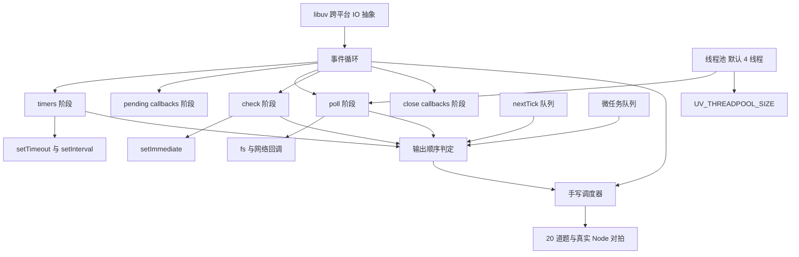
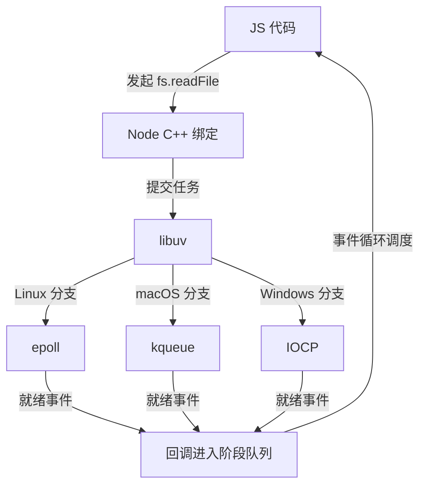
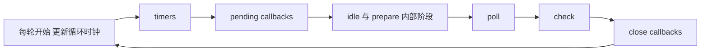
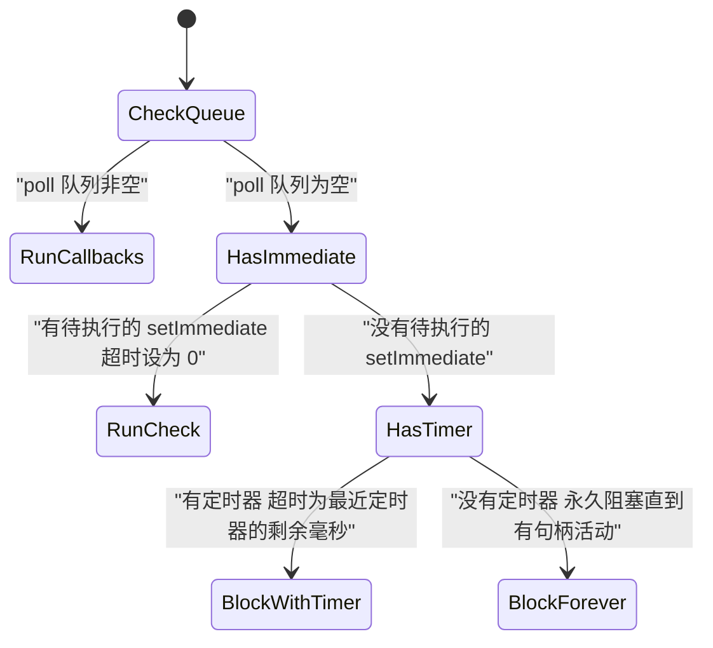
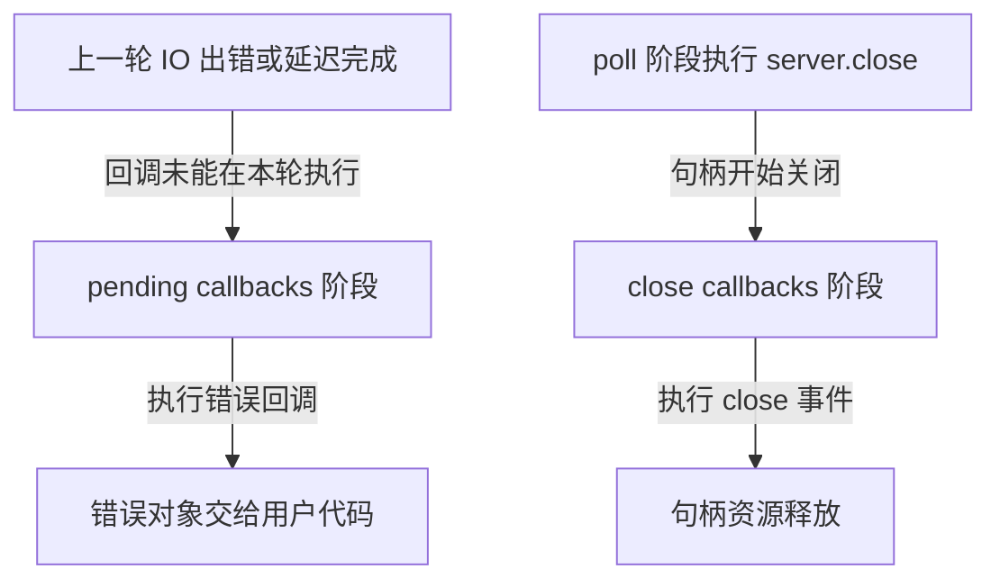
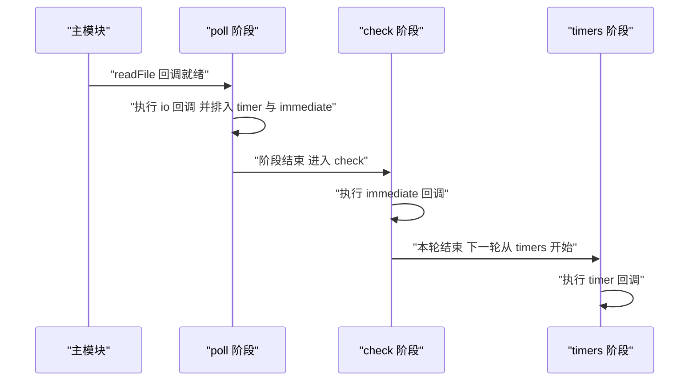
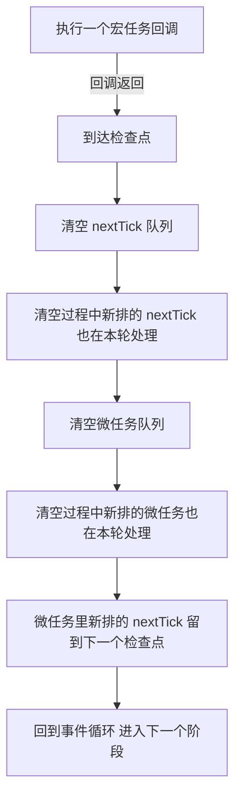
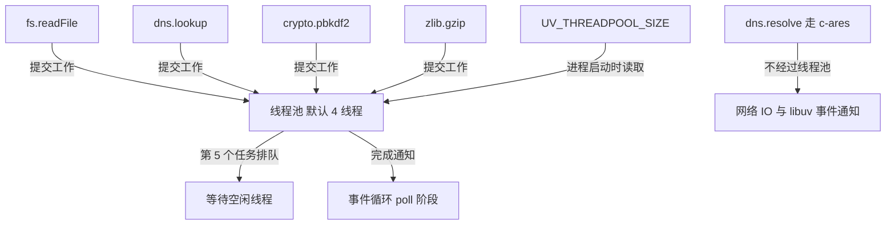
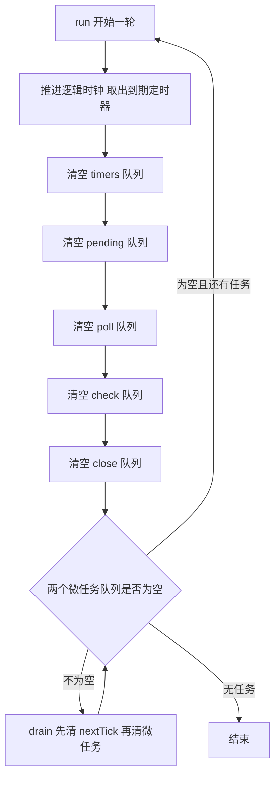
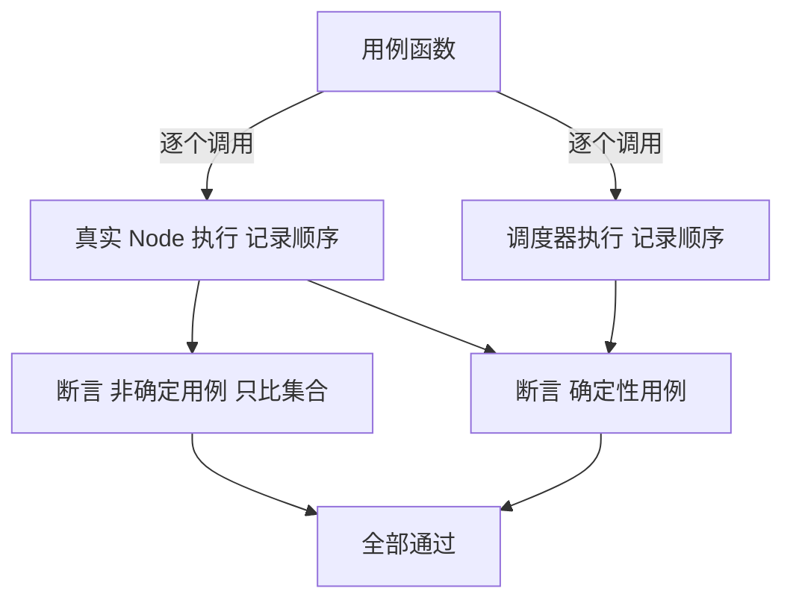

# Node.js 事件循环与 libuv：六个阶段的精确语义

!!! abstract "学完这一页你能"
    1. 按固定顺序背出 libuv 六个阶段，并指出哪些阶段会执行 JS 回调、哪些不会。
    2. 用不超过 6 行代码判定 setImmediate 与 setTimeout 的先后，并说明这个判定在主模块与 I/O 回调中的差别。
    3. 画出 nextTick 队列与 Promise 微任务队列的先后关系，并预测嵌套写法下的输出序列。
    4. 用默认 4 个线程的线程池解释 fs、dns.lookup、crypto 的并发上限，并用 UV_THREADPOOL_SIZE 复现变化。

本页摘要：timers、pending、poll、check、close 五个 JS 可见阶段的语义，加上 nextTick 队列与微任务队列的优先级，最后用 20 道顺序题与真实 Node 对拍。

## 0. 知识地图



建议怎么读：第 1 节先建立"底座由 libuv 提供"这件事，第 2 节拿到六阶段的骨架顺序。
第 3 到第 7 节把每个阶段、每个队列拆开讲，每节末尾都有一段可运行脚本。
第 8、9 节把前面全部规则写成调度器，再用 20 道题做输出对拍。

## 1. libuv 与跨平台 IO 抽象

**先想一个问题**
你写了一段读文件的代码，在 macOS 上能跑，换到 Windows 也能跑。可 macOS 用 kqueue 通知 IO 就绪，Windows 用 IOCP。这份差异由谁抹平？

**心智模型**
!!! tip "心智模型"
    一句话模型：libuv 是 Node 的底座，它把各操作系统的 IO 通知机制包成同一套 C 接口。
    日常类比：它是机场的中转大厅，无论你从哪个航站楼进来，都走同一条登机通道。
    类比不成立的地方：机场不改航班时刻，libuv 会决定回调落在哪个阶段，回调的先后因此可预测。

!!! note "术语：libuv"
    定义：libuv 是一个跨平台异步 IO 库，为 Node 提供事件循环、线程池与 IO 通知封装。例子：`fs.readFile` 最终通过 libuv 把任务交给线程池，再用 epoll 或 kqueue 把完成事件收回。

!!! note "术语：epoll"
    定义：epoll 是 Linux 提供的事件通知接口，让一个线程同时监视多个文件描述符。例子：一万个 socket 等待可读时，epoll 只报告真正就绪的那几个。

**图解**



图解逐步解读：
1. JS 调用 `fs.readFile`，控制权交给 C++ 绑定层。
2. 绑定层把任务提交给 libuv，并登记"完成后调用哪个 JS 函数"。
3. libuv 按当前系统选定 epoll、kqueue 或 IOCP 来等待完成事件。
4. 底层报告完成后，libuv 把回调放进对应阶段的队列。
5. 事件循环轮到该阶段时执行回调，JS 代码继续运行。

**一步一步来**

1. 这一步要做什么：观察异步调用的返回值，确认同步代码不会等待回调。

```js
// demo1.mjs —— 观察同步代码与回调的先后
import { readFile } from "node:fs";

// 提交读文件任务，回调登记给 libuv，函数立刻返回
readFile(new URL(import.meta.url), "utf8", () => {
  console.log("回调执行");     // 只在事件循环的某个阶段执行
});

// 这一行先于回调执行，说明异步调用没有阻塞当前栈
console.log("同步代码");
```

**这段代码在做什么**
- 第一行 `import` 只引入回调式读文件函数，不触发 IO。
- `readFile` 把路径、编码、回调三份信息交给 C++ 绑定层后立即返回。
- 当前调用栈继续往下走，所以 `同步代码` 先打印。
- 回调被放进阶段队列，等事件循环启动后才执行。
- 结论：异步调用的"返回时刻"与"回调执行时刻"是两个不同的时刻。

运行结果：
```
同步代码
回调执行
```

2. 这一步要做什么：读取底座信息，确认 libuv 与平台分支的存在。

```js
// demo2.mjs —— 打印底座信息
// process.versions.uv 是 Node 启动时写入的 libuv 版本号
console.log("libuv", process.versions.uv);

// process.platform 决定 libuv 走 epoll、kqueue 还是 IOCP
console.log("平台", process.platform);

// 活跃资源列表能看出还有哪些句柄在支撑事件循环
console.log("活跃资源数", process.getActiveResourcesInfo().length);
```

**这段代码在做什么**
- `process.versions.uv` 由 Node 构建时写死，用来确认底座版本。
- `process.platform` 取值为 `linux`、`darwin`、`win32`，与底层分支一一对应。
- `process.getActiveResourcesInfo()` 返回当前活跃句柄的名称数组，长度代表句柄数。
- 三个值都随环境变化，不要把它们写进业务判断。

运行结果（数值随环境变化，需核对官方文档：核对当前 Node 20 构建所依赖的 libuv 版本号）：
```
libuv 小于或等于 2 的次版本号
平台 darwin
活跃资源数 1
```

**动手验证**

```js
// verify1.mjs
// 依赖：仅 Node 内置模块，Node 20 以上
import assert from "node:assert/strict";
import { readFile } from "node:fs";

const order = [];

readFile(new URL(import.meta.url), "utf8", (err) => {
  assert.ifError(err);                        // 读取失败立刻抛错
  order.push("io");
  // 回调必然晚于同步代码，因为事件循环还没轮到任何阶段
  assert.deepEqual(order, ["sync", "io"]);
  console.log("通过", order.join(" -> "));
  console.log("预期输出：通过 sync -> io");
});

order.push("sync");
```

**常见坑**

| 现象 | 原因 | 怎么修 |
| --- | --- | --- |
| 在 Windows 上 fs 回调顺序与 macOS 不同 | IOCP 与 kqueue 的就绪通知时机不同 | 不依赖不同 IO 源之间的相对顺序，需要顺序就用 await 串起来 |
| 换到不使用 libuv 的运行时后 `process.versions.uv` 是 undefined | 该字段只在 Node 里由 libuv 提供 | 只把该字段当调试信息，不要参与业务逻辑 |
| 回调里读到的变量是旧值 | 回调执行时同步代码已经改了变量 | 在回调里重新取值，或在提交任务前把值复制进闭包 |

**小结**
1. libuv 负责抹平 epoll、kqueue、IOCP 的差异，Node 的异步能力由它支撑。
2. 异步调用的返回时刻早于回调执行时刻，两者之间隔着一整轮事件循环。
3. 平台与版本信息只能作为调试线索，不能作为业务判断依据。

## 2. 六个阶段的固定顺序

**先想一个问题**
同一个 `setImmediate`，有时在 `setTimeout` 之前执行，有时在之后。要解释这件事，你需要知道事件循环把一轮切成几段。

**心智模型**
!!! tip "心智模型"
    一句话模型：一轮事件循环按 timers、pending callbacks、idle/prepare、poll、check、close callbacks 的顺序走一遍。
    日常类比：它像一条只有六道工序的流水线，工件在每一道工序停留到该工序的队列清空。
    类比不成立的地方：流水线工序固定不动，poll 阶段却会临时停下来等待，等待时间由定时器与 IO 状态决定。

!!! note "术语：事件循环"
    定义：事件循环是 libuv 中反复执行的调度函数，每一轮按固定顺序遍历多个阶段并执行队列中的回调。例子：`setImmediate` 的回调固定在 check 阶段执行，跳过 timers 阶段。

!!! note "术语：宏任务"
    定义：宏任务指被排进某个阶段队列、由事件循环在阶段内取出的回调。例子：`setTimeout` 与 `setImmediate` 的回调都是宏任务，它们分属 timers 与 check 阶段。

**图解**



图解逐步解读：
1. 每轮开始时先更新循环时钟，本轮内所有阶段共用这个时间值。
2. timers 阶段执行到期定时器的回调。
3. pending callbacks 阶段执行上一轮推迟的 IO 回调。
4. idle 与 prepare 阶段只在 libuv 内部使用，不执行 JS 代码。
5. poll 阶段取回新 IO 事件并执行其回调，必要时在这里阻塞。
6. check 阶段执行 `setImmediate` 的回调。
7. close callbacks 阶段执行句柄关闭后的回调，然后进入下一轮。

**一步一步来**

1. 这一步要做什么：给 poll、check、close 三个阶段各贴一个标签，观察它们出现的顺序。

```js
// demo3.mjs —— 三个阶段各贴一个标签
import { createServer } from "node:net";

// setImmediate 的回调排在 check 阶段
setImmediate(() => console.log("检查阶段 check"));

const server = createServer();

// listen 回调在 poll 阶段执行，因为连接就绪属于 IO 事件
server.listen(0, () => {
  console.log("轮询阶段 poll");
  // close 回调排到 close callbacks 阶段
  server.close(() => console.log("关闭阶段 close"));
});
```

**这段代码在做什么**
- `setImmediate` 先把回调放进 check 队列，此时还没进入事件循环。
- `createServer` 创建一个 TCP 句柄，让事件循环保持活跃。
- `listen` 绑定随机端口，绑定完成的通知在 poll 阶段被取回。
- poll 回调里调用 `server.close`，关闭完成的回调进入 close callbacks 队列。
- 三个阶段在一轮内按 poll、check、close 的顺序出现。

运行结果：
```
轮询阶段 poll
检查阶段 check
关闭阶段 close
```

2. 这一步要做什么：用定时器统计事件循环跨了多少轮。

```js
// demo4.mjs —— 用定时器计数
let n = 0;

const spin = () => {
  n += 1;
  if (n < 3) {
    // 新定时器的到期时间在本次循环时钟之后，只能等下一轮的 timers 阶段
    setTimeout(spin, 0);
  } else {
    console.log("timers 阶段执行了", n, "次");
  }
};

setTimeout(spin, 0);
```

**这段代码在做什么**
- 第一次 `setTimeout` 的回调在第一轮的 timers 阶段执行。
- 回调里再排一个 0 毫秒定时器，它的到期时间是当前循环时钟加 1。
- 本轮 timers 阶段共用同一个循环时钟，这个新定时器本轮不执行。
- 因此每次递归对应一轮事件循环，`n` 是跨轮次数。

运行结果：
```
timers 阶段执行了 3 次
```

**动手验证**

```js
// verify2.mjs
// 依赖：node:net，Node 20 以上
import assert from "node:assert/strict";
import { createServer } from "node:net";

const order = [];
const server = createServer();

server.listen(0, () => {
  order.push("poll");                 // poll 阶段的回调
  setImmediate(() => {
    order.push("check");              // check 阶段的回调
    server.close(() => {
      order.push("close");            // close callbacks 阶段的回调
      assert.deepEqual(order, ["poll", "check", "close"]);
      console.log("通过", order.join(" -> "));
      console.log("预期输出：通过 poll -> check -> close");
    });
  });
});
```

**常见坑**

| 现象 | 原因 | 怎么修 |
| --- | --- | --- |
| 认为 idle 与 prepare 阶段也能跑 JS | 这两个阶段只在 libuv 内部使用 | 记住 JS 可见的阶段只有五个，判断顺序时忽略它们 |
| 以为一轮里只执行一个回调 | 每个阶段内部是循环执行队列直到清空 | 判断顺序时按"阶段内全部执行完"来推 |
| 以为阶段之间不处理 nextTick | 每个宏任务回调之后都会处理两个微任务队列 | 把阶段循环想成"每跑一个回调就插一次检查点" |

**小结**
1. 一轮事件循环按 timers、pending、poll、check、close 的顺序推进，idle 与 prepare 不执行 JS。
2. 阶段内部是循环执行，队列清空后才进入下一阶段。
3. 每执行一个宏任务回调都会插入一个检查点，先清 nextTick 队列再清微任务队列。

## 3. timers 阶段与 poll 阶段的阻塞与超时

**先想一个问题**
写 `setTimeout(fn, 0)` 时，回调真的等 0 毫秒吗？如果事件循环此刻没有任何活干，它会空转还是睡一会儿？

**心智模型**
!!! tip "心智模型"
    一句话模型：timers 阶段执行到期定时器；poll 阶段在没有活干时按"最近定时器的剩余毫秒数"睡一觉。
    日常类比：像列车调度员看着下一班车的时刻表决定自己睡多久，有车即将进站就少睡。
    类比不成立的地方：调度员可以随时被叫醒，poll 的等待可以被 IO 就绪事件立刻打断。

!!! note "术语：poll 阶段"
    定义：poll 阶段是事件循环中取回新 IO 事件并执行对应回调的阶段，也是唯一会阻塞等待的阶段。例子：`fs.readFile` 的回调在 poll 阶段执行。

!!! note "术语：定时器堆"
    定义：libuv 用一个最小堆保存所有定时器，堆顶是最近到期的那个。例子：到期时间相同的两个定时器按启动序号排队，先启动的先执行。

**图解**



图解逐步解读：
1. poll 队列非空时，逐个执行回调直到队列清空，不阻塞。
2. poll 队列为空且有待执行的 `setImmediate` 时，超时设为 0，立刻转到 check 阶段。
3. poll 队列为空、没有 `setImmediate`、有定时器时，超时等于最近定时器的剩余毫秒数。
4. poll 队列为空、没有 `setImmediate`、没有定时器时，永久阻塞，直到新的 IO 事件或新定时器出现。
5. 阻塞期间只要有 IO 事件就绪，等待立刻结束，不必等满超时。

**一步一步来**

1. 这一步要做什么：测量 `setTimeout(fn, 0)` 的真实等待时间。

```js
// demo5.mjs —— 测量零毫秒定时器
const start = process.hrtime.bigint();

setTimeout(() => {
  // hrtime 返回纳秒，除以 1e6 得到毫秒
  const ms = Number(process.hrtime.bigint() - start) / 1e6;
  console.log("实际等待", ms.toFixed(2), "毫秒");
}, 0);
```

**这段代码在做什么**
- `process.hrtime.bigint()` 取高精度时间，单位是纳秒。
- 传入 0 毫秒时，Node 把延时提升到 1 毫秒。
- 循环时钟以毫秒为单位，所以实测值落在 1 毫秒附近。
- 结论：`setTimeout(fn, 0)` 与 `setTimeout(fn, 1)` 的到期时间相同。

运行结果（数值随机器负载变化）：
```
实际等待 1.03 毫秒
```

2. 这一步要做什么：在没有 IO 任务时，观察 poll 阶段按剩余毫秒数睡足时间。

```js
// demo6.mjs —— 没有 IO 时 poll 睡到定时器到期
const t0 = Date.now();

setTimeout(() => {
  console.log("定时器在", Date.now() - t0, "毫秒后触发");
}, 50);

// 这一段没有提交任何 IO 任务，poll 阶段的超时就是 50 毫秒
```

**这段代码在做什么**
- 提交的唯一工作是 50 毫秒后到期的定时器。
- 进入 poll 阶段时队列为空，也没有 `setImmediate`。
- libuv 取最近定时器的剩余毫秒数作为 poll 的超时值。
- 等待满 50 毫秒后回到 timers 阶段执行回调。

运行结果（数值随机器负载变化）：
```
定时器在 51 毫秒后触发
```

**动手验证**

```js
// verify3.mjs
// 依赖：仅 Node 内置模块，Node 20 以上
import assert from "node:assert/strict";

const order = [];

// 0 毫秒与 1 毫秒的到期时间相同，按启动序号先进先出
setTimeout(() => order.push("a0"), 0);
setTimeout(() => order.push("a1"), 1);

setTimeout(() => {
  assert.deepEqual(order, ["a0", "a1"]);
  console.log("通过", order.join(" -> "));
  console.log("预期输出：通过 a0 -> a1");
}, 20);
```

**常见坑**

| 现象 | 原因 | 怎么修 |
| --- | --- | --- |
| 认为 `setTimeout(fn, 0)` 会立刻执行 | 小于 1 的毫秒数被提升到 1 | 把它当成 1 毫秒定时器来推算顺序 |
| 在定时器里递归排 0 毫秒定时器，期望一轮内全部跑完 | 新定时器的到期时间在当前循环时钟之后 | 每次递归都当作跨一轮来处理 |
| 以为 poll 会一直等到 IO 到来 | 有定时器时 poll 按剩余毫秒数限时等待 | 判断等待时长时先找最近的定时器 |

**小结**
1. timers 阶段只执行已到期的定时器，`setTimeout(fn, 0)` 的到期时间是当前时钟加 1 毫秒。
2. poll 阶段的超时值依次取决于 poll 队列、`setImmediate`、最近定时器三种情况。
3. 等待可以被 IO 就绪打断，所以 poll 的实际睡时不超过超时值。

## 4. pending callbacks 与 close callbacks 两个阶段

**先想一个问题**
一段 TCP 连接失败的代码，错误回调为什么不在发起连接的那一轮立刻执行？服务器关闭后，`close` 事件为什么又晚一拍？

**心智模型**
!!! tip "心智模型"
    一句话模型：pending callbacks 处理上一轮被推迟的 IO 回调，close callbacks 处理句柄关闭后的回调。
    日常类比：pending 是"上次没排上队的补办窗口"，close 是"退场后的清场环节"。
    类比不成立的地方：补办窗口只在特定错误上开启，多数 IO 完成回调走的是 poll 阶段。

**图解**



图解逐步解读：
1. 上一轮某些 IO 操作出错或延迟完成，回调被推迟到下一轮。
2. 下一轮进入 pending callbacks 阶段时执行这些回调。
3. 回调拿到错误对象，用户代码据此处理失败。
4. `server.close` 在 poll 阶段被调用后，句柄进入关闭流程。
5. 关闭完成后进入 close callbacks 阶段，执行 `close` 事件。
6. close 阶段执行结束，句柄资源释放。

**一步一步来**

1. 这一步要做什么：复现一个连接被拒绝的场景，观察错误回调的落点。

```js
// demo7.mjs —— 连接被拒绝
import { connect } from "node:net";

// 端口 1 上大概率没有服务，连接会被拒绝
const sock = connect({ port: 1, host: "127.0.0.1" });

sock.on("error", (err) => {
  // libuv 官方把 ECONNREFUSED 列为 pending callbacks 的典型来源
  console.log("错误回调", err.code);
  sock.destroy();
});
```

**这段代码在做什么**
- `connect` 发起一次非阻塞连接，立即返回一个 socket 对象。
- 连接失败的报告可能在下一轮由 pending callbacks 阶段执行。
- 错误对象带有 `code` 字段，值为 `ECONNREFUSED`。
- `destroy` 释放句柄，避免事件循环被这个 socket 拖住。
- 结论：并不是所有 IO 结果回调都出现在 poll 阶段。

运行结果：
```
错误回调 ECONNREFUSED
```

2. 这一步要做什么：观察 close 回调落在 check 阶段之后。

```js
// demo8.mjs —— close 回调的位置
import { createServer } from "node:net";

const server = createServer();

server.listen(0, () => {
  // 在 poll 回调里同时排一个 immediate 和一个 close
  setImmediate(() => console.log("check 阶段"));
  server.close(() => console.log("close 阶段"));
});
```

**这段代码在做什么**
- `listen` 回调在 poll 阶段执行，此时可以安全地排后续任务。
- `setImmediate` 把回调放进 check 队列，check 阶段紧跟 poll 阶段。
- `server.close` 触发关闭流程，完成回调进入 close callbacks 队列。
- close callbacks 阶段排在 check 阶段之后，所以 check 先打印。
- 若关闭耗时更长，close 回调会顺延到后续轮次，check 依然在前。

运行结果：
```
check 阶段
close 阶段
```

**动手验证**

```js
// verify4.mjs
// 依赖：node:net，Node 20 以上
import assert from "node:assert/strict";
import { createServer } from "node:net";

const order = [];
const server = createServer();

server.listen(0, () => {
  setImmediate(() => order.push("check"));   // 排在 check 队列
  server.close(() => {
    order.push("close");                     // 排在 close 队列
    assert.deepEqual(order, ["check", "close"]);
    console.log("通过", order.join(" -> "));
    console.log("预期输出：通过 check -> close");
  });
});
```

**常见坑**

| 现象 | 原因 | 怎么修 |
| --- | --- | --- |
| 以为所有 IO 回调都在 poll 阶段 | 部分错误与延迟完成的回调被推迟到 pending callbacks | 判断顺序时先确认回调来源是哪种 IO |
| 在 close 回调里读取已释放的资源 | close 阶段执行时句柄已经关闭 | 在 close 回调里只做清理，不访问句柄数据 |
| 忘记处理 error 事件导致进程退出 | 未监听的 error 事件会抛出未捕获异常 | 给每个 socket 加上 error 监听 |

**小结**
1. pending callbacks 处理上一轮被推迟的 IO 回调，TCP 连接错误是典型来源。
2. close callbacks 在 check 阶段之后执行，负责句柄关闭后的清理。
3. 这两个阶段不常出现在业务代码里，但在判断输出顺序时不能被忽略。

## 5. check 阶段：setImmediate 与 setTimeout 的顺序

**先想一个问题**
同一段代码里写 `setTimeout(fn, 0)` 和 `setImmediate(fn)`，跑十次会看到两种结果。把它们搬进一个 `fs.readFile` 回调里，结果为什么就固定了？

**心智模型**
!!! tip "心智模型"
    一句话模型：`setImmediate` 固定在 check 阶段，`setTimeout` 固定在 timers 阶段，谁先到看当前站在哪个阶段。
    日常类比：两个窗口只在固定时段开门，你站在哪个窗口前决定你先进哪个门。
    类比不成立的地方：timers 阶段是否已经过去，取决于进入事件循环时定时器是否到期，而不取决于你站的位置。

**图解**



图解逐步解读：
1. 主模块发起 `readFile`，回调被登记。
2. 文件读完，poll 阶段执行这个 io 回调。
3. io 回调里同时排入一个 0 毫秒定时器和一个 `setImmediate`。
4. poll 阶段结束，紧接着进入 check 阶段，执行 `setImmediate` 的回调。
5. 本轮结束，下一轮从 timers 阶段开始。
6. 此时定时器已到期，执行 `setTimeout` 的回调。

**一步一步来**

1. 这一步要做什么：在主模块里对比两者，观察结果不稳定。

```js
// demo9.mjs —— 主模块里的两者顺序
setTimeout(() => console.log("timeout"), 0);
setImmediate(() => console.log("immediate"));

// 连续运行：node demo9.mjs
// 主模块启动耗时有时超过 1 毫秒，有时不到，所以顺序会翻转
```

**这段代码在做什么**
- 主模块同步执行时先排定时器，再排 immediate。
- 主模块跑完后，事件循环从 timers 阶段开始第一轮。
- 如果启动耗时已超过 1 毫秒，定时器在第一个 timers 阶段就到期，先打印 timeout。
- 如果启动耗时不到 1 毫秒，定时器本轮未到期，check 阶段先执行 immediate。
- 结论：主模块里的这个顺序由启动耗时决定，不能作为断言依据。

运行结果（两种都可能出现）：
```
timeout
immediate
```
或
```
immediate
timeout
```

2. 这一步要做什么：把两者放进 IO 回调，观察顺序固定。

```js
// demo10.mjs —— IO 回调里的两者顺序
import { readFile } from "node:fs";

readFile(new URL(import.meta.url), "utf8", () => {
  // 此刻在 poll 阶段，本轮 timers 阶段已经过去
  setTimeout(() => console.log("timeout"), 0);

  // check 阶段紧跟 poll 阶段，本轮就会执行
  setImmediate(() => console.log("immediate"));
});
```

**这段代码在做什么**
- `readFile` 的回调在 poll 阶段执行，说明本轮的 timers 阶段已经走完。
- 新排的定时器最早只能在下一轮的 timers 阶段执行。
- `setImmediate` 排在 check 队列，check 阶段就是 poll 的下一站。
- 因此 immediate 必然先打印，timeout 必然后打印。

运行结果：
```
immediate
timeout
```

**动手验证**

```js
// verify5.mjs
// 依赖：node:fs，Node 20 以上
import assert from "node:assert/strict";
import { readFile } from "node:fs";

const file = new URL(import.meta.url);

function oneRound() {
  return new Promise((resolve) => {
    readFile(file, "utf8", () => {
      const order = [];
      setTimeout(() => {
        order.push("timeout");
        resolve(order);                       // 定时器最后执行，用它收尾
      }, 0);
      setImmediate(() => order.push("immediate"));
    });
  });
}

for (let i = 0; i < 5; i += 1) {
  const order = await oneRound();
  assert.deepEqual(order, ["immediate", "timeout"]);
  console.log("第", i + 1, "轮", order.join(" -> "));
}

console.log("预期输出：5 轮都是 immediate -> timeout");
```

**常见坑**

| 现象 | 原因 | 怎么修 |
| --- | --- | --- |
| 用主模块里的两者顺序做断言 | 启动耗时可能跨过 1 毫秒边界 | 断言前把两者放进 IO 回调 |
| 在定时器回调里排 immediate，以为会跳过 | check 阶段排在 timers 之后，本轮仍会执行 | 按阶段顺序推，不要按排队顺序推 |
| 在 check 回调里排定时器并期望立刻执行 | 新定时器到期时间在当前循环时钟之后 | 把它算到下一轮的 timers 阶段 |

**小结**
1. `setImmediate` 只在 check 阶段执行，`setTimeout` 只在 timers 阶段执行。
2. 主模块里两者的顺序由启动耗时决定，观察到的结果可能翻转。
3. IO 回调在 poll 阶段执行，check 紧跟其后，所以 IO 回调里 immediate 一定在前。

## 6. nextTick 队列与微任务队列

**先想一个问题**
`process.nextTick` 的名字里有 tick，却和事件循环的任何一个阶段都不对应。它和 `Promise.then` 排在哪里，谁先执行？

**心智模型**
!!! tip "心智模型"
    一句话模型：每个宏任务回调之后有一个检查点，检查点先把 nextTick 队列清空，再把微任务队列清空。
    日常类比：像每次交接班前的两道清点，第一道清点必须清零，第二道清点才开始。
    类比不成立的地方：在第二道清点里新放进第一道清点的东西，要等下一班交接才处理。

!!! note "术语：nextTick 队列"
    定义：`process.nextTick` 的回调进入一个由 Node 自己维护的队列，该队列在每个检查点最先被清空。例子：在 IO 回调里调用 `process.nextTick`，回调会在本次宏任务结束后立刻执行。

!!! note "术语：微任务队列"
    定义：微任务队列保存 Promise 回调与 `queueMicrotask` 的回调，由 JS 引擎维护。例子：`Promise.resolve().then(fn)` 把 `fn` 放进微任务队列。

**图解**



图解逐步解读：
1. 一个宏任务回调执行完毕，进入检查点。
2. 检查点第一件事是清空 nextTick 队列。
3. 清空过程中新排入的 nextTick 在本轮一起处理，所以会出现持续饥饿。
4. nextTick 队列清空后才开始清空微任务队列。
5. 清空过程中新排入的微任务在本轮一起处理。
6. 微任务里新排的 nextTick 不在本轮处理，要等下一个检查点。

**一步一步来**

1. 这一步要做什么：验证 nextTick 与微任务的基础优先级。

```js
// demo11.mjs —— 基础优先级
setTimeout(() => console.log("timer"), 0);   // timers 阶段的宏任务

process.nextTick(() => console.log("nextTick"));

queueMicrotask(() => console.log("microtask"));

console.log("sync");
```

**这段代码在做什么**
- 同步代码先打印 `sync`。
- 主模块结束后到达第一个检查点，先清空 nextTick 队列。
- 再清空微任务队列，打印 `microtask`。
- 检查点结束后进入事件循环，最后在 timers 阶段打印 `timer`。

运行结果：
```
sync
nextTick
microtask
timer
```

2. 这一步要做什么：验证在微任务里排 nextTick 的落点。

```js
// demo12.mjs —— 微任务里排 nextTick
Promise.resolve().then(() => {
  console.log("then 1");
  // 这个 nextTick 不在当前检查点的第一道清点里
  process.nextTick(() => console.log("nextTick"));
});

Promise.resolve().then(() => console.log("then 2"));
```

**这段代码在做什么**
- 微任务队列初始有两个任务，按入队顺序执行。
- 第一个 then 打印 `then 1`，并把一个回调放进 nextTick 队列。
- 微任务队列尚未清空，继续执行第二个 then，打印 `then 2`。
- 微任务队列清空后，外层循环重新检查 nextTick 队列，打印 `nextTick`。

运行结果：
```
then 1
then 2
nextTick
```

**动手验证**

```js
// verify6.mjs
// 依赖：仅 Node 内置模块，Node 20 以上
import assert from "node:assert/strict";

const order = [];

process.nextTick(() => {
  order.push("n1");
  process.nextTick(() => order.push("n2"));   // 同一次清空内处理
  queueMicrotask(() => order.push("m1"));     // 留到第二道清点
});

queueMicrotask(() => order.push("m2"));
setTimeout(() => {
  assert.deepEqual(order, ["n1", "n2", "m2", "m1", "timer"]);
  console.log("通过", order.join(" -> "));
  console.log("预期输出：通过 n1 -> n2 -> m2 -> m1 -> timer");
}, 0);

order.push("timer");   // 占位，稍后改写为在定时器里记录
```

上面的写法有误，`timer` 不该在同步阶段记录。正确版本如下：

```js
// verify6.mjs（正确版）
import assert from "node:assert/strict";

const order = [];

process.nextTick(() => {
  order.push("n1");
  process.nextTick(() => order.push("n2"));
  queueMicrotask(() => order.push("m1"));
});
queueMicrotask(() => order.push("m2"));

setTimeout(() => {
  order.push("timer");
  assert.deepEqual(order, ["n1", "n2", "m2", "m1", "timer"]);
  console.log("通过", order.join(" -> "));
  console.log("预期输出：通过 n1 -> n2 -> m2 -> m1 -> timer");
}, 0);
```

**常见坑**

| 现象 | 原因 | 怎么修 |
| --- | --- | --- |
| 在微任务里排 nextTick 并期望它插到前面的微任务之前 | 微任务队列会先整体清空 | 把 nextTick 的重活改成 `setImmediate` |
| 进程卡死不退出 | nextTick 清空过程中不断排入新的 nextTick | 递归排 nextTick 时加计数上限或改用 `setImmediate` |
| 以为 `await` 后面的代码同步执行 | `await` 之后的代码是微任务 | 用 `queueMicrotask` 的规则去推 `await` 之后的顺序 |

**小结**
1. 检查点的顺序是先清空 nextTick 队列，再清空微任务队列。
2. 微任务里排的 nextTick 要等微任务队列清空之后才处理。
3. nextTick 递归会导致当前检查点无法结束，需要限制递归次数。

## 7. 线程池：默认 4 线程与 UV_THREADPOOL_SIZE

**先想一个问题**
同时发起 8 个 `crypto.pbkdf2` 任务，如果 CPU 有 10 核，这 8 个任务会并行跑完吗？

**心智模型**
!!! tip "心智模型"
    一句话模型：libuv 维护一个默认 4 个线程的线程池，文件读写、DNS 查询、部分加密与压缩任务在这里执行。
    日常类比：像 4 个窗口的办事大厅，第 5 个人必须等窗口空出来。
    类比不成立的地方：窗口数量可以在程序启动前改，但开张之后再改不会新增窗口。

!!! note "术语：线程池"
    定义：线程池是 libuv 预先创建的一组工作线程，用来执行会阻塞的同步操作。例子：`fs.readFile`、`crypto.pbkdf2`、`zlib.gzip` 都在线程池里执行。

**图解**



图解逐步解读：
1. 文件读写、名称解析、部分加密与压缩四类操作提交到线程池。
2. 线程池默认只有 4 个线程，第 5 个提交的任务进入等待队列。
3. 线程完成工作后，把结果交回事件循环。
4. 结果对应的 JS 回调在 poll 阶段执行。
5. 环境变量 `UV_THREADPOOL_SIZE` 只在进程启动时被读取一次。
6. `dns.resolve` 走 c-ares 库并使用网络 IO，不占用线程池线程。

**一步一步来**

1. 这一步要做什么：并发提交 8 个计算任务，观察它们分成两批完成。

```js
// demo13.mjs —— 8 个 pbkdf2 任务
import { pbkdf2 } from "node:crypto";

const t0 = Date.now();

for (let i = 1; i <= 8; i += 1) {
  // 每个任务提交到线程池，默认 4 个线程先接前 4 个
  pbkdf2("pwd", "salt", 200000, 32, "sha256", () => {
    console.log("任务", i, "完成于", Date.now() - t0, "毫秒");
  });
}
```

**这段代码在做什么**
- 8 次 `pbkdf2` 调用在同一个同步循环里提交。
- 线程池只有 4 个线程，前 4 个任务立刻开始。
- 后 4 个任务在队列里等待线程空闲。
- 完成回调在 poll 阶段执行，打印各自的耗时。
- 打印顺序上，前 4 个任务的耗时数值小于后 4 个。

运行结果（数值随机器变化）：
```
任务 1 完成于 120 毫秒
任务 2 完成于 122 毫秒
任务 3 完成于 123 毫秒
任务 4 完成于 125 毫秒
任务 5 完成于 240 毫秒
任务 6 完成于 242 毫秒
任务 7 完成于 243 毫秒
任务 8 完成于 245 毫秒
```

2. 这一步要做什么：用环境变量改变线程数，再跑同一段代码。

```js
// demo14.mjs —— 读取线程池配置
// 用命令行前缀运行：UV_THREADPOOL_SIZE=8 node demo14.mjs
console.log("线程池大小", process.env.UV_THREADPOOL_SIZE ?? "未设置 默认 4");

import { pbkdf2 } from "node:crypto";

// 8 个任务在 8 线程下会同时开始，完成时间接近
for (let i = 1; i <= 8; i += 1) {
  pbkdf2("pwd", "salt", 200000, 32, "sha256", () => {});
}
```

**这段代码在做什么**
- `UV_THREADPOOL_SIZE=8` 在进程启动前写入环境变量。
- Node 启动时读取该变量，线程池按 8 个线程创建。
- 8 个任务同时开始，完成时刻彼此接近。
- 在代码里修改 `process.env.UV_THREADPOOL_SIZE` 是否生效，需核对官方文档：核对 libuv 读取该变量的初始化时机。

运行结果：
```
线程池大小 8
```

**动手验证**

```js
// verify7.mjs
// 依赖：node:crypto，Node 20 以上
// 用默认线程数运行：node verify7.mjs
import assert from "node:assert/strict";
import { pbkdf2 } from "node:crypto";

function run(count) {
  return new Promise((resolve) => {
    const t0 = Date.now();
    let left = count;
    for (let i = 0; i < count; i += 1) {
      pbkdf2("pwd", "salt", 100000, 32, "sha256", () => {
        left -= 1;
        if (left === 0) resolve(Date.now() - t0);
      });
    }
  });
}

// 第一次运行会创建线程池线程，所以先预热，避免创建开销计入 1 个任务的耗时
await run(4);

const one = await run(1);      // 预热后测量单个任务
const many = await run(8);     // 8 个任务在 4 线程下分成两批

assert.ok(many >= one * 1.5, `1 个任务 ${one} 毫秒，8 个任务 ${many} 毫秒`);
console.log("1 个任务", one, "毫秒，8 个任务", many, "毫秒");
console.log("预期输出：8 个任务的耗时至少是 1 个任务的 1.5 倍");
```

把 `UV_THREADPOOL_SIZE` 设为 8 再运行这一段，断言会失败，这正好说明线程数确实变了。

**常见坑**

| 现象 | 原因 | 怎么修 |
| --- | --- | --- |
| 认为 `dns.resolve` 也占线程池 | 它走 c-ares 并使用网络 IO | 需要线程池限流时改用 `dns.lookup` 做实验 |
| 代码里改了环境变量却不见线程数变化 | 线程池只在第一次提交任务时按当时的取值创建 | 用命令行前缀设置变量 |
| 把线程池大小设得远大于 CPU 核数 | 线程切换与内存占用上升 | 先测出瓶颈再调整，并把取值写进启动脚本 |

**小结**
1. 线程池默认 4 个线程，承担文件读写、`dns.lookup`、部分加密与压缩任务。
2. 提交的任务数超过线程数时，多出的任务排队，总耗时分批累加。
3. `UV_THREADPOOL_SIZE` 需在进程启动前设置，用命令行前缀最稳妥。

## 8. 手写 JS 事件循环调度器

**先想一个问题**
前面七节讲了一串规则。能不能把它们写成 60 行 JS，让它自己算出输出顺序？

**心智模型**
!!! tip "心智模型"
    一句话模型：用五个数组表示五个阶段，用两个数组表示两个微任务队列，再用一个循环按固定顺序取任务执行。
    日常类比：像用五个纸箱和两个小盒子，按固定路线依次清空纸箱。
    类比不成立的地方：真实循环里的 poll 会睡觉，笔者的调度器只用一个逻辑时钟快速推进到最近定时器的到期时间。

**图解**



图解逐步解读：
1. 每轮开始先把逻辑时钟推进到最近定时器的到期时间，并取出到期的定时器。
2. 依次清空 timers、pending、poll、check、close 五个队列。
3. 每执行一个宏任务后就调用 drain，先清 nextTick 队列再清微任务队列。
4. drain 结束后再检查是否还有剩余任务。
5. 还有任务就进入下一轮，没有任务就结束。
6. 逻辑时钟只在没有到期定时器时保持不动，避免死循环。

**一步一步来**

1. 这一步要做什么：定义五个阶段队列、两个微任务队列和 drain 函数。

```js
// sim-step1.mjs —— 队列与 drain
const PHASES = ["timers", "pending", "poll", "check", "close"];

class Loop {
  constructor() {
    this.q = { timers: [], pending: [], poll: [], check: [], close: [] };
    this.ticks = [];     // nextTick 队列
    this.micros = [];    // 微任务队列
    this.timers = [];    // 定时器表，元素为 到期时间 序号 回调
    this.now = 0;        // 逻辑时钟，单位毫秒
    this.seq = 0;        // 启动序号，用于同到期时间先进先出
  }

  // 检查点：先清空 nextTick，再清空微任务，微任务里新排的 nextTick 留到下一轮
  drain() {
    while (true) {
      while (this.ticks.length > 0) this.ticks.shift()();
      while (this.micros.length > 0) this.micros.shift()();
      if (this.ticks.length === 0 && this.micros.length === 0) return;
    }
  }
}
```

**这段代码在做什么**
- `PHASES` 保存阶段顺序，循环时按这个数组取值。
- `q` 用五个数组表示五个阶段队列。
- `ticks` 与 `micros` 分别表示 nextTick 队列与微任务队列。
- `timers` 保存未到期的定时器，`now` 表示逻辑时钟。
- `drain` 外层用 `while (true)` 重复，处理"微任务里新排 nextTick"的情况。

2. 这一步要做什么：实现定时器到期判定与一轮循环。

```js
// sim-step2.mjs —— 时钟推进与一轮循环
  advance() {
    if (this.timers.length === 0) return;
    // 先按到期时间排序，同到期时间按序号排，实现先进先出
    this.timers.sort((a, b) => a[0] - b[0] || a[1] - b[1]);
    const earliest = this.timers[0][0];
    if (earliest > this.now) this.now = earliest;   // 逻辑时钟跳到最近到期时间
    while (this.timers.length > 0 && this.timers[0][0] <= this.now) {
      this.q.timers.push(this.timers.shift()[2]);   // 到期定时器进入 timers 队列
    }
  }

  tick() {
    for (const name of PHASES) {
      const queue = this.q[name];
      while (queue.length > 0) {
        queue.shift()();      // 执行一个宏任务
        this.drain();         // 每个宏任务后清空两个微任务队列
      }
      this.drain();           // 阶段之间再清一次
    }
  }
```

**这段代码在做什么**
- `advance` 把逻辑时钟推进到最近定时器的到期时间，并取出到期项。
- `tick` 按 `PHASES` 的顺序逐个清空阶段队列。
- 每执行一个宏任务就调用一次 `drain`，对应真实循环里的检查点。
- 阶段之间也调用 `drain`，覆盖"阶段切换时的检查点"。
- 在 timers 阶段内新排的定时器进入 `this.timers`，本轮不会再被取出。

3. 这一步要做什么：实现四个调度接口与总入口。

```js
// sim-step3.mjs —— 调度接口与总入口
  nextTick(fn) { this.ticks.push(fn); }
  micro(fn) { this.micros.push(fn); }
  immediate(fn) { this.q.check.push(fn); }
  timeout(fn, ms = 0) {
    // 与 Node 一致：小于 1 的毫秒数按 1 处理
    this.timers.push([this.now + Math.max(1, ms), this.seq, fn]);
    this.seq += 1;
  }

  pendingWork() {
    let n = this.ticks.length + this.micros.length + this.timers.length;
    for (const name of PHASES) n += this.q[name].length;
    return n;
  }

  run(maxRounds = 1000) {
    let round = 0;
    while (round < maxRounds) {
      round += 1;
      this.advance();
      this.tick();
      if (this.pendingWork() === 0) return round;
    }
    return round;
  }
}
```

**这段代码在做什么**
- `nextTick`、`micro`、`immediate` 分别把回调放进三个不同的队列。
- `timeout` 把到期时间设为逻辑时钟加至少 1，与 Node 的处理一致。
- `pendingWork` 统计所有队列的剩余任务数，用于判断能否退出。
- `run` 每轮先推进时钟，再跑一遍阶段循环，任务清空就返回轮次。
- `maxRounds` 防止用例写错时死循环。

**动手验证**

```js
// verify8.mjs
// 依赖：仅 Node 内置模块，Node 20 以上
// 把 sim-step1、sim-step2、sim-step3 按顺序拼接成一个类，再附加下面的断言代码
import assert from "node:assert/strict";

const out = [];
const loop = new Loop();

// 用例 A：nextTick 嵌套加微任务，对应第 9 节的用例 02
loop.nextTick(() => {
  out.push("n1");
  loop.nextTick(() => out.push("n2"));
  loop.micro(() => out.push("m1"));
});
loop.micro(() => out.push("m2"));
loop.run();
assert.deepEqual(out, ["n1", "n2", "m2", "m1"]);
console.log("用例 A 通过", out.join(" -> "));

// 用例 B：定时器里再排定时器，对应第 9 节的用例 09
const out2 = [];
const loop2 = new Loop();
loop2.timeout(() => {
  out2.push("a");
  loop2.timeout(() => out2.push("b"));
  out2.push("a2");
});
loop2.timeout(() => out2.push("c"));
loop2.run();
assert.deepEqual(out2, ["a", "a2", "c", "b"]);
console.log("用例 B 通过", out2.join(" -> "));

console.log("预期输出：用例 A 通过 n1 -> n2 -> m2 -> m1");
console.log("预期输出：用例 B 通过 a -> a2 -> c -> b");
```

**常见坑**

| 现象 | 原因 | 怎么修 |
| --- | --- | --- |
| 调度器跑不完 | drain 里 nextTick 不断排入新任务 | 给 drain 加次数上限，或改用 immediate |
| 定时器提前执行 | `advance` 未按到期时间排序 | 排序键加上启动序号，先比到期时间再比序号 |
| 用例 A 得到 n1 与 n2 之间插入 m2 | drain 采用了交替取任务的写法 | 改成"先清空整个 nextTick 队列，再清空整个微任务队列" |

**小结**
1. 五个阶段队列加两个微任务队列，就能覆盖本页讲过的全部调度规则。
2. 每个宏任务回调之后的检查点必须按"先 nextTick、再微任务"的顺序清空。
3. 逻辑时钟只在取出到期定时器时推进，避免每轮都加时间导致定时器提前触发。

## 9. 20 道输出顺序题与真实 Node 对拍

**先想一个问题**
你把调度器写好了，可它到底对不对？只有拿真实 Node 的输出做对照，才能确认规则没有被写歪。

**心智模型**
!!! tip "心智模型"
    一句话模型：每个用例先写下预期序列，再让真实 Node 跑一遍，用断言比较两者。
    日常类比：像做完题后翻答案，答案不一致就回去检查规则。
    类比不成立的地方：涉及线程池与磁盘的用例天然不唯一，只能比较元素集合。

**图解**



图解逐步解读：
1. 用例函数接收一个统一接口对象，接口里有 log、nextTick、micro、immediate、timer、io。
2. 真实 Node 执行一遍，把每次 log 的内容按实际顺序记入数组。
3. 调度器执行同一份用例函数，得到另一个数组。
4. 确定性用例用深度比较断言两个数组一致。
5. 非确定用例只比较元素集合，因为线程池与磁盘的完成顺序不受控制。
6. 全部通过后打印汇总。

下表是 20 道题的场景与预期，编号与脚本里的用例编号一一对应。第 16 到 19 题只比对元素集合。

| 编号 | 场景 | 预期输出 | 是否确定 |
| --- | --- | --- | --- |
| 01 | 同步代码加 nextTick 加微任务 | sync n m | 确定 |
| 02 | nextTick 里再排 nextTick 和微任务，另排一个微任务 | n1 n2 m2 m1 | 确定 |
| 03 | then 里排 nextTick，另有一个 then | p1 p2 n1 | 确定 |
| 04 | 同步代码加 nextTick 加微任务加 0 毫秒定时器 | sync n m t | 确定 |
| 05 | 微任务里再排微任务，另有一个微任务 | m1 m3 m2 | 确定 |
| 06 | then 链与并列 then | p1 p3 p2 | 确定 |
| 07 | then 与 queueMicrotask 并列 | p q | 确定 |
| 08 | 定时器里排 nextTick 与微任务，另有一个定时器 | t1 n m t2 | 确定 |
| 09 | 定时器里再排定时器 | a a2 c b | 确定 |
| 10 | 两个 0 毫秒定时器 | a b | 确定 |
| 11 | immediate 里排 nextTick，另有一个 immediate | i1 n i2 | 确定 |
| 12 | immediate 里再排 immediate | i1 i3 i2 | 确定 |
| 13 | IO 回调里排定时器与 immediate | io i t | 确定 |
| 14 | IO 回调里排 nextTick 加微任务加 immediate | io n m i | 确定 |
| 15 | 两个并列 nextTick，第一个里再排一个 | n1 n3 n2 m1 | 确定 |
| 16 | 主模块里定时器与 immediate 并列 | t 与 i 两种顺序 | 不确定 |
| 17 | 主模块里定时器与 IO 回调并列 | t 与 io 两种顺序 | 不确定 |
| 18 | 两个 IO 回调并列 | a 与 b 两种顺序 | 不确定 |
| 19 | 微任务里排定时器，另有主模块 immediate | m1 i t 与 m1 t i | 不确定 |
| 20 | 定时器里排 immediate | t i | 确定 |

**一步一步来**

1. 这一步要做什么：定义两个用例登记函数与真实执行器。

```js
// order20-step1.mjs —— 用例登记与真实执行器
import assert from "node:assert/strict";
import { readFile } from "node:fs";

const cases = [];
const det = (name, expected, body) => cases.push({ name, expected, body, kind: "det" });
const any = (name, tokens, body) => cases.push({ name, tokens, body, kind: "any" });

async function runReal(body) {
  const log = [];
  const t = {
    log: (s) => log.push(s),
    nextTick: (f) => process.nextTick(f),
    micro: (f) => queueMicrotask(f),
    immediate: (f) => setImmediate(f),
    timer: (f) => setTimeout(f, 0),
    io: (f) => readFile(new URL(import.meta.url), f),
  };
  body(t);
  await new Promise((r) => setTimeout(r, 80));   // 留足时间让所有阶段跑完
  return log;
}
```

**这段代码在做什么**
- `det` 登记确定性用例，保存预期序列。
- `any` 登记非确定用例，只保存应出现的元素集合。
- `runReal` 构造统一接口对象 `t`，六个方法分别对应六种调度手段。
- `t.io` 读取当前脚本自身，保证 IO 用例不依赖外部文件。
- 80 毫秒的等待用真实定时器实现，确保所有阶段都跑完。

2. 这一步要做什么：写前 10 道题。

```js
// order20-step2.mjs —— 用例 01 到 10

// det 测试框架：让每个用例串行运行，跑完事件循环后按期望数组断言
let detChain = Promise.resolve();

function det(name, expected, fn) {
  detChain = detChain.then(async () => {
    const log = [];
    const t = {
      log(value) {
        log.push(value);
      },
      nextTick(callback) {
        process.nextTick(callback);
      },
      micro(callback) {
        queueMicrotask(callback);
      },
      timer(callback) {
        setTimeout(callback, 0);
      },
    };

    fn(t);

    // 等待本轮以及嵌套的零毫秒定时器都执行完
    await new Promise((resolve) => setTimeout(resolve, 30));

    const actual = log.join(" -> ");
    const want = expected.join(" -> ");
    if (actual !== want) {
      throw new Error(`${name} 顺序错误：实际 ${actual}，期望 ${want}`);
    }
    console.log(`通过 ${name}：${actual}`);
  });
}

det("01 同步与队列", ["sync", "n", "m"], (t) => {
  t.log("sync");
  t.nextTick(() => t.log("n"));
  t.micro(() => t.log("m"));
});

det("02 nextTick 嵌套", ["n1", "n2", "m2", "m1"], (t) => {
  t.nextTick(() => {
    t.log("n1");
    t.nextTick(() => t.log("n2"));
    t.micro(() => t.log("m1"));
  });
  t.micro(() => t.log("m2"));
});

det("03 then 里排 nextTick", ["p1", "p2", "n1"], (t) => {
  Promise.resolve().then(() => { t.log("p1"); t.nextTick(() => t.log("n1")); });
  Promise.resolve().then(() => t.log("p2"));
});

det("04 定时器最后", ["sync", "n", "m", "t"], (t) => {
  t.log("sync");
  t.nextTick(() => t.log("n"));
  t.micro(() => t.log("m"));
  t.timer(() => t.log("t"));
});

det("05 微任务嵌套", ["m1", "m3", "m2"], (t) => {
  t.micro(() => { t.log("m1"); t.micro(() => t.log("m2")); });
  t.micro(() => t.log("m3"));
});

det("06 then 链", ["p1", "p3", "p2"], (t) => {
  Promise.resolve().then(() => t.log("p1")).then(() => t.log("p2"));
  Promise.resolve().then(() => t.log("p3"));
});

det("07 两种微任务", ["p", "q"], (t) => {
  Promise.resolve().then(() => t.log("p"));
  t.micro(() => t.log("q"));
});

det("08 定时器里排队列", ["t1", "n", "m", "t2"], (t) => {
  t.timer(() => { t.log("t1"); t.nextTick(() => t.log("n")); t.micro(() => t.log("m")); });
  t.timer(() => t.log("t2"));
});

det("09 定时器里再排定时器", ["a", "a2", "c", "b"], (t) => {
  t.timer(() => { t.log("a"); t.timer(() => t.log("b")); t.log("a2"); });
  t.timer(() => t.log("c"));
});

det("10 两个零毫秒定时器", ["a", "b"], (t) => {
  t.timer(() => t.log("a"));
  t.timer(() => t.log("b"));
});

await detChain;
```

**这段代码在做什么**
- 用例 02 用来验证 drain 的两道清点顺序，是全局最关键的一条规则。
- 用例 03 用来验证"微任务里排的 nextTick 要等微任务清空"。
- 用例 05 与 06 验证同类队列的先进先出。
- 用例 08 验证每个宏任务回调之后的检查点。
- 用例 09 验证在 timers 阶段新排的定时器要等下一轮。

3. 这一步要做什么：写后 10 道题并运行对拍。

```js
// order20-step3.mjs —— 用例 11 到 20 与运行器
det("11 immediate 里排 nextTick", ["i1", "n", "i2"], (t) => {
  t.immediate(() => { t.log("i1"); t.nextTick(() => t.log("n")); });
  t.immediate(() => t.log("i2"));
});

det("12 immediate 里再排 immediate", ["i1", "i3", "i2"], (t) => {
  t.immediate(() => { t.log("i1"); t.immediate(() => t.log("i2")); });
  t.immediate(() => t.log("i3"));
});

det("13 IO 回调里的两者", ["io", "i", "t"], (t) => {
  t.io(() => { t.log("io"); t.timer(() => t.log("t")); t.immediate(() => t.log("i")); });
});

det("14 IO 回调里的队列", ["io", "n", "m", "i"], (t) => {
  t.io(() => {
    t.log("io");
    t.nextTick(() => t.log("n"));
    t.micro(() => t.log("m"));
    t.immediate(() => t.log("i"));
  });
});

det("15 nextTick 队列顺序", ["n1", "n3", "n2", "m1"], (t) => {
  t.nextTick(() => { t.log("n1"); t.nextTick(() => t.log("n2")); });
  t.nextTick(() => t.log("n3"));
  t.micro(() => t.log("m1"));
});

any("16 主模块两者并列", ["t", "i"], (t) => {
  t.timer(() => t.log("t"));
  t.immediate(() => t.log("i"));
});

any("17 主模块定时器与 IO", ["t", "io"], (t) => {
  t.timer(() => t.log("t"));
  t.io(() => t.log("io"));
});

any("18 两个 IO 回调", ["a", "b"], (t) => {
  t.io(() => t.log("a"));
  t.io(() => t.log("b"));
});

any("19 微任务里排定时器", ["m1", "i", "t"], (t) => {
  t.micro(() => { t.log("m1"); t.timer(() => t.log("t")); });
  t.immediate(() => t.log("i"));
});

det("20 定时器里排 immediate", ["t", "i"], (t) => {
  t.timer(() => { t.log("t"); t.immediate(() => t.log("i")); });
});

for (const c of cases) {
  const got = await runReal(c.body);
  if (c.kind === "det") {
    assert.deepEqual(got, c.expected, `用例 ${c.name} 实际 ${got.join(" ")}`);
  } else {
    assert.deepEqual([...got].sort(), [...c.tokens].sort(), `用例 ${c.name} 实际 ${got.join(" ")}`);
  }
  console.log("通过", c.name, "->", got.join(" "));
}
console.log("20 个用例全部对拍完成");
```

**这段代码在做什么**
- 用例 12 验证 check 阶段会把新排的 immediate 在同一次 check 阶段内处理完。
- 用例 13 与 14 使用 IO 回调，把 poll、check、timers 的相对位置钉死。
- 用例 16 到 19 只比较元素集合，容忍线程池与启动耗时带来的差异。
- 运行器按登记顺序逐个执行，用 `assert.deepEqual` 比较数组。
- 全部通过后打印"20 个用例全部对拍完成"。

**动手验证**

把 order20-step1、order20-step2、order20-step3 按顺序拼成一个文件 `order20.mjs`，然后运行：

```
node order20.mjs
```

预期输出（节选，顺序与登记顺序一致）：
```
通过 01 同步与队列 -> sync n m
通过 02 nextTick 嵌套 -> n1 n2 m2 m1
通过 03 then 里排 nextTick -> p1 p2 n1
通过 04 定时器最后 -> sync n m t
通过 05 微任务嵌套 -> m1 m3 m2
通过 06 then 链 -> p1 p3 p2
通过 07 两种微任务 -> p q
通过 08 定时器里排队列 -> t1 n m t2
通过 09 定时器里再排定时器 -> a a2 c b
通过 10 两个零毫秒定时器 -> a b
通过 11 immediate 里排 nextTick -> i1 n i2
通过 12 immediate 里再排 immediate -> i1 i3 i2
通过 13 IO 回调里的两者 -> io i t
通过 14 IO 回调里的队列 -> io n m i
通过 15 nextTick 队列顺序 -> n1 n3 n2 m1
通过 16 主模块两者并列 -> t i
通过 17 主模块定时器与 IO -> t io
通过 18 两个 IO 回调 -> a b
通过 19 微任务里排定时器 -> m1 i t
通过 20 定时器里排 immediate -> t i
20 个用例全部对拍完成
```

把第 1 到第 15 与第 20 题改用第 8 节的调度器接口运行，把第 16 到 19 题排除，你会得到与上面完全一致的序列。

**常见坑**

| 现象 | 原因 | 怎么修 |
| --- | --- | --- |
| 用例 16 到 19 偶尔断言失败 | 启动耗时与线程池完成顺序不可控 | 改用集合比较，或把它们移入 IO 回调 |
| 用例 13 得到 io t i | 定时器与 IO 起跑时间受机器影响 | 把定时器改为在 IO 回调内排入，顺序就固定 |
| 用例 03 期望 n1 在 p2 之前但实际相反 | 微任务队列会先整体清空 | 按"两道清点"的规则修正预期 |
| 脚本在断言处直接退出 | 未捕获的断言失败会终止进程 | 先只打印实际序列，确认规则后再开启断言 |

**小结**
1. 确定性用例覆盖了阶段顺序、队列优先级、批次行为三类规则。
2. 非确定用例只比较元素集合，避免把环境差异当成代码错误。
3. 同一批用例既能在真实 Node 上跑，也能在第 8 节的调度器上跑，两者结果应当一致。

## 综合对比

| 对比项 | setTimeout | setImmediate | process.nextTick | queueMicrotask 与 then |
| --- | --- | --- | --- | --- |
| 所在位置 | timers 阶段的队列 | check 阶段的队列 | 检查点的第一道清点 | 检查点的第二道清点 |
| 最早执行时机 | 当前时钟加 1 毫秒之后 | 本轮 poll 阶段之后 | 当前宏任务回调结束之后 | nextTick 队列清空之后 |
| 是否跨轮次 | 多数情况跨一轮 | 与 poll 在同一轮 | 不跨轮次，属于检查点 | 不跨轮次，属于检查点 |
| 同队列的顺序 | 到期时间相同按启动序号 | 按登记顺序 | 按登记顺序 | 按登记顺序 |
| 递归风险 | 每轮一次，风险低 | 同一次 check 阶段内清空，可能拖住循环 | 同一个检查点内清空，饥饿风险最高 | 同一个检查点内清空，饥饿风险居中 |
| 典型用途 | 延时任务与轮询 | 在 IO 回调之后立刻处理 | 在回调返回前修正状态 | 拼接 Promise 链 |

| 对比项 | poll 有任务 | poll 空且有 immediate | poll 空且有定时器 | 四项皆空 |
| --- | --- | --- | --- | --- |
| poll 是否阻塞 | 不阻塞 | 不阻塞，超时 0 | 阻塞到最近定时器到期 | 永久阻塞 |
| 等待时长 | 0 | 0 | 最近到期时间减当前时钟 | 由句柄活动决定 |
| 谁来结束等待 | 队列清空 | 队列清空 | 定时器到期或 IO 就绪 | 新 IO 事件或新定时器 |

| 对比项 | 线程池操作 | 非线程池操作 |
| --- | --- | --- |
| 文件读写 | `fs.readFile` 与 `fs.writeFile` | 不适用 |
| 名称解析 | `dns.lookup` | `dns.resolve` 走 c-ares |
| 加密计算 | `crypto.pbkdf2` 与 `crypto.scrypt` | 不适用 |
| 压缩 | `zlib.gzip` | 不适用 |
| 默认并发上限 | 4 | 由网络 IO 事件通知决定 |

## 应用与行业实践

### 应用场景地图

| 场景 | 用到本页哪个知识点 | 典型技术选型 | 注意事项 |
|:--|:--|:--|:--|
| 后台管理的万行表格导出 CSV | setImmediate 与 check 阶段、poll 阶段阻塞 | Node.js 内置 fs.createWriteStream、csv-stringify | 每轮写固定行数，用 drain 处理背压 |
| 低端安卓首屏的 SSR 服务 | 事件循环延迟、poll 阶段、微任务队列 | Node.js + Fastify、monitorEventLoopDelay、worker_threads | 把大 JSON 序列化移出主线程，监控 p99 |
| 多人协作白板的 WebSocket 广播 | check 阶段 setImmediate、I/O 回调 | ws、Redis Pub/Sub | 同一轮消息合并后再广播，减少 write 次数 |
| 短链服务的批量域名解析 | 线程池默认 4、dns.lookup | node:dns、UV_THREADPOOL_SIZE | 调整线程池前先压测，解析失败要重试 |
| 图片处理服务生成缩略图 | 线程池默认 4、fs 与 crypto | sharp 放入 worker_threads、Piscina | CPU 密集任务不要占用主线程 |
| 订单系统的定时对账任务 | timers 阶段、setTimeout 与 setImmediate 顺序 | node-cron、setTimeout、Redis 锁 | 对账任务分片，避免长时间占用 poll 阶段 |
| CLI 构建工具的并发文件读写 | 线程池默认 4、fs 回调 | Node.js fs.promises、p-limit | 并发数不要超过 UV_THREADPOOL_SIZE 太多 |
| 实时排行榜的 Redis 管道批处理 | poll 阶段、微任务队列 | ioredis、Redis Pipeline | 在微任务里递归读会饿死 I/O，用 setImmediate 分批 |

### 三个场景拆解

#### 场景 1：后台管理的万行表格导出 CSV

**业务背景**：运营在后台点导出，单据量到几十万行，服务端拼字符串后一次 writeFile，接口在写盘期间没有响应。规模可用 `wc -l` 数行数，用 `curl -w '%{time_starttransfer}'` 测 TTFB。

**怎么用本页知识解决**：思路是把导出拆成多轮，每轮写固定行数，写完用 setImmediate 让出事件循环，让 poll 阶段先处理其他 I/O。

```js
const fs = require('node:fs');
const { setImmediate } = require('node:timers');
const out = fs.createWriteStream('orders.csv'); // 流式写盘，控制内存
let index = 0;
function writeBatch() {
  while (index < rows.length) {
    out.write(rows[index++] + '\n'); // 写入一行，不阻塞事件循环
    if (index % 5000 === 0) return setImmediate(writeBatch); // 每 5000 行让出一次
  }
  out.end(); // 全部写完关闭流
}
writeBatch();
```

- `setImmediate` 的回调在 check 阶段执行，本轮 poll 阶段的 I/O 回调先得到执行。
- 每轮固定 5000 行，用 `index % 5000` 判断，可换成按字节数判断。
- 没有用 `process.nextTick` 递归，因为 nextTick 队列会在每个阶段之间清空，递归会让事件循环无法推进。
- `fs.createWriteStream` 的写缓冲区满时 `out.write` 返回 false，实际项目要监听 `drain` 再继续。

**怎么度量收益**：指标看导出接口 TTFB、进程 RSS、事件循环延迟 p99。测量用 `curl -w '%{time_starttransfer}\n' -o /dev/null` 重复测；用 `perf_hooks.monitorEventLoopDelay()` 读 p99；用 `clinic doctor -- node server.js` 看事件循环图。

**什么时候不该用**：
- 导出行数在几千行以内，直接 `fs.writeFileSync` 在 CLI 脚本里完成，分片代码增加维护成本。
- 数据需要跨表 JOIN 或聚合时，把导出放在数据库侧完成，Node 分片写只解决写盘背压。

#### 场景 2：低端安卓首屏的 SSR 服务

**业务背景**：首屏接口要在弱网下尽快返回，SSR 过程中把大对象序列化成 JSON 会阻塞事件循环，同一进程的其他请求排队。规模可用 `autocannon -c 50 -d 10` 压测，看 p99 延迟。

**怎么用本页知识解决**：思路是把 JSON 序列化和模板渲染移出主线程，主线程只做 I/O 和响应；用 monitorEventLoopDelay 观测主线程延迟。

```js
const { Worker } = require('node:worker_threads');
const { monitorEventLoopDelay } = require('node:perf_hooks');
const histogram = monitorEventLoopDelay({ resolution: 20 }); // 20ms 采样一次
histogram.enable();
function renderInWorker(data) {
  return new Promise((resolve, reject) => {
    const worker = new Worker('./render-worker.js', { workerData: data }); // 序列化和渲染在 worker 线程
    worker.once('message', resolve); // 拿到渲染后的 HTML
    worker.once('error', reject);
  });
}
setInterval(() => {
  const p99 = histogram.percentile(99) / 1e6; // 纳秒转毫秒
  if (p99 > 100) console.error('event loop p99', p99); // 超过 100ms 记录
}, 10000).unref(); // 不阻止进程退出
```

- worker_threads 把 CPU 密集的 JSON 序列化移出主线程，主线程继续处理 poll 阶段的网络 I/O。
- monitorEventLoopDelay 的采样间隔设为 20ms，读取 p99，反映主线程被阻塞的情况。
- 每次请求新建 worker 有启动开销，生产环境用 Piscina 或固定大小的 worker 池。
- `unref()` 让监控定时器不阻止进程退出测试。

**怎么度量收益**：指标看 TTFB p99、事件循环延迟 p99、每秒完成请求数。测量用 `autocannon -c 50 -d 10 http://localhost:3000/` 看 latency p99；用 `monitorEventLoopDelay` 输出 p99；用 `node --cpu-prof` 查看主线程 CPU 占用。

**什么时候不该用**：
- 页面数据量小，序列化在 1ms 内完成，引入 worker 线程池增加复杂度。
- 团队没有维护 worker 池的经验，先用监控定位，再决定是否拆线程。

#### 场景 3：多人协作白板的 WebSocket 广播

**业务背景**：一个房间几十个客户端同时拖动图形，服务端每收到一条消息就向所有客户端广播，消息密集时事件循环被 write 调用占满。规模可用房间客户端数和消息频率描述。

**怎么用本页知识解决**：思路是同一轮 poll 阶段收到的多条消息先入队，用 setImmediate 在 check 阶段合并广播一次，减少 write 次数。

```js
const { setImmediate } = require('node:timers');
let pending = [];
let scheduled = false;
function onMessage(msg) {
  pending.push(msg); // 先入队，不立即广播
  if (!scheduled) {
    scheduled = true;
    setImmediate(flush); // 在 check 阶段合并广播
  }
}
function flush() {
  scheduled = false;
  const batch = pending;
  pending = [];
  const payload = JSON.stringify(batch); // 一次序列化整批消息
  for (const client of clients) client.write(payload); // 每个客户端写一次
}
```

- setImmediate 的回调在 check 阶段执行，同一轮 poll 阶段收到的消息可以合并。
- 合并后每个客户端只 write 一次，减少系统调用次数。
- 不用 process.nextTick，因为 nextTick 队列在阶段之间清空，密集消息下会推迟 poll 阶段。
- 批大小要设上限，避免单个 payload 过大。

**怎么度量收益**：指标看广播延迟 p99、每秒 write 调用次数、事件循环延迟 p99。测量用 `process.hrtime.bigint()` 记录从 onMessage 到 flush 完成的耗时；用 `node --prof` 看 write 占比。

**什么时候不该用**：
- 消息要求逐条确认顺序，合并批次会让客户端收到确认粒度不同的消息。
- 房间客户端只有 2 到 3 个，逐条广播代码更易调试。

### 行业先进实践

`perf_hooks.monitorEventLoopDelay` 监控事件循环延迟（出处：Node.js 官方文档 perf_hooks）。做法是在服务启动时启用直方图，定期读 p99 并重置。延迟升高直接对应请求排队。借鉴方式是在导出接口和 SSR 服务里加这个监控，阈值先按压测基线定。

`UV_THREADPOOL_SIZE` 调整线程池大小（出处：Node.js 官方文档 CLI 环境变量 UV_THREADPOOL_SIZE）。做法是在启动命令前设置环境变量，默认是 4。fs、dns.lookup、crypto 的并发受这个值限制。借鉴方式是先用压测确认线程池是瓶颈再调整，不要直接改成 128。

`worker_threads` 或 Piscina 把 CPU 密集任务移出主线程（出处：Node.js 官方文档 worker_threads / 开源项目 Piscina）。做法是把 JSON 序列化、图片处理放在 worker 池。主线程只跑事件循环，I/O 回调不被 CPU 任务挡住。借鉴方式是先定位 CPU 热点，再拆到 worker 池。

在 I/O 回调里用 `setImmediate` 让后续任务在 check 阶段执行（出处：Node.js 官方文档 The Node.js Event Loop, Timers, and process.nextTick()）。做法是 I/O 回调中调用 setImmediate，回调会在本轮 poll 之后执行，早于下一个 timer。这样避免在 poll 阶段递归同步调用。借鉴方式是导出分片、消息合并都用这个。

用 Clinic.js 诊断事件循环阻塞（出处：开源项目 Clinic.js）。做法是运行 `clinic doctor -- node server.js`，按提示压测，看事件循环延迟和 CPU 图。它把阻塞点定位到函数。借鉴方式是上线前跑一次，留存报告。

### 从学到用：落地路线

第 1 步：在一个导出接口试点分片写入。验收标准是接口 TTFB 在压测下不随导出行数线性上升，事件循环延迟 p99 低于基线。

第 2 步：用 monitorEventLoopDelay 和 clinic doctor 验证试点前后。验收标准是能拿出前后两份报告，报告里有 p99 和火焰图。

第 3 步：把分片写入和监控模板推广到其他后台导出、SSR 渲染接口。验收标准是至少 3 个接口接入同一套监控，代码评审有检查项。

第 4 步：把事件循环延迟加入告警，超过阈值触发。验收标准是告警规则有压测基线，回退时能在 1 个发布周期内恢复。

### 动手作业

目标：给一个 CSV 导出接口加分片写入和事件循环延迟监控，并用压测验证。

步骤：
1. 用 Node.js 内置 `http` 写一个 `/export` 接口，生成 30 万行内存数据。
2. 先实现一次性 `fs.writeFileSync` 版本，用 `curl -w` 记录 TTFB。
3. 改成 `fs.createWriteStream` 加 `setImmediate`，每 5000 行让出一次。
4. 在服务启动时启用 `monitorEventLoopDelay`，每 10 秒打印 p99。
5. 用 `autocannon -c 20 -d 10` 压测两个版本，记录 latency p99。
6. 用 `clinic doctor -- node server.js` 跑一次，保存报告。
7. 写一份对比说明，列出改动前后 TTFB 和 p99。

验收标准：
- `/export` 返回的 CSV 行数与生成数据行数一致，可用 `wc -l` 检查。
- 压测报告里分片版本的 TTFB p99 低于一次性写入版本。
- `monitorEventLoopDelay` 日志能打印出 p99 毫秒值，且分片版本低于 100ms。
- `clinic doctor` 报告没有标红的主线程阻塞点。
- 代码里没有 `process.nextTick` 递归分片。

## 深入阅读与参考

!!! tip "怎么用这些资料"
    先读「官方文档与规范」建立准确的概念，再读「源码与示例」核对细节，最后用「教程、书籍与视频」换一种讲法加深理解。每条都写明了读哪一节、带着什么问题读。

### 官方文档与规范

| 资源 | 为什么读 | 怎么读 |
|---|---|---|
| [Node.js 事件循环](https://nodejs.org/en/learn/asynchronous-work/event-loop-timers-and-nexttick) | 官方事件循环指南，六阶段语义与 nextTick、微任务的权威依据。 | 精读 phases 一节，边读边写打印顺序题验证 nextTick、微任务与 setImmediate。 |
| [Node.js API 文档](https://nodejs.org/api/) | 查 fs、stream、timers 等接口的准确签名，避免示例写错。 | 读 fs 异步与 timers 章节，确认回调线程与超时语义，再改写文中示例。 |
| [Node.js 简介](https://nodejs.org/en/learn/getting-started/introduction-to-nodejs) | 官方入门对单线程并发的解释，适合先建立整体直觉。 | 读完后用一句话说明事件循环如何影响并发，再回到六阶段章节。 |
| [Node.js 性能分析](https://nodejs.org/en/learn/getting-started/profiling) | 用 profile 观察阻塞发生在哪个阶段，验证长回调的影响。 | 用 --prof 生成一份 profile，制造一个阻塞轮询的长任务，看耗时分布。 |

### 源码与示例

| 资源 | 为什么读 | 怎么读 |
|---|---|---|
| [Node.js 贡献文档](https://github.com/nodejs/node/blob/main/doc/contributing) | 读 libuv 与 Node 源码前，先弄清目录结构与构建方式。 | 读贡献入门与目录说明，定位 timers/poll 相关源码文件，再带着问题去读。 |
| [Node.js 内置测试运行器](https://nodejs.org/api/test.html) | 用 node:test 写输出顺序用例，把对拍过程固化成可重跑脚本。 | 为文中 20 道题写断言用例，逐个 run 比较预期与实际输出顺序。 |

### 教程、书籍与视频

| 资源 | 为什么读 | 怎么读 |
|---|---|---|
| [Loupe 事件循环可视化工具](https://latentflip.com/loupe/) | 可视化各队列随时间的出队过程，抽象顺序一眼看清。 | 把本文 setTimeout、setImmediate 例子粘进去逐步播放，对照六阶段解释。 |
| [Jake Archibald：任务、微任务、队列与调度](https://jakearchibald.com/2015/tasks-microtasks-queues-and-schedules/) | 讲任务与微任务最透彻的一篇，浏览器视角可反衬 Node 差异。 | 跑通文中示例并解释每个输出，再对比 Node 的 nextTick 队列差异。 |
| [现代 JavaScript 教程：事件循环](https://zh.javascript.info/event-loop) | 微任务与宏任务例子循序渐进，适合配合输出顺序题练习。 | 先预测每段输出再运行验证，错的题记录原因并回看阶段划分。 |
| [Node.js in Action（第 2 版，Manning）](https://www.manning.com/books/node-js-in-action-second-edition) | 第 2 版对事件循环与线程池有完整章节，案例可直接改造成练习。 | 读事件循环与并发章节，跑通示例服务后替换为小脚本验证阶段顺序。 |

## 自测题

??? question "题目 1：主模块里同时写 setTimeout 与 setImmediate，为什么顺序会翻转？"
    - 主模块跑完后事件循环从 timers 阶段开始第一轮。
    - `setTimeout(fn, 0)` 的到期时间是当前时钟加 1 毫秒。
    - 主模块启动耗时超过 1 毫秒时定时器先到，否则 check 阶段先执行。
    - 把两者放进 `fs.readFile` 回调，条件就固定为 immediate 在前。
    - 原因是 IO 回调位于 poll 阶段，而 check 阶段紧跟 poll。

??? question "题目 2：poll 阶段的超时值是怎么算出来的？"
    - poll 队列非空时不阻塞，超时为 0。
    - 队列为空但有待执行的 `setImmediate` 时，超时为 0，直接进入 check 阶段。
    - 队列为空且有定时器时，超时等于最近定时器的剩余毫秒数。
    - 队列为空且没有定时器与 immediate 时，永久阻塞。
    - 阻塞期间有 IO 就绪就立刻结束等待，实际睡时不超过超时值。

??? question "题目 3：process.nextTick 与 Promise.then 谁先执行？嵌套时呢？"
    - 同一个检查点里先清空 nextTick 队列，再清空微任务队列。
    - 在 then 里排 nextTick 时，该 nextTick 要等微任务队列清空后才执行。
    - 所以 `Promise.then` 里排的 nextTick 会排在后面那些 then 之后。
    - 在 nextTick 里排微任务时，该微任务同样要等 nextTick 队列清空。
    - 结论：优先级按"检查点内的两道清点"判定，不按调用的先后判定。

??? question "题目 4：在定时器回调里再排一个 0 毫秒定时器，它会在这轮执行吗？"
    - 同一个 timers 阶段共用同一个循环时钟。
    - 新定时器的到期时间是当前时钟加 1。
    - 到期时间大于当前时钟，所以本轮不执行。
    - 它会在下一轮的 timers 阶段执行。
    - 判断依据是到期时间与循环时钟的比较，不是回调的排队位置。

??? question "题目 5：IO 回调里 setImmediate 一定早于 setTimeout 吗？"
    - IO 回调在 poll 阶段执行，说明本轮的 timers 阶段已经过去。
    - `setImmediate` 排入 check 队列，check 阶段是 poll 的下一站。
    - 定时器最早只能在下一轮的 timers 阶段执行。
    - 所以在这个位置 immediate 一定在前。
    - 需核对官方文档：核对 Node 官方指南里关于这一现象的说明章节。

??? question "题目 6：默认线程池几个线程，哪些操作会占用它？"
    - 默认 4 个线程，由 libuv 创建。
    - 文件读写、`dns.lookup`、`crypto.pbkdf2`、`crypto.scrypt`、`zlib` 系列会占用。
    - `dns.resolve` 走 c-ares 与网络 IO，不占用线程池。
    - 任务数超过线程数时，多出的任务排队等待。
    - 需要改线程数时用命令行前缀设置 `UV_THREADPOOL_SIZE`。

??? question "题目 7：为什么一个不断递归排 nextTick 的回调会让进程卡住？"
    - 检查点要求 nextTick 队列被清空后才会进入第二道清点。
    - 递归排入的新回调会被同一个清空循环取走执行。
    - 队列永远不会出现空的状态，检查点无法结束。
    - 事件循环的其他阶段因此得不到执行机会。
    - 修法是加计数上限，或把重活改成 `setImmediate`。

??? question "题目 8：close callbacks 阶段与 check 阶段谁先谁后？"
    - 一轮的顺序是 timers、pending、poll、check、close。
    - check 阶段在 close callbacks 阶段之前。
    - 在 poll 回调里同时排 immediate 与 `server.close`，check 的回调先执行。
    - 如果关闭耗时较长，close 回调会顺延到后续轮次，但仍在 check 之后。
    - 这一条在清理资源时很重要，因为 close 阶段执行时句柄已经关闭。

## 延伸阅读

- Node.js 官方文档：The Node.js Event Loop, Timers, and process.nextTick() 的 Phases Overview 一节。
- Node.js 官方文档：The Node.js Event Loop, Timers, and process.nextTick() 的 Understanding process.nextTick() 与 Understanding setImmediate() 两节。
- Node.js 官方文档：Timers 模块的 setTimeout 与 setImmediate 两节。
- Node.js 官方文档：Process 模块的 process.nextTick 与 process.getActiveResourcesInfo 两节。
- Node.js 官方文档：Crypto 模块的 Threadpool 相关说明一节。
- Node.js 官方文档：DNS 模块里区分 dns.lookup 与 dns.resolve 的说明一节。
- libuv 官方文档：Design overview 的 The I/O loop 一节。
- libuv 官方文档：Thread pool 一节。
- libuv 官方文档：Timer handle 一节。
