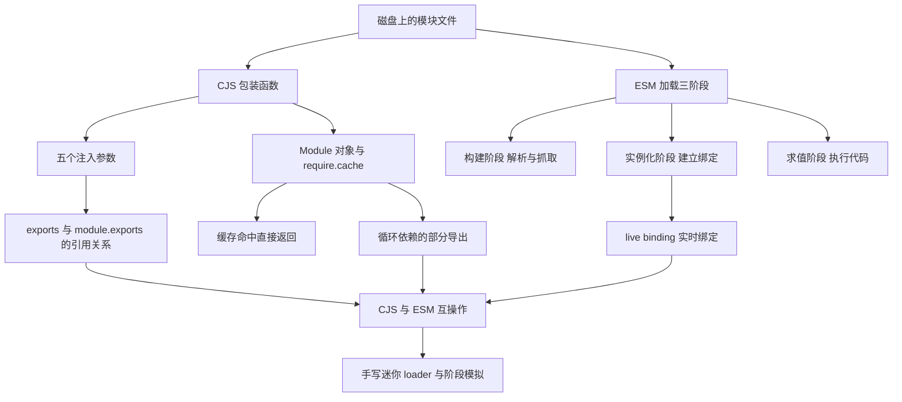
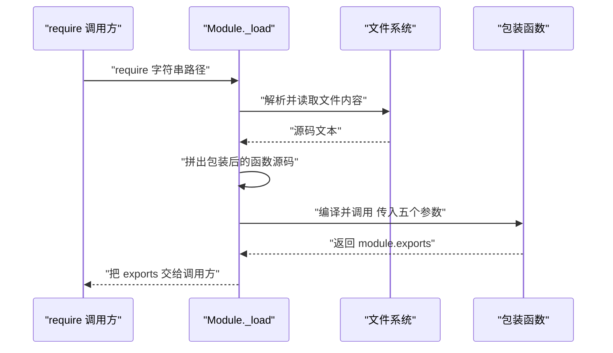
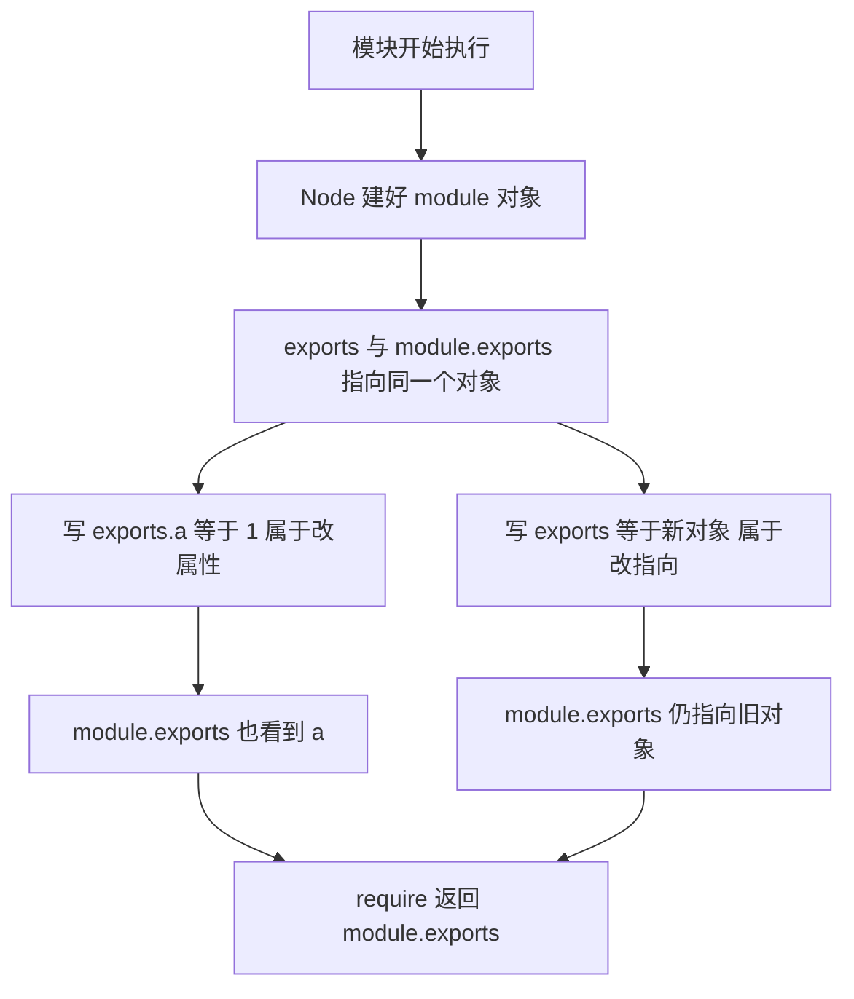
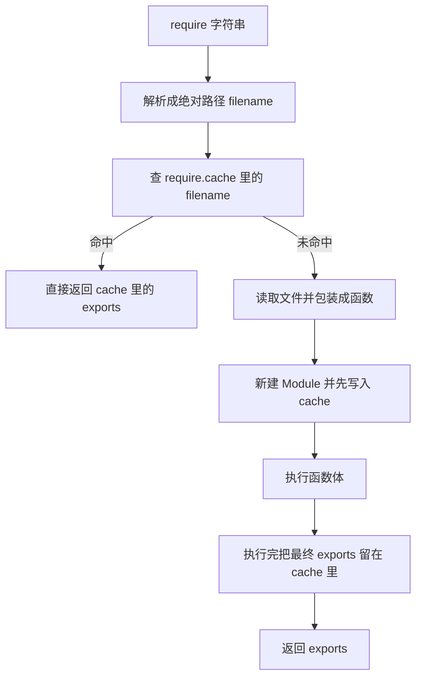
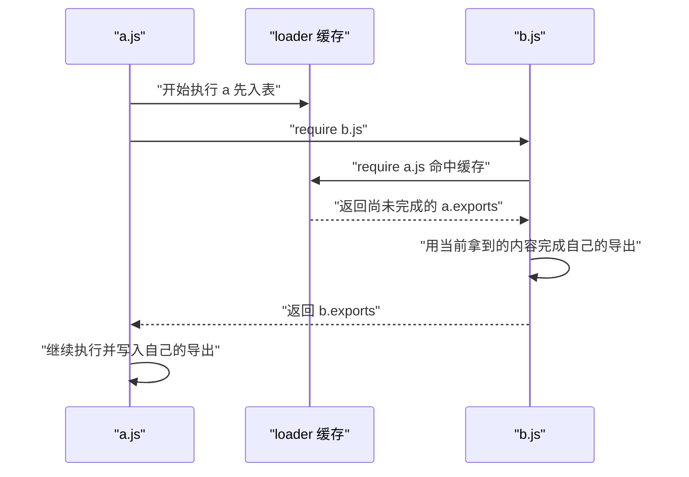
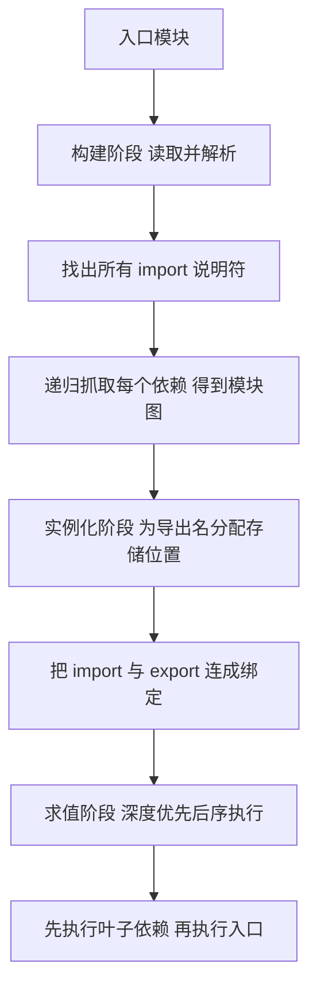
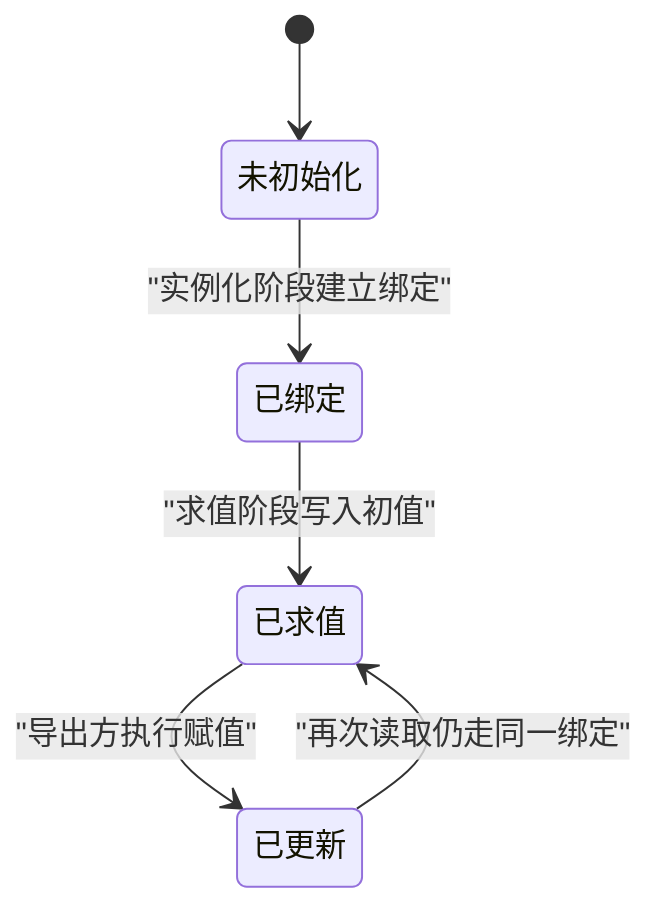
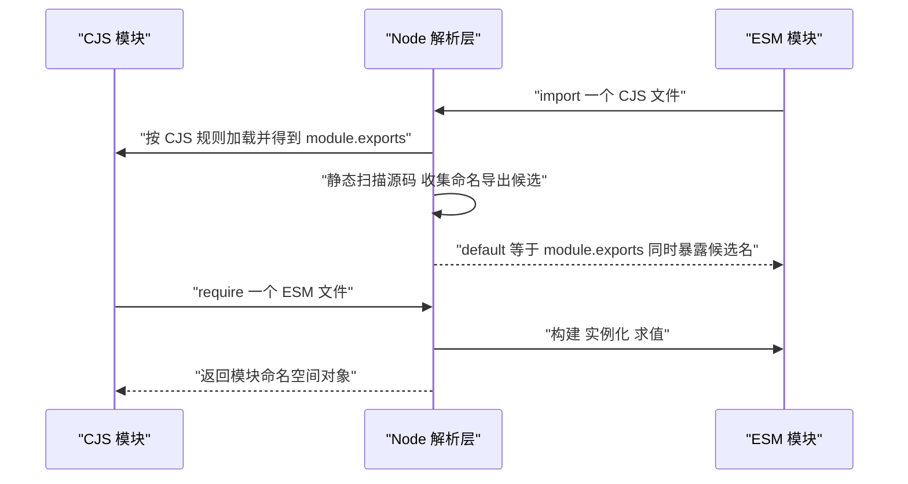
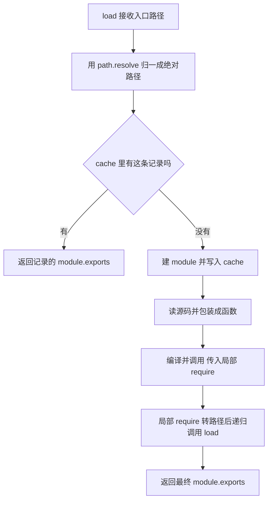
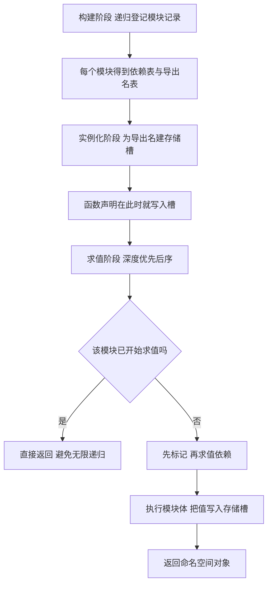

# Node.js 模块加载内部：CJS 包装、缓存与 ESM 加载阶段

!!! abstract "学完这一页你能"
    - 说清 require 把文件包成的固定函数有哪五个参数，并手写出等价的包装代码。
    - 判断 `module.exports` 与 `exports` 四种赋值组合各自的结果，指出哪一种会让 require 拿到空对象。
    - 用 require.cache 和「先入表、后执行」的顺序解释循环依赖里出现的半成品，并手写一个带缓存的迷你 loader 跑通断言。
    - 说出 ESM 的构建、实例化、求值三个阶段各自做的事，并说明 live binding 与 CJS 属性快照的差别。

## 0. 知识地图



读的顺序：先读第 1 到第 4 节，把 CJS 的包装、引用关系、缓存、循环依赖连成一条线。再读第 5 到第 7 节，把 ESM 的三阶段与互操作接上。第 8、9 节是动手写代码，用来检验前面每一条结论。图里的箭头是依赖方向，不是唯一的阅读路径。

## 1. require 的第一步：把文件包成函数

**先想一个问题**
你在 a.js 里写下 `const fs = require("node:fs")`。这个 require 是从哪里来的？a.js 里没有声明它，也没有 import。

**心智模型**

!!! tip "心智模型"
    一句话模型：Node 读到你写的文件文本，把整段文本括进一个固定签名的函数里再执行。
    日常类比：把一张纸条塞进有五个格子的信封，纸条上的字没变，但你能随手摸到那五个格子。
    类比不成立的地方：信封是物理的、格子提前固定；包装函数的五个参数是每次调用时新建的，其中 module 是同一份对象的引用。

!!! note "术语：CommonJS"
    CommonJS 是 Node.js 早期采用的模块规范，用 require 同步加载、用 module.exports 导出。例子：`const fs = require("node:fs")`。

**图解**



解读：
1. require 先把字符串路径解析成绝对路径，缓存键用的是这个绝对路径。
2. Node 读取文件文本，不删除你的注释和换行。
3. 包装器在文本前后各拼一段，得到一段新的可编译源码。
4. 编译得到函数，调用时按顺序传五个参数。
5. 函数体执行完，返回值被忽略，真正被拿走的是 module.exports。

**一步一步来**

**第 1 步：看 Node 拼出来的源码长什么样**

目的：先知道包装器给你加了什么，后面的疑问都能从这段文本回答。

```js
const Module = require('node:module'); // 引入 Module 构造函数

if (typeof Module.wrap === 'function') { // 这是内部 API 先做能力检测
  const wrapper = Module.wrap('const x = 1;\nmodule.exports = x;'); // 传入你的源码
  console.log(wrapper); // 打印拼好前后的固定代码
} else {
  console.log('本版本没有公开 Module.wrap，需核对官方文档：Module 内部 API 章节');
}
```

**这段代码在做什么**
- Module.wrap 接收源码字符串，返回前后各加了固定片段的新字符串。
- 前缀声明五个参数：exports、require、module、__filename、__dirname。
- 你的源码被原样放在中间，缩进和换行都不动。
- 后缀补上右括号和分号，让整段成为合法表达式。
- 前后缀里的换行只是为了让行号对应整齐，不影响执行。

运行结果（在 Node 20 上，具体换行以本机输出为准）：
```
(function (exports, require, module, __filename, __dirname) { const x = 1;
module.exports = x;
});
```

**第 2 步：自己用 vm 调用这个包装函数**

目的：把「编译、调用、传参」拆成独立动作做一遍。

```js
const vm = require('node:vm'); // 引入虚拟机模块

const source = 'module.exports = { a: 1, dir: __dirname, file: __filename };'; // 模拟一个模块文件
const wrapped = `(function (exports, require, module, __filename, __dirname) {\n${source}\n})`; // 手工包装

const fn = new vm.Script(wrapped, { filename: '/app/demo.js' }).runInThisContext(); // 取出函数 不执行

const module = { exports: {} }; // 新建 Module 对象
const exports = module.exports; // 让 exports 指向同一个对象
const fakeRequire = () => {}; // 本步不真的加载别的模块

fn(exports, fakeRequire, module, '/app/demo.js', '/app'); // 按顺序传五个参数
console.log(module.exports); // 看导出结果
```

**这段代码在做什么**
- vm.Script 把字符串编译成脚本，filename 只用于错误堆栈显示。
- runInThisContext 返回包装函数本身，此时函数体没有跑。
- 手工建 `{ exports: {} }`，这是 Module 对象的最小形态。
- exports 与 module.exports 指向同一个对象，这就是第 2 节要展开的引用关系。
- 传参顺序错一位，`__dirname` 就会拿到别的东西，顺序必须与包装签名一致。

运行结果：
```
{ a: 1, dir: '/app', file: '/app/demo.js' }
```

**动手验证**

依赖：仅 Node 20+ 内置模块，无第三方依赖。

```js
const vm = require('node:vm');
const assert = require('node:assert');

function loadCjs(source, filename) {
  const wrapped = `(function (exports, require, module, __filename, __dirname) {\n${source}\n})`;
  const fn = new vm.Script(wrapped, { filename }).runInThisContext();
  const module = { exports: {} };
  const exports = module.exports;
  fn(exports, () => {}, module, filename, '/app');
  return module.exports;
}

const out = loadCjs('exports.a = 1; exports.b = 2;', '/app/a.js');
assert.deepStrictEqual({ ...out }, { a: 1, b: 2 }); // 两个属性都在

const out2 = loadCjs('module.exports = __dirname;', '/app/b.js');
assert.strictEqual(out2, '/app'); // 第五个参数原样传进去了

const out3 = loadCjs('module.exports = () => 42;', '/app/c.js');
assert.strictEqual(out3(), 42); // 导出函数可以调用

console.log('ok: 包装函数的五个参数都按预期到达模块内部');
```

预期输出：
```
ok: 包装函数的五个参数都按预期到达模块内部
```

**常见坑**

| 现象 | 原因 | 怎么修 |
| --- | --- | --- |
| 在 ESM 文件里用 __dirname 报未定义 | ESM 没有包装函数，不注入这五个参数 | 用 `import.meta.url` 配 `fileURLToPath` 换算 |
| 访问 Module.wrap 得到 undefined | 该方法是内部实现，版本间可能移动 | 需核对官方文档：Module 的内部 API 章节 |
| 报错堆栈行号与文件对不上 | 前缀占了一行 | 编译时传 filename，靠它定位而不是手工数行 |

**小结**
- require 的第一件事是把源码文本包成固定签名的函数。
- 五个参数由 Node 在调用时传入，module 是保存状态的那一个。
- 用 vm 可以完整复刻这一步，方便做实验。

## 2. exports 与 module.exports 的引用关系

**先想一个问题**
你写了 `exports = { a: 1 }`，调用方 require 回来却是 `{}`。代码没报错，值却没出去。问题出在赋值的方向上。

**心智模型**

!!! tip "心智模型"
    一句话模型：exports 只是 module.exports 的初始别名，改属性两边都变，改指向只有 exports 变。
    日常类比：两个人手里各拿一张纸条，纸条写着同一个仓库地址；你在仓库里放箱子两边都看得到，你把其中一张纸条换成新地址，另一张还在旧仓库。
    类比不成立的地方：require 最后只读 module.exports 这张纸条，它被换掉后 exports 的指向就追不回来。

!!! note "术语：别名"
    别名指两个变量名指向同一个对象，通过任意一个名字改对象的属性，另一个名字都看得到。例子：`const a = {}; const b = a; a.x = 1;` 之后 `b.x` 是 1。

**图解**



解读：
1. Node 在调用包装函数前，把 exports 和 module.exports 指向同一个空对象。
2. 给 exports 加属性，是在这个共享对象上加，两边都看得见。
3. 给 exports 整体重新赋值，只是让 exports 这个局部变量指向别处。
4. module.exports 没有被碰，还指着最初的空对象。
5. require 最终读的是 module.exports，所以新对象丢了。

**一步一步来**

**第 1 步：对比改属性与改指向**

目的：用同一台机器跑两次，让差异可复现。

```js
const vm = require('node:vm'); // 复用第 1 节的思路

function run(source) { // 接收模块源码字符串
  const wrapped = `(function (exports, require, module, __filename, __dirname) {\n${source}\n})`;
  const fn = new vm.Script(wrapped).runInThisContext(); // 编译取出函数
  const module = { exports: {} }; // 新建 Module
  const exports = module.exports; // 建立初始别名
  fn(exports, () => {}, module, '/app/x.js', '/app'); // 执行模块
  return module.exports; // 返回真正被 require 读到的对象
}

console.log('A:', run('exports.a = 1;')); // 改属性
console.log('B:', run('exports = { a: 1 };')); // 改指向
```

**这段代码在做什么**
- 两次调用共用同一个 run 函数，唯一变量是模块源码。
- 第一段源码给 exports 加属性，共享对象被改动。
- 第二段源码让 exports 指向新对象，module.exports 没动。
- 返回值固定取 module.exports，所以能直接看到差异。

运行结果：
```
A: { a: 1 }
B: {}
```

**第 2 步：看清同时写两者时谁赢**

目的：确定「先加属性、再整体替换」的最终结果。

```js
const vm = require('node:vm');

function run(source) {
  const wrapped = `(function (exports, require, module, __filename, __dirname) {\n${source}\n})`;
  const fn = new vm.Script(wrapped).runInThisContext();
  const module = { exports: {} };
  fn(module.exports, () => {}, module, '/app/y.js', '/app'); // 只传 module.exports
  return module.exports;
}

console.log(run('exports.a = 1; module.exports = { b: 2 };')); // 先加属性 再整体替换
```

**这段代码在做什么**
- `exports.a = 1` 作用在旧对象上，旧对象多了一个属性 a。
- `module.exports = { b: 2 }` 把最后读到的对象换成新对象。
- 旧对象连同里面的 a 一起被丢弃，没有代码再引用它。
- require 返回的是新对象，所以只剩 b。

运行结果：
```
{ b: 2 }
```

**动手验证**

依赖：仅 Node 20+ 内置模块。

```js
const vm = require('node:vm');
const assert = require('node:assert');

function load(source) {
  const wrapped = `(function (exports, require, module, __filename, __dirname) {\n${source}\n})`;
  const fn = new vm.Script(wrapped).runInThisContext();
  const module = { exports: {} };
  const exports = module.exports;
  fn(exports, () => {}, module, '/app/m.js', '/app');
  return module.exports;
}

assert.deepStrictEqual({ ...load('exports.a = 1;') }, { a: 1 }); // 改属性生效
assert.deepStrictEqual({ ...load('exports = { a: 1 };') }, {}); // 改指向失效
assert.deepStrictEqual({ ...load('module.exports = { a: 1 };') }, { a: 1 }); // 整体替换生效
assert.strictEqual(load('exports.a = 1; module.exports = 5;'), 5); // 非对象导出也能拿到
assert.deepStrictEqual({ ...load('exports.a = 1; module.exports.b = 2;') }, { a: 1, b: 2 }); // 两种写法叠加

console.log('ok: exports 的五种写法结果均符合预期');
```

预期输出：
```
ok: exports 的五种写法结果均符合预期
```

**常见坑**

| 现象 | 原因 | 怎么修 |
| --- | --- | --- |
| require 得到空对象 | 写了 `exports = {...}` | 改成 `module.exports = {...}` |
| 导出的函数上丢了属性 | 先 `module.exports = fn` 又给 exports 加属性 | 改完后统一在 module.exports 上加 |
| 叠加使用时部分属性消失 | 后写的 module.exports 覆盖了旧对象 | 一个模块只选一种赋值方式 |

**小结**
- exports 是 module.exports 的初始别名，不是独立变量。
- 改属性共享，改指向分家。
- 一个模块里只保留一种赋值方式，就能避开这类问题。

## 3. require.cache：第二次 require 走了哪条路

**先想一个问题**
三个文件都 require 了 ./counter.js，counter 里的自增只跑了一次。是 Node 记住了结果，还是你的代码写错了？

**心智模型**

!!! tip "心智模型"
    一句话模型：require 先查一张以绝对路径为键的表，命中就返回表里的 exports，不读文件。
    日常类比：图书馆借书，管理员先看借出记录，同一本书已经在某人手里就把那个人指给你，不再去书库找第二本。
    类比不成立的地方：书可以同时借给多人，缓存里的模块对象是同一个引用，谁改谁都看见。

!!! note "术语：require.cache"
    require.cache 是一个普通对象，键是模块解析后的绝对路径，值是 Module 实例。例子：`require.cache["/app/counter.js"].exports`。

**图解**



解读：
1. 键是解析后的绝对路径，同一文件的不同写法会归到同一个键。
2. 命中就返回，读文件与编译这两步完全跳过。
3. 未命中时先建 Module，再把它放进缓存，注意顺序是先放再执行。
4. 这个顺序正是循环依赖能返回半成品的原因，下一节展开。
5. 执行结束把最终 exports 留在原记录上，之后所有 require 都拿到同一份对象。

**一步一步来**

**第 1 步：用真实 require 观察缓存键**

目的：确认索引长什么样、里面装的是什么。

```js
const key = require.resolve(__filename); // 解析当前文件 不做加载
console.log(key); // 打印绝对路径 这就是缓存键的格式
console.log(require.cache[key] ? 'cached' : 'miss'); // 当前文件是否已在表里
console.log(require.cache[key].exports === module.exports); // 是否同一个对象
```

**这段代码在做什么**
- require.resolve 只做路径解析，返回值就是缓存键的格式。
- 当前文件作为入口，早已在表里，所以打印 cached。
- 表里的 Module 实例的 exports 与当前 module.exports 是同一个对象引用。
- 这说明缓存存的不是副本，而是 Module 记录本身。

运行结果（路径随你运行的位置变化）：
```
/app/demo.js
cached
true
```

**第 2 步：手写带缓存的最小 loader**

目的：把「查表、建 Module、入表、执行、返回」五步写全。

```js
const fs = require('node:fs');
const path = require('node:path');
const vm = require('node:vm');

const cache = new Map(); // 用 Map 模拟 require.cache

function load(filename) {
  const absolute = path.resolve(filename); // 统一成绝对路径做键
  if (cache.has(absolute)) return cache.get(absolute).exports; // 命中直接返回

  const source = fs.readFileSync(absolute, 'utf8'); // 读源码
  const wrapped = `(function (exports, require, module, __filename, __dirname) {\n${source}\n})`;
  const fn = new vm.Script(wrapped, { filename: absolute }).runInThisContext();

  const module = { exports: {} }; // 新建 Module
  cache.set(absolute, module); // 先写入缓存 再执行
  fn(module.exports, () => {}, module, absolute, path.dirname(absolute)); // 执行
  return module.exports; // 返回最终导出
}

module.exports = { cache, load };
```

**这段代码在做什么**
- absolute 是唯一键，保证同一文件的两次写法落到同一条记录。
- cache 命中时直接返回 exports，跳过读文件与编译。
- cache.set 放在调用之前，这是循环依赖能拿到半成品的关键。
- 返回 module.exports 而不是 exports，避开第 2 节的坑。
- 本步的 require 参数是空函数，子模块解析留给下一节补上。

运行结果：无输出，需由下一小节的完整脚本驱动。

**动手验证**

依赖：仅 Node 20+ 内置模块。两个文件：loader.js 与 main.js，放在同一个目录里运行。

loader.js：
```js
const fs = require('node:fs');
const path = require('node:path');
const vm = require('node:vm');

const cache = new Map();

function load(filename) {
  const absolute = path.resolve(filename);
  if (cache.has(absolute)) return cache.get(absolute).exports; // 命中即返回

  const source = fs.readFileSync(absolute, 'utf8');
  const wrapped = `(function (exports, require, module, __filename, __dirname) {\n${source}\n})`;
  const fn = new vm.Script(wrapped, { filename: absolute }).runInThisContext();

  const module = { exports: {} };
  cache.set(absolute, module); // 先入表
  const localRequire = (spec) => {
    if (!spec.startsWith('.')) return require(spec); // 非相对说明符交给真 require
    return load(path.resolve(path.dirname(absolute), spec)); // 相对说明符自己解析
  };
  fn(module.exports, localRequire, module, absolute, path.dirname(absolute));
  return module.exports;
}

module.exports = { load, cache };
```

main.js：
```js
const fs = require('node:fs');
const assert = require('node:assert');
const { load, cache } = require('./loader.js');

fs.writeFileSync('counter.js', 'let n = 0; n += 1; module.exports = { n };');
fs.writeFileSync('a.js', 'const c = require("./counter.js"); module.exports = c.n + 1;');
fs.writeFileSync('b.js', 'const c = require("./counter.js"); module.exports = c.n + 2;');

const a1 = load('./a.js');
const b1 = load('./b.js');
const a2 = load('./a.js'); // 再取一次 走缓存

assert.strictEqual(a1, 2); // counter 的 n 是 1 加 1 得 2
assert.strictEqual(b1, 3); // 缓存命中 仍是 1 加 2 得 3
assert.strictEqual(a2, 2); // 不会因为重复加载变成 3
assert.strictEqual(cache.size, 3); // counter a b 各一条记录

console.log('a1 =', a1, 'b1 =', b1, 'a2 =', a2, 'cache.size =', cache.size);
console.log('ok: 缓存命中后 counter 不再重新执行');
```

预期输出：
```
a1 = 2 b1 = 3 a2 = 2 cache.size = 3
ok: 缓存命中后 counter 不再重新执行
```

**常见坑**

| 现象 | 原因 | 怎么修 |
| --- | --- | --- |
| 同一模块执行两次 | 两次用了不同写法或不同符号链接，键不同 | 用 require.resolve 取键，或对真实路径做归一 |
| 改了文件但结果没变 | 进程内已有缓存，不会重新读盘 | 开发时用 `node --watch` 或重启进程 |
| 单例状态被意外共享 | 缓存返回同一个对象引用 | 需要独立状态就导出工厂函数 |

**小结**
- require.cache 的键是解析后的绝对路径。
- 未命中时的顺序是「建 Module、入表、执行、写回」。
- 入表早于执行，这正是循环依赖问题的来源。

## 4. 循环依赖：为什么拿到的是半成品

**先想一个问题**
a.js 顶行 require b.js，b.js 顶行 require a.js。你运行 a.js，看到 b 拿到的 a 是空对象。两个文件都没写错，为什么？

**心智模型**

!!! tip "心智模型"
    一句话模型：require 返回的是当前那一刻 module.exports 指向的对象，模块没跑完就先返回了。
    日常类比：两个人同时寄包裹，A 说「我先寄给你」，B 收到的是还没装完的箱子；等 A 装完，B 手里那个箱子不会自动补上。
    类比不成立的地方：箱子装箱后不可变，CJS 的 exports 对象可以继续被加属性，拿到引用的代码之后再读能读到新属性。

!!! note "术语：部分导出"
    部分导出指模块执行到一半时被 require，调用方拿到的是此刻已经挂到 module.exports 上的属性集合。例子：a.js 只执行了第一行时，module.exports 仍是空对象。

**图解**



解读：
1. a 先被放入缓存，此时它的 exports 还是初始空对象。
2. a 执行到 require b，控制权交给 b。
3. b 反过来 require a，缓存命中，直接返回那个对象。
4. b 只能基于当前内容做判断，比如取 a.value 得到 undefined。
5. b 执行完把结果交给 a，a 继续跑完并往自己的 exports 上挂属性。
6. b 早已执行结束，它看到的是当时的取值，不是最终值。

**一步一步来**

**第 1 步：造一个最小循环依赖现场**

目的：用一个可运行例子看到 undefined 出现在哪一行。

文件 a.js：
```js
exports.done = false; // 先挂一个标记
const b = require('./b.js'); // 这里把控制权交给 b
console.log('in a, b.done =', b.done); // 看 b 眼中的 a 是什么
exports.done = true; // 最后才改成 true
console.log('a 执行结束');
```

文件 b.js：
```js
exports.done = false; // 同样先挂标记
const a = require('./a.js'); // 命中缓存 拿到半成品
console.log('in b, a.done =', a.done); // 此时 a 还没改成 true
exports.done = true;
console.log('b 执行结束');
```

**这段代码在做什么**
- a 第一行就把 done = false 挂到 exports 上，缓存里的对象已有这个属性。
- b 里读到的 a.done 是 false，因为 a 至少跑完了第一行。
- 如果把 a 的 `exports.done = false` 删掉，b 里读到的就是 undefined。
- b 最后把自己的 done 改成 true，a 拿到的 b 是完成品。
- 执行顺序决定谁看到谁，改一行顺序就改结果。

运行结果：
```
in b, a.done = false
b 执行结束
in a, b.done = true
a 执行结束
```

**第 2 步：用函数延迟读取换掉快照**

目的：给出工程上常用的绕法。

```js
// a.js：不导出值 只导出取值的函数
exports.getB = () => b; // 函数体在调用时才执行
const b = require('./b.js'); // 循环照旧发生 但此时不读 b 的属性
```

**这段代码在做什么**
- 导出的是一个函数，函数体在真正被调用时才执行。
- 循环依赖发生时，a 只是定义了函数，没有读取 b 的任何属性。
- b 执行完返回后，a 里的 b 变量被赋值，之后调用 getB 得到完整对象。
- 代价是调用方要记得调用函数，不能直接读属性。

运行结果：无输出，需配合调用方脚本查看，下一小节的完整脚本会给出断言。

**动手验证**

依赖：仅 Node 20+ 内置模块，单文件，虚拟文件表，不碰真实磁盘。

```js
const vm = require('node:vm');
const assert = require('node:assert');

const files = { // 虚拟文件表 路径到源码
  '/app/a.js': `
    exports.done = false;
    const b = require('./b.js');
    exports.bSawADone = b.aDone;
    exports.done = true;
  `,
  '/app/b.js': `
    const a = require('./a.js');
    exports.aDone = a.done;
    exports.done = true;
  `,
};

const cache = new Map(); // 虚拟缓存

function resolve(fromFile, spec) {
  const baseDir = fromFile.slice(0, fromFile.lastIndexOf('/')); // 取所在目录
  return new URL(spec, 'file://' + baseDir + '/').pathname; // 拼成绝对路径
}

function load(file) {
  if (cache.has(file)) return cache.get(file).exports; // 命中即返回半成品
  const module = { exports: {} };
  cache.set(file, module); // 先入表 再执行 这一步决定循环结果
  const wrapped = `(function (exports, require, module, __filename, __dirname) {\n${files[file]}\n})`;
  const fn = new vm.Script(wrapped, { filename: file }).runInThisContext();
  const req = (spec) => (spec.startsWith('.') ? load(resolve(file, spec)) : require(spec));
  fn(module.exports, req, module, file, file.slice(0, file.lastIndexOf('/')));
  return module.exports;
}

const a = load('/app/a.js');
assert.strictEqual(a.bSawADone, false); // b 看到的是 a 的半成品
assert.strictEqual(a.done, true); // a 自己最后改成 true
assert.strictEqual(cache.size, 2); // a 与 b 各一条

console.log('a.bSawADone =', a.bSawADone, 'a.done =', a.done);
console.log('ok: 循环依赖返回的是执行到那一刻的 exports');
```

预期输出：
```
a.bSawADone = false a.done = true
ok: 循环依赖返回的是执行到那一刻的 exports
```

**常见坑**

| 现象 | 原因 | 怎么修 |
| --- | --- | --- |
| 循环里读到 undefined | 被依赖模块还没执行到赋值那一行 | 把导出改成函数，调用时再读，或调整 require 位置 |
| 加了属性后对方看到旧值 | 对方在赋值前就把属性取出来存成了变量 | 让它每次读属性，而不是提前解构 |
| 两个文件互相 require 后都拿不到东西 | 两边都在顶层同步读对方 | 至少把一方的读取推迟到函数调用时 |

**小结**
- 循环依赖返回的是执行到那一刻的 module.exports。
- 半成品的属性集合取决于对方跑到了第几行。
- 把读取推迟到函数调用时，是改动量最小的绕法。

## 5. ESM 三阶段：解析、实例化、求值

**先想一个问题**
`import { a } from './x.js'` 写在文件第一行，x.js 里的 console.log 却不一定在下一行就打印。ESM 把加载分成了三段。

**心智模型**

!!! tip "心智模型"
    一句话模型：先把整张依赖图建好并连好线，再统一开始执行。
    日常类比：装修前先把所有房间的电路图铺好、电线接好，最后才逐个房间通电。
    类比不成立的地方：电路接通就立即有电，ESM 的实例化只建立绑定关系，代码一行都没跑。

!!! note "术语：ESM"
    ESM 是 ECMAScript Module 的缩写，用 import 与 export 声明依赖，加载分为构建、实例化、求值三个阶段。例子：`import { readFile } from "node:fs/promises"`。

**图解**



解读：
1. 构建阶段只做解析与抓取，产出模块记录与模块图。
2. import 说明符在这一步被解析成具体地址，解析失败在这一步报错。
3. 实例化阶段为每个导出名分配存储位置，代码没有执行。
4. 绑定把导入方的标识符连到导出方的存储位置，不是复制值。
5. 求值阶段按深度优先后序执行，依赖先于依赖者。
6. 因为绑定在求值前已连好，函数导出可以跨模块调用。

**一步一步来**

**第 1 步：看到求值是后序的**

目的：用打印顺序确认依赖先执行。

```js
// entry.mjs
import './leaf.mjs'; // 依赖先执行
console.log('entry'); // 入口最后打印
```

```js
// leaf.mjs
console.log('leaf'); // 叶子先打印
```

**这段代码在做什么**
- entry 的 import 声明在构建阶段被解析成 leaf 的地址。
- 实例化阶段为两个模块建立记录，此时没有任何打印。
- 求值阶段先沿图走到最深，执行 leaf，打印 leaf。
- 回到 entry 再执行，打印 entry。

运行结果：
```
leaf
entry
```

**第 2 步：看到绑定在求值前已连好**

目的：证明函数导出不受声明顺序影响。

```js
// main.mjs
import { shout } from './util.mjs'; // 绑定在实例化阶段建立
shout('hi'); // 调用时函数已经可用
```

```js
// util.mjs
export function shout(s) { // 函数声明会被提升
  console.log(s.toUpperCase());
}
```

**这段代码在做什么**
- 实例化阶段就把 shout 这个名字连到 util 模块的存储位置。
- 求值阶段先执行 util，函数声明提升并完成赋值。
- 控制权回到 main 时调用 shout，读到的是已经赋好的函数。
- 如果换成 `export const shout = ...`，同样靠后序求值保证先赋值。

运行结果：
```
HI
```

**动手验证**

依赖：Node 20+，用内置模块写临时文件再起子进程运行。

```js
const fs = require('node:fs');
const os = require('node:os');
const path = require('node:path');
const assert = require('node:assert');
const { spawnSync } = require('node:child_process');

const dir = fs.mkdtempSync(path.join(os.tmpdir(), 'esm-demo-')); // 临时目录
fs.writeFileSync(path.join(dir, 'package.json'), '{"type":"module"}'); // 让 js 走 ESM
fs.writeFileSync(path.join(dir, 'leaf.js'), 'console.log("leaf");');
fs.writeFileSync(path.join(dir, 'entry.js'), 'import "./leaf.js";\nconsole.log("entry");');

const r = spawnSync(process.execPath, [path.join(dir, 'entry.js')], { encoding: 'utf8' });
assert.strictEqual(r.status, 0, r.stderr); // 进程正常退出
assert.deepStrictEqual(r.stdout.trim().split('\n'), ['leaf', 'entry']); // 顺序固定

console.log('stdout =', JSON.stringify(r.stdout));
console.log('ok: 求值顺序是依赖先于入口');
```

预期输出：
```
stdout = "leaf\nentry\n"
ok: 求值顺序是依赖先于入口
```

**常见坑**

| 现象 | 原因 | 怎么修 |
| --- | --- | --- |
| 循环 import 时函数可用但变量是 undefined | 求值后序导致变量尚未初始化 | 把初始化逻辑放进函数，调用时再读 |
| import 路径漏写扩展名报错 | ESM 解析不做扩展名补全 | 显式写 .js 或 .mjs |
| 用 require 的写法写 import 报语法错 | 两套语法与阶段顺序都不同 | 需要条件加载时改用动态 import |

**小结**
- 三阶段是构建、实例化、求值，顺序固定。
- 构建管解析抓取，实例化管连绑定，求值管执行。
- 求值顺序是深度优先后序，依赖先于依赖者。

## 6. live binding：导入的值为什么跟着变

**先想一个问题**
你在 counter.mjs 里导出 count，另一个文件定时打印它。counter 自增后，打印值也跟着变。这与 CJS 里拿到属性的行为不同。

**心智模型**

!!! tip "心智模型"
    一句话模型：导入的名字是通往导出方存储位置的一条实时通道，不是一份拷贝。
    日常类比：你手里不是账单复印件，而是一个查询窗口；出纳那边一改账本，你再查就是新数字。
    类比不成立的地方：通道是只读的，导入方不能通过这条通道给导出方赋值，赋值会在解析阶段直接报语法错误。

!!! note "术语：live binding"
    live binding 指 ESM 导入与导出之间保持实时绑定，导出方更新后导入方读到新值。例子：导出模块里写 `export let n = 0` 之后执行 `n++`，导入方读到的 n 随之变化。

**图解**



解读：
1. 未初始化表示模块记录已建好，但导出位置还没有值。
2. 实例化阶段建立绑定，此时仍然没有值。
3. 求值阶段执行导出模块，把初值写入位置。
4. 导出模块后续的赋值会更新同一个位置。
5. 导入方任何时刻读取都经过这条绑定，所以能看到新值。

**一步一步来**

**第 1 步：对比 CJS 的属性快照与 ESM 的活绑定**

目的：同一段逻辑用两种模块各写一遍。

```js
// cjs-counter.js
let n = 0; // 模块内变量
module.exports = { n }; // 对象字面量 属性值是此刻的 0
setInterval(() => { n += 1; }, 10); // 之后只改局部变量
// 调用方拿到的 exports.n 永远是 0
```

```js
// esm-counter.mjs
export let n = 0; // 导出的是变量本身
setInterval(() => { n += 1; }, 10); // 改的就是导出的那个位置
// 导入方读到的 n 会随时间增长
```

**这段代码在做什么**
- CJS 的 `{ n }` 是对象字面量，属性值是读取那一刻的数字。
- 后续 `n += 1` 改的是模块内的局部变量，对象属性不受影响。
- ESM 的 `export let n` 导出的是变量绑定，不是变量在某刻的值。
- 导出模块里对 n 的赋值直接写到绑定指向的位置。
- 导入方读 n 时每次都走绑定，因此拿到当前值。

运行结果：无输出，需配合下方的定时读取脚本。

**第 2 步：写一段能观察到变化的读取代码**

目的：用可断言的输出证明值在变。

```js
// watcher.mjs
import { n } from './esm-counter.mjs'; // 建立只读绑定
setTimeout(() => {
  console.log('n after 35ms =', n); // 此时应大于 0
}, 35);
```

**这段代码在做什么**
- 导入语句建立绑定，不复制值。
- 35 毫秒后读 n，期间计时器已多次执行赋值。
- 打印结果由等待时长决定，所以断言要用范围而不是等号。

运行结果（一次真实运行，数值随调度变化）：
```
n after 35ms = 3
```

**动手验证**

依赖：Node 20+，写入临时目录后由子进程运行。

```js
const fs = require('node:fs');
const os = require('node:os');
const path = require('node:path');
const assert = require('node:assert');
const { spawnSync } = require('node:child_process');

const dir = fs.mkdtempSync(path.join(os.tmpdir(), 'live-'));
fs.writeFileSync(path.join(dir, 'package.json'), '{"type":"module"}');
fs.writeFileSync(path.join(dir, 'counter.js'), [
  'export let n = 0;',
  'export function bump() { n += 1; }',
].join('\n'));
fs.writeFileSync(path.join(dir, 'main.js'), [
  'import { n, bump } from "./counter.js";',
  'console.log("before =", n);',
  'bump(); bump();', // 两次自增写的是导出位置
  'console.log("after =", n);',
].join('\n'));

const r = spawnSync(process.execPath, [path.join(dir, 'main.js')], { encoding: 'utf8' });
assert.strictEqual(r.status, 0, r.stderr);
assert.match(r.stdout, /before = 0/); // 初始值
assert.match(r.stdout, /after = 2/); // 两次自增后读到新值

console.log(r.stdout.trim());
console.log('ok: 导入的 n 跟随导出方的赋值变化');
```

预期输出：
```
before = 0
after = 2
ok: 导入的 n 跟随导出方的赋值变化
```

**常见坑**

| 现象 | 原因 | 怎么修 |
| --- | --- | --- |
| 导入方给 n 赋值报语法错 | 导入绑定是只读的 | 导出方提供 setter 或 bump 函数 |
| 解构后值不再变化 | 解构把值取出来存到了新变量 | 直接用命名导入 |
| 把 n 当参数传进函数后看不到更新 | 参数是按值传递 | 传整个模块命名空间对象，或传取值函数 |

**小结**
- live binding 绑定的是存储位置，不是值。
- CJS 每次 require 拿到的是当时挂好的属性快照。
- 只读约束让导入方不能反向改导出方。

## 7. CJS 与 ESM 互操作：两个方向各走什么路

**先想一个问题**
老项目用 require，新代码用 import，两边要互相用。import 一个 CJS 文件时，命名导出从哪来？require 一个 ESM 文件时，又是什么规则？

**心智模型**

!!! tip "心智模型"
    一句话模型：import CJS 时先把 module.exports 当默认导出，再靠静态扫描猜出命名导出；require ESM 时受版本开关限制。
    日常类比：两种插座之间的转换头，一个方向是现成的，另一个方向要看你的插座型号。
    类比不成立的地方：转换头不会猜，命名导出的判断是静态分析源码，扫描不到的名字真的不会出现。

!!! note "术语：命名导出探测"
    命名导出探测指 Node 在 import 一个 CJS 模块时，用静态分析扫描源码里的赋值模式，推断出可当作命名导出的名字。例子：`exports.a = 1` 会被识别出 a。

!!! note "术语：require ESM"
    指在 CJS 代码里对 ESM 调用 require。该能力在较新的 Node 版本中默认可用，具体从哪个小版本开始、有哪些限制，需核对官方文档：Modules 章节里互操作与 require ESM 的小节。

**图解**



解读：
1. import CJS 时，加载过程仍然是 CJS 的读文件、包装、执行。
2. default 一定等于最终的 module.exports。
3. 命名导出依赖静态扫描，扫描不到的模式不会出现该名字。
4. require ESM 需要该 Node 版本开启对应能力，并在同步上下文里使用。
5. require ESM 返回的是模块命名空间对象，取值仍受 live binding 影响。
6. 两个方向的返回物不同，写代码前先确认自己站在哪一侧。

**一步一步来**

**第 1 步：观察 import CJS 的默认导出与命名导出**

目的：把扫描得到与扫描不到两种情况放在一起看。

```js
// legacy.cjs
exports.a = 1; // 这种赋值会被扫描到
module.exports.b = 2; // 这种也会
Object.assign(module.exports, { c: 3 }); // 这种扫描不到名字 c
```

```js
// modern.mjs
import def from './legacy.cjs'; // 默认导出等于 module.exports
import { a, b } from './legacy.cjs'; // 扫描到的名字可以直接用
console.log(def.a, a, b, def.c); // c 只能从默认导出上取
```

**这段代码在做什么**
- legacy.cjs 用两种写法挂属性，静态分析都能识别。
- Object.assign 属于动态写法，扫描器识别不出属性名。
- 直接 `import { c }` 会报错，语法上找不到这个导出。
- 通过默认导出对象访问 def.c 可行，因为对象在运行时确实有 c。
- 判断某个名字能不能命名导入，看它的赋值语句是否可静态识别。

运行结果：
```
1 1 2 3
```

**第 2 步：在 CJS 里 require 一个 ESM 文件**

目的：看清返回物的形状。

```js
// probe.cjs
const ns = require('./modern-esm.mjs'); // 需要该 Node 版本支持
console.log(Object.keys(ns)); // 命名空间对象上有哪些名字
console.log(ns.default); // 默认导出挂在 default 属性上
```

```js
// modern-esm.mjs
export const value = 7;
export default 42;
```

**这段代码在做什么**
- require 返回的是模块命名空间对象，不是 exports 的别名。
- 命名导出以属性形式出现，默认导出挂在 default 属性上。
- 该能力在旧版本会抛错，需核对官方文档确认可用范围。
- 在同步的 CJS 顶层里 require 一个带顶层 await 的 ESM 会报错，具体限制需核对官方文档。

运行结果（在支持该能力的版本上）：
```
[ 'default', 'value' ]
42
```

**动手验证**

依赖：Node 20+，写入临时目录后由子进程运行。若本机版本不支持 require ESM，脚本会打印 skip 而不是失败。

```js
const fs = require('node:fs');
const os = require('node:os');
const path = require('node:path');
const assert = require('node:assert');
const { spawnSync } = require('node:child_process');

const dir = fs.mkdtempSync(path.join(os.tmpdir(), 'interop-'));
fs.writeFileSync(path.join(dir, 'package.json'), '{"type":"commonjs"}');
fs.writeFileSync(path.join(dir, 'legacy.cjs'), [
  'exports.a = 1;',
  'module.exports.b = 2;',
].join('\n'));
fs.writeFileSync(path.join(dir, 'esm.mjs'), [
  'export const value = 7;',
  'export default 42;',
].join('\n'));
fs.writeFileSync(path.join(dir, 'main.mjs'), [
  'import def, { a, b } from "./legacy.cjs";', // 命名导出来自静态扫描
  'console.log("a =", a, "b =", b, "def.b =", def.b);',
].join('\n'));
fs.writeFileSync(path.join(dir, 'probe.cjs'), [
  'try {',
  '  const ns = require("./esm.mjs");',
  '  console.log("keys =", Object.keys(ns).join(","), "default =", ns.default);',
  '} catch (e) {',
  '  console.log("skip:", e.code || e.message);', // 不支持该能力的版本走这里
  '}',
].join('\n'));

const m = spawnSync(process.execPath, [path.join(dir, 'main.mjs')], { encoding: 'utf8' });
assert.strictEqual(m.status, 0, m.stderr);
assert.match(m.stdout, /a = 1 b = 2 def\.b = 2/); // 命名导出与默认导出都对

const p = spawnSync(process.execPath, [path.join(dir, 'probe.cjs')], { encoding: 'utf8' });
assert.strictEqual(p.status, 0, p.stderr); // 无论走哪个分支都不能崩

console.log(m.stdout.trim());
console.log(p.stdout.trim());
console.log('ok: import CJS 的两种取值方式都成立');
```

预期输出：第一行固定，第二行取决于版本打印 keys 还是 skip。

**常见坑**

| 现象 | 原因 | 怎么修 |
| --- | --- | --- |
| import 某个名字报没有该导出 | 静态扫描识别不到动态赋值 | 改用默认导入，再从对象上取属性 |
| require ESM 报错 | 所用 Node 版本未开启该能力 | 需核对官方文档：该版本是否默认开启 |
| require ESM 时报顶层 await 相关错 | ESM 里有顶层 await，同步 require 无法等待 | 改成动态 import 并在异步上下文里等待 |

**小结**
- import CJS：默认导出等于 module.exports，命名导出靠静态扫描。
- require ESM：返回命名空间对象，可用范围需核对官方文档。
- 动态赋值模式的命名导出容易漏，优先用可静态识别的写法。

## 8. 手写迷你 CJS loader：把包装、缓存、循环依赖串起来

**先想一个问题**
前面每节都用了 vm 与自建缓存，能不能合成一个能跑多文件、支持相对路径、能看出循环依赖的 loader？

**心智模型**

!!! tip "心智模型"
    一句话模型：迷你 loader 是 require 的骨架，差别只是没有内建模块、没有 Node 的路径解析细节。
    日常类比：模型飞机的零件与真机一一对应，装一遍就知道每个零件管哪块。
    类比不成立的地方：模型不处理真实文件系统的权限、符号链接、扩展名补全，这些在真 require 里都有代码。

!!! note "术语：迷你 loader"
    迷你 loader 指用几十行代码复刻 require 的加载流程，用于实验和单测。例子：下一小节的 load 函数只做五件事，却涵盖包装、缓存、循环依赖。

**图解**



解读：
1. 入口路径先归一成绝对路径，作为缓存键。
2. 查表命中直接返回，不再读盘。
3. 未命中时先建 module 并写入表，再编译执行。
4. 局部 require 负责把相对路径转成绝对路径，然后递归。
5. 递归返回后，父模块继续执行剩下的代码。

**一步一步来**

**第 1 步：写虚拟文件系统与解析函数**

目的：不碰真实磁盘，让实验可复现。

```js
const files = new Map(); // 虚拟文件 路径到源码

function addFile(pathname, source) { // 注册一个虚拟文件
  files.set(pathname, source);
}

function resolvePath(fromFile, spec) { // 把相对说明符变成绝对路径
  if (!spec.startsWith('.')) return spec; // 非相对说明符原样返回
  const baseDir = fromFile.slice(0, fromFile.lastIndexOf('/')); // 取所在目录
  const parts = (baseDir + '/' + spec).split('/'); // 拼接后按斜杠拆开
  const out = []; // 用栈处理上级目录
  for (const p of parts) {
    if (p === '' || p === '.') continue; // 空段与当前目录跳过
    if (p === '..') out.pop(); // 退回上一级
    else out.push(p);
  }
  return '/' + out.join('/'); // 还原成绝对路径
}
```

**这段代码在做什么**
- files 用 Map 保存路径到源码的映射，避开真实 IO。
- 相对说明符按 fromFile 所在目录拼接。
- 空段与 `.` 直接跳过，`..` 弹出上一段。
- 非相对说明符原样返回，交给外层处理。
- 返回的字符串格式与缓存键保持一致，避免同文件两条记录。

运行结果：无输出，由下一步驱动。

**第 2 步：写 load 与局部 require**

目的：复刻缓存与循环依赖的行为。

```js
const vm = require('node:vm');
const cache = new Map(); // 路径到 module 对象

function load(file) {
  if (cache.has(file)) return cache.get(file).exports; // 命中 返回半成品或成品
  const source = files.get(file); // 取虚拟源码
  if (source === undefined) throw new Error('module not found: ' + file);

  const module = { exports: {} }; // 建 Module
  cache.set(file, module); // 先入表 再执行

  const wrapped = `(function (exports, require, module, __filename, __dirname) {\n${source}\n})`;
  const fn = new vm.Script(wrapped, { filename: file }).runInThisContext(); // 编译

  const localRequire = (spec) => { // 模块私有的 require
    if (!spec.startsWith('.')) return require(spec); // 交给真 require
    return load(resolvePath(file, spec)); // 递归加载
  };

  fn(module.exports, localRequire, module, file, file.slice(0, file.lastIndexOf('/'))); // 执行
  return module.exports; // 返回最终导出
}
```

**这段代码在做什么**
- cache 命中分支既服务普通重复加载，也服务循环依赖。
- cache.set 在 fn 之前，保证循环时对方能查到半成品。
- localRequire 把相对说明符交给 resolvePath，绝对说明符交给真 require。
- 五个参数按顺序传入，与第 1 节的包装签名一致。
- 返回值取 module.exports，与第 2 节结论一致。

运行结果：无输出，由动手验证驱动。

**动手验证**

依赖：仅 Node 20+ 内置模块，单文件，虚拟文件系统，不写真实磁盘。

```js
const vm = require('node:vm');
const assert = require('node:assert');

const files = new Map();
const cache = new Map();

function resolvePath(fromFile, spec) {
  if (!spec.startsWith('.')) return spec;
  const baseDir = fromFile.slice(0, fromFile.lastIndexOf('/'));
  const out = [];
  for (const p of (baseDir + '/' + spec).split('/')) {
    if (p === '' || p === '.') continue;
    if (p === '..') out.pop();
    else out.push(p);
  }
  return '/' + out.join('/');
}

function load(file) {
  if (cache.has(file)) return cache.get(file).exports; // 缓存优先
  const source = files.get(file);
  if (source === undefined) throw new Error('module not found: ' + file);
  const module = { exports: {} };
  cache.set(file, module); // 先入表
  const wrapped = `(function (exports, require, module, __filename, __dirname) {\n${source}\n})`;
  const fn = new vm.Script(wrapped, { filename: file }).runInThisContext();
  const localRequire = (spec) => (spec.startsWith('.') ? load(resolvePath(file, spec)) : require(spec));
  fn(module.exports, localRequire, module, file, file.slice(0, file.lastIndexOf('/')));
  return module.exports;
}

files.set('/app/counter.js', 'let n = 0; n += 1; module.exports = { n };');
files.set('/app/a.js', 'const c = require("./counter.js"); module.exports = c.n + 1;');
files.set('/app/b.js', 'const c = require("./counter.js"); module.exports = c.n + 2;');
files.set('/app/cyc-a.js', 'exports.step = 1; const b = require("./cyc-b.js"); exports.sawB = b.ready; exports.step = 2;');
files.set('/app/cyc-b.js', 'const a = require("./cyc-a.js"); exports.sawA = a.step; exports.ready = true;');

assert.strictEqual(load('/app/a.js'), 2); // counter 执行一次 得到 1
assert.strictEqual(load('/app/b.js'), 3); // 缓存命中 仍是 1
assert.strictEqual(load('/app/a.js'), 2); // 再取一次结果不变
assert.strictEqual(load('/app/cyc-a.js').sawB, true); // a 拿到完整的 b
assert.strictEqual(load('/app/cyc-b.js').sawA, 1); // b 拿到半成品 a
assert.strictEqual(cache.size, 5); // 五个文件各一条记录

console.log('a =', load('/app/a.js'), 'b =', load('/app/b.js'), 'cache.size =', cache.size);
console.log('cyc-b.sawA =', load('/app/cyc-b.js').sawA, 'cyc-a.sawB =', load('/app/cyc-a.js').sawB);
console.log('ok: 缓存、部分导出与相对路径解析均符合预期');
```

预期输出：
```
a = 2 b = 3 cache.size = 5
cyc-b.sawA = 1 cyc-a.sawB = true
ok: 缓存、部分导出与相对路径解析均符合预期
```

**常见坑**

| 现象 | 原因 | 怎么修 |
| --- | --- | --- |
| 迷你 loader 找不到文件 | 缓存键与 files 的键格式不一致 | 两边都用同一个 resolvePath 产出键 |
| 循环依赖返回 undefined | 忘了在执行前写 cache | 把 cache.set 移到编译执行之前 |
| 相对路径解析出错 | 直接字符串拼接没有处理上级目录 | 按斜杠拆段并用栈处理 |

**小结**
- 迷你 loader 的骨架是查表、建 Module、入表、包装、执行、返回。
- 入表时机决定循环依赖看到的内容。
- 相对路径解析可以独立成纯函数，方便单测。

## 9. 手写 ESM 加载阶段模拟：构建、实例化、求值

**先想一个问题**
你知道了三阶段的顺序，怎么把它变成能跑的实验，亲眼看到「绑定先建、值后写」这一步？

**心智模型**

!!! tip "心智模型"
    一句话模型：用一个遍历把模块图分层，第一遍登记记录，第二遍建绑定位置，第三遍执行并写值。
    日常类比：先列名单，再按座位表把人安排到座位上，最后才开始发言。
    类比不成立的地方：模拟里用对象存值，真 ESM 用的是不可见的存储位置，并且读取未初始化的 const 会抛错。

!!! note "术语：绑定位置"
    绑定位置指实例化阶段为每个导出名准备的存储槽，导入方通过它读值。例子：`rec.slot.set("n", { value: undefined, initialized: false })`。

**图解**



解读：
1. 构建阶段用一次深度优先遍历，把模块路径与依赖表登记好。
2. 每个模块拿到一个记录对象，里面有依赖表和导出名表。
3. 实例化阶段为每个导出名建存储槽，此时值都是未初始化。
4. 函数声明在实例化阶段就完成初始化，这是循环 import 里函数能用的原因。
5. 求值阶段先标记状态，再递归依赖，标记必须在递归之前。
6. 模块体执行完把值写进存储槽，命名空间对象通过 getter 读取当前值。

**一步一步来**

**第 1 步：构建阶段与实例化阶段**

目的：先得到模块记录与存储槽。

```js
const graph = new Map(); // 路径到模块记录

function define(file, deps, exportNames, body, hoisted = {}) { // 声明一个模块
  graph.set(file, { file, deps, exportNames, body, hoisted, slot: new Map(), done: false });
}

function build(start) { // 构建阶段
  const seen = new Set();
  const walk = (f) => {
    if (seen.has(f)) return; // 已登记过就返回
    seen.add(f);
    const rec = graph.get(f);
    if (!rec) throw new Error('module not found: ' + f); // 解析失败在构建期报错
    for (const d of rec.deps) walk(d); // 递归依赖
  };
  walk(start);
}

function instantiate() { // 实例化阶段
  for (const rec of graph.values()) {
    for (const name of rec.exportNames) {
      const hasHoisted = Object.prototype.hasOwnProperty.call(rec.hoisted, name);
      rec.slot.set(name, { value: hasHoisted ? rec.hoisted[name] : undefined, initialized: hasHoisted });
    }
  }
}
```

**这段代码在做什么**
- define 只登记信息，不执行任何模块体，对应构建阶段的输入。
- build 用深度优先遍历确认依赖都存在，缺模块在这一步报错。
- instantiate 为每个导出名建一个带 initialized 标记的存储槽。
- 函数声明用 hoisted 参数提前写入槽，并标记为已初始化。
- 此阶段仍没有执行任何模块体，普通变量保持未初始化。

运行结果：无输出，由下一步驱动。

**第 2 步：求值阶段与只读命名空间**

目的：让依赖先写值，再写依赖者，并让读取走绑定。

```js
const order = []; // 记录求值顺序 方便断言

function namespace(rec) { // 构造只读命名空间
  const ns = {};
  for (const name of rec.slot.keys()) {
    Object.defineProperty(ns, name, {
      enumerable: true,
      get() {
        const s = rec.slot.get(name);
        if (!s.initialized) throw new ReferenceError('cannot access ' + name + ' before initialization');
        return s.value; // 每次都读当前值 这就是 live binding
      },
    });
  }
  return ns;
}

function evaluate(file) {
  const rec = graph.get(file);
  if (rec.done) return rec.ns; // 已开始求值 直接返回 防循环
  rec.done = true; // 先标记 再递归
  for (const d of rec.deps) evaluate(d); // 后序 依赖先求值
  const store = {
    set(name, v) { const s = rec.slot.get(name); s.value = v; s.initialized = true; }, // 导出写入口
  };
  const imported = {}; // 依赖的命名空间
  for (const d of rec.deps) imported[d] = namespace(graph.get(d));
  rec.body(store, imported); // 执行模块体
  rec.ns = namespace(rec);
  order.push(file);
  return rec.ns;
}
```

**这段代码在做什么**
- namespace 用 getter 构造对象，读属性时才去槽里取值。
- 未初始化的槽读取会抛 ReferenceError，对应真 ESM 的暂时性死区行为。
- evaluate 在递归依赖之前先标记 done，循环 import 不会无限递归。
- store.set 同时写值并标记 initialized，相当于完成了导出初始化。
- imported 里放的是各依赖的命名空间对象，模块体通过它读取依赖。

运行结果：无输出，由动手验证驱动。

**动手验证**

依赖：仅 Node 20+ 内置模块，单文件。

```js
const assert = require('node:assert');

const graph = new Map();
const order = [];

function define(file, deps, exportNames, body, hoisted = {}) {
  graph.set(file, { file, deps, exportNames, body, hoisted, slot: new Map(), done: false });
}

function build(start) {
  const seen = new Set();
  const walk = (f) => {
    if (seen.has(f)) return;
    seen.add(f);
    const rec = graph.get(f);
    if (!rec) throw new Error('module not found: ' + f);
    for (const d of rec.deps) walk(d);
  };
  walk(start);
}

function instantiate() {
  for (const rec of graph.values()) {
    for (const name of rec.exportNames) {
      const hasHoisted = Object.prototype.hasOwnProperty.call(rec.hoisted, name);
      rec.slot.set(name, { value: hasHoisted ? rec.hoisted[name] : undefined, initialized: hasHoisted });
    }
  }
}

function namespace(rec) {
  const ns = {};
  for (const name of rec.slot.keys()) {
    Object.defineProperty(ns, name, {
      enumerable: true,
      get() {
        const s = rec.slot.get(name);
        if (!s.initialized) throw new ReferenceError('cannot access ' + name + ' before initialization');
        return s.value;
      },
    });
  }
  return ns;
}

function evaluate(file) {
  const rec = graph.get(file);
  if (rec.done) return rec.ns;
  rec.done = true;
  for (const d of rec.deps) evaluate(d);
  const store = { set(name, v) { const s = rec.slot.get(name); s.value = v; s.initialized = true; } };
  const imported = {};
  for (const d of rec.deps) imported[d] = namespace(graph.get(d));
  rec.body(store, imported);
  rec.ns = namespace(rec);
  order.push(file);
  return rec.ns;
}

// 菱形依赖 d 被 b 与 c 共用
define('/app/d.js', [], ['v'], (store) => store.set('v', 1));
define('/app/b.js', ['/app/d.js'], ['v'], (store, imp) => store.set('v', imp['/app/d.js'].v + 1));
define('/app/c.js', ['/app/d.js'], ['v'], (store, imp) => store.set('v', imp['/app/d.js'].v + 2));
define('/app/a.js', ['/app/b.js', '/app/c.js'], ['sum'],
  (store, imp) => store.set('sum', imp['/app/b.js'].v + imp['/app/c.js'].v));

// 活绑定 导出方改了值 导入方立刻读到
define('/app/counter.js', [], ['n', 'bump'], (store) => {
  let n = 0;
  store.set('n', n);
  store.set('bump', () => { n += 1; store.set('n', n); });
});
define('/app/use.js', ['/app/counter.js'], ['after'],
  (store, imp) => { imp['/app/counter.js'].bump(); store.set('after', imp['/app/counter.js'].n); });

// 循环 import 里读未初始化变量 抛 ReferenceError
define('/app/x.js', ['/app/y.js'], ['a'], (store) => store.set('a', 1));
define('/app/y.js', ['/app/x.js'], ['b'], (store, imp) => store.set('b', imp['/app/x.js'].a + 1));

build('/app/a.js');
build('/app/use.js');
build('/app/x.js');
instantiate();

const a = evaluate('/app/a.js');
assert.strictEqual(a.sum, 5); // 2 加 3
assert.strictEqual(order.filter((f) => f === '/app/d.js').length, 1); // d 只求值一次
assert.deepStrictEqual(order, ['/app/d.js', '/app/b.js', '/app/c.js', '/app/a.js']); // 后序顺序

const u = evaluate('/app/use.js');
assert.strictEqual(u.after, 1); // 活绑定读到自增后的值

assert.throws(() => evaluate('/app/x.js'), ReferenceError); // 循环中读未初始化导出

console.log('order =', order.join(' -> '));
console.log('a.sum =', a.sum, 'use.after =', u.after);
console.log('ok: 三阶段、活绑定与循环 import 的报错均符合预期');
```

预期输出：
```
order = /app/d.js -> /app/b.js -> /app/c.js -> /app/a.js
a.sum = 5 use.after = 1
ok: 三阶段、活绑定与循环 import 的报错均符合预期
```

**常见坑**

| 现象 | 原因 | 怎么修 |
| --- | --- | --- |
| 依赖被求值两次 | 忘了在递归前后标记状态 | 进入 evaluate 就写 done 标记 |
| 读导出得到 undefined 而不是报错 | 槽缺少 initialized 标记 | 给槽加 initialized，未初始化时抛 ReferenceError |
| 循环 import 里函数能用、变量报错 | 函数声明在实例化阶段已初始化 | 需要跨循环使用时导出函数而不是变量 |

**小结**
- 构建登记记录，实例化建槽，求值写值，三个阶段分开做。
- 命名空间用 getter 构造，读到的永远是槽里的当前值。
- 标记状态要放在递归之前，否则循环 import 会栈溢出。

## 综合对比

| 维度 | CJS | ESM |
| --- | --- | --- |
| 声明方式 | require 与 module.exports | import 与 export |
| 加载时机 | 同步执行到 require 那一行才加载 | 构建阶段先把整张图抓完 |
| 缓存键 | 解析后的绝对路径 | 模块的解析地址 |
| 导出物 | module.exports 指向的对象 | 模块命名空间对象 |
| 绑定性质 | 属性快照，后续赋值不影响已取出的值 | live binding，读的是当前位置 |
| 循环依赖读到什么 | 未完成的 exports，缺的属性是 undefined | 读未初始化导出抛 ReferenceError |
| 循环中的函数导出 | 需要模块先跑到赋值那一行 | 函数声明在实例化阶段已初始化 |
| 顶层 await | 不支持 | 支持，求值阶段可以暂停 |
| __dirname | 包装函数注入的参数 | 不存在，用 import.meta.url 换算 |
| 动态说明符 | 直接传变量给 require | import 是静态的，动态用 import 表达式 |
| 扩展名 | 可省略 .js | 需要写全 |
| 报错时机 | 执行到那一行才报 | 构建阶段就能报解析错误 |

## 应用与行业实践

### 应用场景地图

| 场景 | 用到本页哪个知识点 | 典型技术选型 | 注意事项 |
| --- | --- | --- | --- |
| 后台管理的万行表格首屏 | require 的同步包装与执行顺序、require.cache | webpack 或 Vite 打包 + 路由级动态 import | 打包产物把 require 折叠成静态引用，缓存命中路径与源码不一致，定位耗时靠 source map 对齐 |
| 低端安卓的首屏加载 | ESM 三阶段与 CJS 整文件求值 | `<script type="module">` + 代码分割 | CJS 依赖在求值前无法被 tree-shake，先用预打包转成 ESM 再谈按需加载 |
| 多人协作白板 | 循环依赖与「先入表、后执行」 | Node 服务端 + 命令处理模块 | 顶层读取对方导出拿到的是半成品，改成函数内读取 |
| 外部团队交付的报表插件 | require.cache 删除与重新包装 | Node.js + `delete require.cache[abs]` | 只删入口不够，子模块仍指向旧实例，键要用绝对路径 |
| SSE 或 SSR 渲染服务 | 模块单例与每请求状态 | Node.js + AsyncLocalStorage | 模块单例在进程内共享，不要当请求上下文用 |
| 命令行工具的冷启动 | 包装函数的逐文件同步 IO 与 require 链 | Node.js + 延迟 require 或预编译 bundle | 顶层 require 会拉入整条依赖链，测量用 `node --cpu-prof` |
| 单测里 mock 第三方模块 | exports 与 module.exports 的引用关系、缓存 | Jest 或 Vitest 的模块注册表 | 缓存未清会让上一用例的状态带到下一用例 |
| Monorepo 里的公共组件库 | CJS 与 ESM 互操作的 default 形状 | pnpm workspace + 双产物 | `exports` 字段与 `type` 字段决定走哪条路，两边拿到的导出形状不同 |

### 三个场景拆解

#### 场景 1：外部团队交付的报表插件热重载

**业务背景**：运营后台的报表插件由多个团队分头交付，改一行配置就要重启进程，重启会打断正在跑的导出任务。插件目录按文件数算在几十个量级，启动耗时随插件数量增长。

**怎么用本页知识解决**：插件就是普通 CJS 文件，require 走「包装、入表、执行」三步，重载等于删掉缓存键再 require 一次。

```js
const path = require('node:path');

function reload(absPath) {
  const key = path.resolve(absPath);      // require.cache 的键是解析后的绝对路径
  const old = require.cache[key];         // 取出旧记录，留一份旧导出做对比
  const oldExports = old && old.exports;
  delete require.cache[key];              // 删表：下次 require 会重新包装并执行
  const mod = require(key);               // 重新入表、再执行，顺序仍是先入表后执行
  return { exports: mod.exports, oldExports };
}

module.exports = { reload };
```

- 键必须是 `path.resolve` 的结果，手写相对路径删不掉记录。
- 只删入口文件时，入口内部 require 的子模块仍在表里，它们不会重新执行。
- 子模块也要重载时，按依赖顺序从叶子往根删，或者删键前缀匹配的记录。
- 返回值取 `module.exports` 而不是 `exports`，避免拿到空对象。
- 旧实例被业务闭包引用时不会因为删表被回收，需要业务侧主动释放。

**怎么度量收益**：看单次重载耗时和堆占用。用 `process.hrtime.bigint()` 在删表前与 require 后各打一个点算差值；用 `process.memoryUsage().heapUsed` 在重载 20 次前后各取一次；用 `node --cpu-prof` 看重新执行模块函数占了多少采样帧。

**什么时候不该用**：
- 插件持有数据库连接池、定时器或文件句柄，删表不会关闭它们，重载会累积句柄。
- 插件是 `.mjs` 或所在包设了 `type: "module"`，`require.cache` 里没有它的记录，删表无效。
- 插件路径被打包器静态分析进产物，运行时不存在独立文件，重载脚本找不到目标。

#### 场景 2：SSR 渲染服务的每请求状态隔离

**业务背景**：渲染服务把一个模块级变量当登录用户容器，单请求调试正常，并发压测时页面里出现别的用户名。并发量按 QPS 增长，串味概率随并发上升。

**怎么用本页知识解决**：模块在进程内是单例，require 缓存保证同一份 exports；请求级数据不能放模块级变量，要用 AsyncLocalStorage 绑定到异步调用链上。

```js
const { AsyncLocalStorage } = require('node:async_hooks');
const als = new AsyncLocalStorage();   // 模块单例只存存储槽，不存请求数据

function withRequest(ctx, handler) {
  return als.run(ctx, handler);        // 进入本次请求自己的上下文
}

function currentUser() {
  const ctx = als.getStore();          // 只读本请求写入的上下文
  return ctx ? ctx.user : null;
}

module.exports = { withRequest, currentUser };
```

- 模块级 `let currentUser` 在进程内只有一份，并发请求写的是同一个变量。
- `als.run` 之后的整条异步调用链都能用 `getStore()` 读回自己的上下文。
- 缓存不会因为请求不同而分叉，隔离点放在上下文，而不是放在模块。
- 渲染函数改成从 `currentUser()` 取值，替换掉原来的模块级变量。
- 用例里同时发起两个带不同用户名的请求，断言两边读到的用户名不同。

**怎么度量收益**：看并发用例的串味次数和渲染耗时。用 `node --test` 写并发用例，断言响应里的用户名等于请求参数里的用户名；渲染耗时用 `perf_hooks` 的 `performance.now()` 在入口和出口打点。

**什么时候不该用**：
- 纯计算工具模块没有请求级数据，引入上下文只多一层查表。
- 数据要跨进程或跨服务共享时，AsyncLocalStorage 只在单进程内有效。
- 调用链只有一层时，直接把参数传下去比隐式上下文好断言。

#### 场景 3：白板服务端的命令模块循环依赖

**业务背景**：白板服务端把房间状态和命令处理拆成两个文件互相 require，命令处理偶发拿到空对象，客户端刷新一次又正常。房间数按同时在线房间增长，出错频率和加载顺序相关。

**怎么用本页知识解决**：require 先把记录写进缓存再执行函数体，所以中途被反向 require 时对方看到的是半成品；把读取时机从顶层挪进函数体，顺序就不再决定结果。

```js
// room.js：修复顶层读取对方导出拿到半成品的问题
exports.name = 'room';                      // 顶层只写自己的字段
exports.apply = function apply(cmd) {       // 对外暴露函数，不立刻读对端
  const commands = require('./commands');   // 调用时才解析，此时对端已求值完成
  return commands.run(exports.name, cmd);   // 读的是 exports 上的当前值
};
```

- 执行到 `require('./commands')` 时，room 已经进了缓存，commands 反向 require 拿到的是 room 的半成品。
- 顶层 `const commands = require('./commands')` 把读取时机钉死在加载期。
- 放进函数体后，读取推迟到第一次调用，两个模块都已完成求值。
- 另一条路是拆出第三个模块放共享常量，让两边都不反向依赖。
- 只改一个文件不够，两个文件都做延迟读取，顺序才不会决定结果。

**怎么度量收益**：看两种加载顺序下的断言失败次数。在 CI 里放两个用例文件，一个先 require room，一个先 require commands，用 `node --test` 输出通过数；线上统计命令处理里 undefined 报错的日志条数。

**什么时候不该用**：
- 延迟 require 会让打包器无法静态分析依赖图，前端产物里这样写可能缺模块。
- 模块初始化带副作用（建连接、注册全局钩子）时，推迟到函数内会让副作用时机不确定。
- 两个模块是纯函数、没有互引时，延迟 require 只是多一次查表开销。

### 行业先进实践

- `把包装函数的五个参数写成公开契约（出处：Node.js 官方文档《Modules: CommonJS modules》）`

  文档列出 `(exports, require, module, __filename, __dirname)`，并说明 require 返回的是 `module.exports`。调用方与实现方共享同一份契约，排查「整体给 exports 赋值后失效」时有据可依。团队模块规范可以直接引用这五个参数，禁止 `exports = ...` 这种整体赋值。

- `ESM 拆成解析、实例化、求值三段（出处：Node.js 官方文档《Modules: ECMAScript modules》）`

  实例化阶段建立导入导出绑定，求值阶段才执行代码。绑定先建立、后求值，函数声明在求值前就可用，`let` 与 `const` 在求值前读取会抛 ReferenceError，而不是给 undefined。迁移时把「模块间共享可变状态」改成「导出函数、状态由调用方传入」。

- `测试框架提供清空模块注册表的 API（出处：Jest 官方文档《The Jest Object》）`

  `jest.resetModules()` 重置模块注册表，`jest.isolateModules()` 在隔离的注册表里执行回调。模块缓存跨用例共享，用例之间会互相污染。借鉴方式是在 `beforeEach` 里只重置会被改状态的模块所在路径，而不是整套用例重跑。

- `依赖预打包把 CJS 依赖转成 ESM（出处：Vite 官方文档《Dependency Pre-Bundling》）`

  Vite 用 esbuild 把 `node_modules` 里的 CJS 与 UMD 依赖预打包成 ESM，并把一个包内部的多个模块合并成单个文件。合并减少请求数量，转换让只有 ESM 的加载流程能处理这些依赖。借鉴方式是把「依赖是 CJS」当成构建配置问题，而不是在业务代码里写兼容分支。

- `用 esModuleInterop 统一 default 导入语义（出处：TypeScript 官方文档《tsconfig.json》参考）`

  开启后 `import x from 'cjs-pkg'` 会先看模块上的 `__esModule` 标记，有标记取 `default`，没有就把整体当 default。它把 CJS 与 ESM 的 default 语义拉到同一条规则上。双产物库的 tsconfig 要写清开关状态，避免同一份源码产出两种形状的导出。需核对官方文档：核对 `__importDefault` 帮助函数在你所用 tsc 版本里的生成代码。

### 从学到用：落地路线

第 1 步试点：挑一个改动频繁、依赖文件数可数的后台插件目录，用删 `require.cache` 的脚本做热重载。验收标准是连续重载 10 次，`Object.keys(require.cache).length` 回到重载前加 1 以内。

第 2 步验证：为循环依赖和并发上下文写最小复现用例，用 `node --test` 跑。验收标准是两种 require 顺序的断言都通过，并发身份用例失败次数为 0。

第 3 步推广：把「禁止 exports 整体赋值、禁止顶层反向 require、请求级数据禁用模块级变量」写进 code review 清单。验收标准是抽查 20 个新增或修改的文件，没有违反条目。

第 4 步防止回退：把上述用例接进 CI，并在 `package.json` 的 `engines` 里写清 Node 版本范围。验收标准是 CI 在合并前跑完这些用例，失败会阻断合并。

### 动手作业

**目标**：写一个「模块缓存与循环依赖观测器」命令行工具，跑完能打印缓存键数量、模块导出形状和重载前后的堆占用。

**步骤**：
1. 建一个目录，写四个 CJS 文件：`index.js` 引用 `a.js` 与 `b.js`，`a.js` 与 `b.js` 互相 require。
2. 在 `index.js` 里打印 `Object.keys(require.cache)` 的长度，以及各模块 exports 的键列表。
3. 在 `a.js` 里写两个版本，用环境变量切换：顶层 require 版本、函数体内 require 版本。
4. 用 `node --test` 写用例，断言两种加载顺序下 `b.getA()` 的结果一致。
5. 写 `reload.js`，实现删除入口缓存键并重新 require，打印重载前后的 `process.memoryUsage().heapUsed`。
6. 用 `node --cpu-prof` 跑 100 次重载，观察采样输出里是否出现模块函数帧。
7. 写 README，列出每条观测命令和预期输出。

**验收标准**：
- `node --test` 全部通过，两种 require 顺序下的断言结果相同。
- 顶层 require 版本能稳定复现出 undefined，函数体内 require 版本不出现 undefined。
- 重载 10 次后 `Object.keys(require.cache).length` 不超过重载前加 1。
- README 里的每条命令复制到终端即可运行，输出与描述一致。

## 深入阅读与参考

!!! tip "怎么用这些资料"
    先读「官方文档与规范」建立准确的概念，再读「源码与示例」核对细节，最后用「教程、书籍与视频」换一种讲法加深理解。每条都写明了读哪一节、带着什么问题读。

### 官方文档与规范

| 资源 | 为什么读 | 怎么读 |
|---|---|---|
| [Node.js 包规范](https://nodejs.org/api/packages.html) | 官方规范讲清 exports 条件导出与双包解析优先级。 | 读 exports 与条件导出一节，带着“require 与 import 分别命中哪个路径”读，写出双格式包。 |
| [Node.js ES 模块](https://nodejs.org/api/esm.html) | 官方 ESM 文档，集中解释 require 与 import 的互操作边界。 | 读与 CommonJS 互操作一节，查 ERR_REQUIRE_ESM 触发条件，用示例复现并记录结论。 |
| [package.json 字段说明](https://docs.npmjs.com/cli/v10/configuring-npm/package-json) | 逐项对照 exports、main、types，避免双包配置踩坑。 | 重点读 exports/main/types/files 四项，改自己项目的字段后用 node 解析验证。 |
| [Node.js API 文档](https://nodejs.org/api/) | Modules 章节给出包装函数、require.cache 与循环依赖的权威描述。 | 查 modules 一节，读 module wrapper 与 require.cache，画出一次 require 的调用链。 |
| [Loader hooks](https://docs.deno.com/runtime/reference/loader_hooks/) | 官方 loader hooks 文档，对应 ESM 解析与加载阶段的定制点。 | 读 resolve/load 两个钩子的签名与调用时机，照着写一个打印阶段的 hook。 |
| [Bundling CJS](https://rolldown.rs/in-depth/bundling-cjs) | 从打包器视角解释 CJS 语义与 require 包装，补足互操作背景。 | 读 in-depth 全文，带着“打包后 require 与原生差异”读，记下 interop 约定。 |

### 源码与示例

| 资源 | 为什么读 | 怎么读 |
|---|---|---|
| [ESM External Require Plugin](https://rolldown.rs/builtin-plugins/esm-external-require) | 给出 CJS 里 require ESM 的可运行插件示例，对应一个互操作方向。 | 读示例配置与注释，跑一遍 require(esm) 场景，观察返回的命名空间对象。 |
| [Node.js 贡献文档](https://github.com/nodejs/node/blob/main/doc/contributing) | 想读 CJS/ESM 实现源码前，先用它弄清仓库结构与构建方式。 | 读仓库布局与构建章节，定位 lib/internal/modules 后再翻实现。 |
| [publint](https://publint.dev/) | 输入包名即可暴露 exports 与 main 的解析错误，验证双包配置。 | 拿自己含 exports 的包跑一次，按提示修到同时支持 import 与 require。 |
| [Node.js 内置测试运行器](https://nodejs.org/en/learn/test-runner/introduction) | 用零依赖的 node:test 为手写迷你 loader 写出可回归断言。 | 为 mini require 写缓存命中、循环依赖两组用例，跑通后再加 ESM 阶段模拟。 |

### 教程、书籍与视频

| 资源 | 为什么读 | 怎么读 |
|---|---|---|
| [Rollup 简介（中文）](https://cn.rollupjs.org/introduction/) | 中文入门，讲清一次源码产出 esm 与 cjs 两种格式的流程。 | 照着做一个多格式输出的小库，对比两种产物里模块引用写法的差异。 |
| [Vite：为什么选 Vite（中文）](https://cn.vitejs.dev/guide/why.html) | 解释原生 ESM 开发服务器与依赖预构建，连接 ESM 加载阶段。 | 读预构建与按需编译部分，思考 CJS 依赖在 dev 下如何被转成 ESM。 |
| [Node.js in Action（第 2 版，Manning）](https://www.manning.com/books/node-js-in-action-second-edition) | 书里模块章节覆盖包装、缓存与循环依赖，例子可跑。 | 读模块系统一章，动手实现缓存与循环依赖示例，对照本页结论。 |

## 自测题

??? question "1. 包装函数的五个参数按顺序分别是什么，require 的返回值实际来自哪一个？"
    参数顺序是 exports、require、module、__filename、__dirname。
    exports 是 module.exports 的初始别名，module 保存导出对象与状态。
    require 返回的是 module.exports，不是 exports 这个变量。
    函数体自己的 return 值会被忽略，不参与导出。
    顺序由 Node 拼接的字符串固定，传参错位会互相顶替。

??? question "2. 什么写法会让 require 拿到空对象，为什么？"
    `exports = { a: 1 }` 会让 require 拿到空对象。
    这一步只改了 exports 这个局部变量的指向。
    module.exports 仍然指着模块开始时那个空对象。
    require 读的是 module.exports，所以看到的是空的。
    改成 `module.exports = { a: 1 }` 就能导出成功。

??? question "3. require.cache 的键是什么，为什么同一文件两次 require 只执行一次？"
    键是模块解析后的绝对路径，与写法无关。
    第一次未命中时 Node 建 Module 并把记录写进这张表，然后才执行模块体。
    第二次走到查表就命中，直接返回记录上的 exports。
    读文件与编译这两步都被跳过，所以模块体内的自增只跑一次。
    发散的写法指向不同键时，同文件也可能执行两次。

??? question "4. 循环依赖里 b 读 a 得到 undefined，说明什么？"
    说明 a 还没执行到给那个属性赋值的语句。
    a 在 require b 之前就已经进入缓存，缓存里的 exports 是当时的对象。
    b 通过缓存拿到这个对象，只能看到此刻已经挂上的属性。
    缺的属性读取结果是 undefined，而不是报错。
    把 a 里的导出赋值提前，或在函数里延迟读取，都能改结果。

??? question "5. ESM 的构建、实例化、求值三个阶段各自做什么？"
    构建阶段读取源码、解析 import 说明符、递归抓取依赖，产出模块图。
    实例化阶段为每个导出名分配存储槽，并把导入名连接到槽上。
    求值阶段按深度优先后序执行模块体，把值写进槽。
    解析错误在构建阶段就能报，变量未初始化在求值阶段才暴露。
    三个阶段顺序固定，实例化完成前不会有模块体被执行。

??? question "6. live binding 与 CJS 的属性快照差在哪里？"
    live binding 绑定的是存储位置，每次读取都取当前值。
    CJS 导出对象时属性值在那一刻被复制进对象，之后模块内改变量不影响它。
    ESM 里导出方执行 `n += 1` 会更新同一个位置，导入方立刻读到新值。
    导入方不能给这个位置赋值，赋值会在解析阶段报语法错误。
    把导入值解构到新变量后，那个变量不再跟随更新。

??? question "7. import 一个 CJS 文件时，命名导出是怎么来的，什么时候拿不到？"
    Node 用静态分析扫描 CJS 源码里的赋值模式，收集可命名的导出。
    `exports.a = 1` 与 `module.exports.b = 2` 这类写法能被识别。
    `Object.assign(module.exports, {...})` 这类动态写法识别不到名字。
    识别不到时改用默认导入，再从默认导出对象上取属性。
    默认导出始终等于最终的 module.exports。

??? question "8. require 一个 ESM 文件时要注意哪些限制？"
    该能力在较新的 Node 版本中默认可用，可用范围需核对官方文档。
    在同步的 CJS 顶层调用时，被加载的 ESM 不能含顶层 await。
    返回的是模块命名空间对象，默认导出挂在 default 属性上。
    命名导出以属性形式出现，取值仍受 live binding 影响。
    版本不支持时会抛错，稳妥写法是先探测能力再决定用 require 还是动态 import。

## 延伸阅读

- Node.js 官方文档，Modules: CommonJS modules 章节：The module wrapper、Caching、Cycles、module.exports 与 exports 的关系。
- Node.js 官方文档，Modules: ECMAScript modules 章节：Loading phases、Interoperability with CommonJS、require 与 ESM 互操作的小节。
- Node.js 官方文档，Modules: Packages 章节：Determining module system，讲 .mjs、.cjs 与 package.json 的 type 字段。
- Node.js 官方文档，vm 章节：vm.Script 与 runInThisContext，本页多处实验基于这两个接口。
- ECMAScript 语言规范，Cyclic Module Records 与 ModuleEvaluation 章节：三阶段与循环模块的规范定义。
