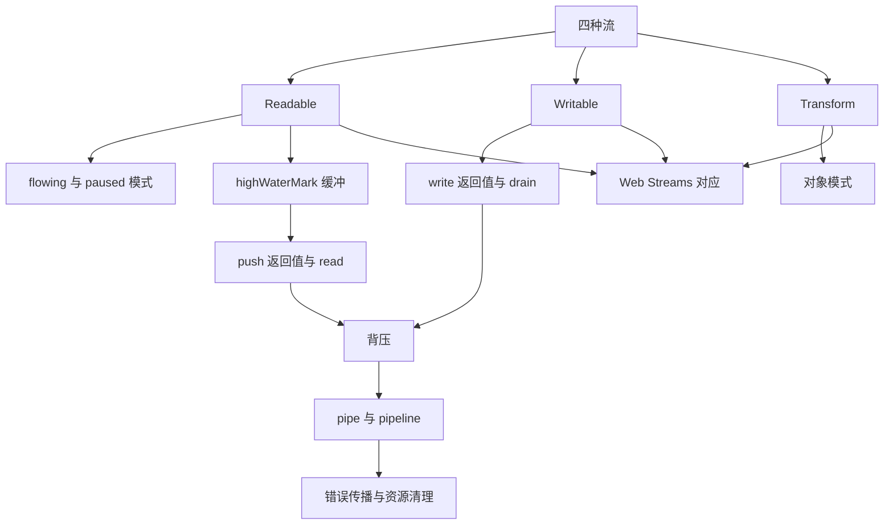
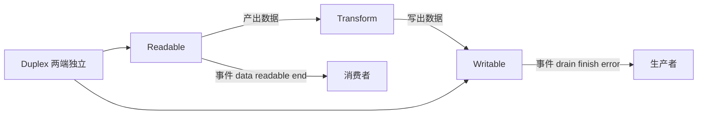
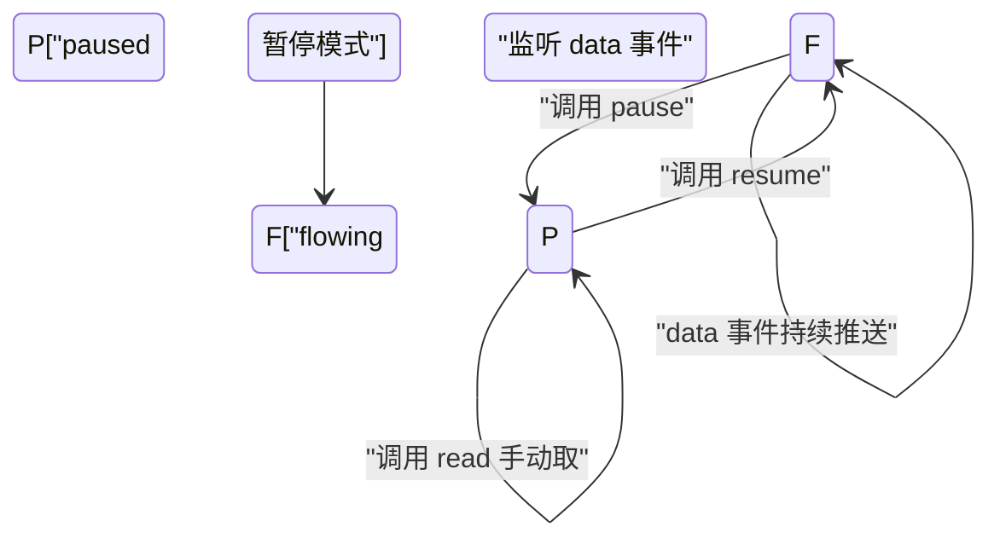
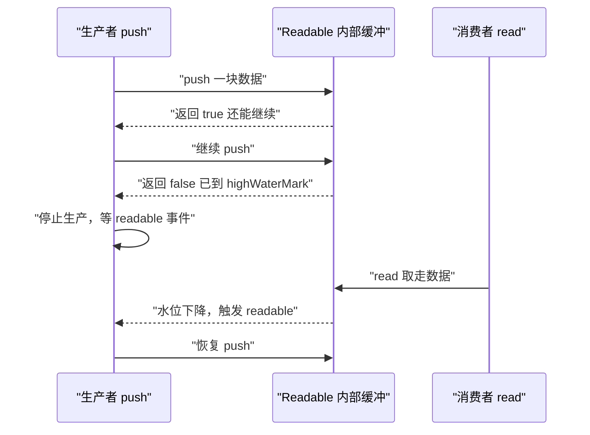
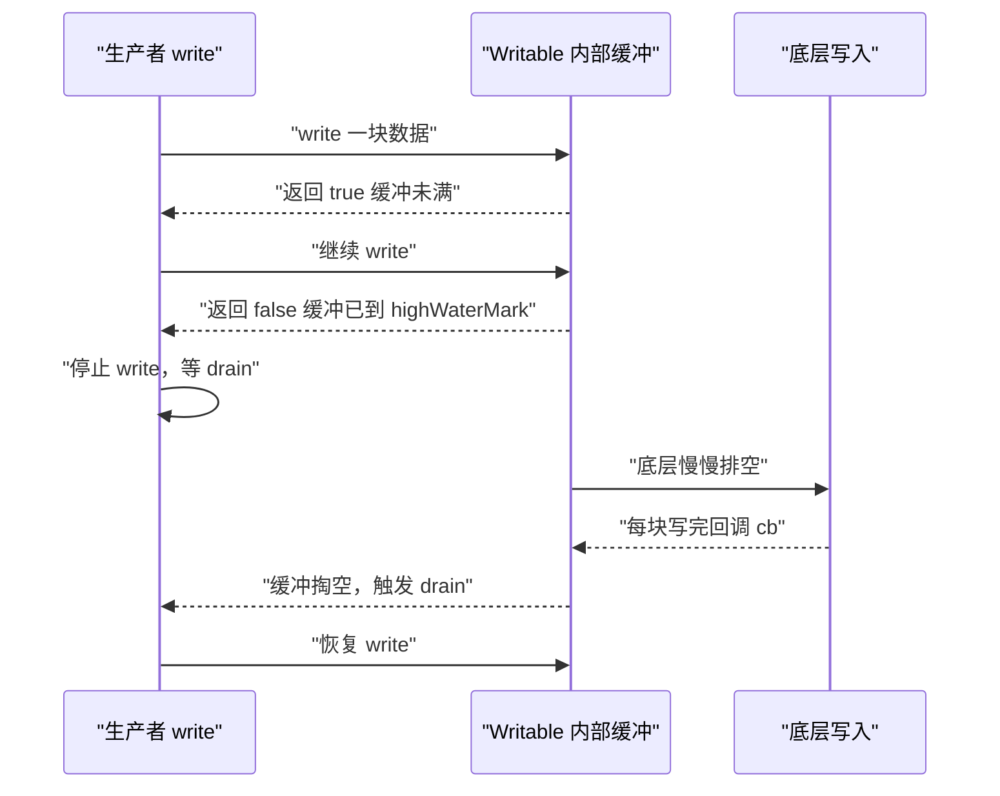
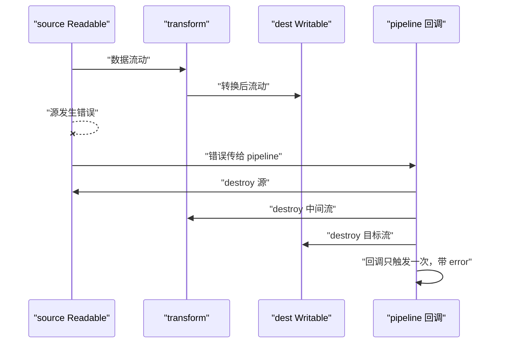
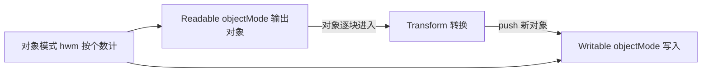
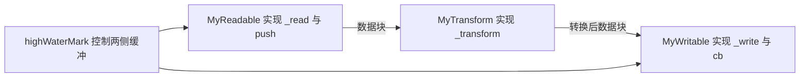
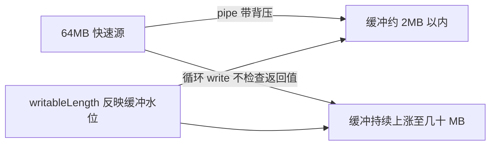
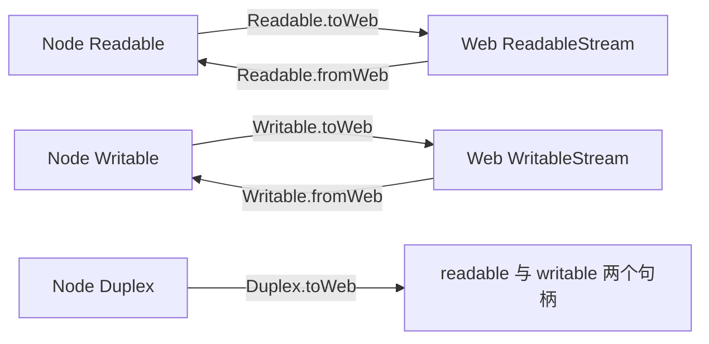

# Node.js Stream 与背压：highWaterMark 与 pipeline

!!! abstract "学完这一页你能"
    - 说出 Readable、Writable、Transform、Duplex 四类流的数据方向与各自背压信号。
    - 在自写 Readable 里用 `push()` 返回值暂停生产，在自写 Writable 里用 `write()` 返回值与 `drain` 事件恢复写入。
    - 用 `pipeline` 串联多流，处理错误传播与资源清理，替代裸 `pipe`。
    - 用对象模式处理结构化数据，并能把 Node 流与 Web Streams 互相转换。

## 0. 知识地图



建议先读第 1 节建立四类流全景，再按"Readable 侧背压（第 2、3 节）→ Writable 侧背压（第 4 节）→ 整链协作（第 5 节）"的顺序推进。
第 6 到 9 节是结构化数据、手写实现、内存实验与 Web 互操作，可放在最后一起验证。

## 1. 四类流：数据方向先分清

**先想一个问题**
一个接口要返回 200MB 日志文件，`fs.readFile` 会把整个文件读进内存，内存占用轻松超过 600MB。
怎么改成边读边发，把内存控制在几十 MB 以内？

**心智模型**

!!! tip "心智模型"
    一句话模型：Stream 是一根水管，数据是水，`highWaterMark` 是水管中段小水缸的容量。
    日常类比：水龙头接水桶，水桶快满时你关小水龙头，而不是让水漫出来。
    类比不成立处：Node 的流不会"把水倒掉"，缓冲满了会把数据囤在内存里，只通过返回值通知生产者；如果生产者无视信号，内存只涨不降。

**图解**



1. Readable 是数据来源，通过 `data`、`readable` 事件把数据交给消费者。
2. Transform 是加工工位，从一侧读入、从另一侧写出，两侧水位独立。
3. Writable 是数据目的地，`drain` 表示"内部缓冲已排空，可以继续写"。
4. Duplex 同时实现 Readable 与 Writable，两侧缓冲区完全独立。
5. 背压沿整条链反向传递：Writable 缓冲满 → 上游 Transform 暂停 → 再上游 Readable 暂停。

**一步一步来**

① 这一步要做什么：创建最小 Readable，观察 `data` 事件如何推送数据。

```js
const { Readable } = require('node:stream');

// 一行创建可读流，内容为三段字符串
const r = Readable.from(['hello', ' ', 'world']);
r.on('data', (chunk) => {          // 监听 data 即切入 flowing 模式
  console.log('拿到:', chunk.toString());
});
r.on('end', () => console.log('读完了'));
```

**这段代码在做什么**

- `Readable.from` 把数组变成可读流，每个元素作为一个 chunk。
- 监听 `data` 后，流进入 flowing 模式，数据自动推送。
- `end` 事件表示数据全部读完，流已到达结尾。

运行结果：依次打印 `拿到: hello`、`拿到:  `、`拿到: world`、`读完了`。

② 这一步要做什么：创建最小 Writable，观察 `write()` 的返回值如何反映缓冲状态。

```js
const { Writable } = require('node:stream');

const w = new Writable({
  write(chunk, enc, cb) {           // 每次 write 进来的数据在这里落地
    console.log('写入:', chunk.toString());
    cb();                           // 通知底层：这一块写完了
  },
});

console.log('write 返回值:', w.write('第一条')); // 首次写入，缓冲未满
console.log('write 返回值:', w.write('第二条'));
w.end('结束');                       // 通知流结束，触发 finish
w.on('finish', () => console.log('全部写完了'));
```

**这段代码在做什么**

- `write()` 返回布尔值：`true` 表示可以继续写，`false` 表示缓冲已满。
- 自定义 `_write` 里的 `cb()` 是告诉 Node 这一块已经真正写完。
- 调用 `end()` 表示不再写入，写完后触发 `finish` 事件。

运行结果：前两次 `write 返回值:` 都是 `true`，最后打印 `全部写完了`。

**动手验证**

```js
const { Readable, Writable } = require('node:stream');
const assert = require('node:assert');

// 目的：用一个脚本同时验证 Readable 和 Writable 的最小行为
const got = [];
const r = Readable.from(['a', 'b', 'c']);
const w = new Writable({
  write(chunk, enc, cb) { got.push(chunk.toString()); cb(); },
});

r.pipe(w);
w.on('finish', () => {
  assert.deepStrictEqual(got, ['a', 'b', 'c']);
  console.log('验证通过，接收顺序符合预期');
});
```

运行结果：打印 `验证通过，接收顺序符合预期`。

**常见坑**

| 现象 | 原因 | 怎么修 |
| --- | --- | --- |
| 监听 `data` 后进程不退出 | 有流句柄未关闭 | 用 `pipeline` 让流自动销毁 |
| `finish` 不触发 | 数据写完但没调 `end()` | 写完最后一块后调用 `end()` |
| `write()` 之后立刻读不到结果 | `_write` 是异步回调 | 在回调里收集结果，别同步断言 |

**小结**

1. Readable 负责产出（`data`、`readable`、`end`），Writable 负责落地（`write`、`drain`、`finish`）。
2. 四类流是理解背压的坐标：数据方向不同，背压信号不同。
3. `pipe` 是最小串联方式，错误与清理需要额外处理。

## 2. Readable 的两种读模式：flowing 与 paused

**先想一个问题**
为什么监听 `data` 就能拿到数据，不监听就拿不到？
同一个流为什么有两种方式取数据，什么时候该选哪一种？

**心智模型**

!!! tip "心智模型"
    一句话模型：paused 模式是"你伸手要"，flowing 模式是"水龙头自动流"。
    日常类比：带按键的饮水机（paused）和一直开着的直饮水龙头（flowing）。
    类比不成立处：paused 模式不会丢数据，没取走的数据先存在内部缓冲，水位到 `highWaterMark` 才阻止源头生产。

**图解**



1. 初始状态是 paused，谁也没监听时，数据停在内部缓冲。
2. 监听 `data` 事件后切换到 flowing，数据一块块自动吐出。
3. 调用 `pause()` 可切回 paused，内部缓冲继续保存未取走的数据。
4. paused 模式下调用 `read()` 手动取数据，取多少由参数和缓冲决定。
5. 调用 `resume()` 恢复 flowing，数据继续自动推送。

**一步一步来**

① 这一步要做什么：验证初始状态是 paused，`read()` 需要先等数据到达。

```js
const { Readable } = require('node:stream');
const r = Readable.from(['一', '二', '三']);

console.log('第一次 read:', r.read());       // 数据还没进缓冲
r.on('readable', () => {
  let chunk;
  while ((chunk = r.read()) !== null) {    // 返回 null 表示缓冲暂时空了
    console.log('手动取到:', chunk.toString());
  }
});
```

**这段代码在做什么**

- `r.read()` 在数据未到达时返回 `null`，这是 paused 模式的手动取数方式。
- 监听 `readable` 事件表示缓冲里可能有数据了，再循环 `read()`。
- `read()` 返回 `null` 表示本次缓冲已取空，但后面可能还有数据。

运行结果：打印三次 `手动取到:` 加对应的 `一`、`二`、`三`。

② 这一步要做什么：验证监听 `data` 会切到 flowing，且 `pause()` 能暂停。

```js
const { Readable } = require('node:stream');
const r = Readable.from(['a', 'b', 'c', 'd']);

r.on('data', (chunk) => {
  console.log('收到:', chunk.toString());
  if (chunk.toString() === 'b') {
    r.pause();                        // 收到 b 后暂停
    setTimeout(() => r.resume(), 50); // 50ms 后恢复流动
  }
});
r.on('end', () => console.log('全部吞下'));
```

**这段代码在做什么**

- 挂上 `data` 监听后，流进入 flowing 模式。
- `pause()` 让流停止推送，但已产出的 chunk 不会丢。
- `resume()` 恢复推送，剩余数据继续流出直到 `end`。

运行结果：依次打印 `收到: a`、`收到: b`，停顿 50ms 后打印 `收到: c`、`收到: d`、`全部吞下`。

**动手验证**

```js
const { Readable } = require('node:stream');
const assert = require('node:assert');

// 目的：验证两种模式都能拿全数据，且 pause 不丢数据
const got = [];
const r = Readable.from(['x', 'y', 'z', 'w']);

r.on('data', (c) => {
  got.push(c.toString());
  if (got.length === 2) {
    r.pause();
    setTimeout(() => r.resume(), 10);
  }
});
r.on('end', () => {
  assert.deepStrictEqual(got, ['x', 'y', 'z', 'w']);
  console.log('验证通过，pause/resume 不丢数据');
});
```

运行结果：打印 `验证通过，pause/resume 不丢数据`。

**常见坑**

| 现象 | 原因 | 怎么修 |
| --- | --- | --- |
| 挂 `data` 后再用 `read()` 拿到空 | 已切 flowing，数据走 `data` 通道 | 一个流固定用一种取数方式 |
| `read()` 返回 `null` | 缓冲此刻为空，不是流结束 | 监听 `readable` 后再读 |
| 切换模式丢数据 | 切换前已有监听且读走了一部分 | 切换前确认模式，必要时用 `pause()` 再挂 `data` |

**小结**

1. Readable 初始是 paused；挂 `data` 进入 flowing；用 `read()` 是 paused 下的主动取数。
2. `pause()` 与 `resume()` 只控制推送节奏，不改变缓冲内容。
3. 之所以需要两种模式：paused 适合按需逐块消费，flowing 适合"来多少处理多少"的管道式消费。

## 3. highWaterMark 与 push 返回值、read()

**先想一个问题**
你自己实现一个 Readable，用定时器源源不断 `push()` 数据，消费者处理得慢。
如果你无视 `push()` 的返回值，内存 10 分钟后会发生什么？

**心智模型**

!!! tip "心智模型"
    一句话模型：`push()` 返回 `false` 是"缓冲已到 `highWaterMark`，请停止生产"。
    日常类比：传送带旁的周转箱，箱子装满亮红灯，工人停止投放。
    类比不成立处：红灯只是建议，不遵守不报错，代价是缓冲无限上涨，内存被吃光。

**图解**



1. 生产者每 `push()` 一块，数据进入内部缓冲。
2. 缓冲低于 `highWaterMark` 时，`push()` 返回 `true`。
3. 缓冲达到 `highWaterMark` 时，`push()` 返回 `false`。
4. 生产者应停止 `push`，等待消费者取走缓冲里的数据。
5. 消费者调用 `read()` 降低水位，水位降到阈值以下会再触发 `readable`。
6. 生产者在 `readable` 里恢复生产，形成闭环。

**一步一步来**

① 这一步要做什么：实现一个观察 `push()` 返回值的高水位 Readable。

```js
const { Readable } = require('node:stream');

class BoundedReadable extends Readable {
  constructor(arr) {
    super({ highWaterMark: 2 });  // 用很小的 hwm，方便观察背压
    this._arr = arr;
    this._i = 0;
  }
  _read() {                        // 消费者要数据时 Node 调用
    while (this._i < this._arr.length) {
      const ok = this.push(this._arr[this._i++]);
      console.log('push 返回:', ok); // 观察返回值变化
      if (!ok) return;            // false 就暂停，等下次 _read
    }
    this.push(null);              // 数据全推出，发 EOF
  }
}
```

**这段代码在做什么**

- `highWaterMark: 2` 表示内部缓冲最多囤 2 块数据。
- `_read()` 是关键：Node 在缓冲有空间时自动调用它。
- `push()` 返回 `false` 时立即 return，把生产权交还给消费者。

② 这一步要做什么：用上面的流验证水位变化与 `read()` 的关系。

```js
const r = new BoundedReadable(['a', 'b', 'c', 'd', 'e']);
const got = [];
r.on('readable', () => {
  let chunk;
  while ((chunk = r.read(1)) !== null) { // 每次只读 1 字节，慢慢消耗
    got.push(chunk.toString());
  }
});
r.on('end', () => console.log('收到:', got.join(', ')));
```

**这段代码在做什么**

- `readable` 事件在缓冲有数据或到达结尾时触发。
- `read(1)` 每次最多取 1 字节，故意放慢消费速度。
- 生产者会在 `push()` 返回 `false` 后暂停，直到缓冲再有空间。

运行结果：控制台交替打印 `push 返回: true` 与 `push 返回: false`，最后打印 `收到: a, b, c, d, e`。

**动手验证**

```js
const { Readable } = require('node:stream');
const assert = require('node:assert');

// 目的：验证 setInterval 驱动的 Readable 必须尊重 push 返回值，否则缓冲失控
let buffered = 0;
const r = new Readable({
  highWaterMark: 3,
  read() {},                       // 生产不放在 read，交给外部定时器
});
const timer = setInterval(() => {
  const ok = r.push(Buffer.alloc(1, 'x'));
  buffered = r.readableLength;    // 当前内部缓冲字节数
  console.log('push 返回:', ok, '缓冲字节:', buffered);
  if (!ok) {
    clearInterval(timer);         // 达到 hwm 就停止生产
    r.push(null);
  }
}, 1);
r.resume();
r.on('end', () => {
  assert.ok(buffered >= 3, '缓冲应达到 highWaterMark 后停止');
  console.log('验证通过，缓冲停在 hwm 附近');
});
```

**这段代码在做什么**

- 定时器每秒产生 1000 块数据，消费者用 `resume()` 快速排空。
- `readableLength` 是只读属性，反映当前内部缓冲字节数。
- 一旦 `push()` 返回 `false`，立即停止定时器并结束流。

运行结果：最后两行打印接近 `push 返回: false 缓冲字节: 3` 和 `验证通过，缓冲停在 hwm 附近`。

**常见坑**

| 现象 | 原因 | 怎么修 |
| --- | --- | --- |
| 自定义流 `data` 永远不触发 | 数据没在 `_read()` 里推 | 把生产逻辑放进 `_read()` |
| 把 `push()` 返回 `false` 当错误 | `false` 是正常背压信号 | 返回 `false` 就暂停，等 `readable` 后再推 |
| 缓冲涨到几个 GB | 无视返回值持续推 | 检查返回值并暂停，消费者取走后恢复 |

**小结**

1. 为什么需要 `highWaterMark`：没有它，缓冲要么无限涨，要么每次只允许 1 字节，吞吐量被压死。
2. `push()` 返回 `false` 是暂停信号，`read()` 消耗数据是恢复信号。
3. `_read()` 是 Node 与自写 Readable 之间的调度入口，生产逻辑必须放这里。

## 4. Writable 的 write 返回值与 drain

**先想一个问题**
用 `fs.createWriteStream` 往慢速磁盘写 1GB 数据，循环里连续调用 `write()` 且不检查返回值。
进程内存会怎样？写入顺序还能保证吗？

**心智模型**

!!! tip "心智模型"
    一句话模型：`write()` 返回 `false` 是"下水道排水速度跟不上"，`drain` 是"下水道排空了"。
    日常类比：往浴缸里倒水，下水口排得慢，水位到警戒线就停手，等水位下去再继续。
    类比不成立处：Node 不会让水漫出去，只会把未排走的数据囤在内部缓冲，继续倒就涨内存。

**图解**



1. 生产者调用 `write()`，数据进入 Writable 内部缓冲。
2. 缓冲未满时 `write()` 返回 `true`，可以继续写。
3. 缓冲达到 `highWaterMark` 时返回 `false`，生产者应停止调用 `write()`。
4. 底层 `_write` 慢慢把数据真正写出，每块完成调用 `cb()`。
5. 内部缓冲被清空时触发 `drain` 事件，生产者恢复 `write()`。

**一步一步来**

① 这一步要做什么：构造慢速 Writable，观察 `write()` 返回值何时转 `false`。

```js
const { Writable } = require('node:stream');

let pending = 0;
const w = new Writable({
  highWaterMark: 2,               // 用很小的 hwm 放大背压现象
  write(chunk, enc, cb) {
    pending += 1;
    setTimeout(() => {            // 模拟 5ms 的慢速底层写入
      pending -= 1;
      cb();                       // 这一块真正写完
    }, 5);
  },
});

for (let i = 0; i < 5; i++) {
  console.log(`write 第 ${i} 块返回:`, w.write(String(i)));
}
```

**这段代码在做什么**

- `highWaterMark: 2` 让缓冲最多囤 2 块数据。
- 底层写入故意延迟 5ms，让前两块还没落地。
- 从第三块开始 `write()` 返回 `false`，因为缓冲已堆到水位。

运行结果：`write 第 0 块返回: true`、`write 第 1 块返回: true`，之后出现 `false`。

② 这一步要做什么：用 `drain` 事件实现批量写入的正确暂停与恢复。

```js
const { Writable } = require('node:stream');
const assert = require('node:assert');

const w = new Writable({
  highWaterMark: 2,
  write(c, e, cb) { setTimeout(cb, 5); }, // 慢速落盘
});

const source = ['0', '1', '2', '3', '4'];
let i = 0;

function pump() {
  while (i < source.length) {
    const ok = w.write(source[i++]);
    if (!ok) {                    // 缓冲满，暂停
      w.once('drain', pump);      // 排空后继续
      return;
    }
  }
  w.end(() => {
    assert.strictEqual(i, source.length);
    console.log('验证通过，所有数据写完');
  });
}
pump();
```

**这段代码在做什么**

- `pump()` 是写入泵：循环写，遇到 `false` 就停。
- `w.once('drain', pump)` 注册一次性监听，排空后自动恢复。
- 写完后调用 `end()`，回调里断言所有块都已提交。

运行结果：打印 `验证通过，所有数据写完`。

**动手验证**

```js
const { Writable } = require('node:stream');
const assert = require('node:assert');

// 目的：验证 write 返回 false 后等待 drain 能保证完整且顺序写入
const written = [];
const w = new Writable({
  highWaterMark: 2,
  write(c, e, cb) {
    written.push(c.toString());
    setTimeout(cb, 3);           // 慢速写入
  },
});

const data = ['a', 'b', 'c', 'd', 'e'];
let i = 0;
function next() {
  while (i < data.length) {
    const ok = w.write(data[i++]);
    if (!ok) return w.once('drain', next);
  }
  w.end();
}
next();
w.on('finish', () => {
  assert.deepStrictEqual(written, data);
  console.log('验证通过，顺序与完整性都正确');
});
```

运行结果：打印 `验证通过，顺序与完整性都正确`。

**常见坑**

| 现象 | 原因 | 怎么修 |
| --- | --- | --- |
| 内存无限上涨 | 无视 `write()` 返回 `false` 继续写 | 返回 `false` 就等 `drain` |
| `drain` 不触发 | 缓冲已经空了才去监听 | 在遇到 `false` 那一次就 `once('drain')` |
| `finish` 之后 `write` 报错 | `end()` 之后不允许再写 | 先写完所有数据，最后才 `end()` |

**小结**

1. 为什么需要 `drain`：没有恢复信号，生产者只能靠轮询或猜测，容易写穿缓冲。
2. `write()` 返回 `false` 是停手信号，`drain` 是继续信号。
3. 自写 `_write` 的 `cb()` 必须每次调用，否则缓冲计数不减少，`drain` 永不触发。

## 5. pipe 与 pipeline：错误传播与资源清理

**先想一个问题**
你用 `source.pipe(transform).pipe(dest)` 拷贝文件。
`source` 读到一半报错，`transform` 和 `dest` 还开着吗？进程会悬住不退出吗？

**心智模型**

!!! tip "心智模型"
    一句话模型：`pipeline` 是串联电路里的总闸，任一处短路，整条回路自动断闸。
    日常类比：一串联彩灯坏一个，总保险丝熔断，整串灯同时熄灭。
    类比不成立处：裸 `pipe` 没有这个保险丝，源出错时中间流和目标流可能继续空转，需要手动 `.destroy()` 和 `.unpipe()`。

**图解**



1. 数据从源经中间流到目标，正常流动。
2. 源出一旦出错，错误交给 `pipeline`。
3. `pipeline` 收到错误后，依次销毁源、中间流、目标流。
4. 所有手柄释放后进程可正常退出。
5. 回调只触发一次：要么完成，要么错误。

**一步一步来**

① 这一步要做什么：对比裸 `pipe`，验证错误不会自动转发到目标流。

```js
const { Readable, Writable } = require('node:stream');

const bad = new Readable({
  read() { this.destroy(new Error('读盘失败')); }, // 一读就报错
});
const dest = new Writable({
  write(c, e, cb) { cb(); },
});

bad.on('error', (err) => console.log('源错误被捕获:', err.message));
bad.pipe(dest);            // 目标流没有 error 监听
dest.on('finish', () => console.log('目标 finish'));
```

**这段代码在做什么**

- `bad` 在第一次 `_read` 时直接销毁自己并抛出"读盘失败"。
- 源上的 `error` 监听能拿到错误信息。
- `dest` 没有收到错误，也不会被自动销毁，进程可能无法退出。

运行结果：打印 `源错误被捕获: 读盘失败`，但 `finish` 不打印，进程可能悬住。

② 这一步要做什么：用 `pipeline` 串联同样的流，验证自动清理。

```js
const { Readable, Transform, Writable, pipeline } = require('node:stream');

const bad = new Readable({ read() { this.destroy(new Error('读盘失败')); } });
const mid = new Transform({ transform(c, e, cb) { cb(null, c); } });
const dest = new Writable({ write(c, e, cb) { cb(); } });

pipeline(bad, mid, dest, (err) => {
  console.log('pipeline 回调收到错误:', err.message);
  console.log('状态 源被销毁:', bad.destroyed, '目标被销毁:', dest.destroyed);
});
```

**这段代码在做什么**

- `pipeline` 把三个流连成一条链。
- 源错误自动销毁整条链上的流。
- 回调收到第一个错误，不会重复执行。

运行结果：打印 `pipeline 回调收到错误: 读盘失败` 和两个 `true`。

**动手验证**

```js
const { Readable, Writable, pipeline } = require('node:stream');
const assert = require('node:assert');

// 目的：验证 pipeline 出错时销毁所有流且回调只执行一次
let calls = 0;
const bad = new Readable({ read() { this.destroy(new Error('boom')); } });
const mid = new Writable({
  write(c, e, cb) { cb(); },
  final(cb) { calls += 1; cb(); },  // final 不应被执行，因为中途出错
});

pipeline(bad, mid, (err) => {
  calls += 1;                       // 完成为 1，出错也为 1，只记一次
  assert.strictEqual(err.message, 'boom');
  assert.strictEqual(bad.destroyed, true);
  assert.strictEqual(mid.destroyed, true);
  assert.strictEqual(calls, 1, '回调只应执行一次');
  console.log('验证通过，整链销毁且回调只执行一次');
});
```

**这段代码在做什么**

- `calls` 计数器用来断言回调只执行一次。
- 断言 `destroyed` 为 `true`，确认两个流都被清理。
- `final` 是正常结束前的钩子，出错路径不应执行。

运行结果：打印 `验证通过，整链销毁且回调只执行一次`。

**常见坑**

| 现象 | 原因 | 怎么修 |
| --- | --- | --- |
| 进程报 unhandled error 崩溃 | 裸 `pipe` 不转发源错误 | 给每个流加 `error` 监听，或改用 `pipeline` |
| 进程不退出 | 出错流未销毁，句柄仍开着 | 用 `pipeline` 自动销毁 |
| 回调执行两次 | 同时监听 `close` 和 `finish` | `pipeline` 回调只监听一次完成或错误 |

**小结**

1. 为什么需要 `pipeline`：裸 `pipe` 只搬数据，不管错误与清理，多流组合时每个流都要手工兜底。
2. `pipeline` 在任一流出错时销毁全部流，并只回调一次。
3. 生产环境的多流串联，默认用 `pipeline`，不用裸 `pipe`。

## 6. Transform 与对象模式

**先想一个问题**
读一份日志文件，按行解析成 JSON，过滤掉错误日志后写入数据库。
怎么让流里流动的不是 Buffer，而是结构化对象？

**心智模型**

!!! tip "心智模型"
    一句话模型：Transform 是流水线上的加工工位，对象模式是"传送带上运的不是字节，而是一盒盒零件"。
    日常类比：水果分拣线，每个工位拿出一个苹果削皮再放回传送带。
    类比不成立处：对象模式不用处理字节拼接，`highWaterMark` 按"对象个数"计数，Buffer 模式按"字节数"计数。

**图解**



1. Readable 在 `objectMode: true` 下可以 `push` 任意对象。
2. Transform 的 `_transform` 拿到对象，处理后 `push` 新对象。
3. Writable 在 `objectMode: true` 下，`_write` 收到的 chunk 就是对象。
4. 整条链的 `highWaterMark` 默认按 16 个对象计数，而不是 64KB 字节。
5. 过滤逻辑只需在 `_transform` 里决定是否 `push`，不消费的数据直接跳过。

**一步一步来**

① 这一步要做什么：创建对象模式的 Transform，把 JSON 字符串转成对象。

```js
const { Transform } = require('node:stream');

const parseJson = new Transform({
  objectMode: true,                    // 进出都是对象/字符串，按个数计数
  transform(chunk, enc, cb) {
    const text = String(chunk).trim();
    if (text === '') return cb();      // 空行跳过，不 push
    cb(null, JSON.parse(text));        // 解析后传给下游
  },
});

parseJson.on('data', (obj) => console.log('拿到对象:', obj.name, obj.level));
parseJson.write('{"name":"登录","level":"info"}\n');
parseJson.end();
```

**这段代码在做什么**

- `objectMode: true` 让输入输出按对象处理，不需要手动拼 Buffer。
- `_transform` 里 `cb(null, data)` 等于 `this.push(data); cb();`。
- 空行不调用 `cb(null, ...)` 而是 `cb()`，表示跳过这一块。

运行结果：打印 `拿到对象: 登录 info`。

② 这一步要做什么：加过滤条件，只放行错误级别以上的日志。

```js
const { Transform } = require('node:stream');

const keepError = new Transform({
  objectMode: true,
  transform(obj, enc, cb) {
    if (obj.level === 'error') {       // 条件满足才 push
      this.push({ ...obj, keptAt: Date.now() });
    }
    cb();                              // 不论是否 push，都要 cb
  },
});
```

**这段代码在做什么**

- `this.push(obj)` 把符合条件的对象交给下游。
- 不符合条件的对象直接 `cb()`，不 push。
- `cb()` 必须在每个 chunk 处理后调用，否则流卡住。

③ 这一步要做什么：用对象模式 Writable 收集最终结果。

```js
const { Writable } = require('node:stream');

const result = [];
const save = new Writable({
  objectMode: true,
  write(obj, enc, cb) {
    result.push(obj);                  // 收到的是对象，不是 Buffer
    cb();
  },
});
```

**这段代码在做什么**

- `objectMode: true` 下，`write` 收到的 chunk 就是上游 push 的对象。
- `result` 数组按到达顺序收集对象。

**动手验证**

```js
const { Transform, Writable, pipeline } = require('node:stream');
const assert = require('node:assert');

// 目的：验证对象模式从字符串到对象再到过滤的完整链路
const logs = [
  '{"name":"登录","level":"info"}',
  '{"name":"支付","level":"error"}',
  '{"name":"查询","level":"info"}',
];

const parse = new Transform({
  objectMode: true,
  transform(chunk, enc, cb) { cb(null, JSON.parse(chunk)); },
});
const filterError = new Transform({
  objectMode: true,
  transform(obj, enc, cb) {
    if (obj.level === 'error') this.push(obj);
    cb();
  },
});
const out = [];
const sink = new Writable({
  objectMode: true,
  write(obj, enc, cb) { out.push(obj); cb(); },
});

pipeline(parse, filterError, sink, (err) => {
  assert.ifError(err);
  assert.strictEqual(out.length, 1);
  assert.strictEqual(out[0].name, '支付');
  console.log('验证通过，仅一条 error 日志被保留');
});
parse.write(logs[0]);
parse.write(logs[1]);
parse.write(logs[2]);
parse.end();
```

**这段代码在做什么**

- 第一条 Transform 解析 JSON 字符串。
- 第二条 Transform 只放行 `level === 'error'` 的对象。
- 最后的 Writable 收集对象，断言只保留一条日志。

运行结果：打印 `验证通过，仅一条 error 日志被保留`。

**常见坑**

| 现象 | 原因 | 怎么修 |
| --- | --- | --- |
| 收到乱码或 `Uint8Array` | 没开 `objectMode`，chunk 是 Buffer | 创建流时设 `objectMode: true` |
| `push` 对象时报 TypeError | 非对象模式只接受 Buffer/字符串 | 开 `objectMode` 或转成字符串 |
| 数量少也出现背压 | 对象模式默认 `highWaterMark: 16` | 按吞吐需求调整 `highWaterMark` |

**小结**

1. 为什么需要对象模式：不用它，结构化数据要反复 JSON 序列化加手工切块，容易在边界处出错。
2. Transform 的 `cb()` 是必须的，push 是可选的，过滤就是只 cb 不 push。
3. 对象模式的 `highWaterMark` 单位是"对象个数"，默认 16。

## 7. 手写 Readable、Writable、Transform 最小实现（带背压）

**先想一个问题**
第三方流库五花八门，但它们的背压逻辑都建立在 Node 流的三个钩子上：`_read`、`_write`、`_transform`。
不看内部实现，你敢说真的理解背压了吗？

**心智模型**

!!! tip "心智模型"
    一句话模型：手写流就是实现三个钩子，同时回答"什么时候产、什么时候写、什么时候歇"。
    日常类比：自己组装一台饮水机，进水阀（`_read`）、出水阀（`_write`）、过滤器（`_transform`）各司其职。
    类比不成立处：Node 流框架已经处理了大部分调度，你只负责钩子内部逻辑；真正的进出水调度由 `highWaterMark` 和事件循环驱动。

**图解**



1. MyReadable 只需实现 `_read`，在里面对外 `push` 数据。
2. MyTransform 只需实现 `_transform`，处理每个输入块并 `push` 输出块。
3. MyWritable 只需实现 `_write`，把数据落地后调用 `cb`。
4. 三个钩子之外，背压调度由 Node 完成，生产逻辑无需关心事件循环细节。

**一步一步来**

① 这一步要做什么：手写带背压的 MyReadable。

```js
const { Readable } = require('node:stream');

class MyReadable extends Readable {
  constructor(arr, opts = {}) {
    super(opts);
    this._arr = arr;
    this._i = 0;
  }
  _read() {                              // 缓冲有空间时被调用
    while (this._i < this._arr.length) {
      const ok = this.push(this._arr[this._i++]);
      if (!ok) return;                   // 到 highWaterMark，暂停生产
    }
    this.push(null);                     // 全部推完，发 EOF
  }
}
```

**这段代码在做什么**

- 构造器接收一个数组作为数据源。
- `_read` 是 Node 在缓冲有余量时的回调入口。
- `push()` 返回 `false` 就退出循环，等下一轮 `_read`。

② 这一步要做什么：手写带 `drain` 语义的 MyWritable。

```js
const { Writable } = require('node:stream');

class MyWritable extends Writable {
  constructor(opts = {}) {
    super(opts);
    this.received = [];
  }
  _write(chunk, enc, cb) {               // 每个数据块落地处
    this.received.push(chunk.toString());
    setTimeout(cb, 5);                   // 模拟慢速落盘后 cb
  }
}
```

**这段代码在做什么**

- `_write` 收到数据块，先记录下来。
- `setTimeout(cb, 5)` 模拟 5ms 的慢速写入。
- `cb()` 让 Node 扣减缓冲计数，缓冲空后触发 `drain`。

③ 这一步要做什么：手写 MyTransform，把数字翻倍后交给下游。

```js
const { Transform } = require('node:stream');

class MyTransform extends Transform {
  _transform(chunk, enc, cb) {
    const n = Number(chunk.toString());
    if (Number.isNaN(n)) return cb(new Error('不是数字')); // 出错交给 pipeline
    this.push(String(n * 2));
    cb();
  }
}
```

**这段代码在做什么**

- `_transform` 把每个输入块转数字再乘 2。
- 非法输入通过 `cb(new Error(...))` 抛给下游统一处理。
- `this.push` 输出转换后的字符串，`cb()` 表示本块处理完成。

**动手验证**

```js
const { Readable, Transform, Writable, pipeline } = require('node:stream');
const assert = require('node:assert');

// 目的：验证手写三个流并串联后，背压与转换都正确
class MyReadable extends Readable {
  constructor(arr) { super(); this._arr = arr; this._i = 0; }
  _read() {
    while (this._i < this._arr.length) {
      if (!this.push(this._arr[this._i++])) return;
    }
    this.push(null);
  }
}
class MyTransform extends Transform {
  _transform(c, e, cb) { this.push(String(Number(c) * 2)); cb(); }
}
class MyWritable extends Writable {
  constructor() { super(); this.received = []; }
  _write(c, e, cb) { this.received.push(Number(c)); cb(); }
}

const r = new MyReadable(['1', '2', '3', '4']);
const t = new MyTransform();
const w = new MyWritable();

pipeline(r, t, w, (err) => {
  assert.ifError(err);
  assert.deepStrictEqual(w.received, [2, 4, 6, 8]);
  console.log('验证通过，手写三件套背压与转换均正常');
});
```

**这段代码在做什么**

- 三个类都在脚本内完整定义，可单独运行。
- `pipeline` 串联三者，错误自动清理。
- 断言最终接收到的数组为 `[2, 4, 6, 8]`。

运行结果：打印 `验证通过，手写三件套背压与转换均正常`。

**常见坑**

| 现象 | 原因 | 怎么修 |
| --- | --- | --- |
| `_transform` 里忘调 `cb()`，流卡死 | transform 不知道本块处理完成 | 每个分支都调 `cb()` |
| `_write` 里同步返回没调 `cb()` | 缓冲计数不减少 | 落地完成后立即 `cb()` 或 `cb(error)` |
| `push` 后不判断返回值 | 缓冲可无限上涨 | `false` 就停止 push，等 `_read` 再继续 |

**小结**

1. 手写流只有三个入口：Readable 的 `_read`、Writable 的 `_write`、Transform 的 `_transform`。
2. 背压逻辑完全体现在 `push`/`write` 的返回值与 `readable`/`drain` 的恢复信号上。
3. 为什么需要手写：理解这三个钩子，才能读懂所有第三方流库的背压实现。

## 8. 内存实验：带背压与不带背压的大文件拷贝

**先想一个问题**
把 64MB 数据从"快速生产源"拷贝到"慢速写入目标"。
用 `pipe` 和用"循环 `write()` 不等待 `drain`"两种写法，内部缓冲各会涨到多少？

**心智模型**

!!! tip "心智模型"
    一句话模型：背压是水位报警器，没有它，快速水源会把慢速下水道前面灌成水库。
    日常类比：大水泵往小水管抽水，中间水池满后停泵；不停泵就水漫金山。
    类比不成立处：没有背压不会报错，也不会"漫出来"，只会把内存占满，直到进程被操作系统杀掉。

**图解**



1. 快源每秒产出远大于慢目标每秒可写入的量。
2. `pipe` 会观察 Writable 的 `drain`，水位上涨时暂停源。
3. 循环 `write()` 不看返回值时，数据无限堆积在 Writable 内部缓冲。
4. `writableLength` 能直接读到内部缓冲字节数，比 `process.memoryUsage()` 更稳。

**一步一步来**

① 这一步要做什么：构造 64MB 的快速生成源，模拟大文件。

```js
const { Readable } = require('node:stream');

// 生成 64 块，每块 1MB，共 64MB
const bigSource = new Readable({
  highWaterMark: 1024 * 1024,   // 源缓冲 1MB
  read() {
    this.count = this.count ?? 0;
    if (this.count < 64) {
      this.count += 1;
      this.push(Buffer.alloc(1024 * 1024, 'x')); // 产出一块 1MB
    } else {
      this.push(null);          // 全部产出后结束
    }
  },
});
```

**这段代码在做什么**

- `count` 从 0 数到 64，每轮产出一块 1MB 数据。
- `read()` 会在缓冲有空间时被自动调用。
- 64 轮后 `push(null)` 结束流，共 64MB。

② 这一步要做什么：构造慢速 Writable，模拟 2 秒才写入 1MB 的慢目标。

```js
const { Writable } = require('node:stream');

const slowSink = new Writable({
  highWaterMark: 1024 * 1024,   // 目标缓冲 1MB
  write(chunk, enc, cb) {
    setTimeout(cb, 20);         // 每 1MB 花 20ms 落地
  },
});
```

**这段代码在做什么**

- 每块 1MB 数据写入需要 20ms。
- `cb()` 通知 Node 该块已写盘，缓冲计数减一。

③ 这一步要做什么：写"不等待 drain"的循环，记录 `writableLength` 峰值。

```js
let maxLen = 0;
for (let i = 0; i < 64; i++) {
  slowSink.write(Buffer.alloc(1024 * 1024, 'x')); // 无视返回值
  maxLen = Math.max(maxLen, slowSink.writableLength); // 记录峰值
}
console.log('无背压峰值 writableLength:', maxLen);
```

**这段代码在做什么**

- 循环一口气提交 64 块，不检查 `write()` 返回的布尔值。
- `writableLength` 每轮记录一次，取最大值。
- 由于底层每块要 20ms，大部分数据会滞留在缓冲。

运行结果：`无背压峰值 writableLength:` 后接一个几十 MB 的数字。

④ 这一步要做什么：用 `pipeline` 带背压重跑同一实验。

```js
const { pipeline } = require('node:stream');
let maxLen = 0;
const monitor = new Writable({
  write(chunk, enc, cb) { cb(); },
});
// 在数据流动途中取样 writableLength
bigSource.on('data', () => {
  maxLen = Math.max(maxLen, slowSink.writableLength);
});
pipeline(bigSource, slowSink, (err) => {
  console.log('带背压峰值 writableLength:', maxLen);
});
```

**这段代码在做什么**

- `pipeline` 自动处理 `drain`，源会在目标缓冲满时暂停。
- `data` 监听里持续取样目标的 `writableLength`。
- 峰值应远低于 64MB，因为源被反复暂停。

运行结果：`带背压峰值 writableLength:` 后接一个几 MB 的数字。

**动手验证**

```js
const { Readable, Writable, pipeline } = require('node:stream');
const assert = require('node:assert');

// 目的：单脚本对比两种写法，断言背压能压住缓冲水位
function makeSource() {
  let count = 0;
  return new Readable({
    read() {
      if (count < 64) { count += 1; this.push(Buffer.alloc(1024 * 1024, 'x')); }
      else this.push(null);
    },
  });
}
function makeSlowSink() {
  return new Writable({
    highWaterMark: 1024 * 1024,
    write(c, e, cb) { setTimeout(cb, 10); },   // 每块 10ms
  });
}

(async () => {
  const src = makeSource();
  const sink = makeSlowSink();
  let maxPipe = 0;
  src.on('data', () => { maxPipe = Math.max(maxPipe, sink.writableLength); });
  await new Promise((resolve, reject) =>
    pipeline(src, sink, (err) => (err ? reject(err) : resolve()))
  );

  let maxNoDrain = 0;
  const src2 = makeSource();
  const sink2 = makeSlowSink();
  src2.on('data', (chunk) => {
    sink2.write(chunk);                        // 无视返回值
    maxNoDrain = Math.max(maxNoDrain, sink2.writableLength);
  });
  await new Promise((resolve) => { src2.on('end', resolve); src2.resume(); });

  assert.ok(maxPipe < 4 * 1024 * 1024, 'pipe 峰值应低于 4MB');
  assert.ok(maxNoDrain > 20 * 1024 * 1024, '无背压峰值应高于 20MB');
  console.log('验证通过：带背压峰值约', maxPipe, '字节；无背压峰值约', maxNoDrain, '字节');
})();
```

**这段代码在做什么**

- 两轮实验使用同样的源与目标参数，只改变写入方式。
- 第一轮用 `pipeline`，断言 `writableLength` 峰值低于 4MB。
- 第二轮写循环无视返回值，断言峰值高于 20MB。

运行结果：打印一行 `验证通过：带背压峰值约 ... 字节；无背压峰值约 ... 字节`，两组数字相差一个数量级以上。

**常见坑**

| 现象 | 原因 | 怎么修 |
| --- | --- | --- |
| `writableLength` 一直为 0 | 底层 `cb()` 同步结束，没有积压 | 放慢 `_write`，让缓冲有机会堆积 |
| 断言不稳定 | `process.memoryUsage()` 受 GC 影响 | 用 `writableLength` 或 `readableLength` 做指标 |
| 无背压那组也没涨起来 | 目标太快，源和目标同速 | 让目标每块加 10ms 延迟 |

**小结**

1. 背压的价值可用 `writableLength` 量化：有背压时缓冲只有几个 MB，无背压时涨到几十 MB。
2. `pipe` 与 `pipeline` 内部把 `write()` 返回值和 `drain` 串成闭环，这是我们不写 while 循环的原因。
3. 为什么需要实验：只看 API 文档记不住背压，跑一遍数字就记住了。

## 9. 与 Web Streams 的对应关系

**先想一个问题**
浏览器端有 `ReadableStream` 和 `WritableStream`，Node 端有 `Readable` 和 `Writable`。
两边命名接近，能直接互相传吗？各自的背压术语怎么对照？

**心智模型**

!!! tip "心智模型"
    一句话模型：两套流是同一套水管理念下的两种标准件，接口不同，但可以加转换头对接。
    日常类比：国标插座与欧标插座都供电，插头形状不同，需要转换插头。
    类比不成立处：转换不是零开销，`toWeb`/`fromWeb` 会加适配层；两边的 EOF 与 abort 语义也不完全一一对应。

**图解**



1. Node 的 `Readable` 用 `Readable.toWeb()` 转成 Web `ReadableStream`。
2. Web `ReadableStream` 用 `Readable.fromWeb()` 转回 Node `Readable`。
3. `Writable` 与 `Duplex` 同样有 `toWeb`/`fromWeb` 静态方法。
4. `Duplex.toWeb()` 返回一个含 `readable` 与 `writable` 两个属性的对象。
5. 两端背压都要遵守：Node 看 `push`/`write` 返回值，Web 看 `controller.desiredSize` 与 `writer.ready`。

**一步一步来**

① 这一步要做什么：把 Node Readable 转成 Web ReadableStream 消费。

```js
const { Readable } = require('node:stream');

const nodeR = Readable.from(['你', '好', '世', '界']);
const webR = Readable.toWeb(nodeR);    // 得到标准 Web ReadableStream
const reader = webR.getReader();       // Web 侧用 reader 读取

(async () => {
  const parts = [];
  while (true) {
    const { value, done } = await reader.read();
    if (done) break;
    parts.push(Buffer.from(value).toString()); // Web 侧拿到的是 Uint8Array
  }
  console.log('Web 侧读到:', parts.join(''));
})();
```

**这段代码在做什么**

- `Readable.toWeb` 把 Node 流包成 Web `ReadableStream`。
- Web 侧的 `getReader().read()` 返回 Promise，value 是 `Uint8Array`。
- `Buffer.from(value).toString()` 把字节转回文本。

运行结果：打印 `Web 侧读到: 你好世界`。

② 这一步要做什么：把 Web ReadableStream 转回 Node Readable。

```js
const { Readable } = require('node:stream');

const webStream = new ReadableStream({
  start(controller) {               // Web 侧生产者
    controller.enqueue('甲');
    controller.enqueue('乙');
    controller.close();
  },
});
const nodeR = Readable.fromWeb(webStream); // 转回 Node 流

(async () => {
  const chunks = [];
  for await (const chunk of nodeR) {       // Node 侧用 for await 消费
    chunks.push(String(chunk));
  }
  console.log('Node 侧读到:', chunks.join(', '));
})();
```

**这段代码在做什么**

- `new ReadableStream` 是 Node 17+ 自带的 Web 全局对象。
- `Readable.fromWeb` 把 Web 流转成 Node `Readable`。
- Node 侧可用 `for await` 消费，chunk 为 Buffer 或字符串。

运行结果：打印 `Node 侧读到: 甲, 乙`。

**动手验证**

```js
const { Readable } = require('node:stream');
const assert = require('node:assert');

// 目的：验证 Node 流与 Web 流双向转换后数据与背压语义都成立
(async () => {
  const nodeR = Readable.from(['a', 'b', 'c']);
  const webR = Readable.toWeb(nodeR);
  const reader = webR.getReader();
  const got = [];
  while (true) {
    const { value, done } = await reader.read();
    if (done) break;
    got.push(Buffer.from(value).toString());
  }
  assert.deepStrictEqual(got, ['a', 'b', 'c']);

  const webStream = new ReadableStream({
    start(controller) {
      controller.enqueue('x');
      controller.enqueue('y');
      controller.close();
    },
  });
  const backToNode = Readable.fromWeb(webStream);
  const got2 = [];
  for await (const chunk of backToNode) got2.push(String(chunk));
  assert.deepStrictEqual(got2, ['x', 'y']);
  console.log('验证通过，双向转换数据完整');
})();
```

**这段代码在做什么**

- 第一段验证 Node 到 Web 的转换与数据完整性。
- 第二段验证 Web 到 Node 的转换与数据完整性。
- 两端背压语义各自成立，转换层负责衔接。

运行结果：打印 `验证通过，双向转换数据完整`。

**常见坑**

| 现象 | 原因 | 怎么修 |
| --- | --- | --- |
| `Readable.toWeb is not a function` | Node 版本低于 17 | 升级到 Node 18 或 20 |
| Web reader 一直等待 `done` | Node 源没有调用 `push(null)` | 源数据出完后结束流 |
| 转接后背压不联动 | 生产者没有遵守 Web 侧 `desiredSize` | 检查 `controller.desiredSize` 再决定是否 `enqueue` |

**小结**

1. 为什么需要互转：前端用 fetch 上传下载流，后端用 Node 文件流，互转是打通全栈的必经之路。
2. 转接口是成对的：`toWeb` 与 `fromWeb` 覆盖 Readable、Writable、Duplex。
3. 转接不是免费，背压信号要在两侧分别遵守。

## 综合对比

| 维度 | Readable | Writable | Transform |
| --- | --- | --- | --- |
| 数据方向 | 读出 | 写入 | 读入再写出 |
| 关键钩子 | `_read` | `_write` | `_transform` |
| 背压信号 | `push()` 返回 `false` | `write()` 返回 `false` | 两侧信号同时存在 |
| 恢复信号 | `readable` 事件或 `read()` 消耗 | `drain` 事件 | 两侧水位同时下降 |
| 缓冲水位 | `readableHighWaterMark` 默认 64KB | `writableHighWaterMark` 默认 64KB | 两侧各 64KB |
| 结束事件 | `end` | `finish` | 两侧分别触发 |
| 对象模式单位 | 对象个数，默认 16 个 | 对象个数，默认 16 个 | 对象个数，默认 16 个 |
| Web 对应 | `Readable.toWeb/fromWeb` | `Writable.toWeb/fromWeb` | `Duplex.toWeb/fromWeb` |

| 对比维度 | `pipe` | `pipeline` |
| --- | --- | --- |
| 基本用法 | `src.pipe(dest)` | `pipeline(src, mid, dest, cb)` |
| 错误传播 | 不转发，需要每个流手动监听 | 自动转发到回调 |
| 资源清理 | 出错时不自动销毁下游 | 自动销毁所有参与流 |
| 原生 Promise 版 | 无 | 可用 `stream/promises` 的 `pipeline` |
| 适用场景 | 两三个流快速串联 | 生产环境多流编排 |

## 应用与行业实践

### 应用场景地图

| 场景 | 用到本页哪个知识点 | 典型技术选型 | 注意事项 |
|---|---|---|---|
| 后台管理导出 30 万行订单 CSV | 对象模式 Readable、`write()` 返回值、`pipeline` | `Readable.from` + `Transform` + `stream.pipeline` | 游标分页要有稳定排序，否则导出结果会跳行 |
| 低端安卓手机打开首屏 SSR 页面 | Readable 的 flowing 模式、Writable 背压 | React `renderToPipeableStream` 接到 `res` | 响应头发出后无法改状态码，错误要在发头前兜住 |
| 多人协作白板把操作事件写本地日志 | 对象模式 Writable、`drain` 事件 | `fs.createWriteStream` + 自写 Writable | 进程崩溃会丢缓冲区内容，先确认可接受的丢失窗口 |
| 用户上传 2 GB 视频转码后回传 | Transform、`pipeline` 的资源清理 | 上传解析库 + `child_process` 管道 + zlib | 客户端断连要 abort 子进程，否则转码任务空跑 |
| 日志采集 Agent 往本地文件写访问日志 | `highWaterMark`、`write` 返回 false | 开源项目 pino 的写入库 sonic-boom | 磁盘写满的报错会从流里冒出来，要接进告警 |
| 弱网下载安装包并解压 | 链式 Transform、错误传播 | `fetch` 的 Web Stream 转 Node 流 + zlib | 要设 idle 超时，否则连接挂着不结束 |
| 定时任务从数据库导 NDJSON 给下游 | Readable 的 paused 模式、`push` 返回值 | 数据库游标 + 自写 Readable | 读得快于写得快时，靠 `push` 返回 false 停手 |
| 客服系统把工单数组推给前端表格 | 对象模式、`highWaterMark` | `Readable.from(array)` + NDJSON 序列化 | 对象模式下 `highWaterMark` 的单位是个数，不是字节 |

### 三个场景拆解

#### 场景 1：后台管理导出 30 万行订单 CSV

**业务背景**：运营点导出后，接口要一次拉 30 万行订单拼成 CSV。原实现把全部行拼成一个字符串再返回，内存随订单量线性上涨。用 `process.memoryUsage().rss` 在导出前后各采样一次就能复现。

**怎么用本页知识解决**：思路是把数据库游标当成 Readable 的数据源，中间用一个 Transform 转 CSV，出口直接是 HTTP 响应对象。三段用 `pipeline` 串起来，推送节奏由下游的写入结果决定。

```js
const { Readable, Transform, pipeline } = require('node:stream');

// 数据库游标逐行产出对象，Readable.from 把它变成对象模式流
const source = Readable.from(cursor, { objectMode: true });

const toCsv = new Transform({
  writableObjectMode: true,   // 上游写进来的是对象
  readableObjectMode: false,  // 下游拿到的是一段段 CSV 文本
  transform(row, _enc, cb) {
    cb(null, Object.values(row).join(',') + '\n'); // 一行一推
  },
});

// pipeline 在任一段出错时销毁其余流，并把错误交给回调
pipeline(source, toCsv, res, (err) => {
  if (err) req.log.error(err); // 客户端断开也会走到这里
});
```

- `Readable.from` 接收异步迭代器时，只有下游拉取才推进游标，游标不会跑到前面。
- `transform` 回调被调用即代表上游一行已处理完，回调不调用就不处理下一行。
- 把 `res` 当 Writable 用，`res.write` 返回 false 时 pipeline 会暂停上游，不用手写 drain。
- 错误回调里先判断 `res.headersSent`：已发头只能断连，未发头才能返回 500。
- `pipeline` 结束后所有流被销毁，数据库游标要在 `finally` 里显式关闭。

**怎么度量收益**：指标看导出接口的 RSS 峰值、堆使用峰值、首字节时间。用 `process.memoryUsage()` 定时采样，压测用 autocannon 或 wrk，堆曲线用 `--inspect` 加 DevTools 观察。

**什么时候不该用**：

- 结果集小于一个 `highWaterMark` 且能一次放内存时，加流只增加代码量。
- 需要提前写 `Content-Length` 的场景，流式无法预知总长度，应改用分片下载。

#### 场景 2：低端安卓手机上的首屏 SSR

**业务背景**：首屏 HTML 里有几块依赖下游接口的数据，等全部到齐再发，低端机上白屏时间被拉长。用 `curl -w '%{time_starttransfer}'` 对比改造前后的首字节时间就能看到差别。

**怎么用本页知识解决**：先发不含慢数据的 HTML 外壳，浏览器立刻开始解析并拉静态资源。慢数据到位后再作为脚本块写入响应。React 的 `renderToPipeableStream` 返回 `pipe` 与 `abort`，配合 `res` 完成这一步。

```js
const { renderToPipeableStream } = require('react-dom/server');

// onShellReady：外壳渲染完成，可以写响应头和外壳 HTML
const { pipe, abort } = renderToPipeableStream(<App />, {
  onShellReady() {
    res.setHeader('content-type', 'text/html; charset=utf-8');
    pipe(res);          // 把外壳与后续数据块依次写进响应
  },
  onShellError(err) {   // 外壳失败，此时还没发头，可以改状态码
    res.statusCode = 500;
    res.end('render failed');
  },
});

setTimeout(abort, 5000); // 超时放弃渲染，避免慢接口拖住连接
```

- 外壳先写出去，浏览器可以边收边解析，静态资源请求提前发出。
- `res.write` 返回 false 时写入方要等 `drain` 再继续推，这一步的细节需核对 react-dom/server 官方文档。
- `onShellError` 只在响应头发出前触发，此时才有机会改状态码。
- 必须设置 `abort` 超时，慢接口会把连接和渲染任务一起挂住。
- 慢数据块用 Suspense 边界包住，外壳不被它阻塞。

**怎么度量收益**：看 TTFB（`curl -w '%{time_starttransfer}'`）、LCP（Lighthouse 或 web-vitals 的 onLCP）、首个 JS 请求时间（DevTools Network 面板）。用 DevTools 的 Slow 4G 加 4x CPU 降速复现低端机。

**什么时候不该用**：

- 页面必须输出完整 HTML 才能被抓取，且爬虫不做流式处理时，先确认抓取行为再决定。
- 鉴权在渲染中途才发现失败时无法改 401，鉴权必须挪到发头之前。

#### 场景 3：协作白板把操作事件写进本地日志

**业务背景**：一块白板每秒产生几十到几百条操作事件，服务端要把它们按顺序追加到 NDJSON 日志。突发流量下先攒数组再批量写，堆内存会短时抬高。用 `process.memoryUsage().heapUsed` 定时采样可以复现。

**怎么用本页知识解决**：把事件流当成对象模式的写入管道，`write()` 返回 false 就暂停上游 socket，收到 `drain` 再恢复。下游文件流也有自己的 `highWaterMark`，自写 Writable 要把这个背压信号转出来。

```js
const { Writable } = require('node:stream');
const fs = require('node:fs');

const file = fs.createWriteStream('ops.ndjson', { flags: 'a' });

const sink = new Writable({
  objectMode: true,      // 写进来的是事件对象，不是 Buffer
  highWaterMark: 64,     // 缓冲 64 条事件就对外报背压
  write(evt, _enc, cb) {
    const ok = file.write(JSON.stringify(evt) + '\n'); // 转发给文件流
    if (ok) return cb();          // 文件流没满，立刻报告写完
    file.once('drain', cb);       // 文件流满了，等排水再报告
  },
});
function onEvent(evt) {
  if (sink.write(evt)) return;    // true：还能继续收
  socket.pause();                 // false：先别读了
  sink.once('drain', () => socket.resume());
}
```

- `write()` 返回 false 的含义是"这条已收到、缓冲到上限了"，不是写入失败。
- `drain` 在缓冲降到 `highWaterMark` 以下时触发，收到后再 `resume` 上游。
- 自写 Writable 要把下游文件流的 `drain` 转成自己的回调，否则背压传不下来。
- 对象模式下 `highWaterMark` 的单位是个数，64 表示 64 条事件。
- 进程退出前要 `sink.end()` 并等 `finish`，否则缓冲区里的事件会丢。

**怎么度量收益**：看 `process.memoryUsage().heapUsed` 峰值、事件从产生到落盘的耗时、`socket.pause` 触发次数。用 `clinic doctor` 或 `--inspect` 加 DevTools Memory 采样，压测用 autocannon 持续发事件。

**什么时候不该用**：

- 事件速率长期低于磁盘写入速率，缓冲不会堆积，用 `fs.appendFile` 就够。
- 审计日志要求跨记录的事务或原子写入，追加文件做不到，应改用数据库事务。

### 行业先进实践

**用 `pipeline` 替换裸 `pipe`**（出处：Node.js 官方文档 stream 章节）
文档说明出错时 `pipeline` 会销毁管道内所有流并回调错误，`pipe` 不会自动销毁源流。这个差别决定错误发生后是否泄漏文件描述符。项目里把 `.pipe(` 调用列入评审清单，逐处替换并补上错误回调。

**给每个文件流显式设置 `highWaterMark`**（出处：Node.js 官方文档 stream 章节的 buffering 与 backpressure 说明）
文档说明 `highWaterMark` 是决定何时对外报背压的阈值，不是硬性内存上限。调小 `fs.createReadStream` 的值，缓冲占用下降，系统调用次数上升。项目里按文件大小与并发数选值，把理由写进注释。

**Node 流与 Web Streams 互转**（出处：Node.js 官方文档 webstreams 章节）
`Readable.fromWeb()` 与 `Writable.toWeb()` 支持两个方向的转换，接入 `fetch` 的 `ReadableStream` 时不用手写适配器。需核对官方文档：这两个 API 的可用版本与实验性标记状态。项目接入标准 Web 流时先查这一对函数。

**日志写入封装成 Writable 流**（出处：开源项目 pino 及其写入库 sonic-boom）
pino 的写入目标是 sonic-boom，它以流的形式接收日志行并按写入结果调整推送节奏。日志量突增时不会把整批内容堆在内存里。需核对官方文档：sonic-boom 是否继承 `stream.Writable`。项目自研日志写入时照这个结构把背压透出来。

**SSR 采用可 pipe 的流式渲染**（出处：React 官方文档 `renderToPipeableStream`）
React 文档提供 `onShellReady` 与 `abort` 两个钩子，让外壳先发出、慢数据后补。浏览器可以提前解析 HTML 并开始下载静态资源。项目里可借鉴的点是把能先发的内容和要等的内容分开。

### 从学到用：落地路线

1. **试点**：挑一个导出行数上万、或者写日志量最大的接口先改，范围控制在一个文件内。验收标准：该接口在压测中数据量翻倍时 RSS 峰值不再翻倍。
2. **验证**：对试点接口做改造前后两轮同参数压测，记录同一组指标。验收标准：产出改造前后的 RSS 峰值、首字节时间、错误率三组数字，并手工触发过一次错误路径。
3. **推广**：把 `pipeline` 加错误处理封装成项目内的一个函数，其它接口按这个函数接入。验收标准：仓库里裸 `.pipe(` 的调用点降为 0，用 `grep -rn '\.pipe('` 统计。
4. **防回退**：加 lint 规则或 CI 检查，评审清单里加一条"错误回调是否处理"。验收标准：CI 中 grep 到裸 `.pipe(` 即失败，并有一条用例覆盖"下游提前断开"。

### 动手作业

**目标**：写一个命令行工具，统计一个 1 GB 文本文件的词频并输出前 10 名，进程 RSS 峰值不超过 200 MB。

**步骤**：

1. 用 `fs.createReadStream` 打开文件，显式设置 `highWaterMark`，先打印一次默认值。
2. 手写一个 Transform，把字节块切成行，处理一行被拆到两个块里的情况。
3. 手写一个 Writable，接收行并累加计数，`write()` 返回 false 时暂停上游读。
4. 用 `pipeline` 串联三段，在回调里区分读失败、写失败、下游断开。
5. 传入不存在的路径跑一次，确认错误只从回调出来，没有未捕获异常。
6. 每 100 毫秒打印一次 `process.memoryUsage().heapUsed`，跑完输出峰值。
7. 换一版把整个文件读成字符串再统计，用同一份输入对比峰值。

**验收标准**：

- 输入 1 GB 文件时 RSS 峰值低于 200 MB，并给出采样脚本与输出。
- 文件最后一行没有换行符时，该行仍被计入。
- 路径不存在时进程退出码非 0，并打印可读的错误信息。
- 统计结果与"读成字符串再统计"的版本完全一致。
- 代码里没有裸 `.pipe(` 调用，用 grep 检查。

## 深入阅读与参考

!!! tip "怎么用这些资料"
    先读「官方文档与规范」建立准确的概念，再读「源码与示例」核对细节，最后用「教程、书籍与视频」换一种讲法加深理解。每条都写明了读哪一节、带着什么问题读。

### 官方文档与规范

| 资源 | 为什么读 | 怎么读 |
|---|---|---|
| [Streams 标准](https://streams.spec.whatwg.org/) | 规范原文定义背压与队列策略，是理解 highWaterMark 的根。 | 读背压与队列策略两节，带着“写入方何时该停”的问题，读完用规范术语复述 push 返回值。 |
| [Node.js API 文档](https://nodejs.org/api/) | stream 各构造器、事件与 pipeline 的权威签名，避免凭记忆写错。 | 按需查 Readable、Writable、Transform 与 stream.pipeline 小节，对照代码确认返回值与事件名。 |
| [Streams](https://bun.sh/docs/runtime/streams) | 运行时对 Streams 的适配说明，看清与 Node、Web 流的差异。 | 先读与 Node.js 流的兼容对照，再回本页核对命名差异，列一份不一致清单。 |
| [Streams API concepts](https://developer.mozilla.org/en-US/docs/Web/API/Streams_API/Concepts) | 把可读流、内部队列与背压讲成一张图，概念先打通再写代码。 | 重点读背压与排队策略段，读完后用 highWaterMark 说明读写两侧水位关系。 |

### 源码与示例

| 资源 | 为什么读 | 怎么读 |
|---|---|---|
| [Node.js Stream](https://nodejs.org/api/stream.html) | 最短路径跑通 pipeline 与内存观测，把概念变成可复现现象。 | 照资源跑通脚本，改文件大小与 highWaterMark，记录并比对内存曲线。 |
| [Stream 背压](https://nodejs.org/en/learn/modules/backpressuring-in-streams) | 反面对照实验，最能说明缺了背压到底会怎样。 | 先跑忽略背压版本看内存飙升，再换回背压版本对比，写下结论。 |
| [MDN Streams API](https://developer.mozilla.org/en-US/docs/Web/API/Streams_API) | 浏览器端分块消费响应的现成例子，用于对照 Web Streams。 | 照示例实现进度显示，再对照 Node 的 read() 循环，标出调用差异。 |

### 教程、书籍与视频

| 资源 | 为什么读 | 怎么读 |
|---|---|---|
| [Using readable streams](https://developer.mozilla.org/en-US/docs/Web/API/Streams_API/Using_readable_streams) | 手把手演示 reader、锁与取消，可对应 Node 的 flowing 与 paused。 | 跟做一遍分块读取，重点看 pull 与 cancel 的时机，再判断它对应哪个读模式。 |
| [Using writable streams](https://developer.mozilla.org/en-US/docs/Web/API/Streams_API/Using_writable_streams) | 写侧 desiredSize 与 writer.ready 正是 Node drain 的 Web 版。 | 读 ready 与 desiredSize 两节，写个等待 ready 再写的循环，与 drain 事件对照。 |
| [Using readable byte streams](https://developer.mozilla.org/en-US/docs/Web/API/Streams_API/Using_readable_byte_streams) | 字节流与 BYOB 读取，理解分块边界与缓冲区复用。 | 读 BYOB reader 一节，试一次零拷贝读取，注意它与对象模式流的差别。 |

## 自测题

??? question "1. `push()` 返回 `false` 后继续不断 `push`，会发生什么？"
    答案要点：

    1. 数据会不断进入内部缓冲，超出 `highWaterMark` 后不报错。
    2. 缓冲涨到几十 MB 甚至 GB，内存只增不减。
    3. 正确做法：返回 `false` 就停止 `push`，等 `_read` 或 `readable` 事件后再继续。

??? question "2. `data` 事件与 `readable` + `read()` 两种模式分别适合什么场景？"
    答案要点：

    1. `data` 模式是 flowing，数据自动推送，适合管道式逐块处理。
    2. `readable` + `read()` 是 paused，按需取数，适合精确控制读取节奏。
    3. 一个流同时只用一种，两种混用会让某些事件不触发。

??? question "3. `write()` 返回 `false` 后不等 `drain` 会有什么后果？`drain` 何时触发？"
    答案要点：

    1. 后续数据全部堆在内部缓冲，内存持续上涨。
    2. `drain` 在内部缓冲被清空时触发，表示可以继续写。
    3. 修复方式：遇到 `false` 就停止 write，通过 `once('drain', 继续)` 恢复。

??? question "4. `highWaterMark` 在 Buffer 模式和对象模式下分别按什么计数？默认值各是多少？"
    答案要点：

    1. Buffer 模式按字节数计数，可读流和可写流默认都是 64KB（65536 字节）。
    2. 对象模式按对象个数计数，默认 16 个。
    3. 调整时 Buffer 模式传字节数，对象模式传对象个数。

??? question "5. `pipe` 与 `pipeline` 在错误传播和资源清理上有什么差异？"
    答案要点：

    1. `pipe` 只搬数据，不转发源错误到目标，出错时需要每个流手动处理。
    2. `pipeline` 在任一流出错时自动销毁所有参与流，并只回调一次。
    3. 多个流串联时优先用 `pipeline`，裸 `pipe` 多用于简单两流场景。

??? question "6. Transform 的 `_transform` 里为什么必须调用 `callback()`？不调用会怎样？"
    答案要点：

    1. `callback()` 是告知 Node 当前块处理完成，缓冲计数才会减少。
    2. 不调用时该 chunk 永远处于"处理中"，后续数据无法流入，流被卡死。
    3. 即使不 `push` 任何输出，也必须 `callback()`。

??? question "7. 写一个带背压的 Readable，`_read`、`push`、`readable` 三个环节如何分工？"
    答案要点：

    1. `_read` 是 Node 在缓冲有空间时调用的生产入口。
    2. `push()` 把数据放入内部缓冲，返回 `false` 表示已到水位。
    3. `readable` 在缓冲有数据或数据被消费后触发，生产者借此恢复。

??? question "8. 如何把 Node Readable 交给浏览器 fetch 消费？背压如何跨转换联动？"
    答案要点：

    1. 用 `Readable.toWeb(nodeReadable)` 得到 Web `ReadableStream`。
    2. 把该 `ReadableStream` 作为 fetch 的 `body` 传入。
    3. 转换层会衔接两侧背压：Node 侧遵守 `push` 返回值，Web 侧遵守 `desiredSize`。

## 延伸阅读

- Node.js 官方文档 `stream` 模块：API for Stream Consumers、API for Stream Implementors。
- Node.js 官方文档 `stream` 模块：Backpressuring in Streams 章节。
- Node.js 官方文档 `readable.readableHighWaterMark` 与 `writable.writableHighWaterMark`。
- Node.js 官方文档 `stream.pipeline` 与 `stream.promises.pipeline`。
- Node.js 官方文档 `Readable.toWeb`、`Readable.fromWeb`、`Writable.toWeb`、`Writable.fromWeb`。
- MDN Web Docs：Streams API concepts、ReadableStream、WritableStream、Backpressure。
