# CORS 与跨源隔离

## 1. CORS 原理

### 1.1 定义/背景（一句话说清）

CORS（Cross-Origin Resource Sharing）是浏览器安全机制，允许服务器声明哪些来源（协议+域名+端口）的网页可以访问其资源，从而在保持同源策略保护的同时，安全地开放跨域访问。简单请求直接带 Origin 头，复杂请求需要预检（OPTIONS）确认权限。

### 1.2 ASCII 原理图

```mermaid
flowchart TB
    N0["同源策略（Same-Origin Policy）"]
    N1["同源 = 协议 + 域名 + 端口 三者完全相同"]
    N2["https://a.example.com:443"]
    N3["vs https://a.example.com:443 同源 √"]
    N4["vs https://b.example.com:443 不同源（域名不同）"]
    N5["vs http://a.example.com:443 不同源（协议不同）"]
    N6["vs https://a.example.com:8080 不同源（端口不同"]
    N7["SOP 限制:"]
    N8["× Fetch/XHR 跨域请求 被浏览器拦截"]
    N9["× Cookie / LocalStorage 跨域访问"]
    N10["× DOM 跨域读写"]
    N11["× iframe 跨域内容访问"]
    N12["SOP 不限制:"]
    N13["√ &lt;script src&gt; 可跨域加载 JS（JSONP 的原理）"]
    N14["√ &lt;link href&gt; 可跨域加载 CSS"]
    N15["√ &lt;img src&gt; 可跨域加载图片"]
    N16["√ @font-face 可跨域加载字体"]
    N17["简单请求 vs 复杂请求"]
    N18["简单请求（同时满足全部条件）:"]
    N19["正确：方法: GET / HEAD / POST"]
    N20["正确：Header: 只能是简单 Header 或 自定义安全 Header"]
    N21["- Accept, Accept-Language, Content-Langu"]
    N22["- Content-Type 只能是:"]
    N23["• application/x-www-form-urlencoded"]
    N24["• multipart/form-data"]
    N25["• text/plain"]
    N26["复杂请求（满足任一条件）:"]
    N27["错误：PUT / DELETE / PATCH 方法"]
    N28["错误：非简单 Header (Authorization, Content-Typ"]
    N29["错误：Content-Type 不是简单值（如 application/json）"]
    N30["错误：请求发送 Cookie（credentials: include）"]
    N31["复杂请求 需要预检（Preflight）"]
    N32["预检请求（Preflight）完整流程"]
    N33["浏览器 OPTIONS /api/data >"]
    N34["Origin: https://example.com >"]
    N35["Access-Control-Request-Method: PUT >"]
    N36["Access-Control-Request-Headers: Content-"]
    N37["服务器响应:"]
    N38["< Access-Control-Allow-Origin: https://e"]
    N39["< Access-Control-Allow-Methods: GET, POS"]
    N40["< Access-Control-Allow-Headers: Content-"]
    N41["< Access-Control-Max-Age: 86400 预检结果缓存"]
    N42["浏览器检查: 预检通过？"]
    N43["是 发送真实 PUT 请求"]
    N44["否 抛出 CORS 错误"]
    N45["真实 PUT 请求:"]
    N46["PUT /api/data >"]
    N47["Origin: https://example.com"]
    N48["Authorization: Bearer xxx"]
    N49["Content-Type: application/json"]
    N50["服务器响应:"]
    N51["< Access-Control-Allow-Origin: https://e"]
    N52["< 200 OK, { 'data': ... }"]
    N53["CORS 关键响应头详解"]
    N54["Access-Control-Allow-Origin: * | https:/"]
    N55["允许的来源，* 表示允许所有（credentials:include 时不能"]
    N56["Access-Control-Allow-Methods: GET, POST,"]
    N57["允许的 HTTP 方法"]
    N58["Access-Control-Allow-Headers: Content-Ty"]
    N59["允许的请求头"]
    N60["Access-Control-Allow-Credentials: true"]
    N61["是否允许携带 Cookie（此时 Allow-Origin 不能是 *）"]
    N62["Access-Control-Expose-Headers: X-Request"]
    N63["哪些响应头可以被 JS 读取（默认只有 7 个简单响应头）"]
    N64["Access-Control-Max-Age: 86400"]
    N65["预检结果缓存时间（秒），减少预检请求"]
    N0 --> N1
    N1 --> N2
    N2 --> N3
    N3 --> N4
    N4 --> N5
    N5 --> N6
    N6 --> N7
    N7 --> N8
    N8 --> N9
    N9 --> N10
    N10 --> N11
    N11 --> N12
    N12 --> N13
    N13 --> N14
    N14 --> N15
    N15 --> N16
    N16 --> N17
    N17 --> N18
    N18 --> N19
    N19 --> N20
    N20 --> N21
    N21 --> N22
    N22 --> N23
    N23 --> N24
    N24 --> N25
    N25 --> N26
    N26 --> N27
    N27 --> N28
    N28 --> N29
    N29 --> N30
    N30 --> N31
    N31 --> N32
    N32 --> N33
    N33 --> N34
    N34 --> N35
    N35 --> N36
    N36 --> N37
    N37 --> N38
    N38 --> N39
    N39 --> N40
    N40 --> N41
    N41 --> N42
    N42 --> N43
    N43 --> N44
    N44 --> N45
    N45 --> N46
    N46 --> N47
    N47 --> N48
    N48 --> N49
    N49 --> N50
    N50 --> N51
    N51 --> N52
    N52 --> N53
    N53 --> N54
    N54 --> N55
    N55 --> N56
    N56 --> N57
    N57 --> N58
    N58 --> N59
    N59 --> N60
    N60 --> N61
    N61 --> N62
    N62 --> N63
    N63 --> N64
    N64 --> N65
```



### 1.3 完整代码示例（TS/JS）

```typescript
// ============ 前端跨域请求（携带 Cookie）============

// 简单请求
async function simpleCORSRequest() {
  const response = await fetch('https://api.example.com/data', {
    // credentials: 'include' → 携带 Cookie
    // 注意：服务器 Access-Control-Allow-Credentials: true
    //       且 Access-Control-Allow-Origin 不能是 *
    credentials: 'include',
  });
  return response.json();
}

// 复杂请求（会自动发送预检）
async function complexCORSRequest(data: unknown) {
  const response = await fetch('https://api.example.com/data', {
    method: 'PUT',
    credentials: 'include',
    headers: {
      'Content-Type': 'application/json',
      'Authorization': 'Bearer xxx', // 非简单 Header，触发预检
    },
    body: JSON.stringify(data),
  });

  if (!response.ok) {
    const errorText = await response.text();
    // 常见 CORS 错误：
    // "has been blocked by CORS policy: No 'Access-Control-Allow-Origin' header"
    console.error('CORS 错误:', errorText);
  }

  return response.json();
}

// ============ Node.js CORS 中间件（Express）============

import cors from 'cors';

// 基础配置
app.use(cors({
  origin: 'https://example.com', // 只允许此来源
  // 或者用函数动态判断
  // origin: (origin, callback) => {
  //   const allowed = ['https://example.com', 'https://app.example.com'];
  //   callback(null, allowed.includes(origin!));
  // },
  methods: ['GET', 'POST', 'PUT', 'DELETE', 'OPTIONS'],
  allowedHeaders: ['Content-Type', 'Authorization', 'X-Request-ID'],
  exposedHeaders: ['X-Rate-Limit-Remaining', 'X-Request-ID'],
  credentials: true, // 允许携带 Cookie
  maxAge: 86400, // 预检结果缓存 24 小时
}));

// 生产环境：动态允许列表
const ALLOWED_ORIGINS = new Set([
  'https://example.com',
  'https://app.example.com',
  'https://staging.example.com',
]);

app.use(cors({
  origin: (origin, callback) => {
    // 开发环境允许（origin 为 undefined = 本地 file:// 等）
    if (!origin || ALLOWED_ORIGINS.has(origin)) {
      callback(null, true);
    } else {
      callback(new Error('Not allowed by CORS'));
    }
  },
  credentials: true,
}));

// ============ CORS 预检缓存优化 ============

// 浏览器对预检结果进行缓存（Access-Control-Max-Age）
// 服务器配置合理的 Max-Age 减少预检请求
// 大型 SPA：通常 1-24 小时

// nginx 配置 CORS 头
const nginxCorsConfig = `
location /api/ {
    # 预检请求
    if ($request_method = 'OPTIONS') {
        add_header 'Access-Control-Allow-Origin' '$http_origin';
        add_header 'Access-Control-Allow-Methods' 'GET, POST, PUT, DELETE, OPTIONS';
        add_header 'Access-Control-Allow-Headers' 'Content-Type, Authorization, X-Request-ID';
        add_header 'Access-Control-Allow-Credentials' 'true';
        add_header 'Access-Control-Max-Age' 86400;
        add_header 'Content-Length' 0;
        add_header 'Content-Type' 'text/plain; charset=utf-8';
        return 204;
    }

    # 实际请求
    add_header 'Access-Control-Allow-Origin' '$http_origin' always;
    add_header 'Access-Control-Allow-Credentials' 'true' always;
    add_header 'Access-Control-Expose-Headers' 'X-Request-ID, X-Rate-Limit-Remaining';
}
`;

// ============ CORS 错误诊断 ============

function diagnoseCORSError(response: Response): void {
  const corseHeaders = {
    allowOrigin: response.headers.get('Access-Control-Allow-Origin'),
    allowMethods: response.headers.get('Access-Control-Allow-Methods'),
    allowHeaders: response.headers.get('Access-Control-Allow-Headers'),
    allowCredentials: response.headers.get('Access-Control-Allow-Credentials'),
    exposeHeaders: response.headers.get('Access-Control-Expose-Headers'),
    maxAge: response.headers.get('Access-Control-Max-Age'),
  };

  console.log('CORS 响应头分析:', corseHeaders);

  // 常见问题：
  if (!corsHeaders.allowOrigin) {
    console.error('错误：服务器未返回 Access-Control-Allow-Origin');
    console.error('→ 服务器未配置 CORS');
  }
  if (corsHeaders.allowOrigin === '*' && corsHeaders.allowCredentials === 'true') {
    console.error('错误：Allow-Origin: * 与 Credentials: true 冲突');
    console.error('→ 必须指定具体 origin');
  }
}
```

### 1.4 对比表

| 请求类型 | 是否预检 | 触发条件 | Origin 发送 | Cookie |
|---------|:-------:|---------|:-----------:|:------:|
| 简单 GET | 否（否） | GET + 简单 Header + text/* | 是（自动） | 否（(默认)） |
| 简单 POST (JSON) | 是（是） | POST + application/json | 是（自动） | 否（(默认)） |
| 复杂 PUT/DELETE | 是（是） | 非简单方法 | 是（自动） | 否（(默认)） |
| 带 Authorization | 是（是） | 非简单 Header | 是（自动） | 否（(默认)） |
| credentials:include | 注意：需服务器允许 | 任何请求 | 是（自动） | 是（携带） |

| CORS 场景 | 前端 | 服务器配置 |
|---------|------|---------|
| 完全开放 API | `origin: *` | `Access-Control-Allow-Origin: *` |
| 需要登录的 API | `credentials: include` | `origin: https://xxx.com` + `credentials: true` |
| API 白名单 | 前端不变 | 动态判断 origin 是否在白名单 |
| 受保护资源（需 Bearer Token）| `Authorization: Bearer` | CORS 检查 + Token 验证双重保护 |

### 1.5 常见陷阱与 最佳实践

| 陷阱 | 说明 | 解决方案 |
|------|------|----------|
| credentials + origin: * | `Allow-Origin: *` 和 `credentials: true` 冲突 | 动态 origin 或不用 credentials |
| 预检结果缓存过短 | 每次请求都预检，性能浪费 | `Access-Control-Max-Age: 86400` |
| 只配置 GET，不配置 OPTIONS | 预检请求失败 | OPTIONS 必须返回正确的 CORS 头 |
| 混淆 CORS 和 JSONP | JSONP 已废弃 | 使用 CORS，JSONP 只有 GET |
| CORS 头丢失 | 反向代理/CDN 剥离了 CORS 头 | 确保代理透传或重新添加 CORS 头 |

### 1.6 面试追问 + 参考答案要点

**Q1：为什么 CORS 只在浏览器中生效？Postman/cURL 不受限制？**
> CORS 是**浏览器**的安全策略，由浏览器实现。浏览器在发送跨域请求前会检查响应头，如果 CORS 验证失败，浏览器会阻止 JS 读取响应（请求实际上已发出，服务器也处理了，但 JS 拿不到结果）。服务器确实收到了请求并处理了。Postman/cURL/Node.js 不受此限制，它们是直接发送 HTTP 请求，不经过浏览器的 CORS 检查。这就是为什么 CORS 不能作为后端 API 的访问控制手段——只能用做"建议"，真正的访问控制需要 Token/Cookie 等认证机制。

**Q2：OPTIONS 预检请求会被缓存吗？如何优化？**
> 预检结果可以被浏览器缓存，通过 `Access-Control-Max-Age` 响应头设置（秒数）。例如 `Max-Age: 86400` 表示预检结果缓存 24 小时，期间相同请求不再发送预检。优化建议：1. 设置合理的 Max-Age（大流量 API 设 1-24 小时）。2. 减少 `Access-Control-Allow-Headers` 中的非必要 Header。3. 对于频繁请求的方法，尽量使用简单请求（GET/POST + text/plain）。

**Q3：JSONP 为什么能绕过 CORS？它有什么安全问题？**
> JSONP 利用了 SOP 不限制 `<script>` 标签的特点。服务端返回 JavaScript 代码（而非 JSON），浏览器直接执行。`<script src="https://api.example.com/data?callback=foo">` → 服务器返回 `foo({"data": ...})` → 浏览器执行这个 JS → 调用 `foo` 函数获得数据。安全问题：1. 目标服务器必须是可信的（执行返回的 JS 代码 = 完全信任）。2. 无法携带 Cookie（script 标签不能设置 credentials）。3. 无法做 POST 请求。4. 如果 JSONP 响应被篡改，攻击者可以执行任意代码。JSONP 已完全废弃，应使用 CORS。

### 1.7 参考来源 URL

- Fetch Standard - CORS: https://fetch.spec.whatwg.org/#http-cors-protocol
- MDN CORS: https://developer.mozilla.org/en-US/docs/Web/HTTP/CORS
- RFC 6454 (Origin): https://www.rfc-editor.org/rfc/rfc6454
- HTML Living Standard - CORS: https://html.spec.whatwg.org/multipage/infrastructure.html# cors

## 2. CORS 原理（速记版）

### 2.1 简单请求 vs 复杂请求

```
简单请求（同时满足以下所有条件）:
1. 方法: GET / HEAD / POST
2. Header: 仅包含简单头 + 自定义安全头
   Content-Type 只能是:
   - application/x-www-form-urlencoded
   - multipart/form-data
   - text/plain

复杂请求（需预检 Preflight）:
1. 方法: PUT / DELETE / PATCH
2. Header: 非简单头 (Authorization, Content-Type 不是简单值)
3. Content-Type 不是简单值（如 application/json）
```

**预检请求流程（复杂请求）：**

| 步骤 | 说明 |
|------|------|
| 1 | 浏览器发送 OPTIONS 请求（携带 Origin + Access-Control-Request-Methods/Headers） |
| 2 | 服务器返回 Access-Control-Allow-Origin / Methods / Headers |
| 3 | 实际请求 → 服务器 |
| 4 | 服务器返回正常响应 |

### 2.2 CORS 完整配置

```http
# 服务器响应头
Access-Control-Allow-Origin: https://example.com
Access-Control-Allow-Methods: GET, POST, PUT, DELETE, OPTIONS
Access-Control-Allow-Headers: Content-Type, Authorization
Access-Control-Allow-Credentials: true
Access-Control-Max-Age: 86400
```

## 3. CORB/CORP/COEP/COOP（深度）

### 3.1 CORB/CORP/COEP/COOP（Spectre 防护机制）

```
Spectre 攻击原理:
  攻击者利用 CPU 预测执行（Speculative Execution）的副作用，
  通过测量缓存访问时间差异，读取同一进程（渲染进程）内其他数据的内存内容。
  只要两个数据在同一进程内，即使不同源也可能被读取。

浏览器的进程级防御（Site Isolation）将不同站点分离到不同进程，大幅减少攻击面。
  但 CORB/CORP/COEP/COOP 提供更深层的跨进程防护。
```

| 机制 | 英文全称 | 作用 | 设置方式 |
|------|---------|------|---------|
| CORB | Cross-Origin Read Blocking | 阻止跨源 JS 读取跨源资源（图片/音频等） | 自动生效（Chrome 67+） |
| CORP | Cross-Origin Resource Policy | 服务端声明禁止某些源读取资源 | `Cross-Origin-Resource-Policy: same-origin` |
| COEP | Cross-Origin-Embedder Policy | 要求所有跨源资源明确授权 | `Cross-Origin-Embedder-Policy: require-corp` |
| COOP | Cross-Origin-Opener Policy | 关闭跨源窗口的 opener 引用，防止 Spectre 通道 | `Cross-Origin-Opener-Policy: same-origin` |

```http
# CORP：服务端声明，不允许跨域请求我的资源
Cross-Origin-Resource-Policy: same-origin    # 仅同源可读
Cross-Origin-Resource-Policy: same-site      # 仅同站可读（同协议+同域名）
Cross-Origin-Resource-Policy: cross-origin  # 允许跨域读取（需配合 CORS）

# COEP：配合 CORP 使用，确保所有跨源资源明确授权
Cross-Origin-Embedder-Policy: require-corp
# 启用后，fetch/cross-origin resources 必须有 CORS 或 CORP 头
# 否则资源不加载，适合高安全要求场景

# COOP：防止利用 window.open 建立 Spectre 通道
Cross-Origin-Opener-Policy: same-origin         # 强制隔离，最严格
Cross-Origin-Opener-Policy: same-origin-allow-popups  # 允许 popup，但 opener 隔离
Cross-Origin-Opener-Policy: unsafe-none        # 默认值，允许 opener 引用

# 组合使用（OWASP 建议的高安全配置）:
Cross-Origin-Opener-Policy: same-origin
Cross-Origin-Embedder-Policy: require-corp
# 配合 CORP: same-origin
# 结果：完全跨进程隔离，SharedArrayBuffer 等 API 可用（需此配置）
```

## 4. CORB / CORP / COEP / COOP

这些是浏览器侧信道攻击缓解机制：

```http
# CORP (Cross-Origin Resource Policy) — 声明谁可加载你的资源
Cross-Origin-Resource-Policy: same-origin | same-site | cross-origin

# COEP (Cross-Origin-Embedder-Policy) — 要求子资源明确授权
Cross-Origin-Embedder-Policy: require-corp

# COOP (Cross-Origin-Opener-Policy) — 浏览上下文跨域隔离
Cross-Origin-Opener-Policy: same-origin | same-origin-allow-popups
```

```
为什么需要这些头部? → 防止Spectre类侧信道攻击

COEP+COOP+CORP配合:
  COEP → 所有子资源必须显式允许跨域访问
  COOP → 不同源页面独立进程,不能通过opener通信
  CORP → 资源明确声明谁可以加载

三者合一 → 恶意页面无法通过<script>加载敏感数据,
          无法通过window.open/opener跨域通信
```

## 5. Spectre漏洞

```
Spectre (CVE-2018-3639, CVE-2018-3640):

原理:
  1. CPU有预测执行(Speculative Execution)特性
     → 在分支结果确定前,CPU已提前执行分支代码
  2. 攻击者通过training使CPU误判分支
  3. 利用CPU缓存侧信道(访问时间差异)读取任意内存

在浏览器中的攻击:
  → 恶意JS利用预测执行读取同进程内其他域的内存数据
  → 可能泄露跨域cookie/密码/Token等

缓解措施:
  - Site Isolation: 跨域页面放不同进程
  - COEP+COOP: 隔离浏览上下文
  - 限制SharedArrayBuffer(高精度计时器)
  - 降低定时器精度(performance.now()节流)
```

## 深入阅读与参考

!!! tip "怎么用这些资料"
    先读「官方文档与规范」建立准确的概念，再读「源码与示例」核对细节，最后用「教程、书籍与视频」换一种讲法加深理解。每条都写明了读哪一节、带着什么问题读。

### 官方文档与规范

| 资源 | 为什么读 | 怎么读 |
|---|---|---|
| [Fetch 标准（含 CORS）](https://fetch.spec.whatwg.org/) | 标准原文，预检、凭据、通配符规则的一手定义。 | 重点读 CORS 协议一节，对照 MDN 预检流程，逐个字段核对请求头语义。 |
| [Cross-Origin Resource Sharing (CORS)](https://developer.mozilla.org/en-US/docs/Web/HTTP/Guides/CORS) | MDN 的 CORS 总览，概念与完整流程最权威。 | 先读简单请求与预检两节，再打开 DevTools 对照一次真实请求的头部。 |
| [MDN CORS（中文）](https://developer.mozilla.org/zh-CN/docs/Web/HTTP/CORS) | 中文速查版，请求头与响应头对照表齐全。 | 本地起两个端口复现简单请求与预检，按文中示例配置响应头验证。 |
| [CORS errors](https://developer.mozilla.org/en-US/docs/Web/HTTP/Guides/CORS/Errors) | 报错原因索引，排查线上跨域问题最实用。 | 控制台报错时先查此页，定位对应原因并按其修复建议改动。 |
| [HTML 规范：浏览上下文与同源](https://html.spec.whatwg.org/multipage/browsers.html) | 规范界定 origin 与浏览上下文隔离，是 COOP/COEP 的依据。 | 只读 origin 与跨源隔离小节，理解进程级隔离的规范来源。 |
| [Cross-Origin-Opener-Policy (COOP) header](https://developer.mozilla.org/en-US/docs/Web/HTTP/Reference/Headers/Cross-Origin-Opener-Policy) | COOP 头参考，讲清打开者策略与上下文分组。 | 对比 same-origin 与 same-origin-allow-popups 取值，判断何时选哪种。 |
| [Cross-Origin-Embedder-Policy (COEP) header](https://developer.mozilla.org/en-US/docs/Web/HTTP/Reference/Headers/Cross-Origin-Embedder-Policy) | COEP 头参考，require-corp 与 credentialless 差异最清楚。 | 读取值与示例，配合隔离指南在测试页启用并验证加载结果。 |
| [Cross-Origin Resource Policy (CORP)](https://developer.mozilla.org/en-US/docs/Web/HTTP/Guides/Cross-Origin_Resource_Policy) | CORP 指南说明资源如何被跨源页面嵌入。 | 读 same-site 与 cross-origin 取值，理解它与 COEP 的配合关系。 |

### 源码与示例

| 资源 | 为什么读 | 怎么读 |
|---|---|---|
| [PortSwigger：CORS](https://portswigger.net/web-security/cors) | 可动手的漏洞实验，从攻击者视角看错误配置危害。 | 完成配置错误导致的跨域实验，自行总结一份安全配置原则清单。 |
| [Use cross-origin images in a canvas](https://developer.mozilla.org/en-US/docs/Web/HTML/How_to/CORS_enabled_image) | canvas 跨源图片示例，直观体现 CORS 对资源使用的影响。 | 按示例加载跨源图片，观察缺少 CORS 头时 canvas 被污染。 |

### 教程、书籍与视频

| 资源 | 为什么读 | 怎么读 |
|---|---|---|
| [web.dev：跨源隔离指南](https://web.dev/articles/cross-origin-isolation-guide) | 跨源隔离完整教程，直接对应 Spectre 缓解与 SAB 场景。 | 照步骤给页面加 COOP、COEP，确认 crossOriginIsolated 变为 true。 |
| [web.dev：COOP 与 COEP](https://web.dev/articles/coop-coep) | 从安全场景解释 COOP/COEP 为何存在及其代价。 | 读两个头作用与 SharedArrayBuffer 一节，回答为何必须隔离。 |
| [阮一峰：跨域资源共享 CORS 详解](https://www.ruanyifeng.com/blog/2016/04/cors.html) | 中文经典教程，把 CORS 流程讲得可上手。 | 读完用 Node 手写简单请求与预检响应头，在浏览器中验证放行。 |

## 应用与行业实践

### 应用场景地图

| 场景 | 用到本页哪个知识点 | 典型技术选型 | 注意事项 |
| --- | --- | --- | --- |
| 后台管理万行表格导出 | 预检请求、`Access-Control-Max-Age`、携带凭证 | 网关按 Origin 白名单回显 + `fetch(credentials:'include')` | `Access-Control-Allow-Origin` 不能写 `*`，同时要发 `Vary: Origin` |
| 低端安卓首屏的字体与商品图 | CORP、COEP | CDN 注入 `Cross-Origin-Resource-Policy`，HTML 上用 `crossorigin` | 字体固定走 CORS 模式，`crossorigin` 属性不能漏 |
| 多人协作白板的画布缓冲 | COOP + COEP 跨源隔离 | `SharedArrayBuffer` + Web Worker | 开启后第三方无 CORP 头的资源会被拦 |
| 第三方客服与支付 SDK 嵌入 | CORB、CORS 模式脚本加载 | 经典 `<script>` 或带 `crossorigin` 的模块脚本 | 经典脚本不受 CORP 约束，读取其响应内容仍受 CORB 限制 |
| 多域名灰度发布 | Origin 白名单 | 网关按 Origin 动态回显 | 新域名要提前加入白名单，否则预检直接失败 |
| 微前端主应用加载子应用静态资源 | CORP | 子应用资源统一加 CORP 头 | 子应用换域名时同步更新头配置 |
| CDN 缓存跨源 API 响应 | `Vary: Origin` 与 ACAO 回显 | CDN 缓存键含 Origin，或对带 ACAO 的响应不缓存 | 漏配 `Vary` 会把 A 站点的 ACAO 回给 B 站点 |
| 音视频大文件的跨域播放 | 简单请求与预检的边界 | `<video crossorigin="anonymous">` + 支持 Range 的源站 | 播放器附加自定义统计头会触发预检，需要在 `Access-Control-Allow-Headers` 中列出 |

### 三个场景拆解

#### 场景 1：后台管理的万行表格导出

**业务背景**：管理后台前端在 `admin.example.com`，导出接口在 `api.example.com`，导出必须带登录 Cookie，属于跨源携带凭证的调用。表格行数上万时单次导出耗时到秒级，用户重复点击会让同一接口连续收到请求，可在 DevTools 的 Network 面板按时间过滤 OPTIONS 条数复现。

**怎么用本页知识解决**：先确认这是预检加凭证的组合，再用网关按白名单回显来源，并把预检结果缓存下来，让重复点击不再产生新的 OPTIONS。

```js
// 网关或 Node 服务的 CORS 中间件
const ALLOW = new Set(['https://admin.example.com']);

function cors(req, res, next) {
  const origin = req.headers.origin;
  if (ALLOW.has(origin)) {                                // 只有命中白名单才回显
    res.setHeader('Access-Control-Allow-Origin', origin); // 不能写 *
    res.setHeader('Access-Control-Allow-Credentials', 'true');
  }
  res.setHeader('Vary', 'Origin');                        // 缓存按来源分开存
  if (req.method === 'OPTIONS') {
    res.setHeader('Access-Control-Allow-Methods', 'GET,POST'); // 只放行用到的方法
    res.setHeader('Access-Control-Allow-Headers', 'Content-Type');
    res.setHeader('Access-Control-Max-Age', '600');        // 预检结果缓存 600 秒
    return res.sendStatus(204);                            // 预检只回头，不回体
  }
  next();
}
```

- `ALLOW.has(origin)` 决定是否回显，未命中时响应里没有 ACAO，浏览器按跨源失败处理。
- 携带 Cookie 时必须回显具体来源，`*` 与 `credentials: 'include'` 同时出现会被浏览器拒绝。
- `Vary: Origin` 让 CDN 和反向代理按来源分别缓存，避免把 A 站点的响应交给 B 站点。
- 预检结果在 600 秒内复用，连续点击导出不会每次都发 OPTIONS。

**怎么度量收益**：看 OPTIONS 请求占比这一项指标。方法是服务端按 `method=OPTIONS` 统计访问日志条数，除以往返总请求数；前端侧在 DevTools 的 Network 面板按方法过滤，对比开启 `Max-Age` 前后的条数。导出接口的 P95 延迟看 Performance 面板的服务端计时瀑布。

**什么时候不该用**：
- 公开只读接口不需要凭证时，把 ACAO 设为 `*` 并去掉 `credentials`，可以省掉整套白名单维护。
- 接口只服务单一前端域名时，改用同域反向代理把跨源变成同源，比开 CORS 的配置面更小。
- 不要把 `Access-Control-Max-Age` 设成小时级的大值，白名单变更后旧缓存未过期会继续放行已下线的来源。

#### 场景 2：低端安卓首屏的字体与商品图

**业务背景**：首屏渲染依赖 CDN 上的字体与商品图，站点为了拿到跨源隔离能力开启了 `Cross-Origin-Embedder-Policy: require-corp`。开启后 CDN 资源因缺少 CORP 响应头被拦，首屏出现空白区域，在低端安卓设备上用 DevTools 的 Network 面板能看到这些请求被标记为 blocked。

**怎么用本页知识解决**：区分两类资源。自控 CDN 的资源补发 CORP 头；页面引用跨源资源时显式声明 CORS 模式，让请求带上 Origin。

```html
<!-- 页面已开启 COEP: require-corp，跨源资源要带 CORP 头或以 CORS 模式请求 -->

<link rel="preload" as="font" href="https://cdn.example.com/f.woff2" crossorigin="anonymous">
```

```nginx
# 自控 CDN 的响应头配置
location /assets/ {
  add_header Cross-Origin-Resource-Policy "cross-origin" always;
  add_header Timing-Allow-Origin "*" always;
  add_header Cache-Control "public, max-age=31536000, immutable" always;
}
```

- `crossorigin="anonymous"` 让图片走 CORS 模式，服务端需要回 ACAO；不加该属性时只能依赖 CORP 头通过。
- 字体固定按 CORS 模式加载，`crossorigin` 漏写会让预加载和页面引用命中两条缓存条目。
- `Cross-Origin-Resource-Policy: cross-origin` 表示任意站点都能读取，只对公开静态资源使用。
- `Timing-Allow-Origin` 让 PerformanceResourceTiming 能读到跨源资源的耗时，便于判断是 CDN 慢还是解析慢。

**怎么度量收益**：指标是被拦请求数与 LCP。被拦请求数在 DevTools 的 Network 面板按状态过滤统计；LCP 用 `web-vitals` 库或 `PerformanceObserver` 监听 `largest-contentful-paint`，在真实设备上分位数对比。另看字体加载失败的 console 报错条数。

**什么时候不该用**：
- 资源只给本站使用，把 CORP 设为 `cross-origin` 等于向任意站点开放，应保持默认的 `same-origin`。
- 站点不需要共享内存或高精度计时能力时，不要为了别的目的引入 COEP，它会让全部跨源资源的合规成本上升。
- 依赖 Cookie 的第三方脚本不要改成 `credentialless` 加载，否则脚本拿不到会话，行为会与预期不符。

#### 场景 3：多人协作白板的画布缓冲

**业务背景**：白板要处理连续指针事件，主线程和 Worker 都要读写同一份坐标数据，未开启跨源隔离时 `SharedArrayBuffer` 构造函数不可用。退回 `postMessage` 拷贝后，每帧都要序列化一份坐标数组，主线程在拖动时出现长任务。

**怎么用本页知识解决**：先由服务端下发 COOP 与 COEP 两个头，页面里用 `crossOriginIsolated` 确认隔离生效，再构造共享内存交给 Worker。

```js
// 服务端需要下发下面两个响应头，缺一不可
// Cross-Origin-Opener-Policy: same-origin
// Cross-Origin-Embedder-Policy: require-corp

if (crossOriginIsolated) {                       // 先确认隔离已生效
  const sab = new SharedArrayBuffer(1024 * 1024); // 隔离后才可构造
  const worker = new Worker('/draw-worker.js');
  worker.postMessage(sab);                        // 主线程与 Worker 就地读写
} else {
  console.warn('未跨源隔离，退回 postMessage 拷贝');
}
```

- COOP 与 COEP 必须同时下发，只发其中一个时 `crossOriginIsolated` 仍为 false。
- `same-origin` 会切断与跨源打开者的引用关系，依赖 `window.opener` 的登录弹窗需要改成 postMessage。
- 共享内存让坐标写入不需要序列化，指针事件的处理路径不再产生拷贝。
- 页面里嵌入的第三方资源需要 CORP 头或走 CORS，否则隔离页面下加载失败。

**怎么度量收益**：指标有三项，分别是 `crossOriginIsolated` 为 true 的页面占比、帧间隔 P95、主线程长任务条数。占比通过页面读取该布尔值后上报得到；帧间隔用 `requestAnimationFrame` 记录相邻时间戳差值；长任务用 `PerformanceObserver` 监听 `longtask` 条目。

**什么时候不该用**：
- 站点嵌入了无法改响应头的第三方 iframe，且产品流程依赖 `window.opener` 回传结果，此时开 COOP: same-origin 会切断这条链路。
- 页面没有共享内存或高精度计时需求时，引入跨源隔离只换来约束，没有可感知的收益。
- 打算用 `credentialless` 替代 `require-corp` 前，需要核对官方文档：目标浏览器对 `Cross-Origin-Embedder-Policy: credentialless` 的支持情况，支持不完整时隔离不会生效。

### 行业先进实践

预检结果缓存（出处：MDN Web Docs 的 Access-Control-Max-Age 条目）
做法是给复杂请求返回 `Access-Control-Max-Age`，让浏览器在有效期内直接复用预检结论。它的作用是去掉每次业务调用前的一次 OPTIONS 往返，在移动网络下节省一个 RTT。借鉴方式是为写少读多的接口设较大值，同时把白名单变更流程与缓存过期时间对齐。

动态回显 Origin 并声明 `Vary: Origin`（出处：MDN Web Docs 的 CORS 指南）
做法是服务端比对请求的 Origin 与白名单，命中才回显该来源，并在响应里声明 `Vary: Origin`。这样既满足携带凭证时不能使用通配符的限制，也让共享缓存按来源分桶。借鉴方式是在网关统一实现这段逻辑，业务代码不各自处理 CORS 头。

跨源隔离分两步上线（出处：web.dev 的 Making your website cross-origin isolated using COOP and COEP）
做法是先用 `Cross-Origin-Embedder-Policy-Report-Only` 收集会被拦的资源清单，修完资源后再切换成强制模式。先观测再强制可以避免一次性打开隔离导致第三方资源集体失效。借鉴方式是接入 Reporting API 收集违规报告，把报告里的资源域名作为修复清单。

CORP 与 CORB 的分工（出处：Chromium 项目文档 Cross-Origin Read Blocking (CORB)）
CORB 是浏览器对跨源 HTML、JSON、XML 响应的默认拦截，不需要站点配置；CORP 则是站点主动声明哪些资源可以被跨站读取。两者配合后，噪声响应到不了渲染进程，站点对可读范围的表达也更明确。借鉴方式是不把 CORB 当访问控制使用，接口鉴权仍在服务端完成。

Fetch Metadata 请求头做服务端决策（出处：W3C 的 Fetch Metadata Request Headers 规范）
做法是读取 `Sec-Fetch-Site` 等请求头，判断请求来自同源、同站还是跨站，并与 CORS 白名单交叉校验。它在服务端提供了一层与来源相关的上下文，可以拦下不符合预期的跨站调用。借鉴方式是在鉴权中间件里把它作为辅助条件，不作为唯一凭据。

### 从学到用：落地路线

第 1 步：在一个预发环境的只读接口上试点，由网关统一下发 CORS 头。
验收标准：该接口在预发域名下的跨源请求全部返回 200，Network 面板中没有 CORS 相关报错。

第 2 步：验证白名单命中与不命中两条路径，用浏览器和 curl 分别发请求。
验收标准：不在白名单的 Origin 收到的响应里不出现该来源的 ACAO，且响应头中不存在通配符与凭证同时出现的情况。

第 3 步：把网关配置抽成声明式清单，按域名批量生效并覆盖写接口。
验收标准：清单内每个域名在简单请求与预检两条路径上都能通过，OPTIONS 条数随 `Max-Age` 生效而减少。

第 4 步：把 CORS 头检查写进 CI 与线上拨测，出现回归时告警。
验收标准：CI 对每个环境发一次带 Origin 的 OPTIONS 请求并断言响应头；线上按固定周期拨测，断言失败即触发告警。

### 动手作业

**目标**：在本机用两个端口搭出跨源环境，跑通简单请求、预检、携带凭证、跨源隔离四条路径。

**步骤**：
1. 用 Node.js 起两个服务，静态页在 `http://127.0.0.1:8080`，API 在 `http://127.0.0.1:3000`。
2. 前端用 `fetch` 请求 API 的 GET 接口，在 Network 面板观察是否出现 OPTIONS。
3. 给该请求加上自定义头 `X-Trace`，观察预检被触发以及响应头中的 `Access-Control-Allow-Headers`。
4. 在 API 侧实现按白名单回显 Origin，并补上 `Vary: Origin` 与 `Access-Control-Max-Age`。
5. 把 `fetch` 改成 `credentials: 'include'`，验证 ACAO 为 `*` 时请求被拒，改成回显具体来源后成功。
6. 给页面加上 COOP 与 COEP 响应头，插入一张跨源图片，观察被拦的报错，再给资源加 CORP 头修复。
7. 在页面里打印 `crossOriginIsolated`，确认隔离生效后 `new SharedArrayBuffer(8)` 不抛错。

**验收标准**：
- 第 2 步的 GET 在 Network 面板中只有一条请求；第 3 步出现一条 OPTIONS，状态码为 204。
- 用 `curl -H "Origin: http://evil.test" http://127.0.0.1:3000/api` 请求，响应头中不含 `Access-Control-Allow-Origin: http://evil.test`。
- 携带凭证的请求在 ACAO 为 `*` 时被浏览器拒绝并给出报错，改为回显具体来源后请求成功。
- 开启 COEP 后跨源图片先被拦，加上 `Cross-Origin-Resource-Policy: cross-origin` 后加载成功，响应头中可见该字段。
- 隔离生效的页面打印 `crossOriginIsolated` 为 true，且 `new SharedArrayBuffer(8)` 不抛异常。

