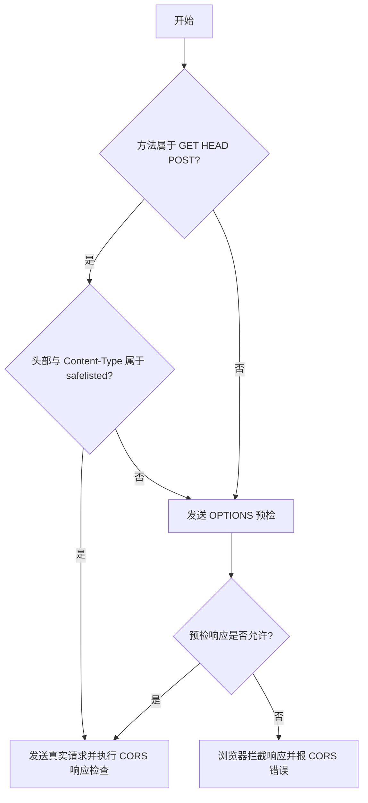

# CORS、CSP 与 Cookie：MDN 精读

!!! abstract "核心结论"
    - 同源策略限制的是跨源响应被脚本读取，而不是请求发出；浏览器会根据 CORS 响应头决定是否把 body 与部分头部交给 JavaScript。
    - 简单请求必须同时满足方法、CORS-safelisted 请求头、Content-Type、无 XHR upload listener、无 ReadableStream 等条件，否则触发 OPTIONS 预检。
    - 凭据模式下不能返回 `Access-Control-Allow-Origin: *`，服务器必须返回精确 Origin 并设置 `Access-Control-Allow-Credentials: true`。
    - CSP 是 XSS 纵深防御：`script-src` 配合 nonce、hash、`strict-dynamic` 能限制脚本来源，但不能替代输入消毒。
    - Cookie 安全依赖 `Secure`、`HttpOnly`、`SameSite`、`Partitioned`；Fetch Metadata 与 CORP/COOP/COEP 分别提供请求上下文和资源嵌入层的防护。

## 1. 同源策略、简单请求与预检

### 1.1 同源策略的底层边界

同源策略中，Origin 由 scheme、host、port 三部分组成。`fetch()` 与 `XMLHttpRequest` 默认遵循同源策略：脚本只能读取同源响应。CORS 是基于 HTTP header 的机制，允许服务器声明哪些其他 Origin 可以读取该资源。

关键点在于：浏览器不是“不发送”跨源请求，而是“不把响应交给发起脚本”。对于 `fetch()`、XHR、Web Fonts、canvas 纹理等场景，浏览器会发出请求，然后检查响应是否携带正确的 CORS 头。CORS 失败时，JavaScript 只能得到“发生错误”，具体原因必须看浏览器控制台，这是安全设计。

### 1.2 简单请求的判定

“简单请求”来自旧版 CORS 规范，当前 Fetch 规范不再使用这个词，但面试与工程讨论仍广泛使用。它的设计动机是：HTML 表单历史上的跨源提交能力已经使服务器必须防御 CSRF，因此这些“看起来像表单提交”的请求可以免去预检；但服务器仍必须用 `Access-Control-Allow-Origin` 明确选择“分享响应”。

| 维度 | 简单请求条件 |
| --- | --- |
| 方法 | `GET`、`HEAD`、`POST` |
| 手动设置的头 | `Accept`、`Accept-Language`、`Content-Language`、`Content-Type`、`Range` |
| `Content-Type` | `application/x-www-form-urlencoded`、`multipart/form-data`、`text/plain` |
| `Range` | 单一 range 值，例如 `bytes=256-` 或 `bytes=127-255` |
| XHR upload | 不能给 `xhr.upload` 注册事件监听器 |
| body | 不能使用 `ReadableStream` 对象 |

不满足任一条件就触发预检。WebKit Nightly 与 Safari Technology Preview 还会对 `Accept`、`Accept-Language`、`Content-Language` 的非标准值额外限制，具体行为需核对官方文档。

### 1.3 预检请求与缓存

预检请求使用 `OPTIONS` 方法，浏览器自动发出，携带：

- `Origin`: 发起页面的源
- `Access-Control-Request-Method`: 真实请求要用的方法
- `Access-Control-Request-Headers`: 真实请求要带的自定义头

服务器预检响应用 `Access-Control-Allow-Methods`、`Access-Control-Allow-Headers`、`Access-Control-Max-Age` 等头表达允许范围。浏览器根据 `Access-Control-Max-Age` 缓存预检结果，缓存键通常与方法、头部、Origin 有关；多 Origin 动态响应必须配合 `Vary: Origin`，否则共享缓存可能把 A 源的 CORS 配置错误复用到 B 源。



## 2. Access-Control-* 头与凭据模式

### 2.1 CORS 请求头与响应头

| Header | 方向 | 作用 |
| --- | --- | --- |
| `Origin` | 请求 | 浏览器自动发送，表明请求来自哪个源 |
| `Access-Control-Request-Method` | 预检请求 | 真实请求将使用的方法 |
| `Access-Control-Request-Headers` | 预检请求 | 真实请求将携带的自定义头 |
| `Access-Control-Allow-Origin` | 响应 | 允许读取响应的源，或 `*` |
| `Access-Control-Allow-Credentials` | 响应 | 是否允许携带 Cookie、HTTP 认证等凭据 |
| `Access-Control-Allow-Methods` | 预检响应 | 允许的方法列表 |
| `Access-Control-Allow-Headers` | 预检响应 | 允许的请求头列表 |
| `Access-Control-Expose-Headers` | 响应 | 允许 JavaScript 读取的响应头白名单 |
| `Access-Control-Max-Age` | 预检响应 | 预检结果缓存秒数 |

实际请求的响应同样需要 `Access-Control-Allow-Origin`。预检只决定“是否允许发送真实请求”，真实响应仍需要 CORS 头完成“是否允许脚本读取”。

### 2.2 凭据模式

凭据包括 Cookie、TLS 客户端证书、HTTP 认证信息。当 JavaScript 使用 `credentials: 'include'` 或 XHR 的 `withCredentials = true` 发起跨源请求时，服务器必须满足：

- 返回明确的 `Access-Control-Allow-Origin`，不能是 `*`
- 返回 `Access-Control-Allow-Credentials: true`
- 预检响应与真实响应都要设置上述两个头

否则浏览器不会把响应体交给发起脚本。这是“带 Cookie 的跨源请求”最常见的配置错误。

## 3. 手写 CORS 中间件与决策模拟器

### 3.1 CORS 中间件实现

这段代码要解决：在 Node HTTP 服务中统一处理实际请求的 CORS 响应头，并短路处理 OPTIONS 预检；同时加入服务端预检计算缓存与 `Vary: Origin`。

```javascript
// 运行环境：Node.js 原生 ESM 环境，保存为 cors-middleware.mjs
// 说明：纯函数中间件，不依赖框架；用假 req/res 即可测试。

export function createCorsMiddleware(options = {}) {
  const {
    origin = '*',
    allowCredentials = false,
    methods = ['GET', 'HEAD', 'POST'],
    allowedHeaders = ['Content-Type'],
    maxAge = 600,
  } = options;

  // 第 1 段：预检结果缓存
  // key 使用 origin、method、headers 组合；真实浏览器缓存由 Access-Control-Max-Age 控制，
  // 这里额外维护服务端缓存，重复预检到来时直接返回相同结果。
  const preflightCache = new Map();

  function isPreflight(req) {
    return req.method === 'OPTIONS' && Boolean(req.headers['access-control-request-method']);
  }

  function cacheKey(originValue, method, headers) {
    return [originValue, method, headers ?? ''].join('\u0000');
  }

  // 第 2 段：中间件主体
  return function corsMiddleware(req, res, next) {
    const requestOrigin = req.headers.origin;

    if (requestOrigin) {
      let allowOrigin;
      if (allowCredentials) {
        // 凭据模式不允许 *，只能回显请求源；生产环境应在应用层做 Origin 白名单校验
        allowOrigin = requestOrigin;
      } else {
        allowOrigin = origin;
      }

      res.setHeader('Access-Control-Allow-Origin', allowOrigin);

      // 非通配源必须加 Vary: Origin，否则共享缓存可能把不同 Origin 的响应串掉
      if (allowOrigin !== '*') {
        const previous = res.getHeader('Vary');
        const next = previous ? `${String(previous)}, Origin` : 'Origin';
        res.setHeader('Vary', next);
      }

      if (allowCredentials) {
        res.setHeader('Access-Control-Allow-Credentials', 'true');
      }
    }

    // 第 3 段：预检短路
    if (isPreflight(req)) {
      const requestedMethod = req.headers['access-control-request-method'];
      const requestedHeaders = req.headers['access-control-request-headers'];
      const key = cacheKey(requestOrigin, requestedMethod, requestedHeaders);
      const hit = preflightCache.get(key);

      if (hit && hit.expiresAt > Date.now()) {
        res.statusCode = 204;
        return res.end();
      }

      if (!methods.includes(requestedMethod)) {
        res.statusCode = 204;
        return res.end();
      }

      res.setHeader('Access-Control-Allow-Methods', methods.join(','));
      if (requestedHeaders) {
        res.setHeader('Access-Control-Allow-Headers', requestedHeaders);
      }
      res.setHeader('Access-Control-Max-Age', String(maxAge));

      preflightCache.set(key, { expiresAt: Date.now() + maxAge * 1000 });
      res.statusCode = 204;
      return res.end();
    }

    // 非预检请求继续交给后续业务处理
    next();
  };
}
```

代码解析：

1. `createCorsMiddleware` 把配置固化为闭包状态；`preflightCache` 是每实例缓存，模拟“上次算过的规则直接复用”。
2. 实际请求只处理有 `Origin` 头的情况，避免对同源请求或非浏览器请求无意义地增加头。
3. 凭据模式下 `Access-Control-Allow-Origin` 必须精确回显请求源且不能是 `*`；生产环境还需要对白名单做业务校验。
4. 预检返回 204 即可，不需要 body；`Access-Control-Max-Age` 告诉浏览器缓存预检结果秒数。
5. 缓存命中时仍返回 204，但不重复计算 header；服务端缓存与浏览器缓存的共同点是键必须包含 Origin 与请求头组合。

### 3.2 验证标准：CORS 中间件

```javascript
// 运行环境：Node.js 原生 ESM，保存为 cors-middleware.test.mjs
import assert from 'node:assert/strict';
import { createCorsMiddleware } from './cors-middleware.mjs';

function fakeRes() {
  const headers = {};
  return {
    statusCode: 200,
    setHeader(name, value) {
      headers[name.toLowerCase()] = String(value);
    },
    getHeader(name) {
      return headers[name.toLowerCase()];
    },
    end() {},
  };
}

const mw = createCorsMiddleware({
  origin: 'https://api.example.com',
  allowCredentials: true,
  methods: ['GET', 'HEAD', 'POST', 'PUT'],
  allowedHeaders: ['Content-Type', 'x-custom'],
  maxAge: 600,
});

// 预检请求：带自定义头 x-custom，会触发 OPTIONS
const preflightReq = {
  method: 'OPTIONS',
  headers: {
    origin: 'https://app.example.com',
    'access-control-request-method': 'POST',
    'access-control-request-headers': 'x-custom',
  },
};
const preflightRes = fakeRes();
let nextCalled = false;
mw(preflightReq, preflightRes, () => { nextCalled = true; });

assert.equal(nextCalled, false);
assert.equal(preflightRes.statusCode, 204);
assert.equal(preflightRes.getHeader('access-control-allow-origin'), 'https://app.example.com');
assert.equal(preflightRes.getHeader('access-control-allow-credentials'), 'true');
assert.match(preflightRes.getHeader('access-control-allow-methods'), /PUT/);
assert.equal(preflightRes.getHeader('access-control-allow-headers'), 'x-custom');
assert.equal(preflightRes.getHeader('access-control-max-age'), '600');
assert.equal(preflightRes.getHeader('vary'), 'Origin');

// 真实 GET 请求应该继续调用 next
const getReq = { method: 'GET', headers: { origin: 'https://app.example.com' } };
const getRes = fakeRes();
let getNextCalled = false;
mw(getReq, getRes, () => { getNextCalled = true; });

assert.equal(getNextCalled, true);
assert.equal(getRes.getHeader('access-control-allow-origin'), 'https://app.example.com');

console.log('CORS middleware tests passed');
// 预期输出：CORS middleware tests passed
```

### 3.3 CORS 决策模拟器

这段代码要解决：不发起网络请求，只根据输入请求的方法、头、Content-Type、XHR upload listener、ReadableStream 等信息，预测浏览器会按简单请求处理还是先发预检。

```javascript
// 运行环境：Node.js 原生 ESM，保存为 cors-decision.mjs
// 说明：模拟 Fetch 规范中的“简单请求”判定，不包含 WebKit/Safari 的非公开额外限制。

const SIMPLE_METHODS = new Set(['GET', 'HEAD', 'POST']);
const SAFELISTED_HEADERS = new Set([
  'accept',
  'accept-language',
  'content-language',
  'content-type',
  'range',
]);
const SIMPLE_CONTENT_TYPES = new Set([
  'application/x-www-form-urlencoded',
  'multipart/form-data',
  'text/plain',
]);

function isSingleRangeValue(value) {
  const text = String(value).trim();
  const match = /^bytes=(\d*)-(\d*)$/.exec(text);
  if (!match) return false;
  if (match[1] === '' && match[2] === '') return false;
  return true;
}

export function classifyCorsRequest({
  method = 'GET',
  headers = {},
  uploadListener = false,
  readableStream = false,
} = {}) {
  // 第 1 段：方法检查
  if (!SIMPLE_METHODS.has(method.toUpperCase())) {
    return { kind: 'preflight', reason: `method ${method} is not simple` };
  }

  // 第 2 段：手动头部检查
  for (const [name, value] of Object.entries(headers)) {
    const lowerName = name.toLowerCase();
    if (!SAFELISTED_HEADERS.has(lowerName)) {
      return { kind: 'preflight', reason: `header ${name} is not safelisted` };
    }

    if (lowerName === 'content-type') {
      const mime = String(value).split(';', 1)[0].trim().toLowerCase();
      if (!SIMPLE_CONTENT_TYPES.has(mime)) {
        return { kind: 'preflight', reason: `content-type ${value} is not simple` };
      }
    }

    if (lowerName === 'range' && !isSingleRangeValue(value)) {
      return { kind: 'preflight', reason: `range ${value} is not a single range` };
    }
  }

  // 第 3 段：XHR upload listener 与 ReadableStream 都会强制预检
  if (uploadListener || readableStream) {
    return { kind: 'preflight', reason: 'upload listener or ReadableStream forces preflight' };
  }

  return { kind: 'simple' };
}
```

代码解析：

1. 方法优先级最高，先排除 `PUT`、`DELETE` 等非简单方法，底层原因是从表单历史和安全性出发只放行 GET/HEAD/POST。
2. 头部检查区分“自动设置的头”与“脚本手动设置的头”；自动头不会被手动检查。
3. `Content-Type` 只比较 MIME 子类型，忽略 `charset` 参数，因此 `text/plain;charset=UTF-8` 仍属于简单类型。
4. `uploadListener` 与 `readableStream` 两个条件是浏览器内部实现差异的常见面试考点：它们会直接触发预检。
5. 决策器只输出 `simple` 或 `preflight`，不表示最终一定能读响应；响应读取还要再经过 CORS 响应检查。

验证标准：

```javascript
// 运行环境：Node.js 原生 ESM，保存为 cors-decision.test.mjs
import assert from 'node:assert/strict';
import { classifyCorsRequest } from './cors-decision.mjs';

const cases = [
  [{ method: 'GET' }, 'simple'],
  [{ method: 'PUT' }, 'preflight'],
  [{ method: 'POST', headers: { 'Content-Type': 'application/json' } }, 'preflight'],
  [{ method: 'POST', headers: { 'Content-Type': 'text/plain;charset=UTF-8' } }, 'simple'],
  [{ method: 'POST', headers: { 'X-Api-Key': '1' } }, 'preflight'],
  [{ method: 'GET', readableStream: true, uploadListener: false }, 'preflight'],
];

for (const [input, expected] of cases) {
  const result = classifyCorsRequest(input);
  assert.equal(result.kind, expected, `${JSON.stringify(input)} -> ${result.reason}`);
}

console.log('cors-decision tests passed');
// 预期输出：cors-decision tests passed
```

## 4. CSP：内容安全策略

### 4.1 指令与资源加载控制

CSP 通常通过 `Content-Security-Policy` response header 下发，也可以放在文档的 `<meta http-equiv="Content-Security-Policy">` 中，但 meta 不支持全部 CSP 能力。策略由分号分隔的 directive 组成，每个 directive 名后跟空格与值。

CSP 的首要用途是控制资源加载，尤其是 JavaScript。它不能替代输入消毒，而是在消毒失败后提供纵深防御。注入的恶意代码可能表现为 `<script src>`、内联 `<script>`、内联事件处理器、`javascript:` URL、传入 `eval()` 的字符串等。

| 指令 | 控制目标 |
| --- | --- |
| `default-src` | 未指定更具体指令时的默认资源源 |
| `script-src` | JavaScript 脚本的加载与执行源 |
| `img-src` | 图片来源 |
| `object-src` | `object`、`embed` 等资源 |
| `base-uri` | 文档基准 URL 范围 |
| `upgrade-insecure-requests` | 将不安全的资源请求升级为 HTTPS |

例如 `default-src 'self'; img-src 'self' example.com` 表示除图片外所有资源仅允许同源；图片允许同源或来自 `example.com`。

### 4.2 nonce、hash 与 strict-dynamic

- nonce：服务端每次响应生成随机值并写入 CSP，同时页面内合法 `<script nonce="...">` 使用相同值；浏览器只允许 nonce 匹配的脚本执行。
- hash：对合法内联脚本内容计算加密哈希，CSP 中声明 `'sha256-...'`；内容任何改动都会使哈希不匹配。
- `strict-dynamic`：信任已被 nonce 或 hash 授权的脚本创建的后续脚本加载；对于符合 CSP3 的浏览器，使用 `strict-dynamic` 后，`script-src` 中的 host allowlist 会被忽略。

strict-dynamic 的思路是：只要能先证明一个脚本可信，就信任它运行时创建的脚本，从而兼顾安全性与现代前端打包器的动态加载。具体兼容性应以目标浏览器的 CSP3 支持为准。

### 4.3 CSP nonce 生成与校验示例

这段代码要解决：用 Node 的密码学随机数生成每次响应都不同的 nonce，并构建 CSP header；同时提供“策略中是否包含该 nonce”和“nonce 格式是否合格”两个校验函数。

```javascript
// 运行环境：Node.js 原生 ESM，保存为 csp-nonce.mjs
import crypto from 'node:crypto';

export function generateNonce(byteLength = 16) {
  return crypto.randomBytes(byteLength).toString('base64');
}

export function buildCspHeader({ scriptSrc = ["'self'"], extraDirectives = {} } = {}) {
  // 第 1 段：每次调用生成新的 nonce
  const nonce = generateNonce();

  // 第 2 段：将 nonce 注入 script-src
  const directives = [
    "default-src 'self'",
    `script-src ${scriptSrc.join(' ')} 'nonce-${nonce}' 'strict-dynamic'`,
    "object-src 'none'",
    "base-uri 'self'",
  ];

  for (const [name, value] of Object.entries(extraDirectives)) {
    directives.push(`${name} ${value}`);
  }

  return { policy: directives.join('; '), nonce };
}

export function policyContainsNonce(policy, nonce) {
  return policy
    .split(';')
    .some((directive) =>
      directive.trim().split(/\s+/).includes(`'nonce-${nonce}'`)
    );
}

export function isSafeNonce(nonce) {
  if (typeof nonce !== 'string' || nonce.length === 0) return false;
  return /^[A-Za-z0-9+/]+={0,2}$/.test(nonce);
}
```

代码解析：

1. `generateNonce` 使用 `crypto.randomBytes` 而不是 `Math.random`，因为 nonce 的安全依赖不可预测性。
2. `buildCspHeader` 返回 `{ policy, nonce }`，调用方可以把 `nonce` 写入合法脚本标签，把 `policy` 写入响应头。
3. `policyContainsNonce` 做的是字符串级校验，只确认策略里声明了该 nonce；真正执行校验的是浏览器引擎。
4. `isSafeNonce` 只检查 base64 字符集和可选 padding，用于防御把空字符串或错误数据传入 CSP。

验证标准：

```javascript
// 运行环境：Node.js 原生 ESM，保存为 csp-nonce.test.mjs
import assert from 'node:assert/strict';
import { buildCspHeader, isSafeNonce, policyContainsNonce } from './csp-nonce.mjs';

const first = buildCspHeader();
const second = buildCspHeader();

assert.equal(policyContainsNonce(first.policy, first.nonce), true);
assert.equal(policyContainsNonce(second.policy, second.nonce), true);
assert.equal(isSafeNonce(first.nonce), true);
assert.notEqual(first.nonce, second.nonce);

console.log('csp-nonce tests passed');
// 预期输出：csp-nonce tests passed
```

## 5. Cookie 属性与会话安全

### 5.1 Set-Cookie 与生命周期

服务器通过 `Set-Cookie` 响应头写入 Cookie，浏览器在后续请求中通过 `Cookie` 请求头回传。Cookie 主要用于 session management、personalization、tracking。

生命周期规则：

- `Expires`: 指定删除日期，受客户端时钟影响。
- `Max-Age`: 指定相对秒数，设置错误风险较低；同时设置时 `Max-Age` 优先。
- session cookie: 没有 `Expires` 与 `Max-Age`，会话结束时删除；部分浏览器会恢复会话导致其存活更久。

Cookie 不适合作为现代客户端存储：每个域有数量上限（通常数百个），每个 Cookie 通常约 4KB，且每次请求都会发送，影响性能。需要本地存储时应优先使用 Web Storage 或 IndexedDB。

### 5.2 SameSite、Secure、HttpOnly、Partitioned

| 属性 | 行为 |
| --- | --- |
| `Secure` | 只能在安全上下文中发送，避免 HTTP 明文泄露 |
| `HttpOnly` | 禁止 JavaScript 通过 `document.cookie` 读取，降低 XSS 窃取风险 |
| `SameSite=Strict` | 跨站请求不携带 Cookie，CSRF 防护最强 |
| `SameSite=Lax` | 顶级导航 GET 允许携带，其他跨站请求不携带，兼顾体验到站跳转 |
| `SameSite=None` | 允许第三方/跨站上下文携带，需要配合 `Secure` |
| `Partitioned` | 按顶级站点分区存储第三方 Cookie，需配合 `Secure` |

工程实践建议：

- 会话 Cookie 必须设置 `HttpOnly` 与 `Secure`。
- 只给真正需要跨站可携带的 Cookie 使用 `SameSite=None`。
- 第三方 Cookie 场景优先评估 `Partitioned` 是否满足业务，而不是无差别使用 `SameSite=None`。
- 用户每次重新认证后应轮换 session cookie，降低 session fixation 风险。

## 6. Fetch Metadata 与 CORP/COOP/COEP

### 6.1 Fetch Metadata 请求头

Fetch Metadata 是一组 `Sec-` 前缀的请求头，描述请求发起的上下文。浏览器禁止网页脚本修改这些头；它们只发送到 potentially trustworthy URLs，纯 `http://` 源不会收到这些头。

| Header | 含义 |
| --- | --- |
| `Sec-Fetch-Dest` | 资源用途，如 `document`、`script`、`image`、`iframe`、`empty` |
| `Sec-Fetch-Mode` | 请求模式，如 `navigate`、`cors`、`no-cors`、`same-origin` |
| `Sec-Fetch-Site` | 请求方与目标的关系：`none`、`same-origin`、`same-site`、`cross-site` |
| `Sec-Fetch-User` | 是否为用户主动触发的请求 |

`Sec-Fetch-Site` 的典型映射：

| 链接目标 | `Sec-Fetch-Site` |
| --- | --- |
| `https://books.example.org/titles` | `same-origin` |
| `https://login.example.org/` | `same-site` |
| `https://books.example.com/titles` | `cross-site` |
| 地址栏输入或书签打开 | `none` |

服务端可以利用这些头做 CSRF 与跨站泄漏的粗粒度防御，例如拒绝 `Sec-Fetch-Site: cross-site` 的状态变更请求。但必须注意：非安全 HTTP 源不会发送这些头，因此不能作为唯一防线。

### 6.2 CORP

Cross-Origin Resource Policy（CORP）通过 `Cross-Origin-Resource-Policy` response header 控制哪些来源可以读取响应体，取值：

| 取值 | 允许读取者 |
| --- | --- |
| `same-origin` | 同源请求 |
| `same-site` | 同一 site 的请求 |
| `cross-origin` | 任意源 |

CORP 只对 `no-cors` 请求生效。`no-cors` 请求默认允许加载跨源子资源，但响应是 opaque 的；CORP 被违反时，浏览器不是阻止请求，而是剥离响应体，防止数据被跨源脚本读取。它的主要动机是缓解 Spectre 这类 speculative side-channel attack，以及 Cross-Site Script Inclusion。

### 6.3 COOP 与 COEP

COEP（Cross-Origin-Embedder-Policy）用于要求文档加载的子资源要么同源，要么资源本身用 CORP 明确声明允许嵌入。这样 `cross-origin` 的 CORP 值就与 COEP 配合使用。

COOP（Cross-Origin-Opener-Policy）是顶级文档隔离策略，常与 COEP 一起组成跨源隔离配置。COOP 控制不同源文档之间的 browsing context 关系，避免恶意页面引用 `window.opener` 或通过 side-channel 观察目标页面；具体取值与浏览器默认行为差异较大，面试准备时应以 MDN 的 `Cross-Origin-Opener-Policy` 官方文档为准。

## 7. 常见陷阱

1. **CORS 错误无法从 JavaScript 拿到细节**。`fetch` 只会报 `TypeError`，开发者必须打开控制台查看 network 与 console 的 CORS 原因。

2. **凭据模式使用 `*` 返回源**。`Access-Control-Allow-Origin: *` 与 `Access-Control-Allow-Credentials: true` 同时出现时，浏览器不会把响应交给脚本；带凭据请求必须精确回显 Origin。

3. **预检响应漏掉 `Access-Control-Allow-Headers`**。真实请求带 `X-Api-Key`，预检只回 `Access-Control-Allow-Methods` 不回 `Access-Control-Allow-Headers`，浏览器仍会拦截真实请求。

4. **忽略 `Vary: Origin`**。如果 CORS 响应根据请求 Origin 动态变化，却没有 `Vary: Origin`，共享缓存可能把源 A 的 allow-origin 头缓存后返回给源 B。

5. **nonce 复用导致 CSP 形同虚设**。nonce 必须按响应生成，如果静态页面缓存了旧 nonce，攻击脚本只要拿到页面中的合法 nonce 就能执行。

6. **把 CSP 当作 sanitization 的替代品**。CSP 能减缓 XSS 影响，但无法修复数据流里的注入点；输入消毒、输出编码与 CSP 必须同时做。

7. **`SameSite=None` 不搭配 `Secure`**。现代浏览器会拒绝不安全上下文中的 `SameSite=None` Cookie，导致第三方登录、嵌入支付等场景中断。

8. **假设 Fetch Metadata 在所有环境都存在**。纯 HTTP 源不会收到 `Sec-` 头，因此后端实现 CSRF 防护时仍需要 origin check、CSRF token 等常规手段。

9. **CORP 对 CORS 请求不生效**。CORP 目标是 `no-cors` 响应体泄漏，不要把 CORP 当成 `Access-Control-Allow-Origin` 的替代品。

10. **在 PDF 服务上盲目加 CORP**。历史版本 Chrome 存在 PDF 渲染 bug，设置 `Cross-Origin-Resource-Policy` 可能导致部分 PDF 无法阅读完整内容，生产环境应谨慎验证。

## 8. 面试题与答题要点

**题 1：同源策略拦截请求、阻止发送，还是别的？**

要点：同源策略不阻止浏览器发出请求；它阻止发起脚本读取跨源响应。预检场景下，如果预检不通过，真实请求不会发出；如果预检通过但真实响应缺 CORS 头，响应体会被浏览器拦截，JS 只能看到错误。安全设计上“发送”与“读取”是两件事。

**题 2：什么是简单请求？给定一个 `POST application/json`，会不会触发预检？**

要点：`application/json` 不属于简单 Content-Type，会触发预检。简单请求必须方法为 GET/HEAD/POST，且只有 CORS-safelisted headers，Content-Type 只允许 form-urlencoded、multipart/form-data、text/plain，不能有 XHR upload listener 或 ReadableStream。

**题 3：预检请求为什么存在？服务器没有预检接口会怎样？**

要点：预检用于在真实请求可能产生副作用前，先确认服务器是否接受该方法与头。如果服务器不处理 `OPTIONS`，浏览器将预检视为失败，真实请求不会发送。历史动机是表单提交型请求已经可跨源发生，所以简单请求不需要预检，但服务器仍需 CORS 头选择分享响应。

**题 4：`Access-Control-Allow-Origin: *` 和回显请求 Origin 有什么区别？**

要点：`*` 允许任意源读取响应，但只适用于不携带凭据的请求；携带 Cookie 或 HTTP 认证时必须回显精确 Origin 并设置 `Access-Control-Allow-Credentials: true`。动态回显时必须配合 `Vary: Origin`。

**题 5：`credentials: 'include'` 时服务器需要返回哪些头？**

要点：真实响应需要 `Access-Control-Allow-Origin: <精确Origin>` 与 `Access-Control-Allow-Credentials: true`；如果触发预检，预检响应同样需要这两个头。`*` 与凭据模式互斥。

**题 6：CSP nonce 和 hash 怎么选？**

要点：nonce 适合服务端渲染且每次响应生成，页面 `<script nonce="...">` 一致；hash 适合内容固定、可构建期计算的站点。`strict-dynamic` 适合有可信加载器、后续脚本动态注入的现代应用；指定后 CSP3 浏览器会忽略 script-src 的 host allowlist，降低策略维护成本。

**题 7：SameSite=Lax 与 Strict 为什么能防 CSRF？**

要点：CSRF 攻击依赖浏览器在跨站请求中自动带 Cookie。SameSite=Strict 拒绝所有跨站请求带 Cookie；Lax 只允许跨站顶级导航 GET 携带，阻止 POST 表单或 `fetch` 等跨站变更请求。`SameSite=None` 不提供 CSRF 防护，仍需 token 或 origin/fetch metadata 校验。

**题 8：Fetch Metadata 如何用于后端防护？**

要点：服务端可以读取 `Sec-Fetch-Site`、`Sec-Fetch-Mode`、`Sec-Fetch-Dest`，对 `cross-site` 的状态变更请求直接拒绝或要求额外 token。它只能覆盖安全上下文，且不能单独作为唯一防线；对不支持 Fetch Metadata 的客户端需要兼容性降级。

**题 9：CORP 和 CORS 的区别？**

要点：CORS 控制“跨源脚本能否在 cors 模式下读响应”；CORP 控制“no-cors 跨源加载能否保留响应体”，违规时浏览器直接剥离 body。CORP 不是请求拦截，而是结果防泄漏，主要针对 Spectre 类 side-channel 与 XSSI。

## 深入阅读与参考

!!! tip "怎么用这些资料"
    先读「官方文档与规范」建立准确的概念，再读「源码与示例」核对细节，最后用「教程、书籍与视频」换一种讲法加深理解。每条都写明了读哪一节、带着什么问题读。

### 官方文档与规范

| 资源 | 为什么读 | 怎么读 |
|---|---|---|
| [MDN：同源策略](https://developer.mozilla.org/en-US/docs/Web/Security/Defenses/Same-origin_policy) | 同源策略是本页一切跨域与 Cookie 限制的根基。 | 读定义与例外，用两个本地端口实测 fetch、iframe、Cookie 的差异。 |
| [Cross-Origin Resource Sharing (CORS)](https://developer.mozilla.org/en-US/docs/Web/HTTP/Guides/CORS) | 官方 CORS 权威指南，覆盖简单请求、预检与凭据模式。 | 对照 Fetch 标准读预检与凭据两节，本地复现一次 OPTIONS 交换。 |
| [Fetch 标准（含 CORS）](https://fetch.spec.whatwg.org/) | 规范原文界定预检触发条件与响应头校验算法。 | 只读 CORS protocol 一节，回查 MDN 未讲清的边界情形。 |
| [CORS errors](https://developer.mozilla.org/en-US/docs/Web/HTTP/Guides/CORS/Errors) | CORS 错误索引，覆盖常见陷阱与面试常考报错。 | 带着 DevTools 报错查对应条目，整理成一张排查清单。 |
| [Cross-Origin Resource Policy (CORP) implementation](https://developer.mozilla.org/en-US/docs/Web/Security/Practical_implementation_guides/CORP) | CORP 实施指南，解释跨源资源加载限制。 | 读部署步骤，给测试页图片加 CORP 头并观察加载结果。 |
| [Content Security Policy (CSP) implementation](https://developer.mozilla.org/en-US/docs/Web/Security/Practical_implementation_guides/CSP) | CSP 落地指南，从报告模式讲到逐步收紧。 | 按步骤在测试页启用策略，观察控制台违规报告。 |
| [Secure cookie configuration](https://developer.mozilla.org/en-US/docs/Web/Security/Practical_implementation_guides/Cookies) | Cookie 安全属性配置指南，含 SameSite 与 Cookie 前缀。 | 逐条设置属性，在 DevTools 与跨站请求中验证效果。 |
| [Fetch metadata](https://developer.mozilla.org/en-US/docs/Web/HTTP/Guides/Fetch_metadata) | Fetch Metadata 官方指南，识别跨站请求来源。 | 读 Sec-Fetch-* 各值语义，为接口写一套资源隔离策略。 |
| [HTML 规范：浏览上下文与同源](https://html.spec.whatwg.org/multipage/browsers.html) | 规范定义 origin 与跨源隔离，对应 COOP 与 COEP。 | 读 origin 与 cross-origin isolation 部分，验证 crossOriginIsolated。 |

### 源码与示例

| 资源 | 为什么读 | 怎么读 |
|---|---|---|
| [PortSwigger：CORS](https://portswigger.net/web-security/cors) | 真实漏洞实验，理解 CORS 配置错误如何被利用。 | 做两三个跨域实验，总结白名单与凭据的安全配置原则。 |

### 教程、书籍与视频

| 资源 | 为什么读 | 怎么读 |
|---|---|---|
| [阮一峰：跨域资源共享 CORS 详解](https://www.ruanyifeng.com/blog/2016/04/cors.html) | 中文长文把简单请求与预检讲透，适合入门打底。 | 读完用 Node 写一遍响应头，再对照规范修正偏差。 |
| [web.dev：跨源隔离指南](https://web.dev/articles/cross-origin-isolation-guide) | 跨源隔离实操指南，串起 COOP、COEP 与 SharedArrayBuffer。 | 照步骤启用两个头，确认 crossOriginIsolated 为 true。 |
| [web.dev：内容安全策略](https://web.dev/articles/csp) | 严格 CSP 实践方案，含 nonce 与信任链取舍。 | 照方案配 nonce 策略，再用控制台报告迭代修正。 |

## 应用与行业实践

### 应用场景地图

| 场景 | 用到本页哪个知识点 | 典型技术选型 | 注意事项 |
| --- | --- | --- | --- |
| 后台管理页导出万行 CSV，页面在 app.example.com，接口在 api.example.com | 预检触发条件、`Access-Control-Expose-Headers`、凭据模式 | `fetch` + Blob 下载、Node/Fastify 的 cors 中间件 | 文件名放在 `Content-Disposition` 时要在 `expose-headers` 里列出，否则 JS 读不到；给预检加 `Max-Age` 可减少 OPTIONS 往返 |
| 低端安卓机的首屏加载，脚本来自自有 CDN 与第三方统计 | CSP 的 `script-src` nonce、`strict-dynamic` | Nginx 注入 nonce、CSP 上报端点 | `strict-dynamic` 生效后 host 白名单会被忽略，先确认第三方脚本能拿到 nonce |
| 多人协作白板，光标与笔迹要低延迟同步 | COOP/COEP、CORP、`crossorigin` 属性 | SharedArrayBuffer + Web Worker + Canvas | 开 `require-corp` 前先清点跨源图片、字体、iframe，缺 CORP 头会被直接拦掉 |
| SaaS 仪表盘以 iframe 嵌入客户站点，需要维持登录态 | Cookie 的 `SameSite`/`Partitioned`、凭据模式 CORS | CHIPS、iframe + postMessage | 第三方 Cookie 被限制时改用 Partitioned 或令牌握手，不要靠去掉 `SameSite` 兜底 |
| 图片 CDN 需要前端读像素做裁剪预览 | CORS 的 `crossorigin` 属性、CORP | `canvas` + `Image.crossOrigin='anonymous'` | 只加 `crossOrigin` 而 CDN 不回 `Access-Control-Allow-Origin`，canvas 会被污染 |
| 微前端主应用按需加载子应用 bundle | 简单请求与预检、CSP 的 `script-src` | Module Federation、动态 `import()` | 子应用域名要进 CORS 白名单并回 CORP 头；CSP 里要为它单独开 `script-src` |
| 营销落地页的埋点信标，向 analytics 域发采集 | 简单请求（不触发预检） | `navigator.sendBeacon`、图片像素 | `sendBeacon` 带 Cookie 时属于凭据请求，响应端不能返回 `*` |
| 第三方支付收银台跳回本站并写入回执 | CSP 的 `form-action`/`frame-src`、Cookie 的 `Secure` | 表单 POST 回调、服务端下发签名 Cookie | 表单提交不受 CORS 管，靠 CSP `form-action` 限制；回调页要禁缓存 |

### 三个场景拆解

#### 场景 1：后台管理的跨源导出

**业务背景**：页面与接口分属两个域，导出按钮要下载十万行级别的 CSV，用户点一次等十几秒。当前实现是 `fetch` 拿 JSON 再拼字符串，浏览器内存峰值随行数线性上升。

**怎么用本页知识解决**：先把跨源许可收窄到白名单，再让浏览器直接接管下载流，避免把文件内容整体塞进 JS 内存。

```js
// 服务端：只在命中白名单时反射 Origin，并声明凭据
app.use((req, res, next) => {
  const origin = req.headers.origin;
  if (ALLOWED.has(origin)) {
    res.set('Access-Control-Allow-Origin', origin); // 精确 Origin，不能用 *
    res.set('Access-Control-Allow-Credentials', 'true');
    res.set('Vary', 'Origin'); // 让 CDN 和缓存按 Origin 分桶
  }
  if (req.method === 'OPTIONS') {
    res.set('Access-Control-Allow-Methods', 'GET,POST');
    res.set('Access-Control-Max-Age', '600'); // 预检结果缓存 10 分钟
    return res.status(204).end();
  }
  next();
});
```

- `fetch` 带 `credentials: 'include'` 时，服务端必须回精确 Origin，回 `*` 浏览器会直接丢弃响应。
- `Vary: Origin` 缺失时，CDN 可能把 A 租户的响应发给 B 租户。
- `Max-Age` 让同一组方法和头部的预检在一段时间内复用，减少 OPTIONS 请求。
- 大文件改用浏览器原生导航或 `location.assign`，下载不进 JS 堆，内存占用由浏览器管理。
- 需要读取 `Content-Disposition` 时，把它写进 `Access-Control-Expose-Headers`。

**怎么度量收益**：在 DevTools Network 面板按 `OPTIONS` 过滤，统计一次典型操作里的预检请求条数；用 `PerformanceObserver` 监听 `resource` 条目，比较导出的总耗时与传输字节；在 DevTools Performance 面板看内存曲线峰值。

**什么时候不该用**：一是纯静态、公开只读的资源，直接返回 `Access-Control-Allow-Origin: *` 即可，加凭据只会把缓存和排查复杂度抬高。二是同源部署的导出接口，套一层 CORS 中间件没有收益，直接走同源路径。

#### 场景 2：多人协作白板的线程与共享内存

**业务背景**：白板要在一个 worker 里跑图形计算，主线程只做绘制，笔迹延迟直接影响手感。站点同时嵌入了跨源的字体与头像图片。

**怎么用本页知识解决**：把页面放进跨源隔离环境，让 SharedArrayBuffer 可用；再用 CORP 与 `crossorigin` 属性把跨源资源逐个放行，而不是整体关掉隔离。

```js
// 服务端：把文档放进 cross-origin isolated 环境
res.set('Cross-Origin-Opener-Policy', 'same-origin');
res.set('Cross-Origin-Embedder-Policy', 'require-corp');
res.set('Cross-Origin-Resource-Policy', 'same-origin'); // 本站资源只允许同源嵌入

// 跨源资源要在标签上声明，并且对方回 CORS 与 CORP 头
// 
// CDN 应答：Access-Control-Allow-Origin: <页面源>
// CDN 应答：Cross-Origin-Resource-Policy: cross-origin

// 页面：确认隔离成立后再启用共享内存通道
if (crossOriginIsolated) {
  const sab = new SharedArrayBuffer(1024); // 未隔离时这里会抛错
}
```

- `COOP: same-origin` 切断跨源窗口引用，`COEP: require-corp` 要求所有子资源显式声明可被嵌入。
- 两个头要同时下发才形成隔离，只加其中一个，`crossOriginIsolated` 仍为 `false`。
- 跨源图片必须同时满足两点：标签上有 `crossorigin` 属性，服务端回来 CORS 与 CORP 头。
- 若有资源无法改造，把它挪到不参与计算的主页面的 iframe 里，隔离范围可以只覆盖编辑器。
- 隔离状态可以用 `crossOriginIsolated` 直接判断，据此决定是否启用多线程分支。

**怎么度量收益**：在 DevTools Console 里打印 `crossOriginIsolated`；用 Performance 面板录制一段连续涂鸦，比较主线程长任务（Long Task）条数与帧间隔；用 Issues 面板统计 CORP 相关拦截。

**什么时候不该用**：一是不涉及共享内存与高精度计时的页面，开隔离只会换来一批资源改造和报错。二是站点大量依赖无法加 CORP 头的第三方组件时，先把清单和替代方案定下来再上线，顺序反了会造成整站资源被拦。

#### 场景 3：嵌入客户站点的仪表盘与第三方 Cookie

**业务背景**：客户把仪表盘以 iframe 嵌入自己的管理后台，会话 Cookie 属于第三方上下文。客户侧浏览器对第三方 Cookie 的限制逐步收紧，登录态会随浏览行为丢失。

**怎么用本页知识解决**：把会话 Cookie 显式声明为分区状态，并让跨源凭据请求走白名单；同时在无分区能力的环境里准备令牌握手作为后备路径。

```js
// 服务端：嵌入式 iframe 场景的会话 Cookie
res.cookie('sid', token, {
  httpOnly: true,     // 挡住 XSS 直接读会话
  secure: true,       // 只在 HTTPS 上发送
  sameSite: 'none',   // 第三方上下文仍要带上，前提是 secure
  partitioned: true,  // CHIPS：按顶层站点分区，隔离跨站追踪
  path: '/',
  maxAge: 8 * 60 * 60 * 1000
});
```

- 分区后同一浏览器里，A 客户站点的 `sid` 与 B 客户站点的 `sid` 互不可见，串号问题消失。
- `sameSite: 'none'` 必须与 `secure` 同时出现，否则浏览器拒绝写入。
- 内嵌页面发起的请求属于跨源凭据请求，服务端要回精确 Origin 并设置 `Access-Control-Allow-Credentials: true`。
- 顶层框架可以通过 `frame-src` 限制，回调表单提交用 `form-action` 限制，两者都不受 CORS 约束。
- 检测到分区不可用时，改用 postMessage 传递短期令牌，会话不依赖第三方 Cookie。

**怎么度量收益**：在 DevTools 的 Application 面板查看 Cookie 是否带 Partitioned 标记；用 Network 面板统计请求头里 `Cookie` 的携带率与 401 响应占比；用 Issues 面板看第三方 Cookie 相关警告条数。

**什么时候不该用**：一是 iframe 与父页面同站（同注册域），此时 `SameSite=Lax` 就够用，开分区只是增加维护面。二是内嵌页面本身不涉及登录态时，为了跨站可见去掉 `HttpOnly` 是反向操作。

### 行业先进实践

CSP nonce 配合 `strict-dynamic`（出处：MDN 的 Content-Security-Policy 文档与 Google 的 CSP Evaluator 开源项目）。做法是每次响应生成随机 nonce，只给带 nonce 的脚本放行，并由这些脚本动态加载的后续脚本继承信任。这样即使攻击者注入了内联脚本块，也拿不到当次 nonce。你的项目可以把 nonce 生成放进模板渲染层，再用 CSP Evaluator 检查策略里是否存在可绕过的 host 白名单。

反射式 CORS 同时下发 `Vary: Origin`（出处：expressjs/cors 开源项目）。该中间件在 `origin` 配置为函数或反射当前 Origin 时，会向响应追加 `Vary: Origin`。它的作用是让缓存按 Origin 分桶，避免一个租户的响应被投递给另一个租户。自研中间件时，把这一行写进同一个函数里，避免漏加。

跨源隔离使用 COOP 与 COEP 组合（出处：web.dev 的 COOP 与 COEP 指南）。做法是页面同时声明 `Cross-Origin-Opener-Policy: same-origin` 与 `Cross-Origin-Embedder-Policy: require-corp`，随后 `crossOriginIsolated` 变为 `true`，SharedArrayBuffer 与高精度计时可用。代价是所有跨源子资源都要显式许可。借鉴方式是先做资源清单，再决定隔离覆盖哪些路由。

嵌入场景用 `Partitioned` Cookie（出处：MDN 的 Set-Cookie 文档中 `Partitioned` 属性条目）。做法是给第三方上下文使用的 Cookie 加 `Partitioned; Secure; SameSite=None`，浏览器按顶层站点把存储分区。同一段 Cookie 名在不同顶层站点下互不干扰，跨站追踪窗口被收窄。适合把 SaaS 面板嵌进客户后台的产品。

会话 Cookie 的默认值改为 `SameSite=Lax`（出处：MDN 的 Set-Cookie 文档与 Chromium 的 Incrementally Better Cookies 提案）。做法是未显式声明 `SameSite` 时按 Lax 处理，跨站的表单 POST 与 iframe 不再自动带上会话 Cookie。它把 CSRF 的默认面收窄，需要跨站的接口必须自己显式声明。你的项目可以据此排查所有依赖默认值的旧 Cookie。

### 从学到用：落地路线

第 1 步，选一条已经跨源的内部后台链路做试点，只改这一条链路的响应头。验收标准：白名单外的 Origin 拿到的响应里没有 `Access-Control-Allow-Origin`，白名单内的请求在 Network 面板里 OPTIONS 条数下降。

第 2 步，用 `curl` 与服务端测试覆盖四类边界：无 Origin、白名单外 Origin、带 Cookie 的跨源请求、预检失败的请求。验收标准：四类用例都有自动化断言，断言内容包含响应头与状态码。

第 3 步，把 CORS 决策与 CSP 模板抽成共享配置，按站点分批接入。验收标准：所有接入站点的相关响应头由同一份配置生成，改动走代码评审记录。

第 4 步，把响应头检查接入 CI 与定期扫描（例如 Mozilla Observatory 或 Lighthouse 的 best-practices 审计）。验收标准：新增跨源接口未声明 CORS 策略时，流水线直接失败。

### 动手作业

**目标**：搭一个前后端分域的小 demo，把本页的跨源、CSP、Cookie 三点跑通，并产出一份可复现的自查报告。

**步骤**

1. 把前端放在 `app.localhost:3000`，接口放在 `api.localhost:4000`，先用 `fetch` 请求一次，记录浏览器报的跨源错误原文。
2. 在接口上实现白名单式 CORS：反射精确 Origin、允许凭据、设置 `Max-Age` 与 `Vary: Origin`。
3. 加一个登录接口，下发 `httpOnly + secure + sameSite=lax` 的会话 Cookie；再做一个跨站 iframe 页面，把它换成 `sameSite='none'; partitioned` 后对比行为。
4. 给前端页面加 CSP，`script-src` 使用 nonce，再切到 `strict-dynamic`，接一个上报端点收集违规。
5. 让前端读取一个跨源响应头（例如 `X-Total-Count`），先故意不写进 `expose-headers` 观察读不到，再补上复测。
6. 打开 DevTools 的 Network、Application、Issues 三个面板，逐次记录 OPTIONS 条数、Cookie 标记、CSP 违规条数。
7. 写一份 Markdown 报告，按改动顺序列出响应头、浏览器行为与失败原因。

**验收标准**

- 用 `curl -H "Origin: https://evil.test"` 请求接口，响应里没有 `Access-Control-Allow-Origin`，浏览器端 `fetch` 抛 `TypeError`。
- 带 `credentials` 的跨源请求成功，且 `Access-Control-Allow-Origin` 的值等于页面 Origin，不是 `*`。
- nonce 生效后手工注入的内联脚本被拦下，Issues 面板出现对应违规记录。
- iframe 场景下 Application 面板的 Cookie 列表显示该 Cookie 带 Partitioned 标记。
- 仓库里的报告逐条对应上面的实验与观测结果，换一台机器按报告能复现同一结论。

