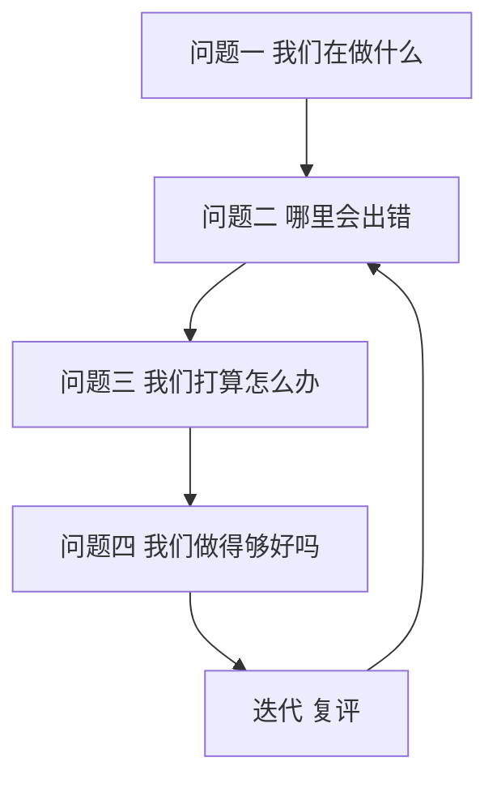
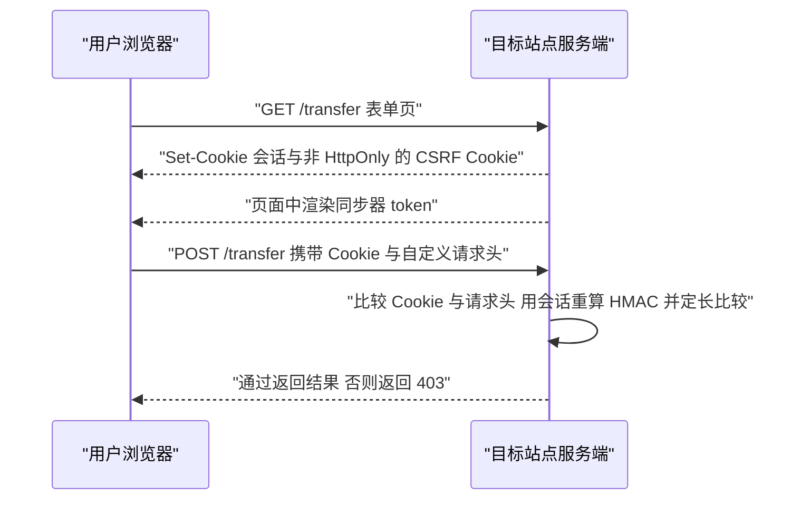

# Web 攻击与防御：MDN 精读

!!! abstract "核心结论"
    - 攻击与防御是多对多关系：MDN 的 attacks 页面明确写了 "A given attack may be countered by one or more mitigations"，所以不存在"装一个头就安全"的方案，必须按威胁建模逐个攻击面收口。
    - XSS 的本质不是"输入脏"，而是同一份数据被送进了 HTML 解析器的可执行上下文；MDN 指出 XSS 可以由正确的数据 sanitize 与 Content-Security-Policy 共同缓解，前者是根治，后者是纵深。
    - CSRF 依赖"浏览器自动携带凭据"这一事实，因此只把它当"表单来源校验"来防是错的；token、SameSite Cookie、Local network access 各自覆盖不同路径。
    - Clickjacking 的根因是目标站点允许被嵌入，主防线只有两条：CSP 的 `frame-ancestors` 指令与 `X-Frame-Options` 响应头，其中 `frame-ancestors` 是 `X-Frame-Options` 的替代方案且粒度更细。
    - HTTPS / TLS 是 MITM 唯一真正的防御手段（MDN 原文如此），其余头部、Cookie 属性、SRI、CT 都是在各自层面上补充覆盖，不能互相顶替。

## 1. 威胁建模：先把资产、对手、漏洞写成可评审的东西

### 1.1 术语链：威胁、漏洞、攻击、缓解、风险

MDN 的 threat_modeling 页面给出一条清晰的术语链：威胁（threat）是"可能伤害站点功能或其持有的数据的东西"；漏洞（vulnerability）是系统弱点，例如 XSS 或 JavaScript 原型污染；攻击（attack）是威胁真正落到运行中系统上的那次实施；缓解（mitigation）是回应漏洞的防御措施；风险（risk）由"发生的可能性"与"影响的严重程度"共同描述。

同一个页面用住宅做了类比，这个类比值得直接背下来。

| 概念 | 住宅类比（MDN 原文） | Web 对应 |
| --- | --- | --- |
| 威胁 Threat | 入室盗窃者 | 想窃取用户数据的外部攻击者 |
| 漏洞 Vulnerability | 没锁的窗、弱门锁 | 未转义的评论输入、失效的授权检查 |
| 攻击 Attack | 翻窗、撬锁 | 注入 `<script>` 载荷、遍历对象 ID |
| 缓解 Mitigation | 结实门闩、报警系统、锁窗制度 | 输出编码、CSP、服务端授权检查 |
| 风险 Risk | 公开宣称"我们全家去度假" | 泄露技术栈与内部接口文档 |
| 影响严重程度 | 有小偷在家待更久会更严重 | 有内部人员值守则影响更小 |

### 1.2 四个问题

MDN 引用 Threat Modeling Manifesto 的说法：威胁建模通常是回答四个问题。



MDN 还强调两点工程实践：威胁建模应当发生在开发流程早期并持续复评；威胁模型文档应当纳入版本控制，具备可扩展性，并且"不只是安全审计人员的工作"，跨职能协作会让模型更强。

### 1.3 实现：把威胁模型固化成可排序的数据

这段代码要解决的问题是：威胁模型最容易退化成一份没人看的 PPT，把它变成结构化数据后，才能排序、比较、纳入评审。运行环境为 Node.js，纯 JavaScript，无第三方依赖。

```js
'use strict';
// 运行环境：Node.js（现代 LTS 版本），纯 JavaScript，无第三方依赖

// 第 1 段：把"可能性"和"影响"约束成 1..4 的整数，避免自由文本导致无法比较
const LIKELIHOOD_HINT = '1 极低 2 低 3 中 4 高';

function createThreat(input) {
  const { id, asset, adversary, vulnerability, likelihood, impact, mitigations = [] } = input;

  // 字段缺失直接抛错，强迫写模型的人交代清楚资产与对手
  if (!id || !asset || !adversary || !vulnerability) {
    throw new TypeError('威胁模型字段不完整：需要 id/asset/adversary/vulnerability');
  }
  if (!Number.isInteger(likelihood) || likelihood < 1 || likelihood > 4) {
    throw new RangeError(`likelihood 必须是 1..4（${LIKELIHOOD_HINT}）`);
  }
  if (!Number.isInteger(impact) || impact < 1 || impact > 4) {
    throw new RangeError('impact 必须是 1..4');
  }

  // 冻结返回对象：威胁模型一旦定稿，后续修改必须走新的评审，而不是就地改对象
  return Object.freeze({
    id,
    asset,
    adversary,
    vulnerability,
    likelihood,
    impact,
    mitigations: Object.freeze([...mitigations]),
  });
}

// 第 2 段：风险 = 可能性 x 影响。乘法而不是加权求和，是为了让"高可能性 + 高影响"突出出来
function riskScore(threat) {
  return threat.likelihood * threat.impact;
}

// 第 3 段：分档。分界线是人为选择，写死在函数里便于全团队对齐口径
function riskBand(score) {
  if (score <= 3) return 'low';
  if (score <= 6) return 'medium';
  if (score <= 9) return 'high';
  return 'critical';
}

// 第 4 段：评审时最常看的是排序后的清单，而不是单个威胁
function rankThreats(threats) {
  return [...threats].sort((a, b) => riskScore(b) - riskScore(a));
}

module.exports = { createThreat, riskScore, riskBand, rankThreats };
```

1. 数据结构分段：上半段只做校验与冻结，下半段只做计算。这么做是因为威胁模型的字段会随业务变化，而风险计算口径一旦被审计就会长期稳定，两者变更频率不同，拆开可减少互相干扰。
2. 校验取舍：用抛错而不是返回 `null`。威胁模型是评审产物，静默丢弃一条缺字段的记录会让评审结果看起来"全绿"，这是最危险的情况。
3. `Object.freeze` 的取舍：浅冻结 `mitigations` 数组需要额外一次 `Object.freeze([...mitigations])`，因为 `freeze` 只作用于自身属性。代价是深层对象仍可被改，若要完全不可变需递归冻结（本页不展开）。
4. 易错点：`likelihood` 与 `impact` 必须用 `Number.isInteger` 而不是 `typeof === 'number'`，否则 `3.5` 会通过校验，导致风险分数出现难以对齐的小数。
5. 易错点：分档边界 `<= 9` 与 `> 9` 必须自洽。修改档位时一定要同步改测试，否则模型结论会静默漂移。

验证标准（运行 `node threat-model.test.js`，无输出即通过）：

```js
'use strict';
const assert = require('node:assert/strict');
const { createThreat, riskScore, riskBand, rankThreats } = require('./threat-model.js');

const t1 = createThreat({
  id: 'T-1',
  asset: '用户会话',
  adversary: '外部攻击者',
  vulnerability: '评论区输入未转义',
  likelihood: 3,
  impact: 4,
  mitigations: ['输出编码', 'CSP'],
});

const t2 = createThreat({
  id: 'T-2',
  asset: '个人资料',
  adversary: '登录用户横向越权',
  vulnerability: '对象 ID 未做服务端授权检查',
  likelihood: 2,
  impact: 3,
  mitigations: [],
});

assert.equal(riskScore(t1), 12);
assert.equal(riskBand(12), 'critical');
assert.equal(riskScore(t2), 6);
assert.equal(riskBand(6), 'medium');
assert.equal(riskBand(3), 'low');
assert.equal(riskBand(9), 'high');

// 排序必须降序：风险高的先被讨论
assert.deepEqual(rankThreats([t2, t1]).map((t) => t.id), ['T-1', 'T-2']);

// 非法输入必须抛错，而不是被静默接受
assert.throws(() => createThreat({ id: 'T-3', asset: 'a', adversary: 'b', vulnerability: 'c', likelihood: 0, impact: 1 }), RangeError);
assert.throws(() => createThreat({ id: 'T-4', asset: 'a', adversary: 'b', vulnerability: 'c', likelihood: 1.5, impact: 1 }), RangeError);
assert.throws(() => createThreat({ id: 'T-5', asset: '', adversary: 'b', vulnerability: 'c', likelihood: 1, impact: 1 }), TypeError);

console.log('threat-model.test.js 全部通过');
// 预期输出：threat-model.test.js 全部通过
```

## 2. 攻击面地图：MDN 列出的 11 类攻击

### 2.1 攻击清单与资料指出的缓解方向

MDN 的 security/attacks 索引页明确写了：攻击是攻击者用来达成目标的具体方法，一个攻击可以被一个或多个缓解措施对抗。下表按该索引页的措辞整理，"资料指出的缓解"一列严格来自资料原文，不含推测。

| 攻击 | 资料中的定义要点 | 资料指出的缓解方向 |
| --- | --- | --- |
| Clickjacking | 攻击者建诱饵站，用 `<iframe>` 嵌入目标站并隐藏，再叠加诱饵元素，用户交互落到目标站上 | 控制嵌入（`frame-ancestors`、`X-Frame-Options`） |
| CSRF | 攻击者诱使受害者或浏览器从恶意站向目标站发请求，请求携带用户凭据并被服务端当作本人意愿执行 | CSRF 防护（资料在实践指南中列为 Varies 必做级别） |
| XS-Leaks | 攻击者站点利用允许站点互相交互的 Web 平台 API，推导目标站信息或用户与目标站的关系 | 资料未在本索引给出具体缓解，需核对官方文档 |
| XSS | 站点接受攻击者构造的输入，并把输入错误地放进自己的页面中让浏览器当作代码执行 | 正确 sanitize 数据、实施 CSP |
| IDOR | 利用访问控制不足与对象标识符（数据库键、文件路径）的不安全暴露 | 访问控制本身（资料未在本索引展开） |
| MITM | 攻击者插入浏览器与服务器之间，可查看并可能修改 HTTP 流量 | HTTPS/TLS 是唯一真正的防御 |
| Phishing | 攻击者用假站点骗取用户凭据，让用户以为在登录目标站 | 资料未在本索引给出具体缓解，需核对官方文档 |
| Prototype pollution | 攻击者可添加或修改对象原型上的属性，恶意值意外出现在应用对象上，常导致逻辑错误或进一步的 XSS | 输入校验类手段，具体需核对官方文档 |
| SSRF | 攻击者让服务器自身向任意目标发请求，服务端通常有更宽的访问权限 | 输入校验与网络访问限制 |
| Subdomain takeover | 攻击者取得目标域某个子域的控制权 | 运维流程层面 |
| Supply chain attacks | 攻击者攻陷站点供应链的一部分，例如第三方依赖 | Subresource Integrity、运维安全 |

### 2.2 防御目录与覆盖关系

MDN 的 security/defenses 目录包含：Certificate transparency、Input validation、Mixed content blocking、Operational security、Same-origin policy、Secure contexts、Subresource integrity、TLS、User activation、Local network access。资料同时强调攻击与防御是"many-to-many"。下面这段代码把索引页的关系变成可查询的数据，用来回答"我只上了 TLS，还剩哪些攻击没覆盖"。

```js
'use strict';
// 运行环境：Node.js，纯 JavaScript
// 注意：DEFENSES 名称来自 MDN defenses 索引页；ATTACKS 名称来自 MDN attacks 索引页；
// 但"某个防御覆盖某个攻击"的连线除资料明确写出的以外，属于本页的分析结论，不是 MDN 原文断言。

// 第 1 段：防御字典，key 用于程序引用，value 是展示名
const DEFENSES = {
  tls: 'TLS/HTTPS',
  mixedContent: '混合内容拦截',
  sop: 'Same-origin policy',
  inputValidation: 'Input validation',
  outputSanitize: '输出编码与 sanitize',
  csp: 'Content-Security-Policy',
  frameAncestors: 'frame-ancestors 与 X-Frame-Options',
  csrfToken: 'CSRF token',
  sameSite: 'SameSite Cookie',
  sri: 'Subresource Integrity',
  corp: 'Cross-Origin-Resource-Policy',
  operational: 'Operational security',
  certTransparency: 'Certificate Transparency',
  userActivation: 'User activation',
  localNetworkAccess: 'Local network access',
};

// 第 2 段：攻击字典。defenses 数组是"该攻击至少需要被考虑的一类防线"
const ATTACKS = [
  { id: 'clickjacking', name: 'Clickjacking', defenses: ['frameAncestors'] },
  { id: 'csrf', name: 'CSRF', defenses: ['csrfToken', 'sameSite', 'localNetworkAccess'] },
  { id: 'xsleaks', name: 'XS-Leaks', defenses: ['sop', 'corp'] },
  { id: 'xss', name: 'XSS', defenses: ['inputValidation', 'outputSanitize', 'csp'] },
  { id: 'idor', name: 'IDOR', defenses: ['inputValidation'] },
  { id: 'mitm', name: 'MITM', defenses: ['tls', 'mixedContent'] },
  { id: 'phishing', name: 'Phishing', defenses: ['certTransparency', 'userActivation'] },
  { id: 'prototypePollution', name: 'Prototype pollution', defenses: ['inputValidation'] },
  { id: 'ssrf', name: 'SSRF', defenses: ['inputValidation', 'localNetworkAccess'] },
  { id: 'subdomainTakeover', name: 'Subdomain takeover', defenses: ['operational'] },
  { id: 'supplyChain', name: 'Supply chain attacks', defenses: ['sri', 'operational'] },
];

// 第 3 段：给定已实施的防线，列出仍未覆盖的攻击
function uncoveredAttacks(selectedDefenses) {
  const selected = new Set(selectedDefenses);
  return ATTACKS.filter((attack) => !attack.defenses.some((d) => selected.has(d))).map((a) => a.id);
}

// 第 4 段：反向查询：某项防线能覆盖哪些攻击，用来做"优先级排序"的输入
function defenseCoverage() {
  return Object.keys(DEFENSES).map((id) => ({
    defense: id,
    covers: ATTACKS.filter((attack) => attack.defenses.includes(id)).map((a) => a.id),
  }));
}

module.exports = { DEFENSES, ATTACKS, uncoveredAttacks, defenseCoverage };
```

1. 数据流：`ATTACKS` 是唯一事实来源，`uncoveredAttacks` 与 `defenseCoverage` 都从它派生，避免出现两张不同步的表。
2. 设计取舍：用"数组包含"而不是位掩码。位掩码更省内存但可读性差，安全评审的可读性远比省内存重要。
3. 取舍说明：`defenses` 数组表达的是"该攻击至少要考虑这类防线"，不代表"上了这条防线就一定安全"。例如 `idor` 只挂了 `inputValidation`，而真正决定成败的是服务端授权逻辑，这一点必须在文档里写明。
4. 易错点：把 `csp` 放进 `xss` 是资料支持的做法，但把 `csp` 放进 `csrf` 就是错误连线。CSP 不检查请求来源合法性。
5. 易错点：`sop`（同源策略）是浏览器强制的访问限制，站点无法"实施"它；把它放进清单时要注明这是平台提供的基线能力。

验证标准：

```js
'use strict';
const assert = require('node:assert/strict');
const { uncoveredAttacks, defenseCoverage, ATTACKS, DEFENSES } = require('./attack-surface.js');

// 只上 TLS，只有 MITM 被覆盖，其余 10 项仍暴露
assert.deepEqual(uncoveredAttacks(['tls']), [
  'clickjacking',
  'csrf',
  'xsleaks',
  'xss',
  'idor',
  'phishing',
  'prototypePollution',
  'ssrf',
  'subdomainTakeover',
  'supplyChain',
]);

// 全量防线应当零缺口
assert.deepEqual(uncoveredAttacks(Object.keys(DEFENSES)), []);

// 反向查询：CSP 在当前映射下覆盖 clickjacking 与 xss
assert.deepEqual(defenseCoverage().find((d) => d.defense === 'csp').covers, ['clickjacking', 'xss']);

// 每一条攻击至少挂一条防线，防止新增攻击时忘记填 defenses
for (const attack of ATTACKS) {
  assert.ok(attack.defenses.length > 0, `${attack.id} 缺少 defenses`);
}

console.log('attack-surface.test.js 全部通过');
// 预期输出：attack-surface.test.js 全部通过
```

## 3. XSS：从 HTML 解析器状态机到转义与白名单 sanitizer

### 3.1 底层原理：字符串为什么变成了代码

浏览器的 HTML 解析器是带状态的机器：它先进入"数据状态"，读到 `<` 进入"标签打开状态"，读到 `t` 读标签名，读到 `=` 进入属性值状态，遇到 `"` 进入属性值双引号状态。关键点在于：**解析器只认字符流，不认"这块是开发者的模板变量"**。当服务端把 `alert(1)` 之外的 `<script>` 一起拼进文档时，解析器无法区分这段字符来自模板还是来自用户。

MDN 对 XSS 的定义正是这个意思：站点接受了攻击者构造的输入，并错误地把这段输入放进自己的页面，使浏览器把它当作代码执行；恶意代码随后可以做站点的前端代码能做的任何事。注意最后一句：它等价于"攻击者拿到了你页面在同源下的全部权限"，因此在同一页面里做任何前端"自我保护"都不可靠。

同样重要的是上下文。同一条数据进入不同上下文需要不同编码：

| 输出位置 | 危险字符 | 需要的作用 |
| --- | --- | --- |
| HTML 文本节点 | `<` `>` `&` | HTML 实体编码，阻止开启新标签 |
| 带引号的属性值 | `"` `'` `&` | 属性编码，阻止闭合属性再插事件处理器 |
| URL 属性（href/src） | 协议部分 | 协议白名单，否则 `javascript:` 会被执行 |
| `<script>` 内联脚本 | 任意可构成语句的字符 | 不用内联脚本，改用 JSON 序列化与 CSP |
| CSS 上下文 | `}` `\` | 通常直接禁止用户数据进入 CSS |

### 3.2 实现一：上下文相关的转义

这段代码要解决的问题是：给出最小、可验证的编码原语，说明"顺序"为什么重要。运行环境为 Node.js。

```js
'use strict';
// 运行环境：Node.js，纯 JavaScript

// 第 1 段：HTML 文本节点编码。必须先替换 &，否则会把刚生成的实体二次编码成 &amp;lt;
function escapeHtmlText(input) {
  return String(input)
    .replace(/&/g, '&amp;')
    .replace(/</g, '&lt;')
    .replace(/>/g, '&gt;');
}

// 第 2 段：属性值编码。在文本编码基础上补引号，因为属性值用双引号包裹时，
// 一个 " 就能闭合属性并插入新的属性（如 onmouseover）
function escapeHtmlAttr(input) {
  return escapeHtmlText(input)
    .replace(/"/g, '&quot;')
    .replace(/'/g, '&#39;');
}

// 第 3 段：用于内联 <script> 的 JSON 序列化。仍建议避免内联脚本，此函数仅作兜底
function serializeForInlineScript(value) {
  return JSON.stringify(value)
    .replace(/</g, '\\u003c')
    .replace(/>/g, '\\u003e')
    .replace(/&/g, '\\u0026')
    .replace(/\u2028/g, '\\u2028')
    .replace(/\u2029/g, '\\u2029');
}

module.exports = { escapeHtmlText, escapeHtmlAttr, serializeForInlineScript };
```

1. 第 1 段的替换顺序是硬约束：如果先替换 `<`，`&lt;` 里的 `&` 会在后续 `&` 替换中被改成 `&amp;lt;`，用户看到的字面量会变形。这是最常见的实现级 bug。
2. 第 2 段为什么不复用文本编码就完事：属性值可以被单引号包裹，也可以不带引号。把单引号也编码，等于对三种属性值写法同时设防，代价只是输出略长。
3. 第 3 段处理 `<` `>` `&` 是因为内联脚本内容会被 HTML 解析器先扫一遍，`</script>` 这种序列可以提前关闭脚本块。`\u2028` 与 `\u2029` 在旧版 JavaScript 里是行终止符，会破坏字面量，需要核对目标运行时行为。
4. 设计取舍：这三个函数都是纯函数、无状态，因此可以在服务端模板、前端渲染、日志脱敏中复用同一份实现。
5. 易错点：`escapeHtmlText` 不是通用的"安全函数"。把它用在 `href` 上防不住 `javascript:`，因为 `javascript:` 里没有需要编码的字符。

验证标准：

```js
'use strict';
const assert = require('node:assert/strict');
const { escapeHtmlText, escapeHtmlAttr, serializeForInlineScript } = require('./escape.js');

assert.equal(escapeHtmlText('<b>hi</b>'), '&lt;b&gt;hi&lt;/b&gt;');
assert.equal(escapeHtmlText('a & b'), 'a &amp; b');
// 顺序错误会产生 &amp;lt;，这条断言就是用来锁死顺序的
assert.equal(escapeHtmlText('<'), '&lt;');

assert.equal(escapeHtmlAttr('" onmouseover="alert(1)'), '&quot; onmouseover=&quot;alert(1)');
assert.equal(escapeHtmlAttr("it's"), 'it&#39;s');

assert.equal(serializeForInlineScript({ a: '</script>' }), '{"a":"\\u003c/script\\u003e"}');

console.log('escape.test.js 全部通过');
// 预期输出：escape.test.js 全部通过
```

### 3.3 实现二：白名单 sanitizer（简化版）

这段代码要解决的问题是：当业务确实需要"允许一部分 HTML"（富文本、评论加粗）时，如何用白名单模型把不可控输入收敛成可控子集。这是一个教学用的简化实现，**不可直接用于生产**；生产环境应使用经过安全审计的 sanitizer 库（例如 DOMPurify），其配置项与最新行为需核对官方文档。

```js
'use strict';
// 运行环境：Node.js，纯 JavaScript，无第三方依赖。
// 这是用于讲解原理的简化 sanitizer，未覆盖所有解析器怪异行为，不可直接用于生产。

// 第 1 段：转义工具。顺序固定为先 &，再 < >，最后引号
function escapeText(input) {
  return input.replace(/&/g, '&amp;').replace(/</g, '&lt;').replace(/>/g, '&gt;');
}
function escapeAttr(input) {
  return escapeText(input).replace(/"/g, '&quot;').replace(/'/g, '&#39;');
}

// 第 2 段：白名单。只有这里列出的标签与属性可能出现在输出里，其余一律转义成文本
const ALLOWED_TAGS = new Set(['b', 'i', 'em', 'strong', 'p', 'br', 'ul', 'ol', 'li', 'a', 'code']);
const VOID_TAGS = new Set(['br']);
const ALLOWED_ATTRS = new Map([['a', new Set(['href', 'title'])]]);

// 第 3 段：URL 白名单。只放行 https 绝对地址、以单个 / 开头的站内路径、以 # 开头的片段
function isSafeUrl(value) {
  const v = value.trim();
  if (v.startsWith('//')) return false; // 协议相对 URL 会跳到外域，必须单独拦掉
  if (v.startsWith('/') || v.startsWith('#')) return true;
  return /^https:\/\//i.test(v);
}

// 第 4 段：从标签原文里拆出标签名和属性，供后续按白名单重新拼装
function parseTag(raw) {
  const selfClosing = /\/\s*$/.test(raw);
  const body = selfClosing ? raw.replace(/\/\s*$/, '') : raw;
  const match = /^([A-Za-z][A-Za-z0-9-]*)([\s\S]*)$/.exec(body);
  if (!match) return null;

  const name = match[1].toLowerCase();
  const attrText = match[2];
  const attrs = [];
  const attrRe = /([^\s"'=<>`]+)(?:\s*=\s*(?:"([^"]*)"|'([^']*)'|([^\s"'=<>`]+)))?/g;

  let m;
  while ((m = attrRe.exec(attrText)) !== null) {
    const key = m[1].toLowerCase();
    const value = m[2] !== undefined ? m[2] : m[3] !== undefined ? m[3] : m[4];
    attrs.push([key, value === undefined ? '' : value]);
  }
  return { name, attrs };
}

// 第 5 段：重新拼装。不在白名单里的标签不删除内容，而是整段转义成可见文本，
// 这样既能防止执行，也不会静默吞掉用户写的字
function renderTag(raw) {
  if (raw.startsWith('!')) return escapeText('<' + raw + '>'); // 注释与 DOCTYPE 一律转义

  if (raw.startsWith('/')) {
    const name = raw.slice(1).trim().toLowerCase();
    const ok = ALLOWED_TAGS.has(name) && !VOID_TAGS.has(name);
    return ok ? `</${name}>` : escapeText('<' + raw + '>');
  }

  const parsed = parseTag(raw);
  if (!parsed || !ALLOWED_TAGS.has(parsed.name)) return escapeText('<' + raw + '>');

  const allowed = ALLOWED_ATTRS.get(parsed.name) || new Set();
  const kept = [];
  for (const [key, value] of parsed.attrs) {
    if (!allowed.has(key)) continue;             // 事件处理器属性在此被整体丢弃
    if (key === 'href' && !isSafeUrl(value)) continue;
    kept.push(`${key}="${escapeAttr(value)}"`);
  }
  const attrs = kept.length ? ' ' + kept.join(' ') : '';
  return `<${parsed.name}${attrs}>`;
}

// 第 6 段：主循环。逐字符扫描，扫描标签结束位置时跟踪引号状态，
// 避免被 value 里的 > 提前截断标签
function sanitizeHtml(input) {
  if (typeof input !== 'string') throw new TypeError('input 必须是字符串');

  const out = [];
  let i = 0;

  while (i < input.length) {
    const lt = input.indexOf('<', i);
    if (lt === -1) {
      out.push(escapeText(input.slice(i)));
      break;
    }
    if (lt > i) out.push(escapeText(input.slice(i, lt)));

    const next = input[lt + 1];
    if (next === undefined || !/[A-Za-z/!]/.test(next)) {
      out.push('&lt;');
      i = lt + 1;
      continue;
    }

    let j = lt + 1;
    let quote = null;
    while (j < input.length) {
      const ch = input[j];
      if (quote) {
        if (ch === quote) quote = null;
      } else if (ch === '"' || ch === "'") {
        quote = ch;
      } else if (ch === '>') {
        break;
      }
      j += 1;
    }

    if (j >= input.length) {
      // 标签未闭合，整段当作文本，避免把后面的内容误判进标签
      out.push(escapeText(input.slice(lt)));
      break;
    }

    const raw = input.slice(lt + 1, j);
    out.push(renderTag(raw));
    i = j + 1;
  }

  return out.join('');
}

module.exports = { sanitizeHtml, isSafeUrl };
```

1. 第 1 段与第 3 段的关系：转义解决"字符被当作结构"，URL 白名单解决"合法字符构成危险协议"。两者缺一不可，这也是很多 sanitizer 漏洞的成因。
2. 第 2 段是最核心的设计：默认拒绝。任何未列出的标签与属性都不会进入输出，新标签必须显式加入白名单，这比黑名单（列出 `script`、`iframe` 等）安全得多，因为黑名单永远列不全。
3. 第 4 段的属性正则里显式排除了 `<` `>` 与反引号，目的是不让属性名本身成为新的标签结构。`m[2]/m[3]/m[4]` 分别对应双引号、单引号、无引号三种属性值写法，缺一不可。
4. 第 5 段的取舍：白名单外的标签选择"转义成文本"而不是"连内容一起删除"。删除会让富文本里出现莫名其妙的内容缺口，转义则让恶意载荷以字面量形式显示出来，对排障更友好。
5. 第 6 段的引号跟踪是关键防御：`<a title="a>b">` 这种输入如果在第一个 `>` 处截断，剩余部分会被当成新标签解析，产生绕过。跟踪引号状态后，标签边界由解析器视角决定，而不是由字符串视角决定。
6. 易错点：这个实现没有规范化 HTML 实体输入。例如输入里已经有 `&lt;`，输出会变成 `&amp;lt;`，属于双重编码。生产 sanitizer 需要先解析成 DOM 树再序列化，而不是做字符串层面的往返。
7. 易错点：`isSafeUrl` 用的是简单前缀判断，无法覆盖 `https://` 之外的协议变体，也无法处理相对路径的解析基准差异。生产环境应基于 URL 解析器取 `protocol` 与 `host` 再判断。

### 3.4 攻击载荷测试表

下表同时是测试用例设计与验证依据。末列"简化 sanitizer 输出"以本页实现为准。

| 载荷 | 危险原因 | 简化 sanitizer 输出 | 结论 |
| --- | --- | --- | --- |
| `<script>alert(1)</script>` | 直接执行脚本 | `&lt;script&gt;alert(1)&lt;/script&gt;` | 已转义为文本 |
| `` | 加载失败事件触发脚本 | `&lt;img src=x onerror=alert(1)&gt;` | 标签不在白名单，整段转义 |
| `<a href="javascript:alert(1)">x</a>` | 伪协议在点击时执行 | `<a>x</a>` | href 被拒，链接降级为纯文本锚点 |
| `<a href="//evil.example/x">y</a>` | 协议相对 URL 跳到外域 | `<a>y</a>` | 协议相对地址被显式拦下 |
| `<b onclick="alert(1)">x</b>` | 事件处理器属性 | `<b>x</b>` | 非白名单属性被丢弃 |
| `<!-- comment -->` | 注释可用于条件注释类攻击 | `&lt;!-- comment --&gt;` | 注释一律转义 |
| `5 < 6` | 正常业务文本 | `5 &lt; 6` | 未当成标签，仅编码 |
| `</div>` | 闭合不存在的标签 | `&lt;/div&gt;` | 白名单外闭合标签转义 |

### 3.5 验证标准

```js
'use strict';
const assert = require('node:assert/strict');
const { sanitizeHtml, isSafeUrl } = require('./sanitizer.js');

// 表驱动测试：每一行对应 3.4 表格里的一行
const cases = [
  ['<script>alert(1)</script>', '&lt;script&gt;alert(1)&lt;/script&gt;'],
  ['', '&lt;img src=x onerror=alert(1)&gt;'],
  ['<a href="javascript:alert(1)">x</a>', '<a>x</a>'],
  ['<a href="//evil.example/x">y</a>', '<a>y</a>'],
  ['<b onclick="alert(1)">x</b>', '<b>x</b>'],
  ['<!-- comment -->', '&lt;!-- comment --&gt;'],
  ['5 < 6', '5 &lt; 6'],
  ['</div>', '&lt;/div&gt;'],
  ['<b>ok</b>', '<b>ok</b>'],
  ['<B>X</B>', '<b>X</b>'],
  ['<a href="https://example.com/x">y</a>', '<a href="https://example.com/x">y</a>'],
  ['<a href="/local/path">y</a>', '<a href="/local/path">y</a>'],
  ['<div>hi</div>', '&lt;div&gt;hi&lt;/div&gt;'],
  ['<br/>', '<br>'],
  ['<b>unclosed', '<b>unclosed'],
  ['<b', '&lt;b'],
  ['<a href="https://e.example" title="t">y</a>', '<a href="https://e.example" title="t">y</a>'],
];

for (const [input, expected] of cases) {
  assert.equal(sanitizeHtml(input), expected, `输入: ${input}`);
}

// 白名单外属性必须消失
assert.ok(!sanitizeHtml('<b onclick="alert(1)">x</b>').includes('onclick'));
// 危险协议必须消失
assert.ok(!sanitizeHtml('<a href="javascript:alert(1)">x</a>').includes('javascript'));

assert.equal(isSafeUrl('https://example.com'), true);
assert.equal(isSafeUrl('/path'), true);
assert.equal(isSafeUrl('#frag'), true);
assert.equal(isSafeUrl('//evil.example'), false);
assert.equal(isSafeUrl('javascript:alert(1)'), false);

console.log('sanitizer.test.js 全部通过');
// 预期输出：sanitizer.test.js 全部通过
```

### 3.6 CSP 与 sanitizer 的关系

MDN 在 attacks 索引里把 XSS 的缓解写为"正确 sanitize 数据 + 实施 Content Security Policy"，实践指南里把 CSP 的 impact 标为 High、difficulty 标为 High、Required 标为 Yes，说明它会显著改变前端代码组织方式。正确理解是：sanitizer 修复的是"注入点"，CSP 限制的是"即使注入成功，能造成多大破坏"。只做 CSP 不做转义，等于允许攻击者在内联脚本被拦下后继续尝试其他向量；只做转义不做 CSP，等于没有第二道闸门。

## 4. CSRF：凭据自动附加带来的问题

### 4.1 底层原理

MDN 对 CSRF 的定义是：攻击者诱使用户或浏览器从恶意站点向目标站点发起 HTTP 请求，该请求携带用户凭据，服务端因此执行了有害操作并以为用户本人有意为之。

关键机制必须讲清楚：Cookie 的发送由浏览器按"目标域"决定，而不是按"请求发起方"决定。因此从 `evil.example` 页面自动发起一个 `<form action="https://my-bank.example.com/transfer" method="POST">` 并提交，浏览器会带上 `my-bank.example.com` 的 Cookie。服务端看到的是一个凭据完备的合法请求。

因此防御的核心思路只有三类：

1. 让攻击者无法构造出被服务端接受的请求体或请求头（token）。
2. 减少浏览器在跨站场景自动附带凭据的机会（SameSite Cookie）。
3. 在网络层面限制跨站发起（Local network access，MDN 明确提到它缓解 CSRF 风险，其具体机制与约束需核对官方文档）。

### 4.2 实现：同步器 token 与强化版双提交 Cookie

这段代码要解决的问题是：给出可运行、可验证的 token 生成与校验实现，并说明"弱双提交 Cookie"为什么不够。运行环境为 Node.js，使用 `node:crypto`。

```js
'use strict';
// 运行环境：Node.js（现代 LTS 版本），使用 node:crypto

const crypto = require('node:crypto');

// 第 1 段：生成随机 token。base64url 不含 + / =，可以直接放进 Cookie 与请求头
function createToken(byteLength = 32) {
  return crypto.randomBytes(byteLength).toString('base64url');
}

// 第 2 段：用服务端密钥做 HMAC，把 token 与具体会话绑定
function hmac(secret, payload) {
  return crypto.createHmac('sha256', secret).update(payload).digest('base64url');
}

// 第 3 段：定长比较。crypto.timingSafeEqual 要求两个 Buffer 长度相同，
// 长度不同会抛错，所以先做长度检查再比较
function safeEqual(a, b) {
  const bufA = Buffer.from(String(a), 'utf8');
  const bufB = Buffer.from(String(b), 'utf8');
  if (bufA.length !== bufB.length) return false;
  return crypto.timingSafeEqual(bufA, bufB);
}

// 第 4 段：同步器 token（synchronizer token）
// 形态为 sessionId.nonce.hmac，服务端无需存储即可重算校验
function issueSynchronizerToken(secret, sessionId) {
  const nonce = createToken(16);
  const payload = `${sessionId}.${nonce}`;
  return { nonce, token: `${payload}.${hmac(secret, payload)}` };
}

function verifySynchronizerToken(secret, sessionId, token) {
  if (typeof token !== 'string') return false;

  const parts = token.split('.');
  if (parts.length !== 3) return false;

  const [sid, nonce, mac] = parts;
  if (sid !== sessionId) return false;                 // 必须绑定当前会话
  return safeEqual(mac, hmac(secret, `${sid}.${nonce}`));
}

// 第 5 段：双提交 Cookie 的强化版。
// 弱版本只比较 Cookie 与请求头是否相等，攻击者只要能在目标域写入 Cookie 即可绕过；
// 这里把 Cookie 值设为 HMAC(secret, sessionId)，服务端用当前会话重算后再比，
// 攻击者在不知道 secret 的前提下无法伪造同名 Cookie 的值
function issueDoubleSubmitCookie(secret, sessionId) {
  return hmac(secret, `csrf.${sessionId}`);
}

function verifyDoubleSubmit(secret, sessionId, { cookieValue, headerValue }) {
  if (cookieValue == null || headerValue == null) return false;
  const expected = issueDoubleSubmitCookie(secret, sessionId);
  return safeEqual(cookieValue, headerValue) && safeEqual(headerValue, expected);
}

// 第 6 段：从 Cookie 请求头解析键值对，用于服务端接线
function parseCookieHeader(header) {
  const out = Object.create(null); // 不用 {}，避免原型链上的键被误读
  for (const part of String(header).split(';')) {
    const idx = part.indexOf('=');
    if (idx === -1) continue;
    const key = part.slice(0, idx).trim();
    if (!key) continue;
    out[key] = decodeURIComponent(part.slice(idx + 1).trim());
  }
  return out;
}

module.exports = {
  createToken,
  safeEqual,
  issueSynchronizerToken,
  verifySynchronizerToken,
  issueDoubleSubmitCookie,
  verifyDoubleSubmit,
  parseCookieHeader,
};
```

1. 数据流（同步器 token）：服务端用 `secret` 与当前 `sessionId` 生成 `sessionId.nonce.hmac` 并渲染进表单隐藏字段或响应体；提交时服务端取出该串，按 `.` 拆三段，先比 `sid`，再用同一密钥重算 HMAC 并做定长比较。攻击者既不知道 `secret`，也无法读到受害者页面里的 token，因此构造不出可接受的值。
2. 数据流（强化版双提交）：服务端下发一个非 HttpOnly 的 Cookie，值等于 `HMAC(secret, sessionId)`；前端在请求头里回填同值；服务端用当前会话重算 `expected`，同时比较"头与 Cookie 相等"和"头与 expected 相等"。第二重比较是安全边界所在。
3. 取舍：同步器 token 需要服务端参与渲染，对纯静态页不友好，但安全性最高；双提交 Cookie 不需要服务端存储，代价是必须额外绑定会话（HMAC），否则退化为弱版本。资料中提到 CSRF 防护的 difficulty 为 Unknown、Required 为 Varies，原因正是方案要按架构选。
4. 易错点：`crypto.timingSafeEqual` 在长度不等时会抛 `RangeError`，不先判断长度会让校验路径抛异常而不是返回 `false`，在生产上可能变成 500 而不是预期的一次拒绝。
5. 易错点：`token.split('.')` 后必须检查段数为 3。用解构直接取 `parts[2]` 而不检查，会让 `a.b` 这类输入走到 HMAC 计算，虽然结果仍是 `false`，但白做了密码学运算，且掩盖了输入格式问题。
6. 易错点：`parseCookieHeader` 用 `Object.create(null)` 而不是 `{}`，否则名为 `constructor` 或 `__proto__` 的 Cookie 可能读到原型上的属性，这与原型污染属同一类问题。

### 4.3 浏览器侧与网络侧的配合



除 token 外，`SameSite` 是低成本的第二道闸门：它能减少跨站请求自动带 Cookie 的机会，但取值与具体放行场景（顶层导航、跨站子请求等）需核对官方文档，不能假设设成某个值就等价于 CSRF 免疫。

### 4.4 验证标准

```js
'use strict';
const assert = require('node:assert/strict');
const {
  createToken,
  safeEqual,
  issueSynchronizerToken,
  verifySynchronizerToken,
  issueDoubleSubmitCookie,
  verifyDoubleSubmit,
  parseCookieHeader,
} = require('./csrf.js');

const SECRET = createToken(32);
const SESSION = 'sess-1';

// 同步器 token：正常、跨会话、换密钥、被篡改、格式错误
const { token } = issueSynchronizerToken(SECRET, SESSION);
assert.equal(verifySynchronizerToken(SECRET, SESSION, token), true);
assert.equal(verifySynchronizerToken(SECRET, 'sess-2', token), false);
assert.equal(verifySynchronizerToken('other-secret', SESSION, token), false);
assert.equal(verifySynchronizerToken(SECRET, SESSION, token + 'x'), false);
assert.equal(verifySynchronizerToken(SECRET, SESSION, 'a.b.c'), false);
assert.equal(verifySynchronizerToken(SECRET, SESSION, null), false);

// 加密学上不可能相等的两个值
assert.equal(safeEqual('abc', 'abd'), false);
assert.equal(safeEqual('abc', 'abcd'), false);
assert.equal(safeEqual('abc', 'abc'), true);

// 双提交：正常、篡改、攻击者自造一对相等值
const cookie = issueDoubleSubmitCookie(SECRET, SESSION);
assert.equal(verifyDoubleSubmit(SECRET, SESSION, { cookieValue: cookie, headerValue: cookie }), true);
assert.equal(verifyDoubleSubmit(SECRET, SESSION, { cookieValue: cookie, headerValue: cookie + 'x' }), false);
// 攻击者让 Cookie 与请求头"相等"但没有 secret，仍然失败
assert.equal(verifyDoubleSubmit(SECRET, SESSION, { cookieValue: 'attacker', headerValue: 'attacker' }), false);

// Cookie 解析
const jar = parseCookieHeader('sid=abc; csrf=xyz; empty=');
assert.equal(jar.sid, 'abc');
assert.equal(jar.csrf, 'xyz');
assert.equal(jar.empty, '');
assert.equal(jar.constructor === Object, false); // 用的是无原型对象

console.log('csrf.test.js 全部通过');
// 预期输出：csrf.test.js 全部通过
```

## 5. Clickjacking：控制嵌入权

### 5.1 原理

MDN 给的例子足够精确：银行站点 `https://my-bank.example.com` 上有一个敏感按钮；攻击者页面放一个"点这里领养小猫"的按钮，并用 `<iframe>` 嵌入银行页面，再用 CSS 把 iframe 的 `opacity` 设为 0、把诱饵按钮绝对定位到银行按钮的位置。用户以为在点诱饵，实际点到了银行按钮；由于用户已登录，这次请求携带真实凭据并成功。

资料给出的主防线是"不允许或至少限制嵌入"，两个工具：

- CSP 的 `frame-ancestors` 指令，可以精确控制哪些其它文档能嵌入你的页面。
- `X-Frame-Options` 响应头，粒度更粗，只能完全禁止嵌入，或只允许同源文档嵌入。

资料还指出：`frame-ancestors` 是 `X-Frame-Options` 的替代方案；同时设置两者可以在不支持 `frame-ancestors` 的浏览器里兜底，而由于浏览器对 `frame-ancestors` 的支持已经很好，这个顾虑并不大。

### 5.2 对比表

| 维度 | `frame-ancestors`（CSP 指令） | `X-Frame-Options`（响应头） |
| --- | --- | --- |
| 粒度 | 可列出多个允许嵌入的来源 | 只能完全禁止，或只允许同源 |
| 定位 | `X-Frame-Options` 的替代方案 | 较早的方案，保留用于兼容 |
| 组合使用 | 是 | 与前者同时设置可作兼容兜底 |
| 与 CSP 的关系 | 属于 CSP 的一部分，可与其它指令一起下发 | 独立的响应头 |
| 覆盖其它嵌入方式 | 由 CSP 整体策略决定，具体需核对官方文档 | 需核对官方文档 |

### 5.3 实现：嵌入策略判定

这段代码要解决的问题是：把"谁能嵌入我的页面"变成可测试的纯函数，避免策略散落在运维配置里无法评审。

```js
'use strict';
// 运行环境：Node.js，纯 JavaScript

// 第 1 段：解析 frame-ancestors 的来源列表（逗号或空格分隔的字符串）
function parseFrameAncestors(value) {
  if (typeof value !== 'string') throw new TypeError('value 必须是字符串');
  return value
    .split(/[\s,]+/)
    .map((s) => s.trim())
    .filter(Boolean);
}

// 第 2 段：判定某个顶层来源是否被允许嵌入
// 说明：当 'none' 与其它来源同时出现时，本实现按"最严格者优先"处理，
// 这是保守的工程选择；规范对非法组合的实际处理需核对官方文档
function isEmbeddingAllowed(sources, { embedderOrigin, selfOrigin }) {
  if (!Array.isArray(sources) || sources.length === 0) return false;
  if (sources.includes("'none'")) return false;
  if (sources.includes('*')) return true;

  return sources.some((source) => {
    if (source === "'self'") return embedderOrigin === selfOrigin;
    return source === embedderOrigin;
  });
}

// 第 3 段：生成两个头部。frame-ancestors 优先，X-Frame-Options 作为兼容兜底
function buildEmbeddingHeaders({ allowEmbedding = false, allowedOrigins = [] } = {}) {
  if (allowEmbedding && allowedOrigins.length > 0) {
    return {
      'Content-Security-Policy': `frame-ancestors ${allowedOrigins.join(' ')}`,
      'X-Frame-Options': 'SAMEORIGIN', // 粗粒度兜底，不可能表达多来源
    };
  }
  return {
    'Content-Security-Policy': "frame-ancestors 'none'",
    'X-Frame-Options': 'DENY',
  };
}

module.exports = { parseFrameAncestors, isEmbeddingAllowed, buildEmbeddingHeaders };
```

1. 第 1 段用正则同时支持空格和逗号分隔，是因为 CSP 来源列表两种写法在实践中都会出现，容忍它们能减少配置事故。
2. 第 2 段的 `'none'` 分支放在最前面：只要出现就一律拒绝。这是"默认拒绝"的体现，即使运维误把 `'none'` 和某个来源写在一起，结果也是更安全的一侧。
3. 第 2 段的 `'self'` 分支必须与 `embedderOrigin` 比较，而不是与请求 Host 比较。若误用 Host，在反向代理与多域部署下会判断错误。
4. 第 3 段的取舍：允许嵌入时仍然下发 `X-Frame-Options: SAMEORIGIN`，因为该头无法表达"允许某个第三方"，所以只能用同源作为兼容兜底。这个不一致是有意为之，必须写进文档，否则后续维护者会以为它和 CSP 表达同样的意思。
5. 易错点：`X-Frame-Options: ALLOW-FROM` 这类写法在不同浏览器中支持度并不一致，不要依赖它来表达多来源；表达多来源是 `frame-ancestors` 的职责。
6. 易错点：Clickjacking 防护只解决"嵌入"，不解决"用户被诱导点击"。即使禁止了 iframe，界面诱骗（例如伪造弹窗）仍需 UI 与流程设计配合。

### 5.4 验证标准

```js
'use strict';
const assert = require('node:assert/strict');
const { parseFrameAncestors, isEmbeddingAllowed, buildEmbeddingHeaders } = require('./frame-policy.js');

assert.deepEqual(parseFrameAncestors("'self' https://partner.example"), ["'self'", 'https://partner.example']);
assert.deepEqual(parseFrameAncestors("'none', https://a.example"), ["'none'", 'https://a.example']);
assert.deepEqual(parseFrameAncestors('   '), []);

const selfOrigin = 'https://my-bank.example.com';

// 完全禁止
assert.equal(isEmbeddingAllowed(["'none'"], { embedderOrigin: selfOrigin, selfOrigin }), false);
// 'none' 与其它来源混写时按最严格处理
assert.equal(isEmbeddingAllowed(["'none'", selfOrigin], { embedderOrigin: selfOrigin, selfOrigin }), false);
// 只允许同源
assert.equal(isEmbeddingAllowed(["'self'"], { embedderOrigin: selfOrigin, selfOrigin }), true);
assert.equal(isEmbeddingAllowed(["'self'"], { embedderOrigin: 'https://evil.example', selfOrigin }), false);
// 允许指定第三方
assert.equal(isEmbeddingAllowed(['https://partner.example'], { embedderOrigin: 'https://partner.example', selfOrigin }), true);
assert.equal(isEmbeddingAllowed(['https://partner.example'], { embedderOrigin: 'https://evil.example', selfOrigin }), false);
// 空列表按拒绝处理
assert.equal(isEmbeddingAllowed([], { embedderOrigin: selfOrigin, selfOrigin }), false);

const locked = buildEmbeddingHeaders();
assert.equal(locked['X-Frame-Options'], 'DENY');
assert.equal(locked['Content-Security-Policy'], "frame-ancestors 'none'");

const open = buildEmbeddingHeaders({ allowEmbedding: true, allowedOrigins: ['https://partner.example'] });
assert.equal(open['Content-Security-Policy'], 'frame-ancestors https://partner.example');
assert.equal(open['X-Frame-Options'], 'SAMEORIGIN');

assert.throws(() => parseFrameAncestors(null), TypeError);

console.log('frame-policy.test.js 全部通过');
// 预期输出：frame-policy.test.js 全部通过
```

## 6. 注入家族：原型污染、IDOR、SSRF

### 6.1 原型污染与安全合并

MDN 对原型污染的定义是：攻击者可以添加或修改对象原型上的属性，于是恶意值会意外出现在应用对象上，常导致逻辑错误或进一步的 XSS。

根因在 JavaScript 的对象模型：属性查找沿原型链进行，而 `obj.__proto__ = x` 这类赋值会走 setter 而不是创建一个叫 `__proto__` 的普通属性。因此当代码把用户可控的键值对"深合并"进配置对象时，`__proto__` 键就会改写原型。

```js
'use strict';
// 运行环境：Node.js，纯 JavaScript

// 第 1 段：禁止出现在 key 上的属性名
const FORBIDDEN_KEYS = new Set(['__proto__', 'constructor', 'prototype']);

function isPlainObject(value) {
  if (typeof value !== 'object' || value === null) return false;
  if (Array.isArray(value)) return false;
  const proto = Object.getPrototypeOf(value);
  return proto === Object.prototype || proto === null;
}

// 第 2 段：安全的深合并。三层防护：key 黑名单、深度上限、只递归普通对象
function safeMerge(target, source, depth = 0) {
  if (depth > 32) throw new RangeError('合并层数过深，可能是恶意构造的载荷');
  if (!isPlainObject(source)) throw new TypeError('source 必须是普通对象');

  for (const key of Object.keys(source)) {
    if (FORBIDDEN_KEYS.has(key)) continue; // 直接跳过，不写入也不递归

    const value = source[key];
    if (isPlainObject(value)) {
      if (!isPlainObject(target[key])) target[key] = {};
      safeMerge(target[key], value, depth + 1);
    } else {
      target[key] = value;
    }
  }
  return target;
}

module.exports = { safeMerge, isPlainObject, FORBIDDEN_KEYS };
```

1. 数据流：`Object.keys(source)` 只取自身可枚举属性，天然不会遍历原型链；但 `JSON.parse` 会把 `__proto__` 建成一个**自身属性**（而不是触发 setter），所以 `Object.keys` 能看到它，必须在循环里显式跳过。
2. 第 1 段为什么连 `constructor` 和 `prototype` 一起禁：单独禁 `__proto__` 仍可通过 `constructor.prototype` 路径间接改写原型，这三个键是同一攻击面的三个入口。
3. 第 2 段用 `Object.keys` 而不是 `for...in`：`for...in` 会枚举继承来的可枚举属性，在已经被污染的环境里会放大问题。
4. 深度上限的取舍：正常配置对象层级很浅，超过 32 层几乎一定是构造出来的载荷。抛错而不是静默截断，是为了让攻击尝试在日志里可见。
5. 易错点：`obj.key = value` 在 key 为 `__proto__` 时不会创建属性。如果代码里对用户提供的 key 做动态赋值（例如 `result[userKey] = v`），跳过黑名单才是唯一可靠的写法。
6. 易错点：`Object.freeze(Object.prototype)` 之类的全局加固属于"最后手段"，会影响依赖原型扩展的第三方库，必须评估后再用。

验证标准：

```js
'use strict';
const assert = require('node:assert/strict');
const { safeMerge, isPlainObject } = require('./safe-merge.js');

// 正常合并仍然工作
assert.deepEqual(safeMerge({ a: 1 }, { b: 2 }), { a: 1, b: 2 });
assert.deepEqual(safeMerge({ a: { x: 1 } }, { a: { y: 2 } }), { a: { x: 1, y: 2 } });

// 顶层 __proto__ 注入
safeMerge({}, JSON.parse('{"__proto__":{"polluted":true}}'));
assert.equal({}.polluted, undefined);

// 嵌套 __proto__ 注入
const nested = JSON.parse('{"a":{"__proto__":{"x":1}}}');
assert.deepEqual(safeMerge({}, nested), { a: {} });
assert.equal({}.x, undefined);

// constructor.prototype 路径注入
safeMerge({}, JSON.parse('{"constructor":{"prototype":{"y":1}}}'));
assert.equal({}.y, undefined);

// 深度上限
let deep = {};
let cursor = deep;
for (let i = 0; i < 40; i += 1) {
  cursor.next = {};
  cursor = cursor.next;
}
// 注意：deep 自身是普通对象，这里断言深拷贝时触发深度保护
assert.throws(() => safeMerge({}, deep), RangeError);

assert.equal(isPlainObject({}), true);
assert.equal(isPlainObject([]), false);
assert.equal(isPlainObject(null), false);
assert.equal(isPlainObject(Object.create(null)), true);

console.log('safe-merge.test.js 全部通过');
// 预期输出：safe-merge.test.js 全部通过
```

### 6.2 IDOR 与 SSRF：共同点是"信任了客户端提供的标识"

IDOR 的定义是攻击者利用访问控制不足与对象标识符（数据库键、文件路径）的不安全暴露。SSRF 的定义是让服务器自身向任意目标发起请求，而服务端通常比外部客户端有更宽的访问权限。两者共同的错误假设是：客户端传来的 ID 或 URL 已经过授权校验。

```js
'use strict';
// 运行环境：Node.js，纯 JavaScript

// 第 1 段：SSRF 的出站 URL 白名单。
// 只用字符串前缀匹配是错的，必须用 URL 解析器取出 hostname 再判断
function isUrlAllowed(rawUrl, allowedHosts) {
  let url;
  try {
    url = new URL(rawUrl);      // 非法 URL 解析会抛错
  } catch {
    return false;
  }
  if (url.protocol !== 'https:') return false;                       // 只允许 https
  if (url.username !== '' || url.password !== '') return false;      // 禁止 userinfo 混淆
  return allowedHosts.includes(url.hostname);
}

// 第 2 段：IDOR 的正确形态。函数签名强制要求传入"当前主体"，
// 让"忘记鉴权"变成调用方无法忽略的编译期/评审期问题
function getResource({ resourceId, viewer, store }) {
  const record = store.get(resourceId);
  if (!record) return { ok: false, reason: 'not_found' };
  if (record.ownerId !== viewer.userId) return { ok: false, reason: 'forbidden' };
  return { ok: true, data: record };
}

module.exports = { isUrlAllowed, getResource };
```

1. 第 1 段顺序很关键：先解析、再校验协议、再校验凭据、最后校验主机名。若先做字符串包含判断，`https://api.example.evil.com` 这类域名会被误放行。
2. 第 1 段显式拒绝 userinfo：`https://api.example@evil.example/` 的 hostname 是 `evil.example`，而肉眼看起来像访问 `api.example`。这是 SSRF 与钓鱼里都很常见的视觉混淆手法，用 `new URL` 能自动暴露它。
3. 第 2 段的设计取舍：把 `viewer` 做成必填参数，而不是在函数内部从全局读会话。这样代码评审时"有没有鉴权"一眼可见，而不是散落在各个 handler 里。
4. 易错点：URL 白名单挡不住 DNS rebinding，攻击者可以让白名单域名解析到内网地址。这类场景需要在连接层面校验解析后的 IP，具体做法需核对官方文档与所在云平台能力。
5. 易错点：`getResource` 返回 `not_found` 与 `forbidden` 两种不同的原因，会泄露"该 ID 是否存在"。是否需要合并为统一响应，取决于业务对信息泄露的容忍度，必须显式决策而不是默认。

验证标准：

```js
'use strict';
const assert = require('node:assert/strict');
const { isUrlAllowed, getResource } = require('./injection.js');

const hosts = ['api.example'];

assert.equal(isUrlAllowed('https://api.example/v1/user', hosts), true);
assert.equal(isUrlAllowed('http://api.example/v1/user', hosts), false);   // 非 https
assert.equal(isUrlAllowed('https://internal.example/admin', hosts), false);
assert.equal(isUrlAllowed('https://api.example.evil.example/', hosts), false); // 后缀伪装
assert.equal(isUrlAllowed('https://api.example@evil.example/', hosts), false); // userinfo 混淆
assert.equal(isUrlAllowed('not a url', hosts), false);
assert.equal(isUrlAllowed('file:///etc/passwd', hosts), false);

const store = new Map([['doc-1', { ownerId: 'u1', body: 'secret' }]]);

// 本人访问自己的资源
assert.deepEqual(getResource({ resourceId: 'doc-1', viewer: { userId: 'u1' }, store }), { ok: true, data: { ownerId: 'u1', body: 'secret' } });
// 换个用户 ID 直接遍历就应当被拒绝，这就是 IDOR 的防线
assert.deepEqual(getResource({ resourceId: 'doc-1', viewer: { userId: 'u2' }, store }), { ok: false, reason: 'forbidden' });
assert.deepEqual(getResource({ resourceId: 'doc-2', viewer: { userId: 'u1' }, store }), { ok: false, reason: 'not_found' });

console.log('injection.test.js 全部通过');
// 预期输出：injection.test.js 全部通过
```

## 7. 安全响应头清单实现

### 7.1 实现

这段代码要解决的问题是：把"主文档必须带哪些安全头"集中到一个函数里，使配置可测试、可评审、可对比不同环境。

```js
'use strict';
// 运行环境：Node.js，纯 JavaScript
// 说明：下表取值为常见写法，具体取值与最新推荐必须以官方文档为准，本页不保证长期有效

// 第 1 段：把 CSP 指令对象序列化成响应头字符串
function buildCsp(directives) {
  return Object.entries(directives)
    .map(([name, values]) => `${name} ${values.join(' ')}`)
    .join('; ');
}

// 第 2 段：生成主文档安全头集合
function buildSecurityHeaders(options = {}) {
  const {
    csp = {
      'default-src': ["'self'"],
      'script-src': ["'self'"],
      'object-src': ["'none'"],
      'base-uri': ["'self'"],
      'frame-ancestors': ["'none'"],
    },
    hstsMaxAgeSeconds = 31536000,
    hstsIncludeSubDomains = true,
    allowEmbedding = false,
    corsAllowedOrigins = [],
    corsAllowCredentials = false,
  } = options;

  // 带凭据的跨域请求不能使用通配来源，这里在生成阶段就拦下
  if (corsAllowCredentials && corsAllowedOrigins.includes('*')) {
    throw new Error('Access-Control-Allow-Origin 为 * 时不能同时允许凭据');
  }

  const headers = {
    'Content-Security-Policy': buildCsp(csp),
    'X-Frame-Options': allowEmbedding ? 'SAMEORIGIN' : 'DENY',
    'Strict-Transport-Security': hstsIncludeSubDomains
      ? `max-age=${hstsMaxAgeSeconds}; includeSubDomains`
      : `max-age=${hstsMaxAgeSeconds}`,
    'X-Content-Type-Options': 'nosniff',
    'Referrer-Policy': 'strict-origin-when-cross-origin',
    'Cross-Origin-Resource-Policy': allowEmbedding ? 'cross-origin' : 'same-origin',
    'Cross-Origin-Opener-Policy': 'same-origin',
  };

  // 多来源场景必须按请求 Origin 动态回显并始终带 Vary: Origin，不能静态写成列表
  if (corsAllowedOrigins.length === 1) {
    headers['Access-Control-Allow-Origin'] = corsAllowedOrigins[0];
    headers.Vary = 'Origin';
  } else if (corsAllowedOrigins.length > 1) {
    headers.Vary = 'Origin';
  }

  return headers;
}

// 第 3 段：会话 Cookie 属性。Semantics 上尽可能收紧
function buildSessionCookie({ name, value, maxAgeSeconds, sameSite = 'Lax' }) {
  if (!/^[A-Za-z0-9_-]+$/.test(name)) throw new Error('cookie 名字含非法字符');
  if (/[;\s]/.test(value)) throw new Error('cookie 值含非法字符，可能造成 Cookie 注入');

  const parts = [`${name}=${value}`, 'Path=/', 'Secure', 'HttpOnly', `SameSite=${sameSite}`];
  if (typeof maxAgeSeconds === 'number') parts.push(`Max-Age=${maxAgeSeconds}`);
  return parts.join('; ');
}

module.exports = { buildCsp, buildSecurityHeaders, buildSessionCookie };
```

1. 第 1 段的序列化顺序依赖对象键顺序，`Object.entries` 会保持插入顺序，所以默认指令顺序稳定、可断言。
2. 第 2 段的分层：CSP、嵌入控制、传输、MIME、Referrer、跨源资源与开窗策略各管一层。这些头之间不互相替代，例如 HSTS 只管传输层，不会影响 XSS。
3. 第 2 段的 CORS 分支是刻意的降级：单来源可以静态回显，多来源必须动态回显，所以函数在多于一个来源时只返回 `Vary`，把回显留给调用方。这是为了不让使用者误以为静态列表是可行的。
4. 第 3 段的 Cookie 值校验不是形式主义：如果值里能出现分号，攻击者可以通过注入分号设置额外属性甚至额外 Cookie，因此必须在生成阶段拒绝。
5. 易错点：`HSTS` 的 `max-age` 一旦下发，浏览器会在该时长内强制 HTTPS。取值过大会让证书或混合内容问题难以回滚，上线顺序建议先短后长。
6. 易错点：`X-Content-Type-Options: nosniff` 只防 MIME 嗅探，与 CSP 的 `script-src` 是两个不同层面的控制。资料把它们分别放在 MIME type verification 与 CSP 两个指南中。
7. 易错点：默认 CSP 只含 `'self'`，如果站点有 CDN、统计脚本、内联脚本，上线前必须逐项核对，否则会整站脚本失效。这是 CSP 的 difficulty 被标为 High 的现实原因。

### 7.2 实施优先级（来自 MDN 实践指南表格）

资料给出的实施顺序基于"安全影响"与"实现难度"的组合，值得原样背下来。

| 指南 | Impact | Difficulty | Required |
| --- | --- | --- | --- |
| TLS configuration | Medium | Medium | Yes |
| TLS: Resource loading | Maximum | Low | Yes |
| TLS: HTTP redirection | Maximum | Low | Yes |
| TLS: HSTS implementation | High | Low | Yes |
| Clickjacking prevention | High | Low | Yes |
| CSRF prevention | High | Unknown | Varies |
| Secure cookie configuration | High | Medium | Yes |
| CORP implementation | High | Medium | Yes |
| MIME type verification | Low | Low | No |
| CSP implementation | High | High | Yes |
| CORS configuration | High | Low | Yes |

顺带一个工程事实：资料提到该实践指南与 HTTP Observatory 工具直接对应，Observatory 会对站点做安全审计并给出评级、分数与修复建议，且 Mozilla 内部开发团队也使用这套指南。这意味着清单不是纸面建议，而是可被外部审计工具验证的。

### 7.3 验证标准

```js
'use strict';
const assert = require('node:assert/strict');
const { buildCsp, buildSecurityHeaders, buildSessionCookie } = require('./headers.js');

// 默认锁定态
const h = buildSecurityHeaders();
assert.equal(h['Content-Security-Policy'], "default-src 'self'; script-src 'self'; object-src 'none'; base-uri 'self'; frame-ancestors 'none'");
assert.equal(h['X-Frame-Options'], 'DENY');
assert.equal(h['Strict-Transport-Security'], 'max-age=31536000; includeSubDomains');
assert.equal(h['X-Content-Type-Options'], 'nosniff');
assert.equal(h['Cross-Origin-Resource-Policy'], 'same-origin');
assert.equal(h['Cross-Origin-Opener-Policy'], 'same-origin');
assert.equal(h['Access-Control-Allow-Origin'], undefined);
assert.equal(h.Vary, undefined);

// 允许嵌入时 X-Frame-Options 降为 SAMEORIGIN，其它头保持一致
const embed = buildSecurityHeaders({ allowEmbedding: true });
assert.equal(embed['X-Frame-Options'], 'SAMEORIGIN');
assert.equal(embed['Cross-Origin-Resource-Policy'], 'cross-origin');
assert.equal(embed['Strict-Transport-Security'], h['Strict-Transport-Security']);

// CORS：单来源回显并带 Vary；多来源只带 Vary；* 与凭据冲突必须抛错
const one = buildSecurityHeaders({ corsAllowedOrigins: ['https://a.example'] });
assert.equal(one['Access-Control-Allow-Origin'], 'https://a.example');
assert.equal(one.Vary, 'Origin');

const many = buildSecurityHeaders({ corsAllowedOrigins: ['https://a.example', 'https://b.example'] });
assert.equal(many['Access-Control-Allow-Origin'], undefined);
assert.equal(many.Vary, 'Origin');

assert.throws(() => buildSecurityHeaders({ corsAllowedOrigins: ['*'], corsAllowCredentials: true }), Error);

// HSTS 关闭 includeSubDomains
assert.equal(buildSecurityHeaders({ hstsIncludeSubDomains: false })['Strict-Transport-Security'], 'max-age=31536000');

// CSP 序列化
assert.equal(buildCsp({ 'default-src': ["'self'"], 'img-src': ["'self'", 'https://cdn.example'] }), "default-src 'self'; img-src 'self' https://cdn.example");

// Cookie 属性
assert.equal(buildSessionCookie({ name: 'sid', value: 'abc' }), 'sid=abc; Path=/; Secure; HttpOnly; SameSite=Lax');
assert.equal(buildSessionCookie({ name: 'sid', value: 'abc', maxAgeSeconds: 3600 }), 'sid=abc; Path=/; Secure; HttpOnly; SameSite=Lax; Max-Age=3600');
assert.equal(buildSessionCookie({ name: 'sid', value: 'abc', sameSite: 'Strict' }), 'sid=abc; Path=/; Secure; HttpOnly; SameSite=Strict');
assert.throws(() => buildSessionCookie({ name: 'sid', value: 'a;b' }), Error);
assert.throws(() => buildSessionCookie({ name: 'bad name', value: 'a' }), Error);

console.log('headers.test.js 全部通过');
// 预期输出：headers.test.js 全部通过
```

## 8. 各防御手段覆盖范围对比

### 8.1 覆盖矩阵

下表把第 2 章的映射关系展开。标注"资料明确"的连线来自 MDN 原文，其余为工程分析结论，评审时应逐条确认。

| 防御手段 | 主要覆盖 | 明确程度 | 关键限制 |
| --- | --- | --- | --- |
| TLS / HTTPS | MITM | 资料明确（"HTTPS is the only real defense against MITM"） | 不防应用层逻辑漏洞 |
| 混合内容拦截 | MITM | 资料明确（HTTPS 文档中的子资源加载要求） | 只覆盖从 HTTPS 文档加载 HTTP 子资源 |
| Certificate Transparency | 证书误签发的检测与监控 | 资料明确 | 是检测与监督框架，不是实时拦截 |
| Content-Security-Policy | XSS、Clickjacking（`frame-ancestors`） | 资料明确 | 配置错误会整站失效；不能替代输出编码 |
| `frame-ancestors` / `X-Frame-Options` | Clickjacking | 资料明确 | 只管嵌入，不管界面诱骗 |
| CSRF token / SameSite Cookie | CSRF | CSRF 防护被列为必做/Varies | 纯静态站需要额外设计 |
| Input validation | XSS、Prototype pollution、SSRF、IDOR 的一部分 | 分析结论 | 前端校验不构成安全边界 |
| Same-origin policy | 跨源读写与 XS-Leaks 类信息泄露 | 浏览器基线能力 | 站点无法"启用"，只能依赖 |
| Secure contexts | 限制强能力 API 的可用环境 | 资料明确 | 不直接阻断业务逻辑攻击 |
| Subresource Integrity | Supply chain attacks | 分析结论 | 只覆盖被 `<script>`/`<link>` 引用的外部资源 |
| Cross-Origin-Resource-Policy | 推测性侧信道与跨源资源读取 | 资料明确（用于缓解推测性侧信道攻击） | 与 CORS 语义不同，不能互换 |
| Cross-Origin-Opener-Policy / Embedder-Policy | 跨源隔离前提 | 需核对官方文档 | 与 COOP/COEP 具体取值相关 |
| User activation | 限制无需交互即可触发的强能力 | 资料明确 | 不能解决服务端授权问题 |
| Local network access | CSRF 一类风险 | 资料明确 | 具体机制与约束需核对官方文档 |
| Operational security | Supply chain attacks、Subdomain takeover | 资料明确（流程类） | 属流程，无法靠代码断言覆盖 |
| CORS | 哪些非同一来源可以读取本页内容、可以加载本页资源 | 资料明确 | 不是 XSS 防护，也不是服务端访问控制 |

### 8.2 常见误解对照

| 常见误解 | 实际情况 |
| --- | --- |
| 前端校验过了就安全 | 前端校验是体验优化，攻击者可以绕过浏览器直接发请求；资料把 input validation 定义为"检查输入是否符合预期"，它不构成安全边界 |
| `HttpOnly` 能防 CSRF | `HttpOnly` 只影响脚本能否读取 Cookie，不影响浏览器是否自动附加 Cookie，而 CSRF 依赖的正是自动附加 |
| CORS 能防攻击者发请求 | CORS 控制的是"跨源读取响应内容"，请求本身照样发出，服务端照样可能执行副作用；所以写操作的防护要靠 CSRF token 与服务端授权 |
| CSP 能替代输出编码 | 资料把 XSS 缓解写成 sanitize 与 CSP 两条并列，CSP 是纵深防御，且配置错误会失效 |
| 用了 `X-Frame-Options` 就不需要 `frame-ancestors` | 资料明确指出 `frame-ancestors` 是替代方案且粒度更细，`X-Frame-Options` 只能完全禁止或只允许同源 |

## 9. 常见陷阱

1. 转义顺序写反。先替换 `<` 再替换 `&`，会把 `&lt;` 二次编码成 `&amp;lt;`，页面显示异常。顺序是 `&` → `<` → `>` → 引号。
2. 用同一个"转义函数"处理所有上下文。HTML 文本、属性值、URL、内联脚本需要的编码方式不同，`javascript:` 完全不含需要 HTML 编码的字符。
3. 用正则做 HTML 清洗。正则无法稳定模拟 HTML 解析器的状态机，遇到未闭合标签、属性里的 `>`、注释嵌套等情形极易产生绕过。生产环境应使用经过安全审计的 sanitizer 库，具体库与配置需核对官方文档。
4. 白名单外的标签选择整段删除而不是转义。删除会让用户内容莫名消失；本页的实现选择转义，保证不影响可读性且绝对不执行。
5. 把 `crypto.timingSafeEqual` 用在长度可能不同的字符串上。长度不同会抛错，必须先做长度判断，否则校验失败会表现为 500 而不是 403。
6. 弱版本的 double-submit cookie。只比较 Cookie 与请求头是否相等，攻击者只要能在目标域写入 Cookie 即可绕过。强化做法是把 Cookie 值设为与会话绑定的 HMAC。
7. 认为 `SameSite=Lax` 就等于 CSRF 免疫。顶层导航等场景下浏览器仍可能附带 Cookie，取值语义与放行范围需核对官方文档。
8. 认为 `HttpOnly` 能防 CSRF。它防的是 `document.cookie` 读取，属于 XSS 造成会话失窃的缓解手段，与 CSRF 是两回事。
9. 在 `X-Frame-Options` 上使用 `ALLOW-FROM` 表达多来源。多来源控制是 `frame-ancestors` 的职责，`X-Frame-Options` 粒度只有"完全禁止"或"只允许同源"。
10. CSP 上线前没有逐项核对资源来源，导致 CDN、内联脚本、图片域名全部被拦。资料把 CSP 的 difficulty 标为 High，正因如此。
11. 用字符串前缀或包含判断做 SSRF 白名单。`api.example.evil.example` 与 `api.example@evil.example` 都能骗过肉眼与朴素匹配，必须用 URL 解析器取出 hostname。
12. 认为 SSRF 白名单是完备的。DNS rebinding 可以让白名单域名解析到内网地址，需要在连接层校验解析结果，具体做法需核对官方文档与运行环境能力。
13. 深合并用户输入的配置对象而不做 key 过滤。`__proto__`、`constructor`、`prototype` 三条路径都能改写原型。
14. 用 `for...in` 遍历用户提供对象。它会枚举继承属性，在已经污染的环境里会放大问题，应使用 `Object.keys`。
15. 用 `{}` 作为解析 Cookie 或查询串的容器。`constructor`、`__proto__` 这类键会命中原型链，应使用 `Object.create(null)`。
16. 把 CORS 当成访问控制。它只决定跨源能否读取响应，不能阻止请求送达，也不能替代服务端授权。
17. 把授权检查放在前端或接口参数里。IDOR 的根因是服务端缺少授权检查，前端隐藏 ID 不构成防护。
18. 忘记 `HSTS` 首次访问的信任问题。首次请求仍可能走 HTTP，需要配合预加载等机制，具体细节需核对官方文档。
19. 忽视 MIME 嗅探。资料把 MIME type verification 列为 Low impact / Low difficulty / 不强制，属于低成本兜底项，遗漏没有理由。
20. 威胁模型写完就归档。MDN 明确要求它随功能迭代持续复评，且应纳入版本控制。

## 10. 面试题与答题要点

1. 问：XSS 的本质是什么？为什么"输入校验"不能作为主要防线？
   要点：答出"数据进入了 HTML 解析器的可执行上下文"这一层，说明浏览器解析器是状态机，只认字符流，不区分模板变量与用户输入。指出 MDN 对 XSS 的定义强调"站点把攻击者输入错误地放进自己的页面执行"，以及"恶意代码能做站点前端代码能做的任何事"。再说输入校验的作用是收敛输入集合，但攻击者可以绕过浏览器直接构造请求，且合法输入在错误上下文里依然危险，所以真正的根治是输出编码，CSP 是纵深。

2. 问：为什么同一份数据在 HTML 文本、属性值、URL 三个位置需要不同的处理？
   要点：分别给出危险字符与后果。文本节点需要编码 `<` `>` `&`，否则可开新标签；属性值需要额外编码引号，否则可闭合属性并插入事件处理器；URL 属性需要协议白名单，因为 `javascript:` 全是不需要编码的普通字符，HTML 编码拦不住它。可以补一句：本页的 `isSafeUrl` 还显式拦掉了 `//` 开头的协议相对 URL。

3. 问：白名单与黑名单 sanitizer 的差别是什么？为什么必须用白名单？
   要点：黑名单要穷举所有危险标签、属性、协议变体、编码绕过形式，永远列不全；白名单默认拒绝，未列出的标签与属性一律不进入输出，新增能力必须显式声明。指出实现上的关键点：解析标签结束位置时要跟踪引号状态，属性名解析要排除 `<` `>` 反引号，白名单外标签选择转义成文本而不是删除。

4. 问：同步器 token 与双提交 Cookie 的区别？双提交的失效场景是什么？
   要点：同步器 token 由服务端生成并绑定会话，服务端校验时可重算或查表，攻击者无法读到受害者页面里的 token；双提交把 token 同时放 Cookie 与请求头，服务端只比较两者相等，因此不需要服务端存储。失效场景是攻击者能向目标域写入 Cookie（例如子域可控、或传输未加密被篡改），此时可以自造一对相等值。强化方式是让 Cookie 值等于与会话绑定的 HMAC，服务端重算后再比。

5. 问：为什么 `HttpOnly` 挡不住 CSRF？`SameSite` 能完全替代 CSRF token 吗？
   要点：`HttpOnly` 只阻止脚本通过 `document.cookie` 读取 Cookie，不影响浏览器在请求中自动附加 Cookie，而 CSRF 的机制正是"浏览器按目标域自动带凭据"。`SameSite` 能显著降低跨站请求带 Cookie 的机会，但它的放行范围涉及顶层导航等场景，具体语义需核对官方文档，因此不能假设它等价于 CSRF 免疫。资料也把 CSRF 防护的 Required 标为 Varies，说明要按架构选方案。

6. 问：Clickjacking 的根因是什么？两个防御工具如何选择？
   要点：根因是目标站点允许被其它文档嵌入，攻击者用隐藏的 iframe 叠加诱饵元素，把用户交互导向敏感控件。防御工具是 CSP 的 `frame-ancestors` 与 `X-Frame-Options`。资料明确 `frame-ancestors` 是 `X-Frame-Options` 的替代方案，可以精确控制哪些文档能嵌入；`X-Frame-Options` 只能完全禁止或只允许同源。两者可同时设置以兼容不支持 `frame-ancestors` 的浏览器，但资料也指出后者支持度已很好，这个顾虑不大。

7. 问：CSP 能防 XSS 吗？它的局限在哪？
   要点：CSP 通过限制可加载与可执行的代码来降低 XSS 影响，资料把它与 sanitize 并列为 XSS 的缓解手段。局限包括：它不修复注入点，只压缩利用空间；一旦策略里出现允许内联脚本的宽松配置，防护效果大幅下降；配置错误会导致业务脚本无法加载，这是它 difficulty 被标为 High 的原因；同时 CSP 的 `frame-ancestors` 还承担 clickjacking 防护，属于一个头覆盖多个场景。

8. 问：原型污染是怎么发生的？如何导致 XSS？
   要点：发生在应用把用户可控键值深合并进对象时，`__proto__` 键会走 setter 改写原型；`constructor` 与 `prototype` 是同类入口。导致 XSS 的路径是：被污染的属性意外出现在应用读取的配置对象上，进而被拼接进 DOM 或作为某种策略值使用。防御要点是 key 黑名单、只递归普通对象、深度上限、遍历用 `Object.keys` 而不是 `for...in`、容器用 `Object.create(null)`。

9. 问：IDOR 与 SSRF 有什么共性？各自的防御要点是什么？
   要点：共性是把客户端提供的标识符或地址当成已授权的输入。IDOR 的防御核心是服务端对每个对象做授权检查，本页的写法是把 `viewer` 变成必填参数，让遗漏鉴权在代码评审中可见。SSRF 的防御要点是用 URL 解析器取 hostname 做白名单、限定协议、拒绝 userinfo、拒绝非预期端口，并注意 DNS rebinding 需要连接层校验，具体做法需核对官方文档。

10. 问：给定一个公网博客站（静态页面 + 评论 + 联系表单 + 统计脚本 + 地图嵌入），你会怎么排安全工作的优先级？
    要点：先按资料的实践指南顺序讲：TLS 配置、资源加载、HTTP 重定向、HSTS，这四项属于传输层且难度低、影响大；然后 clickjacking 防护、CSRF 防护、Cookie 收紧、CORP；再上 CSP 与 CORS。业务侧要区分：评论是 XSS 与原型污染的高风险输入面，需要输出编码加 sanitize；地图嵌入是第三方资源，需要 SRI 与 CSP 白名单；统计脚本是供应链风险，需要 SRI 与运维流程。最后补一句威胁模型要随功能迭代复评，并纳入版本控制。

11. 问：为什么说 CORS 不是访问控制？
    要点：资料把 CORS 描述为"定义哪些非同一来源可以访问页面内容、可以从本页加载资源"。它作用在浏览器侧的读取判定，请求仍会发出并可能产生服务端副作用，因此写操作的防护必须依靠 CSRF token 与服务端授权；同时 `Access-Control-Allow-Origin: *` 与凭据不能同时使用，所以生成头部时要在配置阶段就拒绝这种组合。

12. 问：如何验证你的安全实现真的生效？
    要点：分三层。第一层是单元测试，用 `node:assert/strict` 做表驱动断言，把攻击载荷作为输入、期望输出作为断言目标，本页的 sanitizer 与 CSRF 校验都是这个模式。第二层是端到端响应头校验，抓取真实响应比对 `Content-Security-Policy`、`Strict-Transport-Security` 等头部是否符合预期。第三层是外部审计工具，资料提到 HTTP Observatory 会对站点做安全审计并给出评级、分数与修复建议，且其建议直接对应实践指南中的各条，可以当作回归基线。

## 深入阅读与参考

!!! tip "怎么用这些资料"
    先读「官方文档与规范」建立准确的概念，再读「源码与示例」核对细节，最后用「教程、书籍与视频」换一种讲法加深理解。每条都写明了读哪一节、带着什么问题读。

### 官方文档与规范

| 资源 | 为什么读 | 怎么读 |
|---|---|---|
| [MDN Web 安全](https://developer.mozilla.org/zh-CN/docs/Web/Security) | Web 安全总纲，同源策略与 CSP 是理解全部攻击面与防御边界的前提。 | 先读同源策略与 CSP 两篇，画出“谁能读到谁的数据”的边界图，再回看攻击索引。 |
| [MDN：常见攻击](https://developer.mozilla.org/en-US/docs/Web/Security/Attacks) | 按类梳理攻击的官方索引，正好对应本页攻击面地图与十一类攻击清单。 | 逐类速读，为每类写下触发条件与一条防御，整理成可评审的对照表。 |
| [Cross-site scripting (XSS)](https://developer.mozilla.org/en-US/docs/Web/Security/Attacks/XSS) | XSS 权威条目，讲清反射型、存储型、DOM 型的差别与缓解思路。 | 重点读类型划分与防御小节，带着“解析器在哪一步执行了输入”的问题读。 |
| [Cross-site request forgery (CSRF)](https://developer.mozilla.org/en-US/docs/Web/Security/Attacks/CSRF) | CSRF 官方条目，直接解释凭据自动附加为何构成风险。 | 重点读 SameSite 与 token 两节，写清同源检查为何不能覆盖全部场景。 |
| [Clickjacking](https://developer.mozilla.org/en-US/docs/Web/Security/Attacks/Clickjacking) | Clickjacking 官方条目，把嵌入权与控制权问题讲得最清楚。 | 读 X-Frame-Options 与 frame-ancestors 两节，在测试页比较两者生效差异。 |
| [Server Side Request Forgery (SSRF)](https://developer.mozilla.org/en-US/docs/Web/Security/Attacks/SSRF) | SSRF 官方条目，说明服务端发起的请求如何被诱导打内网。 | 读成因与缓解，列出黑名单与出站白名单两种方案并比较适用面。 |
| [Insecure Direct Object Reference (IDOR)](https://developer.mozilla.org/en-US/docs/Web/Security/Attacks/IDOR) | IDOR 官方条目，点明授权校验缺失而非隐藏 ID 才是根因。 | 读示例后检查一个真实接口，写出服务端按归属校验的方案。 |
| [MDN：CSP](https://developer.mozilla.org/en-US/docs/Web/HTTP/CSP) | CSP 是安全响应头清单里最复杂的一项，必须读官方细节。 | 给测试页加策略，观察控制台违规报告，再补 nonce 或 hash 消除告警。 |
| [MDN：安全实施指南](https://developer.mozilla.org/en-US/docs/Web/Security/Practical_implementation_guides) | 安全实施指南给出可落地的响应头与配置清单，适合逐项对照。 | 把 CSP、Cookie、HTTPS 三篇当清单，对照自己站点逐项勾选并记录缺口。 |
| [MDN CORS（English）](https://developer.mozilla.org/en-US/docs/Web/HTTP/CORS) | 凭据请求与通配符限制是 CORS 与 CSRF 交界处最常见的误解来源。 | 读凭据请求与通配符两节，解释“带 Cookie 时不能用星号”的原因并记下。 |

### 源码与示例

| 资源 | 为什么读 | 怎么读 |
|---|---|---|
| [MDN CORS（中文）](https://developer.mozilla.org/zh-CN/docs/Web/HTTP/CORS) | 中文 CORS 文档带可复现步骤，能亲手验证跨源请求的放行条件。 | 本地起两个端口复现简单请求与预检，改 Origin 与凭据头观察响应差异。 |
| [MDN 元编程](https://developer.mozilla.org/en-US/docs/Web/JavaScript/Guide/Meta_programming) | Proxy 拦截是理解原型污染与属性注入机制的最小可跑示例。 | 用 Proxy 与 Reflect 写带校验的对象，沿 __proto__ 写入，观察拦截发生在哪一步。 |

### 教程、书籍与视频

| 资源 | 为什么读 | 怎么读 |
|---|---|---|
| [MDN HTTP 文档](https://developer.mozilla.org/zh-CN/docs/Web/HTTP) | HTTP 中文系列把 Cookie、缓存、CORS 串成一条线，便于系统复习。 | 按缓存、Cookie、CORS、状态码顺序读，每篇用 DevTools 网络面板验证一次。 |

## 应用与行业实践

### 应用场景地图

| 场景 | 用到本页哪个知识点 | 典型技术选型 | 注意事项 |
|---|---|---|---|
| 后台管理的万行表格与行内富文本编辑 | XSS、CSP | DOMPurify 白名单清洗；`Content-Security-Policy: script-src 'self'` | 清洗只覆盖 HTML 上下文；属性上下文要单独转义，不能只靠黑名单 |
| 低端安卓首屏加载的静态活动页 | 安全响应头、CSP | 静态 HTML 预渲染；`default-src 'none'` 逐项放开；脚本外链 `'self'` | 低端设备避免长策略与大量内联脚本；不要用 `unsafe-inline` 加载第三方脚本 |
| 多人协作白板粘贴外部 SVG/富文本 | XSS 注入、Clickjacking | 白名单 sanitizer 处理 SVG；`frame-ancestors 'none'`；`object-src 'none'` | SVG 里的 `script` 与 `foreignObject` 要单独清洗，普通 HTML 清洗会漏 |
| 社交账号登录与 OAuth 回调 | CSRF | OAuth `state` 绑定会话；`SameSite=Lax`；回调地址白名单 | `state` 只短存在会话；回调 `redirect_uri` 必须白名单；不能只校验 `Referer` |
| 移动 WebView 加载 H5 营销页 | Clickjacking、MITM | `frame-ancestors 'none'` 或 `X-Frame-Options: DENY`；HTTPS 全量启用 | WebView 可能忽略部分响应头，需在真机验证；禁止明文 HTTP 活动页 |
| CDN 引入第三方图表库 | SRI、CSP | `<script integrity="sha384-...">`；`script-src 'self' https://cdn.example.com` | 库升级必须同步更新 integrity 哈希；CDN 不可信时改为自托管 |
| 多租户后台的导出/预览任意 URL | SSRF、IDOR | 请求端拒绝内网 IP 与 `127.0.0.1`；协议白名单；对象级鉴权 | 导出服务不得直接接受任意 URL；先做 DNS 解析后 IP 过滤，再发请求 |
| 官网营销落地页的站外跳转 | 注入家族、开放重定向 | 跳转参数只接受相对路径白名单；`rel="noopener"` | `javascript:` 协议必须拒绝；先进入中间确认页再接出 |

### 三个场景拆解

#### 场景 1：后台管理的万行表格与富文本列

- **业务背景**：运营在后台批量维护商品说明，单页渲染一万行，行内编辑直接回写 HTML。误粘贴 `` 会在后台浏览器执行脚本或读取会话。
- **怎么用本页知识解决**：富文本入口先用白名单 sanitizer 清洗，再靠 CSP 限制脚本来源，形成两层防线。

```html
<!-- 响应头：只允许本域脚本和样式，防止注入脚本从外域执行 -->
Content-Security-Policy: default-src 'self'; script-src 'self'; object-src 'none'; base-uri 'none'

// 白名单清洗富文本，再写回单元格
const raw = getEditorHTML();
const clean = DOMPurify.sanitize(raw, {
  FORBID_TAGS: ['script'],
  FORBID_ATTR: ['onerror', 'onclick']
});
document.querySelector('#row-1024 .desc').innerHTML = clean;
```

- 白名单 sanitizer 在 DOM 解析后删除 `<script>` 与事件属性，不是字符串黑名单。
- CSP 限制脚本只从本域加载，即使清洗漏掉一处，外域脚本也不能执行。
- `base-uri 'none'` 与 `object-src 'none'` 收掉相对地址和插件路径。
- 数字、日期、状态列不用 `innerHTML`，用 `textContent` 防二次执行。

- **怎么度量收益**：用 Playwright 注入 3 条 XSS payload，记录 `window.alert` 调用次数为 0；查询 DOM 中 `onerror`、`onclick` 属性数量为 0。
- **什么时候不该用**：纯数字或日期列直接 `textContent` 显示，不引入 sanitizer；公开评论要求纯文本时拒绝 HTML 提交，前端只显示纯文本。

#### 场景 2：社交账号登录与 OAuth 回调

- **业务背景**：应用允许绑定社交账号，浏览器跳转授权端带回 code 与 state。攻击者诱导用户点击攻击者构造的回调，可能把攻击者账号绑到受害者会话。
- **怎么用本页知识解决**：用 `state` 绑定用户会话，配合 `SameSite=Lax` 限制跨站自动携带。

```js
// 生成一次性 state，存入服务端会话
const state = crypto.randomBytes(16).toString('hex');
req.session.oauthState = state;

// 登录 Cookie 限制跨站自动携带
res.setHeader('Set-Cookie',
  'sid=' + sessId + '; Path=/; Secure; HttpOnly; SameSite=Lax');

// 跳转授权端时带上 state
const authUrl = new URL('https://auth.example.com/authorize');
authUrl.searchParams.set('state', state);
res.redirect(authUrl.toString());

// 回调处先校验 state，不匹配直接拒绝
if (req.query.state !== req.session.oauthState) {
  res.status(403).end('state mismatch');
  return;
}
delete req.session.oauthState;
```

- `state` 是登录绑定 CSRF 的防伪参数，服务端必须比较会话里保存的值。
- `SameSite=Lax` 允许同站顶层跳转携带登录 Cookie，拦截跨站 POST 和子资源自动携带。
- 回调地址必须白名单，不接收任意 `redirect_uri`。
- 授权端返回后先校验 `state`，再决定是否换取 token 或绑定账号。

- **怎么度量收益**：手工发送不匹配的 `state` 回调，服务端返回 403 且日志中出现 mismatch；Burp Suite 或 OWASP ZAP 生成的 CSRF POC 执行后不能完成绑定。
- **什么时候不该用**：后端服务间客户端授权使用 `client_credentials` 与私钥，没有浏览器 Cookie，不需要 `state`；使用 PKCE 的公共客户端仍要做回调白名单，不能只依赖 `state`。

#### 场景 3：移动 H5 活动页防点击劫持

- **业务背景**：活动页发券，用户被诱导在站外点击透明覆盖层，误触领券按钮。站外页面通过 iframe 嵌入活动页，把真实按钮放在用户手指下。
- **怎么用本页知识解决**：先禁止页面被嵌入，`frame-ancestors 'none'` 为主防线，`X-Frame-Options` 做旧浏览器回退。

```http
# 禁止任何站点把活动页嵌入 iframe，提前阻断点击劫持
Content-Security-Policy: frame-ancestors 'none'

# 旧浏览器回退，不允许 frame 嵌入
X-Frame-Options: DENY
```

- `frame-ancestors 'none'` 禁止任何来源把页面嵌入 iframe，点击劫持失去前提。
- `X-Frame-Options: DENY` 覆盖不支持 CSP `frame-ancestors` 的旧浏览器。
- 不能同时下发 `frame-ancestors *` 或 `X-Frame-Options: ALLOWALL`，否则防护失效。
- 移动端 WebView 发布前要在真机验证这两个头是否生效。

- **怎么度量收益**：Chrome DevTools 中用 `<iframe src="活动页">` 测试，网络面板显示请求被 `frame-ancestors` 拒绝；覆盖层上的发券按钮 `pointerdown` 事件触发次数为 0。
- **什么时候不该用**：允许自己域内嵌入的页面不要用 `'none'`，应写 `frame-ancestors https://自己域`；纯原生客户端没有浏览器 iframe 能力时，不作为主防线。

### 行业先进实践

- CSP Report-Only 滚动收紧（出处：MDN `Content-Security-Policy-Report-Only` 官方文档）。先下发报告模式收集违规请求，再切换到拦截模式。这样不会先打断存量业务；项目可在新版本灰度期间观察报告，再逐步收紧策略。
- OWASP Secure Headers Project 分级清单（出处：OWASP Secure Headers Project）。给出按站点类型的响应头基线与推荐值，明确 `X-Frame-Options` 与 CSP `frame-ancestors` 的分级要求。项目借鉴：把清单做成 CI 断言，缺少 CSP 或 `frame-ancestors` 时构建失败。
- Google CSP Evaluator 自动检查策略（出处：Google 开源项目 CSP Evaluator）。输入策略字符串后提示 `object-src`、`base-uri` 缺失等绕过。项目借鉴：每次 CSP 变更先跑一次，评审时附上检查结果。
- Mozilla Observatory（出处：Mozilla Observatory 官方文档）。扫描站点响应头和 TLS 配置，给出分项结果。项目借鉴：只检查 CSP、XFO、HSTS 和重定向四项，不把总分当作唯一指标。
- DOMPurify 白名单 DOM 清洗（出处：DOMPurify 官方 README/源码仓库）。基于浏览器 DOM 解析做白名单清洗，处理富文本 XSS。项目借鉴：只在富文本入口使用，配合 CSP 作为第二道防线。

### 从学到用：落地路线

1. **试点**：在一个内部后台或活动页做攻击面与响应头清单。验收：清单列出适用攻击面，每项对应一层防御。
2. **验证**：用 Report-Only 和 Observatory 验证策略不误伤业务。验收：连续 7 天报告无关键路径被 CSP 拦截，目标头全部通过。
3. **推广**：将安全头、CSRF token、sanitizer 做成应用模板与 CI 断言。验收：新应用默认带策略，部署流水线扫描出头缺失会失败。
4. **防回退**：每季度复测并检查回退，把防回退规则加入 PR 审查。验收：任何移除 CSP、SameSite 或 token 校验的 PR 被机器拦截，季度报告记录结果。

### 动手作业

**目标**：给一个本地笔记应用加 XSS、CSRF、Clickjacking 三层防护，并用浏览器和 `curl` 验证。

**步骤**：

1. 启动一个静态前端和一个返回 JSON 的本地后端，登录后允许提交 HTML 笔记。
2. 不设防提交 ``，记录 `alert` 是否触发。
3. 接入 DOMPurify 白名单清洗，重复提交，检查 `onerror` 是否被移出 DOM。
4. 后端设置 Cookie `Secure; HttpOnly; SameSite=Lax`，修改笔记的 POST 接口增加 CSRF token。
5. 前端从登录接口拿到 token，写请求时放在 `X-CSRF-Token` 头；后端不匹配返回 403。
6. 响应头加 `Content-Security-Policy: default-src 'self'; frame-ancestors 'none'; object-src 'none'; base-uri 'none'`。
7. 用 `curl -I` 查看头，用浏览器 iframe 测试嵌入失败。

**验收标准**：

- 提交恶意 payload 后 `window.alert` 不执行，DOM 中 `onerror` 属性不存在。
- 缺少 CSRF token 的 POST 返回 403；带正确 token 的修改返回 2xx。
- 页面被 iframe 加载时网络面板显示 CSP 拒绝，`curl -I` 返回含 `frame-ancestors 'none'`。
- 后端日志记录至少 1 次 token mismatch 或 CSP 违规报告。
- 响应头来自 HTTP 响应，不是前端 JS 设置，每次响应一致出现。

