# OAuth2 与 Token 安全

## 1. OAuth2 原理

### 1.1 定义/背景（一句话说清）

OAuth2 是一个授权框架，允许第三方应用在用户授权下访问其在资源服务器（如 Google、GitHub）上的数据，而无需用户提供密码。核心思想是"委托授权"——用户授权第三方访问特定数据，授权服务器颁发有时限的访问令牌（Access Token），资源服务器验证令牌后提供数据。

### 1.2 ASCII 原理图

```mermaid
flowchart TB
    N0["OAuth2 四种授权模式"]
    N1["1. Authorization Code（授权码模式，最安全，推荐）"]
    N2["适用于：有后端服务器的 Web 应用"]
    N3["2. PKCE Authorization Code（Auth Code + 动"]
    N4["适用于：无后端的单页应用（SPA）/ 移动 App"]
    N5["3. Client Credentials（客户端凭证）"]
    N6["适用于：服务端之间通信（无用户参与）"]
    N7["4. Implicit（隐式，已废弃，不推荐）"]
    N8["问题: token 在 URL 中暴露，无 refresh token"]
    N9["5. Resource Owner Password Credentials（密"]
    N10["问题: 第三方获取用户密码，不推荐"]
    N11["OAuth2 Authorization Code 完整流程"]
    N12["用户 点击'用 Google 登录' >"]
    N13["Step 1: 浏览器重定向到授权服务器"]
    N14["GET https://accounts.google.com/o/oauth2"]
    N15["client_id=YOUR_CLIENT_ID"]
    N16["&redirect_uri=https://your-app.com/callb"]
    N17["&response_type=code"]
    N18["&scope=openid%20profile%20email"]
    N19["&state=RANDOM_STATE"]
    N20["&code_challenge=PKCE_CODE_CHALLENGE"]
    N21["&code_challenge_method=S256"]
    N22["Step 2: 用户在 Google 登录并授权（浏览器与授权服务器之间）"]
    N23["（your-app 服务器不接触用户名/密码）"]
    N24["Step 3: 授权服务器重定向回 your-app"]
    N25["GET https://your-app.com/callback?"]
    N26["code=AUTH_CODE 一次性授权码（有效期短，约 60 秒）"]
    N27["&state=RANDOM_STATE 验证防 CSRF"]
    N28["Step 4: your-app 后端用 code 换 token（服务端对服务"]
    N29["POST https://oauth2.googleapis.com/token"]
    N30["Content-Type: application/x-www-form-url"]
    N31["grant_type=authorization_code"]
    N32["&code=AUTH_CODE"]
    N33["&client_id=YOUR_CLIENT_ID"]
    N34["&client_secret=YOUR_CLIENT_SECRET 后端持有"]
    N35["&redirect_uri=https://your-app.com/callb"]
    N36["&code_verifier=PKCE_CODE_VERIFIER 验证 P"]
    N37["Step 5: 授权服务器返回 token"]
    N38["'access_token': 'ya29.xxx', 访问令牌（1小时）"]
    N39["'refresh_token': '1//xxx', 刷新令牌（长期有效）"]
    N40["'expires_in': 3600,"]
    N41["'token_type': 'Bearer'"]
    N42["Step 6: your-app 用 access_token 访问 Googl"]
    N43["GET https://www.googleapis.com/oauth2/v3"]
    N44["Authorization: Bearer ya29.xxx"]
    N45["Step 7: 用户信息返回"]
    N46["{ 'sub': '...', 'name': 'Alice', 'email'"]
    N47["JWT vs Session（Token 认证对比）"]
    N48["JWT (Stateless Token):"]
    N49["服务器不存储 Token，只验证签名"]
    N50["Token 包含用户信息和签名，由客户端存储"]
    N51["Session (Stateful):"]
    N52["服务器存储会话数据，客户端持有 Session ID"]
    N53["每次请求携带 Session ID，服务器查表获取用户信息"]
    N54["特性"]
    N55["JWT"]
    N56["Session"]
    N57["存储位置"]
    N58["客户端(Token)"]
    N59["服务器(Redis)"]
    N60["扩展性"]
    N61["好（无状态）"]
    N62["需 Session 共享"]
    N63["撤销"]
    N64["困难（需黑名单）"]
    N65["简单（删除表项）"]
    N66["安全性"]
    N67["注意：token 泄露"]
    N68["正确：可立即撤销"]
    N69["体积"]
    N70["大（自包含）"]
    N71["小（仅 ID）"]
    N72["过期控制"]
    N73["精准（内嵌）"]
    N74["服务端控制"]
    N0 --> N1
    N1 --> N2
    N2 --> N3
    N3 --> N4
    N4 --> N5
    N5 --> N6
    N6 --> N7
    N7 --> N8
    N8 --> N9
    N9 --> N10
    N10 --> N11
    N11 --> N12
    N12 --> N13
    N13 --> N14
    N14 --> N15
    N15 --> N16
    N16 --> N17
    N17 --> N18
    N18 --> N19
    N19 --> N20
    N20 --> N21
    N21 --> N22
    N22 --> N23
    N23 --> N24
    N24 --> N25
    N25 --> N26
    N26 --> N27
    N27 --> N28
    N28 --> N29
    N29 --> N30
    N30 --> N31
    N31 --> N32
    N32 --> N33
    N33 --> N34
    N34 --> N35
    N35 --> N36
    N36 --> N37
    N37 --> N38
    N38 --> N39
    N39 --> N40
    N40 --> N41
    N41 --> N42
    N42 --> N43
    N43 --> N44
    N44 --> N45
    N45 --> N46
    N46 --> N47
    N47 --> N48
    N48 --> N49
    N49 --> N50
    N50 --> N51
    N51 --> N52
    N52 --> N53
    N53 --> N54
    N54 --> N55
    N55 --> N56
    N56 --> N57
    N57 --> N58
    N58 --> N59
    N59 --> N60
    N60 --> N61
    N61 --> N62
    N62 --> N63
    N63 --> N64
    N64 --> N65
    N65 --> N66
    N66 --> N67
    N67 --> N68
    N68 --> N69
    N69 --> N70
    N70 --> N71
    N71 --> N72
    N72 --> N73
    N73 --> N74
```



### 1.3 完整代码示例（TS/JS）

```typescript
// ============ OAuth2 PKCE 授权码模式（SPA 前端）============

class OAuth2Client {
  private clientId: string;
  private redirectUri: string;
  private scope: string;
  private authorizationEndpoint: string;
  private tokenEndpoint: string;
  private codeVerifier: string = '';

  constructor(config: {
    clientId: string;
    redirectUri: string;
    scope: string;
    authorizationEndpoint: string;
    tokenEndpoint: string;
  }) {
    this.clientId = config.clientId;
    this.redirectUri = config.redirectUri;
    this.scope = config.scope;
    this.authorizationEndpoint = config.authorizationEndpoint;
    this.tokenEndpoint = config.tokenEndpoint;
  }

  // Step 1: 生成 PKCE code verifier 和 challenge
  private generateCodeVerifier(): string {
    this.codeVerifier = crypto.randomUUID() + crypto.randomUUID();
    return this.codeVerifier;
  }

  private async generateCodeChallenge(verifier: string): Promise<string> {
    const encoder = new TextEncoder();
    const data = encoder.encode(verifier);
    const digest = await crypto.subtle.digest('SHA-256', data);
    return btoa(String.fromCharCode(...new Uint8Array(digest)))
      .replace(/\+/g, '-')
      .replace(/\//g, '_')
      .replace(/=/g, '');
  }

  // Step 2: 发起登录（重定向到授权服务器）
  async login(): Promise<void> {
    const verifier = this.generateCodeVerifier();
    const challenge = await this.generateCodeChallenge(verifier);

    // 将 verifier 临时保存（回调时需要）
    sessionStorage.setItem('oauth_code_verifier', verifier);

    const state = crypto.randomUUID();
    sessionStorage.setItem('oauth_state', state);

    const params = new URLSearchParams({
      client_id: this.clientId,
      redirect_uri: this.redirectUri,
      response_type: 'code',
      scope: this.scope,
      state,
      code_challenge: challenge,
      code_challenge_method: 'S256',
    });

    window.location.href = `${this.authorizationEndpoint}?${params}`;
  }

  // Step 3: 处理回调（从 URL 获取 code）
  async handleCallback(): Promise<TokenResponse> {
    const params = new URLSearchParams(window.location.search);
    const code = params.get('code')!;
    const state = params.get('state')!;

    // 验证 state（防 CSRF）
    const savedState = sessionStorage.getItem('oauth_state');
    if (state !== savedState) {
      throw new Error('OAuth2 state mismatch: CSRF attack?');
    }

    // 获取保存的 code verifier
    const codeVerifier = sessionStorage.getItem('oauth_code_verifier')!;

    // Step 4: 用 code + code_verifier 换 token
    const response = await fetch(this.tokenEndpoint, {
      method: 'POST',
      headers: { 'Content-Type': 'application/x-www-form-urlencoded' },
      body: new URLSearchParams({
        grant_type: 'authorization_code',
        client_id: this.clientId,
        code,
        redirect_uri: this.redirectUri,
        code_verifier: codeVerifier,
      }),
    });

    if (!response.ok) {
      throw new Error(`Token exchange failed: ${response.status}`);
    }

    const tokens = await response.json() as TokenResponse;

    // 保存 token
    localStorage.setItem('access_token', tokens.access_token);
    if (tokens.refresh_token) {
      localStorage.setItem('refresh_token', tokens.refresh_token);
    }

    // 清理临时数据
    sessionStorage.removeItem('oauth_code_verifier');
    sessionStorage.removeItem('oauth_state');

    return tokens;
  }

  // Step 5: 用 access_token 访问受保护资源
  async fetchProtectedResource(url: string): Promise<unknown> {
    const accessToken = localStorage.getItem('access_token');
    if (!accessToken) {
      throw new Error('Not authenticated');
    }

    const response = await fetch(url, {
      headers: {
        'Authorization': `Bearer ${accessToken}`,
      },
    });

    // Token 过期，尝试刷新
    if (response.status === 401) {
      await this.refreshAccessToken();
      return this.fetchProtectedResource(url); // 重试
    }

    return response.json();
  }

  // Step 6: 刷新 access_token
  async refreshAccessToken(): Promise<void> {
    const refreshToken = localStorage.getItem('refresh_token');
    if (!refreshToken) {
      await this.login(); // 需要重新登录
      return;
    }

    const response = await fetch(this.tokenEndpoint, {
      method: 'POST',
      headers: { 'Content-Type': 'application/x-www-form-urlencoded' },
      body: new URLSearchParams({
        grant_type: 'refresh_token',
        client_id: this.clientId,
        refresh_token: refreshToken,
      }),
    });

    if (!response.ok) {
      await this.login();
      return;
    }

    const tokens = await response.json() as TokenResponse;
    localStorage.setItem('access_token', tokens.access_token);
    if (tokens.refresh_token) {
      localStorage.setItem('refresh_token', tokens.refresh_token);
    }
  }
}

interface TokenResponse {
  access_token: string;
  refresh_token?: string;
  expires_in: number;
  token_type: string;
}

// 使用
const oauth = new OAuth2Client({
  clientId: 'your-client-id',
  redirectUri: window.location.origin + '/callback',
  scope: 'openid profile email',
  authorizationEndpoint: 'https://accounts.google.com/o/oauth2/v2/auth',
  tokenEndpoint: 'https://oauth2.googleapis.com/token',
});

// 登录入口
document.getElementById('login-btn')?.addEventListener('click', () => {
  oauth.login();
});
```

### 1.4 对比表

| OAuth2 模式 | 适用场景 | 安全性 | 复杂度 | 推荐 |
|------------|:-------:|:------:|:------:|:----:|
| Auth Code | 有后端 Web 应用 | 5/5 | 中 | 是 |
| PKCE Auth Code | SPA / 移动 App | 5/5 | 中高 | 强烈推荐 |
| Client Credentials | 服务间通信（无用户）| 4/5 | 低 | 是 |
| Implicit | 已废弃 | 2/5 | 低 | 否 |
| Password | 信任的第一方应用 | 2/5 | 低 | 否 |

| 维度 | JWT | Session | Cookie |
|------|-----|---------|--------|
| 存储 | LocalStorage / Memory | 服务器（Redis/MySQL）| 浏览器 |
| 撤销 | 需黑名单/短期 TTL | 是（立即删除） | 是（立即过期） |
| XSS 风险 | 高（LS 易被 XSS 读取）| 低（不在浏览器存储）| 中（HttpOnly 可缓解）|
| CSRF 风险 | 低（不含 Cookie）| 高（Cookie 自动发送）| 高（需 SameSite）|
| 体积 | 大 | 小 | 小 |

### 1.5 常见陷阱与 最佳实践

| 陷阱 | 说明 | 解决方案 |
|------|------|----------|
| Implicit 模式仍在用 | Implicit 在 URL 中暴露 token，无 refresh token | 迁移到 PKCE Auth Code |
| access_token 存在 LocalStorage | XSS 可以直接读取 token | 存在 Memory + HttpOnly Cookie 备份 |
| 没有 token 刷新机制 | access_token 过期后用户被登出 | 实现 refresh_token 自动刷新 |
| 不验证 state 参数 | OAuth2 CSRF 攻击 | 始终生成并验证 state |
| PKCE 未使用（SPA）| 授权码可能被截获 | SPA 必须使用 PKCE（RFC 7636）|

### 1.6 面试追问 + 参考答案要点

**Q1：OAuth2 和 SSO（单点登录）的区别是什么？**
> OAuth2 是**授权**框架（允许第三方访问资源），SSO 是**认证**机制（一次登录多处访问）。OAuth2 可以实现 SSO（把 SSO 当作一种授权场景），但 OAuth2 本身不是 SSO。SSO 的核心是"一处登录，多处通行"（如 CAS、OIDC）。OpenID Connect（OIDC）是在 OAuth2 之上的身份层，增加了 ID Token（用户身份信息），是最常见的"带认证的 OAuth2"实现，本质上就是 OAuth2 + SSO。

**Q2：为什么 SPA 应该使用 PKCE 而不是隐式授权？**
> 隐式授权的问题：1. Token 在 URL fragment 中返回（`#access_token=...`），可能被浏览器历史记录、日志、Referer 头泄露。2. 没有 Refresh Token，access_token 过期后需要重新授权。3. 无法验证 Token 是否真的是授权服务器颁发的（无 client_secret）。PKCE（RFC 7636）为公共客户端（SPA/移动 App）增加了动态密钥验证：客户端生成 code_verifier + code_challenge，授权服务器记录 challenge，token 交换时验证 verifier。即使授权码被拦截，攻击者没有 code_verifier 无法换 token。

**Q3：JWT 的安全性问题有哪些？如何防御？**
> 1. **Token 存储在 LocalStorage**：XSS 可以读取。防御：存 HttpOnly Cookie 或 Memory（页面刷新丢失）。2. **无法主动撤销**：token 泄露后无法立即撤销。防御：短期 TTL（如 15 分钟）+ 黑名单，或使用 Session。3. **alg=none 攻击**：攻击者伪造 Header `{"alg":"none"}` 跳过签名验证。防御：服务器显式指定期望算法（禁止 `alg: none`）。4. **密钥混淆**：RS256 公钥被当作 HS256 对称密钥用，造成签名验证绕过。防御：显式指定算法，验证前检查 `alg` 字段。

### 1.7 参考来源 URL

- RFC 6749 (OAuth 2.0): https://www.rfc-editor.org/rfc/rfc6749
- RFC 7636 (PKCE): https://www.rfc-editor.org/rfc/rfc7636
- RFC 7519 (JWT): https://www.rfc-editor.org/rfc/rfc7519
- OpenID Connect: https://openid.net/connect/
- OAuth2 Security Best Current Practice: https://datatracker.ietf.org/doc/html/draft-ietf-oauth-security-topics

## 2. OAuth2 原理（速记版）

```
OAuth2 Authorization Code 流程:

1. 用户点击"用 Google 登录"
   重定向到 Google 授权服务器:
   https://accounts.google.com/o/oauth2/v2/auth?
     client_id=YOUR_CLIENT_ID
     &redirect_uri=https://your-app.com/callback
     &response_type=code
     &scope=openid%20profile%20email
     &state=RANDOM_STATE

2. 用户在 Google 登录并授权
   授权服务器返回:
   https://your-app.com/callback?code=AUTH_CODE&state=RANDOM_STATE

3. Client 服务器用 Authorization Code 换取 Token
   POST https://oauth2.googleapis.com/token
   grant_type=authorization_code
   &code=AUTH_CODE
   &client_secret=YOUR_CLIENT_SECRET

   响应:
   { "access_token": "ya29.xxx", "refresh_token": "1//xxx", "expires_in": 3600 }
```

### 2.1 JWT vs Session

```javascript
// JWT 签发
const jwt = require('jsonwebtoken');
const token = jwt.sign(
  { sub: 'user123', role: 'admin' },
  'secret-key',
  { expiresIn: '1h', algorithm: 'HS256' }
);

// JWT 验证
try {
  const decoded = jwt.verify(token, 'secret-key');
  console.log(decoded);
} catch (e) { console.error('Invalid token'); }
```

| 特性 | JWT | Session |
|---|---|---|
| 存储位置 | 客户端（Token 本身） | 服务器（Redis / DB） |
| 扩展性 | 好：无状态，多服务器无需同步 | 需要 Session 共享或粘性会话 |
| 撤销 | 困难：需黑名单或短期 Token | 简单：删除服务端 Session |
| 泄露后果 | 无法主动撤销，到期前一直有效 | 可立即撤销 |

JWT 不够安全的原因：

1. 无法主动撤销。
2. 泄露风险：若不是存放在 HttpOnly Cookie 中，脚本可以读取。
3. 默认无加密：Payload 只是 Base64 编码，任何人都能解码查看。

## 3. OAuth2 安全问题

```javascript
// OAuth2常见安全漏洞:
const issues = [
  'redirect_uri不验证 → 攻击者构造恶意回调地址',
  'state参数不验证 → 遭受CSRF攻击',
  'client_secret明文存储在前端 → 完全暴露',
  'scope不限制 → 拿了全部权限',
  '隐式流Token暴露 → 不使用隐式流',
  '缺少PKCE → 授权码被拦截',
];

// PKCE流程 (防止授权码拦截):
// 1. 客户端生成code_verifier
// 2. 计算code_challenge=SHA256(verifier)
// 3. 发送challenge,服务器返回code
// 4. 用code+verifier换取token
// 5. 服务器验证challenge匹配
```

## 4. JWT安全问题与Token泄漏风险

### 4.1 JWT结构

```
JWT = Header.Payload.Signature

eyJhbGciOiJIUzI1NiIsInR5cCI6IkpXVCJ9.    ← Header(JSON → Base64)
eyJzdWIiOiIxMjM0NTY3ODkwIiwibmFtZSI6Ik  ← Payload(JSON → Base64)
pXVCJ9.                                 ← Signature(HS256)

Header:  {"alg":"HS256","typ":"JWT"}
Payload: {"sub":"1234567890","name":"John","iat":1516239022,"exp":...}
```

### 4.2 Token泄漏风险

```javascript
// 错误：危险: 存放在LocalStorage → XSS攻击可直接读取
localStorage.setItem('token', jwt);

// 正确：相对安全: HttpOnly Cookie (但可能被CSRF利用)
res.cookie('token', jwt, { httpOnly: true, secure: true, sameSite: 'strict' });

// 正确：更安全: Memory (页面刷新会丢失, 需要Refresh Token配合)
```

### 4.3 JWT其他安全问题

```javascript
// 1. alg:none攻击 → 不验证签名,伪造payload
{"alg":"none","typ":"JWT"}

// 2. 密钥混淆 → HS256用RS256公钥当密钥
// 3. 不设置exp → Token永不过期
// 4. 弱密钥 → 暴力破解
```

## 5. Session Fixation 与 重放攻击

### 5.1 Session Fixation

```
攻击流程:
  1. 攻击者获取Session ID: abc123
  2. 构造链接诱导受害者使用该ID登录
  3. 受害者登录后,攻击者用abc123访问 → 以受害者身份操作

防御: 用户登录后更换Session ID
```

### 5.2 重放攻击

```javascript
// 防御1: 使用Nonce (一次性随机数)
const nonce = crypto.randomBytes(16).toString('hex');
const request = { action: 'transfer', amount: 1000, nonce, timestamp: Date.now() };
server.usedNonces.add(nonce);

// 防御2: 时间戳验证
if (request.timestamp < Date.now() - 5 * 60 * 1000) {
  throw new Error('Request expired');
}
```

## 深入阅读与参考

!!! tip "怎么用这些资料"
    先读「官方文档与规范」建立准确的概念，再读「源码与示例」核对细节，最后用「教程、书籍与视频」换一种讲法加深理解。每条都写明了读哪一节、带着什么问题读。

### 官方文档与规范

| 资源 | 为什么读 | 怎么读 |
|---|---|---|
| [oauth.net OAuth 2.0](https://oauth.net/2/) | OAuth2 官方门户，串起 RFC 与扩展规范，定位权威可靠。 | 先读 OAuth 2.0 概览与四种授权类型，再浏览 DPoP、Token Exchange 列表，画出角色与令牌流转图。 |
| [OpenID Connect Core](https://openid.net/specs/openid-connect-core-1_0.html) | OIDC 核心规范，ID Token 与认证流程的权威定义。 | 精读 ID Token 校验一节，带着「如何验签、如何校验 nonce」的问题读，读完实现一遍校验。 |
| [RFC 7519 JWT](https://www.rfc-editor.org/rfc/rfc7519) | JWT 唯一权威规范，claims 语义与校验要求写得最清楚。 | 查 exp、aud、iss 的定义与校验要求，在代码里实现过期与受众校验并补测试。 |
| [Session management](https://developer.mozilla.org/en-US/docs/Web/Security/Authentication/Session_management) | MDN 会话管理指南，覆盖会话标识与固定攻击防护。 | 重点看 Session Fixation 相关段落，检查自己的登录流程是否重新生成会话 ID。 |
| [A typical HTTP session](https://developer.mozilla.org/en-US/docs/Web/HTTP/Guides/Session) | 讲清 HTTP 会话与 Cookie 机制，是理解 Token 的底座。 | 读会话建立与终止流程，思考无状态 Token 相比服务端会话的取舍。 |
| [CSRF 防护 Cheat Sheet](https://cheatsheetseries.owasp.org/cheatsheets/Cross-Site_Request_Forgery_Prevention_Cheat_Sheet.html) | OWASP Cheat Sheet，CSRF 与令牌存储方案的对照参考。 | 对比 token 与 SameSite 两种方案，在示例项目中实现一种并验证防护效果。 |
| [会话管理 Cheat Sheet](https://cheatsheetseries.owasp.org/cheatsheets/Session_Management_Cheat_Sheet.html) | OWASP 会话管理清单，覆盖生成、存储、过期与注销。 | 逐条核对自己项目的会话标识生成、存储与过期策略，列出待整改项。 |

### 源码与示例

| 资源 | 为什么读 | 怎么读 |
|---|---|---|
| [JWT.io](https://jwt.io/) | 可交互解码工具，直观看到 Header、Payload、Signature 三部分。 | 用示例令牌试解码，理解签名只保证完整性不加密；切勿粘贴生产令牌。 |

### 教程、书籍与视频

| 资源 | 为什么读 | 怎么读 |
|---|---|---|
| [JWT 入门教程（阮一峰）](https://www.ruanyifeng.com/blog/2018/07/json_web_token-tutorial.html) | 中文入门教程，快速建立 JWT 三部分的直觉。 | 读完手动解码一个 JWT，用自己的话复述三部分各自含义与作用。 |

## 应用与行业实践

### 应用场景地图

| 场景 | 用到本页哪个知识点 | 典型技术选型 | 注意事项 |
|---|---|---|---|
| 后台管理的万行表格导出到第三方报表服务 | 授权码 + PKCE、scope 最小化 | 授权码换 access token，导出侧只申请只读 scope | 导出服务不要复用用户的全量读写 token |
| 低端安卓机的首屏加载 | Access Token 短时效、Refresh Token 轮换 | 系统浏览器授权，本地加密存 refresh token | 冷启动并发请求会触发多次刷新，要做单飞 |
| 多人协作白板 | 重放攻击防护、Token 有效期 | WebSocket 握手前用 access token 换一次性票据 | 长连接 URL 里不放 access token |
| 电视与车机的扫码登录 | 设备授权流程 | Device Authorization Grant 轮询 device_code | 轮询间隔遵守服务端返回的 interval |
| CI/CD 流水线拉取私有仓库 | 短时凭证、最小权限 | GitHub App 安装令牌或 OIDC 联邦换短期凭证 | 长期 token 不写进流水线变量与日志 |
| 第三方客服系统接入企业 IM | Scope 细分、Token 撤销 | 授权码 + refresh token 轮换 | 员工离职要撤销授权并清理 refresh token |
| 分析师用 BI 工具连在线表格 | 授权码 + Refresh Token | 服务端保存 refresh token，前端只拿 access token | token 存密钥管理服务，不进配置文件 |
| 打印机与摄像头拉取固件 | 客户端凭证 | 客户端凭证换 access token，再换签名 URL | 设备密钥要能远程轮换与吊销 |

### 三个场景拆解

#### 场景 1：后台管理的万行表格导出到第三方报表服务

**业务背景**

运营在后台点导出，数据由第三方报表服务拉取。表格从几千行涨到几万行后导出超时率上升，排查发现报表服务拿着用户的全量 token 在跑。

**怎么用本页知识解决**

思路：不让第三方服务拿用户的全量 token，改成只读 scope 的独立授权。

```python
# 示意代码：exchange / fetch_page 替换为本项目实现
def export_rows(code, code_verifier, table_id):
    # 1) 只申请只读 scope，写权限不进入本次授权
    token = exchange(code=code, code_verifier=code_verifier, scope="table.readonly")
    # 2) 校验受众，确认 token 是发给导出服务的，别的服务拿不走
    assert token["aud"] == "export-service"
    # 3) 留 60 秒余量，避免请求发到一半 token 过期
    assert token["exp"] - now() > 60
    # 4) 分页拉取，每页都带同一个短时 token
    return [fetch_page(table_id, token, p) for p in range(1, pages + 1)]
```

- 授权码 + PKCE 让第三方拿不到用户密码，也拿不到可重放的授权码。
- scope 拆成只读，导出服务被攻破也改不了数据。
- 校验 aud 防止别的服务拿同一个 token 调导出接口。
- 提前 60 秒判定过期，长任务中途不会突然 401。

**怎么度量收益**

指标：导出接口 P95 时延、401 与 403 比例、单次导出消耗的 token 数。测量方法：导出服务加 Prometheus 计数器和 OpenTelemetry span 属性，按 scope 打标签，对比改动前后的分位数。

**什么时候不该用**

- 导出和写操作在同一个事务里，拆 scope 会破坏一致性。
- 第三方要在用户离线时长期同步数据，此时委托授权本身就不合适，应改用别的信任模型。

#### 场景 2：多人协作白板

**业务背景**

白板房间靠 WebSocket 长连接同步笔迹。连接建立时把 access token 放进 URL 查询串，代理、浏览器历史和访问日志里都会留下它。

**怎么用本页知识解决**

思路：access token 只在 HTTPS 请求头里出现一次，换一个一次性、短过期的票据给 WebSocket 用。

```js
// 示意代码
// 客户端：握手前用 access token 换一次性票据
const r = await fetch("/ws-ticket", {
  method: "POST",
  headers: { Authorization: `Bearer ${accessToken}` }, // token 只走请求头，不进 URL
  body: JSON.stringify({ roomId, jti: crypto.randomUUID() }), // jti 供服务端识别重放
});
const { ticket } = await r.json();
const ws = new WebSocket(`wss://board/ws?ticket=${ticket}`); // 票据短过期且只能兑换一次

// 服务端：兑换即删除，重复兑换判为重放
async function redeem(ticket) {
  const room = await redis.getDel(`ws:ticket:${ticket}`); // 取出同时删除
  if (room === null) throw new Error("ticket reused");    // 第二次进来就拒绝并计数
  return room;
}
```

- 票据与房间 ID、用户 ID 绑定，换到别的房间用不了。
- getDel 让票据只能用一次，重放请求落到错误分支。
- 票据寿命压到几十秒，泄漏窗口比 access token 小。
- 连接期间不再携带 access token，日志里搜不到凭证。

**怎么度量收益**

指标：WebSocket 握手失败率、票据重放拒绝次数、连接平均存活时长。测量方法：服务端计数器导出到 Prometheus，用 Grafana 看趋势；用 k6 脚本重复提交同一票据，确认拒绝率为 100%。

**什么时候不该用**

- 白板服务已在私网里跑 mTLS 双向认证，再叠票据只增加一跳。
- 客户端是纯静态页面且没有后端兑换接口，先补齐后端，不要在前端存 access token。

#### 场景 3：低端安卓机的首屏加载

**业务背景**

首屏要同时拉用户资料、消息数和配置，一次冷启动并发五个请求。低端机上 token 常已过期，五个请求各自触发刷新，服务端的 refresh token 轮换把先到的都判成重用。

**怎么用本页知识解决**

思路：刷新动作在客户端串行化，同一时刻只允许一个刷新在跑，其它请求等结果。

```kotlin
// 示意代码
private val refreshLock = Mutex()  // 串行化刷新，避免并发触发轮换的重用检测

suspend fun authedCall(): Response {
    tokenStore.access?.let { if (it.validFor(60)) return callWith(it) } // 留 60 秒余量直接用
    return refreshLock.withLock {
        val latest = tokenStore.access                                  // 进锁后再读一次
        if (latest != null && latest.validFor(60)) return@withLock callWith(latest)
        val pair = oauth.refresh(tokenStore.refresh)                    // 服务端轮换：旧 refresh token 作废
        tokenStore.saveEncrypted(pair)                                  // 先落加密存储，再发业务请求
        callWith(pair.access)
    }
}
```

- 双重检查加锁，只有一个协程真的调 refresh。
- 新 token 先落盘再发请求，进程被杀也不丢 refresh token。
- 刷新失败直接走重新授权，不做无上限重试。
- access token 留 60 秒余量，请求发出后不会中途过期。

**怎么度量收益**

指标：冷启动到首屏可交互的耗时、每分钟 refresh 请求次数、refresh token 重用告警数。测量方法：用 Android Macrobenchmark 跑冷启动基准，服务端用 Prometheus 统计 refresh 端点的 QPS 与 4xx 比例。

**什么时候不该用**

- 应用只在前后台切换时发一个请求，没有并发，加锁只增加复杂度。
- refresh token 存不进硬件密钥库的老机型，先评估能否改走系统浏览器重新授权。

### 行业先进实践

PKCE 用于所有客户端（出处：IETF RFC 7636《Proof Key for Code Exchange》）。做法是每次授权生成 code_verifier 与 code_challenge，兑换时提交 verifier。它让截获授权码的攻击者无法兑换，因为拿不到 verifier。借鉴方式是把 PKCE 设为授权码模式的默认参数，机密客户端也一并开启。

原生应用使用系统浏览器授权（出处：IETF RFC 8252《OAuth 2.0 for Native Apps》）。文档要求原生应用通过系统浏览器或系统 WebView 完成授权，不用内嵌 WebView。这样授权页面地址栏可核对，应用也拿不到用户密码。借鉴方式是把内嵌 WebView 的登录入口下线，改用 Custom Tabs 或 ASWebAuthenticationSession。

Refresh Token 轮换与重用检测（出处：Auth0 官方文档《Refresh Token Rotation》）。每次刷新返回新的 refresh token，旧的立即失效；旧 token 再次出现就吊销整条令牌链。它把被盗 refresh token 的可用窗口压到一次刷新。借鉴方式是给刷新端点加重用计数器，命中就告警并强制重新授权。

发送方约束令牌（出处：IETF RFC 9449《OAuth 2.0 Demonstrating Proof of Possession》与 RFC 8705 证书绑定令牌）。持有者令牌被盗后谁都能用，DPoP 或 mTLS 把令牌绑到客户端持有的密钥上。借鉴方式是先给高权限管理接口上 DPoP，业务读接口排在后面。

设备授权流程（出处：IETF RFC 8628《OAuth 2.0 Device Authorization Grant》）。无浏览器设备显示 user_code，用户在手机上确认，设备用 device_code 轮询换 token。它把授权动作挪到用户能看清来源的设备上。借鉴方式是电视、车机、打印机接入时用这个流程，轮询间隔遵守服务端返回的 interval。

### 从学到用：落地路线

1. 试点：先在一个内部管理后台的导出接口接入授权码 + PKCE 与只读 scope。验收标准：该接口的日志里不再出现密码或全量 token。
2. 验证：给这个接口加 token 受众校验与过期余量检查，线上跑一周。验收标准：401 与 403 都有记录且能定位原因，没有因过期导致的用户可见失败。
3. 推广：把授权码 + PKCE、短时 access token、refresh 轮换写成接入规范。验收标准：新上线的对外服务在代码评审清单里有这三项检查项。
4. 防回退：在 CI 加静态检查，发现凭证写进 URL 或日志就让流水线失败。验收标准：故意提交一段把 token 放进 URL 的代码，流水线必须报错。

### 动手作业

目标：在本机搭一个最小授权服务器和两个客户端，复现授权码 + PKCE 换 token、refresh token 轮换，并观察重放与重用被拒绝。

步骤：

1. 本机起一个授权服务器，提供 /authorize 与 /token 两个端点，access token 有效期设为 5 分钟。
2. 实现公共客户端：生成 code_verifier 与 code_challenge，走完授权码流程拿到 access token 和 refresh token。
3. 用同一个授权码再调一次 /token，记录返回结果与日志。
4. 调 /token 刷新一次拿到新 refresh token，再用旧 refresh token 调一次，记录返回结果。
5. 把 access token 分别放进业务接口的 URL 查询串和 Authorization 头，比较两者在服务端访问日志里的可见性。
6. 同时发起 5 个刷新请求观察服务端响应，再给客户端加单飞逻辑后重跑一次。
7. 写成一份复现记录，列出每次请求的参数与响应码。

验收标准：

- 授权码第二次兑换返回错误，日志能指出 code 已使用。
- 旧 refresh token 第二次使用被拒绝，且整条令牌链被吊销。
- 加单飞后，5 个并发请求只产生 1 次刷新调用。
- token 出现在 URL 查询串时，服务端访问日志能直接搜到它。
- 记录里每一步都有可复现的命令与响应码。

