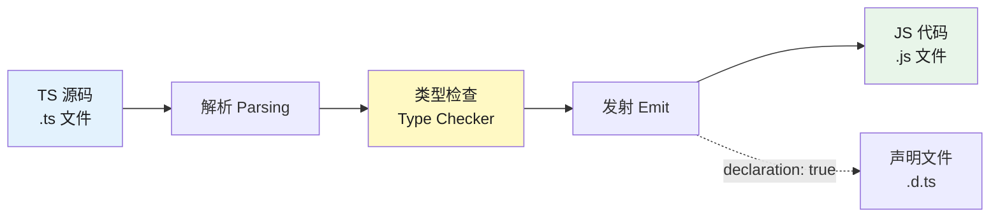
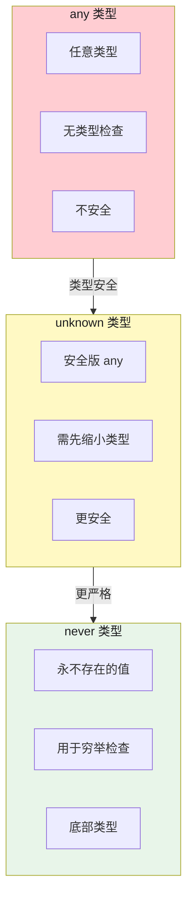

# TypeScript 基础与类型

## 1. TypeScript 基础

### 1.1 为什么出现 TS vs JS

```typescript
// JavaScript 问题：
// 1. 运行时不检查类型，错误到运行时才暴露
// 2. 没有类型提示，IDE 支持差
// 3. 重构困难，改一个函数签名不知道哪里用到
// 4. 团队协作时代码可读性差

// TypeScript 解决：
// 1. 编译时类型检查，编译期发现错误
// 2. 类型注解提供 IDE 智能提示
// 3. 接口、泛型、枚举等工程化能力
// 4. 代码即文档，可读性强

// TS 是 JS 的超集：
// TS代码 → TypeScript编译器 → JS代码
// 编译后删除了类型注解，输出纯 JS

// 示例：
// JS运行时才发现问题：
function add(a, b) { return a + b; }
add("1", 2); // "12"（字符串拼接，逻辑错误）

// TS编译时就报错：
function addTS(a: number, b: number): number { return a + b; }
addTS("1", 2); // 编译错误：Argument of type 'string' is not assignable to parameter of type 'number'
```

### 1.2 TS 编译流程




// tsc --noEmit：只做类型检查，不输出文件
// tsc --emitDeclarationOnly：只生成 .d.ts
// tsc --incremental：增量编译（只编译变更的文件）

### 1.3 tsconfig.json 常见配置

```json
{
  "compilerOptions": {
    "target": "ES2020",           // 编译到哪个JS版本
    "module": "ESNext",           // 模块系统
    "lib": ["ES2020", "DOM"],     // 内置类型库
    "jsx": "react-jsx",           // JSX处理方式

    "strict": true,               // 严格模式（开启所有严格检查）
    // 等价于开启以下全部：
    // strictNullChecks, strictAny, noImplicitThis,
    // alwaysStrict, noUnusedLocals, noUnusedParameters,
    // noImplicitReturns, noFallthroughCasesInSwitch

    "strictNullChecks": true,     // null/undefined严格检查
    "noImplicitAny": true,        // 不允许隐式any

    "moduleResolution": "bundler", // 模块解析策略（Node16/node_modules）
    "baseUrl": ".",                // 基础路径
    "paths": { "@/*": ["src/*"] }, // 路径别名

    "outDir": "./dist",           // 输出目录
    "rootDir": "./src",           // 源码目录

    "declaration": true,          // 生成.d.ts声明文件
    "declarationMap": true,       // 生成.d.ts.map，方便调试

    "skipLibCheck": true,         // 跳过库文件类型检查（大幅提速）
    "incremental": true,          // 增量编译
    "tsBuildInfoFile": ".tsbuildinfo", // 增量缓存文件

    "esModuleInterop": true,     // 让 default import 兼容 CommonJS
    "allowSyntheticDefaultImports": true, // 允许从无 default export 的模块默认导入

    "sourceMap": true,            // 生成 .map 源码映射

    "forceConsistentCasingInFileNames": true, // 文件名大小写一致
    "noUnusedLocals": true,       // 未使用的局部变量报错
    "noUnusedParameters": true   // 未使用的参数报错
  },
  "include": ["src/**/*"],
  "exclude": ["node_modules", "dist"]
}
```

### 1.4 skipLibCheck

```typescript
// skipLibCheck: true 时，TS 只检查你写的代码的类型
// 跳过 node_modules/@types/**/*.d.ts 的类型检查

// 为什么需要它？
// 1. 大幅提升编译速度（许多第三方库类型定义有问题）
// 2. 避免第三方库类型定义不兼容的问题
// 3. 适合快速开发，不必等库的类型定义修复

// skipLibCheck: false 时的问题：
// 库A的 .d.ts 依赖库B的某类型，但版本不匹配
// → TS报错：类型不兼容
// → 你需要改库的 .d.ts（无法修改node_modules）
// → 非常麻烦

// 实际建议：
// "skipLibCheck": true（大多数项目）
// 严格追求100%类型安全的库项目可设为 false
```

## 2. 类型基础

### 2.1 any / unknown / never

```typescript
// any：任意类型，关闭类型检查（尽量避免）
function process(data: any) {
  console.log(data.trim()); // 不报错，运行时可能崩
}

// unknown：安全版的 any
// 使用前必须缩小类型（type narrowing），否则TS报错
function processUnknown(data: unknown) {
  // console.log(data.trim()); // 报错：Object is of type 'unknown'
  if (typeof data === 'string') {
    console.log(data.trim()); // OK，TS知道是string
  }
}

// never：永不存在的值（用于永不返回的函数、死代码）
function throwError(msg: string): never {
  throw new Error(msg);
}

// never用于类型穷举（exhaustive check）：
type Shape = Circle | Square | Triangle;
function area(s: Shape): number {
  switch (s.kind) {
    case 'circle': return Math.PI * s.radius ** 2;
    case 'square': return s.side ** 2;
    case 'triangle': return 0.5 * s.base * s.height;
    default:
      // 如果漏掉一个case，shape类型变成never，编译报错
      const _exhaustive: never = s;
      throw new Error(`Unknown shape: ${_exhaustive}`);
  }
}

// any vs unknown：
// any.xxx 都合法，unknown.xxx 必须先缩小类型
// unknown 比 any 更安全，是"有约束的any"

// never的应用：条件类型
type IsString<T> = T extends string ? true : false;
type A = IsString<"hello">; // true
type B = IsString<123>;    // false

// 总结：



```

### 2.2 void vs never

```typescript
// void：函数没有显式返回值（返回undefined）
function log(message: string): void {
  console.log(message);
  // 隐式返回undefined
}

// never：函数永不返回（抛出异常或死循环）
function fail(msg: string): never {
  throw new Error(msg);
}
function infinite(): never {
  while (true) {}
}

// 区别：
// void：返回值类型为 void（返回undefined是合法的）
// never：永不返回（没有返回值概念）

// void可以被忽略返回值，never不能被到达
const r1: void = undefined; // OK
// const r2: never = undefined; // 报错：不能赋值为undefined

// never赋值给其他类型：
type FromNever = never extends string ? true : false; // 永远为false
// never是底部类型，不能赋值给任何具体类型（除了never自身）
// 这个特性用于类型守卫
```

## 深入阅读与参考

!!! tip "怎么用这些资料"
    先读「官方文档与规范」建立准确的概念，再读「源码与示例」核对细节，最后用「教程、书籍与视频」换一种讲法加深理解。每条都写明了读哪一节、带着什么问题读。

### 官方文档与规范

| 资源 | 为什么读 | 怎么读 |
|---|---|---|
| [TypeScript Handbook](https://www.typescriptlang.org/docs/handbook/intro.html) | 类型系统的一手权威讲解，术语与语义最准确。 | 按顺序读基础部分，每篇示例在 Playground 改写一遍，读完能说清联合与交叉的区别。 |
| [TypeScript Cheat Sheets](https://www.typescriptlang.org/cheatsheets/) | 类型与类语法的高密度速查表，写代码时随手核对。 | 先通读建立索引，遇到不确定的写法先查表，再动手写一遍。 |

### 源码与示例

| 资源 | 为什么读 | 怎么读 |
|---|---|---|
| [TypeScript Playground](https://www.typescriptlang.org/play) | 可实时编写并查看类型推导与报错，是验证理解的最佳场所。 | 把手册示例粘进来故意改错类型看报错，再读题目练类型推导。 |
| [quicktype](https://app.quicktype.io/) | 由 JSON 样例反推类型，直观展示类型如何描述真实数据。 | 拿一段真实接口 JSON 生成类型，再手写一遍对比，补齐可选字段与嵌套。 |

### 教程、书籍与视频

| 资源 | 为什么读 | 怎么读 |
|---|---|---|
| [网道 TypeScript 教程](https://wangdoc.com/typescript/) | 中文教程，类型系统与泛型讲得系统，便于成体系入门。 | 按章节读类型与泛型，章末对照官方文档校验术语，并手写小例子验证。 |
| [Total TypeScript Essentials](https://www.totaltypescript.com/books/total-typescript-essentials) | 练习驱动的入门课，每章带题，适合打牢类型基础。 | 按顺序做每章练习，卡住就回看 Handbook 对应节，做完再进下一章。 |
| [Effective TypeScript（第 2 版）](https://effectivetypescript.com/) | 以具体建议讲解类型设计取舍，读完能少踩常见坑。 | 先读类型推断与类型设计相关条目，每读一条在自己代码里找一处应用。 |
| [TypeScript Quickly（Manning）](https://www.manning.com/books/typescript-quickly) | 前半本快速覆盖语法，节奏紧凑，适合边读边练。 | 只先过前半本语法，每节代码自己敲一遍，后半本全栈示例留待后续再读。 |
| [Type-Level TypeScript](https://type-level-typescript.com/) | 想深入类型运算时的进阶读物，从基础逐步过渡到类型体操。 | 基础章节读完后按章练习，重点掌握条件类型与模板字面量类型。 |

## 应用与行业实践

本页讲的是运行时不做类型检查这件事。下面看它在真实项目里落在哪些位置，以及业内怎么处理。

### 应用场景地图

| 场景 | 用到本页哪个知识点 | 典型技术选型 | 注意事项 |
| --- | --- | --- | --- |
| 后台管理的万行表格 | fetch 返回的 JSON 在运行时没有类型保证 | React + TanStack Table + Zod | 只在接口入口解析，别在渲染循环里逐行校验 |
| 低端安卓的首屏加载 | 类型擦除后，运行时校验要占主线程 CPU | 手写类型守卫 + 只校验首屏必需字段 | 校验进关键路径前，先用性能面板量一遍 |
| 多人协作白板 | WebSocket 消息在编译期声明的类型不成立 | WebSocket + Zod 可辨识联合 | 解析失败的消息记录后丢弃，不能写进画布状态 |
| 表单填写与提交 | 表单值到后端之间没有编译期约束 | React Hook Form + Zod resolver | 前端校验只管体验，服务端要独立校验一遍 |
| 配置中心下发的开关 | 远程 JSON 的结构来自声明，不是来自检查 | JSON Schema + ajv | 启动时校验一次，失败走默认值或拒绝启动 |
| 埋点上报 SDK | 业务方传入的字段在编译期可能是 any | 手写断言函数 + OpenTelemetry | 缺字段要到报表侧才暴露，SDK 入口就得拦住 |
| 第三方 Webhook 接收 | 请求体不可信，TS 类型不影响运行时 | ajv + JSON Schema | 先验签名再验结构，两步分开做 |
| 数据库查询结果 | ORM 声明的返回类型与真实行可能不一致 | Prisma + Zod parse | 迁移删字段后旧代码不报错，读出口解析一次 |
| 微前端子应用通信 | 跨应用传参没有共享类型，只有口头约定 | 自定义事件 + 运行时守卫 | 子应用版本不同步时编译期通过、运行时出错 |

### 三个场景拆解

#### 场景 1：后台管理的万行表格接口升级

**业务背景**：表格页的数据来自服务端接口，字段改名或类型变化时前端编译不报错。页面要渲染万行级别的数据，某一行字段为 null 就会让渲染函数抛错，整页白屏。

**怎么用本页知识解决**：思路是把接口返回当成不可信输入，在 fetch 之后、进入组件状态之前解析一次。解析通过的数据才带进组件树，失败则降级渲染并上报字段路径。

```ts
import { z } from "zod";

// 接口返回行的运行时结构，字段名与后端契约一一对应
const Row = z.object({
  id: z.string(),
  name: z.string(),
  owner: z.string().nullable(), // 后端可能返回 null，渲染前就拦住
});
const ListResponse = z.object({ rows: z.array(Row) });

// fetch 的 json() 结果是 unknown，编译期类型在这里不成立
const raw: unknown = await res.json();

// 只在入口解析一次，之后表格拿到的数据同时有编译期与运行时保障
const result = ListResponse.safeParse(raw);
if (!result.success) {
  reportSchemaError(result.error.issues); // 上报字段路径，便于定位后端改动
  return renderFallback();
}

const rows: z.infer<typeof Row>[] = result.data.rows;
```

- 解析点只有一个，就是数据进入应用的入口。组件内部继续按编译期类型使用，不再逐处判断。
- `z.infer` 让编译期类型和运行时 schema 同源，改字段时只改一处。
- `safeParse` 不抛异常，失败分支可以降级渲染，页面不会被打挂。
- 失败信息里带字段路径，后端改字段时能从日志直接读到哪一行哪一列。
- 万行数据要分页解析，一次性 parse 全部行会挤占渲染时间。

**怎么度量收益**：

- Sentry 中该页面 `TypeError` 分组的事件数与影响用户数，对比改造前后同一分组。
- Chrome DevTools Performance 面板录一段同样的滚动操作，看主线程长任务条数与总阻塞时长。

**什么时候不该用**：

- 数据由本模块自己生成、不经过网络和存储，入口约束够用，再解析一遍是重复劳动。
- 全量逐行解析放进首屏路径，低端机上会挤占渲染；这种情况只校验首屏可见字段。
- 跑完即弃的一次性运维脚本，解析失败不影响线上，加了反而多维护一份 schema。

#### 场景 2：多人协作白板的消息通道

**业务背景**：白板客户端通过 WebSocket 接收远端绘图操作，发送方是版本可能不一致的其他客户端。消息体在编译期有类型声明，运行时却可能是任意形状，缺一个坐标字段就会让画布状态坏掉。

**怎么用本页知识解决**：把消息类型当成协议而不是保证，每条消息在进入状态机之前先解码。用带 `type` 字面量的可辨识联合分流，不认识的类型走丢弃分支。

```ts
import { z } from "zod";

const Message = z.discriminatedUnion("type", [
  // 每种操作单独建结构，不用一个大对象加可选字段
  z.object({
    type: z.literal("draw"),
    clientId: z.string(),
    points: z.array(z.tuple([z.number(), z.number()])),
  }),
]);
// message 事件只给字符串，编译期声明的类型在这里不成立
ws.addEventListener("message", (event) => {
  const json: unknown = JSON.parse(String(event.data));
  const msg = Message.safeParse(json);
  if (!msg.success) {
    logUnknownMessage(msg.error.issues); // 上报后丢弃，不写进画布状态
    return;
  }
  applyOperation(msg.data); // 走到这里，类型与运行时都有保证
});
```

- 可辨识联合让每个分支的必填字段各不相同，`parse` 通过后分支类型自动收窄。
- 未知 `type` 会落到失败分支，新旧客户端混跑时不会互相污染状态。
- 失败分支必须先上报再丢弃，否则线上只能看到画布错乱，看不到原因。
- 解析放在事件回调里，每条消息只做一次，不在重放历史时重复做。

**怎么度量收益**：

- 打一个 OpenTelemetry counter，指标名例如 `ws.message.parse_failed`，用 Grafana 看时间序列。
- 客户端埋点统计解析失败后重建画布状态的次数，按会话维度聚合。

复现方法：用 Playwright 起两个页面，让其中一个发送删掉字段的消息，观察失败计数是否上升。

**什么时候不该用**：

- 单人离线编辑，没有跨端消息，边界本身不存在。
- 高频二进制大包场景，逐条 JSON 解析的开销超过收益；改成收发端约定定长二进制头做校验。
- 消息只在本进程内传递、不落盘不出网的内部事件总线。

#### 场景 3：容器里 Node 服务的启动配置

**业务背景**：服务从环境变量读取监听端口、数据库地址和日志级别，同一份镜像部署到多个环境。变量拼错或漏配时编译期看不出问题，进程能正常起来，处理第一个请求才失败。

**怎么用本页知识解决**：把分散的 `process.env` 读取收敛成一份 schema，在进程启动阶段解析。解析失败直接退出，让问题出现在部署日志里，而不是第一笔线上请求里。

```ts
import { z } from "zod";

// 把环境变量收敛成一份结构，缺项和格式错都在启动时暴露
const Env = z.object({
  PORT: z.coerce.number().int().min(1).max(65535), // 环境变量是字符串，先转数值
  DATABASE_URL: z.string().url(),                  // 协议写错在这里就会失败
  LOG_LEVEL: z.enum(["debug", "info", "warn", "error"]),
});

// 解析失败就让进程退出，别带着半成品配置接收流量
const parsed = Env.safeParse(process.env);
if (!parsed.success) {
  console.error(parsed.error.issues); // 打印问题字段路径，直接进部署日志
  process.exit(1);
}

export const env: z.infer<typeof Env> = parsed.data;
```

- 全项目只在这一个文件读 `process.env`，其他模块从 `env` 取值，变量名拼错会在编译期报错。
- `z.coerce` 处理环境变量只有字符串这一事实，端口用完就是 number。
- 启动即退出把故障限制在部署阶段，滚动更新时旧副本还在，流量不受影响。
- 解析结果导出成常量，类型和值一起给出去，调用方不用再断言。

**怎么度量收益**：

- CI 里给配置解析写单测，用 Vitest 或 Jest 报告看用例通过率。
- 运行时看 Kubernetes 的 `restartCount`，或 Prometheus 的 `kube_pod_container_status_restarts_total` 指标曲线。

**什么时候不该用**：

- 本地一次性脚本和 REPL 调试，加载这层校验的成本高于收益。
- 变量只影响日志格式这类非关键路径，解析失败就让进程退出会让服务起不来；改用带默认值的宽松 schema。
- 配置由平台注入且已有平台侧校验的托管环境，重复校验要评估维护成本。

### 行业先进实践

**Parse, don't validate（出处：Alexis King 的文章《Parse, don't validate》）**
文章主张把"校验"改写成"解析"：解析函数在返回类型里带上已经验证过的信息，调用方拿到值就不用再判断。这样做把运行时检查的结果固化进了类型。借鉴方式是在每个系统边界写一个返回具体类型的解析函数，而不是返回布尔值的检查函数。

**schema 同时产出类型与校验（出处：Zod 官方文档）**
Zod 官方文档把库定位为 TypeScript 优先的 schema 声明与校验库，一份 schema 既产出静态类型也产出运行时校验函数。字段改名时类型和校验一起改，不会只改一边。借鉴方式是把接口层、配置层、消息层各建一个 schema 文件，类型统一从 `z.infer` 导出。

**JSON Schema 编译成校验代码（出处：ajv 开源项目）**
ajv 把 JSON Schema 编译成可复用的校验函数，官方文档提供 standalone 模式，可以把 schema 预编译成代码产物。这样做把 schema 编译这一步挪到了构建期。借鉴方式是跨语言共用的消息格式统一写成 JSON Schema，服务端用 ajv 生成校验产物并纳入构建。

**端到端类型安全的适用范围（出处：tRPC 官方文档）**
tRPC 让同一仓库内的客户端和服务端共享类型，改一处两端同时报错。这个保障只覆盖用 TypeScript 的调用方，跨语言调用方拿不到。借鉴方式是同仓库内部调用走 tRPC，跨语言或第三方调用方仍按场景 3 的思路做运行时解析。

**Webhook 未知事件类型的处理（出处：需核对官方文档：核对 Stripe Webhook 文档中事件类型兼容与签名校验的段落）**
核对点包括：收到未订阅的事件类型时官方建议返回哪个状态码，签名校验失败时的处理顺序，以及重试策略对幂等的要求。确认之后再决定丢弃分支返回 2xx 还是 4xx。

### 从学到用：落地路线

第 1 步：挑一个只读页面的接口做试点，把返回值解析成 schema，其他代码不动。验收标准是该接口的返回类型由 `z.infer` 导出，文件里不再出现 `as`。

第 2 步：在 CI 里加一条契约测试，故意把接口字段改个名，看流水线是否变红。验收标准是字段改名后测试阶段失败，失败信息里能读到字段路径。

第 3 步：把试点结论写成团队约定，明确网络、存储、消息、配置四类边界必须解析，每类附一个可复制的示例。验收标准是新提交的评审清单包含这四类边界，抽查三个近期 PR 全部照做。

第 4 步：加静态检查防回退，用 `@typescript-eslint/consistent-type-assertions` 的 `assertionStyle: "never"` 限制边界层断言，并把解析失败率接进告警。验收标准是规则在 CI 中开启且没有新增豁免，解析失败率出现在看板上并能触发告警。

### 动手作业

**目标**：写一个消息网关小模块，接收 WebSocket 传来的字符串消息，解析成带类型的操作，并对非法消息计数。

**步骤**：

1. 建新目录，装上 TypeScript 与 Zod，`tsconfig.json` 打开 `strict`。
2. 定义三个消息 schema：加入房间、绘制、离开房间，用 `type` 字面量组成可辨识联合。
3. 写 `parseMessage(raw: string)`，返回成功或失败的结果对象，不抛异常。
4. 用 `z.infer` 导出联合类型，写 `handleMessage(msg: Message)` 只接收这个类型。
5. 给 `parseMessage` 写测试：合法消息、缺字段、`type` 不认识、字段类型不对，四类各一条。
6. 在失败分支加计数器，统计解析失败条数并输出。
7. 写一段模拟脚本，按顺序喂入上面四类输入，打印每次结果和最终计数。

**验收标准**：

- 跑 `npx tsc --noEmit` 没有报错。
- 四类输入测试全部通过，非法消息不会进入 `handleMessage`。
- 模块代码里不出现 `as` 和 `any`。
- 模拟脚本输出的失败计数等于喂入的非法消息条数。
- 把某个 schema 的字段名改掉后，测试立刻变红。

