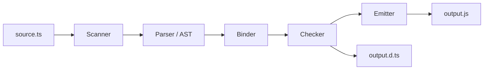

# 编译器管线与手写迷你 TypeScript 转译器

!!! abstract "核心结论"
- TypeScript 编译主管线是 scanner -> parser -> binder -> checker -> emitter；类型检查只发生在 checker，emit 阶段多数类型节点会被擦除。
- 类型擦除不等于"所有 TS 语法都能被 Erase"，enum、namespace、参数属性会生成运行时代码，`erasableSyntaxOnly` 正是把语法限制在可擦除集合内。
- `isolatedModules` 要求单文件可独立转译，因此跨文件类型重导出必须写 `export type`，跨文件 `const enum` 内联等依赖全程序信息的写法会受限。
- Babel/SWC/esbuild 与 Node `--experimental-strip-types` 都只做类型剥离，不做类型检查；tsc 的 emitter 负责完整的 TS 到目标 JS 的变换。
- 手写迷你转译器的核心不是完整实现 TypeScript，而是验证 scanner、parser、JS emit、d.ts emit 两条通道如何协作。

## 1. 编译管线：scanner -> parser -> binder -> checker -> emitter

TypeScript 不是单步把 `.ts` 变成 `.js`，而是经过一组可分离的阶段。理解这些阶段，才能回答"为什么 tsc 能报错而 esbuild 不能""为什么 declaration emit 需要 checker"。



### 1.1 Scanner 阶段

Scanner 把 Unicode 源码切成 token。TypeScript 的 scanner 不是简单按字节切分，它要识别：

- 标识符：`_`、`$`、字母开头，后续允许数字，支持 Unicode 标识符。
- 数字字面量：十进制、二进制 `0b`、八进制 `0o`、十六进制 `0x`、数字分隔符 `1_000_000`。
- 字符串：单引号、双引号、模板字符串。
- 模板字符串中的 `${` 会作为特殊 token 进入 parser。
- 注释与 trivia：空格、换行、注释通常作为 leading/trailing trivia 记录，不进入 AST 主体，但会用于 source map 与重构。

Scanner 只生成 token，不分配变量、不检查作用域。token 中会携带 `pos`、`end`、`flags`、`SyntaxKind`，这是后续 parser 和诊断定位的基础。

### 1.2 Parser 阶段

Parser 逐个消费 token，构建 AST。TypeScript 的 parser 是手写递归下降解析器，表达式使用优先级爬升算法。AST 同时包含：

- 值节点：`FunctionDeclaration`、`CallExpression`、`Identifier`。
- 类型节点：`TypeReference`、`UnionType`、`TypeLiteral`。
- 类型与值混合的节点：带类型的参数 `Parameter`、带返回类型的函数。

TypeScript AST 不是 ESTree。它包含类型节点，所以 Babel 的 TypeScript parser 插件也需要对类型节点做特殊处理，而不能直接用标准 ESTree 工具链。

Parser 具备错误恢复能力。它不会因为一个语法错误立即停止，而是插入 `Missing` token 或把错误节点挂到树上，以便一次编译上报多个语法错误。

### 1.3 Binder 阶段

Binder 不检查类型兼容性，它遍历 AST，把每个声明绑定到对应的 `Symbol`，并把节点与 Symbol 双向关联。主要工作是：

- 给变量、函数、类、接口、命名空间建立 symbol。
- 建立声明与引用之间的关系。
- 标记类型空间与值空间的 symbol。
- 解析 `import`/`export` 的链接。

TypeScript 存在类型空间与值空间，例如：

```ts
interface User {} // 类型空间
function User() {} // 值空间
```

Binder 需要用 symbol flags 区分二者，后续 checker 才知道 `User` 用在类型位置还是值位置。

### 1.4 Checker 阶段

Checker 是 TypeScript 与其他"只剥离类型"工具的核心差异。它读取 binder 产生的符号表，执行：

- 结构子类型比较：TypeScript 是 structural typing，不是 nominal typing。
- 属性过多检查：对象字面量赋值给接口时，多余属性会报错。
- 控制流收窄：`typeof x === "string"` 后，`x` 在该分支中被收窄为 `string`。
- 泛型推断与约束检查。
- 调用签名重载解析。

Checker 不直接生成 JS。它产生诊断信息，并把类型信息写入 AST 的 symbol 关联中。`tsc --noEmit` 可以只跑到 checker 阶段，不做 emit。

### 1.5 Emitter 阶段

Emitter 把经过检查的 AST 变换为 JS。它会经历多个内部 transformer：

- 把 TypeScript 语法转换为目标 ECMAScript 版本支持的语法。
- 处理 enum、namespace、参数属性等需要生成代码的语法。
- 处理 `import type`、类型参数、`as`、`satisfies` 的擦除。
- 生成 source map。
- declaration emit 单独输出 `.d.ts`，它需要 checker 推断出的类型信息。

`ts.transpileModule` 可以直接走 parser + emitter，跳过 binder 和 checker。因此它快，但不会给出类型错误，也不能可靠产出 declaration。

下表对比五个阶段的输入输出：

| 阶段 | 输入 | 输出 | 核心职责 | 是否做类型检查 |
| --- | --- | --- | --- | --- |
| Scanner | 源码文本 | token 序列 | 词法分析、trivia 记录 | 否 |
| Parser | token 序列 | AST | 语法分析、错误恢复 | 否 |
| Binder | AST | Symbol 表与引用关系 | 声明绑定、符号建立 | 否 |
| Checker | AST + Symbol 表 | 诊断与类型信息 | 类型兼容、收窄、推断 | 是 |
| Emitter | 已检查 AST | JS、d.ts、source map | 类型擦除、语法降级 | 部分使用类型结果 |

## 2. 类型擦除与 isolatedModules

### 2.1 纯粹的 TypeScript 类型擦除

以下语法只影响类型系统，不产生运行时行为，因此 emitter 可以安全擦除：

```ts
interface User {
  name: string;
}

type ID = string;

function greet(user: User): string {
  return user.name;
}

const age: number = 18;
```

擦除后变为：

```js
function greet(user) {
  return user.name;
}

const age = 18;
```

`interface` 和 `type` 直接消失；函数参数类型、返回类型、变量类型注解都被去掉。`as`、`satisfies`、类型参数、`implements` 也属于可擦除语法。

### 2.2 必须生成运行时代码的语法

不是所有 TS 语法都能靠"删掉类型"完成转译。以下语法有运行时语义：

| 语法 | 为什么不能只擦除 | emitter 典型做法 |
| --- | --- | --- |
| enum | 成员是运行时值 | 生成对象，数字枚举还生成反向映射 |
| namespace | 需要运行时容器对象 | 生成 IIFE 并把成员挂到对象上 |
| 参数属性 `constructor(public x)` | 需要给实例赋值 | 生成 `this.x = x` |
| decorator | 运行时调用装饰器函数 | 根据配置保留或转换装饰器调用 |
| import/export 的 type 歧义 | 不能区分类型与值 | 需要语法标记或 checker 辅助 |

因此 `erasableSyntaxOnly` 开启后，enum、namespace、参数属性等不可擦除语法会被拒绝。这个开关让代码更接近"原生 JS 加类型批注"，也更利于 Node 类型剥离和单文件转译工具处理。

### 2.3 isolatedModules 的真实约束

`isolatedModules` 要求每个文件可以被单独转译，不允许依赖跨文件类型信息。典型错误：

```ts
// 如果 User 是 type 或 interface
export { User } from "./model";
```

在 `isolatedModules` 下，单文件转译器无法知道 `User` 是类型还是值，可能保留一个不存在的运行时导出。正确写法：

```ts
export type { User } from "./model";
```

跨文件的 `const enum` 内联、全局 augmentation、依赖完整 checker 的重导出都会受限制。使用 isolatedModules 时，应把类型重导出明确标记为 `type`。

## 3. Babel、SWC、esbuild 与 Node 类型剥离对比

这些工具的共同点是都不做类型检查。差异主要在 AST 表示、实现语言、并行/缓存策略、语法降级能力。

| 工具 | 是否做类型检查 | TypeScript 支持方式 | 语法降级 | 典型场景 |
| --- | --- | --- | --- | --- |
| tsc | 是 | 完整 scanner/parser/binder/checker/emitter | 根据 `target` 降级 | 类型检查、声明文件、标准构建 |
| Babel | 否 | `@babel/parser` 的 TypeScript 插件 + preset | 由 Babel plugin 完成 | 需要丰富插件生态、组合其它语法特性 |
| SWC | 否 | Rust 写的 TS 解析与代码生成 | 支持降级与 minify | 高并发、Rust 工具链 |
| esbuild | 否 | Go 写的 TS 解析与 loader | 支持降级与 bundle | 极高速度的 dev/build |
| Node `--experimental-strip-types` | 否 | 内建类型剥离 | 只擦除，不做语法降级 | 直接运行 `.ts` 文件 |

需要提醒：Babel、SWC、esbuild 速度快的前提之一，是它们没有 checker。生产环境通常需要额外跑 `tsc --noEmit` 或 CI 类型检查，不能因为没有运行时错误就认为类型安全。

Node 的 `--experimental-strip-types` 在 Node 22.6 引入，Node 23.6 起默认启用。具体版本与可用性以当前 Node 官方文档为准。该模式只允许可擦除语法，因此 enum、namespace、参数属性不能直接使用；如果需要这些运行时语法，应当先用 tsc 或 bundler 转译。

## 4. Compiler API 与 transformer

TypeScript Compiler API 主要入口包括：

- `ts.createProgram`：创建完整 program，可运行 checker。
- `program.getPreEmitDiagnostics()`：获取诊断。
- `program.emit()`：执行 emit，可以传入自定义 transformer。
- `ts.transpileModule`：跳过 checker，仅做擦除和降级，适合工具链场景。

自定义 transformer 是 `TransformerFactory`，可以在 `before`、`after`、`afterDeclarations` 三个位置插入。下面实现一个可运行的删除 `console.log` 表达式语句的 transformer。

```javascript
// console-strip-transformer.mjs
// 运行环境：Node.js 18+，需要 npm install typescript
import ts from "typescript";

// TransformerFactory：外层接收 context，内层接收 root node
export function removeConsoleLog(context) {
  const visitor = (node) => {
    if (
      ts.isExpressionStatement(node) &&
      ts.isCallExpression(node.expression) &&
      ts.isPropertyAccessExpression(node.expression.expression) &&
      ts.isIdentifier(node.expression.expression.expression) &&
      node.expression.expression.expression.text === "console" &&
      node.expression.expression.name.text === "log"
    ) {
      // 返回 undefined 表示删除该节点
      return undefined;
    }
    return ts.visitEachChild(node, visitor, context);
  };

  return (rootNode) => ts.visitNode(rootNode, visitor);
}

const source = `function run(): number {
  console.log("before");
  return 1;
}`;

const result = ts.transpileModule(source, {
  compilerOptions: {
    module: ts.ModuleKind.ESNext,
    target: ts.ScriptTarget.ES2020,
  },
  transformers: {
    before: [removeConsoleLog],
  },
});

console.log(result.outputText);
```

验证标准：

```javascript
// console-strip-transformer.test.mjs
// 运行：node console-strip-transformer.test.mjs
import { strict as assert } from "node:assert";
import ts from "typescript";
import { removeConsoleLog } from "./console-strip-transformer.mjs";

const source = `function run(): number {
  console.log("before");
  return 1;
}`;

const result = ts.transpileModule(source, {
  compilerOptions: {
    module: ts.ModuleKind.ESNext,
    target: ts.ScriptTarget.ES2020,
  },
  transformers: {
    before: [removeConsoleLog],
  },
});

assert.equal(result.outputText.includes("console.log"), false);
assert.equal(result.outputText.includes("return 1"), true);

console.log("PASS: transformer 已删除 console.log");
console.log("预期输出特征：不含 console.log，包含 return 1");
console.log("实际输出：");
console.log(result.outputText);
```

关于 TypeScript 7 的 API 迁移，只需记住一个基线判断：7.0 无稳定 API，7.1 提供稳定 API。

## 5. 手写迷你 TypeScript 转译器

下面实现一个教学用 mini 转译器。它刻意只支持一个小型 TS 子集，但完整跑通 tokenizer -> parser -> JS emitter -> d.ts emitter 两个输出通道。

支持：

- `interface` 及其可选属性。
- `type` alias 与 union 类型。
- 带参数类型和返回类型的函数声明。
- `const`/`let` 变量声明，类型注解会被擦除。
- 基本表达式：字符串、数字、标识符、属性访问、加法。
- 类型：基础类型、标识符引用、`T[]`、`A | B`。

不支持（为了控制实现范围）：泛型、对象字面量类型、enum、namespace、class、类型导入、条件类型。

```javascript
// mini-tsc.mjs
// 运行环境：Node.js 18+
// 用途：教学用小型 TS -> JS 转译器，同时产出 .d.ts
export function compileTS(source) {
  const tokens = tokenize(source);
  const parser = new Parser(tokens);
  const ast = parser.parseProgram();
  return {
    js: emitJS(ast),
    dts: emitDTS(ast),
  };
}

function tokenize(source) {
  const tokens = [];
  let i = 0;
  while (i < source.length) {
    const ch = source[i];

    if (/\s/.test(ch)) {
      i += 1;
      continue;
    }

    if (ch === "/" && source[i + 1] === "/") {
      while (i < source.length && source[i] !== "\n") i += 1;
      continue;
    }

    if (ch === "/" && source[i + 1] === "*") {
      i += 2;
      while (i < source.length && !(source[i] === "*" && source[i + 1] === "/")) i += 1;
      i += 2;
      continue;
    }

    if (/[A-Za-z_$]/.test(ch)) {
      const start = i;
      while (i < source.length && /[A-Za-z0-9_$]/.test(source[i])) i += 1;
      tokens.push({ type: "ident", value: source.slice(start, i), pos: start });
      continue;
    }

    if (/[0-9]/.test(ch)) {
      const start = i;
      while (i < source.length && /[0-9]/.test(source[i])) i += 1;
      tokens.push({ type: "number", value: source.slice(start, i), pos: start });
      continue;
    }

    if (ch === '"' || ch === "'") {
      const quote = ch;
      const start = i;
      i += 1;
      while (i < source.length && source[i] !== quote) i += 1;
      if (i >= source.length) throw new Error(`字符串未闭合，位置 ${start}`);
      i += 1;
      tokens.push({ type: "string", value: source.slice(start, i), pos: start });
      continue;
    }

    if ("{}();:,.=[]|?+-*".includes(ch)) {
      tokens.push({ type: "punct", value: ch, pos: i });
      i += 1;
      continue;
    }

    throw new Error(`不支持的字符 "${ch}"，位置 ${i}`);
  }
  tokens.push({ type: "eof", value: "", pos: source.length });
  return tokens;
}

class Parser {
  constructor(tokens) {
    this.tokens = tokens;
    this.index = 0;
  }

  current() {
    return this.tokens[this.index];
  }

  next() {
    return this.tokens[this.index + 1];
  }

  advance() {
    const token = this.current();
    this.index += 1;
    return token;
  }

  check(value) {
    return this.current().value === value;
  }

  expect(value) {
    const token = this.current();
    if (token.value !== value) {
      throw new Error(`期望 "${value}"，实际 "${token.value}"，位置 ${token.pos}`);
    }
    return this.advance();
  }

  expectIdent() {
    const token = this.current();
    if (token.type !== "ident") {
      throw new Error(`期望标识符，实际 "${token.value}"，位置 ${token.pos}`);
    }
    return this.advance();
  }

  consume(value) {
    if (this.check(value)) {
      this.advance();
      return true;
    }
    return false;
  }

  parseProgram() {
    const body = [];
    while (this.current().type !== "eof") {
      body.push(this.parseTopLevel());
    }
    return { kind: "Program", body };
  }

  parseTopLevel() {
    if (this.check("interface")) return this.parseInterface();
    if (this.check("type")) return this.parseTypeAlias();
    if (this.check("function")) return this.parseFunctionDecl();
    if (this.check("const") || this.check("let") || this.check("var")) return this.parseVariableDecl();
    throw new Error(`不支持顶层语法 "${this.current().value}"，位置 ${this.current().pos}`);
  }

  parseInterface() {
    this.expect("interface");
    const name = this.expectIdent().value;
    this.expect("{");
    const members = [];
    while (!this.check("}")) {
      if (this.current().type === "eof") throw new Error("interface 未闭合");
      const memberName = this.expectIdent().value;
      const optional = this.consume("?");
      this.expect(":");
      const type = this.parseType();
      members.push({ name: memberName, optional, type });
      this.consume(";");
    }
    this.expect("}");
    this.consume(";");
    return { kind: "InterfaceDecl", name, members };
  }

  parseTypeAlias() {
    this.expect("type");
    const name = this.expectIdent().value;
    this.expect("=");
    const type = this.parseType();
    this.consume(";");
    return { kind: "TypeAliasDecl", name, type };
  }

  parseFunctionDecl() {
    this.expect("function");
    const name = this.expectIdent().value;
    this.expect("(");
    const params = [];
    if (!this.check(")")) {
      while (true) {
        const paramName = this.expectIdent().value;
        this.expect(":");
        const type = this.parseType();
        params.push({ name: paramName, type });
        if (!this.consume(",")) break;
      }
    }
    this.expect(")");
    this.expect(":");
    const returnType = this.parseType();
    const body = this.parseFunctionBody();
    return { kind: "FunctionDecl", name, params, returnType, body };
  }

  parseFunctionBody() {
    this.expect("{");
    const body = [];
    while (!this.check("}")) {
      if (this.current().type === "eof") throw new Error("函数体未闭合");
      body.push(this.parseStatement());
    }
    this.expect("}");
    return body;
  }

  parseStatement() {
    if (this.check("return")) {
      this.advance();
      const expression = this.parseExpression();
      this.consume(";");
      return { kind: "ReturnStmt", expression };
    }
    if (this.check("const") || this.check("let") || this.check("var")) {
      return this.parseVariableDecl();
    }
    throw new Error(`不支持的函数体语句 "${this.current().value}"，位置 ${this.current().pos}`);
  }

  parseVariableDecl() {
    const declKind = this.advance().value;
    const name = this.expectIdent().value;
    this.expect(":");
    const type = this.parseType();
    this.expect("=");
    const init = this.parseExpression();
    this.consume(";");
    return { kind: "VariableDecl", declKind, name, type, init };
  }

  parseExpression() {
    return this.parseAdditive();
  }

  parseAdditive() {
    let left = this.parsePostfix();
    while (this.check("+")) {
      this.advance();
      const right = this.parsePostfix();
      left = { kind: "BinaryExpr", op: "+", left, right };
    }
    return left;
  }

  parsePostfix() {
    let expr = this.parsePrimary();
    while (this.check(".")) {
      this.advance();
      const property = this.expectIdent().value;
      expr = { kind: "MemberExpr", object: expr, property };
    }
    return expr;
  }

  parsePrimary() {
    const token = this.current();
    if (token.type === "number") {
      this.advance();
      return { kind: "NumberLiteral", value: token.value };
    }
    if (token.type === "string") {
      this.advance();
      return { kind: "StringLiteral", value: token.value };
    }
    if (token.type === "ident") {
      this.advance();
      return { kind: "Identifier", name: token.value };
    }
    if (this.check("(")) {
      this.advance();
      const expr = this.parseExpression();
      this.expect(")");
      return expr;
    }
    throw new Error(`不支持的表达式 "${token.value}"，位置 ${token.pos}`);
  }

  parseType() {
    let type = this.parseArrayType();
    while (this.check("|")) {
      this.advance();
      const right = this.parseArrayType();
      type = {
        kind: "UnionType",
        parts: type.kind === "UnionType" ? [...type.parts, right] : [type, right],
      };
    }
    return type;
  }

  parseArrayType() {
    let type = this.parsePrimaryType();
    while (this.check("[") && this.next().value === "]") {
      this.advance();
      this.advance();
      type = { kind: "ArrayType", element: type };
    }
    return type;
  }

  parsePrimaryType() {
    const token = this.current();
    if (token.type === "ident") {
      this.advance();
      return { kind: "TypeRef", name: token.value };
    }
    if (this.check("(")) {
      this.advance();
      const type = this.parseType();
      this.expect(")");
      return type;
    }
    throw new Error(`不支持的起始类型 "${token.value}"，位置 ${token.pos}`);
  }
}

function typeToSource(type) {
  if (type.kind === "TypeRef") return type.name;
  if (type.kind === "ArrayType") return `${typeToSource(type.element)}[]`;
  if (type.kind === "UnionType") return type.parts.map(typeToSource).join(" | ");
  throw new Error(`未知类型节点 ${type.kind}`);
}

function exprToJS(expr) {
  switch (expr.kind) {
    case "NumberLiteral":
    case "StringLiteral":
      return expr.value;
    case "Identifier":
      return expr.name;
    case "BinaryExpr":
      return `${exprToJS(expr.left)} ${expr.op} ${exprToJS(expr.right)}`;
    case "MemberExpr":
      return `${exprToJS(expr.object)}.${expr.property}`;
    default:
      throw new Error(`未知表达式节点 ${expr.kind}`);
  }
}

function stmtToJS(stmt) {
  switch (stmt.kind) {
    case "ReturnStmt":
      return `return ${exprToJS(stmt.expression)};`;
    case "VariableDecl":
      return `${stmt.declKind} ${stmt.name} = ${exprToJS(stmt.init)};`;
    default:
      throw new Error(`未知语句节点 ${stmt.kind}`);
  }
}

function emitJS(ast) {
  const lines = [];
  for (const node of ast.body) {
    if (node.kind === "FunctionDecl") {
      const params = node.params.map((param) => param.name).join(", ");
      const body = node.body.map((stmt) => `  ${stmtToJS(stmt)}`).join("\n");
      lines.push(`function ${node.name}(${params}) {\n${body}\n}`);
    } else if (node.kind === "VariableDecl") {
      lines.push(`${node.declKind} ${node.name} = ${exprToJS(node.init)};`);
    }
  }
  return lines.join("\n\n");
}

function emitDTS(ast) {
  const lines = [];
  for (const node of ast.body) {
    if (node.kind === "InterfaceDecl") {
      const members = node.members
        .map((member) => `  ${member.name}${member.optional ? "?" : ""}: ${typeToSource(member.type)};`)
        .join("\n");
      lines.push(`interface ${node.name} {\n${members}\n}`);
    } else if (node.kind === "TypeAliasDecl") {
      lines.push(`type ${node.name} = ${typeToSource(node.type)};`);
    } else if (node.kind === "FunctionDecl") {
      const params = node.params.map((param) => `${param.name}: ${typeToSource(param.type)}`).join(", ");
      lines.push(`declare function ${node.name}(${params}): ${typeToSource(node.returnType)};`);
    } else if (node.kind === "VariableDecl") {
      lines.push(`declare ${node.declKind} ${node.name}: ${typeToSource(node.type)};`);
    }
  }
  return lines.join("\n\n");
}
```

验证标准：

```javascript
// mini-tsc.test.mjs
// 运行：node mini-tsc.test.mjs
import { strict as assert } from "node:assert";
import { compileTS } from "./mini-tsc.mjs";

const source = `interface User {
  id: number;
  name: string;
  active?: boolean;
}

type ID = string;
type MaybeName = string | null;

function greet(user: User, prefix: string): string {
  return "Hi " + user.name;
}

const age: number = 18;
let flag: boolean = false;
`;

const { js, dts } = compileTS(source);

const expectedJS = `function greet(user, prefix) {
  return "Hi " + user.name;
}

const age = 18;

let flag = false;`;

const expectedDTS = `interface User {
  id: number;
  name: string;
  active?: boolean;
}

type ID = string;

type MaybeName = string | null;

declare function greet(user: User, prefix: string): string;

declare const age: number;

declare let flag: boolean;`;

assert.equal(js, expectedJS);
assert.equal(dts, expectedDTS);

console.log("PASS: JS 输出匹配");
console.log("PASS: d.ts 输出匹配");
console.log("实际 JS 输出：");
console.log(js);
console.log("实际 d.ts 输出：");
console.log(dts);
```

预期输出：

```text
PASS: JS 输出匹配
PASS: d.ts 输出匹配
实际 JS 输出：
function greet(user, prefix) {
  return "Hi " + user.name;
}

const age = 18;

let flag = false;
实际 d.ts 输出：
interface User {
  id: number;
  name: string;
  active?: boolean;
}

type ID = string;

type MaybeName = string | null;

declare function greet(user: User, prefix: string): string;

declare const age: number;

declare let flag: boolean;
```

这个 mini 实现展示了一个关键点：JS emitter 只处理值节点，类型节点被丢弃；d.ts emitter 只处理声明节点，类型节点被序列化。

## 6. 常见陷阱

- **以为 Babel/SWC/esbuild 会做类型检查**：它们只剥离类型。`as` 断言不会因为它们转译成功而变安全，生产链路仍需要 `tsc --noEmit` 或 CI 类型检查。
- **`isolatedModules` 下忘记 `export type`**：`export { User } from "./model"` 在单文件转译器里无法判断 `User` 是类型还是值。
- **把 `const enum` 当作跨文件可依赖的纯类型**：`const enum` 依赖内联，跨文件使用与单文件转译、isolatedModules 存在矛盾。
- **以为 enum、namespace、参数属性可以安全擦除**：它们会生成运行时代码。开启 `erasableSyntaxOnly` 后应避免这些写法。
- **认为 Node 类型剥离会降级语法**：`--experimental-strip-types` 只擦除可擦除类型，不处理 enum/namespace/参数属性，也不做 ES 语法降级。
- **类型导入被误删或误保留**：`import type { User }` 必须清除；`import { User }` 若 `User` 只用于类型，需要工具正确识别，否则会留下运行时不存在的导入。
- **自定义 transformer 只访问根节点**：必须使用 `ts.visitEachChild` 递归访问子节点，直接返回原节点会漏掉深层 AST。
- **transformer 返回 `undefined` 是删除节点**：这是在 AST 遍历中删除当前节点的标准方式，但若容器期待数组，需要返回空数组或过滤。
- **declaration emit 不能用简单语法粘贴实现**：d.ts 需要 checker 推断出的类型，mini 转译器能产出 d.ts 只是因为它只保留显式类型注解。
- **`console.assert` 在部分运行时可能不抛异常**：教学验证建议使用 `node:assert`，它默认启用断言，行为更确定。

## 7. 面试题与答题要点

**Q1：TypeScript 编译管线包含哪些阶段？各自做什么？**

- Scanner 做词法分析，生成 token 和 trivia。
- Parser 构建包含类型节点的 AST，并有错误恢复。
- Binder 建立 symbol、声明与引用关系。
- Checker 执行类型检查、结构子类型比较、控制流收窄。
- Emitter 做类型擦除和语法降级，declaration emit 需要 checker 的类型结果。

**Q2：类型擦除就是简单地去掉类型注解吗？**

- 纯类型注解、接口、类型别名、类型断言、类型参数可以擦除。
- enum、namespace、参数属性、decorator 等有运行时语义，需要生成代码。
- `erasableSyntaxOnly` 限制代码只使用可擦除语法。
- 类型导入也必须被删除，否则产生运行时不存在的绑定。

**Q3：`isolatedModules` 为什么要求 `export type`？**

- 单文件转译时无法知道某个 re-export 是类型还是值。
- `export { User }` 可能留下运行时 export，但 `User` 可能只是 interface。
- `export type { User }` 明确告诉转译器可以删掉这条 export。
- 该约束还影响跨文件 `const enum`、全局类型增强等依赖全程序信息的特性。

**Q4：tsc 与 Babel/SWC/esbuild 的核心差异是什么？**

- 只有 tsc 做类型检查，其它工具只剥离类型或转换 AST。
- tsc 可以可靠产出 `.d.ts`，因为 checker 提供类型信息。
- Babel/SWC/esbuild 在速度和插件生态上有优势。
- 生产环境常采用 esbuild/SWC 做转译，再用 `tsc --noEmit` 做类型检查。

**Q5：Node 的 `--experimental-strip-types` 与 tsc 有何不同？**

- Node 只剥离可擦除类型，不做类型检查。
- 不处理 enum、namespace、参数属性等需要转换的语法。
- 不对 JS 语法做降级，目标仍是当前 Node 运行环境。
- 适合本地快速运行，不适合替代构建链路的完整 TypeScript 处理。

**Q6：enum 与 const enum 在 emitter 中有什么区别？**

- `enum` 会生成运行时对象，数字 enum 有时会生成反向映射。
- `const enum` 在可能的情况下被内联，不产生运行时对象。
- `const enum` 跨文件内联依赖跨文件信息，在 isolatedModules 下受限。
- 编译器选项和模块格式会影响 enum 的最终产物形状。

**Q7：手写一个 mini TypeScript 转译器，JS emitter 与 d.ts emitter 的关键差异是什么？**

- JS emitter 遍历值节点，忽略类型节点。
- d.ts emitter 遍历声明节点，保留类型节点并序列化类型字符串。
- 完整 TS 的 declaration emit 需要 checker 推断类型，不能只靠显式注解。
- mini 实现证明类型擦除的两个输出通道可以在同一 AST 上并行完成。

**Q8：自定义 transformer 如何删除一个 AST 节点？**

- 在 visitor 中判断目标节点，返回 `undefined` 表示删除。
- 需要返回 `ts.visitEachChild(node, visitor, context)` 递归处理子节点。
- transformer 通过 `before`、`after`、`afterDeclarations` 插入 emit 管线。
- TypeScript 7 的 API 基线判断只需记住：7.0 无稳定 API，7.1 提供稳定 API。

## 深入阅读与参考

!!! tip "怎么用这些资料"
    先读「官方文档与规范」建立准确的概念，再读「源码与示例」核对细节，最后用「教程、书籍与视频」换一种讲法加深理解。每条都写明了读哪一节、带着什么问题读。

### 官方文档与规范

| 资源 | 为什么读 | 怎么读 |
|---|---|---|
| [Using TypeScript](https://react.dev/learn/typescript) | TypeScript 官方入门文档，覆盖编译器基本用法与类型擦除。 | 读 Using TypeScript 全文，关注编译流程与输出；读后用 tsc 编译一个文件观察。 |
| [Babel 文档](https://babeljs.io/docs/) | Babel 官方文档，讲转译与 polyfill 机制，对比 TS 编译器。 | 读 transform 与 preset-typescript 章节，理解语法转译与类型剥离差异。 |
| [SWC 文档](https://swc.rs/docs/getting-started) | SWC 官方文档，了解 Rust 转译器的架构与配置。 | 读 Getting Started 与配置章节，对比 Babel 的编译速度与插件机制。 |
| [esbuild 文档](https://esbuild.github.io/) | esbuild 官方文档，理解原生编译带来的性能优势。 | 读 Content Types 与 Transform API，关注 TS 转译与类型擦除行为。 |
| [TypeScript support](https://docs.deno.com/runtime/fundamentals/typescript/) | Deno 的 TypeScript 支持文档，说明类型剥离与 isolatedModules。 | 读 TypeScript 支持页，聚焦类型剥离规则与 isolatedModules 限制。 |

### 源码与示例

| 资源 | 为什么读 | 怎么读 |
|---|---|---|
| [esbuild](https://github.com/evanw/esbuild) | esbuild 架构文档，从源码角度展示扫描、解析与打印流程。 | 读 architecture.md 的 scanner/parser/printer 部分，画管线图。 |
| [TypeScript AST Viewer](https://ts-ast-viewer.com/) | TypeScript AST Viewer，可视化 TS 编译器生成的 AST 节点。 | 输入类型代码，观察 AST 结构，理解 parser 与 binder 的节点关系。 |
| [AST Explorer](https://astexplorer.net/) | AST Explorer，可切换不同 parser 对比 AST 结构。 | 输入同一段代码，切换 TS/Babel/SWC parser，对比节点差异。 |
| [TypeScript Playground](https://www.typescriptlang.org/play) | TypeScript Playground，实时查看编译输出与类型推导。 | 写一段带类型的代码，查看 JS 输出与 .d.ts，验证类型擦除。 |
| [tsdown](https://tsdown.dev/) | tsdown 示例，展示用 Compiler API 打包并输出类型声明。 | 读它的构建配置，跟做一遍输出类型声明的流程。 |

### 教程、书籍与视频

| 资源 | 为什么读 | 怎么读 |
|---|---|---|
| [网道 TypeScript 教程](https://wangdoc.com/typescript/) | 网道 TypeScript 教程，系统讲解类型系统与编译配置。 | 按章节读类型系统与编译选项，读完用 tsc 验证配置。 |
| [Total TypeScript](https://www.totaltypescript.com/tutorials) | Total TypeScript 教程，含大量类型练习与编译器行为讲解。 | 按顺序完成转译相关练习，理解类型擦除与 isolatedModules。 |

## 应用与行业实践

### 应用场景地图

| 场景 | 用到本页哪个知识点 | 典型技术选型 | 注意事项 |
| --- | --- | --- | --- |
| 后台管理的万行表格首屏 | 检查与 emit 分离，擦除发生在 emit | `tsc --noEmit` 检查，esbuild 打包 | 列名写错只在 tsc 通道暴露，打包通道不拦 |
| 低端安卓 WebView 首屏 | 转译器不做检查，产物字节由 emit 决定 | esbuild 设 target，按路由 `splitting` | 把 enum 换成常量对象，运行时代码才真的变少 |
| 多人协作白板的跨端协议 | `isolatedModules` 要求单文件可独立转译 | 共享 protocol 包，只用 `export type` 重导出 | 跨文件 `const enum` 内联被禁，先用常量对象替代 |
| 组件库发布到 npm | declaration emit 依赖 checker | `tsc --emitDeclarationOnly` 加 api-extractor | 只跑 esbuild 不产出 `.d.ts`，消费方看不到类型 |
| 内部 monorepo 增量构建 | binder 与 checker 可按项目边界切开 | Project References 加构建缓存 | 引用关系写错会触发全量重编，先量单包改动影响面 |
| Node 服务直接跑 `.ts` | Node 只做类型剥离，不跑 checker | `--experimental-strip-types` | enum、namespace、参数属性不在可剥离集合内 |
| 遗留 JS 项目逐步迁移 | parser 同时接受 JS 与 TS 语法 | `allowJs` 加 `checkJs` 分目录打开 | 一次全开会冒出整仓报错，按目录推进 |
| 命令行工具发布单文件 | 单文件转译看不到其他文件 | esbuild bundle 加 `erasableSyntaxOnly` | 依赖全程序信息的写法在单文件模式下失效 |

### 三个场景拆解

#### 场景 1：后台管理的万行表格首屏

**业务背景**

后台订单表格有上万行，列定义和接口结构由三个小组共同维护。首屏只渲染前 50 行，但入口 chunk 里塞进了整张表的列配置与字典表。

**怎么用本页知识解决**

先分清两条通道：类型检查交给 `tsc --noEmit`，转译和打包交给 esbuild。列定义属于类型信息，emit 阶段会被擦除，所以列名拼错只能在检查通道暴露。

```ts
// build.ts：esbuild 只转译，类型检查由 tsc --noEmit 承担
import { build } from "esbuild";
import { writeFile } from "node:fs/promises";

const result = await build({
  entryPoints: ["src/main.tsx"],
  bundle: true,
  splitting: true,             // 按路由拆包，表格页单独成一个 chunk
  format: "esm",
  target: ["chrome80"],        // 低端安卓 WebView 能解析的语法范围
  outdir: "dist",
  metafile: true,              // 产出 metafile，用来核对每个 chunk 的字节数
  minify: true,
});

await writeFile("dist/meta.json", JSON.stringify(result.metafile));
```

- esbuild 读不到项目外的类型信息，`satisfies` 写错列的字段名，esbuild 照样产出 JS。
- CI 里把 `tsc --noEmit` 和 esbuild 拆成两个 job，谁失败一眼能分辨。
- metafile 给出每个 chunk 的字节数与依赖构成，拆包效果不靠感觉判断。
- `target` 决定 emit 出的语法形态，低端机支持的语法定得越低，转译补丁越多。

**怎么度量收益**

看 esbuild metafile 里入口 chunk 与表格 chunk 的 `bytes`；用 Chrome DevTools Performance 面板录一次首屏，读 Scripting 与 Rendering 两段时长；用 Lighthouse 读 FCP 与 TBT；CI 里分别记录 `typecheck` 与 `build` 两个 job 的耗时。

**什么时候不该用**

表格只有几百行、首屏在目标机型上已经流畅时，拆包多出的请求数不划算。项目代码依赖 `const enum` 跨文件内联来压体积时，先改语法再动打包流程。

#### 场景 2：多人协作白板的跨端协议

**业务背景**

白板同时有 Web、桌面端和移动端，消息格式由一份协议包统一定义。协议改一个字段，三端仓库的构建时间和发布节奏各不相同。

**怎么用本页知识解决**

思路是让协议包在单文件转译下也成立：类型用 `export type` 重导出，枚举成员用常量对象加联合类型表达。这样 Babel、SWC、esbuild 任选一个，转译结果都一致。

```ts
// src/protocol.ts：单文件转译也能得到正确结果的定义
export type DrawMsg = { kind: "draw"; points: [number, number][] }; // 类型节点，emit 时被擦除
export type CloseMsg = { kind: "close"; room: string };

export const ServerEvent = {   // 常量对象产出普通 JS，单文件就能转译
  PeerJoined: "peer-joined",
  RoomClosed: "room-closed",
} as const;
export type ServerEvent = (typeof ServerEvent)[keyof typeof ServerEvent]; // 值取类型

export type { DrawMsg as ClientDraw }; // 类型重导出必须写 export type
```

- `export type` 让转译器只看当前文件就能判定这行不产出运行时代码。
- `const object + as const` 保留为运行时值，enum 会额外生成双向映射对象。
- `isolatedModules` 下跨文件 `const enum` 内联被禁，因为它需要全程序信息。
- 构造函数参数属性会生成字段赋值语句，属于不可擦除集合，协议类里避开它。

**怎么度量收益**

三端 CI 中 `tsc --noEmit` 的报错条数；协议包打包后的字节数，取自 esbuild metafile；线上协议字段不匹配的报错次数，用 Sentry 按 error tag 分组统计；断线重连后消息回放的用例通过率。

**什么时候不该用**

代码大量依赖 enum 反向映射遍历成员名时，换常量对象要同步改成 `Object.values`，得先统计用量。单端项目、不与别的仓库共享协议包时，打开 `isolatedModules` 拿不到跨端独立的收益。

#### 场景 3：组件库发布 `.d.ts`

**业务背景**

组件库用 esbuild 打包 JS，发布之后消费方仓库的类型提示全部消失。排查发现构建脚本里只有 esbuild，没有声明文件通道。

**怎么用本页知识解决**

JS 产物走 esbuild，类型产物走 `tsc --emitDeclarationOnly`。声明文件需要 checker 提供跨文件类型信息，esbuild 与 SWC 不实现 checker。

```jsonc
// tsconfig.build.json：声明文件通道
{
  "extends": "./tsconfig.json",
  "compilerOptions": {
    "declaration": true,           // 生成 .d.ts，这一步需要 checker 的全程序类型信息
    "emitDeclarationOnly": true,   // 只出类型不出 JS，避免覆盖 esbuild 的产物
    "outDir": "dist/types",
    "isolatedDeclarations": true   // 要求导出写显式类型，声明文件才能逐文件生成
  },
  "include": ["src"]
}
```

- `emitDeclarationOnly` 与 `noEmit` 互斥，构建脚本里分成两个 job 执行。
- `isolatedDeclarations` 会要求导出函数写返回类型、导出常量写标注，报错清单就是改造清单。
- `package.json` 的 `exports` 里 `types` 条件排在 `import` 之前，并指向真实存在的文件。
- 用 `@arethetypeswrong/cli` 检查 `exports` 的类型条件能否被解析。
- 用 api-extractor 生成 API 报告，把签名变化放进评审。

**怎么度量收益**

`dist/types` 下的文件数与总体积；消费方仓库跑 `tsc --noEmit` 的报错数；attw 的解析结果；API 报告的 diff 行数。

**什么时候不该用**

纯应用仓库不对外暴露类型，生成 `.d.ts` 只会拉长 CI。组件导出签名每天在变时，先跑 API 报告观察，再对外承诺类型稳定。

### 行业先进实践

**转译与检查拆到两个进程（出处：ts-loader 官方文档的 transpileOnly 选项与 fork-ts-checker-webpack-plugin 开源项目）**

转译器只做语法转换，类型检查放到独立进程里跑。转译耗时和检查耗时不再相加。借鉴方式是在 CI 里把 `tsc --noEmit` 拆成单独 job，本地交给编辑器的增量检查。

**转译器明确不做类型检查（出处：esbuild 官方文档 TypeScript 章节）**

文档写明 esbuild 丢弃类型信息、不校验类型，要类型安全得另跑 tsc。这正是"tsc 能报错而 esbuild 不能"的直接原因。借鉴方式是把"谁负责报错"写进团队约定，构建脚本里保留两条命令。

**用 Project References 切构建单元（出处：TypeScript 官方文档 Project References 章节）**

把仓库拆成多个带 tsconfig 的引用单元，tsc 只重编改动过的单元。借鉴方式是先给共享协议包和消费端各建一份 tsconfig，量出单包改动后的重编时间，再决定是否铺开。

**用运行时类型剥离跑服务端代码（出处：Node.js 官方文档 `--experimental-strip-types`）**

Node 直接执行 `.ts` 时只剥离类型，不检查类型，因此 enum、namespace、参数属性这类会产出运行时代码的语法被排除在外。借鉴方式是服务端先跑一遍 `erasableSyntaxOnly`，把不可剥离语法清掉再开启。需核对官方文档：目标 Node 版本上该标志的稳定性等级与它允许的语法清单。

**用 API 报告守住类型兼容（出处：Microsoft api-extractor 开源项目）**

工具对公开入口生成 `.api.md` 报告并提交进仓库，导出被删除或参数被收窄会直接出现在 diff 里。借鉴方式是先只对入口文件跑一次，把基线提交，后续在评审里看 diff。需核对官方文档：`isolatedDeclarations` 对导出重载与默认导出仍会报错的条件清单。

### 从学到用：落地路线

**第 1 步·试点**：在一个不对外发布类型的内部应用仓库里，把 `tsc` 改成只检查、转译交给 esbuild。验收标准：CI 分成 `typecheck` 与 `build` 两个 job，`build` job 日志里没有 `tsc` 的 emit 输出。

**第 2 步·验证**：在该仓库打开 `isolatedModules` 与 `erasableSyntaxOnly`，逐条登记报错。验收标准：报错清单清零，或者每条豁免都写明原因与负责人。

**第 3 步·推广**：对需要对外类型的包切出声明通道，应用仓库统一走 `noEmit` 通道。验收标准：每个包的 `exports` 里 `types` 条件指向真实存在的 `.d.ts`，attw 检查不报解析失败。

**第 4 步·防回退**：把两条通道写进仓库模板与 CI 模板，依赖升级时先跑一遍全量检查。验收标准：新建仓库默认带两个 job，升级类 PR 附上检查与构建的耗时对比。

### 动手作业

**目标**

搭一个"协议包加消费端"的最小仓库，跑通检查通道、转译通道和声明通道，并用课程里的迷你转译器复现一次类型擦除。

**步骤**

1. 建 `packages/protocol` 与 `apps/client` 两个目录，各放一份 tsconfig。
2. 在 protocol 里写一个 enum、一个 namespace、一个带参数属性的 class，跑 `tsc --noEmit`，记录报错的错误码。
3. 把三者改成常量对象加联合类型、普通导出对象、显式字段赋值，打开 `erasableSyntaxOnly`，确认报错清零。
4. 打开 `isolatedModules`，把跨文件类型重导出改成 `export type`，对比改动前后 Babel 或 SWC 单文件转译的输出。
5. 用 esbuild 打包 client，打开 metafile，记录协议相关代码的字节数；再用 `tsc --emitDeclarationOnly` 产出 protocol 的 `.d.ts`。
6. 用迷你转译器对 protocol 源文件跑一遍 scanner 与 parser，打印 token 序列与 emit 输出，标出被擦除的类型节点。
7. 写 README，记录三条通道各自的输入文件、执行命令与输出路径。

**验收标准**

- `tsc --noEmit` 在 protocol 与 client 上均无报错，且 `erasableSyntaxOnly` 处于打开状态。
- esbuild metafile 里能看到协议相关 chunk 的字节数，README 中保留改造前后两份数值。
- `dist/types/index.d.ts` 能被消费端 `tsc` 解析到，attw 不报解析失败。
- 迷你转译器的 emit 输出里不再出现 enum、namespace 与参数属性生成的运行时代码。

