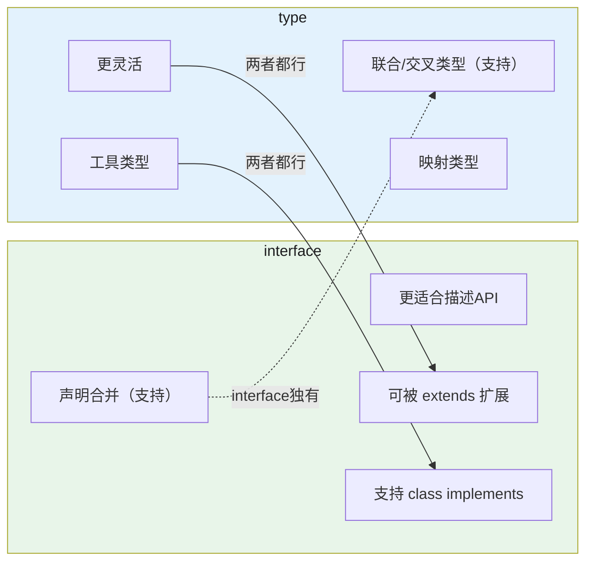

# 接口、类型别名与泛型

## 1. interface vs type

```typescript
// interface：接口
interface User {
  name: string;
  age: number;
}

// type：类型别名
type UserType = {
  name: string;
  age: number;
};

// 两者都能描述对象结构，区别如下：




// interface 声明合并（最独特的能力）：
interface Config {
  url: string;
}
interface Config {
  timeout: number;
}
// 等价于：
// interface Config { url: string; timeout: number; }

// 应用：扩展第三方库的interface
// 库定义的接口可以自行声明扩展，不需要改库代码

// type联合/交叉：
type A = { a: number } | { b: string };
type B = { c: boolean } & { d: number };

// 实际选型建议：
// 大多数情况用 type（更灵活）
// 需要声明合并时用 interface
// 描述API接口时用 interface（约定俗成）

// 两者都可以被extends扩展：
interface Animal { name: string; }
interface Dog extends Animal { bark(): void; }

type Cat = { name: string } & { meow(): void };
```

## 2. 泛型

### 2.1 什么是泛型

```typescript
// 泛型：类型参数化，让函数/接口/类支持多种类型
// 不使用泛型（不够通用）：
function identity(n: number): number { return n; }
function identityStr(s: string): string { return s; }

// 使用泛型（通用）：
function identity<T>(arg: T): T { return arg; }
const num = identity<number>(1);     // T=number
const str = identity<string>("hi");  // T=string
const inferred = identity(42);      // 自动推断 T=number

// 泛型函数类型：
const fn: <T>(arg: T) => T = identity;
const fn2: { <T>(arg: T): T } = identity;

// 泛型约束（限制T的范围）：
interface HasLength { length: number; }
function logLength<T extends HasLength>(arg: T): number {
  return arg.length;
}
logLength("hello"); // 5
logLength([1, 2]);  // 2
// logLength(123);  // 报错，数字没有length
```

### 2.2 泛型约束

```typescript
// 多泛型参数：
function pair<K, V>(key: K, value: V): [K, V] {
  return [key, value];
}
const p = pair<string, number>("age", 18); // [string, number]

// 泛型约束：继承某个类型
function getProperty<T, K extends keyof T>(obj: T, key: K): T[K] {
  return obj[key];
}
const user = { name: "张三", age: 18 };
const name = getProperty(user, "name"); // string
// const err = getProperty(user, "height"); // 报错，不在keyof中

// keyof：获取类型的所有键名，返回联合类型
type UserKeys = keyof User; // "name" | "age"

// 泛型默认类型：
function createArray<T = string>(length: number, value: T): T[] {
  return new Array(length).fill(value);
}
const arr = createArray(3); // 默认 T=string，等价于 string[]

// 泛型类：
class Queue<T> {
  private items: T[] = [];
  enqueue(item: T) { this.items.push(item); }
  dequeue(): T | undefined { return this.items.shift(); }
}
const numQueue = new Queue<number>();
numQueue.enqueue(1);
numQueue.enqueue("2"); // 报错，只能是number

// 泛型别名：
type Nullable<T> = T | null | undefined;
type Result<T> = { data: T; error: null } | { data: null; error: Error };

// 多约束：
function process<T extends string & { length: number }>(arg: T): void {}
// T 必须既是string（有length），又有length属性（string满足）
```
