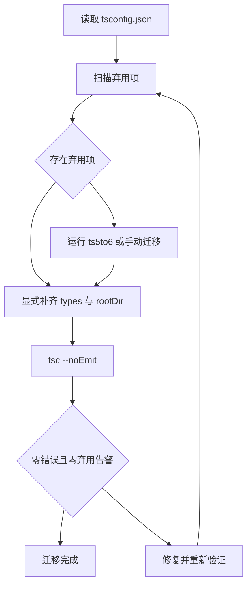

# TypeScript 6.0：桥梁版本与迁移指南

!!! abstract "核心结论"
    - TypeScript 6.0 是 5.9 与 7.0 之间的"桥梁版本"，也是最后一个基于 JavaScript 代码库的版本：它的核心职责是让默认行为提前与 7.0 对齐，把破坏性变更转化为 6.0 的告警与 7.0 的强制。
    - 默认值整体收紧：strict 默认 true、module 默认 esnext、target 默认 es2025、noUncheckedSideEffectImports 默认 true、types 默认 []、rootDir 默认 "."；多数存量项目至少需要显式设置 types 与 rootDir。
    - 弃用与移除清单覆盖旧构建链路：target es5、downlevelIteration、node/node10/classic 解析、amd/umd/systemjs/none 模块、baseUrl、outFile、esModuleInterop=false 与 allowSyntheticDefaultImports=false、alwaysStrict=false 等。
    - `"ignoreDeprecations": "6.0"` 只能暂时压制弃用告警，7.0 将完全不再支持这些行为；实验工具 ts5to6 可自动调整 baseUrl 与 rootDir，types 仍需人工确认。
    - 迁移验收以 `tsc --noEmit` 为最低门槛：示例工程在 strict + esnext + es2025 下通过编译，且无 TS5112、无弃用告警，才算完成迁移。

## 1. 桥梁版本定位：5.9 与 7.0 之间

### 1.1 为什么需要 6.0

TypeScript 6.0 于 2026-03-23 发布（Daniel Rosenwasser），位于 5.9 与 7.0 之间。官方资料明确它有两个身份：

- 功能上，6.0 并不追求引入大量全新语法或类型系统能力，它更像一次"默认值 + 弃用项"的集中调整。
- 工程上，它是最后一个基于 JavaScript 代码库的版本，7.0 将基于新的代码库。

这决定了 6.0 的迁移价值：团队现在把 5.x 的宽松默认值和旧构建选项修掉，7.0 到来时就不会被硬性移除打断。`ignoreDeprecations: "6.0"` 的存在也印证了这一点——它是"允许你今天继续跑，但明天必须改"的信号，而不是永久豁免。

### 1.2 桥梁版本的三层含义

1. 默认值桥梁：strict/module/target/types/rootDir 等默认值先行切换，让"新项目开箱即严格，旧项目显式声明例外"。
2. 弃用桥梁：一批 5.x 时代仍可用的旧行为在 6.0 中进入弃用告警或直接移除，7.0 彻底删除。
3. 诊断桥梁：新增 `--stableTypeOrdering` 让类型排序与 7.0 一致，便于在 6.0 上提前对比迁移效果（官方资料注明可能慢至 25%，仅用于诊断）。

## 2. 默认值变化：从宽松默认到严格默认

### 2.1 默认值变化总览

官方资料给出的 6.0 默认值变化如下表。需要先说明：官方资料未逐条写明每个默认值变化的"设计理由"，下面表格中的"影响/迁移"列是基于该默认值行为的直接技术后果推导，用于复习与面试表达；如需逐条官方出处，请核对发布说明原文。

| 配置项 | 5.x 默认 | 6.0 默认 | 影响谁 | 如何迁移 |
| --- | --- | --- | --- | --- |
| strict | false | true | 所有项目；隐式 any 的代码立即报错 | 删除显式 `"strict": true`（可留），显式 false 需逐个补齐类型 |
| module | commonjs | esnext | 输出 JS 的模块格式；CommonJS 项目受影响 | Node 项目考虑 `nodenext`；打包器项目用 `esnext` |
| target | es5 | es2025 | 输出 ES 级别；老运行时受影响 | 显式写较低 target（不建议设回 es5，见弃用清单） |
| noUncheckedSideEffectImports | false | true | 有副作用导入（import "./x"）的项目 | 确认副作用导入路径正确，或显式关闭 |
| libReplacement | true | false | 依赖默认 lib 替换行为的项目 | 如 lib 数组行为异常，核对官方文档后显式配置 lib |
| rootDir | 由输入文件推断 | `.`（tsconfig 所在目录） | 源码在 `src/` 下、声明输出结构敏感的项目 | 显式写 `"rootDir": "./src"` |
| types | `["*"]`（全部 @types 包） | `[]` | 依赖 Node/DOM/Jest 等全局类型的项目 | 显式写 `"types": ["node"]` 等；旧行为可用 `["*"]` 恢复 |

这张表可以直接回答面试中的"6.0 改了哪些默认值、你实际改了什么"。

### 2.2 默认值解析器：手写简化实现

下面实现一个配置合并器，把 5.x 与 6.0 两套默认表固化在代码里，并用 `node:assert` 验证显式值覆盖、`types` 数组不共享引用等真实 tsconfig 语义。

```javascript
// 运行环境：Node.js 22+（ESM），保存为 defaults-resolver.mjs
import { strict as assert } from 'node:assert';

// TypeScript 5.x 与 6.0 的关键默认值（只覆盖本页有变化的项）
const TS5_DEFAULTS = Object.freeze({
  strict: false,
  module: 'commonjs',
  target: 'es5',
  noUncheckedSideEffectImports: false,
  libReplacement: true,
  rootDir: '<inferred>', // 5.x：由输入文件推断，见 2.3 的算法
  types: ['*'],          // 5.x：自动包含 node_modules/@types 下全部声明包
});

const TS6_DEFAULTS = Object.freeze({
  strict: true,
  module: 'esnext',
  target: 'es2025',
  noUncheckedSideEffectImports: true,
  libReplacement: false,
  rootDir: '.',          // 6.0：tsconfig 所在目录
  types: [],             // 6.0：不自动包含任何 @types 包
});

// tsconfig 合并语义：显式写出的值优先，undefined 表示"未设置，用默认值"
function resolveCompilerOptions(user = {}, defaults = TS6_DEFAULTS) {
  const merged = {};
  for (const key of Object.keys(defaults)) {
    merged[key] = user[key] === undefined ? defaults[key] : user[key];
  }
  // types 是数组：每次解析都生成新数组，避免调用方之间共享引用
  merged.types = Array.isArray(user.types)
    ? [...user.types]
    : Array.isArray(defaults.types)
      ? [...defaults.types]
      : defaults.types;
  return merged;
}

export { TS5_DEFAULTS, TS6_DEFAULTS, resolveCompilerOptions };

// 验证标准（运行 node defaults-resolver.mjs）
{
  // 未显式设置时，6.0 默认值生效
  const six = resolveCompilerOptions({});
  assert.equal(six.strict, true);
  assert.equal(six.module, 'esnext');
  assert.equal(six.target, 'es2025');
  assert.equal(six.noUncheckedSideEffectImports, true);
  assert.equal(six.libReplacement, false);
  assert.equal(six.rootDir, '.');
  assert.deepEqual(six.types, []);

  // 显式设置覆盖默认值（即使是 false，也会被尊重）
  const overridden = resolveCompilerOptions({ strict: false, target: 'es2020' });
  assert.equal(overridden.strict, false);
  assert.equal(overridden.target, 'es2020');

  // 切回 5.x 默认表，验证旧行为：strict false、types 全量、rootDir 推断
  const five = resolveCompilerOptions({}, TS5_DEFAULTS);
  assert.equal(five.strict, false);
  assert.deepEqual(five.types, ['*']);
  assert.equal(five.rootDir, '<inferred>');

  // types 数组不应共享引用
  const a = resolveCompilerOptions({});
  a.types.push('node');
  const b = resolveCompilerOptions({});
  assert.deepEqual(b.types, []);

  console.log('defaults-resolver: 全部断言通过');
}
```

验证标准：执行 `node defaults-resolver.mjs`，预期输出仅一行 `defaults-resolver: 全部断言通过`，退出码 0；任一断言失败会抛出 `AssertionError`。

### 2.3 rootDir 推断算法：为什么 6.0 把它改成 "."

5.x 未显式指定 rootDir 时，编译器用"所有输入文件所在目录的最长公共前缀"作为 rootDir。该算法本身不复杂，脆弱点在于：只要在 `src/` 之外新增一个测试文件，推断结果就可能从 `src` 退化为 `.`，导致声明文件输出结构悄悄改变。6.0 直接把默认值定为 `.`，用确定性换掉推断的意外性。

```javascript
// 运行环境：Node.js 22+（ESM），保存为 rootdir-model.mjs
import { strict as assert } from 'node:assert';

// 简化模型：还原 5.x rootDir 推断的核心算法——最长公共目录前缀。
// 真实编译器还处理大小写、符号链接、include/exclude 过滤等，这里只保留算法骨架。
function splitPath(p) {
  return p.split(/[\\/]+/).filter(Boolean);
}

function dirOf(filePath) {
  const parts = splitPath(filePath);
  parts.pop(); // 去掉文件名，保留目录部分
  return parts.length > 0 ? parts.join('/') : '.';
}

function longestCommonDir(files) {
  if (files.length === 0) return '.';
  const dirParts = files.map((f) => splitPath(dirOf(f)));
  const first = dirParts[0];
  const prefix = [];
  for (let i = 0; i < first.length; i += 1) {
    const segment = first[i];
    if (dirParts.every((parts) => parts[i] === segment)) {
      prefix.push(segment);
    } else {
      break;
    }
  }
  return prefix.length > 0 ? prefix.join('/') : '.';
}

export { longestCommonDir };

// 验证标准（运行 node rootdir-model.mjs）
{
  // 源码全部在 src 下：推断出 src
  assert.equal(longestCommonDir(['src/index.ts', 'src/utils/helper.ts']), 'src');
  // 混入 test 目录：公共前缀消失，退化为 "."，这正是 5.x 推断的脆弱点
  assert.equal(longestCommonDir(['src/index.ts', 'test/index.test.ts']), '.');
  // 单文件：rootDir 是其所在目录
  assert.equal(longestCommonDir(['src/index.ts']), 'src');
  // 空输入
  assert.equal(longestCommonDir([]), '.');
  console.log('rootdir-model: 全部断言通过');
}
```

验证标准：执行 `node rootdir-model.mjs`，预期输出仅一行 `rootdir-model: 全部断言通过`。

### 2.4 tsconfig 前后对比

迁移前，依赖 5.x 默认值的配置（注释标出默认值来源）：

```jsonc
{
  "compilerOptions": {
    "strict": false,
    "module": "commonjs",
    "target": "es5",
    "noUncheckedSideEffectImports": false,
    "libReplacement": true
    // rootDir：由输入文件推断
    // types：自动包含全部 @types 包
  }
}
```

迁移后，面向 6.0 的配置（核心是显式补齐 types 与 rootDir）：

```jsonc
{
  "compilerOptions": {
    // strict/module/target 接受 6.0 默认值即可，不需要写出来
    // noUncheckedSideEffectImports 默认 true，接受即可
    // libReplacement 默认 false，接受即可
    "rootDir": "./src",
    "types": ["node"]
  }
}
```

判断标准：凡是旧配置里依赖"默认值恰好等于某个旧值"的地方，6.0 都可能翻转；凡是新配置里"必须显式写明的部分"，至少包含 `rootDir` 与 `types`。

## 3. 新特性：语言、标准库与模块解析

### 3.1 this-less 函数的上下文敏感性降低

TypeScript 中，对象属性方法语法（`{ method() { ... } }`）的函数会被上下文类型化，`this` 会从所在对象获得类型。6.0 之前，只要形如方法语法，即使函数体完全不用 `this`，它仍被视为 contextually sensitive，进而影响参数推断的先后顺序。6.0 起，函数体不使用 `this` 时，不再视为上下文敏感，推断结果与参数声明顺序无关。

真实编译器在类型检查阶段判断 `this` 是否为"空类型"。下面给出词法层面的简化近似：扫描函数体源码，检测是否存在裸 `this` 标识符（跳过字符串与注释）。

```javascript
// 运行环境：Node.js 22+（ESM），保存为 thisless-detect.mjs
import { strict as assert } from 'node:assert';

// 简化模型：判断函数体是否在词法层面引用了 this。
// 真实实现基于类型检查，这里只演示"是否出现 this 标识符"的判定骨架。
function scanThis(source) {
  let i = 0;
  const n = source.length;
  const isIdentChar = (c) =>
    c !== undefined && /[A-Za-z0-9_$]/.test(c);

  while (i < n) {
    const ch = source[i];
    // 跳过字符串字面量：' " `，内部遇反斜杠连跳两个字符
    if (ch === "'" || ch === '"' || ch === '`') {
      const quote = ch;
      i += 1;
      while (i < n) {
        if (source[i] === '\\') { i += 2; continue; }
        if (source[i] === quote) { i += 1; break; }
        i += 1;
      }
      continue;
    }
    // 跳过行注释
    if (ch === '/' && source[i + 1] === '/') {
      i += 2;
      while (i < n && source[i] !== '\n') i += 1;
      continue;
    }
    // 跳过块注释
    if (ch === '/' && source[i + 1] === '*') {
      i += 2;
      while (i < n && !(source[i] === '*' && source[i + 1] === '/')) i += 1;
      i += 2;
      continue;
    }
    // 裸 this 标识符：前后都不能是标识符字符，避免误判 thisThing
    if (source.startsWith('this', i)) {
      const before = source[i - 1];
      const after = source[i + 4];
      if (!isIdentChar(before) && !isIdentChar(after)) return true;
      i += 4;
      continue;
    }
    i += 1;
  }
  return false;
}

export { scanThis };

// 验证标准（运行 node thisless-detect.mjs）
{
  // 不使用 this：6.0 认为无上下文敏感性
  assert.equal(scanThis('function f() { return 1; }'), false);
  // 使用 this：仍保持上下文敏感
  assert.equal(scanThis('function f() { return this.value; }'), true);
  // 字符串与注释中的 this 不算
  assert.equal(scanThis('const label = "this"; // this\nfunction f() { return label; }'), false);
  // 模板字符串中的 this：本简化实现按字面量整体跳过（真实编译器会在 ${} 中继续分析）
  assert.equal(scanThis('function f() { return `${this}`; }'), false);
  // thisThing 不是 this
  assert.equal(scanThis('function f() { return thisThing; }'), false);
  console.log('thisless-detect: 全部断言通过');
}
```

验证标准：执行 `node thisless-detect.mjs`，预期输出仅一行 `thisless-detect: 全部断言通过`。注意模板字符串中的 `${this}` 会被这个简化实现误判为"不使用 this"，因为真实编译器需要解析模板表达式，这里明确标注为简化边界。

### 3.2 target/lib 与标准库新增内容

6.0 的 target/lib 新增 `es2025`，默认 target 同步指向它。新标准库内容与类型声明总结如下：

| 新增项 | 归属 | 说明 |
| --- | --- | --- |
| RegExp.escape() | es2025 | 字符串转义后安全拼接正则 |
| Promise.try | es2025 | 同步/异步统一入口 |
| 迭代器方法 | es2025 | 迭代器辅助方法（具体方法名以官方 lib 声明为准） |
| Set 方法 | es2025 | Set 集合运算方法（具体方法名以官方 lib 声明为准） |
| Temporal API 类型 | esnext 或 esnext.temporal | 新日期时间 API，需显式启用对应 lib |
| Map/WeakMap upsert | 类型声明 | getOrInsert、getOrInsertComputed；运行时可用性取决于执行环境与 polyfill，需核对官方文档 |
| dom lib | dom | 合并了 dom.iterable、dom.asynciterable，不再需要单独列出 |

迁移要点：需要 Temporal 类型时写 `"lib": ["esnext", "dom", "esnext.temporal"]` 之类显式 lib 数组；Map/WeakMap upsert 的方法名以官方 6.0 的 lib 声明为准，面试时不要凭 TC39 提案名反推 Array 上的同名方法。

### 3.3 子路径导入 `#/` 前缀

在 nodenext 与 bundler 模块解析下，6.0 支持 package.json `"imports"` 字段的 `#/` 前缀形式：

```jsonc
{
  "name": "example",
  "imports": {
    "#/*": "./dist/*"
  }
}
```

之后源码里可以写 `import value from "#/utils"`，解析结果等价于 `./dist/utils`。下面实现一个简化解析器，覆盖精确匹配与通配符最长前缀匹配。

```javascript
// 运行环境：Node.js 22+（ESM），保存为 imports-resolver.mjs
import { strict as assert } from 'node:assert';

// 简化模型：Node.js package.json "imports" 字段的子路径解析。
// 规则：非 # 开头报错；精确键优先于通配键；通配键按前缀长度降序匹配。
function resolveSubpath(specifier, imports) {
  if (!specifier.startsWith('#')) {
    throw new Error(`not a subpath import: ${specifier}`);
  }
  // 精确匹配优先（Node 算法中，无通配符的键优先级最高）
  if (Object.prototype.hasOwnProperty.call(imports, specifier)) {
    return imports[specifier];
  }
  // 通配符键按前缀长度降序排序，保证最长前缀优先匹配
  const patternKeys = Object.keys(imports)
    .filter((key) => key.endsWith('/*'))
    .sort((a, b) => b.length - a.length);

  for (const key of patternKeys) {
    const prefix = key.slice(0, -1); // "#/*" -> "#/"
    if (specifier.startsWith(prefix)) {
      const rest = specifier.slice(prefix.length);
      return imports[key].replace('*', rest);
    }
  }
  throw new Error(`no match in "imports" for ${specifier}`);
}

export { resolveSubpath };

// 验证标准（运行 node imports-resolver.mjs）
{
  const packageImports = {
    '#/utils': './dist/utils/index.mjs', // 精确键
    '#/*': './dist/*',                   // 通配键，兜底匹配
  };

  assert.equal(resolveSubpath('#/utils', packageImports), './dist/utils/index.mjs');
  assert.equal(resolveSubpath('#/helpers/string', packageImports), './dist/helpers/string');
  // 最长前缀匹配：更具体的 #/lib/* 优先于 #/*
  const nested = { '#/*': './dist/*', '#/lib/*': './internal/*' };
  assert.equal(resolveSubpath('#/lib/parse', nested), './internal/parse');
  // 非 # 前缀抛错
  assert.throws(() => resolveSubpath('./utils', packageImports), /not a subpath import/);
  // 未命中抛错
  assert.throws(() => resolveSubpath('#/missing', {}), /no match/);
  console.log('imports-resolver: 全部断言通过');
}
```

验证标准：执行 `node imports-resolver.mjs`，预期输出仅一行 `imports-resolver: 全部断言通过`。注意该前缀形式只在 nodenext 与 bundler 解析下有效，其他 moduleResolution 组合需核对官方文档。

### 3.4 模块解析组合与诊断选项

两个与模块解析相关的行为变化：

- 允许 `--moduleResolution bundler` 搭配 `--module commonjs`。因为 node10 解析已被弃用，官方资料给出的这一组合为"CommonJS 项目 + bundler 解析"提供了新的合规路径。
- 命令行行为收紧：目录中存在 tsconfig.json 时，`tsc foo.ts` 直接报 TS5112，需要使用 `--ignoreConfig` 忽略配置后单独编译文件。

另外，诊断选项 `--stableTypeOrdering` 让类型排序与 7.0 一致，便于在 6.0 上提前对比迁移前后诊断差异。官方资料明确它可能慢至 25%，仅用于诊断，不应作为日常构建选项。

### 3.5 新特性速览小结

6.0 的新特性呈"少而准"的分布：语言层面只动了 this-less 上下文敏感性一处，其余集中在标准库对齐（es2025、Temporal、upsert、dom 合并）与模块解析（`#/` 前缀、bundler+commonjs 组合）。这与"桥梁版本"的定位一致：不在 6.0 引入大量新语义，避免给 7.0 迁移叠加变量。

## 4. 弃用与移除清单

### 4.1 弃用/移除总览

官方资料把以下项统一列入"弃用/移除"清单。下表按"6.0 状态"一列区分弃用（6.0 告警、7.0 移除）与移除（6.0 不再支持）。

| 类别 | 项目 | 6.0 状态 | 替代方案 |
| --- | --- | --- | --- |
| 编译目标 | target es5 | 弃用 | target 升到 es2020+（默认 es2025） |
| 编译选项 | downlevelIteration | 弃用 | 提高 target，移除该项 |
| 模块解析 | moduleResolution node/node10 | 弃用 | nodenext |
| 模块解析 | moduleResolution classic | 弃用/移除（列为弃用移除清单） | bundler 或 nodenext |
| 模块格式 | module amd/umd/systemjs/none | 移除 | esnext/commonjs/preserve，交给打包器 |
| 指令 | amd-module 指令 | 移除 | 打包器配置 |
| 路径 | baseUrl | 移除 | paths 改写为相对 tsconfig 的路径 |
| 互操作 | esModuleInterop=false | 不再允许 | 使用默认 true |
| 互操作 | allowSyntheticDefaultImports=false | 不再允许 | 使用默认 true |
| 严格性 | alwaysStrict=false | 不再允许 | 移除显式 false |
| 输出 | outFile | 移除 | 打包器或 TS 工程引用 |
| 语法 | 旧式 `module Foo {}` | 弃用 | 改为 `namespace Foo {}`；ambient module 声明仍可用 |
| 导入断言 | `import ... asserts` | 弃用 | 改为 `import ... with` |
| 引用指令 | `/// <reference no-default-lib>` | 移除 | 替代方式需核对官方文档 |

### 4.2 为什么移除：两条主线

这些弃用与移除可以归纳为两条技术主线，便于面试时结构化表达：

1. 编译产物职责回退给打包器：amd/umd/systemjs/none 模块格式、outFile、amd-module 指令，本质上是"编译器帮你做 bundle"。现代前端链路中这一步由 esbuild/rollup/webpack 完成，TS 只负责类型检查与单文件降级。
2. 默认互操作语义收敛：esModuleInterop 与 allowSyntheticDefaultImports 默认 true 且不再允许显式 false，是为了消除两个 false 值组合出的不一致行为；alwaysStrict=false 同理，现代产物默认严格模式。

对于 `/// <reference no-default-lib>` 的替代方案，官方资料只列出"移除"，本页不补充猜测，标记为需核对官方文档。

### 4.3 弃用项扫描器：手写简化实现

下面实现一个配置层扫描器，仿照 ts5to6 的"扫出问题清单"行为，输出每个弃用项的迁移提示。

```javascript
// 运行环境：Node.js 22+（ESM），保存为 deprecation-checker.mjs
import { strict as assert } from 'node:assert';

// 简化模型：扫描编译器选项中的弃用项。真实 ts5to6 还会读 tsconfig 与源码，
// 这里只做配置层检查，覆盖官方资料列出的项。
const DEPRECATED_VALUES = Object.freeze({
  target: Object.freeze(['es5']),
  moduleResolution: Object.freeze(['node', 'node10', 'classic']),
  module: Object.freeze(['amd', 'umd', 'systemjs', 'none']),
});

function hintFor(key, value) {
  if (key === 'target' && value === 'es5') {
    return 'target 不再支持 es5，升到 es2020 或更高（6.0 默认 es2025）';
  }
  if (key === 'moduleResolution' && value === 'classic') {
    return 'classic 解析已弃用/移除，使用 bundler 或 nodenext';
  }
  if (key === 'moduleResolution') {
    return 'node/node10 已弃用，使用 nodenext 或 bundler';
  }
  if (key === 'module') {
    return '编译器不再产出 amd/umd/systemjs/none，改用 esnext/commonjs/preserve 后交给打包器';
  }
  return '弃用项，请移除或替换';
}

function checkDeprecations(compilerOptions) {
  const issues = [];
  for (const [key, badValues] of Object.entries(DEPRECATED_VALUES)) {
    const value = compilerOptions[key];
    if (value !== undefined && badValues.includes(value)) {
      issues.push({ key, value, hint: hintFor(key, value) });
    }
  }
  // 布尔型弃用项：只有显式写出时才检查
  if (compilerOptions.downlevelIteration === true) {
    issues.push({ key: 'downlevelIteration', value: true, hint: '移除该选项并提高 target' });
  }
  if (compilerOptions.alwaysStrict === false) {
    issues.push({ key: 'alwaysStrict', value: false, hint: '6.0 不再允许显式 false，移除该项' });
  }
  if (compilerOptions.esModuleInterop === false || compilerOptions.allowSyntheticDefaultImports === false) {
    issues.push({
      key: 'esModuleInterop/allowSyntheticDefaultImports',
      value: false,
      hint: '6.0 不再允许这两个选项为 false，移除后使用默认值 true',
    });
  }
  if (compilerOptions.baseUrl !== undefined) {
    issues.push({ key: 'baseUrl', value: compilerOptions.baseUrl, hint: '改写 paths 为相对 tsconfig 的路径后删除 baseUrl' });
  }
  if (compilerOptions.outFile !== undefined) {
    issues.push({ key: 'outFile', value: compilerOptions.outFile, hint: '改用打包器输出单文件，或使用 TS 工程引用' });
  }
  return issues;
}

export { checkDeprecations };

// 验证标准（运行 node deprecation-checker.mjs）
{
  const clean = checkDeprecations({ strict: true, target: 'es2025', module: 'esnext' });
  assert.equal(clean.length, 0);

  const legacy = checkDeprecations({
    target: 'es5',
    moduleResolution: 'node10',
    module: 'amd',
    downlevelIteration: true,
    alwaysStrict: false,
    esModuleInterop: false,
    baseUrl: './src',
    outFile: './dist/bundle.js',
  });
  assert.equal(legacy.length, 8);
  assert.ok(legacy.some((issue) => issue.key === 'target' && issue.value === 'es5'));
  assert.ok(legacy.some((issue) => issue.key === 'moduleResolution' && issue.value === 'node10'));
  assert.ok(legacy.some((issue) => issue.key === 'module' && issue.value === 'amd'));
  assert.ok(legacy.some((issue) => issue.key === 'downlevelIteration'));
  assert.ok(legacy.some((issue) => issue.key === 'alwaysStrict'));
  assert.ok(legacy.some((issue) => issue.key === 'esModuleInterop/allowSyntheticDefaultImports'));
  assert.ok(legacy.some((issue) => issue.key === 'baseUrl'));
  assert.ok(legacy.some((issue) => issue.key === 'outFile'));

  // ignoreDeprecations "6.0" 的语义：压制告警，但配置仍不受支持（7.0 移除）
  // 这里保留原数组，演示"告警被压掉"与"底层问题仍存在"是两个概念
  const suppressed = legacy;
  assert.equal(suppressed.length, 8);
  console.log('deprecation-checker: 全部断言通过');
}
```

验证标准：执行 `node deprecation-checker.mjs`，预期输出仅一行 `deprecation-checker: 全部断言通过`。

## 5. 迁移步骤与验证标准

### 5.1 官方迁移流程

官方资料的迁移导向是：`ignoreDeprecations: "6.0"` 暂时压制告警；实验工具 ts5to6 自动调整 baseUrl 与 rootDir；多数项目至少显式设置 types 与 rootDir。完整流程如下：



### 5.2 ignoreDeprecations 与命令行行为

`ignoreDeprecations: "6.0"` 的精确语义是：在 6.0 中压制弃用告警，让旧配置还能跑；但 7.0 完全不支持这些弃用项，届时该字段本身与背后选项一起消失。因此它只能作为过渡期工具，不应写入新项目配置。

命令行行为变化也在这里体现：目录有 tsconfig.json 时 `tsc foo.ts` 报 TS5112。

```javascript
// 运行环境：Node.js 22+（ESM），保存为 cli-decision.mjs
import { strict as assert } from 'node:assert';

// 简化模型：6.0 命令行决策。hasFileArgs 表示 tsc 后面带单个文件参数。
function decideCliCommand({ hasFileArgs, hasTsconfig }) {
  if (hasFileArgs && hasTsconfig) {
    return {
      ok: false,
      code: 'TS5112',
      hint: '目录中存在 tsconfig.json，tsc foo.ts 不再允许；使用 --ignoreConfig 或改为 tsc -p',
    };
  }
  return { ok: true };
}

export { decideCliCommand };

// 验证标准（运行 node cli-decision.mjs）
{
  assert.equal(decideCliCommand({ hasFileArgs: true, hasTsconfig: true }).code, 'TS5112');
  assert.equal(decideCliCommand({ hasFileArgs: true, hasTsconfig: false }).ok, true);
  assert.equal(decideCliCommand({ hasFileArgs: false, hasTsconfig: true }).ok, true);
  console.log('cli-decision: 全部断言通过');
}
```

验证标准：执行 `node cli-decision.mjs`，预期输出仅一行 `cli-decision: 全部断言通过`。

### 5.3 迁移器：ts5to6 简化实现

官方实验工具 ts5to6 自动调整 baseUrl 与 rootDir。下面实现其核心动作，并额外补上 types 显式化（官方资料要求人工确认，这里为教学合并展示）。

```javascript
// 运行环境：Node.js 22+（ESM），保存为 ts5to6-min.mjs
import { strict as assert } from 'node:assert';

// 简化模型：ts5to6 的配置迁移动作。
// 1) baseUrl -> paths 相对化；2) rootDir 显式化；3) types 显式化。
// 真实工具只覆盖 baseUrl 与 rootDir，types 需人工确认；此处合并展示。
function migrateConfig(rawConfig) {
  // 深拷贝，避免修改入参
  const out = JSON.parse(JSON.stringify(rawConfig));
  const opts = out.compilerOptions ?? (out.compilerOptions = {});

  // 1) baseUrl + paths：6.0 的 paths 基准从 baseUrl 变为 tsconfig 所在目录
  if (opts.baseUrl !== undefined) {
    const base = opts.baseUrl === '.' || opts.baseUrl === './'
      ? ''
      : opts.baseUrl.replace(/\/+$/, '') + '/';
    for (const key of Object.keys(opts.paths ?? {})) {
      opts.paths[key] = opts.paths[key].map((p) => {
        // 已是相对 tsconfig 的路径则保持原样
        if (p.startsWith('./') || p.startsWith('../')) return p;
        // 否则补上 baseUrl 前缀，保持原解析结果不变
        return base + p;
      });
    }
    delete opts.baseUrl;
  }

  // 2) rootDir：从"推断"变为 "."。源码在 src 下时必须显式写出
  if (opts.rootDir === undefined) {
    opts.rootDir = './src';
  }

  // 3) types：从"全部 @types"变为 []。按项目真实依赖补齐
  if (opts.types === undefined) {
    opts.types = ['node'];
  }

  return out;
}

export { migrateConfig };

// 验证标准（运行 node ts5to6-min.mjs）
{
  // baseUrl 为 "."：paths 已相对 tsconfig，只删除 baseUrl，并补齐 rootDir/types
  const withDotBase = migrateConfig({
    compilerOptions: { baseUrl: '.', paths: { '@app/*': ['src/*'] } },
  });
  assert.equal(withDotBase.compilerOptions.baseUrl, undefined);
  assert.deepEqual(withDotBase.compilerOptions.paths, { '@app/*': ['src/*'] });
  assert.equal(withDotBase.compilerOptions.rootDir, './src');
  assert.deepEqual(withDotBase.compilerOptions.types, ['node']);

  // baseUrl 为 "src"：paths 值需要补上 src 前缀才能保持原解析结果
  const withSrcBase = migrateConfig({
    compilerOptions: { baseUrl: 'src', paths: { '@app/*': ['utils/*'] } },
  });
  assert.deepEqual(withSrcBase.compilerOptions.paths, { '@app/*': ['src/utils/*'] });
  assert.equal(withSrcBase.compilerOptions.baseUrl, undefined);

  // 显式值不被覆盖
  const explicit = migrateConfig({
    compilerOptions: { rootDir: './lib', types: ['node', 'vitest/globals'] },
  });
  assert.equal(explicit.compilerOptions.rootDir, './lib');
  assert.deepEqual(explicit.compilerOptions.types, ['node', 'vitest/globals']);

  // 入参不被修改
  const origin = { compilerOptions: { baseUrl: '.', paths: { '@app/*': ['src/*'] } } };
  migrateConfig(origin);
  assert.equal(origin.compilerOptions.baseUrl, '.');
  console.log('ts5to6-min: 全部断言通过');
}
```

验证标准：执行 `node ts5to6-min.mjs`，预期输出仅一行 `ts5to6-min: 全部断言通过`。

### 5.4 验证标准：tsc --noEmit 与示例工程结构

示例工程结构：

```
demo-ts-migration
  package.json
  tsconfig.json
  src
    index.ts
    calc.ts
  dist
```

package.json：

```jsonc
{
  "name": "demo-ts-migration",
  "version": "1.0.0",
  "type": "module",
  "devDependencies": {
    "typescript": "^6.0.0",
    "@types/node": "^22.0.0"
  }
}
```

tsconfig.json（迁移后）：

```jsonc
{
  "compilerOptions": {
    "target": "es2025",
    "module": "esnext",
    "moduleResolution": "bundler",
    "strict": true,
    "rootDir": "./src",
    "types": ["node"],
    "declaration": true,
    "outDir": "./dist"
  },
  "include": ["src"]
}
```

src/calc.ts：

```ts
// src/calc.ts
export function add(a: number, b: number): number {
  return a + b;
}
```

src/index.ts：

```ts
// src/index.ts
import { add } from './calc';

// strict 模式下所有形参都必须有显式类型，否则报 implicit any
export function render(value: number): string {
  const total: number = add(value, 1);
  return `total=${total}`;
}
```

验证命令与预期输出：

```bash
npm install
npx tsc --noEmit
# 预期输出：无任何输出，退出码 0
```

再验证弃用项确实已清除（对比组，用于确认旧 target 会触发告警）：

```bash
npx tsc --noEmit --target es5
# 预期输出：target es5 的弃用/错误信息（具体文案需核对官方文档）；迁移后的正式配置不应出现该输出
```

迁移检查清单：

- [ ] `tsc --noEmit` 退出码 0，无任何错误与弃用告警
- [ ] `compilerOptions.types` 已显式列出全部所需 @types 包
- [ ] `compilerOptions.rootDir` 已显式指定为源码目录（如 `./src`）
- [ ] `paths` 已相对 tsconfig 目录，`baseUrl` 已删除
- [ ] target/module/moduleResolution 均使用 6.0 支持的值
- [ ] 不存在 esModuleInterop=false、allowSyntheticDefaultImports=false、alwaysStrict=false、outFile、downlevelIteration
- [ ] 新配置未写入 ignoreDeprecations（仅过渡期对旧配置临时使用）
- [ ] 若有旧式 `module Foo {}` 语法，已改为 namespace；ambient module 声明保持不变
- [ ] 若使用 import asserts，已改为 import with

## 6. 常见陷阱

### 6.1 types 默认 [] 导致全局类型静默消失

6.0 起不显式写 `types` 就不会加载任何 @types 包。Node 项目最常见的第一个报错是：

```ts
// 未设置 types 时的症状：Node 全局类型不再自动加载
console.log(process.cwd());
// 报错：Cannot find name 'process'
```

修复方式是在 tsconfig 中显式声明：

```jsonc
{
  "compilerOptions": {
    "types": ["node"]
  }
}
```

陷阱点：错误信息是 `Cannot find name 'process'`，新手容易误以为是 JS 运行时问题，实际是类型声明未加载。恢复 5.x 旧行为可用 `"types": ["*"]`，但官方默认已经不推荐隐含全量加载。

### 6.2 rootDir 默认 "." 悄悄改变声明输出结构

源码在 `src/` 下时，rootDir 默认 `.` 会导致声明文件输出到 `dist/src/` 而不是 `dist/`：

```bash
npx tsc -p tsconfig.json
# rootDir "." 时：dist/src/index.js、dist/src/index.d.ts
# rootDir "./src" 时：dist/index.js、dist/index.d.ts
```

这是 2.3 节推断算法脆弱性的镜像：不显式写 rootDir，输出结构就取决于默认值而不是你的意图。

### 6.3 paths 相对化的方向容易做反

baseUrl 移除后，paths 值以 tsconfig 所在目录为基准。旧配置 `baseUrl: "./src"` + `paths: { "@app/*": ["./*"] }` 的等价新写法是 `paths: { "@app/*": ["./src/*"] }`，而不是去掉 `./src` 剩下的 `./*`。方向做反会导致模块解析静默失效，且错误往往只出现在打包阶段。

### 6.4 target es2025 与老运行时不兼容

6.0 默认 target 是当前稳定 ES 版本 es2025。如果你的产物需要跑在较老运行时上，必须显式写较低 target，但不要再写回已弃用的 es5。面试中要能区分"默认值适合现代项目"与"存量项目需要显式覆盖"这两种情况。

### 6.5 不要依赖 ignoreDeprecations 作为长期方案

`ignoreDeprecations: "6.0"` 压制的是告警，不是底层行为。7.0 完全不支持这些弃用项后，带着该字段的旧配置会直接失败。把它当作迁移窗口期的止痛药，而不是新项目的默认配置。

## 7. 面试题与答题要点

### 7.1 为什么说 TypeScript 6.0 是"桥梁版本"？

要点：介于 5.9 与 7.0 之间；最后一个基于 JavaScript 代码库的版本；核心动作是把 7.0 的默认值与弃用清单提前到 6.0 以"告警 + 可选压制"的形式发布，让团队在 7.0 硬性删除前完成迁移；`ignoreDeprecations: "6.0"` 与 `--stableTypeOrdering` 都是服务于这个过渡目标。

### 7.2 6.0 把 strict 默认值改成 true，对存量项目意味着什么？

要点：新项目零配置即严格模式；存量项目若之前依赖默认 false 跑通，升级后会出现隐式 any、可能为 null/undefined 等一系列新报错；迁移动作不是把 strict 设回 false，而是按 strict 的四个子开关逐个补齐类型；显式 `"strict": false` 在 6.0 仍然合法，但会放弃默认收紧带来的收益（此点需以官方对 strict 子项的具体行为为准，核心事实是默认值由 false 变为 true）。

### 7.3 types 默认值从 ["*"] 变成 [] 的动机是什么？怎么迁移？

要点：直接后果是不再自动加载全部 @types 包，依赖全局类型的项目会报 `Cannot find name`；迁移动作是显式写 `"types": ["node"]` 等按需列表，旧行为可用 `["*"]` 恢复但不再是默认；这使项目依赖的全局类型显式可见，避免隐式全局污染导致的意外编译通过。

### 7.4 rootDir 从推断改成 "." 解决了什么问题？

要点：5.x 推断基于所有输入文件目录的最长公共前缀，新增 src 之外的测试文件会让推断从 `src` 退化为 `.`，声明输出结构随之改变；6.0 默认 `.` 消除推断的意外性，代价是源码在 src 下的项目必须显式写 `"rootDir": "./src"`，否则输出多一层 src 目录。

### 7.5 baseUrl 移除后 paths 怎么写？

要点：paths 的基准路径从 baseUrl 变为 tsconfig 所在目录；旧配置 `baseUrl: "./src"` 下 `paths: { "@app/*": ["./*"] }` 要改写成 `paths: { "@app/*": ["./src/*"] }`；ts5to6 会自动完成 baseUrl 与 rootDir 的调整，但建议人工复核 paths 的最终解析结果。

### 7.6 module amd/umd/systemjs/none 移除后，要输出这些格式怎么办？

要点：编译器不再负责打包与模块格式转换，职责回退给打包器；TS 侧改用 `module: esnext` 或 `commonjs`，产物交给 esbuild/rollup/webpack 输出 amd/umd 等格式；amd-module 指令同理转移为打包器配置；这是"编译器做类型检查，打包器做 bundle"的边界回归。

### 7.7 esModuleInterop=false 与 allowSyntheticDefaultImports=false 为什么会"不再允许"？

要点：这两个选项默认 true，且显式 false 与默认 true 之间存在不一致的互操作行为；6.0 直接不再允许 false，把互操作语义收敛为一种；迁移动作是删除这两个显式 false，接受默认 true，并修正受影响的导入写法。

### 7.8 目录里有 tsconfig.json 时 `tsc foo.ts` 报 TS5112 怎么办？

要点：这是 6.0 的命令行行为收紧，防止"单文件编译"与"工程配置"的隐式混合；处理方式是加 `--ignoreConfig` 忽略配置编译单文件，或改用 `tsc -p tsconfig.json` 走工程模式；回答时要把 TS5112 与 ignoreDeprecations 区分开——前者是命令行入口约束，后者是弃用告警压制。

## 8. 结语

6.0 的迁移主线只有一句话：把"靠默认值活着的配置"改成"靠显式声明活着的配置"。strict、module、target、types、rootDir 五个默认值翻转决定了新项目的基线，baseUrl/outFile/amd 等弃用项决定了旧构建链路的归宿。用 `tsc --noEmit` 做最低验收门槛，用 ts5to6 自动化 baseUrl 与 rootDir，再用 ignoreDeprecations 争取过渡窗口，就能在 7.0 到来前把技术债清零。

## 深入阅读与参考

!!! tip "怎么用这些资料"
    先读「官方文档与规范」建立准确的概念，再读「源码与示例」核对细节，最后用「教程、书籍与视频」换一种讲法加深理解。每条都写明了读哪一节、带着什么问题读。

### 官方文档与规范

| 资源 | 为什么读 | 怎么读 |
|---|---|---|
| [TypeScript 官方手册](https://www.typescriptlang.org/docs/) | 官方手册权威覆盖配置与模块解析，是迁移的基线文档。 | 重点读 tsconfig 严格选项与模块解析章节，对照自己项目逐项改配置并验证。 |
| [TypeScript 博客](https://devblogs.microsoft.com/typescript/) | 6.0 新特性与弃用信息的第一手来源，版本迁移必读。 | 按 5.9、6.0、7.0 顺序读 What's New，列出影响本项目的变更清单。 |
| [TypeScript 模块解析](https://www.typescriptlang.org/docs/handbook/modules/introduction.html) | 模块解析默认值变化最易踩坑，需理解各取值对应场景。 | 读取值对照表，带着“该用 node16 还是 bundler”查，回项目验证解析结果。 |
| [Configuring TypeScript](https://docs.deno.com/runtime/reference/ts_config_migration/) | 官方配置迁移指南，直接对应默认值收紧与选项迁移。 | 按清单检查 tsconfig，把废弃选项替换为推荐值，跑类型检查验证。 |
| [TypeScript 官方文档中文站](https://www.typescriptlang.org/zh/docs/) | 中文快速查阅入口，降低官方文档阅读门槛。 | 先用中文站定位概念，再回英文版核对细节与版本差异。 |

### 源码与示例

| 资源 | 为什么读 | 怎么读 |
|---|---|---|
| [TypeScript AST Viewer](https://ts-ast-viewer.com/) | 观察新语法与弃用写法的 AST 差异，理解语言变更。 | 输入迁移前后代码，对比 AST 节点，确认移除特性如何报错。 |
| [tsx](https://tsx.is/) | 迁移验证时可快速运行 TS 脚本，不依赖完整构建。 | 用 tsx 跑迁移脚本和冒烟测试，验证运行时行为未变。 |
| [tsdown](https://tsdown.dev/) | 验证声明文件与模块输出是否符合 6.0 的解析规则。 | 打包一个示例库，检查生成的 d.ts 与 package exports 是否正确。 |

### 教程、书籍与视频

| 资源 | 为什么读 | 怎么读 |
|---|---|---|
| [TypeScript 入门教程（xcatliu）](https://ts.xcatliu.com/) | 中文系统教程，适合补齐从 JS 到 TS 的语法与工程基础。 | 按章节学习，读完后把一个 JS 小项目迁移到 TS 并跑通构建。 |
| [Effective TypeScript（第 2 版）](https://effectivetypescript.com/) | 用重构建议理解严格模式下的类型设计取舍，实用性强。 | 找“迁移/严格模式”相关条目，在自己的代码里应用一处并运行类型检查。 |
| [Total TypeScript Essentials](https://www.totaltypescript.com/books/total-typescript-essentials) | 练习驱动，快速熟悉严格模式与新语法细节。 | 配合练习题逐章完成，重点做迁移与类型收窄相关题目。 |
| [Matt Pocock](https://www.youtube.com/@mattpocockuk) | 短小技巧，适合快速验证新特性和严格模式写法。 | 挑 6.0 相关技巧，在 Playground 复现并记录到项目规范。 |

## 应用与行业实践

### 应用场景地图

| 场景 | 用到本页哪个知识点 | 典型技术选型 | 注意事项 |
| --- | --- | --- | --- |
| 后台管理的万行表格 | strict 默认 true、types 默认 []、rootDir 默认 "." | React + Vite + 虚拟滚动 | strict 开启后先处理判空；types 要显式写全局类型；rootDir 写 src 稳定产物层级 |
| 低端安卓的首屏加载 | target 默认 es2025、noUncheckedSideEffectImports 默认 true | Vite + Rollup + browserslist | 按设备基线显式覆盖 target；CSS 副作用导入路径要在编译期暴露 |
| 多人协作白板 | strict 默认 true、module 默认 esnext、弃用 node 解析 | WebSocket + CRDT + Node ESM | 联合类型用 kind 收窄；服务端 types 写 node；解析改 nodenext |
| 电商大促的库存看板 | strict 默认 true、tsc --noEmit 验收 | React + SWR + 轮询接口 | 接口字段可空时先判空；CI 用 tsc --noEmit 挡类型错误 |
| 跨端小程序的状态同步 | module 默认 esnext、target 默认 es2025 | Taro + 小程序构建器 | 小程序运行时不支持 ESM 时显式设置 module；target 按宿主基线覆盖 |
| 数据可视化大屏的实时图表 | strict 默认 true、types 默认 [] | ECharts + WebSocket | 图表配置联合类型用判别字段；types 显式声明可视化库全局类型 |
| Node BFF 的接口聚合层 | 弃用 node 解析、types 默认 []、rootDir 默认 "." | Fastify + undici + tsx | 解析改 nodenext；types 写 node；rootDir 写 src 避免产物路径漂移 |
| 桌面端 Electron 的本地文件索引 | target 默认 es2025、弃用 outFile | Electron + esbuild | Electron 内置 Node 版本决定 target；outFile 已弃用，改用打包器 |

### 三个场景拆解

#### 场景 1：后台管理的万行表格

**业务背景**：管理后台表格渲染上万行，列定义由前端拼装，空值判断遗漏导致运行时崩溃。规模量级：单页行数上万、列数几十，用虚拟滚动保持滚动帧率。

**怎么用本页知识解决**：思路是用 strict 默认 true 强制判空，用 types 与 rootDir 显式声明项目边界。代码块如下。

```jsonc
{
  "compilerOptions": {
    "strict": true,              // 空值检查开启，单元格缺失值必须先判空
    "module": "esnext",          // 与 Vite 的 ESM 输出对齐
    "target": "es2025",          // 与团队运行的现代浏览器基线对齐
    "types": [],                 // 不自动引入全局类型，避免表格类型被污染
    "rootDir": "src"             // 显式指定源码根目录，避免产物层级漂移
  }
}
```

- strict 默认 true 后，`row.cells[i]` 可能为 undefined 的路径会被标出，改动集中在渲染函数。
- types 默认 []，表格项目需要的全局类型要写进数组。
- rootDir 默认 "."，显式写 src 可让 outDir 结构稳定。
- module esnext 与 Vite 一致，避免 CommonJS 互操作分支。
- 用 `tsc --noEmit` 在 CI 记录迁移前后错误数。

**怎么度量收益**：看 CI 的 `tsc --noEmit` 错误数，用命令输出计数；看 Sentry 中 `TypeError` 问题数，按 issue 类型筛选；看浏览器 Performance 面板的滚动帧率，录制 10 秒滚动。

**什么时候不该用**：

- 表格列由后端 JSON schema 在运行时生成，前端没有静态列类型，强行建模需要额外代码生成步骤。
- 项目仍要支持 ES5 运行环境，target es2025 产出语法不被接受，需先调整运行环境或构建降级链。

#### 场景 2：低端安卓的首屏加载

**业务背景**：低端安卓设备打开 H5 首屏，脚本解析和 CSS 副作用导入路径错误导致白屏。规模量级：首屏包体控制在几百 KB，设备内存有限。

**怎么用本页知识解决**：思路是按浏览器基线显式覆盖 target，用 noUncheckedSideEffectImports 默认 true 暴露副作用导入错误。代码块如下。

```jsonc
{
  "compilerOptions": {
    "target": "es2019",          // 按低端安卓浏览器基线覆盖默认 es2025
    "module": "esnext",          // 保留 ESM，交给打包器做语法降级
    "types": ["vite/client"],    // 显式声明构建工具的全局类型
    "rootDir": "src",            // 源码根目录写死，产物路径不随默认值漂移
    "noUncheckedSideEffectImports": true // CSS 与图片导入必须能被解析
  }
}
```

- target 默认 es2025 超出部分低端设备支持范围，显式降级到项目基线。
- module esnext 交给 Vite/Rollup 处理，tsc 只做类型检查。
- types 默认 []，若不写 vite/client，`import.meta.env` 等类型会缺失。
- rootDir 默认 "."，写 src 可让 outDir 层级与打包入口一致。
- noUncheckedSideEffectImports 默认 true，`import "./style.css"` 路径写错会在编译期报错。

**怎么度量收益**：看 Lighthouse 移动端节流下的 FCP、LCP、TBT；看 Chrome DevTools Performance 面板的长任务数；用 WebPageTest 做多轮测量。

**什么时候不该用**：

- 项目只面向现代桌面浏览器，显式降级 target 会限制可用语法。
- 构建链已经用 Babel 或 SWC 做语法降级，tsc 仅做类型检查，改 target 不影响产物体积。

#### 场景 3：多人协作白板

**业务背景**：白板房间内几十人同时绘制，操作消息类型不匹配导致远端状态错乱。规模量级：每秒操作消息从个位数到几十条，房间数按需扩容。

**怎么用本页知识解决**：思路是用 strict 默认 true 让联合类型收窄，用 module esnext 与 nodenext 对齐服务端 ESM。代码块如下。

```ts
type Draw = { kind: "draw"; points: Array<[number, number]> };
type Move = { kind: "move"; id: string; dx: number; dy: number };
type Op = Draw | Move;

function apply(op: Op): void {
  switch (op.kind) {
    case "draw": // strict 下收窄到 Draw
      op.points.forEach(([x, y]) => console.log(x, y));
      break;
    case "move": // strict 下收窄到 Move
      console.log(op.id, op.dx, op.dy);
      break;
  }
}
```

- strict 默认 true 后，switch 对 `op.kind` 的收窄在编译期生效。
- 若漏掉一个 kind，`apply` 的返回值检查或穷尽检查会暴露。
- module esnext 与服务端 ESM 输出一致，避免 require 与 import 混用。
- 弃用 node 解析后，改用 nodenext，配合 package.json 的 exports。
- types 默认 []，服务端要写 `["node"]`，否则 Node 全局类型缺失。

**怎么度量收益**：看 CI 的 `tsc --noEmit` 错误数；看服务端日志中“消息格式不匹配”错误率，按错误码聚合；看白板状态回滚次数，从同步日志统计。

**什么时候不该用**：

- 白板消息由后端动态 schema 生成，前端不做静态类型校验，强类型收益低。
- 团队还没迁移到 ESM，module esnext 会引入互操作问题，先保持 CommonJS 并显式设置 module。

### 行业先进实践

严格模式渐进启用（出处：TypeScript 官方文档 tsconfig 参考）。做法是用 `strict` 总开关，并在按目录拆分的 tsconfig 中只对新代码开启。限制迁移爆炸半径，让旧代码不被一次性淹没。你的项目可以先把 `src/new` 纳入 strict，再逐步扩大 include。

共享 tsconfig 基线（出处：GitHub tsconfig/bases 开源项目）。做法是用 `@tsconfig/strictest` 作为基础配置，再覆盖 6.0 默认值。社区维护的严格选项集减少漏配，把团队共识写进一个可继承文件。你的项目可以把 types 与 rootDir 写进团队基线，减少每个仓库重复设置。

CI 运行 tsc --noEmit（出处：TypeScript 官方文档 tsc CLI）。做法是在 CI 执行无产物类型检查，把错误挡在合并前。类型错误不进入主分支，迁移验收有统一门槛。你的项目可以把无 TS5112、无弃用告警作为门禁。

显式声明全局类型来源（出处：TypeScript 官方文档 tsconfig types）。做法是用 `types` 数组只引入需要的全局包，不让默认 [] 之外的类型自动进入。避免全局类型污染，降低编译内存。你的项目迁移时把 `types` 从默认 [] 改成显式列表，并在代码评审中检查。

用 lint 规则拦截弃用 API（出处：typescript-eslint 官方文档）。做法是启用 `@typescript-eslint/no-deprecated`，在编辑器内提前标记弃用用法。把 6.0 弃用清单映射为 lint 规则，能在提交前发现问题。需核对官方文档：规则名与所需 parserOptions。

### 从学到用：落地路线

第 1 步：在独立新模块或小工具包试点，不动存量代码。验收标准：该模块在 strict + esnext + es2025 下 `tsc --noEmit` 通过，无弃用告警。

第 2 步：在试点运行 ts5to6，调整 baseUrl 与 rootDir，人工确认 types。验收标准：types 与 rootDir 在 tsconfig 中显式出现，迁移差异有记录。

第 3 步：把配置推广到主仓库，按目录拆分 tsconfig，先处理类型错误再处理弃用。验收标准：CI 中 `tsc --noEmit` 零错误、无 TS5112、无弃用告警。

第 4 步：加门禁防回退，锁定 TypeScript 版本，禁止新增弃用配置。验收标准：PR 检查失败不能合并，`ignoreDeprecations` 不出现在 tsconfig。

### 动手作业

目标：把一个存量小项目迁移到 TypeScript 6.0 默认对齐配置，并通过无告警类型检查。

步骤：

1. 复制一个小项目，运行 `tsc --noEmit`，记录迁移前错误数与告警数。
2. 在 tsconfig 显式设置 strict、module、target、types、rootDir。
3. 运行实验工具 ts5to6，调整 baseUrl 与 rootDir。
4. 人工确认 types，补上项目需要的全局类型。
5. 按弃用清单逐项替换：node 解析、amd 模块、outFile、esModuleInterop=false。
6. 运行 `tsc --noEmit`，处理 TS5112 与弃用告警。
7. 在 CI 配置同一命令，提交验收报告。

验收标准：

- `tsc --noEmit` 退出码为 0。
- 输出无 TS5112。
- 输出无弃用告警。
- tsconfig 中 types 与 rootDir 为显式值。
- `ignoreDeprecations` 未出现在 tsconfig。

