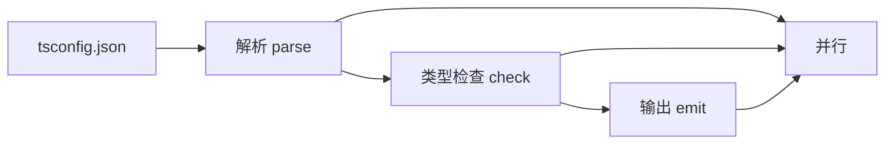

# TypeScript 7.0：Go 原生编译器

!!! abstract "核心结论"

    - TypeScript 7.0 于 2026-07-08 正式发布，是用 Go 重写的原生编译器与语言服务；移植策略是保持原代码库的结构与逻辑，逐步搬到 Go，从而同时拿到原生代码速度与共享内存多线程。
    - 全量构建通常快 8x 到 12x，内存下降 6% 到 26%；`--checkers 8` 在 VSCode 上达到 16.7x；编辑器打开带错误文件的响应从 17.5s 降到 1.3s 以内。
    - 并行由三个开关控制：`--checkers`（类型检查 worker 数，默认 4，实验性）、`--builders`（`tsc --build` 并行项目数）、`--singleThreaded`（关闭全部并行）。
    - 7.0 不提供稳定的编程 API，`require("typescript")` 的 compiler API 不可用；Vue/Svelte/MDX/Astro/Angular 模板类型检查、typescript-eslint 等仍走 TS 6.0（npm 别名），7.1 才给出新 API。
    - 7.0 默认值明显收紧，并移除了一批旧选项与旧语法；迁移前必须先清理 tsconfig，清单见第 9 节。

## 1. 项目背景与总体架构

### 1.1 时间线

- 2025-03-11：Anders Hejlsberg 宣布用 Go 重写 TypeScript 编译器与语言服务。
- 预览阶段：以 `@typescript/native-preview` 包和临时可执行文件 `tsgo` 的形式分发。
- 2026-07-08：TypeScript 7.0 正式发布，预览阶段结束；`npm install -D typescript` 直接提供新的 `tsc`。

### 1.2 “逐步移植”意味着什么

官方的说法是：保持原代码库的结构与逻辑，逐步移植到 Go。这一点比“重写”更容易被误读，它至少意味着两件事：

1. 移植过程中的正确性基线是现有实现，而不是重新设计语义。类型系统的行为、错误信息、检查顺序都以现有实现为准。
2. 数据结构与算法骨架按原样搬到 Go，因此 Go 侧的并发模型（共享内存 + 多线程）可以直接作用在同一份结构上，而不是通过序列化在进程/线程间交换。

（以上第 1、2 点为对“保持结构与逻辑逐步移植”的解读，属于分析，非官方结论。）

### 1.3 编译流水线的三个阶段



官方描述中，解析、类型检查、emit 三个阶段都会并行。注意这三阶段的并行语义并不相同：解析的并行度受文件数限制，类型检查的并行度受依赖图宽度限制，emit 的并行度受输出文件与模块格式限制。

## 2. 为什么是 Go（含分析）

### 2.1 官方给出的理由

官方给出的理由可以归纳为两点：

1. 原生代码速度：从 JavaScript 运行时搬到编译型语言的运行时。
2. 共享内存多线程：Go 的线程模型允许多个 worker 同时读写同一份编译期数据结构，而不是靠消息传递或进程隔离。

### 2.2 与 Rust 的取舍（以下为分析，非官方结论）

官方资料没有解释为什么是 Go 而不是 Rust，下面全部是分析性推理，面试中必须标注清楚：

| 维度 | Go（分析） | Rust（分析） |
| --- | --- | --- |
| 内存管理 | 自带 GC，移植一个本来依赖 GC 的编译器时，不需要为巨大的类型图手写所有权模型 | 无 GC，但编译器内部大量共享可变图结构会让借用检查器成为主要阻力 |
| 并发原语 | goroutine + channel 天然映射 worker 池与任务队列 | 可用 rayon/线程池，但共享可变状态需要锁或更复杂的所有权拆分 |
| 1:1 移植成本 | 语言特性少，映射直接，迭代快 | 表达力强，但每个数据结构都要重新设计所有权与生命周期 |
| 与系统 API 互操作 | 可用最小汇编 shim 或 cgo | 同样可以，但资料中 watch 的实现选择了汇编 shim 路线 |

这张表的作用是提供面试时的推理框架，而不是断言官方的决策依据。

### 2.3 共享内存多线程意味着什么

如果两个线程共享同一份符号表和类型关系缓存，就不需要为每个 worker 拷贝一份 AST，也不需要把类型对象序列化成跨进程消息。代价是并发安全：所有可被多个 checker 同时读写的结构都必须有明确的同步策略，否则会得到不确定的结果。`--checkers` 被官方标记为实验性、默认值为 4，本身就说明这条路径需要谨慎调优。

## 3. 并行模型：--checkers / --builders / --singleThreaded

### 3.1 三个开关的语义

| 开关 | 作用 | 默认值 | 备注 |
| --- | --- | --- | --- |
| `--checkers` | 类型检查 worker 数 | 4 | 官方标注为实验性 |
| `--builders` | `tsc --build` 时并行的项目数 | 资料未给出，需核对官方文档 | 适合 monorepo |
| `--singleThreaded` | 关闭全部并行 | 关闭状态 | 便于调试与对比基准 |

### 3.2 内存乘法关系

官方明确指出 `--builders` 与 `--checkers` 的内存占用是“乘法叠加”的。也就是说，把 `--builders` 调到 4、`--checkers` 保持 4，理论上会出现 16 个类型检查 worker 同时持有工作集。在 monorepo 上调参时必须同时看两个数字。

### 3.3 简化实现：依赖图上的并行类型检查

下面的模型把“检查一个文件”抽象为：先等所有依赖检查完成，再占用一个 checker 名额做一次耗时工作。它演示了两个关键结论：并发上限同时受 `--checkers` 与依赖图宽度限制；用逻辑时钟可以精确验证依赖顺序。

运行环境：Node.js 18+，CommonJS，保存为 `checkers.js`，执行 `node checkers.js`。

```js
// checkers.js
// 运行环境：Node.js 18+
// 说明：教学模型，用于说明 --checkers 的并发上限与依赖顺序，
// 不代表 TypeScript 编译器的内部实现。

'use strict';
const assert = require('node:assert/strict');

class Pool {
  constructor(limit) {
    this.limit = limit;   // 允许同时运行的任务数，对应 --checkers
    this.active = 0;      // 当前运行中的任务数
    this.peak = 0;        // 历史最大并发
    this.waiting = [];    // 等待被唤醒的任务
  }

  async run(fn) {
    while (this.active >= this.limit) {
      await new Promise((resolve) => this.waiting.push(resolve));
    }
    this.active += 1;
    this.peak = Math.max(this.peak, this.active);
    try {
      return await fn();
    } finally {
      this.active -= 1;
      const next = this.waiting.shift();
      if (next) next();
    }
  }
}

// 依赖图：key 必须在 value 中所有文件检查完成之后才能开始检查
const GRAPH = {
  a: ['b', 'c'],
  b: ['d'],
  c: ['d'],
  d: [],
  e: ['d'],
};

class ParallelChecker {
  constructor(graph, limit) {
    this.graph = graph;
    this.pool = new Pool(limit);
    this.tasks = new Map();       // file -> Promise，用于去重
    this.running = 0;
    this.peakRunning = 0;
    this.seq = 0;                 // 逻辑时钟
    this.startSeq = new Map();
    this.endSeq = new Map();
    this.checkedCount = new Map();
  }

  check(file) {
    const cached = this.tasks.get(file);
    if (cached) return cached;
    const task = this.runOne(file);
    this.tasks.set(file, task);
    return task;
  }

  async runOne(file) {
    const deps = this.graph[file] || [];
    await Promise.all(deps.map((dep) => this.check(dep))); // 依赖必须先完成
    await this.pool.run(async () => {
      this.running += 1;
      this.peakRunning = Math.max(this.peakRunning, this.running);
      this.checkedCount.set(file, (this.checkedCount.get(file) || 0) + 1);
      this.seq += 1;
      this.startSeq.set(file, this.seq);
      await Promise.resolve(); // 让出控制权，模拟一次检查耗时
      this.seq += 1;
      this.endSeq.set(file, this.seq);
      this.running -= 1;
    });
  }
}

async function runWith(limit) {
  const checker = new ParallelChecker(GRAPH, limit);
  await Promise.all(Object.keys(GRAPH).map((file) => checker.check(file)));
  return checker;
}

function assertDependencyOrder(checker) {
  for (const [file, deps] of Object.entries(GRAPH)) {
    for (const dep of deps) {
      assert.ok(
        checker.endSeq.get(dep) < checker.startSeq.get(file),
        `${dep} 必须在 ${file} 之前完成检查`,
      );
    }
  }
}

function assertCheckedOnce(checker) {
  for (const file of Object.keys(GRAPH)) {
    assert.equal(checker.checkedCount.get(file), 1, `${file} 只应被检查一次`);
  }
}

(async () => {
  for (const limit of [1, 2, 3, 4]) {
    const checker = await runWith(limit);
    assertDependencyOrder(checker);
    assertCheckedOnce(checker);
    assert.ok(checker.peakRunning <= limit, '并发不能超过 --checkers');
    // 图中最大可并行宽度为 3（d 完成后 b、c、e 同时就绪）
    assert.equal(checker.peakRunning, Math.min(limit, 3));
    console.log(`--checkers ${limit} -> peak ${checker.peakRunning}`);
  }
  console.log('全部断言通过');
})();
```

**验证标准**

预期输出：

```text
--checkers 1 -> peak 1
--checkers 2 -> peak 2
--checkers 3 -> peak 3
--checkers 4 -> peak 3
全部断言通过
```

断言覆盖三点：所有文件只检查一次（去重生效）、每个依赖的结束序号小于依赖者的开始序号（顺序正确）、峰值并发不超过 `--checkers` 且受图宽度封顶。`--checkers 1` 这一档等价于 `--singleThreaded` 的行为基线。

### 3.4 并行为什么难（分析，非官方结论）

- 依赖图宽度是硬上限：把 `--checkers` 从 4 提到 8，只有图上确实存在 8 条独立路径时才有收益，这解释了为什么不同项目的加速比不同。
- 共享可变结构：符号表、类型关系、缓存都需要同步策略；粒度太粗会退化成串行，太细会增加开销。
- 确定性输出：即使检查并行，诊断信息的顺序、emit 的产物顺序都必须稳定，否则 CI 的 diff 会抖动。
- 增量与 watch：并行检查必须与增量缓存保持一致，失效范围算错就会得到过期结果。
- 内存换时间：并发越高，工作集越大，这正是内存乘法关系需要注意的地方。

### 3.5 性能数据

全量构建从 TS 6 到 TS 7 的对比（官方数据）：

| 代码库 | TS 6 | TS 7 | 加速比 |
| --- | --- | --- | --- |
| VSCode | 125.7s | 10.6s | 11.9x |
| Sentry | 139.8s | 15.7s | 8.9x |
| Bluesky | 24.3s | 2.8s | 8.7x |
| Playwright | 12.8s | 1.47s | 8.7x |
| tldraw | 11.2s | 1.46s | 7.7x |

补充数据：

| 指标 | 数值 |
| --- | --- |
| 典型加速区间 | 8x 到 12x |
| 内存变化 | 降低 6% 到 26% |
| VSCode 打开带错误文件的编辑器响应 | 17.5s 降至 1.3s 以内 |
| VSCode 上 `--checkers 8` | 16.7x |
| Slack CI 类型检查 | 7.5min 降至 1.25min |
| Slack 合并队列时间 | 减少 40% |
| Canva 错误出现时间 | 58s 降至 4.8s |
| 微软新闻服务 | 每月节省 400 小时 CI 等待 |

## 4. 安装、双版本并存与语言服务

### 4.1 安装方式

| 目标 | 安装方式 |
| --- | --- |
| 7.0 编译器 | `npm install -D typescript`（提供新的 `tsc`） |
| 6.0 的 `tsc6` | `@typescript/typescript6` |
| CLI 与 API 分离 | `"typescript": "npm:@typescript/typescript6@^6.0.2"` 搭配 `"@typescript/native": "npm:typescript@^7.0.2"` |
| 每日构建 | `typescript@next` |

第二种组合的意图是让包名 `typescript` 继续解析到 6.0 的 API（供依赖 compiler API 的工具使用），同时通过 `@typescript/native` 别名拿到 7.0 的编译器。

`@typescript/native-preview` 与临时可执行文件 `tsgo` 属于预览阶段的产物，正式发布后该阶段已结束。

### 4.2 语言服务

官方给出的要点：

- 提供基于 LSP 的完整新语言服务。
- VS Code 侧使用扩展 “TypeScript 7 Language Server”（扩展标识 `TypeScriptTeam.native-preview`）。
- 失败命令下降 80% 以上，崩溃下降 60% 以上。
- 7.0 不提供稳定的编程 API，`require("typescript")` 的 compiler API 不可用；7.1 将提供与 6.0 不同的新 API，并带来嵌入式语言支持。

### 4.3 简化实现：JSON-RPC 分发与诊断发布

语言服务与编辑器之间的通信本质上是 JSON-RPC 消息的收发。下面这个极简模型只保留分发骨架，并把 7.0 的移除项之一作为演示用的诊断规则。

运行环境：Node.js 18+，CommonJS，保存为 `lsp.js`，执行 `node lsp.js`。

```js
// lsp.js
// 运行环境：Node.js 18+
// 说明：极简 JSON-RPC 分发模型，用于说明语言服务与编辑器的消息形状。
// 真实语言服务的字段与能力需核对官方文档。

'use strict';
const assert = require('node:assert/strict');

// 演示用规则：命中 7.0 已移除的语法就产出一条诊断
const REMOVED_SYNTAX_RULES = [
  { test: /assert\s*\{/, message: 'import asserts 已在 TS 7.0 移除' },
  { test: /^\s*module\s+[A-Za-z_$][\w$]*\s*\{/, message: 'namespace 的 module 关键字已在 TS 7.0 移除' },
  { test: /no-default-lib/, message: 'no-default-lib 指令已在 TS 7.0 移除' },
];

function computeDiagnostics(text) {
  const diagnostics = [];
  const lines = text.split('\n');
  lines.forEach((line, index) => {
    for (const rule of REMOVED_SYNTAX_RULES) {
      if (rule.test.test(line)) {
        diagnostics.push({
          range: {
            start: { line: index, character: 0 },
            end: { line: index, character: line.length },
          },
          severity: 1,
          source: 'ts7-migration-model',
          message: rule.message,
        });
      }
    }
  });
  return diagnostics;
}

function createServer() {
  const state = { initialized: false, documents: new Map() };
  return {
    handle(raw) {
      const msg = JSON.parse(raw);

      if (msg.method === 'initialize') {
        state.initialized = true;
        return [{
          jsonrpc: '2.0',
          id: msg.id,
          result: { capabilities: { textDocumentSync: 1, hoverProvider: true } },
        }];
      }

      if (msg.method === 'textDocument/didOpen') {
        const { uri, text } = msg.params.textDocument;
        state.documents.set(uri, text);
        return [];
      }

      if (msg.method === 'textDocument/didChange') {
        const { uri } = msg.params.textDocument;
        const text = msg.params.contentChanges[0].text;
        state.documents.set(uri, text);
        return [{
          jsonrpc: '2.0',
          method: 'textDocument/publishDiagnostics',
          params: { uri, diagnostics: computeDiagnostics(text) },
        }];
      }

      if (msg.method === 'shutdown') {
        return [{ jsonrpc: '2.0', id: msg.id, result: null }];
      }

      return [{
        jsonrpc: '2.0',
        id: msg.id === undefined ? null : msg.id,
        error: { code: -32601, message: 'Method not found' },
      }];
    },
  };
}

// 测试
const server = createServer();
const initOut = server.handle(JSON.stringify({ jsonrpc: '2.0', id: 1, method: 'initialize', params: {} }));
assert.equal(initOut[0].result.capabilities.textDocumentSync, 1);

server.handle(JSON.stringify({
  jsonrpc: '2.0',
  method: 'textDocument/didOpen',
  params: { textDocument: { uri: 'file:///a.ts', text: '' } },
}));

const source = [
  'import data from "./d.json" assert { type: "json" };',
  'module B { export const x = 1; }', // 旧式 module 命名空间写法：行首的 module 关键字，规则按行首匹配
  '/// no-default-lib directive',
].join('\n');

const changeOut = server.handle(JSON.stringify({
  jsonrpc: '2.0',
  method: 'textDocument/didChange',
  params: { textDocument: { uri: 'file:///a.ts' }, contentChanges: [{ text: source }] },
}));

assert.equal(changeOut.length, 1);
assert.equal(changeOut[0].method, 'textDocument/publishDiagnostics');
assert.equal(changeOut[0].params.diagnostics.length, 3);
assert.equal(changeOut[0].params.diagnostics[0].range.start.line, 0);

const unknownOut = server.handle(JSON.stringify({ jsonrpc: '2.0', id: 9, method: 'unknown/method' }));
assert.equal(unknownOut[0].error.code, -32601);

console.log('诊断数量', changeOut[0].params.diagnostics.length);
console.log('首条诊断', changeOut[0].params.diagnostics[0].message);
console.log('未知方法错误码', unknownOut[0].error.code);
console.log('全部断言通过');
```

**验证标准**

预期输出：

```text
诊断数量 3
首条诊断 import asserts 已在 TS 7.0 移除
未知方法错误码 -32601
全部断言通过
```

## 5. 7.0 的默认值与移除项

### 5.1 新默认值

| 选项 | 7.0 默认值 | 影响 |
| --- | --- | --- |
| `strict` | `true` | 老项目若依赖宽松模式，会新增大量错误 |
| `module` | `esnext` | CommonJS 项目通常需要显式改回 |
| `target` | esnext 之前的当前稳定 ES 版本 | 与旧配置的产物形态不同 |
| `noUncheckedSideEffectImports` | `true` | 副作用导入会被检查 |
| `stableTypeOrdering` | 恒为 `true`，不可关闭 | 类型顺序稳定，输出更可预测 |
| `rootDir` | `./` | 影响输出目录结构 |
| `types` | `[]` | 不再自动加载全局 `@types`，需要显式声明 |

### 5.2 移除项（均为硬错误）

| 移除项 | 类型 |
| --- | --- |
| `target: es5` | 配置值 |
| `downlevelIteration` | 选项 |
| `moduleResolution: node` / `node10` / `classic` | 配置值 |
| `module: amd` / `umd` / `systemjs` / `none` | 配置值 |
| `baseUrl` | 选项 |
| `esModuleInterop: false` | 配置值 |
| `allowSyntheticDefaultImports: false` | 配置值 |
| `alwaysStrict: false` | 配置值 |
| `namespace` 中的 `module` 关键字 | 语法 |
| import asserts | 语法 |
| `no-default-lib` 指令 | 指令 |
| 存在 tsconfig 时 CLI 直接传文件路径 | CLI 行为，需要 `--ignoreConfig` |

### 5.3 简化实现：tsconfig 移除项检查器

把上面的表变成可执行的检查器，是迁移前最实用的一步。

运行环境：Node.js 18+，CommonJS，保存为 `lint.js`，执行 `node lint.js`。

```js
// lint.js
// 运行环境：Node.js 18+
// 说明：基于 7.0 的移除清单做硬错误检查，供迁移前静态扫描使用。

'use strict';
const assert = require('node:assert/strict');

// 无论取什么值都属于移除项
const ALWAYS_REMOVED = ['downlevelIteration', 'baseUrl'];
// 取到被移除的取值时才是硬错误
const REMOVED_WHEN_FALSE = ['esModuleInterop', 'allowSyntheticDefaultImports', 'alwaysStrict'];
const REMOVED_RESOLUTION = ['node', 'node10', 'classic'];
const REMOVED_MODULE = ['amd', 'umd', 'systemjs', 'none'];

function lintTsconfig(cfg) {
  const errors = [];
  const co = cfg.compilerOptions || {};

  for (const name of ALWAYS_REMOVED) {
    if (name in co) errors.push(`${name} 已在 TS 7.0 移除（无论取值）`);
  }

  for (const name of REMOVED_WHEN_FALSE) {
    if (name in co && co[name] === false) {
      errors.push(`${name}: false 已在 TS 7.0 移除`);
    }
  }

  if (String(co.target).toLowerCase() === 'es5') {
    errors.push('target: es5 已在 TS 7.0 移除');
  }

  if (REMOVED_RESOLUTION.includes(String(co.moduleResolution))) {
    errors.push(`moduleResolution: ${co.moduleResolution} 已在 TS 7.0 移除`);
  }

  if (REMOVED_MODULE.includes(String(co.module))) {
    errors.push(`module: ${co.module} 已在 TS 7.0 移除`);
  }

  return errors;
}

function hasError(errors, needle) {
  return errors.some((e) => e.includes(needle));
}

// 用例一：全新项目，无错误
const modern = { compilerOptions: { target: 'es2022', module: 'commonjs', moduleResolution: 'bundler', esModuleInterop: true } };
assert.deepEqual(lintTsconfig(modern), []);

// 用例二：典型老项目，命中多条
const legacy = {
  compilerOptions: {
    target: 'es5',
    downlevelIteration: true,
    module: 'commonjs',
    moduleResolution: 'node',
    baseUrl: './src',
    esModuleInterop: false,
  },
};
const legacyErrors = lintTsconfig(legacy);

assert.equal(legacyErrors.length, 5);
assert.ok(hasError(legacyErrors, 'downlevelIteration'));
assert.ok(hasError(legacyErrors, 'baseUrl'));
assert.ok(hasError(legacyErrors, 'esModuleInterop'));
assert.ok(hasError(legacyErrors, 'target'));
assert.ok(hasError(legacyErrors, 'moduleResolution'));
// module: commonjs 没有被移除，不应报错
assert.ok(!hasError(legacyErrors, 'module: commonjs'));

// 用例三：取 true 时不算错误
assert.deepEqual(lintTsconfig({ compilerOptions: { esModuleInterop: true, alwaysStrict: true } }), []);

console.log('全新项目错误数', lintTsconfig(modern).length);
console.log('老项目错误数', legacyErrors.length);
legacyErrors.forEach((e) => console.log('-', e));
console.log('全部断言通过');
```

**验证标准**

预期输出：

```text
全新项目错误数 0
老项目错误数 5
- downlevelIteration 已在 TS 7.0 移除（无论取值）
- baseUrl 已在 TS 7.0 移除（无论取值）
- esModuleInterop: false 已在 TS 7.0 移除
- target: es5 已在 TS 7.0 移除
- moduleResolution: node 已在 TS 7.0 移除
全部断言通过
```

注意 `module` 大小写枚举的判定在真实 tsc 中是否大小写不敏感，需核对官方文档；本实现只对 `target` 做了小写归一。

## 6. JS/JSDoc 分析的变化

7.0 让 JavaScript 的 JSDoc 分析更接近 TypeScript。下面只列出 7.0 的行为与建议写法，不臆测旧版本细节。

| 场景 | 7.0 行为 | 迁移写法 |
| --- | --- | --- |
| 值出现在期望类型的位置 | 不再允许 | 使用 `typeof x` |
| `@enum` | 不再识别 | 用 `@typedef` 搭配 `typeof` |
| 单独的 `?` 类型 | 无效 | 改用 `any` |
| `@class` 修饰 function | 不再使 function 成为构造函数 | 改为显式构造函数写法 |
| 后缀 `!` 非空断言 | 不支持 | 改写代码结构或加运行时校验 |
| 类型名 | 需在 `@typedef` 中声明 | 补 `@typedef` |
| Closure 风格函数语法 | 移除 | 改用标准 JSDoc 类型语法 |
| `this` 别名、重新赋值 `prototype` | 不再特殊处理 | 显式传参或改用 class |

## 7. 模板字面量类型的 Unicode 语义

### 7.1 代理对问题

模板字面量类型在做头尾拆分时，7.0 改为按 Unicode 码点处理，而不是按 UTF-16 代理对。官方给出的例子：

- `HeadTail<"😀abc">` 在 TS 7 得到 `["😀", "abc"]`
- 在 TS 6 得到 `["\ud83d", "\ude00abc"]`

`😀` 是 U+1F600，在 UTF-16 中占两个代码单元 `\uD83D` 和 `\uDE00`。按代码单元拆分就会把代理对劈开，得到两个非法半字符。

### 7.2 简化实现：两种切分方式

运行环境：Node.js 18+，CommonJS，保存为 `codepoint.js`，执行 `node codepoint.js`。

```js
// codepoint.js
// 运行环境：Node.js 18+
// 说明：模拟 HeadTail 在“按 UTF-16 代码单元”和“按 Unicode 码点”两种语义下的结果。
// 空串分支是本文实现的约定，真实模板字面量类型对空串的处理需核对官方文档。

'use strict';
const assert = require('node:assert/strict');

// 旧语义：按 UTF-16 代码单元切分
function headTailCodeUnit(text) {
  const units = text.split('');
  if (units.length === 0) return ['', ''];
  return [units[0], units.slice(1).join('')];
}

// 7.0 语义：按 Unicode 码点切分
function headTailCodePoint(text) {
  const codePoints = Array.from(text); // 字符串迭代器按码点遍历
  if (codePoints.length === 0) return ['', ''];
  return [codePoints[0], codePoints.slice(1).join('')];
}

// 与官方例子一致
assert.deepEqual(headTailCodePoint('😀abc'), ['😀', 'abc']);
assert.deepEqual(headTailCodeUnit('😀abc'), ['\ud83d', '\ude00abc']);

// 长度语义
assert.equal('😀abc'.length, 5);           // UTF-16 代码单元数
assert.equal(Array.from('😀abc').length, 4); // 码点数

// 码点切分保证可逆
const samples = ['😀abc', 'a😀b', '👍🏽ok', '中文🎉'];
for (const s of samples) {
  const [head, tail] = headTailCodePoint(s);
  assert.equal(head + tail, s, `${s} 的切分必须可逆`);
}

// 代码单元切分会在代理对中间断裂
const broken = headTailCodeUnit('😀abc');
assert.equal(broken[0].length, 1);            // 半个代理对
assert.equal(broken[0].codePointAt(0), 0xd83d);

console.log('码点切分', JSON.stringify(headTailCodePoint('😀abc')));
console.log('代码单元切分', JSON.stringify(headTailCodeUnit('😀abc')));
console.log('长度对比', '😀abc'.length, Array.from('😀abc').length);
console.log('全部断言通过');
```

**验证标准**

预期输出：

```text
码点切分 ["😀","abc"]
代码单元切分 ["\ud83d","\ude00abc"]
长度对比 5 4
全部断言通过
```

`JSON.stringify` 对孤立代理项的输出依赖运行时的转义策略，如果你的终端显示不同，请以断言是否通过为准；断言本身是行为等价的。

## 8. --watch：从轮询到事件驱动

### 8.1 官方描述

官方说明：`--watch` 把 Parcel watcher 的 C++ 实现移植到 Go，只保留一个最小的汇编 shim，因此不需要 C++ 工具链；这一实现取代了原先的纯轮询。

### 8.2 简化实现：受影响集合的失效传播

事件驱动的核心不是“收到事件”，而是“算对失效范围”。下面用反向依赖图计算一次变更需要重查的文件集合，并与整图重查对照。

运行环境：Node.js 18+，CommonJS，保存为 `watch.js`，执行 `node watch.js`。

```js
// watch.js
// 运行环境：Node.js 18+
// 说明：教学模型，演示事件驱动的反向可达失效传播，不涉及操作系统级 watcher。

'use strict';
const assert = require('node:assert/strict');

const GRAPH = {
  a: ['b', 'c'],
  b: ['d'],
  c: ['d'],
  d: [],
  e: ['d'],
};

class WatchGraph {
  constructor(graph) {
    this.graph = graph;
    this.dependents = new Map(); // 反向边：被依赖者 -> 依赖者列表
    for (const [file, deps] of Object.entries(graph)) {
      if (!this.dependents.has(file)) this.dependents.set(file, []);
      for (const dep of deps) {
        if (!this.dependents.has(dep)) this.dependents.set(dep, []);
        this.dependents.get(dep).push(file);
      }
    }
  }

  // 事件驱动：只重查自身与所有反向可达的依赖者
  affectedBy(file) {
    const seen = new Set();
    const stack = [file];
    while (stack.length > 0) {
      const cur = stack.pop();
      if (seen.has(cur)) continue;
      seen.add(cur);
      for (const up of this.dependents.get(cur) || []) stack.push(up);
    }
    return seen;
  }

  // 对照：无法判断影响范围时只能整图重查
  fullScan() {
    return new Set(Object.keys(this.graph));
  }
}

const wg = new WatchGraph(GRAPH);
const sorted = (set) => [...set].sort();

assert.deepEqual(sorted(wg.affectedBy('d')), ['a', 'b', 'c', 'd', 'e']);
assert.deepEqual(sorted(wg.affectedBy('b')), ['a', 'b']);
assert.deepEqual(sorted(wg.affectedBy('a')), ['a']);
assert.equal(wg.fullScan().size, 5);

// 失效集合必须是整图的子集，且包含变更文件本身
for (const file of Object.keys(GRAPH)) {
  const hit = wg.affectedBy(file);
  assert.ok(hit.has(file));
  assert.ok(hit.size <= wg.fullScan().size);
}

for (const file of ['d', 'b', 'a']) {
  const hit = wg.affectedBy(file);
  console.log(`变更 ${file} -> 重查 ${hit.size}/${wg.fullScan().size} 个文件`, sorted(hit).join(','));
}
console.log('全部断言通过');
```

**验证标准**

预期输出：

```text
变更 d -> 重查 5/5 个文件 a,b,c,d,e
变更 b -> 重查 2/5 个文件 a,b
变更 a -> 重查 1/5 个文件 a
全部断言通过
```

变更越靠近图的底部，影响面越大；越靠近顶部，影响面越小。这正是事件驱动相对整图重查的价值所在，也是它更容易出错的地方（漏一条反向边就会漏检）。

## 9. 已知缺口与工具链影响

### 9.1 7.0 缺什么

- 不提供稳定的编程 API，`require("typescript")` 的 compiler API 不可用。
- 依赖该 API 的能力在 7.0 上不可用，包括 Vue、MDX、Astro、Svelte、Angular 的模板类型检查，以及 typescript-eslint 这类工具。
- 7.1 将提供新 API，且与 6.0 的 API 不同。
- 7.0 之后回到每 3 到 4 个月一个新特性版本的节奏，7.1 同时带来嵌入式语言支持。

### 9.2 工具链影响与应对

| 工具或场景 | 7.0 下状态 | 应对 |
| --- | --- | --- |
| typescript-eslint | 依赖 compiler API，7.0 不可用 | 继续用 6.0（npm 别名） |
| Vue / MDX / Astro / Svelte / Angular 模板类型检查 | 依赖 API | 继续用 6.0，等 7.1 |
| 纯 `tsc` 类型检查与 emit | 原生支持 | 直接切 7.0 |
| 需要编程 API 的构建插件 | 不可用 | 双版本并存，CLI 用 7.0，API 用 6.0 |

### 9.3 迁移清单

1. 先跑 5.3 的移除项检查器，清掉 `target: es5`、`downlevelIteration`、`moduleResolution: node/node10/classic`、`module: amd/umd/systemjs/none`、`baseUrl`、以及三个取 `false` 的布尔项。
2. 检查默认值带来的影响：`strict`、`module: esnext`、`target`、`noUncheckedSideEffectImports`、`types: []`、`rootDir: ./`。
3. 替换已移除语法：`namespace` 里的 `module` 关键字、import asserts、`no-default-lib` 指令。
4. 调整 CLI 调用：存在 tsconfig 时不要直接传文件路径，需要时加 `--ignoreConfig`。
5. 梳理 JSDoc：按第 6 节的表逐条改写。
6. 打包与 lint 工具先保持 6.0，用 npm 别名双版本并存。
7. 调参顺序：先用 `--singleThreaded` 建立基线，再调 `--checkers`，最后在有 monorepo 需求时调 `--builders`，同时观察内存。
8. 检查是否有 emoji 相关的模板字面量类型，确认码点语义变化不会破坏既有推断。

## 10. 常见陷阱

1. 把 `--checkers` 当成线性加速旋钮。并发上限还受依赖图宽度与内存约束，官方把它标为实验性、默认 4 是有原因的。
2. 同时把 `--builders` 和 `--checkers` 调高。两者内存乘法叠加，CI 容器很容易 OOM。
3. 以为 7.0 能直接替换所有工具链。只要工具用到 compiler API，7.0 就用不了，必须靠 npm 别名让 7.0 的 CLI 与 6.0 的 API 并存。
4. 忘了 `types` 默认变成 `[]`。全局 `@types` 不再自动加载，表现为“类型突然找不到了”。
5. 忘了 `strict` 默认 `true`。老项目升级会一次性出现大量错误，容易误判为编译器 bug。
6. 在 `--watch` 下依赖命令行的文件参数。存在 tsconfig 时直接传文件路径是硬错误，需要 `--ignoreConfig`。
7. 用 `split('')` 或 `charAt` 处理含 emoji 的模板字面量类型。这正是 7.0 修正的语义，手写工具时也要用码点迭代。
8. 把 `stableTypeOrdering` 当成可配置项。它恒为 `true`，不可关闭。
9. 把性能数据当成自己项目的预期收益。8x 到 12x 来自特定代码库的全量构建，编辑器响应是另一类指标。
10. 认为 `--singleThreaded` 只是降级选项。它同时也是复现问题和做 A/B 基准的必要手段。

## 11. 面试题与答题要点

**题 1：为什么 TypeScript 7.0 选择 Go 而不是 Rust？**

要点：先说明官方给出的只有两条理由，即原生代码速度与共享内存多线程，没有公开取舍细节，其余必须标注为分析。分析角度包括：Go 自带 GC，移植一个本来就依赖 GC 的编译器时不需要为巨大的类型图重新设计所有权；goroutine 与 channel 天然映射 worker 池；语言特性少，1:1 移植的迭代成本低；与系统 API 的交互可以用最小汇编 shim。Rust 的优势是无 GC 与零成本抽象，但在共享可变图结构上借用检查器会显著增加设计成本。结论要落在“这是工程取舍，不是语言优劣”。

**题 2：并行类型检查最难的地方是什么？**

要点：官方只给了并行的事实，难点属于分析。可以列：符号表与类型关系是共享可变结构，需要同步策略；跨文件依赖使并行度受依赖图宽度限制；诊断顺序与 emit 产物顺序必须确定；增量缓存与并行检查的一致性；内存随并发上升。再补一句：`--checkers` 默认 4 且被标为实验性，是这些难点的直接体现。

**题 3：`--checkers` 与 `--builders` 有什么区别？**

要点：`--checkers` 是单项目内的类型检查 worker 数，默认 4，实验性；`--builders` 是 `tsc --build` 下并行处理的项目数，面向 monorepo。两者内存乘法叠加，调参必须一起看。`--builders` 的默认值资料未给出，需核对官方文档。

**题 4：为什么 7.0 不提供稳定的编程 API，对生态意味着什么？**

要点：7.0 不提供稳定 API，`require("typescript")` 的 compiler API 不可用；7.1 会提供与 6.0 不同的新 API。影响面是 Vue/MDX/Astro/Svelte/Angular 的模板类型检查以及 typescript-eslint 这类工具，它们继续用 6.0。工程应对是双版本并存：`typescript` 别名指向 6.0，`@typescript/native` 别名指向 7.0 的编译器。

**题 5：模板字面量类型按码点处理会带来什么实际影响？**

要点：`HeadTail<"😀abc">` 在 TS 7 得到 `["😀", "abc"]`，TS 6 得到 `["\ud83d", "\ude00abc"]`。原因是 `😀` 在 UTF-16 中占两个代码单元，旧实现会从代理对中间劈开。影响面包括字面量的头尾拆分、长度约束与字符串匹配。涉及其他字符串工具类型（如大小写转换）的具体行为需核对官方文档。

**题 6：默认值变化中最容易踩坑的是哪几个？**

要点：`strict: true` 会让老项目爆出一批错误；`module: esnext` 会改变 CommonJS 项目的产物预期；`types: []` 会让全局 `@types` 不再自动加载；`noUncheckedSideEffectImports: true` 会检查副作用导入；`stableTypeOrdering` 恒为 `true` 不可关闭；`rootDir: ./` 影响输出结构。

**题 7：`--watch` 从纯轮询改成事件驱动的意义与风险？**

要点：官方说明把 Parcel watcher 的 C++ 实现移植到 Go，只保留最小汇编 shim，因此不需要 C++ 工具链，并取代原先的纯轮询。收益是降低无谓重查与延迟。风险是失效传播必须正确，漏一条反向边就会漏检，需要配套的兜底策略（兜底机制的具体细节需核对官方文档）。可以补充：变更点越靠近依赖图底部，影响面越大。

**题 8：如何向团队论证升级到 7.0 的收益？**

要点：引用官方数据而不是自造数字：全量构建通常 8x 到 12x；内存下降 6% 到 26%；VSCode 打开带错误文件的响应从 17.5s 降到 1.3s 以内；`--checkers 8` 在 VSCode 上 16.7x；Slack CI 从 7.5min 到 1.25min、合并队列时间减 40%；Canva 从 58s 到 4.8s；微软新闻服务每月省 400 小时 CI 等待。同时说明这些数字来自特定代码库的全量构建，编辑器响应与 CI 是不同场景，自己的收益需要用 `--singleThreaded` 建立基线后实测。

## 深入阅读与参考

!!! tip "怎么用这些资料"
    先读「官方文档与规范」建立准确的概念，再读「源码与示例」核对细节，最后用「教程、书籍与视频」换一种讲法加深理解。每条都写明了读哪一节、带着什么问题读。

### 官方文档与规范

| 资源 | 为什么读 | 怎么读 |
|---|---|---|
| [TypeScript Wiki：性能](https://github.com/microsoft/TypeScript/wiki/Performance) | 官方性能文档，解释检查耗时拆解与诊断开关用法。 | 读诊断与增量检查部分，对自己项目跑 --extendedDiagnostics 记录基线。 |
| [JSDoc 文档](https://jsdoc.app/) | 补全 JSDoc 注解是 7.0 JS 分析变化的基础。 | 给一个纯 JS 模块加 JSDoc 类型，观察编辑器提示与推断差异。 |
| [TypeScript 博客](https://devblogs.microsoft.com/typescript/) | 版本发布说明是 7.0 默认值与移除项的权威来源。 | 按版本倒序读 What's New，整理移除项与默认值变更清单。 |
| [Unicode character class escape: \\p{...}, \\P{...}](https://developer.mozilla.org/en-US/docs/Web/JavaScript/Reference/Regular_expressions/Unicode_character_class_escape) | Unicode 属性类转义的权威参考，支撑模板字面量类型语义。 | 读语法表格与示例，记下哪些字符类能写进模板字面量类型。 |
| [Watch Mode](https://bun.sh/docs/runtime/watch-mode) | 对照 watch 模式实现，理解事件驱动监听的收益与坑。 | 读配置与监听原理章节，对比轮询方案，列出迁移注意点。 |

### 源码与示例

| 资源 | 为什么读 | 怎么读 |
|---|---|---|
| [TypeScript AST Viewer](https://ts-ast-viewer.com/) | 直接查看编译器 AST 节点，验证解析与转换细节。 | 输入模板字面量与 JSDoc 片段，观察节点结构，再对照 7.0 变更说明。 |
| [Writing An Interpreter In Go](https://interpreterbook.com/) | 用 Go 写解释器，理解后端选 Go 与并行设计的动因。 | 读词法与语法分析章节，用 TypeScript 重写一遍 tokenizer，体会差异。 |
| [TypeScript Playground](https://www.typescriptlang.org/play) | 复现类型问题并查看编译输出，快速验证 7.0 行为差异。 | 把模板字面量 Unicode 例子贴上，切换版本对比推导结果并保存链接。 |
| [tsdown](https://tsdown.dev/) | 体验声明文件生成，评估工具链在 7.0 下的变化。 | 打包一个小库并输出类型声明，观察构建耗时与产物差异。 |

### 教程、书籍与视频

| 资源 | 为什么读 | 怎么读 |
|---|---|---|
| [Type-Level TypeScript](https://type-level-typescript.com/) | 按章练习模板字面量类型，吃透 Unicode 语义边界。 | 跳读模板字面量章节，边做练习边在 Playground 验证属性类写法。 |
| [TypeScript Deep Dive](https://basarat.gitbook.io/typescript/) | 讲编译原理与设计取舍，可与官方 Handbook 对照读。 | 读设计思路与编译流程部分，画出 7.0 总体架构草图。 |
| [Effective TypeScript（第 2 版）](https://effectivetypescript.com/) | 每条建议对应一个重构，适合排查迁移期的常见陷阱。 | 挑类型声明与配置相关条目，在项目里各做一次小重构验证。 |

## 应用与行业实践

### 应用场景地图

| 场景 | 用到本页哪个知识点 | 典型技术选型 | 注意事项 |
| --- | --- | --- | --- |
| 后台管理的万行表格组件库在 CI 上出包 | 全量构建快 8x 到 12x、`--builders` | `tsc --build` + project references + pnpm workspace | 声明文件要和 JS 一起产出，否则下游包读不到类型 |
| 低端安卓首屏加载的 H5 页面，改一行要等整包重建 | `--watch` 从轮询改事件驱动 | `tsc --build --watch` + esbuild 做转译 | 7.0 不产出最终 bundle，压缩与分包仍交给打包器 |
| 多人协作白板前端仓库，打开文件停在"正在检查" | 编辑器打开带错误文件 17.5s 降到 1.3s 以内 | 语言服务 + `--checkers 8` | `--checkers` 是实验性开关，先在本机对比再定值 |
| 12 个包的 monorepo 每日一次全量类型检查 | `--builders`、增量缓存 | `tsc --build --builders 8` + `.tsbuildinfo` | 缓存 key 要带 TS 版本，升级后不能复用旧缓存 |
| 用 Vue SFC / Svelte 模板做类型检查的仓库 | 编程 API 缺口、npm 别名 | 模板检查器走 TS 6.0 别名 | 不要把 7.0 直接接到模板检查链路 |
| 纯 JS + JSDoc 注解的老仓库 | JS/JSDoc 分析的变化 | `checkJs` + 7.0 `--noEmit` | 先看 JSDoc 推断差异的报错清单，再决定改哪边 |
| 用模板字面量类型约束 i18n key 的项目 | 模板字面量类型的 Unicode 语义 | 7.0 类型检查 | 含 emoji 与组合字符的 key 要单独回归 |
| 用 typescript-eslint 的 lint 流水线 | 编程 API 缺口 | eslint 侧走 TS 6.0 别名 | 7.0 与 6.0 的报错口径要对齐后再切 |
| 开发机常驻 watch 的前端仓库 | 事件驱动 watch、`--singleThreaded` | 语言服务 + watch 模式 | 排查并行引发的怪问题时，用 `--singleThreaded` 复现 |

### 三个场景拆解

#### 场景 1：12 个包的前端 monorepo，每天跑一次全量类型检查

**业务背景**：仓库按业务域拆成 12 个包，CI 每次全量类型检查都把流水线卡在构建阶段，开发者开始习惯性跳过本地检查。规模量级用可复现方式描述：数清 `tsc --build` 覆盖的工程数与源文件总数，再记录一次全量构建的墙上时间。

**怎么用本页知识解决**：思路是先用 project references 把仓库组织成可并行的工程图，再让 `--builders` 在工程这一层并行，改动过的分支才重新检查。

```jsonc
// packages/table/tsconfig.json
{
  "compilerOptions": {
    "composite": true,          // 参与 tsc --build 的工程需要打开
    "incremental": true,        // 保留 .tsbuildinfo，二次构建复用上次结果
    "declaration": true,        // 产出 .d.ts，下游包按声明文件解析类型
    "tsBuildInfoFile": "dist/.tsbuildinfo" // 缓存文件放进产物目录
  },
  "include": ["src"]            // 只纳入源码，测试配置拆到独立工程
}
```

- 根 tsconfig 只写 `files: []` 与 `references`，不编译任何文件，`tsc --build` 从根进入。
- `--builders 8` 对应并行构建 8 个引用工程，只在 `tsc --build` 下生效。
- `--checkers` 管的是类型检查 worker 数，默认 4，与 `--builders` 是两层并行。
- 报错定位不到来源时，加 `--singleThreaded` 跑同一份输入，先排除并行因素。

**怎么度量收益**：看三个指标，全量构建墙上时间、峰值内存、CI 单次流水线时长。方法是用 `/usr/bin/time -v tsc --build` 读 elapsed 与 Maximum resident set size，CI 侧读 step duration；本页给的参考区间是全量构建快 8x 到 12x、内存下降 6% 到 26%，自己仓库的数值以实测为准。

**什么时候不该用**：
- 仓库只有一个 tsconfig，拆工程图带来的维护成本高于构建节省。
- 包之间存在循环引用，无法形成有向无环的工程图时，先解依赖再加并行。

#### 场景 2：多人协作白板，编辑器打开带错误的文件要等十几秒

**业务背景**：白板前端仓库有几个超过 3000 行的核心文件，改坏一处类型后，编辑器长时间停在"正在检查"。本页的参考数据是打开带错误文件的响应从 17.5s 降到 1.3s 以内。

**怎么用本页知识解决**：思路是编辑器里的等待来自语言服务进程的类型检查与内存回收，把 `--checkers` 调到与机器物理核数匹配，让检查分散到多个 worker。

```jsonc
// package.json（节选）
{
  "scripts": {
    "check": "tsc --noEmit --checkers 8",        // 类型检查 worker 数，实验性，默认 4
    "check:build": "tsc --build --builders 8",   // 多工程并行，配合 project references
    "check:st": "tsc --noEmit --singleThreaded"  // 关掉全部并行，用于复现并行问题
  }
}
```

- 先在本机把 `--checkers 4` 与 `--checkers 8` 各跑一遍，再决定脚本里的取值。
- `--builders` 对单工程 `--noEmit` 不起作用，它服务的是 `tsc --build` 的工程图。
- 编辑器与命令行要读同一份 tsconfig 基线，否则两边报错条数对不上。
- `--singleThreaded` 用来做对照实验，不要长期留在日常脚本里。

**怎么度量收益**：指标是打开带错误文件的响应时间、语言服务进程的峰值内存、`--noEmit` 的墙上时间。方法是在编辑器里用同一组文件重复打开并记录语言服务日志里的耗时，命令行用 `/usr/bin/time -v` 取 elapsed 与 peak RSS。

**什么时候不该用**：
- 开发机只有 2 个物理核，抬高 `--checkers` 会让编译与编辑器抢核，响应时间反而变长。
- 团队机器配置差异大时，把 `--checkers 8` 写进仓库统一脚本，低配机器更容易被拖慢。

#### 场景 3：从 6.0 迁到 7.0，先排雷再切构建

**业务背景**：仓库还在 6.0 上跑，模板类型检查与 lint 依赖 6.0 的编程 API，迁到 7.0 就会断。7.0 不提供稳定的编程 API，`require("typescript")` 的 compiler API 不可用。

**怎么用本页知识解决**：思路是先清理 tsconfig、再让两个版本并存，把 7.0 只接到构建与类型检查这两条链路，其余工具留在 6.0。

```jsonc
// tsconfig.json（迁移前的清理，逐项对照本页第 9 节清单）
{
  "compilerOptions": {
    "strict": true,                   // 7.0 默认值收紧，显式写出，不依赖旧默认
    "noUncheckedIndexedAccess": true, // 先在本机打开，量一下存量报错条数
    "isolatedModules": true           // 单文件转译链路需要的约束，保留
  },
  "include": ["src"],                 // 范围先收窄，脚本与测试拆到独立工程
  "exclude": ["dist", "node_modules"] // 排除产物，避免把生成的 .d.ts 再查一遍
}
```

- 先按第 9 节清单删掉被移除的旧选项与旧语法，再开始迁移，噪音会明显减少。
- 双版本并存的 npm 别名写法与语言服务配置见本页第 5 节，不要自己拼 bin 名。
- 模板类型检查与 typescript-eslint 继续指向 6.0 别名，等 7.1 给出新 API 再切。
- 同一份源码在 6.0 与 7.0 下各跑一次 `--noEmit`，把两份输出做差集，逐条判断。

**怎么度量收益**：指标是迁移前后 `--noEmit` 的报错条数差、构建墙上时间、回滚次数。方法是把两次输出重定向到文件后用 `diff` 比较，构建时间用 `/usr/bin/time -v` 或 CI step duration 记录。

**什么时候不该用**：
- 项目刚起步、依赖里没有模板检查器与自定义 lint 规则，维护两条链路的成本高于收益。
- 处在产线冻结期内，工具链版本不动，等 7.1 的编程 API 出来再一起切。

### 行业先进实践

**solution 式 tsconfig 组织多包仓库（出处：TypeScript 官方文档 Project References 与 `tsc --build`）**
做法是根 tsconfig 只写 `files: []` 和 `references`，每个包各自开 `composite`，`tsc --build` 按工程图跳过未改动的分支。这样 `--builders` 才有可并行的对象，增量缓存也落在包这一级。你的项目借鉴时先把仓库拆成有向无环的工程图，再调并行参数。

**迁移期用 npm 别名并存两个版本（出处：npm 官方文档 aliases；本教程"安装、双版本并存与语言服务"一节）**
做法是让模板检查器与 lint 链路解析到 6.0，构建与类型检查指向 7.0。7.0 没有稳定编程 API，这条隔离能保住工具链不断。你的项目借鉴时把 7.0 先放进 CI 的影子构建，不接发布链路。

**把增量缓存纳入 CI 缓存（出处：TypeScript 官方文档 `--incremental` 与 `tsBuildInfoFile`；GitHub Actions 官方文档 Caching dependencies）**
做法是缓存 `.tsbuildinfo` 与声明文件目录，二次构建直接复用上次的检查结果。关键在于缓存 key 要包含 TS 版本与 tsconfig 内容的哈希，否则升级版本后会读到过期缓存。你的项目借鉴时先确认缓存命中与未命中两次的耗时差。

**编辑器与 CI 共用一份 tsconfig 基线（出处：本页"安装、双版本并存与语言服务"一节）**
做法是两边读同一份配置文件，并行开关只加在命令行脚本上。报错集合一致时，CI 拦得住的错误在编辑器里也能看到。你的项目借鉴时不要为了提速把 `--checkers` 写进 tsconfig。

**需核对官方文档：VSCode 的 16.7x 数据与生态工具适配进度**
要核对三件事：TypeScript 7.0 发布公告里 `--checkers 8` 的测试条件（机器核数、仓库规模）、typescript-eslint 与 `vue-tsc` 官方仓库对 7.0 的版本声明、7.1 编程 API 的时间表。这三项定下来之前，不要把生产构建全量切到 7.0。

### 从学到用：落地路线

**第 1 步：选一个包做试点，本地用 7.0 跑 `--noEmit`，不动 CI。**
验收标准：该包在 7.0 下的报错条数与 6.0 的差集能逐条解释清楚。

**第 2 步：把试点包接上 `tsc --build`，在 CI 里并行跑 6.0 与 7.0 两条流水线，只发布 6.0 的产物。**
验收标准：两条流水线的报错集合一致，7.0 那条的构建墙上时间有可复现的记录。

**第 3 步：把工程图铺到全部包，打开 `--builders`，并把 `.tsbuildinfo` 接进 CI 缓存。**
验收标准：全量构建时间有前后对比记录，缓存命中时的耗时低于未命中时。

**第 4 步：把并行开关固定在脚本层，在 CI 加一条守卫任务，检测有人把并行参数写进 tsconfig 或去掉缓存 key 里的版本号。**
验收标准：守卫任务能拦住这类改动，回滚只需回退依赖版本与脚本。

### 动手作业

**目标**：在一个 3 包小仓库里，用 7.0 完成一次可复现的构建提速对比，并写清这套做法不适用的边界。

**步骤**：
1. 建仓库，包含 `packages/ui`、`packages/table`、`apps/demo` 三个工程，用脚本生成源文件，包之间有 import 关系。
2. 给每个包写 `composite` 工程配置，根 tsconfig 只写 `files: []` 与 `references`。
3. 在 6.0 下跑一次 `tsc --build`，记录墙上时间与峰值内存。
4. 在 7.0 下用同一份配置再跑一次，然后加上 `--builders 4` 跑第三次，各自记录。
5. 保留 `.tsbuildinfo`，再跑一次 `tsc --build`，记录缓存命中的耗时。
6. 用 `--singleThreaded` 跑一次，作为对照。
7. 把全部测量命令与输出写进 README，并写明本仓库没用到的 7.0 特性及原因。

**验收标准**：
- 五组数据（6.0 基线、7.0 默认、7.0 `--builders 4`、7.0 缓存命中、7.0 `--singleThreaded`）都附有命令与输出。
- 缓存命中那次的耗时低于未命中那次，且两次命令只有缓存状态不同。
- README 给出的命令能被第三人照抄执行，得到同一量级的数字。
- 写明本仓库不涉及编程 API 与模板类型检查，并说明为什么不做这两项迁移。

