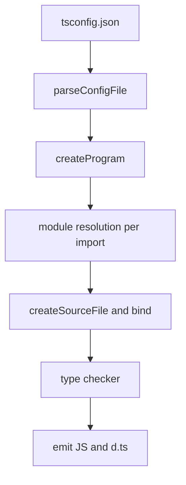
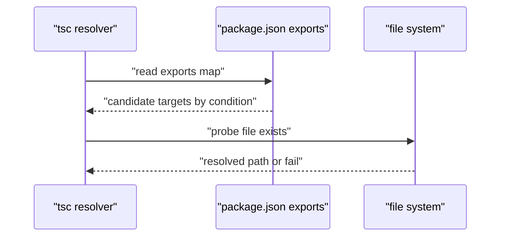

# tsconfig 与模块解析全解

!!! abstract "核心结论"

    - `tsconfig.json` 不是"打包器配置"，它是 tsc 构建 Program 的输入。真正决定"一个 import 指向哪个文件"的是 `moduleResolution` 算法，`module` 只决定 emit 形态，两者必须配对。
    - `moduleResolution` 有四个仍然活着的取值：`node10`（旧名 `node`）、`node16`、`nodenext`、`bundler`。前三个模型化 Node 运行时，`bundler` 模型化打包器（允许省略扩展名、读 `exports`、但不做运行时格式判定）。
    - `package.json` 的 `exports` 是条件映射表，按对象键的书写顺序匹配，先匹配者胜出；TypeScript 会额外注入 `types` 条件，因此 `types` 必须写在同一层对象的第一位。
    - `isolatedModules` 保证"单文件可转译"，`verbatimModuleSyntax` 保证"没有 type 修饰符的 import 原样保留"，`esModuleInterop` 通过 `__importDefault` / `__importStar` 两个 emit helper 打通 CJS 与 ESM 的默认导入语义。
    - `baseUrl` 已进入弃用轨道（计划在 6.0 移除，需核对官方 roadmap），`paths` 现在可以脱离 `baseUrl` 单独使用，映射基准是 tsconfig.json 所在目录。

## 1. 编译管线：配置在什么时候生效

### 1.1 一次编译的四个阶段

理解 tsconfig 的前提是理解 tsc 的执行顺序。`tsc` 内部大致做四件事：

1. **parseConfigFile**：读取 tsconfig，解析 `extends` 链、`files`/`include`/`exclude`，得到一份"规范化后的编译器选项 + 根文件列表"。
2. **createProgram**：以根文件为起点，对文件里每一条 `import` / `export ... from` / `require` / `import()` 调用模块解析算法，把解析结果加入 Program。这个过程是**递归且去重**的。
3. **bind + check**：为每个 SourceFile 建符号表，然后 TypeChecker 做类型检查。类型检查依赖模块解析的结果——解析错了，`any` 和"找不到模块"都会跟着来。
4. **emit**：按 `module` 决定的目标格式生成 JS，按 `declaration` 决定是否生成 `.d.ts`。



关键点：**模块解析发生在类型检查之前**。`tsc --traceResolution` 打印的就是第 2 步的完整日志。



### 1.2 配置的默认值推导

`moduleResolution` 不写时由 `module` 推导。可确认的部分：`module: commonjs` 推导为 `node10`，`module: node16` 推导为 `node16`，`module: nodenext` 推导为 `nodenext`，`module: preserve` 推导为 `bundler`；其余 `module` 值在历史上会回落到 `classic`。

不要依赖这条推导规则，**永远显式写 `module` + `moduleResolution`**。想确认本机的真实取值，运行：

```bash
npx tsc --showConfig
```

它会把 `extends` 展开、把推导出的默认值全部打印出来。

## 2. target / lib / module / moduleResolution

### 2.1 target 与 lib

- `target` 决定**降级程度**：`async/await`、可选链、类字段、`??` 等语法是否被改写。它直接影响 emit 结果。
- `lib` 决定**类型声明里能看到哪些全局对象**。它完全不影响 emit，只影响类型检查。

两个选项是解耦的：`target: es5` + `lib: ["es2022", "dom"]` 意味着"语法的降级到 ES5，但允许我调用 `Object.entries` 这类 ES2017 API"（由 polyfill 或运行环境保证）。

默认 `lib` 与 `target` 绑定，官方文档给出的规则是：未指定 `lib` 时，`target: es5` 注入 `DOM, ES5, ScriptHost`；`target: es2015` 及以上注入 `DOM, ES2015, DOM.Iterable, ScriptHost`（按 target 逐级增加）。**注意默认值包含 DOM**，这就是为什么 Node 项目里不加 `lib` 也能写出 `document.title` 而不报错——这是陷阱，不是特性。

`target` 的常见取值：`es5`、`es2015`…`es2022`、`esnext`。更新的 `target`/`lib` 值随 TypeScript 版本增加，以你的版本为准（需核对官方文档）。

### 2.2 module 决定 emit 形态

| module 取值 | emit 结果 | 常见用途 |
| --- | --- | --- |
| `commonjs` | `require` / `exports.x = ...` | 老 Node、CJS 发布物 |
| `es2015` / `es2020` / `es2022` / `esnext` | 保留 `import` / `export` | 交给打包器或 Node ESM |
| `node16` / `nodenext` | 按文件真实格式分别 emit（CJS 文件出 require，ESM 文件出 import） | Node 原生 ESM 项目 |
| `preserve` | 保留所有 `import` / `export`，`import x = require()` 也保留 | bundler 场景 |

`node16` / `nodenext` 是唯一"同一个项目里两种格式共存"的模式：解析与 emit 都以**文件级模块格式**为准，而不是全局开关。

### 2.3 moduleResolution 四代算法

- **node10**（旧名 `node`）：只读 `package.json` 的 `main` / `types`，逐级向上找 `node_modules`，自动补 `.ts/.tsx/.d.ts/.js`，把目录当包（找 `index.ts`）。不认识 `exports`。
- **node16**：完整实现 Node 的 ESM 解析规则，读 `exports` / `imports`，做文件级格式判定，**相对导入必须写扩展名**。
- **nodenext**：`node16` 的滚动版本，跟随最新 Node 解析语义。
- **bundler**：读 `exports` / `imports`，但**允许省略扩展名**、允许目录导入、不做格式判定——因为打包器会帮你做这些。它要求 `module` 处于 ESM 形态（如 `esnext` / `preserve`），否则 tsc 直接报错。

### 2.4 对比表：四种 moduleResolution

| 维度 | node10 | node16 | nodenext | bundler |
| --- | --- | --- | --- | --- |
| 读 `exports` 字段 | 否 | 是 | 是 | 是 |
| 读 `imports`（`#` 前缀） | 否 | 是 | 是 | 是 |
| 相对导入必须带扩展名 | 否 | 是 | 是 | 否 |
| 支持目录导入（`./dir` → `./dir/index.ts`） | 是 | 否（ESM） | 否（ESM） | 是 |
| 按 `package.json type` 判定文件格式 | 否 | 是 | 是 | 否 |
| 自动补 `.ts/.tsx/.d.ts` | 是 | 是 | 是 | 是 |
| 典型场景 | 遗留 CJS 项目 | Node ESM/CJS 双格式 | 新 Node 项目 | Vite / webpack / esbuild |

### 2.5 手写实现：Node CJS 解析器

下面这段复刻 Node CJS 的 `LOAD_AS_FILE` / `LOAD_AS_DIRECTORY` / `NODE_MODULES_PATHS` 简化版，用来建立"逐级向上找 node_modules"的直觉。

```js
// 运行环境: Node.js 18+（只用到 node:fs / node:os / node:path / node:assert）
// 文件: resolve-cjs.js
const fs = require('node:fs');
const path = require('node:path');

const EXTENSIONS = ['.js', '.json', '.node'];

const isFile = (p) => { try { return fs.statSync(p).isFile(); } catch { return false; } };
const isDir = (p) => { try { return fs.statSync(p).isDirectory(); } catch { return false; } };

// LOAD_AS_FILE(X): 先试精确路径，再依次补扩展名
function loadAsFile(p) {
  if (isFile(p)) return p;
  for (const ext of EXTENSIONS) {
    if (isFile(p + ext)) return p + ext;
  }
  return null;
}

// LOAD_INDEX(X): 目录下的 index.js / index.json / index.node
function loadIndex(dir) {
  for (const ext of EXTENSIONS) {
    const candidate = path.join(dir, 'index' + ext);
    if (isFile(candidate)) return candidate;
  }
  return null;
}

// LOAD_AS_DIRECTORY(X): 先看 package.json 的 main，再回落到 index
function loadAsDirectory(dir) {
  if (!isDir(dir)) return null;
  const pkgPath = path.join(dir, 'package.json');
  if (isFile(pkgPath)) {
    let main;
    try { main = JSON.parse(fs.readFileSync(pkgPath, 'utf8')).main; } catch { main = undefined; }
    if (main) {
      const target = path.resolve(dir, main);
      return loadAsFile(target) || loadIndex(target);
    }
  }
  return loadIndex(dir);
}

// NODE_MODULES_PATHS(START): 从当前目录逐级向上，收集 node_modules 目录
function nodeModulesPaths(start) {
  const dirs = [];
  let cur = path.resolve(start);
  for (;;) {
    if (path.basename(cur) !== 'node_modules') {
      dirs.push(path.join(cur, 'node_modules'));
    }
    const parent = path.dirname(cur);
    if (parent === cur) break;
    cur = parent;
  }
  return dirs;
}

function resolveCjs(request, fromDir) {
  const isRelative =
    request.startsWith('./') || request.startsWith('../') || request.startsWith('/');
  if (isRelative) {
    const abs = path.resolve(fromDir, request);
    return loadAsFile(abs) || loadAsDirectory(abs);
  }
  for (const nm of nodeModulesPaths(fromDir)) {
    const target = path.join(nm, request);
    // 注意顺序：文件优先于目录
    const hit = loadAsFile(target) || loadAsDirectory(target);
    if (hit) return hit;
  }
  return null;
}

module.exports = { resolveCjs };
```

**验证标准**

```js
// 运行环境: Node.js 18+
// 文件: resolve-cjs.test.js
const assert = require('node:assert');
const fs = require('node:fs');
const os = require('node:os');
const path = require('node:path');
const { resolveCjs } = require('./resolve-cjs.js');

function writeFile(p, content = '') {
  fs.mkdirSync(path.dirname(p), { recursive: true });
  fs.writeFileSync(p, content);
}

const root = fs.mkdtempSync(path.join(os.tmpdir(), 'cjs-resolve-'));
const app = path.join(root, 'app');
const src = path.join(app, 'src');

writeFile(path.join(src, 'local.js'), 'module.exports = 1;');
writeFile(
  path.join(app, 'node_modules', 'pkg-main', 'package.json'),
  JSON.stringify({ main: 'lib/entry.js' }),
);
writeFile(path.join(app, 'node_modules', 'pkg-main', 'lib', 'entry.js'), 'module.exports = 2;');
writeFile(path.join(app, 'node_modules', 'pkg-index', 'index.js'), 'module.exports = 3;');

assert.strictEqual(resolveCjs('./local.js', src), path.join(src, 'local.js'));
assert.strictEqual(resolveCjs('./local', src), path.join(src, 'local.js'));
assert.strictEqual(
  resolveCjs('pkg-main', src),
  path.join(app, 'node_modules', 'pkg-main', 'lib', 'entry.js'),
);
assert.strictEqual(
  resolveCjs('pkg-index', src),
  path.join(app, 'node_modules', 'pkg-index', 'index.js'),
);
assert.strictEqual(resolveCjs('no-such-pkg', src), null);

console.log('resolve-cjs: all assertions passed');
// 预期输出: resolve-cjs: all assertions passed
```

## 3. exports / imports 与条件导出

### 3.1 条件导出算法

`exports` 的规则可以压缩成三条：

1. `exports` 是一个对象时，如果所有键都以 `.` 开头，它就是**子路径映射表**；否则它本身就是 `"."` 的条件表。
2. 一个值可以是字符串、数组、或嵌套条件对象。数组表示 fallback 链；条件对象按**键的书写顺序**求值，第一个"键为 `default` 或键在当前条件集合里"的分支胜出。
3. 一旦 `exports` 存在，未在其中声明的子路径**一律不可访问**（这是封装，不是 bug）。

`imports`（`#` 前缀）用同一套条件语法，但在**最近的一个 package.json 的 `imports` 字段**里查找，只能被本包内部使用。

### 3.2 手写实现：resolveExports

```js
// 运行环境: Node.js 18+
// 文件: resolve-exports.js
// 说明: 只实现字符串 / 数组 / 条件对象三种形态，不实现 "./features/*" 通配子路径

function resolveTarget(target, conditions) {
  if (typeof target === 'string') return target;

  if (Array.isArray(target)) {
    for (const item of target) {
      const hit = resolveTarget(item, conditions);
      if (hit) return hit;
    }
    return null;
  }

  if (target && typeof target === 'object') {
    // 按书写顺序匹配；default 永远命中
    for (const key of Object.keys(target)) {
      if (key === 'default' || conditions.has(key)) {
        const hit = resolveTarget(target[key], conditions);
        if (hit) return hit;
      }
    }
    return null;
  }

  return null;
}

function resolveExports(exportsField, subpath, conditions) {
  let entry;

  if (typeof exportsField === 'string' || Array.isArray(exportsField)) {
    if (subpath !== '.') return null;
    entry = exportsField;
  } else {
    const keys = Object.keys(exportsField);
    const isSubpathMap = keys.some((k) => k.startsWith('.'));
    if (isSubpathMap) {
      entry = exportsField[subpath];
    } else {
      if (subpath !== '.') return null;
      entry = exportsField;
    }
  }

  return resolveTarget(entry, conditions);
}

module.exports = { resolveExports };
```

**验证标准**

```js
// 运行环境: Node.js 18+
// 文件: resolve-exports.test.js
const assert = require('node:assert');
const { resolveExports } = require('./resolve-exports.js');

const pkg = {
  '.': {
    types: './dist/index.d.ts',
    import: './dist/index.mjs',
    require: './dist/index.cjs',
  },
  './feature': {
    import: './dist/feature.mjs',
    require: './dist/feature.cjs',
  },
  './package.json': './package.json',
};

const tsEsm = new Set(['types', 'import', 'node']);
const nodeEsm = new Set(['import', 'node']);
const nodeCjs = new Set(['require', 'node']);

// types 写在第一位，所以 TS 解析时先命中 .d.ts
assert.strictEqual(resolveExports(pkg, '.', tsEsm), './dist/index.d.ts');
assert.strictEqual(resolveExports(pkg, '.', nodeEsm), './dist/index.mjs');
assert.strictEqual(resolveExports(pkg, '.', nodeCjs), './dist/index.cjs');
assert.strictEqual(resolveExports(pkg, './feature', nodeEsm), './dist/feature.mjs');
assert.strictEqual(resolveExports(pkg, './package.json', nodeEsm), './package.json');
assert.strictEqual(resolveExports(pkg, './nope', nodeEsm), null);

// 条件表直接挂在顶层，且带数组 fallback
const pkg2 = {
  browser: ['./browser.js', './fallback.js'],
  default: './index.js',
};
assert.strictEqual(resolveExports(pkg2, '.', new Set(['node'])), './index.js');
assert.strictEqual(resolveExports(pkg2, '.', new Set(['browser'])), './browser.js');

console.log('resolve-exports: all assertions passed');
// 预期输出: resolve-exports: all assertions passed
```

### 3.3 types 条件

TypeScript 在解析类型时会向条件集合里注入 `types`。实践中要求把 `types` 放在**同一层条件对象的第一个位置**，否则会被更早出现的 `import` / `require` / `default` 抢走，导致 TS 解析到 `.js` 文件、类型退化。

推荐的发布结构：

```jsonc
{
  "exports": {
    ".": {
      "import": { "types": "./dist/index.d.mts", "default": "./dist/index.mjs" },
      "require": { "types": "./dist/index.d.cts", "default": "./dist/index.cjs" }
    }
  }
}
```

`node16` / `nodenext` / `bundler` 三种模式下 `resolvePackageJsonExports` 与 `resolvePackageJsonImports` 默认开启；用 `customConditions` 可以追加自定义条件（如 `"customConditions": ["development"]`）。

### 3.4 入口字段对比表

| 字段 | 谁在读 | 优先级 | 备注 |
| --- | --- | --- | --- |
| `exports` | Node ESM/CJS、tsc(node16/nodenext/bundler) | 最高，存在即封闭 | 未声明的子路径不可访问 |
| `types` / `typings` | tsc（node10 路径） | 高 | 只在没有 `exports` 时作为类型入口 |
| `module` | 打包器 | 中 | Node 不认，tsc 不认 |
| `main` | Node CJS、tsc(node10) | 低 | `exports` 存在时基本被旁路 |
| `typesVersions` | tsc | 与 `types` 配合 | 按 TS 版本分发的类型重映射 |

## 4. verbatimModuleSyntax / isolatedModules / esModuleInterop

### 4.1 isolatedModules 的本质

tsc 是全程序转译器，它能看到整个 Program，所以可以安全地"猜"哪些 import 是纯类型并删掉。但 Babel、esbuild、swc 是**单文件**转译器，看不到其他文件，无法判断 `import { Foo }` 里的 `Foo` 是类型还是值。

`isolatedModules` 就是把"tsc 独有、单文件转译器做不到"的写法全部变成错误：

- 文件必须至少有一个 `import` / `export`，否则报 "All files must be modules when the '--isolatedModules' flag is provided"；
- 重导出类型必须写 `export type { T }`，否则报 "Re-exporting a type when 'isolatedModules' is enabled requires using 'export type'"。

它**不改变 emit 结果**，只做限制。任何用打包器/SWC/Babel 的项目都应该开启它。

### 4.2 node16/nodenext 的格式判定

在 `node16` / `nodenext` 下，"这个文件是 ESM 还是 CJS"不由 tsconfig 决定，而由**文件扩展名 + 最近 package.json 的 `type`** 决定。下面这段复刻判定规则。

```js
// 运行环境: Node.js 18+
// 文件: detect-format.js
function detectFormat(filePath, nearestPkgType) {
  if (/\.(mjs|mts)$/.test(filePath)) return 'esm';
  if (/\.(cjs|cts)$/.test(filePath)) return 'cjs';
  if (/\.(js|jsx|ts|tsx)$/.test(filePath)) {
    return nearestPkgType === 'module' ? 'esm' : 'cjs';
  }
  return 'cjs';
}

module.exports = { detectFormat };
```

**验证标准**

```js
// 运行环境: Node.js 18+
const assert = require('node:assert');
const { detectFormat } = require('./detect-format.js');

// .mts 永远是 ESM，.cts 永远是 CJS，与 package.json 无关
assert.strictEqual(detectFormat('/p/src/a.mts', 'commonjs'), 'esm');
assert.strictEqual(detectFormat('/p/src/a.cts', 'module'), 'cjs');

// .ts / .js 跟随最近 package.json 的 type
assert.strictEqual(detectFormat('/p/src/a.ts', 'module'), 'esm');
assert.strictEqual(detectFormat('/p/src/a.ts', undefined), 'cjs');
assert.strictEqual(detectFormat('/p/src/a.js', 'module'), 'esm');

console.log('detect-format: all assertions passed');
// 预期输出: detect-format: all assertions passed
```

这也解释了为什么 `nodenext` 下相对导入必须写扩展名：运行时 Node 不会补 `.js`，TypeScript 为了对齐运行时，也要求源码里写 `./foo.js`（它会在磁盘上找 `./foo.ts`）。

### 4.3 esModuleInterop 的 helper

`esModuleInterop` 为 `import x from 'cjs-pkg'` 与 `import * as ns from 'cjs-pkg'` 生成两个 emit helper。下面是**语义等价的简化实现**（真实 tsc 的 `__importStar` 用访问器属性保留 live binding，这里用值拷贝代替，差异已标注）。

```js
// 运行环境: Node.js 18+
// 文件: interop.js
"use strict";

// 对应 tsc 的 __importDefault
// 若模块已标记 __esModule，直接返回；否则把 module.exports 塞进 default
function __importDefault(mod) {
  return mod && mod.__esModule ? mod : { default: mod };
}

// 对应 tsc 的 __importStar（简化版：值拷贝而非 live binding）
function __importStar(mod) {
  if (mod && mod.__esModule) return mod;
  const result = {};
  if (mod != null) {
    for (const key of Object.keys(mod)) {
      if (key !== 'default') result[key] = mod[key];
    }
  }
  result.default = mod;
  return result;
}

module.exports = { __importDefault, __importStar };
```

**验证标准**

```js
// 运行环境: Node.js 18+
const assert = require('node:assert');
const { __importDefault, __importStar } = require('./interop.js');

// 纯 CJS 模块：default 指向整个 module.exports
const cjs = { a: 1, b: 2 };
const d = __importDefault(cjs);
assert.deepStrictEqual(d, { default: cjs });
assert.strictEqual(d.default.a, 1);

// 已被 tsc/Babel 处理过的模块带 __esModule 标记，原样返回
const esmLike = { __esModule: true, default: 42, x: 9 };
assert.strictEqual(__importDefault(esmLike), esmLike);

// namespace 导入：命名导出被摊平，同时保留 default
const ns = __importStar(cjs);
assert.strictEqual(ns.a, 1);
assert.strictEqual(ns.b, 2);
assert.strictEqual(ns.default, cjs);

// 已经是 ESM 形态的对象不再包装
assert.strictEqual(__importStar(esmLike), esmLike);

console.log('interop: all assertions passed');
// 预期输出: interop: all assertions passed
```

`esModuleInterop` 会隐式打开 `allowSyntheticDefaultImports`（后者只影响类型检查，不产生 helper）。在 `node16` / `nodenext` 下，互操作语义由文件的真实模块格式决定，`esModuleInterop` 的默认行为与 CJS 目标不同（细节需核对当前 TS 版本的行为）。

### 4.4 verbatimModuleSyntax

TypeScript 5.0 引入，取代了 `importsNotUsedAsValues` 与 `preserveValueImports`。规则只有一句：**任何不带 `type` 修饰符的 import/export 原样保留；任何带 `type` 修饰符的整体删除**。

```ts
// 文件: a.ts
import { Shape } from './shape';        // 没写 type，运行时 import 会保留
import type { User } from './user';     // 整体删除

export type { Shape } from './shape';   // 整体删除
export { helper } from './helper';      // 保留
```

开启后，如果你把纯类型当值导入，运行的 JS 里会留下一条指向运行时不存在模块的 `import`，报错点在运行时而不是编译时。它的价值在于**让 tsc 的 emit 与单文件转译器（esbuild/swc）的 emit 完全一致**。

## 5. paths / baseUrl

### 5.1 手写实现：paths 匹配

`paths` 的匹配规则：找出所有能匹配 request 的 pattern，取**前缀最长的那个**；匹配到的 `*` 部分回填到 target 的 `*` 位置；targets 按数组顺序作为候选，逐个探测文件是否存在。

```js
// 运行环境: Node.js 18+
// 文件: resolve-paths.js
const path = require('node:path');

// 返回 '*' 捕获到的字符串；不匹配返回 null
function matchPattern(pattern, request) {
  const star = pattern.indexOf('*');
  if (star === -1) return pattern === request ? '' : null;

  const prefix = pattern.slice(0, star);
  const suffix = pattern.slice(star + 1);
  if (request.length < prefix.length + suffix.length) return null;
  if (!request.startsWith(prefix) || !request.endsWith(suffix)) return null;
  return request.slice(prefix.length, request.length - suffix.length);
}

// baseUrl 在这里是一个目录的绝对路径
function resolvePaths(request, paths, baseUrl) {
  let best = null;

  for (const pattern of Object.keys(paths)) {
    const captured = matchPattern(pattern, request);
    if (captured === null) continue;

    const star = pattern.indexOf('*');
    const prefixLen = star === -1 ? pattern.length : star;

    if (!best || prefixLen > best.prefixLen) {
      best = { prefixLen, captured, targets: paths[pattern] };
    }
  }

  if (!best) return null;
  return best.targets.map((t) => path.join(baseUrl, t.replace('*', best.captured)));
}

module.exports = { resolvePaths };
```

**验证标准**

```js
// 运行环境: Node.js 18+
const assert = require('node:assert');
const { resolvePaths } = require('./resolve-paths.js');

const paths = {
  '@app/*': ['src/app/*'],
  '@lib/*': ['src/lib/*', 'vendor/lib/*'],
  '@app/core': ['src/core/index.ts'],
};

assert.deepStrictEqual(resolvePaths('@app/utils', paths, '/proj'), ['/proj/src/app/utils']);
// 前缀更长的 '@app/core' 优先于 '@app/*'
assert.deepStrictEqual(resolvePaths('@app/core', paths, '/proj'), ['/proj/src/core/index.ts']);
// 多个 target 按顺序全部返回，由上层逐个探测
assert.deepStrictEqual(resolvePaths('@lib/net', paths, '/proj'), [
  '/proj/src/lib/net',
  '/proj/vendor/lib/net',
]);
// 不匹配任何 pattern
assert.strictEqual(resolvePaths('react', paths, '/proj'), null);

console.log('resolve-paths: all assertions passed');
// 预期输出: resolve-paths: all assertions passed
```

### 5.2 baseUrl 的变化

从 TypeScript 4.1 起，`baseUrl` 对 `paths` **不再是必需的**。不写 `baseUrl` 时，`paths` 的映射目标相对 **tsconfig.json 所在目录**解析；写了 `baseUrl` 时相对 `baseUrl` 解析，且 `baseUrl` 本身还会让所有非相对导入都先到该目录下找一遍——这正是很多"莫名其妙解析到源码"的根因。

TypeScript 团队已宣布 `baseUrl` 会在 6.0 中移除（需核对官方 roadmap 与 release notes）。迁移方向：

```jsonc
{
  "compilerOptions": {
    // 不再写 baseUrl
    "paths": {
      "@app/*": ["./src/app/*"]
    }
  }
}
```

注意 `paths` 只对 **tsc 的类型解析** 生效，它不会改写 emit 出来的 import 路径，也不会被 Node 运行时识别。运行时需要额外手段：打包器 `resolve.alias`、`tsconfig-paths`、或 Node 自己在 package.json `imports` 里声明 `#app/*`。

## 6. project references / composite / incremental

单仓多包最痛的问题是"改了 A 包，B 包不知道"。`project references` 让 tsc 知道项目之间的依赖图，`composite` 让每个被引用项目产出可增量构建的元数据。

- `composite: true`：隐含 `declaration: true`，生成 `.tsbuildinfo` 与 `.d.ts`，并要求**所有输入文件都被 `include`/`files` 覆盖**，否则报 "File X is not listed within the file list of project"。它不能与 `noEmit` 同时使用（历史上如此；具体约束随版本变化，需核对当前版本）。
- `incremental: true`：生成 `.tsbuildinfo`，单项目增量构建；`composite` 会隐含它。
- `tsc -b`：按引用图做拓扑构建，跳过未变更的项目；`tsc -b --verbose` 能看到每个项目的 up-to-date 判定。

`references` 指向的目录里必须有 tsconfig.json：

```jsonc
{
  "files": [],
  "references": [
    { "path": "./packages/core" },
    { "path": "./packages/ui" }
  ]
}
```

`files: []` + 只有 `references` 的根配置是标准的 "solution style" 写法：根项目自身不含文件，只做编排。

较新的 TypeScript 允许被引用项目不开 `composite`；如果你的版本报 "Referenced project must have setting composite: true"，就为被引用项目补上 `composite`——该放宽与 TS 版本相关，需核对官方文档。

## 7. declaration 与 d.ts 生成

| 选项 | 作用 | 备注 |
| --- | --- | --- |
| `declaration` | 生成 `.d.ts` | 库发布必需 |
| `declarationMap` | 生成 `.d.ts.map` | 让"跳转到定义"落到 `.ts` 源码 |
| `emitDeclarationOnly` | 只出 `.d.ts`，不出 JS | 常与 `noEmit` 互斥，与 `allowImportingTsExtensions` 搭配 |
| `stripInternal` | 删除 `/** @internal */` 标记的声明 | 兜底手段，不替代显式导出控制 |
| `declarationDir` | 单独指定 `.d.ts` 输出目录 | 与 `outDir` 分离时使用 |

在 `nodenext` 下，`.d.ts` 的扩展名必须与对应 JS 一致：ESM 文件对应 `.d.mts`，CJS 文件对应 `.d.cts`，否则消费者拿到的类型会丢失。这是双格式发布最容易踩的坑。

## 8. 五套 tsconfig 模板

### 8.1 模板一：Web 应用（bundler 驱动）

```jsonc
{
  "compilerOptions": {
    "target": "es2022",
    "lib": ["es2022", "dom", "dom.iterable"],
    "module": "esnext",
    "moduleResolution": "bundler",
    // 让每个文件都被当作模块，避免全局脚本污染
    "moduleDetection": "force",
    "jsx": "react-jsx",
    "resolveJsonModule": true,
    // 允许 import './x.ts'；要求 noEmit 或 emitDeclarationOnly
    "allowImportingTsExtensions": true,
    "noEmit": true,
    "isolatedModules": true,
    "verbatimModuleSyntax": true,
    "esModuleInterop": true,
    "forceConsistentCasingInFileNames": true,
    "strict": true,
    "noUncheckedIndexedAccess": true,
    "skipLibCheck": true,
    // 空数组：禁止自动加载 node_modules/@types 下的全部类型包
    "types": []
  },
  "include": ["src"]
}
```

关键点：`moduleResolution: bundler` 才能读 `exports` 又允许省略扩展名；`noEmit` 让 tsc 只做类型检查，产物交给打包器；`types: []` 避免 `@types/*` 污染全局。

### 8.2 模板二：库（发布 npm）

```jsonc
{
  "compilerOptions": {
    "target": "es2020",
    "lib": ["es2020"],
    "module": "esnext",
    "moduleResolution": "bundler",
    "rootDir": "src",
    "outDir": "dist",
    "declaration": true,
    "declarationMap": true,
    "sourceMap": true,
    "isolatedModules": true,
    "verbatimModuleSyntax": true,
    "strict": true,
    "noUncheckedIndexedAccess": true,
    "exactOptionalPropertyTypes": true,
    "stripInternal": true,
    "skipLibCheck": true
  },
  "include": ["src"],
  "exclude": ["**/*.test.ts", "**/*.spec.ts"]
}
```

关键点：`rootDir` + `outDir` 保证目录结构稳定；`declarationMap` 让消费者能跳到源码。**风险**：用 `bundler` 解析写源码时，若 emit 出的 `.d.ts` 里有省略扩展名的相对导入，`node16` 消费者将无法解析——发布前用 `--traceResolution` 在消费者视角验证一次。

### 8.3 模板三：Node 服务（ESM）

```jsonc
{
  "compilerOptions": {
    "target": "es2022",
    "lib": ["es2022"],
    "module": "nodenext",
    "moduleResolution": "nodenext",
    "types": ["node"],
    "rootDir": "src",
    "outDir": "dist",
    "sourceMap": true,
    "declaration": false,
    "isolatedModules": true,
    "verbatimModuleSyntax": true,
    "strict": true,
    "noUncheckedIndexedAccess": true,
    "skipLibCheck": true
  },
  "include": ["src"]
}
```

配套 `package.json` 需要 `"type": "module"`，并且源码里相对导入必须写 `./foo.js`（指向 `foo.ts`）。`types: ["node"]` 需要 `@types/node` 已安装。

### 8.4 模板四：monorepo

`tsconfig.base.json`：

```jsonc
{
  "compilerOptions": {
    "target": "es2022",
    "lib": ["es2022"],
    "module": "nodenext",
    "moduleResolution": "nodenext",
    "strict": true,
    "declaration": true,
    "declarationMap": true,
    "sourceMap": true,
    // composite 隐含 declaration，并要求所有源文件被 include 覆盖
    "composite": true,
    "incremental": true,
    "isolatedModules": true,
    "verbatimModuleSyntax": true,
    "skipLibCheck": true
  }
}
```

根 `tsconfig.json`：

```jsonc
{
  "files": [],
  "references": [
    { "path": "./packages/core" },
    { "path": "./packages/ui" },
    { "path": "./apps/web" }
  ]
}
```

`packages/ui/tsconfig.json`：

```jsonc
{
  "extends": "../../tsconfig.base.json",
  "compilerOptions": {
    "rootDir": "src",
    "outDir": "dist",
    "tsBuildInfoFile": "dist/.tsbuildinfo"
  },
  "include": ["src"],
  "references": [{ "path": "../core" }]
}
```

构建命令统一用 `tsc -b`。包之间的引用建议走 `exports`（真实包名），而不是 `paths` 直连源码——`paths` 直连会让"源码"和"构建产物"两套类型系统混用，出现 `dist` 与 `src` 的重复符号。

### 8.5 模板五：Vite + React

`tsconfig.json`（solution style，只做编排）：

```jsonc
{
  "files": [],
  "references": [
    { "path": "./tsconfig.app.json" },
    { "path": "./tsconfig.node.json" }
  ]
}
```

`tsconfig.app.json`：

```jsonc
{
  "compilerOptions": {
    "target": "es2022",
    "lib": ["es2022", "dom", "dom.iterable"],
    "module": "esnext",
    "moduleResolution": "bundler",
    "moduleDetection": "force",
    "jsx": "react-jsx",
    // vite/client 提供 import.meta.env、静态资源模块声明
    "types": ["vite/client"],
    "allowImportingTsExtensions": true,
    "noEmit": true,
    "isolatedModules": true,
    "verbatimModuleSyntax": true,
    "strict": true,
    "noUncheckedIndexedAccess": true,
    "noUnusedLocals": true,
    "noUnusedParameters": true,
    "skipLibCheck": true
  },
  "include": ["src"]
}
```

`tsconfig.node.json`：

```jsonc
{
  "compilerOptions": {
    "target": "es2022",
    "lib": ["es2022"],
    "module": "esnext",
    "moduleResolution": "bundler",
    "types": ["node"],
    "noEmit": true,
    "isolatedModules": true,
    "strict": true,
    "skipLibCheck": true
  },
  "include": ["vite.config.ts"]
}
```

拆成两个项目的意义：`vite.config.ts` 运行在 Node 里（需要 `@types/node`），`src` 运行在浏览器里（需要 `vite/client` 与 DOM lib）。混在一个 tsconfig 里会让 `src` 也能看到 Node 全局对象。注意 `references` 对被引用项目是否要求 `composite` 与 TS 版本相关，报错时按提示补上。

### 8.6 模板对比表

| 模板 | module | moduleResolution | declaration | emit | 核心约束 |
| --- | --- | --- | --- | --- | --- |
| Web 应用 | `esnext` | `bundler` | 否 | `noEmit` | 打包器负责产物 |
| 库 | `esnext` | `bundler` | 是 | 输出 `dist` | d.ts 必须能被 node16 消费者解析 |
| Node 服务 | `nodenext` | `nodenext` | 否 | 输出 `dist` | 相对导入必须带 `.js` |
| monorepo | `nodenext` | `nodenext` | 是 | `tsc -b` | 引用项目需 `composite` |
| Vite + React | `esnext` | `bundler` | 否 | `noEmit` | app 与 node 配置分离 |

## 9. 验证方法

排查模块解析问题，四个命令按顺序用：

```bash
# 1. 看最终生效的配置（extends 展开 + 默认值填充）
npx tsc --showConfig

# 2. 看 Program 里到底有哪些文件
npx tsc --listFiles

# 3. 看每个文件"为什么"被加进来
npx tsc --explainFiles

# 4. 看某个 import 的完整解析过程（逐目录、逐条件试探）
npx tsc --traceResolution
```

`--traceResolution` 的输出结构大致是：`======== Resolving module 'x' from '/path/a.ts'. ========` 开头，随后是一串 `Module resolution kind is not specified, using 'NodeNext'.`、`Found 'exports' field in '/path/node_modules/x/package.json'.`、`Condition 'types' matched.`、`File '/path/node_modules/x/dist/index.d.ts' exists - use it as a result.`。读日志时重点抓三件事：**用的是哪套 algorithm**、**命中了哪个条件**、**最后探测的文件路径**。

`--explainFiles` 适合回答"这个 `.d.ts` 是谁带进来的"这类问题，它会打印类似 `Library 'lib.dom.d.ts' specified via 'lib' compiler option` 或 `Imported via 'import' from file '/path/a.ts'` 的理由行。

`tsc -b` 场景再加：

```bash
npx tsc -b --verbose
```

它会打印每个项目是 up-to-date 还是 rebuild，以及判定原因。

## 10. 常见陷阱

1. **`module` 与 `moduleResolution` 不配对**。`module: esnext` 配 `moduleResolution: node10` 时 `exports` 字段完全不生效，会退化成读 `main`，症状是"类型和运行时指向不同文件"。显式声明 `moduleResolution`。
2. **忘记 `baseUrl` 会改变非相对导入的含义**。写了 `baseUrl` 后，所有非相对导入会先在 `baseUrl` 下探测，容易误命中源码目录。
3. **以为 `paths` 会被 emit 出来**。`paths` 只影响类型解析，产物里的 import 路径原样保留。运行时必须在打包器 alias / `tsconfig-paths` / Node `imports` 里再做一次映射。
4. **`exports` 的 `types` 写在后面**。被 `import` / `default` 抢先命中后，消费者拿到 `any`。
5. **`isolatedModules` 下重导出类型没加 `type`**。报错信息很明确：需要 `export type`。
6. **`verbatimModuleSyntax` 下漏写 `import type`**。编译通过、运行时报 "Cannot find module"。
7. **`nodenext` 下 `.d.ts` 扩展名不对**。ESM 文件必须配 `.d.mts`，CJS 文件必须配 `.d.cts`，否则类型丢失。
8. **默认 `lib` 含 DOM**。Node 项目不显式设置 `lib: ["es2022"]` 时，`document` / `window` 是可见的，写完才发现线上崩。
9. **`composite` 与 `noEmit` 冲突**。项目引用要求被引用项目可 emit，用 `noEmit` 会报错。
10. **`skipLibCheck: true` 掩盖依赖的类型错误**。它跳过 `.d.ts` 检查，加快构建，但也可能让你在下游才发现依赖类型不兼容。
11. **`node16` / `nodenext` 下相对导入漏写扩展名**。源码写 `./foo.js`，磁盘上是 `foo.ts`，TypeScript 会自动对应，但绝不接受 `./foo`。
12. **monorepo 里用 `paths` 直连别人源码**。同一份类型可能同时以 `src` 和 `dist` 两条路径进入 Program，出现重复标识符或私有字段不兼容。

## 11. 面试题与答题要点

**1. `module` 和 `moduleResolution` 分别解决什么问题？**

要点：`module` 决定 **emit 形态**（出 `require` 还是 `import`）；`moduleResolution` 决定 **一个 import 字符串解析到哪个文件**。两者都必须显式写。`module: nodenext` 时二者在文件级别联动，因为同一个项目里 CJS 与 ESM 文件的解析规则不同。不配对会静默退化，`exports` / `imports` 不生效。

**2. 为什么 `node16` / `nodenext` 要求相对导入写扩展名？**

要点：因为 Node ESM 运行时不做扩展名补全，也不支持目录导入。TypeScript 的目标是"类型解析结果与运行时解析结果一致"，所以强制源码里写 `./foo.js`，并在磁盘上把它映射回 `./foo.ts`。`bundler` 之所以允许省略，是因为打包器自己会补全。

**3. `exports` 字段的解析规则是什么？`types` 为什么要放第一位？**

要点：条件对象按键的书写顺序求值，第一个命中的分支胜出，`default` 永远命中；`exports` 存在即封闭，未声明的子路径不可访问。TypeScript 额外注入 `types` 条件，如果 `types` 不在同层第一位，就会被更早的 `import` / `require` 命中，返回 `.js` 路径，消费者拿不到类型。

**4. `esModuleInterop` 到底做了什么？**

要点：它让 `import x from 'cjs'` 在类型与运行时都成立。类型层面它打开 `allowSyntheticDefaultImports`；emit 层面生成 `__importDefault`（用 `__esModule` 标记判断是否包装 `default`）和 `__importStar`（摊平命名导出并补 `default`）。真实 `__importStar` 用访问器属性保留 live binding，简化版用值拷贝会丢这一点。

**5. `verbatimModuleSyntax` 和 `isolatedModules` 的区别与联系？**

要点：`isolatedModules` 是**限制**——禁止需要跨文件信息才能转译的写法（重导出类型必须 `export type`、文件必须是模块），让 Babel/SWC 这类单文件转译器能安全工作。`verbatimModuleSyntax` 是**emit 策略**——不带 `type` 修饰符的 import 原样保留，带的全删，使 tsc 的输出与 esbuild/SWC 完全一致。两者一起用能获得最可预测的 emit。

**6. `project references` + `composite` 解决什么问题？**

要点：解决多包仓库的构建顺序与增量问题。`references` 声明项目依赖图，`tsc -b` 按拓扑顺序构建并跳过未变更项目；`composite` 隐含 `declaration`，产出 `.tsbuildinfo` 与 `.d.ts`，并要求所有源文件被 `include` 覆盖。相比在每个包里跑 `tsc`，它避免了重复编译和类型不一致。

**7. `paths` 和 Node 的 `imports`（`#` 前缀）有什么区别？**

要点：`paths` 是 **TypeScript 独有**的解析映射，只影响类型检查，不会改写 emit，运行时完全不知道。`imports` 是 **Node 规范**的一部分，写在 package.json 里，运行时原生支持，但只在包内部可用。要做"别名同时可用于类型和运行时"，两者需要同时配置（或用打包器 alias）。

**8. 线上报 "Cannot find module" 但本地 tsc 通过，怎么排查？**

要点：按顺序排除——(1) 用 `tsc --traceResolution` 确认 tsc 解析到的路径是否真的存在；(2) 检查 `paths` 是否只有 tsc 知道，运行时缺 alias；(3) `verbatimModuleSyntax` 下是否漏写 `import type`，导致运行时去加载纯类型模块；(4) `nodenext` 下是否漏写扩展名；(5) `exports` 是否只声明了 `import` 没声明 `require`（或反之）；(6) 打包器 `external` / `resolve.conditions` 是否与 tsconfig 的 `customConditions` 一致。

**9. `baseUrl` 为什么被弃用？迁移路径是什么？**

要点：`baseUrl` 有两个副作用——既是 `paths` 的基准目录，又让所有非相对导入先去它下面探测，行为不直观且容易误命中。TypeScript 4.1 起 `paths` 可以独立使用（基准为 tsconfig 所在目录），团队已宣布 6.0 移除 `baseUrl`（需核对官方 roadmap）。迁移方式是删掉 `baseUrl`，把 `paths` 的目标写成以 `./` 开头的相对 tsconfig 的路径。

**10. `target` 和 `lib` 可以不一致吗？什么时候需要不一致？**

要点：可以，二者解耦。`target` 控制语法降级，`lib` 控制可见的全局类型。典型场景是 `target: es5` + `lib: ["es2022", "dom"]`：语法降级保证老浏览器能跑，类型层面允许使用由 polyfill 提供的 `Promise.allSettled` 等 API。反过来的场景是 Node 项目必须显式写 `lib: ["es2022"]`，否则默认注入的 DOM 类型会掩盖真实运行环境的缺失。

## 深入阅读与参考

!!! tip "怎么用这些资料"
    先读「官方文档与规范」建立准确的概念，再读「源码与示例」核对细节，最后用「教程、书籍与视频」换一种讲法加深理解。每条都写明了读哪一节、带着什么问题读。

### 官方文档与规范

| 资源 | 为什么读 | 怎么读 |
|---|---|---|
| [TypeScript 官方手册](https://www.typescriptlang.org/docs/) | 手册是配置语义的最终依据，术语与默认值都以此为准。 | 读 tsconfig 与模块两章，边读边对照自己项目，读完改一版配置。 |
| [TypeScript 模块解析](https://www.typescriptlang.org/docs/handbook/modules/introduction.html) | 从解析算法层面解释 moduleResolution 取值差异，讲透 import 查找路径。 | 对照 bundler/node16/nodenext 三节，看自己项目该用哪个，改后重跑类型检查。 |
| [tsconfig 参考](https://www.typescriptlang.org/tsconfig/) | 按主题列出全部编译选项，查 target/lib/module 组合的权威来源。 | 先读 strict 相关与 module 系；把 strict 展开逐项开启，边修报错边理解。 |
| [tsconfig.json 说明](https://www.typescriptlang.org/docs/handbook/tsconfig-json.html) | 讲 tsconfig 文件本身：继承、include/exclude、references 的组织方式。 | 读 extends 与 references 两节，再为一个新项目手写最小 tsconfig 验证。 |
| [package.json 字段说明](https://docs.npmjs.com/cli/v10/configuring-npm/package-json) | exports、types、main 的官方定义，是条件导出与类型入口的基础。 | 重点读 exports 与 types；对照自己库的 package.json，列出可疑字段。 |
| [Node.js 包规范](https://nodejs.org/api/packages.html) | Node 侧对条件导出与包入口的规范定义，解释运行时如何选择入口。 | 读 exports 与条件导出小节，写出一个同时支持 ESM/CJS 的最小包。 |

### 源码与示例

| 资源 | 为什么读 | 怎么读 |
|---|---|---|
| [MDN JavaScript 模块](https://developer.mozilla.org/en-US/docs/Web/JavaScript/Guide/Modules) | 浏览器模块行为的一手示例，可对照 Node 解析差异建立直觉。 | 在页面里写一个 type=module 的 import 示例，观察与 CommonJS 的加载差异。 |
| [publint](https://publint.dev/) | 用真实包逐条报出 exports/types 配置错误，是验证环节的利器。 | 安装后对自己的包运行一次，按报错逐条修 package.json 再复跑。 |

### 教程、书籍与视频

| 资源 | 为什么读 | 怎么读 |
|---|---|---|
| [声明文件入门](https://www.typescriptlang.org/docs/handbook/declaration-files/introduction.html) | 以最小示例带你写出第一个 d.ts，理解声明与实现如何分离。 | 照着为一个无类型 npm 包写最小 d.ts，在项目里 import 并确认提示生效。 |
| [发布 npm 包](https://nodejs.org/en/learn/modules/publishing-a-package) | npm 官方发布流程，把配置改动落到真实包上验证。 | 发布一个测试包，分别用 require 与 import 引用，检查 exports 条件是否命中。 |

## 应用与行业实践

### 应用场景地图

| 场景 | 用到本页哪个知识点 | 典型技术选型 | 注意事项 |
| --- | --- | --- | --- |
| 后台管理的万行表格 | `moduleResolution: bundler`、`paths`、`isolatedModules` | Vite + React + 虚拟滚动表格 | `paths` 只影响类型检查，打包器别名要另配一组同值 |
| 低端安卓的首屏加载 H5 营销页 | `module` 只决定 emit 形态、`target` 与 `lib` | esbuild 单文件转译 + Rollup | 转译目标与机型清单要一起冻结，别只改 `target` |
| 多人协作白板的前端 SDK | `exports` 条件顺序、`types` 条件注入 | tsc 产 d.ts + 打包器产 js | `types` 必须写在同层第一位 |
| 组件库发布到 npm 双格式入口 | `exports` / `imports`、`declaration`、`node16` | tsc + 打包器分工 | 发包前用工具校验是否"伪装 ESM" |
| monorepo 内 20 个包的 CI 构建 | project references、`composite`、`incremental` | `tsc -b` + pnpm workspace | 漏写 `composite` 会报 TS6306 |
| NestJS 后端切 ESM | `node16` / `nodenext`、`esModuleInterop` | Node 20 + tsc | 相对导入要写 `.js` 扩展名，源文件仍是 `.ts` |
| Vitest 转译链路 | `verbatimModuleSyntax`、`isolatedModules` | SWC 单文件转译 | 跨文件类型再导出要在单文件内可判定 |
| SSR 框架的双端编译 | `module` 与 `moduleResolution` 配对、`lib` | Next.js / Nuxt | 服务端与客户端别共用同一份 tsconfig |

### 三个场景拆解

#### 场景 1：多人协作白板的 SDK 要同时被打包器和 Node 服务端加载

**业务背景**：SDK 以 npm 包发布，浏览器侧走打包器，Node 侧的服务端脚本直接 `import`。同一份源码要产出两种入口，用错入口会在运行时抛 `ERR_MODULE_NOT_FOUND`，或者类型指到 js 文件上。

**怎么用本页知识解决**：思路是先定双入口，再让 `exports` 的条件映射把 `types` 放在同层第一位，最后把 `module` 与 `moduleResolution` 同时设成 `node16`，让 tsc 按 Node 的规则检查扩展名。

```json
{
  "name": "whiteboard-sdk",
  "type": "module",
  "exports": {
    ".": {
      "types": "./dist/index.d.ts",   // 必须写在同层第一位，按书写顺序先匹配者胜出
      "import": "./dist/index.js",    // 打包器与 Node ESM 走这条
      "require": "./dist/index.cjs"   // 老 CJS 调用方走这条
    },
    "./crdt": {
      "types": "./dist/crdt.d.ts",    // 同一个包内也要逐条给 types
      "import": "./dist/crdt.js"
    }
  },
  "files": ["dist"]
}
```

- TypeScript 会额外注入 `types` 条件，顺序反了就会落到 js 文件上，导入方拿到的类型退化成 any。
- `module` 与 `moduleResolution` 都设 `node16` 才配对：一个决定 emit 形态，一个决定解析算法。
- `node16` 下相对导入要写扩展名，写 `./crdt.js`，源文件名仍是 `crdt.ts`。
- `import` 与 `require` 各指一个文件，`type: "module"` 决定 `.js` 被当成 ESM 还是 CJS。
- 发布前跑一次解析校验工具，确认不存在"伪装 ESM"的条目。

**怎么度量收益**：指标是发包后的解析错误数和新项目首次接入的报错数。测量方法：CI 里跑 `npx @arethetypeswrong/cli --pack .` 统计报错条目；再用 `tsc --traceResolution` 搜包名，确认解析结果落在 `dist/index.d.ts`。

**什么时候不该用**：
- 只给单一打包器消费、不打算让 Node 直接 `import` 的内部包：条件映射多一层维护面，收益为零。
- 消费方仍以 CJS 为主且不打算升级 Node：直接在 `main` 与 `types` 上各写一个字段，别引入条件表。

#### 场景 2：后台管理的万行表格应用

**业务背景**：单个路由页渲染上万行、几十列，开发机上保存一次要等 tsc 检查完整个 workspace。痛点不在打包体积，而在类型检查反馈速度和单文件转译链路的一致性。

**怎么用本页知识解决**：思路是把 `moduleResolution` 切到 `bundler`，让 tsc 允许省略扩展名并读 `exports`；再用 `verbatimModuleSyntax` 强制类型导入写 `import type`，让 SWC 能逐文件转译。

```json
{
  "compilerOptions": {
    "module": "esnext",
    "moduleResolution": "bundler",   // 允许省略扩展名，读 exports，不做运行时格式判定
    "verbatimModuleSyntax": true,    // 没有 type 修饰符的 import 原样保留到产物
    "isolatedModules": true,         // 保证每个文件能被 SWC 单独转译
    "noEmit": true,                  // tsc 只出类型错误，产物交给 Vite
    "paths": { "@/*": ["./src/*"] }  // 基准是 tsconfig.json 所在目录，不依赖 baseUrl
  },
  "include": ["src"]
}
```

- `bundler` 允许 `import './Table'` 不带扩展名，这是它与 `node16` 的主要差别。
- `bundler` 不做运行时格式判定，`type: "module"` 的解释权交给 Vite 与 Node。
- `verbatimModuleSyntax` 打开后，`import { Column }` 中 `Column` 若是纯类型就会报错，必须写 `import type`。
- Vite 的 `resolve.alias` 要与 `paths` 写同一组值，tsc 不会改写 import 路径。
- `noEmit` 让 `tsc --noEmit` 只做检查，避免 dist 里出现半成品 js。

**怎么度量收益**：指标是 `Check time`、`Files`、`Types` 三个字段和编辑器单文件报错数。测量方法：改配置前后各跑三次 `tsc --noEmit --extendedDiagnostics` 取中位数；再用 `tsc --generateTrace trace` 配合 Perfetto 看检查阶段占比。

**什么时候不该用**：
- 这个包要发布到 npm 并被 Node 直接加载：`bundler` 不检查扩展名，产物在 Node 下会解析失败。
- 团队要求同一份 tsconfig 同时描述运行时与类型检查：改用 `node16` 或 `nodenext`，把判定权交给运行时。

#### 场景 3：monorepo 内多个包的 CI 增量构建

**业务背景**：一个仓库里有应用包、UI 包、工具包，CI 每次全量跑 tsc，改一个工具函数也让整棵树重编。规模量级用 `tsc --listFilesOnly | wc -l` 数出被纳入 Program 的文件数即可。

**怎么用本页知识解决**：思路是用 project references 把包切成依赖图，每个包开 `composite`，CI 只跑 `tsc -b`。增量信息落在 `.tsbuildinfo`，声明文件由各包自己产出。

```jsonc
// packages/ui/tsconfig.json
{
  "compilerOptions": {
    "composite": true,     // 允许被其它项目引用，并强制产出 .d.ts
    "declaration": true,   // 引用方从 d.ts 读类型，不能只出 js
    "incremental": true,   // 记录 .tsbuildinfo，二次构建跳过未变项目
    "rootDir": "src",
    "outDir": "dist"
  }
}
// 仓库根 tsconfig.json 只做编排，不编译源码：
// { "files": [], "references": [{ "path": "packages/utils" }, { "path": "apps/web" }] }
```

- `composite: true` 是前提，缺了会在引用时报 TS6306。
- 引用方读到的是上游 `dist/*.d.ts`，上游没构建过就会报找不到声明。
- `incremental` 与 `composite` 同时开启时，`.tsbuildinfo` 决定跳过范围。
- CI 跑 `tsc -b --verbose`，输出里 `up to date` 的包就是被跳过的。
- 先用 `tsc -b --dry` 看这次会构建哪些项目，再决定缓存键怎么写。

**怎么度量收益**：指标是 `tsc -b` 的墙钟时间和跳过项目数。测量方法：用 `tsc -b --verbose` 数 `up to date` 行数；用 `tsc --extendedDiagnostics` 看单包 `Check time`；改动只落在叶子包时对比前后时间。

**什么时候不该用**：
- 仓库只有一个包：加 `references` 只多一层构建顺序，收益为负。
- 包之间靠打包产物互相引用、类型不跨包流动：引用链会指不到 d.ts，报错集中在找不到声明。

### 行业先进实践

**`types` 条件写在 `exports` 同层第一位（出处：TypeScript 官方文档 Modules Reference）**
TypeScript 解析包时会向条件表注入 `types` 条件，并按键的书写顺序匹配。写在第一位，`import` 与 `require` 两条路径都能先拿到声明文件。借鉴方式：把它写成发包检查清单的第一条。

**发包前跑 `@arethetypeswrong/cli`（出处：开源项目 @arethetypeswrong/cli）**
该工具读打包后的 `exports` 与 `types`，报告"伪装成 ESM 的 CJS"这类问题。它把运行时解析与类型解析的差异摊开，不靠人工通读 package.json。借鉴方式：CI 加一步 `attw --pack .`，用退出码当门禁。

**用 `publint` 校验包入口一致性（出处：开源项目 publint）**
publint 检查 `main`、`module`、`exports`、`types` 指向的文件是否存在，格式是否与 `type` 字段一致。它在本地就能跑，不需要真实发布会话。借鉴方式：在 `prepublishOnly` 脚本里加一条。

**用 `@tsconfig/bases` 固化成对选项（出处：开源项目 tsconfig/bases）**
该仓库按运行环境发布 `@tsconfig/node20`、`@tsconfig/strictest` 等配置，通过 `extends` 引入。它把 `module`、`moduleResolution`、`target` 这些必须成对的选项预先配好。借鉴方式：先继承基线，再在本地只覆盖 `paths` 这类项目私有字段。

**用 project references 切分大型仓库（出处：TypeScript 官方文档 Project References）**
官方文档给出 `composite`、`references`、`tsc -b` 三件套。做法是把一次全量检查拆成按项目图的增量构建，每个包自己产 d.ts。借鉴方式：先给被依赖最多的底层包加 `composite`，再逐包补齐引用。

### 从学到用：落地路线

第 1 步：先在一个只被内部消费、不发布到 npm 的应用包里试点配置。
验收标准：该包 `tsc --noEmit` 零错误，`tsc --showConfig` 输出里 `module` 与 `moduleResolution` 成对出现。

第 2 步：把配置写成对照实验，同一份源码分别用 `node16` 与 `bundler` 跑 `tsc --traceResolution`，记录差异行。
验收标准：每一处差异都能对应到本页的一条规则，例如是否允许省略扩展名。

第 3 步：推广到整个 workspace，用 project references 建立依赖图，CI 改跑 `tsc -b`。
验收标准：`tsc -b --verbose` 输出里能数出 `up to date` 的项目，改动叶子包时上游被跳过。

第 4 步：把约束固化成门禁，防止有人把配对选项改回去。
验收标准：CI 增加 `tsc -b --dry`、`tsc --noEmit`、`attw --pack .` 三步，任意一步失败即阻断合并。

### 动手作业

**目标**：在一个包含两个包的小仓库里，让"打包器消费"和"Node 直接 import"两条路径都能拿到正确类型。

**步骤**：
1. 新建 pnpm workspace，包含 `packages/lib` 与 `apps/node-consumer`。
2. 给 `packages/lib` 写 `package.json`，设置 `type` 与 `exports`，把 `types` 写在同层第一位。
3. 给该包配置 `module: "node16"`、`moduleResolution: "node16"`、`declaration: true`，相对导入一律写 `.js` 扩展名。
4. 给 `apps/node-consumer` 配置 `moduleResolution: "nodenext"`，用包名 `import` 上游。
5. 在 lib 里加一个只作类型使用的导出，靠 `verbatimModuleSyntax` 逼自己写 `import type`。
6. 在仓库根跑 `tsc -b`，再跑 `npx @arethetypeswrong/cli --pack packages/lib`。
7. 把 lib 的 `moduleResolution` 改成 `bundler` 重跑，记录报错差异。

**验收标准**：
- 仓库根 `tsc -b` 零错误，第二次运行只打印 `up to date`。
- `tsc --traceResolution` 日志中 lib 的解析结果落在 `dist/index.d.ts`。
- `attw --pack packages/lib` 不报"伪装 ESM"类别的问题。
- 删掉源码里的一处 `import type` 后，`tsc` 的报错能指到该行。
- 把 `moduleResolution` 改成 `bundler` 后，扩展名缺失的报错消失，说明两套算法的差异可复现。

