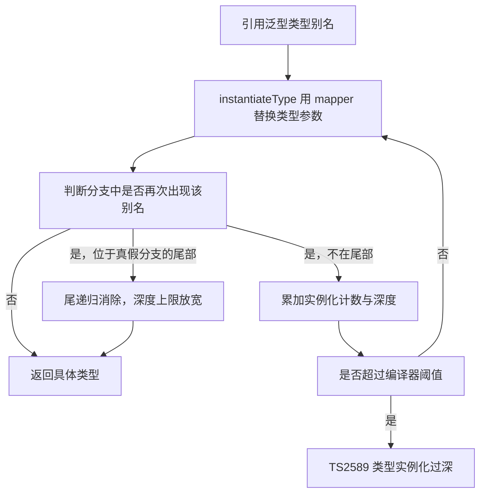

# 类型体操实战：从 type-challenges 到工程

!!! abstract "核心结论"
    - 类型体操的本质是在编译器的惰性求值图上做符号演算：类型别名声明时不求值，只有被引用、需要 resolveType 时才展开，因此递归必须有结构性递减，否则触发 TS2589。
    - 条件类型 `T extends U ? X : Y` 对裸类型参数（naked type parameter）会把 union 分配到每个成员；用 `[T] extends [U]` 可关闭分配，但要注意 `never` 会被分配成 `never`。
    - `infer` 不是"提取变量"，而是在 extends 右侧声明一个待填充的类型变量，由 checker 的匹配过程填充；同一 infer 多次出现时按出现位置的变异性合并（协变取 union，逆变取 intersection）。
    - 类型永不产生运行时输出：类型测试的正确做法是"类型层用 tsc 断言、运行时层用 node:assert 断言"，并用元测试证明断言本身会失败。
    - 工程红线三条：递归深度可控、公开类型的错误信息可读、类型开销纳入构建预算（用 extendedDiagnostics 量化）。

## 1. 底层原理：类型检查器到底在算什么

### 1.1 编译流水线与惰性求值

TypeScript 的编译器前端依次是 scanner（词法）、parser（语法）、binder（建立符号与作用域）、checker（类型检查）、emitter（生成 JS）。**类型体操全部发生在 checker 内部**，与 emitter 无关，这就是"类型零运行时开销"的根据。

checker 内部把类型表示为一棵 **Type 对象图**（每个 Type 带 `TypeFlags`、`id`、可选的 `symbol`、`aliasSymbol`），实例化泛型靠 `instantiateType` + **typeMapper**（把类型参数替换为实际类型）。关键性质：

- 类型别名是 **惰性** 的：`type A = B` 在声明时不解析 B，直到某处真的需要它的结构。
- 条件类型在无法判定时会生成一个 **deferred conditional type**（延迟的条件类型），不立即求值；这正是 `Equal` 技巧能成立的前提。
- 赋值关系 `isTypeAssignableTo` 带 **关系缓存**，而同一性 `isTypeIdenticalTo` 走 `identityRelation`，两者的判定强度不同。

### 1.2 分配律（distributive conditional types）

当 `extends` 左侧是裸类型参数（即 `T extends ...` 而不是 `[T] extends ...`），且 `T` 传入的是 union 时，条件类型会分布到每个成员，再把结果 union 起来。这是类型体操的第一性原理，也是 `never` 陷阱的来源。

```ts
// distributions.ts
// 运行环境：Node 18+ / TypeScript 5.x / @types/node
// 类型验证：npx tsc -p tsconfig.json --noEmit          预期：无输出，退出码 0
// 运行时：  npx tsc -p tsconfig.json && node dist/distributions.js   预期：distributions ok

import assert from 'node:assert/strict';

type Expect<T extends true> = T;
type Equal<X, Y> = (<T>() => T extends X ? 1 : 2) extends (<T>() => T extends Y ? 1 : 2) ? true : false;

// 分配式：T 为裸类型参数，union 被拆开逐个求值
type Distribute<T> = T extends string ? 'str' : 'other';
type A1 = Distribute<string | number>; // 'str' | 'other'

// 非分配式：用 [T] 包一层，union 整体参与判定
type NoDistribute<T> = [T] extends [string] ? 'str' : 'other';
type A2 = NoDistribute<string | number>; // 'other'

// never 是空 union：分配后没有任何成员，结果仍是 never（而不是 false 分支）
type DistNever<T> = T extends string ? true : false;
type A3 = DistNever<never>; // never
type IsNever<T> = [T] extends [never] ? true : false;
type A4 = IsNever<never>; // true

type Cases1 = [
  Expect<Equal<A1, 'str' | 'other'>>,
  Expect<Equal<A2, 'other'>>,
  Expect<Equal<A3, never>>,
  Expect<Equal<A4, true>>,
];

// 值层没有"分配律"，但可以用 flatMap 类比：对每个成员执行再合并
const groups: number[][] = [[1, 2], [3]];
assert.deepStrictEqual(groups.flatMap((xs) => xs), [1, 2, 3]); // 预期：通过
console.log('distributions ok');
```

### 1.3 infer 的匹配语义

`infer` 出现在条件的 extends 右侧时，checker 会为该位置创建一个推断类型变量（inference candidate），匹配成功后用"候选集合"填充：

- 同一 `infer U` 在 **协变位置**（属性类型、函数返回值）出现多次：合并为 **union**。
- 同一 `infer U` 在 **逆变位置**（函数参数类型）出现多次：合并为 **intersection**（这与函数参数的双变/逆变检查一致）。
- `infer` 从模板字面量类型中匹配时，第一个占位符按 **最短** 匹配（除非后面紧跟字面量分隔符），这是逐字符解析字符串类型的基础。

```ts
// infer-variance.ts（同为 --noEmit 类型验证）
type Covariant<T> = T extends { a: infer U; b: infer U } ? U : never;
type X1 = Covariant<{ a: string; b: number }>; // string | number

type Contravariant<T> = T extends { a: (x: infer U) => void; b: (x: infer U) => void } ? U : never;
type X2 = Contravariant<{ a: (x: string) => void; b: (x: number) => void }>; // string & number = never

type FirstChar<S extends string> = S extends `${infer C}${infer R}` ? [C, R] : never;
type X3 = FirstChar<'abc'>; // ['a', 'bc']
```

### 1.4 递归上限与尾递归消除



事实级别说明（数值以实现为准，需核对官方文档/源码 `checker.ts`）：

- 直接自我循环引用的类型别名会报 **TS2456**（Type alias circularly references itself）。
- 递归实例化超过阈值会报 **TS2589**（Type instantiation is excessively deep and possibly infinite）。
- 编译器对 **尾部位置** 的递归条件类型做尾递归消除，使可递归深度从几十量级提升到约千层量级；不在尾部（如 `[H, ...Flatten<R>]` 这种还要构造新结构的分支）则仍受较小上限约束。因此写递归类型时优先使用"累加器 + 尾递归"形态。

## 2. 类型测试：手写 Equal 与 Expect

### 2.1 为什么 `A extends B ? true : false` 不算相等断言

`extends` 表达的是 **可赋值性**，它有三个致命弱点：`any` 与任何类型互相可赋值；字面量类型与它的宽化类型单向兼容；`never` 可赋值给一切。所以 `1 extends number` 为真、`number extends 1` 为假，二者都"对"，但都不是"相等"。

### 2.2 Equal 的原理

```ts
type Equal<X, Y> =
  (<T>() => T extends X ? 1 : 2) extends (<T>() => T extends Y ? 1 : 2) ? true : false;
```

推理链条：两个泛型函数类型比较时，类型参数列表完全相同（都是 `<T>()`），于是比较退化为返回类型的关系判定；而返回类型是 **延迟求值的 conditional type**（无法实例化具体 T），checker 对延迟条件类型的可比性判定要求 `checkType`、`extendsType`、真/假分支 **结构同一**，最终等价于"X 与 Y 是否同一类型"。这也是它能区分 `any`、区分交叉类型与对象字面量类型的原因。

风险提示：这是社区约定实现，依赖编译器内部行为，跨大版本可能变化；生产项目建议使用 expect-type 或 tsd，具体 API 与行为需核对官方文档。

### 2.3 完整实现与验证标准

```ts
// type-tests.ts
// 运行环境：Node 18+ / TypeScript 5.x / @types/node
// 类型验证：npx tsc -p tsconfig.json --noEmit        预期：无输出，退出码 0
// 运行时：  npx tsc -p tsconfig.json && node dist/type-tests.js     预期：type-tests ok

import assert from 'node:assert/strict';

export type Expect<T extends true> = T;
export type Not<T extends boolean> = T extends true ? false : true;
export type Equal<X, Y> = (<T>() => T extends X ? 1 : 2) extends (<T>() => T extends Y ? 1 : 2) ? true : false;

// ---- 正例：必须为 true ----
type Positive = [
  Expect<Equal<1 | 2, 2 | 1>>,                          // union 成员顺序无关
  Expect<Equal<boolean, true | false>>,                 // boolean 即 true 与 false 的并集
  Expect<Equal<string[], Array<string>>>,               // 两种数组写法是同一个类型引用
  Expect<Equal<{ a: 1 }, { a: 1 }>>,
  Expect<Equal<never, never>>,
  Expect<Equal<any, any>>,
  Expect<Equal<(...a: number[]) => void, (...a: number[]) => void>>,
];

// ---- 负例：必须为 false，这里取反后再断言为 true ----
type Negative = [
  Expect<Not<Equal<any, 1>>>,                            // any 不等于具体类型
  Expect<Not<Equal<true, boolean>>>,                     // 字面量不等于宽化类型
  Expect<Not<Equal<1, number>>>,
  Expect<Not<Equal<{ a: 1 } & { b: 2 }, { a: 1; b: 2 }>>>, // 交叉类型不等于对象字面量类型
];
```

验证标准（元测试：证明"断言会失败"，否则断言形同虚设）：

```ts
// equal.meta.ts —— 预期编译失败
import type { Expect, Equal } from './type-tests';
type MetaShouldFail = Expect<Equal<{ a: 1 }, { a: 2 }>>;
// 命令：npx tsc equal.meta.ts --noEmit --strict
// 预期输出：error TS2344: Type 'false' does not satisfy the constraint 'true'.
// （错误码与措辞以你的 tsc 版本为准）
```

运行时类比（值层的"同一性"与"可赋值性"）：

```ts
// equal.runtime.ts
import assert from 'node:assert/strict';
// Equal 更像 Object.is：要求同一；extends 更像可转换的宽松比较
assert.equal(Object.is(NaN, NaN), true);   // 预期：通过
assert.equal(NaN === NaN, false);          // 预期：通过
assert.equal(Object.is(0, -0), false);     // 预期：通过
console.log('equal runtime ok');
```

### 2.4 手写 Equal、tsd、expect-type 对比

| 维度 | 手写 Expect/Equal | tsd | expect-type |
| --- | --- | --- | --- |
| 依赖 | 零依赖，几行代码 | 需要安装并单独运行 CLI | 需要安装，可在 Vitest 等测试框架内使用 |
| 断言风格 | 类型别名 + 编译错误 | `expectType`、`expectAssignable`、`expectError` 等 | `expectTypeOf(value).toEqualTypeOf<T>()` |
| 严格相等 | 依赖编译器内部规则，非规范保证 | 有专门的严格相等实现 | 有专门的严格相等实现，含 any/never 等边界处理 |
| 报错可读性 | 只有 TS2344，定位靠类型名 | 定制诊断，定位更友好 | 定制诊断，可打印差异 |
| 元测试 | 需自己写一个必失败的用例 | 内置相反断言 | 内置相反断言 |
| 适用场景 | 面试、试验、库内部 | 库的 d.ts 契约测试 | 应用与组件库的日常测试 |

表中的 API 名称以各自官方文档为准，使用前需核对官方文档确认参数与行为。

## 3. 内置工具类型手写

```ts
// builtins.ts
// 运行环境：Node 18+ / TypeScript 5.x / @types/node
// 类型验证：npx tsc -p tsconfig.json --noEmit          预期：无输出
// 运行时：  npx tsc -p tsconfig.json && node dist/builtins.js      预期：builtins ok

import assert from 'node:assert/strict';

type Expect<T extends true> = T;
type Equal<X, Y> = (<T>() => T extends X ? 1 : 2) extends (<T>() => T extends Y ? 1 : 2) ? true : false;

// ---------- 类型层实现 ----------
type MyPartial<T> = { [K in keyof T]?: T[K] };                       // 同态，保留原有修饰符
type MyRequired<T> = { [K in keyof T]-?: T[K] };                     // -? 去掉可选
type MyReadonly<T> = { readonly [K in keyof T]: T[K] };
type MyMutable<T> = { -readonly [K in keyof T]: T[K] };              // -readonly 去掉只读
type MyPick<T, K extends keyof T> = { [P in K]: T[P] };
type MyOmit<T, K extends keyof any> = MyPick<T, Exclude<keyof T, K>>; // 官方 lib 采用同样的组合
type MyRecord<K extends keyof any, V> = { [P in K]: V };

type MyExclude<T, U> = T extends U ? never : T;                      // 依赖分配律
type MyExtract<T, U> = T extends U ? T : never;
type MyNonNullable<T> = T extends null | undefined ? never : T;

type MyReturnType<T extends (...args: any) => any> = T extends (...args: any) => infer R ? R : never;
type MyParameters<T extends (...args: any) => any> = T extends (...args: infer P) => any ? P : never;
type MyConstructorParameters<T extends abstract new (...args: any) => any> =
  T extends abstract new (...args: infer P) => any ? P : never;
type MyInstanceType<T extends abstract new (...args: any) => any> =
  T extends abstract new (...args: any) => infer R ? R : never;
type MyThisParameterType<T> = T extends (this: infer U, ...args: never) => any ? U : unknown;
type MyOmitThisParameter<T> = unknown extends MyThisParameterType<T>
  ? T
  : T extends (...args: infer A) => infer R
    ? (...args: A) => R
    : never;

// Awaited 按 then 协议递归解包，而不是简单地只认 Promise
type MyAwaited<T> = T extends null | undefined
  ? T
  : T extends object & { then(onfulfilled: infer F, ...args: any): any }
    ? F extends (value: infer V, ...args: any) => any
      ? MyAwaited<V>
      : never
    : T;

// ---------- 类型层验证 ----------
type Fn = (a: string, b?: number) => void;
type Cases = [
  Expect<Equal<MyPartial<{ a: 1; b: 2 }>, { a?: 1; b?: 2 }>>,
  Expect<Equal<MyRequired<{ a?: 1 }>, { a: 1 }>>,
  Expect<Equal<MyReadonly<{ a: 1 }>, { readonly a: 1 }>>,
  Expect<Equal<MyPick<{ a: 1; b: 2 }, 'b'>, { b: 2 }>>,
  Expect<Equal<MyOmit<{ a: 1; b: 2 }, 'a'>, { b: 2 }>>,
  Expect<Equal<MyRecord<'x' | 'y', number>, { x: number; y: number }>>,
  Expect<Equal<MyExclude<'a' | 'b' | 'c', 'b'>, 'a' | 'c'>>,
  Expect<Equal<MyExtract<'a' | 'b' | 'c', 'b' | 'c'>, 'b' | 'c'>>,
  Expect<Equal<MyNonNullable<string | null | undefined>, string>>,
  Expect<Equal<MyReturnType<() => 42>, 42>>,
  Expect<Equal<MyParameters<Fn>, Parameters<Fn>>>,                       // 对照官方实现，避开元组标签差异
  Expect<Equal<MyAwaited<Promise<Promise<number>>>, number>>,
  Expect<Equal<MyAwaited<Promise<string> | number>, string | number>>,
  Expect<Equal<MyInstanceType<new () => { id: 1 }>, { id: 1 }>>,
];

// ---------- 值层对应实现与运行时验证 ----------
export function exclude<T, U extends T>(values: readonly T[], excluded: readonly U[]): Exclude<T, U>[] {
  return values.filter((v): v is Exclude<T, U> => !excluded.includes(v as T));
}

export function pick<T extends object, K extends keyof T>(obj: T, keys: readonly K[]): Pick<T, K> {
  const out = {} as Pick<T, K>;
  for (const key of keys) out[key] = obj[key];
  return out;
}

export function omit<T extends object, K extends keyof T>(obj: T, keys: readonly K[]): Omit<T, K> {
  const blocked = new Set<PropertyKey>(keys);
  const out: Record<PropertyKey, unknown> = {};
  // 泛型约束 T extends object 无法证明存在索引签名，这里显式跨过一层
  const source = obj as unknown as Record<PropertyKey, unknown>;
  for (const key of Reflect.ownKeys(source)) {
    if (!blocked.has(key)) out[key] = source[key];
  }
  return out as Omit<T, K>;
}

assert.deepStrictEqual(exclude([1, 2, 3] as const, [1] as const), [2, 3]);        // 预期：通过
assert.deepStrictEqual(pick({ a: 1, b: 2, c: 3 }, ['a', 'c'] as const), { a: 1, c: 3 }); // 预期：通过
assert.deepStrictEqual(omit({ a: 1, b: 2, c: 3 }, ['b'] as const), { a: 1, c: 3 });      // 预期：通过
console.log('builtins ok');
```

| 工具类型 | 手写要点 | 关键机制 | 备注 |
| --- | --- | --- | --- |
| Partial | `{ [K in keyof T]?: T[K] }` | 同态映射，保留修饰符并展开元组/数组 | 只做一层，深层需 DeepPartial |
| Required | `{ [K in keyof T]-?: ... }` | `-?` 移除可选 | 不会移除 `undefined` 的联合成员 |
| Readonly | `{ readonly [K in keyof T]: ... }` | 同态映射 | 只做一层 |
| Pick | `{ [P in K]: T[P] }` | 对 key 子集做映射 | K 必须约束为 `keyof T` |
| Omit | `Pick<T, Exclude<keyof T, K>>` | Exclude 依赖分配律 | K 用 `keyof any` 而非 `keyof T`，允许删除不存在的键 |
| Record | `{ [P in K]: V }` | K 是任意 PropertyKey 联合 | 与索引签名不同，不会隐式产生索引签名 |
| Exclude | `T extends U ? never : T` | 分配式条件类型 | 传入 never 时结果是 never |
| Extract | `T extends U ? T : never` | 分配式条件类型 | 常用于按类型筛选成员 |
| NonNullable | `T extends null or undefined ? never : T` | 分配式条件类型 | 与 `--strictNullChecks` 语义相关 |
| ReturnType | `T extends (...args: any) => infer R ? R : never` | infer 提取返回类型 | 重载函数只取最后一个签名的返回类型 |
| Parameters | `T extends (...args: infer P) => any ? P : never` | infer 提取参数元组 | 重载同理，只取最后一个 |
| ConstructorParameters | `abstract new (...args: infer P) => any` | infer 于构造签名 | 抽象类也匹配 |
| InstanceType | `abstract new (...args: any) => infer R` | infer 提取实例类型 | 需要构造签名 |
| ThisParameterType | `(this: infer U, ...args: never) => any` | infer 于 this 位置 | 无 this 参数时为 unknown |
| OmitThisParameter | `unknown extends ThisParameterType<T> ? T : ...` | 用 unknown 判定 this 是否存在 | 官方实现同思路 |
| Awaited | 按 then 协议递归解包 | 递归条件类型 | Promise 只是 thenable 的一种 |
| Uppercase 等四个 | 无法手写 | 编译器内置 intrinsic | 在 lib 中以 intrinsic 关键字声明，需核对官方文档 |

## 4. 映射类型与 as 键重映射

`as` 子句允许在映射阶段改写键，返回 `never` 即删除该属性。它配合模板字面量与 `Extract<K, string>`（或 `K & string`）可实现"属性名变换"与"按键筛选"。

```ts
// remap.ts
// 类型验证：npx tsc -p tsconfig.json --noEmit     预期：无输出
import assert from 'node:assert/strict';

type Expect<T extends true> = T;
type Equal<X, Y> = (<T>() => T extends X ? 1 : 2) extends (<T>() => T extends Y ? 1 : 2) ? true : false;

// 键改名：name -> getName。符号键经 K & string 得到 never，模板字面量遇 never 亦为 never，属性被删除
type Getters<T> = { [K in keyof T as `get${Capitalize<K & string>}`]: () => T[K] };

// 键筛选：只保留可选属性
type OnlyOptional<T> = { [K in keyof T as {} extends Pick<T, K> ? K : never]: T[K] };

// 去前缀并按类型筛选
type StripData<T> = { [K in keyof T as K extends `data${infer R}` ? Uncapitalize<R> : never]: T[K] };

type Cases = [
  Expect<Equal<Getters<{ name: string; age: number }>, { getName: () => string; getAge: () => number }>>,
  Expect<Equal<StripData<{ dataName: string; dataAge: number; other: 1 }>, { name: string; age: number }>>,
];

// 值层对应：getter 工厂
function makeGetters<T extends Record<string, unknown>>(obj: T): Record<string, () => unknown> {
  const out: Record<string, () => unknown> = {};
  for (const key of Object.keys(obj)) {
    const name = key.charAt(0).toUpperCase() + key.slice(1);
    out[`get${name}`] = () => obj[key];
  }
  return out;
}
const getters = makeGetters({ name: 'ada' });
assert.equal(getters.getName(), 'ada'); // 预期：通过
console.log('remap ok');
```

## 5. 模板字面量类型与字符串解析

模板字面量类型是被专门建模的类型种类：当其中含有占位符时不会被折叠为 `string`，因此可以逐字符匹配。反过来，`${A}${B}` 中若 A、B 是 union，会展开成 **笛卡尔积个数的字符串字面量联合**，这是类型性能的主要杀手之一。

```ts
// strings.ts
// 类型验证：npx tsc -p tsconfig.json --noEmit     预期：无输出
// 运行时：  npx tsc -p tsconfig.json && node dist/strings.js      预期：strings ok
import assert from 'node:assert/strict';

type Expect<T extends true> = T;
type Equal<X, Y> = (<T>() => T extends X ? 1 : 2) extends (<T>() => T extends Y ? 1 : 2) ? true : false;

type MySplit<S extends string, D extends string> =
  S extends `${infer H}${D}${infer R}` ? [H, ...MySplit<R, D>] : [S];

type MyJoin<T extends readonly string[], D extends string> =
  T extends readonly [infer H extends string, ...infer R extends string[]]
    ? R['length'] extends 0 ? H : `${H}${D}${MyJoin<R, D>}`
    : '';

type Space = ' ' | '\n' | '\t';
type MyTrim<S extends string> =
  S extends `${Space}${infer R}` ? MyTrim<R> : S extends `${infer L}${Space}` ? MyTrim<L> : S;

type MyReplace<S extends string, F extends string, To extends string> =
  F extends '' ? S : S extends `${infer L}${F}${infer R}` ? `${L}${To}${R}` : S;

type StringToUnion<S extends string> =
  S extends `${infer C}${infer R}` ? C | StringToUnion<R> : never;

type LengthOfString<S extends string, Acc extends unknown[] = []> =
  S extends `${infer _C}${infer R}` ? LengthOfString<R, [...Acc, unknown]> : Acc['length'];

type Cases = [
  Expect<Equal<MySplit<'a,b,c', ','>, ['a', 'b', 'c']>>,
  Expect<Equal<MyJoin<['a', 'b', 'c'], '-'>, 'a-b-c'>>,
  Expect<Equal<MyTrim<'  ok  '>, 'ok'>>,
  Expect<Equal<MyReplace<'x-y-y', 'y', 'z'>, 'x-z-y'>>,   // 只替换第一处
  Expect<Equal<StringToUnion<'abc'>, 'a' | 'b' | 'c'>>,
  Expect<Equal<LengthOfString<'hello'>, 5>>,
];

// 值层对应实现，用于对照类型层行为
const split = (s: string, d: string): string[] => s.split(d);
const trim = (s: string): string => s.trim();
const replaceFirst = (s: string, f: string, to: string): string => (f === '' ? s : s.replace(f, to));

assert.deepStrictEqual(split('a,b,c', ','), ['a', 'b', 'c']);   // 预期：通过
assert.equal(trim('  ok  '), 'ok');                             // 预期：通过
assert.equal(replaceFirst('x-y-y', 'y', 'z'), 'x-z-y');         // 预期：通过
console.log('strings ok');
```

注意：`MyTrim` 只处理三种空白字符，不等价于 `String.prototype.trim` 的完整 Unicode 空白集合；类型层的"字符串算法"永远是近似实现。

## 6. 递归类型与元组操作

递归类型的胜负手是"是否有结构性递减"。元组的 `[infer H, ...infer R]`、字符串的 `${infer C}${infer R}` 都是递减；而 `T[number]`、`keyof` 这类不消费结构的写法容易无限展开。

```ts
// recursive.ts
// 类型验证：npx tsc -p tsconfig.json --noEmit     预期：无输出
// 运行时：  npx tsc -p tsconfig.json && node dist/recursive.js    预期：recursive ok
import assert from 'node:assert/strict';

type Expect<T extends true> = T;
type Equal<X, Y> = (<T>() => T extends X ? 1 : 2) extends (<T>() => T extends Y ? 1 : 2) ? true : false;

// 深只读：函数原样保留，数组转只读数组，对象递归映射
type DeepReadonly<T> = T extends (...args: any[]) => any
  ? T
  : T extends readonly (infer E)[]
    ? readonly DeepReadonly<E>[]
    : T extends object
      ? { readonly [K in keyof T]: DeepReadonly<T[K]> }
      : T;

// 属性路径联合
type Paths<T> = T extends object
  ? {
      [K in keyof T & string]: `${K}` | (T[K] extends object ? `${K}.${Paths<T[K]>}` : never);
    }[keyof T & string]
  : never;

// 按路径取值
type Get<T, P extends string> = P extends `${infer K}.${infer Rest}`
  ? K extends keyof T ? Get<T[K], Rest> : never
  : P extends keyof T ? T[P] : never;

// 利用逆变位置推断取交叉：先分配成若干一元函数，再统一推断参数
type UnionToIntersection<U> =
  (U extends unknown ? (arg: U) => void : never) extends (arg: infer I) => void ? I : never;

// 判断 union：分配后若某个成员与整体不同，说明存在多个成员
type IsUnion<T, C = T> = T extends C ? ([C] extends [T] ? false : true) : never;

// 扁平化：只处理嵌套数组/元组，非数组元素原样保留
type Flatten<T extends readonly unknown[]> = T extends readonly [infer H, ...infer R]
  ? H extends readonly unknown[] ? [...Flatten<H>, ...Flatten<R>] : [H, ...Flatten<R>]
  : [];

// 反转：带累加器，处于尾递归位置，深度可控
type Reverse<T extends readonly unknown[], Acc extends readonly unknown[] = []> =
  T extends readonly [infer H, ...infer R] ? Reverse<R, [H, ...Acc]> : Acc;

type Cases = [
  Expect<Equal<DeepReadonly<{ a: { b: 1 } }>, { readonly a: { readonly b: 1 } }>>,
  Expect<Equal<Paths<{ a: { b: 1 }; c: 2 }>, 'a' | 'a.b' | 'c'>>,
  Expect<Equal<Get<{ a: { b: 1 } }, 'a.b'>, 1>>,
  Expect<Equal<Get<{ a: { b: 1 } }, 'a.c'>, never>>,
  Expect<Equal<UnionToIntersection<{ a: 1 } | { b: 2 }>, { a: 1 } & { b: 2 }>>,
  Expect<Equal<IsUnion<'a' | 'b'>, true>>,
  Expect<Equal<IsUnion<'a'>, false>>,
  Expect<Equal<Flatten<[1, [2, [3, [4]]]]>, [1, 2, 3, 4]>>,
  Expect<Equal<Reverse<[1, 2, 3]>, [3, 2, 1]>>,
];

// 值层对应：路径取值（与 Get、Paths 的语义对齐）
export function getByPath(obj: unknown, path: string): unknown {
  return path.split('.').reduce<unknown>((acc, key) => {
    if (acc === null || typeof acc !== 'object') throw new Error(`path not found: ${path}`);
    const next = (acc as Record<string, unknown>)[key];
    if (next === undefined) throw new Error(`path not found: ${path}`);
    return next;
  }, obj);
}

const data = { user: { name: 'ada', tags: ['x', 'y'] } };
const typedName: Get<typeof data, 'user.name'> = getByPath(data, 'user.name') as string;
assert.equal(typedName, 'ada');                                     // 预期：通过
assert.equal(getByPath(data, 'user.tags.1'), 'y');                  // 预期：通过
assert.throws(() => getByPath(data, 'user.age'), /path not found/); // 预期：通过
console.log('recursive ok');
```

补充说明：`Paths` 对数组与元组的处理并不理想（数组的 `keyof` 会混入数字索引与数组方法名），工程中若需要数组路径，应显式区分 `readonly unknown[]` 分支。`IsUnion<never>` 会得到 `never` 而非 `false`，这是分配律导致的边界。

## 7. 类型层面的算术

类型层没有数字运算，只有元组长度。把数字 `N` 映射成长度为 `N` 的元组，再用元组的拼接与解构实现加减，用"重复累加"实现乘法。

```ts
// arith.ts
// 类型验证：npx tsc -p tsconfig.json --noEmit     预期：无输出
// 运行时：  npx tsc -p tsconfig.json && node dist/arith.js    预期：arith ok
import assert from 'node:assert/strict';

type Expect<T extends true> = T;
type Equal<X, Y> = (<T>() => T extends X ? 1 : 2) extends (<T>() => T extends Y ? 1 : 2) ? true : false;

// 构造长度为 N 的元组，尾递归
type BuildTuple<N extends number, Acc extends unknown[] = []> =
  Acc['length'] extends N ? Acc : BuildTuple<N, [...Acc, unknown]>;

type Add<A extends number, B extends number> = [...BuildTuple<A>, ...BuildTuple<B>]['length'];

// 用模式匹配做减法：A 的元组能否拆成 B 的元组加上剩余部分
type Subtract<A extends number, B extends number> =
  BuildTuple<A> extends [...BuildTuple<B>, ...infer R] ? R['length'] : never;

type Decrement<N extends number> = BuildTuple<N> extends [unknown, ...infer R] ? R['length'] : never;

// 乘法 = 重复加法；每次取 A 的元组追加到累加器
type Multiply<A extends number, B extends number, Acc extends unknown[] = []> =
  B extends 0 ? Acc['length'] : Multiply<A, Decrement<B>, [...Acc, ...BuildTuple<A>]>;

// 比较：A 的元组无法容纳 B 的元组加至少一个元素时，说明 A 更小
type LessThan<A extends number, B extends number> =
  BuildTuple<A> extends [...BuildTuple<B>, ...unknown[]] ? false : true;

type Cases = [
  Expect<Equal<BuildTuple<3>['length'], 3>>,
  Expect<Equal<Add<2, 3>, 5>>,
  Expect<Equal<Add<0, 0>, 0>>,
  Expect<Equal<Subtract<5, 2>, 3>>,
  Expect<Equal<Multiply<3, 4>, 12>>,
  Expect<Equal<LessThan<2, 3>, true>>,
  Expect<Equal<LessThan<3, 3>, false>>,
];

// 值层对应：直接用元组长度模拟加法，行为与类型层完全同构
export function addViaTuple(a: number, b: number): number {
  return [...Array.from({ length: a }), ...Array.from({ length: b })].length;
}
assert.equal(addViaTuple(2, 3), 5); // 预期：通过
assert.equal(addViaTuple(0, 0), 0); // 预期：通过
console.log('arith ok');
```

复杂度提示：`BuildTuple` 每次递归都执行一次元组展开，单次构造是 O(N) 类型节点；`Multiply` 调用了 O(B) 次 `BuildTuple<A>`，整体是 O(A×B) 个类型节点。数字字面量超过几百就应放弃类型层算术。

## 8. 由易到难 35 题：答案与验证用例

约定：以下代码放在同一个文件 `challenges.ts` 中，只做类型检查，**不要执行**（含 `declare` 声明）。文件末尾的 `export {}` 让文件成为模块，避免与其它脚本文件产生全局类型名冲突。

命令与预期输出：

```
npx tsc challenges.ts --noEmit --strict --target ES2022
# 预期：无输出，退出码 0
```

入门（1 至 10）：

```ts
// challenges.ts —— 类型层题库
export type Expect<T extends true> = T;
export type Equal<X, Y> = (<T>() => T extends X ? 1 : 2) extends (<T>() => T extends Y ? 1 : 2) ? true : false;
type Simplify<T> = { [K in keyof T]: T[K] };

// 01 Pick
type Q1<T, K extends keyof T> = { [P in K]: T[P] };
type _1 = Expect<Equal<Q1<{ a: 1; b: 2 }, 'a'>, { a: 1 }>>;
// 02 Readonly
type Q2<T> = { readonly [K in keyof T]: T[K] };
type _2 = Expect<Equal<Q2<{ a: 1 }>, { readonly a: 1 }>>;
// 03 TupleToObject
type Q3<T extends readonly PropertyKey[]> = { [K in T[number]]: K };
type _3 = Expect<Equal<Q3<['a', 'b']>, { a: 'a'; b: 'b' }>>;
// 04 First
type Q4<T extends readonly unknown[]> = T extends readonly [infer H, ...unknown[]] ? H : never;
type _4 = Expect<Equal<Q4<[1, 2]>, 1>>;
// 05 Length
type Q5<T extends readonly unknown[]> = T['length'];
type _5 = Expect<Equal<Q5<[1, 2, 3]>, 3>>;
// 06 Exclude
type Q6<T, U> = T extends U ? never : T;
type _6 = Expect<Equal<Q6<'a' | 'b', 'a'>, 'b'>>;
// 07 If
type Q7<C extends boolean, T, F> = C extends true ? T : F;
type _7 = Expect<Equal<Q7<true, 'y', 'n'>, 'y'>>;
// 08 Concat
type Q8<T extends readonly unknown[], U extends readonly unknown[]> = [...T, ...U];
type _8 = Expect<Equal<Q8<[1], [2, 3]>, [1, 2, 3]>>;
// 09 Push
type Q9<T extends readonly unknown[], V> = [...T, V];
type _9 = Expect<Equal<Q9<[1], 2>, [1, 2]>>;
// 10 Awaited（仅 Promise）
type Q10<T> = T extends Promise<infer V> ? V : T;
type _10 = Expect<Equal<Q10<Promise<string>>, string>>;
```

中等（11 至 22）：

```ts
// 11 Parameters（对照官方实现验证）
type Q11<T extends (...args: any) => any> = T extends (...args: infer P) => any ? P : never;
type F11 = (a: string, b?: number) => void;
type _11 = Expect<Equal<Q11<F11>, Parameters<F11>>>;
// 12 ReturnType
type Q12<T extends (...args: any) => any> = T extends (...args: any) => infer R ? R : never;
type _12 = Expect<Equal<Q12<() => 42>, 42>>;
// 13 Omit
type Q13<T, K extends keyof any> = Pick<T, Exclude<keyof T, K>>;
type _13 = Expect<Equal<Q13<{ a: 1; b: 2 }, 'a'>, { b: 2 }>>;
// 14 Partial
type Q14<T> = { [K in keyof T]?: T[K] };
type _14 = Expect<Equal<Q14<{ a: 1 }>, { a?: 1 }>>;
// 15 Required
type Q15<T> = { [K in keyof T]-?: T[K] };
type _15 = Expect<Equal<Q15<{ a?: 1 }>, { a: 1 }>>;
// 16 指定键只读
type Q16<T, K extends keyof T> = Simplify<Omit<T, K> & { readonly [P in K]: T[P] }>;
type _16 = Expect<Equal<Q16<{ a: 1; b: 2 }, 'a'>, { readonly a: 1; b: 2 }>>;
// 17 Last
type Q17<T extends readonly unknown[]> = T extends readonly [...unknown[], infer L] ? L : never;
type _17 = Expect<Equal<Q17<[1, 2, 3]>, 3>>;
// 18 Pop
type Q18<T extends readonly unknown[]> = T extends readonly [...infer R, unknown] ? R : never;
type _18 = Expect<Equal<Q18<[1, 2, 3]>, [1, 2]>>;
// 19 TupleToUnion
type Q19<T extends readonly unknown[]> = T[number];
type _19 = Expect<Equal<Q19<['a', 'b']>, 'a' | 'b'>>;
// 20 Chainable（链式调用累积对象类型）
type Q20<T = {}> = {
  option<K extends string, V>(key: K, value: V): Q20<Simplify<Omit<T, K> & Record<K, V>>>;
  get(): Simplify<T>;
};
declare const c20: Q20;
const chained = c20.option('a', 1).option('b', 'x').get();
type _20 = Expect<Equal<typeof chained, { a: number; b: string }>>;
// 21 Replace（只替换第一处）
type Q21<S extends string, F extends string, To extends string> =
  F extends '' ? S : S extends `${infer L}${F}${infer R}` ? `${L}${To}${R}` : S;
type _21 = Expect<Equal<Q21<'a-b-b', 'b', 'c'>, 'a-c-b'>>;
// 22 Trim（三种空白）
type Q22<S extends string> =
  S extends `${' ' | '\n' | '\t'}${infer R}` ? Q22<R> : S extends `${infer L}${' ' | '\n' | '\t'}` ? Q22<L> : S;
type _22 = Expect<Equal<Q22<'  x  '>, 'x'>>;
```

较难（23 至 30）：

```ts
// 23 StringToUnion
type Q23<S extends string> = S extends `${infer C}${infer R}` ? C | Q23<R> : never;
type _23 = Expect<Equal<Q23<'abc'>, 'a' | 'b' | 'c'>>;
// 24 Split
type Q24<S extends string, D extends string> = S extends `${infer H}${D}${infer R}` ? [H, ...Q24<R, D>] : [S];
type _24 = Expect<Equal<Q24<'a,b', ','>, ['a', 'b']>>;
// 25 Join
type Q25<T extends readonly string[], D extends string> = T extends readonly [infer H extends string, ...infer R extends string[]]
  ? R['length'] extends 0 ? H : `${H}${D}${Q25<R, D>}`
  : '';
type _25 = Expect<Equal<Q25<['a', 'b'], '-'>, 'a-b'>>;
// 26 Flatten
type Q26<T extends readonly unknown[]> = T extends readonly [infer H, ...infer R]
  ? H extends readonly unknown[] ? [...Q26<H>, ...Q26<R>] : [H, ...Q26<R>]
  : [];
type _26 = Expect<Equal<Q26<[1, [2, [3]]]>, [1, 2, 3]>>;
// 27 Reverse（尾递归 + 累加器）
type Q27<T extends readonly unknown[], Acc extends readonly unknown[] = []> =
  T extends readonly [infer H, ...infer R] ? Q27<R, [H, ...Acc]> : Acc;
type _27 = Expect<Equal<Q27<[1, 2, 3]>, [3, 2, 1]>>;
// 28 UnionToIntersection
type Q28<U> = (U extends unknown ? (arg: U) => void : never) extends (arg: infer I) => void ? I : never;
type _28 = Expect<Equal<Q28<{ a: 1 } | { b: 2 }>, { a: 1 } & { b: 2 }>>;
// 29 IsUnion
type Q29<T, C = T> = T extends C ? ([C] extends [T] ? false : true) : never;
type _29 = Expect<Equal<Q29<'a' | 'b'>, true>>;
// 30 DeepReadonly
type Q30<T> = T extends (...args: any[]) => any ? T
  : T extends readonly (infer E)[] ? readonly Q30<E>[]
  : T extends object ? { readonly [K in keyof T]: Q30<T[K]> }
  : T;
type _30 = Expect<Equal<Q30<{ a: { b: 1 } }>, { readonly a: { readonly b: 1 } }>>;
```

高难（31 至 35）：

```ts
// 31 Paths（对象属性路径）
type Q31<T> = T extends object
  ? { [K in keyof T & string]: `${K}` | (T[K] extends object ? `${K}.${Q31<T[K]>}` : never) }[keyof T & string]
  : never;
type _31 = Expect<Equal<Q31<{ a: { b: 1 }; c: 2 }>, 'a' | 'a.b' | 'c'>>;
// 32 类型层加法
type Build<N extends number, Acc extends unknown[] = []> = Acc['length'] extends N ? Acc : Build<N, [...Acc, unknown]>;
type Q32<A extends number, B extends number> = [...Build<A>, ...Build<B>]['length'];
type _32 = Expect<Equal<Q32<2, 3>, 5>>;
// 33 类型层减法
type Q33<A extends number, B extends number> = Build<A> extends [...Build<B>, ...infer R] ? R['length'] : never;
type _33 = Expect<Equal<Q33<5, 2>, 3>>;
// 34 Currying
type Q34<F> = F extends (...args: infer A) => infer R
  ? A extends [infer H, ...infer Rest]
    ? (arg: H) => Rest extends [] ? R : Q34<(...args: Rest) => R>
    : R
  : never;
declare const curried: Q34<(a: number, b: string) => boolean>;
type _34 = Expect<Equal<ReturnType<typeof curried>, (arg: string) => boolean>>;
// 35 ParseQueryString
type Merge<A, B> = { [K in keyof A | keyof B]: K extends keyof B ? B[K] : K extends keyof A ? A[K] : never };
type UnwrapPair<P extends string> = P extends `${infer K}=${infer V}` ? { [X in K]: V } : { [X in P]: true };
type Q35<S extends string> = S extends ''
  ? {}
  : S extends `${infer H}&${infer R}` ? Merge<UnwrapPair<H>, Q35<R>> : UnwrapPair<S>;
type _35 = Expect<Equal<Q35<'a=1&b=2'>, { a: '1'; b: '2' }>>;

export {};
```

## 9. 类型性能与 TS2589

类型层的开销只体现在编译时间，但会真实拖垮开发体验。定位与优化手段：

```
# 查看类型数量、实例化次数与检查耗时
npx tsc -p tsconfig.json --extendedDiagnostics
# 预期输出中包含 Types、Instantiations、Check time、Total time 等条目
```

主要风险来源与对策：

| 风险来源 | 为什么慢 | 对策 |
| --- | --- | --- |
| 分配式条件类型作用在大 union 上 | 每个成员一次实例化，组合爆炸 | 用 `[T] extends [U]` 关闭分配，或提前收敛 union |
| 模板字面量类型交叉展开 | `${A}${B}` 会产生成员数的笛卡尔积 | 拆分为多步、限制泛型参数为字面量而非宽类型 |
| 非尾递归的深递归 | 深度上限小，易触发 TS2589 | 改成尾递归 + 累加器形态 |
| 类型层算术 | 元组展开是 O(N)，重复构造是 O(N²) | 只用于小数字，工程里避免 |
| 匿名大对象类型重复计算 | 关系判定缺少可复用的命名缓存 | 把中间结果抽成具名 type 或 interface |
| 第三方 d.ts 参与检查 | 全量检查放大耗时 | `skipLibCheck`（需核对官方文档确认行为） |

出现 TS2589 时的排查顺序：确认递归是否有结构性递减；确认递归调用是否位于真/假分支的尾部；把单步递归拆成两个类型别名（给中间结果"命名"，帮助缓存）；把基于 union 的笛卡尔积改成逐层拆分；最后才考虑限制输入范围。

## 10. 常见陷阱

1. `T extends never ? A : B` 在 `T` 为裸类型参数且传入 `never` 时结果是 `never`，不是 `B`。要判断 `never` 必须写 `[T] extends [never]`。
2. 用 `A extends B` 断言相等。`any`、`never`、字面量与宽化类型的单向兼容会让断言假阳性。
3. 把 `Equal` 当作规范保证。它依赖编译器的延迟条件类型比较规则，跨大版本可能变化；关键契约建议对照官方 `lib` 实现或使用 expect-type、tsd。
4. 忘记元组标签的差异。`Parameters<F>` 带标签，手写期望值带不带标签可能影响同一性判定，稳妥做法是"对照官方工具类型"验证。
5. 在非 strict 模式下跑类型题。`--strictNullChecks` 关闭后 `null`、`undefined` 参与兼容性的方式完全不同，`NonNullable` 之类的结果会变，必须以 strict 模式的结果为准。
6. `as` 键重映射中键变成 `never` 会静默删除属性，而不是报错。数字键、符号键在 `${K}` 模板中被忽略或产生意外键名，需要 `K & string` 显式收窄。
7. 模板字面量会把 `number`、`bigint`、`boolean` 隐式转成字符串字面量，`${1 | 2}` 得到 `'1' | '2'`，不是 `1 | 2`。这在做参数拼接时会悄悄改变类型语义。
8. 把类型体操当作运行时能力。类型在 emit 阶段被完全擦除，任何"靠类型做参数校验"的假设都需要在运行时补一份真正的校验。
9. 依赖"刚好能编译过"的边界递归深度。深度阈值不是 API，升级 TypeScript 后可能失效。
10. 在公开 API 上直接暴露深层递归类型，导致使用者的错误信息变成一长串展开。应提供类型别名并配合文档说明。

## 11. 面试题与答题要点

1. 条件类型什么时候会分配？如何关闭？
   要点：仅当 `extends` 左侧是裸类型参数且传入 union 时分配；`never` 是空 union 因而结果为 `never`；用 `[T] extends [U]` 包裹可关闭；关闭后要额外处理 `never` 分支。

2. 手写 `Equal` 的原理是什么？为什么能区分 `any` 与具体类型？
   要点：两个同构泛型函数签名的比较退化为返回类型的关系判定；返回值是延迟条件类型，无法实例化具体 T，只能按结构同一性比较 `checkType` 与 `extendsType`；因此能拒绝 `any` 与具体类型、交叉类型与对象字面量类型之间的"可赋值但不相同"；同时说明它是社区约定而非规范保证。

3. `infer` 在协变与逆变位置的合并规则是什么？
   要点：同一 `infer` 变量在协变位置（属性类型、返回值）多次出现合并为 union；在逆变位置（函数参数）合并为 intersection；模板字面量中的第一个占位符按最短匹配。

4. 如何实现类型层面的加法？复杂度如何？什么时候会 TS2589？
   要点：数字映射为元组长度，`Add` 是元组拼接后取 `length`；`BuildTuple` 是 O(N) 单个构造，乘法等重复构造是 O(N²)；深递归、非尾部递归、大 union 上的分配都会触发 TS2589；尾递归 + 累加器可显著放宽深度。

5. 映射类型加 `as` 能做什么？同态映射类型有什么特殊能力？
   要点：`as` 可改名、可筛选（返回 `never` 删除属性）、可配合模板字面量生成 getter 等派生 API；同态映射（`[K in keyof T]` 形式）保留 readonly 与可选修饰符，并能对数组与元组做元素级映射，得到数组或元组而不是普通对象。

6. 为什么 `Awaited` 不能简单写成只匹配 `Promise<infer V>`？
   要点：`Promise` 只是 thenable 的一种，`Awaited` 按 then 协议递归解包；要处理 `null` 与 `undefined` 直接返回、嵌套 thenable 递归、以及非 thenable 原样返回；具体行为需核对官方文档与 `lib` 声明。

7. 类型测试如何落到 CI？手写断言的风险是什么？
   要点：类型文件用 `tsc --noEmit` 作为门禁，元测试用一个"必须失败"的文件证明断言有效（预期 TS2344）；手写断言无定制报错、依赖内部行为，库级契约建议用 tsd 或 expect-type，具体 API 需核对官方文档。

8. 工程中如何控制类型体操带来的编译开销？
   要点：用 `--extendedDiagnostics` 量化 Instantiations 与 Check time；关闭不必要的分配；用尾递归与累加器；把中间结果具名以复用缓存；避免模板字面量的笛卡尔积；必要时用 `skipLibCheck`；把递归深度与输入规模写进设计约束。

结语：类型体操的工程价值不在"炫技"，而在于把 API 契约变成可被 CI 验证的编译期约束。判据很简单：类型是否让调用方的错误提前暴露、是否让错误信息可读、是否让构建时间保持在预算之内。三条都满足才值得写进生产代码。

## 深入阅读与参考

!!! tip "怎么用这些资料"
    先读「官方文档与规范」建立准确的概念，再读「源码与示例」核对细节，最后用「教程、书籍与视频」换一种讲法加深理解。每条都写明了读哪一节、带着什么问题读。

### 官方文档与规范

| 资源 | 为什么读 | 怎么读 |
|---|---|---|
| [type-challenges 中文说明](https://github.com/type-challenges/type-challenges/blob/main/README.zh-CN.md) | 官方规则说明如何作答与自测，避免把类型测试写成碰运气。 | 先读规则与做题方式一节，明确何时可用 Expect；再开始第一题并跑通测试。 |
| [Less than or equal (<=)](https://developer.mozilla.org/en-US/docs/Web/JavaScript/Reference/Operators/Less_than_or_equal) | 比较语义是类型层算术前置知识，可对照写 LessThan 之类的判定。 | 读比较运算的类型转换规则；思考如何用元组长度复刻大小比较，再写类型测试。 |
| [Greater than or equal (>=)](https://developer.mozilla.org/en-US/docs/Web/JavaScript/Reference/Operators/Greater_than_or_equal) | 与 <= 对照阅读，帮助厘清边界相等情形在类型判定中的处理。 | 读示例中的边界与相等情形；据此为 GreaterThan 类型补上等号与负数用例。 |

### 源码与示例

| 资源 | 为什么读 | 怎么读 |
|---|---|---|
| [type-challenges](https://github.com/type-challenges/type-challenges) | 题目与高赞解答并存，是学递归与元组操作最直接的样本库。 | 先自己做再读高赞解答，对比解法差异；整理出可复用的 Equal、元组递归模板。 |

### 教程、书籍与视频

| 资源 | 为什么读 | 怎么读 |
|---|---|---|
| [Type-Level TypeScript](https://type-level-typescript.com/) | 系统讲类型层编程，覆盖条件、映射与模板字面量，正对本页原理章节。 | 按章节顺序读映射类型与模板字面量两章；读前先猜每题解法，读完手写一遍再对照。 |
| [Total TypeScript](https://www.totaltypescript.com/tutorials) | 练习与 type-challenges 题号对应，可交叉验证自己的答案与思路。 | 配合本页 35 题进度做对应练习；卡住时看讲解，重点看它如何拆解推断步骤。 |

## 应用与行业实践

### 应用场景地图

| 场景 | 用到本页哪个知识点 | 典型技术选型 | 注意事项 |
| --- | --- | --- | --- |
| 后台管理系统的万行表格列定义 | 映射类型与 as 键重映射、索引访问 | React + TanStack Table / Vue 3 + Element Plus | 列 key 必须取自数据行类型，写成 any 就失去保护 |
| 低端安卓机型首屏按需加载 | 类型测试 Equal 与 Expect、类型不产生运行时输出 | Vite / Rollup 动态 import 加类型断言 | 类型层不改变打包结果，分包收益要用产物体积测量 |
| 多人协作白板的增量消息协议 | 条件类型分配、infer 填充、Extract 收窄 | Yjs / ShareDB + WebSocket | never 会被分配成 never，分支前先判断 never |
| 表单引擎的字段 schema 推导 | 递归类型与元组操作 | zod / JSON Schema 生成类型 | 递归要有结构性递减，否则触发 TS2589 |
| 对外 API SDK 的路径参数推导 | 模板字面量类型与字符串解析 | openapi-typescript / 自研 fetch 封装 | 路径必须是字面量，运行时校验不能省 |
| 埋点事件名与属性校验 | 模板字面量与 as 键重映射 | 自研 track 函数加类型断言 | 公开类型的错误信息要可读 |
| 微前端主子应用通信契约 | 内置工具类型手写、映射类型 | qiankun / Module Federation | 类型开销纳入构建预算 |
| 状态机 reducer 的 action 收窄 | 条件类型分配、Extract | XState / useReducer | 分配语义会影响 never 分支 |
| 国际化 key 与插值参数校验 | 递归类型、infer 合并 | i18next 加类型生成脚本 | key 集合大时递归深度要可控 |

### 三个场景拆解

#### 场景 1：后台管理的万行表格列定义

**业务背景**：运营后台的表格列由前端手写，改字段名后列 key 不会同步，报错只在点击排序或渲染单元格时才暴露。数据行字段上百个，一张表最多展示四十列，靠 code review 盯不住。

**怎么用本页知识解决**：思路是让列 key 从行类型推导，而不是手写字符串。

```ts
type Row = { id: number; name: string; updatedAt: string };

// 把行类型的每个键映射成一个列描述，再用索引访问还原成联合
type ColumnOf<T> = {
  [K in keyof T]: {
    key: K;                        // 列 key 只能是 Row 的键
    title: string;
    render?: (row: T) => string;   // 渲染函数拿到完整行类型
  };
}[keyof T];

const columns: ColumnOf<Row>[] = [
  { key: "id", title: "编号", render: (r) => String(r.id) },
  { key: "name", title: "名称" },
  // { key: "nmae", title: "拼错" }, // 打开这行 tsc 立即报错
];
```

- 列 key 写成 nmae 时 tsc 报类型不匹配，不用等运行时。
- render 的 row 参数由 T 决定，编辑器和 CI 都能给出补全。
- 索引访问 `[keyof T]` 把每个键产出的对象类型合并成联合，这一步就是分配式的来源。
- 该写法不保证列覆盖全部键，覆盖检查要另加断言。
- 行类型来自接口生成时，键重映射随之更新，不需要人改。

**怎么度量收益**：指标是列 key 相关的运行时错误数与类型检查耗时。测量方法：CI 跑 `tsc --noEmit`，用 `--extendedDiagnostics` 记录 Check time 与 Instantiations。错误数按错误监控分组中属性访问为 undefined 的条数统计，先记录一周基线再改。

**什么时候不该用**：
- 列配置由后端下发 JSON，键在运行时才确定，类型层约束不到。
- 表格只有两三列且行类型是 any，先修数据源类型再谈列类型。
- 列里有计算字段（两列相除），这些字段不在行类型里，硬塞进映射会逼出断言。

#### 场景 2：多人协作白板的增量消息协议

**业务背景**：白板客户端与服务端通过 WebSocket 传增量消息，消息类型由手写 switch 处理，新增一种消息时漏改分支只在联调时暴露。协议成员会持续增加，老客户端还要兼容旧消息。

**怎么用本页知识解决**：思路是用辨识联合描述消息，用键重映射从消息联合生成 handler 表，漏分支由 tsc 拦住。

```ts
type Msg =
  | { t: "draw"; x: number; y: number }
  | { t: "cursor"; id: string }
  | { t: "undo" };

// 用 M["t"] 生成键，值类型用 Extract 收窄到对应成员
type HandlerMap<M extends { t: string }> = {
  [K in M["t"]]: (msg: Extract<M, { t: K }>) => void;
};

const handlers: HandlerMap<Msg> = {
  draw: (m) => send(m.x + m.y),   // m 已收窄为 draw 成员
  cursor: (m) => send(m.id.length),
  undo: () => send(0),
};

// never 陷阱：先判断 never 再分支，方括号关闭分配
type Safe<T> = [T] extends [never] ? "empty" : T extends string ? T : never;
```

- 新增消息成员时 HandlerMap 会缺键，tsc 直接报属性缺失。
- Extract 让回调参数收窄到具体成员，访问 m.x 不会报错。
- `[T] extends [never]` 关闭分配；写 `T extends never` 时 T 为 never 会整体塌成 never。
- infer 在映射键位置出现时按成员逐个填充，不需要手写联合。
- 解码入口用运行时断言兜底，类型只负责编译期。

**怎么度量收益**：指标是新增消息时漏改分支的缺陷数与协议类型的编译开销。测量方法：用 `node:assert` 把未知消息喂给解码函数，断言落入错误分支；用 `tsc --extendedDiagnostics` 对比消息条数翻倍前后的 Instantiations，判断增长是否线性。

**什么时候不该用**：
- 消息来自不可控第三方且字段随时变，先做运行时校验再补类型。
- 协议只有一种消息且短期不变，写联合与 handler 表的成本高于收益。
- 需要在运行时枚举全部消息类型（如注册表），类型层联合不产生值，得另建常量表。

#### 场景 3：对外 API SDK 的路径参数推导

**业务背景**：SDK 的请求方法靠字符串拼路径，参数漏传要到服务端返回 4xx 才发现。路径模板有几十条，参数名与路径段一一对应，人工核对成本高。

**怎么用本页知识解决**：思路是用模板字面量类型解析路径里的冒号段，生成参数对象类型。

```ts
// 每递归一次吃掉一段路径，Rest 更短，递归有结构性递减
type PathParams<P extends string> =
  P extends `${string}:${infer Name}/${infer Rest}`
    ? Name | PathParams<`/${Rest}`>
    : P extends `${string}:${infer Name}`
      ? Name
      : never;

declare function get<P extends string>(
  path: P,
  params: Record<PathParams<P>, string>,  // 漏一个参数就报错
): Promise<unknown>;

get("/users/:id/posts/:postId", { id: "1", postId: "2" });
// get("/users/:id/posts/:postId", { id: "1" }); // 少 postId 报错
```

- 路径写成字面量才能推导，变量或拼接结果会退化成 string。
- `Record<..., string>` 让缺参报错，多传的键触发多余属性检查。
- 递归每步剥掉一段路径，深度与段数成正比，段数大的路径要设上限或改查表。
- infer 在这里是待填充的类型变量，由 checker 的匹配过程填充。
- 路径字面量联合可来自 OpenAPI 类型生成，避免手抄。

**怎么度量收益**：指标是参数缺失导致的 4xx 请求占比与类型检查耗时。测量方法：服务端日志按参数校验失败分组统计 400 与 404。本地跑 `tsc --noEmit --extendedDiagnostics` 记录 Types 与 Instantiations，再用 `--generateTrace` 配合 `@typescript/analyze-trace` 看热点是否落在路径解析上。

**什么时候不该用**：
- 路径由配置文件在运行时拼接，类型层拿不到字面量，推导退化为 string。
- 参数名可能含中文或已编码字符，模板字面量匹配会失效。
- 用类型校验替代服务端校验，参数格式（如 UUID）仍需运行时检查。

### 行业先进实践

**用 --generateTrace 做类型性能剖析（出处：TypeScript 官方 wiki 的 Performance 页与 npm 包 @typescript/analyze-trace）**：做法是编译时产出 trace，再用分析工具找实例化热点。实例化次数与检查时间直接相关，按热点改类型比凭感觉删代码可靠。借鉴方式：把 trace 分析放进季度体检，只在类型检查变慢时跑。

**类型测试独立成文件并纳入 CI（出处：Vitest 官方文档 Type Testing 页与 tsd 项目）**：Vitest 提供 typecheck 选项与 expectTypeOf，tsd 用断言函数写类型测试。类型错误在运行时不报，只有断言文件能把预期写下来。借鉴方式：把 Equal 与 Expect 两类断言放进 SDK 包，跑 `vitest --typecheck`。

**schema 与类型同源（出处：Zod 官方文档的 z.infer）**：做法是用运行时 schema 推导静态类型，校验与类型来自同一处定义。两处定义不会漂移，边界字段改名时类型自动跟随。借鉴方式：接口边界先用 schema 定义再导出推导类型，类型体操只用在 schema 表达不了的地方。

**用项目引用切分编译单元（出处：TypeScript 官方手册 Project References）**：做法是给包加 composite 与 references，只重编译变更的依赖。缩小单次检查的类型图规模，检查耗时随包数量增长更平缓。借鉴方式：把公共类型包与业务包分开，基线里记录各自的检查耗时。

**用 ESLint 拦住类型逃生舱（出处：typescript-eslint 官方文档的 no-explicit-any 与 no-unnecessary-type-assertion 规则）**：做法是禁止显式 any 与多余断言，断言需要写明理由。类型体操写出来的约束容易被一句 as any 绕开。借鉴方式：在类型包目录开启这两条规则，误报用行内禁用并注明原因。

### 从学到用：落地路线

1. 试点：选一个只有类型文件、没有运行时依赖的包（例如事件名或路径参数类型），补上类型测试。验收标准：CI 里 `tsc --noEmit` 与类型测试都通过，失败时能指出具体断言。
2. 验证：给这个包加编译预算，用 `--extendedDiagnostics` 记录 Types、Instantiations、Check time 三项基线并设阈值。验收标准：连续十次构建的数字落在阈值内，超阈值时构建失败并打印三项数字。
3. 推广：把同一套 Equal 与 Expect 断言模板复制到相邻包，配套开启 ESLint 规则。验收标准：新包的公开类型都有对应断言文件，且任意删掉一条 `@ts-expect-error` 后 `tsc` 报错。
4. 防回退：把基线与阈值写进仓库脚本，类型改动必须附上前后诊断数字。验收标准：评审清单里有诊断数字一栏，缺数字的合并请求被 CI 拦下。

### 动手作业

**目标**：给一个打字化事件总线库写类型层，覆盖事件名解析、emit 与 on 的类型安全，以及错误信息可读性。

**步骤**：
1. 定义 EventMap：键是事件名，值是 payload 类型，其中至少一个事件名带命名空间（形如 `user:login`）。
2. 写 `Emit<E, K>` 与 `On<E, K>`，用映射类型约束 K 必须取自 EventMap 的键。
3. 用模板字面量与 infer 解析命名空间，导出 `NamespaceOf<E, K>` 类型。
4. 建 `types.test-d.ts`，用 Equal 与 Expect 写正向断言，用 `@ts-expect-error` 写反向断言。
5. 写元测试：读取测试文件，删掉一条 `@ts-expect-error` 后重跑 tsc，用 `node:assert` 断言这次编译必须失败。
6. 用 `tsc --extendedDiagnostics` 记录基线，把事件条数翻倍后再记录一次。
7. 在 README 贴出三条错误信息原文，并标注触发它们的调用。

**验收标准**：
- `tsc --noEmit` 通过，类型测试命令（`vitest --typecheck` 或等价命令）通过。
- 删除任意一条 `@ts-expect-error` 后，重跑类型检查返回非零退出码。
- 事件条数翻倍后，Instantiations 不超过基线的两倍，Check time 不超过仓库设定的阈值。
- README 里的三条错误信息能用文中给出的调用复现。
- 运行时测试覆盖未知事件名分支，并断言落入错误回调。

