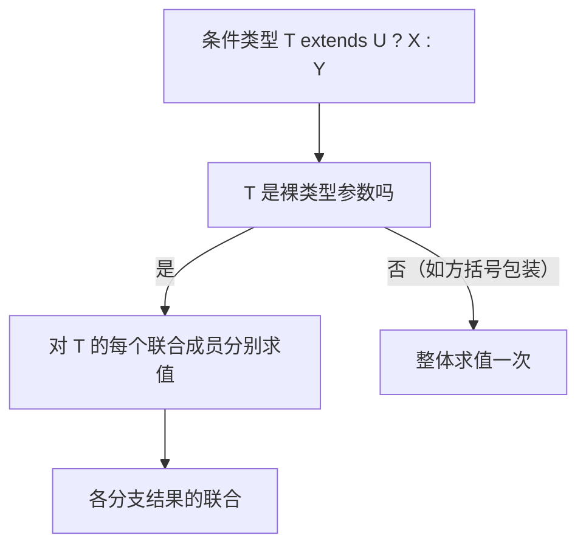

# 类型系统底层：结构化类型、可赋值性与型变

!!! abstract "核心结论"
- TypeScript 采用结构化类型系统（structural typing）：名字无关，形状（shape）决定兼容；唯一具有"名义"色彩的特例是带 `private`/`protected` 成员的类与枚举。
- 可赋值性（assignability）是编译期的单向关系，记 `S <: T` 表示 `S` 可赋给 `T`；它由 checker 的核心例程递归判定，是赋值、传参、返回值检查的地基。
- 对象成员按协变比较；函数类型在 `strictFunctionTypes` 下参数逆变、返回值协变，而方法参数保持双变；数组是故意不加检查的协变。
- 条件类型对"裸类型参数"呈分配律：`(A | B) extends U ? X : Y` 等价于两个分支结果的联合；参数未绑定时延迟求值。
- 对象字面量直接赋值时是 fresh 状态，触发多余属性检查（excess property check）；经变量中转后 freshness 消失，检查被跳过。

## 1. 结构化类型与名义类型的分水岭

### 1.1 底层判定：成员级别的递归比较

名义类型系统（Java、C# 默认、Swift 大部分场景）要求两个类型必须存在显式继承关系才兼容；结构化类型系统（TypeScript、Go 的接口、OCaml 的对象）只比较"形状"。TypeScript 选择结构化有两个工程原因：其一，大量数据来自 JSON、无类型 JS、第三方库，名义关系根本不存在；其二，结构化比较与跳脱的 JS 动态调用习惯天然匹配。

编译器内部实现是一条递归判定链：checker 先处理 `any`/`unknown`/`never` 等特殊关系，再按类型本体（kind）分派。对象类型比较时，对目标类型（target）的每个属性，在源类型（source）上查找同名字段，递归比较字段类型；目标必需属性缺失则失败，源多出属性本身不构成失败（多出属性只在 fresh 字面量场景被单独检查）。在 TypeScript 源码的 `checker.ts` 中，这条链的入口可以概括为 `isTypeAssignableTo` / `isTypeRelatedTo` 一类内部函数（具体命名随版本演进，需核对官方源码）；同时内部会缓存类型关系以规避指数级重复计算。

### 1.2 手写核心 isAssignable

```javascript
// 运行环境：Node.js（CommonJS，保存为 code1.js 后 node code1.js）
// 教学用迷你结构化类型检查器，覆盖 any / unknown / never / primitive /
// literal / object / union；未实现 strictNullChecks、索引签名、函数（见第 3 节）。
const assert = require('node:assert/strict');

// 类型构造器：类型即普通 JS 对象
const anyT     = () => ({ kind: 'any' });
const unknownT = () => ({ kind: 'unknown' });
const neverT   = () => ({ kind: 'never' });
const prim     = (name) => ({ kind: 'primitive', name }); // string|number|boolean|null|undefined|void
const lit      = (base, value) => ({ kind: 'literal', base, value }); // base ∈ string|number|boolean
const obj      = (props) => ({ kind: 'object', props: new Map(Object.entries(props)) });
// props 形如：{ name: { type: prim('string'), optional: false } }
const uni      = (...members) => ({ kind: 'union', members });

// 核心：source 是否可赋值给 target
function isAssignable(source, target) {
  if (source.kind === 'any' || target.kind === 'any') return true; // any 双向漂移
  if (target.kind === 'unknown') return true;                       // 一切可赋给 unknown
  if (source.kind === 'never') return true;                         // never 是 bottom，可赋给一切
  if (source.kind === 'unknown') return target.kind === 'unknown';  // unknown 只能赋给 any/unknown

  // 联合：源为联合要求"每个成员"都可赋给目标；目标为联合要求"任一成员"接受源
  if (source.kind === 'union') return source.members.every((m) => isAssignable(m, target));
  if (target.kind === 'union') return target.members.some((m) => isAssignable(source, m));

  // 字面量：同基同值可互相赋值；字面量可赋给被宽化的原始类型，反之不行
  if (source.kind === 'literal') {
    if (target.kind === 'literal') return source.base === target.base && source.value === target.value;
    if (target.kind === 'primitive') return source.base === target.name; // 'a' -> string
    return false;
  }
  if (source.kind === 'primitive') {
    if (target.kind === 'primitive') return source.name === target.name;
    return false; // string 不能赋给字面量 'a'
  }

  // 结构化对象：目标每个属性在源上存在且类型兼容（属性位置为协变）
  if (source.kind === 'object' && target.kind === 'object') {
    for (const [name, targetProp] of target.props) {
      const sourceProp = source.props.get(name);
      if (!sourceProp) {
        if (!targetProp.optional) return false; // 目标必需属性缺失
        continue;                               // 目标可选属性缺失，通过
      }
      if (!isAssignable(sourceProp.type, targetProp.type)) return false;
    }
    return true;
  }
  return false;
}

// ---------- 验证标准 ----------
// 运行 node code1.js，预期输出：code1: 全部断言通过（共 12 条）
const s = prim('string');
const n = prim('number');
const p = obj({ x: { type: n, optional: false } });
const q = obj({ x: { type: n, optional: false }, y: { type: s, optional: false } });

assert.equal(isAssignable(s, s), true);
assert.equal(isAssignable(n, s), false);
assert.equal(isAssignable(lit('string', 'a'), s), true);   // 字面量宽化为 primitive
assert.equal(isAssignable(s, lit('string', 'a')), false);   // primitive 不能收窄成字面量
assert.equal(isAssignable(q, p), true);                     // 多属性对象赋给少属性目标
assert.equal(isAssignable(p, q), false);                    // 缺 y 失败
assert.equal(isAssignable(neverT(), q), true);              // never 可赋给一切
assert.equal(isAssignable(q, unknownT()), true);            // 一切可赋给 unknown
assert.equal(isAssignable(unknownT(), q), false);           // unknown 不可赋给具体类型
const strOrNum = uni(s, n);
assert.equal(isAssignable(s, strOrNum), true);              // string 赋给 string|number
assert.equal(isAssignable(strOrNum, s), false);             // 联合整体不能赋给单个成员
assert.equal(isAssignable(strOrNum, strOrNum), true);
console.log('code1: 全部断言通过（共 12 条）');
```

对比表：

| 维度 | 结构化类型系统（TS） | 名义类型系统（Java/C#） |
| --- | --- | --- |
| 判定依据 | 成员形状递归比较 | 类型声明身份与继承链 |
| 兼容前提 | 目标所需成员在源上均存在且兼容 | 必须显式 `extends` / `implements` |
| 典型优势 | 灵活、适合 JSON 与无类型边界 | 意图明确、杜绝结构巧合 |
| 典型代价 | 结构巧合可能误判 | 冗长、跨库适配需 adapter |
| TS 例外 | `private`/`protected` 成员构成名义约束、枚举为名义 | 品牌类型（brand）用交叉与 `unique symbol` 模拟名义 |

`private`/`protected` 例外：两个形状相同的类如果各自声明 `private` 成员，互相不可赋值，因为私有成员必须来自同一处声明（同一类或其子类）。这意味着 TS 在纯结构化比较之外，做了一个"私有成员来源"的名义化补充，既保持灵活性又防止把两个偶然同构但语义不同的类混用。

## 2. 可赋值性与可比较性：编译器的关系运算

可赋值性是单向关系：`S <: T`。编译器内部不只有这一种关系，还存在可比较关系（comparable）：若 `S <: T` 或 `T <: S` 任一方向成立，则两者可比较。TS 内部使用关系结果枚举（identity / subtype / assignable / comparable 等层级，具体命名与数值需核对官方源码），不同场景选择不同严格程度：赋值检查用 assignable，重载消解与联合比较等场景会用到 comparable。

关键规则速记：

- `any`：与任何类型双向兼容，是"逃生舱"；`unknown`：任何类型可赋给它，但它只能赋给 `any`/`unknown`。
- `never`：可赋给一切类型，是 bottom；联合遇到 `never` 会被吸收。
- 基元类型之间只按名字兼容；字面量单向流入其宽化基元类型。
- 联合到单一类型：要求每个成员都可赋给该类型；单一类型到联合：只要命中任一成员。
- 可比较但不相等不意味着可赋值：`'a' | 'b'` 与 `string` 可比较，但 `string` 不可赋给 `'a' | 'b'`。

关系表：

| 关系 | 方向 | 判定 | 典型使用 |
| --- | --- | --- | --- |
| identity | 双向相等 | 两边结构完全一致 | 类型别名消解、缓存键 |
| subtype | 严格单向 | `S <: T` 且不同构 | 结构化层级推导 |
| assignable | 单向 | `S <: T` | 赋值、传参、返回 |
| comparable | 双向任一边 | `S <: T` 或 `T <: S` | 重载消解、联合兼容性预筛 |

```typescript
type A = 'a' | 'b';
type B = string;
// A 可赋给 B（每个字面量都是 string）；B 不可赋给 A（string 可能是 'c'）
const a: A = 'a';
const b: B = a;      // OK
// const a2: A = b;  // Error: Type 'string' is not assignable to type 'A'
```

## 3. 型变四象限：协变、逆变、双变与不变

### 3.1 为什么参数翻转、返回值保持

型变描述"子类型关系在类型构造器中的传播方向"。以动物与狗为例：`Dog <: Animal`（`Dog` 多了 `bark` 字段，或继承自 `Animal`）。

- 返回值位置：函数 `() => Dog` 可赋给 `() => Animal`，因为调用者拿到 Dog 可以当 Animal 用。子类型方向保持不变，即协变（covariance）。
- 参数位置：函数 `(x: Animal) => void` 可赋给 `(x: Dog) => void`，因为调用者只会传入 Dog，而实现者能处理更大的 Animal。子类型方向翻转，即逆变（contravariance）。
- 双变（bivariance）：两个方向都接受，TS 为兼容旧代码在方法参数位置保留双变。
- 不变（invariance）：任何方向都不接受，典型出现在同一类型参数既做输入又做输出的位置。

违反协变的经典漏洞是数组：TS 允许 `Dog[]` 赋给 `Animal[]`（数组协变），随后向 `Animal[]` push 一个普通 Animal，编译器不报错，运行时 `dogs[0].bark()` 才会炸。TS 团队接受这个洞，因为 JS 数组本就如此，且完全可变数组强制不变会让日常代码痛苦。

### 3.2 strictFunctionTypes 与方法双变

TS 2.6 引入 `strictFunctionTypes`，在 `--strict` 下默认开启：函数类型位置的参数严格执行逆变，但方法声明（method syntax）豁免，仍为双变。注意区分：

```typescript
interface StrictFn { handler: (x: Animal) => void }   // 属性函数位置：受控
interface LooseFn { handler(x: Animal): void }        // 方法位置：双变

declare const strictFn: StrictFn;
declare const looseFn: LooseFn;
const dogHandler: (x: Dog) => void = () => {};
// strictFn.handler = dogHandler;  // Error：strictFunctionTypes 下参数需逆变
looseFn.handler = dogHandler;      // OK：方法位置双变
```

### 3.3 in / out 型变注解（TS 4.7）

TS 4.7 引入可选型变注解：`out T` 声明协变（只出现在输出位置），`in T` 声明逆变（只出现在输入位置），`in out T` 声明不变。结构比较本身会自动"测量"型变，注解并非在赋值检查时强制出现；它的价值是向编译器显式提供型变信息，用于条件类型等类型级计算、提升错误信息质量与性能（具体影响应以 TS 4.7 官方发布说明为准）。

```typescript
interface Producer<out T> { get(): T }          // T 只出现在输出位置
interface Consumer<in T> { set(value: T): void } // T 只出现在输入位置
type State<in out T> = { value: T; set(v: T): void } // 输入输出都出现，不变
```

### 3.4 手写函数型变检查

```javascript
// 运行环境：Node.js（保存为 code2.js）
// 在第 1 节检查器基础上增加函数类型：参数按 strictFn 逆变/双变，返回值协变。
const assert = require('node:assert/strict');

const anyT = () => ({ kind: 'any' });
const unknownT = () => ({ kind: 'unknown' });
const neverT = () => ({ kind: 'never' });
const prim = (name) => ({ kind: 'primitive', name });
const lit = (base, value) => ({ kind: 'literal', base, value });
const obj = (props) => ({ kind: 'object', props: new Map(Object.entries(props)) });
const uni = (...members) => ({ kind: 'union', members });
const fn = (params, returns) => ({ kind: 'function', params, returns });

function isAssignable(source, target, strictFn = true) {
  if (source.kind === 'any' || target.kind === 'any') return true;
  if (target.kind === 'unknown') return true;
  if (source.kind === 'never') return true;
  if (source.kind === 'unknown') return target.kind === 'unknown';
  if (source.kind === 'union') return source.members.every((m) => isAssignable(m, target, strictFn));
  if (target.kind === 'union') return target.members.some((m) => isAssignable(source, m, strictFn));
  if (source.kind === 'literal') {
    if (target.kind === 'literal') return source.base === target.base && source.value === target.value;
    if (target.kind === 'primitive') return source.base === target.name;
    return false;
  }
  if (source.kind === 'primitive') {
    if (target.kind === 'primitive') return source.name === target.name;
    return false;
  }
  if (source.kind === 'object' && target.kind === 'object') {
    for (const [name, targetProp] of target.props) {
      const sourceProp = source.props.get(name);
      if (!sourceProp) {
        if (!targetProp.optional) return false;
        continue;
      }
      if (!isAssignable(sourceProp.type, targetProp.type, strictFn)) return false;
    }
    return true;
  }
  // 函数类型：参数严格下逆变，非严格下双变；返回值始终协变
  if (source.kind === 'function' && target.kind === 'function') {
    if (source.params.length !== target.params.length) return false; // 简化：不支持可选/剩余参数
    for (let i = 0; i < source.params.length; i++) {
      const sp = source.params[i];
      const tp = target.params[i];
      const contravariant = isAssignable(tp, sp, strictFn); // 参数逆变：target 参数 <: source 参数
      if (strictFn) {
        if (!contravariant) return false;
      } else {
        const covariant = isAssignable(sp, tp, strictFn);   // 双变：额外接受协变方向
        if (!contravariant && !covariant) return false;
      }
    }
    return isAssignable(source.returns, target.returns, strictFn); // 返回值协变
  }
  return false;
}

// ---------- 验证标准 ----------
// 运行 node code2.js，预期输出：code2: 全部断言通过（共 5 条）
const Animal = obj({ name: { type: prim('string'), optional: false } });
const Dog = obj({ name: { type: prim('string'), optional: false }, bark: { type: prim('boolean'), optional: false } });
const unit = prim('void');

const onAnimalParam = fn([Animal], unit); // (Animal) => void
const onDogParam = fn([Dog], unit);       // (Dog) => void，参数更窄

assert.equal(isAssignable(onDogParam, onAnimalParam, true), false, 'strict 下窄参数函数不可赋给宽参数目标');
assert.equal(isAssignable(onDogParam, onAnimalParam, false), true, '双变下窄参数函数可赋给宽参数目标');

const returnsDog = fn([], Dog);
const returnsAnimal = fn([], Animal);
assert.equal(isAssignable(returnsDog, returnsAnimal, true), true, '返回值协变：Dog => Animal 通过');
assert.equal(isAssignable(returnsAnimal, returnsDog, true), false, '返回值协变：Animal => Dog 拒绝');
assert.equal(isAssignable(onAnimalParam, onDogParam, true), true, 'strict 下宽参数可赋给窄参数位置');
console.log('code2: 全部断言通过（共 5 条）');
```

型变对比表：

| 型变 | 子类型传播 | TS 典型位置 | strictFunctionTypes 下 |
| --- | --- | --- | --- |
| 协变 | `A <: B` 则 `F<A> <: F<B>` | 属性、返回值、数组 | 允许 |
| 逆变 | `A <: B` 则 `F<B> <: F<A>` | 函数类型参数 | 允许（TS 2.6 起严格执行） |
| 双变 | 两个方向都接受 | 方法参数 | 允许（方法位置豁免） |
| 不变 | 必须完全同一类型 | 同一类型参数同时处于输入输出位置，或 `in out` 显式标注 | 不适用于单向传播 |

## 4. 子类型约简与联合类型规范化

### 4.1 编译器如何规范化联合

联合类型在创建/合并时会被规范化：去重、按类型内部 id 排序、吸收被其他成员子类型化的成员。吸收规则是最关键的一步：若联合中成员 `A <: B` 且 `A !== B`，则 `A` 可以删除，因为"是 B 的那些值"已经覆盖了 A。于是 `'a' | string` 变成 `string`，`never | number` 变成 `number`，`1 | 1 | 2` 变成 `1 | 2`。这一步在 checker 内部合并联合时发生（相关实现函数命名需核对官方源码），也是条件类型分配后结果常被简化的原因。

```typescript
type A = string | 'x';   // string：字面量被 primitive 吸收
type B = never | number; // number：never 被吸收
type C = 1 | 1 | 2;      // 1 | 2：去重
```

### 4.2 手写 normalizeUnion

```javascript
// 运行环境：Node.js（保存为 code3.js）
// 模拟联合规范化：展平嵌套、去重、吸收被其他成员子类型化的成员。
const assert = require('node:assert/strict');

const prim = (name) => ({ kind: 'primitive', name });
const lit = (base, value) => ({ kind: 'literal', base, value });
const neverT = () => ({ kind: 'never' });
const obj = (props) => ({ kind: 'object', props: new Map(Object.entries(props)) });
const uni = (...members) => ({ kind: 'union', members });

// 最小子类型判断，只覆盖本块需要的 literal / primitive / object / never
function isSubtype(source, target) {
  if (source.kind === 'never') return true;
  if (target.kind === 'never') return false;
  if (source.kind === 'literal' && target.kind === 'primitive') return source.base === target.name;
  if (source.kind === 'literal' && target.kind === 'literal') {
    return source.base === target.base && source.value === target.value;
  }
  if (source.kind === 'primitive' && target.kind === 'primitive') return source.name === target.name;
  if (source.kind === 'object' && target.kind === 'object') {
    for (const [name, tp] of target.props) {
      const sp = source.props.get(name);
      if (!sp) return false;
      if (!isSubtype(sp.type, tp.type)) return false;
    }
    return true;
  }
  return false;
}

function repr(t) {
  if (t.kind === 'primitive') return `p:${t.name}`;
  if (t.kind === 'literal') return `l:${t.base}:${t.value}`;
  if (t.kind === 'never') return 'never';
  if (t.kind === 'object') return 'obj:' + [...t.props.keys()].join(',');
  if (t.kind === 'union') return 'union:' + t.members.map(repr).join('|');
  return t.kind;
}

function normalizeUnion(members, reprFn) {
  const flat = [];
  for (const m of members) {
    if (m.kind === 'union') flat.push(...m.members);
    else flat.push(m);
  }
  const seen = new Map();               // 用字符串表示做去重（教学简化）
  for (const m of flat) {
    const key = reprFn(m);
    if (!seen.has(key)) seen.set(key, m);
  }
  const list = [...seen.values()];
  const out = [];
  for (let i = 0; i < list.length; i++) {
    let absorbed = false;
    for (let j = 0; j < list.length; j++) {
      if (i === j) continue;
      if (isSubtype(list[i], list[j])) { absorbed = true; break; } // 被父类型吸收
    }
    if (!absorbed) out.push(list[i]);
  }
  return out;
}

// ---------- 验证标准 ----------
// 运行 node code3.js，预期输出：code3: 全部断言通过（共 4 条）
const s = prim('string');
const a = lit('string', 'a');
assert.deepEqual(normalizeUnion([a, s], repr).map(repr), ['p:string'], '字面量被 primitive 吸收');
assert.deepEqual(normalizeUnion([prim('number'), neverT()], repr).map(repr), ['p:number'], 'never 被吸收');
assert.deepEqual(normalizeUnion([a, a, prim('number')], repr).map(repr).sort(), ['l:string:a', 'p:number'].sort(), '去重');

const Dog = obj({ name: { type: prim('string'), optional: false }, bark: { type: prim('boolean'), optional: false } });
const Animal = obj({ name: { type: prim('string'), optional: false } });
assert.deepEqual(normalizeUnion([Dog, Animal], repr).map(repr), ['obj:name'], 'Dog 被 Animal 吸收');
console.log('code3: 全部断言通过（共 4 条）');
```

## 5. fresh literal 与多余属性检查

### 5.1 freshness 的传播与消失

对象字面量在创建时是 fresh（新鲜的）：编译器知道它还没被任何类型"污染"，于是赋值时除了结构兼容检查，还会额外做多余属性检查（excess property check，EPC）：字面量的每个属性都必须能在目标类型上找到对应声明，否则报错 TS2353 `Object literal may only specify known properties`。freshness 经变量中转、函数返回、类型断言等操作后消失，EPC 不再触发。

```typescript
type Point = { x: number; y: number };
// const p: Point = { x: 1, y: 2, z: 3 };  // Error: 'z' does not exist in type 'Point'
const q = { x: 1, y: 2, z: 3 };
const p: Point = q;                        // OK：freshness 已丢失，结构兼容即通过
```

触发场景对比：

| 场景 | 是否 fresh | 是否触发 EPC | 结果 |
| --- | --- | --- | --- |
| 直接给变量赋字面量 | 是 | 是 | 多余属性报 TS2353 |
| 字面量先存变量再赋值 | 否 | 否 | 通过（结构兼容） |
| 函数调用实参为字面量 | 是 | 是 | 报错 |
| `{...} as Point` 断言 | 经断言 | 否 | 绕过检查 |

### 5.2 手写 excess property check

```javascript
// 运行环境：Node.js（保存为 code4.js）
// 模拟 fresh 字面量的多余属性检查：仅当对象仍标记为 fresh 时才检查多余属性。
const assert = require('node:assert/strict');

const prim = (name) => ({ kind: 'primitive', name });
const obj = (props) => ({ kind: 'object', props: new Map(Object.entries(props)), fresh: false });
const fresh = (props) => ({ kind: 'object', props: new Map(Object.entries(props)), fresh: true });

function isAssignable(source, target) {
  if (source.kind === 'object' && target.kind === 'object') {
    for (const [name, tp] of target.props) {
      const sp = source.props.get(name);
      if (!sp) return tp.optional === true; // 目标可选而源缺失：通过
      if (!isAssignable(sp.type, tp.type)) return false;
    }
    return true;
  }
  if (source.kind === 'primitive' && target.kind === 'primitive') return source.name === target.name;
  return false;
}

// 多余属性检查：fresh 字面量的每个属性都必须出现在目标对象上
function hasExcessProperty(literal, target) {
  for (const name of literal.props.keys()) {
    if (!target.props.has(name)) return name; // 返回多余属性名
  }
  return null;
}

// 字面量直接赋值：先结构兼容，fresh 才做 EPC
function assignLiteral(source, target) {
  if (!isAssignable(source, target)) return { ok: false, reason: '结构不兼容' };
  if (source.fresh) {
    const extra = hasExcessProperty(source, target);
    if (extra !== null) return { ok: false, reason: `多余属性 ${extra}` };
  }
  return { ok: true };
}

// ---------- 验证标准 ----------
// 运行 node code4.js，预期输出：code4: 全部断言通过（共 4 条）
const Point = obj({ x: { type: prim('number') }, y: { type: prim('number') } });

const p = fresh({ x: { type: prim('number') }, y: { type: prim('number') } });
assert.equal(assignLiteral(p, Point).ok, true, '形状一致：通过');

const pExtra = fresh({ x: { type: prim('number') }, y: { type: prim('number') }, z: { type: prim('number') } });
assert.equal(assignLiteral(pExtra, Point).reason, '多余属性 z', '多余属性被拒绝');

const pVar = pExtra;
pVar.fresh = false; // 教学简化：真实编译器中，变量中转后字面量不再保持 fresh 标记
assert.equal(assignLiteral(pVar, Point).ok, true, '变量中转后结构兼容即通过');

const missing = fresh({ x: { type: prim('number') } });
assert.equal(assignLiteral(missing, Point).reason, '结构不兼容', '缺 y 结构失败');
console.log('code4: 全部断言通过（共 4 条）');
```

## 6. 类型推断的三条腿

### 6.1 上下文类型

当表达式出现的位置存在"预期类型"时，编译器用该预期类型反向约束表达式，而不是先给表达式一个独立类型再比较。函数表达式赋值、回调参数、事件处理器都是典型场景：

```typescript
const doubled = [1, 2, 3].map((x) => x + 1);
// Array<number>.map 的签名给出回调上下文：(value: number) => U
// 于是 x 被上下文推断为 number，返回值参与 BCT 推断 U = number
```

### 6.2 控制流收窄

checker 维护控制流图（control flow graph），对某个引用点计算"到达此处时的类型"。typeof、instanceof、in、真值判断、相等比较、赋值语句分析都会在分支上收窄联合类型；实现层面可概括为对每个 flow node 记录 antecedents，并应用收窄函数（相关内部命名需核对官方源码）。

```typescript
function format(x: string | number) {
  if (typeof x === 'string') return x.toUpperCase(); // x: string
  return x.toFixed(2);                                 // x: number（已被排除 string）
}
```

### 6.3 最佳公共类型

当从多个候选推断单一类型时（如数组字面量 `[1, 'a']`），编译器计算候选们的"最佳公共父类型"（best common type）。算法从候选类型出发，在候选超类型集合中寻找共同父类型；找不到唯一父类型则退化为联合。

```typescript
const arr = [1, 'a'];        // (string | number)[]
const homo = [1, 2, 3];      // number[]
```

### 6.4 手写 typeof 收窄与 BCT

```javascript
// 运行环境：Node.js（保存为 code5.js）
// 模拟控制流收窄（typeof 守卫）与最佳公共类型的极简计算。
const assert = require('node:assert/strict');

const prim = (name) => ({ kind: 'primitive', name });
const uni = (...members) => ({ kind: 'union', members });
const neverT = () => ({ kind: 'never' });

// 简化收窄：对 union 成员按 typeof 谓语过滤
function narrowByTypeof(union, typeofName) {
  const mapping = { string: 'string', number: 'number', boolean: 'boolean', object: 'object' };
  const wanted = mapping[typeofName] ?? null;
  const kept = union.members.filter((m) => m.kind === 'primitive' && m.name === wanted);
  if (kept.length === 0) return neverT();        // 守卫排除全部成员：分支不可达
  if (kept.length === 1) return kept[0];
  return uni(...kept);
}

// best common type：相同类型返回自身；不同 primitive 退化为联合（教学简化）
function bestCommonType(types) {
  if (types.length === 0) return neverT();
  if (types.length === 1) return types[0];
  const keys = types.map((t) => (t.kind === 'primitive' ? `p:${t.name}` : 'u'));
  if (new Set(keys).size === 1 && keys[0].startsWith('p:')) return types[0];
  const flat = types.flatMap((t) => (t.kind === 'union' ? t.members : [t]));
  return uni(...flat);
}

// ---------- 验证标准 ----------
// 运行 node code5.js，预期输出：code5: 全部断言通过（共 4 条）
const strOrNum = uni(prim('string'), prim('number'));
assert.deepEqual(narrowByTypeof(strOrNum, 'string'), prim('string'), 'typeof string 收窄为 string');
assert.equal(narrowByTypeof(strOrNum, 'boolean').kind, 'never', '守卫排除全部成员时为 never');

const bct = bestCommonType([prim('string'), prim('number')]);
assert.equal(bct.kind, 'union', 'string 与 number 的 BCT 为联合');
assert.equal(bestCommonType([prim('string'), prim('string')]).name, 'string', '相同类型 BCT 是自身');
console.log('code5: 全部断言通过（共 4 条）');
```

## 7. 条件类型的分配律与延迟求值

### 7.1 分配律

条件类型 `T extends U ? X : Y` 中，若 `T` 是裸类型参数（naked type parameter），则实例化时会按分配律展开：`(A | B) extends U ? X : Y` 等价于 `(A extends U ? X : Y) | (B extends U ? X : Y)`。`never` 分配后结果仍为 `never`；`any` 分配的结果是两个分支的联合（例如 `T = any` 时得到 `X | Y`，该行为较特殊，建议以当前编译器实际行为验证）。把检查目标包成元组 `[T] extends [U]` 即可关闭分配。

```typescript
type IsString<T> = T extends string ? 'yes' : 'no';
type R1 = IsString<string | number>; // 'yes' | 'no'
type R2 = IsString<never>;           // never
type R3 = [string | number] extends [string] ? 'yes' : 'no'; // 'no'：非分配，整体判定
```



### 7.2 延迟求值与缓存

条件类型的检查目标如果是尚未绑定的类型参数，编译器不会立即求值，而是保存为延迟实例：包含 `checkType`、`extendsType`、`trueType`、`falseType` 以及一个缓存根（内部命名如 ConditionalRoot，具体以源码为准）；待到类型参数被具体类型实例化时，再展开并按分配律求值。这种延迟设计让泛型工具类型可以"先定义后实例化"，并支持条件分支上的 `infer` 提取。

### 7.3 手写 distributive conditional

```javascript
// 运行环境：Node.js（保存为 code6.js）
// 模拟条件类型：裸类型参数分配律、never 特例、包装后非分配。
const assert = require('node:assert/strict');

const prim = (name) => ({ kind: 'primitive', name });
const lit = (base, value) => ({ kind: 'literal', base, value });
const uni = (...members) => ({ kind: 'union', members });
const neverT = () => ({ kind: 'never' });

// cond(paramName, extendsType, trueType, falseType, wrapped)
// wrapped=true 表示检查目标被包装（如 [T]），关闭分配律
function cond(paramName, extendsType, trueType, falseType, wrapped = false) {
  return { kind: 'conditional', paramName, wrapped, extendsType, trueType, falseType };
}

function isSubtype(source, target) {
  if (source.kind === 'never') return true;
  if (target.kind === 'unknown') return true;
  if (source.kind === 'primitive' && target.kind === 'primitive') return source.name === target.name;
  if (source.kind === 'literal' && target.kind === 'primitive') return source.base === target.name;
  if (source.kind === 'literal' && target.kind === 'literal') {
    return source.base === target.base && source.value === target.value;
  }
  if (source.kind === 'union') return source.members.every((m) => isSubtype(m, target));
  return false;
}

function instantiate(conditional, concrete) {
  if (concrete.kind === 'never') return neverT(); // T=never 分配结果为 never
  if (!conditional.wrapped && concrete.kind === 'union') {
    const results = concrete.members.map((m) => evaluate(conditional, m));
    const flat = results.flatMap((r) => (r.kind === 'union' ? r.members : [r]));
    return uni(...flat); // 各分支结果的联合
  }
  return evaluate(conditional, concrete);
}

function evaluate(conditional, check) {
  return isSubtype(check, conditional.extendsType) ? conditional.trueType : conditional.falseType;
}

// ---------- 验证标准 ----------
// 运行 node code6.js，预期输出：code6: 全部断言通过（共 5 条）
const IsString = cond('T', prim('string'), lit('string', 'yes'), lit('string', 'no'));

assert.deepEqual(instantiate(IsString, prim('string')), { kind: 'literal', base: 'string', value: 'yes' }, 'string 命中 true 分支');
assert.deepEqual(instantiate(IsString, prim('number')), { kind: 'literal', base: 'string', value: 'no' }, 'number 走 false 分支');

const unionR = instantiate(IsString, uni(prim('string'), prim('number')));
assert.deepEqual(unionR, uni(lit('string', 'yes'), lit('string', 'no')), '联合被分配后取结果的联合');
assert.equal(instantiate(IsString, neverT()).kind, 'never', 'T=never 直接得到 never');

const Wrapped = cond('T', prim('string'), prim('string'), prim('number'), true);
assert.deepEqual(instantiate(Wrapped, uni(prim('string'), prim('number'))), prim('number'), '包装后非分配，整体联合不满足 string');
console.log('code6: 全部断言通过（共 5 条）');
```

## 8. 递归深度限制与编辑器体验

条件类型允许在类型层面写递归（如把元组转成对象路径、实现类型级 JSON 解析器），但编译器必须对实例化深度与实例化总数设限，否则无限递归会卡死语言服务。超限时报错 TS2589：`Type instantiation is excessively deep and possibly infinite`。具体阈值随版本调整，历史上深度上限在几十到上百量级（需核对官方源码）；TS 4.5 为尾递归条件类型引入消除优化，并将尾递归场景的上限放宽到约 1000 层（以官方发布说明为准），因此把递归调用放在分支尾部、避免"递归后还有构造"能显著提升类型算力。

```typescript
type Infinite<T> = Infinite<T>;
// type Bad = Infinite<string>; // Error TS2589: Type instantiation is excessively deep and possibly infinite

type Reverse<T extends unknown[]> =
  T extends [infer F, ...infer R] ? [...Reverse<R>, F] : []; // 尾递归形态
type R = Reverse<[1, 2, 3]>; // [3, 2, 1]
```

实际工程中的深度控制手段：把推导任务拆分到多个中间类型别名、用尾递归改写、限制输入元组长度、或放弃纯类型方案改用运行时生成。

## 9. 常见陷阱

1. 多余属性检查只在 fresh 字面量上生效。同一对象字面量先存进变量再赋值，多余属性检查就消失了，拼写错误可能漏网。
2. 方法参数双变是声音漏洞。`interface B { handler(x: Dog): void }` 可以赋给需要 `handler(x: Animal)` 的接口，因为方法位置豁免了 strictFunctionTypes，运行时传入 Animal 可能崩溃。
3. `any` 传染会短路所有检查。`any` 与目标类型双向兼容，一旦流入链式调用，后续表达式失去保护且通常无报错。
4. 联合吸收字面量。`type U = 'admin' | string` 实际是 `string`，因为 `'admin' <: string` 被规范化吸收；想保留字面量联合就别混入宽类型。
5. 条件类型分配律出乎意料。`type Box<T> = T extends any ? T[] : never; type R = Box<string | number>` 得到 `string[] | number[]`，而不是 `(string | number)[]`；需要整体行为时用 `[T] extends [any]` 关闭分配。
6. `{}` 接受除 `null`/`undefined` 外的几乎一切。`const o: {} = 123` 合法，`{}` 不等于"空对象字面量"。
7. 弱类型检测。全可选属性的类型（weak type）与另一个类型互赋时，若没有任何共同属性会报 TS2559（`has no properties in common`），防止两个完全不相关的结构静默兼容。

## 10. 面试题与答题要点

1. 解释结构化类型与名义类型，TS 为什么选结构化？判定算法核心步骤是什么？
   要点：比较形状而非名字；目标每个成员在源上存在且兼容；源可多不可少；任何对象可赋给 unknown；never 是 bottom；TS 例外是 private/protected 成员来源一致性与枚举。

2. 可赋值性与可比较性有何区别？any、unknown、never 三者的赋值规则？
   要点：assignable 单向，comparable 任意一边成立；any 双向、unknown 只进不出（只赋给 any/unknown）、never 只出不进（赋给一切）；举反例 string 与 number 不可比较。

3. 什么是协变、逆变、双变、不变？函数参数为什么是逆变？
   要点：分别给出定义；函数参数翻转是因为实现要能处理调用方实际传入的更具体类型；返回值协变是因为返回值要满足调用方预期；经典反例数组协变的不健全性。

4. strictFunctionTypes 做了什么？为什么方法参数不受影响？
   要点：TS 2.6、strict 下开启、只约束函数类型位置的参数为严格逆变；方法参数保持双变是为旧代码/内置 API 兼容；可用属性函数 vs 方法语法区分。

5. 多余属性检查的触发条件与绕过方式？
   要点：fresh 对象字面量直接赋给带形状的目标才检查；变量中转、断言、函数返回后不再检查；EPC 是字面量独有的"拼写保护"；弱类型检查是另一道防线。

6. `string | 'a'`、`never | T`、`1 | 1 | 2` 分别规范化成什么？为什么？
   要点：子类型约简吸收父类型覆盖的成员；去重；编译器合并联合时做规范化；这影响条件类型分配后的结果形态。

7. 条件类型的分配律是什么？如何关闭？`never` 和 `any` 实例化结果是什么？
   要点：裸类型参数按联合成员展开；元组包装关闭；`T=never` 得 never；`T=any` 得两分支联合（需实测确认具体版本）；延迟求值让泛型可先声明后实例化。

8. 类型推断的三种机制是什么？各举一例。
   要点：上下文类型（map 回调）；控制流收窄（typeof 分支，基于 CFG 的 per-reference 类型）；最佳公共类型（`[1,'a']` 得到 `(string | number)[]`）；三者常在同一表达式里协作。

9. 递归条件类型为什么报 "Type instantiation is excessively deep"？如何应对？
   要点：实例化深度与计数双层限制；TS 4.5 尾递归优化放宽深度（约 1000，以官方说明为准）；改写为尾递归、拆分中间类型、限制输入规模、必要时放弃纯类型方案。

以上即本页完整内容：从 checker 的赋值判定递归，到型变、联合规范化、fresh 检查、推断与条件类型分配，均给出配套的可运行迷你实现与断言验证，面试时可直接照此推导"编译器如何判断 A 能否赋值给 B"。

## 应用与行业实践

### 应用场景地图

| 场景 | 用到本页哪个知识点 | 典型技术选型 | 注意事项 |
| --- | --- | --- | --- |
| 后台管理的万行表格 | 结构化类型、fresh literal 与多余属性检查 | React + TypeScript，服务端返回 JSON | 字段并集超过百个时，先按上游拆成判别联合再收敛列配置 |
| 多人协作白板的消息通道 | 条件类型的分配律、联合类型规范化 | WebSocket + TypeScript，消息带判别字段 | never 兜底会在收到未知消息时直接报错，先定义降级动作 |
| 低端安卓的首屏加载 | 对象成员协变、可赋值性 | 按路由分包的前端应用，接口支持字段筛选 | 只裁剪类型而接口仍返回全量字段，省不下流量 |
| 组件库对外暴露的 props | 结构化类型、fresh literal | React 组件库 + 公开 API 快照 | 多写字段在字面量直传时报错，经变量中转后不报错 |
| BFF 聚合多个上游接口 | 可赋值性、函数参数逆变与双变 | Node + TypeScript 的 BFF 层 | 处理器写在函数属性位置走逆变检查，写在方法位置走双变 |
| 前端埋点 SDK 的事件载荷 | 条件类型、映射类型 | 自研 SDK + 类型测试 | 泛型未绑定会延迟求值，断言前先实例化 |
| 微前端宿主与子应用契约 | 结构化类型 | qiankun 或 Module Federation | 子应用导出类型漂移不会报错，需要用快照比对 |
| 表单校验的错误信息映射 | 型变四象限、只读数组协变 | React Hook Form + zod | 数组协变不做元素检查，向 string[] 推入 number 编译期不报错 |

### 三个场景拆解

#### 场景 1：后台管理的万行表格

**业务背景**：一个运维后台把来自多个上游系统的资源列表放在同一页，字段并集超过一百个，接入系统数量随季度增加。各系统类型由不同小组维护，页面组件之间反复出现属性拼写错误与运行期读取 undefined。

**怎么用本页知识解决**：思路是接口层按上游拆成判别联合，渲染层只声明自己需要的形状，把比较交给结构化类型。

```ts
type RowA = { source: "a"; id: string; cpu: number };
type RowB = { source: "b"; id: string; mem: number };
type Row = RowA | RowB;

// 渲染组件只声明用到的字段，形状匹配即可通过
function RowTitle(props: { id: string }) { return props.id; }

// 字面量直传：多余属性检查生效，cpu 不在声明形状里
RowTitle({ id: "r1", cpu: 4 });

// 经变量中转：freshness 消失，检查被跳过
const raw = { id: "r1", cpu: 4 };
RowTitle(raw);
```

- 判别字段 source 让 switch 能把 Row 收窄成单个分支，不需要类型断言。
- RowTitle 的参数是匿名对象类型，RowA 与 RowB 都满足这个形状。
- 字面量直传走 fresh 检查，拼错字段名会在编译期暴露。
- 经变量中转后 fresh 标记丢失，关键调用点优先写字面量。
- 表格列配置用映射类型从 Row 派生，列 key 与行字段保持同源。

**怎么度量收益**：CI 中 `tsc --noEmit` 的报错计数，目标为 0。浏览器端用 Sentry 统计 TypeError 事件数与受影响会话数。渲染耗时用 PerformanceObserver 采 `longtask` 并按页面分组。

**什么时候不该用**：

- 上游字段不超过十个且短期不改，引入判别联合与映射类型会增加阅读成本。
- 数据来自用户自由填写的 JSON 文本框，编译期类型无法约束运行期输入，应先用运行时 schema 校验。

#### 场景 2：多人协作白板

**业务背景**：白板客户端通过一条 WebSocket 连接收发操作消息，消息种类随功能迭代增加。任意一端版本落后时，未知消息会走进默认分支并让画布进入错误状态。

**怎么用本页知识解决**：思路是把消息定义成判别联合，用条件类型抽取载荷，处理器用 never 兜底强制穷尽。

```ts
type Msg =
  | { t: "draw"; path: number[] }
  | { t: "erase"; ids: string[] };

// 条件类型对裸类型参数分配：M 是联合时逐分支求值
type Payload<M, K extends Msg["t"]> = M extends { t: K } ? M : never;

// 泛型未绑定前延迟求值，实例化时才展开
type DrawOnly = Payload<Msg, "draw">;

function handle(m: Msg) {
  switch (m.t) {
    case "draw": return m.path.length;
    case "erase": return m.ids.length;
    default: { const unhandled: never = m; return unhandled; } // 新增消息未处理时此处报错
  }
}
```

- Payload 的第一个参数在 extends 左侧是裸类型参数，联合会逐分支求值后再合并。
- 第二个参数用索引访问 Msg["t"] 约束，写错消息名会在调用处报错。
- default 分支把 m 赋给 never，新增消息未处理时编译失败。
- 收到未知消息的降级动作要先定义，再决定 default 是抛错还是忽略。
- 断线重连后回放的消息同样走这套判别逻辑，不需要单独的解析分支。

**怎么度量收益**：编译期看 `tsc --noEmit` 报错数。运行期在 default 分支加计数上报，看每千次会话的未知消息次数。连接质量看服务端 WebSocket 网关的连接时长分布与断连码分布。

**什么时候不该用**：

- 消息格式由外部第三方定义且先于客户端升级，never 兜底会让旧客户端抛错，应改为记录并忽略。
- 只发不收的单向埋点通道，判别联合与载荷抽取的收益低于固定字段类型。

#### 场景 3：低端安卓的首屏加载

**业务背景**：一个内容页面要在低端安卓机上渲染出首屏，这部分用户的网络条件在 3G 附近。接口一次返回文章全量字段，而首屏卡片只用到标题。

**怎么用本页知识解决**：思路是卡片组件只声明渲染需要的字段，用结构化类型复用同一个接口对象；再用条件类型按设备档位裁剪请求字段。

```ts
type Article = { title: string; cover: string; body: string };
type CardView = { title: string };

// 参数形状是 Article 的子集，Article 可赋给它（成员按协变比较）
function Card(props: CardView) { return props.title; }

// 泛型 D 未绑定，条件类型延迟求值
type Fields<D extends "low" | "high"> = D extends "low"
  ? Pick<Article, "title">
  : Article;

// D 传入联合时按分配律展开，结果是两个分支的联合
type AnyFields = Fields<"low" | "high">;

const a: Article = { title: "t", cover: "c", body: "b" };
Card(a); // 通过
Card({ title: "t", cover: "c" }); // 报错：cover 不在 CardView 里
```

- Card 的参数只声明 title，Article 因为成员按协变比较而通过。
- 若把 Card 改成接收 Article，调用方必须构造完整对象，低端档位拿到空值也要塞占位。
- Fields 的 D 在 extends 左侧是裸类型参数，传联合时逐分支求值再合并。
- 请求层用 Fields<"low"> 生成的字段列表拼查询参数，类型与实际请求字段同源。
- Card 的调用优先写字面量，多写字段会在编译期暴露。

**怎么度量收益**：首屏 JS 体积用 webpack-bundle-analyzer 或 rollup-plugin-visualizer 观看。接口响应字节数看网关访问日志里的 response size 分位值。首屏时间用 PerformanceObserver 采 `first-contentful-paint` 并按设备型号分组。

**什么时候不该用**：

- 只在内网高速网络使用的系统，字段裁剪省下的字节无法抵消多套类型的维护成本。
- 服务端不支持按字段筛选的接口，前端裁剪只省内存不省流量，应先改接口再改类型。

### 行业先进实践

**把结构化比较规则写进审查清单（出处：TypeScript 官方文档《Type Compatibility》）**。该章节给出成员逐一比较与函数参数处理的判定规则。团队可以把"赋值失败是否属于形状不匹配"写进 PR 模板的审查问题，让评审先判断是形状问题还是名义问题。

**用类型测试锁住公开类型的兼容性（出处：开源项目 tsd，以及 Vitest 官方文档的 expectTypeOf）**。做法是把期望类型写成断言，在 CI 中用编译器执行。类型退化成 any 或 never 时断言会失败，改动就无法静默通过。需核对官方文档：确认当前版本执行类型测试的命令与配置项名称。

**公开 API 快照比对（出处：Microsoft Rush Stack 的 API Extractor 官方文档）**。做法是生成 .api.md 报告并在 CI 中比较，形状变化出现在 PR diff 里。它把不可见的类型变化变成可审查的文本。你的项目可以把报告文件提交到仓库并在 CI 中执行比较。

**配置对象用 satisfies 保留字面量推断（出处：TypeScript 官方文档的 satisfies 操作符）**。写法是 `const c = {...} satisfies Config`，既检查形状又保留字面量类型。类型注解会拓宽字面量，satisfies 不会。需核对官方文档：确认所用 TypeScript 版本已支持 satisfies。

**严格族开关记录在版本库里（出处：TypeScript 官方文档的 tsconfig 参考，strictFunctionTypes 与 exactOptionalPropertyTypes）**。做法是把每个开关的开启时间、影响包范围写进迁移文档。严格开关改的是可赋值性判定，回退一处会影响其它包。你的项目可以在开启前先记录 `tsc --noEmit` 的报错数作为基线。

### 从学到用：落地路线

第 1 步：选一个新写的内部工具包，打开 tsconfig 的 strict，跑 `tsc --noEmit` 记录基线。验收标准：该包 `tsc --noEmit` 退出码为 0。

第 2 步：给该包导出的泛型函数补类型测试，覆盖正向赋值与反向拒绝两类断言。验收标准：每个导出函数至少有 1 条类型断言，且能在 CI 中执行。

第 3 步：把类型测试与 API 快照推广到其它包，公开类型变化走 reviewer 审批。验收标准：PR 中 API 报告出现 diff 且未经审批时 CI 失败。

第 4 步：设置防回退门禁，把 tsc、类型测试、快照比较写成合并前必须通过的三条检查。验收标准：任意一条失败则合并按钮不可用。

### 动手作业

**目标**：写一个类型安全的事件总线，让"事件名与载荷不匹配"在编译期失败。

**步骤**：

1. 定义 Events 映射表，包含至少 3 个事件，每个事件的载荷是不同形状的对象。
2. 用映射类型从 Events 派生 on 与 emit 的签名，emit 的第一个参数是事件名，第二个参数是对应载荷。
3. 用条件类型实现 Payload<E, K>，从事件表取出某个事件的载荷。
4. 写一个 switch 处理器，default 分支把参数赋给 never，新增事件时验证编译报错。
5. 加两条反例：载荷少字段、载荷多字段，确认直传字面量时报错。
6. 加一条型变反例：把只接收窄载荷的回调赋给 on 的参数位置，确认报错。
7. 配置 tsconfig 与 npm script，执行 `tsc --noEmit`。

**验收标准**：

- `tsc --noEmit` 退出码为 0。
- 删除事件表中的一个事件后，对应 emit 调用处出现至少 1 条报错。
- 载荷少一个必填字段时报错；多一个字段直传时报错，经变量中转后不报错。
- Payload 对联合事件名的结果等于各分支结果的联合，类型测试通过。
- 把窄参数回调赋给 on 时报错，说明逆变检查生效。

