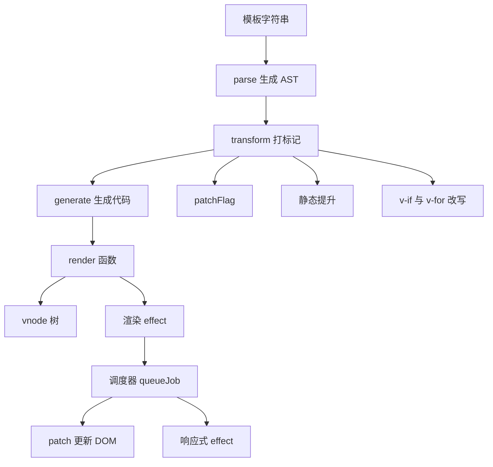
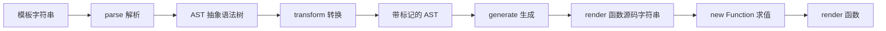
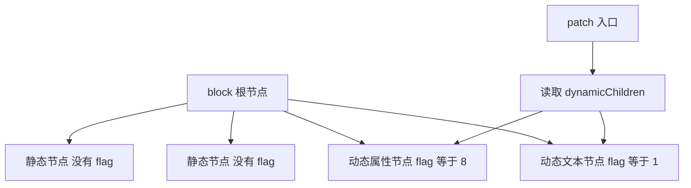
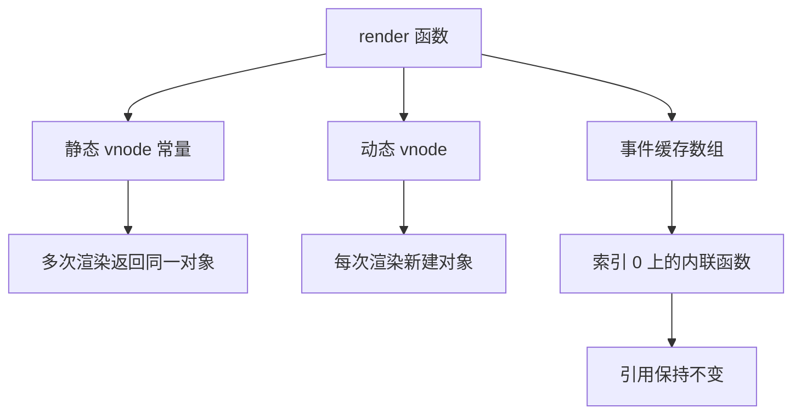
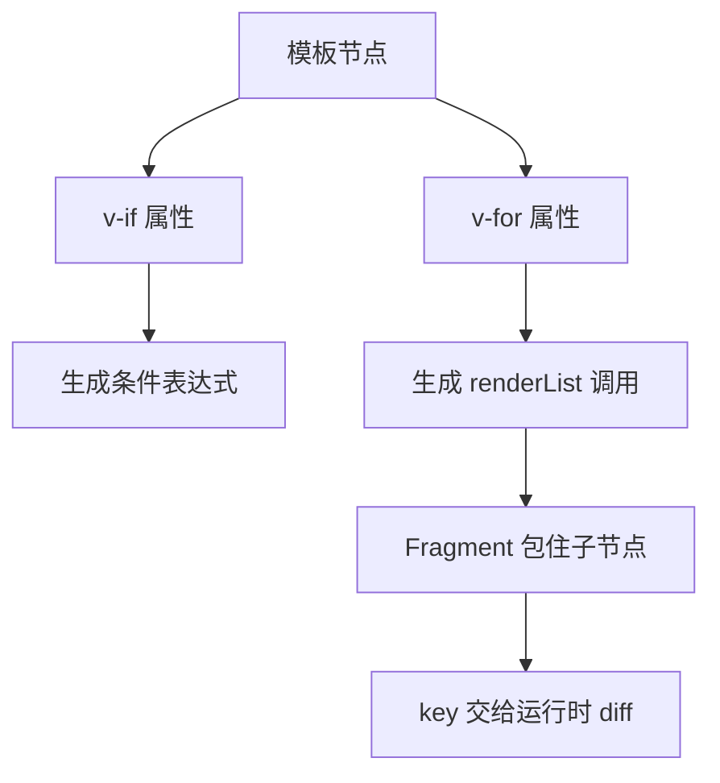
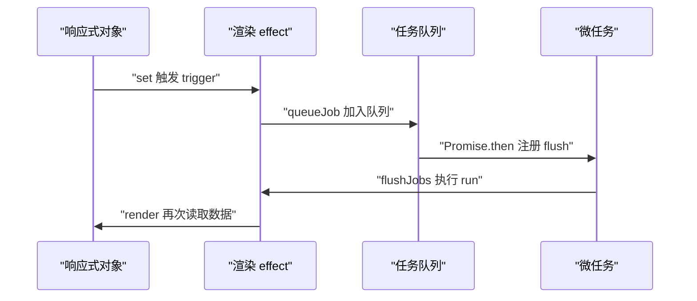
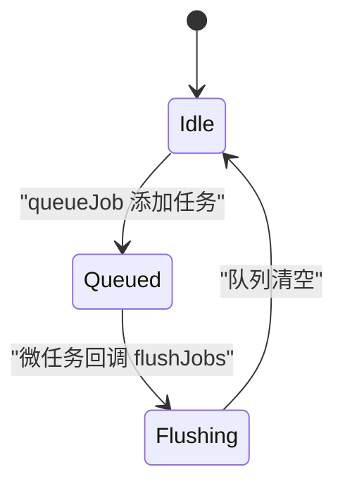
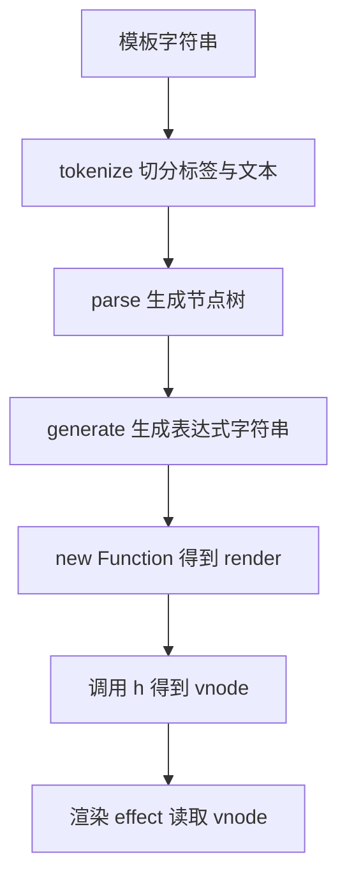

# Vue 3 编译与渲染：模板编译器与 patch 手写

!!! abstract "学完这一页你能"
    - 说清 parse、transform、generate 三个阶段各自吃进什么、吐出什么。
    - 用位运算读懂 patchFlag，并解释 block tree 为什么能跳过静态节点。
    - 解释静态提升与事件缓存的适用条件，并写出对比实验。
    - 手写支持插值、属性、v-if、v-for、@click 的迷你编译器，并接上渲染 effect 与批量更新队列。

## 0. 知识地图



建议读法：先读第 1 节和第 2 节，看清编译产物与动态节点标记。
再读第 3 节和第 4 节，理解编译器做的两类优化与指令改写。
最后读第 5 节和第 6 节，把编译产物接到响应式系统上跑通。

!!! note "术语：模板编译器"
    模板编译器是把模板字符串转换成 render 函数的程序。例子：`<div>{{ msg }}</div>` 被转换成返回 vnode 的函数。

## 1. 编译三阶段：parse、transform、generate

**先想一个问题**
你在 `.vue` 文件里写 `<div>{{ msg }}</div>`。浏览器只认 HTML 与 JavaScript，不认双大括号。
这段模板要由谁翻译成能创建节点的函数？翻译过程分成哪几步？

!!! tip "心智模型"
    一句话模型：编译是一条流水线，模板 → 语法树 → 改写后的语法树 → 可执行函数。
    日常类比：把中文菜谱变成厨房操作卡，先读懂配料与步骤，再按本店条件改写，最后写成动作卡。
    类比不成立的地方：菜谱改写一次就结束，编译器产出的 render 函数会被运行时反复调用；transform 阶段还会按编译选项改变结果。

!!! note "术语：AST"
    AST 是 Abstract Syntax Tree 的缩写，中文叫抽象语法树，指用对象节点描述源代码结构的树。例子：`div` 元素是一个节点，它的插值子节点是另一个节点。

**图解**



1. parse 吃进模板字符串，吐出 AST。
2. AST 的每个节点记录类型、标签、属性、子节点。
3. transform 遍历 AST，收集动态依赖，写入 patchFlag 等信息。
4. generate 把 AST 拼成 JavaScript 表达式字符串。
5. new Function 把字符串变成可调用的 render 函数。

**一步一步来**

**第 1 步：parse 把标签切成树**
这一步要做什么：用正则扫描模板，开始标签入栈，结束标签出栈，插值挂到当前父节点。

```js
function parse(template) {                                  // 输入一段模板字符串
  const root = { type: 'Root', children: [] };               // 虚拟根节点
  const stack = [root];                                     // 栈顶是当前父节点
  const re = /<\/?([a-zA-Z][\w-]*)[^>]*>|\{\{\s*([\w.]+)\s*\}\}/g;
  let m;
  while ((m = re.exec(template))) {                         // 逐个匹配标签或插值
    const top = stack[stack.length - 1];
    if (m[0].startsWith('</')) stack.pop();                 // 结束标签，退回上一层
    else if (m[1]) {                                        // 开始标签
      const el = { type: 'Element', tag: m[1], children: [] };
      top.children.push(el);
      stack.push(el);                                       // 进入这个元素内部
    } else {                                                // 插值
      top.children.push({ type: 'Interpolation', content: m[2] });
    }
  }
  return root;
}
```

**这段代码在做什么**

- 正则有两组捕获：`m[1]` 是标签名，`m[2]` 是插值里的变量名。
- 栈保存从根到当前节点的路径，`stack[stack.length - 1]` 是当前父节点。
- 开始标签压栈，结束标签弹栈，插值直接挂到当前父节点。
- 返回值是树，后续 transform 可以递归遍历。

运行结果：得到 Root，其子节点是 Element div，div 的子节点是 Interpolation msg。

**第 2 步：transform 收集动态依赖**
这一步要做什么：递归遍历 AST，把插值用到的变量名收进集合，供响应式系统订阅。

```js
function transform(node, deps = new Set()) {               // deps 收集动态变量
  if (node.type === 'Interpolation') deps.add(node.content); // 插值变量加入集合
  for (const child of node.children || []) {
    transform(child, deps);                                 // 深度优先遍历子节点
  }
  return deps;                                              // 返回收集结果
}
const ast = parse('<div>{{ msg }}</div>');
console.log([...transform(ast)]);                           // 打印依赖变量
```

**这段代码在做什么**

- 集合用 Set 而不是数组，同一个变量写两次只出现一次。
- 递归顺序是从上到下，父节点先处理，再处理子节点。
- 返回值向外传递，调用方拿到整棵树的依赖。
- 这一步只记录依赖名，不执行任何数据读取。

运行结果：`[ 'msg' ]`。

**第 3 步：generate 生成 render 函数**
这一步要做什么：把 AST 拼成表达式字符串，再用 new Function 求出函数。

```js
function generate(node) {                                  // 递归生成表达式字符串
  if (node.type === 'Interpolation') return `_ctx.${node.content}`;
  if (node.type === 'Element') {                           // 元素节点生成 h 调用
    const kids = (node.children || []).map(generate).join(', ');
    return `_h("${node.tag}", null, ${kids || 'null'})`;
  }
  return (node.children || []).map(generate).join(', ');    // Root 只拼接子节点
}
const code = `return function render(_ctx, _h) { return ${generate(ast)}; }`;
const render = new Function(code)();                       // 字符串转函数
console.log(code);
```

**这段代码在做什么**

- 元素节点生成 `_h` 调用，标签名直接写进字符串。
- 插值节点生成 `_ctx.变量名`，运行时从组件上下文取值。
- Root 节点没有标签，只把子节点的表达式拼起来。
- new Function 的函数体里写 return，求值后得到 render。

运行结果：code 为 `return function render(_ctx, _h) { return _h("div", null, _ctx.msg); }`。

**动手验证**
把三步合成一个 Node 脚本，用断言检查依赖与渲染结果。

```js
// Node 20+，无第三方依赖：node compile1.mjs
import assert from 'node:assert/strict';

function parse(template) {
  const root = { type: 'Root', children: [] };
  const stack = [root];
  const re = /<\/?([a-zA-Z][\w-]*)[^>]*>|\{\{\s*([\w.]+)\s*\}\}/g;
  let m;
  while ((m = re.exec(template))) {
    const top = stack[stack.length - 1];
    if (m[0].startsWith('</')) stack.pop();
    else if (m[1]) {
      const el = { type: 'Element', tag: m[1], children: [] };
      top.children.push(el);
      stack.push(el);
    } else top.children.push({ type: 'Interpolation', content: m[2] });
  }
  return root;
}

function transform(node, deps = new Set()) {
  if (node.type === 'Interpolation') deps.add(node.content);
  for (const child of node.children || []) transform(child, deps);
  return deps;
}

function generate(node) {
  if (node.type === 'Interpolation') return `_ctx.${node.content}`;
  if (node.type === 'Element') {
    const kids = (node.children || []).map(generate).join(', ');
    return `_h("${node.tag}", null, ${kids || 'null'})`;
  }
  return (node.children || []).map(generate).join(', ');
}

const ast = parse('<div>{{ msg }}</div>');
assert.deepEqual([...transform(ast)], ['msg']);

const render = new Function(`return function render(_ctx, _h) { return ${generate(ast)}; }`)();
const h = (tag, props, ...children) => ({ tag, props, children: children.flat() });
const vnode = render({ msg: 'hi' }, h);
assert.deepEqual(vnode, { tag: 'div', props: null, children: ['hi'] });
console.log(JSON.stringify(vnode));
console.log('断言通过');
```

预期输出：
```text
{"tag":"div","props":null,"children":["hi"]}
断言通过
```

**常见坑**

| 现象 | 原因 | 怎么修 |
| --- | --- | --- |
| 引号里的尖括号被当成标签 | 正则不区分引号内外 | 换用官方编译器，或先做词法切分 |
| 插值里的表达式带空格不生效 | 变量正则只允许 `[\w.]+` | 扩展表达式规则，并核对官方表达式语法 |
| new Function 直接报错 | 生成字符串拼错 | 先打印 code，再求值 |

**小结**

- parse 产出树，transform 给树加信息，generate 把树变回字符串。
- 依赖收集发生在 transform，数据读取发生在 render 执行时。
- new Function 是教学手段，生产环境用官方编译器与打包工具。

## 2. patchFlag 与 block tree

**先想一个问题**
组件更新时，如果每次都从根节点开始对比整棵树，静态节点的对比是白做的功。
编译器能不能在 vnode 上留一张便签，告诉 patch 只看哪类变化？

!!! note "术语：patchFlag"
    patchFlag 是挂在 vnode 上的整数标记，用二进制位记录这个节点会发生哪类变化。例子：文本变化记 1，属性变化记 8。

!!! note "术语：vnode"
    vnode 是 virtual node 的缩写，指用 JavaScript 对象描述一个 DOM 节点的结构。例子：`{ tag: 'div', props: null, children: [] }`。

!!! tip "心智模型"
    一句话模型：patchFlag 是贴在包裹上的分拣标签，block tree 是把贴了标签的包裹单独列成一张清单。
    日常类比：仓库分拣时只看贴了标签的包裹，未贴标签的整箱货不动。
    类比不成立的地方：标签由编译器写入，手写渲染函数不会自动出现标签，需要用 createVNode 手动传。

**图解**



1. block 根节点保存整棵子树，同时保存一张 dynamicChildren 清单。
2. 静态节点不进入清单，patch 不会再访问它们。
3. 动态文本节点带 flag 值 1，进入清单。
4. 动态属性节点带 flag 值 8，进入清单。
5. patch 只遍历清单里的两个节点，跳过两个静态节点。

**一步一步来**

**第 1 步：给动态节点打 flag**
这一步要做什么：定义二进制常量，用位或把多个变化类型合并成一个整数。

```js
const TEXT = 1;                     // 二进制 0001，文本变化
const PROPS = 1 << 3;               // 二进制 1000，值为 8，属性变化
const TEXT_AND_PROPS = TEXT | PROPS; // 位或结果 1001，值为 9
const hasText = (flag) => (flag & TEXT) > 0;   // 按位与检查文本位
const hasProps = (flag) => (flag & PROPS) > 0; // 按位与检查属性位
console.log(TEXT_AND_PROPS, hasText(9), hasProps(9));
```

**这段代码在做什么**

- 二进制位互不重叠，一个整数能同时表达多种变化。
- `|` 负责合并标记，`&` 负责检查某一位是否打开。
- 检查结果是数字，和 0 比较后得到布尔值。
- 数值定义以官方 PatchFlags 为准，需核对 `@vue/shared` 的枚举。

运行结果：`9 true true`。

**第 2 步：openBlock 与 createElementBlock 收集动态节点**
这一步要做什么：渲染前打开一个收集数组，带 flag 的 createVNode 会把自己放进数组。

```js
let currentBlock = null;
function openBlock() { currentBlock = []; }             // 打开收集
function createVNode(tag, props, children, patchFlag) {
  const vnode = { tag, props, children, patchFlag };
  if (currentBlock && patchFlag > 0) currentBlock.push(vnode); // 只收动态节点
  return vnode;
}
function createElementBlock(tag, props, children) {
  const block = { tag, props, children };               // block 根节点
  block.dynamicChildren = currentBlock;                 // 挂上动态清单
  currentBlock = null;                                  // 关闭收集
  return block;
}
```

**这段代码在做什么**

- currentBlock 是模块级变量，模拟编译后代码里的收集上下文。
- flag 大于 0 的节点才进入数组，静态节点 flag 为 0。
- block 根节点自身不进入清单，它只持有清单。
- openBlock 和 createElementBlock 必须成对出现，否则清单错位。

**第 3 步：patch 只遍历 dynamicChildren**
这一步要做什么：写一个 patch 函数统计访问次数，证明静态节点被跳过。

```js
let patchCalls = 0;
function patch(node) { patchCalls++; console.log('patch', node.tag); }
function patchBlock(block) {
  for (const child of block.dynamicChildren) patch(child); // 只遍历动态节点
}
openBlock();
const block = createElementBlock('div', null, [
  createVNode('span', null, 'static', 0),        // 静态，flag 为 0
  createVNode('p', null, 'text', TEXT),          // 动态文本
  createVNode('img', { src: 'a.png' }, null, PROPS), // 动态属性
]);
patchBlock(block);
console.log('patchCalls', patchCalls);
```

**这段代码在做什么**

- openBlock 在创建子节点之前调用，才能收到子节点。
- 静态 span 的 flag 为 0，没有被推进清单。
- patchBlock 读清单，不会遍历 block.children 里的静态节点。
- patchCalls 等于清单长度。

运行结果：依次打印 patch p、patch img，最后 patchCalls 为 2。

**动手验证**
把 flag、block、patch 合成一个脚本，断言清单长度与 patch 次数。

```js
// Node 20+，无第三方依赖：node patchflag.mjs
import assert from 'node:assert/strict';

const TEXT = 1;
const PROPS = 1 << 3;
let currentBlock = null;
let patchCalls = 0;

function openBlock() { currentBlock = []; }
function createVNode(tag, props, children, patchFlag) {
  const vnode = { tag, props, children, patchFlag };
  if (currentBlock && patchFlag > 0) currentBlock.push(vnode);
  return vnode;
}
function createElementBlock(tag, props, children) {
  const block = { tag, props, children };
  block.dynamicChildren = currentBlock;
  currentBlock = null;
  return block;
}
function patch(node) { patchCalls++; console.log('patch', node.tag); }
function patchBlock(block) { for (const child of block.dynamicChildren) patch(child); }

openBlock();
const block = createElementBlock('div', null, [
  createVNode('span', null, 'static', 0),
  createVNode('p', null, 'text', TEXT),
  createVNode('img', { src: 'a.png' }, null, PROPS),
]);
assert.equal(block.dynamicChildren.length, 2);
patchBlock(block);
assert.equal(patchCalls, 2);
console.log('断言通过，patch 次数为', patchCalls);
```

预期输出：
```text
patch p
patch img
断言通过，patch 次数为 2
```

**常见坑**

| 现象 | 原因 | 怎么修 |
| --- | --- | --- |
| 手写 h 没有 patchFlag | h 不接收 patchFlag | 改用 createVNode，并核对官方参数顺序 |
| 动态子节点漏收集 | openBlock 与 createElementBlock 不配对 | 保证两者成对出现 |
| 静态节点也被 patch | 静态节点被错误标了 flag | 编译期只给含动态绑定的节点打 flag |

**小结**

- patchFlag 用二进制位表达变化类型，按位与判断，按位或合并。
- dynamicChildren 是 block 根节点持有的动态节点清单。
- patch 只走清单，静态节点不再参与对比。

## 3. 静态提升与事件缓存

**先想一个问题**
模板里写死的 `<div class="box">hello</div>` 每次渲染都新建一个 vnode 对象。
这个对象内容不变，能不能只建一次，后续渲染直接引用？

!!! note "术语：静态提升"
    静态提升指编译器把不含动态绑定的 vnode 创建语句移到 render 函数外，只创建一次。例子：写死的 `<div class="box">hello</div>` 会变成 render 函数外的常量。

!!! note "术语：事件缓存"
    事件缓存指编译器把内联事件处理函数按固定索引存进 `_cache` 数组，避免每次渲染新建函数。例子：`@click="count++"` 只创建一次闭包。

!!! tip "心智模型"
    一句话模型：静态提升把常量搬到函数外，事件缓存把函数存进数组槽位。
    日常类比：把一次写好的便签贴在墙上，每次需要就抄引用，不重新写字。
    类比不成立的地方：提升后的 vnode 会被多次渲染共用，如果运行时改写它的字段，下一次渲染会读到被污染的值。

**图解**



1. 静态 vnode 常量定义在 render 函数外。
2. 每次调用 render 都返回同一个静态对象引用。
3. 动态 vnode 在 render 内部创建，每次都是新对象。
4. 事件缓存数组也在 render 外，随组件实例存活。
5. 内联函数只写入槽位一次，后续渲染复用同一引用。

**一步一步来**

**第 1 步：对比提升前与提升后**
这一步要做什么：写两组渲染函数，用引用相等断言验证提升效果。

```js
function renderNoHoist() {                          // 未提升
  return { tag: 'div', props: { class: 'box' }, children: ['hello'] };
}
const hoisted = { tag: 'div', props: { class: 'box' }, children: ['hello'] };
function renderHoisted() {                          // 已提升
  return { tag: 'span', children: [hoisted] };      // 引用函数外的常量
}
const a = renderNoHoist();
const b = renderNoHoist();
console.log(a === b, renderHoisted().children[0] === hoisted);
```

**这段代码在做什么**

- 未提升版本在函数体内写对象字面量，每次调用都新建。
- 提升版本把对象字面量放到函数外，函数体只保留引用。
- 引用相等为 true 表示没有新分配。
- 提升条件是节点内没有动态绑定，例如没有插值与动态属性。

运行结果：`false true`。

**第 2 步：用数组槽位缓存事件函数**
这一步要做什么：模拟 `_cache` 数组，按索引存取内联函数。

```js
function withCache(fn) {                            // 模拟编译后的包装
  const cache = [];                                 // 对应 _cache 数组
  return (ctx) => fn(ctx, cache);
}
const renderButton = withCache((ctx, cache) => {
  if (!cache[0]) cache[0] = () => ctx.inc();        // 首次渲染写入槽位
  return { tag: 'button', on: { click: cache[0] } };
});
const v1 = renderButton({ inc: () => 0 });
const v2 = renderButton({ inc: () => 0 });
console.log(v1.on.click === v2.on.click);
```

**这段代码在做什么**

- cache 数组在包装函数外创建，生命周期跨多次渲染。
- 槽位下标由编译器在编译期固定，运行时按位取用。
- 第一次渲染创建函数，后续渲染读取同一引用。
- 如果内联函数依赖循环变量，编译器会跳过缓存，手写时要避开这种写法。

运行结果：`true`。

**动手验证**
一个脚本同时验证静态提升与事件缓存。

```js
// Node 20+，无第三方依赖：node hoist.mjs
import assert from 'node:assert/strict';

function renderNoHoist() {
  return { tag: 'div', props: { class: 'box' }, children: ['hello'] };
}
const hoisted = { tag: 'div', props: { class: 'box' }, children: ['hello'] };
function renderHoisted() {
  return { tag: 'span', children: [hoisted] };
}

const a = renderNoHoist();
const b = renderNoHoist();
assert.notEqual(a, b);
const c = renderHoisted();
const d = renderHoisted();
assert.equal(c.children[0], d.children[0]);

function withCache(fn) {
  const cache = [];
  return (ctx) => fn(ctx, cache);
}
const renderButton = withCache((ctx, cache) => {
  if (!cache[0]) cache[0] = () => ctx.inc();
  return { tag: 'button', on: { click: cache[0] } };
});
const v1 = renderButton({ inc: () => 0 });
const v2 = renderButton({ inc: () => 0 });
assert.equal(v1.on.click, v2.on.click);
console.log('断言通过');
```

预期输出：
```text
断言通过
```

**常见坑**

| 现象 | 原因 | 怎么修 |
| --- | --- | --- |
| 提升后的 vnode 内容被改 | 多次渲染共用同一对象 | 不修改提升对象，或在编译选项里关闭提升 |
| 内联事件每次渲染重建 | 未使用 cache 数组 | 用固定索引缓存函数 |
| 列表内联事件读到旧值 | 函数被缓存，闭包停在首次渲染 | 这类函数不要缓存，改用方法名引用 |

**小结**

- 静态提升把不变的对象分配移到 render 函数外。
- 事件缓存把内联函数按固定索引存起来，引用保持稳定。
- 缓存函数不能依赖每次渲染都变的变量，否则会读到旧值。

## 4. v-if 与 v-for 的转换

**先想一个问题**
模板里的 `v-if` 是一个属性，`v-for` 也是一个属性。
生成代码里它们变成了什么结构？两个写在同一个元素上会发生什么？

!!! note "术语：Fragment"
    Fragment 是没有真实标签的虚拟父节点，用来把多个子节点当成一个整体返回。例子：v-for 渲染出的多个 li 会挂在同一个 Fragment 下。

!!! tip "心智模型"
    一句话模型：指令是编译期的改写规则，v-if 改写成条件表达式，v-for 改写成循环调用。
    日常类比：表格软件里的条件公式，写完公式后单元格自动按条件取不同结果。
    类比不成立的地方：v-for 的 key 只在运行时参与 diff，编译期不决定节点如何复用。

**图解**



1. v-if 分支在生成阶段变成三元表达式。
2. v-for 分支在生成阶段变成 renderList 调用。
3. renderList 返回数组，数组里是每项对应的 vnode。
4. 数组外面包一个 Fragment，作为父节点。
5. key 写进 vnode，运行时 diff 用它匹配节点。

**一步一步来**

**第 1 步：v-if 生成条件表达式**
这一步要做什么：把条件与两个分支拼成三元表达式字符串。

```js
function genIf(cond, a, b) {                        // cond 条件，a 与 b 是两个分支
  return `${cond} ? ${a} : ${b}`;                    // 生成三元表达式
}
const code = genIf('_ctx.ok', '_h("p", null, "A")', '_h("p", null, "B")');
console.log(code);
const render = new Function('_ctx', '_h', `return ${code};`);
const h = (tag, props, children) => ({ tag, children });
console.log(JSON.stringify(render({ ok: false }, h)));
```

**这段代码在做什么**

- v-if 没有专属运行时函数，它是纯编译期改写。
- 没有 else 分支时，假分支写成 null。
- 生成的表达式可以被 new Function 直接求值。
- 条件读 `_ctx.ok` 时会触发响应式依赖收集。

运行结果：code 为 `_ctx.ok ? _h("p", null, "A") : _h("p", null, "B")`，最后打印 `{"tag":"p","children":"B"}`。

**第 2 步：v-for 生成 renderList 调用**
这一步要做什么：写一个 renderList，支持数组与数字，再模拟编译产物。

```js
function renderList(source, fn) {                   // 模拟官方 renderList
  const ret = [];
  if (Array.isArray(source)) {
    for (let i = 0; i < source.length; i++) ret.push(fn(source[i], i));
  } else if (typeof source === 'number') {
    for (let i = 0; i < source; i++) ret.push(fn(i, i));
  }
  return ret;                                        // 每项一个 vnode
}
const items = renderList(['x', 'y', 'z'], (item, index) => `${index}:${item}`);
console.log(items);
const countdown = renderList(3, (i) => i * i);
console.log(countdown);
```

**这段代码在做什么**

- renderList 把不同来源统一成数组遍历。
- 回调第二个参数是索引，数组与数字来源都提供。
- 返回结果是 vnode 数组，交给 Fragment 包裹。
- 对象来源与可迭代来源在官方实现里也有分支，需核对源码。

运行结果：`[ '0:x', '1:y', '2:z' ]` 与 `[ 0, 1, 4 ]`。

**第 3 步：v-if 与 v-for 同节点的优先级**
这一步要做什么：检查条件表达式里的变量是否在作用域内，演示报错原因。

```js
function compilePriority(cond, alias) {             // cond 条件，alias 循环变量
  const head = cond.split('.')[0];                   // 取条件里的根标识符
  if (head === alias) return '编译报错：v-if 取不到 v-for 变量';
  return '通过';
}
console.log(compilePriority('item.ok', 'item'));    // 同节点写法
console.log(compilePriority('_ctx.ok', 'item'));    // 条件用外层变量
```

**这段代码在做什么**

- Vue 3 中 v-if 的优先级高于 v-for。
- 同节点上 v-if 先求值，此时循环变量还没有定义。
- 修法是把 v-if 移到内层元素，或改用计算属性先过滤。
- 这是官方文档明确写出的行为，可核对迁移指南。

运行结果：第一行打印报错提示，第二行打印 `通过`。

**动手验证**
合成一个脚本，验证三元改写、renderList 与优先级检查。

```js
// Node 20+，无第三方依赖：node directives.mjs
import assert from 'node:assert/strict';

function renderList(source, fn) {
  const ret = [];
  if (Array.isArray(source)) for (let i = 0; i < source.length; i++) ret.push(fn(source[i], i));
  else if (typeof source === 'number') for (let i = 0; i < source; i++) ret.push(fn(i, i));
  return ret;
}

const h = (tag, props, children) => ({ tag, props, children });
const ifCode = '_ctx.ok ? _h("p", null, "A") : _h("p", null, "B")';
const renderIf = new Function('_ctx', '_h', `return ${ifCode};`);
assert.equal(renderIf({ ok: true }, h).children, 'A');
assert.equal(renderIf({ ok: false }, h).children, 'B');

const items = renderList(['x', 'y', 'z'], (item, index) => `${index}:${item}`);
assert.deepEqual(items, ['0:x', '1:y', '2:z']);
assert.deepEqual(renderList(3, (i) => i * i), [0, 1, 4]);

function compilePriority(cond, alias) {
  const head = cond.split('.')[0];
  return head === alias ? '编译报错：v-if 取不到 v-for 变量' : '通过';
}
assert.equal(compilePriority('item.ok', 'item'), '编译报错：v-if 取不到 v-for 变量');
assert.equal(compilePriority('_ctx.ok', 'item'), '通过');
console.log('断言通过');
```

预期输出：
```text
断言通过
```

**常见坑**

| 现象 | 原因 | 怎么修 |
| --- | --- | --- |
| v-if 里读 v-for 变量报错 | Vue 3 中 v-if 优先级高于 v-for | 把 v-if 放到内层元素 |
| key 用索引导致复用错位 | diff 按 key 匹配节点 | key 用稳定唯一值 |
| v-for 遍历对象顺序与预期不同 | 走 Object.keys 顺序 | 需要顺序时先转数组 |

**小结**

- v-if 编译成三元表达式，没有 else 时假分支为 null。
- v-for 编译成 renderList 调用，结果数组由 Fragment 包住。
- 同节点上 v-if 优先级更高，要用外层变量做条件。

## 5. 渲染 effect 与调度 queueJob

**先想一个问题**
同一轮事件处理里把 `state.count` 改成 1、2、3。如果不做合并，render 会跑三次。
Vue 用什么机制把三次修改合并成一次渲染？

!!! note "术语：effect"
    effect 是包住一段函数的响应式执行单元，执行时读取到的响应式数据会被记录为依赖。例子：渲染函数被 effect 包住，读到的 count 就是它的依赖。

!!! note "术语：调度器"
    调度器决定 effect 何时重新执行。例子：queueJob 把多次触发合并到一次微任务里执行。

!!! note "术语：微任务"
    微任务是当前同步代码跑完后、下一轮宏任务之前执行的任务队列。例子：Promise 的 then 回调进入微任务队列。

!!! tip "心智模型"
    一句话模型：响应式数据是广播站，effect 是收音机，调度器是播出时间表。
    日常类比：群里连发三条修改消息，管理员合成一条待办，下班前统一处理。
    类比不成立的地方：调度时机可被 nextTick 与 flush 选项改变，并非总在同一个微任务点。

**图解**



1. 修改属性触发 set，set 调用 trigger。
2. trigger 找到依赖该属性的 effect 集合。
3. 渲染 effect 带 scheduler，scheduler 调用 queueJob。
4. queueJob 把任务加入 Set，并注册一个微任务。
5. 微任务执行 flushJobs，依次运行队列里的任务。
6. 任务运行后清空队列，等待下一轮修改。



队列有三个状态：空闲、已入队、刷新中。刷新中的新任务会加到当前队列，等本轮结束再处理。

**一步一步来**

**第 1 步：写 track 与 trigger**
这一步要做什么：用 Proxy 拦截 get 与 set，get 时收集依赖，set 时通知依赖。

```js
let activeEffect = null;                            // 当前正在执行的 effect
const targetMap = new WeakMap();                    // 对象到依赖表的映射
function track(target, key) {
  if (!activeEffect) return;                        // 不在 effect 里就不收集
  let depsMap = targetMap.get(target);
  if (!depsMap) targetMap.set(target, (depsMap = new Map()));
  let dep = depsMap.get(key);
  if (!dep) depsMap.set(key, (dep = new Set()));
  dep.add(activeEffect);                            // 记录依赖关系
}
function trigger(target, key) {
  const dep = targetMap.get(target)?.get(key);
  if (dep) for (const e of dep) e.scheduler ? e.scheduler() : e.run();
}
```

**这段代码在做什么**

- targetMap 用 WeakMap，键是响应式对象，不阻止对象被回收。
- 依赖表是两层结构：对象 → 属性 → effect 集合。
- 只有 activeEffect 存在时才收集，普通读取不建立依赖。
- trigger 优先走 scheduler，没有 scheduler 就直接同步执行。

**第 2 步：写 reactive 与 effect**
这一步要做什么：把对象包成 Proxy，把函数包成带 run 的 effect 对象。

```js
function reactive(obj) {
  return new Proxy(obj, {
    get(t, k) { track(t, k); return t[k]; },         // 读时收集
    set(t, k, v) { t[k] = v; trigger(t, k); return true; }, // 写时通知
  });
}
function effect(fn, scheduler) {
  const e = { run() { activeEffect = e; fn(); activeEffect = null; }, scheduler };
  e.run();                                           // 立即执行一次，建立依赖
  return e;
}
```

**这段代码在做什么**

- Proxy 的 get 拦截所有属性读取，包含数组下标与 length。
- set 先写值再通知，保证 effect 重新读取时拿到新值。
- effect 首次立即执行，这一步叫首次依赖收集。
- activeEffect 在 run 结束后清空，避免误收集。

**第 3 步：queueJob 去重与微任务刷新**
这一步要做什么：用 Set 去重，用 Promise.then 把刷新推迟到微任务。

```js
const queue = new Set();                             // Set 自动去重
let flushing = false;
function queueJob(job) {
  queue.add(job);                                    // 同一个函数只留一份
  if (!flushing) {
    flushing = true;
    Promise.resolve().then(flushJobs);               // 注册微任务
  }
}
function flushJobs() {
  for (const job of queue) job();                    // 依次执行
  queue.clear();                                     // 清空
  flushing = false;
}
```

**这段代码在做什么**

- Set 的成员唯一，同一函数多次排队只保留一份。
- flushing 标记防止重复注册微任务。
- 微任务在当前同步代码结束后执行，因此三次修改只刷新一次。
- 队列执行期间新增的任务会在本轮末尾继续处理，需注意死循环风险。

**动手验证**
合成响应式、渲染 effect 与队列，验证三次修改只渲染一次。

```js
// Node 20+，无第三方依赖：node scheduler.mjs
import assert from 'node:assert/strict';

let activeEffect = null;
const targetMap = new WeakMap();

function track(target, key) {
  if (!activeEffect) return;
  let depsMap = targetMap.get(target);
  if (!depsMap) targetMap.set(target, (depsMap = new Map()));
  let dep = depsMap.get(key);
  if (!dep) depsMap.set(key, (dep = new Set()));
  dep.add(activeEffect);
}
function trigger(target, key) {
  const dep = targetMap.get(target)?.get(key);
  if (dep) for (const e of dep) e.scheduler ? e.scheduler() : e.run();
}
function reactive(obj) {
  return new Proxy(obj, {
    get(t, k) { track(t, k); return t[k]; },
    set(t, k, v) { t[k] = v; trigger(t, k); return true; },
  });
}
function effect(fn, scheduler) {
  const e = { run() { activeEffect = e; fn(); activeEffect = null; }, scheduler };
  e.run();
  return e;
}

const queue = new Set();
let flushing = false;
function queueJob(job) {
  queue.add(job);
  if (!flushing) { flushing = true; Promise.resolve().then(flushJobs); }
}
function flushJobs() {
  for (const job of queue) job();
  queue.clear();
  flushing = false;
}

const state = reactive({ count: 0 });
let renders = 0;
const render = () => { renders++; console.log('render', state.count); };
effect(render, () => queueJob(render));

state.count = 1;
state.count = 2;
state.count = 3;
assert.equal(renders, 1);      // 同步阶段只跑了首次
await Promise.resolve();       // 让微任务执行
assert.equal(renders, 2);      // 三次修改合并成一次
assert.equal(state.count, 3);
console.log('断言通过，renders =', renders);
```

预期输出：
```text
render 0
render 3
断言通过，renders = 2
```

**常见坑**

| 现象 | 原因 | 怎么修 |
| --- | --- | --- |
| 改数据后立刻读 DOM 是旧值 | 刷新在微任务里执行 | 用 await nextTick 再读 |
| render 跑了多次 | 每次修改都同步刷新 | 用 queueJob 去重并等微任务 |
| effect 没收到依赖 | 执行时没有读取响应式属性 | 保证 get 被调用，不要提前缓存值 |

**小结**

- effect 执行时读取的属性会成为它的依赖。
- 渲染 effect 用 scheduler 把更新交给队列。
- queueJob 用 Set 去重，用微任务批量刷新。

## 6. 手写迷你模板编译器与端到端验证

**先想一个问题**
给你插值、属性、v-if、v-for、@click 五类语法。
怎样用一个文件把它们编译成 render 函数，并用断言证明输出正确？

!!! note "术语：tokenize"
    tokenize 是把字符串切成有类型的词法单元的步骤。例子：把 `<div>` 切成开始标签，把 `hello` 切成文本。

!!! tip "心智模型"
    一句话模型：迷你编译器等于扫描字符串加拼表达式字符串，最后用 new Function 求值。
    日常类比：填表机，把模板里的占位换成变量名，再输出一张可执行的动作卡。
    类比不成立的地方：真实编译器要处理嵌套作用域、错误恢复与源码位置，这个版本只做线性扫描。

**图解**



1. tokenize 按正则把模板切成标签与文本片段。
2. parse 用栈把片段组装成节点树。
3. generate 递归生成 h 调用表达式。
4. new Function 把表达式变成 render 函数。
5. render 调用时传入 `_ctx` 与辅助函数，得到 vnode 树。
6. 渲染 effect 读取 vnode 树时建立依赖。

**一步一步来**

**第 1 步：parse 生成节点树**
这一步要做什么：拆属性字符串，再按标签与文本扫描整段模板。

```js
function parseAttrs(raw) {                                  // 拆出属性键值
  const attrs = {};
  const re = /([:@]?[\w-]+)(?:="([^"]*)")?/g;                // 支持 : 与 @ 前缀
  let m;
  while ((m = re.exec(raw))) attrs[m[1]] = m[2] ?? '';       // 无值属性记空串
  return attrs;
}
function parse(template) {
  const root = { tag: 'root', attrs: {}, children: [] };     // 根节点
  const stack = [root];                                      // 栈顶是当前父节点
  const re = /<\/?([\w-]+)([^>]*)>|([^<]+)/g;                // 标签或文本
  let m;
  while ((m = re.exec(template))) {
    const top = stack[stack.length - 1];
    if (m[0][1] === '/') stack.pop();                        // 结束标签出栈
    else if (m[1]) {
      const el = { tag: m[1], attrs: parseAttrs(m[2]), children: [] };
      top.children.push(el); stack.push(el);                 // 入栈
    } else if (m[3].trim()) {
      top.children.push({ type: 'text', value: m[3].trim() }); // 文本节点
    }
  }
  return root;
}
```

**这段代码在做什么**

- parseAttrs 同时处理静态属性、冒号绑定与 at 事件。
- `m[0][1] === '/'` 判断片段第二个字符，区分开始与结束标签。
- 栈保证节点挂在正确的父节点下。
- 文本 trim 后为空则丢弃，避免空白节点。

**第 2 步：生成表达式与属性**
这一步要做什么：写标识符解析规则，把文本与属性转成表达式字符串。

```js
const resolve = (expr, scope) => {                          // scope 是局部变量名数组
  const head = expr.trim().split(/[.\[]/)[0];                // 取根标识符
  return scope.includes(head) ? expr.trim() : `_ctx.${expr.trim()}`;
};
function genText(value, scope) {
  const parts = value.split(/(\{\{[\s\S]*?\}\})/);           // 按插值切分
  const segs = parts.map((p) => {
    const m = p.match(/^\{\{\s*([\s\S]*?)\s*\}\}$/);
    return m ? `_s(${resolve(m[1], scope)})` : JSON.stringify(p); // 插值转取值
  }).filter((s) => s !== '""');                              // 丢掉空串
  return segs.length ? segs.join(' + ') : '""';              // 用加号拼接
}
function genProps(node, scope) {
  const props = [];
  for (const [k, v] of Object.entries(node.attrs)) {
    if (k === 'v-if' || k === 'v-for') continue;             // 指令不写进 props
    if (k.startsWith(':')) props.push(`${k.slice(1)}: ${resolve(v, scope)}`);
    else if (k.startsWith('@')) props.push(`on${k[1].toUpperCase()}${k.slice(2)}: ${resolve(v, scope)}`);
    else props.push(`${k}: ${JSON.stringify(v)}`);           // 静态属性
  }
  return `{ ${props.join(', ')} }`;
}
```

**这段代码在做什么**

- resolve 判断根标识符是否在局部作用域里。
- 在作用域里保持原名，不在作用域里加 `_ctx.` 前缀。
- 文本按插值切分，插值段变成取值表达式，其他段变成字符串字面量。
- 属性名带冒号变成动态绑定，带 at 变成 `on事件名`。

**第 3 步：生成节点与 compile**
这一步要做什么：处理 v-for 与 v-if 的包裹，再用 new Function 求值。

```js
function genChildren(node, scope) {
  return `[${node.children.map((c) => genNode(c, scope)).join(', ')}]`;
}
function genNode(node, scope) {
  if (node.type === 'text') return genText(node.value, scope);
  const inner = (s) => `_h("${node.tag}", ${genProps(node, s)}, ${genChildren(node, s)})`;
  if (node.attrs['v-for']) {                                 // 先处理 v-for
    const [alias, source] = node.attrs['v-for'].split(/\s+in\s+/);
    return `..._renderList(${resolve(source, scope)}, (${alias}) => ${inner([...scope, alias])})`;
  }
  if (node.attrs['v-if']) {                                  // 再处理 v-if
    return `(${resolve(node.attrs['v-if'], scope)} ? ${inner(scope)} : null)`;
  }
  return inner(scope);
}
function renderList(source, fn) {
  const ret = [];
  if (Array.isArray(source)) for (let i = 0; i < source.length; i++) ret.push(fn(source[i], i));
  return ret;
}
function compile(template) {
  const ast = parse(template);
  const code = `return function render(_ctx, _h, _s, _renderList) { return ${genNode(ast.children[0], [])}; }`;
  return new Function(code)();                               // 字符串转函数
}
```

**这段代码在做什么**

- v-for 生成展开运算符加 renderList，结果数组会被父节点的 children 数组接住。
- v-for 的别名加入作用域，子节点里的插值就能解析成局部变量。
- v-if 生成三元表达式，假分支返回 null。
- compile 把整个表达式包进 render 函数并求值。

**动手验证**
把编译、渲染与断言接起来，用一段模板验证五类语法。

```js
// Node 20+，无第三方依赖：node mini-compiler.mjs
import assert from 'node:assert/strict';

function parseAttrs(raw) {
  const attrs = {};
  const re = /([:@]?[\w-]+)(?:="([^"]*)")?/g;
  let m;
  while ((m = re.exec(raw))) attrs[m[1]] = m[2] ?? '';
  return attrs;
}
function parse(template) {
  const root = { tag: 'root', attrs: {}, children: [] };
  const stack = [root];
  const re = /<\/?([\w-]+)([^>]*)>|([^<]+)/g;
  let m;
  while ((m = re.exec(template))) {
    const top = stack[stack.length - 1];
    if (m[0][1] === '/') stack.pop();
    else if (m[1]) {
      const el = { tag: m[1], attrs: parseAttrs(m[2]), children: [] };
      top.children.push(el);
      stack.push(el);
    } else if (m[3].trim()) {
      top.children.push({ type: 'text', value: m[3].trim() });
    }
  }
  return root;
}
const resolve = (expr, scope) => {
  const head = expr.trim().split(/[.\[]/)[0];
  return scope.includes(head) ? expr.trim() : `_ctx.${expr.trim()}`;
};
function genText(value, scope) {
  const parts = value.split(/(\{\{[\s\S]*?\}\})/);
  const segs = parts.map((p) => {
    const m = p.match(/^\{\{\s*([\s\S]*?)\s*\}\}$/);
    return m ? `_s(${resolve(m[1], scope)})` : JSON.stringify(p);
  }).filter((s) => s !== '""');
  return segs.length ? segs.join(' + ') : '""';
}
function genProps(node, scope) {
  const props = [];
  for (const [k, v] of Object.entries(node.attrs)) {
    if (k === 'v-if' || k === 'v-for') continue;
    if (k.startsWith(':')) props.push(`${k.slice(1)}: ${resolve(v, scope)}`);
    else if (k.startsWith('@')) props.push(`on${k[1].toUpperCase()}${k.slice(2)}: ${resolve(v, scope)}`);
    else props.push(`${k}: ${JSON.stringify(v)}`);
  }
  return `{ ${props.join(', ')} }`;
}
function genChildren(node, scope) {
  return `[${node.children.map((c) => genNode(c, scope)).join(', ')}]`;
}
function genNode(node, scope) {
  if (node.type === 'text') return genText(node.value, scope);
  const inner = (s) => `_h("${node.tag}", ${genProps(node, s)}, ${genChildren(node, s)})`;
  if (node.attrs['v-for']) {
    const [alias, source] = node.attrs['v-for'].split(/\s+in\s+/);
    return `..._renderList(${resolve(source, scope)}, (${alias}) => ${inner([...scope, alias])})`;
  }
  if (node.attrs['v-if']) {
    return `(${resolve(node.attrs['v-if'], scope)} ? ${inner(scope)} : null)`;
  }
  return inner(scope);
}
function renderList(source, fn) {
  const ret = [];
  if (Array.isArray(source)) for (let i = 0; i < source.length; i++) ret.push(fn(source[i], i));
  return ret;
}
function compile(template) {
  const ast = parse(template);
  const code = `return function render(_ctx, _h, _s, _renderList) { return ${genNode(ast.children[0], [])}; }`;
  return new Function(code)();
}

const h = (tag, props, children) => ({ tag, props, children });
const template = '<div id="app"><p v-if="ok">yes</p><button @click="inc">+</button><ul><li v-for="item in list">{{ item }}</li></ul></div>';
const render = compile(template);

const ctx = { ok: true, list: ['a', 'b'], inc: () => {} };
const vnode = render(ctx, h, String, renderList);
assert.equal(vnode.props.id, 'app');
assert.equal(vnode.children[0].children, 'yes');
assert.equal(vnode.children[1].props.onClick, ctx.inc);
assert.deepEqual(vnode.children[2].children.map((li) => li.children[0]), ['a', 'b']);

const ctx2 = { ok: false, list: [], inc: () => {} };
assert.equal(render(ctx2, h, String, renderList).children[0], null);
console.log('断言通过');
console.log(JSON.stringify(vnode));
```

预期输出：
```text
断言通过
{"tag":"div","props":{"id":"app"},"children":[{"tag":"p","props":{},"children":"yes"},{"tag":"button","props":{},"children":"+"},{"tag":"ul","props":{},"children":[{"tag":"li","props":{},"children":["a"]},{"tag":"li","props":{},"children":["b"]}]}]}
```

**常见坑**

| 现象 | 原因 | 怎么修 |
| --- | --- | --- |
| 属性值里有空格被截断 | 属性正则不支持复杂词法 | 改用词法分析器，或在属性值上限制字符集 |
| v-for 缺 key 导致警告 | 生成时没有写 key | 在 genProps 里检测 key 并保留 |
| 事件绑定了却没有触发 | 假对象没有事件系统 | 直接调用 handler，或换到真实 DOM 环境测试 |

**小结**

- 迷你编译器由 parse、resolve、generate、new Function 四段组成。
- v-for 用展开运算符把数组接到 children 里，v-if 用三元表达式。
- 作用域数组决定插值解析成局部变量还是 `_ctx` 属性。

## 综合对比

| 对比维度 | 模板编译路径 | 手写渲染函数路径 |
| --- | --- | --- |
| 产物 | generate 拼出 render 函数字符串 | 手写 render 函数 |
| 静态节点 | 编译器自动提升为常量 | 自己把对象抽到函数外 |
| 动态节点定位 | 自动打 patchFlag 并收集 dynamicChildren | 需用 createVNode 手动传 patchFlag |
| 事件处理 | 内联 handler 写入 _cache 数组 | 自己保证引用稳定 |
| v-if 展开 | 编译成三元或逻辑与 | 手写 if 或三元 |
| v-for 展开 | renderList 加 Fragment | 手写 map 并自行包 Fragment |
| 构建依赖 | 需要 @vitejs/plugin-vue 或 vue-loader | 不需要模板编译器，仍需要 vue 运行时 |
| 出错时机 | 编译期报模板语法错 | 运行期报函数错 |

需核对官方文档：@vue/compiler-core 的 transform 插件列表；@vue/runtime-core 的 createVNode 参数顺序。

## 应用与行业实践

### 应用场景地图

| 场景 | 用到本页哪个知识点 | 典型技术选型 | 注意事项 |
| --- | --- | --- | --- |
| 后台管理的万行表格 | patchFlag 位运算、block tree 动态子节点收集 | Vue 3 加 vue-virtual-scroller、v-memo | 行内动态列越多，block 收集的节点越多，patchFlag 收窄的收益越低 |
| 低端安卓的首屏加载 | 静态提升、事件缓存 | 构建期打开 hoistStatic 与 cacheHandlers | 长列表里提升的常量常驻内存，先测内存占用 |
| 多人协作白板 | 渲染 effect 与 queueJob 批量更新 | shallowRef 加自建提交队列 | 同一 tick 内的多次提交只 patch 一次，跨 tick 的会分开 |
| 营销落地页首屏 | 静态提升、编译产物分析 | 预渲染加静态提升 | 整页静态时预渲染的收益大于运行时优化 |
| 电商列表页下拉加载 | v-for 转换、KEYED_FRAGMENT 的 128 标记 | v-for 加稳定 :key 加分页 | key 不稳定会让带 key 的 diff 退化为全量移动 |
| 富文本编辑器高频输入 | 调度队列、事件缓存 | v-model 加防抖加手动 flush | 输入期间同步读 DOM 会打断批处理 |
| 大屏数据看板定时刷新 | patchFlag、block tree | 定时器加整体替换数据引用 | 整对象替换会命中 FULL_PROPS，回到全量比对 |
| 低代码平台运行时渲染 | generate 阶段产物、静态提升开关 | 运行时 @vue/compiler-dom 或预编译 | 运行时编译要评估包体与 CSP 限制 |

### 三个场景拆解

#### 场景 1：后台管理的万行表格

**业务背景**：一张表要渲染上万行，每行带状态标签和操作按钮，筛选与分页都在客户端做。滚动时帧率掉到肉眼可见的卡顿，Performance 面板里每帧的 Scripting 时间明显抬高。

**怎么用本页知识解决**：思路是先读编译产物，确认哪些动态节点进了 block，再把行内动态项收窄到必要的那几个。

```js
// 用 @vue/compiler-dom 打印模板产物，先定位动态节点
import { compile } from '@vue/compiler-dom'

const { code } = compile(`
  <div v-for="row in rows" :key="row.id" class="row">
    <span class="name">{{ row.name }}</span>          <!-- 动态文本，patchFlag = 1 -->
    <span :class="{ warn: row.stale }">状态</span>     <!-- 动态 class，patchFlag = 2 -->
    <button @click="toggle(row.id)">切换</button>       <!-- 事件缓存后不产生动态标记 -->
  </div>
`)

console.log(code)
```

- 产物里每个动态绑定带 patchFlag，文本是 1，class 是 2，按位与就能判断该节点要更新哪一类。
- 动态节点按顺序进入 block 的 dynamicChildren，patch 时只遍历这个数组。
- `v-for` 上带 `:key` 会生成 KEYED_FRAGMENT 的 128 标记，diff 走 key 索引。
- 内联事件经 cacheHandlers 缓存后复用同一函数引用，不再进入 patch 流程。
- 行内动态项越多，block 收集的节点越多，能跳过的比对就越少。

**怎么度量收益**：看 Performance 面板里的 Scripting 与 Rendering 时间，以及 Vue Devtools 里该组件的 update 次数。测量方法：固定同一份数据，录制 10 秒滚动，比较改动前后的帧耗时分布中位数。

**什么时候不该用**：

- 每行都有多个动态单元格，动态节点数与总行数同量级时，收窄 patchFlag 的收益被滚动本身吃掉。
- 行高不固定又强制虚拟滚动，会出现滚动跳动，此时先解决布局测量再谈编译优化。

#### 场景 2：低端安卓的首屏加载

**业务背景**：首屏在一台两三年前的中端安卓机上要两三秒才可交互，页面大半是静态文案与图片。用 Lighthouse 移动端模拟或真机录屏可以复现这段等待。

**怎么用本页知识解决**：思路是把静态结构提到渲染函数之外，把内联事件换成缓存引用，减少首屏创建与挂载的工作量。

```js
import { compile } from '@vue/compiler-dom'

const tpl = `<div class="hero"><p class="t">固定文案</p><button @click="go">进入</button></div>`

// 关闭提升：静态节点每次渲染都重新创建
const off = compile(tpl, { hoistStatic: false })

// 打开提升：静态节点只创建一次，渲染函数里引用模块级常量
const on = compile(tpl, { hoistStatic: true })

// 事件缓存：内联箭头函数按位置复用同一个引用
const cached = compile(tpl, { cacheHandlers: true })

console.log(on.code)     // 关注 _hoisted_ 前缀的常量声明
```

- `hoistStatic: true` 把静态节点提升为模块级常量，多次渲染时复用。
- 提升后的节点跳过创建开销，挂载阶段仍有插入动作。
- `cacheHandlers: true` 让内联事件函数按位置缓存，避免每次渲染产生新函数。
- 两项都只作用于编译期，运行时语义不变。
- 同一模板编译两次，对比产物里的 `_hoisted_` 与 `_cache` 前缀即可确认生效。

**怎么度量收益**：看 Lighthouse 的 Total Blocking Time 与 First Contentful Paint，真机上用 Chrome 远程调试的 Performance 面板记录首次挂载耗时。固定网络与设备档位，重复 5 次取中位数。

**什么时候不该用**：

- 静态内容在长列表里逐项渲染，提升后的常量常驻内存，先测内存占用再决定。
- 需要服务端渲染时，提升的节点仍要参与水合，收益集中在客户端二次渲染。

#### 场景 3：多人协作白板

**业务背景**：一块画布上有十几个光标和上百个图元在同步移动，远端每收到一批操作就要更新视图。单机模拟：开两个标签页，用脚本每 16 毫秒推一批操作，观察帧率。

**怎么用本页知识解决**：思路是把一批远程操作在同一个 tick 内合并成一次状态提交，让渲染 effect 只跑一次，patch 时按 patchFlag 跳过静态部分。

```js
import { shallowRef, triggerRef, nextTick } from 'vue'

const shapes = shallowRef(new Map())   // 浅引用，不做深层代理

function applyBatch(ops) {
  for (const op of ops) {
    shapes.value.set(op.id, op)        // 循环内只改原始数据，不触发依赖
  }
  triggerRef(shapes)                   // 一批改完后手动通知一次
}

async function onMessage(ops) {
  applyBatch(ops)
  await nextTick()                     // 等渲染队列 flush 完成
  ack(ops)                             // 此时 DOM 已更新，可以回执
}
```

- `shallowRef` 让 Map 不被深度代理，减少每次读写时的依赖追踪。
- 循环内改动不触发渲染，`triggerRef` 把这一批合并成一次通知。
- 渲染 effect 进入 queueJob 队列，同一 tick 的多次触发只保留一个任务。
- `await nextTick()` 之后 DOM 已更新，此时回执给对端可以避免读到旧值。
- patch 阶段读 patchFlag，静态图元不进 dynamicChildren，跳过比对。

**怎么度量收益**：看 Performance 面板的长任务数量与每帧 Scripting 时间，以及 Vue Devtools 里该组件的 update 次数。测量方法：脚本固定注入每秒 60 批、每批 20 个操作，对比改动前后的 update 次数与掉帧数。

**什么时候不该用**：

- 某次操作必须立刻读到更新后的 DOM，批量提交会读到旧值，要改成显式 flush。
- 状态需要深层响应式才能驱动子组件时，`shallowRef` 会让子组件不更新，改用 `ref` 或手动传值。

### 行业先进实践

`生产构建打开 hoistStatic 与 cacheHandlers（出处：Vue 官方文档 Compiler Options）`
这两个选项在编译 SFC 时生效，静态节点与内联事件因此不进 patch 流程。有效的原因是工作被搬到编译期，运行时只做必要比对。你可以打印一次产物，确认 `_hoisted_` 前缀存在。

`<script setup> 的编译期绑定分析（出处：Vue 官方文档「单文件组件 script setup」）`
顶层绑定在编译期就能确定作用域，模板里的引用被编译成直接的变量访问。你可以把模板中频繁读取的配置项提到 `<script setup>` 顶层。

`React Compiler 的自动记忆化（出处：React 官方文档 React Compiler）`
它在构建期分析组件与 Hook，自动插入记忆化，减少重复计算与重渲染。思路与静态提升同源：能在编译期算清的不留到运行时。你可以借鉴它先做数据流分析、再加缓存的做法。

`Svelte 的编译期响应式代码生成（出处：Svelte 官方文档）`
它把赋值语句编译成直接的 DOM 更新指令，运行时不做 vnode diff。更新点由编译器确定，所以运行时体积可以很小。你可以对比同一交互在两种框架下的产物，理解各自的取舍。

`打包期用 /*#__PURE__*/ 注解做 tree-shaking（出处：Rollup 官方文档）`
注解告诉打包器这个调用没有副作用，未被使用的导出可以被删除。编译器生成的辅助函数调用常带此注解。你可以在自研编译器里给纯函数调用加上它，缩小最终包体。

### 从学到用：落地路线

1. 试点：在一个静态内容占比高、交互点少的页面打开提升与事件缓存。验收标准：编译产物里出现 `_hoisted_` 与 `_cache`。
2. 验证：固定数据与设备档位，用 Performance 面板录 10 秒，比较挂载与更新的耗时中位数。验收标准：三次录制的耗时中位数不高于改动前。
3. 推广：把编译选项与产物检查脚本接进 CI，覆盖其余页面。验收标准：CI 能输出每个页面的动态节点数量。
4. 防回退：在仓库里留一份编译产物快照测试，模板改动后做 diff。验收标准：动态节点数量增长超过自定阈值时构建失败。

### 动手作业

目标：给一个列表页做编译产物审计与 patch 收窄，并用实验数据说明收益。

步骤：

1. 写一个 200 行的列表模板，包含插值、动态 class、v-if、v-for、@click。
2. 用 `@vue/compiler-dom` 的 `compile` 打印产物，记录每个 patchFlag 的数值并做位运算解读。
3. 分别用 `hoistStatic` 的 true 与 false、`cacheHandlers` 的 true 与 false 编译，保存四份产物。
4. 接上渲染 effect：用 `effect` 加一个自建 `queueJob`，在同一个 tick 内改三次状态。
5. 在 flush 前后打点，统计一次 tick 内的 patch 次数。
6. 用 Performance 面板录制滚动与更新，导出耗时分布。
7. 写一页结论，列出哪些动态节点能从 block 里移除，以及对应的模板改法。

验收标准：

- 能对产物里出现的每个 patchFlag 用位运算说明它表示哪类更新。
- 同一 tick 改三次状态，patch 次数为 1。
- 四份产物中能指出 `_hoisted_` 与 `_cache` 出现位置的差异。
- 测量数据以中位数给出，并写明设备档位与数据规模。
- 结论里至少列出两个被移除的动态节点，并给出模板改法。

## 深入阅读与参考

!!! tip "怎么用这些资料"
    先读「官方文档与规范」建立准确的概念，再读「源码与示例」核对细节，最后用「教程、书籍与视频」换一种讲法加深理解。每条都写明了读哪一节、带着什么问题读。

### 官方文档与规范

| 资源 | 为什么读 | 怎么读 |
|---|---|---|
| [Vue 渲染机制](https://cn.vuejs.org/guide/extras/rendering-mechanism.html) | 官方渲染机制讲解编译优化、patchFlag 与静态提升，直击本页核心。 | 先读渲染机制与编译优化章节，对照模板编译演示站看编译产物，再回读 block tree 部分。 |
| [Vue 官方文档](https://cn.vuejs.org/) | 官方中文文档，模板语法与渲染机制的基础入口。 | 先读「模板语法」「渲染机制」两节，带着 v-if、v-for 会被编译成什么的问题读。 |
| [Vue SSR 指南](https://vuejs.org/guide/scaling-up/ssr.html) | 讲清服务端渲染与 hydration，理解编译产物如何在客户端接管。 | 读 hydration 章节，重点看 mismatch 原因，读后列出三种会破坏 hydration 的写法。 |
| [Vue RFCs](https://github.com/vuejs/rfcs) | 读编译与渲染相关的设计 RFC，理解优化方案背后的取舍。 | 检索 compile、render 相关条目，读动机与缺点部分，读后总结一处设计取舍。 |
| [Babel 插件列表](https://babeljs.io/docs/plugins) | 对照 JS 编译的 parse、transform、generate，帮助理解 transform 阶段。 | 只浏览 transform 类插件，找作用域与静态分析相关条目，思考 AST 节点如何被改写。 |
| [Vue DevTools 文档](https://devtools.vuejs.org/) | 在真实项目里观察组件更新与渲染耗时，验证编译优化效果。 | 装好后用组件检查器与时间线记录一次列表更新，观察哪些部分被 patch。 |

### 源码与示例

| 资源 | 为什么读 | 怎么读 |
|---|---|---|
| [Vue 核心源码仓库](https://github.com/vuejs/core) | 编译三阶段在源码中的真实落点，读目录即可建立地图。 | 从 packages/compiler-core 的 parse、transform、generate 目录入手，顺 baseCompile 调用链读。 |
| [Vue core：reactivity](https://github.com/vuejs/core/tree/main/packages/reactivity) | reactivity 包入口，effect 与调度器实现的所在。 | 从 reactive.ts 读起，跳 effect.ts 看 scheduler 与 flushJobs，对应 queueJob 去重逻辑。 |
| [Solid](https://github.com/solidjs/solid) | 细粒度响应式对照，理解 Vue 为何仍需虚拟 DOM 与 patch。 | 读 README 与响应式部分，回答细粒度更新为何不需 diff，写三条对比笔记。 |
| [React Scheduler](https://github.com/facebook/react/tree/main/packages/scheduler) | 另一套调度实现，对照理解 queueJob 与时间切片的差异。 | 只读 Scheduler.js 顶部注释与 workLoop，比较与 Vue 微任务队列调度的取舍。 |

### 教程、书籍与视频

| 资源 | 为什么读 | 怎么读 |
|---|---|---|
| [Vue 响应式深入](https://cn.vuejs.org/guide/extras/reactivity-in-depth.html) | 从零手写 reactive 与 effect，为理解 render effect 打基础。 | 边读边实现 effect 与调度器，加 scheduler 选项，再用它模拟 queueJob 的批量去重。 |
| [Vue 官方交互式教程](https://cn.vuejs.org/tutorial/) | 在浏览器里动手，直观感受模板如何驱动更新。 | 跳过基础语法，重点做模板与列表渲染章节，改 key 观察 v-for 更新行为变化。 |

## 自测题

??? question "1. 编译三阶段各做什么？"
    parse 把模板字符串切成 AST，节点记录标签、属性、子节点。
    transform 遍历 AST，收集依赖并写入 patchFlag 等信息。
    generate 把 AST 拼成表达式字符串，再由 new Function 变成 render 函数。
    三阶段顺序固定，前一步的输出是后一步的输入。

??? question "2. patchFlag 为什么用位运算？"
    一个整数有 32 位，每位可以表示一类变化。
    按位或把多个标记合并成一个数字，按位与检查某位是否打开。
    这样判断成本是一条机器指令，不需要遍历标记列表。
    数值以 @vue/shared 的 PatchFlags 枚举为准。

??? question "3. dynamicChildren 解决什么问题？"
    它把带 patchFlag 的子节点列成清单，挂在 block 根节点上。
    patch 更新时只遍历清单，不遍历整棵 children。
    静态节点不在清单里，跳过了对比成本。
    openBlock 与 createElementBlock 必须成对使用。

??? question "4. 静态提升有什么副作用？"
    提升后的 vnode 在多次渲染间共用同一个对象引用。
    如果运行时代码改写这个对象，下一次渲染会读到被污染的数据。
    编译器在节点含动态绑定时不会提升。
    需要核对编译选项对提升行为的影响。

??? question "5. 事件缓存按什么索引？"
    编译器在生成阶段给每个内联函数分配固定槽位下标。
    运行时用 `_cache[下标]` 读取，第一次不存在就创建。
    槽位由模板结构决定，模板改动会导致下标变化。
    依赖循环变量的内联函数不会被缓存，避免闭包读到旧值。

??? question "6. 为什么 v-if 读不到 v-for 的变量？"
    Vue 3 规定 v-if 优先级高于 v-for。
    同节点上先求值 v-if，此时循环别名还没有绑定。
    修法是把 v-if 挪到内层元素。
    或先用计算属性过滤数组，再渲染结果。

??? question "7. 渲染 effect 与普通响应式 effect 的关系？"
    两者都由 effect 函数创建，都靠读取属性建立依赖。
    渲染 effect 额外带 scheduler，数据变化时进入组件更新队列。
    普通 effect 没有 scheduler 时同步执行。
    渲染 effect 的返回值会被 patch 用来更新 DOM。

??? question "8. queueJob 如何做到只渲染一次？"
    队列用 Set 保存任务，同一函数多次入队只留一份。
    第一次入队注册一个 Promise.then 微任务。
    同步代码里的多次修改都落在同一个微任务之前。
    微任务执行 flushJobs，队列清空后等待下一轮。

## 延伸阅读

- Vue 官方文档《深入响应式系统》
- Vue 官方文档《渲染函数与 JSX》
- Vue 官方文档《渲染机制》
- Vue 官方文档《模板语法》与《内置指令》
- Vue 官方文档《列表渲染》中 key 与 v-for 的章节
- @vue/compiler-dom 的 README，需核对 transform 插件与优化开关
- vuejs/core 仓库 packages/shared/src/patchFlags.ts，需核对当前文件路径与数值
- Vue RFC 仓库中关于 Block Tree 与 Patch Flags 的提案，需核对提案编号与当前状态
