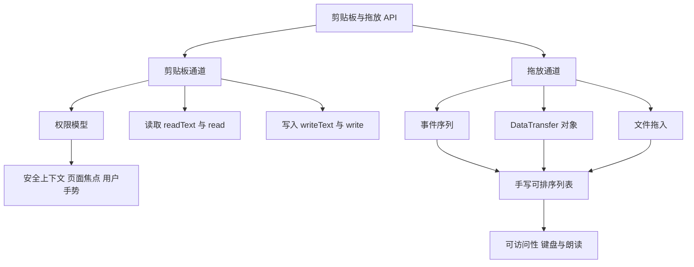
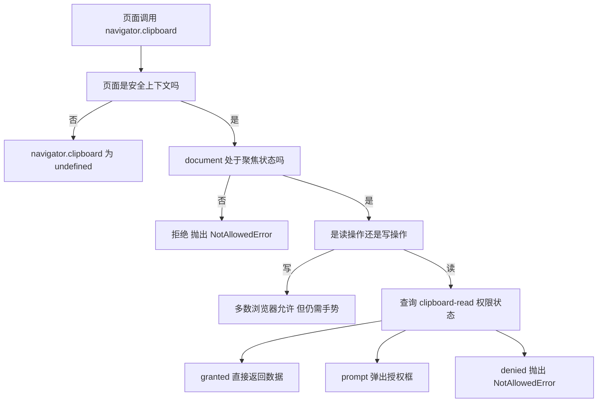
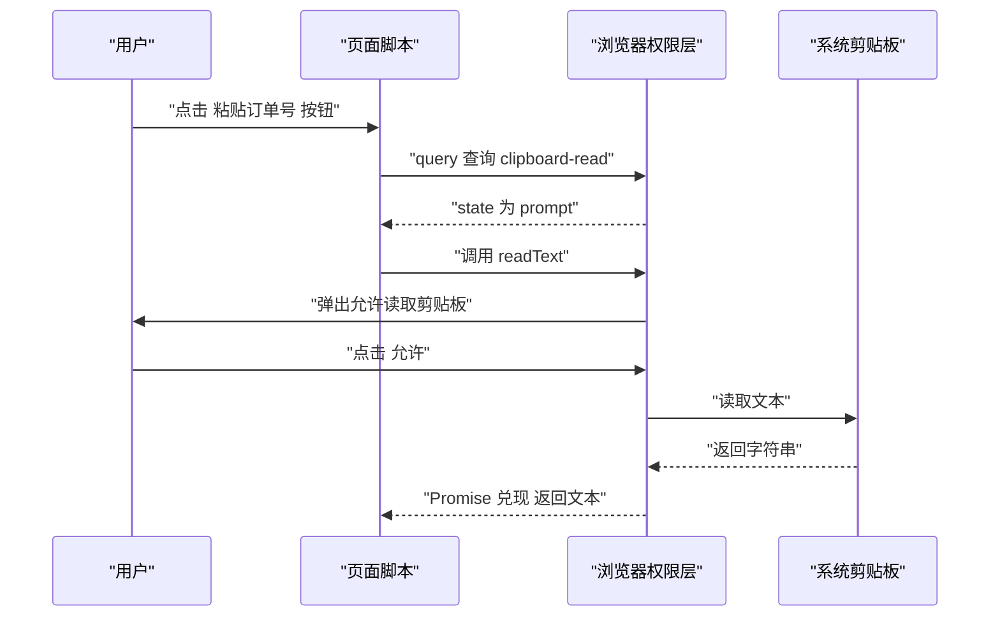
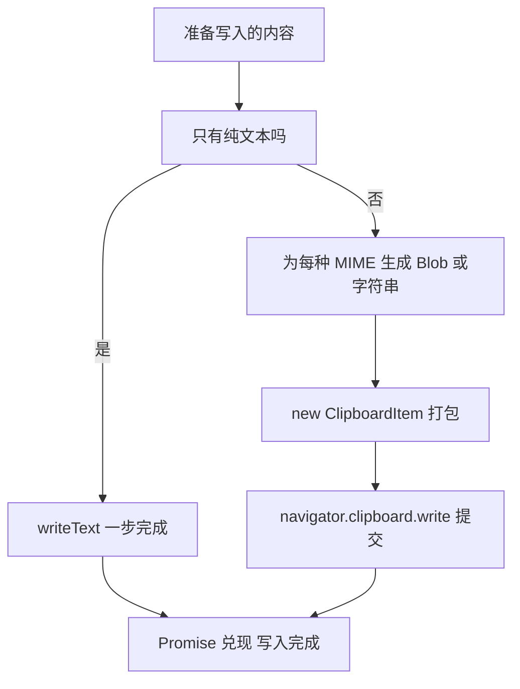
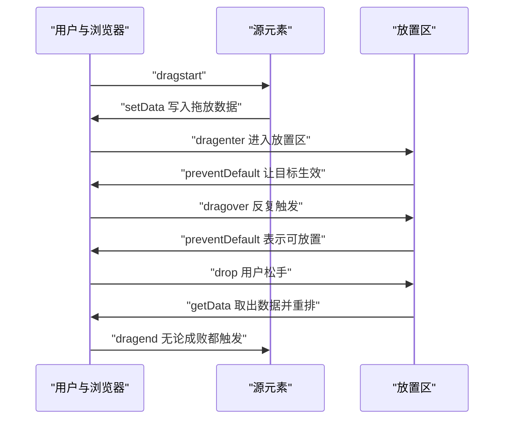
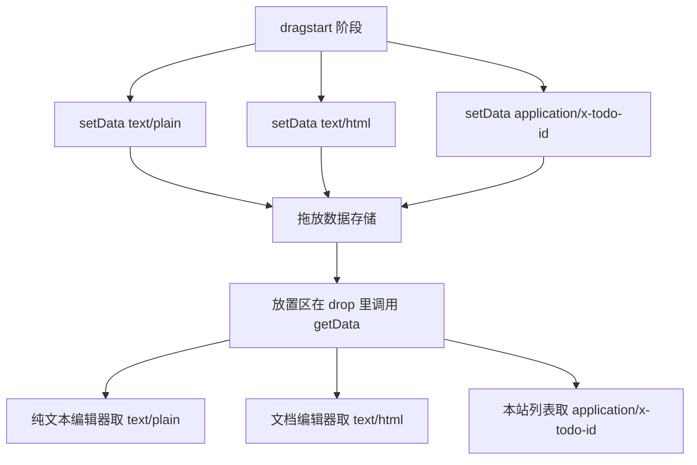
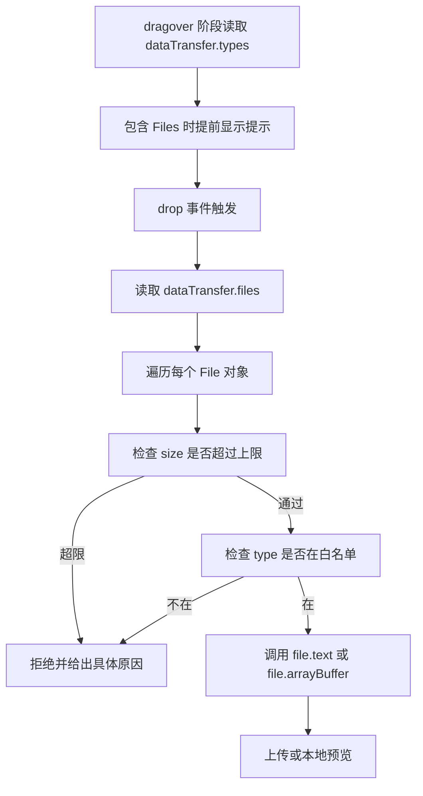
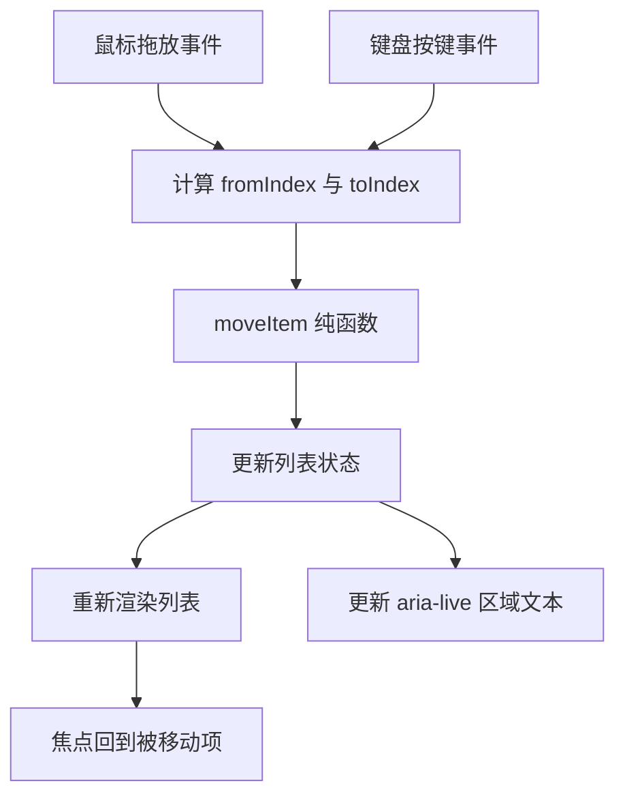

# 剪贴板与拖放 API

!!! abstract "学完这一页你能"
    - 说出剪贴板读写在安全上下文、页面焦点、用户手势三道闸门下的判定顺序，并解释 NotAllowedError 的来源。
    - 用 navigator.permissions.query 查询 clipboard-read 状态，并在用户手势内完成一次读取。
    - 按顺序写出 HTML 拖放的七个事件，并说明 dragover 里 preventDefault 的具体作用。
    - 手写一个同时支持鼠标拖放与键盘操作的排序列表，并用 aria-live 区域播报结果。

## 0. 知识地图



建议从第 1 节读到第 7 节，因为拖放的可排序列表会把前面所有概念串起来。读第 1 到第 3 节时，把剪贴板当成一个需要授权的外部设备；读第 4 到第 6 节时，把拖放当成一串有固定顺序的事件。第 7 节是综合练习，建议先自己写一遍再看参考实现。

## 1. 剪贴板权限模型与用户手势

**先想一个问题**：用户在 HTTPS 页面点"复制邀请链接"，控制台抛出 NotAllowedError。同一段代码在本地 localhost 却能跑通，差别在哪里？

**心智模型**：

!!! tip "心智模型"
    一句话模型：剪贴板是操作系统级共享资源，浏览器用三道闸门控制访问，分别是安全上下文、页面焦点、用户手势。
    日常类比：像去公司前台借钥匙，你得先在公司里（安全上下文），前台能看见你（页面焦点），还要你亲口开口（用户手势）。
    类比不成立：前台只认一次请求就长期有效，浏览器的读权限通常是每次都要用户确认，写的闸门比读少一道。

!!! note "术语：安全上下文"
    安全上下文（Secure Context）指浏览器认定可以暴露敏感 API 的页面环境。例子：https 页面、http 协议的 localhost 页面属于安全上下文，普通 http 页面不属于。

**图解**：



1. 浏览器先看页面协议，非安全上下文直接不提供 navigator.clipboard。
2. 安全上下文才暴露 ClipBoard 接口对象。
3. 调用时再检查 document 是否处于聚焦状态，失焦就拒绝。
4. 接着区分读与写，两者判定条件不同。
5. 写操作多数浏览器只需要聚焦加用户手势。
6. 读操作要额外查询 clipboard-read 权限状态。
7. granted 直接返回，prompt 弹框，denied 抛出错误。

**一步一步来**：

**第 1 步：判断是否处于安全上下文**

```js
// 规则复刻：浏览器把 https、localhost、127.0.0.1 当作安全上下文
function isSecureContextLike(url) {
  // https 开头一律视为安全上下文
  if (url.startsWith('https://')) return true;
  // http 协议下的 localhost 被浏览器特殊放行
  if (url.startsWith('http://localhost')) return true;
  // http 协议下的 127.0.0.1 同样被放行
  if (url.startsWith('http://127.0.0.1')) return true;
  // 没有命中以上规则就返回 false
  return false;
}
```

**这段代码在做什么**：
- 函数名带 Like，提醒这只是规则复刻，不是浏览器实现。
- https 前缀判断放在最前面，覆盖绝大多数生产环境。
- localhost 与 127.0.0.1 单独列出，因为浏览器对它们特殊放行。
- file 协议没有写死，避免给出没有把握的结论。
- 返回值是布尔值，方便下一步与其他条件组合。

**第 2 步：把三道闸门组合成决策函数**

```js
// 决策函数：输入环境事实，输出是否允许以及具体原因
function decideClipboardAccess({ secureContext, focused, userGesture, mode, permission }) {
  // 第一道闸门：非安全上下文拿不到接口
  if (!secureContext) return { allowed: false, reason: 'insecure-context' };
  // 第二道闸门：文档失焦时读写都会失败
  if (!focused) return { allowed: false, reason: 'document-not-focused' };
  // 写操作多数浏览器只要求聚焦加用户手势
  if (mode === 'write') {
    return userGesture
      ? { allowed: true, reason: 'ok' }
      : { allowed: false, reason: 'no-user-gesture' };
  }
  // 读操作先看权限状态，granted 直接放行
  if (permission === 'granted') return { allowed: true, reason: 'ok' };
  // prompt 表示会弹授权框，也算允许继续
  if (permission === 'prompt') return { allowed: true, reason: 'will-prompt' };
  // denied 表示用户已拒绝，不要再调用接口
  return { allowed: false, reason: 'permission-denied' };
}
```

**这段代码在做什么**：
- 参数对象把环境事实与操作模式分开，方便逐个组合测试。
- 三道闸门按顺序短路，命中一条就立刻返回。
- 读与写走不同分支，因为判定条件不同。
- 返回值带 reason 字段，方便在界面上给出具体提示。
- will-prompt 也算允许，因为浏览器会自行弹框。

**第 3 步：用断言把行为固定下来**

```js
import assert from 'node:assert/strict';
// 用例 A：http 页面在第一道闸门就被拦截
assert.deepEqual(
  decideClipboardAccess({
    secureContext: false, focused: true, userGesture: true,
    mode: 'read', permission: 'granted',
  }),
  { allowed: false, reason: 'insecure-context' }
);
// 用例 B：https 但文档失焦，写操作被拒绝
assert.equal(
  decideClipboardAccess({
    secureContext: true, focused: false, userGesture: true,
    mode: 'write', permission: 'granted',
  }).reason,
  'document-not-focused'
);
// 用例 C：权限为 denied 时读操作直接失败
assert.equal(
  decideClipboardAccess({
    secureContext: true, focused: true, userGesture: true,
    mode: 'read', permission: 'denied',
  }).reason,
  'permission-denied'
);
console.log('权限决策用例通过');
```

**这段代码在做什么**：
- deepEqual 比对完整对象，同时校验 allowed 与 reason。
- 后两个用例只关心 reason 字段，用 equal 断言。
- 三个用例分别覆盖第一道闸门、第二道闸门、读权限失败。
- 最后一行输出可读的通过信息，便于人工确认。

**运行结果**：

```text
权限决策用例通过
```

**动手验证**：

```js
// 文件：clipboard-permission.mjs
// 运行：node clipboard-permission.mjs
// 依赖：仅 Node 20 内置模块 node:assert
import assert from 'node:assert/strict';

// 规则复刻：判断某个地址是否属于安全上下文
function isSecureContextLike(url) {
  if (url.startsWith('https://')) return true;
  if (url.startsWith('http://localhost')) return true;
  if (url.startsWith('http://127.0.0.1')) return true;
  return false;
}

// 决策函数：三道闸门依次判断
function decideClipboardAccess({ secureContext, focused, userGesture, mode, permission }) {
  if (!secureContext) return { allowed: false, reason: 'insecure-context' };
  if (!focused) return { allowed: false, reason: 'document-not-focused' };
  if (mode === 'write') {
    return userGesture
      ? { allowed: true, reason: 'ok' }
      : { allowed: false, reason: 'no-user-gesture' };
  }
  if (permission === 'granted') return { allowed: true, reason: 'ok' };
  if (permission === 'prompt') return { allowed: true, reason: 'will-prompt' };
  return { allowed: false, reason: 'permission-denied' };
}

// 断言一：https、localhost、127.0.0.1 都是安全上下文
assert.equal(isSecureContextLike('https://example.com/app'), true);
assert.equal(isSecureContextLike('http://localhost:5173'), true);
assert.equal(isSecureContextLike('http://127.0.0.1:8080'), true);
assert.equal(isSecureContextLike('http://example.com/app'), false);

// 断言二：http 页面在第一道闸门被拦截
assert.deepEqual(
  decideClipboardAccess({
    secureContext: false, focused: true, userGesture: true,
    mode: 'read', permission: 'granted',
  }),
  { allowed: false, reason: 'insecure-context' }
);

// 断言三：失焦时读写都失败
assert.equal(
  decideClipboardAccess({
    secureContext: true, focused: false, userGesture: true,
    mode: 'write', permission: 'granted',
  }).reason,
  'document-not-focused'
);

// 断言四：写操作缺少用户手势时失败
assert.equal(
  decideClipboardAccess({
    secureContext: true, focused: true, userGesture: false,
    mode: 'write', permission: 'granted',
  }).reason,
  'no-user-gesture'
);

// 断言五：读操作权限为 prompt 时允许继续
assert.deepEqual(
  decideClipboardAccess({
    secureContext: true, focused: true, userGesture: true,
    mode: 'read', permission: 'prompt',
  }),
  { allowed: true, reason: 'will-prompt' }
);

// 断言六：读操作权限为 denied 时直接失败
assert.equal(
  decideClipboardAccess({
    secureContext: true, focused: true, userGesture: true,
    mode: 'read', permission: 'denied',
  }).reason,
  'permission-denied'
);

console.log('clipboard-permission.mjs 全部断言通过');
```

**运行结果**：

```text
clipboard-permission.mjs 全部断言通过
```

**常见坑**：

| 现象 | 原因 | 怎么修 |
| --- | --- | --- |
| 调用 navigator.clipboard 报 TypeError，提示 undefined | 页面不是安全上下文，浏览器没有暴露该对象 | 部署到 https，本地调试改用 http://localhost |
| 在 setTimeout 里复制失败 | 用户手势有存活时间，异步回调时已经过期 | 把 writeText 调用放进 click 处理器的同步段 |
| 点击按钮无反应且抛 NotAllowedError | document 失去焦点，比如焦点在开发者工具里 | 调用前检查 document.hasFocus()，失焦时先 focus 页面 |
| 读取剪贴板每次都弹授权框 | clipboard-read 权限状态是 prompt | 先用 permissions.query 看状态，再决定按钮文案 |

**小结**：
- 剪贴板的判定顺序是安全上下文、页面焦点、用户手势，读操作多一道权限查询。
- navigator.clipboard 只在安全上下文存在，http 页面连对象都拿不到。
- 把决策逻辑抽成纯函数后，可以用 node:assert 覆盖每条分支。

## 2. 读取剪贴板与权限查询

**先想一个问题**：用户要从截图里把订单号复制进搜索框，页面希望在点击"粘贴订单号"后读出来并校验格式。直接调 readText 会怎样？

**心智模型**：

!!! tip "心智模型"
    一句话模型：读取分两步，先用 navigator.permissions.query 看权限状态，再在用户手势里调用 readText。
    日常类比：像去医院取报告，先查窗口状态（权限状态），再凭单子（用户手势）领取。
    类比不成立：医院查一次就长期有效，浏览器的读权限多数情况下每次读取都要用户当面确认。

!!! note "术语：PermissionStatus"
    PermissionStatus 是 Permissions API 返回的对象，描述某项权限的当前状态。例子：state 取值为 granted、prompt、denied 三者之一。

**图解**：



1. 用户点击按钮，事件处理器开始执行。
2. 脚本先用 permissions.query 查询 clipboard-read。
3. 浏览器返回 state，本例是 prompt。
4. 脚本接着调用 readText，这次调用仍在用户手势的有效期内。
5. 浏览器弹出授权框，用户在界面上点允许。
6. 浏览器从系统剪贴板取到文本。
7. Promise 兑现，脚本拿到字符串做后续校验。

**一步一步来**：

**第 1 步：把权限状态映射成界面文案**

```js
// 把 PermissionStatus.state 转成给用户看的提示语
function describePermission(state) {
  // granted 表示无需再询问用户
  if (state === 'granted') return '可直接读取剪贴板';
  // prompt 表示调用时会弹出授权框
  if (state === 'prompt') return '点击按钮时会请求授权';
  // denied 表示用户已拒绝，按钮应引导去浏览器设置
  if (state === 'denied') return '已被拒绝，请在浏览器设置里开启';
  // 其他取值不做猜测，直接抛出便于定位问题
  throw new Error(`未知的权限状态: ${state}`);
}
```

**这段代码在做什么**：
- 入参是 PermissionStatus.state 的三个标准取值。
- 每个分支返回一句可以直接渲染的中文文案。
- denied 分支提示用户去浏览器设置，而不是反复重试。
- 未知取值直接抛错，避免悄悄显示错误提示。

**第 2 步：读取文本并校验订单号格式**

```js
// 订单号规则：两个大写字母加十位数字
const ORDER_PATTERN = /^[A-Z]{2}\d{10}$/;

// 从剪贴板文本里提取订单号
function parseOrderText(raw) {
  // 去掉首尾空白，复制时经常带进换行或空格
  const text = raw.trim();
  // 空字符串单独给出 reason，UI 可以提示用户先复制
  if (text === '') return { ok: false, reason: 'empty' };
  // 格式不符时不回填输入框，避免污染用户输入
  if (!ORDER_PATTERN.test(text)) return { ok: false, reason: 'format' };
  // 命中规则时返回规范化后的值
  return { ok: true, value: text };
}
```

**这段代码在做什么**：
- 正则要求开头两个大写字母，后面紧跟十位数字。
- trim 处理复制时附带的换行，这是最常见的脏数据来源。
- 空字符串与格式错误用不同 reason 区分。
- 成功时返回 value，调用方直接写入输入框。

**动手验证**：

```js
// 文件：clipboard-read.mjs
// 运行：node clipboard-read.mjs
// 依赖：仅 Node 20 内置模块 node:assert
import assert from 'node:assert/strict';

// 权限状态到文案的映射
function describePermission(state) {
  if (state === 'granted') return '可直接读取剪贴板';
  if (state === 'prompt') return '点击按钮时会请求授权';
  if (state === 'denied') return '已被拒绝，请在浏览器设置里开启';
  throw new Error(`未知的权限状态: ${state}`);
}

// 订单号规则
const ORDER_PATTERN = /^[A-Z]{2}\d{10}$/;

// 解析剪贴板文本
function parseOrderText(raw) {
  const text = raw.trim();
  if (text === '') return { ok: false, reason: 'empty' };
  if (!ORDER_PATTERN.test(text)) return { ok: false, reason: 'format' };
  return { ok: true, value: text };
}

// 断言一：三种权限状态各有对应文案
assert.equal(describePermission('granted'), '可直接读取剪贴板');
assert.equal(describePermission('prompt'), '点击按钮时会请求授权');
assert.equal(describePermission('denied'), '已被拒绝，请在浏览器设置里开启');

// 断言二：未知状态抛出异常
assert.throws(() => describePermission('unknown'), /未知的权限状态/);

// 断言三：带换行的合法订单号可以被识别
assert.deepEqual(parseOrderText('  AB1234567890\n'), { ok: true, value: 'AB1234567890' });

// 断言四：空字符串与格式错误分别给出不同 reason
assert.deepEqual(parseOrderText('   '), { ok: false, reason: 'empty' });
assert.deepEqual(parseOrderText('ab1234567890'), { ok: false, reason: 'format' });

console.log('clipboard-read.mjs 全部断言通过');
```

**运行结果**：

```text
clipboard-read.mjs 全部断言通过
```

**常见坑**：

| 现象 | 原因 | 怎么修 |
| --- | --- | --- |
| readText 返回的字符串带换行 | 复制来源本身带换行符 | 读取后先调用 trim 再校验 |
| 页面一加载就查询权限，控制台报错 | 权限查询也要在安全上下文与聚焦状态下进行 | 把查询放进 click 处理器或页面聚焦之后 |
| 用户点"拒绝"后按钮一直转圈 | 没有处理 denied 分支 | 把 denied 映射成引导文案并禁用按钮 |
| 在 iframe 里读取失败 | 权限策略限制了 clipboard-read | 需要核对官方文档：Permissions Policy 中 clipboard-read 的页面配置 |

**小结**：
- 先用 permissions.query 看状态，再在用户手势内调用 readText。
- 剪贴板返回的文本必须先 trim 再校验，换行是最常见的脏数据。
- 把权限状态映射成文案，用户才知道下一步该做什么。

## 3. 写入剪贴板与 ClipboardItem

**先想一个问题**：页面要复制一段带加粗的文字，粘贴到文档编辑器里要保留格式。只用 writeText 够吗？

**心智模型**：

!!! tip "心智模型"
    一句话模型：writeText 只寄一份纯文本包裹，write 可以同时寄多份不同格式的包裹，由接收方挑选。
    日常类比：像寄快递时同时放进纸质单与电子单，收件方按自己能读的那一份处理。
    类比不成立：快递包裹内容固定，剪贴板里的多份格式由浏览器写入系统剪贴板的格式能力决定，部分格式会被丢弃。

!!! note "术语：MIME 类型"
    MIME 类型是数据的格式标识，形如 type/subtype。例子：text/plain 表示纯文本，text/html 表示 HTML 片段，image/png 表示 PNG 图片。

**图解**：



1. 先判断待写入内容是否只有纯文本。
2. 只有纯文本时用 writeText，代码量最小。
3. 需要多格式时，为每种 MIME 准备一份数据。
4. 用 ClipboardItem 构造函数把多份数据打包成一个对象。
5. 把数组形式的 ClipboardItem 交给 navigator.clipboard.write。
6. 两条路径最终都返回 Promise，兑现时表示写入完成。

**一步一步来**：

**第 1 步：为一份富文本生成写入计划**

```js
// 输入内容，输出要写入的 MIME 到数据的映射
function buildClipboardPlan(content) {
  // 纯文本是所有接收方都能用的兜底格式
  const plan = { 'text/plain': content.text };
  // 只有提供了 HTML 才加入 text/html 这一格
  if (content.html) plan['text/html'] = content.html;
  // 只有提供了图片 Blob 才加入 image/png 这一格
  if (content.imageBlob) plan['image/png'] = content.imageBlob;
  // 返回按插入顺序排列的对象，便于断言比较
  return plan;
}
```

**这段代码在做什么**：
- text/plain 无条件写入，保证接收方至少拿到纯文本。
- text/html 与 image/png 都是可选项，缺失时跳过。
- 返回普通对象，键是 MIME 类型，值是字符串或 Blob。
- 按插入顺序返回，断言时可以直接比较键的次序。

**第 2 步：模拟接收方挑选格式**

```js
// 接收方按自己的偏好顺序，从可用格式里挑第一个命中的
function pickBestFormat(availableTypes, preference) {
  // 逐个检查偏好列表，命中即返回
  for (const type of preference) {
    if (availableTypes.includes(type)) return type;
  }
  // 一个都不命中时返回 null，调用方据此提示不支持
  return null;
}
```

**这段代码在做什么**：
- availableTypes 代表剪贴板里实际存在的格式。
- preference 代表接收方从高到低的偏好顺序。
- 命中第一项就返回，符合偏好优先的语义。
- 全部落空时返回 null，调用方不会拿到 undefined。

**动手验证**：

```js
// 文件：clipboard-write.mjs
// 运行：node clipboard-write.mjs
// 依赖：仅 Node 20 内置模块 node:assert
import assert from 'node:assert/strict';

// 生成写入计划
function buildClipboardPlan(content) {
  const plan = { 'text/plain': content.text };
  if (content.html) plan['text/html'] = content.html;
  if (content.imageBlob) plan['image/png'] = content.imageBlob;
  return plan;
}

// 按偏好挑格式
function pickBestFormat(availableTypes, preference) {
  for (const type of preference) {
    if (availableTypes.includes(type)) return type;
  }
  return null;
}

// 断言一：只有纯文本时计划里只有一个键
assert.deepEqual(
  buildClipboardPlan({ text: 'hello' }),
  { 'text/plain': 'hello' }
);

// 断言二：提供 HTML 后计划里出现两个键，且顺序固定
assert.deepEqual(
  Object.keys(buildClipboardPlan({ text: 'hello', html: '<b>hello</b>' })),
  ['text/plain', 'text/html']
);

// 断言三：提供图片 Blob 后 image/png 排在最后
const fakeBlob = { size: 8, type: 'image/png' };
assert.deepEqual(
  Object.keys(buildClipboardPlan({ text: 'hello', html: '<b>hello</b>', imageBlob: fakeBlob })),
  ['text/plain', 'text/html', 'image/png']
);

// 断言四：文档编辑器优先取 text/html
assert.equal(
  pickBestFormat(['text/plain', 'text/html'], ['text/html', 'text/plain']),
  'text/html'
);

// 断言五：纯文本编辑器只认 text/plain
assert.equal(
  pickBestFormat(['text/plain', 'text/html'], ['text/plain']),
  'text/plain'
);

// 断言六：接收方没有支持的格式时返回 null
assert.equal(
  pickBestFormat(['image/png'], ['text/html', 'text/plain']),
  null
);

console.log('clipboard-write.mjs 全部断言通过');
```

**运行结果**：

```text
clipboard-write.mjs 全部断言通过
```

**常见坑**：

| 现象 | 原因 | 怎么修 |
| --- | --- | --- |
| write 在 Safari 里抛 NotAllowedError | 需要在用户手势的同步阶段开始调用 | 把 write 调用放在 click 处理器的同步段，不要先 await 别的 Promise |
| ClipboardItem 构造报类型错误 | 传入了对象或数组这类不被支持的值 | 值只放字符串或 Blob，其他内容先序列化成字符串 |
| 粘贴到文档编辑器只有纯文本 | 没有写入 text/html，或浏览器不支持该格式 | 同时写入 text/plain 作为兜底，并对 HTML 做降级提示 |
| 复制图片失败 | 浏览器对可写入的图片格式支持不同 | 需要核对官方文档：各浏览器对 image/png 与 image/jpeg 的写入支持 |

**小结**：
- 只有纯文本用 writeText，多格式用 ClipboardItem 加 write。
- text/plain 应当始终写入，作为所有接收方的兜底。
- write 通常要在用户手势的同步阶段发起，先 await 其他 Promise 会丢失手势。

## 4. 拖放事件序列

**先想一个问题**：用户把卡片从一个列表拖到另一个列表，中途松手在空白处，卡片应当回到原位。这个"回到原位"由哪个事件决定？

**心智模型**：

!!! tip "心智模型"
    一句话模型：拖放是一串有固定顺序的事件，源元素负责放数据，放置区负责举手示意可以接收。
    日常类比：像接力赛，每一站都要举手（调用 preventDefault）才被允许接棒，drop 就是交接动作。
    类比不成立：接力赛每一站都会接棒，拖放里 drop 只在放置区举手后才触发，dragend 则无论成败都触发。

!!! note "术语：拖放数据存储"
    拖放数据存储（drag data store）是浏览器在拖拽期间保存数据的内部结构。例子：dragstart 里 setData 写入的内容，只能在 drop 阶段用 getData 读出。

**图解**：



1. 用户按住可拖拽元素并移动指针，源元素收到 dragstart。
2. 源元素在 dragstart 里用 setData 把数据写入拖放数据存储。
3. 指针进入放置区边界，放置区收到 dragenter。
4. 放置区在 dragenter 里调用 preventDefault，让自己成为候选目标。
5. 指针在放置区上移动时反复触发 dragover。
6. 放置区在 dragover 里调用 preventDefault，表示允许放下。
7. 用户松手触发 drop，放置区用 getData 取出数据。
8. 无论 drop 是否发生，源元素最后都会收到 dragend，用来清理样式。

**一步一步来**：

**第 1 步：用归约器描述合法的事件流转**

```js
// 创建初始拖拽状态
function createDragState() {
  return { phase: 'idle', data: null, dropAccepted: false };
}

// 事件归约器：输入旧状态与事件，返回新状态
function reduceDragEvent(state, event) {
  // dragstart 进入拖拽阶段并记录源数据
  if (event.type === 'dragstart') {
    return { ...state, phase: 'dragging', data: event.data };
  }
  // dragenter 表示进入放置区，尚未确认可放置
  if (event.type === 'dragenter') {
    return { ...state, phase: 'overTarget', dropAccepted: false };
  }
  // dragover 是否调用过 preventDefault 决定能否放下
  if (event.type === 'dragover') {
    return { ...state, phase: 'overTarget', dropAccepted: event.defaultPrevented };
  }
  // 只有 dropAccepted 为真时 drop 才被接受
  if (event.type === 'drop') {
    if (!state.dropAccepted) return { ...state, phase: 'dragging' };
    return { ...state, phase: 'dropped' };
  }
  // dragend 无论成功失败都会触发
  if (event.type === 'dragend') {
    return { ...state, phase: 'ended' };
  }
  return state;
}
```

**这段代码在做什么**：
- 状态里用 phase 记录当前阶段，便于断言。
- dropAccepted 由 dragover 事件的 defaultPrevented 决定。
- drop 分支先检查 dropAccepted，未举手时退回 dragging 阶段。
- dragend 独立处理，所以取消拖拽也有收尾动作。
- 未知事件原样返回，保证归约器不会崩。

**第 2 步：按顺序喂事件并断言阶段变化**

```js
import assert from 'node:assert/strict';
// 从初始状态开始，按真实顺序推进
let state = createDragState();
assert.equal(state.phase, 'idle');
// 源元素触发 dragstart
state = reduceDragEvent(state, { type: 'dragstart', data: 'card-3' });
assert.equal(state.phase, 'dragging');
assert.equal(state.data, 'card-3');
// 指针进入放置区，还没有举手
state = reduceDragEvent(state, { type: 'dragenter' });
assert.equal(state.dropAccepted, false);
// dragover 调用了 preventDefault，表示可放置
state = reduceDragEvent(state, { type: 'dragover', defaultPrevented: true });
assert.equal(state.dropAccepted, true);
```

**这段代码在做什么**：
- 每一步都把归约结果重新赋给同一个 state 变量，模拟事件流水。
- 断言 phase 从 idle 到 dragging 再到 overTarget。
- 断言 dragstart 携带的数据被保存在 state.data。
- 断言 dropAccepted 只在 dragover 的 defaultPrevented 为真时变 true。

**第 3 步：验证未举手时 drop 被忽略**

```js
// 重新走一遍，这次 dragover 没有调用 preventDefault
let rejected = createDragState();
rejected = reduceDragEvent(rejected, { type: 'dragstart', data: 'card-3' });
rejected = reduceDragEvent(rejected, { type: 'dragenter' });
rejected = reduceDragEvent(rejected, { type: 'dragover', defaultPrevented: false });
// 没有举手，dropAccepted 保持 false
assert.equal(rejected.dropAccepted, false);
// 此时即使收到 drop 也不进入 dropped 阶段
rejected = reduceDragEvent(rejected, { type: 'drop' });
assert.notEqual(rejected.phase, 'dropped');
// 最后一条 dragend 依然会到达，用于清理样式
rejected = reduceDragEvent(rejected, { type: 'dragend' });
assert.equal(rejected.phase, 'ended');
```

**这段代码在做什么**：
- 第二个场景模拟放置区忘记调用 preventDefault 的情况。
- 断言 dropAccepted 保持 false。
- 断言 drop 之后 phase 不是 dropped，说明数据没有被接收。
- 断言 dragend 依然到达，收尾逻辑不受影响。

**动手验证**：

```js
// 文件：drag-sequence.mjs
// 运行：node drag-sequence.mjs
// 依赖：仅 Node 20 内置模块 node:assert
import assert from 'node:assert/strict';

function createDragState() {
  return { phase: 'idle', data: null, dropAccepted: false };
}

function reduceDragEvent(state, event) {
  if (event.type === 'dragstart') {
    return { ...state, phase: 'dragging', data: event.data };
  }
  if (event.type === 'dragenter') {
    return { ...state, phase: 'overTarget', dropAccepted: false };
  }
  if (event.type === 'dragover') {
    return { ...state, phase: 'overTarget', dropAccepted: event.defaultPrevented };
  }
  if (event.type === 'drop') {
    if (!state.dropAccepted) return { ...state, phase: 'dragging' };
    return { ...state, phase: 'dropped' };
  }
  if (event.type === 'dragend') {
    return { ...state, phase: 'ended' };
  }
  return state;
}

// 场景一：放置区举手，drop 被接受
let accepted = createDragState();
assert.equal(accepted.phase, 'idle');
accepted = reduceDragEvent(accepted, { type: 'dragstart', data: 'card-3' });
assert.equal(accepted.phase, 'dragging');
assert.equal(accepted.data, 'card-3');
accepted = reduceDragEvent(accepted, { type: 'dragenter' });
assert.equal(accepted.dropAccepted, false);
accepted = reduceDragEvent(accepted, { type: 'dragover', defaultPrevented: true });
assert.equal(accepted.dropAccepted, true);
accepted = reduceDragEvent(accepted, { type: 'drop' });
assert.equal(accepted.phase, 'dropped');
accepted = reduceDragEvent(accepted, { type: 'dragend' });
assert.equal(accepted.phase, 'ended');

// 场景二：放置区没有举手，drop 被忽略但 dragend 仍到达
let ignored = createDragState();
ignored = reduceDragEvent(ignored, { type: 'dragstart', data: 'card-3' });
ignored = reduceDragEvent(ignored, { type: 'dragenter' });
ignored = reduceDragEvent(ignored, { type: 'dragover', defaultPrevented: false });
assert.equal(ignored.dropAccepted, false);
ignored = reduceDragEvent(ignored, { type: 'drop' });
assert.notEqual(ignored.phase, 'dropped');
ignored = reduceDragEvent(ignored, { type: 'dragend' });
assert.equal(ignored.phase, 'ended');

// 场景三：离开放置区后再进入，dropAccepted 需要重新举手
let reenter = createDragState();
reenter = reduceDragEvent(reenter, { type: 'dragstart', data: 'card-3' });
reenter = reduceDragEvent(reenter, { type: 'dragenter' });
reenter = reduceDragEvent(reenter, { type: 'dragover', defaultPrevented: true });
assert.equal(reenter.dropAccepted, true);
reenter = reduceDragEvent(reenter, { type: 'dragenter' });
assert.equal(reenter.dropAccepted, false);

console.log('drag-sequence.mjs 全部断言通过');
```

**运行结果**：

```text
drag-sequence.mjs 全部断言通过
```

**常见坑**：

| 现象 | 原因 | 怎么修 |
| --- | --- | --- |
| 放置区一直不触发 drop | dragover 里没有调用 preventDefault | 在 dragover 处理器第一行调用 event.preventDefault() |
| 第二次进入放置区时 drop 又失效 | dragenter 重置了状态但没重新举手 | dragenter 与 dragover 都调用 preventDefault |
| 拖拽结束源元素样式没恢复 | 只处理了 drop，没有处理取消的情况 | 把样式清理放进 dragend 处理器 |
| 放置区内的子元素导致 dragover 反复触发 | 指针在子元素之间移动，事件冒泡 | 用 dragenter 与 dragleave 计数，或用 CSS 让子元素 pointer-events 为 none |

**小结**：
- 完整序列是 dragstart、dragenter、dragover、drop、dragend，外加 dragleave。
- drop 是否触发取决于 dragover 是否调用 preventDefault。
- 清理工作必须放在 dragend，因为取消拖拽时不会触发 drop。

## 5. DataTransfer 与拖放数据协商

**先想一个问题**：同一个拖拽动作，拖到纯文本编辑器里得到文字，拖到文档编辑器里得到带格式的片段，浏览器怎么同时满足两个接收方？

**心智模型**：

!!! tip "心智模型"
    一句话模型：DataTransfer 是一个多格储物盒，每一格放一种 MIME 类型的数据，接收方按自己的偏好挑一格。
    日常类比：像自助餐托盘，每道菜占一个格子，取餐的人只夹自己吃的那几格。
    类比不成立：托盘里的菜一直都看得见，拖放数据在 dragenter 与 dragover 阶段处于受保护状态，getData 会返回空字符串。

!!! note "术语：DataTransfer"
    DataTransfer 是拖放事件对象上的属性，保存这次拖拽的数据与效果设置。例子：dragstart 里 dataTransfer.setData('text/plain', 'hello') 写入一格数据。

**图解**：



1. dragstart 阶段源元素可以多次调用 setData，每次写入一种 MIME 类型。
2. 三份数据同时进入浏览器内部的拖放数据存储。
3. 数据存储对页面脚本是只读的，写入只发生在 dragstart。
4. 放置区在 drop 阶段调用 getData 取数据。
5. getData 只返回被请求的那一格，其他格不返回。
6. 接收方各自请求自己支持的格式，因此同一个拖拽会有不同结果。

**一步一步来**：

**第 1 步：按优先级挑选格式**

```js
// 从可用格式里按偏好顺序挑第一个命中的
function chooseFormat(types, preference) {
  // 逐个检查偏好列表
  for (const type of preference) {
    // includes 判断该格式是否在可用列表里
    if (types.includes(type)) return type;
  }
  // 全部落空时返回 null
  return null;
}
```

**这段代码在做什么**：
- types 代表拖放数据里实际存在的格式列表。
- preference 代表接收方从高到低的偏好顺序。
- 返回命中的第一个格式名，调用方据此决定解析方式。
- 没有命中时返回 null，不会误用其他格式。

**第 2 步：协商 dropEffect 与 effectAllowed**

```js
// effectAllowed 到允许效果的展开表
const ALLOWED_BY_EFFECT = {
  none: [],
  copy: ['copy'],
  move: ['move'],
  link: ['link'],
  copyMove: ['copy', 'move'],
  copyLink: ['copy', 'link'],
  linkMove: ['link', 'move'],
  all: ['copy', 'move', 'link'],
};

// 协商放置效果：请求值必须在允许集合里
function resolveDropEffect(effectAllowed, requested) {
  // 取不到时按空数组处理，避免抛错
  const allowed = ALLOWED_BY_EFFECT[effectAllowed] ?? [];
  // 请求值在允许集合里就直接采用
  if (allowed.includes(requested)) return requested;
  // 否则退回允许集合的第一项
  if (allowed.length > 0) return allowed[0];
  // 完全没有允许项时返回 none
  return 'none';
}
```

**这段代码在做什么**：
- 展开表把 effectAllowed 的八个取值映射成允许的效果数组。
- ?? 处理未知取值，取不到时用空数组兜底。
- 请求值合法就采用，非法时退回第一个允许项。
- 没有任何允许项时返回 none，表示禁止放下。

**动手验证**：

```js
// 文件：data-transfer.mjs
// 运行：node data-transfer.mjs
// 依赖：仅 Node 20 内置模块 node:assert
import assert from 'node:assert/strict';

function chooseFormat(types, preference) {
  for (const type of preference) {
    if (types.includes(type)) return type;
  }
  return null;
}

const ALLOWED_BY_EFFECT = {
  none: [],
  copy: ['copy'],
  move: ['move'],
  link: ['link'],
  copyMove: ['copy', 'move'],
  copyLink: ['copy', 'link'],
  linkMove: ['link', 'move'],
  all: ['copy', 'move', 'link'],
};

function resolveDropEffect(effectAllowed, requested) {
  const allowed = ALLOWED_BY_EFFECT[effectAllowed] ?? [];
  if (allowed.includes(requested)) return requested;
  if (allowed.length > 0) return allowed[0];
  return 'none';
}

// 断言一：本站列表优先取自定义格式
const types = ['text/plain', 'text/html', 'application/x-todo-id'];
assert.equal(
  chooseFormat(types, ['application/x-todo-id', 'text/plain']),
  'application/x-todo-id'
);

// 断言二：文档编辑器取 text/html
assert.equal(chooseFormat(types, ['text/html', 'text/plain']), 'text/html');

// 断言三：接收方只支持图片时返回 null，调用方据此拒绝放下
assert.equal(chooseFormat(types, ['image/png']), null);

// 断言四：copyMove 允许 copy 与 move
assert.equal(resolveDropEffect('copyMove', 'copy'), 'copy');
assert.equal(resolveDropEffect('copyMove', 'move'), 'move');

// 断言五：copyMove 不允许 link，退回第一个允许项 copy
assert.equal(resolveDropEffect('copyMove', 'link'), 'copy');

// 断言六：none 不允许任何效果
assert.equal(resolveDropEffect('none', 'copy'), 'none');

// 断言七：未知的 effectAllowed 不会抛错
assert.equal(resolveDropEffect('unknown-effect', 'copy'), 'none');

console.log('data-transfer.mjs 全部断言通过');
```

**运行结果**：

```text
data-transfer.mjs 全部断言通过
```

**常见坑**：

| 现象 | 原因 | 怎么修 |
| --- | --- | --- |
| dragenter 里 getData 返回空字符串 | 受保护模式，只有 drop 阶段可以读数据 | 在 dragenter 与 dragover 里改用 dataTransfer.types 判断 |
| 自定义格式在别的域名读不到 | 跨源拖拽只允许读取 text/plain 与 text/uri-list | 需要核对官方文档：HTML 标准 拖放 章节中跨源数据的读取限制 |
| dropEffect 设了但光标没变化 | 请求值与 effectAllowed 不兼容，被浏览器忽略 | 在 dragstart 设置 effectAllowed，在 dragover 设置兼容的 dropEffect |
| types 里出现小写与自定义类型混杂 | 自定义类型没有加 application/x- 前缀 | 自定义类型统一写成 application/x- 加应用名 |

**小结**：
- DataTransfer 同时保存多种 MIME 类型的数据，接收方按偏好挑选。
- 受保护模式下，dragenter 与 dragover 阶段只能看 types，不能读数据。
- effectAllowed 在 dragstart 设置，dropEffect 在 dragover 设置，两者必须兼容。

## 6. 文件拖入与文件校验

**先想一个问题**：用户把 300 MB 的视频拖进上传区，页面等了五秒才弹提示。这段时间浪费在哪里？

**心智模型**：

!!! tip "心智模型"
    一句话模型：拖入的文件不会塞进事件对象，浏览器只给你一张取件码（File 对象），内容要用异步方法取。
    日常类比：像收快递只拿到取件码，包裹还在仓库，你得凭码去取。
    类比不成立：取件码取完就失效，File 对象可以多次读取，但每次读取都要重新发起一次异步操作。

!!! note "术语：File 与 Blob"
    File 是带文件名的 Blob 子类，表示一个具体文件。例子：file.name 给文件名，file.size 给字节数，file.text() 返回 Promise 字符串。

**图解**：



1. dragover 阶段先读 types，发现包含 Files 就可以提前提示"松开即可上传"。
2. 用户松手触发 drop，脚本读取 dataTransfer.files。
3. 逐个遍历 File 对象，先比大小，再比类型。
4. 任一项不通过就进拒绝列表，并记录具体原因。
5. 全部通过的文件才进入读取环节。
6. 用 file.text 或 file.arrayBuffer 异步取内容。
7. 取到内容后再上传，或者先在页面上做本地预览。

**一步一步来**：

**第 1 步：先写校验规则**

```js
// 上传规则：单文件上限与允许的 MIME 类型白名单
const UPLOAD_RULES = {
  // 单文件上限设为 5 兆字节
  maxBytes: 5 * 1024 * 1024,
  // 只接受三种类型
  allowedTypes: ['image/png', 'image/jpeg', 'application/pdf'],
};

// 校验一组文件，返回通过列表与拒绝列表
function validateFiles(files, rules) {
  const accepted = [];
  const rejected = [];
  for (const file of files) {
    // 大小超限时记录 too-large 并跳过后续检查
    if (file.size > rules.maxBytes) {
      rejected.push({ name: file.name, reason: 'too-large' });
      continue;
    }
    // 类型不在白名单时记录 type-not-allowed
    if (!rules.allowedTypes.includes(file.type)) {
      rejected.push({ name: file.name, reason: 'type-not-allowed' });
      continue;
    }
    accepted.push(file);
  }
  return { accepted, rejected };
}
```

**这段代码在做什么**：
- 规则集中在常量里，改上限只改一处。
- 遍历时用 continue 跳过后续检查，避免对同一文件报多个错。
- 拒绝项带 name 与 reason，界面可以逐条显示。
- 返回两个数组，调用方不需要再分拣。

**第 2 步：在 drop 之前给出提示**

```js
// 判断这次拖拽是否携带文件
function hasFiles(dragTypes) {
  // types 是字符串数组，包含 Files 表示有文件
  return dragTypes.includes('Files');
}

// dragover 处理器：携带文件时提前提示
function handleDragOver(event, setHint) {
  // 必须调用 preventDefault 才能接收 drop
  event.preventDefault();
  // 只有携带文件时才显示提示文案
  if (hasFiles(event.dataTransfer.types)) setHint('松开即可上传文件');
}
```

**这段代码在做什么**：
- hasFiles 只读 types，不在受保护模式下调用 getData。
- preventDefault 放在第一行，保证 drop 一定会触发。
- setHint 由调用方传入，便于在测试里替换成断言函数。
- 提前提示把等待时间从松手之后挪到松手之前。

**动手验证**：

```js
// 文件：file-drop.mjs
// 运行：node file-drop.mjs
// 依赖：仅 Node 20 内置模块 node:assert
import assert from 'node:assert/strict';

const UPLOAD_RULES = {
  maxBytes: 5 * 1024 * 1024,
  allowedTypes: ['image/png', 'image/jpeg', 'application/pdf'],
};

function validateFiles(files, rules) {
  const accepted = [];
  const rejected = [];
  for (const file of files) {
    if (file.size > rules.maxBytes) {
      rejected.push({ name: file.name, reason: 'too-large' });
      continue;
    }
    if (!rules.allowedTypes.includes(file.type)) {
      rejected.push({ name: file.name, reason: 'type-not-allowed' });
      continue;
    }
    accepted.push(file);
  }
  return { accepted, rejected };
}

function hasFiles(dragTypes) {
  return dragTypes.includes('Files');
}

function handleDragOver(event, setHint) {
  event.preventDefault();
  if (hasFiles(event.dataTransfer.types)) setHint('松开即可上传文件');
}

// 断言一：合法文件进入通过列表
const png = { name: 'a.png', size: 1024, type: 'image/png' };
assert.deepEqual(validateFiles([png], UPLOAD_RULES), { accepted: [png], rejected: [] });

// 断言二：超限文件进拒绝列表，原因明确
const huge = { name: 'b.png', size: 6 * 1024 * 1024, type: 'image/png' };
assert.deepEqual(validateFiles([huge], UPLOAD_RULES), {
  accepted: [],
  rejected: [{ name: 'b.png', reason: 'too-large' }],
});

// 断言三：类型不在白名单时原因不同
const exe = { name: 'c.exe', size: 100, type: 'application/x-msdownload' };
assert.deepEqual(validateFiles([exe], UPLOAD_RULES), {
  accepted: [],
  rejected: [{ name: 'c.exe', reason: 'type-not-allowed' }],
});

// 断言四：混合输入时正确分拣
const mixed = validateFiles([png, huge, exe], UPLOAD_RULES);
assert.equal(mixed.accepted.length, 1);
assert.equal(mixed.rejected.length, 2);

// 断言五：dragover 里 preventDefault 被调用，并显示提示
let prevented = false;
let hint = '';
handleDragOver(
  { preventDefault: () => { prevented = true; }, dataTransfer: { types: ['Files'] } },
  (text) => { hint = text; }
);
assert.equal(prevented, true);
assert.equal(hint, '松开即可上传文件');

// 断言六：没有文件时不显示提示
let textOnlyHint = '';
handleDragOver(
  { preventDefault: () => {}, dataTransfer: { types: ['text/plain'] } },
  (text) => { textOnlyHint = text; }
);
assert.equal(textOnlyHint, '');

console.log('file-drop.mjs 全部断言通过');
```

**运行结果**：

```text
file-drop.mjs 全部断言通过
```

**常见坑**：

| 现象 | 原因 | 怎么修 |
| --- | --- | --- |
| dragover 里 dataTransfer.files 为空 | 受保护模式，文件列表只在 drop 阶段填充 | dragenter 与 dragover 阶段改用 types 判断 |
| 用户一次拖入若干文件但只上传了一个 | 只取了 files[0] | 用 Array.from 转成数组后遍历 |
| 文件夹拖入被当成文件 | 文件夹本身也是一个 File 对象 | 需要核对官方文档：dataTransfer.items 的 webkitGetAsEntry 与 getAsFileSystemHandle 的浏览器支持 |
| 大文件把内存占满 | file.arrayBuffer 会把整个文件读进内存 | 大文件改用流式读取或直接作为请求体上传 |

**小结**：
- 拖入的文件通过 dataTransfer.files 获取，内容要用异步方法读取。
- 校验顺序是先比大小再比类型，拒绝时给出具体原因。
- dragover 阶段只能读 types，用它可以提前显示提示。

## 7. 可访问性与手写可排序列表

**先想一个问题**：只用鼠标拖拽的排序列表，键盘用户按 Tab 只能聚焦到整个列表，完全无法调整顺序。怎么补上这条路径？

**心智模型**：

!!! tip "心智模型"
    一句话模型：拖放只是输入方式，数据重排才是真正的事实；把重排抽成纯函数，鼠标与键盘都调用它。
    日常类比：像点菜，服务员用嘴报单还是用平板下单都行，厨房只认最终那张单子。
    类比不成立：厨房不会记错，读屏软件需要页面主动播报变化，否则用户不知道顺序已经改变。

!!! note "术语：ARIA live region"
    ARIA live region 是带 aria-live 属性的区域，内容变化时读屏软件会自动播报。例子：aria-live 取 polite 时，读屏在用户空闲时播报最新文本。

**图解**：



1. 鼠标路径由 drop 事件触发，键盘路径由 keydown 事件触发。
2. 两条路径都先把操作换算成源下标与目标下标。
3. 换算结果交给同一个 moveItem 纯函数处理。
4. 纯函数返回新数组，不修改旧数组。
5. 用新数组重新渲染列表。
6. 同时把变化写入 aria-live 区域，供读屏软件播报。
7. 渲染完成后把焦点放回被移动的那一项，键盘用户可以继续操作。

**一步一步来**：

**第 1 步：写与界面无关的重排纯函数**

```js
// 纯函数：把 fromIndex 处的元素移动到 toIndex
function moveItem(list, fromIndex, toIndex) {
  // 先复制一份，避免修改调用方的数组
  const next = list.slice();
  // 源下标越界时原样返回副本
  if (fromIndex < 0 || fromIndex >= next.length) return next;
  // 目标下标越界时原样返回副本
  if (toIndex < 0 || toIndex >= next.length) return next;
  // 原地移动没有意义，直接返回
  if (fromIndex === toIndex) return next;
  // splice 取出元素，再插入到目标位置
  const [moved] = next.splice(fromIndex, 1);
  next.splice(toIndex, 0, moved);
  return next;
}
```

**这段代码在做什么**：
- slice 复制数组，保证调用方的原数组不被修改。
- 两个越界判断都返回副本，函数不会抛错。
- fromIndex 与 toIndex 相同时也提前返回。
- splice 先删后插，得到目标顺序的数组。

**第 2 步：把按键换算成目标下标**

```js
// 根据按键算出移动目标的下标
function nextIndexForKey(key, index, length) {
  // 上移一位，但不低于 0
  if (key === 'ArrowUp') return Math.max(0, index - 1);
  // 下移一位，但不越过末尾
  if (key === 'ArrowDown') return Math.min(length - 1, index + 1);
  // Home 键移到首位
  if (key === 'Home') return 0;
  // End 键移到末位
  if (key === 'End') return length - 1;
  // 其他按键不改变位置
  return index;
}
```

**这段代码在做什么**：
- ArrowUp 与 ArrowDown 用 Math.max、Math.min 夹住边界。
- Home 与 End 直接给出首尾下标。
- 其他按键返回原下标，调用方据此判断是否需要重排。
- 函数不接触 DOM，可以在 Node 里直接测试。

**第 3 步：生成读屏播报文案**

```js
// 生成 aria-live 区域要显示的文案
function describeMove(itemLabel, position, total) {
  // 位置从 1 开始计数，符合人对序号的习惯
  return `${itemLabel} 已移动到第 ${position} 项，共 ${total} 项`;
}
```

**这段代码在做什么**：
- 文案里同时给出元素名称与新的序号。
- 序号从 1 开始，避免出现"第 0 项"。
- 总数一起播报，用户能判断是否到边界。
- 函数只拼字符串，方便被断言直接比较。

**动手验证**：

```js
// 文件：sortable-list.mjs
// 运行：node sortable-list.mjs
// 依赖：仅 Node 20 内置模块 node:assert
import assert from 'node:assert/strict';

function moveItem(list, fromIndex, toIndex) {
  const next = list.slice();
  if (fromIndex < 0 || fromIndex >= next.length) return next;
  if (toIndex < 0 || toIndex >= next.length) return next;
  if (fromIndex === toIndex) return next;
  const [moved] = next.splice(fromIndex, 1);
  next.splice(toIndex, 0, moved);
  return next;
}

function nextIndexForKey(key, index, length) {
  if (key === 'ArrowUp') return Math.max(0, index - 1);
  if (key === 'ArrowDown') return Math.min(length - 1, index + 1);
  if (key === 'Home') return 0;
  if (key === 'End') return length - 1;
  return index;
}

function describeMove(itemLabel, position, total) {
  return `${itemLabel} 已移动到第 ${position} 项，共 ${total} 项`;
}

// 断言一：向后移动，被移动项落在目标下标处
assert.deepEqual(moveItem(['a', 'b', 'c'], 0, 2), ['b', 'c', 'a']);

// 断言二：向前移动，其余项依次后移一位
assert.deepEqual(moveItem(['a', 'b', 'c'], 2, 0), ['c', 'a', 'b']);

// 断言三：纯函数不修改入参数组
const original = ['a', 'b', 'c'];
moveItem(original, 0, 2);
assert.deepEqual(original, ['a', 'b', 'c']);

// 断言四：越界与原地移动都返回内容相同的副本
assert.deepEqual(moveItem(['a', 'b'], 5, 0), ['a', 'b']);
assert.deepEqual(moveItem(['a', 'b'], 0, 1), ['b', 'a']);
assert.deepEqual(moveItem(['a', 'b'], 1, 1), ['a', 'b']);

// 断言五：键盘换算在边界处被夹住
const items = ['a', 'b', 'c'];
assert.equal(nextIndexForKey('ArrowUp', 0, items.length), 0);
assert.equal(nextIndexForKey('ArrowDown', 2, items.length), 2);
assert.equal(nextIndexForKey('Home', 2, items.length), 0);
assert.equal(nextIndexForKey('End', 0, items.length), 2);
assert.equal(nextIndexForKey('Enter', 1, items.length), 1);

// 断言六：键盘路径与鼠标路径产生相同的数组
const byKeyboard = moveItem(items, 0, nextIndexForKey('ArrowDown', 0, items.length));
const byDrop = moveItem(items, 0, 1);
assert.deepEqual(byKeyboard, byDrop);
assert.deepEqual(byKeyboard, ['b', 'a', 'c']);

// 断言七：播报文案包含名称、新位置与总数
assert.equal(describeMove('买牛奶', 2, 3), '买牛奶 已移动到第 2 项，共 3 项');

console.log('sortable-list.mjs 全部断言通过');
```

**运行结果**：

```text
sortable-list.mjs 全部断言通过
```

**常见坑**：

| 现象 | 原因 | 怎么修 |
| --- | --- | --- |
| 键盘用户无法调整顺序 | 列表只监听鼠标拖放事件 | 每项加 up 与 down 按钮，并监听 ArrowUp、ArrowDown、Home、End |
| 读屏软件不知道顺序变了 | 没有 live region，也没有焦点管理 | 加 aria-live 等于 polite 的区域，重排后把焦点放回被移动项 |
| 用 aria-grabbed 标记拖拽状态却无效果 | 该属性在 ARIA 1.1 中已废弃 | 需要核对官方文档：WAI-ARIA 1.2 中 aria-grabbed 与 aria-dropeffect 的废弃状态与替代方案 |
| 触摸设备上拖放不工作 | HTML 拖放 API 在触摸屏上的支持不完整 | 提供上下移动按钮作为所有输入方式的通用路径 |

**小结**：
- 把重排逻辑抽成纯函数，鼠标与键盘各自负责把操作换算成下标。
- 键盘路径至少支持上下移动，并在边界处夹住下标。
- 用 aria-live 区域播报变化，重排后把焦点放回被移动项。

## 综合对比

| 维度 | 剪贴板 API | HTML 拖放 API |
| --- | --- | --- |
| 触发条件 | 需要安全上下文、页面焦点、用户手势 | 需要 draggable 为 true，且拖拽动作由用户发起 |
| 权限模型 | Permissions API 查询 clipboard-read 与 clipboard-write | 没有独立权限，受同源策略与受保护模式限制 |
| 数据载体 | ClipboardItem 映射 MIME 到字符串或 Blob | DataTransfer 保存 types、items、files 与效果设置 |
| 一次操作的步骤数 | 通常一到两次调用，返回 Promise | 至少五个事件，需要逐站 preventDefault |
| 读取数据的时机 | 调用返回后即可读，读到的是系统剪贴板内容 | 只有 drop 阶段可读数据，dragenter 与 dragover 只能看 types |
| 文件支持 | read 可返回文件类型的剪贴板项，支持面需核对官方文档 | drop 阶段通过 dataTransfer.files 拿到 FileList |
| 键盘可访问性 | 按钮加点击即可，键盘天然可用 | 默认不可键盘操作，需要额外按钮与按键处理 |
| 取消方式 | 拒绝 Promise 或权限被拒 | dragend 触发，drop 不触发 |
| 典型失败原因 | 非安全上下文、失去焦点、缺少手势 | dragover 未调用 preventDefault |
| 测试方式 | 把权限判定抽成纯函数后可用 node:assert 覆盖 | 把事件序列抽成归约器后可用 node:assert 覆盖 |

## 应用与行业实践

### 应用场景地图

| 场景 | 用到本页哪个知识点 | 典型技术选型 | 注意事项 |
| --- | --- | --- | --- |
| 后台管理的万行表格里框选一块区域，粘到 Excel | 写入剪贴板与 ClipboardItem、数据协商 | `navigator.clipboard.write` 一次传 text/plain 与 text/html | text/html 的 table 结构决定 Excel 的单元格拆分；页面失焦时写入被拒 |
| 在线表格从 Excel 粘一列数字进来 | 读取剪贴板与权限查询、剪贴板事件 | 监听 `paste`，读 `clipboardData.getData('text/html')` | `getData` 只在 paste 事件回调内有效；返回空串表示没有该类型 |
| 多人协作白板拖入本地图片 | 文件拖入与文件校验、拖放事件序列 | `dragover` 里 preventDefault，`drop` 里读 `dataTransfer.files` | 触摸屏不触发 HTML 拖放，必须另配文件选择按钮 |
| 低端安卓机的富文本编辑器粘大图 | 文件拖入与文件校验、写入剪贴板 | 在 paste 里遍历 `clipboardData.items` 取 `type` 以 image/ 开头的项 | 大图解码占主线程，先看 `size` 再决定是否降采样 |
| 网盘网页版拖入整个文件夹 | DataTransfer 与拖放数据协商 | `dataTransfer.items[i].webkitGetAsEntry()` 递归遍历 | 需核对官方文档：`webkitGetAsEntry` 的标准化状态与 `getAsFileSystemHandle` 的支持情况 |
| 工单系统里用键盘调整优先级 | 可访问性与手写可排序列表 | 方向键处理 + `aria-live` 播报 + draggable 并存 | 键盘路径与拖放路径必须改写同一份数据模型 |
| 表单里一键填入短信验证码 | 剪贴板权限模型与用户手势、读取剪贴板 | 先 `permissions.query({name:'clipboard-read'})` 再 `readText()` | 结果是 prompt 时仍要在点击回调里读，否则抛 NotAllowedError |
| 把网页附件拖到桌面另存 | 拖放事件序列、DataTransfer | `dragstart` 里 `dataTransfer.setData('DownloadURL', ...)` | 需核对官方文档：DownloadURL 在目标浏览器与目标系统上的支持情况 |

### 三个场景拆解

#### 场景 1：后台管理表格框选复制到 Excel

**业务背景**：表格一屏放不下，运营要把选中区域贴进 Excel 再算。用鼠标逐格抄写的时间可以掐表测出来，行数就是接口返回数组的长度。

**怎么用本页知识解决**：先取选区坐标，把二维数组同时拼成 TSV 和 table，一次写入两个 MIME，让接收方自己挑。

```js
async function copyRange(rows, cols) {
  const cells = readSelection(rows, cols);        // 二维数组，顺序与屏幕一致
  const tsv = cells.map(r => r.join('\t')).join('\n');   // tab 分隔，纯文本接收方用
  const html = '<table>' + cells.map(r =>
    '<tr>' + r.map(c => `<td>${escapeHtml(c)}</td>`).join('') + '</tr>'
  ).join('') + '</table>';                        // Excel 按 table 结构还原单元格
  const item = new ClipboardItem({
    'text/plain': new Blob([tsv], { type: 'text/plain' }),
    'text/html': new Blob([html], { type: 'text/html' })
  });
  await navigator.clipboard.write([item]);        // 必须在用户手势的调用栈里发起
}
```

- 一次写两个 MIME，接收端按自己支持的类型取值，不用写两套复制按钮。
- `write` 要在 click 或 keydown 回调里调用，脱离手势会 reject 出 NotAllowedError。
- 单元格内容要转义，否则内部的 `<` 会被接收方当成标签解析。
- 写入前判断 `document.hasFocus()`，页面在后台时先提示用户切回来。

**怎么度量收益**：看两个数：一次复制“指针抬起”到“提示出现”的耗时，以及复制失败次数占比。用 `performance.mark` 与 `performance.measure` 打点，在 Chrome DevTools Performance 面板里对时间轴核对。

**什么时候不该用**：
- 目标只是一个纯文本输入框，没有接收 text/html 的对象，写 text/plain 就够。
- 单元格里是 `=SUM(A1:A9)` 这种文本，Excel 会当公式执行，需要先加前缀转义。
- 页面嵌在跨域 iframe 里且没有 clipboard-write 的 Permissions Policy，写入会被拒。

#### 场景 2：协作白板拖入本地图片

**业务背景**：一屏白板常有几十个图形对象，用户从文件管理器拖图进来时要立刻看到占位框。图片先按类型和体积两道闸门校验，不合格要说出原因。

**怎么用本页知识解决**：在 `dragover` 里放行拖放，在 `drop` 里取文件、校验、上传，上传成功再创建图形对象。

```js
board.addEventListener('dragover', (e) => {
  e.preventDefault();                   // 不调用它，drop 事件不会触发
  e.dataTransfer.dropEffect = 'copy';   // 光标显示为复制语义
});

board.addEventListener('drop', async (e) => {
  e.preventDefault();
  const files = [...e.dataTransfer.files];         // 只有 drop 里能读到文件内容
  const ok = files.filter(f =>
    f.type.startsWith('image/') && f.size <= 8 * 1024 * 1024);  // 类型与体积双闸门
  if (!ok.length) return showTip('只接收 8MB 以内的图片');
  for (const f of ok) {
    const { clientX, clientY } = e;               // 落点坐标，用来放占位框
    await upload(f).then(url => createShape({ clientX, clientY, url }));
  }
});
```

- `dragover` 里 preventDefault 是放开拖放的关键，缺这一行整个 drop 不会来。
- 拖放过程中 `dataTransfer.files` 处于受保护状态，内容留到 drop 里再读。
- `file.type` 由浏览器按扩展名推断，可以被改，服务端必须再校验一次。
- 校验失败要给出具体原因文本，静默忽略会让用户以为是页面卡住。
- 触摸屏上这套事件不触发，页面要同时提供文件选择入口。

**怎么度量收益**：指标是“drop 到占位框出现”的间隔，以及失败后占位框是否回滚。在 drop 回调首尾各打一个 `performance.mark`，用 `performance.measure` 读间隔，在 DevTools Performance 面板核对长任务。

**什么时候不该用**：
- 用户按 Ctrl+V 贴截图走的是 paste 事件，拖放监听拿不到剪贴板里的图。
- 拖进来的是文件夹时 `dataTransfer.files` 拿不到里面内容，要改走 entries 接口。
- 目标用户主要在平板上用触屏，HTML 拖放整体不触发，应改为文件选择加长按菜单。

#### 场景 3：键盘可操作的优先级排序列表

**业务背景**：工单列表要按优先级排，团队里有读屏用户，鼠标拖拽对他们不可用。列表长度就是当天未关闭工单的数量。

**怎么用本页知识解决**：拖放和键盘两条路径调用同一个 `move` 函数改同一份数组，改完把新顺序写进 aria-live 区域。

```js
function move(list, from, to) {
  const [node] = list.splice(from, 1);        // 先取出被移动项
  list.splice(to, 0, node);                   // 再插到新下标
  render(list);                               // 重排 DOM 并刷新 aria-posinset
  live.textContent = `已把第 ${from + 1} 项移到第 ${to + 1} 位`;  // 供读屏播报
}

onDragStart = (e, i) => { dragFrom = i; };
onDrop = (e, i) => { e.preventDefault(); move(items, dragFrom, i); };
onKeyDown = (e, i) => {                        // 键盘路径改的是同一份 items
  if (e.key === 'ArrowUp')   { e.preventDefault(); if (i > 0) move(items, i, i - 1); }
  if (e.key === 'ArrowDown') { e.preventDefault(); if (i < items.length - 1) move(items, i, i + 1); }
};
```

- 拖放与按键都走 `move`，两条路径不会出现顺序分叉。
- render 之后按新下标重写 `aria-posinset` 与 `aria-setsize`，读屏才报得出位置。
- aria-live 用 polite，连续按键时不会打断当前朗读。
- 处理方向键前调 preventDefault，阻止页面跟着滚动。
- render 会重建节点，必须手动把焦点还给被移动的那一项。

**怎么度量收益**：看“一次调整需要的按键次数”和“播报文案与最终顺序是否一致”。用 axe DevTools 或 Lighthouse 的 Accessibility 分类跑一遍，再开 NVDA 或 VoiceOver 手工走一次纯键盘路径。

**什么时候不该用**：
- 列表有几百项时，每次 render 重建 DOM 会丢滚动位置，应改成只移动被操作的那个节点。
- 只改一个优先级数值时，用带序号的输入框比整体重排代价低。
- 排序结果要落库时，先想清楚并发写入的合并规则，否则两人同时排会互相覆盖。

### 行业先进实践

**把剪贴板读取约束在用户手势内（出处：W3C Clipboard API and Events 规范 / web.dev《Unblocking clipboard access》）**
规范与这篇文章都说明：读取剪贴板要么由用户手势触发，要么先拿到权限。这样能挡住后台脚本静默读剪贴板的路径。借鉴做法是把 `readText` 的调用点收敛到按钮回调里，不要在页面加载时就调。

**用 Permissions API 的 clipboard-read 描述符做前置判断（出处：MDN Permissions API 文档）**
`navigator.permissions.query({name: 'clipboard-read'})` 返回 granted、prompt、denied 三种状态。项目可据此决定是直接读、先解释再读、还是隐藏按钮。需核对官方文档：`clipboard-write` 作为 query 描述符在各浏览器的支持情况。

**富文本编辑器按 MIME 类型协商粘贴内容（出处：开源项目 ProseMirror）**
它的 view 模块在 paste 时读 `clipboardData`，按编辑器 schema 把 HTML 或纯文本解析成文档节点。这样从 Excel、Word、网页复制过来的内容都能落到同一套结构上。借鉴做法是给每种可粘贴类型写一个显式解析分支，解析失败时降级为纯文本。

**用 effectAllowed 与 dropEffect 表达拖放语义（出处：MDN HTML Drag and Drop API）**
`dragstart` 里设 `effectAllowed`，`dragover` 里设 `dropEffect`，光标就会显示是复制还是移动。语义一致后用户能在放手前判断结果。借鉴做法是把这两个值和后端操作绑定，光标显示“移动”时后端就走删除加创建。

**为拖拽排序提供等价的键盘路径（出处：WAI-ARIA Authoring Practices Guide）**
APG 的要求是所有功能都能只用键盘完成，排序类组件要给方向键或快捷键。只做鼠标拖拽会让读屏用户完全用不了这个功能。借鉴做法是让键盘与拖放在代码里共用一个重排函数。

### 从学到用：落地路线

1. **试点**：先在后台管理里挑一个只读且能降级的入口（表格复制到 Excel），验收标准是复制失败时页面给出文字提示，且按钮在非安全上下文下隐藏。
2. **验证**：在同一入口上量耗时与失败率，验收标准是 DevTools Performance 面板里能看到 drop 或复制动作对应的 measure 打点，且无新增长任务告警。
3. **推广**：把剪贴板与拖放的封装收进公共模块，其他页面只调封装，验收标准是全仓没有第二处直接调用 `navigator.clipboard`。
4. **防回退**：把键盘路径与 aria-live 播报写进组件测试，验收标准是 CI 里能跑通一次纯键盘重排断言，且改动该组件必须同步更新测试。

### 动手作业

**目标**：做一个支持鼠标拖放、键盘方向键、触屏按钮三条路径的任务排序卡片列表，并在每次改动后播报新位置。

**步骤**：
1. 用一份 `items` 数组渲染列表，每项是 `{id, title}`，先不做任何交互。
2. 写 `move(list, from, to)` 函数，做数组的取出与插入，并重排 DOM。
3. 给每项加 `draggable="true"`，在 `dragstart` 记录下标，在 `dragover` 调 preventDefault，在 `drop` 调 `move`。
4. 给每项加 `tabindex="0"`，在 keydown 里处理 ArrowUp 与 ArrowDown，同样调用 `move`。
5. 每项补上上移、下移两个按钮，供触屏用户点击。
6. render 后重写 `aria-posinset` 与 `aria-setsize`，并把焦点还给被移动的项。
7. 加一个 `aria-live="polite"` 的隐藏区域，每次 `move` 后写入“已把第 X 项移到第 Y 位”。

**验收标准**：
- 只用 Tab 与方向键能把任意一项从队首移到队尾再移回，鼠标不做任何操作。
- 鼠标拖放与键盘按键得到的结果数组完全一致，可用同一份 id 序列断言。
- 关掉鼠标，开 NVDA 或 VoiceOver，每次调整后都能听到新的位置播报。
- 拖动过程中光标显示为移动语义，且拖到列表外部放手不会改动顺序。
- 在 Firefox、Chrome、Safari 各跑一遍，三条路径都不报错。

## 深入阅读与参考

!!! tip "怎么用这些资料"
    先读「官方文档与规范」建立准确的概念，再读「源码与示例」核对细节，最后用「教程、书籍与视频」换一种讲法加深理解。每条都写明了读哪一节、带着什么问题读。

### 官方文档与规范

| 资源 | 为什么读 | 怎么读 |
|---|---|---|
| [Clipboard API 规范](https://w3c.github.io/clipboard-apis/) | 规范写明权限与用户激活要求，是判断调用为何失败的权威依据。 | 读权限与用户激活两节，带着“为何点击后才可写”的问题，列出会抛异常的场景。 |
| [MDN Clipboard API](https://developer.mozilla.org/en-US/docs/Web/API/Clipboard_API) | 官方教程含复制按钮完整示例，并演示权限被拒绝时的处理方式。 | 跟做复制按钮示例，重点看 read/write 与 permissions.query，再改成点击后写入富文本。 |
| [The structured clone algorithm](https://developer.mozilla.org/en-US/docs/Web/API/Web_Workers_API/Structured_clone_algorithm) | 剪贴板与拖放数据都要克隆，可弄清哪些类型能安全传递。 | 先看可克隆类型表，再对照 ClipboardItem 的 MIME 与 DataTransfer 数据验证边界。 |
| [Transferable objects](https://developer.mozilla.org/en-US/docs/Web/API/Web_Workers_API/Transferable_objects) | 解释所有权转移与零拷贝，处理大文件拖入时可减少内存拷贝。 | 读 Transferable 列表与示例，把拖入的大 ArrayBuffer 传给 Worker，观察耗时差异。 |
| [MDN 文件系统 API](https://developer.mozilla.org/en-US/docs/Web/API/File_System_API) | 拖入文件后如何读写与请求权限，官方指南给出可运行路径。 | 读打开文件与保存文件示例，思考拖入文件后如何校验类型与大小。 |
| [MDN Notifications API](https://developer.mozilla.org/en-US/docs/Web/API/Notifications_API) | 通知权限同样受用户手势约束，可对比剪贴板权限的请求时机。 | 看请求权限与用户手势部分，对比剪贴板流程，总结两者共同的激活要求。 |

### 源码与示例

| 资源 | 为什么读 | 怎么读 |
|---|---|---|
| [MDN 拖放 API](https://developer.mozilla.org/en-US/docs/Web/API/HTML_Drag_and_Drop_API) | 拖放排序的最小可运行示例，直击 dragover 与 preventDefault 的坑。 | 照示例实现排序列表，故意去掉 dragover 的 preventDefault，观察 drop 为何失效。 |
| [Pointer Events（MDN）](https://developer.mozilla.org/en-US/docs/Web/API/Pointer_events) | 用 pointer 事件统一鼠标与触屏，是手写可排序列表的基础。 | 实现一个可拖动列表项，处理 pointerdown/move/up 并配合 setPointerCapture 与释放。 |
| [Testing Library](https://testing-library.com/docs/) | 以用户行为驱动测试，适合验证剪贴板与拖放的交互结果。 | 看 user-event 部分，为用户复制按钮与拖放排序各写一条端到端测试。 |

### 教程、书籍与视频

| 资源 | 为什么读 | 怎么读 |
|---|---|---|
| [Testing JavaScript Applications（Manning）](https://www.manning.com/books/testing-javascript-applications) | 书中测试方法可迁移到剪贴板与拖放这类依赖用户交互的功能。 | 读前端测试章节，为拖放排序写测试，用桩替换剪贴板权限做分支覆盖。 |

## 自测题

??? question "为什么普通 http 页面调不到 navigator.clipboard？"
    剪贴板属于敏感能力，浏览器只在安全上下文里暴露该对象。
    安全上下文包括 https 页面，以及 http 协议下的 localhost 与 127.0.0.1。
    普通 http 页面里 navigator.clipboard 是 undefined，调用会抛 TypeError，不是 NotAllowedError。
    本地开发用 http://localhost 可以避开这个限制。

??? question "NotAllowedError 的三个常见来源是什么？"
    第一是文档失去焦点，比如用户把焦点切到开发者工具。
    第二是缺少用户手势，或者在 await 之后手势已经过期。
    第三是 clipboard-read 权限状态为 denied，用户之前拒绝过授权。
    排查时先看 document.hasFocus()，再确认调用是否在同步段，最后查 permissions.query 的 state。

??? question "writeText 与 write 有什么区别？"
    writeText 接收一个字符串，写入 text/plain 一种格式。
    write 接收 ClipboardItem 数组，可以一次写入多种 MIME 类型。
    两种方法都返回 Promise，都需要在用户手势内发起。
    只想复制一段文字时用 writeText，需要保留 HTML 或图片时用 write。

??? question "拖放的完整事件顺序是什么，drop 不触发的原因可能有哪些？"
    顺序是 dragstart、dragenter、dragover、drop、dragend，离开放置区时还有 dragleave。
    drop 不触发最常见的原因是 dragover 没有调用 preventDefault。
    第二个原因是 element 的 pointer-events 为 none，事件落不到放置区上。
    第三个原因是放置区被其他元素覆盖，指针实际落在覆盖层上。

??? question "为什么 dragover 里 getData 返回空字符串？"
    拖拽期间数据处于受保护模式，目的是防止页面在用户还没放开时就读取数据。
    受保护模式下只允许读 dataTransfer.types。
    要提前判断内容类型，就用 types 做判断。
    真正读取数据要等 drop 事件，那时受保护模式已经解除。

??? question "effectAllowed 与 dropEffect 是什么关系？"
    effectAllowed 由源元素在 dragstart 里设置，描述这次拖拽允许哪些效果。
    dropEffect 由放置区在 dragover 里设置，描述当前希望执行的效果。
    dropEffect 必须落在 effectAllowed 允许的集合内，否则浏览器忽略这次设置。
    两者的取值来自 copy、move、link、none 以及它们的组合取值。

??? question "用户拖入 300 MB 文件时，怎样在松手之前就给出提示？"
    在 dragenter 与 dragover 阶段读取 dataTransfer.types。
    types 包含 Files 时就把提示文案渲染出来，并调用 preventDefault。
    大小与类型的具体校验要等 drop，因为此时才能拿到 files 列表。
    这样用户在松手前就知道会发生什么，松手后也不会因为超限而白等。

??? question "怎样让可排序列表支持键盘与读屏软件？"
    每项加向上与向下按钮，让键盘用户不必依赖拖拽。
    在列表项上监听 keydown，处理 ArrowUp、ArrowDown、Home、End 四个按键。
    重排后把焦点放回被移动的那一项，键盘用户可以连续操作。
    准备一个 aria-live 等于 polite 的区域，播报元素名称与新的序号。

## 延伸阅读

- MDN Web API 参考：Clipboard 接口、ClipboardItem 接口、Navigator.clipboard 属性
- MDN Web API 参考：DataTransfer、DataTransferItem、DataTransferItemList、File、FileList
- MDN Web API 参考：HTML 拖放 API 一文中的 拖放事件 与 拖放数据 章节
- MDN Web API 参考：Permissions API 中的 Permissions.query 与 PermissionStatus 条目
- MDN Web API 参考：安全上下文 条目
- HTML Living Standard：拖放 章节
- W3C Clipboard API and events 规范：权限与安全考量 章节
- W3C Permissions API 规范：权限名称 章节
- WAI-ARIA Authoring Practices Guide：Listbox 模式 章节
- WCAG 2.2：指南 2.5 输入模式 与 成功准则 2.5.8 目标尺寸最小值
