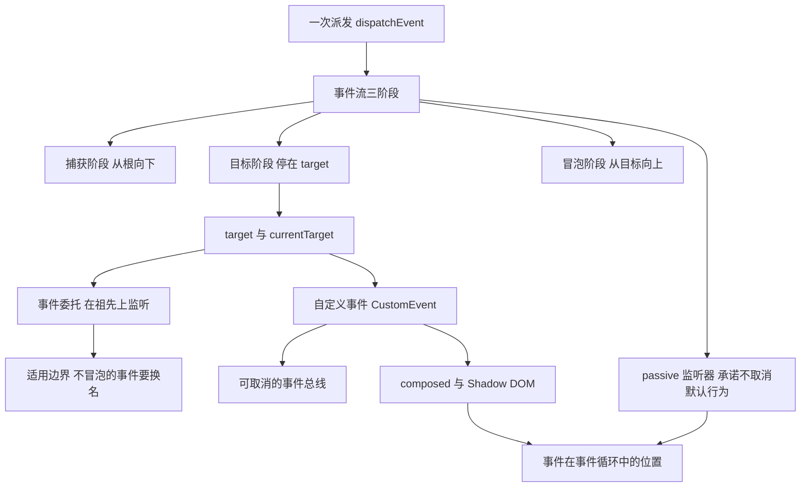
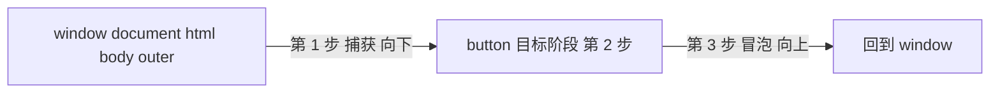
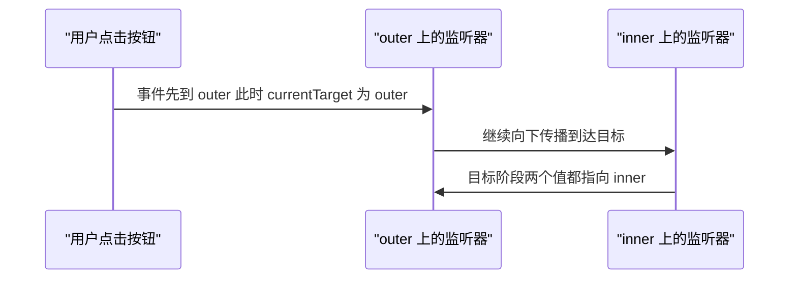
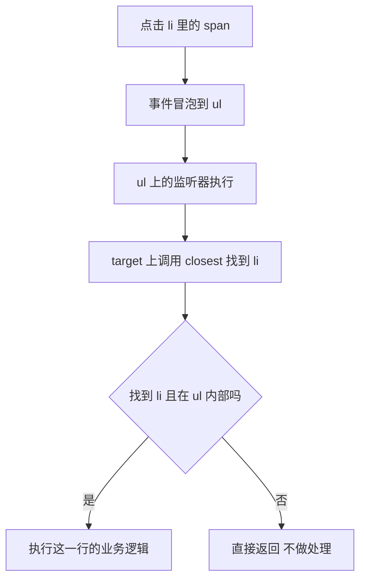
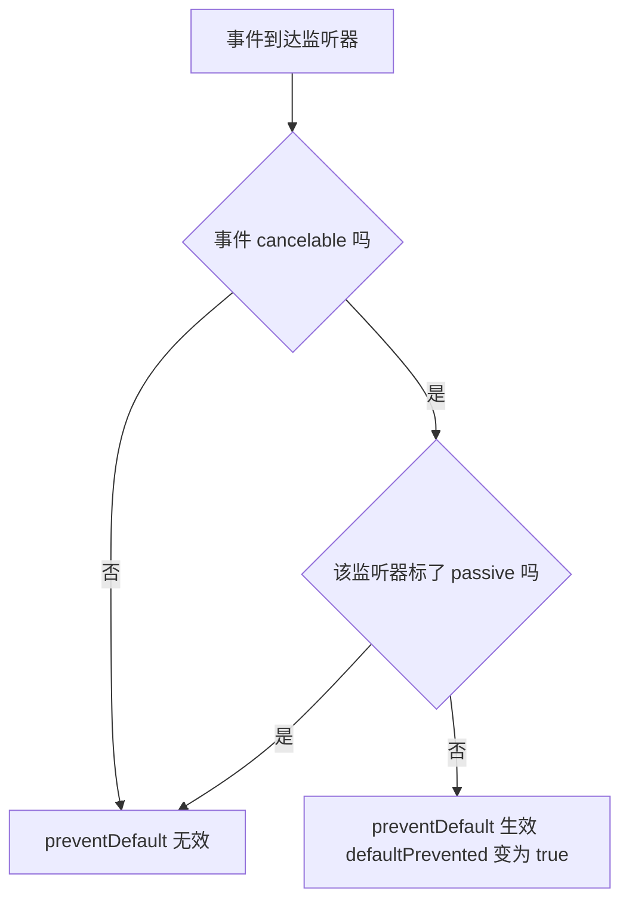
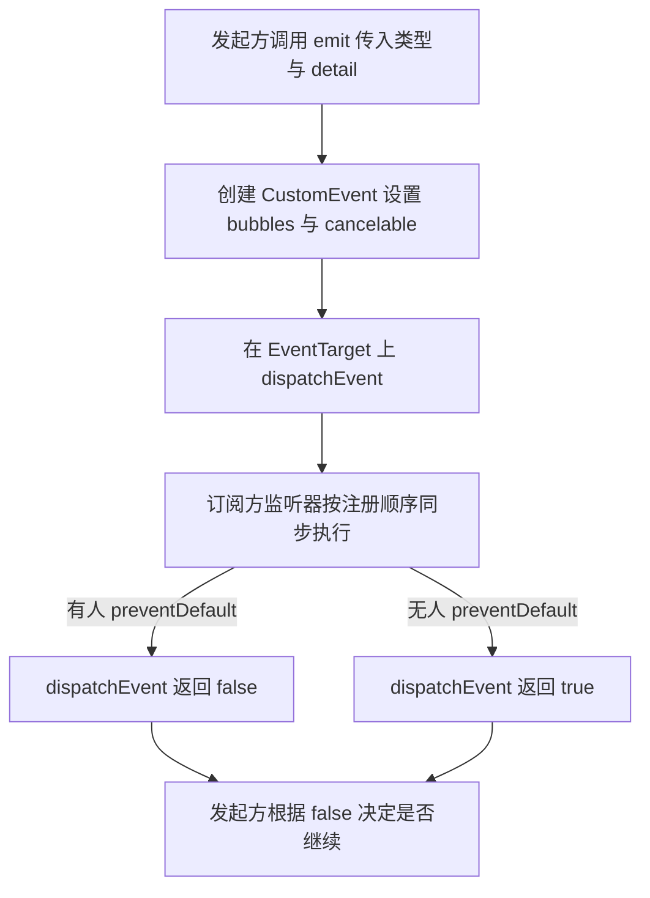
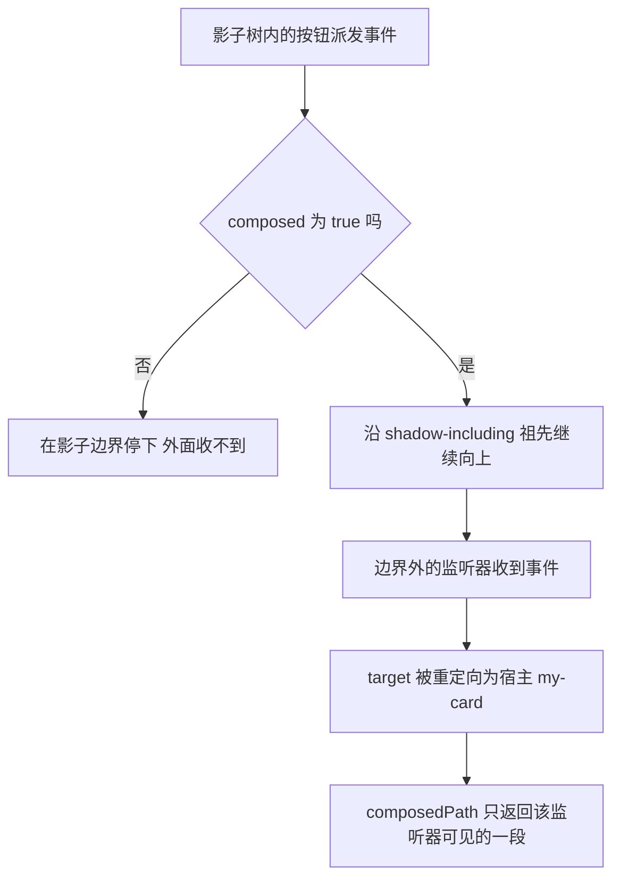
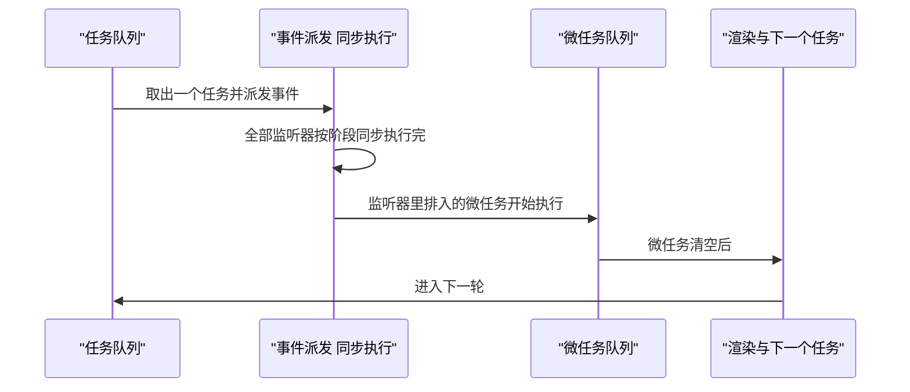

# DOM 事件系统：捕获、冒泡、委托与自定义事件

!!! abstract "学完这一页你能"
    - 说清一次点击在 DOM 树里走过的三个阶段，并预测四个监听器的执行顺序。
    - 区分 `event.target` 与 `event.currentTarget`，写出不会取错节点的处理逻辑。
    - 用一次事件委托处理动态列表，并说出它在什么条件下失效。
    - 手写一个支持取消的事件总线，并解释 `passive`、`composed` 对它的影响。

## 0. 知识地图



建议按 1 到 7 的顺序读：第 1 到第 3 节讲清一次派发的路径、两个坐标，以及由它派生的委托写法。

第 4 到第 7 节各自回答一个边界问题：滚动性能、应用内通信、影子边界、任务顺序。读后面几节时，随时回到第 1 节的路径图上对照。

!!! note "术语：DOM 事件"
    事件是浏览器或你的代码在某个节点上放出的一条通知，节点收到后按注册顺序执行对应的监听函数。例：用户点击 `<button>`，浏览器在 `button` 上派发一个 `click` 事件。

## 1. 事件流三阶段

**先想一个问题**

页面里有 `<div id="outer"><button id="inner">点我</button></div>`。给 outer 和 inner 各挂两个监听器，点一下按钮，四个监听器的执行顺序是什么？

**心智模型**

!!! tip "心智模型"
    - 一句话模型：事件先沿祖先链向下走一遍，停在目标上，再沿同一条链向上走一遍。
    - 日常类比：快递先到小区门口、再到楼栋、再到你家门口；签收后的回执沿原路往上送回。
    - 类比不成立处：向下与向上不是两趟独立行程，中间只有一个目标阶段，目标节点上的两组监听器在同一次停留里先后执行。

**图解**



1. 起点是 window，终点是实际触发事件的元素，图里写作 button。
2. 第 1 步捕获：从 window 到 button 的父节点，执行 `capture` 为 `true` 的监听器。
3. 第 2 步目标阶段：button 自己的监听器执行，`capture` 为 `true` 的那批先跑。
4. 第 2 步的后半：button 上 `capture` 为 `false` 的监听器接着跑。
5. 第 3 步冒泡：从 button 的父节点回到 window，执行 `capture` 为 `false` 的监听器。
6. 任何一步调用 `stopPropagation()`，后面的步骤都不再执行。

**一步一步来**

第 1 步：先搭一棵最小的 DOM 树。

这一步要做什么：用 jsdom 在 Node 里造出一棵可派发事件的树，拿到两个节点备用。

```js
// 依赖：npm i jsdom
import { JSDOM } from 'jsdom';                            // 用 jsdom 在 Node 里造 DOM 树
const dom = new JSDOM('<div id="outer"><button id="inner">点我</button></div>');
const { document } = dom.window;                          // 必须取自 dom.window
const outer = document.getElementById('outer');           // 祖先节点
const inner = document.getElementById('inner');           // 目标节点
```

**这段代码在做什么**

- `new JSDOM(html)` 接收一段 HTML 字符串，返回一个带 `window` 属性的对象。
- `document` 必须从 `dom.window` 上取，Node 全局没有 `document`。
- `getElementById` 在 jsdom 里的含义与浏览器一致，返回元素或 `null`。
- 这一步只建树，不派发事件，因此不产生任何执行顺序。

第 2 步：挂四个监听器，把执行顺序记进数组。

这一步要做什么：分别在祖先和目标上注册捕获监听器与冒泡监听器，用数组当记录本。

```js
const log = [];                                                        // 记录执行顺序
outer.addEventListener('click', () => log.push('outer 捕获'), true);    // 第三参 true 即捕获
outer.addEventListener('click', () => log.push('outer 冒泡'));           // 省略第三参即冒泡
inner.addEventListener('click', () => log.push('inner 捕获'), { capture: true });
inner.addEventListener('click', () => log.push('inner 冒泡'));
```

**这段代码在做什么**

- 第三个参数写 `true` 与写 `{ capture: true }` 等价，两种写法都能用。
- 捕获监听器只在捕获阶段执行，冒泡监听器只在冒泡阶段执行。
- 在目标节点上，捕获批次总排在冒泡批次之前，与注册先后无关。
- `log` 数组是核对顺序的唯一凭据，顺序写错时一眼可见。

第 3 步：派发一个会冒泡的 click 事件，打印顺序。

这一步要做什么：创建事件对象并派发，观察四个监听器的真实执行次序。

```js
const evt = new dom.window.Event('click', { bubbles: true }); // 有 bubbles 才有第 3 步
inner.dispatchEvent(evt);                                      // 同步执行，返回时已跑完
console.log(log.join(' -> '));
```

**这段代码在做什么**

- `new Event('click')` 只带类型，`bubbles: true` 决定第三阶段是否存在。
- `dispatchEvent` 返回布尔值：`false` 表示有人在监听器里调用了 `preventDefault`。
- 派发是同步的，函数返回时全部监听器都已执行完。
- 把 `bubbles` 去掉，输出里只剩两个 inner 监听器。

运行结果：

```
outer 捕获 -> inner 捕获 -> inner 冒泡 -> outer 冒泡
```

**动手验证**

把上面三步合成一个文件，用 `node:assert` 锁定顺序，再验证 `stopPropagation` 的截断效果。

```js
// 依赖：npm i jsdom   运行：node events-flow.mjs
import assert from 'node:assert/strict';
import { JSDOM } from 'jsdom';

const dom = new JSDOM('<div id="outer"><button id="inner">点我</button></div>');
const { document, Event } = dom.window;
const outer = document.getElementById('outer');
const inner = document.getElementById('inner');
const log = [];

outer.addEventListener('click', () => log.push('outer 捕获'), true);
outer.addEventListener('click', () => log.push('outer 冒泡'));
inner.addEventListener('click', () => log.push('inner 捕获'), { capture: true });
inner.addEventListener('click', () => log.push('inner 冒泡'));

inner.dispatchEvent(new Event('click', { bubbles: true }));
assert.deepEqual(log, ['outer 捕获', 'inner 捕获', 'inner 冒泡', 'outer 冒泡']);

log.length = 0;
inner.dispatchEvent(new Event('click'));            // bubbles 默认 false
assert.deepEqual(log, ['inner 捕获', 'inner 冒泡']);

log.length = 0;
outer.addEventListener('click', (e) => {            // 在捕获阶段截断
  e.stopPropagation();
  log.push('cut');
}, { capture: true });
inner.dispatchEvent(new Event('click', { bubbles: true }));
assert.deepEqual(log, ['outer 捕获', 'cut']);       // 同节点同阶段的监听器仍会跑完

console.log('断言通过：', 'outer 捕获 -> inner 捕获 -> inner 冒泡 -> outer 冒泡');
// 运行结果：断言通过： outer 捕获 -> inner 捕获 -> inner 冒泡 -> outer 冒泡
```

**常见坑**

| 现象 | 原因 | 怎么修 |
| --- | --- | --- |
| 挂在祖先上的 `click` 收不到 | 事件创建时 `bubbles` 为 `false` | 创建事件时写 `bubbles: true` |
| 在祖先上监听 `focus` 收不到 | `focus` 本身不冒泡 | 改用会冒泡的 `focusin`，或在捕获阶段监听 `focus` |
| `stopPropagation` 后同节点其余监听器还在跑 | 它只阻止跨节点传播 | 要连本节点剩余监听器一起停，用 `stopImmediatePropagation` |
| 顺序与预期不符 | 把 `capture` 的选项写成了 `bubbles` | 注册监听器用 `capture`，创建事件用 `bubbles` |

**小结**

1. 一次派发走三段：捕获向下、目标停留、冒泡向上。
2. `bubbles` 决定第三段是否存在，`capture` 决定监听器挂在哪一段。
3. 目标节点上捕获批次先于冒泡批次执行，与注册顺序无关。

## 2. target 与 currentTarget

**先想一个问题**

一个卡片列表只挂一个监听器，点击卡片里的删除按钮时，怎么知道被点的是哪张卡片？

**心智模型**

!!! tip "心智模型"
    - 一句话模型：`target` 是"谁被点的"，`currentTarget` 是"现在轮到谁处理"。
    - 日常类比：接力赛里 `target` 是起跑那名队员（全程不变），`currentTarget` 是此刻握棒的人（每一棒都换）。
    - 类比不成立处：影子树里 `target` 会被重定向，它不是"最初的元素"，而是"对当前监听器可见的那个元素"。

**图解**



1. 点击发生在 `inner` 上，浏览器把 `inner` 记为 `event.target`。
2. 事件到达 `outer` 的捕获监听器时，`currentTarget` 是 `outer`，`target` 仍是 `inner`。
3. 事件向下到 `inner`，两个值相等，都指向 `inner`。
4. 冒泡回到 `outer` 时，`currentTarget` 又变成 `outer`，`target` 保持 `inner`。
5. 派发结束后，规范把 `currentTarget` 置为 `null`，异步读取会拿到 `null`。

**一步一步来**

第 1 步：在同一个监听器里同时打印两个值。

这一步要做什么：在一个祖先监听器里确认 `target` 与 `currentTarget` 分别指向谁。

```js
outer.addEventListener('click', (e) => {              // 监听器挂在祖先 outer 上
  console.log('currentTarget:', e.currentTarget.id);  // outer 谁在处理
  console.log('target:', e.target.id);                // inner 谁被点
});
inner.dispatchEvent(new dom.window.Event('click', { bubbles: true }));
```

**这段代码在做什么**

- `e.currentTarget` 等于挂这个监听器的元素，也就是 `outer`。
- `e.target` 等于实际被点击的元素 `inner`，传播过程中不变。
- 在目标节点自己的监听器里，两个值相等。
- 真实代码里通常用 `e.target.closest(选择器)` 把 `target` 提升到业务节点。

第 2 步：把事件对象存到外部变量，异步读取。

这一步要做什么：观察派发结束后规范对 `currentTarget` 的清理行为。

```js
let saved = null;                                        // 外部变量，先留空
inner.addEventListener('click', (e) => { saved = e; });   // 只存引用，不当场使用
inner.dispatchEvent(new dom.window.Event('click'));
console.log(saved.currentTarget);    // null 已被清空
console.log(saved.target.id);        // inner 不受影响
```

**这段代码在做什么**

- 派发结束时规范要求把 `currentTarget` 置为 `null`，jsdom 与浏览器行为一致。
- `target` 不属于清理范围，异步读取仍然指向最初被点的元素。
- 要异步使用"当前处理者"，在监听器里先写 `const el = e.currentTarget` 保存。
- 这条规则也是"事件对象别跨任务长期保存"的直接原因。

**动手验证**

```js
// 依赖：npm i jsdom
import assert from 'node:assert/strict';
import { JSDOM } from 'jsdom';

const dom = new JSDOM('<div id="outer"><button id="inner">x</button></div>');
const { document, Event } = dom.window;
const outer = document.getElementById('outer');
const inner = document.getElementById('inner');
const rows = [];

outer.addEventListener('click', (e) => {
  rows.push({ at: 'outer', target: e.target.id, current: e.currentTarget.id });
}, true);
inner.addEventListener('click', (e) => {
  rows.push({ at: 'inner', target: e.target.id, current: e.currentTarget.id });
});

inner.dispatchEvent(new Event('click', { bubbles: true }));
assert.deepEqual(rows, [
  { at: 'outer', target: 'inner', current: 'outer' },
  { at: 'inner', target: 'inner', current: 'inner' },
]);

let saved;                                          // 异步读取用
outer.addEventListener('click', (e) => { saved = e; });
inner.dispatchEvent(new Event('click', { bubbles: true }));
assert.equal(saved.currentTarget, null);            // 派发结束被清空
assert.equal(saved.target.id, 'inner');             // target 保留

console.log('断言通过，记录条数:', rows.length);      // 运行结果：断言通过，记录条数: 2
```

**常见坑**

| 现象 | 原因 | 怎么修 |
| --- | --- | --- |
| 删除操作删掉了按钮而不是整行 | `e.target` 是内层元素，不是业务节点 | 用 `e.target.closest(选择器)` 提升到业务节点 |
| 异步代码里 `currentTarget` 是 `null` | 派发结束会清空它 | 在监听器内先把它赋给常量 |
| 边界外读到的是宿主元素 | 影子边界外对 `target` 做重定向 | 读 `e.composedPath()`，见第 6 节 |
| 用箭头函数里的 `this` 取节点失败 | 箭头函数没有自己的 `this` | 统一用 `e.currentTarget` |

**小结**

1. `target` 是事件最初到达的元素，整个传播过程中不变。
2. `currentTarget` 是当前执行监听器的元素，随传播节点改变。
3. 派发结束后 `currentTarget` 被置为 `null`，需要异步使用就先存下来。

## 3. 事件委托与适用边界

**先想一个问题**

列表有 500 行，每行一个删除按钮。给 500 个按钮各挂一个监听器，和只给列表挂一个，浏览器要做的事差在哪里？

**心智模型**

!!! tip "心智模型"
    - 一句话模型：把监听器挂到所有子元素共同的祖先上，用一个监听器处理全部子元素。
    - 日常类比：公司只在前台放一个人收快递，谁的在包裹上写着名字，前台照着名字分发。
    - 类比不成立处：前台只收"会送到前台"的快递，`focus`、`blur` 这类不冒泡的事件送不下来，必须换成 `focusin`、`focusout`。

**图解**



1. 点击发生在 `<span>` 上，`target` 记录这个 `span`。
2. 事件沿祖先链冒泡，先到 `<li>`，再到 `<ul>`。
3. `<ul>` 上的监听器执行，读出 `e.target`。
4. `e.target.closest('li')` 从 `span` 向上找到最近的 `li`，得到这一行。
5. 校验 `li` 确实在 `ul` 内部，防止匹配到列表外的祖先。
6. 命中则执行该行逻辑，未命中则直接返回。

**一步一步来**

第 1 步：用一个监听器接管全部子元素。

这一步要做什么：在容器上注册一次点击监听，用 `closest` 定位到业务节点。

```js
list.addEventListener('click', (e) => {                    // 一个监听器管全部行
  const item = e.target.closest('li');                      // 从被点元素向上找 li
  if (!item) return;                                        // 点到列表空白处，放行
  if (!list.contains(item)) return;                         // 找到的 li 必须在列表内部
  console.log('删除', item.dataset.id);                      // 业务主键放在 data-id 上
});
```

**这段代码在做什么**

- 委托单元是"行为相同的最小公共祖先"，这里是 `ul`。
- `closest` 从元素自身开始向上找，包含元素自身。
- `list.contains(item)` 排除了匹配到列表外祖先的情况，例如嵌套列表。
- `dataset.id` 读取 `data-id` 属性，把节点与业务数据对应起来。

第 2 步：验证新增节点不需要重新绑定。

这一步要做什么：往列表末尾插入新行，派发点击，确认委托监听器照样接手。

```js
const li = document.createElement('li');                    // 新建一行
li.dataset.id = '42';                                        // 写入业务主键
li.innerHTML = '<span class="del">删除</span>';               // 内层按钮
list.append(li);                                             // 不需要给新行挂监听器
li.querySelector('.del').dispatchEvent(new dom.window.Event('click', { bubbles: true }));
```

**这段代码在做什么**

- `document.createElement` 与 `append` 在 jsdom 与浏览器里含义一致。
- 新行没有自己的监听器，点击仍会被 `ul` 上的监听器捕获。
- 事件必须 `bubbles: true` 才会从 `span` 走到 `ul`。
- 内层 `span` 被点击时，`closest('li')` 会把它提升到所属的 `li`。

**动手验证**

```js
// 依赖：npm i jsdom
import assert from 'node:assert/strict';
import { JSDOM } from 'jsdom';

const dom = new JSDOM('<ul id="list"><li data-id="1"><span class="del">删</span></li></ul>');
const { document, Event } = dom.window;
const list = document.getElementById('list');
const removed = [];

list.addEventListener('click', (e) => {
  const item = e.target.closest('li');
  if (!item || !list.contains(item)) return;
  removed.push(item.dataset.id);
});

list.querySelector('.del').dispatchEvent(new Event('click', { bubbles: true }));
assert.deepEqual(removed, ['1']);                 // 点 span 也能定位到 li

const li = document.createElement('li');          // 动态新增的行
li.dataset.id = '2';
li.innerHTML = '<span class="del">删</span>';
list.append(li);
li.querySelector('.del').dispatchEvent(new Event('click', { bubbles: true }));
assert.deepEqual(removed, ['1', '2']);            // 无需重新绑定

list.dispatchEvent(new Event('click', { bubbles: true }));  // 点列表空白处
assert.deepEqual(removed, ['1', '2']);            // 没有行被命中

console.log('委托断言通过:', removed.join(','));    // 运行结果：委托断言通过: 1,2
```

**常见坑**

| 现象 | 原因 | 怎么修 |
| --- | --- | --- |
| 委托 `focus` 完全收不到 | `focus` 不冒泡 | 换成 `focusin`，或改用 `focus` 的捕获阶段 |
| 某个子元素点不动 | 子元素的监听器里调用了 `stopPropagation` | 在子元素里改成不拦截，或把监听器下移到子元素 |
| 点到嵌套列表的外层行 | `closest` 匹配到了列表外的祖先 | 加 `list.contains(item)` 判断 |
| 委托监听器只生效一次 | 注册时写了 `once: true` | 去掉 `once`，在回调里自行判断是否需要解除 |

**小结**

1. 委托把 N 个监听器压缩成 1 个，节点增删时不需要改绑定。
2. 委托依赖冒泡，不冒泡的事件必须先换成会冒泡的同类事件。
3. `closest` 加 `contains` 校验是防止误命中的固定搭配。

## 4. passive 监听器

**先想一个问题**

在 `window` 上监听 `wheel` 之后，页面滚动为什么会卡顿？控制台那句 "Unable to preventDefault inside passive event listener" 是在说什么？

**心智模型**

!!! tip "心智模型"
    - 一句话模型：`passive: true` 是你对浏览器下的承诺，这个监听器不会取消默认行为，于是滚动不必等 JS 跑完。
    - 日常类比：点菜时说"不用改菜单"，后厨就不必等你确认直接开做。
    - 类比不成立处：写错承诺时浏览器不报异常，它只是忽略 `preventDefault()`，控制台留一条警告，代码会安静地失效。

**图解**



1. 事件到达监听器时，先看 `cancelable` 是否为 `true`。
2. `cancelable` 为 `false` 时，`preventDefault()` 什么都不做。
3. `cancelable` 为 `true` 时，再看这个监听器的 `passive` 标志。
4. 标了 `passive`，`preventDefault()` 同样被跳过，`defaultPrevented` 保持 `false`。
5. 没标 `passive`，`preventDefault()` 生效，`defaultPrevented` 变为 `true`。
6. `dispatchEvent` 的返回值与 `defaultPrevented` 相反：`false` 表示被取消。

**一步一步来**

第 1 步：观察 passive 监听器里 `preventDefault` 的失效。

这一步要做什么：注册一个 passive 的 `touchmove` 监听器，在回调里调用 `preventDefault` 并读数。

```js
const box = document.getElementById('box');
box.addEventListener('touchmove', (e) => {
  e.preventDefault();                                     // 想阻止页面跟着滚
  console.log('defaultPrevented:', e.defaultPrevented);   // passive 下打印 false
}, { passive: true });                                    // 声明不会取消默认行为
box.dispatchEvent(new dom.window.Event('touchmove', { bubbles: true, cancelable: true }));
```

**这段代码在做什么**

- `{ passive: true }` 告诉浏览器这个回调不会取消默认行为。
- 回调仍然被正常调用，失效的只有 `preventDefault` 的效果。
- 事件必须是 `cancelable: true`，否则非 passive 场景下 `preventDefault` 也不生效。
- 判断是否被取消，可以读 `e.defaultPrevented` 或看 `dispatchEvent` 的返回值。

运行结果：

```
defaultPrevented: false
```

第 2 步：真正要拦住滚动时的两种写法。

这一步要做什么：优先交给 CSS，其次才在具体元素上用非 passive 监听器加条件判断。

```css
/* 写法一：声明该区域的手势不交给浏览器做滚动 */
.touch-area { touch-action: none; }
/* 写法二：滚动到边界时不让滚动传给父级容器 */
.overscroll { overscroll-behavior: contain; }
```

**这段代码在做什么**

- `touch-action: none` 让该区域的触摸手势不再触发浏览器滚动，JS 不参与。
- `overscroll-behavior: contain` 阻止滚动链传到父容器，常用于弹窗。
- 这两种写法没有主线程阻塞问题，因为没有 JS 回调参与判定。
- 需要按手指位置动态判断时，才退回 JS 方案。

```js
// 写法三：确实需要 JS 判断时，在具体元素上显式写 passive: false
area.addEventListener('touchmove', (e) => {
  if (shouldBlock(e)) e.preventDefault();   // 只有要拦的那部分才拦
}, { passive: false });                     // 显式写出，避免默认值带来的意外
```

**这段代码在做什么**

- 监听器挂在具体元素上，而不是 `window` 或 `document` 这种根目标。
- 显式写 `{ passive: false }`，让阅读者知道这里允许取消默认行为。
- 条件判断放在回调里，避免整块区域都失去原生滚动。
- 根目标上的 `touchstart`、`touchmove`、`wheel`、`mousewheel` 在 Chromium 里被默认按 passive 处理，具体起始版本需核对官方文档。

**动手验证**

```js
// 依赖：npm i jsdom
// 注意：需核对官方文档，确认你所用的 jsdom 版本是否实现 passive 监听器语义；否则请在浏览器中复现
import assert from 'node:assert/strict';
import { JSDOM } from 'jsdom';

const dom = new JSDOM('<div id="box"></div>');
const { document, Event } = dom.window;
const box = document.getElementById('box');
const calls = [];

box.addEventListener('wheel', (e) => {
  calls.push('passive');
  e.preventDefault();                                  // 期望被忽略
}, { passive: true });

const evt = new Event('wheel', { bubbles: true, cancelable: true });
const notCanceled = box.dispatchEvent(evt);

assert.deepEqual(calls, ['passive']);                  // 回调照样被调用
assert.equal(evt.defaultPrevented, false);             // 默认行为没有被取消
assert.equal(notCanceled, true);                       // 返回值 true 表示无人取消

console.log('passive 断言通过，回调次数:', calls.length, 'defaultPrevented:', evt.defaultPrevented);
// 运行结果：passive 断言通过，回调次数: 1 defaultPrevented: false
```

**常见坑**

| 现象 | 原因 | 怎么修 |
| --- | --- | --- |
| 回调里 `preventDefault` 没反应，控制台有警告 | 该监听器为 passive，或浏览器默认按 passive 处理根目标 | 显式写 `{ passive: false }`，并把监听器移到具体元素 |
| 写完 `passive: false` 还是拦不住 | 事件本身 `cancelable` 为 `false` | 打印 `e.cancelable` 确认，必要时换事件类型 |
| 拦截到滚动但页面依然卡顿 | 监听器回调本身耗时，滚动已经在等主线程 | 把判断逻辑精简，或改用 CSS 的 `touch-action` |
| 忘记写 passive 导致性能回退 | 根目标上滚动类事件默认按 passive 处理 | 在根目标上注册时显式写明需要的值 |

**小结**

1. `passive: true` 让浏览器不必等 JS 就能继续处理滚动。
2. 它只影响 `preventDefault` 的效果，不影响监听器被调用。
3. 能交给 CSS 的滚动控制优先交给 CSS，JS 只处理需要动态判断的部分。

## 5. 自定义事件与可取消的事件总线

**先想一个问题**

搜索框的输入要通知三个互不相识的模块：结果列表、统计面板、操作日志。它们之间不该互相 import，靠什么通信？

**心智模型**

!!! tip "心智模型"
    - 一句话模型：自定义事件给"发生在某个元素上的事"起一个自己的名字，让不相识的代码通过同一个元素对话。
    - 日常类比：小区公告栏，任何人都能贴通知、任何人都能读，写的人不需要认识读的人。
    - 类比不成立处：公告栏上的通知默认不会送到楼上，`CustomEvent` 的 `bubbles`、`cancelable`、`composed` 默认都是 `false`。

!!! note "术语：CustomEvent"
    `CustomEvent` 是 `Event` 的子类，多出一个 `detail` 属性用于携带业务数据。例：`new CustomEvent('cart:add', { detail: { id: 7 } })`。

!!! note "术语：可取消事件"
    可取消指创建事件时 `cancelable` 为 `true`。监听器调用 `preventDefault()` 后，`dispatchEvent` 返回 `false`，表示有人不同意默认动作。

**图解**



1. 发起方调用 `emit`，给出事件类型与数据。
2. `emit` 内部创建 `CustomEvent`，把数据放 `detail`。
3. 事件在 `EventTarget` 上派发，没有 DOM 树也照样工作。
4. 订阅方监听器按注册顺序同步执行，读到同一个 `detail` 对象。
5. 有监听器调用 `preventDefault` 时，`dispatchEvent` 返回 `false`。
6. 发起方读到 `false`，决定是否放弃这次动作。

**一步一步来**

第 1 步：手工创建一个可冒泡、可取消的自定义事件。

这一步要做什么：把四个选项一次写全，理解每个默认值的影响。

```js
const evt = new CustomEvent('cart:add', {
  detail: { id: 7, count: 2 },   // detail 默认是 null
  bubbles: true,                 // 默认 false，委托必须打开
  cancelable: true,              // 默认 false，打开后 preventDefault 才有意义
  composed: false,               // 默认 false，不跨影子边界
});
const ok = el.dispatchEvent(evt); // false 表示有人取消了
```

**这段代码在做什么**

- `detail` 是携带业务数据的官方通道，默认 `null`。
- `bubbles` 默认 `false`，不做设置时第 3 节的委托写法对它无效。
- `cancelable` 默认 `false`，此时 `preventDefault()` 不起作用。
- `composed` 默认 `false`，事件停在影子边界内，见第 6 节。
- `dispatchEvent` 只有在 `cancelable` 为 `true` 时才可能返回 `false`。

第 2 步：用 Node 内置的 `EventTarget` 写一个可取消的事件总线。

这一步要做什么：把 `on`、`off`、`emit` 三个方法封装起来，退订靠返回值完成。

```js
class EventBus {
  #target = new EventTarget();                                  // 无 DOM 树，只做派发
  on(type, fn) {
    this.#target.addEventListener(type, fn);
    return () => this.off(type, fn);                            // 返回退订函数
  }
  off(type, fn) { this.#target.removeEventListener(type, fn); }  // 必须传同一个函数引用
  emit(type, detail) {
    return this.#target.dispatchEvent(new CustomEvent(type, { detail, cancelable: true }));
  }
}
```

**这段代码在做什么**

- `#target` 是私有字段，外部只能通过三个方法使用这个总线。
- `on` 返回退订函数，调用方不需要自己保存类型与函数的配对。
- `off` 依赖同一个函数引用，传新写的箭头函数删不掉。
- `emit` 每次都新建事件对象，同一个事件对象不能派发两次。
- Node 20 已内置 `EventTarget` 与 `CustomEvent`，无需安装依赖。

**动手验证**

```js
// 依赖：无（Node 20 内置 EventTarget 与 CustomEvent）
import assert from 'node:assert/strict';

// 兜底：更早的 Node 版本没有全局 CustomEvent
const CustomEventImpl = globalThis.CustomEvent ?? class extends Event {
  constructor(type, init = {}) { super(type, init); this.detail = init.detail ?? null; }
};

class EventBus {
  #target = new EventTarget();
  on(type, fn) { this.#target.addEventListener(type, fn); return () => this.off(type, fn); }
  off(type, fn) { this.#target.removeEventListener(type, fn); }
  emit(type, detail) {
    return this.#target.dispatchEvent(new CustomEventImpl(type, { detail, cancelable: true }));
  }
}

const bus = new EventBus();
const seen = [];
const offLog = bus.on('order:pay', (e) => seen.push(['log', e.detail.id]));

bus.on('order:pay', (e) => {
  seen.push(['guard', e.detail.id]);
  if (e.detail.id === 0) e.preventDefault();      // 非法订单：取消本次支付
});

assert.equal(bus.emit('order:pay', { id: 7 }), true);    // 无人取消
assert.equal(bus.emit('order:pay', { id: 0 }), false);   // 被 guard 取消
assert.deepEqual(seen, [['log', 7], ['guard', 7], ['log', 0], ['guard', 0]]);

offLog();                                          // 调用 on 返回的函数即退订
assert.equal(bus.emit('order:pay', { id: 9 }), true);
assert.deepEqual(seen.slice(-1), [['guard', 9]]);  // 只剩未退订的那个监听器

console.log('事件总线断言通过，记录条数:', seen.length);
// 运行结果：事件总线断言通过，记录条数: 5
```

**常见坑**

| 现象 | 原因 | 怎么修 |
| --- | --- | --- |
| 在祖先上监听不到自定义事件 | `CustomEvent` 的 `bubbles` 默认 `false` | 创建时写 `bubbles: true` |
| 监听器里 `e.detail` 是 `null` | 创建时没有传 `detail` | 创建时写 `detail: 数据`，或让监听器兼容 `null` |
| `preventDefault` 没有效果 | `cancelable` 默认 `false` | 创建时写 `cancelable: true` |
| 退订失败 | `removeEventListener` 收到的是新函数引用 | 调用 `on` 返回的退订函数，或保存原始函数 |
| 同一个事件对象派发两次报错 | 事件对象带派发状态，不能复用 | 每次 `emit` 都新建事件对象 |

**小结**

1. `CustomEvent` 的 `bubbles`、`cancelable`、`composed` 默认都是 `false`，需要哪个就显式打开。
2. `dispatchEvent` 的返回值是"是否未被取消"，可取消是发起方与订阅方协商的手段。
3. `on` 返回退订函数，能避免 `removeEventListener` 的函数引用问题。

## 6. composed 与 Shadow DOM

**先想一个问题**

自定义元素 `<my-card>` 内部用 `attachShadow` 封了一个按钮。外面给 `<my-card>` 挂的 `click` 监听器，点内部按钮时能收到吗？收到时 `e.target` 是谁？

**心智模型**

!!! tip "心智模型"
    - 一句话模型：`composed` 决定事件能否穿过影子边界，重定向决定边界外看到的 `target` 是谁。
    - 日常类比：公司内网的消息只在内网流转，对外发布的消息由前台统一署名。
    - 类比不成立处：重定向后的 `target` 不是原元素改名，它就是宿主元素本身，所以边界外拿不到内部节点的 id 与类名。

!!! note "术语：Shadow DOM"
    影子树是挂在普通元素上的独立 DOM 子树，用 `element.attachShadow({ mode: 'open' })` 创建。`open` 模式下可用 `element.shadowRoot` 访问，`closed` 模式下该属性为 `null`。

**图解**



1. 按钮在影子树内派发事件，它所在树的根是影子根。
2. `composed` 为 `false` 时，传播在影子根处停止，边界外收不到。
3. `composed` 为 `true` 时，事件继续向上，跨过影子边界。
4. 边界外的监听器被调用，`e.target` 被重定向为宿主元素 `<my-card>`。
5. `e.composedPath()` 返回当前监听器可见的那一段路径，不是整条路径。
6. 派发结束后路径被清空，`composedPath()` 返回空数组。

**一步一步来**

第 1 步：建立影子树，观察边界外读到的 `target`。

这一步要做什么：在浏览器里挂上影子树，从内部派发一个 `composed` 的内置点击事件，在边界外读数。

```js
const host = document.querySelector('my-card');
const root = host.attachShadow({ mode: 'open' });          // 建立影子树
root.innerHTML = '<button id="in">内层按钮</button>';
const btn = root.getElementById('in');                      // 在影子树内查找

host.addEventListener('click', (e) => {                     // 边界外的监听器
  console.log(e.target.tagName);                            // 打印 MY-CARD 而不是 BUTTON
  console.log(e.composedPath().length);                     // 当前监听器可见的路径长度
});
btn.dispatchEvent(new MouseEvent('click', { bubbles: true, composed: true }));
```

**这段代码在做什么**

- `attachShadow({ mode: 'open' })` 把影子树挂到宿主 `my-card` 上。
- 内置的 `click` 事件本身带 `composed: true`，所以能到边界外。
- 边界外的 `e.target` 被重定向为宿主 `my-card`。
- `e.composedPath()` 的长度取决于当前监听器能看到多远。
- 换成 `new CustomEvent('x')` 且不写 `composed`，边界外就收不到。

第 2 步：跨边界通信靠 `detail` 主动暴露数据。

这一步要做什么：在影子树内把事件翻译成对外语义，把需要的内部数据放进 `detail`。

```js
btn.dispatchEvent(new CustomEvent('card:confirm', {
  bubbles: true,                    // 先沿影子树向上冒泡
  composed: true,                   // 允许穿过影子边界
  detail: { id: 7, source: 'inner' }, // 内部数据主动放到 detail 里
}));
// 边界外：host 上监听 card:confirm，e.target 是宿主，业务数据读 e.detail
```

**这段代码在做什么**

- 边界外读到的 `e.target` 是宿主，所以数据不能靠 `e.target` 取。
- `detail` 是唯一稳定的数据通道，需要什么就放什么。
- `bubbles: true` 让事件在影子树内先冒泡到影子根。
- `composed: true` 让它跨过边界，继续在宿主的祖先链上冒泡。
- `composed` 与 `bubbles` 是两件事，跨边界传播也要先满足冒泡条件。

**动手验证**

真实浏览器行为请在浏览器中用 `attachShadow` 复现，下面用 20 行模型验证规则本身。

```js
// 依赖：无（模型脚本，验证 composed 与重定向规则）
import assert from 'node:assert/strict';

// 模型：影子根用 root 字段表示，影子根用 host 字段指向宿主
const docRoot = { kind: 'document', root: null };
docRoot.root = docRoot;                                     // 文档根指向自己
const host = { kind: 'element', name: 'my-card', parent: docRoot, root: docRoot };
const shadowRoot = { kind: 'shadow-root', host };            // 影子根不属于宿主所在树
const inner = { kind: 'element', name: 'button', parent: shadowRoot, root: shadowRoot };

const canCross = (evt) => evt.composed === true;             // 只有 composed 为 true 才穿过边界

function retarget(target, listenerRoot) {                     // 边界外看到的 target
  let node = target;
  while (node.root !== listenerRoot) {                        // 还在别的树里就往宿主上移
    const root = node.root;
    if (!root.host) return null;                              // 走到文档根仍未命中
    node = root.host;
  }
  return node;
}

assert.equal(canCross({ composed: false }), false);    // 自定义事件的默认值
assert.equal(canCross({ composed: true }), true);      // 内置 click 的取值
assert.equal(retarget(inner, docRoot), host);          // 边界外看到宿主
assert.equal(retarget(inner, shadowRoot), inner);      // 影子树内看到按钮
assert.equal(retarget(docRoot, shadowRoot), null);     // 方向反了取不到

console.log('composed 与重定向规则断言通过');
// 运行结果：composed 与重定向规则断言通过
```

**常见坑**

| 现象 | 原因 | 怎么修 |
| --- | --- | --- |
| 影子树内派发的自定义事件，外面收不到 | `CustomEvent` 的 `composed` 默认 `false` | 创建时写 `composed: true` 与 `bubbles: true` |
| 外部监听器里 `e.target` 是宿主，取不到内部按钮 | 影子边界外对 `target` 做重定向 | 把数据放进 `e.detail` |
| `e.composedPath()` 返回空数组 | 派发结束后路径被清空 | 在监听器的同步执行阶段读取 |
| `element.shadowRoot` 为 `null` | 影子树用 `mode: 'closed'` 创建 | 需要外部访问就使用 `open` |

**小结**

1. `composed` 决定事件能否跨过影子边界，自定义事件默认不跨。
2. 边界外的 `target` 被重定向为宿主元素，业务数据要经 `detail` 传递。
3. `composedPath()` 只在派发期间有效，读它必须在监听器同步阶段。

## 7. 事件在事件循环中的位置

**先想一个问题**

在 `click` 监听器里分别写 `queueMicrotask`、`Promise.then`、`setTimeout`，它们的执行顺序是什么？

**心智模型**

!!! tip "心智模型"
    - 一句话模型：监听器是一次任务里的同步代码，任务跑完轮到微任务，微任务清空才轮到渲染与下一个任务。
    - 日常类比：会议议程必须一次开完，会议记录在议程结束后立刻整理，下一场会议与投影更新都排在后面。
    - 类比不成立处：浏览器自己派发的真实事件里，监听器之间 JS 调用栈会清空，微任务有机会插在两个监听器中间；你自己调用 `dispatchEvent` 时栈没清空，微任务要等整段脚本结束。

**图解**



1. 任务队列取出一项任务，浏览器在这项任务里派发事件。
2. 所有监听器在这项任务内同步执行完，中途不会被其它任务打断。
3. 监听器里排入的微任务进入微任务队列。
4. 当前同步调用栈清空后，微任务队列开始清空。
5. 微任务清空后，浏览器决定是否渲染。
6. 渲染结束后，任务队列取出下一项任务。

**一步一步来**

第 1 步：用内置 `EventTarget` 观察同步执行与微任务位置。

这一步要做什么：在两个监听器里记录顺序并排一个微任务，确认派发完成后谁先跑。

```js
const order = [];                                       // 记录顺序
const target = new EventTarget();
target.addEventListener('x', () => {                     // 第一个监听器
  order.push('L1');
  queueMicrotask(() => order.push('micro'));             // 排一个微任务
});
target.addEventListener('x', () => order.push('L2'));    // 第二个监听器
target.dispatchEvent(new Event('x'));                    // 同步派发
order.push('after-dispatch');                            // 派发返回后立刻记录
```

**这段代码在做什么**

- 两个监听器在 `dispatchEvent` 返回之前都已经执行完。
- 监听器里排的微任务要等当前同步调用栈清空才执行。
- 因此 `after-dispatch` 排在 `micro` 之前。
- Node 的 `EventTarget` 是纯 JS 实现，行为与"从 JS 调用 `dispatchEvent`"一致。

第 2 步：加入宏任务，观察三段顺序。

这一步要做什么：排一个 `setTimeout`，用 `await` 找到"微任务已清空"的时刻读数。

```js
setTimeout(() => order.push('timeout'), 0);             // 排一个宏任务
await Promise.resolve();                                 // 让出一次微任务检查点
console.log(order.join(' -> '));                         // 此时微任务已清空 宏任务未跑
```

**这段代码在做什么**

- `setTimeout(..., 0)` 排的是宏任务，排在全部微任务之后。
- `await` 把后续代码排成微任务，正好用来观察微任务清空的时刻。
- 顺序是：同步监听器、派发后的同步代码、微任务、宏任务。
- 真实浏览器里渲染发生在微任务清空之后、下一个任务之前。

运行结果：

```
L1 -> L2 -> after-dispatch -> micro
```

**动手验证**

```js
// 依赖：无（Node 20 内置 EventTarget 与 Event）
import assert from 'node:assert/strict';

const order = [];
const target = new EventTarget();

target.addEventListener('x', () => {
  order.push('L1');
  queueMicrotask(() => order.push('micro'));
  Promise.resolve().then(() => order.push('promise'));
});
target.addEventListener('x', () => order.push('L2'));

setTimeout(() => order.push('timeout'), 0);
target.dispatchEvent(new Event('x'));
order.push('after-dispatch');

await new Promise((resolve) => setTimeout(resolve, 20));   // 等宏任务跑完

assert.deepEqual(order, ['L1', 'L2', 'after-dispatch', 'micro', 'promise', 'timeout']);
console.log('顺序断言通过:', order.join(' -> '));
// 运行结果：顺序断言通过: L1 -> L2 -> after-dispatch -> micro -> promise -> timeout
```

**常见坑**

| 现象 | 原因 | 怎么修 |
| --- | --- | --- |
| 监听器里改样式后立刻读布局，读到旧值 | 写后读会强制同步布局，样式还没结算 | 需要读的尺寸先读、后写，或用 `requestAnimationFrame` |
| 以为监听器是异步回调 | 监听器在一次任务里同步执行 | 需要延后的逻辑放到微任务或 `requestAnimationFrame` 里 |
| `await` 之后 `e.currentTarget` 是 `null` | 派发结束会清空 `currentTarget` | `await` 之前先把要用的值取出来 |
| 一次点击里排了几十个微任务，页面卡住 | 微任务在渲染前必须全部跑完 | 拆分到多个任务，或用 `requestAnimationFrame` 分批 |

**小结**

1. 监听器在同一项任务里同步执行，中途不会插入其它任务。
2. 微任务在同步调用栈清空后清空，排在渲染与下一个任务之前。
3. 从 JS 调用 `dispatchEvent` 时，微任务不会插在两个监听器中间。

## 综合对比

| 选项或方法 | 作用范围 | 默认值 | 典型场景 | 需要留意的地方 |
| --- | --- | --- | --- | --- |
| `{ capture: true }` | 决定监听器在哪一段执行 | `false` | 需要在事件到达目标前拦截 | 目标节点上捕获批次先于冒泡批次 |
| `{ passive: true }` | 放弃取消默认行为的能力 | 根目标上的滚动类事件为 `true` | 滚动、触摸、滚轮监听 | `preventDefault` 被静默忽略 |
| `{ once: true }` | 监听器执行一次后自动解除 | `false` | 一次性初始化、只处理第一次 | 用在委托上时只对第一个子元素生效 |
| `stopPropagation()` | 阻止跨节点继续传播 | 无 | 阻止祖先收到本次事件 | 同节点同阶段剩余监听器仍会执行 |
| `stopImmediatePropagation()` | 阻止跨节点传播并停掉本节点剩余监听器 | 无 | 需要彻底隔离 | 顺序敏感，排查成本高 |
| `preventDefault()` | 取消事件的默认动作 | 无 | 阻止表单提交、链接跳转 | 只在 `cancelable` 为 `true` 时生效 |
| `bubbles: true` | 事件能否向上冒泡 | 创建事件时为 `false` | 事件委托的前提 | 不设它时祖先监听器收不到 |
| `cancelable: true` | 事件能否被取消 | 创建事件时为 `false` | 发起方与订阅方协商 | 不设它时 `dispatchEvent` 恒为 `true` |
| `composed: true` | 事件能否跨影子边界 | 创建事件时为 `false` | 自定义元素对外发布事件 | 边界外 `target` 被重定向为宿主 |
| `detail` | 自定义事件的数据通道 | `null` | 传递业务数据 | 跨边界时它是唯一稳定通道 |

## 应用与行业实践

### 应用场景地图

| 场景 | 用到本页哪个知识点 | 典型技术选型 | 注意事项 |
| --- | --- | --- | --- |
| 后台管理系统的万行订单表格，每行有编辑、删除按钮 | 事件委托、`target` 与 `currentTarget` 区分 | 单个 `click` 监听绑在 `tbody` | 用 `closest('button[data-action]')` 取真实按钮；虚拟滚动复用行节点时同步更新 `dataset` |
| 低端安卓机上的信息流首屏滑动 | `passive` 监听器 | `touchmove` 加 `{ passive: true }` | 回调里调用 `preventDefault` 不生效，控制台会打出警告 |
| 多人协作白板的画笔与橡皮切换 | 可取消的自定义事件、事件循环位置 | `EventTarget` 作为事件总线 | 切工具这类动作要能被"正在绘制"状态拦下，用 `preventDefault` 表达拒绝 |
| 组件库里的下拉菜单点击外部关闭 | 捕获与冒泡的执行顺序 | `document` 上加捕获阶段监听 | 用 `composedPath()` 判断路径，兼容 Shadow DOM 包裹的触发按钮 |
| 微前端基座与子应用的通信 | 自定义事件与可取消事件总线 | `CustomEvent` + `dispatchEvent` | `detail` 只传可结构化克隆的数据，不传 DOM 节点或类实例 |
| Web Components 封装的日期选择器 | `composed` 与 Shadow DOM | `attachShadow({ mode: 'open' })` + `composed: true` | 不设 `composed` 时事件停在 shadow root，外层监听收不到 |
| 上传组件的取消与进度反馈 | 自定义事件、`defaultPrevented` | `new CustomEvent(type, { cancelable: true })` | 监听方调用 `preventDefault` 后，发起方要读返回值和 `defaultPrevented` |
| 广告位与埋点的全局点击采集 | 事件委托、事件在事件循环中的位置 | 单个捕获监听 + 队列批量上报 | 回调里只做入队，上报放到 `requestIdleCallback` 或定时批量 |

### 三个场景拆解

#### 场景 1：万行表格的行内操作按钮

- **业务背景**：订单列表一次渲染上万行，每行带编辑与删除按钮。若逐行绑定监听，节点创建和销毁都要同步增删监听，滚动时主线程被反复占用。
- **怎么用本页知识解决**：思路是把监听收拢到 `tbody` 这一个父节点，在回调里从 `event.target` 向上找按钮，用 `currentTarget` 限定委托范围。

```js
const tbody = document.querySelector('#orders tbody');

tbody.addEventListener('click', (e) => {
  // 从真实点击点向上找最近的按钮，避免误取到 td 或 tr
  const btn = e.target.closest('button[data-action]');
  // currentTarget 始终是 tbody，用它确认按钮还在委托范围内
  if (!btn || !tbody.contains(btn)) return;
  // 行 id 从 tr 上取，行节点被复用后 dataset 也要同步刷新
  const rowId = btn.closest('tr').dataset.id;
  runAction(btn.dataset.action, rowId);
});
```

- `event.target` 是最里层被点到的节点，可能是按钮里的图标或文本节点，直接读它的 `dataset` 会取到 `undefined`。
- `event.currentTarget` 在回调执行期间恒等于绑定的那个节点，用它做范围校验比闭包变量可靠。
- `closest` 沿祖先链查找，命中后立即返回，不需要自己写 `while` 循环。
- 删除操作会改动 DOM，回调里先读取 `rowId` 再触发异步请求，避免节点被移除后读不到数据。
- 一个监听覆盖全部行，节点增删不需要增删监听，事件对象始终指向真实点击的按钮。

- **怎么度量收益**：在 Chrome DevTools 的 Performance 面板录制"点击删除按钮"这一段时间，看主线程脚本总耗时和 `Recalculate Style` 的触发次数。用 `PerformanceObserver` 监听 `event` 条目，读 `processingStart` 到 `processingEnd` 的差值。页面整体交互延迟看 web-vitals 计算的 INP。
- **什么时候不该用**：行内是受控的 `<input>`，需要按行处理输入法与焦点时，委托层拿不到行级上下文，此时给每行单独绑监听更直接。表格使用虚拟滚动且节点被回收复用时，`dataset.id` 与实际数据会错位，必须在回收回调里重写 `dataset`。需要在捕获阶段拦截并阻止子元素自己处理点击时，绑在冒泡阶段的委托监听执行得偏晚。

#### 场景 2：低端安卓信息流首屏滑动

- **业务背景**：首屏信息流在低端安卓机上滑动跟手度差，掉帧集中出现在触摸移动期间。根因之一是 `touchmove` 监听被浏览器按"可能需要 `preventDefault`"处理，滚动要等回调跑完。

```js
const feed = document.querySelector('#feed');

// 只做统计、不拦截默认行为，直接声明 passive
feed.addEventListener('touchmove', onTrack, { passive: true });

function onTrack(e) {
  // 这里调用 preventDefault 不生效，浏览器只会打印警告
  recordScrollY(e.touches[0].clientY);
}

// 确实需要拦截的手势单独绑定，并把范围收窄到具体容器
feed.addEventListener('touchmove', onPinchBlock, { passive: false });
```

- `passive: true` 让浏览器立刻开始滚动，不等回调返回，触摸响应与回调执行解耦。
- 同一个节点上可以同时存在 passive 与非 passive 监听，回调按注册顺序执行，触发 `preventDefault` 的那个决定结果。
- 把拦截型监听绑到更小的容器，能减少它被触发的次数，也缩小了阻塞范围。
- 若在 passive 回调里调用 `preventDefault`，浏览器忽略该调用并输出 `Unable to preventDefault inside passive event listener` 警告，可用这一条自查。
- 埋点采集写进 passive 回调是安全的，因为它本来就不该改变默认行为。

- **怎么度量收益**：Chrome DevTools 的 Performance 面板录制滑动过程，对比开与关 `passive` 时主线程长任务的数量与总时长。开启前后各连续滑动同一段列表若干次，记录控制台被动警告的条数，目标为 0。用 Lighthouse 的"避免长时间运行的主线程任务"审计项做回归。
- **什么时候不该用**：需要阻止页面滚动的自定义下拉刷新、地图拖拽、画布缩放手势，都不能加 `passive: true`，否则拦截失效。使用 Pointer Events 且要在 `pointermove` 中阻止默认行为时同理，需要显式传 `{ passive: false }`。

#### 场景 3：多人协作白板的工具切换

- **业务背景**：白板有画笔、橡皮、选择三种工具，工具栏与画布分属不同模块。绘制进行中收到远程协作消息时，工具不能中途切换，否则笔迹会串色。

```js
const bus = new EventTarget();

function requestToolSwitch(tool) {
  // cancelable: true 让监听方能阻止这次切换
  const ev = new CustomEvent('tool:switch', {
    detail: { tool },
    cancelable: true,
    bubbles: true,
  });
  const notCanceled = bus.dispatchEvent(ev);
  return notCanceled; // false 表示有监听方调用了 preventDefault
}

bus.addEventListener('tool:switch', (e) => {
  // 正在出笔迹的这段窗口里拒绝切换
  if (isDrawing()) e.preventDefault();
});
```

- `dispatchEvent` 的返回值就是 `!defaultPrevented`，调用方据此知道这次切换是否被拦下，不需要额外回传通道。
- `preventDefault` 只在 `cancelable: true` 时起作用，构造时漏写这个选项，拦截逻辑会静默失效。
- `detail` 承载业务数据，浏览器对它可以结构化克隆，传对象和数组都能正常到达监听方。
- 监听回调是同步执行的，`dispatchEvent` 返回时所有监听都已跑完，因此不要在里面发起长耗时请求。
- 若事件要穿出 Shadow DOM 到外层模块，构造时补上 `composed: true`，否则白板组件内部的总线收不到外部派发。

- **怎么度量收益**：用 `PerformanceObserver` 订阅 `event` 条目，统计 `tool:switch` 从派发到回调结束的耗时分布。在总线里加一个计数器，统计被 `preventDefault` 拦截的次数与总派发次数的比值，观察协作冲突比例。用埋点看"工具切换后首笔笔迹颜色错误"这一事件的条数。
- **什么时候不该用**：与跨源 iframe 通信时 `EventTarget` 到不了对面，要用 `postMessage`。需要严格顺序、可重放、可审计的命令日志，事件总线会丢事件，应改成命令队列加状态机。需要同步拿到处理结果的调用，`dispatchEvent` 只能回答"是否被取消"，回传不了结果，应改成函数调用或 Promise。

### 行业先进实践

**触摸事件监听默认 passive（出处：Chrome for Developers 博客文章 "Making touch scrolling fast by default"）**
文章说明浏览器把 `touchstart`、`touchmove` 等根节点上的监听默认按 passive 处理，以缩短滚动启动延迟。有效的原因是滚动不必等回调结束。借鉴方式是在项目里给所有触摸与滚轮监听显式写明 `passive` 取值，需要拦截的单独标注。

**React 把事件监听挂到根容器（出处：React 官方博客 React 17 发布说明）**
React 17 起把合成事件的监听从 `document` 移到挂载的根容器，便于同一页面挂载多个 React 版本。有效原因是委托范围随根容器收窄，卸载时清理更彻底。借鉴方式是在微前端里把委托监听绑到自己的根节点，而不是直接绑 `document`。

**用 `.passive` 修饰符声明不拦截（出处：Vue 官方文档《事件处理》事件修饰符章节）**
Vue 提供 `.passive` 修饰符，把 `{ passive: true }` 交给 `addEventListener`。文档同时提示不要把它和 `.prevent` 一起用，两者会互相抵消。借鉴方式是在模板里对滚动类监听统一加 `.passive`，并在代码评审中检查是否存在 `.passive.prevent` 组合。

**用 `composed: true` 让自定义事件穿出 Shadow DOM（出处：MDN 的 `Event.composed` 与 Shadow DOM 相关页面）**
MDN 说明 `composed` 决定事件能否从 shadow root 向外传播，`CustomEvent` 构造时默认值为 `false`。有效原因是它把组件内部事件与对外契约分开。借鉴方式是在组件库对外暴露的事件上显式写 `composed: true, bubbles: true`，内部事件保持默认。

**未监听的 `error` 事件会直接抛出（出处：Node.js 官方文档 Events 章节）**
文档说明 `EventEmitter` 上触发 `error` 且没有监听器时，Node.js 会抛出该错误。有效原因是它避免了错误被静默吞掉。借鉴方式是在服务端事件总线的封装里，对所有错误型事件先注册兜底监听，再允许业务覆盖。

### 从学到用：落地路线

1. **试点**：先挑一个行内按钮多、节点频繁增删的列表页，把逐行监听改成 `tbody` 上的一次委托。验收标准是页面行为不变，新增行不需要再调用绑定函数。
2. **验证**：用 Chrome DevTools Performance 录制同一条操作路径，对比改动前后的脚本总耗时与 `event` 条目耗时。验收标准是功能用例全部通过，且 `passive` 警告条数为 0。
3. **推广**：把委托写法与 `passive` 取值写进团队代码规范，并在脚手架模板里给出默认写法。验收标准是代码检索不到 `document.addEventListener('touchmove'` 未标注 `passive` 的写法。
4. **防回退**：在 CI 里加静态检查与自动化用例，覆盖委托范围、`composed` 与 `cancelable` 三个选项是否显式声明。验收标准是检查脚本能在合并前拦住缺失选项的新增代码。

### 动手作业

**目标**：做一个"可筛选的任务列表 + 事件总线"小项目，走通委托、`target`/`currentTarget`、可取消自定义事件、`composed` 四条知识。

**步骤**：

1. 写一个 `ul` 列表，每行含复选框、标题、删除按钮，数据从数组渲染，渲染函数可重复调用。
2. 在 `ul` 上注册一个 `click` 监听，用 `closest` 分发复选与删除两种动作，打印 `target` 与 `currentTarget` 的标签名。
3. 实现 `EventTarget` 事件总线，暴露 `requestDelete(id)`，派发 `cancelable: true` 的 `task:delete` 事件并返回是否被取消。
4. 注册一个监听，在标题为空或复选框处于编辑锁状态时调用 `preventDefault` 拦下删除。
5. 新增筛选按钮，筛选后重新渲染列表，验证委托监听不需要重新绑定。
6. 把列表放进一个使用 `attachShadow` 的组件中，先派发不带 `composed` 的事件，再改成 `composed: true`，各观察一次外层能否收到。
7. 用 `PerformanceObserver` 订阅 `event` 条目，把删除操作的耗时打印到页面上。

**验收标准**：

- 点击按钮内部的图标时，回调读到的 `target` 是图标节点，读到的 `currentTarget` 是 `ul`，两者打印结果不同。
- 连续筛选三次后，点击删除只触发一次回调，控制台没有重复日志。
- 被拦截的删除操作中，`dispatchEvent` 返回 `false`，且 `event.defaultPrevented` 为 `true`。
- 不带 `composed` 的事件在外层组件收不到，改成 `composed: true` 后能收到，两次结果都被截图或日志记录。
- 页面滚动与触摸操作期间，控制台不出现 passive 相关的 `Unable to preventDefault` 警告。

## 深入阅读与参考

!!! tip "怎么用这些资料"
    先读「官方文档与规范」建立准确的概念，再读「源码与示例」核对细节，最后用「教程、书籍与视频」换一种讲法加深理解。每条都写明了读哪一节、带着什么问题读。

### 官方文档与规范

| 资源 | 为什么读 | 怎么读 |
|---|---|---|
| [DOM 标准](https://dom.spec.whatwg.org/) | 规范原文，是 stopPropagation 与 stopImmediatePropagation 差异的唯一权威答案。 | 读事件分发（dispatch）一节，重点看取消冒泡的时机，读完画出三阶段顺序图。 |
| [MDN DOM 概述](https://developer.mozilla.org/en-US/docs/Web/API/Document_Object_Model) | 官方基础概述，补牢节点、元素、文档三接口再学事件更顺。 | 读概述与三个接口，在控制台手动遍历一棵 DOM 树，确认事件目标落在哪个节点。 |
| [web.dev：Shadow DOM v1](https://web.dev/articles/shadowdom-v1) | 官方讲透 Shadow DOM 事件重定向与 composed 语义，直击本章边界问题。 | 只读事件重定向与 slot 两节，带着『事件如何跨影子边界』的问题读，再写个验证 demo。 |
| [MDN Web Components](https://developer.mozilla.org/en-US/docs/Web/API/Web_components) | MDN 官方概述，帮助定位 Shadow DOM 在事件与组件封装中的位置。 | 读概述一节，区分 Custom Elements、Shadow DOM、模板三项，再回看 composed 事件属于哪层。 |
| [CSS shadow parts](https://developer.mozilla.org/en-US/docs/Web/CSS/Guides/Shadow_parts) | 官方指南，解释 ::part 如何在 Shadow 边界上暴露样式定制点。 | 读基本用法与限制一节，思考它与 composed 事件冒泡的边界差异。 |

### 源码与示例

| 资源 | 为什么读 | 怎么读 |
|---|---|---|
| [BigFrontEnd.dev 题目列表](https://bigfrontend.dev/problem) | 按标签刷 DOM 类题，把委托与事件对象的用法练成手感。 | 筛选 DOM 与 Promise 标签各做 5 题，重点看题解如何处理事件对象与解绑。 |
| [rrweb](https://github.com/rrweb-io/rrweb) | 开源回放库源码，展示 DOM 与事件序列化的真实工程做法。 | 读 README 与原理部分，关注它如何记录事件与 DOM 快照，再跑一个最小录制示例。 |

### 教程、书籍与视频

| 资源 | 为什么读 | 怎么读 |
|---|---|---|
| [现代 JavaScript 教程：冒泡与捕获](https://zh.javascript.info/bubbling-and-capturing) | 把捕获—目标—冒泡三阶段讲得最清楚的一篇，配可动手示例。 | 读完后手写三阶段顺序，用 addEventListener 的 capture 参数做实验验证。 |
| [现代 JavaScript 教程：文档](https://zh.javascript.info/document) | 中文系统教程，从 DOM 导航讲到事件，适合配套做章末任务。 | 顺序读 DOM 导航、搜索、修改与样式，做完章末任务再回头读冒泡章节。 |
| [Inside look 第 4 部分：输入事件](https://developer.chrome.com/blog/inside-browser-part4) | 用真实输入延迟数据解释为何 passive 能避免滚动被阻塞。 | 读输入事件与滚动阻塞部分，问『touchstart 里 preventDefault 代价多大』，再自测一次。 |
| [网道 Web API 教程](https://wangdoc.com/webapi/) | 中文 Web API 教程，事件章节可直接对照本章概念做练习。 | 配合 DOM 章节练习，读完后写一个不依赖框架、用委托实现的小组件。 |

## 自测题

??? question "1. 一次点击在 DOM 树里经过哪些阶段，每个阶段执行哪些监听器？"
    三个阶段：捕获、目标、冒泡。捕获阶段从 window 走到目标的父节点，执行 `capture` 为 `true` 的监听器。目标阶段先执行目标上 `capture` 为 `true` 的监听器，再执行 `capture` 为 `false` 的。冒泡阶段从目标的父节点回到 window，执行 `capture` 为 `false` 的监听器。事件创建时 `bubbles` 为 `false`，冒泡阶段整段不存在。

??? question "2. `event.target` 与 `event.currentTarget` 有什么区别？什么时候 `currentTarget` 是 `null`？"
    `target` 是事件最初到达的元素，整个传播过程不变。`currentTarget` 是当前执行监听器的元素，随传播节点改变。在目标节点上两者相等。派发结束时规范把 `currentTarget` 置为 `null`，所以在 `setTimeout`、`await` 之后读取会得到 `null`，`target` 不受影响。

??? question "3. 为什么 `focus` 不能用于事件委托？替代方案是什么？"
    `focus` 事件的 `bubbles` 为 `false`，不会冒泡到祖先，挂在容器上的监听器收不到。替代方案一：使用会冒泡的 `focusin`，它和 `focus` 在时机上配对。替代方案二：在容器上用 `{ capture: true }` 监听 `focus`，捕获阶段会经过祖先。两个方案都要注意区分 `focus`/`focusin` 与 `blur`/`focusout` 的配对关系。

??? question "4. 事件委托里为什么要写 `container.contains(node)` 这个判断？"
    `closest` 会一直向上找到文档根，可能匹配到容器之外的祖先。典型场景是嵌套列表：内层列表挂在某个 `li` 里，点击内层元素时 `closest('li')` 可能返回外层容器的祖先。`container.contains(node)` 保证命中的节点确实在容器内部。选择器可能匹配容器自身时，再补一句 `node !== container`。

??? question "5. `passive: true` 下调用 `preventDefault()` 会发生什么？怎么验证？"
    监听器照常被调用，`preventDefault()` 被跳过，`event.defaultPrevented` 保持 `false`，`dispatchEvent` 返回 `true`，浏览器只留一条控制台警告。验证方式：注册 `{ passive: true }` 的监听器，派发一个 `cancelable: true` 的事件，断言 `defaultPrevented` 为 `false`。也可以对比非 passive 监听器，其 `defaultPrevented` 为 `true`。

??? question "6. 自定义事件默认的 `bubbles`、`cancelable`、`composed` 各是什么？分别影响什么？"
    三者默认都是 `false`。`bubbles` 影响事件能否沿祖先链向上传播，决定能否用于事件委托。`cancelable` 影响 `preventDefault()` 是否有效，进而影响 `dispatchEvent` 的返回值。`composed` 影响事件能否跨过影子边界。需要哪个能力就在创建时显式打开，只依赖默认值会得到"监听器收不到"或"取消无效"的结果。

??? question "7. 影子树里派发的 `click`，边界外的监听器看到的 `e.target` 是什么？数据怎么传出去？"
    内置 `click` 的 `composed` 为 `true`，能跨过影子边界。边界外的监听器看到 `e.target` 是宿主元素，不是内部按钮，这是规范的重定向行为。内部节点信息不会自动暴露，需要把数据放进 `detail` 派发自定义事件，或在组件内部把值写到宿主的属性上。`composedPath()` 只能读到当前监听器可见的那一段。

??? question "8. 在监听器里先写 `queueMicrotask` 再写 `setTimeout`，执行顺序是什么？"
    监听器本身同步执行，两个回调只是登记。顺序是：监听器里 `queueMicrotask` 之前的所有同步代码、派发返回后的同步代码、`queueMicrotask` 的回调、`setTimeout` 的回调。原因是微任务在当前同步调用栈清空后立刻清空，宏任务进入下一轮任务。真实浏览器里渲染插在微任务清空之后、下一个任务之前。

## 延伸阅读

- MDN Web Docs：Event 接口，属性 `target`、`currentTarget`、`eventPhase`、`composedPath`
- MDN Web Docs：EventTarget.addEventListener，选项 `capture`、`once`、`passive`、`signal`
- MDN Web Docs：Creating and triggering events，CustomEvent 与 `detail`
- DOM Standard：Events 章节，包含 dispatch 算法、监听器调用顺序、retargeting
- HTML Standard：Web application APIs 章节，包含 event loop 与 microtask checkpoint
- Web Components 规范：Shadow DOM 章节，包含 composed 标志与事件路径
- Chrome Platform Status：passive 事件监听器默认值（具体起始版本需核对官方文档）
