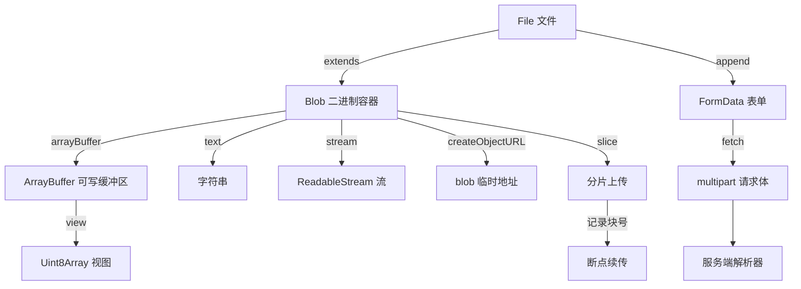
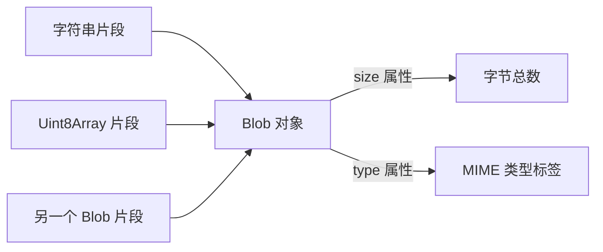
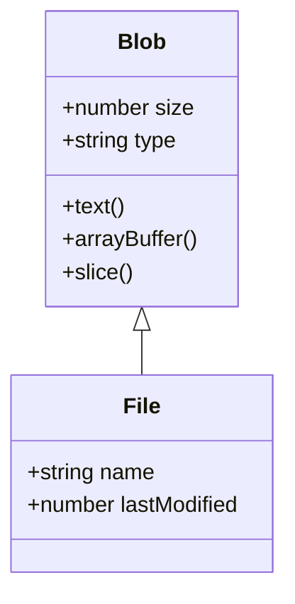
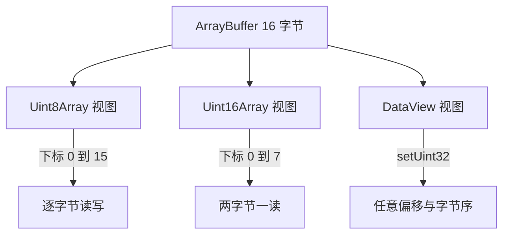
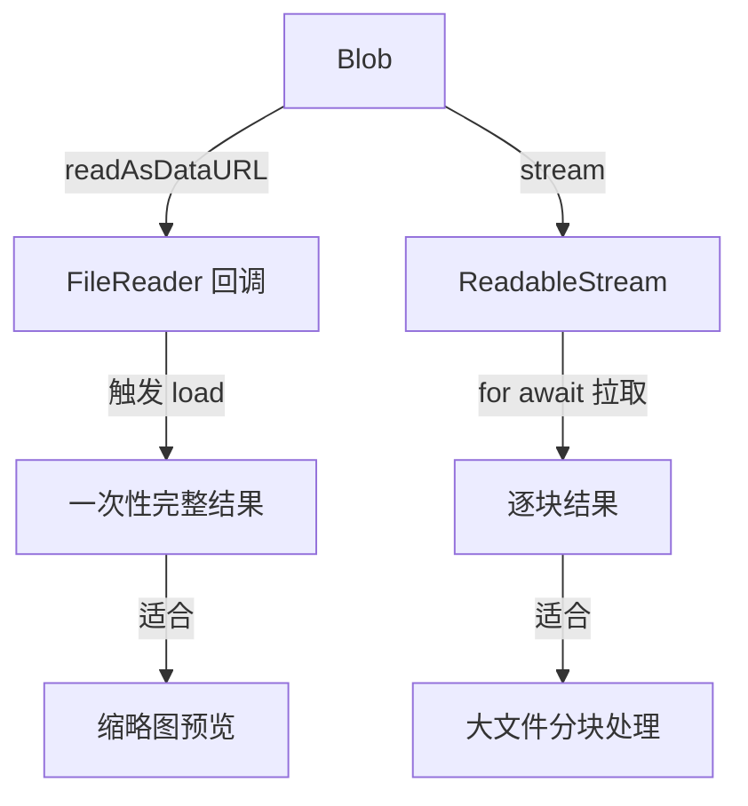
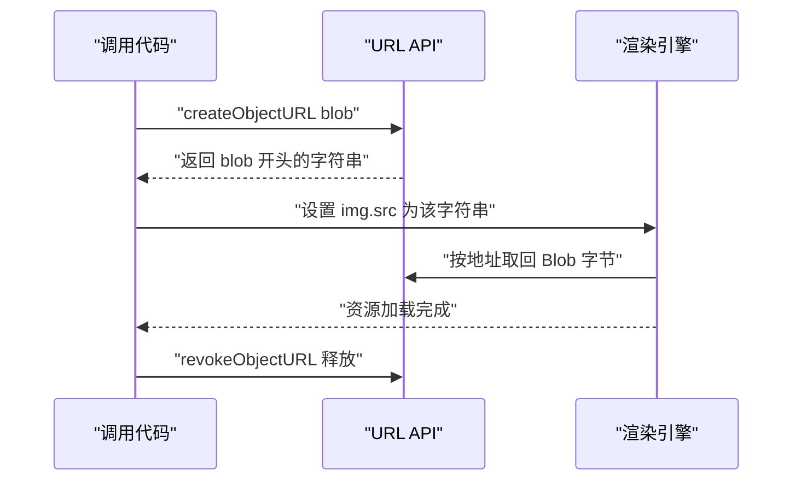
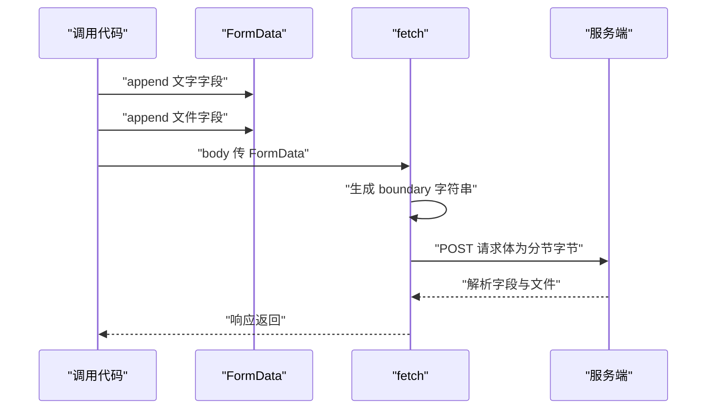
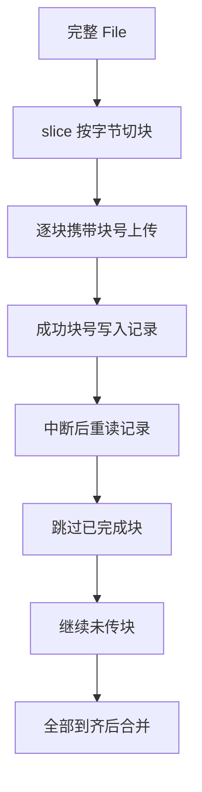
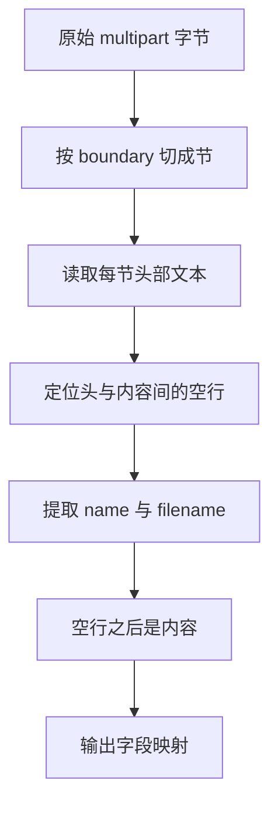

# File、Blob、FormData 与文件上传

!!! abstract "学完这一页你能"
    - 画出 Blob、File、ArrayBuffer 三者的继承与转换关系，并给给定场景选出正确的读取 API。
    - 用 FileReader 回调与 blob.stream() 异步迭代各写一段读取代码，说出推送与拉取的差异。
    - 用 FormData 配合 fetch 上传文件，解释 multipart 请求体的 boundary 分节结构。
    - 实现按字节切块的分片上传，记录已完成块号支持断点续传，并手写一个最小 multipart 解析器。

## 0. 知识地图



建议先读第 1 到 3 节，建立 Blob、File、ArrayBuffer 三者关系。再读第 4 到 6 节，掌握三种读取与引用方式。最后读第 7 到 8 节，完成上传与服务端还原的闭环。

!!! note "术语：multipart/form-data"
    一种把多个字段与文件放进一个 HTTP 请求体的编码格式，每节用 boundary 字符串分隔。例子：文字字段 nickname 和文件 avatar 共用一条 POST 请求。

## 1. Blob：二进制数据的统一容器

**先想一个问题**：input 选中的文件、fetch 拿到的响应体、canvas 导出的图片，都是一堆字节，浏览器用什么统一表示它们？

**心智模型**

!!! tip "心智模型"
    一句话模型：Blob 是一个只读的字节盒子，盒子上贴着 size 和 type 两张标签。日常类比：Blob 像快递盒，知道里面装了多少字节和类型说明，但不能拆开改。类比在哪里不成立：快递盒有实物仓库地址，Blob 的数据在内存或磁盘，具体位置由浏览器决定。

**图解**



1. 字符串、Uint8Array、其他 Blob 都可以作为构造片段。
2. 构造时 Blob 把片段按顺序拼起来，不提供内部随机访问。
3. 外部只能通过 size 拿总字节数，通过 type 拿类型标签。

**一步一步来**

**第 1 步：用字符串和字节数组构造一个 Blob**

这一步要做什么：把两段不同来源的数据拼成一个 Blob，并读取它的两个属性。

```javascript
// 构造一个 Blob，内容来自字符串与字节数组
const part1 = new TextEncoder().encode("hello "); // 字符串转成 UTF 8 字节
const part2 = "world"; // 纯字符串片段
const blob = new Blob([part1, part2], { type: "text/plain" }); // 拼成一个 Blob
console.log(blob.size); // 11
console.log(blob.type); // text/plain
```

**这段代码在做什么**
- TextEncoder 把 "hello " 编码为 6 个字节的 Uint8Array。
- new Blob 接受片段数组，把 Uint8Array 和字符串按顺序拼接。
- 第二个参数 type 只贴标签，不改变实际字节。
- size 是拼接后的总字节数，包括空格。
- type 是构造时传入的字符串，浏览器不会校验它是否与内容一致。

**第 2 步：从 Blob 取回文本**

这一步要做什么：调用 blob.text() 异步解码全部字节为字符串，验证拼接结果。

```javascript
const text = await blob.text(); // 把 Blob 解码成字符串
console.log(text); // hello world
```

**这段代码在做什么**
- blob.text() 返回 Promise，适合 await。
- 解码使用 UTF 8 编码，与 TextEncoder 一致。
- 结果为 "hello world"，证明两段数据按序拼接成功。

运行结果：

```text
11
text/plain
hello world
```

**动手验证**

Node 20+ 全局提供 Blob 与 TextEncoder，单文件可直接运行，无第三方依赖。

```javascript
// blob-basic.mjs
import assert from "node:assert";
const part1 = new TextEncoder().encode("hello ");
const blob = new Blob([part1, "world"], { type: "text/plain" });
assert.equal(blob.size, 11);
assert.equal(blob.type, "text/plain");
assert.equal(await blob.text(), "hello world");
console.log("全部断言通过：size、type、内容均符合预期");
```

预期输出：

```text
全部断言通过：size、type、内容均符合预期
```

**常见坑**

| 现象 | 原因 | 怎么修 |
| --- | --- | --- |
| blob.size 是 0 | 片段数组为空或异步数据未完成 | 检查片段数组非空，等待异步数据完成后构造 |
| type 与真实内容不符 | 构造时贴错标签 | 以字节为准，type 由调用方按真实格式填写 |
| 想修改 Blob 内容失败 | Blob 只读 | 用 arrayBuffer 取回字节，改完再构造新 Blob |

**小结**
- Blob 是只读字节容器，只有 size 与 type 两个属性。
- 构造 Blob 是拼接操作，不产生可写缓冲区。
- blob.text() 能按 UTF 8 取回完整字符串。

## 2. File：带元信息的 Blob 子类

**先想一个问题**：用户从磁盘选了 report.pdf，浏览器除了字节，还知道文件名和最后修改时间，这些信息放在哪里？

**心智模型**

!!! tip "心智模型"
    一句话模型：File 是 Blob 加了 name 与 lastModified 两个只读字段的子类。日常类比：File 像快递盒上贴了寄件单，多了文件名和寄出时间。类比在哪里不成立：快递单可以撕掉重贴，File 的 name 是构造时定死的只读字段。

**图解**



1. File 继承 Blob 的全部属性与方法。
2. File 额外提供 name 与 lastModified 两个只读字段。
3. File 可以传给任何接受 Blob 的函数，比如 FormData.append。

**一步一步来**

**第 1 步：用构造函数创建 File 对象**

这一步要做什么：用现有 Blob 字节加文件名，构造一个 File。

```javascript
const blob = new Blob(["报告正文"], { type: "text/plain" }); // 字节容器
const file = new File([blob], "report.txt", {
  type: "text/plain",
  lastModified: 1700000000000, // 毫秒时间戳
});
console.log(file.name); // report.txt
console.log(file.size); // 12
console.log(file instanceof Blob); // true
```

**这段代码在做什么**
- 先构造 Blob 作为字节来源。
- new File 接受片段数组、文件名、可选配置。
- lastModified 缺省时浏览器使用当前时间。
- file 继承 size 与 type，size 等于源 Blob 字节数。
- instanceof 验证 File 是 Blob 的子类实例。

**第 2 步：从 input 元素读取用户选中文件**

这一步要做什么：监听 change 事件，从 files 列表取 File，读名字和大小。

```html
<input id="picker" type="file">
<script>
  const input = document.getElementById("picker");
  input.addEventListener("change", () => {
    const file = input.files[0]; // 取第一个选中文件
    console.log(file.name); // 用户磁盘上的文件名
    console.log(file.size); // 文件字节数
  });
</script>
```

**这段代码在做什么**
- input type=file 是浏览器提供的文件选择控件。
- files 是 FileList，索引 0 取第一个 File。
- 属性值来自磁盘元数据，不经过网络。
- 重复选择同一文件时，浏览器重置 input.value，change 事件能再次触发。

**动手验证**

Node 20+ 全局提供 File，本脚本读取自身文件构造 File 并断言。

```javascript
// file-basic.mjs
import assert from "node:assert";
import fs from "node:fs/promises";
const bytes = await fs.readFile("./file-basic.mjs"); // 读本文件作为字节
const file = new File([bytes], "file-basic.mjs", { type: "text/javascript" });
assert.equal(file.name, "file-basic.mjs");
assert.equal(file.size, bytes.length);
assert.ok(file instanceof Blob);
assert.equal(file.type, "text/javascript");
console.log("全部断言通过：File 是带着 name 与 type 的 Blob");
```

预期输出：

```text
全部断言通过：File 是带着 name 与 type 的 Blob
```

**常见坑**

| 现象 | 原因 | 怎么修 |
| --- | --- | --- |
| file.name 没有路径 | 浏览器出于安全只给文件名 | 不要依赖路径，需要路径时自行拼接 |
| lastModified 是 0 | 部分系统不携带修改时间 | 上传前自行记录时间戳并随表单发送 |
| 修改 File 属性失败 | File 字段只读 | 构造新 File 对象替换 |

**小结**
- File 继承 Blob，多出 name 与 lastModified。
- input 元素的 files 列表提供用户选择的 File。
- File 可直接用于 FormData 上传，不需要额外转换。

## 3. ArrayBuffer 与 TypedArray：可读写的字节缓冲区

**先想一个问题**：Blob 只读，但你要给图片改几个像素、给文件头部加签名，字节读写该用哪个对象？

**心智模型**

!!! tip "心智模型"
    一句话模型：ArrayBuffer 是一块定长内存，TypedArray 是戴着不同眼镜看同一块内存的视图。日常类比：ArrayBuffer 像一块白板，Uint8Array 眼镜让你一格一格看字节，Uint32Array 眼镜让你四格四格看整数。类比在哪里不成立：白板可以擦掉重画任意长度，ArrayBuffer 一旦分配长度就固定，扩容只能新开一块内存。

**图解**



1. 同一块 ArrayBuffer 可以被多个视图同时观察。
2. Uint8Array 按 1 字节单元读写，Uint16Array 按 2 字节单元读写。
3. DataView 允许在任意偏移位置读写，并指定大端或小端字节序。

**一步一步来**

**第 1 步：创建 ArrayBuffer 并用 Uint8Array 写入字节**

这一步要做什么：分配 4 字节内存，写入 0 到 3 四个数。

```javascript
const buffer = new ArrayBuffer(4); // 分配 4 字节内存
const view = new Uint8Array(buffer); // 用字节视图观察
view[0] = 0x41; // A
view[1] = 0x42; // B
view[2] = 0x43; // C
view[3] = 0x44; // D
console.log(new TextDecoder().decode(buffer)); // ABCD
```

**这段代码在做什么**
- new ArrayBuffer(4) 分配一块 4 字节内存，初始全为 0。
- Uint8Array 视图按字节下标访问同一块内存。
- 四个赋值分别写入 A B C D 的 UTF 8 编码。
- TextDecoder 把字节按 UTF 8 解码回字符串。

运行结果：

```text
ABCD
```

**第 2 步：blob.arrayBuffer() 打通 Blob 与 ArrayBuffer**

这一步要做什么：把 Blob 的字节复制到一个新的 ArrayBuffer，验证副本独立。

```javascript
const blob = new Blob(["hello"]); // 只读容器
const ab = await blob.arrayBuffer(); // 复制出可写缓冲区
const bytes = new Uint8Array(ab); // 建立写视图
bytes[0] = 0x48; // 把 h 改成 H
console.log(new TextDecoder().decode(ab)); // Hello
console.log(await blob.text()); // 仍是 hello
```

**这段代码在做什么**
- blob.arrayBuffer() 返回新 ArrayBuffer，内容是 Blob 字节的副本。
- 修改副本不影响原 Blob，证明 Blob 只读。
- 输出两次内容，第二次证明原 Blob 没变。

运行结果：

```text
Hello
hello
```

**动手验证**

Node 20+ 全局提供 ArrayBuffer、Uint8Array、TextDecoder、Blob。

```javascript
// arraybuffer-basic.mjs
import assert from "node:assert";
const buffer = new ArrayBuffer(4);
const bytes = new Uint8Array(buffer);
bytes.set([0x41, 0x42, 0x43, 0x44]); // 一次写入四个字节
assert.equal(new TextDecoder().decode(buffer), "ABCD");
const blob = new Blob(["hello"]);
const ab = await blob.arrayBuffer();
const copy = new Uint8Array(ab);
copy[0] = 0x48;
assert.equal(new TextDecoder().decode(ab), "Hello");
assert.equal(await blob.text(), "hello");
console.log("全部断言通过：ArrayBuffer 可写，Blob 不因副本受影响");
```

预期输出：

```text
全部断言通过：ArrayBuffer 可写，Blob 不因副本受影响
```

**常见坑**

| 现象 | 原因 | 怎么修 |
| --- | --- | --- |
| Uint16Array 下标越界 | 一个 Uint16 元素占 2 字节，下标范围是 buffer.byteLength 的一半 | 用 byteLength 除以元素字节数计算可用下标 |
| 修改视图后 Blob 也变了 | 不会发生，Blob 只读 | 若需修改，用新 ArrayBuffer 重建 Blob |
| 跨端读错多字节数 | 网络协议常规定大端，本地 CPU 通常小端 | 跨端传输用 DataView 显式指定字节序 |

**小结**
- ArrayBuffer 是定长可写内存，Blob 是只读容器。
- TypedArray 是 ArrayBuffer 的固定步长视图。
- blob.arrayBuffer() 返回副本，修改副本不影响原 Blob。

## 4. FileReader 与流式读取：两种异步读法

**先想一个问题**：用户选了一个 50MB 的图片，你想拿到 data URL 做预览；另一场景是 2GB 视频，你想边读边处理分片。两种需求分别用什么工具？

**心智模型**

!!! tip "心智模型"
    一句话模型：FileReader 是事件推送式读取，blob.stream() 是按需拉取式读取。日常类比：FileReader 像外卖送达敲门，stream 像自助餐自取。类比在哪里不成立：外卖送达节奏由骑手决定，FileReader 的 load 事件触发时间同样由浏览器决定，消费者只能等。

**图解**



1. 两条路径起点都是 Blob。
2. 上路径通过 FileReader 发起读取，完成时触发 load，结果一次性交付。
3. 下路径通过 stream 逐块拉取，消费者控制读取节奏。
4. 缩略图预览选上路径，大文件加工选下路径。

!!! note "术语：FileReader"
    浏览器提供的事件驱动异步读取接口，能把 Blob 读成 data URL、ArrayBuffer 或文本。例子：reader.readAsDataURL(file) 完成后在 onload 里取 reader.result。

**一步一步来**

**第 1 步：用 FileReader 回调读取 data URL**

这一步要做什么：选择文件后，用 readAsDataURL 读取为 base64 数据地址用于预览。

```javascript
// Node 20+ 没有 DOM，提供最小 document 与 FileReader 兼容实现
class FileReader {
  onload = null;
  onerror = null;
  error = null;
  result = null;
  readAsDataURL(blob) {
    blob.arrayBuffer().then((arrayBuffer) => {
      this.result = `data:${blob.type || "application/octet-stream"};base64,${Buffer.from(arrayBuffer).toString("base64")}`;
      this.onload?.({ target: this });
    }).catch((err) => {
      this.error = err;
      this.onerror?.();
    });
  }
}
const picker = {
  files: [new Blob(["hello"], { type: "text/plain" })],
  addEventListener(type, handler) {
    if (type === "change") this.onChange = handler;
  }
};
const preview = { src: "" };
const document = {
  getElementById(id) {
    if (id === "picker") return picker;
    if (id === "preview") return preview;
    return null;
  }
};

const input = document.getElementById("picker");
input.addEventListener("change", () => {
  const reader = new FileReader(); // 新建读卡器
  reader.onload = (event) => {
    const dataUrl = event.target.result; // 读取结果
    document.getElementById("preview").src = dataUrl; // img 预览
  };
  reader.onerror = () => console.error(reader.error); // 失败回调
  reader.readAsDataURL(input.files[0]); // 开始读取
});
input.onChange(); // 触发 change 事件
await new Promise((resolve) => setImmediate(resolve)); // 等待读取完成
console.log(preview.src); // 输出预览地址
```

**这段代码在做什么**
- onload 在读取成功时触发，result 可用。
- event.target.result 是完整的 data URL，以 data: 开头。
- onerror 在文件不可读时触发，reader.error 携带原因。
- readAsDataURL 是异步的，调用后代码继续执行不阻塞。

**第 2 步：用 Promise 包装 FileReader 读 ArrayBuffer**

这一步要做什么：把 FileReader 回调转成 Promise，配合 await 计算文件指纹。

```javascript
async function fileHash(file) {
  const buffer = await new Promise((resolve, reject) => {
    const reader = new FileReader();
    reader.onload = () => resolve(reader.result); // 成功取结果
    reader.onerror = () => reject(reader.error); // 失败抛错
    reader.readAsArrayBuffer(file); // 读成 ArrayBuffer
  });
  const digest = await crypto.subtle.digest("SHA-256", buffer); // 哈希
  return [...new Uint8Array(digest)]
    .map((b) => b.toString(16).padStart(2, "0")).join("");
}
```

**这段代码在做什么**
- Promise 包装 FileReader 回调，把事件风格转成 await 风格。
- readAsArrayBuffer 得到 ArrayBuffer 结果。
- crypto.subtle.digest 是全异步的哈希计算接口。
- 最终返回 64 位十六进制字符串，用作文件指纹。

**第 3 步：用 blob.stream() 异步迭代读取**

这一步要做什么：用 for await 逐块读取大文件，避免一次性进内存。

```javascript
async function readByStream(blob) {
  const chunks = []; // 收集所有块
  for await (const chunk of blob.stream()) { // 异步迭代块
    chunks.push(chunk); // 每块都是 Uint8Array
  }
  return new Blob(chunks).text(); // 拼回再解码
}
```

**这段代码在做什么**
- blob.stream() 是异步可迭代对象。
- for await 内部完成 read 循环与背压等待。
- 收集块后重建 Blob，复用 text 方法解码。
- 适合大文件，因为内存中同时只有一块。

**动手验证**

Node 20 未全局暴露 FileReader（需核对官方文档：nodejs 全局对象列表是否含 FileReader）。本脚本用 blob.arrayBuffer() 验证等价路径，用 stream 验证分块路径。

```javascript
// filereader-stream.mjs
import assert from "node:assert";
const blob = new Blob(["读取测试"], { type: "text/plain" });
// FileReader 等价路径：Node 20 用 arrayBuffer 替代
const ab = await blob.arrayBuffer();
assert.equal(new TextDecoder().decode(ab), "读取测试");
// stream 路径：逐块收集后拼回
const chunks = [];
for await (const chunk of blob.stream()) chunks.push(chunk);
assert.equal(await new Blob(chunks).text(), "读取测试");
assert.ok(chunks.every((c) => Object.prototype.toString.call(c) === "[object Uint8Array]"));
console.log("断言通过：两路读取结果一致，块均为 Uint8Array");
```

预期输出：

```text
断言通过：两路读取结果一致，块均为 Uint8Array
```

**常见坑**

| 现象 | 原因 | 怎么修 |
| --- | --- | --- |
| 回调里同步读 result 为空 | 读取未完成就取结果 | 在 onload 或 await 之后取 result |
| 复用同一 reader 读两个文件 | 一次只处理一个任务，新 read 终止旧任务 | 每个文件新建 FileReader 实例 |
| stream 多字节字符乱码 | 块边界把一个字符切成两半 | 用 TextDecoder 传 stream 参数，或收集后整体解码 |

**小结**
- FileReader 靠事件回调异步读取，结果一次性交付。
- blob.stream() 靠异步迭代逐块拉取，适合大文件。
- 用 Promise 包装 FileReader 后，可配合 await 写线性代码。

## 5. 对象 URL：给 Blob 一个临时地址

**先想一个问题**：你拿到一个 Blob，想让 img、video、下载链接直接使用，但找不到一个 http 服务器托管它，怎么办？

**心智模型**

!!! tip "心智模型"
    一句话模型：URL.createObjectURL 把内存里的 Blob 映射成一个 blob: 开头的短地址，供同一页面资源直接引用。日常类比：对象 URL 像商场储物柜的取件码，扫码能从柜子里取物，柜子只属于这个商场。类比在哪里不成立：取件码可以长期有效，对象 URL 在页面关闭或手动 revoke 后立即失效。

**图解**



1. createObjectURL 返回形如 blob:https://site/uuid 的字符串。
2. 渲染引擎通过该地址访问内存里的 Blob 字节。
3. 地址不经过网络，只对当前文档有效。
4. 不再使用时调 revokeObjectURL，释放浏览器维护的映射。

**一步一步来**

**第 1 步：为图片 Blob 生成对象 URL 并预览**

这一步要做什么：把 canvas 导出的图片 Blob 变成 img 可显示地址。

```javascript
const canvas = {
  toBlob(callback) {
    callback(new Blob(["canvas"], { type: "image/png" })); // 模拟画布导出的 Blob
  }
};
const img = typeof preview !== "undefined" ? preview : { src: "" }; // 复用已有预览对象或提供模拟元素
canvas.toBlob((blob) => {
  const url = URL.createObjectURL(blob); // 生成临时地址
  img.src = url; // 引擎按地址取字节
  img.onload = () => URL.revokeObjectURL(url); // 加载后释放
  img.onload(); // Node 没有图片加载事件，手动触发释放
});
```

**这段代码在做什么**
- toBlob 把画布内容导出为图片 Blob。
- createObjectURL 返回短地址，不复制字节。
- img.src 加载完触发 onload。
- 在 onload 里 revoke，避免映射长期占用。

**第 2 步：生成下载链接**

这一步要做什么：把 Blob 变成 a 标签可下载的地址。

```javascript
function downloadBlob(blob, filename) {
  const url = URL.createObjectURL(blob); // 临时地址
  const a = document.createElement("a"); // 建一个隐藏链接
  a.href = url;
  a.download = filename; // 指定下载文件名
  a.click(); // 触发浏览器下载
  setTimeout(() => URL.revokeObjectURL(url), 1000); // 下载启动后释放
}
```

**这段代码在做什么**
- a.download 让浏览器下载而非导航。
- click 触发下载，随后延时释放地址。
- 延时 1000 毫秒是给浏览器建立下载任务的窗口，不是精确契约。

**动手验证**

Node 20 没有 URL.createObjectURL（需核对官方文档：nodejs 的 url 模块导出列表）。本脚本用 data URL 验证地址指回字节的等价路径。

```javascript
// objecturl-equivalent.mjs
import assert from "node:assert";
const blob = new Blob(["对象地址测试"], { type: "text/plain" });
// 浏览器中：const url = URL.createObjectURL(blob); 然后 img.src = url
// Node 20 无该 API，用 data URL 验证地址能取回同一内容
const dataUrl = `data:${blob.type};base64,` +
  Buffer.from(await blob.arrayBuffer()).toString("base64");
const res = await fetch(dataUrl);
assert.equal(await res.text(), "对象地址测试");
console.log("断言通过：地址指回的字节与原 Blob 一致");
```

预期输出：

```text
断言通过：地址指回的字节与原 Blob 一致
```

**常见坑**

| 现象 | 原因 | 怎么修 |
| --- | --- | --- |
| 刷新后地址失效 | blob: 地址仅对当前文档有效 | 不要持久化 blob: 地址 |
| 内存占用持续上升 | 创建后从不 revoke | 在 onload 或不需要时调 revokeObjectURL |
| 下载文件名不生效 | 跨源时部分浏览器忽略 download | 同源部署或改用服务端 Content-Disposition |

**小结**
- createObjectURL 生成内存 Blob 的 blob: 地址。
- 用途是 img、video、下载链接的临时引用。
- 用完必须 revokeObjectURL 释放映射。

## 6. FormData 与 multipart/form-data 编码

**先想一个问题**：一个注册表单同时有文字昵称和头像文件，fetch 怎么把这两种类型装进一个请求体发出去？

**心智模型**

!!! tip "心智模型"
    一句话模型：FormData 是携带字段与文件的提交表单，fetch 把每个字段包装成带独立头的分节，用 boundary 分隔。日常类比：FormData 像分区快递箱，每个格子里有物品和一张说明条，箱子用隔板隔开。类比在哪里不成立：快递隔板是物理的，multipart 的分隔靠一条随机 boundary 字符串在字节流里做标记。

**图解**



1. append 按字段名推进 FormData。
2. fetch 自动生成随机 boundary 并设置 Content-Type。
3. 请求体由若干节组成，每节头部说明字段名与类型。
4. 服务端按 boundary 切分还原字段与文件。

**一步一步来**

**第 1 步：构造 FormData 并发送**

这一步要做什么：把昵称与头像 File 放进 FormData，交给 fetch 发送。

```javascript
const file = new File(["头像字节"], "avatar.png", { type: "image/png" }); // 文件
const form = new FormData(); // 新建表单数据
form.append("nickname", "小明"); // 文字字段
form.append("avatar", file); // 文件字段
const response = await fetch("https://example.com/upload", {
  method: "POST",
  body: form, // fetch 自动处理 multipart 编码
});
```

**这段代码在做什么**
- append 的第一个参数是字段名，第二个是值。
- 值为 File 时，fetch 读取 name 与 type 写入该节头部。
- 传入 FormData 时不要手动设置 Content-Type，fetch 会追加 boundary。
- 手动设置反而会丢失 boundary，服务端无法切分。

**第 2 步：查看 multipart 请求体的原始形态**

这一步要做什么：手写一版 multipart 文本，理解分节结构。

```text
--X-BOUNDARY
Content-Disposition: form-data; name="nickname"

小明
--X-BOUNDARY
Content-Disposition: form-data; name="avatar"; filename="avatar.png"
Content-Type: image/png

头像字节
--X-BOUNDARY--
```

**这段代码在做什么**
- 每节以 --boundary 开始，最后以 --boundary-- 结束。
- 节内第一行是 Content-Disposition，说明字段名。
- 文件节多出 filename 与 Content-Type 两行。
- 头部与内容之间空一行。

**动手验证**

Node 20+ 全局提供 FormData、File、fetch；用本地 http 服务器捕获请求体并断言。

```javascript
// formdata-upload.mjs
import assert from "node:assert";
import http from "node:http";
const server = http.createServer((req, res) => {
  const chunks = [];
  req.on("data", (c) => chunks.push(c));
  req.on("end", () => {
    const body = Buffer.concat(chunks).toString("utf8");
    assert.match(req.headers["content-type"], /multipart\/form-data; boundary=/);
    assert.match(body, /name="nickname"/);
    assert.match(body, /filename="reports.txt"/);
    res.end("ok");
    server.close();
  });
});
await new Promise((resolve) => server.listen(0, resolve));
const port = server.address().port;
const form = new FormData();
form.append("nickname", "小明");
form.append("file", new File(["第一行"], "reports.txt", { type: "text/plain" }));
const res = await fetch(`http://127.0.0.1:${port}/upload`, { method: "POST", body: form });
assert.equal(res.status, 200);
console.log("断言通过：Content-Type 带 boundary，请求体含两节字段");
```

预期输出：

```text
断言通过：Content-Type 带 boundary，请求体含两节字段
```

**常见坑**

| 现象 | 原因 | 怎么修 |
| --- | --- | --- |
| 服务端说缺 boundary | 手动设置 Content-Type 覆盖了自动值 | 传 FormData 时不设置 Content-Type |
| 中文文件名乱码 | 部分服务端按 Latin 1 解析文件名 | 统一 UTF 8 或与服务端约定编码 |
| 大文件整包进内存 | FormData 串行化时整包驻留内存 | 换分片上传或流式请求体 |

**小结**
- FormData 同时携带文字字段与 File。
- fetch 自动完成 multipart 编码与 boundary 生成。
- 原始请求体由多节组成，节间用 boundary 分隔。

## 7. 分片上传与断点续传：大文件的可靠传输

**先想一个问题**：2GB 的视频一次放进 FormData，内存可能爆；网络一断就要重传全部。怎么把文件拆小、分开传，断了还能继续？

**心智模型**

!!! tip "心智模型"
    一句话模型：分片上传用 slice 把文件切成固定大小块逐块发送，断点续传再给每块记一笔成功账，重试时从没记过的块继续。日常类比：分片像把长视频拆成多段快递，每段写编号；续传像读书夹书签，下次从书签继续。类比在哪里不成立：快递可能乱序到达，服务端必须按编号排序合并，缺一块就要单独补传。

**图解**



1. slice 按字节偏移切块，块大小固定。
2. 每块携带文件标识、块号、总块数上传。
3. 成功一块就记录一块，记录要持久化。
4. 重试时读记录跳过已传块，服务端按块号合并。

**一步一步来**

**第 1 步：用 slice 切块**

这一步要做什么：把文件按 4MB 一份切成块数组。

```javascript
const CHUNK_SIZE = 4 * 1024 * 1024; // 每块 4MB
function sliceFile(file) {
  const chunks = [];
  let start = 0; // 当前块起点
  while (start < file.size) {
    const end = Math.min(start + CHUNK_SIZE, file.size); // 终点不超文件尾
    chunks.push(file.slice(start, end, file.type)); // 切出块
    start = end; // 推进到下一块起点
  }
  return chunks;
}
```

**这段代码在做什么**
- CHUNK_SIZE 是固定块大小，按字节数算。
- slice 的 start 与 end 均按字节偏移。
- 最后一块的 end 收窄到 file.size。
- 第三参数保留原文件的 type。

**第 2 步：逐块上传并携带块号**

这一步要做什么：把每块与块号一起放进 FormData 发送。

```javascript
async function uploadChunks(file, uploadId) {
  const chunks = sliceFile(file);
  for (let i = 0; i < chunks.length; i++) {
    const form = new FormData();
    form.append("uploadId", uploadId); // 同一次上传的标识
    form.append("index", String(i)); // 第几块
    form.append("total", String(chunks.length)); // 总块数
    form.append("chunk", chunks[i], file.name); // 块本身
    await fetch("/upload-chunk", { method: "POST", body: form }); // 逐块等待
  }
}
```

**这段代码在做什么**
- uploadId 由客户端或服务端生成，标识同一文件。
- index 从 0 开始，total 告知服务端何时能合并。
- 每块用独立 fetch，await 保证顺序提交。
- 生产场景可并发数块，但服务端要支持乱序到达。

**第 3 步：维护已完成块号集合**

这一步要做什么：用内存 Map 模拟持久化存储，记录成功块号。

```javascript
const done = new Map(); // 实际可换 localStorage
function mark(uploadId, index) {
  const list = done.get(uploadId) || new Set(); // 取该任务集合
  list.add(index); // 加入成功块号
  done.set(uploadId, list); // 写回
}
function isDone(uploadId, index) {
  return (done.get(uploadId) || new Set()).has(index); // 判断是否已传
}
```

**这段代码在做什么**
- 每个 uploadId 对应一个 Set，存已完成块号。
- mark 在服务端确认块成功后调用。
- isDone 在逐块循环前判断是否需要重传。
- 生产场景把 Map 换成 localStorage 或服务端接口。

**第 4 步：按记录跳过已传块**

这一步要做什么：循环时对已完成块直接跳过，从断点继续。

```javascript
async function uploadWithResume(file, uploadId) {
  const chunks = sliceFile(file);
  for (let i = 0; i < chunks.length; i++) {
    if (isDone(uploadId, i)) { // 断点检查
      console.log("跳过第", i, "块");
      continue; // 不重传
    }
    await uploadOneChunk(uploadId, i, chunks.length, chunks[i]); // 上传第 2 步封装
    mark(uploadId, i); // 成功后记账
    console.log("完成第", i, "块");
  }
}
```

**这段代码在做什么**
- 循环开始先查 isDone。
- 已传的块 continue 跳过，未传的块照常上传。
- 成功后立即 mark，缩短中断丢记录窗口。
- 下一次运行 uploadWithResume 时，前置记录已存在。

**动手验证**

Node 20+ 全局提供 File、FormData、fetch；本脚本断言切块与断点逻辑，用本地 http 服务器合并块。

```javascript
// chunk-resume.mjs
import assert from "node:assert";
import http from "node:http";
const CHUNK_SIZE = 4;
const file = new File(["0123456789"], "d.txt"); // 10 字节
// 切块
const chunks = [];
for (let start = 0; start < file.size; start += CHUNK_SIZE) {
  chunks.push(file.slice(start, Math.min(start + CHUNK_SIZE, file.size)));
}
assert.equal(chunks.length, 3); // 4 加 4 加 2
// 断点记录：模拟第一块已传
const done = new Set([0]);
const pending = [0, 1, 2].filter((i) => !done.has(i));
assert.deepEqual(pending, [1, 2]);
// 本地服务器合并块内容
const received = [];
const server = http.createServer((req, res) => {
  const parts = [];
  req.on("data", (c) => parts.push(c));
  req.on("end", () => {
    received.push(Buffer.concat(parts).toString());
    res.end("ok");
    if (received.length === pending.length) { server.close(); check(); }
  });
});
await new Promise((resolve) => server.listen(0, resolve));
const port = server.address().port;
for (const i of pending) {
  const form = new FormData();
  form.append("chunk", chunks[i], "d.txt");
  await fetch(`http://127.0.0.1:${port}/up`, { method: "POST", body: form });
}
function check() {
  assert.equal(received.join(""), "456789"); // 块 1 与块 2 的内容
  console.log("断言通过：切出 3 块，跳过已传块 0，补传块 1 与块 2");
}
```

预期输出：

```text
断言通过：切出 3 块，跳过已传块 0，补传块 1 与块 2
```

**常见坑**

| 现象 | 原因 | 怎么修 |
| --- | --- | --- |
| 合并后文件损坏 | 服务端忽略 index 只按到达序拼接 | 合并前按 index 排序 |
| 重复传已完成的块 | 记账写在 await 前，失败也记成功 | 先等响应成功再 mark |
| 刷新后记录丢失 | 记录只在内存 | 持久化到 localStorage 或服务端接口 |

**小结**
- slice 按字节偏移切块，不修改原文件。
- 每块上传携带 uploadId、index、total 三个元信息。
- 服务端按 index 排序合并，客户端按记录跳过已传块。

## 8. 手写 multipart 解析器：服务端还原文件

**先想一个问题**：服务端收到的就是一段带 boundary 的原始字节，怎么用代码把它切成字段名、文件名和文件内容？

**心智模型**

!!! tip "心智模型"
    一句话模型：解析器把字节流按 boundary 分成节，每节先读头部行，再按空行把头部与内容分开。日常类比：解析器像快递分拣，先看分拣码找箱界，再看说明条确定物品归属。类比在哪里不成立：快递分拣靠物理搬运，解析器只能顺序扫描字节，不能跳读，边界匹配必须逐字节核对。

**图解**



1. 先按 --boundary 把整个请求体切成多个节。
2. 每节内部第一个空行之前是头部文本。
3. 用正则从 Content-Disposition 提取 name 与 filename。
4. 空行之后的字节就是该节的字段值或文件内容。

!!! note "术语：Content-Disposition"
    multipart 节头部里描述该节用途的行，name 是字段名，filename 是原文件名。例子：Content-Disposition: form-data; name="avatar"; filename="a.png"。

**一步一步来**

**第 1 步：按 boundary 切分并定位节**

这一步要做什么：把原始字符串按 boundary 分割成待解析的节数组。

```javascript
function parseMultipart(body, boundary) {
  const delim = `--${boundary}`; // 分节标记
  return body.split(delim) // 按标记切分
    .map((p) => p.trim()) // 去每节两端换行
    .filter((p) => p.length > 0 && p !== "--"); // 去掉空节与结尾标记
}
```

**这段代码在做什么**
- boundary 来自 Content-Type 头部的 boundary= 参数。
- split 后首尾出现空串或 --，需过滤。
- trim 去掉节前节后的换行，便于头部解析。
- 返回的每节包含头部与内容两部分。

**第 2 步：解析单节头部与内容**

这一步要做什么：用空行分割头部与内容，提取字段名和文件名。

```javascript
function parsePart(part) {
  const idx = part.indexOf("\r\n\r\n"); // 定位头部结束
  const head = part.slice(0, idx); // 头部文本
  const bodyText = part.slice(idx + 4); // 内容文本
  const nameMatch = head.match(/name="([^"]*)"/); // 提取 name
  const fileMatch = head.match(/filename="([^"]*)"/); // 提取 filename
  return {
    name: nameMatch ? nameMatch[1] : "",
    filename: fileMatch ? fileMatch[1] : "",
    body: bodyText,
  };
}
```

**这段代码在做什么**
- CRLF 加 CRLF 是 HTTP 头与体的分隔符。
- 正则按引号提取 name 与 filename。
- body 从分隔符后开始，到节尾原样保留。
- 生产解析要按字节处理二进制，本例为文本场景。

**第 3 步：组装完整解析入口**

这一步要做什么：把切分与单节解析组合，输出字段名到内容的映射。

```javascript
function parse(body, boundary) {
  const result = new Map();
  for (const part of parseMultipart(body, boundary)) {
    const info = parsePart(part);
    result.set(info.name, { filename: info.filename, body: info.body }); // name 为键
  }
  return result;
}
```

**这段代码在做什么**
- 遍历每节并解析成 info。
- Map 以字段名做键。
- 值包含 filename 与内容，文字字段的 filename 为空串。

**动手验证**

Node 20+ 单文件，用手工构造的 multipart 文本驱动解析器并断言。

```javascript
// multipart-parser.mjs
import assert from "node:assert";
function parseMultipart(body, boundary) {
  const delim = `--${boundary}`;
  return body.split(delim).map((p) => p.trim())
    .filter((p) => p.length > 0 && p !== "--");
}
function parsePart(part) {
  const idx = part.indexOf("\r\n\r\n");
  const head = part.slice(0, idx);
  const bodyText = part.slice(idx + 4);
  const nameMatch = head.match(/name="([^"]*)"/);
  const fileMatch = head.match(/filename="([^"]*)"/);
  return { name: nameMatch ? nameMatch[1] : "", filename: fileMatch ? fileMatch[1] : "", body: bodyText };
}
function parse(body, boundary) {
  const result = new Map();
  for (const part of parseMultipart(body, boundary)) {
    const info = parsePart(part);
    result.set(info.name, { filename: info.filename, body: info.body });
  }
  return result;
}
const raw = [
  "--X-BOUNDARY",
  'Content-Disposition: form-data; name="nickname"',
  "",
  "小明",
  "--X-BOUNDARY",
  'Content-Disposition: form-data; name="avatar"; filename="a.png"',
  "Content-Type: image/png",
  "",
  "图片字节",
  "--X-BOUNDARY--",
  "",
].join("\r\n");
const result = parse(raw, "X-BOUNDARY");
assert.equal(result.get("nickname").body, "小明");
assert.equal(result.get("avatar").filename, "a.png");
assert.equal(result.get("avatar").body, "图片字节");
console.log("断言通过：解析出字段昵称与头像文件名及内容");
```

预期输出：

```text
断言通过：解析出字段昵称与头像文件名及内容
```

**常见坑**

| 现象 | 原因 | 怎么修 |
| --- | --- | --- |
| 最后一节多出空字段 | 结尾标记 -- 未过滤 | 过滤 trimmed 等于 -- 的节 |
| body 少了开头或结尾字符 | 对内容使用 trim 丢字节 | 文本场景可 trim，二进制必须按字节切片 |
| 字段值本身含 boundary 字样 | 边界与内容撞串 | 边界用随机长串，生产实现按字节流扫描 |

**小结**
- 解析 multipart 分两步：按 boundary 切节，节内按空行分头体。
- 头部用正则提取 name 与 filename。
- 生产解析器要按字节处理，不能对二进制内容做 trim。

## 综合对比

读取 Blob 内容的四种路径：

| 维度 | blob.text() | blob.arrayBuffer() | FileReader | blob.stream() |
| --- | --- | --- | --- | --- |
| 返回类型 | Promise 字符串 | Promise 缓冲区 | 事件回调里的 result | ReadableStream |
| 内存峰值 | 整份字符串 | 整份字节副本 | 整份结果 | 单块字节 |
| 适合场景 | 小文本配置 | 需要改写的二进制 | data URL 预览 | 大文件分块处理 |
| 能否取消 | 不可取消 | 不可取消 | 新 read 有终止语义 | reader.cancel 可取消 |
| 背压 | 无 | 无 | 无 | 有 |

上传策略对比：

| 维度 | FormData 整包 | 分片上传 | 分片加断点续传 |
| --- | --- | --- | --- |
| 内存占用 | 整文件在内存 | 每块在内存 | 每块在内存 |
| 失败重传 | 从头传 | 从头传 | 从断点传 |
| 服务端复杂度 | 低 | 中 | 高 |
| 适用大小 | 100MB 以下 | 100MB 到几 GB | 需要稳定续传的场景 |

## 应用与行业实践

本章把前面的 API 放回真实工程里：哪些场景该用哪套 API，怎么度量改动是否有效，什么情况下要停手。

### 应用场景地图

| 场景 | 用到本页哪个知识点 | 典型技术选型 | 注意事项 |
| --- | --- | --- | --- |
| 后台管理导出万行订单 CSV | Blob 构造、对象 URL 下载 | `new Blob([csv])` + `<a download>` | 显式写 `type: 'text/csv;charset=utf-8'`，否则浏览器可能按纯文本保存 |
| 低端安卓巡检 App 的相册首屏 | File 是 Blob 子类、`createObjectURL` | IntersectionObserver + `img.src` | 进入视口才建地址，`onload` 里立即 revoke，别把原图读成 data URL |
| 弱网下的课程视频作业上传 | `slice` 分片、FormData、fetch | 前端分片 + 服务端合并，本地记录块号 | 按字节切，并发控制在 3 到 4 路，服务端要校验总字节数 |
| 客服工单里粘贴截图直接提交 | 剪贴板给的 File、FormData | `paste` 事件 + FormData + fetch | `append` 第三参补文件名，后端字段名要和它一致 |
| 浏览器端打包错误日志上报 | Blob、ArrayBuffer 与 TypedArray | 组装日志文本成 Blob，交给 `sendBeacon` | Blob 必须写 type，体积要设上限并在超限时截断 |
| 多人协作白板的历史快照存档 | Blob 可存 IndexedDB | 快照序列化成 Blob 存 IDB | 读回时要带版本字段，旧格式要能迁移 |
| 扫描件 PDF 多页合并 | `arrayBuffer()` 读取 | 各页读成 ArrayBuffer 后拼接 | 大文件逐页处理，别一次性把全部字节放内存 |
| 录音分段上传做转写 | MediaRecorder 产 Blob、FormData | `timeslice` 分片逐片上传 | 每片带序号与时间戳，服务端按序拼接 |

### 三个场景拆解

#### 场景 1：弱网下的课程视频上传

**业务背景**：学员用手机上传几百 MB 的录屏作业，进出电梯就断网，一次中断整段传输白做。用 DevTools 的 Network 面板能看到进度条归零后请求重新开始。

**怎么用本页知识解决**：思路是把文件按字节切成固定大小的块，每块单独发一个 multipart 请求，本地记录已完成块号，重进页面只补缺失的块。

```js
async function upload(file, doneSet) {                 // doneSet 存已完成块号，可从本地读回
  const CHUNK = 4 * 1024 * 1024;                       // 每片 4MB，按字节切
  const total = Math.ceil(file.size / CHUNK);          // 总片数，用来算进度
  for (let i = 0; i < total; i++) {
    if (doneSet.has(i)) continue;                      // 已传过的块直接跳过，这就是续传
    const blob = file.slice(i * CHUNK, (i + 1) * CHUNK); // File 继承 Blob，可直接切片
    const fd = new FormData();                         // 每片一个 multipart 请求体
    fd.append('index', i);                             // 片号，服务端按它排位
    fd.append('chunk', blob, `${file.name}.part`);     // 第三参给分片一个文件名
    await fetch('/upload', { method: 'POST', body: fd });
    doneSet.add(i);                                    // 传完立刻落盘，别攒到最后
  }
  await fetch('/merge', { method: 'POST' });           // 服务端按片号拼回完整文件
}
```

- `file.slice` 走的是 Blob 的字节区间语义，起止都是字节偏移，不用先读进内存。
- `doneSet` 每次请求成功后立即写入，刷新页面才有可续的起点。
- 合并放在服务端做，前端只负责保证片号与顺序信息完整。
- 单片失败只重发该片，重试逻辑写在上传循环里，不放到合并阶段。

**怎么度量收益**：看两个指标。一是 DevTools Network 面板里单次请求的 size 与失败后重试次数；二是服务端记录的补传字节占比，即续传字节除以文件总字节，断网一次后该值应明显小于 1。前端用 PerformanceObserver 订阅 `resource`，拿到每个分片的 `duration`。

**什么时候不该用**：文件只有几十 KB 时，切片的请求开销超过传输本身，可直接整文件上传。服务端无法按片号排位、也不接受乱序到达时，分片只会把错误推后暴露。

#### 场景 2：低端安卓的首屏缩略图

**业务背景**：巡检 App 的相册页一屏要显示几十张原图，旧写法一次性读成 data URL，滚动掉帧并触发内存告警。在低端机上用 DevTools 的 Memory 面板取两次堆快照即可复现增长。

**怎么用本页知识解决**：思路是不复制字节，用 File 直接建临时地址交给浏览器的图片解码器，进视口才建，解码完立即释放。

```js
const io = new IntersectionObserver((entries) => {
  for (const e of entries) {
    if (!e.isIntersecting) continue;                 // 没进视口就不做任何事
    const file = e.target.__file;                    // 行初始化时挂上的 File 对象
    const url = URL.createObjectURL(file);           // 只建地址，不读字节
    e.target.src = url;                              // 浏览器按需解码
    e.target.onload = () => URL.revokeObjectURL(url); // 解码完立刻释放引用
    io.unobserve(e.target);                          // 一张图只处理一次
  }
});
```

- `createObjectURL` 接受任何 Blob，File 直接可用，省掉一次全量读取。
- `revokeObjectURL` 必须调用，否则地址背后的字节不会释放。
- `unobserve` 防止列表复用元素时重复建地址。
- 若要在 `` 之外拿到字节，用 `file.arrayBuffer()` 或 `blob.stream()`，不要退回 FileReader 的 data URL。

**怎么度量收益**：用 Lighthouse 的移动端配置看 LCP 与 Total Blocking Time；用 DevTools Memory 面板取操作前后两次堆快照，对比 Detached 节点与 Blob 对象计数；用 Performance 面板确认滚动期间没有长任务。

**什么时候不该用**：要把图片字节长期存在本地并跨会话读取时，对象 URL 只在当前文档有效，应改存 IndexedDB。对接的服务端只接受 base64 字符串时，得先读成 data URL 再发。

#### 场景 3：工单里粘贴截图随表单提交

**业务背景**：客服在工单页说明问题时要附带截图，旧流程要求先保存成文件再点选路径，步骤多且容易选错。把这段流程缩短是提升提单完成率的直接手段。

**怎么用本页知识解决**：思路是监听粘贴事件，从剪贴板直接拿到 File，和表单字段一起塞进 FormData，一次请求发出去。

```js
form.addEventListener('paste', async (ev) => {
  const items = ev.clipboardData.items;                  // 剪贴板里的条目列表
  const item = [...items].find(i => i.type.startsWith('image/'));
  if (!item) return;                                     // 不是图片就交给默认行为
  const blob = item.getAsFile();                         // 拿到的是 File，可当 Blob 用
  preview.src = URL.createObjectURL(blob);               // 先本地预览
  const fd = new FormData(form);                         // 带上表单已有字段
  fd.append('shot', blob, 'paste.png');                  // 第三参补文件名
  await fetch('/tickets', { method: 'POST', body: fd }); // fetch 自动生成 boundary
});
```

- `getAsFile()` 返回 File，继承自 Blob，能直接进 FormData。
- `new FormData(form)` 会把已有输入项一起带上，避免手工拼字段。
- 第三个参数决定服务端看到的文件名，缺省时会出现 `blob` 这种名字。
- 请求头不要手写 `Content-Type`，让 fetch 自己带 boundary。

**怎么度量收益**：前端埋点测「进入工单页到提交成功」的时长中位数；服务端统计带附件的工单占比，以及附件相关请求的 4xx 率，用来发现体积超限与字段名不匹配。

**什么时候不该用**：剪贴板里可能是从网页复制的富文本片段，这时要读 `text/html` 再决定怎么处理。需要多文件、拖拽排序、暂停恢复时，用现成上传组件，不要在 paste 回调上继续加逻辑。

### 行业先进实践

**可续传上传协议（出处：tus.io 官方协议文档）**
做法是把「块号」换成服务端权威的偏移量：先 HEAD 查询 `Upload-Offset`，再从该偏移 PATCH 续写。它有效的原因是客户端不需要自己维护进度真相，服务端说了算，多标签页和刷新都不会错位。借鉴方式是把本地 doneSet 换成向服务端查询偏移。

**对象存储的分片上传（出处：AWS S3 官方文档）**
流程是 CreateMultipartUpload 开启会话、UploadPart 逐片上传、CompleteMultipartUpload 收尾，合并由存储侧完成。它把拼接、校验、存储三件事从应用服务器移走。分片字节数有下限，需核对官方文档：UploadPart 允许的最小分片大小。

**可续传上传会话（出处：Google Drive API 官方文档）**
做法是先发起一次请求拿到 session URI，后续请求都打这个 URI，并只发分片大小整数倍的字节。会话 URI 让页面刷新后仍能接着传。借鉴方式是把续传凭证交给服务端下发，前端只存 URI。

**对象 URL 的释放约定（出处：MDN Web Docs 的 URL.createObjectURL 页面）**
文档要求在用完后调用 `URL.revokeObjectURL`，因为该地址会一直持有对 Blob 的引用。把 revoke 放进 `onload` 与 `onerror` 两个回调，能覆盖解码失败的情况。借鉴方式是把「建地址」和「释放地址」写进同一个函数，禁止跨函数传递未托管的对象 URL。

**前端上传组件（出处：开源项目 Uppy，Transloadit 维护）**
项目内置了分片、断点与传输协议的适配层，并把上传状态做成了可观测的状态机。先读它的状态划分，再决定自研哪些部分，能少走弯路。借鉴方式是照它的状态定义给自己的上传流程建模。

### 从学到用：落地路线

**第 1 步：挑一个页面试点。** 选一个已经有明确性能抱怨、且改动只涉及前端的页面，先把对象 URL 的创建与释放收进一个函数。验收标准：该页面不存在未 revoke 的对象 URL，DevTools Memory 面板两次快照的 Blob 计数不持续增长。

**第 2 步：用指标验证。** 在试点页采集两项数据：Lighthouse 移动端配置下的 LCP 与 Total Blocking Time，以及 Network 面板里上传请求的失败重试次数。验收标准：改动前后各采一轮，指标走势与预期一致，且没有新增报错。

**第 3 步：沉淀成通用模块。** 把分片上传、续传记录、对象 URL 托管抽成模块，附上单元测试与接入示例，再向其他页面推广。验收标准：至少两个页面复用该模块，接入时不需要改动模块内部代码。

**第 4 步：防止回退。** 在 CI 里加入静态检查，禁止在业务代码里直接调用 `createObjectURL` 与手写 multipart 请求头。验收标准：检查规则能拦住故意引入的违规代码，且规则本身有说明文档。

### 动手作业

**目标**：做一个支持断点续传的小型文件上传页，并能在服务端还原出完整文件。

**步骤**：
1. 写一个只接收分片、按片号落盘的服务端接口，并在响应里回传当前已收到的片号列表。
2. 前端用 `file.slice` 按固定字节数切片，每片用 FormData 发送，字段名与服务端约定一致。
3. 把已完成片号写入 `localStorage`，进入页面时先向服务端查询已收片号，取交集作为续传起点。
4. 全部片传完后调用合并接口，服务端按片号顺序拼回文件并校验总字节数。
5. 加一个缩略图预览区，用对象 URL 显示待传文件，并在替换文件时释放旧地址。
6. 断网后重进页面，验证只补传缺失的片，并打印出实际补传字节数。
7. 用 DevTools 的 Network 面板导出一次完整上传的请求记录，标注每个分片的序号与大小。

**验收标准**：
1. 断开网络再恢复，刷新页面后请求记录里不出现已成功分片的重复上传。
2. 服务端合并出的文件与源文件字节数一致，哈希值相同。
3. 上传过程中切换页面再返回，进度从服务端记录的位置继续。
4. 预览区反复替换文件时，Memory 面板里的 Blob 计数不持续增长。
5. 服务端在片号缺失或总字节数不符时返回明确错误，前端能显示是哪一片出的问题。

## 深入阅读与参考

!!! tip "怎么用这些资料"
    先读「官方文档与规范」建立准确的概念，再读「源码与示例」核对细节，最后用「教程、书籍与视频」换一种讲法加深理解。每条都写明了读哪一节、带着什么问题读。

### 官方文档与规范

| 资源 | 为什么读 | 怎么读 |
|---|---|---|
| [MDN File API](https://developer.mozilla.org/en-US/docs/Web/API/File_API) | File、Blob、FileReader 接口的权威定义，含兼容性说明。 | 通读 FileReader 与 createObjectURL 两节，边读边在控制台做图片本地预览。 |
| ['`<input type="file">` HTML attribute value'](https://developer.mozilla.org/en-US/docs/Web/HTML/Reference/Elements/input/file) | 文件上传链路的起点，交代选择控件的全部属性行为。 | 重点读 multiple、accept 与 files 三节，写出一个带类型与数量限制的选择器。 |
| [TypedArray](https://developer.mozilla.org/en-US/docs/Web/JavaScript/Reference/Global_Objects/TypedArray) | 统览各类 TypedArray 视图，厘清与 ArrayBuffer 的关系。 | 先看概述中的类型对照表，再用 Uint8Array 包装同一 buffer 观察互相影响。 |
| [TypedArray.prototype.slice()](https://developer.mozilla.org/en-US/docs/Web/JavaScript/Reference/Global_Objects/TypedArray/slice) | 分片切割字节的常用方法，需与 subarray 区分使用。 | 读完本节再读 subarray，然后手写函数把大文件切成固定大小分片。 |
| [URL 标准](https://url.spec.whatwg.org/) | URL 行为的唯一权威规范，解释 blob: 等方案的解析规则。 | 读 URL 解析算法与方案处理部分，理解为何相对路径与查询串会被重写。 |
| [MDN URL API](https://developer.mozilla.org/en-US/docs/Web/API/URL_API) | createObjectURL 与 revokeObjectURL 的入口文档，对象 URL 必备。 | 查 createObjectURL 小节，做一个预览后立即 revoke 释放内存的练习。 |
| [MDN 文件系统 API](https://developer.mozilla.org/en-US/docs/Web/API/File_System_API) | 补齐浏览器本地读写能力，理解句柄与权限模型。 | 按示例实现读取并保存本地文本文件，注意权限提示与用户手势要求。 |

### 源码与示例

| 资源 | 为什么读 | 怎么读 |
|---|---|---|
| [p-limit](https://github.com/sindresorhus/p-limit) | 极短源码示范并发上限控制，可直接用于分片上传调度。 | 读 index.js 的队列实现，把分片上传改写成 pLimit(4) 的并发模型。 |
| [ky](https://github.com/sindresorhus/ky) | 基于 fetch 的请求封装源码，可借鉴上传请求的组织方式。 | 读 source/core/Ky.ts，关注 body 归一化与钩子，思考如何接上传进度。 |
| [express](https://github.com/expressjs/express) | 服务端接收上传的常见宿主，便于挂载自写解析器。 | 读 lib/express.js 的中间件机制，再把自己的 multipart 解析器挂到路由上。 |

### 教程、书籍与视频

| 资源 | 为什么读 | 怎么读 |
|---|---|---|
| [现代 JavaScript 教程：文件](https://zh.javascript.info/file) | 中文讲解 Blob、File、FileReader，示例可直接运行。 | 读完正文完成章末任务，再把 FileReader 回调版改写为 Promise 版读取。 |
| [web.dev：Origin Private File System](https://web.dev/articles/origin-private-file-system) | 展示 Worker 内同步读写文件，适合做分片暂存场景。 | 跟做示例，把上传分片写入 OPFS，并测量读写耗时与吞吐。 |

## 自测题

??? question "1. Blob 与 ArrayBuffer 各是什么定位？为什么 Blob 设计成只读？"
    - Blob 是只读的二进制数据容器，只有 size 与 type 两个属性。
    - ArrayBuffer 是定长的可写内存缓冲区，需要通过 TypedArray 或 DataView 读写。
    - Blob 只读让多个消费方可以安全共享同一份字节，不需要拷贝。
    - 需要修改时，用 await blob.arrayBuffer() 复制出一份再改。

??? question "2. File 与 Blob 是什么关系？File 多出的字段有哪些？"
    - File 继承 Blob，因此 File 拥有 size、type、text、arrayBuffer、slice。
    - File 多出 name 与 lastModified 两个只读字段。
    - input.files[i] 返回的是 File 实例。
    - File 可以传给任何接受 Blob 的 API。

??? question "3. FileReader 的 readyState 有几个取值？分别是什么？"
    - 有三个取值：0 是 EMPTY，1 是 LOADING，2 是 DONE。
    - 新建实例处于 EMPTY。
    - 调用 readAsDataURL 等方法后进入 LOADING。
    - 成功触发 load 进入 DONE，失败触发 error。

??? question "4. blob.stream() 相比 blob.text() 有什么优势？背压是什么意思？"
    - stream 逐块读取，内存峰值是单块大小；text 一次读出全部。
    - 背压指消费者处理慢时，上游按需供给、暂停拉取的行为。
    - for await 循环是标准消费写法，自动产生背压。
    - 适合 2GB 级文件的增量处理。

??? question "5. 对象 URL 创建后为什么要 revoke？不 revoke 会怎样？"
    - 对象 URL 是浏览器维护的文档内映射，不 revoke 会长期占用内存。
    - revoke 后地址立即失效，不再指向原 Blob。
    - 典型时机是 img.onload 或下载启动后。
    - blob: 地址只对当前文档有效，跨页面或刷新后失效。

??? question "6. fetch 传 FormData 时为什么不能手动设置 Content-Type？"
    - fetch 需要自动生成随机 boundary 并写入 Content-Type。
    - 手动设置会覆盖自动值，boundary 丢失。
    - 服务端拿不到 boundary 就无法切分请求体。
    - 正确做法是只传 body，不设置 Content-Type。

??? question "7. 分片上传需要哪些元信息？服务端为什么要按 index 排序合并？"
    - 需要 uploadId、index、total 三个元信息加上块本身。
    - uploadId 标识同一次上传，index 标识块序号，total 告知总块数。
    - 网络可能让块乱序到达，按 index 排序才能拼回正确字节序。
    - 全部块到齐后服务端才能合并成完整文件。

??? question "8. 手写 multipart 解析器分几步？每节头部在哪里结束？"
    - 分两步：按 boundary 切成节，再解析每节。
    - 每节头部在第一个空行处结束，即 CRLF CRLF 的位置。
    - 头部里用正则提取 name 与 filename。
    - 空行之后的字节是字段值或文件内容。

## 延伸阅读

- MDN Web Docs：File API 章节，Blob 接口、File 接口、FileReader 接口、URL.createObjectURL 方法。
- MDN Web Docs：Streams API 章节，ReadableStream、读取器与背压。
- MDN Web Docs：FormData 接口与 Sending forms through JavaScript 章节。
- MDN Web Docs：HTTP 的 Content-Disposition 与 multipart/form-data 格式说明。
- Node.js 官方文档：Buffer 章节与全局对象章节，核对 File 是否全局可用、FileReader 是否缺失。
- WHATWG File API 规范：Blob 与 File 的定义、slice 方法的字节偏移语义。
