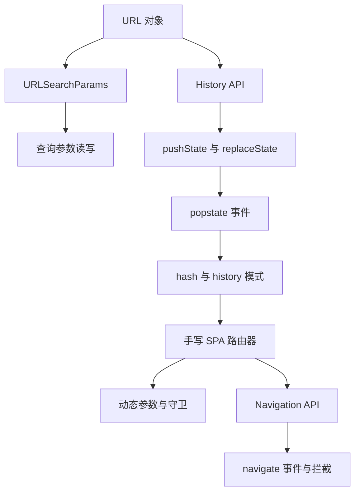
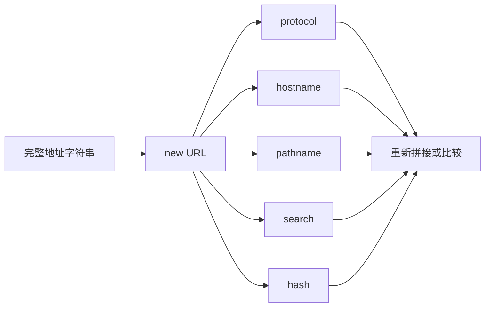
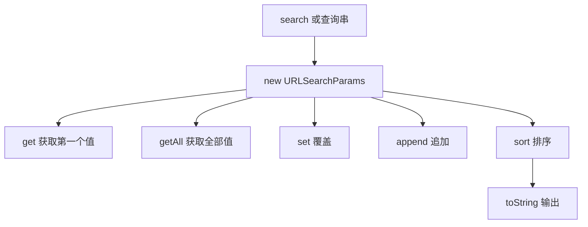
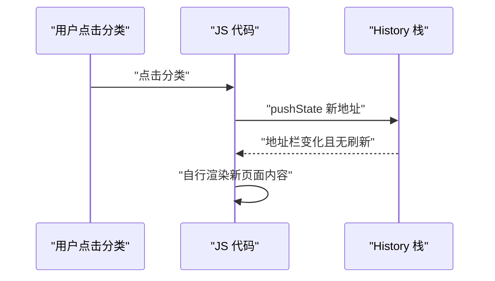
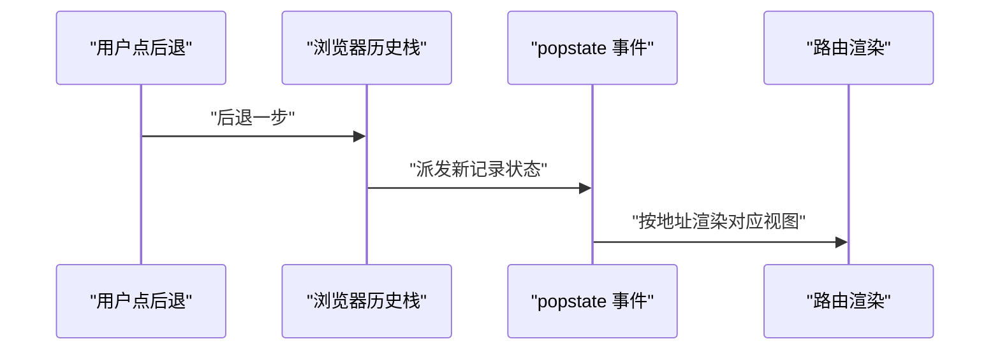
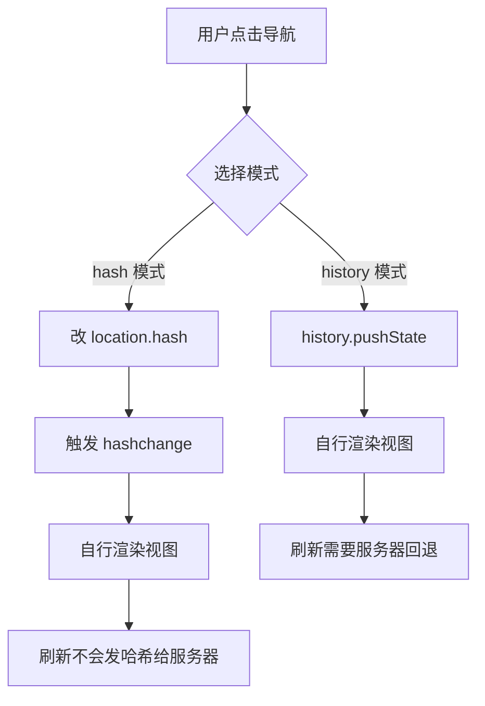
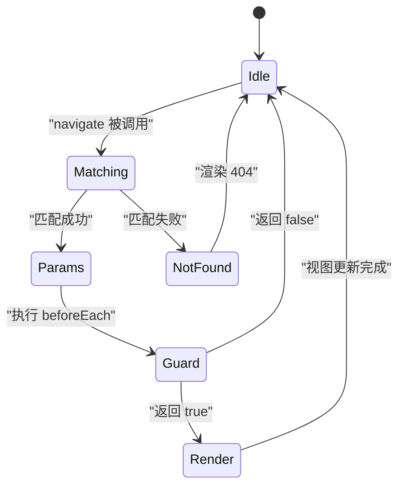
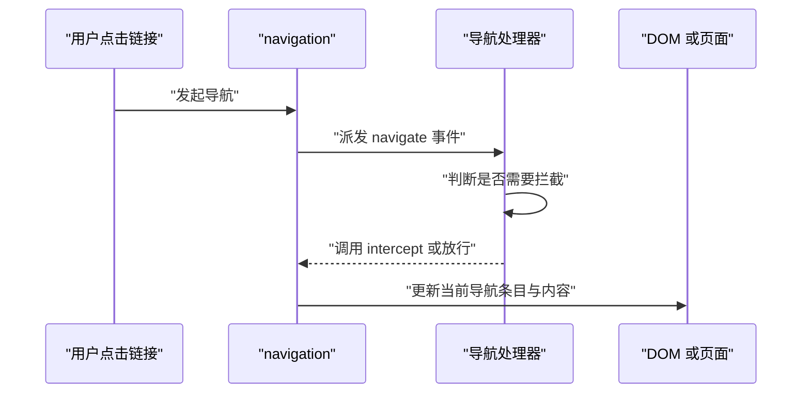

# URL、History 与 Navigation API：前端路由是怎么做出来的

!!! abstract "学完这一页你能"
    - 能用 `URL` 与 `URLSearchParams` 读出、修改地址中的路径、查询参数和哈希。
    - 能用 `pushState`、`replaceState`、`popstate` 解释 history 模式路由为什么不刷新页面。
    - 能说清 hash 模式与 history 模式在地址、刷新、服务器配置上的三个区别。
    - 能独立手写一个带动态参数和导航守卫的 SPA 路由器，并用断言测试匹配、跳转和拦截。

## 0. 知识地图



建议先按 1 到 5 的顺序读，把地址、History 栈、popstate 这条链路打通，再看第 6 节手写路由器。
第 7 节 Navigation API 是新的浏览器能力，适合在理解 history 模式后再学，这样能看出它解决了哪些旧问题。

## 1. URL 对象：把地址拆成标准字段

### **先想一个问题**
商品列表地址是 `https://shop.example.com/list?category=phone&page=2#top`。
你要读出 `category`，再把 `page` 改成 3。直接截断字符串会遇到参数顺序变化和编码问题。

### **心智模型**

!!! tip "心智模型"
    一句话模型：`URL` 对象把一条地址解析成有固定字段的数据结构，修改字段就等于修改地址。
    日常类比：快递单把地址拆成省、市、街道、门牌号，填写时不用自己重新写整行。
    类比不成立：快递单的字段不会重复，但 URL 的查询参数可以有多个同名键，而且需要 URL 编码。

!!! note "术语：URL"
    URL 是 Uniform Resource Locator，统一资源定位符。它描述一个资源的地址。
    例如 `https://example.com:443/a?b=1#c` 中的协议、主机、端口、路径、查询串、哈希都是 URL 的组成部分。

### **图解**



1. 输入是完整地址字符串。
2. `new URL()` 负责解析，产出 `URL` 对象。
3. `protocol`、`hostname`、`pathname`、`search`、`hash` 是常用字段。
4. 你可以读取单个字段，也可以修改后再取 `href` 得到新地址。

### **一步一步来**

**步骤 1：解析一个完整地址**

这一步要确认地址里的各个部分分别落在哪个字段上。

```js
const addr = new URL(
  "https://shop.example.com/list?category=phone&page=2#top"
);

console.log(addr.protocol); // "https:"
console.log(addr.hostname); // "shop.example.com"
console.log(addr.pathname); // "/list"
console.log(addr.search);   // "?category=phone&page=2"
console.log(addr.hash);     // "#top"
```

**这段代码在做什么**
- `new URL()` 是解析入口，不用手写字符串切割。
- `protocol` 带冒号，`hostname` 不含端口。
- `pathname` 是路径部分，从第一个斜杠开始。
- `search` 包含问号，`hash` 包含井号。
- 读取字段得到的是标准形式，便于后续比较。

**运行结果** 控制台依次打印 `https:`、`shop.example.com`、`/list`、`?category=phone&page=2`、`#top`。

**步骤 2：修改字段后再生成新地址**

这一步要用对象字段修改路径、查询和哈希，而不是手动拼字符串。

```js
const addr = new URL("https://shop.example.com/list?page=2");

addr.searchParams.set("category", "tablet"); // 新增或覆盖 category
addr.searchParams.set("page", "3");          // 覆盖 page
addr.hash = "list";                          // 修改哈希

console.log(addr.href); // https://shop.example.com/list?page=3&category=tablet#list
```

**这段代码在做什么**
- `searchParams.set()` 用键值对方式修改查询参数，会自动编码。
- 新键会被追加到查询串末尾，已有键则在原位置更新。
- 直接给 `hash` 赋值会触发生成新的地址字符串。
- 最后读 `href` 得到完整地址，不需要手动处理问号和井号。

**运行结果** 打印 `https://shop.example.com/list?page=3&category=tablet#list`。

**步骤 3：解析相对地址**

这一步要处理只有路径或相对路径的地址，例如接口返回了 `/docs/`。

```js
const base = new URL("/docs/", "https://example.com/start/");
console.log(base.href); // "https://example.com/docs/"

const css = new URL("../a.css", base);
console.log(css.href);  // "https://example.com/a.css"
```

**这段代码在做什么**
- 第二个参数是 base，浏览器会从 base 推导协议和主机。
- `/docs/` 是绝对路径，会覆盖 base 的 `/start/` 路径部分。
- `../a.css` 会先回到上一级目录，再拼上 `a.css`。
- 这种解析规则和浏览器加载资源时的规则一致。

### **动手验证**
把上面三个能力合成一个 Node 脚本，用 `assert` 确认解析与修改结果符合预期。无第三方依赖。

```js
import assert from "node:assert/strict";

const addr = new URL(
  "https://shop.example.com/list?category=phone&page=2#top"
);

assert.equal(addr.protocol, "https:");
assert.equal(addr.hostname, "shop.example.com");
assert.equal(addr.pathname, "/list");
assert.equal(addr.search, "?category=phone&page=2");
assert.equal(addr.hash, "#top");

addr.searchParams.set("category", "tablet");
assert.equal(addr.searchParams.get("category"), "tablet");
assert.equal(addr.hash, "#top");

const base = new URL("/docs/", "https://example.com/start/");
assert.equal(base.href, "https://example.com/docs/");
assert.equal(new URL("../a.css", base).href, "https://example.com/a.css");

console.log("URL 对象解析与修改通过");
```

**这段脚本在做什么**
- 先断言完整 URL 的五个字段值。
- 再断言修改查询参数后，`get()` 能取到新值。
- 最后断言相对地址按 base 规则解析正确。
- 预期输出是 `URL 对象解析与修改通过`。

### **常见坑**

| 现象 | 原因 | 怎么修 |
| ---- | ---- | ---- |
| `search` 里出现 `%20` | URL 编码是标准行为 | 不要手动拼接参数，用 `searchParams.set()` |
| 同一个 key 只拿到一个值 | `searchParams.get()` 只返回第一个 | 多个值用 `searchParams.getAll()` |
| 修改 `pathname` 后地址未更新 | 没有读取 `href` 或忘记赋回 | 修改后读 `addr.href` 生成新地址 |
| 相对地址解析和预期不同 | `new URL()` 的 base 路径和预期不一致 | 先确认 base 的 `pathname` 结尾斜杠 |

### **小结**
1. `URL` 对象解决的是“地址解析与拼接”问题，避免手动切字符串。
2. 常用字段是 `protocol`、`hostname`、`pathname`、`search`、`hash`。
3. 相对地址解析依赖 base，路径规则和浏览器资源加载一致。

## 2. URLSearchParams：查询参数要当键值集合处理

### **先想一个问题**
搜索页有 `?tag=js&tag=node&page=2`。你需要判断 `tag` 是否出现多次，还要安全地新增一个带空格的词。

### **心智模型**

!!! tip "心智模型"
    一句话模型：`URLSearchParams` 把问号后面的部分当作键值集合，支持重复键、遍历和自动编码。
    日常类比：查询串像一张可重复填写同一个字段名的表单。
    类比不成立：表单通常一个字段一个值，而 URL 查询串允许一个字段有多个值。

!!! note "术语：URLSearchParams"
    URLSearchParams 是浏览器提供的查询参数集合对象。
    例如 `new URLSearchParams("tag=js&tag=node")` 会得到两个 `tag` 值。

### **图解**



1. 输入可以是完整查询串，也可以是 `url.search`。
2. 不同方法负责不同读取策略。
3. 修改后用 `toString()` 或 `url.searchParams` 生成新查询串。
4. 自动编码保证特殊字符不会破坏地址结构。

### **一步一步来**

**步骤 1：读取单个值与重复值**

这一步要区分 `get` 与 `getAll` 在处理重复键时的行为。

```js
const qs = new URLSearchParams("tag=js&tag=node&page=2");

console.log(qs.get("tag"));    // "js"
console.log(qs.getAll("tag")); // ["js", "node"]
console.log(qs.has("page"));   // true
```

**这段代码在做什么**
- `get()` 返回指定键的第一个值。
- `getAll()` 返回该键的所有值，解决重复键问题。
- `has()` 用于判断键是否存在，返回值是布尔。
- 如果键不存在，`get()` 返回 `null`，`getAll()` 返回空数组。

**运行结果** 打印 `js`、`["js", "node"]`、`true`。

**步骤 2：增、删、改并自动编码**

这一步要安全地添加带空格和特殊字符的值。

```js
const qs = new URLSearchParams("page=2");

qs.set("q", "vue 教程");  // 覆盖 q，值为 vue 教程
qs.append("tag", "js");   // 追加第一个 tag
qs.append("tag", "node"); // 追加第二个 tag

console.log(qs.toString()); // "page=2&q=vue+%E6%95%99%E7%A8%8B&tag=js&tag=node"
```

**这段代码在做什么**
- `set()` 会覆盖该键已有值，不产生重复键。
- `append()` 会保留已有值并追加新值。
- 空格被编码为 `+`，中文字符被编码为百分号序列。
- `toString()` 生成可放入地址的查询串。

**运行结果** 打印 `page=2&q=vue+%E6%95%99%E7%A8%8B&tag=js&tag=node`。

**步骤 3：遍历与排序**

这一步要按固定顺序输出所有键值，方便调试和缓存键生成。

```js
const qs = new URLSearchParams("b=2&a=1&c=3");

qs.sort();

for (const [key, value] of qs) {
  console.log(key, value);
}
```

**这段代码在做什么**
- `sort()` 按键排序，不改变每个键原来的值顺序。
- `URLSearchParams` 可以被 `for...of` 遍历。
- 每次迭代得到一个 `[key, value]` 数组。
- 排序后输出顺序为 `a=1`、`b=2`、`c=3`。

**运行结果** 打印 `a 1`、`b 2`、`c 3`。

### **动手验证**
编写一个 Node 脚本，覆盖重复键读取、编码和排序三个断言。无第三方依赖。

```js
import assert from "node:assert/strict";

const qs = new URLSearchParams("tag=js&tag=node&page=2");
assert.equal(qs.get("tag"), "js");
assert.deepEqual(qs.getAll("tag"), ["js", "node"]);

const encoded = new URLSearchParams("page=2");
encoded.set("q", "vue 教程");
encoded.append("tag", "js");
encoded.append("tag", "node");
assert.ok(encoded.toString().includes("q=vue+%E6%95%99%E7%A8%8B"));

const sorted = new URLSearchParams("b=2&a=1&c=3");
sorted.sort();
assert.deepEqual([...sorted.keys()], ["a", "b", "c"]);

console.log("URLSearchParams 读取、编码与排序通过");
```

**这段脚本在做什么**
- 用 `assert.deepEqual` 检查重复键的所有值。
- 用 `includes()` 检查空格和中文字符被正确编码。
- 用 `[...sorted.keys()]` 检查排序后的键顺序。
- 预期输出是 `URLSearchParams 读取、编码与排序通过`。

### **常见坑**

| 现象 | 原因 | 怎么修 |
| ---- | ---- | ---- |
| `get("tag")` 只返回 `js` | 该 API 只取第一个值 | 用 `getAll()` 取全部重复值 |
| 空值参数 `?a=` 读不到 | `get("a")` 会返回空字符串 | 用 `has("a")` 判断键是否存在 |
| 排序后值顺序变了 | 排序只对键生效 | 检查是否依赖插入顺序，若依赖就不要排序 |
| 空格变成 `+` | 查询串编码规则 | 解码时用 `URLSearchParams` 或 `decodeURIComponent` |

### **小结**
1. `URLSearchParams` 解决查询参数的读取、修改、编码和重复键问题。
2. `get` 与 `getAll` 的差异是处理多值键的关键。
3. `set`、`append`、`sort` 覆盖了常见修改场景。

## 3. History API：页面不刷新也能改地址

### **先想一个问题**
SPA 从列表页切到详情页，内容已经用 JS 渲染完成。你希望地址栏也变成 `/detail/42`，但不能让浏览器整页刷新。

### **心智模型**

!!! tip "心智模型"
    一句话模型：`History` 是浏览器维护的一叠地址卡片，`pushState` 加新卡片，`replaceState` 替换当前卡片。
    日常类比：浏览器历史像一叠写有地址和页面数据的卡片，后退就是抽掉最上面一张。
    类比不成立：卡片不会保存页面 DOM，只保存地址和开发者手动传入的状态数据。

!!! note "术语：History API"
    History API 是浏览器提供的栈式历史记录操作接口。
    例如 `history.pushState(state, unused, "/list")` 会给历史栈新增一条记录。

### **图解**



1. 用户点击触发 JS 事件。
2. JS 调用 `pushState`，往 History 栈压入新地址。
3. 浏览器只改地址栏，不发起整页请求。
4. JS 负责替换页面内容，完成 SPA 视图切换。

### **一步一步来**

**步骤 1：用 `pushState` 新增历史记录**

这一步要在列表页点击分类后，把地址改成 `/list?category=phone`。

```js
document.querySelector("#category-phone").addEventListener("click", () => {
  // 第一个参数是状态数据，刷新或前进后退时可读取
  history.pushState(
    { category: "phone" },
    "",
    "/list?category=phone"
  );

  renderList("phone"); // 自行渲染列表
});
```

**这段代码在做什么**
- `pushState` 第一个参数是状态对象，可以保存当前页需要的少量数据。
- 第二个参数是标题，多数浏览器忽略，传空字符串即可。
- 第三个参数是新地址，必须与当前页面同源。
- 调用后地址栏变化，页面不刷新。
- 视图更新由 `renderList` 完成，与 History API 无关。

**运行结果** 地址栏变为 `/list?category=phone`，页面保持不刷新。

**步骤 2：用 `replaceState` 替换当前记录**

这一步要在用户第一次进入页面时，把重定向后的地址规范成干净地址。

```js
if (location.pathname === "/redirect") {
  // 替换当前历史记录，不新增一条
  history.replaceState(null, "", "/home");
  renderHome();
}
```

**这段代码在做什么**
- `replaceState` 不增加历史栈长度。
- 用户点后退时，不会退回到 `/redirect`。
- 参数顺序与 `pushState` 相同。
- 适合修正地址、移除临时参数等场景。

**运行结果** 地址栏变为 `/home`，但历史记录不新增。

**步骤 3：读取当前状态对象**

这一步要在用户刷新或后退回来时，恢复之前保存的状态数据。

```js
window.addEventListener("popstate", (event) => {
  const state = event.state;
  if (state && state.category) {
    renderList(state.category);
  }
});
```

**这段代码在做什么**
- `popstate` 在用户前进或后退时触发。
- `event.state` 是当初 `pushState` 或 `replaceState` 传入的状态对象。
- 本例根据状态对象里的 `category` 还原视图。
- 刷新页面时，`event.state` 可能是 `null`。

### **动手验证**
使用 `jsdom` 验证 `pushState` 与 `replaceState` 对地址和历史栈长度的影响。
先运行 `npm install jsdom`，保存为 `verify-history.mjs`。

```js
import assert from "node:assert/strict";
import { JSDOM } from "jsdom";

const dom = new JSDOM("", { url: "https://shop.example.com/list" });
const { window } = dom;
const { history, location } = window;

assert.equal(history.length, 1);

history.pushState({ category: "phone" }, "", "/list?category=phone");
assert.equal(location.pathname, "/list");
assert.equal(location.search, "?category=phone");
assert.equal(history.length, 2);

history.replaceState(null, "", "/home");
assert.equal(location.pathname, "/home");
assert.equal(history.length, 2);

console.log("History API 验证通过");
```

**这段脚本在做什么**
- 用 `jsdom` 提供浏览器 `window.history` 和 `window.location`。
- 断言 `pushState` 后地址改变、历史长度加一。
- 断言 `replaceState` 后地址改变、历史长度不变。
- 预期输出是 `History API 验证通过`。

### **常见坑**

| 现象 | 原因 | 怎么修 |
| ---- | ---- | ---- |
| `pushState` 报跨域错误 | 新地址与当前页面不同源 | 使用同源路径，不写完整外部域名 |
| 刷新后 `event.state` 是 `null` | 状态对象只在会话内可靠 | 用地址参数保存关键状态 |
| 点后退不触发 `popstate` | 新页面不是由 `pushState` 打开的 | 确认页面确实通过 SPA 导航进入 |
| 地址改了但视图没变 | 只调 `pushState` 没有渲染 | 在同一个导航函数里调用渲染逻辑 |

### **小结**
1. `pushState` 压入新记录，`replaceState` 替换当前记录。
2. 两个方法都只改历史栈和地址，不刷新页面。
3. 状态对象用于恢复视图，但刷新后需要从地址参数重建数据。

## 4. popstate 与 hashchange：处理后退键

### **先想一个问题**
用户从列表进入详情，又点浏览器的后退键。地址变了，但页面没有刷新。你的 SPA 要如何知道该重新渲染列表？

### **心智模型**

!!! tip "心智模型"
    一句话模型：`popstate` 是浏览器发起的历史移动通知，`hashchange` 是哈希变化通知。
    日常类比：用户后退等于抽走一张卡片，浏览器摇铃告诉你“当前卡片变了”。
    类比不成立：卡片被抽走后不会自动变成视图，你必须自己根据铃声重绘画面。

!!! note "术语：popstate"
    popstate 是浏览器在用户前进、后退时触发的事件。
    例如用户点后退回到 `/list`，`popstate` 会把新的当前记录状态传给监听函数。

### **图解**



1. 用户触发后退。
2. 浏览器把当前记录偏移到上一条。
3. `popstate` 事件携带新的状态对象。
4. 路由监听收到事件后，按地址渲染对应组件。

### **一步一步来**

**步骤 1：监听 popstate 并按路径渲染**

这一步要在 SPA 中统一处理前进、后退。

```js
window.addEventListener("popstate", (event) => {
  // 先从状态对象恢复，再回退到地址解析
  const state = event.state;
  if (state && state.view) {
    render(state.view);
    return;
  }
  render(location.pathname);
});

function render(view) {
  console.log("渲染视图:", view);
}
```

**这段代码在做什么**
- `popstate` 会在历史记录变化时触发。
- 事件对象里的 `state` 是 `pushState` 时写入的数据。
- 如果状态对象里没有视图信息，退化为解析 `location.pathname`。
- `render` 是视图渲染入口，这里只打印表示调用。

**运行结果** 点后退时控制台打印 `渲染视图: /list` 或状态对象里的视图名。

**步骤 2：用 hashchange 监听旧式 hash 路由**

这一步要在 hash 模式下监听地址并更新内容。

```js
window.addEventListener("hashchange", () => {
  // 去掉开头的井号，当作路由路径
  const hashPath = location.hash.slice(1) || "/";
  render(hashPath);
});
```

**这段代码在做什么**
- `hashchange` 在 `location.hash` 变化时触发。
- `location.hash` 包含井号，例如 `#/list`。
- `slice(1)` 去掉井号得到 `/list`。
- 如果哈希为空，回退到 `/`。
- 视图更新依赖哈希路径，服务器不会收到哈希内容。

**运行结果** 地址从 `#/list` 变为 `#/detail` 时，打印 `渲染视图: /detail`。

**步骤 3：用事件对象判断是前进还是后退**

这一步要在不同移动方向下执行不同的动画。

```js
window.addEventListener("popstate", (event) => {
  if (event.state.direction === "forward") {
    playForwardAnimation();
  } else {
    playBackAnimation();
  }
});
```

**这段代码在做什么**
- `event.state` 是当前记录的状态对象，可以自定义方向字段。
- 方向字段需要在你调用 `pushState` 时写入。
- 该例子说明状态对象可以承载导航所需的业务数据。
- 浏览器本身不提供统一的导航方向字段。

### **动手验证**
使用 `jsdom` 验证 `hashchange` 监听器能处理哈希变化。先运行 `npm install jsdom`。

```js
import assert from "node:assert/strict";
import { JSDOM } from "jsdom";

const dom = new JSDOM("", { url: "https://shop.example.com/#/" });
const { window } = dom;
const seen = [];

window.addEventListener("hashchange", () => {
  seen.push(window.location.hash.slice(1) || "/");
});

window.location.hash = "#/list";
const event = new window.HashChangeEvent("hashchange");
window.dispatchEvent(event);
assert.deepEqual(seen, ["/list"]);

console.log("hashchange 验证通过");
```

**这段脚本在做什么**
- 用 `jsdom` 构造带初始哈希的页面。
- 注册 `hashchange` 监听器，把新路径存入 `seen`。
- 手动改变哈希并派发 `HashChangeEvent`。
- 断言监听器收到的路径是 `/list`。
- 预期输出是 `hashchange 验证通过`。

### **常见坑**

| 现象 | 原因 | 怎么修 |
| ---- | ---- | ---- |
| 首次加载不触发 `popstate` | 浏览器只在历史移动时触发 | 初始化时手动调用一次路由渲染 |
| `hashchange` 不触发 | 直接改 `location.hash` 之外的部分 | 修改整个 `location.href` 或赋值 `location.hash` |
| `event.state` 总是 `null` | 当前记录由传统页面加载产生 | 从地址解析数据，不依赖状态对象 |
| 后退后重复渲染两次 | 同时绑定了 `popstate` 和 `hashchange` | 根据路由模式只绑定一个事件源 |

### **小结**
1. `popstate` 对应 History 栈变化，`hashchange` 对应哈希变化。
2. 状态对象可以携带恢复视图所需数据，但刷新后不可靠。
3. SPA 初始化必须手动渲染一次，否则首次地址不会生成视图。

## 5. hash 模式与 history 模式：两种路由策略

### **先想一个问题**
线上部署 SPA 后，用户直接访问 `/detail/42` 刷新，浏览器会请求服务器。如果服务器没有配置回退，就会返回 404。这是 history 模式的典型问题。

### **心智模型**

!!! tip "心智模型"
    一句话模型：hash 模式把路由写在 `#` 后，不发给服务器；history 模式把路由写在真实路径里，刷新会请求服务器。
    日常类比：hash 模式像把地址写在信封背面，邮局看不见；history 模式像把地址写在信封正面。
    类比不成立：信封背面的内容不会影响服务器返回哪封信，而 history 模式需要服务器配合才能正确回信。

!!! note "术语：history 模式"
    history 模式使用 `pushState` 和真实路径管理路由。
    例如 `/detail/42` 会被浏览器当作新地址，但刷新时会向服务器请求该路径。

### **图解**



1. 用户点击导航后，两种模式走不同 API。
2. hash 模式依赖 `hashchange` 触发路由渲染。
3. history 模式不自动触发事件，需要在导航函数里直接渲染。
4. 刷新时，history 模式会请求真实路径，服务器必须配置回退。

### **一步一步来**

**步骤 1：实现 hash 模式跳转**

这一步要写一个只依赖哈希跳转的迷你导航函数。

```js
function navigateHash(path) {
  // 把路径写到 hash 里，刷新时不会发给服务器
  location.hash = `#${path}`;
}

window.addEventListener("hashchange", () => {
  const path = location.hash.slice(1) || "/";
  render(path);
});

navigateHash("/detail/42"); // hashchange 触发 render("/detail/42")
```

**这段代码在做什么**
- `navigateHash` 只给 `location.hash` 赋值。
- 修改哈希不会触发整页刷新。
- `hashchange` 监听器负责取出路径并渲染。
- 刷新时服务器收到的地址不包含哈希内容。
- `render` 需要自行定义，这里只展示跳转与监听流程。

**运行结果** 地址变为 `#/detail/42`，控制台执行 `render("/detail/42")`。

**步骤 2：实现 history 模式跳转**

这一步要用 `pushState` 改变真实路径，并直接渲染。

```js
function navigateHistory(path) {
  // history 模式不会自动触发 popstate
  history.pushState({ path }, "", path);
  render(path);
}

window.addEventListener("popstate", (event) => {
  render(event.state?.path ?? location.pathname);
});

navigateHistory("/detail/42"); // 直接 render("/detail/42")
```

**这段代码在做什么**
- `pushState` 改真实路径，不触发 `popstate`。
- 所以要在导航函数里手动调用 `render`。
- `popstate` 只负责处理后退和前进。
- `event.state?.path` 是可选的恢复数据，缺少时用 `location.pathname`。
- 刷新时，浏览器会向服务器请求 `/detail/42`。

**运行结果** 地址变为 `/detail/42`，控制台执行 `render("/detail/42")`。

**步骤 3：开发服务器回退配置**

这一步要确认 history 模式刷新时，外部服务器可能需要把未知路径回退到入口 HTML。以下用 Express 作为示例，不代表生产环境唯一方案。

```js
import express from "express";
import path from "node:path";

const app = express();

// 静态资源优先，匹配不到再回退入口文件
app.use(express.static("dist"));
app.get("*", (req, res) => {
  res.sendFile(path.resolve("dist/index.html"));
});

app.listen(3000);
```

**这段代码在做什么**
- 先提供 `dist` 下的真实静态文件。
- 对于非静态资源路径，返回入口 HTML。
- SPA 在客户端读取路径后渲染对应视图。
- hash 模式不需要这个回退，因为服务器始终只收到入口路径。
- 该示例依赖 `express`，生产服务器可用类似规则配置。

**运行结果** 访问 `/detail/42` 不会返回 404，而是返回 `index.html`。

### **动手验证**
使用 `jsdom` 验证 hash 模式刷新不包含哈希，history 模式需要服务器回退这个差异。

```js
import assert from "node:assert/strict";
import { JSDOM } from "jsdom";

const dom = new JSDOM("", { url: "https://shop.example.com/#/list" });
const { window } = dom;

assert.equal(window.location.pathname, "/");
assert.equal(window.location.hash, "#/list");
assert.equal(window.location.href, "https://shop.example.com/#/list");

window.history.pushState({}, "", "/detail/42");
assert.equal(window.location.pathname, "/detail/42");

console.log("hash 与 history 路径差异验证通过");
```

**这段脚本在做什么**
- 初始 hash 路由下，`pathname` 仍然是根路径。
- 断言 hash 内容是 `#/list`，服务器不会收到它。
- 调用 `pushState` 后，`pathname` 变为真实路径 `/detail/42`。
- 这验证了 history 模式刷新时需要服务器回退。
- 预期输出是 `hash 与 history 路径差异验证通过`。

### **常见坑**

| 现象 | 原因 | 怎么修 |
| ---- | ---- | ---- |
| history 模式刷新 404 | 服务器没有回退到入口 HTML | 配置服务器回退规则 |
| hash 路径里的内容丢失 | 服务器端不读取哈希 | 把关键参数放在真实查询串或 API 中 |
| 反向代理把 `#` 截断 | 哈希不会发送到服务器 | 不要在请求中依赖哈希 |
| 开发环境 history 路由正常但生产失败 | 生产服务器未部署回退逻辑 | 检查生产服务器 rewrite 规则 |

### **小结**
1. hash 模式改 `location.hash`，监听 `hashchange`，刷新不请求哈希路径。
2. history 模式用 `pushState` 改真实路径，刷新请求真实地址。
3. history 模式需要服务器回退到入口 HTML，hash 模式不需要。

## 6. 手写 SPA 路由器：动态参数与守卫

### **先想一个问题**
你要做一个最小可用的前端路由库，能注册 `/users/:id`，能从地址里取出 `id`，还能在进入页面前判断用户是否有权限。

### **心智模型**

!!! tip "心智模型"
    一句话模型：路由器就是“地址匹配器 + 导航调度器”。
    日常类比：房子入口有一个看门人，先问“去哪里”，再查“你有没有门票”，最后带你去对应房间。
    类比不成立：看门人不会把房间号写成带冒号的模板，而路由匹配需要把 `/users/:id` 翻译成可执行的规则。

!!! note "术语：动态参数"
    动态参数是路由路径中由冒号声明的可变片段。
    例如 `/users/:id` 可以匹配 `/users/42`，并得到 `{ id: "42" }`。

!!! note "术语：守卫"
    守卫是导航发生前执行的判断函数。
    例如 `beforeEach` 返回 `false` 会阻止跳转，返回 `true` 或 `undefined` 会放行。

### **图解**



1. 导航命令让路由器从空闲状态进入匹配状态。
2. 匹配成功就提取动态参数。
3. 匹配失败进入 404 渲染。
4. 守卫通过后才进入渲染视图状态。
5. 守卫失败回到空闲状态，不改地址、不渲染。

### **一步一步来**

**步骤 1：编写路径匹配器**

这一步要把 `/users/:id` 这样的声明式路径转成正则，并从实际地址中取出参数。

```js
function compilePath(pattern) {
  // 把 :id 转成命名捕获组，匹配非斜杠的一段
  const regexSource = pattern
    .replace(/:[^/]+/g, (name) => `(?<${name.slice(1)}>[^/]+)`);

  const regex = new RegExp(`^${regexSource}$`);
  return regex;
}

function matchRoute(routes, pathname) {
  for (const route of routes) {
    const match = pathname.match(compilePath(route.path));
    if (match) {
      return { route, params: match.groups };
    }
  }
  return null;
}
```

**这段代码在做什么**
- `compilePath` 把 `:id` 替换为正则命名捕获组。
- 命名捕获组的名字就是参数名，这里以 `id` 为例。
- `^...$` 保证整段路径精确匹配。
- `matchRoute` 按注册顺序遍历路由表。
- 匹配成功返回路由对象和参数对象。
- 匹配失败返回 `null`，由调用方渲染 404。

**运行结果** `matchRoute(routes, "/users/42")` 返回 `{ route, params: { id: "42" } }`。

**步骤 2：实现守卫队列**

这一步要支持多个 `beforeEach` 守卫依次执行，任一守卫返回 `false` 就取消导航。

```js
class Router {
  constructor() {
    this.beforeGuards = [];
  }

  beforeEach(guard) {
    this.beforeGuards.push(guard);
  }

  async runGuards(to, from) {
    for (const guard of this.beforeGuards) {
      // 只有返回 false 才阻止导航
      if (guard(to, from) === false) {
        return false;
      }
    }
    return true;
  }
}
```

**这段代码在做什么**
- `beforeEach` 注册一个守卫函数。
- `runGuards` 按注册顺序执行所有守卫。
- 守卫接收 `to` 和 `from` 两个上下文。
- 守卫返回 `false` 表示阻止导航。
- 其他返回值按放行处理，保持简单。
- 守卫可以是异步函数，真实实现需要 `await`。

**运行结果** 如果某个守卫返回 `false`，`runGuards` 返回 `false`。

**步骤 3：组合地址追踪、匹配和渲染**

这一步要实现一个可运行的 `createRouter`，注入 `history` 以便在 Node 里测试。

```js
export function createRouter({ routes, history }) {
  let currentPath = history.location.pathname;

  const router = new Router();

  function navigate(path) {
    const to = path;
    const from = currentPath;

    if (!router.runGuards({ path: to }, { path: from })) {
      return { cancelled: true };
    }

    currentPath = to;
    history.pushState({ path: to }, "", to);
    render(to);
    return { cancelled: false };
  }

  function render(path) {
    const matched = matchRoute(routes, path);
    if (!matched) {
      console.log("渲染 404");
      return;
    }
    console.log("渲染", matched.route.name, "参数", matched.params);
  }

  return { navigate, beforeEach: router.beforeEach.bind(router) };
}
```

**这段代码在做什么**
- `createRouter` 接收路由表和注入的 `history`，解耦浏览器对象。
- `navigate` 先执行守卫，再改历史栈和地址。
- 守卫失败时不改 `currentPath`，也不渲染。
- `render` 根据匹配结果输出视图名和动态参数。
- `currentPath` 在每次成功导航后更新。
- 该实现是同步版本，异步守卫可改写成 `await runGuards`。

**运行结果** 成功导航时控制台输出 `渲染 用户详情 参数 { id: '42' }`。

### **动手验证**
下面的脚本用 Node 内置断言和一个最小 History 桩验证匹配、动态参数、守卫通过、守卫拦截、404。无第三方依赖。

```js
import assert from "node:assert/strict";

class HistoryStub {
  constructor(pathname = "/") {
    this.location = { pathname };
    this.entries = [];
  }
  pushState(state, unused, path) {
    this.entries.push({ state, path });
    this.location.pathname = path;
  }
}

function compilePath(pattern) {
  const source = pattern.replace(
    /:[^/]+/g,
    (name) => `(?<${name.slice(1)}>[^/]+)`
  );
  return new RegExp(`^${source}$`);
}

function matchRoute(routes, pathname) {
  for (const route of routes) {
    const match = pathname.match(compilePath(route.path));
    if (match) return { route, params: match.groups };
  }
  return null;
}

function createRouter({ routes, history }) {
  const guards = [];
  let currentPath = history.location.pathname;

  function render(path) {
    const matched = matchRoute(routes, path);
    if (!matched) return console.log("渲染 404");
    console.log("渲染", matched.route.name, "参数", matched.params);
  }

  function navigate(path) {
    for (const guard of guards) {
      if (guard({ path }, { path: currentPath }) === false) {
        return { cancelled: true };
      }
    }
    currentPath = path;
    history.pushState({ path }, "", path);
    render(path);
    return { cancelled: false };
  }

  return {
    navigate,
    beforeEach: (guard) => guards.push(guard),
  };
}

const routes = [
  { path: "/users/:id", name: "用户详情" },
  { path: "/login", name: "登录" },
];

const history = new HistoryStub("/login");
const router = createRouter({ routes, history });

router.beforeEach((to) => {
  if (to.path !== "/login") return false;
});

const blocked = router.navigate("/users/42");
assert.deepEqual(blocked, { cancelled: true });
assert.equal(history.location.pathname, "/login");

router.beforeEach(() => true);
const ok = router.navigate("/users/42");
assert.deepEqual(ok, { cancelled: false });
assert.equal(history.location.pathname, "/users/42");

const matched = matchRoute(routes, "/users/42");
assert.deepEqual(matched.params, { id: "42" });

router.beforeEach(() => true);
router.navigate("/unknown");
assert.equal(history.location.pathname, "/unknown");

console.log("SPA 路由器匹配、参数、守卫与 404 验证通过");
```

**这段脚本在做什么**
- `HistoryStub` 模拟 `pushState` 和 `location.pathname`。
- 第一个守卫对非 `/login` 路径返回 `false`，验证阻止跳转。
- 添加第二个始终放行的守卫后，验证成功跳转。
- 用 `matchRoute` 验证动态参数 `id` 提取结果。
- 最后导航到未注册路径，确认走 404 分支。
- 预期输出包含三行渲染日志和最后的验证通过提示。

**运行结果**

```text
渲染 用户详情 参数 { id: '42' }
渲染 404
SPA 路由器匹配、参数、守卫与 404 验证通过
```

### **常见坑**

| 现象 | 原因 | 怎么修 |
| ---- | ---- | ---- |
| `/users/:id` 匹配不到带斜杠的 id | 正则 `[^/]+` 不包含斜杠 | 改用 `.+`，但需评估是否会吞路径 |
| 守卫返回 `false` 后地址已变化 | 先调 `pushState` 再执行守卫 | 先执行守卫，通过后再改历史栈 |
| 动态参数值是字符串 | 捕获组只能得到字符串 | 需要数字时用 `Number()` 显式转换 |
| 路由顺序影响匹配 | `routes` 按注册顺序匹配 | 把具体路径放在动态路径之前 |

### **小结**
1. 路由匹配的核心是把声明式路径编译为正则，用捕获组取参数。
2. 守卫在导航前执行，返回 `false` 时不应改地址、不应渲染。
3. 手写路由器只需要匹配、守卫、渲染三段逻辑，就能覆盖 SPA 基本导航。

## 7. Navigation API：下一代路由基础设施

### **先想一个问题**
`popstate` 无法拦截用户离开当前页的导航，也不能在导航到目标页前替换请求。你要在用户离开编辑页时弹窗确认，旧 History API 做不到真正拦截。

### **心智模型**

!!! tip "心智模型"
    一句话模型：`Navigation API` 把每次导航当作一个可拦截、可替换、可追踪的任务。
    日常类比：导航像进入大楼前的一道闸机，保安可以在闸机前检查、改道或放行。
    类比不成立：旧闸机只能在你已经通过后收到通知，而 Navigation API 允许在通过前拦截并决定去向。

!!! note "术语：Navigation API"
    Navigation API 是浏览器新增的导航控制接口。
    例如 `navigation.addEventListener("navigate", handler)` 可以监听并拦截导航事件。

### **图解**



1. 用户点击链接或代码调用 `navigate()`。
2. `navigation` 派发 `navigate` 事件。
3. 事件处理器可以调用 `intercept()` 接管导航。
4. 不拦截则继续默认导航，拦截则由开发者更新页面内容。
5. `navigation.currentEntry` 提供当前导航信息。

### **一步一步来**

**步骤 1：用 `navigate` 发起导航**

这一步要用 Navigation API 从列表跳转到详情，而不是 `history.pushState`。

```js
async function goToDetail(id) {
  // 进入详情页前先检查数字格式
  if (!Number.isInteger(Number(id))) {
    return;
  }
  await navigation.navigate(`/detail/${id}`).finished;
  renderDetailView();
}
```

**这段代码在做什么**
- `navigation.navigate()` 发起一次导航。
- 返回值带 `finished` 承诺，导航完成后兑现。
- 本例子在进入详情前校验 `id` 是整数。
- 校验不过时直接返回，不发起导航。
- 该 API 的可用细节需要核对 MDN Navigation API 页面。

**运行结果** 有效 `id` 会进入 `/detail/:id`，无效 `id` 不会导航。

**步骤 2：监听并拦截 navigate 事件**

这一步要在编辑页未保存时阻止离开，或改道到确认页。

```js
navigation.addEventListener("navigate", (event) => {
  // 如果当前页是编辑器且未保存，拦截导航
  if (isEditorOpen() && !isSaved()) {
    event.intercept({
      handler() {
        showUnsavedDialog();
        return new Promise(() => {});
      }
    });
  }
});
```

**这段代码在做什么**
- `navigate` 事件在导航发生前派发。
- `event.intercept()` 接管导航，不会离开当前页面。
- `handler()` 负责自定义拦截后的 UI 行为。
- 回归到空承诺会让导航停在当前页面。
- 需要额外逻辑处理用户确认后再继续导航。

**运行结果** 编辑页未保存时，导航被拦截并显示未保存对话框。

**步骤 3：读取当前导航信息**

这一步要从 `currentEntry` 里取当前导航类型，做数据统计或埋点。

```js
function trackNavigation() {
  const entry = navigation.currentEntry;
  // key 是会话内唯一标识，url 是当前地址
  console.log(entry.key, entry.url);
  console.log("导航类型:", entry.navigationType);
}

navigation.addEventListener("navigate", trackNavigation);
```

**这段代码在做什么**
- `currentEntry` 是当前导航条目，不是普通的 History 状态对象。
- `key` 是会话内唯一标识，可用于缓存或追踪。
- `url` 是当前地址。
- `navigationType` 表示导航来源，例如 `push`、`reload`、`traverse`。
- 该 API 的具体字段和返回值需核对 MDN Navigation API 页面。

**运行结果** 控制台打印当前条目的 key、url 和导航类型。

### **动手验证**
Node 20 没有浏览器 `navigation` 对象。下面写一个最小桩，验证拦截、导航信息和回调顺序。

```js
import assert from "node:assert/strict";

class NavigationStub {
  constructor() {
    this.listeners = [];
    this.currentEntry = { key: "entry-0", url: "/" };
  }
  addEventListener(type, handler) {
    this.listeners.push(handler);
  }
  async navigate(url) {
    const event = {
      url,
      intercepted: false,
      intercept({ handler }) {
        this.intercepted = true;
        return handler();
      },
    };
    for (const listener of this.listeners) {
      await listener(event);
    }
    if (!event.intercepted) {
      this.currentEntry = { key: `entry-${this.listeners.length}`, url };
    }
    return { finished: Promise.resolve() };
  }
}

const navigation = new NavigationStub();
const calls = [];

navigation.addEventListener("navigate", (event) => {
  calls.push(`navigate:${event.url}`);
  if (event.url === "/blocked") {
    event.intercept({
      handler() {
        calls.push("intercept:/blocked");
        return Promise.resolve();
      },
    });
  }
});

await navigation.navigate("/detail/42");
assert.equal(navigation.currentEntry.url, "/detail/42");
await navigation.navigate("/blocked");
assert.equal(navigation.currentEntry.url, "/detail/42");

console.log("Navigation API 桩验证通过");
console.log(calls.join(", "));
```

**这段脚本在做什么**
- `NavigationStub` 模拟 `navigate` 与 `addEventListener`。
- 普通导航未拦截时更新 `currentEntry`。
- 对 `/blocked` 调用 `intercept`，导航条目不更新。
- 断言拦截后 `currentEntry.url` 仍为 `/detail/42`。
- 预期输出包含 `Navigation API 桩验证通过` 和调用顺序。

**运行结果**

```text
Navigation API 桩验证通过
navigate:/blocked, intercept:/blocked
```

### **常见坑**

| 现象 | 原因 | 怎么修 |
| ---- | ---- | ---- |
| 拦截后导航仍然发生 | 没有调用 `event.intercept()` | 在 `navigate` 事件处理器里调用 `intercept` |
| `navigation` 未定义 | 浏览器不支持该 API | 用特性检测或退回到 History API |
| 连续导航串号 | 使用同一拦截处理器 | 每次拦截使用独立的导航控制器 |
| 字段名与 MDN 不一致 | API 仍在演进 | 核对 MDN Navigation API 页面 |

### **小结**
1. Navigation API 把导航变成可拦截的事件流，解决了 `popstate` 无法预先拦截的问题。
2. 通过 `navigation.navigate()` 与 `navigate` 事件串联发起和接管导航。
3. `currentEntry` 提供比 `event.state` 更明确的当前导航信息。

## 综合对比

| 维度 | URLSearchParams | History API | hash 模式 | history 模式 | Navigation API |
| ---- | ---- | ---- | ---- | ---- | ---- |
| 解决什么问题 | 查询参数读写与编码 | 无刷新改地址 | 兼容性优先的地址路由 | 地址真实的 SPA 路由 | 可拦截的下一代导航 |
| 是否触发事件 | 否 | `popstate` 在后退时触发 | `hashchange` 触发 | `popstate` 在后退时触发 | `navigate` 在导航前触发 |
| 刷新行为 | 无影响 | 无影响 | 服务器不收到哈希 | 需要服务器回退 | 遵循浏览器新导航模型 |
| 拦截能力 | 无 | 无 | 无 | 无 | 有 `intercept()` |
| 依赖服务器配置 | 否 | 否 | 否 | 是 | 视部署目标而定 |
| 浏览器支持 | 广泛 | 广泛 | 广泛 | 广泛 | 需要特性检测 |
| 典型场景 | 搜索页、列表筛选 | 无刷新分页、问卷 | 老项目、静态托管 | 标准 SPA | 复杂多步导航、表单离场拦截 |

## 应用与行业实践

### 应用场景地图

| 场景 | 用到本页哪个知识点 | 典型技术选型 | 注意事项 |
| --- | --- | --- | --- |
| 后台管理的万行表格，按状态和页码筛选 | `URLSearchParams` 读写查询串、`pushState`、`popstate` | Vue Router 或 React Router，加一层自写 URL 同步 | 只把可序列化的标量写进地址，勾选的大数组留在内存 |
| 静态托管上的文档站，带页面内锚点 | hash 模式、`hashchange` | Vue Router 的 `createWebHashHistory`，或自写 hash 解析 | 路由路径与锚点都用 `#`，要事先约定分隔方式 |
| 首屏时间敏感的低端安卓落地页 | `pushState`、按路径决定加载哪块代码 | 动态 `import()` 加 History API | 深层路径刷新需要服务器 rewrite 兜底 |
| 多人协作白板的视口与选中对象 | `URL` 与 `URLSearchParams`、`replaceState` | 自写同步层加 WebSocket | 高频变化用 `replaceState`，避免塞满历史栈 |
| 电商商品详情页的可分享链接 | `URL` 拆路径与查询串、动态参数匹配 | React Router 的 `useParams`、Angular Router | 参数变化要单独触发取数，不能只依赖组件挂载 |
| 多步下单流程或分页问卷 | `pushState` 与 `replaceState` 的选择、`history.state` | `history.state` 存草稿，配合 sessionStorage | 每一步都要求能回退时，不能用 `replaceState` |
| 移动端 WebView 内的活动页 | `popstate`、`history.state` | 原生返回键与 JS 桥接 | 进入首个页面时补一次 `pushState` 占位，否则返回键直接退出 WebView |
| 数据看板的分享视图，带时间范围与维度 | `URLSearchParams` 序列化、`URL` 构造 | 自写 encode/decode 函数 | 时间戳与数组参数要约定固定格式，避免歧义 |
| 站内搜索结果页 | `popstate`、`URLSearchParams` | 框架路由加输入防抖 | 每敲一个字符就 `pushState` 会污染历史栈 |

### 三个场景拆解

#### 场景 1：后台管理表格的筛选条件写进地址

**业务背景**

运营同学在列表页筛出"已支付 + 第 2 页"，想把地址发给同事，同事打开却看到默认列表。列表数据量到万行级别时，每次筛选都整页刷新，等待时间肉眼可见。

**怎么用本页知识解决**

思路是让地址成为筛选条件的唯一来源，渲染只是读地址的结果。

```js
// 从地址读出筛选条件：路径给资源，查询串给条件
const url = new URL(location.href);
const params = new URLSearchParams(url.search);
const filters = { status: params.get('status') || '', page: Number(params.get('page')) || 1 };
renderTable(filters);

function applyFilter(next) {
  const target = new URL(location.href);
  for (const [key, value] of Object.entries(next)) {
    if (value === '') target.searchParams.delete(key); // 空值删键，地址里不留 status=
    else target.searchParams.set(key, value);
  }
  history.pushState({ filters: next }, '', target);    // 条件可后退，用 push
  renderTable(next);
}
// 后退键：按地址重渲染，不整页刷新
window.addEventListener('popstate', () => renderTable(readFilters()));
```

- `new URL(location.href)` 拿到当前地址，`params.get` 读单个键，缺省时给回退值。
- 写条件前先复制一份 `URL`，改完再整体交给 `pushState`，避免中途污染当前地址。
- 空值走 `delete`，地址里不会留下 `status=` 这种无意义片段，比较两个链接时也不会误判。
- 筛选变化用 `pushState`，因为用户按后退应该回到上一组条件；分页翻页可以改用 `replaceState`。
- `popstate` 里只重渲染，不整页刷新，表格滚动位置和已展开的行可以按 `history.state` 恢复。

**怎么度量收益**

用 `performance.mark` 在点击筛选时打点，在表格渲染完成后打点，取 `performance.measure` 的时长。用 Chrome DevTools 的 Performance 面板录 10 次筛选操作，看主线程长任务的数量。用 `web-vitals` 上报 INP，观察筛选交互的响应是否落在 200 毫秒以内。可分享性用可复现实验验证：复制地址到新标签页打开，比对筛选控件与行数是否一致。

**什么时候不该用**

- 筛选条件里含手机号、身份证号这类敏感字段时，不要放进查询串，地址会留在浏览器历史、日志和分享链接里。
- 需要搜索引擎抓取列表内容的页面，纯前端按查询串过滤拿不到服务端渲染的 HTML。
- 勾选了上万行的 id 集合不要塞进地址，会超出 URL 长度限制，这类状态应留在内存或 sessionStorage。

#### 场景 2：静态托管文档站的路由与锚点

**业务背景**

文档站部署在只有静态文件的托管上，没有改写请求路径的服务端能力。刷新深层路径时服务器找不到文件，返回 404。站点又需要在同一页面内跳转到某个小节。

**怎么用本页知识解决**

思路是让路由路径也待在 `#` 后面，服务器永远只收到根路径。

```js
// hash 模式：路由路径放在 # 后面，服务器只会收到 /
function parseHash() {
  const raw = location.hash.slice(1) || '/';  // 去掉开头的 #
  const [path, anchor = ''] = raw.split('#'); // 路由路径与页面内锚点分开
  return { path, anchor };
}

function render() {
  const { path, anchor } = parseHash();
  document.getElementById('app').innerHTML = matchRoute(path); // 自己写的匹配函数
  // 内容插入 DOM 后再滚动，否则找不到锚点元素
  if (anchor) requestAnimationFrame(() => document.getElementById(anchor)?.scrollIntoView());
}
// 改 hash 与按后退键都会触发 hashchange
window.addEventListener('hashchange', render);
window.addEventListener('DOMContentLoaded', render);
```

- `location.hash` 会带上开头的 `#`，先 `slice(1)` 再解析，得到干净的路由串。
- 用一次 `split('#')` 把路由路径和页面内锚点分开，两者语义不同，不能混在一个匹配函数里。
- 渲染必须发生在滚动之前，用 `requestAnimationFrame` 等一帧，元素才在 DOM 里。
- `hashchange` 同时覆盖用户手改地址和按后退键两种情况，不需要再单独监听 `popstate`。
- 首次进入时 `hashchange` 不会触发，所以要额外在 `DOMContentLoaded` 里调一次 `render`。

**怎么度量收益**

用 Lighthouse 跑移动端配置，记录 LCP 与首屏传输的 JS 体积。用 Network 面板看首屏请求数与 transferred size，对比路由级代码分割前后的数值。统计服务器访问日志里针对深层路径的 404 条数，目标为 0。用 `performance.measure` 测 `hashchange` 触发到内容替换完成的时长。

**什么时候不该用**

- 需要被搜索引擎收录的营销页和文章页，爬虫不执行 hash 之后的路由，拿不到正文。
- 需要把地址印在二维码或短链系统里的场景，带 `#` 的地址在部分扫码工具和分享卡片里会被截断。
- 需要服务端按路径做鉴权或灰度时，路径信息没有发到服务器，规则无法生效。

#### 场景 3：移动端多步下单流程的历史栈管理

**业务背景**

下单流程分三步，用户改地址、选支付方式、确认。如果每一步都进历史栈，用户在第 3 步按一次后退会退到第 2 步，再按一次才退出流程。用户中途接电话返回后，草稿容易丢失。

**怎么用本页知识解决**

思路是进入流程时占一个历史位，之后每步覆盖它，并把草稿存进 `history.state`。

```js
// 进入结算流：占一个历史位，之后每步覆盖它
history.pushState({ step: 1, draft: {} }, '', '/checkout/step-1');

function goStep(step, draft) {
  // replaceState 不新增历史条目，从第 3 步按后退键直接回到进入结算前
  history.replaceState({ step, draft }, '', `/checkout/step-${step}`);
  renderStep(step, draft);
}
// 后退键：读 history.state 恢复草稿，不重新拉接口
window.addEventListener('popstate', (event) => {
  const state = event.state;                     // 从站外进来时是 null
  const step = state?.step ?? 1;
  renderStep(step, state?.draft ?? readSessionDraft());
});
// 第 1 步之后按后退键会离开流程，未保存时提示
window.addEventListener('beforeunload', (event) => {
  if (hasUnsavedDraft()) event.preventDefault();
});
```

- 首次 `pushState` 的 `data` 给一个步数为 1 的初始状态，后续读取时结构统一。
- `replaceState` 不新增条目，第 2、3 步都覆盖同一条，后退键一次就离开流程。
- `popstate` 的 `event.state` 来自 `history.state`，用户从站外直接进来时它是 `null`，要写回退分支。
- 草稿同时写进 `history.state` 和 sessionStorage，前者应对同一标签页内的前进后退，后者应对刷新。
- `beforeunload` 只在真正离开页面时触发，改动地址栏路径不会触发，因为 `replaceState` 不算导航。

**怎么度量收益**

在 `popstate` 回调里打点，记录每次后退时 `event.state` 是否为 `null`，统计草稿恢复的命中比例。用 `web-vitals` 看结算页的 INP。用端到端测试统计"后退一次即退出流程"的用例通过率。表单放弃率用自建埋点在流程最后一步与离开事件上计数。

**什么时候不该用**

- 问卷分页这类要求用户能逐步回退修改的场景，用 `replaceState` 会让后退键直接跳出整个问卷。
- 支付、实名认证这类要求每一步地址都不可重放的流程，不要只靠 `history.state` 保存草稿，需要服务端持有状态。
- 地址栏需要体现当前步骤以便客服定位问题时，`replaceState` 仍会改地址，但如果整个流程共用一个地址就不合适。

### 行业先进实践

**用 `<a href>` 加事件拦截做渐进增强（出处：Remix 官方文档、React Router 官方文档）**
路由组件默认渲染成真实链接，路由层只拦截同源左键点击，再调用 `pushState`。这样 JS 加载失败、被禁用或用户按 Ctrl 打开新标签时，链接仍然可用。借鉴做法是检查自写的 Link 组件：去掉 `href` 或忽略修饰键的那一版要改回来。

**手动接管滚动恢复（出处：MDN History API 文档、React Router 官方文档的 ScrollRestoration）**
把 `history.scrollRestoration` 设为 `'manual'`，在路由渲染完成后再按 `history.state` 里存的滚动位置还原。浏览器默认会在 `popstate` 之后立刻恢复滚动，此时前端内容还没渲染，位置会落空。借鉴做法是先把滚动位置写进 `pushState` 的 `data`，再在路由切换的收尾阶段读取。

**服务端 rewrite 把未命中的路径交回入口 HTML（出处：Netlify 官方文档的 `_redirects`、Vercel 官方文档的 rewrites）**
history 模式下刷新深层路径，服务器需要把该路径重写到入口 HTML，否则返回 404。上线前的验证方法是直接请求一条深层路径，看状态码与返回内容是否为入口页。需核对官方文档：具体核对当前部署平台是否支持通配 rewrite、以及 rewrite 与 404 规则的优先级。

**用一个集中的导航事件代替分散的链接拦截（出处：Chrome 开发者文档 developer.chrome.com 的 Navigation API 文章、MDN）**
Navigation API 提供 `navigate` 事件与 `intercept`，可以在一个地方处理链接点击、表单提交和历史遍历。它同时提供 `navigation.entries()` 与 `currentEntry`，让前进后退的判断不再依赖自己维护数组。需核对官方文档：具体核对 Navigation API 与 `intercept` 在各浏览器内核的实现状态，再决定是否作为可选路径并保留 `popstate` 回退实现。

**用标准模式语法做路径匹配（出处：MDN URLPattern）**
`URLPattern` 用声明式语法描述路径、查询串与动态段，替代手写正则。自写正则容易出现转义遗漏和贪婪匹配错误，声明式模式把这些边界暴露在配置里。需核对官方文档：具体核对 `URLPattern` 在各浏览器内核的支持状态，以及它对可选段与通配符的匹配规则。

**用开源库采集真实用户的页面指标（出处：GoogleChrome/web-vitals 开源项目）**
直接用 `PerformanceObserver` 拼 LCP、INP、CLS 容易漏掉后台标签页、多段 LCP 等边界。该库把这些细节封装好，并给出统一的 `report` 回调。借鉴做法是在路由切换完成时上报一条自定义指标，与路由路径一起分析。

### 从学到用：落地路线

**第 1 步：在一个二级页面试点。**
挑一个已有的列表页或详情页，只把筛选条件接入 `URLSearchParams` 与 `pushState`，不改动其他页面。
验收标准：把试点页的地址复制到新标签页打开，页面呈现的筛选条件与复制前一致。

**第 2 步：给路由层补断言测试。**
为路径匹配、跳转、守卫拦截三类行为各写至少一条断言用例，跑在 CI 里。
验收标准：删掉任意一条守卫条件后，至少一条用例失败。

**第 3 步：推广到其余需要可分享状态的页面。**
统一 Link 组件的实现，要求保留 `href`，并把条件读写的工具函数收敛到一处。
验收标准：抽查 5 个页面，在禁用 JS 的情况下点击链接，仍能跳到目标地址。

**第 4 步：加回归防护，防止回退。**
把刷新深层路径的返回码检查、后退键行为写进端到端用例，纳入合并前门禁。
验收标准：端到端用例覆盖刷新与后退两类操作，失败时阻断合并。

### 动手作业

**目标**

做一个可分享筛选的迷你 SPA：包含列表页和详情页，支持 hash 与 history 两种模式切换，带一个登录守卫，并用断言测试覆盖匹配、跳转与拦截。

**步骤**

1. 建静态目录，写 `index.html` 与 `app.js`，用 `history.pushState` 实现 `/`、`/list`、`/detail/:id` 三条路由。
2. 把列表页的 `status` 与 `page` 写进查询串，读用 `URLSearchParams.get`，写用 `set` 与 `delete`。
3. 用 `popstate` 处理后退；再加一个 hash 模式分支，两种模式共用同一个路径匹配函数。
4. 加导航守卫：进入 `/detail/:id` 前检查一个可切换的布尔登录标记，不通过时用 `replaceState` 跳到 `/login`。
5. 用 `node:test` 或 Vitest 写断言：匹配 `/detail/42` 能拿到 `id=42`；未登录时跳转被拦截；改条件后地址里 `page=2` 且不出现空键。
6. 启动本地静态服务器，直接请求 `/detail/42`，记录返回码，写下 history 模式需要的服务器配置。

**验收标准**

- 访问 `/list?status=paid&page=2` 并刷新，表格显示的仍是这组条件。
- 从 `/list` 进入 `/detail/42` 后按后退键，回到 `/list?status=paid&page=2`，不是回到无条件的列表。
- 未登录访问 `/detail/42` 被引到 `/login`，历史栈里不残留 `/detail/42`。
- 测试命令一次跑完，删掉守卫里的任意一个条件后，至少一条用例失败。
- 切到 hash 模式后，用静态服务器直接打开也能跑通全部路由。

## 深入阅读与参考

!!! tip "怎么用这些资料"
    先读「官方文档与规范」建立准确的概念，再读「源码与示例」核对细节，最后用「教程、书籍与视频」换一种讲法加深理解。每条都写明了读哪一节、带着什么问题读。

### 官方文档与规范

| 资源 | 为什么读 | 怎么读 |
|---|---|---|
| [MDN URL API](https://developer.mozilla.org/en-US/docs/Web/API/URL_API) | URL 对象是路由解析参数的起点，字段定义与解析行为以此为准。 | 读构造器与 searchParams 小节，用控制台把当前地址拆成 host、pathname、query。 |
| [MDN Navigation API](https://developer.mozilla.org/en-US/docs/Web/API/Navigation_API) | 了解 navigate 事件如何统一处理跳转与拦截，判断路由是否值得迁移。 | 重点读 navigate 事件与 intercept，与 popstate 比较拦截能力与时机差异。 |
| [Working with the History API](https://developer.mozilla.org/en-US/docs/Web/API/History_API/Working_with_the_History_API) | 把 History API 的状态模型讲全，补上只记 pushState 用法的缺口。 | 精读状态管理与示例章节，亲手复现滚动恢复与 replaceState 两个场景。 |
| [URL 标准](https://url.spec.whatwg.org/) | 规范级解析算法，解释 new URL 与字符串拼接在边界上的差异。 | 读 URL 解析与序列化算法，用特殊字符和相对路径做对照实验。 |
| [`<base>` HTML document base URL element](https://developer.mozilla.org/en-US/docs/Web/HTML/Reference/Elements/base) | base 元素决定相对 URL 的解析基准，正是路由拼路径的常见坑。 | 读 href 规则，测一遍相对链接与 pushState 传入路径的解析结果。 |
| [MDN Fetch API](https://developer.mozilla.org/en-US/docs/Web/API/Fetch_API) | 守卫里常需取消未完成请求，Fetch 是路由数据获取的基础设施。 | 读 AbortController 与非 2xx 状态处理，给路由守卫加上请求取消能力。 |

### 源码与示例

| 资源 | 为什么读 | 怎么读 |
|---|---|---|
| [MDN History API](https://developer.mozilla.org/en-US/docs/Web/API/History_API) | 最短路径看到 pushState 与 popstate 如何拼出可回退的无刷新路由。 | 先跑通示例，再改成带参数与 404 分支，最后连按后退键验证历史栈行为。 |

### 教程、书籍与视频

| 资源 | 为什么读 | 怎么读 |
|---|---|---|
| [Hypermedia Systems](https://hypermedia.systems/) | 从超媒体视角反观 SPA 路由，理解为何要自己造一层路由。 | 读前几章，列出 hypermedia 与 SPA 在导航、状态同步上的取舍。 |
| [Using Service Workers](https://developer.mozilla.org/en-US/docs/Web/API/Service_Worker_API/Using_Service_Workers) | Service Worker 能拦截导航请求，决定离线时路由回退到哪里。 | 读注册与 fetch 拦截部分，为 SPA 配置导航回退到 index.html 的兜底。 |

## 自测题

??? question "1. `new URL('/path', 'https://a.com/base/')` 会得到什么地址？"
    答案要点：会得到 `https://a.com/path`。
    因为 `/path` 是绝对路径，会覆盖 base 的 `/base/` 部分，主机仍使用 base 里的 `a.com`。

??? question "2. `URLSearchParams.get('tag')` 和 `getAll('tag')` 有什么区别？"
    答案要点：`get` 只返回第一个值，`getAll` 返回所有同名键的值。
    重复键场景必须用 `getAll`，否则会漏掉数据。

??? question "3. `pushState` 和 `replaceState` 对历史栈长度分别有什么影响？"
    答案要点：`pushState` 新增一条，长度加一；`replaceState` 替换当前条，长度不变。
    刷新后两者产生的新地址都需要服务器支持。

??? question "4. 为什么 history 模式刷新会 404，而 hash 模式不会？"
    答案要点：history 模式地址包含真实路径，刷新会向服务器请求该路径。
    hash 模式路由在 `#` 后，浏览器不会把哈希发给服务器，服务器始终看到入口地址。

??? question "5. `popstate` 在用户点击浏览器后退时一定会触发吗？"
    答案要点：不一定。
    只有当前历史记录是由 `pushState` 或 `replaceState` 创建时，后退才会触发 `popstate`。

??? question "6. 手写路由器中，动态参数 `/users/:id` 是如何被提取出来的？"
    答案要点：把 `:id` 编译为正则命名捕获组，例如 `(?<id>[^/]+)`。
    路径匹配后通过 `match.groups` 得到参数对象。

??? question "7. 守卫返回 `false` 时，路由器应该做哪些事？"
    答案要点：不应调用 `pushState`，不应渲染目标视图，不应更新当前路径。
    返回 `false` 表示阻断导航；返回 `true` 或 `undefined` 表示放行。

??? question "8. Navigation API 与 `popstate` 相比，核心优势是什么？"
    答案要点：Navigation API 允许在导航发生前用 `intercept()` 拦截并接管导航。
    `popstate` 只能在导航发生后收到通知，无法阻止离开当前页。

## 延伸阅读
- MDN Web Docs：`URL` 对象，阅读“构造器”与“属性”章节。
- MDN Web Docs：`URLSearchParams`，阅读“方法”与“示例”章节。
- MDN Web Docs：History API，阅读“pushState()”和“popstate 事件”章节。
- MDN Web Docs：Navigation API，阅读“navigate 事件”“intercept()”与“浏览器兼容性”章节。
