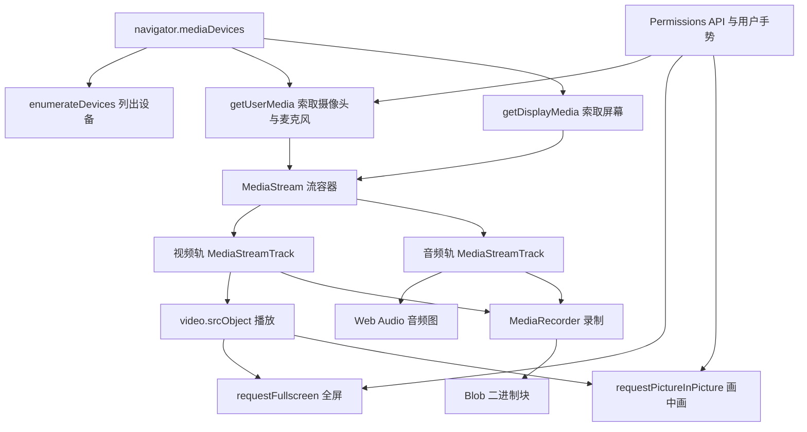
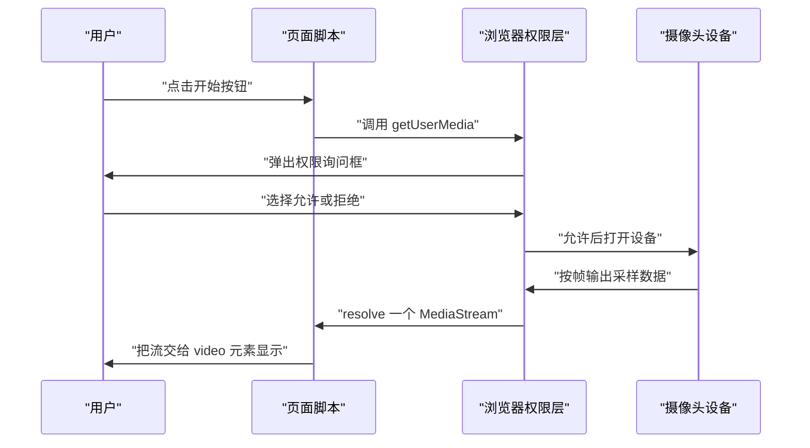
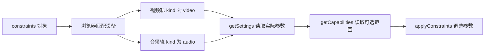
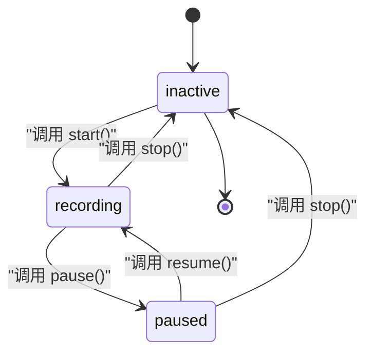
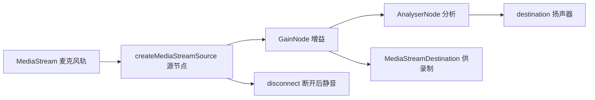
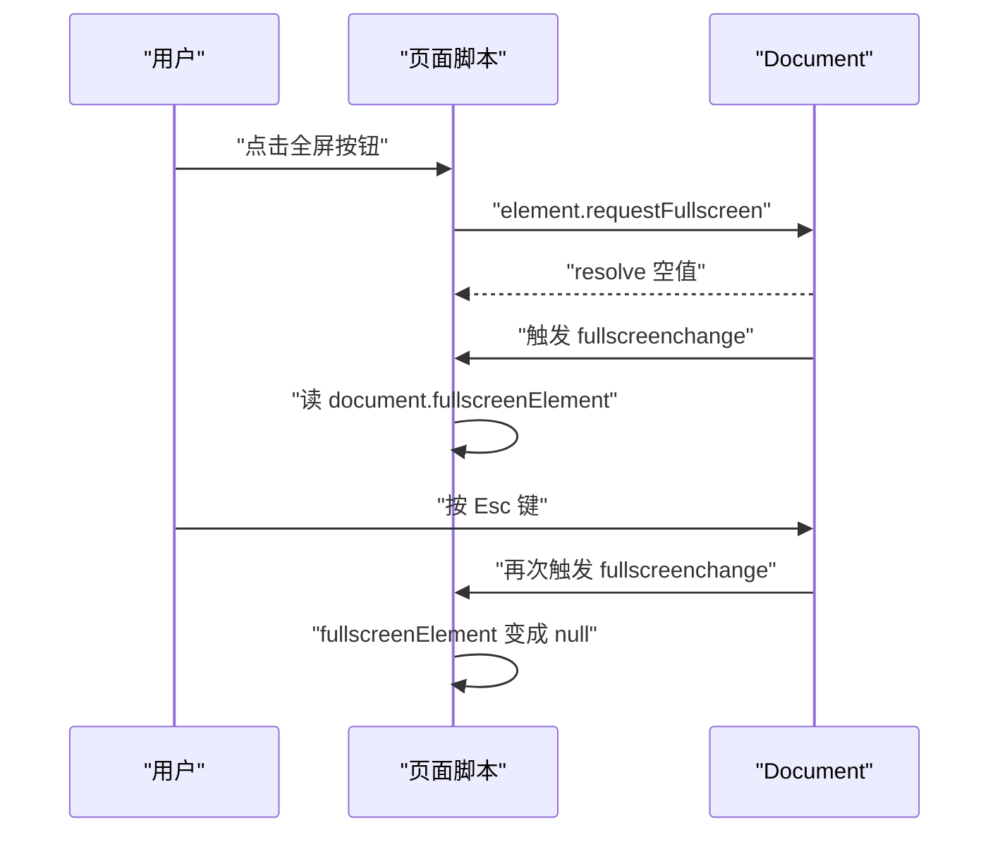
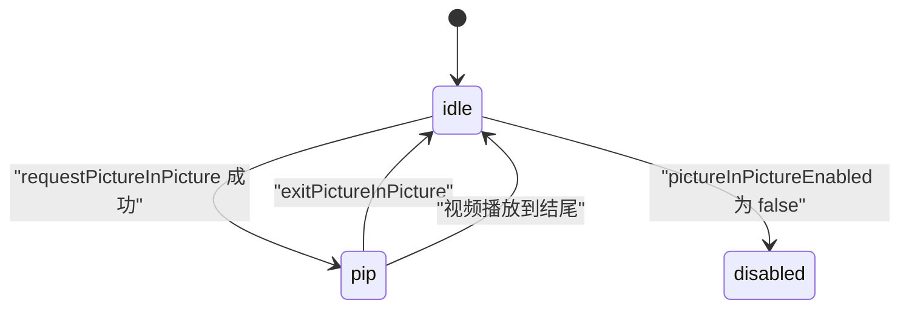
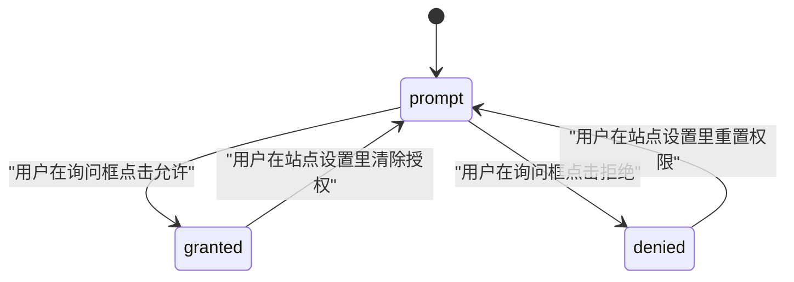

# 媒体：音视频采集、全屏与画中画

!!! abstract "学完这一页你能"
    - 写出一个调用 getUserMedia 拿到摄像头画面、并把画面接到 video 元素上的页面，同时处理允许、拒绝、设备缺失三条分支。
    - 用 MediaRecorder 把同一条 MediaStream 录成 webm 文件，并说出 start、pause、stop 三个动作把 recorder.state 改成了什么值。
    - 用 AudioContext 把麦克风信号接成 源 到 增益 到 输出 的图，并解释增益设为 0 与断开连接的区别。
    - 用 Fullscreen API 与 Picture-in-Picture API 切换元素显示模式，并说出两者对用户手势的要求与失败错误名。

## 0. 知识地图



建议这样读：先把第 1 节和第 2 节连起来读，弄清 设备 到 流 到 轨道 的包含关系。
第 3 节和第 4 节是消费这条流的两种方式，分别对应 存成文件 和 实时计算。
第 5 节与第 6 节属于显示层，第 7 节是前面所有调用的前置条件，建议最后回头再读一遍第 7 节。

## 1. MediaDevices 与 getUserMedia：把设备打开

**先想一个问题**

你做一个在线钢琴陪练页面。用户点 开始陪练 之后要看见自己弹琴的手。
摄像头画面从哪个接口来？为什么页面必须先弹一个权限框？

**心智模型**

!!! tip "心智模型"
    一句话模型：navigator.mediaDevices 是页面访问摄像头与麦克风的唯一入口，每次访问都要向用户申请。

    日常类比：它像小区门禁前台。你不能自己上楼，要报房号，前台打电话给业主确认，确认后才给你一张临时卡。

    类比不成立的地方：前台只在小区门口；mediaDevices 在非安全上下文里会整个消失。而且一张临时卡可以同时开摄像头的门与麦克风的门。

!!! note "术语：安全上下文"
    安全上下文指页面运行在 HTTPS、http://localhost 或 file 这类受信任环境里。

    例子：https://example.com 的页面可以调用 getUserMedia，http://example.com 的页面拿到的是 undefined。

!!! note "术语：MediaDevices"
    navigator.mediaDevices 返回的对象，暴露 enumerateDevices、getUserMedia、getDisplayMedia、getSupportedConstraints 方法。

    例子：const md = navigator.mediaDevices; 之后用 md.getUserMedia 取流。

**图解**



逐步解读：

1. 用户点击按钮，产生一个用户手势，这一步决定权限框能否弹出。
2. 页面调用 getUserMedia，把期望的分辨率与设备要求写成 constraints 对象。
3. 浏览器权限层弹出询问框，函数停在这里等待。
4. 用户选择允许或拒绝，这是唯一由用户决定的分支点。
5. 允许后浏览器打开物理设备，设备开始按帧输出数据。
6. 浏览器把设备数据包成 MediaStream，resolve 给调用方。
7. 页面把流赋给 video.srcObject，画面出现在屏幕上。

**一步一步来**

第 1 步：写一个能力探测函数，判断当前环境能否取流。

```js
// 探测能力：非安全上下文或定制内核会拿不到 mediaDevices
function probe() {
  // 可选链兜住 mediaDevices 为 undefined 的情况
  const md = navigator.mediaDevices;
  return {
    hasMediaDevices: Boolean(md),                        // 入口对象是否存在
    hasGetUserMedia: typeof md?.getUserMedia === 'function', // 方法是否可调用
    secure: window.isSecureContext === true,             // HTTPS 或 localhost
  };
}
```

**这段代码在做什么**

- 用可选链读取 navigator.mediaDevices，缺失时不会抛 TypeError。
- hasMediaDevices 记录入口对象本身是否存在。
- hasGetUserMedia 检查方法类型，而不是只看对象存在。
- secure 记录是否安全上下文，这一项决定前两项是否有意义。
- 返回普通对象，便于打日志与分支判断。

运行结果（HTTPS 页面）: `{ hasMediaDevices: true, hasGetUserMedia: true, secure: true }`

第 2 步：写出 constraints 并取流，再把流接到 video 上。

```js
// 只要视频，避免顺带申请麦克风权限
const VIDEO_CONSTRAINTS = {
  video: { width: { ideal: 1280 }, height: { ideal: 720 } }, // ideal 是期望值，达不到也能成功
  audio: false,                                             // 不申请麦克风
};

async function openCamera(videoEl) {
  // 这一行会挂起，直到用户点允许或拒绝
  const stream = await navigator.mediaDevices.getUserMedia(VIDEO_CONSTRAINTS);
  videoEl.srcObject = stream; // 直接给流对象，不用 createObjectURL
  videoEl.muted = true;       // 自播自看必须静音，否则回声叠加
  videoEl.playsInline = true; // 移动端内联播放，不弹系统播放器
  await videoEl.play();       // 现代浏览器要求显式调用 play
  return stream;              // 交给调用方，停设备时要用
}
```

**这段代码在做什么**

- video 用 ideal，表示期望 1280x720，设备达不到时浏览器给一个接近的值。
- audio 设为 false，权限框里不会出现麦克风。
- await getUserMedia 会挂起当前函数，用户不点按钮就一直等待。
- srcObject 直接接收流对象，不需要经过 URL.createObjectURL。
- muted 与 playsInline 分别解决回声和移动端全屏播放器两个问题。
- 返回 stream，后面停止设备要靠它。

运行结果: 用户点允许后 video 上出现画面；点拒绝时 openCamera 抛出 NotAllowedError。

第 3 步：离开页面或切换镜头时，把设备还回去。

```js
// MediaStream 没有 stop 方法，必须逐条停轨道
function release(stream) {
  if (!stream) return 0;             // 入参可能为 null
  const tracks = stream.getTracks(); // 视频轨与音频轨合并返回
  for (const track of tracks) {
    track.stop();                    // 停掉摄像头指示灯才会熄灭
  }
  return tracks.length;              // 便于断言与日志
}
```

**这段代码在做什么**

- 先判空，避免在 null 上调用 getTracks 抛错。
- getTracks 返回视频轨与音频轨的合并数组。
- 逐条调用 track.stop，停下物理设备。
- 返回停掉的轨道数量，可用来写断言。
- 停掉后该轨道不能恢复，只能重新取流。

运行结果: 摄像头指示灯熄灭；只取视频时返回 1，音视频都取时返回 2。

**动手验证**

用一个替身对象复现同一套探测逻辑，在 Node 里跑断言。

```js
// 依赖：Node 20+ 内置模块，无第三方依赖
// 运行：node probe.mjs
import assert from 'node:assert/strict';

// 替身对象模仿不同环境里的 window
function canUseGetUserMedia(scope) {
  return Boolean(
    scope &&
      scope.isSecureContext &&                                   // 非安全上下文直接出局
      scope.navigator &&
      scope.navigator.mediaDevices &&                            // 定制内核可能缺失
      typeof scope.navigator.mediaDevices.getUserMedia === 'function'
  );
}

const desktop = { isSecureContext: true, navigator: { mediaDevices: { getUserMedia: async () => ({}) } } };
const httpPage = { isSecureContext: false, navigator: { mediaDevices: { getUserMedia: async () => ({}) } } };
const webview = { isSecureContext: true, navigator: {} };

assert.equal(canUseGetUserMedia(desktop), true);
assert.equal(canUseGetUserMedia(httpPage), false);
assert.equal(canUseGetUserMedia(webview), false);

const result = { desktop: canUseGetUserMedia(desktop), httpPage: canUseGetUserMedia(httpPage), webview: canUseGetUserMedia(webview) };
console.log(JSON.stringify(result));
assert.deepEqual(result, { desktop: true, httpPage: false, webview: false });
```

预期输出: `{"desktop":true,"httpPage":false,"webview":false}`

**常见坑**

| 现象 | 原因 | 怎么修 |
| --- | --- | --- |
| navigator.mediaDevices 是 undefined | 页面跑在 http 上，不是安全上下文 | 改用 HTTPS，本地开发用 localhost |
| 权限框弹不出来，调用直接失败 | 调用发生在页面加载时，没有用户手势 | 把调用挪进按钮的 click 处理函数 |
| 关闭弹窗后摄像头灯还亮着 | 只隐藏了 video 元素，没停轨道 | 在关闭逻辑里对每条 track 调 stop |
| 本地预览出现尖叫回声 | video 没有静音，麦克风声音被扬声器再采集 | 给预览用的 video 设 muted 为 true |
| 移动端一点播放就跳系统播放器 | 缺少 playsInline | 给 video 设 playsInline 属性 |

**小结**

- navigator.mediaDevices 是唯一入口，安全上下文与用户手势是两道门。
- constraints 里的 ideal 表示期望，浏览器可以给你一个接近的值。
- 释放设备要逐条 track.stop，MediaStream 本身没有 stop。

## 2. 媒体管线：MediaStream、轨道与约束

**先想一个问题**

你要同时录屏幕和麦克风，但不想把系统提示音也录进去。
这时你操作的对象是两条流，还是一盒轨道？把流合并了，音量还能单独调吗？

**心智模型**

!!! tip "心智模型"
    一句话模型：MediaStream 是装轨道的盒子，轨道才是数据来源，盒子本身没有开关。

    日常类比：盒子像便当盒，视频轨和音频轨是两格菜，倒掉一格不影响另一格。

    类比不成立的地方：便当盒的两格同时存在就固定了；流里的轨道可以在播放中增删，轨道还会自己触发 ended 事件。

!!! note "术语：MediaStreamTrack"
    表示单一媒体源的一段数据流，kind 属性取值为 video 或 audio。

    例子：摄像头流里的轨道 kind 是 video，label 常常带设备名。

**图解**



逐步解读：

1. constraints 描述你想要什么，浏览器据此挑选设备与参数。
2. 匹配结果是一条或多条轨道，每条轨道对应一个物理来源。
3. 视频轨带 kind 为 video，音频轨带 kind 为 audio。
4. getSettings 返回浏览器实际采用的宽高与帧率。
5. getCapabilities 返回设备允许的参数范围。
6. 想改参数时用 applyConstraints，只能落在范围之内。

**一步一步来**

第 1 步：读出轨道信息，确认约束是否真的生效。

```js
// 打印每条轨道的实际情况，排查 设置没生效 的问题
function describe(stream) {
  return stream.getTracks().map((track) => ({
    kind: track.kind,                          // video 或 audio
    label: track.label,                        // 设备名，未授权时常为空串
    readyState: track.readyState,              // live 或 ended
    settings: track.getSettings(),             // 浏览器实际采用的参数
  }));
}

const info = describe(stream);
console.log(JSON.stringify(info, null, 2));
```

**这段代码在做什么**

- getTracks 拿到全部轨道，map 成纯数据对象。
- kind 用来区分视频与音频，做判断时不要靠数组下标。
- label 在权限未授予时是空字符串，不能用来识别设备。
- getSettings 返回实际生效的宽高，比 constraints 更可信。
- 输出纯对象便于复制到控制台慢慢看。

运行结果: `[{"kind":"video","label":"FaceTime HD Camera","readyState":"live","settings":{"width":1280,"height":720,"frameRate":30}}]`

第 2 步：动态增删轨道，以及替换轨道。

```js
// 给一条流加上第二条音频轨，或把视频轨换成另一台设备
function swapVideo(stream, newTrack) {
  const old = stream.getVideoTracks()[0]; // 只取第一条视频轨
  if (old) {
    stream.removeTrack(old);              // 先从盒子里移走
    old.stop();                           // 再停掉物理设备，顺序不能反
  }
  stream.addTrack(newTrack);              // 新轨道接上，video 会自动换画面
  return stream.getVideoTracks().length;  // 应恒为 1
}
```

**这段代码在做什么**

- getVideoTracks 只返回视频轨，避免误伤音频轨。
- removeTrack 把轨道从流里摘掉，但不会停设备。
- 必须先 remove 再 stop，顺序反了会触发 ended 事件。
- addTrack 之后，正在播放的 video 元素自动切到新轨道。
- 返回视频轨数量，用来断言只有一条。

运行结果: 画面切到新设备，函数返回 1。

**动手验证**

用替身轨道验证 先移除后停止 的顺序，以及 constraints 合并规则。

```js
// 依赖：Node 20+ 内置模块，无第三方依赖
// 运行：node track.mjs
import assert from 'node:assert/strict';

const log = [];
function makeTrack(kind) {
  return { kind, stopped: false, stop() { this.stopped = true; log.push(`stop:${this.kind}`); } };
}
function makeStream(tracks) {
  return {
    tracks,
    getTracks() { return this.tracks; },
    getVideoTracks() { return this.tracks.filter((t) => t.kind === 'video'); },
    removeTrack(t) { this.tracks = this.tracks.filter((x) => x !== t); log.push(`remove:${t.kind}`); },
    addTrack(t) { this.tracks.push(t); log.push(`add:${t.kind}`); },
  };
}

// 合并基础约束与用户覆盖项，后者优先
function mergeConstraints(base, override) {
  return { ...base, ...override, video: { ...base.video, ...(override.video ?? {}) } };
}

const s = makeStream([makeTrack('video'), makeTrack('audio')]);
const fresh = makeTrack('video');
const old = s.getVideoTracks()[0];
s.removeTrack(old);
old.stop();
s.addTrack(fresh);

assert.deepEqual(log, ['remove:video', 'stop:video', 'add:video']);
assert.equal(s.getVideoTracks().length, 1);
assert.equal(s.getTracks().length, 2);
assert.equal(fresh.stopped, false);

const merged = mergeConstraints({ video: { width: { ideal: 640 } } }, { video: { width: { ideal: 1280 } } });
assert.equal(merged.video.width.ideal, 1280);
console.log(JSON.stringify({ log, videoTracks: s.getVideoTracks().length, width: merged.video.width.ideal }));
```

预期输出: `{"log":["remove:video","stop:video","add:video"],"videoTracks":1,"width":1280}`

**常见坑**

| 现象 | 原因 | 怎么修 |
| --- | --- | --- |
| 摄像头灯灭不掉 | 只从流里 removeTrack，没调 stop | remove 之后立刻对同一轨道调 stop |
| 换设备后画面卡住 | 旧轨道停了但没移除，流里出现两条视频轨 | 先 removeTrack 再 stop，再 addTrack |
| 设置 1280x720 却拿到 640x480 | 用了 ideal，设备不支持时被降级 | 必须精确就写 exact，并处理 OverconstrainedError |
| 靠数组下标判断视频轨 | 音视频轨顺序不保证 | 用 getVideoTracks 与 getAudioTracks |
| 用 label 识别设备名却没数据 | 权限未授予时 label 是空串 | 先取一次流，再看 label |

**小结**

- 流是盒子，轨道是数据；混音、录制、分析都作用在轨道上。
- 增删轨道的正确顺序是先移除、再停止、后添加。
- ideal 允许降级，exact 不允许，降级失败会抛 OverconstrainedError。

## 3. MediaRecorder：把流录成文件

**先想一个问题**

用户在页面上录了一段 30 秒语音，点了停止按钮。
你手上拿到的是什么？是音频文件，还是一堆二进制片段？

**心智模型**

!!! tip "心智模型"
    一句话模型：MediaRecorder 是挂在流上的录音机，它不复制流，只订阅轨道数据。

    日常类比：像转播车把现场信号录成磁带，车停了现场还在继续。

    类比不成立的地方：转播车能同时接多路信号；MediaRecorder 只接受一条 MediaStream，多路要先拼成一条。

!!! note "术语：MediaRecorder"
    构造函数接收一条 MediaStream，把轨道数据编码成 Blob 的接口，通过 dataavailable 事件交出数据块。

    例子：new MediaRecorder(stream, { mimeType: 'video/webm' })。

**图解**



逐步解读：

1. 新建的 recorder 处于 inactive，此时不会收集任何数据。
2. 调用 start 进入 recording，数据开始按块通过 dataavailable 事件交出。
3. 调用 pause 进入 paused，数据收集中断，但状态不是 inactive。
4. 调用 resume 回到 recording，后续数据块接在原来序列后面。
5. 调用 stop 进入 inactive，并补发最后一块数据与 stop 事件。
6. 只有在 inactive 状态下才能再次调用 start。

**一步一步来**

第 1 步：先问浏览器支持哪种封装格式。

```js
// 不支持就换一个候选，不要直接假设 webm 可用
const CANDIDATES = ['video/webm;codecs=vp9,opus', 'video/webm', 'video/mp4'];

function pickMime() {
  for (const type of CANDIDATES) {
    if (MediaRecorder.isTypeSupported(type)) return type; // 第一个可用的返回
  }
  return ''; // 空串表示交给浏览器自己选默认值
}

const mimeType = pickMime();
console.log('使用格式', mimeType || '浏览器默认');
```

**这段代码在做什么**

- isTypeSupported 是静态方法，不需要先建实例。
- 候选数组从具体到宽泛排列，先试带编解码器的写法。
- 返回空串表示不指定 mimeType，交给浏览器决定。
- 输出实际采用的值，方便排查 Safari 上的格式差异。

运行结果: `使用格式 video/webm;codecs=vp9,opus`

第 2 步：建 recorder、收集数据块、组装成 Blob。

```js
// 把流录成文件：用 timeslice 让数据分块到达，避免内存一次性暴涨
function record(stream, mimeType, ms = 1000) {
  const chunks = [];                                  // 收集所有数据块
  const recorder = new MediaRecorder(stream, mimeType ? { mimeType } : undefined);
  recorder.addEventListener('dataavailable', (e) => {
    if (e.data.size > 0) chunks.push(e.data);         // 空块直接丢弃
  });
  recorder.addEventListener('stop', () => {
    const blob = new Blob(chunks, { type: recorder.mimeType }); // 拼成完整文件
    console.log('录制完成', blob.size, '字节');        // 用于确认不是 0 字节
  });
  recorder.start(ms);                                 // 每 ms 毫秒交出一块
  return recorder;
}
```

**这段代码在做什么**

- chunks 数组按到达顺序保存数据块。
- dataavailable 里的 e.data 是 Blob，size 为 0 的块直接跳过。
- stop 事件里才拼 Blob，保证拿到最后一块数据。
- start 传 timeslice 后数据分块到达，传 0 或不传则停止时一次给完。
- 返回值是 recorder 对象，调用方用它执行 stop 与 pause。

运行结果: 停止后打印 `录制完成 482103 字节`。

**动手验证**

用替身 recorder 复现状态机，验证在 inactive 上调用 stop 的行为。

```js
// 依赖：Node 20+ 内置模块，无第三方依赖
// 运行：node recorder.mjs
import assert from 'node:assert/strict';

class FakeRecorder {
  constructor(stream, { mimeType = 'video/webm' } = {}) {
    if (!stream) throw new TypeError('stream 不能为空');   // 与浏览器一致
    this.stream = stream;
    this.mimeType = mimeType;
    this.state = 'inactive';                              // 初始状态
    this.listeners = new Map();
  }
  on(type, fn) { this.listeners.set(type, fn); return this; }
  emit(type, payload) { this.listeners.get(type)?.(payload); }
  start(timeslice = 0) {
    if (this.state !== 'inactive') throw new Error('InvalidStateError'); // 重复 start 非法
    this.state = 'recording';
    this.timeslice = timeslice;
  }
  pause() {
    if (this.state !== 'recording') throw new Error('InvalidStateError');
    this.state = 'paused';
  }
  stop() {
    if (this.state === 'inactive') throw new Error('InvalidStateError'); // 重复 stop 非法
    this.emit('dataavailable', { data: { size: 1024 } });                // 补发最后一块
    this.state = 'inactive';
    this.emit('stop', {});
  }
}

const chunks = [];
const r = new FakeRecorder({ id: 'stream-1' }, { mimeType: 'video/webm' });
r.on('dataavailable', (e) => chunks.push(e.data.size));
r.on('stop', () => chunks.push('stop'));
r.start(1000);
assert.equal(r.state, 'recording');
r.pause();
assert.equal(r.state, 'paused');
r.stop();
assert.equal(r.state, 'inactive');
assert.deepEqual(chunks, [1024, 'stop']);
assert.throws(() => r.stop(), /InvalidStateError/);
console.log(JSON.stringify({ state: r.state, chunks }));
```

预期输出: `{"state":"inactive","chunks":[1024,"stop"]}`

**常见坑**

| 现象 | 原因 | 怎么修 |
| --- | --- | --- |
| 下载的视频是 0 字节 | 用了 ondataavailable 赋值覆盖，只留最后一块 | 用数组 push 收集，在 stop 事件里拼 Blob |
| 第二次点录制直接抛错 | 上一次没停，状态还是 recording | 录制前判断 state 是否为 inactive |
| Safari 上录制失败 | mimeType 传了不被支持的字符串 | 先用 isTypeSupported 探测，失败时不指定 mimeType |
| 录制中途页面卡顿 | 没传 timeslice，全部数据在停止时一次交付 | start 传入 500 到 1000 之间的 timeslice |
| 录音里有自己的外放声音 | 录制的是麦克风轨，扬声器把视频声音又收了进去 | 用耳机，或者录完再做音频混合 |

**小结**

- MediaRecorder 订阅轨道数据，不复制也不改变原流。
- 状态只有 inactive、recording、paused 三个值，重复 start 与重复 stop 都非法。
- 一定在 stop 事件里拼 Blob，否则会丢掉最后一块数据。

## 4. Web Audio 概览：把声音变成可计算的图

**先想一个问题**

你要给麦克风输入做实时变声，并在界面上画一根音量条。
video 元素只能播放，拿不到采样值，这一步该怎么办？

**心智模型**

!!! tip "心智模型"
    一句话模型：AudioContext 是一张音频电路板，AudioNode 是元件，connect 是焊锡。

    日常类比：像家里的插线板，拔掉插头才断电；把音量旋钮拧到 0 并不等于拔插头。

    类比不成立的地方：插线板只有一个回路；音频图允许一个节点输出到多个下游，也允许多个节点汇入同一个下游。

!!! note "术语：AudioContext"
    音频图所处的运行环境，负责时钟、采样率与节点创建，用 currentTime 表示音频时间线。

    例子：const ctx = new AudioContext(); 之后用 ctx.createGain 建增益节点。

!!! note "术语：AudioNode"
    音频图里的一个处理单元，拥有 connect 与 disconnect 方法，输入输出都是音频通道。

    例子：GainNode 有 gain 参数，AnalyserNode 有 fftSize 参数。

**图解**



逐步解读：

1. 麦克风轨先包成 MediaStreamAudioSourceNode，才能进入音频图。
2. 源节点连到 GainNode，用 gain.value 控制音量倍数。
3. GainNode 再连到 AnalyserNode，用于取实时采样。
4. AnalyserNode 连到 destination，声音才会送去扬声器。
5. 同一个 GainNode 可以再连一路到 MediaStreamDestination，用于录制。
6. 调用 disconnect 把节点从图上摘下，下游立刻收不到数据。

**一步一步来**

第 1 步：建上下文、接麦克风、把链路连起来。

```js
// 建立 源 到 增益 到 分析器 到 输出 的链路
async function buildGraph(stream) {
  const ctx = new AudioContext();                       // 采样率由系统决定
  await ctx.resume();                                   // 页面可能处于 suspended，需要手势唤醒
  const source = ctx.createMediaStreamSource(stream);   // 把媒体流包成源节点
  const gain = ctx.createGain();                        // 增益节点
  const analyser = ctx.createAnalyser();                // 分析节点
  gain.gain.value = 0.8;                                // 0.8 倍，1 表示原始音量
  analyser.fftSize = 2048;                              // 时域采样点个数
  source.connect(gain);                                 // 源 到 增益
  gain.connect(analyser);                               // 增益 到 分析
  analyser.connect(ctx.destination);                    // 分析 到 扬声器
  return { ctx, source, gain, analyser };
}
```

**这段代码在做什么**

- createMediaStreamSource 不会自己开始播放，只把轨道接到图上。
- ctx.resume 返回 Promise，页面自动播放被拦截时上下文处于 suspended。
- gain.value 是倍数，1 表示不放大也不衰减。
- fftSize 决定 getByteTimeDomainData 写满数组的元素个数。
- 最后一段必须连到 ctx.destination，否则扬声器没有声音。

运行结果: 对着麦克风说话，扬声器里能听到自己的声音。

第 2 步：取出采样值画音量条，并正确断开连接。

```js
// 从分析节点取时域数据，算出 0 到 100 的音量条数值
function drawLevel(analyser, buffer) {
  analyser.getByteTimeDomainData(buffer); // 数据写入传入的 Uint8Array
  let peak = 0;
  for (const v of buffer) {
    const offset = Math.abs(v - 128);     // 无声音时值在 128 附近
    if (offset > peak) peak = offset;     // 取最大偏移作为峰值
  }
  return Math.min(100, Math.round((peak / 128) * 100));
}

function teardown(source, gain) {
  source.disconnect(); // 源与增益之间断开
  gain.disconnect();   // 增益与下游之间断开
}
```

**这段代码在做什么**

- getByteTimeDomainData 需要预先分配好的 Uint8Array，长度等于 fftSize。
- 无声音时每个字节在 128 附近，所以先减去 128 取偏移。
- 峰值除以 128 再乘 100，得到 0 到 100 的数值。
- teardown 两次 disconnect，把节点从图上摘掉。
- 断开后 analyser 不再收到数据，返回值会停在 0。

运行结果: 安静时返回 0，正常说话时返回 30 到 90 之间的整数。

**动手验证**

用纯函数复现增益计算与音量计算，验证 增益为 0 不等于断开。

```js
// 依赖：Node 20+ 内置模块，无第三方依赖
// 运行：node audiograph.mjs
import assert from 'node:assert/strict';

// 模拟 GainNode：把输入样本乘以 gain 值
function throughGain(samples, gain) {
  return samples.map((s) => s * gain);
}

// 模拟 AnalyserNode 的时域读取，输入是 -1 到 1 的浮点样本
function toByteTimeDomain(samples) {
  return Uint8Array.from(samples.map((s) => Math.max(0, Math.min(255, Math.round(128 + s * 128)))));
}
function makeGraph() {
  return { connected: false, gain: 1, connect() { this.connected = true; }, disconnect() { this.connected = false; } };
}

const raw = [0.5, -0.25, 0];
assert.deepEqual(throughGain(raw, 1), [0.5, -0.25, 0]);
assert.deepEqual(throughGain(raw, 0), [0, -0, 0]);         // 增益为 0：数据仍在流动，值变成 0

const bytes = toByteTimeDomain(raw);
assert.equal(bytes.length, 3);
assert.equal(bytes[0], 192);                                // 0.5 映射到 192

const gainNode = makeGraph();
gainNode.connect();
assert.equal(gainNode.connected, true);
gainNode.disconnect();
assert.equal(gainNode.connected, false);                    // 断开后下游拿不到任何数据

console.log(JSON.stringify({ bytes: [...bytes], connected: gainNode.connected }));
```

预期输出: `{"bytes":[192,96,128],"connected":false}`

**常见坑**

| 现象 | 原因 | 怎么修 |
| --- | --- | --- |
| 页面没有声音也不报错 | AudioContext 处于 suspended，或被自动播放策略拦截 | 在用户点击事件里 await ctx.resume |
| getByteTimeDomainData 报参数错误 | 传入的数组长度与 fftSize 不一致 | 用 new Uint8Array(analyser.fftSize) 分配 |
| 把增益设为 0 之后仍有数据 | 增益只做乘法，节点还在图上 | 要停数据必须调 disconnect |
| 断开后整条链路哑了 | 对中间节点调了 disconnect 但没重连 | 记录节点引用，需要时重新 connect |
| 麦克风声音从扬声器放出来形成啸叫 | 分析节点直接连到 destination | 用耳机，或者只连到 MediaStreamDestination |

**小结**

- 音频图由节点与连线组成，source 与 destination 是两端。
- 增益是乘法，断开是断路，两者效果不同。
- 时序数据要用预先分配好的定长数组接收。

## 5. Fullscreen API：把元素铺满屏幕

**先想一个问题**

用户在手机上看一个 16:9 的播放器，地址栏占掉一部分高度。
你想让播放器铺满整屏，只改 CSS 高度能做到吗？

**心智模型**

!!! tip "心智模型"
    一句话模型：Fullscreen API 改变元素的渲染归属，把某个元素顶到屏幕最上层。

    日常类比：像把一张纸从文件夹里抽出来贴到墙上，纸的内容没变，位置变了。

    类比不成立的地方：贴上去的是整个元素与它的子元素，而且浏览器会在顶部盖一层退出提示。

!!! note "术语：Fullscreen API"
    由 Element.requestFullscreen、Document.exitFullscreen、document.fullscreenElement 以及 fullscreenchange 事件组成的接口集合。

    例子：await playerEl.requestFullscreen() 之后，document.fullscreenElement 就是 playerEl。

**图解**



逐步解读：

1. 用户点击按钮，产生用户手势。
2. 页面在手势处理函数里调用 requestFullscreen。
3. 浏览器成功切换后，Promise resolve，值为 undefined。
4. 随后派发 fullscreenchange 事件，这是界面同步的唯一可靠时机。
5. 页面读取 fullscreenElement，判断当前是否处于全屏。
6. 用户按 Esc 时，浏览器自己退出全屏，再派发一次 fullscreenchange。
7. 页面在这个事件里把按钮图标换回 进入全屏。

**一步一步来**

第 1 步：封装一个可切换的全屏函数，并处理错误。

```js
// 进入或退出全屏，失败时把错误名打印出来
async function toggleFullscreen(element) {
  try {
    if (document.fullscreenElement) {
      await document.exitFullscreen();          // 已在全屏则退出
      return 'windowed';
    }
    await element.requestFullscreen();          // 必须在用户手势里调用
    return 'fullscreen';
  } catch (err) {
    // 常见错误名：NotAllowedError 与 TypeError
    console.error('切换全屏失败', err.name, err.message);
    return 'failed';
  }
}
```

**这段代码在做什么**

- 用 fullscreenElement 判断当前状态，比自己维护变量可靠。
- exitFullscreen 挂在 document 上，不是挂在元素上。
- 两个 await 都可能被拒绝，所以要包在 try 里。
- 返回字符串便于界面判断与断言。
- err.name 是区分失败原因的关键信息。

运行结果: 成功时返回 `fullscreen` 或 `windowed`；没有用户手势时返回 `failed` 并打印 `NotAllowedError`。

第 2 步：监听 fullscreenchange，把界面状态同步过来。

```js
// 全屏状态只能由事件驱动，不要在自己调用后立刻改 UI
function bindFullscreenUi(onChange) {
  const handler = () => {
    const el = document.fullscreenElement;      // null 表示不在全屏
    onChange({ active: Boolean(el), element: el });
  };
  document.addEventListener('fullscreenchange', handler); // 标准事件名
  return () => document.removeEventListener('fullscreenchange', handler); // 返回解绑函数
}
```

**这段代码在做什么**

- 事件名是 fullscreenchange，全部小写，没有驼峰。
- 事件处理里重新读 fullscreenElement，而不是缓存旧值。
- 回调传出 active 与 element 两个字段供界面使用。
- 返回解绑函数，组件卸载时调用可避免内存泄漏。
- 每次切换都会触发一次，包括用户按 Esc 退出。

运行结果: 进入全屏时回调收到 `{ active: true, element: section }`；按 Esc 后收到 `{ active: false, element: null }`。

**动手验证**

用替身 document 复现 事件驱动状态同步 的顺序，并验证无手势时被拒绝。

```js
// 依赖：Node 20+ 内置模块，无第三方依赖
// 运行：node fullscreen.mjs
import assert from 'node:assert/strict';

class FakeDocument {
  constructor() {
    this.fullscreenElement = null;
    this.handlers = new Set();
  }
  addEventListener(type, fn) { if (type === 'fullscreenchange') this.handlers.add(fn); }
  removeEventListener(type, fn) { if (type === 'fullscreenchange') this.handlers.delete(fn); }
  emit() { for (const fn of this.handlers) fn(); }
  async exitFullscreen() { this.fullscreenElement = null; this.emit(); }
}

// userGesture 为 false 时模仿浏览器的拒绝行为
async function requestFullscreen(doc, element, userGesture) {
  if (!userGesture) throw Object.assign(new Error('需要用户手势'), { name: 'NotAllowedError' });
  doc.fullscreenElement = element;
  doc.emit();
}

export async function run() {
  const doc = new FakeDocument();
  const el = { id: 'player' };
  const seen = [];
  const off = (() => { const fn = () => seen.push(doc.fullscreenElement?.id ?? null); doc.addEventListener('fullscreenchange', fn); return () => doc.removeEventListener('fullscreenchange', fn); })();

  await assert.rejects(() => requestFullscreen(doc, el, false), { name: 'NotAllowedError' });
  assert.equal(doc.fullscreenElement, null);

  await requestFullscreen(doc, el, true);
  assert.equal(doc.fullscreenElement, el);
  await doc.exitFullscreen();
  assert.equal(doc.fullscreenElement, null);
  off();

  assert.deepEqual(seen, ['player', null]);
  console.log(JSON.stringify({ events: seen, active: doc.fullscreenElement }));
}

await run();
```

预期输出: `{"events":["player",null],"active":null}`

**常见坑**

| 现象 | 原因 | 怎么修 |
| --- | --- | --- |
| 调用没有报错但界面没变 | 状态改动只在事件里生效，可能发生了竞态 | 一切 UI 变化都放进 fullscreenchange 处理函数 |
| 报 NotAllowedError | 调用不在用户手势处理期间，或在 iframe 里没给 allowfullscreen | 放到 click 处理函数里，给 iframe 加 allow 属性 |
| 报 TypeError | 目标元素是 null，或者传了非元素对象 | 取元素前先判空 |
| 组件卸载后仍收到事件 | 注册了监听但没解绑 | 保存解绑函数并在卸载时调用 |
| 全屏后按钮状态不对 | 用自己的布尔变量记状态，用户按 Esc 后没更新 | 只信 document.fullscreenElement |

**小结**

- requestFullscreen 必须在用户手势里调用，并返回 Promise。
- fullscreenchange 是同步 UI 的唯一可靠时机，用户按 Esc 也会触发。
- 判断当前状态一律读 document.fullscreenElement。

## 6. Picture-in-Picture：把画面浮在最上层

**先想一个问题**

用户想一边开视频会议一边记笔记。他切到笔记应用后，视频窗口被盖住了。
怎么让视频画面浮在系统最上层，而且切窗口时不打断？

**心智模型**

!!! tip "心智模型"
    一句话模型：画中画把 video 元素的画面交给操作系统的一个独立小窗口。

    日常类比：像把电视画面投到一台小监视器，监视器由系统托管，主窗口被盖住也不影响。

    类比不成立的地方：监视器只显示视频画面本身，叠在 video 上的字幕与按钮不会跟过去。

!!! note "术语：Picture-in-Picture API"
    由 HTMLVideoElement.requestPictureInPicture、document.exitPictureInPicture、document.pictureInPictureElement 以及 enterpictureinpicture 与 leavepictureinpicture 事件组成的接口集合。

    例子：await video.requestPictureInPicture() 之后，document.pictureInPictureElement 就是该 video。

**图解**



逐步解读：

1. 页面初始处于 idle，没有元素在小窗里。
2. 手势内调用 requestPictureInPicture，成功进入 pip 状态。
3. 调用 document.exitPictureInPicture 回到 idle，并触发 leavepictureinpicture。
4. 视频播放到结尾时，浏览器自己退出小窗。
5. 文档不支持画中画时，pictureInPictureEnabled 为 false，页面应隐藏按钮。

**一步一步来**

第 1 步：判断能不能进画中画，并处理失败。

```js
// 进入画中画前先检查三项条件
async function enterPip(video) {
  if (!document.pictureInPictureEnabled) return 'unsupported';       // 文档级开关
  if (video.disablePictureInPicture) return 'disabled';             // 元素级禁用
  if (video.readyState < 1) return 'no-metadata';                   // 还没读到时长信息
  try {
    await video.requestPictureInPicture();                          // 必须在用户手势里
    return 'pip';
  } catch (err) {
    console.error('进入画中画失败', err.name);
    return 'failed';
  }
}
```

**这段代码在做什么**

- pictureInPictureEnabled 表示整个文档是否开启画中画。
- disablePictureInPicture 是元素上的布尔属性，会直接阻止进入。
- readyState 小于 1 表示还没有元数据，此时调用会失败。
- await 可能被拒绝，常见错误名是 NotAllowedError 与 NotSupportedError。
- 返回字符串让调用方决定按钮状态。

运行结果: 正常情况下返回 `pip`；给 video 加上 disablePictureInPicture 后返回 `disabled`。

第 2 步：监听进入与离开事件，把按钮文案同步过去。

```js
// 用户也可能点小窗上的关闭按钮，所以必须监听事件
function bindPipUi(video, onChange) {
  const onEnter = () => onChange({ active: true, element: document.pictureInPictureElement });
  const onLeave = () => onChange({ active: false, element: null });
  video.addEventListener('enterpictureinpicture', onEnter); // 事件名全小写
  video.addEventListener('leavepictureinpicture', onLeave);
  return () => {
    video.removeEventListener('enterpictureinpicture', onEnter);
    video.removeEventListener('leavepictureinpicture', onLeave);
  };
}
```

**这段代码在做什么**

- 两个事件名全部小写，没有连字符。
- 进入时读 document.pictureInPictureElement，而不是用 video 变量猜。
- 离开时把 element 置为 null，和浏览器的行为一致。
- 返回解绑函数，元素移除前调用。
- 用户点小窗关闭按钮同样会触发 leavepictureinpicture。

运行结果: 进入小窗时回调收到 `{ active: true }`；点小窗关闭按钮后收到 `{ active: false }`。

**动手验证**

用替身 document 验证同一时刻只允许一个元素处于画中画。

```js
// 依赖：Node 20+ 内置模块，无第三方依赖
// 运行：node pip.mjs
import assert from 'node:assert/strict';

function makeDocument() {
  return {
    pictureInPictureEnabled: true,
    pictureInPictureElement: null,
    events: [],
    async exitPictureInPicture() {
      const el = this.pictureInPictureElement;
      this.pictureInPictureElement = null;
      this.events.push(`leave:${el?.id}`);
    },
  };
}

// 进入前先退出已有元素，保证同时只有一个
async function requestPip(doc, el, userGesture) {
  if (!doc.pictureInPictureEnabled) throw Object.assign(new Error('不支持'), { name: 'NotSupportedError' });
  if (el.disablePictureInPicture) throw Object.assign(new Error('元素被禁用'), { name: 'InvalidStateError' });
  if (!userGesture) throw Object.assign(new Error('需要手势'), { name: 'NotAllowedError' });
  if (doc.pictureInPictureElement) await doc.exitPictureInPicture();
  doc.pictureInPictureElement = el;
  doc.events.push(`enter:${el.id}`);
}

const doc = makeDocument();
const a = { id: 'a', disablePictureInPicture: false };
const b = { id: 'b', disablePictureInPicture: false };
const blocked = { id: 'c', disablePictureInPicture: true };

await assert.rejects(() => requestPip(doc, a, false), { name: 'NotAllowedError' });
await assert.rejects(() => requestPip(doc, blocked, true), { name: 'InvalidStateError' });
await requestPip(doc, a, true);
assert.equal(doc.pictureInPictureElement, a);
await requestPip(doc, b, true);
assert.equal(doc.pictureInPictureElement, b);
await doc.exitPictureInPicture();
assert.equal(doc.pictureInPictureElement, null);
assert.deepEqual(doc.events, ['enter:a', 'leave:a', 'enter:b', 'leave:b']);
console.log(JSON.stringify(doc.events));
```

预期输出: `["enter:a","leave:a","enter:b","leave:b"]`

**常见坑**

| 现象 | 原因 | 怎么修 |
| --- | --- | --- |
| 调用报 NotAllowedError | 不是用户手势触发的调用 | 把调用放进 click 处理函数 |
| 按钮点了没反应 | video 带着 disablePictureInPicture 属性 | 去掉该属性，或用视频流另建元素 |
| 小窗里字幕与按钮不见了 | 画中画只承载视频画面本身 | 把必要信息烧进视频，或另开小窗展示状态 |
| 关闭小窗后页面按钮还写着 退出画中画 | 只听自己的调用，没听系统事件 | 监听 leavepictureinpicture |
| 切换新视频时报错 | 上一个元素还在画中画里 | 进入前先 await document.exitPictureInPicture |

**小结**

- 画中画由 document 级开关与元素级禁用标记共同决定是否可用。
- 进入必须在用户手势内，失败时靠 err.name 区分原因。
- 界面同步要依赖 enter 与 leave 两个事件，用户能直接关掉小窗。

## 7. 权限与隐私：用户同意与生命周期

**先想一个问题**

用户第一次点了拒绝，页面第二次再调用 getUserMedia 会怎样？
为什么有的团队要求 每个页面只申请一次 权限？

**心智模型**

!!! tip "心智模型"
    一句话模型：权限状态由浏览器托管，页面只能查询与等待，不能自己改写。

    日常类比：像图书馆的借阅权限，管理员把记录存在系统里，你只能问是否可借。

    类比不成立的地方：图书馆可以人工改记录；浏览器权限只能由用户在站点设置里改，页面无权重置。

!!! note "术语：Permissions API"
    navigator.permissions.query 返回一个 PermissionStatus 对象，其 state 取值为 granted、denied、prompt 三者之一。

    例子：const st = await navigator.permissions.query({ name: 'camera' }); st.state 可能是 prompt。

!!! note "术语：用户手势"
    由用户真实操作（点击、按键、触摸）触发的事件处理期间，浏览器允许执行受限制的接口。

    例子：在 setTimeout 里调用 requestFullscreen 会失败，在 click 处理函数里调用可以成功。

**图解**



逐步解读：

1. 初始状态是 prompt，表示还没问过用户。
2. 用户在询问框选择允许，状态变为 granted，之后的调用不再弹框。
3. 用户选择拒绝，状态变为 denied，页面无法再次弹出询问框。
4. 用户可以在地址栏的站点设置里清除授权，状态回到 prompt。
5. 用户重置拒绝记录后，状态同样回到 prompt，页面才能再次询问。
6. 页面只能读取 state 并监听 change 事件，不能设置 state。

**一步一步来**

第 1 步：查询权限状态，并给出对应的界面文案。

```js
// 查权限状态，返回给界面用的三档文案
async function readPermission(name = 'camera') {
  if (!navigator.permissions?.query) return { state: 'unknown', supported: false };
  const status = await navigator.permissions.query({ name }); // name 取值需核对官方文档
  status.addEventListener('change', () => {
    console.log('权限状态变为', status.state);   // 用户改动设置时触发
  });
  return { state: status.state, supported: true }; // granted denied prompt
}
```

**这段代码在做什么**

- permissions 对象在部分浏览器里缺失，用可选链兜住。
- query 接收一个描述符对象，name 字段的合法取值需核对官方文档。
- status.state 是字符串，取值只有 granted、denied、prompt。
- change 事件在用户修改站点设置时触发，是唯一的状态变化通知。
- 返回 supported 字段，让界面决定是否展示权限说明。

运行结果: 未询问过时返回 `{ state: "prompt", supported: true }`；已允许时返回 `{ state: "granted", supported: true }`。

第 2 步：用一次调用合并申请，并在离开时释放设备。

```js
// 一次申请音视频，减少权限框弹出次数；卸载时统一释放
async function acquireOnce(constraints) {
  const stream = await navigator.mediaDevices.getUserMedia(constraints);
  const cleanup = () => {
    for (const track of stream.getTracks()) {
      track.stop();                              // 停止物理设备
    }
  };
  window.addEventListener('pagehide', cleanup);   // 页面被隐藏或卸载时触发
  return { stream, cleanup };
}

const { cleanup } = await acquireOnce({ video: true, audio: true });
```

**这段代码在做什么**

- 一次调用同时申请摄像头与麦克风，权限框只弹一次。
- cleanup 遍历所有轨道调 stop，把设备交还系统。
- pagehide 比 unload 可靠，移动端切后台也会触发。
- 返回 cleanup 供组件卸载时手动调用。
- 手动调用后再次调用 cleanup 不会报错，因为 track.stop 是幂等的。

运行结果: 权限框只出现一次；页面切后台后摄像头指示灯熄灭。

**动手验证**

用替身权限表复现 prompt、granted、denied 三态与重置流程。

```js
// 依赖：Node 20+ 内置模块，无第三方依赖
// 运行：node permission.mjs
import assert from 'node:assert/strict';

function makePermissions() {
  const table = new Map();
  const listeners = new Map();
  return {
    query({ name }) {
      const key = name;
      if (!table.has(key)) table.set(key, 'prompt');       // 未询问过是 prompt
      return Promise.resolve({
        get state() { return table.get(key); },
        addEventListener(type, fn) { listeners.set(key, fn); },
      });
    },
    decide(key, value) {                                    // 模拟用户点击
      if (value !== 'granted' && value !== 'denied') throw new Error('非法状态');
      table.set(key, value);
      listeners.get(key)?.();
    },
    reset(key) { table.set(key, 'prompt'); },               // 模拟站点设置重置
  };
}

// denied 时直接失败，不再弹询问框
async function getUserMediaMock(perms, name) {
  const st = await perms.query({ name });
  if (st.state === 'denied') throw Object.assign(new Error('已拒绝'), { name: 'NotAllowedError' });
  if (st.state === 'prompt') perms.decide(name, 'granted');  // 模拟用户点击允许
  return { id: `${name}-stream` };
}

const perms = makePermissions();
const first = await perms.query({ name: 'camera' });
assert.equal(first.state, 'prompt');
assert.deepEqual(await getUserMediaMock(perms, 'camera'), { id: 'camera-stream' });
const second = await perms.query({ name: 'camera' });
assert.equal(second.state, 'granted');                       // 第二次不再弹框

perms.reset('camera');
assert.equal((await perms.query({ name: 'camera' })).state, 'prompt');
perms.decide('camera', 'denied');
await assert.rejects(() => getUserMediaMock(perms, 'camera'), { name: 'NotAllowedError' });

console.log(JSON.stringify({ first: 'prompt', afterGrant: 'granted', afterReset: 'prompt', denied: true }));
```

预期输出: `{"first":"prompt","afterGrant":"granted","afterReset":"prompt","denied":true}`

**常见坑**

| 现象 | 原因 | 怎么修 |
| --- | --- | --- |
| 第二次调用没有任何弹框 | 用户已拒绝，状态是 denied，页面无权重置 | 引导用户去地址栏站点设置里改 |
| permissions.query 在某些浏览器报错 | name 的取值不被支持 | 用 try 包住，失败时退回能力探测 |
| 用户改了设置但页面没反应 | 没有监听 status 的 change 事件 | 注册 change 监听并更新界面 |
| 麦克风与摄像头弹两次框 | 分两次独立调用 getUserMedia | 合并成一次调用，constraints 里同时写 video 与 audio |
| 切后台后摄像头长时间占用 | 没有在 pagehide 里释放设备 | 注册 pagehide 并逐条 track.stop |

**小结**

- 权限只有 prompt、granted、denied 三态，页面只能读，用户才能改。
- 一次调用同时申请音视频，能减少询问框次数。
- 页面隐藏或卸载时用 pagehide 释放设备，比 unload 覆盖的场景多。

## 综合对比

| 维度 | getUserMedia | MediaRecorder | Web Audio | Fullscreen | Picture-in-Picture |
| --- | --- | --- | --- | --- | --- |
| 调用入口 | navigator.mediaDevices | 构造 MediaRecorder | 构造 AudioContext | element 上的方法 | video 元素上的方法 |
| 是否需要用户手势 | 建议需要，用于弹框 | 不需要 | 需要，用于 resume | 需要 | 需要 |
| 成功后的返回值 | MediaStream | recorder 实例 | AudioContext | Promise 值 undefined | Promise 值 undefined |
| 结果如何取得 | await 直接返回流 | dataavailable 事件 | 节点上的方法 | fullscreenchange 事件 | enter 与 leave 事件 |
| 典型失败错误名 | NotAllowedError、NotFoundError | InvalidStateError | InvalidStateError | NotAllowedError、TypeError | NotSupportedError、NotAllowedError |
| 释放方式 | 逐条 track.stop | stop 后再重建实例 | 关闭上下文或断开节点 | document.exitFullscreen | document.exitPictureInPicture |
| 跨页面是否保留 | 不保留 | 不保留 | 不保留 | 不保留 | 小窗可跨窗口存在 |
| 典型用途 | 视频通话、扫码 | 语音留言、录屏 | 变声、音量条 | 播放器、演示 | 会议、跟看视频 |

## 应用与行业实践

### 应用场景地图

| 场景 | 用到本页哪个知识点 | 典型技术选型 | 注意事项 |
| --- | --- | --- | --- |
| 远程面试网页的摄像头预览 | getUserMedia、约束、权限三分支 | getUserMedia + video.srcObject | 拒绝后给"重新授权"按钮，不要自动重试 |
| 移动端上传证件照 | facingMode 约束、设备缺失分支 | getUserMedia + canvas 抓帧 | 无后置摄像头时按 environment 到 user 的顺序回退 |
| 在线课堂的答题过程录制 | MediaRecorder、start/pause/stop、state | MediaRecorder + video/webm 分片 | 传 timeslice 边录边传，切页时 pause 而不是 stop |
| 客服工单的语音备注 | Web Audio 图、GainNode、轨道生命周期 | AudioContext + GainNode + MediaStreamDestination | 增益为 0 仍在录音，disconnect 才是断开分支 |
| 客户现场的看板演示 | Fullscreen API、用户手势要求 | element.requestFullscreen() | 必须由点击触发，Esc 退出要同步按钮文字 |
| 会议页边看文档边看参会人 | Picture-in-Picture、错误名 | video.requestPictureInPicture() | 视频没元数据会抛 InvalidStateError |
| 直播连麦前的设备切换 | MediaStream 轨道、enumerateDevices | getUserMedia + deviceId 约束 | 切换前停旧轨，否则摄像头指示灯不灭 |
| 柜面问诊过程留证 | 权限生命周期、MediaRecorder | MediaRecorder + IndexedDB 暂存 | 停止后调 track.stop()，并展示留存告知文案 |
| 儿童教育产品的家长同意 | 权限与隐私 | permissions.query 查询状态 | 'camera' 这个 name 的支持范围需核对官方文档 |

### 三个场景拆解

#### 场景 1：远程面试网页的摄像头预览与设备缺失兜底

**业务背景**：面试间每天从个位数到上百场不等，候选人进来先看到黑屏就会打电话催场。把"进入房间到看见自己画面"的耗时和失败提示条数作为观察对象，改版前后在同一台设备各测 20 次。

**怎么用本页知识解决**：思路是先调 getUserMedia 拿流并接到 video 元素，再用 err.name 把失败拆成拒绝与无设备两类文案。

```js
const video = document.querySelector('#preview');
const tip = document.querySelector('#tip');
async function openCamera() {
  try {
    const stream = await navigator.mediaDevices.getUserMedia({  // 请求摄像头
      video: { facingMode: 'user' },                            // 前置为偏好
      audio: false
    });
    video.srcObject = stream;                                   // 接到 video 元素
  } catch (err) {
    if (err.name === 'NotAllowedError') {                       // 分支二：拒绝
      tip.textContent = '摄像头被拒绝，请在地址栏重新允许';
    } else if (err.name === 'NotFoundError') {                  // 分支三：无设备
      tip.textContent = '没有找到摄像头，请换一台设备加入';
    } else { tip.textContent = '打开失败：' + err.name; }
    tip.hidden = false;
  }
}
openCamera();
```

- getUserMedia 返回 Promise，成功即"允许"分支；画面用 srcObject 赋值，不能写进 src。
- NotAllowedError 同时覆盖用户点拒绝和系统弹窗超时，文案要写成两种可能。
- NotFoundError 表示系统没有可用摄像头，此时应给"改用手机加入"的出口。
- 最后的 else 把 err.name 打出来上报，便于按错误名统计，而不是只显示"失败"。
- video 元素要加 autoplay、playsinline、muted，iOS Safari 才不会强制全屏播放。

**怎么度量收益**：看两个指标，一是打开成功率，二是首帧耗时。在 getUserMedia 前后各打一个 performance.mark，用 DevTools Performance 面板读差值；失败率在 catch 里按 err.name 打点。

**什么时候不该用**：
- 页面只播放预录视频时，直接用 video 的 src，不要申请摄像头权限。
- 用户只用语音沟通的场景，只请求 audio: true，不要顺带请求 video。
- 首屏要求零权限弹窗时，把 getUserMedia 挪到用户点击"开始面试"之后。

#### 场景 2：客服工单的语音备注

**业务背景**：客服在工单里留 30 秒左右的语音说明，比打字快。痛点是办公区嘈杂，直接录麦克风会夹进键盘声，而且中途要暂停去查资料。

**怎么用本页知识解决**：思路是把麦克风接成 源 到 增益 到 输出 的图，用 MediaStreamDestination 的流喂给 MediaRecorder，录到的就是调过电平的信号。

```js
const mic = await navigator.mediaDevices.getUserMedia({ audio: true }); // 麦克风
const ctx = new AudioContext();                    // 音频图容器
const src = ctx.createMediaStreamSource(mic);      // 源：麦克风轨道
const gain = ctx.createGain();                     // 增益节点
gain.gain.value = 0.6;                             // 电平降到 60%
const dest = ctx.createMediaStreamDestination();   // 可录的输出流
src.connect(gain).connect(dest);                   // 源→增益→输出
const rec = new MediaRecorder(dest.stream, { mimeType: 'audio/webm' });
rec.start();          // state: inactive → recording
// rec.pause();       // state: recording → paused
// rec.stop();        // state: paused/recording → inactive
```

- connect 返回的是目标节点，串起来写和写成两行效果相同。
- 录 dest.stream 得到的是增益之后的信号；直接录 mic 就绕过了整张音频图。
- start 把 state 从 inactive 改成 recording，pause 改成 paused，stop 改成 inactive。
- pause 只对已经 start 的实例生效，state 为 inactive 时调用会抛错。
- 传 mimeType 之前先用 MediaRecorder.isTypeSupported 判断，避免抛 NotSupportedError。
- gain.gain.value = 0 是把幅度乘 0，节点还在图上，录音会写入等长静音；disconnect 才是断开该分支。

**怎么度量收益**：看回放需重录的比例和单条备注时长。用 AnalyserNode 读时域数据，峰值到 1.0 说明削波；用 dataavailable 里的 blob.size 除以 interval 估算码率。

**什么时候不该用**：
- 服务端已有语音转写与降噪时，本地再叠增益会二次削波，优先把原始音频交给服务端。
- 只是把麦克风传给对端通话时，不要串一长串 Web Audio 节点，多一层处理就多一层延迟。
- 留证类录音要求保存原始信号，此时不得改动电平，应直接录麦克风轨道。

#### 场景 3：客户现场演示与会议浮窗

**业务背景**：运营在客户现场用笔记本投屏演示看板，地址栏与书签栏会露出来。演示时还要盯着会议里的参会人画面，来回切窗口会打断讲解。

**怎么用本页知识解决**：思路是用点击触发 requestFullscreen 把演示容器铺满，用 requestPictureInPicture 让参会人画面浮起来，并用事件同步按钮状态。

```js
const stage = document.querySelector('#stage');        // 要铺满的容器
const video = document.querySelector('#speaker');      // 要浮起的视频
async function toggleFullscreen() {                    // 必须由点击触发
  try {
    if (document.fullscreenElement) await document.exitFullscreen();
    else await stage.requestFullscreen();
  } catch (err) { console.warn('全屏失败', err.name); }
}
async function togglePip() {                           // 画中画切换
  try {
    if (document.pictureInPictureElement) await document.exitPictureInPicture();
    else await video.requestPictureInPicture();        // 视频要已有元数据
  } catch (err) { console.warn('画中画失败', err.name); }
}
document.addEventListener('fullscreenchange', () => {  // 用户按 Esc 也会触发
  document.querySelector('#fsBtn').textContent =
    document.fullscreenElement ? '退出全屏' : '进入全屏';
});
```

- 两个方法都返回 Promise，都要求用户手势；放进 setTimeout 或页面加载时调用会被拒绝。
- 失败先读 err.name：NotAllowedError 表示没有手势或权限策略不允许。
- 元素不属于当前文档时，requestFullscreen 的错误类型各浏览器归类不同，需核对官方文档。
- 按 Esc 退出全屏不经过你的按钮，只有监听 fullscreenchange 才能让按钮文字写对。
- 视频 readyState 还是 HAVE_NOTHING 时请求画中画会抛 InvalidStateError，先等 loadedmetadata。
- 用 document.pictureInPictureElement 判断当前状态，不要自己维护一个布尔变量。

**怎么度量收益**：看画中画失败率和全屏退出后的状态错位次数。在 catch 里按 err.name 打点上报，用 console.time 记录两次切换的耗时，重复"进入到 Esc 退出到再进入"10 次统计错位次数。

**什么时候不该用**：
- 页面嵌在 iframe 里且上层没给 allow="fullscreen" 时，请求会被拒，应改成在顶层窗口打开。
- 视频只是背景装饰、没有观看需求时，画中画会留下一个空窗，用户还得手动关掉。
- 移动端浏览器上视频全屏由系统播放器接管，不要把 requestFullscreen 当播放开关。

### 行业先进实践

**授权后再列设备（出处：MDN Web Docs，MediaDevices.enumerateDevices()）**
授权之前枚举出的设备 label 与 deviceId 是空字符串，先拿到流再枚举才能显示设备名。这样切换摄像头不必重新弹权限，因为同源下已经授予过。你的项目可以在设置面板加设备下拉，切换时先停旧轨再按 deviceId 重新打开。

**离开页面释放设备（出处：MDN Web Docs，MediaStreamTrack.stop()）**
轨道被 stop 后摄像头指示灯才会灭，同一条轨道不能再 start，要重新调用 getUserMedia。在 pagehide 或页面切到后台时停轨，可以避免指示灯常亮引发的隐私投诉。借鉴方式是封装一个 releaseAll()，把当前流里的所有轨道逐个 stop。

**分片录制（出处：MDN Web Docs，MediaRecorder.start()）**
给 start 传毫秒数会让 dataavailable 按间隔触发，长录制不必等到 stop 才拿到数据。这样每片都能单独上传，中途断网只丢最后一片。借鉴方式是每 5 秒取一片 blob 上传，服务端按序号拼接。

**在用户手势后恢复音频上下文（出处：Chrome 开发者博客，Autoplay policy in Chrome）**
AudioContext 可能在 suspended 状态下创建，需要用用户手势后的 resume() 恢复，否则图上没有声音流动。把 resume() 挂在"开始录音"按钮上最省事。你的项目应在开工前检查 ctx.state，不是 running 就先 resume。

**权限状态查询（需核对官方文档：Permissions API 的 'camera'、'microphone' 两个 name 在目标浏览器是否支持 query，以及 state 的取值与含义）**
如果 query 可用，能在调用 getUserMedia 之前知道是 granted、denied 还是 prompt。据此决定是先渲染设备列表，还是先展示授权说明。核对清楚后再写兼容分支，不要默认它一定可用。

### 从学到用：落地路线

**第 1 步 试点**：只在"设置页的设备自检"这一个入口接入 getUserMedia，覆盖允许、拒绝、无设备三条分支。验收标准是三条分支都能在本机复现，且每条都有可读文案。

**第 2 步 验证**：给采集链路加错误名上报和首帧耗时打点，用 DevTools Performance 面板核对。验收标准是连续 20 次刷新的成功率与耗时中位数有记录，err.name 分布可查。

**第 3 步 推广**：把采集封装成一个模块，对外只暴露打开、停轨、录制状态、全屏与画中画判断。验收标准是接入页面不再直接写 getUserMedia，且 pagehide 时 releaseAll() 被调用。

**第 4 步 防回退**：用 Playwright 的 context.grantPermissions 控制授予与不授予，把允许和拒绝两条分支写成端到端用例放进 CI。验收标准是这两条用例在 CI 上稳定通过，失败时能看到当时的 err.name。

### 动手作业

**目标**：做一个单页 demo，能开摄像头、把麦克风经增益后录成 webm、切换全屏与画中画，并覆盖权限三条分支。

**步骤**：
1. 建 index.html，放一个 video、一个 audio、一个提示区，以及打开摄像头、开始、暂停、停止、全屏、画中画六个按钮。
2. 写 openCamera()，用 err.name 分出允许、拒绝、无设备三条分支，拒绝分支渲染"重新授权"按钮。
3. 用 enumerateDevices 填充摄像头下拉，切换时先 stop 旧轨，再按 deviceId 重新调用 getUserMedia。
4. 建 AudioContext，接成 src 到 gain 到 ctx.destination，用滑块改 gain.gain.value；把 gain 同时接到 createMediaStreamDestination。
5. 用 dest.stream 建 MediaRecorder，start(1000) 分片，把 rec.state 实时打到页面上，stop 后拼成 Blob 生成下载链接。
6. 全屏与画中画各写一个按钮，catch 里把 err.name 写到提示区；监听 fullscreenchange 同步按钮文字。
7. 关页面时对全部轨道调 stop()，并打印剩余轨道数量，确认摄像头指示灯熄灭。

**验收标准**：
1. 允许分支：点击按钮后 1 秒内 video 有画面，videoWidth 大于 0。
2. 拒绝分支：在站点设置里把摄像头设为"阻止"，刷新后提示区出现对应文案，且不再自动弹权限框。
3. 设备缺失分支：用一个不存在的 deviceId 调用 getUserMedia，提示区出现 NotFoundError 对应文案。
4. 录制分支：录 10 秒后停止，页面上依次出现 recording、paused、inactive 三个 state，下载文件能播放且时长在 9 到 11 秒之间。
5. 全屏与画中画：按钮能来回切换，控制台无未捕获异常；按 Esc 退出后按钮文字回到"进入全屏"。

## 深入阅读与参考

!!! tip "怎么用这些资料"
    先读「官方文档与规范」建立准确的概念，再读「源码与示例」核对细节，最后用「教程、书籍与视频」换一种讲法加深理解。每条都写明了读哪一节、带着什么问题读。

### 官方文档与规范

| 资源 | 为什么读 | 怎么读 |
|---|---|---|
| [Web Audio API（MDN）](https://developer.mozilla.org/en-US/docs/Web/API/Web_Audio_API) | MDN 官方指南，用合成器实例讲清 Web Audio 的节点图思路。 | 读 AudioContext 与节点连接部分，边读边改频率与增益，读完手绘一张节点图。 |
| [MDN 屏幕捕获 API](https://developer.mozilla.org/en-US/docs/Web/API/Screen_Capture_API) | getDisplayMedia 的官方用法，与摄像头采集互为补充。 | 读获取流与取消分支，注意轨道结束事件，动手写一个录屏按钮。 |
| [`:picture-in-picture` CSS pseudo-class](https://developer.mozilla.org/en-US/docs/Web/CSS/Reference/Selectors/:picture-in-picture) | :picture-in-picture 伪类，用 CSS 定制画中画状态的样式。 | 看匹配条件与示例，给播放器加进入画中画时的边框与阴影规则。 |
| [`:fullscreen` CSS pseudo-class](https://developer.mozilla.org/en-US/docs/Web/CSS/Reference/Selectors/:fullscreen) | :fullscreen 伪类，全屏态下单独调整样式的官方依据。 | 对照示例写 :fullscreen 与 ::backdrop 规则，切换全屏观察样式变化。 |
| [`<audio>` HTML embed audio element](https://developer.mozilla.org/en-US/docs/Web/HTML/Reference/Elements/audio) | <audio> 元素参考，媒体元素的属性、事件与自动播放策略基础。 | 读属性与事件表及自动播放限制，写一个带播放暂停的最小播放器。 |
| [Permissions-Policy: picture-in-picture directive](https://developer.mozilla.org/en-US/docs/Web/HTTP/Reference/Headers/Permissions-Policy/picture-in-picture) | iframe 内使用画中画必须声明该 Permissions-Policy 指令。 | 读语法与示例，给内嵌播放器的 iframe 加 allow 属性并验证生效。 |
| [Permissions-Policy: fullscreen directive](https://developer.mozilla.org/en-US/docs/Web/HTTP/Reference/Headers/Permissions-Policy/fullscreen) | 全屏的 Permissions-Policy 指令，解释跨源 iframe 全屏失败原因。 | 读取值与示例；iframe 里 requestFullscreen 报错时回来逐项核对。 |
| [Web APIs](https://developer.mozilla.org/en-US/docs/Web/API) | Web API 索引页，快速定位采集、录制、权限相关条目。 | 当知识地图用，按 Media、Permissions 分类扫一遍并标记缺口。 |

### 源码与示例

| 资源 | 为什么读 | 怎么读 |
|---|---|---|
| [What Web Can Do Today](https://whatwebcando.today/) | 在真实设备上逐项验证采集、全屏、画中画的支持情况。 | 在目标手机与桌面浏览器打开，记录各 API 可用性与授权表现。 |
| [MDN Notifications API](https://developer.mozilla.org/en-US/docs/Web/API/Notifications_API) | 权限请求与用户手势配合的范例，可迁移到摄像头麦克风授权。 | 读请求与拒绝分支，改成点击按钮后才调用 getUserMedia 的写法。 |

### 教程、书籍与视频

| 资源 | 为什么读 | 怎么读 |
|---|---|---|
| [MDN WebRTC 信令与视频通话](https://developer.mozilla.org/en-US/docs/Web/API/WebRTC_API/Signaling_and_video_calling) | 端到端视频通话教程，把设备采集、轨道与传输串成一条链。 | 照教程跑通一对一通话，重点读 addTrack 与信令交换两节。 |
| [网道 Web API 教程](https://wangdoc.com/webapi/) | 中文 Web API 教程，适合作为本页各接口的入门练习材料。 | 挑事件与媒体相关章节练手，读完写一个不依赖框架的播放组件。 |

## 自测题

??? question "1. 为什么在 http://example.com 的页面里 navigator.mediaDevices 是 undefined？"
    这个页面不满足安全上下文的定义。

    getUserMedia 会打开物理摄像头与麦克风，属于高敏感能力，规范要求只在安全上下文里暴露入口对象。

    本地开发用 http://localhost，或者给站点配 HTTPS。

    可以用 window.isSecureContext 判断当前是否满足条件。

??? question "2. constraints 里 ideal 与 exact 有什么区别，各自失败时发生什么？"
    ideal 表示期望值，设备达不到时浏览器给一个接近的值。

    exact 表示硬性要求，不满足时整次调用失败，错误名是 OverconstrainedError。

    生产环境用 ideal 加超时降级；只有确知设备参数时才用 exact。

    getUserMedia 的失败分支里要读 err.constraint 看是哪一项没满足。

??? question "3. 对 MediaStream 能直接调用 stop 吗？停止设备要怎么做？"
    不能。MediaStream 上没有 stop 方法。

    要调用 stream.getTracks() 拿到轨道数组。

    再对每条轨道调用 track.stop，摄像头指示灯才会熄灭。

    只把元素从 DOM 移除或把 srcObject 置为 null，都不会释放物理设备。

??? question "4. MediaRecorder 的 state 有哪几个取值，stop 之后再调用 stop 会怎样？"
    state 只有 inactive、recording、paused 三个取值。

    新建实例时处于 inactive。

    在 inactive 上调用 stop 会抛 InvalidStateError。

    同理，在 recording 或 paused 状态调用 start 也会抛 InvalidStateError。

??? question "5. MediaRecorder.start 的 timeslice 参数有什么作用？"
    它指定每隔多少毫秒交出一个数据块。

    传了 timeslice 后，dataavailable 事件会多次触发，每次带一块 Blob。

    不传时数据在调用 stop 时一次性交付，长录制会让内存压力集中出现。

    无论传不传，最后一块都在 stop 事件之前交付，所以必须在 stop 里拼 Blob。

??? question "6. AudioContext 为什么需要调用 resume？"
    页面自动播放策略会把新建的 AudioContext 保持在 suspended 状态。

    suspended 状态下 currentTime 不走，节点不处理数据。

    resume 返回 Promise，在用户点击事件里调用能成功切换为 running。

    也可以在用户首次交互时统一调用一次，之后复用同一个上下文。

??? question "7. requestFullscreen 失败时常见的两个错误名与原因是什么？"
    NotAllowedError：调用不在用户手势期间，或者页面在 iframe 里且没有 allow 属性。

    TypeError：传入的目标不是元素，或者目标为 null。

    还有一种情况是在跨源 iframe 里调用，需要核对官方文档里的 iframe 授权写法。

    判断当前状态要读 document.fullscreenElement，不要依赖自己的布尔变量。

??? question "8. 进入画中画后，叠在 video 上的字幕与按钮为什么不见了？"
    画中画把视频画面本身交给操作系统的独立小窗。

    小窗只渲染视频帧，页面上用 CSS 叠加的图层不会跟过去。

    要在小窗里显示信息，需要把内容画进视频帧本身，或者在小窗之外另做提示。

    关闭小窗时浏览器会触发 leavepictureinpicture，页面应在这个事件里同步按钮状态。

## 延伸阅读

- MDN Web Docs：MediaDevices.getUserMedia
- MDN Web Docs：MediaDevices.enumerateDevices 与 MediaDeviceInfo
- MDN Web Docs：MediaStream Recording API，包含 MediaRecorder 与 dataavailable 事件
- MDN Web Docs：Web Audio API 概览，包含 AudioContext 与 AudioNode 章节
- MDN Web Docs：Fullscreen API 指南，包含 fullscreenchange 与 fullscreenElement
- MDN Web Docs：Picture-in-Picture API，包含 requestPictureInPicture 与 enterpictureinpicture
- MDN Web Docs：Permissions API，包含 PermissionStatus.state 与 change 事件
- W3C Media Capture and Streams 规范：Constraints 与 Capabilities 章节
- W3C Screen Capture 规范：getDisplayMedia 与显示捕获授权章节
