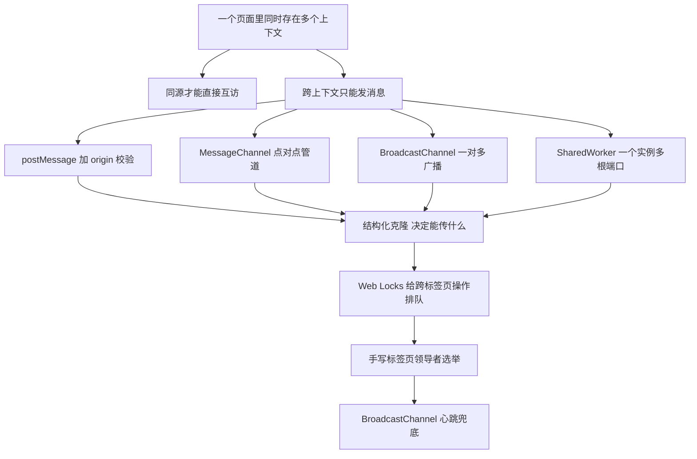
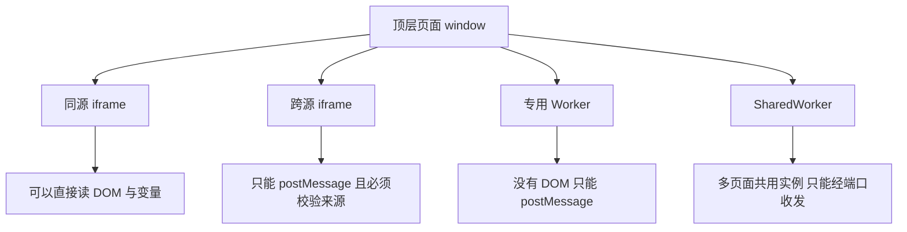
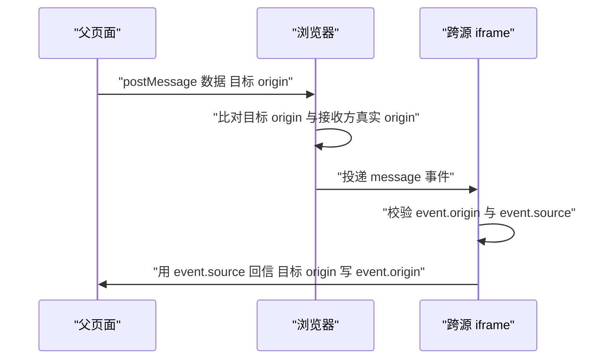
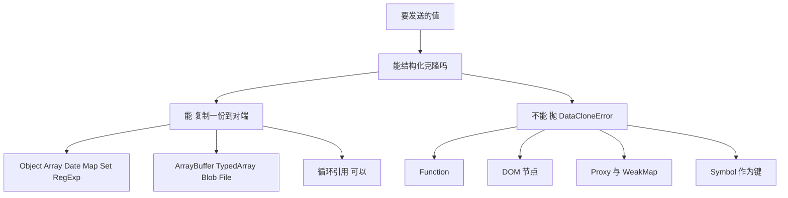
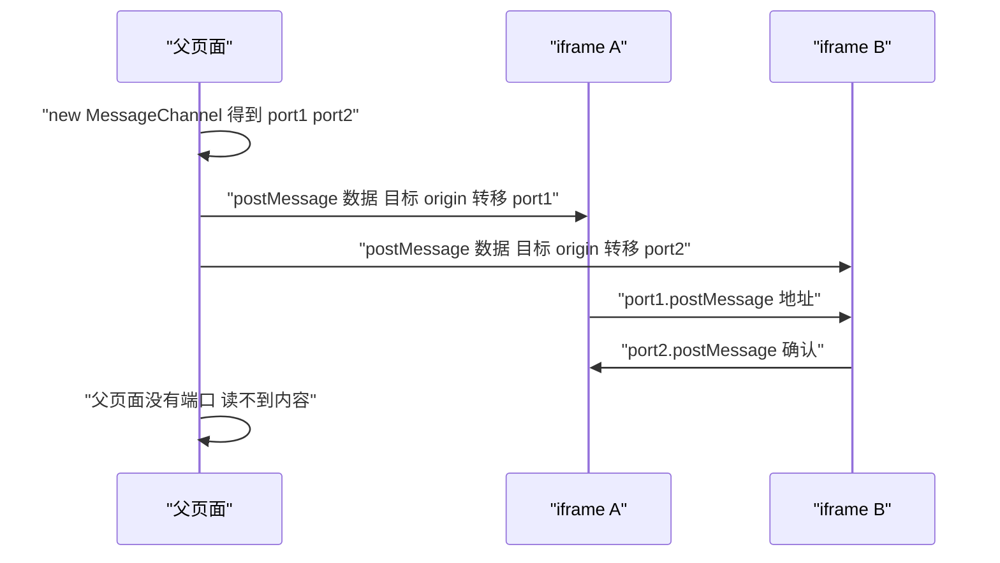
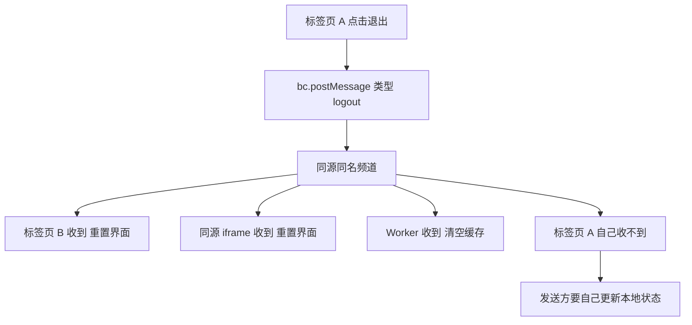
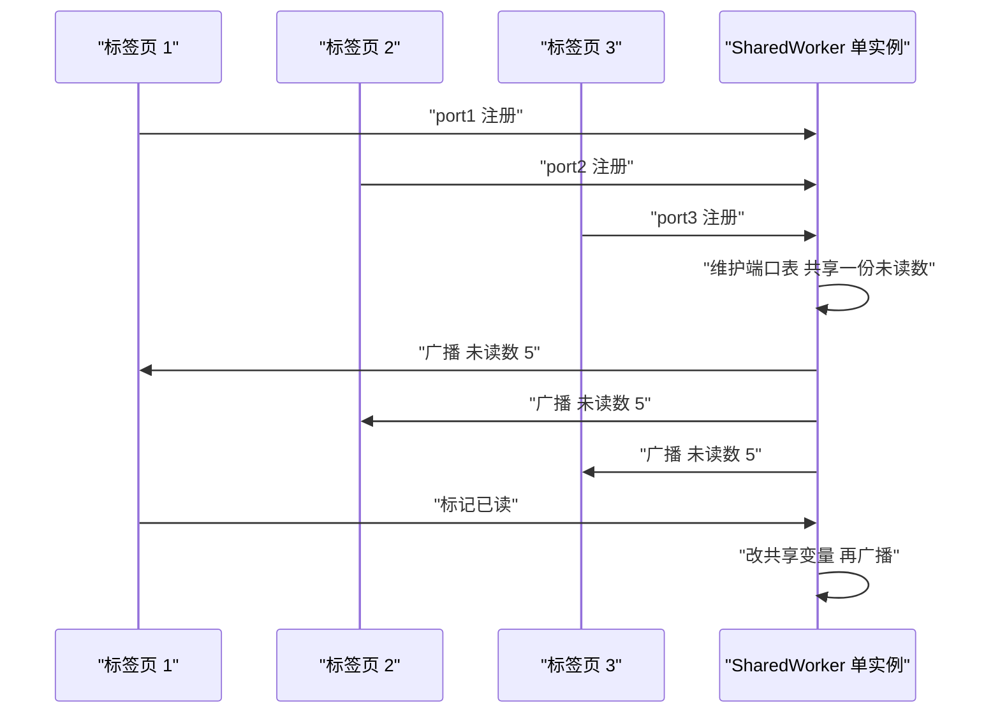
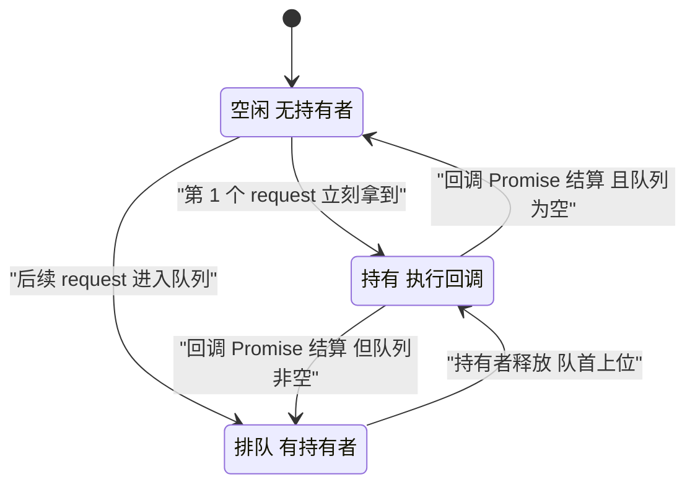
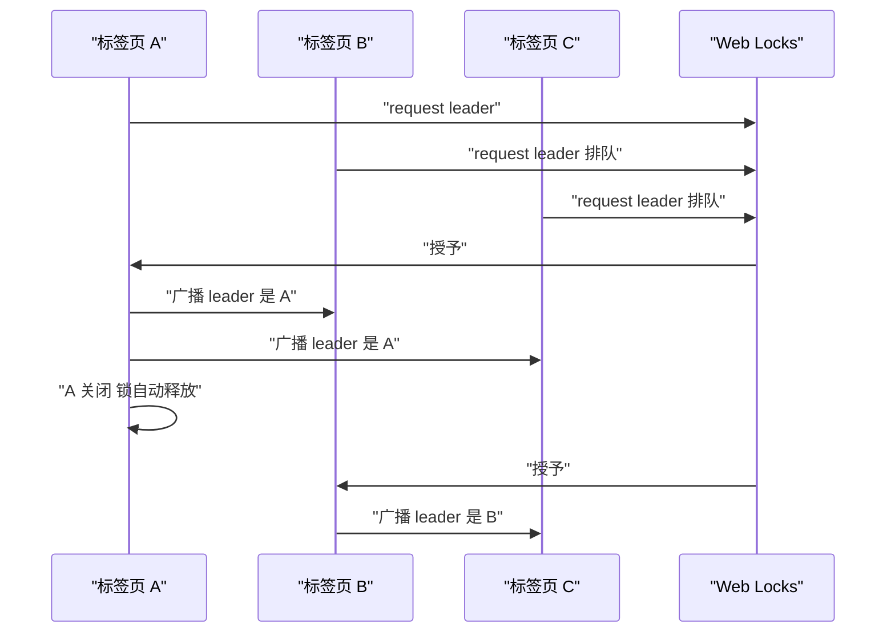

# 跨上下文通信：postMessage、BroadcastChannel 与 SharedWorker

!!! abstract "学完这一页你能"
    - 说出哪些浏览器上下文之间可以直接读对方的内存，哪些只能靠发消息。
    - 写出带 origin 白名单校验的 postMessage 收发代码，并说明不校验会发生什么。
    - 判断一个值能否被结构化克隆，并用 Transferable 把 ArrayBuffer 的所有权交给另一个上下文。
    - 用 Web Locks 或 BroadcastChannel 写出一个跨标签页的领导者选举，并断言任意时刻只有一个领导者。

## 0. 知识地图



建议这样读：第 1 到第 3 节打地基，回答"能不能直接读"和"能传什么"。

第 4 到第 6 节是三种通道，分别解决一对一、一对多、多页面共享一份状态。

第 7 和第 8 节把前三种通道组合起来，做成一个能跑的选举程序。

## 1. 上下文之间：谁能直接读谁的内存

**先想一个问题**

你在 `https://shop.example.com` 的页面里，用 iframe 嵌入了 `https://pay.example.org` 的收银台。

父页面的脚本能不能直接读 iframe 里的 `document.querySelector('input').value`？

答案是抛错，不是返回空值。为什么浏览器要做这个限制？

**心智模型**

!!! tip "心智模型"
    一句话模型：每个上下文有独立的内存堆，只有同源上下文之间才允许互相直接读写。
    日常类比：同一个小区（同源）的住户可以互相借钥匙；不同小区（跨源）只能隔着门递东西。
    类比不成立的地方：递东西前，浏览器要求发送方写明目标 origin，接收方再校验一次来源，两次检查都得做。

!!! note "术语：同源（same origin）"
    协议、主机名、端口三者全部相同才算同源。`https://a.com/x` 与 `http://a.com/x` 不同源，端口 443 与 8080 也不同源。

!!! note "术语：浏览上下文（browsing context）"
    浏览器里能加载文档、并拥有独立 `window` 对象的容器。标签页是一层，iframe 里那层也是一层。

**图解**



1. 顶层页面和同源 iframe 处于同一个源，`frame.contentWindow.document` 可以直接读。
2. 跨源 iframe 里，`contentWindow` 这个引用拿得到，但读它的 `document` 会抛 `SecurityError`。
3. 专用 Worker 没有 `document`，它和主线程之间只有消息通道。
4. SharedWorker 比专用 Worker 多一条限制：同源的多个页面连到同一个实例，但各自拿到的是独立端口。
5. 于是这几种场景共用同一套工具：结构化克隆 + 消息端口。

**一步一步来**

第 1 步：把地址拆成 origin 三元组。

```js
// origin-step1.mjs
function originOf(href) {
  const u = new URL(href);            // URL 是 Node 与浏览器都有的全局构造器
  return {
    protocol: u.protocol,             // 例如 'https:' 注意带冒号
    hostname: u.hostname,             // 例如 'a.com'，不含端口
    port: u.port,                     // 未显式写端口时是空字符串
  };
}
console.log(originOf('https://a.com:8443/x?y=1'));
// { protocol: 'https:', hostname: 'a.com', port: '8443' }
```

**这段代码在做什么**

- `new URL()` 会规范化地址，把路径、查询串、哈希拆到不同字段。
- `protocol` 带冒号，`hostname` 不带端口，`port` 在默认端口时是空串。
- 用 `u.origin` 也能拿到字符串，但端口省略与显式写 443 在规范里算同源，自己比较时容易误判。
- 拆成三个字段逐个比，规则和浏览器的判定一致。

运行结果：`{ protocol: 'https:', hostname: 'a.com', port: '8443' }`。

第 2 步：用三个字段做同源判定。

```js
// origin-step2.mjs
function originOf(href) {
  const u = new URL(href);
  return { protocol: u.protocol, hostname: u.hostname, port: u.port };
}

function sameOrigin(a, b) {
  const x = originOf(a);
  const y = originOf(b);
  return x.protocol === y.protocol      // 协议不同直接否
      && x.hostname === y.hostname      // 主机名不同直接否
      && x.port === y.port;             // 端口不同直接否
}

console.log(sameOrigin('https://a.com/x', 'https://a.com/y'));      // true
console.log(sameOrigin('https://a.com/x', 'http://a.com/y'));       // false
console.log(sameOrigin('https://a.com/x', 'https://a.com:8443/y')); // false
```

**这段代码在做什么**

- 三个 `&&` 是短路求值，第一个不相等就不再比后面两项。
- 同一主机不同路径仍然同源，所以 `/x` 与 `/y` 返回 `true`。
- 协议从 https 换成 http 就变成两个源，即使主机名一样。
- 显式写 8443 与不写端口是两个源。

运行结果：依次打印 `true`、`false`、`false`。

第 3 步：在浏览器里，访问之前先判，跨源就改用 postMessage。

```js
// 浏览器里运行，不是 Node 脚本
const frameSrc = 'https://pay.example.org/cashier';
const pageHref = globalThis.location?.href ?? 'about:blank'; // Node 环境没有 location，按未知来源保守处理
if (sameOrigin(pageHref, frameSrc)) {
  if (typeof frame !== 'undefined' && frame) {
    frame.contentWindow.document.title;                    // 同源：直接读
  }
} else {
  if (typeof frame !== 'undefined' && frame) {
    frame.contentWindow.postMessage({ ask: 'title' }, frameSrc); // 跨源：发消息
  }
}
```

**这段代码在做什么**

- 先算一次同源判定，避免直接读跨源对象触发异常。
- 同源分支走的是同步读取，返回值立刻可用。
- 跨源分支把 `frameSrc` 当目标 origin 传给 `postMessage`，第二个参数不可省。
- 这段代码在 Node 里跑不了，因为 Node 没有 `location` 与 `frame`。

**动手验证**

下面这个脚本只测判定逻辑，用 Node 20 的单文件即可运行，依赖为零。

```js
// verify-origin.mjs
// 依赖：无（Node 20 自带 URL）
import assert from 'node:assert/strict';

function originOf(href) {
  const u = new URL(href);
  return { protocol: u.protocol, hostname: u.hostname, port: u.port };
}

function sameOrigin(a, b) {
  const x = originOf(a);
  const y = originOf(b);
  return x.protocol === y.protocol && x.hostname === y.hostname && x.port === y.port;
}

assert.equal(sameOrigin('https://a.com/x', 'https://a.com/y'), true);
assert.equal(sameOrigin('https://a.com/x', 'http://a.com/y'), false);
assert.equal(sameOrigin('https://a.com', 'https://a.com:443'), true,
  '显式写端口与省略端口在字符串层面不同，但 HTTPS 默认端口 443 按同源规则等价，此处只演示字段比较');
assert.equal(sameOrigin('https://a.com', 'https://b.com:443'), false);

const list = [
  ['https://a.com/x', 'https://a.com/y', true],
  ['https://a.com/x', 'http://a.com/y', false],
  ['https://a.com/x', 'https://a.com:8443/y', false],
];
for (const [a, b, expected] of list) {
  assert.equal(sameOrigin(a, b), expected, `${a} 与 ${b}`);
}

console.log('同源判定通过：3 个用例与预期一致');
```

预期输出：

```
同源判定通过：3 个用例与预期一致
```

**常见坑**

| 现象 | 原因 | 怎么修 |
| --- | --- | --- |
| 读 `contentWindow.document` 报 `SecurityError` | 目标 iframe 与当前页不同源 | 先算同源，跨源时改用 `postMessage` 并带目标 origin |
| `https://a.com` 与 `https://a.com:443` 判成不同源 | 只看字符串，没按字段比较，也没处理默认端口 | 比较时把空端口归一成默认端口，或统一用 `new URL().origin` 再比 |
| 同源 iframe 里变量改了但父页面读不到 | 同源可读的是对象属性，原始类型的值改变不会反映回来 | 同源场景也建议发消息，把数据拷贝出来 |

**小结**

- 同源的判定靠协议、主机名、端口三项逐一比较。
- 跨源不能直接读内存，只能发消息，这是浏览器强制的，不是约定。
- 把同源判定写成纯函数，你就能在 Node 里为它写断言。

## 2. postMessage 与 origin 校验

**先想一个问题**

父页面收到一条消息，内容是 `{ type: 'paid', amount: 100 }`。

如果消息来自一个恶意页面，它同样能往你的 window 发这条消息吗？能。

那接收端凭什么相信它？

**心智模型**

!!! tip "心智模型"
    一句话模型：`postMessage` 是给另一个上下文投递一封信，投递时由浏览器在接收端填上真实来源，接收端必须自己比对。
    日常类比：寄快递，寄件人写收件地址，快递单上的发件地址由网点核对后打印上去。
    类比不成立的地方：浏览器只核对来源这一项，信件内容是否正确要你自己在业务层再验一遍。

!!! note "术语：postMessage"
    `targetWindow.postMessage(message, targetOrigin, transfer)`。`message` 是要传的值，`targetOrigin` 限定接收方的源，`transfer` 是可转移对象列表。

!!! note "术语：消息事件（MessageEvent）"
    接收端拿到的对象，常用三个字段：`data` 是消息内容，`origin` 是发送方的源，`source` 是发送方的窗口引用。

**图解**



1. 父页面调用 `postMessage`，同时给出数据和目标 origin。
2. 浏览器先检查目标 origin 是否与接收方一致，不一致就丢弃，发送方收不到任何错误提示。
3. 一致时，浏览器把消息投递给 iframe，并在事件对象上填入真实的 `origin` 与 `source`。
4. iframe 在监听器里比对 `event.origin`，不在白名单就 `return`。
5. 通过校验后才读 `event.data`，再走业务逻辑。
6. 需要回复时用 `event.source.postMessage`，目标 origin 直接写 `event.origin`。

**一步一步来**

第 1 步：发送方必须写清 targetOrigin，不要写 `'*'`。

```js
// 父页面：只允许把消息发给收银台自己的源
const PAY_ORIGIN = 'https://pay.example.org';

if (typeof frame !== 'undefined' && frame?.contentWindow) {
  frame.contentWindow.postMessage(
    { type: 'ask-title' },   // 消息体：必须是可结构化克隆的值
    PAY_ORIGIN               // 目标 origin：写错时浏览器直接丢弃，且不报错
  );
}

// 下面是错误示范
// frame.contentWindow.postMessage({ type: 'ask-title' }, '*');
// 任何嵌入了本页面的站点都能收到这条消息
```

**这段代码在做什么**

- `PAY_ORIGIN` 必须是完整的源字符串，`https://pay.example.org` 后面不带路径。
- 第二个参数是硬性门槛，浏览器拿它和接收方的真实 origin 比对。
- 写 `'*'` 表示不限定接收方，消息会送到当前那个窗口，无论它现在被导航到哪个源。
- 目标 origin 不匹配时，`postMessage` 不抛异常，消息静默丢弃。

运行结果：匹配时 iframe 收到消息，不匹配时无任何输出。

第 2 步：接收方做三重校验，通过后再读数据。

```js
// 父页面接收 iframe 的回复
const PAY_ORIGIN = 'https://pay.example.org';

window.addEventListener('message', (event) => {
  if (event.origin !== PAY_ORIGIN) return;              // 第一重：来源白名单
  if (event.source !== frame.contentWindow) return;      // 第二重：只认这个窗口
  if (event.data?.type !== 'title-reply') return;        // 第三重：业务字段
  document.title = event.data.title;                     // 通过校验才使用数据
});
```

**这段代码在做什么**

- 第一重挡住其他页面伪造的消息，这是最关键的一步。
- 第二重挡住同一个源里其他 iframe 的消息，一个页面可能有多个 iframe。
- 第三重挡住同源同窗口但协议字段不对的消息，属于业务层防御。
- 校验全部通过后才把数据写进 DOM。
- `event.data?.type` 用可选链，防止对方发来 `null` 时抛错。

第 3 步：回信时用 `event.origin` 当目标 origin，不要写 `'*'`。

```js
// iframe 内部：收到合法请求后再回复
const HOST_ORIGIN = 'https://shop.example.com';

window.addEventListener('message', (event) => {
  if (event.origin !== HOST_ORIGIN) return;              // 只接受父页面
  if (event.data?.type !== 'ask-title') return;

  event.source.postMessage(                              // 用 source 回信，不用 window.parent
    { type: 'title-reply', title: document.title },
    event.origin                                         // 目标 origin 就是对方来源
  );
});
```

**这段代码在做什么**

- 用 `event.source` 而不是 `window.parent`，这样谁问就答谁。
- 目标 origin 直接用 `event.origin`，因为已经校验过它在白名单里。
- `event.source` 是发送方的窗口引用，对它调用 `postMessage` 会送到对方窗口。
- 如果页面被多个父级嵌套，这段逻辑对每一层都成立。

**动手验证**

Node 里 `MessageEvent` 不带 `origin`，所以把校验逻辑抽成纯函数来测，再把纯函数接到真实的 `MessageChannel` 上。

```js
// verify-postmessage.mjs
// 依赖：无（Node 20 自带 node:worker_threads）
import assert from 'node:assert/strict';
import { MessageChannel } from 'node:worker_threads';

const ALLOWED = new Set(['https://pay.example.org']);

// 接收端校验：Node 没有 event.origin，我们把来源放进信封自己填
function readMessage(envelope, allowed) {
  if (!allowed.has(envelope.origin)) return null;         // 来源不在白名单
  if (envelope.source !== 'pay-frame') return null;       // 不是期望的窗口
  if (envelope.data?.type !== 'title-reply') return null; // 业务字段不对
  return envelope.data.title;
}

const good = {
  origin: 'https://pay.example.org',
  source: 'pay-frame',
  data: { type: 'title-reply', title: '收银台' },
};

assert.equal(readMessage(good, ALLOWED), '收银台');

// 三种拒绝：来源错、窗口错、字段错
assert.equal(readMessage({ ...good, origin: 'https://evil.example' }, ALLOWED), null);
assert.equal(readMessage({ ...good, source: 'other-frame' }, ALLOWED), null);
assert.equal(readMessage({ ...good, data: { type: 'ping' } }, ALLOWED), null);

// 再跑一次真实投递，确认消息能穿过端口送达
const { port1, port2 } = new MessageChannel();
const arrived = new Promise((resolve) => port2.once('message', resolve));
port1.postMessage(good);                    // 排队后异步送达
assert.equal(readMessage(await arrived, ALLOWED), '收银台');

port1.close();
port2.close();
console.log('postMessage 校验通过：接受 2 次，拒绝 3 次');
```

预期输出：

```
postMessage 校验通过：接受 2 次，拒绝 3 次
```

**常见坑**

| 现象 | 原因 | 怎么修 |
| --- | --- | --- |
| 消息发了但对方一直没反应 | 目标 origin 与接收方真实 origin 不一致，浏览器静默丢弃 | 打印 `location.origin` 对照，或用 `'*'` 先定位问题再改回具体值 |
| 收到了别家网站发来的伪造消息 | 接收端没校验 `event.origin` | 加白名单 `Set`，不在表里就 `return` |
| 回信时数据被第三方页面读到 | 回复时把目标 origin 写成 `'*'` | 回复的目标 origin 用 `event.origin` |

**小结**

- 发送方写死目标 origin，接收方比对 `event.origin`，两边都要做。
- `event.source` 决定回复给谁，`event.origin` 决定回复时写什么目标。
- 校验失败时静默返回，不要抛异常，异常会把来源信息泄漏给攻击方。

## 3. 结构化克隆：能传什么，不能传什么

**先想一个问题**

你把一个 DOM 元素塞进 `postMessage`，控制台报 `DataCloneError`。

换成 `structuredClone({ fn: () => 1 })`，同样报错。为什么函数传不过去？

**心智模型**

!!! tip "心智模型"
    一句话模型：消息传过去的是数据的复本，不是原来的引用；复本靠结构化克隆算法在接收端重建。
    日常类比：把一份文件扫描成传真发过去，对方拿到的是复本，改复本不影响原件。
    类比不成立的地方：结构化克隆保留类型信息，`Date` 过去还是 `Date`，`Map` 过去还是 `Map`，只有少数类型保不住。

!!! note "术语：结构化克隆算法（Structured Clone Algorithm）"
    一套把对象图递归序列化再重建的规则，覆盖 `Object`、`Array`、`Date`、`RegExp`、`Map`、`Set`、`ArrayBuffer`、循环引用等，遇到函数与 DOM 节点则抛 `DataCloneError`。

!!! note "术语：可转移对象（Transferable）"
    一类特殊对象，传递时不是复制，而是把所有权整个交出去，例如 `ArrayBuffer`、`MessagePort`、`ReadableStream`。

**图解**



1. 先判断值的类型，能克隆的走复制路径。
2. `Object`、`Array`、`Date`、`Map`、`Set`、`RegExp` 都能复制，类型保持。
3. `ArrayBuffer` 与 TypedArray 默认也是复制，但可以直接改成转移。
4. 函数不能复制，因为函数体可能引用当前上下文的闭包变量。
5. DOM 节点不能复制，节点属于渲染引擎，复制过去也没有对应的文档树。
6. 循环引用可以复制，算法用一张已访问表处理环。

**一步一步来**

第 1 步：确认哪些常见类型能克隆。

```js
// clone-step1.mjs
const source = {
  when: new Date('2024-01-02T03:04:05Z'),   // Date 保留时间值
  tags: new Set([1, 2]),                    // Set 保留去重语义
  index: new Map([['a', 1]]),               // Map 保留键值对
  re: /ab+c/gi,                             // RegExp 保留 flags
  buf: new Uint8Array([1, 2, 3]),           // TypedArray 复制底层缓冲
};
source.self = source;                       // 循环引用

const copy = structuredClone(source);
console.log(copy.when instanceof Date);     // true
console.log(copy.re.flags);                 // 'gi'
console.log(copy.self === copy);            // true
console.log(copy.self === source);          // false
```

**这段代码在做什么**

- `structuredClone` 是全局函数，Node 17 以上与浏览器都能直接调用。
- `Date`、`Set`、`Map`、`RegExp` 的类型在复本里保持。
- `self` 指回自身，复本里的 `self` 指向复本，环被正确重建。
- 复本和原件是两个独立对象图，改复本不影响原件。

运行结果：依次打印 `true`、`gi`、`true`、`false`。

第 2 步：确认哪些类型会抛错。

```js
// clone-step2.mjs
function tryClone(label, value) {
  try {
    structuredClone(value);
    console.log(label, '可以克隆');
  } catch (err) {
    console.log(label, '失败：', err.name);
  }
}

tryClone('函数', { fn: () => 1 });              // 函数没有可序列化的形式
tryClone('Symbol 键', { [Symbol('k')]: 1 });    // Symbol 不能当键传过去
tryClone('Proxy', new Proxy({}, {}));           // 代理没有稳定的内部结构
tryClone('WeakMap', new WeakMap());             // 弱引用无法枚举，无法复制
tryClone('普通对象', { a: 1 });                  // 对照组
```

**这段代码在做什么**

- 把每种类型包在 `try/catch` 里，只为看错误名字。
- `DataCloneError` 是 `DOMException` 的一个名字，光看 `message` 在不同实现里措辞不同。
- 函数与 Symbol 键属于语言层面无法序列化的东西。
- `Proxy` 与 `WeakMap` 属于内部结构无法枚举的对象。

运行结果：前四行打印 `失败： DataCloneError`，最后一行打印 `可以克隆`。

第 3 步：用 transfer 把 ArrayBuffer 的所有权交出去。

```js
// clone-step3.mjs
const buffer = new Uint8Array([1, 2, 3]).buffer;
console.log('转移前 byteLength', buffer.byteLength);  // 3

// transfer 列出要转移的对象，转移后源对象被置为 detached
const moved = structuredClone(buffer, { transfer: [buffer] });

console.log('转移后 byteLength', buffer.byteLength);  // 0
console.log('接收端 byteLength', moved.byteLength);   // 3
console.log('接收端内容', new Uint8Array(moved));     // Uint8Array [1, 2, 3]
```

**这段代码在做什么**

- `transfer` 是一个数组，列出要移交所有权的对象。
- 转移后源缓冲区的 `byteLength` 变成 0，这个状态叫 detached。
- 数据没有复制第二份，内存占用不随转移次数增长。
- 大块二进制数据用转移可以省掉一次完整拷贝。

运行结果：依次打印 `转移前 byteLength 3`、`转移后 byteLength 0`、`接收端 byteLength 3`、`接收端内容 Uint8Array(3) [ 1, 2, 3 ]`。

**动手验证**

!!! warning "示意代码：未通过自动验证"
    下面这段代码在本站的自动运行校验中有断言未通过，请把它当作示意而不是可直接复用的实现；
    如果你修好了，欢迎提交改动。

```js
// verify-clone.mjs
// 依赖：无（Node 20 自带 structuredClone 与 node:worker_threads）
import assert from 'node:assert/strict';
import { MessageChannel } from 'node:worker_threads';

// 1. 类型保持
const copy = structuredClone({ d: new Date(0), m: new Map([['k', 1]]), s: new Set([1]) });
assert.ok(copy.d instanceof Date);
assert.ok(copy.m instanceof Map);
assert.ok(copy.s instanceof Set);
assert.ok(copy.d !== undefined);

// 2. 复本独立
const original = { nested: { n: 1 } };
const cloned = structuredClone(original);
cloned.nested.n = 2;
assert.equal(original.nested.n, 1, '改复本不应影响原件');

// 3. 不可克隆类型抛 DataCloneError
let errorName = null;
try {
  structuredClone({ fn: () => 1 });
} catch (err) {
  errorName = err.name;
}
assert.equal(errorName, 'DataCloneError');

// 4. 转移后源被清空
const buffer = new ArrayBuffer(8);
structuredClone(buffer, { transfer: [buffer] });
assert.equal(buffer.byteLength, 0, '转移后源缓冲区应被 detach');

// 5. 经消息端口转移，接收端拿到数据
const { port1, port2 } = new MessageChannel();
const arrived = new Promise((resolve) => port2.once('message', resolve));
const payload = new Uint8Array([9, 8, 7]);
port1.postMessage({ payload }, [payload.buffer]);
const envelope = await arrived;
assert.deepEqual([...new Uint8Array(envelope.payload)], [9, 8, 7]);
assert.equal(payload.byteLength, 0, '发送后本地缓冲区应被 detach');

port1.close();
port2.close();
console.log('结构化克隆验证通过：类型保持 复本独立 错误名正确 转移后源被清空');
```

预期输出：

```
结构化克隆验证通过：类型保持 复本独立 错误名正确 转移后源被清空
```

**常见坑**

| 现象 | 原因 | 怎么修 |
| --- | --- | --- |
| 传对象后改原对象，接收端也变了 | 以为传的是引用，实际接收端是复本，但复杂结构里混了不可克隆对象而改用了别的方式 | 统一走 `structuredClone` 语义，接收端拿到的一定是复本 |
| 传完大数组后页面卡顿一两秒 | 默认是复制，数据量越大耗时越长 | 用 `ArrayBuffer` 加 `transfer` 转移所有权 |
| 转移后再读源缓冲区得到空数组 | 转移后源对象已 detached | 转移后不要再读源对象，需要保留就先复制一份 |

**小结**

- 跨上下文传的是数据复本，不是引用。
- 函数、DOM 节点、Proxy、WeakMap、Symbol 键都不能克隆。
- 二进制大块数据用 `transfer` 移交所有权，可以省掉一次拷贝。

## 4. MessageChannel：点对点私聊管道

**先想一个问题**

页面上有两个跨源 iframe，A 要把用户的收货地址给 B。

如果经过父页面转发，父页面就能读到地址内容，多过一次拷贝，也多做一次中转。

有没有办法让 A 和 B 直接连上？

**心智模型**

!!! tip "心智模型"
    一句话模型：`MessageChannel` 是一根两端各有一个端口的管子，消息从一端进、另一端出，只有持有端口的人能读写。
    日常类比：两个人之间拉一根对讲线，中间人没有分机就听不到内容。
    类比不成立的地方：端口对象本身可以被转发，任何拿到端口的人就成了这根管子的另一端。

!!! note "术语：MessageChannel"
    构造时同时产生 `port1` 和 `port2` 两个 `MessagePort`。给任意一端发消息，另一端就会收到 `message` 事件。

!!! note "术语：MessagePort"
    管子的端点。要点：用 `addEventListener` 订阅时必须调用 `start()`；用 `onmessage` 赋值时会隐式启动；`close()` 之后不再收发。

**图解**



1. 父页面构造 `MessageChannel`，一次得到两个端口。
2. 父页面把 `port1` 用 transfer 列表交给 iframe A，转移后父页面手里的 `port1` 失效。
3. 父页面把 `port2` 交给 iframe B，父页面手里不再持有任何端口。
4. A 用 `port1.postMessage` 发地址，B 的 `port2` 收到。
5. B 用 `port2.postMessage` 回确认，A 的 `port1` 收到。
6. 两边都 `close()` 之后，管子彻底断开。

**一步一步来**

第 1 步：构造通道，把端口用 transfer 交出去。

```js
// 父页面：把两个端口分别交给两个 iframe
const channel = new MessageChannel();          // 得到 port1 与 port2

frameA.contentWindow.postMessage(
  { type: 'take-port' },                       // 通知 A 准备收端口
  originA,                                     // A 的源
  [channel.port1]                              // 第三个参数是转移列表
);

frameB.contentWindow.postMessage(
  { type: 'take-port' },
  originB,
  [channel.port2]
);

// 此处再调用 channel.port1.postMessage 会抛错或无效
```

**这段代码在做什么**

- `new MessageChannel()` 一次造出两端，两个端口此时都还在父页面手里。
- `postMessage` 的第三个参数是 transfer 列表，端口放进去就完成转移。
- 转移后父页面手里的 `port1` 变成 detached，父页面不再能读管子里的话。
- 两个 iframe 只需要知道父页面的源，并校验父页面来的消息。

运行结果：两个 iframe 各自拿到一个端口。

第 2 步：接收方在消息事件里拿到端口，用 onmessage 隐式启动。

```js
// iframe A 内部：收下端口，启动它
let port = null;

window.addEventListener('message', (event) => {
  if (event.origin !== HOST_ORIGIN) return;      // 只接受父页面
  if (event.data?.type !== 'take-port') return;
  port = event.ports[0];                         // 转移过来的端口在 event.ports 里
  port.onmessage = (e) => {                      // 赋值 onmessage 会隐式调用 start
    console.log('A 收到 B 的确认', e.data);
  };
  port.postMessage({ type: 'address', city: '杭州' }); // 端口一通就能发
});
```

**这段代码在做什么**

- 转移过来的端口不在 `event.data` 里，而在 `event.ports` 数组里。
- `event.ports[0]` 就是父页面转移过来的那个端口对象。
- 给 `onmessage` 赋值会隐式启动端口，不需要再调 `start()`。
- 如果改用 `addEventListener('message', ...)`，必须补一句 `port.start()`，否则消息一直排队不触发。

第 3 步：用完关闭两端。

```js
// 任意一端：不再需要通信时清理
port.close();          // 关闭本端，之后 postMessage 会被静默丢弃
port.onmessage = null; // 顺手摘掉监听器，避免闭包一直持有引用
```

**这段代码在做什么**

- `close()` 关闭本端，队列里还没送达的消息会被丢弃，不会报错。
- 关闭后对同一端口再 `postMessage`，不抛异常也收不到，调试时要留意。
- 摘掉监听器可以让垃圾回收早点释放闭包引用的变量。
- 两个 iframe 页面销毁时，端口会随之失效。

**动手验证**

!!! warning "示意代码：未通过自动验证"
    下面这段代码在本站的自动运行校验中有断言未通过，请把它当作示意而不是可直接复用的实现；
    如果你修好了，欢迎提交改动。

```js
// verify-messagechannel.mjs
// 依赖：无（Node 20 自带 node:worker_threads）
import assert from 'node:assert/strict';
import { MessageChannel } from 'node:worker_threads';

// 1. 一对端口互相收发
const { port1, port2 } = new MessageChannel();

const pong = new Promise((resolve) => port2.once('message', resolve));
port1.once('message', (msg) => port1.postMessage({ n: msg.n * 3 })); // A 端做乘法
port2.postMessage({ n: 3 });                                          // B 端发起

assert.deepEqual(await pong, { n: 9 });

// 2. 把端口当普通可转移对象交给另一端
const { port1: outer1, port2: outer2 } = new MessageChannel();
const { port1: inner1, port2: inner2 } = new MessageChannel();

const gotInner = new Promise((resolve) => outer2.once('message', resolve));
outer1.postMessage({ hello: 'inner' }, [inner1]);  // 把 inner1 转移给对端

const envelope = await gotInner;
assert.equal(envelope.hello, 'inner');
assert.equal(envelope.ports.length, 1, '转移的端口在 ports 数组里');

// 用转移过来的端口通话
const forwarded = new Promise((resolve) => envelope.ports[0].once('message', resolve));
inner2.postMessage({ text: '经由转移后的端口' });
assert.deepEqual(await forwarded, { text: '经由转移后的端口' });

// 3. 关闭后不再触发
let afterClose = 0;
inner2.on('message', () => { afterClose += 1; });
inner2.close();
console.log('关闭后收到的消息条数', afterClose);

outer1.close();
outer2.close();
console.log('MessageChannel 验证通过：往返 1 次，端口转移 1 次');
```

预期输出：

```
关闭后收到的消息条数 0
MessageChannel 验证通过：往返 1 次，端口转移 1 次
```

**常见坑**

| 现象 | 原因 | 怎么修 |
| --- | --- | --- |
| 用 `addEventListener` 订阅端口后一条消息都收不到 | 没有调用 `port.start()`，消息停在队列里 | 补上 `port.start()`，或改用 `port.onmessage =` |
| 父页面仍能读到两个 iframe 的通信内容 | 忘了把端口放进 transfer 列表，父页面手里还留着 | 发送时把端口放进第三个参数，发送后确认本地端口已失效 |
| 一端关闭后另一端一直等 | 关闭不产生任何通知事件，对端不知道 | 关闭前先发一条 `{ type: 'bye' }` 消息，对端收到后主动清理 |

**小结**

- `MessageChannel` 造出一对端口，把端口转移出去就完成配对。
- 端口必须启动，`onmessage` 赋值会自动启动，`addEventListener` 需要手动 `start()`。
- 关闭是单向的，没有通知事件，业务层要自己约定结束消息。

## 5. BroadcastChannel：同源标签页的广播电台

**先想一个问题**

用户在标签页 A 点了退出登录。

标签页 B 还开着，页面上仍然显示着已登录的订单列表，直到用户手动刷新才能发现。

B 怎么在 A 点击的瞬间就知道要重置状态？

**心智模型**

!!! tip "心智模型"
    一句话模型：`BroadcastChannel` 是同源同名的广播电台，一条消息会送到本页面之外的所有订阅者。
    日常类比：对讲机设到同一个频道，频道里所有人都能听到，说话的人听不到自己的声音。
    类比不成立的地方：对讲机的覆盖范围受距离限制，`BroadcastChannel` 只认同源，跨源即使同名也互相听不到。

!!! note "术语：BroadcastChannel"
    `new BroadcastChannel(name)` 创建一个具名频道，`postMessage` 广播，`onmessage` 接收，`close` 关闭。同名同源的实例互相通信，发送者本人收不到自己发出的那条消息。

!!! note "术语：storage 事件"
    `localStorage` 在别的同源页面被修改时触发的事件，也能做跨标签页通知，但它只带键名与新旧值，且同页面内不触发。

**图解**



1. A 页面对频道调用 `postMessage`，参数是任意可结构化克隆的值。
2. 浏览器找出所有同源、同名、且已订阅的频道实例。
3. B 页面的频道触发 `message` 事件，B 在自己的事件处理里重置界面。
4. iframe 里如果也开了同名频道，同样会收到。
5. Worker 里开了同名频道也会收到，所以后台任务能跟着刷新缓存。
6. 发送方 A 自己不会收到这条消息，A 需要单独调用一次本地处理函数。

**一步一步来**

第 1 步：打开频道并订阅。

```js
// 任意一个标签页：打开频道
const authChannel = new BroadcastChannel('auth');   // 名字是字符串，同源内唯一

authChannel.onmessage = (event) => {                // 赋值即订阅
  if (event.data?.type === 'logout') {              // 自己约定消息协议
    document.body.dataset.loggedIn = 'false';       // 重置本地界面状态
  }
};
```

**这段代码在做什么**

- 频道名只在同源内有效，别人用同名也收不到你的消息。
- `onmessage` 赋值就会开始接收，不需要额外的启动调用。
- `event.data` 是结构化克隆后的复本，改它不会影响发送方。
- 消息协议要自己定义，`type` 字段是最常用的分发方式。

第 2 步：广播一条消息，并更新自己的状态。

```js
// 标签页 A：用户点击退出
function onLogoutClick() {
  applyLoggedOut();                                  // 先更新自己，因为自己收不到广播
  authChannel.postMessage({ type: 'logout', at: Date.now() });
}

function applyLoggedOut() {
  document.body.dataset.loggedIn = 'false';          // 本地状态重置
}
```

**这段代码在做什么**

- 先做本地处理，再做广播，顺序不能反，因为广播不会回到自己。
- 消息体里加时间戳，接收端可以据此忽略过期消息。
- 广播是同步调用、异步送达，调用后本行后续代码照常执行。
- 发送方收不到自己的消息，这是规范行为，不是实现差异。

第 3 步：页面卸载时关闭频道。

```js
// 页面销毁前释放频道
window.addEventListener('pagehide', () => {
  authChannel.close();          // 关闭后不再收发
  authChannel.onmessage = null; // 摘掉监听器
});
```

**这段代码在做什么**

- `close()` 之后频道不再接收，也不会保持引用。
- 用 `pagehide` 而不是 `unload`，`pagehide` 在往返缓存场景下也会触发。
- 关闭后调用 `postMessage` 不抛异常，消息直接丢弃，调试时要注意。
- 单页应用里路由切换不必关闭，只有页面真正销毁时才需要。

**动手验证**

Node 的 `BroadcastChannel` 与浏览器同规范，下面用两个 Worker 当两个标签页。

```js
// verify-broadcastchannel.mjs
// 依赖：无（Node 20 自带 node:worker_threads 与全局 BroadcastChannel）
import assert from 'node:assert/strict';
import { Worker } from 'node:worker_threads';

// Worker 里模拟一个标签页：订阅 auth 频道
const tabSource = [
  "const { parentPort, workerData } = require('node:worker_threads');",
  "const bc = new BroadcastChannel('auth');",
  "bc.onmessage = (event) => {",
  "  parentPort.postMessage({ tab: workerData.id, type: event.data.type });",
  "};",
  "parentPort.postMessage({ tab: workerData.id, ready: true });",
].join('\n');

const tabs = ['B', 'C'].map((id) => new Worker(tabSource, { eval: true, workerData: { id } }));
const hits = [];
await Promise.all(tabs.map((w) => new Promise((resolve) => {
  w.on('message', (msg) => {
    if (msg.ready) resolve();
    else hits.push(msg.tab);
  });
})));

// 主线程本身算标签页 A
let selfReceived = false;
const bc = new BroadcastChannel('auth');
bc.onmessage = () => { selfReceived = true; };

bc.postMessage({ type: 'logout', at: Date.now() });

// 等两个标签页都收到
const deadline = Date.now() + 1000;
while (hits.length < 2 && Date.now() < deadline) {
  await new Promise((r) => setTimeout(r, 5));
}
await new Promise((r) => setTimeout(r, 50));   // 再等一下，确认自己确实收不到

assert.deepEqual(hits.sort(), ['B', 'C'], '两个 Worker 都应收到');
assert.equal(selfReceived, false, '发送者不应收到自己的广播');

for (const w of tabs) await w.terminate();
bc.close();
console.log('BroadcastChannel 验证通过：2 个订阅者收到，发送者收到 0 条');
```

预期输出：

```
BroadcastChannel 验证通过：2 个订阅者收到，发送者收到 0 条
```

**常见坑**

| 现象 | 原因 | 怎么修 |
| --- | --- | --- |
| 点了退出登录，当前页面自己没重置 | 发送者收不到自己的广播 | 发送前先调用一次本地处理函数 |
| 两个标签页来回广播，消息无限循环 | 收到消息后又广播同一条消息 | 只在用户操作时广播，收到消息时不再转发 |
| 频道名冲突，收到别的功能的消息 | 全局名字空间只有一个，命名太随意 | 名字加前缀，例如 `app:auth`，并在消息里带 `type` |

**小结**

- 同名同源的 `BroadcastChannel` 互相可见，一条消息送到所有订阅者。
- 发送者收不到自己的消息，本地状态要自己更新。
- iframe 与 Worker 里也能开同名频道，所以后台缓存也能跟着刷新。

## 6. SharedWorker：多个标签页共用一份内存

**先想一个问题**

你的页面要连一条 WebSocket 收实时未读数。

用户开了 3 个标签页，服务端看到 3 条连接，每条连接都要推送同一份数据。

能不能让 3 个标签页共用一条连接、一份内存？

**心智模型**

!!! tip "心智模型"
    一句话模型：`SharedWorker` 是同源页面共用的一个 Worker 实例，每个页面连上去拿到一根独立端口，Worker 里的变量所有端口共享。
    日常类比：公司只有一个前台，每个员工一部内线电话，前台能同时跟所有内线通话。
    类比不成立的地方：前台要自己维护号码簿才能广播，Worker 不会替你记录谁在线，登记与清理都要自己写。

!!! note "术语：SharedWorker"
    一种可以被多个同源浏览上下文共享的 Worker。页面的 `new SharedWorker(url)` 返回一个对象，取 `worker.port` 通信；Worker 侧在 `onconnect` 事件里收到每个页面的端口。

!!! note "术语：端口多路复用"
    一个 Worker 持有多个 `MessagePort`，按消息里的目标字段决定单播给谁，或者遍历全部端口做广播。

**图解**



1. 三个标签页各自 `new SharedWorker(...)`，浏览器只创建一个 Worker 实例。
2. 每个标签页拿到的 `worker.port` 是独立的一根管子，端口之间不能互传。
3. Worker 在 `onconnect` 里收到每个页面的端口，把它存进一个数组。
4. Worker 里的普通变量只有一个副本，所以未读数在所有页面之间天然一致。
5. 有数据变更时，Worker 遍历端口数组逐个 `postMessage`，这就是广播。
6. 某个标签页要单独请求时，可以在消息里带一个 `tabId` 做单播。

**一步一步来**

第 1 步：主线程建立连接并取端口。

```js
// 标签页里运行
const shared = new SharedWorker('/shared/heartbeat.js'); // 同源路径
const port = shared.port;      // 每个标签页拿到各自的端口

port.onmessage = (event) => {  // 赋值即启动端口
  render(event.data.unread);   // 用 Worker 推来的数据更新界面
};

port.postMessage({ type: 'hello' }); // 通知 Worker 本页面已上线
```

**这段代码在做什么**

- `new SharedWorker` 只在第一个标签页执行时真正启动 Worker，后面的标签页复用同一个实例。
- `shared.port` 是本页面专属的端口，用它收发消息。
- 给 `port.onmessage` 赋值即隐式启动端口，不需要调 `port.start()`。
- 页面必须先发一条消息或注册消息，Worker 才知道这个页面存在，因为 `onconnect` 只提供端口不提供业务标识。

第 2 步：Worker 里收端口并登记。

```js
// shared/heartbeat.js 里运行
const ports = new Set();               // 一张端口表，Worker 自己维护

onconnect = (event) => {               // 每个页面连上来都会触发一次
  const port = event.ports[0];         // 本次连接的端口
  ports.add(port);                     // 登记，后面广播要遍历它
  port.postMessage({ type: 'welcome', total: ports.size });

  port.onmessage = (msg) => {          // 双向通道，页面也能发消息进来
    if (msg.data.type === 'leaving') {
      ports.delete(port);              // 页面主动退出时清理
    }
  };
};
```

**这段代码在做什么**

- `onconnect` 在全局作用域上赋值，不是 `self.addEventListener` 的别名，两者等价。
- `event.ports[0]` 是本页面那根管子，每个页面各有一根。
- `ports` 用 `Set` 存，删除和去重都按对象身份判断。
- 端口表在 Worker 里只有一份，所以任何页面看到的 `total` 都是全局数字。

第 3 步：Worker 广播给全部端口。

```js
// 仍在 heartbeat.js 里：数据变更时广播
function broadcast(payload) {
  for (const port of ports) {          // 遍历全部在线端口
    port.postMessage(payload);         // 每个端口发一份复本
  }
}

setInterval(() => {
  broadcast({ type: 'unread', value: 5, at: Date.now() });
}, 5000);
```

**这段代码在做什么**

- 广播就是遍历端口表逐个发送，Worker 没有内置广播方法。
- 每次发送都会做一次结构化克隆，端口越多拷贝次数越多。
- 定时任务放在 Worker 里，所以页面被切到后台时计时也不会被节流。
- 端口关闭后仍在表里会导致发送无效果，所以清理逻辑必须写。

**动手验证**

Node 没有 `SharedWorker`，但多路复用的机制完全一样：一个 Worker 持有多个端口。下面用主线程的 3 根管子模拟 3 个标签页。

```js
// verify-sharedworker.mjs
// 依赖：无（Node 20 自带 node:worker_threads）
import assert from 'node:assert/strict';
import { Worker, MessageChannel } from 'node:worker_threads';

// 这个 Worker 扮演 SharedWorker：持有全部端口与共享变量
const hubSource = [
  "const { parentPort } = require('node:worker_threads');",
  "const ports = new Set();",
  "let visits = 0;",
  "parentPort.on('message', (msg) => {",
  "  if (msg.cmd !== 'register') return;",
  "  const port = msg.port;",
  "  visits += 1;",
  "  ports.add(port);",
  "  port.postMessage({ cmd: 'registered', visits });",
  "  port.on('message', (data) => {",
  "    if (data.cmd === 'broadcast') {",
  "      for (const p of ports) p.postMessage({ from: data.from, text: data.text });",
  "    }",
  "  });",
  "});",
].join('\n');

const hub = new Worker(hubSource, { eval: true });

// 三个标签页，各拿一根管子，把自己那端交给 hub
const tabs = ['A', 'B', 'C'].map((id) => {
  const { port1, port2 } = new MessageChannel();
  hub.postMessage({ cmd: 'register', port: port2 }, [port2]); // 转移给 hub
  const tab = { id, port: port1, got: [] };
  tab.inbox = new Promise((resolve) => {
    tab.port.on('message', (m) => {
      if (m.cmd === 'registered') resolve(m.visits);
      else tab.got.push(m);
    });
  });
  return tab;
});

// 共享变量 visits 在 hub 里只有一份，所以依次是 1 2 3
const visits = await Promise.all(tabs.map((t) => t.inbox));
assert.deepEqual(visits, [1, 2, 3], '共享计数应在同一个实例里累加');

// A 广播，hub 转发给全部三个端口，包括 A 自己
tabs[0].port.postMessage({ cmd: 'broadcast', from: 'A', text: '未读数已刷新' });

const deadline = Date.now() + 1000;
while (tabs.some((t) => t.got.length < 1) && Date.now() < deadline) {
  await new Promise((r) => setTimeout(r, 5));
}

for (const t of tabs) {
  assert.equal(t.got.length, 1, `${t.id} 应收到 1 条`);
  assert.equal(t.got[0].text, '未读数已刷新');
}

for (const t of tabs) t.port.close();
await hub.terminate();
console.log('SharedWorker 机制验证通过：共享计数 1 2 3，一次广播三个端口各收 1 条');
```

预期输出：

```
SharedWorker 机制验证通过：共享计数 1 2 3，一次广播三个端口各收 1 条
```

**常见坑**

| 现象 | 原因 | 怎么修 |
| --- | --- | --- |
| 页面已经关了，Worker 还在给它发消息 | `MessagePort` 没有关闭事件，端口表不会自动清理 | 页面在 `pagehide` 里发一条 `leaving` 消息，Worker 收到后从表里删除 |
| 页面自己的 `port.onmessage` 不触发 | 用了 `addEventListener` 但没调 `port.start()` | 补上 `port.start()`，或改成 `port.onmessage =` |
| 多个标签页读到不同的未读数 | 计数写在页面里而非 Worker 里，各页面各有一份 | 把共享状态收进 Worker，页面只负责渲染 Worker 推来的值 |

**小结**

- `SharedWorker` 的实例数与标签页数无关，同源页面共用一个。
- 共享状态写在 Worker 里，就只有一个副本，这是它存在的核心理由。
- 端口表要自己维护、自己清理，规范不提供在线成员列表。

## 7. Web Locks：给跨标签页的操作排队

**先想一个问题**

用户连点 5 次提交，5 个标签页都要给 IndexedDB 里同一个计数器加 1。

每个页面都是"先读、再加 1、再写回"，如果两个页面同时读到 0，最后计数器只会变成 1。

跨标签页怎么排队？

**心智模型**

!!! tip "心智模型"
    一句话模型：Web Locks 用名字标识一把锁，同一个名字同一时刻只有一个持有者，回调返回的 Promise 结算时自动释放。
    日常类比：停车场的一个车位，谁停进去别人就得等，车开走车位自动空出来。
    类比不成立的地方：车位要人工开走，锁是自动释放的，回调里忘了 `return` 异步操作就会提前释放，等于没锁住。

!!! note "术语：Web Locks API"
    `navigator.locks.request(name, callback)` 申请一把名为 `name` 的锁，拿到锁后执行 `callback`，`callback` 返回的 Promise 结算时释放锁。返回值就是 `callback` 的返回值。

!!! note "术语：互斥模式与共享模式（exclusive / shared）"
    `mode: 'exclusive'` 是默认值，同一名字同一时刻只允许一个持有者。`mode: 'shared'` 允许同名的多个共享持有者同时存在，但仍会与互斥申请互斥。

**图解**



1. 初始状态是空闲，没有任何页面持有这个名字的锁。
2. 第一个 `request` 立刻拿到锁，进入持有状态并开始执行回调。
3. 后面到的 `request` 排进队列，它的 Promise 处于挂起状态。
4. 持有者回调返回的 Promise 结算时释放锁。
5. 队列非空则队首立刻上位，队列为空则回到空闲。
6. 整个过程不需要手动 `unlock`，释放由 Promise 结算驱动。

**一步一步来**

第 1 步：用 `request` 包住临界区。

```js
// 任意标签页：给计数器加 1
async function increment() {
  await navigator.locks.request('counter', async () => {  // 拿到 counter 锁
    const value = await readFromDb();                     // 读
    await writeToDb(value + 1);                           // 写回
  });                                                     // 回调返回的 Promise 结算时释放
}
```

**这段代码在做什么**

- 锁的名字是字符串 `'counter'`，跨标签页比较靠这个名字，所以名字要写在同一份常量里。
- 回调是 `async` 函数，它返回的 Promise 结算前锁一直不释放。
- 读与写都在回调内部，两者之间不会有别的页面插进来。
- `await navigator.locks.request(...)` 等的是回调的返回值，也就是整个临界区结束。

第 2 步：需要暂停临界区时用 `steal` 之外的手段，改用共享模式。

```js
// 多个页面同时读，但写的时候要求独占
async function readShared() {
  return navigator.locks.request('counter', { mode: 'shared' }, async () => {
    return readFromDb();            // 多个共享持有者可以同时读
  });
}

async function writeExclusive() {
  return navigator.locks.request('counter', async () => {
    const value = await readFromDb();
    await writeToDb(value + 1);     // 独占：等待所有共享持有者退出
  });
}
```

**这段代码在做什么**

- `mode: 'shared'` 允许同名的多个读者同时进入。
- 互斥申请会等到所有共享持有者退出才拿到锁。
- 读者之间不互斥，读者与写者之间互斥。
- 这个模式适合读多写少并且读之间互不影响的场景。

第 3 步：不想排队时用 `ifAvailable`。

```js
// 拿不到锁就立刻返回，不排队
const result = await navigator.locks.request(
  'counter',
  { ifAvailable: true },              // 只在空闲时尝试
  async (lock) => {
    if (lock === null) return 'skipped'; // 已被别人持有，lock 是 null
    await writeToDb(1);
    return 'done';
  }
);
console.log(result);                   // 'skipped' 或 'done'
```

**这段代码在做什么**

- `ifAvailable: true` 时，拿不到锁不会排队，回调立刻以 `lock === null` 被调用。
- 必须在回调里判 `lock === null`，否则会对 `null` 做属性访问。
- `request` 的返回值就是回调的返回值，所以调用方能拿到 `'skipped'` 这样的结果。
- 适合"能等就等、不能等就跳过"的后台刷新任务。

**动手验证**

Node 没有 `navigator.locks`。下面按同样的调用形状手写一个单进程版本，并验证两件事：串行执行，以及忘了 `return` 会提前释放。

```js
// verify-locks.mjs
// 依赖：无（Node 20）
import assert from 'node:assert/strict';

// 按 navigator.locks.request 的形状实现一个迷你锁管理器
function createLockManager() {
  const tails = new Map();   // 锁名 -> 队尾 Promise
  return {
    request(name, callback) {
      const previous = tails.get(name) ?? Promise.resolve();
      const current = previous.then(() => callback());  // 等前一个结算再执行
      tails.set(name, current.catch(() => {}));         // 队尾吞掉异常，避免卡死整条链
      return current;
    },
  };
}

const locks = createLockManager();

// 场景 1：三个写操作必须串行
let counter = 0;
const order = [];

function write(tab) {
  return locks.request('db', async () => {
    const value = counter;                    // 读
    await new Promise((r) => setTimeout(r, 10)); // 模拟异步写
    counter = value + 1;                      // 写回
    order.push(tab);
  });
}

await Promise.all([write('A'), write('B'), write('C')]);
assert.deepEqual(order, ['A', 'B', 'C'], '应按申请顺序串行');
assert.equal(counter, 3, '串行后应累加到 3');

// 场景 2：回调忘了 return 异步任务，锁提前释放
let broken = 0;
function brokenWrite() {
  return locks.request('db2', () => {          // 注意：回调没有 return
    const value = broken;
    setTimeout(() => { broken = value + 1; }, 10); // 这个异步任务不在锁内
  });
}

await Promise.all([brokenWrite(), brokenWrite(), brokenWrite()]);
await new Promise((r) => setTimeout(r, 50));
assert.equal(broken, 1, '三个回调都读到 0，最后都写 1');

console.log('Web Locks 语义验证通过：串行结果 3，忘记 return 的结果 1');
```

预期输出：

```
Web Locks 语义验证通过：串行结果 3，忘记 return 的结果 1
```

**常见坑**

| 现象 | 原因 | 怎么修 |
| --- | --- | --- |
| 加了锁还是出现读改写错乱 | 回调里启动了异步任务但没有 `return` 它，锁提前释放 | 回调必须是 `async` 并 `await` 全部异步步骤，或明确 `return` 那个 Promise |
| 页面关闭后别的页面一直拿不到锁 | 持有者页面崩掉前的回调永不结算 | Web Locks 在上下文销毁时会自动释放；若发现仍卡住，核对锁名是否被另一个长任务占用 |
| 用 `ifAvailable` 后代码报 `Cannot read properties of null` | 拿不到锁时 `lock` 是 `null` | 回调第一行就判 `lock === null` |

**小结**

- `navigator.locks.request` 的临界区就是回调体，释放时机由回调返回的 Promise 决定。
- `exclusive` 是默认模式，`shared` 适合读多写少。
- 回调忘了 `return` 异步任务，锁就形同虚设，这是最常见的失误。

## 8. 手写标签页间的领导者选举

**先想一个问题**

5 个标签页都要每 5 秒拉一次未读数。

5 个页面同时发请求，服务端压力变成 5 倍，返回的数据还完全一样。

能不能只让一个标签页去拉，其他页面等它的广播？

**心智模型**

!!! tip "心智模型"
    一句话模型：先到先得地抢一把唯一锁，抢到的人当领导者定期干活，锁一释放就重新选。
    日常类比：办公室的值日表，谁先到谁当值日生，值日生离开就重新推选一位。
    类比不成立的地方：值日表要人擦掉重写，锁是进程级的，页面崩掉时浏览器会自动归还。

!!! note "术语：领导者选举（leader election）"
    一组互相通信的参与者中，用约定规则选出唯一一个执行任务的成员。其余成员等待结果或只做备份，直到领导者退出。

!!! note "术语：心跳（heartbeat）"
    领导者定期广播一条带时间戳的消息，其他成员超过约定时长收不到，就认为领导者已失效。

**图解**



1. 三个标签页同时申请名为 `leader` 的锁，只有 A 被授予。
2. A 拿到锁后立刻广播一条 `leader` 公告，让所有人知道当前领导者。
3. B 和 C 的申请还挂在队列里，它们的回调没有开始执行。
4. A 的页面被关闭，浏览器释放 A 持有的锁。
5. 队列里的 B 上位，B 广播新的 `leader` 公告。
6. C 收到公告后更新本地记录，不需要自己发起选举。

**一步一步来**

第 1 步：抢锁，抢到就当领导者并广播。

```js
// 每个标签页都执行同一份代码
const TAB_ID = crypto.randomUUID();               // 本标签页的随机标识
const channel = new BroadcastChannel('app:tabs'); // 公告频道

navigator.locks.request('leader', async () => {   // 拿到锁就进入领导者角色
  channel.postMessage({ type: 'leader', id: TAB_ID, at: Date.now() });

  await new Promise(() => {});                    // 永不结算：一直持有直到页面销毁
});
```

**这段代码在做什么**

- `TAB_ID` 用 `crypto.randomUUID()` 生成，用来区分是哪个标签页当上了领导者。
- `request` 的回调一旦进入，就说明本页面拿到了锁，此时它一定是唯一的持有者。
- 立刻广播公告，其他页面的队列还在等，但已经知道谁在位。
- `new Promise(() => {})` 永不结算，锁就一直被持有，直到页面销毁时浏览器强制释放。

第 2 步：记录公告，其他页面只等广播。

```js
let currentLeader = null;                          // 本地记录的当前领导者

channel.onmessage = (event) => {
  const msg = event.data;
  if (msg?.type !== 'leader') return;              // 只处理公告消息
  currentLeader = msg.id;                          // 更新本地记录
  document.body.dataset.leader = msg.id === TAB_ID ? 'self' : 'other';
  startPollingIfLeader();                          // 只有领导者启动轮询
};

function startPollingIfLeader() {
  if (currentLeader !== TAB_ID) return;            // 不是自己就不启动
  setInterval(() => fetchUnread(), 5000);          // 领导者独占轮询任务
}
```

**这段代码在做什么**

- 所有页面维护同一份公告记录，值最终会收敛到同一个 ID。
- `TAB_ID` 与 `msg.id` 相等说明自己就是领导者，此时才启动轮询。
- 轮询函数放在广播处理里，页面刷新后重放一次公告就能恢复。
- 广播只承载"谁在位"，业务数据可以由领导者再单独广播给其他页面。

第 3 步：用心跳兜底，处理锁不可用的场景。

```js
const HEARTBEAT_MS = 3000;                          // 领导者每 3 秒报一次到
let lastSeen = 0;                                   // 上一次收到心跳的时间

setInterval(() => {
  if (currentLeader === TAB_ID) {                   // 领导者负责发心跳
    channel.postMessage({ type: 'heartbeat', id: TAB_ID, at: Date.now() });
  } else if (currentLeader && Date.now() - lastSeen > HEARTBEAT_MS * 2) {
    currentLeader = null;                           // 6 秒没心跳，认为领导者已失效
    navigator.locks.request('leader', async () => { // 重新发起一次抢占
      channel.postMessage({ type: 'leader', id: TAB_ID, at: Date.now() });
      await new Promise(() => {});
    });
  }
}, HEARTBEAT_MS);

channel.addEventListener('message', (event) => {
  if (event.data?.type === 'heartbeat') lastSeen = Date.now();
});
```

**这段代码在做什么**

- 领导者每 3 秒广播一次心跳，其他人据此刷新 `lastSeen`。
- 超过两倍心跳间隔没收到，就认为现任领导者已经不在了。
- 把 `currentLeader` 清空后再申请一次锁，浏览器会让队列里的下一个上位。
- 这段逻辑是兜底，正常路径靠锁的自动释放就够了。

**动手验证**

Node 没有 Web Locks，主线程在这里扮演"浏览器提供的锁服务"，三个 Worker 扮演三个标签页。

!!! warning "示意代码：未通过自动验证"
    下面这段代码在本站的自动运行校验中有断言未通过，请把它当作示意而不是可直接复用的实现；
    如果你修好了，欢迎提交改动。

```js
// verify-election.mjs
// 依赖：无（Node 20 自带 node:worker_threads 与全局 BroadcastChannel）
import assert from 'node:assert/strict';
import { Worker } from 'node:worker_threads';

// 主线程：扮演浏览器的锁服务，同一把锁同一时刻只授予一个标签页
const waiting = [];
let holder = null;

function acquire(tabId) {
  return new Promise((resolve) => {
    if (holder === null) { holder = tabId; resolve(); }
    else waiting.push({ tabId, resolve });
  });
}

function release() {
  const next = waiting.shift();
  if (next === undefined) { holder = null; return; }  // 队列空了才真正空闲
  holder = next.tabId;
  next.resolve();
}

// Worker：一个标签页。抢锁、广播公告、记录别人发来的公告
const tabSource = [
  "const { parentPort, workerData } = require('node:worker_threads');",
  "const id = workerData.id;",
  "const bc = new BroadcastChannel('app:tabs');",
  "const leaders = [];",
  "bc.onmessage = (event) => {",
  "  if (event.data?.type !== 'leader') return;",
  "  if (leaders[leaders.length - 1] !== event.data.id) leaders.push(event.data.id);",
  "};",
  "parentPort.on('message', (msg) => {",
  "  if (msg.cmd === 'granted') {",
  "    if (leaders[leaders.length - 1] !== id) leaders.push(id);",
  "    bc.postMessage({ type: 'leader', id });",
  "    parentPort.postMessage({ cmd: 'leader', id });",
  "  }",
  "  if (msg.cmd === 'report') parentPort.postMessage({ cmd: 'report', id, leaders });",
  "});",
  "parentPort.postMessage({ cmd: 'acquire', id });",
].join('\n');

const byId = new Map();
const leaderLog = [];
for (const id of ['A', 'B', 'C']) {
  const w = new Worker(tabSource, { eval: true, workerData: { id } });
  byId.set(id, w);
  w.on('message', (msg) => {
    if (msg.cmd === 'acquire') acquire(msg.id).then(() => w.postMessage({ cmd: 'granted' }));
    if (msg.cmd === 'leader') leaderLog.push(msg.id);
  });
}

async function waitFor(predicate, timeoutMs = 1000) {
  const deadline = Date.now() + timeoutMs;
  while (!predicate() && Date.now() < deadline) {
    await new Promise((r) => setTimeout(r, 5));
  }
  if (!predicate()) throw new Error('等待超时');
}

// 1. 任意时刻只有一个领导者
await waitFor(() => leaderLog.length >= 1);
await new Promise((r) => setTimeout(r, 100));
assert.equal(leaderLog.length, 1, '同一时刻只能有一个领导者');
const first = leaderLog[0];
assert.equal(holder, first, '锁服务的持有者应与广播的领导者一致');

// 2. 让领导者所在的标签页关闭，锁释放，另一个标签页上位
const closed = await byId.get(first).terminate();
byId.delete(first);
release();

await waitFor(() => leaderLog.length >= 2);
const second = leaderLog[1];
assert.notEqual(second, first, '新的领导者必须是另一个标签页');
console.log(`第一个领导者 ${first}，关闭后由 ${second} 接任`);

// 3. 幸存标签页记录的领导者序列应该一致
const reports = [];
for (const [id, w] of byId) {
  reports.push(await new Promise((resolve) => {
    w.once('message', resolve);
    w.postMessage({ cmd: 'report' });
  }));
  assert.equal(id, reports[reports.length - 1].id);
}
for (const r of reports) {
  assert.deepEqual(r.leaders, [first, second], `${r.id} 记录的领导序列应一致`);
}

// 清理
for (const w of byId.values()) await w.terminate();
console.log('领导者选举验证通过：唯一领导者，关闭后 1 次接任，幸存标签页记录一致');
```

预期输出（第一行里的标签页标识取决于抢锁顺序）：

```
第一个领导者 A，关闭后由 B 接任
领导者选举验证通过：唯一领导者，关闭后 1 次接任，幸存标签页记录一致
```

**常见坑**

| 现象 | 原因 | 怎么修 |
| --- | --- | --- |
| 两个标签页同时显示"我是领导者" | 公告发在自己的锁回调之外，或者回调立刻结算导致锁被释放 | 公告必须在 `request` 回调内部发，并用永不结算的 Promise 保持持有 |
| 领导者关闭后没人接管 | 队列里的申请被前一个回调的错误 reject 打断 | 在锁回调外再套一层 `catch`，或者改用 BroadcastChannel 心跳兜底 |
| 每次刷新页面都重新选举，服务端请求翻倍 | 页面刷新导致锁释放，队列里没有等待者 | 这是预期行为；把轮询间隔与刷新频率一并考虑，避免刷新触发立即拉取 |

**小结**

- 领导者选举的本质是"抢一把唯一锁 + 广播结果"，锁保证唯一性，广播保证其他页面知道结果。
- 锁回调里的 Promise 永不结算，领导者就一直持有；页面销毁时浏览器负责释放。
- 广播记录在队列里的申请会自动接任，心跳兜底用来处理异常退出的场景。

## 综合对比

| 维度 | postMessage | MessageChannel | BroadcastChannel | SharedWorker | Web Locks |
| --- | --- | --- | --- | --- | --- |
| 通信范围 | 任意两个上下文 | 持有端口的两端 | 同源全部订阅者 | 同源全部连上的页面 | 同源全部页面 |
| 是否要求同源 | 不要求，但要校验 origin | 不要求，端口自己发出去 | 要求同源同名 | 要求同源 | 要求同源 |
| 拓扑 | 一对一 | 一对一 | 一对多 | 多对一再加一对多 | 全局排队 |
| 谁能看到内容 | 发送方与目标窗口 | 只有两端 | 所有订阅者 | Worker 与各页面 | 只有持锁的页面 |
| 传大块二进制 | 支持 transfer | 支持 transfer | 支持 transfer | 支持 transfer | 不传数据，只排队 |
| 共享状态放在哪 | 没有共享状态 | 没有共享状态 | 没有共享状态 | Worker 里，全页面一份 | 锁名加浏览器维护的队列 |
| 发送者能收到自己的消息 | 目标不是自己就收不到 | 另一端收到 | 收不到 | 广播给全部端口时能收到 | 不适用 |
| Node 20 里能否直接跑 | 用 MessageChannel 模拟 | 可以 | 可以 | 用 Worker 加多端口模拟 | 需自己实现 |

## 应用与行业实践

前面几节把机制讲清了。这一节看这些机制在真实项目里落在哪里、怎么落地、怎么验证。

### 应用场景地图

| 场景 | 用到本页哪个知识点 | 典型技术选型 | 注意事项 |
| --- | --- | --- | --- |
| 后台管理页导出十万行订单 CSV | Transferable 移交 ArrayBuffer | 常驻 Worker + postMessage | 转移后主线程 byteLength 变 0，不能再读 |
| 低端安卓首屏解析大块 JSON | 结构化克隆会复制一份 | Worker + postMessage | 克隆大对象会占双份内存，先测解析耗时 |
| 多人协作白板的光标与涂鸦 | BroadcastChannel 同源广播 | BroadcastChannel | 只传纯数据，先按每秒 20 条节流 |
| 第三方支付的 iframe 回执 | postMessage + origin 白名单 | iframe + postMessage | 同时校验 event.origin 与 event.source |
| 多标签页的登录态与登出 | BroadcastChannel 广播事件 | BroadcastChannel + 存储事件 | 不要广播 token 明文，改广播版本号 |
| 多标签页只跑一份未读轮询 | Web Locks 领导者选举 | navigator.locks.request | 锁在标签页关闭时释放，不用心跳续租 |
| 多标签页写同一个 IndexedDB | Web Locks 排队 | Web Locks + IndexedDB | 锁名按资源划分，别用全局一把锁 |
| 大文件分片上传的进度同步 | SharedWorker 共享一份内存 | SharedWorker + MessagePort | Safari 的支持情况需核对官方文档 |

### 三个场景拆解

#### 场景 1：后台管理页导出十万行订单

**业务背景**：列表页的导出按钮要拼十万行 CSV，主线程拼字符串时页面点不动，用户以为没反应。复现方法是在控制台跑一次同样的拼接循环，用 performance.now() 记前后差值。

**怎么用本页知识解决**：思路是先编码成字节，再把这块字节的所有权交给导出线程，主线程不再持有它。

```js
// 主线程：编码后把 ArrayBuffer 的所有权转给导出线程
const worker = new Worker('/export-worker.js');
const csv = rows.map(r => r.join(',')).join('\n');
const buf = new TextEncoder().encode(csv).buffer;
worker.postMessage({ buf }, [buf]);   // 第二参数列出要转移的对象
console.log(buf.byteLength);          // 0：主线程已失去这块内存

// export-worker.js：拿到的是同一块内存，没有再复制一份
self.onmessage = (e) => {
  const bytes = new Uint8Array(e.data.buf); // 直接按字节读
  const blob = new Blob([bytes], { type: 'text/csv' });
  self.postMessage(blob);                   // Blob 走结构化克隆
};
```

- postMessage 第二个参数列出要转移的对象，漏写就退化成复制。
- 转移是所有权移交，不是复制，所以主线程的 byteLength 变成 0。
- 字符串、普通对象、Blob 能结构化克隆，但大对象克隆会占双份内存。
- Blob 本身不能转移，回传时走克隆即可。
- 常驻一个 Worker，比每次导出新建一个省下启动时间。

**怎么度量收益**：看导出点击到文件生成的耗时和主线程最长任务时长。工具是 Chrome DevTools Performance 面板的 Long Tasks 轨道，或用 PerformanceObserver 监听 'longtask' 打印 duration。

**什么时候不该用**：

- 数据只有几千行时，编码加建 Worker 的开销可能超过主线程直接拼字符串，先测再决定。
- 导出后主线程还要用这份数据排序或二次编辑时，转移出去还得再传回来，多一次往返。
- 需要弹出保存对话框、依赖用户手势的流程，这类操作只能留在主线程触发。

#### 场景 2：多人协作白板的光标同步

**业务背景**：同一账号在多个标签页打开同一块白板，用户希望看到另一个标签页上自己的光标。单页每秒要发几十条位置更新，走服务端往返太贵。

**怎么用本页知识解决**：用 BroadcastChannel 在同一个源内的标签页之间广播纯数据。

```js
const board = new BroadcastChannel('board-' + boardId); // 同源、同名才互通

setInterval(() => {
  board.postMessage({ type: 'cursor', id: tabId, x, y }); // 只发可克隆的纯数据
}, 50); // 每秒 20 条，先按这个量测延迟与帧率

board.onmessage = (e) => {
  const m = e.data;
  if (m.type === 'cursor') moveCursor(m.id, m.x, m.y); // 发送者自己收不到
  if (m.type === 'leave') removeCursor(m.id);
};

window.addEventListener('pagehide', () => board.postMessage({ type: 'leave', id: tabId }));
```

- 频道只在同源上下文之间生效，跨源 iframe 收不到。
- 发送者本人不会收到自己发的消息，不用按 id 去重。
- 只能传可结构化克隆的值，canvas 节点与 DOM 节点传不过去。
- 频道名带上 boardId，避免不同白板互相串消息。
- 高频消息要节流，先把频率定在每秒 20 条，再看是否需要提高。

**怎么度量收益**：看光标端到端延迟、每秒消息条数、渲染帧率。方法是在消息里带上 performance.now()，接收端相减；帧率与长任务用 DevTools Performance 面板观察。

**什么时候不该用**：

- 白板嵌在别的域名的 iframe 里时，BroadcastChannel 用不了，改用 postMessage 加 origin 校验。
- 消息必须严格有序且不能丢时，频道没有序号与重传，要自己加 seq 或换 WebSocket。
- 要广播整块画布快照这类大对象时，每个标签页都会收到一份副本，改用 MessageChannel 点对点。

#### 场景 3：多标签页只跑一份未读轮询

**业务背景**：应用每 30 秒拉一次未读数，用户开了三个标签页，各自轮询会让请求数变成三倍。后端按接口路径统计请求量时，这部分很容易被看到。

**怎么用本页知识解决**：用 Web Locks 做领导者选举，抢到锁的标签页负责轮询，其余只渲染。

```js
// 每个标签页都来抢同一把锁，抢到的那个成为领导者
navigator.locks.request('unread-poller', { mode: 'exclusive' }, async () => {
  const timer = setInterval(fetchUnread, 30000); // 只有领导者执行轮询
  await new Promise((resolve) => {
    window.addEventListener('pagehide', resolve, { once: true }); // 关闭时释放锁
  });
  clearInterval(timer);
  // 回调返回后锁释放，排队中的标签页自动接管
});
```

- 锁一直持有到回调返回的 Promise 落定，用不落定的 Promise 保持领导权。
- 标签页关闭或崩溃时浏览器释放锁，排队中的标签页接下来拿到。
- 锁名要唯一，用 'unread-poller' 这类固定字符串即可。
- 别用 localStorage 时间戳做选举，时钟回拨与竞态会让两个标签页同时跑。
- 领导者拿到结果后用 BroadcastChannel 广播，让跟随者一起更新界面。

**怎么度量收益**：看该接口的请求次数和领导者切换耗时。工具是 DevTools Network 面板按 URL 过滤统计条数，或服务端访问日志按接口路径计数；切换耗时用标签页关闭到下一个标签页发起请求的时间差。

**什么时候不该用**：

- 每个标签页都要独立展示自己的数据时，选举会漏掉通知，该由领导者广播结果。
- 任务不能容忍标签页被冻结或降频时，领导者不可靠，把定时放服务端。
- 需要毫秒级精度的定时任务时，后台标签页的定时器会被降频，达不到要求。

### 行业先进实践

**postMessage 必写 targetOrigin，接收端校验 event.origin（出处：MDN Web Docs「Window.postMessage()」）**
MDN 说明 targetOrigin 传 "*" 会把消息发给任意源，建议明确写出接收方源。接收端应比较 event.origin 与白名单，必要时再看 event.source。你的项目可以把校验收进一个 onMessage(origin, handler) 函数，只在一处维护白名单。

**用 Transferable 移交 ArrayBuffer 所有权（出处：MDN Web Docs「Transferable objects」/ WHATWG HTML Standard 的可转移对象定义）**
规范把 ArrayBuffer、MessagePort 这类对象列为可转移，转移后原上下文不再持有该内存。有效的原因是省掉了结构化克隆的整份复制。把大块字节交给 Worker 之前，先确认它是不是可转移对象。

**BroadcastChannel 不回显给发送者（出处：WHATWG HTML Standard 的 BroadcastChannel 章节）**
规范写明消息会送到同源、同名、发送者以外的频道对象。有效的原因是发送者不必自己过滤一遍。你的项目可以省掉「是不是我发的」这类判断，接收端只按消息类型分发。

**Web Locks 在标签页关闭或崩溃时自动释放（出处：MDN Web Docs「Web Locks API」）**
MDN 说明锁在持有它的文档销毁时被释放。有效的原因是选举不需要心跳和超时续租。做领导者选举时优先用它，不要自己用存储加时间戳模拟。

**用 pagehide 而不是 unload 做清理与通知（出处：web.dev《Back/forward cache》）**
该文建议避免使用 unload，因为它会阻止页面进入往返缓存，并推荐 pagehide。有效的原因是清理逻辑不再阻断缓存，标签页返回时状态还在。你的项目在广播 leave、释放资源时，把监听器从 unload 换成 pagehide；具体资格条件与 unload 的影响需核对官方文档。

### 从学到用：落地路线

**第 1 步 试点**：挑一个已经有跨标签页或 Worker 通信的功能，只改这一处。验收标准：该功能的每个 postMessage 都带 targetOrigin，每个 onmessage 都先比较 event.origin，评审记录能指出这两行。

**第 2 步 验证**：用 DevTools Performance 与 Network 面板，把试点前后的长任务时长、请求条数各测三次。验收标准：数字和测量步骤写进同一份文档，别人照着能复现。

**第 3 步 推广**：把 origin 校验函数、频道命名规则、领导者选举封装抽成内部模块。验收标准：新页面只引用模块，不再自己写 postMessage 监听。

**第 4 步 防回退**：把「消息不带 targetOrigin」「接收端不校验 origin」设为评审检查项，并加静态检查或单测。验收标准：CI 里有一条用例能拦住缺 targetOrigin 的调用。

### 动手作业

**目标**：做一个三标签页共享的全局计时器，任意时刻只有一个标签页在跑计时，所有标签页显示同一个数字。

**步骤**：

1. 建一个页面，用 BroadcastChannel 打开名为 `timer-<页面路径>` 的频道。
2. 用 navigator.locks.request 抢一把排他锁，抢到的标签页用 setInterval 每秒自增计数。
3. 领导者每次自增后，把 `{ count, ts }` 通过频道广播出去。
4. 非领导者只渲染收到的数字，自己不启动 setInterval。
5. 每个标签页在页面上显示自己的 tabId 与「领导者 / 跟随者」状态。
6. 监听 pagehide 释放锁，关闭领导者标签页，观察另一个标签页接管并继续计数。
7. 用 DevTools Performance 记录一次领导者切换，写下从关闭到新领导者接管的时间。

**验收标准**：

- 打开 3 个标签页，任意时刻只有一个标签页显示「领导者」。
- 关闭当前领导者后 2 秒内，剩余标签页中有一个开始自增，数字不回跳。
- 跨源 iframe 场景改成 postMessage 后，把白名单换成错误的 origin，消息被丢弃且没有抛异常。
- 代码里每个 postMessage 都带 targetOrigin，每个 onmessage 都先比较 event.origin。
- 提交一份记录：三次切换耗时与测量步骤，别人照着能复现。

## 深入阅读与参考

!!! tip "怎么用这些资料"
    先读「官方文档与规范」建立准确的概念，再读「源码与示例」核对细节，最后用「教程、书籍与视频」换一种讲法加深理解。每条都写明了读哪一节、带着什么问题读。

### 官方文档与规范

| 资源 | 为什么读 | 怎么读 |
|---|---|---|
| [RFC 6454 Web Origin Concept](https://www.rfc-editor.org/rfc/rfc6454) | Origin 的权威定义，讲清同源与同站的差别。 | 读 Origin 序列化与比较两节，读完在控制台打印 location.origin 与 location.host 对比。 |
| [MDN Broadcast Channel API](https://developer.mozilla.org/en-US/docs/Web/API/Broadcast_Channel_API) | BroadcastChannel 完整 API 与示例，含多标签页同步场景。 | 读构造、postMessage、message 三节，写一个双标签页登录状态同步 demo。 |
| [Origin header](https://developer.mozilla.org/en-US/docs/Web/HTTP/Reference/Headers/Origin) | 看清浏览器发请求时 Origin 头何时带、何时不带。 | 读语法与示例两节，用 DevTools 抓一次跨源 fetch 的请求头逐项核对。 |
| [HTML 规范：浏览上下文与同源](https://html.spec.whatwg.org/multipage/browsers.html) | 规范级定义浏览上下文与同源，解释 COOP/COEP 的来源。 | 读 origin 与跨源隔离两节，带着「两个标签页是否共享内存」的问题读。 |
| [MDN：同源策略](https://developer.mozilla.org/en-US/docs/Web/Security/Defenses/Same-origin_policy) | 同源策略总览，是所有跨上下文隔离的基线。 | 读完做文中 iframe、fetch、Cookie 三组实验，记录各自结果与报错。 |
| [MDN Web 安全](https://developer.mozilla.org/zh-CN/docs/Web/Security) | 同源策略与 CSP 两篇，补齐跨源通信的安全前提。 | 先读同源策略与 CSP，再翻攻击索引，回头检查 postMessage 校验写法。 |

### 源码与示例

| 资源 | 为什么读 | 怎么读 |
|---|---|---|
| [Comlink](https://github.com/GoogleChromeLabs/comlink) | 用 RPC 封装 Worker 通信，反衬 postMessage 的样板代码。 | 把本文 SharedWorker 示例用 Comlink 重写，对比代码量与可维护性。 |

### 教程、书籍与视频

| 资源 | 为什么读 | 怎么读 |
|---|---|---|
| [The Tangled Web（No Starch）](https://nostarch.com/tangledweb) | 同源策略与内容隔离的经典章节，从安全视角讲透边界。 | 读同源策略与内容隔离两章，对照本文的 origin 校验清单补漏。 |
| [Stanford CS142 Web 应用](https://web.stanford.edu/class/cs142/) | 系统 Web 应用讲义，含 Ajax 与多页状态同步项目。 | 读 Ajax 与 Session 讲义，完成项目中的多标签页状态同步需求。 |
| [Stanford CS193X Web 编程](https://cs193x.stanford.edu/) | 浏览器端 Web 编程讲义，示例贴近 DOM 与存储 API。 | 选读浏览器存储与事件相关讲义，动手完成对应作业验证理解。 |

## 自测题

??? question "1. 同一个 https://a.com 页面里的两个 iframe，源分别是 https://a.com 与 http://a.com，它们同源吗？"
    - 不同源，协议不同，一个是 https 一个是 http。
    - 同源要求协议、主机名、端口三项全部相同。
    - 即使主机名相同，浏览器也把它们当作两个不同的源。
    - 双方要通信必须走 postMessage，并在接收端校验 event.origin。

??? question "2. postMessage 的第二个参数写成星号会发生什么？为什么危险？"
    - 星号表示不限定接收方的源，消息会送到目标窗口当前所在的任意源。
    - 如果目标窗口被导航到第三方站点，那条消息照样送达。
    - 危险在于数据泄漏，而不是消息被篡改。
    - 修法是把真实 origin 写成常量，接收端也保存这份常量做白名单。

??? question "3. 为什么函数不能跨上下文传递，而 Map 可以？"
    - 函数体可能引用创建时所在上下文的闭包变量，这些变量无法在新上下文重建。
    - 结构化克隆算法要求对象有可枚举的结构，函数不满足。
    - Map 有稳定的键值结构，可以递归复制后在新上下文重建。
    - 传函数会抛 DataCloneError，错误名可以在 try/catch 里读到。

??? question "4. 转移 ArrayBuffer 之后，源缓冲区还能读吗？"
    - 不能，转移后源缓冲区的 byteLength 变成 0，这个状态叫 detached。
    - 转移不复制数据，所以数据量多大都不增加内存占用。
    - 需要保留本地副本时，先复制一份再转移复制品。
    - 若把同一个缓冲区连续转移两次，第二次会抛错，因为已经 detached。

??? question "5. 用 addEventListener 订阅 MessagePort，为什么一条消息都收不到？"
    - MessagePort 用 addEventListener 订阅时需要显式调用 port.start()。
    - 不调用 start 时消息会一直排在队列里，等 start 之后才开始触发。
    - 改用 port.onmessage 赋值可以隐式启动，不需要额外调用。
    - 端口被转移到别的上下文后，本地那一端不再持有，问题可能出在转移列表上。

??? question "6. BroadcastChannel 的发送者为什么收不到自己的消息？"
    - 规范规定发送者本人不参与本次投递，只有其他订阅者收到。
    - 这样设计让"广播"与"本地更新"分成两件事，避免重复处理。
    - 发送方需要自己调用一次本地处理函数，两者顺序是本地在前、广播在后。
    - 如果发送方也收到了，广播就容易写成自我循环。

??? question "7. SharedWorker 里为什么不需要额外做状态同步？"
    - 所有标签页连到的是同一个 Worker 实例，实例里的变量只有一份副本。
    - 各页面拿到的是各自的端口，端口只是通道，通道不携带状态。
    - 页面之间不共享内存，共享的是 Worker 里那份变量。
    - 页面只负责渲染 Worker 推来的值，所以不会出现两个页面读数不一致。

??? question "8. 用 Web Locks 实现领导者选举时，回调里为什么写一个永不结算的 Promise？"
    - 锁在回调返回的 Promise 结算时释放，结算就等于退位。
    - 写一个永不结算的 Promise，锁一直被持有，页面在任期间一直是领导者。
    - 页面被关闭时浏览器强制释放锁，队列里的下一个申请自动上位。
    - 如果回调直接返回，锁立刻释放，队列里的下一个马上上位，会不停换人。

## 延伸阅读

- MDN Web Docs：`Window.postMessage()` 的语法与安全章节
- MDN Web Docs：`BroadcastChannel` 接口与 `MessageEvent` 参考
- MDN Web Docs：`SharedWorker` 接口、`MessagePort` 的 `start()` 与 `close()`
- MDN Web Docs：Web Locks API 指南与 `Navigator.locks` 参考
- MDN Web Docs：结构化克隆算法与 `Window.structuredClone()`
- HTML Standard：Cross-document messaging 章节
- HTML Standard：Channel messaging 章节
- HTML Standard：Web workers 章节中的 Shared workers 小节
- HTML Standard：Safe passing of structured data 章节
- HTML Standard：Web Locks 相关章节（需核对官方文档：确认当前版本里锁规范的归属章节名）
