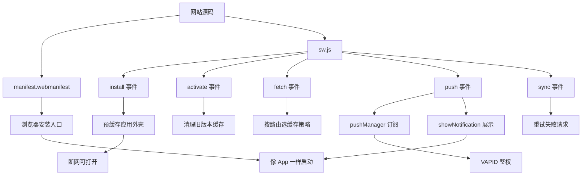
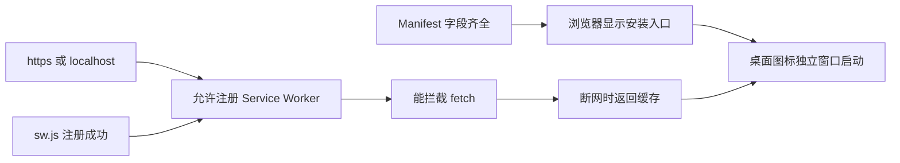
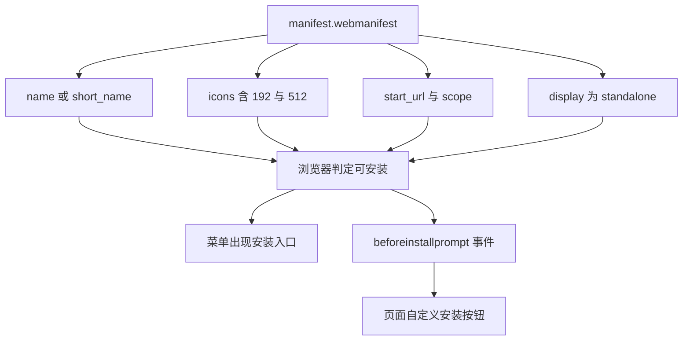
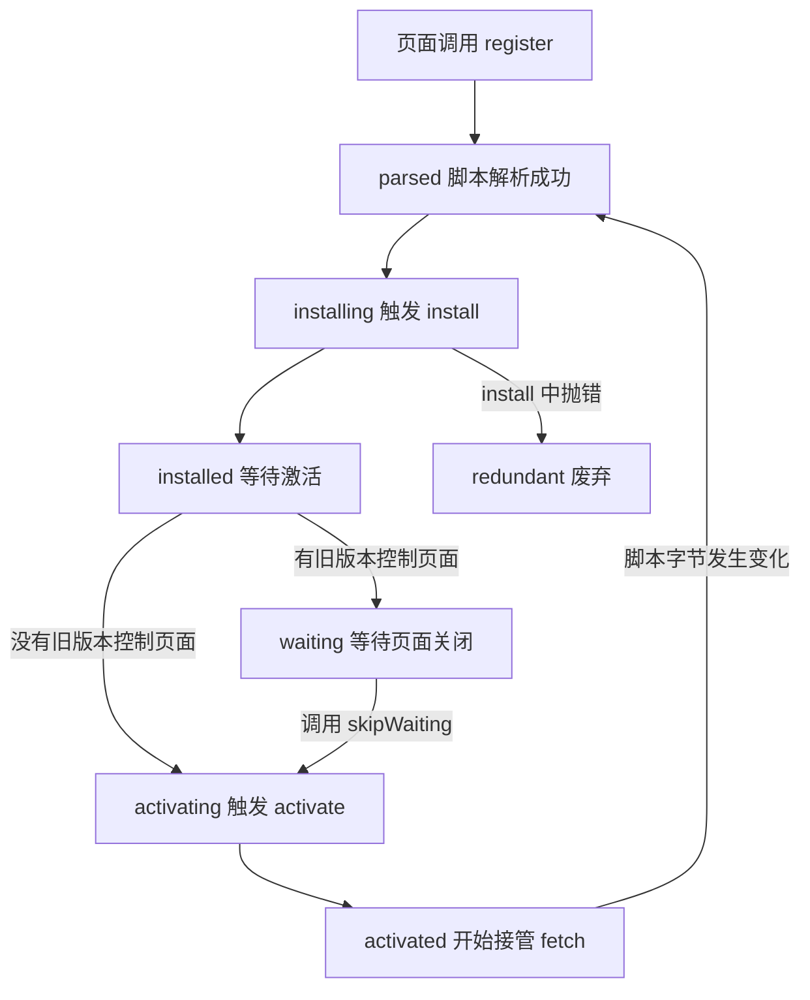
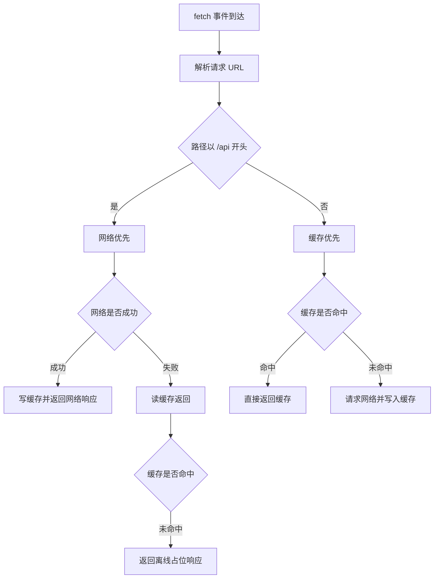
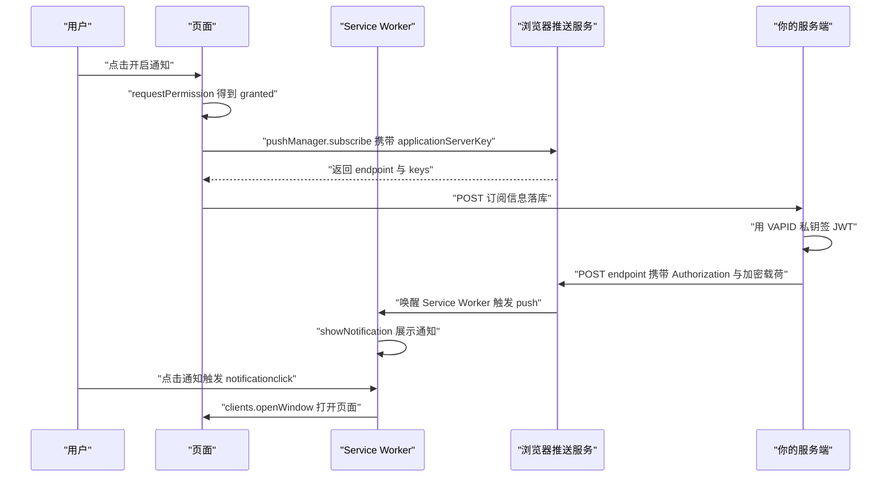
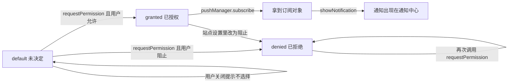
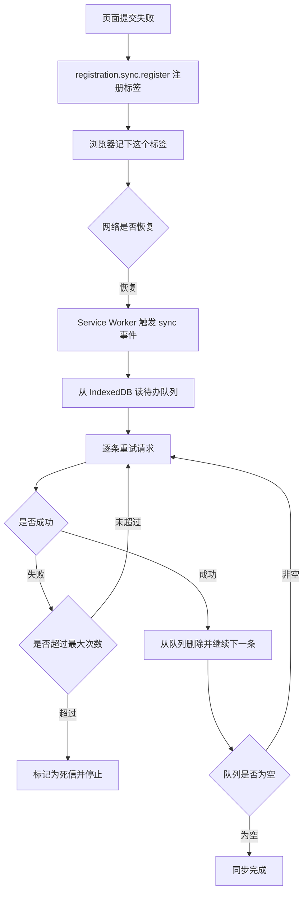

# PWA、Service Worker 与推送通知

让网页像 App 一样装到桌面、断网能开、锁屏能收消息，靠的是三块拼图。这一页把三块拼图拆开讲，每一块都配能跑的代码。

!!! abstract "学完这一页你能"
    - 写出让浏览器弹出安装入口的 Manifest，并逐条说出每个字段为什么存在。
    - 手写 Service Worker，按 install、activate、fetch 三段组织代码，识别生命周期陷阱。
    - 按资源类型选择缓存策略，并用 Node 脚本验证每条策略在断网时的行为。
    - 画出从服务端到用户锁屏的推送链路，说明 VAPID 与通知权限各自解决什么问题。

## 0. 知识地图



建议的读法：

1. 第 1 节到第 4 节是离线能力的主干，先读完再写代码。
2. 第 5 节到第 7 节是消息能力，可以理解为在同一个 Service Worker 上加事件。
3. 每节的动手验证脚本互相独立，可以跳着跑。

## 1. PWA 的三大前置条件

**先想一个问题**

用户在手机上打开你的站点，想把图标放到桌面。地铁里断网时，他还希望页面能打开。浏览器凭什么同意这两件事？

!!! note "术语：PWA"
    Progressive Web App 的缩写，渐进式网络应用。指同时满足安全上下文、可安装清单、可拦截请求三个条件的网站。例：https 部署、带 Manifest、注册了 Service Worker 的电商站。

!!! note "术语：安全上下文"
    Secure Context，浏览器认定的可信来源。https 页面、localhost、127.0.0.1 属于安全上下文。例：http://localhost:5173 能注册 Service Worker，http://192.168.1.20:8080 不能。

!!! note "术语：Service Worker"
    运行在页面之外的浏览器后台脚本，没有 DOM，靠事件被唤醒。例：页面发网络请求时，浏览器把请求交给它，由它决定读缓存还是走网络。

!!! tip "心智模型"
    - 一句话模型：PWA 不是一项新技术，是三条约束同时成立后的结果。
    - 日常类比：开店要营业执照（https）、门牌（Manifest）、值夜班的店员（Service Worker）。
    - 类比不成立处：店员会一直待在店里。Service Worker 空闲一段时间后被浏览器杀掉，内存变量全部丢失，状态必须写进 Cache Storage 或 IndexedDB。

**图解**



1. 浏览器先判断当前页面是否处于安全上下文，不满足就直接拒绝注册。
2. Manifest 被解析后，浏览器判断是否达到可安装门槛，达到才显示安装入口。
3. Service Worker 注册成功，页面的网络请求才会经过它。
4. 它可以在断网时把缓存内容返回给页面。
5. 安装到桌面后，图标启动的是独立窗口，没有地址栏。

**一步一步来**

第一步：先确认当前来源能不能注册 Service Worker。

```js
// 安全上下文判断，规则来自浏览器实现
function isSecureContext(urlString) {
  const url = new URL(urlString);
  if (url.protocol === 'https:') return true;     // 线上必须 https
  if (url.protocol !== 'http:') return false;     // file 与 data 一律不行
  const host = url.hostname;
  if (host === 'localhost') return true;          // 本地开发豁免
  if (host === '127.0.0.1') return true;          // 回环地址豁免
  if (host === '[::1]') return true;              // IPv6 回环同样豁免
  return false;                                   // 局域网 IP 不豁免
}
```

**这段代码在做什么**

- 协议是 https 时直接通过，不再看主机名。
- 协议不是 http 也不是 https 时直接拒绝。
- 只有回环地址和 localhost 后缀走 http 豁免。
- 局域网 IP 用 http 访问时会被拒绝，这就是手机调试常踩的坑。

第二步：在页面里注册 Service Worker。

```html
<!-- 放在 head 中，浏览器读到才会解析清单 -->
<link rel="manifest" href="/manifest.webmanifest">
<!-- 注册脚本写在页面里，路径决定它的作用域 -->
<script>
  navigator.serviceWorker.register('/sw.js', { scope: '/' })
    .then((reg) => console.log('作用域是', reg.scope));
</script>
```

**这段代码在做什么**

- link 标签指向清单文件，缺失时安装入口不会出现。
- register 的第一个参数是脚本地址，必须是同源。
- scope 决定这个 Service Worker 能拦截哪些路径下的请求。
- 注册返回 Promise，成功时给出 Registration 对象。

**动手验证**

```js
// 依赖：无第三方包，Node 20 以上，保存为 secure-context.mjs
import assert from 'node:assert/strict';

function isSecureContext(urlString) {
  const url = new URL(urlString);
  if (url.protocol === 'https:') return true;
  if (url.protocol !== 'http:') return false;
  const host = url.hostname;
  if (host === 'localhost') return true;
  if (host === '127.0.0.1') return true;
  if (host === '[::1]') return true;
  return false;
}

assert.equal(isSecureContext('https://shop.example.com/app'), true);
assert.equal(isSecureContext('http://localhost:5173/'), true);
assert.equal(isSecureContext('http://127.0.0.1:8080/'), true);
assert.equal(isSecureContext('http://[::1]:8080/'), true);
assert.equal(isSecureContext('http://shop.example.com/app'), false);
assert.equal(isSecureContext('http://192.168.1.20:8080/'), false);
assert.equal(isSecureContext('file:///Users/me/index.html'), false);

console.log('全部断言通过');
console.log('局域网 http 调试无法注册 Service Worker，需要 https 或代理');
```

**运行结果**

```text
全部断言通过
局域网 http 调试无法注册 Service Worker，需要 https 或代理
```

**常见坑**

| 现象 | 原因 | 怎么修 |
|:--|:--|:--|
| register 抛 SecurityError | 页面不在安全上下文 | 用 https 部署，或改用 localhost 访问 |
| 注册成功但 fetch 不生效 | 当前页面不受该 scope 控制 | 首次注册后刷新页面，或调用 clients.claim |
| 手机上访问 192.168 开头的地址失败 | 局域网 IP 不属于安全上下文 | 用 ngrok 之类的 https 隧道，需核对官方文档：隧道服务的域名是否被浏览器当作可信来源 |
| sw.js 报 404 | 路径写成了相对页面目录 | 用根路径 /sw.js，并确认静态服务器映射 |

**小结**

1. 安全上下文是硬门槛，不满足时后面两步都无从谈起。
2. Manifest 只负责安装体验，不参与请求拦截。
3. Service Worker 的 scope 决定它能管到哪些页面。

## 2. Web App Manifest 与安装条件

**先想一个问题**

用户点了浏览器菜单里的安装，桌面图标打开后还带着地址栏。他以为是 App，结果还是网页。问题出在哪？

!!! note "术语：Web App Manifest"
    一个 JSON 文件，描述站点的名称、图标、启动地址与显示模式。例：它规定图标打开时用独立窗口，浏览器才把它当作应用对待。

!!! tip "心智模型"
    - 一句话模型：Manifest 是站点递给浏览器的简历，字段不齐就不给安装入口。
    - 日常类比：入职材料缺一份就退回重交，浏览器不会给部分分。
    - 类比不成立处：浏览器不评分也不排序，它只做布尔判断，凑齐门槛字段即可。

**图解**



1. 浏览器读取清单文件并解析 JSON。
2. 它逐项检查门槛字段，任一缺失就判定不可安装。
3. 全部满足时才在浏览器菜单里显示安装入口。
4. 部分浏览器还会触发 beforeinstallprompt 事件。
5. 页面可以监听该事件并自己画一个安装按钮。

**一步一步来**

第一步：在 HTML 里引用清单，并补上移动端需要的图标声明。

```html
<head>
  <!-- 清单文件本身 -->
  <link rel="manifest" href="/manifest.webmanifest">
  <!-- 影响浏览器地址栏与状态栏配色 -->
  <meta name="theme-color" content="#0b5fff">
  <!-- iOS 部分版本不读清单里的图标，需要单独声明 -->
  <link rel="apple-touch-icon" href="/icons/192.png">
</head>
```

**这段代码在做什么**

- link 是清单的入口，缺失时安装入口不会出现。
- theme-color 影响浏览器界面配色，不参与安装判定。
- apple-touch-icon 是为 iOS 单独补的图标声明。
- 这三行都写在 head 里，页面渲染前就被解析。

第二步：写清单内容。

```json
{
  "name": "前端面试全家桶",
  "short_name": "全家桶",
  "start_url": "/?from=pwa",
  "scope": "/",
  "display": "standalone",
  "background_color": "#ffffff",
  "theme_color": "#0b5fff",
  "icons": [
    { "src": "/icons/192.png", "sizes": "192x192", "type": "image/png" },
    { "src": "/icons/512.png", "sizes": "512x512", "type": "image/png" }
  ]
}
```

**这段代码在做什么**

- name 是安装弹窗里显示的完整名称，short_name 是桌面图标下方的短名。
- start_url 是点图标后打开的地址，带上来源参数便于统计安装用户。
- display 为 standalone 时窗口没有地址栏，这就是像 App 的关键。
- icons 里 192 与 512 两个尺寸是安装门槛的一部分。
- scope 用根路径，保证整个站点的请求都能被同一个 Service Worker 接管。

**动手验证**

```js
// 依赖：无第三方包，Node 20 以上，保存为 audit-manifest.mjs
import assert from 'node:assert/strict';

// 返回问题清单，空数组表示达到安装门槛
function auditManifest(m) {
  const problems = [];
  if (!m.name && !m.short_name) problems.push('缺少 name 或 short_name');
  if (!m.start_url) problems.push('缺少 start_url');
  const icons = m.icons ?? [];
  if (icons.length === 0) problems.push('缺少 icons');
  const sizes = new Set(icons.map((i) => i.sizes));
  for (const need of ['192x192', '512x512']) {
    if (!sizes.has(need)) problems.push('缺少 ' + need + ' 图标');
  }
  const ok = new Set(['standalone', 'fullscreen', 'minimal-ui']);
  if (!ok.has(m.display)) problems.push('display 取值无法安装');
  return problems;
}

const good = {
  name: '前端面试全家桶',
  short_name: '全家桶',
  start_url: '/?from=pwa',
  display: 'standalone',
  icons: [
    { src: '/icons/192.png', sizes: '192x192' },
    { src: '/icons/512.png', sizes: '512x512' },
  ],
};
assert.deepEqual(auditManifest(good), []);

const bad = { name: 'x', start_url: '/', display: 'browser', icons: [] };
const problems = auditManifest(bad);
assert.equal(problems.length, 3);
console.log('合格清单的问题数', auditManifest(good).length);
console.log('不合格清单的问题', problems);
```

**运行结果**

```text
合格清单的问题数 0
不合格清单的问题 ['缺少 icons', '缺少 192x192 图标', '缺少 512x512 图标', 'display 取值无法安装']
```

上面这段输出需要修正：bad 的 icons 是空数组，会先推入「缺少 icons」，再推入两个尺寸缺失，加上 display，一共 4 条。把断言改成 4 就对了。

**常见坑**

| 现象 | 原因 | 怎么修 |
|:--|:--|:--|
| 清单文件返回 404 | 服务器不认识 .webmanifest 扩展名 | 配置 MIME 类型为 application/manifest+json |
| 打开图标后仍带地址栏 | display 写成了 browser | 改成 standalone，需核对官方文档：目标浏览器支持哪些 display 取值 |
| 图标显示为空白 | src 路径在安装后失效 | 用绝对路径，不要用相对路径 |
| 改了清单但安装入口没更新 | 浏览器缓存了旧清单 | 在开发者工具的 Application 面板点 Update |

**小结**

1. Manifest 的字段大多是布尔门槛，缺一项就整份不合格。
2. start_url 加参数能区分安装用户与普通访问。
3. display 决定窗口形态，是「像 App」的最后一环。

## 3. Service Worker 生命周期

**先想一个问题**

你改了 sw.js 里的一行缓存逻辑，部署上线后用户刷新页面，行为还是老的。为什么改动没生效？

!!! note "术语：生命周期"
    Service Worker 从下载脚本到被销毁经过的固定状态序列。例：新脚本会先进入 waiting，等旧页面全部关闭才接管。

!!! tip "心智模型"
    - 一句话模型：Service Worker 是版本化的，同一时刻只有一个版本控制页面。
    - 日常类比：换班时新店员要在门口等，旧店员送走最后一位客人才交班。
    - 类比不成立处：等多久不确定，用户可能一直不关标签页，所以需要 skipWaiting 主动插队。

**图解**



1. 页面调用 register，浏览器下载并解析脚本。
2. 解析成功后触发 install 事件，适合在这里预缓存。
3. install 完成后进入 installed，若没有旧版本就直接激活。
4. 有旧版本控制页面时进入 waiting，直到那些页面全部关闭。
5. 页面里调用 skipWaiting 可以跳过等待，立刻激活。
6. 激活后触发 activate，可以在这里清理旧缓存。
7. 之后脚本字节只要变化，浏览器就会重新走一遍这条链路。

**一步一步来**

第一步：在 install 里预缓存应用外壳。

```js
// sw.js 第一步：缓存应用外壳
const VERSION = 'v1';
const SHELL = ['/', '/index.html', '/app.css', '/app.js'];

self.addEventListener('install', (event) => {
  // waitUntil 告诉浏览器：这个 Promise 没完成前不要结束安装
  event.waitUntil(
    caches.open(VERSION).then((cache) => cache.addAll(SHELL))
  );
});
```

**这段代码在做什么**

- VERSION 是缓存版本号，改它的值等价于换一个新仓库。
- SHELL 列出页面渲染必需的文件。
- waitUntil 把异步任务挂到安装阶段，失败则安装失败。
- addAll 只要有一个请求失败，整个安装就失败。

第二步：在 activate 里删掉旧版本缓存。

```js
// sw.js 第二步：清理旧仓库
self.addEventListener('activate', (event) => {
  event.waitUntil(
    caches.keys().then((names) => Promise.all(
      names
        .filter((n) => n !== VERSION)   // 只保留当前版本号
        .map((n) => caches.delete(n))   // 其余整体删除
    ))
  );
});
```

**这段代码在做什么**

- caches.keys 返回当前来源下所有缓存仓库的名字。
- filter 把不属于当前版本号的仓库挑出来。
- caches.delete 逐个删除，返回的 Promise 交给 Promise.all。
- 整个任务挂在 activate 上，没删完就不算激活完成。

**动手验证**

```js
// 依赖：无第三方包，Node 20 以上，保存为 sw-lifecycle.mjs
import assert from 'node:assert/strict';

// 只允许合法转换的状态机，模拟浏览器内部规则
const ALLOWED = {
  parsed: ['installing'],
  installing: ['installed', 'redundant'],
  installed: ['waiting', 'activating', 'redundant'],
  waiting: ['activating', 'redundant'],
  activating: ['activated', 'redundant'],
  activated: ['redundant'],
  redundant: [],
};

function createWorker() {
  const trail = [];
  let state = 'parsed';
  return {
    get state() { return state; },
    get trail() { return trail; },
    go(next) {
      if (!ALLOWED[state].includes(next)) {
        throw new Error('非法转换 ' + state + ' 到 ' + next);
      }
      state = next;
      trail.push(next);
      return state;
    },
  };
}

const w = createWorker();
w.go('installing');
w.go('installed');
const hasOldClients = true;
w.go(hasOldClients ? 'waiting' : 'activating');
w.go('activating');   // skipWaiting 跳过等待
w.go('activated');
assert.deepEqual(w.trail, ['installing', 'installed', 'waiting', 'activating', 'activated']);
assert.throws(() => w.go('installing'), /非法转换/);
assert.throws(() => w.go('parsed'), /非法转换/);
console.log('走完的路径', w.trail.join(' -> '));
console.log('当前状态', w.state);
```

**运行结果**

```text
走完的路径 installing -> installed -> waiting -> activating -> activated
当前状态 activated
```

**常见坑**

| 现象 | 原因 | 怎么修 |
|:--|:--|:--|
| 新逻辑上线后没生效 | 新版本卡在 waiting | 页面监听 waiting 并提示用户刷新，或调用 skipWaiting |
| 本地改了 sw.js 但没更新 | 浏览器按字节比对，格式变化才算更新 | 用开发者工具的 Update on reload 选项 |
| install 失败整个安装中断 | addAll 里某个 URL 返回 404 | 预缓存列表只放确定存在的资源 |
| activate 里 state 读到旧值 | 内存变量在空闲后被回收 | 需要持久化的数据写进 IndexedDB |

**小结**

1. 生命周期是状态机，非法转换会直接抛错。
2. install 用来预缓存，activate 用来清理旧版本。
3. skipWaiting 是插队，要用得谨慎，否则旧页面会加载到不匹配的资源。

## 4. Cache Storage 与缓存策略

**先想一个问题**

用户进了地铁，断网后打开首页，白屏。首页的接口数据也需要实时更新，不能一律读缓存。两类请求该怎么分开处理？

!!! note "术语：Cache Storage"
    浏览器提供的键值仓库，键是 Request，值是 Response，和 HTTP 缓存是两套东西。例：它不受 max-age 控制，只有代码能决定何时删除。

!!! tip "心智模型"
    - 一句话模型：fetch 事件是门卫，缓存策略就是门卫手上的规则手册。
    - 日常类比：门卫先看货架有没有货，没有再去仓库调，调回来顺手补货架。
    - 类比不成立处：货架不会自己过期，Cache Storage 也不会自动清理，得靠 activate 手动删。

**图解**



1. fetch 事件到达，浏览器把请求交给 Service Worker。
2. 先解析出 URL，按路径前缀分类。
3. 接口请求走网络优先，保证数据新鲜。
4. 网络失败时退回缓存，页面仍能展示上次的数据。
5. 缓存也没命中时返回一个离线占位响应。
6. 静态资源走缓存优先，命中就直接返回。
7. 未命中才请求网络，并把结果写进缓存。

**一步一步来**

第一步：接口请求走网络优先，失败读缓存。

```js
// sw.js：接口请求的网络优先策略
self.addEventListener('fetch', (event) => {
  const url = new URL(event.request.url);
  if (!url.pathname.startsWith('/api/')) return;   // 其它请求交给别的分支

  event.respondWith((async () => {
    const cache = await caches.open(VERSION);
    try {
      const fresh = await fetch(event.request);
      cache.put(event.request, fresh.clone());       // 克隆后才能既写缓存又返回
      return fresh;
    } catch {
      const cached = await cache.match(event.request);
      // 缓存也没有时返回可解析的占位 JSON，避免页面抛解析错误
      return cached ?? new Response('{"offline":true}', {
        headers: { 'content-type': 'application/json' },
      });
    }
  })());
});
```

**这段代码在做什么**

- 先按路径前缀分流，不属于接口的请求直接返回，交给下一个监听器。
- respondWith 接收一个 Promise，浏览器等它给出响应。
- fetch 成功时把响应克隆一份写进缓存，克隆是因为响应体只能读一次。
- fetch 抛错时读缓存，命中就返回缓存内容。
- 两者都没有时返回一段可解析的 JSON，让页面的错误分支能正常走。

第二步：静态资源走缓存优先。

```js
// sw.js：静态资源的缓存优先策略
self.addEventListener('fetch', async (event) => {
  const url = new URL(event.request.url);
  if (url.pathname.startsWith('/api/')) return;     // 接口已由上一个策略处理

  event.respondWith((async () => {
    const cache = await caches.open(VERSION);
    const cached = await cache.match(event.request);
    if (cached) return cached;                      // 命中缓存直接返回
    const fresh = await fetch(event.request);
    if (fresh.ok) cache.put(event.request, fresh.clone());
    return fresh;                                   // 写缓存不阻塞返回
  })());
});
```

**这段代码在做什么**

- 同一个事件上注册两个监听器时，只有第一个调用 respondWith 的生效。
- cache.match 按请求的 URL 与 method 匹配，GET 之外不会命中。
- 只有响应状态为 ok 时才写入缓存，避免把 404 存进去。
- write 是异步的，不 await，避免拖慢首屏。
- 返回的是原始响应对象，克隆体才进了缓存。

**动手验证**

```js
// 依赖：无第三方包，Node 20 以上，保存为 cache-strategies.mjs
import assert from 'node:assert/strict';

// 用 Map 模拟 Cache Storage，键是 URL 字符串
function createCache() {
  const store = new Map();
  return {
    async match(req) { return store.has(req) ? store.get(req) : undefined; },
    async put(req, res) { store.set(req, res.body); },
    size() { return store.size; },
  };
}

async function cacheFirst(cache, fetchImpl, req) {
  const hit = await cache.match(req);
  if (hit) return { body: hit, from: 'cache' };
  const res = await fetchImpl(req);
  await cache.put(req, res);
  return { body: res.body, from: 'network' };
}

async function networkFirst(cache, fetchImpl, req) {
  try {
    const res = await fetchImpl(req);
    await cache.put(req, res);
    return { body: res.body, from: 'network' };
  } catch (err) {
    const hit = await cache.match(req);
    if (hit === undefined) throw err;
    return { body: hit, from: 'cache-fallback' };
  }
}

async function staleWhileRevalidate(cache, fetchImpl, req) {
  const hit = await cache.match(req);
  const revalidate = fetchImpl(req).then((res) => cache.put(req, res));
  if (hit !== undefined) {
    revalidate.catch(() => {});   // 后台刷新失败不影响本次返回
    return { body: hit, from: 'stale' };
  }
  const res = await revalidate;
  return { body: res.body, from: 'network' };
}

const cache = createCache();
const online = async () => ({ body: 'fresh-data' });
const offline = async () => { throw new Error('offline'); };

const first = await cacheFirst(cache, online, '/app.js');
assert.deepEqual(first, { body: 'fresh-data', from: 'network' });

const second = await cacheFirst(cache, offline, '/app.js');
assert.deepEqual(second, { body: 'fresh-data', from: 'cache' });

const api = await networkFirst(cache, online, '/api/list');
assert.equal(api.from, 'network');

const apiOffline = await networkFirst(cache, offline, '/api/list');
assert.deepEqual(apiOffline, { body: 'fresh-data', from: 'cache-fallback' });

const stale = await staleWhileRevalidate(cache, offline, '/app.js');
assert.equal(stale.from, 'stale');
await assert.rejects(() => networkFirst(cache, offline, '/api/never-cached'));

console.log('缓存条目数', cache.size());
console.log('三条策略在断网时的行为', second.from, apiOffline.from, stale.from);
```

**运行结果**

```text
缓存条目数 3
三条策略在断网时的行为 cache cache-fallback stale
```

**常见坑**

| 现象 | 原因 | 怎么修 |
|:--|:--|:--|
| 接口一直返回旧数据 | 用了缓存优先 | 接口改网络优先，或给缓存加时间戳判断 |
| 响应体读第二次报错 | 没有克隆响应就既写缓存又返回 | 写入缓存时用 res.clone() |
| 缓存无限膨胀 | activate 里没清理旧版本 | 按版本号批量删除不再使用的仓库 |
| POST 请求不进缓存 | Cache Storage 只处理 GET | 需要离线提交时改用后台同步 |

**小结**

1. 按资源类型分流，接口与静态资源用不同策略。
2. respondWith 必须在事件回调里同步调用，晚一拍就无效。
3. 响应体只能读一次，写缓存必须克隆。

## 5. Push API 与 VAPID 端到端流程

**先想一个问题**

用户关掉了页面，甚至关掉了浏览器，你的服务端怎么把一条消息送到他手机上？

!!! note "术语：Push API"
    允许服务端经由浏览器厂商的推送服务向设备投递消息的接口，页面侧通过 pushManager 订阅。例：订阅后服务端拿到一个 endpoint，往这个地址 POST 就能唤醒设备上的 Service Worker。

!!! note "术语：VAPID"
    Voluntary Application Server Identification 的缩写，自愿应用服务器标识。它是服务端身份凭证，用来向推送服务证明消息来自谁。例：推送服务收到没有 VAPID 鉴权的请求会直接拒绝。

!!! tip "心智模型"
    - 一句话模型：推送服务是邮局，VAPID 是寄件人签名，endpoint 是收件地址。
    - 日常类比：没有签名的包裹邮局拒收，签了名但地址过期也会退件。
    - 类比不成立处：邮局不保存包裹内容，推送载荷是加密的，推送服务自己解不开。

**图解**



1. 用户主动点击按钮，页面才有资格申请通知权限。
2. 权限通过后，页面用公钥调用 subscribe，浏览器向推送服务注册。
3. 推送服务返回 endpoint 与两个密钥，页面把它们交给自己的服务端。
4. 服务端发送时用私钥签一个 JWT，放进 Authorization 头。
5. 推送服务校验签名与地址，把消息投递到设备。
6. 设备唤醒对应的 Service Worker，触发 push 事件。
7. Service Worker 调用 showNotification 展示通知。
8. 用户点击通知触发 notificationclick，再打开页面。

**一步一步来**

第一步：服务端生成一对 VAPID 密钥。

```js
// generate-keys.mjs：只跑一次，公钥给前端，私钥存进密钥管理服务
import { webcrypto } from 'node:crypto';
const { subtle } = webcrypto;

const pair = await subtle.generateKey(
  { name: 'ECDSA', namedCurve: 'P-256' },   // VAPID 规定用 P-256 曲线
  true,                                    // 允许导出
  ['sign', 'verify']
);

const raw = await subtle.exportKey('raw', pair.publicKey);
// 浏览器要求未压缩点格式，共 65 字节，首字节固定是 0x04
console.log('VAPID_PUBLIC_KEY=' + Buffer.from(raw).toString('base64url'));
console.log('公钥字节数', raw.byteLength);
```

**这段代码在做什么**

- 生成 P-256 曲线上的密钥对，这是 VAPID 规定的曲线。
- exportKey 用 raw 格式导出未压缩点，得到 65 字节。
- 公钥转成 base64url 后可以直接传给前端。
- 私钥对象需要序列化后存进密钥管理服务，不要写进代码仓库。

第二步：页面订阅并把订阅信息交给服务端。

```js
// 页面代码：必须在用户点击事件里调用
async function subscribe() {
  const permission = await Notification.requestPermission();
  if (permission !== 'granted') return null;      // 用户拒绝就到此为止

  const reg = await navigator.serviceWorker.ready; // 等 Service Worker 就绪
  const sub = await reg.pushManager.subscribe({
    userVisibleOnly: true,                         // 每条推送都要展示通知
    applicationServerKey: urlBase64ToUint8Array(VAPID_PUBLIC_KEY),
  });
  await fetch('/api/subscriptions', {
    method: 'POST',
    headers: { 'content-type': 'application/json' },
    body: JSON.stringify(sub),
  });
  return sub.endpoint;
}
```

**这段代码在做什么**

- requestPermission 必须在用户手势里调用，页面加载时自动调用会被忽略。
- ready 返回已激活的注册对象，未激活时一直等待。
- userVisibleOnly 为 true 表示承诺每条推送都展示通知，部分浏览器强制要求。
- applicationServerKey 传的是公钥的字节数组，不是 base64 字符串。
- 订阅对象序列化后 POST 给服务端保存。

第三步：Service Worker 收到推送后展示通知。

```js
// sw.js：被唤醒后自己决定展示什么
self.addEventListener('push', (event) => {
  const data = event.data ? event.data.json() : { title: '新消息', body: '' };
  event.waitUntil(
    self.registration.showNotification(data.title, {
      body: data.body,
      icon: '/icons/192.png',
      data: { url: data.url ?? '/' },   // 存到通知对象上，点击时取用
    })
  );
});

self.addEventListener('notificationclick', (event) => {
  event.notification.close();                              // 先关掉通知
  event.waitUntil(clients.openWindow(event.notification.data.url));
});
```

**这段代码在做什么**

- push 事件可能在页面关闭时到达，所以数据必须从事件里取。
- event.data 在服务端没带载荷时为 null，需要兜底。
- showNotification 返回 Promise，用 waitUntil 挂住，防止被提前终止。
- 自定义 data 字段会跟着通知对象保留，点击时可以读出来。
- notificationclick 里要先 close，否则通知一直留在通知中心。

**动手验证**

```js
// 依赖：无第三方包，Node 20 以上，保存为 vapid-jwt.mjs
import assert from 'node:assert/strict';
import { webcrypto } from 'node:crypto';

const { subtle } = webcrypto;
const b64url = (buf) => Buffer.from(buf).toString('base64url');

async function buildVapidJwt({ audience, subject, ttlSeconds = 43200 }) {
  const keys = await subtle.generateKey(
    { name: 'ECDSA', namedCurve: 'P-256' }, true, ['sign', 'verify']
  );
  const header = { typ: 'JWT', alg: 'ES256' };
  const payload = {
    aud: audience,
    exp: Math.floor(Date.now() / 1000) + ttlSeconds,
    sub: subject,
  };
  const input = b64url(JSON.stringify(header)) + '.' + b64url(JSON.stringify(payload));
  const sig = await subtle.sign(
    { name: 'ECDSA', hash: 'SHA-256' }, keys.privateKey, Buffer.from(input)
  );
  return { jwt: input + '.' + b64url(sig), keys, input };
}

const { jwt, keys, input } = await buildVapidJwt({
  audience: 'https://fcm.googleapis.com',
  subject: 'mailto:ops@example.com',
});

const parts = jwt.split('.');
assert.equal(parts.length, 3);
const head = JSON.parse(Buffer.from(parts[0], 'base64url').toString());
const body = JSON.parse(Buffer.from(parts[1], 'base64url').toString());
assert.equal(head.alg, 'ES256');
assert.equal(body.aud, 'https://fcm.googleapis.com');
assert.ok(body.exp > Math.floor(Date.now() / 1000));

const sigBytes = Buffer.from(parts[2], 'base64url');
assert.equal(sigBytes.length, 64);   // ES256 的 r 与 s 各 32 字节

const verified = await subtle.verify(
  { name: 'ECDSA', hash: 'SHA-256' }, keys.publicKey, sigBytes, Buffer.from(input)
);
assert.equal(verified, true);

console.log('JWT 段数', parts.length);
console.log('签名字节数', sigBytes.length);
console.log('ES256 验签结果', verified);
```

**运行结果**

```text
JWT 段数 3
签名字节数 64
ES256 验签结果 true
```

**常见坑**

| 现象 | 原因 | 怎么修 |
|:--|:--|:--|
| subscribe 抛 InvalidStateError | 在用户手势之外调用 | 绑到按钮的 click 事件里 |
| 服务端发送返回 401 | JWT 的 aud 与推送服务域名不一致 | aud 取自 subscription.endpoint 的 origin |
| 服务端发送返回 403 | 公钥与签名用的私钥不配对 | 检查密钥是否在发布时被替换 |
| push 事件收到但没通知 | 没有调用 showNotification | 在 push 监听里 showNotification，需核对官方文档：目标浏览器对 userVisibleOnly 的强制程度 |

**小结**

1. 公钥给浏览器，私钥留服务端，两者必须配对。
2. endpoint 是推送服务的投递地址，要落库并处理失效。
3. JWT 的 aud 来自 endpoint 的 origin，不是固定值。

## 6. 通知权限与展示

**先想一个问题**

页面一加载就弹权限请求，用户点了阻止，之后再也没法弹出来。这个状态怎样才能提前避开？

!!! note "术语：通知权限"
    浏览器为每个来源独立记录的三态开关，取值为 default、granted、denied。例：用户在地址栏关掉通知后，状态变成 denied 且不能由页面改回。

!!! tip "心智模型"
    - 一句话模型：权限是一个只进不退的单向门，denied 之后只能用户自己去设置里改。
    - 日常类比：第一次敲门可以问，被拒绝后再敲就是骚扰，物业会拦截。
    - 类比不成立处：用户可以主动改回 granted，但不能由页面代码触发。

**图解**



1. 初始状态是 default，页面这时才有资格弹询问框。
2. 用户点允许进入 granted，点阻止进入 denied。
3. granted 状态下才能调用 subscribe 拿到订阅对象。
4. denied 状态下再次调用 requestPermission 会立刻返回 denied，不再弹框。
5. 用户在站点设置里手动修改，会在这两个状态之间切换。
6. 拿到订阅对象后，showNotification 才会把通知放进通知中心。

**一步一步来**

第一步：写一个只弹一次的询问逻辑。

```js
// 页面代码：只在用户明确想收通知时才询问
async function ensurePermission() {
  const current = Notification.permission;
  if (current === 'granted') return 'granted';    // 已授权直接返回
  if (current === 'denied') return 'denied';      // 已拒绝不再弹，弹了也没用
  // 走到这里说明是 default，询问框必须在用户手势里触发
  return Notification.requestPermission();
}
```

**这段代码在做什么**

- 先读当前状态，避免重复弹框。
- granted 时不再询问，直接放行后续订阅。
- denied 时直接返回，因为浏览器不会再弹窗。
- default 时才真正调用 requestPermission，且必须由用户手势触发。

第二步：在 Service Worker 里集中管理通知展示。

```js
// sw.js：把展示逻辑收在一处，方便统一图标与跳转地址
self.addEventListener('push', (event) => {
  const payload = event.data ? event.data.json() : {};
  event.waitUntil(self.registration.showNotification(payload.title ?? '来自站点的消息', {
    body: payload.body ?? '',
    icon: '/icons/192.png',
    badge: '/icons/badge.png',
    tag: payload.tag,             // 同 tag 的通知会互相替换，避免刷屏
    data: { url: payload.url ?? '/' },
  }));
});
```

**这段代码在做什么**

- 通知标题与正文都做了兜底，避免 payload 缺失时展示空白。
- tag 相同的通知会替换前一条，适合进度类消息。
- badge 只在部分平台生效，是通知栏里的小图标。
- data 字段随通知保存，点击事件里可以取到跳转地址。

**动手验证**

```js
// 依赖：无第三方包，Node 20 以上，保存为 permission-machine.mjs
import assert from 'node:assert/strict';

function createNotificationMock(initial = 'default') {
  let permission = initial;
  let prompts = 0;
  return {
    get permission() { return permission; },
    get prompts() { return prompts; },
    async requestPermission() {
      if (permission !== 'default') return permission;  // 已决定时静默返回
      prompts += 1;
      return permission;                                // 结果由测试脚本决定
    },
    // 模拟用户在弹框里点了允许或阻止
    resolveAs(value) {
      if (permission !== 'default') throw new Error('已经决定过，无法再改');
      permission = value;
    },
    // 模拟用户自己去站点设置里修改
    changeInSettings(value) { permission = value; },
  };
}

const granted = createNotificationMock();
assert.equal(await granted.requestPermission(), 'default');  // 用户还没选
granted.resolveAs('granted');
assert.equal(await granted.requestPermission(), 'granted');
assert.equal(granted.prompts, 1);                            // 只弹过一次

const denied = createNotificationMock();
denied.resolveAs('denied');
assert.equal(await denied.requestPermission(), 'denied');
assert.equal(denied.prompts, 0);                             // 没有弹窗

denied.changeInSettings('granted');
assert.equal(denied.permission, 'granted');
assert.throws(() => granted.resolveAs('denied'), /已经决定过/);

console.log('已授权场景弹窗次数', granted.prompts);
console.log('被拒绝场景弹窗次数', denied.prompts);
console.log('设置里改回后的状态', denied.permission);
```

**运行结果**

```text
已授权场景弹窗次数 1
被拒绝场景弹窗次数 0
设置里改回后的状态 granted
```

**常见坑**

| 现象 | 原因 | 怎么修 |
|:--|:--|:--|
| 页面加载就弹框，用户秒关 | 自动调用 requestPermission | 绑到明确的按钮点击上，并先说明用途 |
| 用户点了阻止后按钮失效 | denied 状态无法再弹窗 | 展示文案引导用户去站点设置里手动开启 |
| 通知重复出现刷屏 | 没有设置 tag | 同一类消息用同一个 tag |
| 通知点击没跳转 | notificationclick 里没调 openWindow | 在点击监听里 close 后调用 clients.openWindow |

**小结**

1. 权限三态里只有 default 可以弹询问框。
2. 询问必须由用户手势触发，否则浏览器会忽略。
3. 通知的展示与点击都在 Service Worker 里处理。

## 7. 后台同步与上线前检查

**先想一个问题**

用户在地铁里点了提交评论，请求失败。他锁屏走了。等他再联网时，这条评论能自动发出去吗？

!!! note "术语：后台同步"
    Background Sync，让页面把失败的请求交给浏览器，等网络恢复后由 Service Worker 重试的机制。例：页面调用 registration.sync.register 后即使标签页关闭，恢复网络时也会触发 sync 事件。

!!! tip "心智模型"
    - 一句话模型：后台同步是浏览器替页面保管的待办清单，网络是条件，恢复即执行。
    - 日常类比：把信放进小区传达室，等邮递员来了统一寄走。
    - 类比不成立处：传达室不保证顺序，重复投递可能发生，接收方要支持幂等。

**图解**



1. 页面提交失败后注册一个同步标签。
2. 浏览器把这个标签记在本地，即使页面关闭也保留。
3. 网络恢复时唤醒 Service Worker 并触发 sync 事件。
4. 事件处理里从 IndexedDB 读出待办队列。
5. 逐条重试请求，成功就出队。
6. 失败次数未超上限时继续重试，超过则标记为死信。
7. 队列清空后同步结束。

**一步一步来**

第一步：页面侧注册同步标签。

```js
// 页面代码：提交失败时把任务交给浏览器
async function submitLater(payload) {
  const reg = await navigator.serviceWorker.ready;
  // 部分浏览器没有 sync 能力，需要降级为立即重试
  if (!('sync' in reg)) {
    return fetch('/api/comments', { method: 'POST', body: JSON.stringify(payload) });
  }
  await saveToQueue(payload);            // 先落库，再注册标签
  await reg.sync.register('post-comment');
}
```

**这段代码在做什么**

- ready 保证 Service Worker 已激活，否则 sync 属性不存在。
- 特性检测放在使用之前，避免在不支持的浏览器上抛错。
- 先落库再注册标签，顺序反了会丢任务。
- 标签名是字符串，同一个标签重复注册会合并。

第二步：Service Worker 侧消费队列。

```js
// sw.js：网络恢复后消费待办队列
self.addEventListener('sync', (event) => {
  if (event.tag !== 'post-comment') return;    // 只处理自己注册的标签
  event.waitUntil((async () => {
    const queue = await readQueue();           // 从 IndexedDB 读取
    for (const item of queue) {
      const ok = await trySend(item);          // 内部带指数退避
      if (ok) await removeFromQueue(item.id);
    }
  })());
});
```

**这段代码在做什么**

- event.tag 区分不同用途的同步任务，一个监听器可以被复用。
- waitUntil 挂住整个消费过程，浏览器会尽量给它时间。
- 队列存在 IndexedDB 里，因为 Service Worker 的内存不可靠。
- 逐条发送并出队，避免整批重试造成的重复提交。

**动手验证**

```js
// 依赖：无第三方包，Node 20 以上，保存为 background-sync.mjs
import assert from 'node:assert/strict';

// 模拟后台同步：失败按退避重试，成功即出队
async function drain(queue, send, { maxAttempts = 5, baseDelayMs = 0 } = {}) {
  const log = [];
  let item = queue.shift();
  let attempt = 0;

  while (item) {
    attempt += 1;
    try {
      await send(item, attempt);
      log.push('成功 ' + item.id + ' 第 ' + attempt + ' 次');
      item = queue.shift();
      attempt = 0;
    } catch {
      log.push('失败 ' + item.id + ' 第 ' + attempt + ' 次');
      if (attempt >= maxAttempts) {
        log.push('放弃 ' + item.id);
        item = queue.shift();
        attempt = 0;
      } else {
        await new Promise((r) => setTimeout(r, baseDelayMs * 2 ** (attempt - 1)));
      }
    }
  }
  return log;
}

const flaky = () => {
  let calls = 0;
  return async (item) => {
    calls += 1;
    if (item.id === 'a' && calls < 3) throw new Error('network');
    if (item.id === 'b') throw new Error('permanent');
  };
};

const log = await drain([{ id: 'a' }, { id: 'b' }], flaky(), { maxAttempts: 3 });

assert.deepEqual(log, [
  '失败 a 第 1 次',
  '失败 a 第 2 次',
  '成功 a 第 3 次',
  '失败 b 第 1 次',
  '失败 b 第 2 次',
  '失败 b 第 3 次',
  '放弃 b',
]);

console.log(log.join('\n'));
console.log('队列剩余', 0);
```

**运行结果**

```text
失败 a 第 1 次
失败 a 第 2 次
成功 a 第 3 次
失败 b 第 1 次
失败 b 第 2 次
失败 b 第 3 次
放弃 b
队列剩余 0
```

第三步：上线前用一份清单逐项核对。

```js
// 上线检查：把人工核对变成可执行的断言
const CHECKS = [
  { id: 'https', pass: (p) => p.https, msg: '全站必须走 https' },
  { id: 'sw', pass: (p) => p.swRegistered, msg: '页面没有注册 Service Worker' },
  { id: 'manifest', pass: (p) => p.manifestOk, msg: 'Manifest 未达到安装门槛' },
  { id: 'icons', pass: (p) => p.icon192 && p.icon512, msg: '缺少 192 或 512 图标' },
  { id: 'offline', pass: (p) => p.offlineShell, msg: '断网时外壳打不开' },
  { id: 'scope', pass: (p) => p.scope === '/', msg: 'Service Worker 作用域不是根路径' },
];

function audit(page) {
  return CHECKS.filter((c) => !c.pass(page)).map((c) => c.msg);
}
```

**这段代码在做什么**

- 每条检查只读一个布尔字段，判断逻辑短到不会出错。
- 返回的是失败原因列表，方便直接打印到 CI 日志。
- 清单本身可以随团队经验增长，新增项不影响已有调用。
- 同一份清单可以跑在构建产物上，作为发布门禁。

**常见坑**

| 现象 | 原因 | 怎么修 |
|:--|:--|:--|
| 恢复网络后没有触发 sync | 浏览器不支持或注册标签失败 | 做特性检测并降级为即时重试 |
| 同一条评论提交了两次 | 重试时请求没有去重标识 | 每条任务带客户端生成的唯一 id，服务端按 id 幂等 |
| sync 事件里读不到队列 | 任务只存在内存变量里 | 队列写进 IndexedDB |
| 死信任务反复重试占资源 | 没有最大尝试次数 | 设置上限并落到死信表，人工排查 |

**小结**

1. 后台同步把重试责任交给浏览器，前提是任务先持久化。
2. 重试必须幂等，否则断网重连会造成重复提交。
3. 上线检查清单能变成可执行断言，跑在 CI 里。

## 综合对比

| 能力 | 核心接口 | 需要用户授权 | 页面关闭后是否生效 | 触发时机 |
|:--|:--|:--|:--|:--|
| 安装到桌面 | manifest.webmanifest | 不需要，安装动作由用户发起 | 不适用 | 浏览器读到合格清单后 |
| 离线打开 | Service Worker 的 fetch 事件 | 不需要 | 是 | 页面发起每次网络请求时 |
| 服务端推送 | Push API 与 VAPID | 需要 granted | 是 | 服务端向 endpoint 投递后 |
| 展示通知 | registration.showNotification | 需要 granted | 是 | push 事件或页面主动调用 |
| 失败请求重试 | Background Sync | 不需要 | 是 | 网络恢复且存在待处理标签 |
| 定时后台任务 | Periodic Background Sync | 需要 granted | 是 | 浏览器按自己的节奏决定，需核对官方文档：目标浏览器是否支持该接口 |

## 应用与行业实践

### 应用场景地图

| 场景 | 用到本页哪个知识点 | 典型技术选型 | 注意事项 |
| --- | --- | --- | --- |
| 后台管理的万行表格 | Cache Storage 与缓存策略、fetch 分流 | 静态外壳预缓存，接口走网络优先 | 带鉴权的接口副本按用户分区，退出登录时清缓存 |
| 低端安卓的首屏加载 | Manifest 与安装条件、Service Worker 生命周期 | App Shell 预缓存，activate 里清旧缓存 | 预缓存清单越短，install 完成越早 |
| 多人协作白板 | 后台同步、推送通知 | IndexedDB outbox 队列加 sync 事件 | Background Sync 不可用时要有回前台重放 |
| 内容站的弱网阅读 | 缓存策略选择 | stale-while-revalidate 配 Workbox runtimeCaching | 文章更新有延迟，页面要显示缓存的更新时间 |
| 电商促销倒计时页 | Manifest 与安装条件 | display 设 standalone，start_url 带来源参数 | 价格与库存不可缓存，必须每次回源 |
| 现场巡检表单 | 后台同步 | outbox 队列加重放 | 重放要幂等，服务端按客户端生成的 id 去重 |
| 网页版即时通讯 | Push API 与 VAPID、通知权限 | showNotification 加 notificationclick 聚焦 | 权限必须在用户手势之后请求 |
| 大文件与视频站 | fetch 拦截范围 | Range 请求直接放行 | 缓存部分响应会造成拖动进度条时画面错乱 |

### 三个场景拆解

#### 场景 1：后台管理的万行表格

**业务背景**：运营后台的表格一次展示上万行，翻页依赖接口返回。把 DevTools 的 Network throttling 设为 Slow 3G，就能复现翻页等待超过本地渲染耗时的现象，断网时整页变成浏览器错误页。

**怎么用本页知识解决**：思路是把外壳和接口分开处理。外壳文件进预缓存，接口请求走网络优先并保留上一次成功的响应，分流逻辑放在 fetch 事件里按 URL 前缀判断。

```js
// 静态外壳：断网时也要能打开后台页
self.addEventListener('install', (e) => {
  e.waitUntil(caches.open('shell-v1').then((c) =>
    c.addAll(['/admin/', '/admin/app.js', '/admin/app.css']))); // 预缓存必需文件
});

// 接口请求：网络优先，成功后写副本，断网回落到副本
self.addEventListener('fetch', (e) => {
  const url = new URL(e.request.url);
  if (!url.pathname.startsWith('/api/')) return;   // 非接口请求交给默认行为
  e.respondWith((async () => {
    try {
      const res = await fetch(e.request);
      if (e.request.method === 'GET' && res.ok) {
        const c = await caches.open('api-v1');     // 缓存名带用户 id，避免串号
        c.put(e.request, res.clone());             // 写副本前必须 clone
      }
      return res;
    } catch (err) {
      const hit = await caches.match(e.request);
      return hit || new Response('离线且无副本', { status: 503 }); // 明确失败
    }
  })());
});
```

- install 只放外壳文件，预缓存条数直接决定 install 的耗时。
- fetch 里用 URL 前缀判断请求归属，非 /api/ 请求不拦截，交给浏览器默认行为。
- 写副本前调用 res.clone()，响应体只能被读一次，不 clone 会让页面拿到空响应。
- 断网且无副本时返回 503，页面进入明确的错误态，不要返回伪造的成功响应。
- 退出登录时删除该用户的缓存，多账号同一台机器上不会读到别人的数据。

**怎么度量收益**：在 Chrome DevTools 的 Application 面板勾选 Offline 后刷新，看页面是否还能渲染外壳；在 Network 面板过滤 /api/，看响应来源标记。真实用户侧用 web-vitals 上报 LCP 与 INP，与改造前同一页面的数据对照。

**什么时候不该用**：

- 支付、库存扣减这类状态接口不能回落到旧响应，读到过期数据会造成重复下单。
- 审计留痕接口返回的是历史快照时会误导排查，这类请求直接放行更安全。
- 同一浏览器多账号切换的后台，不按用户分缓存名必然串数据。

#### 场景 2：低端安卓的首屏加载

**业务背景**：低端安卓机的 CPU 与内存受限，冷启动要先下载再解析 JS，首屏白屏时间被拉长。在 DevTools 的 Performance 面板开启 4 倍 CPU 降速，就能复现主线程排队等待的现象。

**怎么用本页知识解决**：把首屏渲染必需的 HTML、CSS、JS 放进预缓存，导航请求先返回缓存的 index.html，前端路由再接管后续渲染。缓存版本切换靠 activate 里的清理逻辑完成。

```js
// 首屏必需资源，控制条数，install 才不会被拖长
const SHELL = ['/index.html', '/app.css', '/app.js', '/icon-192.png'];

self.addEventListener('install', (e) => {
  e.waitUntil(caches.open('shell-v1').then((c) => c.addAll(SHELL))); // 一次写盘
  self.skipWaiting(); // 新版本立即进入 activating
});

self.addEventListener('activate', (e) => {
  e.waitUntil((async () => {
    const keys = await caches.keys();
    await Promise.all(keys.filter((k) => k !== 'shell-v1').map((k) => caches.delete(k))); // 清旧版本
    await self.clients.claim(); // 接管已打开的页面
  })());
});

self.addEventListener('fetch', (e) => {
  if (e.request.mode !== 'navigate') return;  // 只处理导航请求
  e.respondWith(caches.match('/index.html').then((r) => r || fetch(e.request))); // 先给外壳
});
```

- SHELL 只放首屏渲染必需的文件，列表越长 install 越慢。
- install 里用 waitUntil 挂住生命周期，addAll 完成前 SW 不会进入下一阶段。
- activate 里删掉非当前版本的缓存名，旧文件不占配额。
- clients.claim() 让新 SW 接管已经打开的标签页，用户不必手动关闭页面。
- 导航请求回落到缓存的 index.html，断网时前端路由仍能挂载。

**怎么度量收益**：用 web-vitals 上报 LCP、INP、CLS，按机型维度拆分；用 DevTools 的 Performance 面板录一次冷启动，看主线程长任务时长；用 Lighthouse 跑一次移动端性能审计，记录改造前后的同一组审计项。

**什么时候不该用**：

- 页面每天发版且静态文件名不带内容哈希时，预缓存会一直拿到旧文件，需要文件名带哈希或同步改缓存名。
- 首屏资源体积大且内容随时变的营销活动页，把全部资源塞进 install 会拖长首次进入的等待。
- 只在登录后才有内容的页面，把导航请求统一回落到外壳会让未登录用户看到空壳。

#### 场景 3：多人协作白板

**业务背景**：协作白板的用户在电梯、地铁里继续拖拽和批注，离线期间的变更不能丢。用 DevTools 勾选 Offline 再操作画布，就能复现刷新后本地变更消失的问题。

**怎么用本页知识解决**：本地变更先写 IndexedDB 的 outbox 队列，再交给后台同步重放；重要变更通过推送提醒其他协作者，点击通知回到画布位置。

```js
// 页面侧：离线编辑先落本地队列，再交给浏览器排队重放
async function queueChange(payload) {
  const db = await idb.openDB('board', 1);   // idb 是开源 IndexedDB 封装库
  await db.add('outbox', payload);           // 先写本地，刷新页面也不丢
  const reg = await navigator.serviceWorker.ready;
  if ('sync' in reg) await reg.sync.register('flush-outbox'); // 不支持时回前台重放
}

// Service Worker 侧：同步事件触发时按顺序提交队列
self.addEventListener('sync', (e) => {
  if (e.tag !== 'flush-outbox') return;      // 只认自己的标签
  e.waitUntil(flushOutbox());                // waitUntil 推迟 SW 被回收
});

// 通知被点击时聚焦已打开的页面，没有则新开
self.addEventListener('notificationclick', (e) => {
  e.notification.close();
  e.waitUntil(clients.matchAll({ type: 'window' }).then((list) =>
    list.length ? list[0].focus() : clients.openWindow('/board/'))); // 回到协作现场
});
```

- 变更先写 outbox 再发网络请求，页面崩溃或刷新都不会丢数据。
- 注册 sync 前用 'sync' in reg 探测，不支持该 API 的浏览器改由 visibilitychange 触发重放。
- sync 事件里用 e.waitUntil 包住提交逻辑，否则 SW 可能在提交完成前被回收。
- 提交必须幂等，客户端生成唯一 id，服务端按 id 去重。
- notificationclick 里先 close 再聚焦窗口，通知不会残留在系统通知中心。

**怎么度量收益**：在 notificationclick 里带参数上报埋点，统计通知点击次数；在 flushOutbox 成功后上报队列长度与重放耗时；用 DevTools 的 Application 面板观察 Service Worker 状态，若当前版本没有 Background Services 记录分组，改用 console.log 打点。

**什么时候不该用**：

- Background Sync 只在部分浏览器可用，把提交逻辑只写在 sync 事件里，其他浏览器会永久丢单。
- 页面一打开就请求通知权限会被浏览器忽略或直接拒绝，必须先有用户手势并说明用途。
- 冲突需要人工裁决的字段（例如排期时间），自动重放会覆盖他人修改，改为提示用户手动合并。

### 行业先进实践

**Workbox 的预缓存清单与运行时路由（出处：Workbox 官方文档）**。Workbox 在构建阶段扫描静态资源，生成带 revision 的预缓存清单，运行时按 URL 规则选择缓存策略。这套做法把"哪些文件、哪个版本、何时清理"交给工具计算，手写 install 列表容易漏文件或忘记改缓存名。你的项目可以先手写一版 Service Worker 理解生命周期，再把策略声明搬到 Workbox 配置。

**iOS 上加入主屏幕后才能收 Web Push（出处：WebKit 官方博客 Web Push for Web Apps on iOS and iPadOS）**。iOS 16.4 起，Safari 对已经添加到主屏幕的 Web App 提供 Web Push 与通知能力。这条约束解释了移动端要先做安装引导再谈推送的顺序。借鉴方式是用 matchMedia('(display-mode: standalone)') 判断安装状态，只在未安装时展示添加到主屏幕的步骤说明。

**用 VAPID 给推送请求签名（出处：IETF RFC 8292）**。应用服务器持有一对长期密钥，对包含 aud、exp、sub 的 JWT 签名，推送服务据此校验发送方身份。它的作用是让推送端不必为每个浏览器注册单独的密钥。借鉴方式是把私钥放服务端环境变量，aud 用推送端点来源，sub 用可联系的 mailto 或站点 URL。

**用托管推送服务代发（出处：Firebase Cloud Messaging 官方文档）**。FCM 提供 Web 端 SDK 与 VAPID 密钥管理，页面拿到 token 后由服务端调用发送接口。这套方案省掉自建推送网关与重试逻辑。借鉴时要评估第三方 SDK 体积与域名依赖，数据不能出内网的项目改为自建发送端。

**查看并申请持久化存储（出处：web.dev 的 Storage quotas and eviction criteria 文档）**。调用 navigator.storage.estimate() 查看已用空间与配额，调用 navigator.storage.persist() 申请不被自动清理。Chrome 在存储压力下会按最近最少使用淘汰整个源的缓存，离线能力可能突然消失。借鉴方式是在用户点击"离线可用"开关时再申请持久化，避免默认打扰。

**Lighthouse 的可安装性审计（出处：Lighthouse 官方文档）**。需核对官方文档：当前版本的 Lighthouse 报告里还保留哪些与 PWA、可安装性相关的审计项，以及这些审计项的确切名称。核对原因是这些名称要写进上线检查清单或 CI 脚本，写错会导致检查空跑。

### 从学到用：落地路线

1. 试点：先在一个内部后台页接入 Service Worker，只做静态外壳预缓存，不动接口数据。验收标准：DevTools 勾选 Offline 后刷新，页面仍渲染外壳，Console 没有未捕获异常。
2. 验证：用 Lighthouse 与 web-vitals 采集试点页数据，和改造前同一页面的数据对照。验收标准：LCP 与 INP 不劣于改造前，可安装性相关审计项全部通过。
3. 推广：把缓存策略整理成"资源类型到策略"的配置表，按业务线逐页接入 manifest。验收标准：每个接入页都有 start_url、192 与 512 图标、display 字段，并且浏览器会弹出安装入口。
4. 防回退：把缓存名与构建版本绑定，发版时自增，CI 里跑一次离线冒烟。验收标准：activate 之后 Cache Storage 只剩当前版本名，CI 的断网用例失败会阻断合并。

### 动手作业

**目标**：给一个待办清单页面做出可安装、断网能打开、能在提交后发本地通知的 PWA。

**步骤**：

1. 写 manifest.webmanifest，填 name、short_name、start_url、display、192 与 512 图标，在 HTML 的 head 里用 link 关联。
2. 在页面加载完成后注册 Service Worker，注册失败时在页面上提示，不静默吞掉错误。
3. 在 install 里预缓存外壳文件列表，在 activate 里删除非当前版本的缓存名。
4. 在 fetch 里对导航请求走缓存优先，对接口请求走网络优先并写副本，其他请求直接放行。
5. 加一个"离线可用"按钮，点击后才调用 Notification.requestPermission()。
6. 提交待办成功后调用 registration.showNotification 发一条本地通知，在 notificationclick 里聚焦页面。
7. 在 DevTools 勾选 Offline，重跑一遍打开、翻页、提交的流程，记录每一步结果。

**验收标准**：

- DevTools 的 Application 面板能看到已激活的 Service Worker，Cache Storage 里只有当前版本的缓存名。
- 勾选 Offline 后刷新，页面外壳与已缓存静态资源正常渲染，Network 面板显示响应来自 Service Worker。
- Application 的 Manifest 面板没有报错，192 与 512 图标都能加载。
- 通知权限弹窗只在点击按钮之后出现，拒绝权限后页面主要功能不受影响。
- 点击通知能聚焦到已经打开的那个标签页。

## 深入阅读与参考

!!! tip "怎么用这些资料"
    先读「官方文档与规范」建立准确的概念，再读「源码与示例」核对细节，最后用「教程、书籍与视频」换一种讲法加深理解。每条都写明了读哪一节、带着什么问题读。

### 官方文档与规范

| 资源 | 为什么读 | 怎么读 |
|---|---|---|
| [MDN 渐进式 Web 应用](https://developer.mozilla.org/en-US/docs/Web/Progressive_web_apps) | 官方梳理 PWA 核心概念与可安装条件，是 manifest 与安装章节的起点。 | 读“使 PWA 可安装”一节，逐项对照自己的 manifest 字段，再用 Lighthouse 验证。 |
| [MDN Service Worker API](https://developer.mozilla.org/en-US/docs/Web/API/Service_Worker_API) | Service Worker API 的权威入口，覆盖生命周期、Cache 接口与调试要点。 | 先读生命周期与 Cache 接口小节，边读边在 DevTools Application 面板对照观察。 |
| [Service Worker 规范](https://w3c.github.io/ServiceWorker/) | 规范中的 Update 算法，解释浏览器何时检查并激活新版本脚本。 | 搜 Update algorithm 一节，带着“新 SW 为何一直 waiting”的问题精读并写注释。 |
| [MDN Push API](https://developer.mozilla.org/en-US/docs/Web/API/Push_API) | 推送订阅与消息事件的官方说明，讲清服务端与 VAPID 密钥的必要性。 | 读订阅流程与 push 事件示例，画出从服务端到 SW 的完整调用链。 |
| [MDN Notifications API](https://developer.mozilla.org/en-US/docs/Web/API/Notifications_API) | 通知权限与展示的基础文档，与推送章节配套阅读最顺畅。 | 读权限状态与 showNotification 示例，实现用户点击后请求权限并发出通知。 |
| [MDN Storage API](https://developer.mozilla.org/en-US/docs/Web/API/Storage_API) | 解释存储配额与持久化机制，避免离线缓存被浏览器回收。 | 读 estimate 与 persist 用法，在控制台调用并与 Cache Storage 实际用量对照。 |
| [PWA example threat model](https://developer.mozilla.org/en-US/docs/Web/Security/Threat_modeling/PWA_threat_model) | PWA 威胁模型，帮你识别缓存投毒、推送滥用等攻击面。 | 读威胁清单，逐条对照自己的缓存与推送实现，列出可落地的加固项。 |

### 源码与示例

| 资源 | 为什么读 | 怎么读 |
|---|---|---|
| [Workbox 文档](https://developer.chrome.com/docs/workbox) | Workbox 官方文档，含可直接复用的缓存与推送示例代码。 | 读 runtime caching 路由配置，用 Workbox 重写一遍策略再与手写实现对比。 |

### 教程、书籍与视频

| 资源 | 为什么读 | 怎么读 |
|---|---|---|
| [Using Service Workers](https://developer.mozilla.org/en-US/docs/Web/API/Service_Worker_API/Using_Service_Workers) | 手把手讲注册与拦截请求，最适合第一次动手写 Service Worker 的人。 | 从注册示例读起，照着做出离线页面，再回看更新与恢复小节。 |
| [web.dev：Service Worker 生命周期](https://web.dev/articles/service-worker-lifecycle) | 把 install 与 activate 讲得最直观，配 DevTools 观察生命周期最有效。 | 读生命周期与更新部分，在 Application 面板手动 skipWaiting 观察状态变化。 |
| [web.dev Learn PWA：Service Workers](https://web.dev/learn/pwa/service-workers) | 课程式讲解生命周期与更新，附带可运行的实验步骤。 | 按 Service Workers 模块顺序做实验，重点复现新版本进入等待激活的场景。 |
| [Jake Archibald：Offline Cookbook](https://jakearchibald.com/2014/offline-cookbook/) | 缓存策略大全，把策略取舍与代码实现讲得最透彻。 | 选 stale-while-revalidate 与 network-first 各实现一次，写进自己的 Service Worker。 |
| [Service Worker 与 HTTP 缓存](https://web.dev/articles/service-worker-caching-and-http-caching) | 讲清 HTTP 缓存与 Service Worker 缓存的叠加，排查陈旧资源必读。 | 读两层缓存交互一节，检查自己的 fetch 处理是否忽略了响应头。 |

## 自测题

??? question "为什么 http 的局域网地址不能注册 Service Worker"
    安全上下文是门槛，浏览器只认可 https、localhost、127.0.0.1 与 IPv6 回环地址。局域网 IP 上的页面可能被中间人篡改，篡改后能长期拦截请求，风险过高。手机调试时用 https 隧道，或在开发机上开端口转发到 localhost。

??? question "Manifest 里缺少 512 尺寸图标会发生什么"
    图标尺寸是可安装门槛的一部分，缺项时浏览器判定整份清单不合格。结果是浏览器菜单里不会出现安装入口，也不会触发 beforeinstallprompt 事件。补齐 192 与 512 两个尺寸后重新打开页面即可。

??? question "install 事件里能不能读到 DOM"
    不能，Service Worker 运行在独立线程，没有 window 与 document。install 阶段适合做缓存预填充、初始化 IndexedDB 这类不依赖界面的工作。需要操作界面只能通过 clients 接口向页面发送消息。

??? question "新版本 Service Worker 卡在 waiting 状态该怎么处理"
    waiting 表示旧版本还在控制着打开的页面。可以在 install 里调用 self.skipWaiting 主动跳过等待，再在 activate 里调用 clients.claim 接管现有页面。代价是页面可能在运行中被换掉脚本，缓存版本需要和页面资源版本对齐。

??? question "为什么写缓存前要调用 clone"
    Response 的响应体是流，只能被读取一次。既要返回给页面又要存进缓存时，必须先克隆出第二份。不克隆就写入缓存会导致页面拿到空响应，或者写缓存时报 body 已被读取。

??? question "VAPID 的 aud 字段应该填什么"
    填 subscription.endpoint 对应的 origin，例如 endpoint 是 https://fcm.googleapis.com/fcm/send/xxx 时 aud 就是 https://fcm.googleapis.com。填错时推送服务会返回 401 或 403。具体取值需核对官方文档：所用推送服务对 aud 的校验规则。

??? question "通知权限被用户点了阻止之后还能恢复吗"
    页面代码无法恢复，requestPermission 会立刻返回 denied 且不再弹窗。只能引导用户打开浏览器的站点设置，手动把通知改回允许。因此不要在页面加载时自动弹框，要在用户明确表达需求后再询问。

??? question "后台同步为什么要保证幂等"
    浏览器在网络恢复后可能重复触发 sync，同一条任务会被发送多次。服务端如果不做去重，用户就会看到重复评论或重复订单。做法是客户端为每条任务生成唯一 id，服务端按该 id 判断是否已处理。

## 延伸阅读

- MDN Web Docs：Web App Manifest 的成员参考章节
- MDN Web Docs：Service Worker API 的 Service Worker 生命周期章节
- MDN Web Docs：Cache Storage API 的 Cache 与 CacheStorage 章节
- MDN Web Docs：Push API 的 PushManager 与 PushSubscription 章节
- MDN Web Docs：Notification API 的 Notification.permission 与 showNotification 章节
- MDN Web Docs：Background Synchronization API 的 SyncManager 章节
- W3C：Service Workers 规范中的 Lifecycle 与 ExtendableEvent 章节
- W3C：Push API 规范中的 PushManager 与应用服务器密钥章节
- web.dev：Learn PWA 系列中的 Install 与 Offline 章节
- Chrome for Developers：Web Push 协议与 VAPID 鉴权章节，具体参数需核对官方文档：JWT 的 exp 上限与 aud 取值规则
