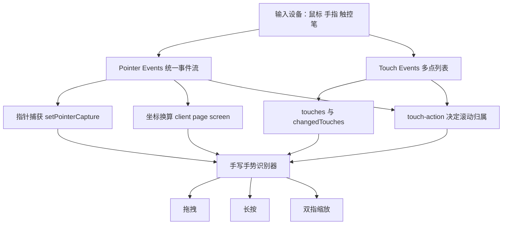
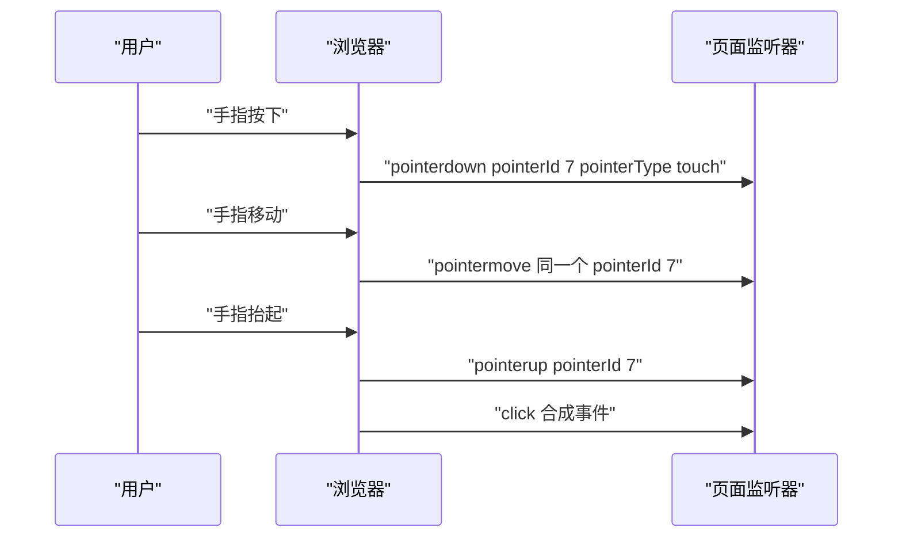
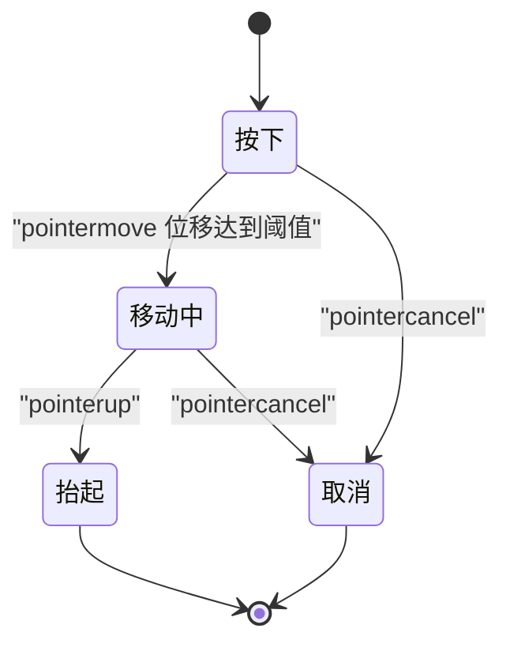
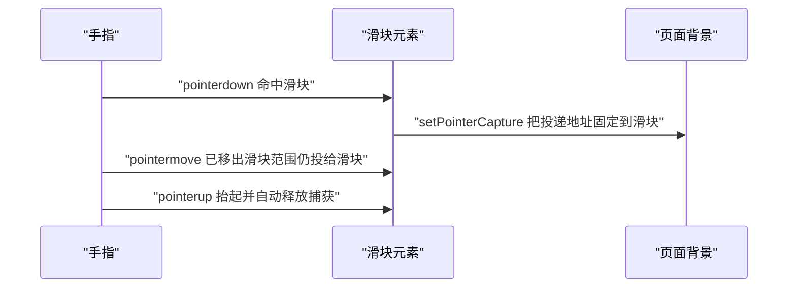
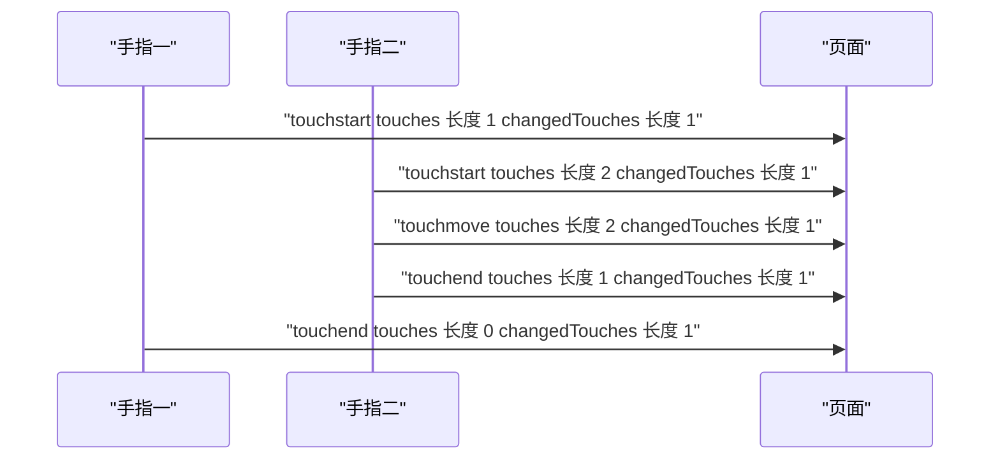
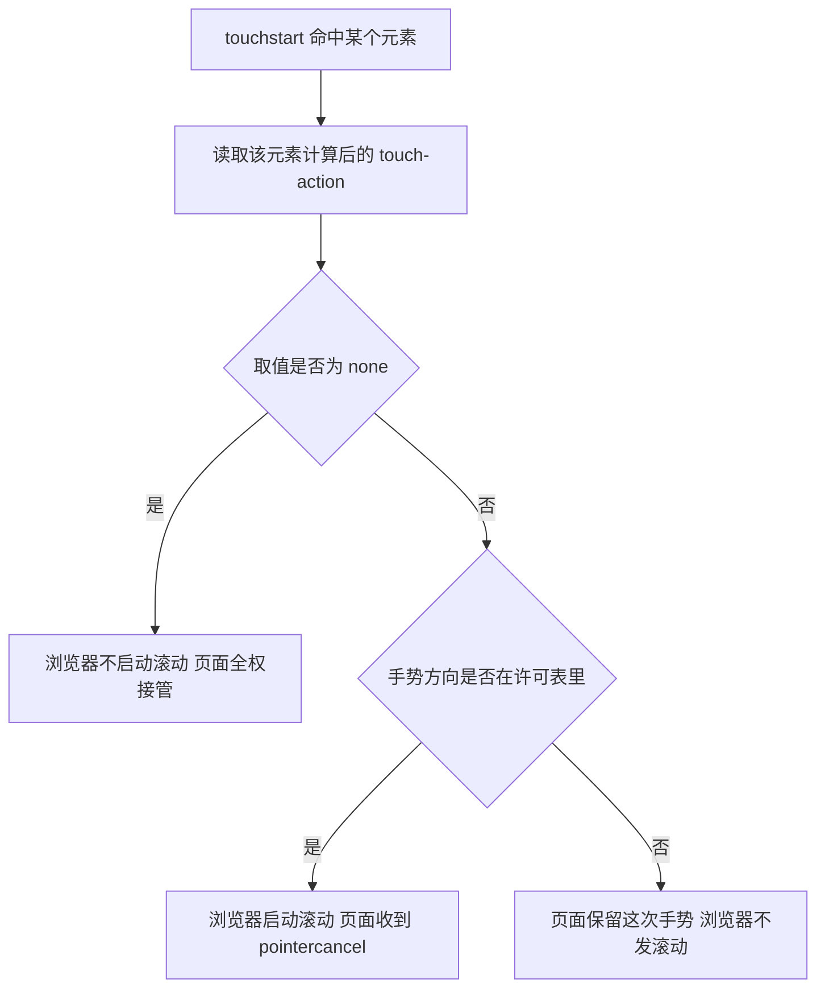
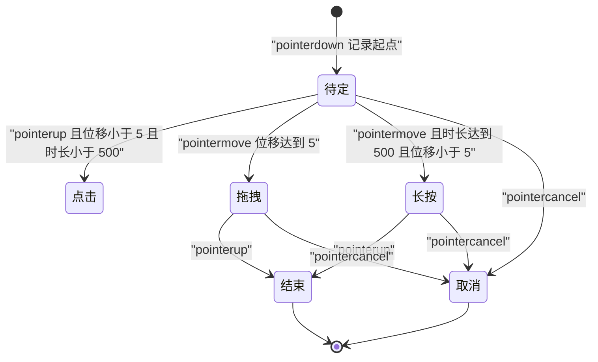
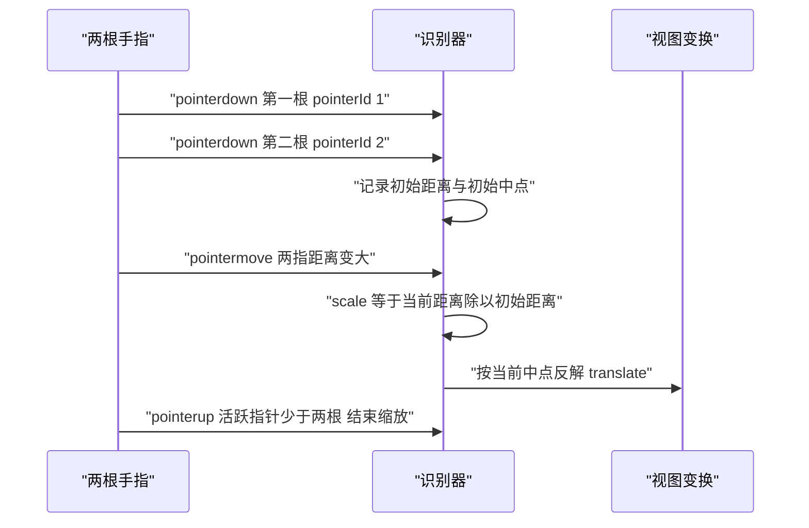

# 指针、触摸与手势事件

!!! abstract "学完这一页你能"

    - 说出 Pointer Events 的四个阶段事件名，并把鼠标、触摸、触控笔归一到同一条事件流。
    - 用 `setPointerCapture` 让拖拽在指针移出元素后仍然收到事件，并完成视口坐标与内容坐标互算。
    - 判断一次触摸该由页面还是浏览器接管，并用 `touch-action` 把这个决定写成 CSS。
    - 手写一个带状态机的识别器，用位移阈值与时长阈值区分点击、拖拽、长按，并算出双指缩放的锚点平移量。

## 0. 知识地图



建议按顺序读。第 1、2 节建立事件名与事件顺序，第 3、4 节处理坐标与多指数据。

第 5 节决定每次触摸归谁处理，第 6、7 节把前面全部拼成识别器。

!!! note "术语：统一输入模型"
    统一输入模型是指用同一组事件名、同一套坐标字段来描述不同输入设备的行为。例：鼠标按下与手指按下都触发 `pointerdown`，只是 `pointerType` 取值不同。

## 1. 三种输入设备为什么需要统一模型

**先想一个问题**

你写了一段横向拖动的卡片代码。鼠标按住能正常拖动，手指按住却把整个页面滚走了。同一段代码为什么在两种设备上表现不同？

!!! tip "心智模型"

    **一句话模型**：把输入设备看成「谁按下、按在哪、按了多久、移动了多少」这四个量的来源，事件名只是这四个量的载体。

    **日常类比**：快递员送包裹。鼠标是一位快递员，手指可以同时来五位，包裹内容相同，签收流程不同。

    **类比不成立的地方**：手指没有悬停状态。鼠标不按下也能移动并触发 hover，手指接触屏幕才有事件，离开后没有坐标。

!!! note "术语：Pointer Event"
    Pointer Event 是浏览器把鼠标、触摸、触控笔统一后发出的一类 DOM 事件。一次完整交互收到 `pointerdown`、`pointermove`、`pointerup`，并用 `pointerType` 标明设备是 `mouse`、`touch` 还是 `pen`。

**图解**



1. 浏览器先从底层硬件收到触摸原始数据。
2. 浏览器把它包装成 `pointerdown`，并分配一个本轮交互内不变的 `pointerId`。
3. 手指移动时发出 `pointermove`，`pointerId` 仍是 7，因此能和按下时配对。
4. 手指抬起发出 `pointerup`，这轮交互结束。
5. 若这次接触被判定为一次点击，浏览器随后补发 `click`。

**一步一步来**

**第 1 步：确认宿主是否提供 Pointer Events**

先确认能力，避免在不支持的环境里直接报错。

```js
// 检查全局对象上是否存在 PointerEvent 构造函数
const hasPointer = typeof window !== "undefined" && "PointerEvent" in window;
// 输出布尔值，便于人工确认
console.log(hasPointer);
```

**这段代码在做什么**

- `"PointerEvent" in window` 检查的是构造函数是否存在，不是版本号。
- `typeof window !== "undefined"` 先挡住 Node 环境，防止读取未定义的 `window`。
- 结果是布尔值，`false` 表示需要回退方案。
- 需核对官方文档：具体要核对目标宿主支持的最低版本以及回退时用哪套事件。

运行结果（浏览器控制台）：

```text
true
```

**第 2 步：把三种设备归一到一个处理函数**

只写一份逻辑，用 `pointerType` 处理细微差别。

```js
// 统一的按下处理函数，三种设备都会走到这里
function onDown(event) {
  // 设备类型，取值可能是 mouse touch pen
  const kind = event.pointerType;
  // 本轮交互的编号，抬起之前不会变
  const id = event.pointerId;
  // 该指针是不是本轮的主指针
  const primary = event.isPrimary;
  console.log(kind, id, primary);
}
```

**这段代码在做什么**

- `pointerType` 是字符串，不需要自己猜设备。
- `pointerId` 是数字，用来把同一根手指的几个事件串成一条线段。
- `isPrimary` 为 `true` 表示这是本轮的主指针，多指时只有一根是主指针。
- 处理函数内部不需要写浏览器前缀分支。

运行结果：

```text
touch 7 true
```

**动手验证**

依赖：无，只用 Node 内置的 `node:assert`。把设备原始数据归一成统一结构，再断言字段齐全。

```js
// 只用 Node 内置模块，不需要安装依赖
import assert from "node:assert/strict";

// 模拟三种设备上报的原始数据
const raw = [
  { device: "mouse", buttons: 1, x: 10, y: 20 },
  { device: "touch", identifier: 7, x: 10, y: 20 },
  { device: "pen", pointerId: 3, pressure: 0.5, x: 10, y: 20 },
];

// 归一函数，把不同字段名映射到同一套输出
function normalize(input) {
  return {
    // 设备名统一成小写字符串
    kind: input.device,
    // 优先取 identifier，其次取 pointerId，两者都没有时用 0
    id: input.identifier ?? input.pointerId ?? 0,
    // 坐标直接透传
    x: input.x,
    y: input.y,
    // 判断这轮触点是否带压力信息
    hasPressure: typeof input.pressure === "number",
  };
}

const out = raw.map(normalize);

assert.equal(out.length, 3);          // 三台设备都产出一条记录
assert.equal(out[1].kind, "touch");   // 第二条来自触摸
assert.equal(out[1].id, 7);           // 触摸的编号来自 identifier
assert.equal(out[2].hasPressure, true); // 触控笔带压力
assert.equal(out[0].id, 0);           // 鼠标没有编号，落到默认值
console.log("归一结果", JSON.stringify(out));
console.log("断言全部通过");
```

运行结果：

```text
归一结果 [{"kind":"mouse","id":0,"x":10,"y":20,"hasPressure":false},{"kind":"touch","id":7,"x":10,"y":20,"hasPressure":false},{"kind":"pen","id":3,"x":10,"y":20,"hasPressure":true}]
断言全部通过
```

**常见坑**

| 现象 | 原因 | 怎么修 |
| :--- | :--- | :--- |
| 手指拖拽时页面跟着滚 | 触摸默认被浏览器用于滚动 | 在元素上写 `touch-action`，见第 5 节 |
| 抬起事件收不到 | 指针移出元素后事件投给了别的元素 | 用 `setPointerCapture`，见第 3 节 |
| 同一根手指被当成两根 | 只按坐标配对，没用编号 | 用 `pointerId` 当会话键 |

**小结**

1. 设备差异集中在「谁按下、按在哪、按多久、移动多少」四个量上。
2. Pointer Events 用一条事件流覆盖鼠标、触摸、触控笔。
3. `pointerId` 是同一轮交互内不变的主键，必须用它配对事件。

## 2. Pointer Events 的单条事件流

**先想一个问题**

用户把手指按在按钮上，滑出去 40 像素再抬起。这次交互该算取消，还是算按钮被按下？

!!! tip "心智模型"

    **一句话模型**：一次指针交互是一条有开始、有过程、有结束的线段，`cancel` 是它的提前终止。

    **日常类比**：打电话。拨号是 down，通话中是 move，挂断是 up，中途信号断了是 cancel。

    **类比不成立的地方**：电话只有一条线，屏幕上可以同时有十根手指，每根手指各有自己的线段。

!!! note "术语：pointercancel"
    `pointercancel` 表示浏览器判定这条指针线段不再属于页面，之后不会再有同一 `pointerId` 的事件。典型触发场景是浏览器把这次触摸接管为页面滚动。

**图解**



1. 收到 `pointerdown` 后进入「按下」，此时记录起点坐标与起点时间。
2. 位移达到阈值进入「移动中」，这里才是拖拽真正开始的位置。
3. 收到 `pointerup` 进入「抬起」，交互正常收尾。
4. 收到 `pointercancel` 进入「取消」，需要把中间状态回滚。
5. 无论走哪条路径，都要清理以 `pointerId` 为键的会话数据。

**一步一步来**

**第 1 步：注册四个阶段事件**

把一条指针线段的整个生命期接住。

```js
// 拿到画布元素
const pad = document.querySelector("#pad");

// 按下，创建会话
pad.addEventListener("pointerdown", (event) => start(event));
// 移动，更新会话
pad.addEventListener("pointermove", (event) => move(event));
// 抬起，结束会话
pad.addEventListener("pointerup", (event) => end(event));
// 被浏览器接管，按取消处理
pad.addEventListener("pointercancel", (event) => cancel(event));
```

**这段代码在做什么**

- 四个事件名固定，触发顺序由用户操作决定。
- `pointerdown` 里通常记录起点时间与起点坐标。
- `pointermove` 的触发频率跟设备采样率相关，一次交互可能触发上百次。
- `pointercancel` 与 `pointerup` 必须走到同一段清理代码，否则状态会残留。

**第 2 步：用 pointerId 维护会话表**

多指同时按下时，每根手指各有一份状态。

```js
// 会话表，键是 pointerId，值是这轮的状态
const sessions = new Map();

// 记录起点与起点时间
function start(event) {
  sessions.set(event.pointerId, {
    startX: event.clientX, // 起点横坐标
    startY: event.clientY, // 起点纵坐标
    startTime: event.timeStamp, // 起点时间，单位毫秒
  });
}

// 结束时删除，避免下次按下读到旧数据
function end(event) {
  sessions.delete(event.pointerId);
}
```

**这段代码在做什么**

- `Map` 的键是数字 `pointerId`，查找与删除都很快。
- `event.timeStamp` 与 `performance.now()` 用同一时间基准，可以直接相减。
- 每根手指各自保存起点，多指拖拽时不会互相覆盖。
- `end` 只做删除，真正的业务收尾交给调用方。

运行结果（页面里按下再抬起后打印）：

```text
sessions.size 由 0 变为 1，抬起后回到 0
```

**动手验证**

依赖：无。用一个 reducer 处理事件序列，断言多指会话互不干扰。

```js
// 只用 Node 内置模块
import assert from "node:assert/strict";

// 会话表，键是 pointerId
const sessions = new Map();

// 处理一个事件，返回处理后的活跃指针数量
function reduce(event) {
  if (event.type === "pointerdown") {
    // 新指针，写入起点
    sessions.set(event.pointerId, { startX: event.x, startY: event.y });
  } else if (event.type === "pointerup" || event.type === "pointercancel") {
    // 结束或取消，两种都删除
    sessions.delete(event.pointerId);
  }
  return sessions.size;
}

assert.equal(reduce({ type: "pointerdown", pointerId: 1, x: 0, y: 0 }), 1);
assert.equal(reduce({ type: "pointerdown", pointerId: 2, x: 50, y: 0 }), 2);
assert.equal(reduce({ type: "pointerup", pointerId: 1 }), 1);
assert.equal(reduce({ type: "pointercancel", pointerId: 2 }), 0);
assert.equal(sessions.size, 0);
console.log("多指会话断言全部通过");
```

运行结果：

```text
多指会话断言全部通过
```

**常见坑**

| 现象 | 原因 | 怎么修 |
| :--- | :--- | :--- |
| 拖拽被系统接管后状态不清理 | 只监听了 `pointerup` | 同时监听 `pointercancel`，两者共用清理函数 |
| 第二根手指按下时第一根的起点被覆盖 | 会话存在单个对象里 | 用 `Map` 以 `pointerId` 为键 |
| 移动时页面卡顿 | `pointermove` 里同步读布局属性 | 在 `pointerdown` 时读一次 `getBoundingClientRect` 并缓存 |

**小结**

1. 一条指针线段有 down、move、up、cancel 四种事件。
2. `pointerId` 是会话键，多指场景必须用它分辨。
3. cancel 与 up 要共用同一段清理逻辑。

## 3. 指针捕获与坐标换算

**先想一个问题**

拖动一个滑块时，手指从滑块上滑到页面空白处，滑块立刻停住不动。为什么？

!!! tip "心智模型"

    **一句话模型**：指针捕获把「这条 `pointerId` 的事件投递地址」临时改成你指定的元素。

    **日常类比**：把信件转寄到固定地址，不管寄件人写的是哪个收件人。

    **类比不成立的地方**：转寄只对这条未结束的指针生效，新按下的手指仍然按正常命中测试投递。

!!! note "术语：命中测试"
    命中测试是浏览器根据坐标找出事件该投递给哪个元素的过程。指针移出元素后，命中测试的结果换成别的元素，事件随之改投。

!!! note "术语：视口坐标与文档坐标"
    视口坐标相对浏览器可视区域左上角，字段是 `clientX` 与 `clientY`。文档坐标相对整个文档左上角，字段是 `pageX` 与 `pageY`，等于视口坐标加上当前滚动量。

**图解**



1. 手指按下，命中测试选中滑块，`pointerdown` 投给滑块。
2. 滑块在 `pointerdown` 处理函数里调用 `setPointerCapture`。
3. 手指移出滑块范围，按正常命中测试事件本该投给页面背景。
4. 捕获生效，`pointermove` 仍然投给滑块，拖拽不会中断。
5. 手指抬起，浏览器投出 `pointerup`，随后自动释放捕获。

**一步一步来**

**第 1 步：在按下时绑定指针捕获**

```js
const knob = document.querySelector("#knob");

knob.addEventListener("pointerdown", (event) => {
  // 把这条指针的事件投递地址固定到 knob
  knob.setPointerCapture(event.pointerId);
  // 读一次布局并缓存，避免在 move 里反复触发重排
  const rect = knob.getBoundingClientRect();
  console.log("宽度", rect.width);
});
```

**这段代码在做什么**

- `setPointerCapture` 的参数是 `pointerId`，不是事件对象。
- 捕获之后，`pointermove` 的 `target` 始终是 `knob`。
- `getBoundingClientRect` 会触发一次布局读取，放在按下时读一次即可。
- 元素在捕获期间被移除时，浏览器会发出 `lostpointercapture`。

**第 2 步：把视口坐标换算成元素内坐标**

```js
// 视口坐标转元素内坐标，元素原点在左上角边框内
function toLocal(event, rect) {
  return {
    x: event.clientX - rect.left, // 横向位移
    y: event.clientY - rect.top,  // 纵向位移
  };
}
```

**这段代码在做什么**

- `rect.left` 是元素左边界到视口左边的距离，包含边框宽度。
- 相减之后得到相对元素左上角的坐标。
- `offsetX` 与 `offsetY` 也能给出局部坐标，但在捕获状态下参照元素可能改变，需核对官方文档：具体要核对捕获期间 `offsetX` 的参照元素是哪一个。
- 若坐标用于被缩放过的容器，还要再除以缩放倍数。

**第 3 步：文档坐标与视口坐标互换**

```js
// 视口坐标转文档坐标
function toPage(clientX, clientY) {
  return {
    x: clientX + window.scrollX, // 加上横向滚动量
    y: clientY + window.scrollY, // 加上纵向滚动量
  };
}
```

**这段代码在做什么**

- `window.scrollX` 与 `window.scrollY` 是页面当前的滚动偏移，单位 CSS 像素。
- `pageX` 与 `pageY` 由浏览器直接给出，数值等于上面这次相加。
- 容器内部滚动时，`window.scrollX` 不反映容器滚动，要改用容器的 `scrollLeft` 与 `scrollTop`。
- 拖动过程中页面若在滚动，文档坐标会漂移，视口坐标配合捕获结果稳定。

**动手验证**

依赖：无。验证视口坐标与内容坐标的往返换算。

```js
// 只用 Node 内置模块
import assert from "node:assert/strict";

// 元素在视口中的位置与当前缩放倍数
const rect = { left: 100, top: 50 };
const scale = 2;

// 视口坐标转元素内内容坐标
function toContent(client, rect, scale) {
  return { x: (client.x - rect.left) / scale, y: (client.y - rect.top) / scale };
}

// 内容坐标转回视口坐标
function toClient(content, rect, scale) {
  return { x: content.x * scale + rect.left, y: content.y * scale + rect.top };
}

const c = toContent({ x: 300, y: 250 }, rect, scale);
assert.deepEqual(c, { x: 100, y: 100 });          // 减偏移再除倍数
const back = toClient(c, rect, scale);
assert.deepEqual(back, { x: 300, y: 250 });        // 往返之后回到原点
console.log("内容坐标", JSON.stringify(c));
console.log("往返一致", JSON.stringify(back));
```

运行结果：

```text
内容坐标 {"x":100,"y":100}
往返一致 {"x":300,"y":250}
```

**常见坑**

| 现象 | 原因 | 怎么修 |
| :--- | :--- | :--- |
| 捕获后再也收不到事件 | 元素在 `pointerup` 之前被移除 | 移除前先调用 `releasePointerCapture` |
| 拖拽跟手偏一段距离 | `offsetX` 的参照元素在捕获中变了 | 改用 `clientX` 减去 `getBoundingClientRect().left` |
| 页面滚动后坐标错位 | 一次计算里混用了 `clientX` 与 `pageX` | 同一次计算只用一种坐标系 |

**小结**

1. 指针捕获解决「指针移出元素后事件改投」的问题。
2. 捕获的键是 `pointerId`，抬起时浏览器自动释放。
3. 坐标换算先统一坐标系，再做减法与除法。

## 4. 触摸事件与多点列表

**先想一个问题**

两根手指同时按在屏幕上，抬起其中一根。在 `touchend` 事件里读 `touches`，为什么找不到抬起的那根手指？

!!! tip "心智模型"

    **一句话模型**：一次触摸事件带三张名单，分别是全场名单、本元素名单、本次变化名单。

    **日常类比**：教室点名。`touches` 是全班在场名单，`targetTouches` 是这一排的在场名单，`changedTouches` 是这次刚举手或刚离开的人。

    **类比不成立的地方**：名单是只读快照，事件结束就作废，不能存起来当状态用。

!!! note "术语：TouchList"
    `TouchList` 是只读的类数组对象，成员是 `Touch` 对象。`touches` 含屏幕上全部触点，`targetTouches` 含起始于同一元素的触点，`changedTouches` 含本次事件里发生变化的触点。

!!! note "术语：被动监听器"
    被动监听器是注册时传了 `{ passive: true }` 的监听器，浏览器不等待它调用 `preventDefault` 就直接开始滚动。部分浏览器对 `window`、`document`、`body` 上的 `touchstart` 与 `touchmove` 默认按被动处理，需核对官方文档：具体要核对哪些目标元素在哪些版本默认被动。

**图解**



1. 第一根手指按下，`touches` 与 `changedTouches` 长度都是 1。
2. 第二根手指按下，`touches` 变成 2，`changedTouches` 仍然是 1，只含新按下的那根。
3. 第二根手指移动，`touches` 保持 2，`changedTouches` 只含移动的那根。
4. 第二根手指抬起，`touches` 降到 1，`changedTouches` 仍含抬起的那根。
5. 抬起的触点已经不在 `touches` 里，要读它的坐标必须用 `changedTouches`。

**一步一步来**

**第 1 步：从 changedTouches 读真正变化的触点**

```js
element.addEventListener("touchend", (event) => {
  // 抬起的手指只出现在 changedTouches 里
  for (const touch of event.changedTouches) {
    console.log("抬起", touch.identifier, touch.clientX, touch.clientY);
  }
});
```

**这段代码在做什么**

- `changedTouches` 是本次事件的主角名单，抬起事件里必须读它。
- `identifier` 是数字，用来区分是哪根手指。
- `Touch` 对象也提供 `clientX`、`clientY`、`pageX`、`pageY`。
- 遍历用 `for...of`，`TouchList` 支持迭代协议。

**第 2 步：用 identifier 跟踪每根手指**

```js
// 活跃触点表，键是 identifier
const active = new Map();

element.addEventListener("touchstart", (event) => {
  for (const touch of event.changedTouches) {
    // 记录这根手指的起点
    active.set(touch.identifier, { startX: touch.clientX, startY: touch.clientY });
  }
});

element.addEventListener("touchend", (event) => {
  for (const touch of event.changedTouches) {
    // 抬起时移除，避免下次读到旧起点
    active.delete(touch.identifier);
  }
});
```

**这段代码在做什么**

- `identifier` 在一根手指的整个生命期内保持不变，适合当键。
- 数组下标不能当身份，因为触点顺序会变化。
- 起点只在 `touchstart` 记录一次，后续移动只读不写。
- `touchcancel` 也要挂同一段删除逻辑。

**第 3 步：需要 preventDefault 时显式关闭被动模式**

```js
// 注册时写 passive false，否则 preventDefault 会被忽略
element.addEventListener("touchmove", (event) => {
  // 请求浏览器不要用这次触摸去滚动页面
  event.preventDefault();
}, { passive: false });
```

**这段代码在做什么**

- `{ passive: false }` 告诉浏览器这个监听器可能取消默认行为。
- 被动监听器里调用 `preventDefault` 不会生效，控制台会出现提示。
- 这条规则建议在需要精细手势时用 `touch-action` 代替，见第 5 节。
- `preventDefault` 的调用要放在处理函数的第一行，早于任何 `await`。

**动手验证**

依赖：无。模拟触点集合的增删，断言三张名单的长度变化。

```js
// 只用 Node 内置模块
import assert from "node:assert/strict";

// 活跃触点集合，键是身份证号
const active = new Map();

// 处理一次触摸事件，返回三张名单的长度
function handle(event) {
  const changed = [];
  if (event.type === "touchstart") {
    for (const id of event.ids) {
      // 新按下的手指才记入变化名单
      if (!active.has(id)) {
        active.set(id, true);
        changed.push(id);
      }
    }
  } else if (event.type === "touchend") {
    for (const id of [...active.keys()]) {
      // 已从场上消失的手指才记入变化名单
      if (!event.ids.includes(id)) {
        active.delete(id);
        changed.push(id);
      }
    }
  }
  return { touches: active.size, changed: changed.length };
}

assert.deepEqual(handle({ type: "touchstart", ids: [1] }), { touches: 1, changed: 1 });
assert.deepEqual(handle({ type: "touchstart", ids: [1, 2] }), { touches: 2, changed: 1 });
assert.deepEqual(handle({ type: "touchend", ids: [1] }), { touches: 1, changed: 1 });
assert.deepEqual(handle({ type: "touchend", ids: [] }), { touches: 0, changed: 1 });
console.log("触点集合断言全部通过");
```

运行结果：

```text
触点集合断言全部通过
```

**常见坑**

| 现象 | 原因 | 怎么修 |
| :--- | :--- | :--- |
| `touchend` 里读到 `touches` 长度 0 | `touches` 只含仍在屏幕上的触点 | 改读 `changedTouches` |
| `preventDefault` 无效并打印警告 | 监听器按被动模式处理 | 注册时传 `{ passive: false }` |
| 第二根手指按下后第一根的记录丢了 | 用数组下标当身份 | 用 `identifier` 当键 |

**小结**

1. `touches`、`targetTouches`、`changedTouches` 三张名单职责不同。
2. 抬起事件里必须读 `changedTouches` 才能拿到触点坐标。
3. `identifier` 是一根手指的稳定身份，不能拿数组下标代替。

## 5. touch-action 与滚动归属

**先想一个问题**

一个横向轮播里嵌了纵向滚动列表。用户斜着滑动屏幕时，该滚轮播还是该滚列表，谁说了算？

!!! tip "心智模型"

    **一句话模型**：`touch-action` 是元素交给浏览器的一张许可表，写在表里的手势浏览器自己处理，没写的留给页面。

    **日常类比**：场馆保洁外包。你只把「横向清扫」外包出去，纵向清扫仍然归自己。

    **类比不成立的地方**：许可表在手指按下的那一刻读取并锁定，之后改 CSS 不影响正在进行的那次手势。

!!! note "术语：touch-action"
    `touch-action` 是一个 CSS 属性，取值为 `auto`、`none`、`pan-x`、`pan-y`、`pinch-zoom`、`manipulation` 中的一项或组合，用来声明这个元素上允许浏览器直接处理哪些触摸手势。`manipulation` 等于 `pan-x` 加 `pan-y` 加 `pinch-zoom`。

**图解**



1. 手指按下时，浏览器先做命中测试找出目标元素。
2. 读取该元素计算后的 `touch-action` 取值，这是本次手势的唯一依据。
3. 取值为 `none` 时，浏览器不启动任何滚动或缩放。
4. 手势方向落在许可表内时，浏览器启动滚动，并向页面发出 `pointercancel`。
5. 方向不在许可表内时，页面保留这次手势，浏览器不发滚动。

**一步一步来**

**第 1 步：用 manipulation 去掉双击缩放的等待**

```css
/* 允许平移与双指缩放，把双击缩放从许可表里去掉 */
.card {
  touch-action: manipulation;
}
```

**这段代码在做什么**

- `manipulation` 展开后等于 `pan-x pan-y pinch-zoom` 三项。
- 声明之后，点击不再等待双击判定，点击响应变快。
- 该属性写在可能被触摸的元素上，不写在 `body` 上。
- 需核对官方文档：具体要核对目标浏览器对 `manipulation` 与双击缩放关系的定义。

**第 2 步：用 pan-y 把横向手势留给页面**

```css
/* 纵向滚动交给浏览器，横向留给页面的手势识别器 */
.carousel {
  touch-action: pan-y;
  overflow-x: hidden;
}
```

**这段代码在做什么**

- `pan-y` 意味着浏览器只处理纵向平移。
- 页面因此能稳定拿到横向 `pointermove`，不会被 `pointercancel` 打断。
- 代价是元素自身的横向滚动被禁用，注意配合 `overflow-x` 的取值。
- 嵌套滚动列表要做反向声明：内层写 `pan-y`，外层不再抢方向。

**第 3 步：用 none 完全接管，并阻止文本选择**

```js
const surface = document.querySelector("#draw");

surface.addEventListener("pointerdown", (event) => {
  // none 已声明浏览器不滚动，这里再阻止文本选择与图片拖拽
  event.preventDefault();
});
```

**这段代码在做什么**

- 控制触摸滚动的手段是 `touch-action`，不是 `pointerdown` 上的 `preventDefault`。
- `preventDefault` 在这里的作用是阻止文本选择与原生拖拽。
- 需核对官方文档：具体要核对各浏览器列举的 `pointerdown` 默认行为清单。
- 元素同时要写 `user-select: none`，让长按不弹出选择菜单。

**动手验证**

依赖：无。根据 `touch-action` 取值判断浏览器是否接管某个方向。

```js
// 只用 Node 内置模块
import assert from "node:assert/strict";

// 把简写展开成许可表
function expand(value) {
  if (value === "auto") return ["pan-x", "pan-y", "pinch-zoom"];
  if (value === "manipulation") return ["pan-x", "pan-y", "pinch-zoom"];
  if (value === "none") return [];
  return value.split(" ");
}

// 判断浏览器是否会处理这个方向
function browserHandles(touchAction, direction) {
  const allowed = expand(touchAction);
  if (direction === "pinch") return allowed.includes("pinch-zoom");
  return allowed.includes(`pan-${direction}`);
}

assert.equal(browserHandles("none", "y"), false);          // none 全部自己接管
assert.equal(browserHandles("pan-y", "y"), true);          // 纵向外包出去
assert.equal(browserHandles("pan-y", "x"), false);         // 横向留给页面
assert.equal(browserHandles("manipulation", "pinch"), true);
assert.equal(browserHandles("auto", "x"), true);           // 默认全部外包
console.log("touch-action 判定断言全部通过");
```

运行结果：

```text
touch-action 判定断言全部通过
```

**常见坑**

| 现象 | 原因 | 怎么修 |
| :--- | :--- | :--- |
| 拖拽时页面仍然滚动 | 只在 JS 里调用 `preventDefault` | 在元素上写 `touch-action` |
| 手写手势拿不到连续的 move | 浏览器中途发了 `pointercancel` | 把对应方向从许可表里去掉 |
| 双击缩放延迟没去掉 | 只写了 `pan-x pan-y`，没允许缩放 | 改用 `manipulation`，并核对官方文档 |
| 嵌套列表抢方向 | 内层没有独立声明 | 内层写 `touch-action: pan-y` |

**小结**

1. `touch-action` 声明的是「哪些手势外包给浏览器」。
2. 取值在手指按下时锁定，之后的样式改动不影响本次手势。
3. 想让页面稳定拿到连续 `pointermove`，就必须把对应方向从许可表里去掉。

## 6. 手写手势识别器：区分点击、拖拽与长按

**先想一个问题**

一张卡片要支持三种操作：轻点打开、长按弹菜单、按住拖动排序。三个动作都从 `pointerdown` 开始，怎么判断用户要哪一个？

!!! tip "心智模型"

    **一句话模型**：识别器是一台状态机，按下进入待定态，用「累计位移」与「累计时长」两个量在待定态里做出裁决。

    **日常类比**：法庭立案。按下算收案，位移超过阈值判为拖拽，时长超过阈值判为长按，两个都没超过就松手则判为点击。

    **类比不成立的地方**：判决不会回退。拖拽已经开始后，即使手指回到起点再松手，多数识别器仍按拖拽收尾。

!!! note "术语：阈值"
    阈值是识别器用来做判断的临界数值，写成常量便于调参。例：位移阈值 5 个 CSS 像素，时长阈值 500 毫秒。

**图解**



1. 收到 `pointerdown` 进入待定态，记录起点坐标与起点时间。
2. 移动时算出累计位移，达到 5 像素判为拖拽，之后每次移动都派发进度。
3. 若一直没到位移阈值，到了 500 毫秒判为长按。
4. 在待定态收到 `pointerup`，且两个阈值都没触发，判为点击。
5. 收到 `pointercancel` 一律进入取消态，把已经派发的中间状态回滚。

**一步一步来**

**第 1 步：定义状态与常量**

```js
// 位移阈值，单位 CSS 像素
const MOVE_THRESHOLD = 5;
// 长按时长阈值，单位毫秒
const HOLD_MS = 500;
// 可能的识别结果
const RESULT = { TAP: "tap", DRAG: "drag", HOLD: "hold" };
```

**这段代码在做什么**

- 两个阈值写成常量，方便按设备调整。
- 位移阈值不能设成 0，否则手指轻微抖动就判成拖拽。
- 时长阈值取 500 毫秒符合常见系统长按手感，可按需调整。
- 结果用常量枚举，避免字符串拼写错误。

**第 2 步：写一个可注入时钟的识别器**

```js
// 创建识别器，now 是可注入的时钟，onResult 是结果回调
function createRecognizer({ now, onResult }) {
  let state = "idle"; // 取值 idle pending drag hold done
  let start = null;   // 起点坐标与起点时间

  // 两点欧氏距离
  const dist = (a, b) => Math.hypot(a.x - b.x, a.y - b.y);

  return {
    push(event) {
      if (state === "idle" && event.type === "down") {
        start = { x: event.x, y: event.y, t: now() }; // 记录起点
        state = "pending";                            // 进入待定态
      } else if (state === "pending") {
        const moved = dist(start, event);             // 累计位移
        const held = now() - start.t >= HOLD_MS;      // 是否到时
        if (event.type === "move" && moved >= MOVE_THRESHOLD) {
          state = "drag";                             // 判为拖拽
          onResult(RESULT.DRAG);
        } else if (event.type === "move" && held) {
          state = "hold";                             // 判为长按
          onResult(RESULT.HOLD);
        } else if (event.type === "up") {
          state = "done";
          if (moved < MOVE_THRESHOLD && !held) onResult(RESULT.TAP);
        }
      } else if (event.type === "cancel") {
        state = "done";                               // 取消，不派发结果
      }
      return state;
    },
  };
}
```

**这段代码在做什么**

- 时钟由外部注入，测试时可以手动推进，不依赖真实计时器。
- 长按判断用时间差，不用 `setTimeout`，因此没有定时器泄漏问题。
- 抬起的瞬间会再比一次位移阈值，防止「直接抬起但已经移动很远」被误判为点击。
- `cancel` 不派发结果，只把状态切到 `done`。

**动手验证**

依赖：无。用可控时钟跑三个场景，断言识别结果。

```js
// 只用 Node 内置模块
import assert from "node:assert/strict";

const MOVE_THRESHOLD = 5; // 位移阈值，CSS 像素
const HOLD_MS = 500;      // 长按阈值，毫秒

let clock = 0;            // 可控时钟，测试里手动推进
const now = () => clock;

// 创建一个识别器，返回结果数组与喂事件的方法
function make() {
  const results = [];
  let state = "idle";
  let start = null;
  const dist = (a, b) => Math.hypot(a.x - b.x, a.y - b.y);
  const push = (event) => {
    if (state === "idle" && event.type === "down") {
      start = { x: event.x, y: event.y, t: now() }; // 记起点
      state = "pending";
    } else if (state === "pending") {
      const moved = dist(start, event);              // 累计位移
      const held = now() - start.t >= HOLD_MS;       // 是否到时
      if (event.type === "move" && moved >= MOVE_THRESHOLD) {
        state = "drag"; results.push("drag");        // 判为拖拽
      } else if (event.type === "move" && held) {
        state = "hold"; results.push("hold");        // 判为长按
      } else if (event.type === "up") {
        state = "done";
        if (moved < MOVE_THRESHOLD && !held) results.push("tap");
      }
    } else if (event.type === "cancel") {
      state = "done";                                // 取消，不派发结果
    }
    return state;
  };
  return { results, push, get state() { return state; } };
}

// 场景一：轻点，位移 1.41 像素，用时 120 毫秒
clock = 0;
const a = make();
a.push({ type: "down", x: 0, y: 0 });
clock = 120;
a.push({ type: "up", x: 1, y: 1 });
assert.deepEqual(a.results, ["tap"]);
assert.equal(a.state, "done");

// 场景二：拖拽，位移 50 像素
clock = 0;
const b = make();
b.push({ type: "down", x: 0, y: 0 });
clock = 200;
b.push({ type: "move", x: 30, y: 40 });
assert.deepEqual(b.results, ["drag"]);

// 场景三：长按，位移 0 像素，用时 600 毫秒
clock = 0;
const c = make();
c.push({ type: "down", x: 0, y: 0 });
clock = 600;
c.push({ type: "move", x: 0, y: 0 });
assert.deepEqual(c.results, ["hold"]);

console.log("识别器断言全部通过");
```

运行结果：

```text
识别器断言全部通过
```

**常见坑**

| 现象 | 原因 | 怎么修 |
| :--- | :--- | :--- |
| 长按同时弹出系统文本选择菜单 | 没阻止默认行为 | `pointerdown` 里 `preventDefault`，元素加 `user-select: none` |
| 拖拽刚开始就抖一下 | 位移阈值设成 0 | 位移阈值取 5 像素上下 |
| 主动抬起却被判成点击 | 只判断 `up`，没复核累计位移 | 在 `up` 分支里再比一次位移阈值 |
| 定时器没清掉导致内存增长 | 用 `setTimeout` 记长按，`up` 时忘记清除 | 改用 `event.timeStamp` 做时间差比较 |

**小结**

1. 识别器是一台状态机，待定态用位移与时长两个阈值做裁决。
2. 时钟要能注入，测试才可复现，也不必管理定时器。
3. 取消路径必须存在，否则已派发的中间状态无法回滚。

## 7. 双指缩放：比例与锚点

**先想一个问题**

双指放大一张图片时，希望手指中间那个点在屏幕上保持不动。新的位移量该怎么算？

!!! tip "心智模型"

    **一句话模型**：视图状态由两个量描述，缩放倍数 `scale` 与平移量 `translate`；锚点约束要求「锚点下方的内容坐标」在前后两次保持不变。

    **日常类比**：放大镜压在照片上。放大镜中心压住哪一点，那一点就留在镜心。

    **类比不成立的地方**：放大镜会同时改变可视范围，屏幕上做变换的容器不改变可视范围，超出部分靠裁剪。

!!! note "术语：内容坐标"
    内容坐标是变换之前坐标系里的位置，等于「视口坐标减去平移量，再除以缩放倍数」。它不随 `scale` 与 `translate` 改变。

**图解**



1. 两根手指先后按下，识别器记录这轮的初始距离与初始中点。
2. 手指移动时算出当前距离与当前中点。
3. 用当前距离除以初始距离得到 `scale`，起点的值是 1。
4. 把初始中点换算成内容坐标并当作锚点，用它反解 `translate`。
5. 抬起到只剩一根手指时结束缩放，把当前值固化为下一轮的基数。

**一步一步来**

**第 1 步：算距离与中点**

```js
// 两个点的距离
const distance = (a, b) => Math.hypot(a.x - b.x, a.y - b.y);
// 两个点的中点
const midpoint = (a, b) => ({ x: (a.x + b.x) / 2, y: (a.y + b.y) / 2 });
```

**这段代码在做什么**

- `Math.hypot` 计算欧氏距离，不需要手写平方与开方。
- 中点用两点坐标的平均值。
- 这两个函数只依赖坐标，可以在 Node 里直接测试。
- 触点数少于 2 时不要调用，先判断数量。

**第 2 步：由距离比得到缩放倍数**

```js
// startDistance 是两指按下时的初始距离
const ratio = distance(p1, p2) / startDistance; // 起点值为 1
// 限制缩放范围，同时避开初始距离为 0 的情况
const scale = Math.min(4, Math.max(0.5, ratio));
```

**这段代码在做什么**

- 比值是无量纲的，起点为 1 表示没有缩放。
- 上下限用 `Math.min` 与 `Math.max` 夹逼，写法固定。
- 初始距离小于 1 像素时忽略这一轮，避免得到极大或极小的比值。
- 比值只跟手指间距有关，跟手指在屏幕上的位置无关。

**第 3 步：按锚点反解平移量**

```js
// 锚点在内容坐标里的位置，在变换前就算好
const anchorX = (mid0.x - tx0) / scale0;
// 让同一个内容坐标在新变换后仍然落在当前中点上
const tx = mid.x - anchorX * scale;
```

**这段代码在做什么**

- 内容坐标的公式是「视口坐标减平移量，再除以缩放倍数」。
- 反解平移量的公式是「中点坐标减去锚点内容坐标乘以缩放倍数」。
- 横纵两个方向各自算一次，公式完全一样。
- 伸缩的每一步都用当前实际中点，不要用初始中点。

**动手验证**

依赖：无。验证缩放倍数与锚点不变性。

```js
// 只用 Node 内置模块
import assert from "node:assert/strict";

// 两点距离
const distance = (a, b) => Math.hypot(a.x - b.x, a.y - b.y);
// 两点中点
const midpoint = (a, b) => ({ x: (a.x + b.x) / 2, y: (a.y + b.y) / 2 });
// 视口坐标转内容坐标
const toContent = (p, t, s) => ({ x: (p.x - t.x) / s, y: (p.y - t.y) / s });

// 初始变换
const t0 = { x: 0, y: 0 };
const s0 = 1;
const p1a = { x: 100, y: 100 };
const p2a = { x: 200, y: 100 };
const mid0 = midpoint(p1a, p2a);   // { x: 150, y: 100 }
const d0 = distance(p1a, p2a);     // 100
// 锚点在内容坐标里的位置
const anchor = toContent(mid0, t0, s0);

// 手指分开，间距变为 200
const p1b = { x: 50, y: 100 };
const p2b = { x: 250, y: 100 };
const mid1 = midpoint(p1b, p2b);   // { x: 150, y: 100 }
const s1 = distance(p1b, p2b) / d0; // 2
// 按锚点反解平移量
const t1 = { x: mid1.x - anchor.x * s1, y: mid1.y - anchor.y * s1 };

assert.equal(d0, 100);              // 初始间距
assert.equal(s1, 2);                // 放大到两倍
assert.deepEqual(t1, { x: -150, y: -100 }); // 反解出的平移量
// 锚点在新的变换下仍然落在中点上
assert.deepEqual(toContent(mid1, t1, s1), anchor);
console.log("缩放倍数", s1);
console.log("新平移量", JSON.stringify(t1));
```

运行结果：

```text
缩放倍数 2
新平移量 {"x":-150,"y":-100}
```

**常见坑**

| 现象 | 原因 | 怎么修 |
| :--- | :--- | :--- |
| 缩放时画面乱跳 | 每次 `pointermove` 都重置初始距离 | 只在活跃触点数变化时重建基数 |
| 缩放中心跑到元素左上角 | 只改了 `scale`，没改 `translate` | 用当前中点反解 `translate` |
| 缩放倍数变成 Infinity | 初始距离为 0 时做了除法 | 初始距离小于 1 像素时忽略这一轮 |
| 触控板捏合不触发 `pointermove` | 触控板捏合以 `wheel` 上报 | 单独监听 `wheel`，需核对官方文档：具体要核对捏合时上报的字段名 |

**小结**

1. 视图状态用 `scale` 与 `translate` 两个量描述就够。
2. `scale` 来自两指间距的比值，`translate` 由锚点不变性反解。
3. 基数只在触点数变化时重建，避免画面跳动。

## 综合对比

| 维度 | Pointer Events | Touch Events |
| :--- | :--- | :--- |
| 覆盖设备 | 鼠标、触摸、触控笔 | 仅触摸 |
| 单次交互事件名 | `pointerdown` `pointermove` `pointerup` `pointercancel` | `touchstart` `touchmove` `touchend` `touchcancel` |
| 会话主键 | `pointerId` | `identifier` |
| 多指数据形态 | 分散在事件流中，需自己按 `pointerId` 聚合 | 一次事件带 `touches` `targetTouches` `changedTouches` 三张名单 |
| 坐标字段 | `clientX` `clientY` `pageX` `pageY` `screenX` `screenY` | 同一批字段，取值来自 `Touch` 对象 |
| 指针捕获 | 支持 `setPointerCapture` | 不支持，需在更高层元素兜底监听 |
| 悬停能力 | 有 `pointerover` `pointerenter` | 无 |
| 压力与几何信息 | `pressure` `tiltX` `tiltY` `width` `height` | `force` `radiusX` `radiusY`，部分设备不提供 |
| 滚动控制手段 | `touch-action` | `touch-action`，或在非被动监听器里 `preventDefault` |
| 适配场景 | 需要同时覆盖鼠标与触摸时优先 | 需要读取多指名单或兼容旧宿主时 |

选型建议：

1. 新项目优先用 Pointer Events，鼠标与触摸共用一份逻辑。
2. 需要一次拿到全部触点名单时，Touch Events 的列表更直接。
3. 两者都写时，注意一次手指操作会同时触发两套事件，需要去重。

## 应用与行业实践

本章把前面的事件模型、捕获、坐标换算、touch-action、识别器状态机放进真实项目里看。

每个场景都给出可运行的判定方法，读者可以照着复现。

### 应用场景地图

| 场景 | 用到本页哪个知识点 | 典型技术选型 | 注意事项 |
|---|---|---|---|
| 后台管理的万行表格拖拽列宽 | setPointerCapture、视口与内容坐标换算 | Pointer Events + CSS 变量改写列宽 | 指针移出表头后仍要收到 pointermove |
| 手机端商品详情图的查看器 | 双指缩放的锚点平移量 | Pointer Events + CSS transform | 锚点用内容坐标，缩放前后各算一次 |
| 低端安卓机型的首屏横向轮播 | touch-action 与滚动归属 | CSS touch-action: pan-y + Pointer Events | 纵向滚动留给浏览器，横向留给脚本 |
| 多人协作白板的笔迹绘制 | 触控笔与手指归一到一条事件流、指针捕获 | Pointer Events + Canvas 2D | 按 pointerId 分桶，多笔并行 |
| 移动端收银的签名板 | 手写识别器状态机、touch-action: none | Pointer Events + Canvas | 过滤手掌误触，关掉长按菜单 |
| 地图页面的单指平移与双指旋转 | 位移阈值与时长阈值、锚点平移量 | Pointer Events + transform | 阈值按设备像素比换算 |
| 电商列表的滑动删除 | 识别器区分点击与拖拽 | Pointer Events + CSS transform | 与纵向滚动抢手势时用 touch-action 表态 |
| 在线课堂的触控笔批注回放 | 四个阶段事件名、坐标换算 | Pointer Events + 序列化笔迹点 | 录制时存内容坐标，回放不依赖设备 |

### 三个场景拆解

#### 场景 1：后台管理的万行表格拖拽列宽

**业务背景**：列宽对齐要在多个列之间来回微调，指针经常滑出表头元素。测量方式：统计一次调整里 pointermove 落在表头外的比例。

**怎么用本页知识解决**：思路是把 move 与 up 的接收方从 window 换成被按下的分隔条本身，用指针捕获实现。坐标差值取 clientX，因为列宽不随缩放变化。

```js
handle.addEventListener('pointerdown', (e) => {
  handle.setPointerCapture(e.pointerId);      // 锁定指针，移出表头也收事件
  startX = e.clientX;                         // 视口坐标起点
  startWidth = th.offsetWidth;                // 内容坐标起点：列宽
});
handle.addEventListener('pointermove', (e) => {
  if (!handle.hasPointerCapture(e.pointerId)) return; // 没捕获就不处理
  const dx = e.clientX - startX;              // 视口坐标差值
  th.style.width = `${startWidth + dx}px`;    // 无缩放时两种坐标差值相同
});
handle.addEventListener('pointerup', (e) => {
  handle.releasePointerCapture(e.pointerId);  // 主动释放，避免残留捕获
});
```

- 捕获在 pointerdown 时完成，pointerup 与 pointercancel 两处都要释放。
- 判定用 hasPointerCapture，而不是自己维护布尔标志，减少状态不同步。
- 列宽写回用 px，避免百分比在容器尺寸变化时抖动。
- 触摸屏上要同时配 `touch-action: none`，否则拖动会变成页面滚动。

**怎么度量收益**：看拖拽中断率，即 pointercancel 次数除以 pointerdown 次数，用自定义埋点上报。用 Chrome DevTools 的 Performance 面板录制拖拽过程，观察 Event Log 里 pointermove 的间隔是否均匀。

**什么时候不该用**：只读报表、列宽由后端模板固定的页面，加拖拽只会增加维护面。需要把列拖到另一个应用窗口时，本页的指针捕获不覆盖跨应用，应改用系统拖放或 HTML 拖放 API。

#### 场景 2：手机端图片查看器的双指缩放

**业务背景**：用户看商品详情图与聊天图时要放大看细节，单指还要能拖动画布。测量方式：在低端机上录屏，数一次双指缩放里的 pointercancel 次数。

**怎么用本页知识解决**：用 Map 按 pointerId 存两指位置，用两指距离比值算比例，用两指中点当锚点。

```js
const points = new Map();  // pointerId -> 内容坐标下的触点
let lastDist = 0;
stage.addEventListener('pointerdown', (e) => {
  stage.setPointerCapture(e.pointerId);        // 两指都可能移出容器
  points.set(e.pointerId, toContent(e));       // 记录内容坐标起点
  if (points.size === 2) lastDist = distance(points); // 进入双指模式
});
stage.addEventListener('pointermove', (e) => {
  if (!points.has(e.pointerId)) return;        // 未登记的手指不参与
  points.set(e.pointerId, toContent(e));       // 刷新该指位置
  if (points.size !== 2) return;               // 单指走拖动分支
  const [a, b] = [...points.values()];         // 两指内容坐标
  const scale = distance(points) / lastDist;   // 本次缩放比例
  const anchor = { x: (a.x + b.x) / 2, y: (a.y + b.y) / 2 }; // 锚点
  applyScale(scale, anchor);                   // 以锚点为中心缩放
  lastDist = distance(points);                 // 刷新基准距离
});
```

- 锚点必须用内容坐标，用视口坐标算出的中点会随平移漂移。
- 平移量按 `anchor - anchor * scale` 推导，先平移到锚点再缩放再移回。
- 每帧结束后刷新 lastDist，否则比例会累积成指数偏差。
- pointercancel 时清空 Map，系统接管手势后旧坐标不再有效。

**怎么度量收益**：看双指手势的 pointercancel 比例，以及缩放后页面的平均停留时长，用埋点上报。用 Performance 面板检查每帧是否只有 Composite，出现 Layout 就说明触发了重排。

**什么时候不该用**：单张缩略图、容器本来不滚动的页面，用 CSS `object-fit` 与 `overflow: hidden` 就够。需要跟随浏览器整页放大做无障碍缩放时，脚本接管会与系统缩放冲突。

#### 场景 3：多人协作白板的触控笔批注

**业务背景**：白板上多人同时用触控笔和手指绘制，笔迹要细、手指要能拖画布。测量方式：按 pointerType 分组统计误触产生的笔画数。

**怎么用本页知识解决**：用 pointerType 分流笔与手指，用 pointerId 给每一笔分桶，画布上关掉浏览器手势。

```js
// 画布 CSS 需配 .board { touch-action: none; }，否则浏览器会抢走绘制
board.addEventListener('pointerdown', (e) => {
  if (e.pointerType === 'touch' && !e.isPrimary) return; // 手指只认主指针
  const width = e.pointerType === 'pen' ? 2 : 8;        // 笔细、手指粗
  strokes.set(e.pointerId, { width });                  // 按指针分桶
  board.setPointerCapture(e.pointerId);                 // 移出画布继续收事件
});
board.addEventListener('pointermove', (e) => {
  const stroke = strokes.get(e.pointerId);
  if (stroke) drawTo(stroke, e.clientX, e.clientY);     // 落笔前做坐标换算
});
board.addEventListener('pointercancel', (e) => {
  strokes.delete(e.pointerId);                          // 系统接管时丢弃这一笔
});
board.addEventListener('pointerup', (e) => {
  strokes.delete(e.pointerId);
  board.releasePointerCapture(e.pointerId);
});
```

- touch-action: none 只写在画布元素上，页面其余部分保留滚动。
- 事件处理里只记录点位，绘制统一放进 requestAnimationFrame 提交。
- 笔迹点存内容坐标，缩放与平移后不需要重算历史点。
- pointercancel 与 pointerup 走同一套清理逻辑，避免遗留半截笔画。

**怎么度量收益**：看误触笔画率，即 pointerType 为 touch 且非主指针时被过滤的 pointerdown 次数占比。用 Performance 面板核对每帧脚本耗时是否低于一帧预算。

**什么时候不该用**：白板内容需要整页滚动浏览时，全局关掉手势会挡住滚动。只展示静态批注、不要求实时绘制时，用 SVG 叠加即可，不需要事件处理。

### 行业先进实践

**指针捕获与统一事件流（出处：W3C Pointer Events 规范 / MDN Web Docs）**：规范把鼠标、触摸、触控笔归到 pointerdown、pointermove、pointerup、pointercancel 四个阶段，并定义 setPointerCapture。有效的原因是重定向由浏览器负责，脚本不再往 window 挂全局监听。借鉴方式：拖拽逻辑全部写在捕获元素上。

**用 touch-action 表达滚动归属（出处：MDN Web Docs 的 touch-action 页面）**：CSS 声明元素允许哪些手势，浏览器在派发事件前就决定是否滚动。比在事件里调用 preventDefault 更早生效。借鉴方式：先写 touch-action 表达意图，再考虑监听器选项。

**手势竞技场（出处：Flutter 开源项目）**：多个识别器竞争同一个指针，由竞争结果决定谁处理这次手势。有效原因是冲突解决集中在一处，不依赖注册顺序。借鉴方式：给每个识别器写好胜出与放弃条件。

**原生线程手势处理（出处：Software Mansion 开源项目 react-native-gesture-handler）**：手势识别放在原生线程，与 JS 线程的执行解耦。借鉴方式：把阈值判定留轻，把绘制合帧提交。

**白板的分支化手势处理（出处：Excalidraw 开源项目）**：需核对官方文档：其 pointerdown 分流方式与画布上 touch-action 的具体取值。核对要点是它如何区分绘制、平移与框选。

### 从学到用：落地路线

第 1 步：先在一个拖拽交互上试点，改造成指针捕获写法。验收标准：指针移出元素后仍能收到 pointermove。

第 2 步：在真机上验证触摸与触控笔路径。验收标准：手指、触控笔、鼠标三条路径的行为一致。

第 3 步：把识别器与 touch-action 写法抽成公共模块推广到其余交互。验收标准：模块内的识别器有完整状态机与单元测试。

第 4 步：加回归检查防止回退。验收标准：CI 里有覆盖 pointercancel 与坐标换算的用例。

### 动手作业

**目标**：做一个单页画布，支持单指拖动、双指缩放、触控笔细线绘制，并能区分点击、拖拽、长按。

**步骤**：

1. 建一个固定尺寸的画布容器，写上内容坐标到视口坐标的换算函数。
2. 接 pointerdown 并调用 setPointerCapture，用 Map 按 pointerId 存点。
3. 写识别器状态机，用位移阈值与时长阈值区分点击、拖拽、长按三个分支。
4. 两指时计算比例与锚点，用 transform 更新画布。
5. 画布上写 touch-action: none，页面其余部分保持默认可滚动。
6. 在 pointercancel 分支里做与 pointerup 相同的清理。
7. 接上 pointerType，触控笔线宽小于手指线宽。

**验收标准**：

- 指针移出画布后拖动仍在继续，松手才结束。
- 双指缩放时两指中点对应的内容点在屏幕上保持不动。
- 点击、拖拽、长按三个分支各有独立的日志输出，可逐条核对。
- 强制触发 pointercancel（系统手势打断）后，画布上没有残留笔画。
- 在真机上纵向滑动画布外的页面区域，页面正常滚动。

## 深入阅读与参考

!!! tip "怎么用这些资料"
    先读「官方文档与规范」建立准确的概念，再读「源码与示例」核对细节，最后用「教程、书籍与视频」换一种讲法加深理解。每条都写明了读哪一节、带着什么问题读。

### 官方文档与规范

| 资源 | 为什么读 | 怎么读 |
|---|---|---|
| [Pointer Events 规范](https://w3c.github.io/pointerevents/) | 规范定义指针捕获与 touch-action 语义，是理解手势与滚动冲突的基准。 | 读 Pointer capture 与 touch-action 两节，带着手势何时该阻止滚动的问题，标注捕获与释放时机。 |
| [Using scroll snap events](https://developer.mozilla.org/en-US/docs/Web/CSS/Guides/Scroll_snap/Using_scroll_snap_events) | 讲滚动吸附事件与手势滚动的交互，帮助判断滚动归属。 | 读事件类型与触发时机，想清手势进行中滚动事件何时到达，配合 touch-action 验证。 |
| [`pointer` CSS media feature](https://developer.mozilla.org/en-US/docs/Web/CSS/Reference/At-rules/@media/pointer) | 用媒体特性探测指针精度与悬停能力，是区分输入设备的官方依据。 | 读 @media (pointer) 各取值，判断自己设备属于哪类，写一段按输入能力分流的样式。 |
| [`touch-action` CSS property](https://developer.mozilla.org/en-US/docs/Web/CSS/Reference/Properties/touch-action) | 控制浏览器对触摸手势的默认接管，是解决滚动冲突的关键属性。 | 对照各取值与手势组合表，理解 none 与 pan-y 的差异，在拖拽元素上逐一实验。 |
| [Responding to Events](https://react.dev/learn/responding-to-events) | 看框架如何统一事件绑定与冒泡，便于与原生指针事件模型对照。 | 读事件处理与传播一节，比较合成事件与原生 pointer 事件在冒泡、捕获上的差异。 |
| ['Separating Events from Effects'](https://react.dev/learn/separating-events-from-effects) | 区分事件逻辑与副作用，有助于设计无副作用的手势识别状态机。 | 读为何事件不应放入 effect，把长按计时改写成独立的事件逻辑。 |
| ['Events'](https://yew.rs/docs/concepts/html/events) | 梳理 HTML 事件模型与事件对象，为统一输入模型打基础。 | 浏览事件类型与传播章节，带着指针与触摸事件如何共存的问题做笔记。 |

### 教程、书籍与视频

| 资源 | 为什么读 | 怎么读 |
|---|---|---|
| [Pointer Events（MDN）](https://developer.mozilla.org/en-US/docs/Web/API/Pointer_events) | MDN 指南用示例讲 pointer 事件，示范统一鼠标与触屏的拖动实现。 | 跟做拖拽示例，回答 pointerdown 后必须做什么，再改写为兼容鼠标与触摸的版本。 |

## 自测题

??? question "1. Pointer Events 的四个阶段事件名分别是什么，各自在什么时机触发？"

    - `pointerdown`：指针首次接触设备时触发，是会话的起点。
    - `pointermove`：指针坐标发生变化时触发，一次交互可能触发上百次。
    - `pointerup`：指针离开设备时触发，本轮会话正常结束。
    - `pointercancel`：浏览器判定这条指针不再归页面时触发，之后没有同 `pointerId` 的事件。

??? question "2. 为什么拖拽时必须在 pointerdown 里调用 setPointerCapture？"

    - 指针移出元素后，命中测试会选出别的元素，事件改投过去。
    - 捕获把这条 `pointerId` 的投递地址固定到你指定的元素。
    - 不捕获时，用户滑出元素就收不到 `pointermove`，拖拽中断。
    - 捕获在 `pointerup` 时由浏览器自动释放。

??? question "3. touches、targetTouches、changedTouches 三者有什么区别？"

    - `touches`：当前停留在屏幕上的全部触点，跟起始元素无关。
    - `targetTouches`：起始元素与当前事件目标相同的那些触点。
    - `changedTouches`：本次事件里状态发生变化的触点。
    - 抬起事件里必须读 `changedTouches`，因为抬起的触点已不在 `touches` 中。

??? question "4. touch-action 的取值在什么时刻被读取，为什么中途改 CSS 没有效果？"

    - 浏览器在 `touchstart` 命中元素时读取该元素计算后的取值。
    - 本次手势的归属由这次读取的结果锁定。
    - 手势进行中修改样式不会重新评估，本次滚动仍按旧值执行。
    - 需要动态切换时，要在下一次按下之前完成样式修改。

??? question "5. 手写长按识别时，为什么建议用时间差而不是 setTimeout？"

    - 时间差用 `event.timeStamp` 或 `performance.now()` 相减即可，没有额外对象。
    - `setTimeout` 需要在 `pointerup`、`pointercancel` 等多条路径上清除。
    - 漏清会留下未执行的定时器，导致意外触发和内存增长。
    - 时间差写法让识别器变成纯函数式逻辑，可在 Node 里直接断言。

??? question "6. 区分点击与拖拽时，为什么抬起分支还要再比一次位移阈值？"

    - 有些设备从按下到抬起之间可能不产生 `pointermove`。
    - 只判断 `up` 会把「按下后跨屏滑走再抬起」误判成点击。
    - 在 `up` 分支里复算累计位移，位移达标就不派发点击。
    - 两个判断保持同一份阈值常量，避免数值不一致。

??? question "7. 双指缩放时，为什么只改 scale 会让画面往左上角跑？"

    - 缩放以坐标原点为基准，元素左上角固定不动。
    - 用户期望的基准是两指中点在屏幕上的位置。
    - 需要按锚点不变性反解 `translate`，公式是「中点减去锚点内容坐标乘以缩放倍数」。
    - 算出新的 `translate` 后，锚点下方的内容坐标在前后两次保持一致。

??? question "8. 页面同时存在 Pointer Events 与 Touch Events 监听器时要注意什么？"

    - 同一次手指操作会触发两套事件，业务逻辑可能被执行两次。
    - 两套事件的主键不同，一个是 `pointerId`，另一个是 `identifier`。
    - 建议选一套为主，另一套只做能力探测。
    - 若必须混用，在 Pointer Events 处理函数里设置标记，触摸处理函数读到标记就直接返回。

## 延伸阅读

- MDN Web Docs：Pointer events，章节 "Pointer events" 与 "Pointer capture"
- MDN Web Docs：Touch events，章节 "Touch events" 与 "Handling multi-touch"
- MDN Web Docs：`touch-action` 参考页，章节 "Values" 与 "Description"
- MDN Web Docs：`WheelEvent` 参考页，章节 "WheelEvent.ctrlKey"
- W3C Pointer Events Level 3 规范，章节 "Pointer capture"
- W3C Touch Events Community Group Specification，章节 "Touch lists" 与 "The touchstart event"
