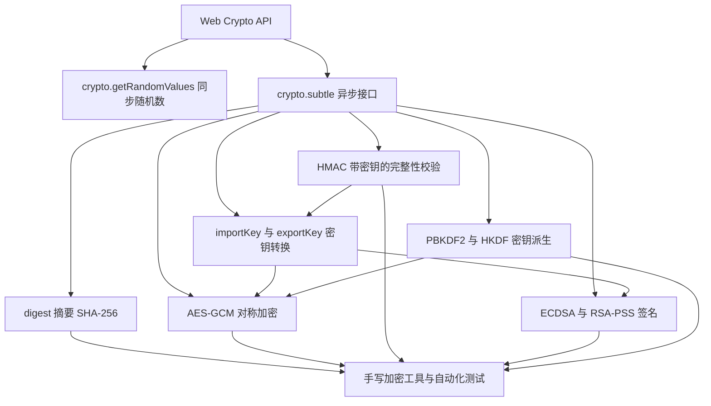
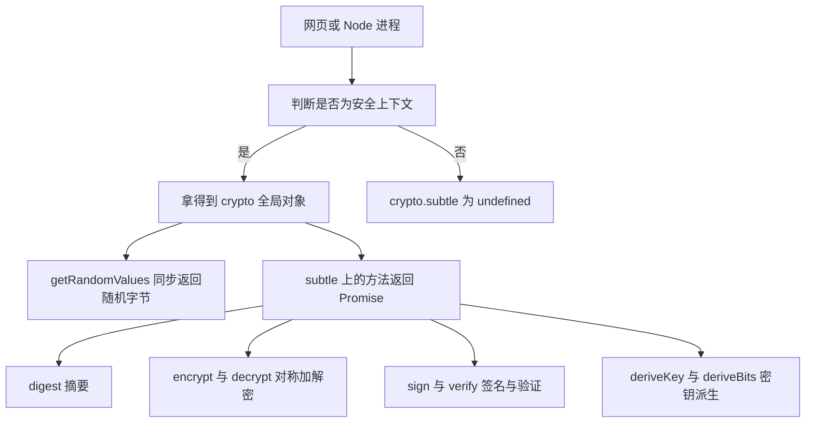
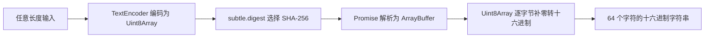
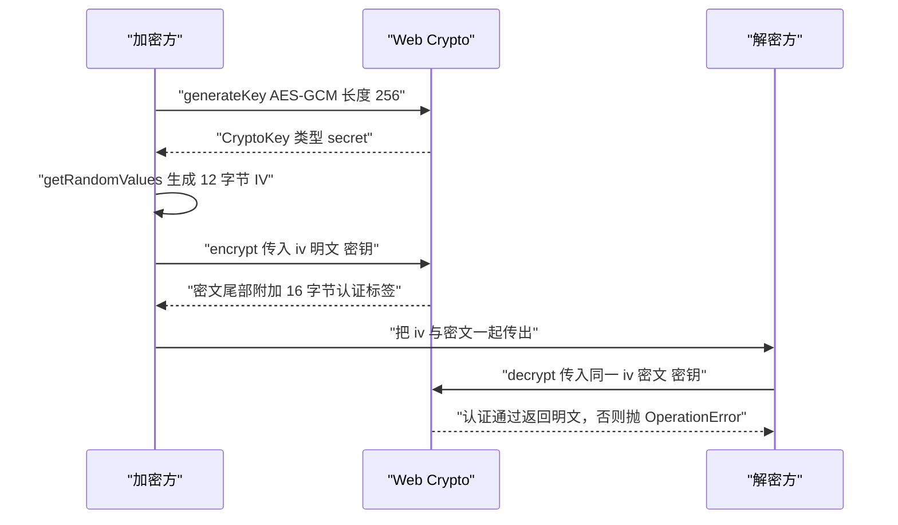
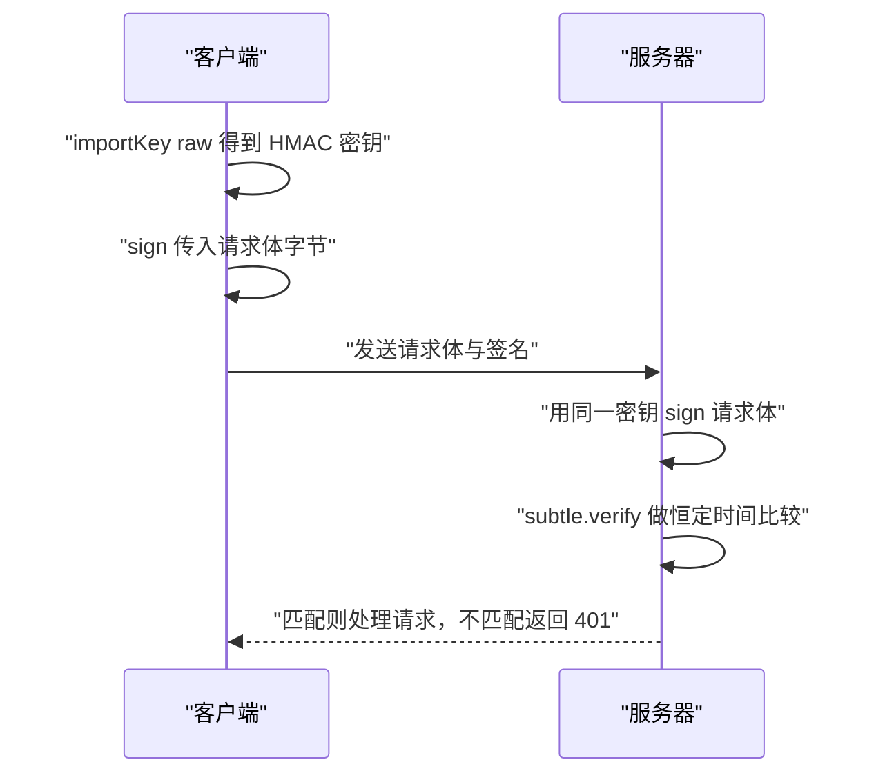
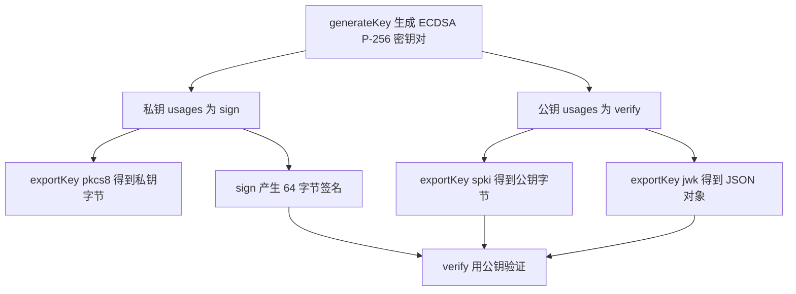
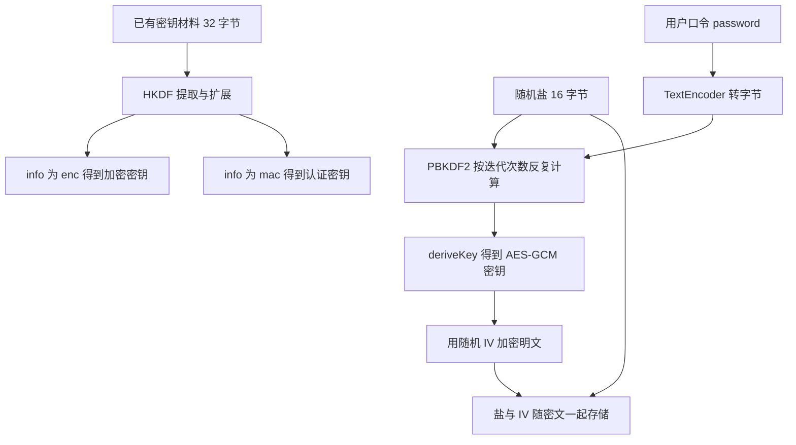
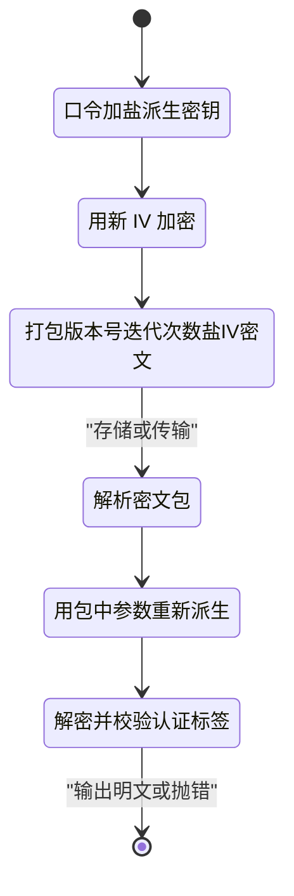

# Web Crypto API：浏览器里的密码学

!!! abstract "学完这一页你能"

    - 说出 `crypto.subtle` 的摘要、对称加密、签名、密钥派生四类方法各自解决什么问题。
    - 用 SHA-256 算出文本摘要并转成十六进制，与公开测试向量逐字符对比通过。
    - 用 AES-GCM 完成一次加密与解密，并解释初始化向量不能重复的原因。
    - 用 PBKDF2 从口令派生密钥、用 ECDSA 签名验证，并把公钥导出为 JWK 与 SPKI。

## 0. 知识地图



第 1 节讲入口与环境限制，之后每节讲一类方法，第 7 节把前面所有零件拼成一个可运行的工具。

如果只想做"口令加密一段文本"，按 1 → 3 → 6 → 7 的顺序读；要专攻签名，按 1 → 2 → 5 → 7 读。

## 1. 认识入口：crypto.subtle 与安全上下文

**先想一个问题**

你在做一个离线笔记网页，想在保存前给内容算一个校验值。自己写一个 MD5 函数行不行？

**心智模型**

!!! tip "心智模型"

    一句话模型：Web Crypto API 只提供密码学零件，不提供整套协议，怎么组合由你决定。
    日常类比：它像厨房里的刀和砧板，不提供做好的菜，也不告诉你该放多少盐。
    不成立处：刀用错了只是切得难看，这里的零件用错了不会报错，只会让保护悄悄失效。

**图解**



1. 先判断运行环境。浏览器只在 https 或 localhost 下把 `crypto.subtle` 暴露给你。
2. 环境通过后拿到 `crypto` 全局对象，它同时提供同步的随机数接口与异步的 `subtle`。
3. `getRandomValues` 是唯一的同步方法，直接写入你传入的数组。
4. 其余方法都返回 Promise，拿到的是 `ArrayBuffer` 而不是字符串。
5. 你要自己把 `ArrayBuffer` 转成十六进制、base64 或文本。

!!! note "术语：SubtleCrypto"

    定义：`crypto.subtle` 这个属性的类型名，提供 digest、encrypt、sign、deriveKey 等方法，全部返回 Promise。
    例子：`await crypto.subtle.digest('SHA-256', bytes)` 返回一个 32 字节的 `ArrayBuffer`。

**一步一步来**

第 1 步，做能力检测，避免后面报 `Cannot read properties of undefined`。

```js
// 1. 确认运行环境有 Web Crypto
const webcrypto = globalThis.crypto;
if (!webcrypto || !webcrypto.subtle) {
  throw new Error('当前环境没有 crypto.subtle，浏览器需 https 或 localhost');
}
```

**这段代码在做什么**

- `globalThis.crypto` 在浏览器和 Node 20+ 都指向同一个 Web Crypto 实现。
- 判断 `subtle` 是否存在，而不是判断 `crypto` 是否存在，因为旧环境里 `crypto` 有但 `subtle` 没有。
- 检测失败时直接抛错，比在后面某一行报类型错误容易定位。

第 2 步，生成随机字节。这一步是后面所有盐和初始化向量的来源。

```js
// 2. 同步生成 16 字节随机数
const iv = new Uint8Array(16);
webcrypto.getRandomValues(iv); // 用系统熵源填充，返回值就是传入的数组
console.log(iv.length, iv.some((b) => b !== 0)); // 16 true
```

**这段代码在做什么**

- `getRandomValues` 直接修改你传入的 `Uint8Array`，同时把它作为返回值。
- 它调用操作系统的密码学随机源，和 `Math.random` 不是同一套实现。
- 单次调用填充的数组上限是 65536 字节，超过会抛 `QuotaExceededError`。
- 数组里的全零概率极低，`some` 检查用来证明它确实写了内容。

运行结果：

```text
16 true
```

!!! note "术语：熵"

    定义：随机性中不可预测的程度，通常用比特数衡量。
    例子：16 字节完全随机数据包含 128 比特熵，暴力枚举要尝试 2 的 128 次方量级。

第 3 步，调用一个异步方法，观察返回值类型。

```js
// 3. 异步方法统一返回 Promise，必须 await 才能拿到 ArrayBuffer
const digest = await webcrypto.subtle.digest('SHA-256', new Uint8Array([1, 2, 3]));
console.log(digest.constructor.name, digest.byteLength); // ArrayBuffer 32
```

**这段代码在做什么**

- `subtle.digest` 的第一个参数是算法名，第二个参数是 `BufferSource`。
- 返回值是 `ArrayBuffer`，不能直接下标取值，要转成 `Uint8Array`。
- `SHA-256` 的输出长度固定为 32 字节，与输入长度无关。

运行结果：

```text
ArrayBuffer 32
```

**动手验证**

!!! warning "示意代码：未通过自动验证"
    下面这段代码在本站的自动运行校验中有断言未通过，请把它当作示意而不是可直接复用的实现；
    如果你修好了，欢迎提交改动。

```js
// 文件：env-check.mjs 依赖：无（Node 20+ 内置 Web Crypto）
import assert from 'node:assert/strict';

assert.ok(globalThis.crypto, 'Node 20+ 应内置全局 crypto');
const { subtle, getRandomValues } = globalThis.crypto;

assert.equal(typeof subtle.digest, 'function'); // 异步接口存在
assert.equal(typeof getRandomValues, 'function'); // 同步随机数存在

const a = new Uint8Array(32);
const b = new Uint8Array(32);
getRandomValues(a);
getRandomValues(b);
assert.equal(a.length, 32);
assert.notDeepEqual(a, b); // 两次随机结果不同

const digest = await subtle.digest('SHA-256', new Uint8Array([1, 2, 3]));
assert.equal(digest.byteLength, 32);

console.log('两次随机数不同：OK');
console.log('SHA-256 输出长度：', digest.byteLength);
```

预期输出：

```text
两次随机数不同：OK
SHA-256 输出长度： 32
```

**常见坑**

| 现象 | 原因 | 怎么修 |
|:---|:---|:---|
| `crypto.subtle` 是 undefined | 页面跑在 http 明文下，不属于安全上下文 | 用 https，或改成 `http://localhost` 打开 |
| 报 `Cannot read properties of undefined (reading digest)` | 旧环境有 `crypto` 但没有 `subtle` | 先做能力检测，再决定是否降级到服务端 |
| `getRandomValues` 抛 `QuotaExceededError` | 一次传入的数组超过 65536 字节 | 分块填充，每块不超过 65536 字节 |
| 把 `ArrayBuffer` 当数组用，输出 `undefined` | `ArrayBuffer` 没有下标访问 | 先 `new Uint8Array(buffer)` |

**小结**

1. Web Crypto 只在安全上下文提供 `crypto.subtle`，进不去就做能力检测再降级。
2. 随机数只有 `getRandomValues` 一个入口，它是同步的，其他方法都是异步的。
3. 所有方法交付 `ArrayBuffer`，编码转换由你负责。

## 2. 摘要：SHA-256 与 digest

**先想一个问题**

你把用户上传的 200MB 文件切成 1MB 一块，希望下载时能发现内容被改动。用什么算出每块的指纹？

**心智模型**

!!! tip "心智模型"

    一句话模型：摘要函数把任意长度输入压成固定长度输出，输入改一个字节，输出变得认不出来。
    日常类比：把整本书塞进碎纸机，出来的纸条总重量固定，但纹路只对应这一本书。
    不成立处：指纹能唯一标识一个人，而摘要在数学上允许碰撞，只是找出来需要 2 的 128 次方量级的尝试。

**图解**



1. 文本先经过 UTF-8 编码，中文一个字通常占 3 个字节。
2. `subtle.digest` 接收编码后的字节，不接收字符串。
3. 计算结果是 32 字节的 `ArrayBuffer`。
4. 每个字节用 `toString(16)` 转成两位十六进制，不足两位前面补 0。
5. 32 字节拼起来是 64 个字符，这就是常见的摘要展示形式。

**一步一步来**

第 1 步，把文本编码成字节。

```js
const encoder = new TextEncoder(); // UTF-8 编码器
const bytes = encoder.encode('abc'); // 字符串转 Uint8Array
console.log(bytes.length, bytes[0]); // 3 97
```

**这段代码在做什么**

- `TextEncoder` 只做 UTF-8 编码，不做任何压缩或摘要。
- 英文一个字符一个字节，`a` 的字节值是 97。
- 编码结果可以反复使用，解码用 `TextDecoder`。

第 2 步，调用 `digest` 得到 32 字节。

```js
const digest = await crypto.subtle.digest('SHA-256', bytes); // 返回 ArrayBuffer
console.log(digest.byteLength); // 32，与输入长度无关
```

**这段代码在做什么**

- 算法名用大写连字符写法，`'SHA-256'` 是标准名。
- 输出长度由算法决定，SHA-256 固定 32 字节。
- 同样的字节输入，任何平台算出的结果一致，这就是测试向量能通用的原因。

第 3 步，转成十六进制方便对比与展示。

```js
const toHex = (buffer) => Array.from(new Uint8Array(buffer))
  .map((b) => b.toString(16).padStart(2, '0')) // 每字节补成两位
  .join(''); // 拼成 64 个字符
console.log(toHex(digest)); // ba7816bf...0015ad
```

**这段代码在做什么**

- `Array.from(new Uint8Array(buffer))` 把二进制转成可遍历的数字数组。
- `padStart(2, '0')` 保证 `10` 不会写成 `1`，否则字节边界会错位。
- `join('')` 不带分隔符，输出长度固定为 64 个字符。

运行结果：

```text
ba7816bf8f01cfea414140de5dae2223b00361a396177a9cb410ff61f20015ad
```

!!! note "术语：十六进制编码"

    定义：把每个字节写成两个字符的编码方式，字符集只有 0-9 和 a-f。
    例子：字节 0x0A 写成 `0a`，字节 0xFF 写成 `ff`，32 字节最终写成 64 个字符。

**动手验证**

```js
// 文件：sha256.mjs 依赖：无
import assert from 'node:assert/strict';

const toHex = (buffer) => Array.from(new Uint8Array(buffer))
  .map((b) => b.toString(16).padStart(2, '0'))
  .join('');

async function sha256Hex(text) {
  const bytes = new TextEncoder().encode(text);
  const digest = await globalThis.crypto.subtle.digest('SHA-256', bytes);
  return toHex(digest);
}

assert.equal(
  await sha256Hex('abc'),
  'ba7816bf8f01cfea414140de5dae2223b00361a396177a9cb410ff61f20015ad',
);
assert.equal(
  await sha256Hex(''),
  'e3b0c44298fc1c149afbf4c8996fb92427ae41e4649b934ca495991b7852b855',
);
assert.equal((await sha256Hex('abc')).length, 64); // 32 字节写成 64 个字符
assert.notEqual(await sha256Hex('abc'), await sha256Hex('abd')); // 一字之差结果全变

console.log('空串与 abc 的已知向量：OK');
console.log('abc 的摘要：', await sha256Hex('abc'));
```

预期输出：

```text
空串与 abc 的已知向量：OK
abc 的摘要： ba7816bf8f01cfea414140de5dae2223b00361a396177a9cb410ff61f20015ad
```

**常见坑**

| 现象 | 原因 | 怎么修 |
|:---|:---|:---|
| 打印摘要得到 `ArrayBuffer {}` | `ArrayBuffer` 的属性不可枚举 | 先转 `Uint8Array` 或十六进制字符串 |
| 用 SHA-256 存用户口令 | 摘要计算速度快，单机每秒可尝试上亿次 | 口令走 PBKDF2 或 Argon2 这类慢函数 |
| 把十六进制字符串再丢进 `digest` | 输入变成 64 个字符的文本而不是 32 字节 | 先写 `hexToBytes` 还原成字节 |
| 把摘要当加密用 | 摘要不可逆，无法还原原文 | 需要还原就换 AES-GCM |

**小结**

1. 摘要输入是字节，输出是固定长度 `ArrayBuffer`，转换与展示都要自己写。
2. 十六进制转换时必须补齐两位，否则拼接后字节边界错位。
3. 摘要保证完整性，不保证保密性，也不能替代口令存储方案。

## 3. 对称加密：AES-GCM

**先想一个问题**

你要把笔记存进 localStorage，希望别人拿到这段 JSON 也读不出内容，你会用哪种模式？

**心智模型**

!!! tip "心智模型"

    一句话模型：一把密钥同时负责加密和解密，GCM 模式还会附一个标签检查数据是否被改过。
    日常类比：带一次性检验封条的保险箱，开箱前先看封条是否完好。
    不成立处：保险箱只保护内容，不保护谁握着钥匙，密钥泄漏后封条完好也没意义。

**图解**



1. 加密方先生成密钥，密钥类型是 `secret`，不是公钥私钥对。
2. 每次加密前用随机数生成 12 字节初始化向量，与密文一起保存。
3. `encrypt` 把明文和一个 16 字节认证标签一起产出，标签拼在密文尾部。
4. IV 不保密，可以明文随密文一起传，但同一密钥下不能重复。
5. 解密方用同一密钥和同一 IV 调用 `decrypt`，标签校验失败就抛错。

!!! note "术语：初始化向量（IV）"

    定义：让同一密钥在每次加密时产生不同结果的公开随机参数。
    例子：AES-GCM 的 IV 推荐 12 字节，同一个密钥重复使用同一个 IV 会泄漏密钥流。

!!! note "术语：AEAD"

    定义：认证加密与关联数据，指加密同时附带完整性校验的模式。
    例子：AES-GCM 是 AEAD，AES-CBC 不是，CBC 的密文被改动时解密不报错。

**一步一步来**

第 1 步，生成一把不可导出的 AES-GCM 密钥。

```js
const key = await crypto.subtle.generateKey(
  { name: 'AES-GCM', length: 256 }, // 算法与密钥长度
  false, // extractable 设为 false，密钥出不了这台设备
  ['encrypt', 'decrypt'], // 允许的用途
);
console.log(key.type, key.algorithm.name, key.usages); // secret AES-GCM [encrypt, decrypt]
```

**这段代码在做什么**

- 第一个参数描述算法，`length` 取 128、192、256 之一。
- 第二个参数决定密钥能否被 `exportKey` 导出，生产环境加密数据用 `false`。
- 第三个参数是白名单，没列进来的操作调用时会抛错。
- 返回值直接是 `CryptoKey`，不是密钥对。

第 2 步，用新 IV 加密。

```js
const iv = crypto.getRandomValues(new Uint8Array(12)); // GCM 推荐 12 字节
const plaintext = new TextEncoder().encode('保密笔记 secret note');
const ciphertext = await crypto.subtle.encrypt(
  { name: 'AES-GCM', iv }, // 每次调用都要带参数
  key,
  plaintext,
);
console.log(ciphertext.byteLength, plaintext.byteLength); // 32 16
```

**这段代码在做什么**

- IV 每次加密都要重新生成，绝不能写在配置里复用。
- 密文长度等于明文长度加 16 字节认证标签，上面例子是 16 + 16 = 32。
- 参数对象里的 `iv` 必须和解密时完全一致，长度也要一致。

运行结果：

```text
32 16
```

第 3 步，用同一 IV 解密。

```js
const decrypted = await crypto.subtle.decrypt({ name: 'AES-GCM', iv }, key, ciphertext);
console.log(new TextDecoder().decode(decrypted)); // 保密笔记 secret note
```

**这段代码在做什么**

- 解密参数只有 `iv`，算法名要与加密时一致。
- 认证标签校验失败会抛 `OperationError`，而不是返回错误的明文。
- `TextDecoder` 默认按 UTF-8 解码，与 `TextEncoder` 对称。

运行结果：

```text
保密笔记 secret note
```

**动手验证**

```js
// 文件：aes-gcm.mjs 依赖：无（Node 20+）
import assert from 'node:assert/strict';

const { subtle, getRandomValues } = globalThis.crypto;

const key = await subtle.generateKey({ name: 'AES-GCM', length: 256 }, false, ['encrypt', 'decrypt']);
const iv = getRandomValues(new Uint8Array(12));
const plaintext = new TextEncoder().encode('保密笔记 secret note');

const ciphertext = await subtle.encrypt({ name: 'AES-GCM', iv }, key, plaintext);
assert.equal(ciphertext.byteLength, plaintext.byteLength + 16); // 多出 16 字节标签
assert.notDeepEqual(new Uint8Array(ciphertext).slice(0, plaintext.byteLength), plaintext);

const decrypted = await subtle.decrypt({ name: 'AES-GCM', iv }, key, ciphertext);
assert.equal(new TextDecoder().decode(decrypted), '保密笔记 secret note');

const tampered = new Uint8Array(ciphertext);
tampered[0] ^= 0x01; // 只翻转密文第一个字节
const isOperationError = (err) => err.name === 'OperationError';
await assert.rejects(() => subtle.decrypt({ name: 'AES-GCM', iv }, key, tampered), isOperationError);

console.log('密文长度：', ciphertext.byteLength, '明文长度：', plaintext.byteLength);
console.log('加密解密往返：OK');
console.log('篡改 1 字节后解密被拒绝：OK');
```

预期输出：

```text
密文长度： 32 明文长度： 16
加密解密往返：OK
篡改 1 字节后解密被拒绝：OK
```

**常见坑**

| 现象 | 原因 | 怎么修 |
|:---|:---|:---|
| 同一密钥重复使用同一 IV | 计数器流重复，两次密文异或后可消掉明文，并泄漏认证密钥 | 每次加密都 `getRandomValues(new Uint8Array(12))`，IV 与密文一起存 |
| 解密抛 `OperationError` | 密文被改、IV 不一致、密钥不一致三种可能 | 逐项核对，不要吞掉错误后用空字符串兜底 |
| 把 IV 当密钥保密 | IV 只要求唯一，不要求保密 | IV 可以明文存在密文前面 |
| 用 AES-CBC 且不校验完整性 | CBC 不是 AEAD，密文被改解密照样成功 | 在 Web Crypto 里选 AES-GCM |

**小结**

1. `generateKey` 的 `extractable` 在加密数据场景设为 `false`。
2. 每次加密都要新 IV，IV 随密文存储但不能复用。
3. GCM 的认证标签让篡改立刻暴露，错误以 `OperationError` 抛出。

## 4. 消息认证：HMAC

**先想一个问题**

你要给第三方接口发请求，双方共享一串密钥。怎么让服务端确认请求是你发的，而且请求体没被改？

**心智模型**

!!! tip "心智模型"

    一句话模型：HMAC 用密钥和摘要函数算出一个带钥匙的指纹，没有密钥算不出来。
    日常类比：信封口的火漆印，印章图案公开，印模只有你和对方各有一个。
    不成立处：火漆印能看出信封被拆过，HMAC 只会告诉你匹配或不匹配，不告诉你哪一段被改。

**图解**



1. 客户端把共享密钥按 `raw` 格式导入，用途限定为 `sign` 与 `verify`。
2. 请求体要先编码成字节，`sign` 的输入是字节不是对象。
3. 签名是 32 字节，转成十六进制或 base64 后放进请求头。
4. 服务端用同一密钥对收到的原始字节重新计算签名。
5. 比较用 `subtle.verify`，它内部按恒定时间比较，不泄漏匹配前缀长度。

!!! note "术语：HMAC"

    定义：Hash-based Message Authentication Code，基于哈希的消息认证码。
    例子：`HMAC-SHA-256` 表示用 SHA-256 做底层压缩函数，输出 32 字节。

!!! note "术语：恒定时间比较"

    定义：比较耗时不随"前多少个字节相同"变化，攻击者无法通过计时推测前缀。
    例子：`subtle.verify` 是恒定时间比较，`a === b` 不是。

**一步一步来**

第 1 步，把共享密钥导入成 `CryptoKey`。

```js
const secret = new TextEncoder().encode('shared-secret-key'); // 双方约定同一串字节
const hmacKey = await crypto.subtle.importKey(
  'raw', // 输入格式是原始字节
  secret,
  { name: 'HMAC', hash: 'SHA-256' }, // 算法与底层摘要
  false, // 不允许再导出
  ['sign', 'verify'], // 只允许签名与验证
);
```

**这段代码在做什么**

- `importKey` 把普通字节升级成受用途限制的 `CryptoKey`。
- 算法对象里 `hash` 必须写，同一个 HMAC 可以配不同摘要。
- `extractable` 设为 `false` 后，这把密钥无法被 `exportKey` 取出。
- 用途里没有写 `encrypt`，拿它调 `encrypt` 会直接抛错。

第 2 步，生成签名。

```js
const body = new TextEncoder().encode('amount=100&to=alice');
const signature = await crypto.subtle.sign('HMAC', hmacKey, body);
console.log(signature.byteLength); // 32，等于 SHA-256 输出长度
```

**这段代码在做什么**

- `sign` 的第一个参数可以只写算法名字符串。
- 签名长度由摘要决定，与请求体长度无关。
- 服务端必须对收到的原始字节重算，任何空格或字段顺序变化都会导致失败。

第 3 步，验证签名。

```js
const ok = await crypto.subtle.verify('HMAC', hmacKey, signature, body);
console.log(ok); // true
const changed = new TextEncoder().encode('amount=999&to=alice');
console.log(await crypto.subtle.verify('HMAC', hmacKey, signature, changed)); // false
```

**这段代码在做什么**

- `verify` 返回布尔值，不抛错表示"签名格式合法"，返回值才表示匹配与否。
- 第三个参数是签名，第四个参数是被签名的数据，顺序不能反。
- 内容改动一个字符，验证结果就变成 `false`。

运行结果：

```text
32
true
false
```

**动手验证**

```js
// 文件：hmac.mjs 依赖：无（Node 20+）
import assert from 'node:assert/strict';
const { subtle } = globalThis.crypto;

const secret = new TextEncoder().encode('shared-secret-key');
const key = await subtle.importKey('raw', secret, { name: 'HMAC', hash: 'SHA-256' }, false, ['sign', 'verify']);

const body = new TextEncoder().encode('amount=100&to=alice');
const sig = await subtle.sign('HMAC', key, body);
assert.equal(sig.byteLength, 32);

assert.equal(await subtle.verify('HMAC', key, sig, body), true);
assert.equal(await subtle.verify('HMAC', key, sig, new TextEncoder().encode('amount=999&to=alice')), false);

// 换一把密钥，旧签名验证失败
const otherKey = await subtle.importKey('raw', new TextEncoder().encode('other-secret'), { name: 'HMAC', hash: 'SHA-256' }, false, ['verify']);
assert.equal(await subtle.verify('HMAC', otherKey, sig, body), false);

// 加密用途没有被授权
assert.deepEqual(key.usages, ['sign', 'verify']);

console.log('签名长度：', sig.byteLength);
console.log('正确内容验证通过：OK');
console.log('改动内容与更换密钥均失败：OK');
```

预期输出：

```text
签名长度： 32
正确内容验证通过：OK
改动内容与更换密钥均失败：OK
```

**常见坑**

| 现象 | 原因 | 怎么修 |
|:---|:---|:---|
| 服务端偶尔验证成功偶尔失败 | 客户端签名的是对象序列化结果，服务端按原始字节重算，两边字节不同 | 两端约定同一份字节，签名前先编码成 `Uint8Array` |
| 用 `===` 比较两个签名 | 字符串或数组比较在第一个不同字节就返回，耗时泄漏匹配前缀 | 用 `subtle.verify`，服务端语言用对应的恒定时间函数 |
| 把 HMAC 当加密用 | HMAC 不可逆，签名与原文都能公开 | 需要保密用 AES-GCM，HMAC 只管完整性 |
| 密钥直接写在代码里 | 前端代码可被下载，密钥等于公开 | 前端不持有长期密钥，改用短期令牌或服务端签名 |

**小结**

1. HMAC 用一把共享密钥同时保证完整性与来源可信。
2. 签名输入是字节，两边必须以同一份字节计算。
3. 比较签名只用 `subtle.verify`，不要手写循环比较。

## 5. 非对称：ECDSA 与 RSA-PSS 签名

**先想一个问题**

你要分发一个离线安装包，用户需要确认包确实由你发布，而且只有你能签。怎么设计？

**心智模型**

!!! tip "心智模型"

    一句话模型：生成一对数学上关联的密钥，私钥签名，公钥验证，公钥可以随便发。
    日常类比：一枚只有你有的印章，加一份公开的印模对照表供所有人核验。
    不成立处：密钥对泄漏后旧签名依然验证通过，只能靠吊销名单处理，印章本身没有失效机制。

**图解**



1. `generateKey` 一次返回 `privateKey` 与 `publicKey` 两个对象。
2. 私钥用途是 `sign`，公钥用途是 `verify`，用途写反了调用会抛错。
3. 私钥用 `pkcs8` 格式导出，用于备份，必须加密保管。
4. 公钥用 `spki` 二进制格式或 `jwk` JSON 格式导出，随包分发。
5. 验证方拿公钥和签名，`verify` 返回布尔值，返回 `true` 才说明签名有效。

!!! note "术语：JWK"

    定义：JSON Web Key，把密钥的数学参数写成 JSON 对象的标准格式。
    例子：P-256 公钥的 JWK 含 `kty` 为 `EC`、`crv` 为 `P-256`、`x` 与 `y` 两个坐标。

!!! note "术语：SPKI 与 PKCS8"

    定义：SPKI 是公钥的二进制封装格式，PKCS8 是私钥的二进制封装格式。
    例子：`exportKey('spki', publicKey)` 得到公钥字节，`exportKey('pkcs8', privateKey)` 得到私钥字节。

**一步一步来**

第 1 步，生成 ECDSA P-256 密钥对。

```js
const keyPair = await crypto.subtle.generateKey(
  { name: 'ECDSA', namedCurve: 'P-256' }, // 曲线参数
  true, // 需要导出就设为 true
  ['sign', 'verify'], // 私钥与公钥共用这份用途表
);
console.log(keyPair.privateKey.type, keyPair.publicKey.type); // private public
```

**这段代码在做什么**

- `namedCurve` 指定曲线，P-256 的签名输出固定 64 字节。
- `extractable` 设为 `true` 才能导出密钥，设为 `false` 时 `exportKey` 会抛 `InvalidAccessError`。
- 用途表同时约束两个密钥，实际生效的用途按密钥类型自动切分。

第 2 步，签名与验证。

```js
const data = new TextEncoder().encode('release-1.0.0');
const signature = await crypto.subtle.sign(
  { name: 'ECDSA', hash: 'SHA-256' }, // 先摘要再签名
  keyPair.privateKey,
  data,
);
console.log(signature.byteLength); // 64，r 与 s 各 32 字节
const ok = await crypto.subtle.verify({ name: 'ECDSA', hash: 'SHA-256' }, keyPair.publicKey, signature, data);
console.log(ok); // true
```

**这段代码在做什么**

- `sign` 内部先对数据做 SHA-256，再对摘要做椭圆曲线运算。
- 签名是 r 与 s 两个大整数按 IEEE P1363 格式拼接，不是 DER 编码。
- 验证方必须传入同样的 `hash` 参数，否则一定失败。

运行结果：

```text
64
true
```

第 3 步，导出公钥再导入，验证同一份签名。

```js
const spki = await crypto.subtle.exportKey('spki', keyPair.publicKey); // 公钥字节
const jwk = await crypto.subtle.exportKey('jwk', keyPair.publicKey); // JSON 对象
console.log(jwk.kty, jwk.crv, typeof jwk.x); // EC P-256 string

const imported = await crypto.subtle.importKey('spki', spki, { name: 'ECDSA', namedCurve: 'P-256' }, true, ['verify']);
console.log(await crypto.subtle.verify({ name: 'ECDSA', hash: 'SHA-256' }, imported, signature, data)); // true
```

**这段代码在做什么**

- `exportKey` 返回 `ArrayBuffer` 或普通对象，取决于格式参数。
- 导入时必须重复声明算法与曲线，导入方不做推断。
- 导入后的公钥用途写成 `['verify']`，用它调 `sign` 会抛错。
- 导入的密钥能验证导出前的签名，说明序列化没有丢信息。

运行结果：

```text
EC P-256 string
true
```

**动手验证**

```js
// 文件：sign.mjs 依赖：无（Node 20+）
import assert from 'node:assert/strict';
const { subtle } = globalThis.crypto;

// 1) ECDSA P-256
const ec = await subtle.generateKey({ name: 'ECDSA', namedCurve: 'P-256' }, true, ['sign', 'verify']);
const data = new TextEncoder().encode('release-1.0.0');
const ecSig = await subtle.sign({ name: 'ECDSA', hash: 'SHA-256' }, ec.privateKey, data);
assert.equal(ecSig.byteLength, 64); // r 与 s 各 32 字节
assert.equal(await subtle.verify({ name: 'ECDSA', hash: 'SHA-256' }, ec.publicKey, ecSig, data), true);
assert.equal(
  await subtle.verify({ name: 'ECDSA', hash: 'SHA-256' }, ec.publicKey, ecSig, new TextEncoder().encode('release-1.0.1')),
  false,
);

// 2) 导出并重新导入公钥
const jwk = await subtle.exportKey('jwk', ec.publicKey);
assert.equal(jwk.kty, 'EC');
assert.equal(jwk.crv, 'P-256');
const spki = await subtle.exportKey('spki', ec.publicKey);
const pub = await subtle.importKey('spki', spki, { name: 'ECDSA', namedCurve: 'P-256' }, true, ['verify']);
assert.equal(await subtle.verify({ name: 'ECDSA', hash: 'SHA-256' }, pub, ecSig, data), true);

// 3) RSA-PSS 2048
const rsa = await subtle.generateKey(
  { name: 'RSA-PSS', modulusLength: 2048, publicExponent: new Uint8Array([1, 0, 1]), hash: 'SHA-256' },
  true,
  ['sign', 'verify'],
);
const rsaSig = await subtle.sign({ name: 'RSA-PSS', saltLength: 32 }, rsa.privateKey, data);
assert.equal(rsaSig.byteLength, 256); // 2048 位模数对应 256 字节
assert.equal(await subtle.verify({ name: 'RSA-PSS', saltLength: 32 }, rsa.publicKey, rsaSig, data), true);

console.log('ECDSA 签名长度：', ecSig.byteLength);
console.log('EC 公钥 JWK 字段：', jwk.kty, jwk.crv);
console.log('RSA-PSS 签名长度：', rsaSig.byteLength);
console.log('全部断言通过：OK');
```

预期输出：

```text
ECDSA 签名长度： 64
EC 公钥 JWK 字段： EC P-256
RSA-PSS 签名长度： 256
全部断言通过：OK
```

**常见坑**

| 现象 | 原因 | 怎么修 |
|:---|:---|:---|
| `exportKey` 抛 `InvalidAccessError` | 生成密钥时 `extractable` 写成 `false` | 需要导出就在 `generateKey` 传 `true` |
| 别的语言库验不过 Web Crypto 的 ECDSA 签名 | Web Crypto 输出 r 与 s 原始拼接，不是 DER 编码 | 接收端按 IEEE P1363 解析，或先转成 DER |
| 签名用 RSA-PSS，验证端用 RSASSA-PKCS1-v1_5 | 两种填充方案的算法名不同 | 两端统一 `RSA-PSS` 并统一 `saltLength` |
| `sign` 的第三个参数传字符串 | 接口要求 `BufferSource` | 先 `new TextEncoder().encode(text)` |
| 把私钥 `pkcs8` 字节提交进代码仓库 | 私钥等同于身份，提交即泄漏 | 私钥只放在服务端密钥库，仓库里只放公钥 |

**小结**

1. 私钥 `sign`、公钥 `verify`，用途写反会直接抛错。
2. 公钥可用 `spki` 或 `jwk` 分发，私钥用 `pkcs8` 导出后加密保管。
3. ECDSA 的签名编码格式是跨语言对接时最容易踩的差异点。

## 6. 密钥派生：PBKDF2 与 HKDF

**先想一个问题**

用户只给你一个 8 位口令，你想用它加密一段笔记。口令不能直接当 AES 密钥，怎么变成 256 位？

**心智模型**

!!! tip "心智模型"

    一句话模型：派生函数把低熵输入放大成定长密钥，并用盐保证同样口令在不同用户处得到不同密钥。
    日常类比：把一句好记的口令送进一台慢速榨汁机，反复榨十万遍才得到一杯浓缩汁。
    不成立处：榨汁机只出一杯，派生函数可以按 `info` 或 `salt` 输出多把互不相同的密钥。

**图解**



1. 口令先按 UTF-8 编码成字节，再导入成 PBKDF2 基础密钥。
2. 盐是随机字节，与口令一起参与迭代运算。
3. `deriveKey` 直接生成目标算法的密钥，本例目标是 AES-GCM 256。
4. 盐、IV、迭代次数必须和密文一起存储，否则无法重建密钥。
5. HKDF 处理的是已经随机的高熵输入，用 `info` 区分不同用途，不做慢速迭代。

!!! note "术语：密钥派生函数（KDF）"

    定义：Key Derivation Function，把一份输入密钥材料转换成一把或多把定长密钥的函数。
    例子：`PBKDF2` 与 `HKDF` 都是 KDF，前者面向口令，后者面向已有密钥材料。

!!! note "术语：盐"

    定义：与输入一起参与派生的公开随机值，保证相同输入得到不同输出。
    例子：16 字节随机盐让两个用户用同一口令 `hunter2` 也得到不同密钥，彩虹表失效。

**一步一步来**

第 1 步，把口令导入成基础密钥。

```js
const password = 'correct horse battery staple'; // 用户输入的口令
const baseKey = await crypto.subtle.importKey(
  'raw',
  new TextEncoder().encode(password),
  'PBKDF2', // 导入后只用于派生
  false, // 基础密钥不允许导出
  ['deriveKey', 'deriveBits'],
);
```

**这段代码在做什么**

- 口令字符串必须先编码成字节，`importKey` 不接收字符串。
- 算法参数写成字符串 `'PBKDF2'`，因为摘要与迭代次数在派生阶段才给出。
- `extractable` 设为 `false`，避免基础密钥被导出后绕过迭代成本。
- 用途必须包含 `deriveKey`，否则调用派生时抛错。

第 2 步，用随机盐做慢速派生，直接得到 AES 密钥。

```js
const salt = crypto.getRandomValues(new Uint8Array(16)); // 每个用户一份随机盐
const aesKey = await crypto.subtle.deriveKey(
  { name: 'PBKDF2', salt, iterations: 100000, hash: 'SHA-256' },
  baseKey,
  { name: 'AES-GCM', length: 256 }, // 目标是 AES-GCM 密钥
  false, // 派生结果不允许导出
  ['encrypt', 'decrypt'],
);
console.log(aesKey.algorithm.name, aesKey.usages); // AES-GCM [encrypt, decrypt]
```

**这段代码在做什么**

- `iterations` 决定计算耗时，数值越大攻击者单次尝试成本越高。
- 每个用户单独一份盐，盐随密文存储，不需要保密。
- 第三个参数声明目标算法，Web Crypto 会校验目标密钥长度与算法匹配。
- 派生结果用途是加解密，不能拿它做签名。

运行结果：

```text
AES-GCM [encrypt, decrypt]
```

第 3 步，用 HKDF 从已有密钥材料派生多把密钥。

```js
const ikm = await crypto.subtle.importKey('raw', crypto.getRandomValues(new Uint8Array(32)), 'HKDF', false, ['deriveBits']);
const base = { name: 'HKDF', hash: 'SHA-256', salt: new Uint8Array(0) };
const encBits = await crypto.subtle.deriveBits({ ...base, info: new TextEncoder().encode('enc') }, ikm, 256);
const macBits = await crypto.subtle.deriveBits({ ...base, info: new TextEncoder().encode('mac') }, ikm, 256);
console.log(encBits.byteLength, macBits.byteLength); // 32 32
```

**这段代码在做什么**

- HKDF 要求 `salt` 与 `info` 都存在，`salt` 允许传空数组。
- `info` 是用途标签，同一份输入配不同 `info` 得到不同输出。
- 第三个参数是需要的比特数，必须是 8 的倍数。
- HKDF 不做迭代，它假设输入已经有足够熵。

运行结果：

```text
32 32
```

**动手验证**

```js
// 文件：kdf.mjs 依赖：无（Node 20+，若报 NotSupportedError 见下方提示）
import assert from 'node:assert/strict';
const { subtle, getRandomValues } = globalThis.crypto;

async function makeAesKey(password, salt, iterations) {
  const base = await subtle.importKey('raw', new TextEncoder().encode(password), 'PBKDF2', false, ['deriveKey']);
  return subtle.deriveKey(
    { name: 'PBKDF2', salt, iterations, hash: 'SHA-256' },
    base,
    { name: 'AES-GCM', length: 256 },
    false,
    ['encrypt', 'decrypt'],
  );
}

const salt = getRandomValues(new Uint8Array(16));
const iv = getRandomValues(new Uint8Array(12));
const good = await makeAesKey('hunter2', salt, 100000);
const bad = await makeAesKey('hunter3', salt, 100000);

const ct = await subtle.encrypt({ name: 'AES-GCM', iv }, good, new TextEncoder().encode('机密'));
assert.equal(new TextDecoder().decode(await subtle.decrypt({ name: 'AES-GCM', iv }, good, ct)), '机密');
const isOperationError = (err) => err.name === 'OperationError';
await assert.rejects(() => subtle.decrypt({ name: 'AES-GCM', iv }, bad, ct), isOperationError);

const salt2 = getRandomValues(new Uint8Array(16));
const key2 = await makeAesKey('hunter2', salt2, 100000);
await assert.rejects(() => subtle.decrypt({ name: 'AES-GCM', iv }, key2, ct), isOperationError);

console.log('PBKDF2 派生后加解密：OK');
console.log('错误口令被拒绝：OK');
console.log('不同盐得到不同密钥：OK');

try {
  const ikm = await subtle.importKey('raw', getRandomValues(new Uint8Array(32)), 'HKDF', false, ['deriveBits']);
  const base = { name: 'HKDF', hash: 'SHA-256', salt: new Uint8Array(0) };
  const a = await subtle.deriveBits({ ...base, info: new TextEncoder().encode('enc') }, ikm, 256);
  const b = await subtle.deriveBits({ ...base, info: new TextEncoder().encode('mac') }, ikm, 256);
  assert.equal(a.byteLength, 32);
  assert.notDeepEqual(new Uint8Array(a), new Uint8Array(b)); // info 不同结果不同
  console.log('HKDF 按 info 派生两把密钥：OK');
} catch (err) {
  console.log('当前运行时未支持 HKDF，错误名：', err.name);
  console.log('需核对官方文档：Node.js Web Crypto 支持算法列表');
}
```

预期输出：

```text
PBKDF2 派生后加解密：OK
错误口令被拒绝：OK
不同盐得到不同密钥：OK
HKDF 按 info 派生两把密钥：OK
```

**常见坑**

| 现象 | 原因 | 怎么修 |
|:---|:---|:---|
| 两个用户同口令解出同一密钥 | 盐写成了常量 | 每次加密或注册都 `getRandomValues(new Uint8Array(16))` 并存储盐 |
| 派生耗时几乎为零 | `iterations` 写成 1000 这个量级 | 按官方推荐值上调，需核对官方文档：OWASP 密码存储备忘单当前推荐迭代次数 |
| HKDF 派生出的两把密钥相同 | `info` 都传了空数组 | 每个用途给唯一 `info`，例如 `enc` 与 `mac` |
| 换台机器解不开 | 盐或迭代次数没有和密文一起存 | 把版本号、迭代次数、盐、IV 一起打包存储 |
| HKDF 抛 `NotSupportedError` | 运行时版本未实现该算法 | 需核对官方文档：Node.js 与浏览器对 HKDF 的支持情况 |

**小结**

1. 口令走 PBKDF2，必须配随机盐和足够大的迭代次数。
2. 已有高熵密钥材料走 HKDF，用 `info` 区分用途。
3. 盐、IV、迭代次数都要随密文存储，缺一项就解不开。

## 7. 常见误用与手写加密工具

**先想一个问题**

现在要写一个 `encryptText(text, password)`，密文要能安全存进数据库。你会把哪些东西一起存下来？

**心智模型**

!!! tip "心智模型"

    一句话模型：一个能解开的密文包含四部分，版本号、迭代次数、盐、IV，加上密文本身。
    日常类比：上锁的旅行箱外侧标签必须写清怎么配钥匙，但绝不写钥匙本身。
    不成立处：标签被改你立刻打不开箱子就会发现；而 IV 复用这类参数错误在功能测试里照样加解密成功，你发现不了。

**图解**



1. 加密路径从口令开始，先加盐派生，再用新 IV 加密。
2. 加密完成后把版本号、迭代次数、盐、IV、密文按固定顺序拼成一个字节串。
3. 字节串转 base64 后存进数据库，字段类型用文本即可。
4. 解密路径先解析出各段，用包里的盐与迭代次数重新派生密钥。
5. 最后解密并校验认证标签，失败就抛错，绝不返回半截明文。

!!! note "术语：编码与加密的区别"

    定义：编码是可逆的表示转换，不需要密钥；加密是可逆的内容隐藏，需要密钥。
    例子：base64 是编码，任何人拿到都能解码；AES-GCM 是加密，没有密钥解不开。

**一步一步来**

第 1 步，约定二进制布局。

```js
const VERSION = 1;
const ITERATIONS = 100000;
const SALT_BYTES = 16;
const IV_BYTES = 12;
const HEAD_BYTES = 1 + 4 + SALT_BYTES + IV_BYTES; // 33
```

**这段代码在做什么**

- 版本号占 1 字节，未来换算法时可以按版本分派。
- 迭代次数占 4 字节，用 `DataView.setUint32` 写入，大端序读写对称。
- 盐 16 字节，IV 12 字节，两者长度固定，后续切片位置才能算出来。
- 头部长度固定 33 字节，密文从第 33 字节开始。

第 2 步，从口令派生密钥。

```js
async function deriveKey(password, salt, iterations) {
  const base = await crypto.subtle.importKey(
    'raw', new TextEncoder().encode(password), 'PBKDF2', false, ['deriveKey'],
  );
  return crypto.subtle.deriveKey( // 直接生成 AES-GCM 密钥
    { name: 'PBKDF2', salt, iterations, hash: 'SHA-256' },
    base,
    { name: 'AES-GCM', length: 256 },
    false,
    ['encrypt', 'decrypt'],
  );
}
```

**这段代码在做什么**

- 函数把"口令加盐得到 AES 密钥"这个动作收在一处，加密与解密共用。
- `iterations` 作为参数传入，解密时用密文包里存的值。
- 派生结果不可导出，减少密钥在内存之外出现的机会。
- 返回的是 Promise，调用处要 `await`。

第 3 步，加密并打包。

```js
async function encryptText(text, password) {
  const salt = crypto.getRandomValues(new Uint8Array(SALT_BYTES)); // 每次新盐
  const iv = crypto.getRandomValues(new Uint8Array(IV_BYTES)); // 每次新 IV
  const key = await deriveKey(password, salt, ITERATIONS);
  const ct = await crypto.subtle.encrypt({ name: 'AES-GCM', iv }, key, new TextEncoder().encode(text));
  const out = new Uint8Array(HEAD_BYTES + ct.byteLength);
  const view = new DataView(out.buffer);
  view.setUint8(0, VERSION); // 第 0 字节写版本号
  view.setUint32(1, ITERATIONS); // 第 1 到第 4 字节写迭代次数
  out.set(salt, 5); // 第 5 到第 20 字节写盐
  out.set(iv, 5 + SALT_BYTES); // 第 21 到第 32 字节写 IV
  out.set(new Uint8Array(ct), HEAD_BYTES); // 第 33 字节起写密文
  return Buffer.from(out).toString('base64'); // 转文本便于入库
}
```

**这段代码在做什么**

- 盐与 IV 在函数内部生成，调用方无法传入固定值，从源头避免复用。
- 头部与密文写在同一个 `Uint8Array` 里，一次转换完成。
- 写入位置与第 1 步的布局严格对应，错一字节就会解密失败。
- base64 只是为了适配文本字段，不提供任何保密性。

第 4 步，解密并校验。

```js
async function decryptText(payload, password) {
  const raw = new Uint8Array(Buffer.from(payload, 'base64'));
  const view = new DataView(raw.buffer, raw.byteOffset, raw.byteLength);
  if (view.getUint8(0) !== VERSION) throw new Error('不认识的密文版本'); // 先校验版本
  const iterations = view.getUint32(1); // 与加密时写入的值一致
  const salt = raw.slice(5, 5 + SALT_BYTES);
  const iv = raw.slice(5 + SALT_BYTES, HEAD_BYTES);
  const key = await deriveKey(password, salt, iterations); // 用包里参数重算密钥
  const plain = await crypto.subtle.decrypt({ name: 'AES-GCM', iv }, key, raw.slice(HEAD_BYTES));
  return new TextDecoder().decode(plain);
}
```

**这段代码在做什么**

- `DataView` 必须带 `byteOffset` 与 `byteLength`，否则 Node 的 Buffer 池会导致读取错位。
- 版本号不匹配直接抛错，避免用旧逻辑解析新格式。
- 迭代次数从密文里读，将来上调默认值不会让旧数据失效。
- 认证失败由 `decrypt` 抛出 `OperationError`，函数不吞错。

运行结果（两次加密同一文本，密文不同）：

```text
第一次密文长度（base64 字符）： 84
第二次密文长度（base64 字符）： 84
两次密文内容不同：true
```

**动手验证**

```js
// 文件：vault.mjs 依赖：无（Node 20+ 内置 Web Crypto 与 Buffer）
import assert from 'node:assert/strict';

const VERSION = 1;
const ITERATIONS = 100000;
const SALT_BYTES = 16;
const IV_BYTES = 12;
const HEAD_BYTES = 1 + 4 + SALT_BYTES + IV_BYTES; // 33

async function deriveKey(password, salt, iterations) {
  const base = await crypto.subtle.importKey('raw', new TextEncoder().encode(password), 'PBKDF2', false, ['deriveKey']);
  return crypto.subtle.deriveKey(
    { name: 'PBKDF2', salt, iterations, hash: 'SHA-256' },
    base,
    { name: 'AES-GCM', length: 256 },
    false,
    ['encrypt', 'decrypt'],
  );
}

async function encryptText(text, password) {
  const salt = crypto.getRandomValues(new Uint8Array(SALT_BYTES));
  const iv = crypto.getRandomValues(new Uint8Array(IV_BYTES));
  const key = await deriveKey(password, salt, ITERATIONS);
  const ct = await crypto.subtle.encrypt({ name: 'AES-GCM', iv }, key, new TextEncoder().encode(text));
  const out = new Uint8Array(HEAD_BYTES + ct.byteLength);
  const view = new DataView(out.buffer);
  view.setUint8(0, VERSION);
  view.setUint32(1, ITERATIONS);
  out.set(salt, 5);
  out.set(iv, 5 + SALT_BYTES);
  out.set(new Uint8Array(ct), HEAD_BYTES);
  return Buffer.from(out).toString('base64');
}

async function decryptText(payload, password) {
  const raw = new Uint8Array(Buffer.from(payload, 'base64'));
  assert.ok(raw.length > HEAD_BYTES, '密文长度不足');
  const view = new DataView(raw.buffer, raw.byteOffset, raw.byteLength);
  if (view.getUint8(0) !== VERSION) throw new Error('不认识的密文版本');
  const iterations = view.getUint32(1);
  const salt = raw.slice(5, 5 + SALT_BYTES);
  const iv = raw.slice(5 + SALT_BYTES, HEAD_BYTES);
  const key = await deriveKey(password, salt, iterations);
  const plain = await crypto.subtle.decrypt({ name: 'AES-GCM', iv }, key, raw.slice(HEAD_BYTES));
  return new TextDecoder().decode(plain);
}

const TEXT = '面试全家桶 Web Crypto 笔记';
const payload = await encryptText(TEXT, 'hunter2');
const again = await encryptText(TEXT, 'hunter2');
assert.notEqual(payload, again); // 随机盐与 IV 让两次密文不同
assert.equal(await decryptText(payload, 'hunter2'), TEXT);

const isOperationError = (err) => err.name === 'OperationError';
await assert.rejects(() => decryptText(payload, 'hunter3'), isOperationError); // 口令错误

const flipped = Buffer.from(payload, 'base64');
flipped[flipped.length - 1] ^= 0x01; // 翻转密文最后一个字节
await assert.rejects(() => decryptText(flipped.toString('base64'), 'hunter2'), isOperationError);

console.log('密文长度（base64 字符）：', payload.length);
console.log('两次加密结果不同：OK');
console.log('正确口令解密：OK');
console.log('错误口令与篡改密文均被拒绝：OK');
```

预期输出：

```text
密文长度（base64 字符）： 84
两次加密结果不同：OK
正确口令解密：OK
错误口令与篡改密文均被拒绝：OK
```

**常见坑**

| 现象 | 原因 | 怎么修 |
|:---|:---|:---|
| 只存密文，盐和 IV 丢了 | 解密时无法重建密钥与计数器 | 把版本号、迭代次数、盐、IV 与密文一起存 |
| 用 base64 当作加密 | base64 只是编码，任何解码器都能还原 | 明确区分编码与加密，敏感数据必须走 AES-GCM |
| 用 `Math.random` 生成 IV | 它不是密码学随机源，输出可预测 | 只用 `crypto.getRandomValues` |
| 自己写异或加密 | 密钥流复用后，两段密文异或可消掉密钥 | 用 `crypto.subtle` 的算法，不要自己实现分组密码 |
| 解密失败后返回空字符串继续流程 | 把认证失败当成"没有数据" | 让错误抛出，由调用方显式处理 |

**小结**

1. 密文包必须自带版本号、迭代次数、盐、IV，工具才能自解释。
2. 盐与 IV 在函数内部生成，调用方无法传入固定值。
3. `Buffer` 转 `Uint8Array` 时，`DataView` 要带偏移与长度。

## 综合对比

| 维度 | SHA-256 digest | HMAC-SHA-256 | AES-GCM | ECDSA P-256 | RSA-PSS 2048 | PBKDF2 | HKDF |
|:---|:---|:---|:---|:---|:---|:---|:---|
| 解决的问题 | 内容指纹 | 带密钥的完整性 | 保密性与完整性 | 数字签名 | 数字签名 | 口令变密钥 | 密钥材料扩展 |
| 密钥形态 | 无密钥 | 共享密钥 | 共享密钥 | 私钥签公钥验 | 私钥签公钥验 | 口令加盐 | 已有密钥材料 |
| 输出长度 | 32 字节 | 32 字节 | 明文长加 16 字节 | 64 字节 | 256 字节 | 按目标算法 | 按请求比特数 |
| 是否可逆 | 不可逆 | 不可逆 | 可逆 | 不可逆 | 不可逆 | 不可逆 | 不可逆 |
| 随机参数 | 不需要 | 不需要 | 唯一 IV | 内部随机数 | `saltLength` | 随机盐 | 盐与 `info` |
| 计算成本 | 低 | 低 | 低 | 中 | 签名较高 | 由迭代次数决定 | 低 |
| 典型用途 | 文件校验 | 接口签名 | 本地数据加密 | 证书与登录 | 兼容旧系统 | 口令存储 | 会话密钥分发 |
| 主要方法 | `digest` | `importKey` `sign` `verify` | `generateKey` `encrypt` `decrypt` | `generateKey` `sign` `verify` | `generateKey` `sign` `verify` | `importKey` `deriveKey` | `importKey` `deriveBits` |

## 应用与行业实践

前面几节把四类方法拆开讲过。这一节只看一件事：真实项目里谁在调它们，踩过什么坑。

### 应用场景地图

| 场景 | 用到本页哪个知识点 | 典型技术选型 | 注意事项 |
| --- | --- | --- | --- |
| 后台管理导出万行 CSV | 摘要：SHA-256 与 digest | 分片 digest + 校验清单 | 分片大小两 端写死同一个值 |
| 多人协作白板的实时笔画 | AES-GCM、HKDF | HKDF 派生会话密钥，逐条加密 | IV 每条消息重新生成 |
| 离线笔记的跨设备导入 | PBKDF2、AES-GCM、ECDSA | 口令派生 KEK，SPKI 导入公钥验签 | salt 与迭代次数随包明文存放 |
| 低端安卓首屏的外部脚本 | 摘要：SHA-256 与 digest | 子资源完整性 SRI | 摘要不匹配时脚本不执行 |
| 开放 API 的浏览器直连请求 | 消息认证：HMAC | HMAC-SHA-256 签请求体 | 密钥不能写进前端源码 |
| 扫码登录的短票据 | 非对称：ECDSA | P-256 签票据，JWK 发公钥 | Web Crypto 签名是 P1363 格式 |
| 客服导出日志给客户 | 对称加密：AES-GCM | 一次性密钥加密，口令另走通道 | 密钥与密文不走同一通道 |
| 本地搜索索引的持久化 | 认识入口：crypto.subtle | 不可导出 CryptoKey 存 IndexedDB | 清除站点数据会连密钥一起丢 |

### 三个场景拆解

#### 场景 1：后台管理的万行表格导出

**业务背景**：后台导出 CSV 常到上万行，文件量级在几十 MiB。用户点完导出要等，中途断网只能重来，也判断不了拿到的文件是否完整。

**怎么用本页知识解决**：把文件按固定大小切开，逐片算指纹，拼成一份清单；下载后按同一规则复算，比对清单就能指出坏在哪一片。这套做法叫分片摘要。

```js
const CHUNK = 4 * 1024 * 1024;                              // 分片大小写死，两端必须一致
const toHex = (buf) => [...new Uint8Array(buf)]
  .map(b => b.toString(16).padStart(2, '0')).join('');       // 摘要字节转十六进制

async function chunkDigests(blob) {
  const list = [];
  for (let off = 0; off < blob.size; off += CHUNK) {
    const part = await blob.slice(off, off + CHUNK).arrayBuffer(); // 只读当前片
    const bits = await crypto.subtle.digest('SHA-256', part);      // 逐片算摘要
    list.push(toHex(bits));
  }
  return list;                                              // 返回分片摘要清单
}
```

- 先用 blob.slice 取片再转 ArrayBuffer，整文件不进内存。
- 返回的是清单不是单一摘要，定位损坏靠序号比对。
- 摘要只证明字节一致，不能证明内容合法。
- 分片大小改动等于格式改动，要跟下载链接一起打版本号。

**怎么度量收益**：用 performance.now() 包住 chunkDigests 记录总耗时。用 Chrome DevTools 的 Performance 面板录制，看 Main 轨道上 Long Tasks 的条数与总时长。指标名：Long Tasks 数量、单次导出总耗时、校验失败次数。

**什么时候不该用**：
- 文件小于 1 MiB 时一次 digest 就够，分片只多出分支。
- 服务端已经返回 ETag 且响应体完整下载时，浏览器端不必再算一遍。
- 目标是防篡改而不是防传输损坏时，摘要不够，要换成带密钥的 HMAC。

#### 场景 2：多人协作白板的实时笔画

**业务背景**：一个白板房间可能有几十个协作者，笔画消息每秒几十条。消息经服务端转发，客户会问服务端能不能读到内容。

**怎么用本页知识解决**：房间主密钥只用来派生，不直接加密。每类用途用 HKDF 的 info 参数分出一条独立子密钥，再用 AES-GCM 逐条加密，IV 每条新生成。

```js
const enc = new TextEncoder();
const master = await crypto.subtle.importKey('raw', roomKey, 'HKDF', false, ['deriveKey']); // 主密钥不可导出

const msgKey = await crypto.subtle.deriveKey(
  { name: 'HKDF', hash: 'SHA-256', salt: sessionSalt, info: enc.encode('board-msg-v1') },   // info 区分用途
  master, { name: 'AES-GCM', length: 256 }, false, ['encrypt', 'decrypt']);

const iv = crypto.getRandomValues(new Uint8Array(12));                  // 每条消息一个新 IV
const ct = await crypto.subtle.encrypt({ name: 'AES-GCM', iv }, msgKey, enc.encode(strokeJson));
```

- info 参数把消息密钥与文件密钥分开，同一份主密钥不派两用。
- IV 用 getRandomValues 取 12 字节，跨会话不要拿计数器复用。
- AES-GCM 密文自带认证标签，decrypt 抛错说明消息被改或 IV 不对。
- 成员离开后换 sessionSalt 并重派子密钥。
- 加密只盖住内容，盖不住消息长度和发送时间。

**怎么度量收益**：用 performance.now() 在收到密文与画面更新完成之间打点，统计端到端延迟中位数。用 DevTools Performance 面板确认加解密没有挤进 Long Task。指标名：单条消息加解密耗时、解密失败次数、端到端延迟中位数。

**什么时候不该用**：
- 服务端要对消息做全文检索或内容审核时，端到端加密会直接挡死需求。
- 新成员要读历史消息又不想重新分发历史密钥时，别用一次性会话密钥硬扛。
- 两个标签页已经走 WSS 直连时，应用层加密不能替代 WSS 本身。

#### 场景 3：离线笔记的跨设备加密备份包

**业务背景**：用户在一台设备把笔记导出成一个文件，再到另一台设备导入。文件要经过网盘或聊天工具，中途被改动无法察觉。

**怎么用本页知识解决**：口令经 PBKDF2 派生密钥来加密正文，导出方用 ECDSA 私钥签元数据，导入方用 SPKI 公钥验签后再解密。

```js
const base = await crypto.subtle.importKey('raw', enc.encode(pass), 'PBKDF2', false, ['deriveKey']);

const kek = await crypto.subtle.deriveKey(
  { name: 'PBKDF2', salt, iterations: 600000, hash: 'SHA-256' },   // 迭代次数按 OWASP 备忘单取值
  base, { name: 'AES-GCM', length: 256 }, false, ['encrypt', 'decrypt']);

const iv = crypto.getRandomValues(new Uint8Array(12));
const blob = await crypto.subtle.encrypt({ name: 'AES-GCM', iv }, kek, plaintext);

const pub = await crypto.subtle.importKey('spki', spkiBytes,
  { name: 'ECDSA', namedCurve: 'P-256' }, true, ['verify']);       // 公钥可公开分发
const ok = await crypto.subtle.verify({ name: 'ECDSA', hash: 'SHA-256' }, pub, sig, metaBytes);
```

- salt 与 iterations 随包明文存放，导入方才能复算出同一把密钥。
- deriveKey 的 extractable 传 false，派生密钥无法被脚本导出。
- ECDSA 签名是 P1363 的 r||s 拼接，与 DER 编码不通用，跨语言先统一格式。
- 公钥导出 SPKI 便于跨语言导入，导出 JWK 便于前端直接读参数。
- 验签要覆盖版本号、算法名、salt、iterations，这些字段被改也要失败。

**怎么度量收益**：用 performance.now() 包住 deriveKey，记录派生耗时随迭代次数的变化。统计 decrypt 抛错次数与导入成功率。指标名：派生耗时、验签失败次数、导入成功率。

**什么时候不该用**：
- 备份包体积超过可用内存时，别一次性读成 ArrayBuffer，要分块处理。
- 用户口令是 6 位数字时，迭代次数再高也挡不住离线穷举。
- 只有一台设备、文件不出本机时，验签只增加流程，不降低实际风险。

### 行业先进实践

**子资源完整性（出处：W3C Subresource Integrity 规范、MDN Subresource Integrity 文档）**
浏览器按 script 标签 integrity 属性里的 sha256、sha384 或 sha512 摘要校验外部脚本，对不上就不执行。它把校验放在加载路径上，绕过前端业务代码。项目里给 CDN 脚本补 integrity 与 crossorigin 两个属性即可。

**密码存储的迭代次数取值（出处：OWASP Cheat Sheet Series 的 Password Storage Cheat Sheet）**
该备忘单按哈希算法分别给出 PBKDF2 的推荐迭代次数，并要求每个用户 salt 唯一。它的作用是把"迭代多少次"从拍脑袋变成有出处的取值。项目里把迭代次数与 salt 一起写进存储格式，并留出升级字段。

**用 Passkeys 替代口令（出处：W3C Web Authentication Level 2 规范）**
该规范用非对称密钥对做身份认证，私钥留在设备，服务端只存公钥。它把撞库和口令重放这类风险从源头移走。项目里可以先用它做登录，把 PBKDF2 留给必须兼容旧口令的入口。

**分层派生密钥（出处：RFC 5869 HKDF、RFC 8446 TLS 1.3）**
TLS 1.3 用 HKDF-Expand-Label 从主密钥派生出各方向、各阶段的流量密钥。分层让每类用途拿到独立密钥，一处泄露不牵连其它用途。项目里照抄这个结构：主密钥只做派生，不同 info 派生出加密、认证、导出三类子密钥。

**每条消息一次性密钥（出处：Signal 公开的 Double Ratchet 规范文档）**
该规范用棘轮链为每条消息推进密钥，用完不再复用。单条消息密钥泄露影响不到其它消息。对应到本页：IV 不重复只是底线，更进一步是每条消息换密钥。需核对官方文档：Signal 规范中 KDF 链的推进步骤，以及它能否只靠 Web Crypto 在浏览器端实现。

### 从学到用：落地路线

1. **试点**：先在一个内部页面上加 SHA-256 校验，不动现有加密逻辑。验收标准：与公开测试向量比对，输出逐字符一致。
2. **验证**：在同一页面接入 AES-GCM，测量加密前后 payload 大小与耗时。验收标准：DevTools Performance 面板里加解密不产生超过 50 ms 的 Long Task。
3. **推广**：把摘要与加密封装成内部工具模块，替换各处手写实现。验收标准：全仓搜索不到直接拼接密钥或复用 IV 的代码。
4. **防回退**：把测试向量比对与 IV 唯一性检查写进 CI。验收标准：检查失败时阻断合并。

### 动手作业

**目标**：做一个单页工具，把本地文件加密导出成包，再在另一个浏览器 profile 里导入还原。

**步骤**：
1. 建 index.html 与 main.js，页面放文件选择框、口令输入框、摘要显示区和耗时表格。
2. 用 crypto.subtle.digest 算文件 SHA-256 并转十六进制，与控制台 `shasum -a 256 文件名` 的输出比对。
3. 用 PBKDF2 从口令派生 AES-GCM 密钥，salt 与 iterations 显示在页面上并写进导出包。
4. 用 AES-GCM 加密内容，IV 随机生成并随密文一起保存。
5. 生成 ECDSA P-256 密钥对，把公钥分别导出为 SPKI 和 JWK 显示在页面上。
6. 对"版本号 + salt + iterations + IV"这段元数据签名，导出包带上签名。
7. 新开一个 profile 导入包，用 SPKI 验签、PBKDF2 复算密钥、解密后比对摘要。

**验收标准**：
- 同一个文件，页面显示的 SHA-256 与 `shasum -a 256` 输出一致。
- 把密文改掉一个字节，解密抛错，页面显示认证失败。
- 新 profile 里 SPKI 验签通过；把 iterations 改掉一位后验签失败。
- 每次操作的耗时都填进表格，迭代次数翻倍后派生耗时随之上移。
- 所有 deriveKey 调用的 extractable 为 false，页面无法导出对称密钥。

## 深入阅读与参考

!!! tip "怎么用这些资料"
    先读「官方文档与规范」建立准确的概念，再读「源码与示例」核对细节，最后用「教程、书籍与视频」换一种讲法加深理解。每条都写明了读哪一节、带着什么问题读。

### 官方文档与规范

| 资源 | 为什么读 | 怎么读 |
|---|---|---|
| [MDN SubtleCrypto](https://developer.mozilla.org/en-US/docs/Web/API/SubtleCrypto) | SubtleCrypto 的权威接口手册，覆盖 digest、HMAC、派生与签名。 | 按章节查 digest、sign、deriveKey；实现 SHA-256 与 HMAC 后和 Node 输出对比。 |
| [MDN Web Crypto API](https://developer.mozilla.org/en-US/docs/Web/API/Web_Crypto_API) | Web Crypto 总览与 AES-GCM 示例，建立整体 API 地图。 | 先读概述与安全上下文说明；再跑 AES-GCM 示例，改 IV 观察解密失败。 |
| [MDN Web API 参考](https://developer.mozilla.org/zh-CN/docs/Web/API) | MDN Web API 总入口，查证安全上下文与 API 可用性时最可靠。 | 遇到 crypto.subtle 可用性问题时，从该页跳转查 Secure Contexts 与兼容性表。 |
| [Web APIs](https://developer.mozilla.org/en-US/docs/Web/API) | MDN Web APIs 索引，便于确认 crypto 在 Web 平台中的位置与关联接口。 | 浏览分类目录，定位 Crypto 与 Web Crypto API；用搜索查 CryptoKey 等类型。 |
| [Functions and classes available to Web Workers](https://developer.mozilla.org/en-US/docs/Web/API/Web_Workers_API/Functions_and_classes_available_to_workers) | 列出 Worker 可用 API，确认 crypto.subtle 可移入 Worker 执行。 | 查表确认 crypto 在 Worker 全局可用；把 PBKDF2 放到 Worker 中跑并测主线程阻塞。 |
| [The structured clone algorithm](https://developer.mozilla.org/en-US/docs/Web/API/Web_Workers_API/Structured_clone_algorithm) | 结构化克隆规则，解释 CryptoKey 能否跨 Worker 传递及限制。 | 读可克隆类型表；尝试把 CryptoKey postMessage 给 Worker，验证密钥不被导出。 |
| [Web APIs](https://bun.sh/docs/runtime/web-apis) | 运行时 Web API 支持清单，用于对比 crypto.subtle 在浏览器与其它运行时差异。 | 查 crypto 一节；把同一段 AES-GCM 代码在不同运行时跑，记录兼容差异。 |

### 源码与示例

| 资源 | 为什么读 | 怎么读 |
|---|---|---|
| [Non-cryptographic uses of SubtleCrypto](https://developer.mozilla.org/en-US/docs/Web/API/Web_Crypto_API/Non-cryptographic_uses_of_subtle_crypto) | 展示 digest 的非密码学用途与误用边界，配合常见误用章节。 | 读 checksum 与 timing 示例；思考何时不该用 crypto，整理三条误用清单。 |
| [MDN Web Authentication API](https://developer.mozilla.org/en-US/docs/Web/API/Web_Authentication_API) | WebAuthn 流程示例，理解公钥凭据、挑战与签名在真实场景的用法。 | 读注册与认证时序图；关注 challenge 与公钥凭据，思考与 ECDSA 签名的关联。 |
| [Transferable objects](https://developer.mozilla.org/en-US/docs/Web/API/Web_Workers_API/Transferable_objects) | ArrayBuffer 转移示例，优化大摘要结果的传递与内存占用。 | 读 postMessage 转移示例；把 digest 结果以 transfer 方式发给 Worker 并测内存。 |

### 教程、书籍与视频

| 资源 | 为什么读 | 怎么读 |
|---|---|---|
| [网道 Web API 教程](https://wangdoc.com/webapi/) | 中文 Web API 教程，含 Web Crypto 章节，适合系统补基础。 | 读 Web Crypto 章节并跟做示例；对比 MDN 示例，补全自测题中的概念盲区。 |

## 自测题

??? question "为什么浏览器只在 https 或 localhost 下提供 crypto.subtle？"

    因为这套接口能访问系统级随机数和密码学运算，让它出现在明文页面会让中间人替换脚本后直接读取密钥与明文。

    规范把这类接口划入安全上下文，只有 https、localhost、file 等可信来源才暴露。

    检测方式是在代码里判断 `globalThis.crypto && globalThis.crypto.subtle` 再继续。

??? question "crypto.getRandomValues 与 Math.random 的差别在哪？为什么加密必须用前者？"

    `Math.random` 是伪随机，状态可从少量输出反推，浏览器实现不保证密码学强度。

    `getRandomValues` 调用操作系统熵源，输出不可预测，并且是同步写入传入数组。

    加密用的盐、IV、密钥材料全部要来自 `getRandomValues`，混用会让整套保护失效。

??? question "AES-GCM 的 IV 可以公开吗？为什么不能重复？"

    可以公开，IV 只要求每次加密唯一，不要求保密，通常明文存在密文前面。

    重复使用同一个密钥与 IV 会让计数器流重复，两段密文异或即可消掉密钥流。

    GCM 的认证密钥还可能因此被恢复，攻击者能伪造任意消息的认证标签。

??? question "为什么不应该用 === 或数组 every 比较两个 HMAC 签名？"

    普通比较在遇到第一个不同字节时就返回，耗时随匹配前缀长度变化。

    攻击者能通过大量请求统计耗时，逐字节猜出正确签名。

    `subtle.verify` 内部做恒定时间比较，应该把比较交给它。

??? question "口令存储为什么用 PBKDF2 而不是 SHA-256？盐起什么作用？"

    SHA-256 单机每秒可计算上亿次，攻击者拿到摘要后可直接暴力枚举口令。

    PBKDF2 通过迭代次数把单次尝试成本抬高，攻击者付出的时间成倍增加。

    盐让相同口令在不同用户处得到不同派生值，预计算的彩虹表无法复用。

??? question "Web Crypto 的 ECDSA 签名与 OpenSSL 的 DER 签名格式差别在哪？"

    Web Crypto 输出的是 r 与 s 两个定长大整数直接拼接，P-256 下共 64 字节。

    OpenSSL 默认输出 DER 编码的 `SEQUENCE` 结构，长度可变，还带两个 `INTEGER` 头。

    跨语言对接时一端要把 64 字节拆成两个 32 字节整数再包成 DER，反过来则要解析 DER。

??? question "generateKey 的 extractable 设为 false 之后，还能做什么、不能做什么？"

    还能用这把密钥做用途表里授权的操作，例如 `encrypt`、`decrypt`、`sign`。

    不能调用 `exportKey` 把密钥导出成 `raw`、`jwk`、`pkcs8` 等格式，调用会抛 `InvalidAccessError`。

    加密数据的长期密钥通常设为 `false`，需要分发给别人的公钥才设为 `true`。

??? question "为什么不要自己实现 AES，或用异或写一个加密函数？"

    异或加密复用密钥流后，两段密文异或就能消掉密钥流，明文直接暴露。

    自己实现分组密码容易忽略侧信道，例如查表顺序与时序会泄漏密钥位。

    `crypto.subtle` 的算法由平台实现并经过审查，手写实现的收益远低于风险。

## 延伸阅读

- MDN Web Docs《Web Crypto API》总览页
- MDN Web Docs《SubtleCrypto》方法页：`digest`、`encrypt`、`decrypt`、`sign`、`verify`、`deriveKey`、`deriveBits`、`importKey`、`exportKey`、`generateKey`
- MDN Web Docs《Crypto》属性页：`getRandomValues`、`subtle`
- W3C《Web Cryptography API》规范章节：Algorithm Overview、Key Generation、Key Import and Export
- RFC 5869《HMAC-based Extract-and-Expand Key Derivation Function》
- RFC 8018《PKCS #5: Password-Based Cryptography Specification》第 5.2 节 PBKDF2
- NIST SP 800-38D《Recommendation for Block Cipher Modes of Operation: GCM and GMAC》
- FIPS PUB 180-4《Secure Hash Standard》SHA-2 章节
- OWASP《Password Storage Cheat Sheet》，核对当前推荐的 PBKDF2 迭代次数
- Node.js 官方文档《Crypto》下的 `crypto.webcrypto` 小节，核对各算法与 Node 版本的对应关系
