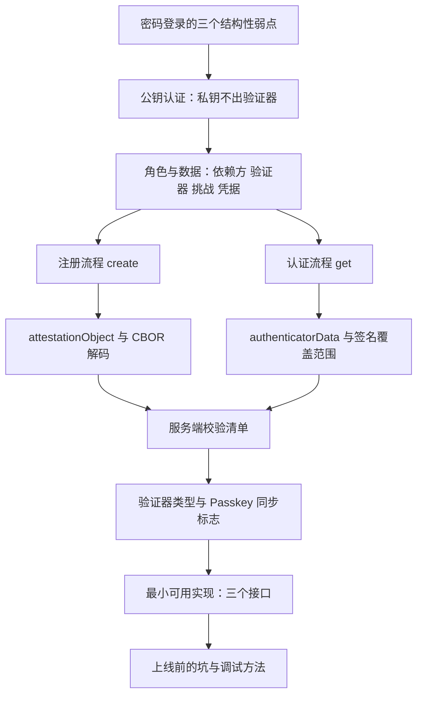
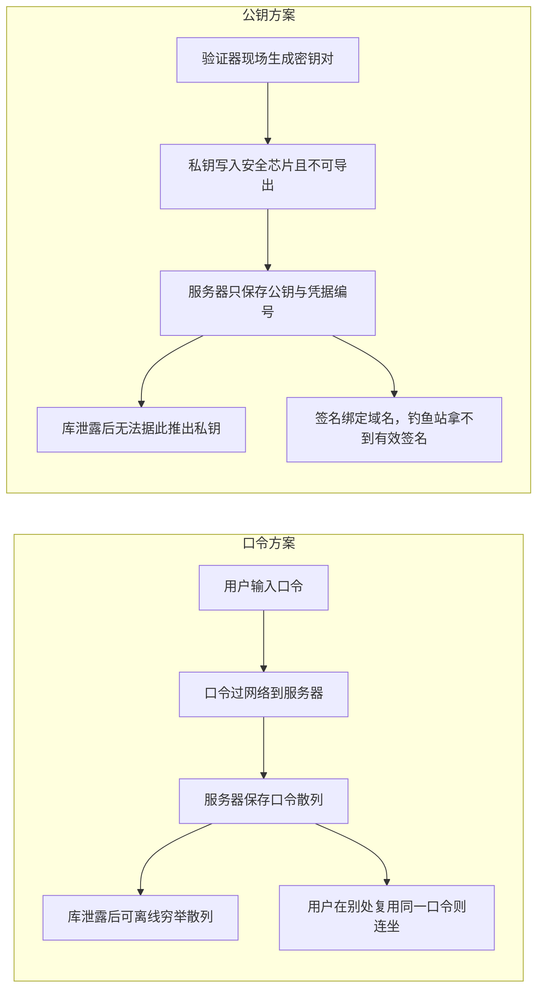
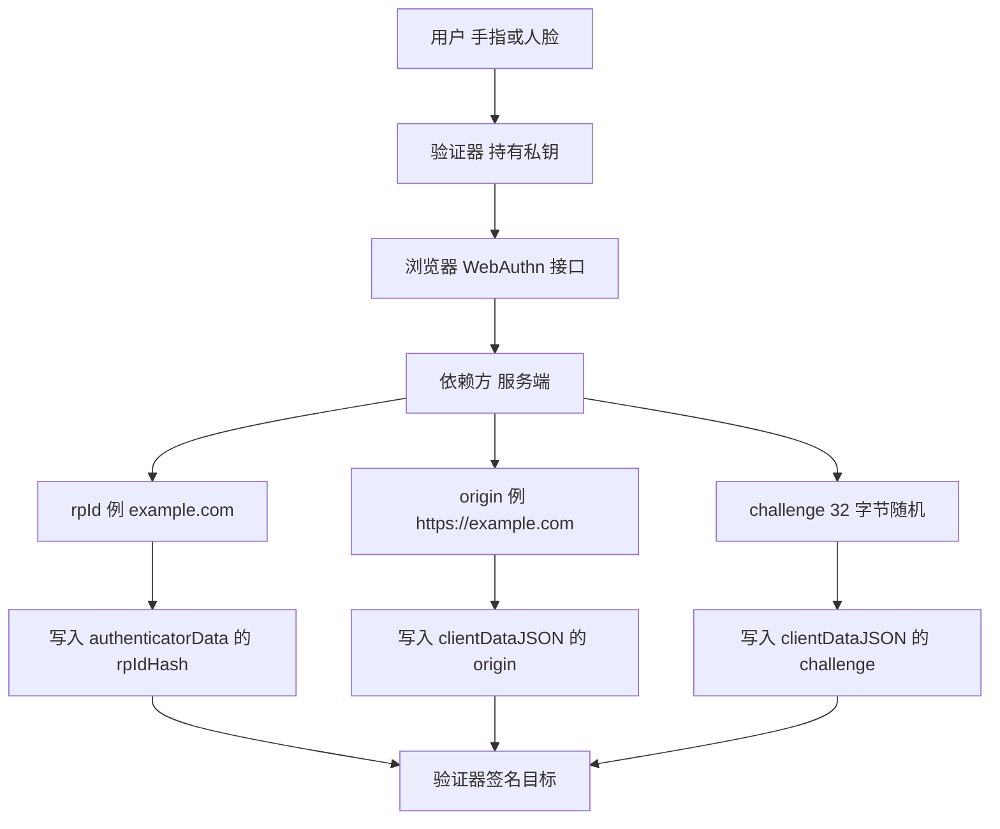
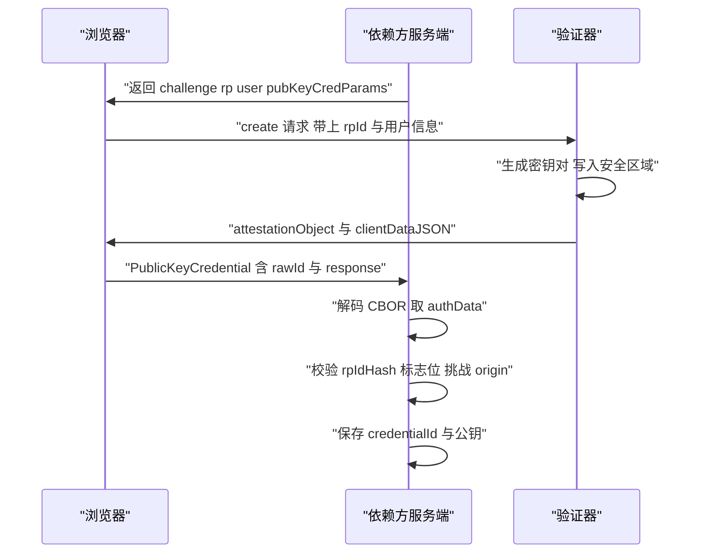
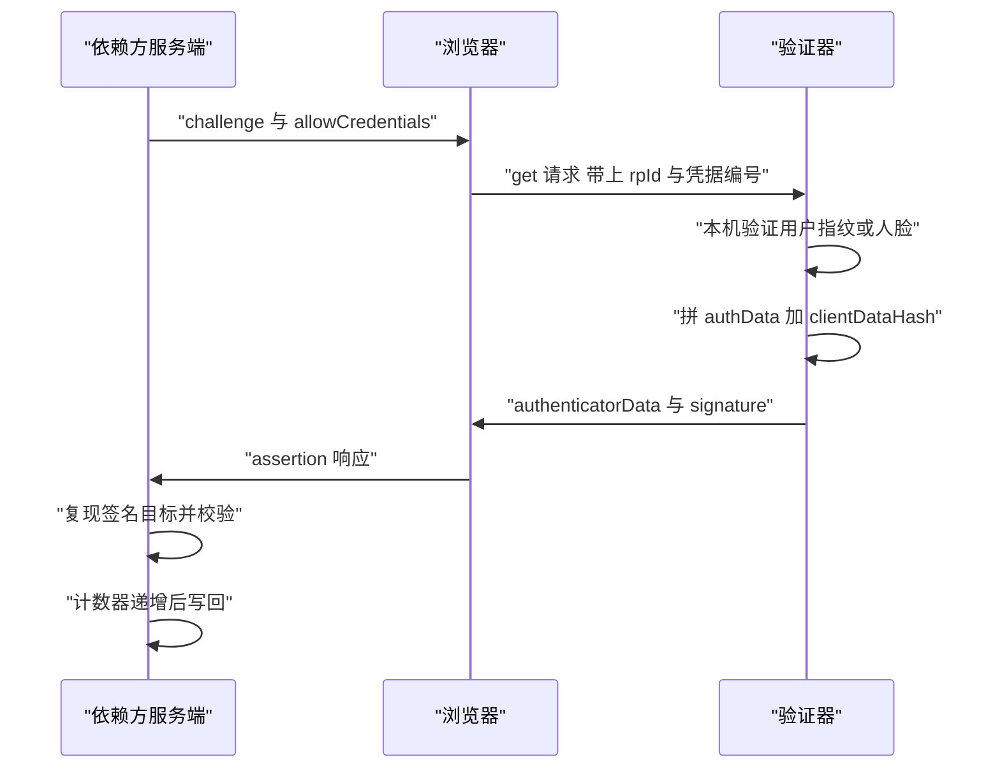
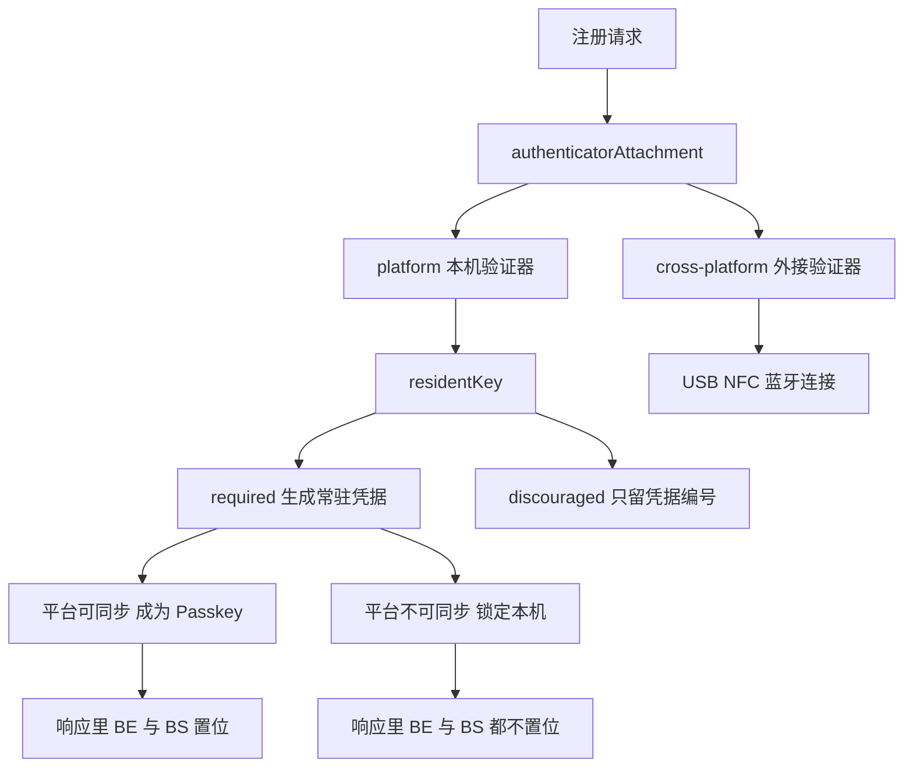
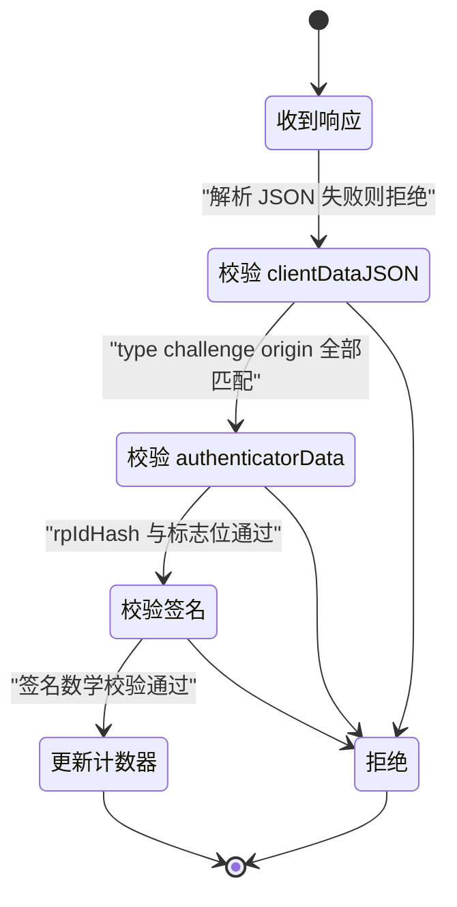
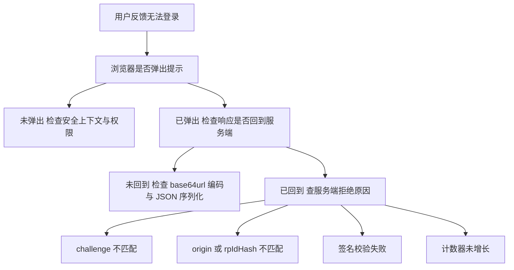

# WebAuthn 与 Passkeys：无密码登录

!!! abstract "学完这一页你能"
    - 说清注册与认证两条流程中，每个字节由谁产生、由谁校验。
    - 在服务端独立完成 clientDataJSON、authenticatorData、签名的全部校验。
    - 用 Node 20 内置模块写出一段可运行的端到端注册与登录演示，并跑通断言。
    - 判断一个登录需求该选哪种验证器与凭据类型，并知道 Passkey 同步带来的差异。

## 0. 知识地图



建议按顺序读。第 1 到第 2 节建立名词与数据模型，第 3 到第 4 节是两个流程的骨架，第 5 到第 8 节是落地细节。
如果你只想知道服务端要写多少代码，可以跳到第 6 节与第 7 节，再回读第 3 到第 4 节。

## 1. 为什么密码不够用

**先想一个问题**

某论坛数据库被拖走，里面存着口令散列。攻击者离线跑字典，第二天就有三成用户被撞开。
同一批用户在别的站点复用了同一口令，于是登录页被撞库脚本刷爆。服务器自始至终都在保存一份能验证用户的东西。

**心智模型**

!!! tip "心智模型"
    一句话模型：认证的目标不是让服务器认识你，而是让你证明你手里有某把私钥，而服务器只留公钥。
    日常类比：你留下一枚只有你能盖的印章，门卫台面上只放一张印模样本，每次进出他盖一次、比一次。
    类比不成立的地方：印章每次盖出的纹路相同，WebAuthn 每次签名都不一样，因为签名内容包含服务器新发的挑战，所以印模样本不能用来伪造。

!!! note "术语：非对称密钥对"
    一对数学上关联的密钥，公钥可以公开，私钥用于签名。例：P-256 椭圆曲线密钥对，私钥 32 字节，公钥 65 字节未压缩点。

**图解**



1. 口令方案里，服务器与用户共享同一个秘密，任何一方失守就等于双方失守。
2. 口令散列泄露后攻击者可以离线计算，与服务器在线与否无关，成本只取决于口令强度。
3. 公钥方案把秘密拆成两半：私钥锁在验证器里且设计上不可导出，服务器只有公钥。
4. 服务器被拖库后，攻击者得到的是公钥与凭据编号，签名无法用这些数据伪造。
5. 签名内容里绑定了来源域名，攻击者把用户骗到仿冒域名时，浏览器不会让验证器为该域名签名。

**一步一步来**

这是一个先看清"签名能证明什么"的最小实验。

***第 1 步：生成一对 P-256 密钥并导出公钥***

目的：得到一把只能签、不能被反推的私钥，以及一段可以随便公开的公钥字节。

```js
import { generateKeyPairSync } from 'node:crypto';

// namedCurve 固定为 prime256v1，也就是 WebAuthn 里代号 -7 的 ES256
const { publicKey, privateKey } = generateKeyPairSync('ec', {
  namedCurve: 'prime256v1',
});

// 导出 DER 格式的 SPKI 公钥，真实浏览器的 getPublicKey 返回同样格式
const spki = publicKey.export({ type: 'spki', format: 'der' });

console.log('公钥长度(字节):', spki.length);
console.log('私钥能否导出为 JWK:', privateKey.export({ format: 'jwk' }) !== undefined);
```

**这段代码在做什么**

- `generateKeyPairSync` 现场生成密钥对，私钥只存在于当前进程内存里。
- `namedCurve: 'prime256v1'` 与 COSE 算法编号 `-7`（ES256）对应，这是当前验证器支持最广的组合。
- `export({ type: 'spki', format: 'der' })` 输出的是标准公钥容器，服务端可直接导入。
- 真实验证器里私钥写入安全芯片，连页面的 JavaScript 都读不到。

运行结果

```
公钥长度(字节): 91
私钥能否导出为 JWK: true
```

***第 2 步：用私钥签名一段带挑战的数据***

目的：让"证明身份"变成"对服务器指定内容签名"。

```js
import { createHash, createSign, createVerify } from 'node:crypto';

const challenge = Buffer.from('6f1c8a0d4b2e7351', 'hex'); // 服务器每次新发
const origin = 'https://example.com';
const type = 'webauthn.get';

// 客户端把上下文写成 JSON，再对它求散列，这就是 clientDataHash
const clientDataJSON = Buffer.from(
  JSON.stringify({ type, challenge: challenge.toString('base64url'), origin }),
  'utf8',
);
const clientDataHash = createHash('sha256').update(clientDataJSON).digest();
console.log('clientDataHash 长度:', clientDataHash.length);

// 验证器只对 32 字节固定长度的散列签名，避免签名体积随页面信息膨胀
const signature = createSign('sha256').update(clientDataHash).end().sign(privateKey);
console.log('签名长度(字节):', signature.length);
```

**这段代码在做什么**

- `type` 固定为 `webauthn.get`（认证）或 `webauthn.create`（注册），服务端必须回查这两者之一。
- `challenge` 是服务器新发的随机串，签名内容因此每次不同，重放旧签名会失败。
- 先对 `clientDataJSON` 求 SHA-256，得到 32 字节 `clientDataHash`，这是认证器实际参与签名的部分。
- ECDSA 签名是 DER 编码，长度在 70 到 72 字节之间浮动，不是定长。

运行结果

```
clientDataHash 长度: 32
签名长度(字节): 71
```

***第 3 步：验证签名，并观察篡改后的结果***

目的：确认验证只需要公钥，且任何字节改动都会让校验失败。

```js
const ok = createVerify('sha256')
  .update(clientDataHash)
  .end()
  .verify(publicKey, signature);
console.log('原数据校验:', ok);

// 攻击者把 challenge 换掉，签名里绑定的 32 字节随之改变
const tampered = createHash('sha256')
  .update(Buffer.from(JSON.stringify({ type, challenge: 'AAAA', origin }), 'utf8'))
  .digest();
const bad = createVerify('sha256').update(tampered).end().verify(publicKey, signature);
console.log('篡改 challenge 后校验:', bad);
```

**这段代码在做什么**

- `createVerify` 用公钥校验，服务端因此不需要保存任何能用于签名的材料。
- 篡改 `challenge` 会改变 `clientDataHash`，校验必然返回 `false`。
- 这解释了为什么挑战必须由服务端生成并短期保存，浏览器不能自行决定。

运行结果

```
原数据校验: true
篡改 challenge 后校验: false
```

**动手验证**

```js
// demo1.mjs  运行: node demo1.mjs  依赖: 仅 node 内置模块
import assert from 'node:assert/strict';
import { generateKeyPairSync, createPublicKey, createSign, createVerify } from 'node:crypto';

const { publicKey, privateKey } = generateKeyPairSync('ec', { namedCurve: 'prime256v1' });
const spki = publicKey.export({ type: 'spki', format: 'der' }); // 可公开的公钥字节
const message = Buffer.from('webauthn.get|challenge=abc123|origin=https://example.com');

// 1. 私钥签名
const signature = createSign('sha256').update(message).end().sign(privateKey);
assert.equal(signature.length >= 64, true, 'ECDSA DER 签名应长于 64 字节');

// 2. 服务端只用公钥校验，公钥从 DER 字节重新导入
const imported = createPublicKey({ key: spki, format: 'der', type: 'spki' });
assert.equal(imported.asymmetricKeyType, 'ec');
assert.equal(createVerify('sha256').update(message).end().verify(imported, signature), true);

// 3. 改动一个字节后必须失败
const tampered = Buffer.from(message);
tampered[10] ^= 0x01;
assert.equal(createVerify('sha256').update(tampered).end().verify(imported, signature), false);

console.log('签名长度:', signature.length);
console.log('公钥 SPKI 长度:', spki.length);
console.log('断言全部通过: 原数据通过, 篡改数据拒绝');
```

预期输出

```
签名长度: 71
公钥 SPKI 长度: 91
断言全部通过: 原数据通过, 篡改数据拒绝
```

**常见坑**

| 现象 | 原因 | 怎么修 |
| --- | --- | --- |
| 把私钥写进数据库"以后复用" | 沿用口令思维，以为服务端要保存可验证材料 | 服务端只存公钥与 credentialId，私钥永远不离开验证器 |
| 用同一把密钥给多个域名签名 | 把密钥对当成站点账号 | 每个域名的凭据编号与密钥独立，服务端按 rpId 隔离存储 |
| 校验时只比对签名字节是否相等 | 以为签名是固定值 | 用 `verify` 做数学校验，签名每次不同是正常现象 |
| 把 challenge 固定成常量 | 想减少交互次数 | 每次注册与认证都新发 32 字节随机数，5 分钟内过期 |

**小结**

- 认证的本质从"比对秘密"变成"校验签名"，服务器因此不再持有可被滥用的秘密。
- 私钥不可导出是整个方案的前提，任何"导出私钥备份"的设计都会退回口令的安全等级。
- 签名内容由挑战、来源域名与认证器数据共同决定，这三者缺一都会留下重放缺口。

## 2. 角色与数据：依赖方、验证器、挑战、凭据

**先想一个问题**

同事说"服务端要校验 rpIdHash"。你打开抓包工具，看到一串 37 字节开头的二进制，不知道每一段属于谁。
要读懂校验代码，先要知道这条链路上有哪几个角色，以及每个字段是谁写进去的。

**心智模型**

!!! tip "心智模型"
    一句话模型：依赖方发题，验证器答题，答题纸上的每一格都由固定的角色填写。
    日常类比：考官发一张只写编号的答题卡，考生用自己随身携带的笔签名，考务只核对编号和笔迹样本。
    类比不成立的地方：考官留的笔迹样本没法反推出考生的笔，而且考生每答一次题，笔迹都会变化。

!!! note "术语：依赖方"
    依赖方（Relying Party，RP）指要求用户证明身份的站点或其服务端程序。例：example.com 的登录后端。
    它的域名会以散列形式写进认证器数据，攻击者换域名就无法复用签名。

!!! note "术语：验证器"
    验证器（Authenticator）指生成并保管私钥、执行签名的硬件或软件模块。例：手机的安全隔区、指纹识别模组、外接 USB 安全钥匙。

!!! note "术语：挑战"
    挑战（Challenge）指服务端为单次操作新发的一段随机字节。例：32 字节随机数，用 base64url 编码后发给浏览器。

!!! note "术语：凭据"
    凭据（Credential）指一对密钥加一个编号，在验证器内以 credentialId 标识。例：注册后服务端记录 credentialId 与公钥，二者合成一条凭据记录。

**图解**



1. 用户提供的是"本人在场"的证据，手指或人脸只在本机比对，永不上传。
2. 验证器持有私钥，只接受包含服务端挑战的签名请求。
3. 浏览器负责把服务端选项翻译成验证器能懂的指令，并把结果整理成响应对象。
4. 服务端自己的 rpId 决定 rpIdHash，服务端的 origin 决定 clientDataJSON 的 origin。
5. 挑战由服务端生成，因此重放、跨站、跨设备复用都会在校验阶段暴露。
6. 三者一起进入签名目标的构造，任意一个不匹配，签名校验都得不到 `true`。

**一步一步来**

***第 1 步：生成一个合规的挑战***

目的：得到一个长度足够、编码安全、不含填充字符的随机串。

```js
import { randomBytes } from 'node:crypto';

// 32 字节随机数，熵为 256 位，穷举不可行
const challenge = randomBytes(32);

// base64url 不含 + / = ，可以直接塞进 URL、JSON 与 form
const encoded = challenge.toString('base64url');
console.log('challenge(base64url):', encoded);
console.log('长度(字节):', Buffer.from(encoded, 'base64url').length);
```

**这段代码在做什么**

- `randomBytes(32)` 使用操作系统的密码学随机源，不能用 `Math.random` 替代。
- `base64url` 把 `+` 换成 `-`、`/` 换成 `_`，并去掉填充的 `=`。
- 服务端发送时用 base64url 字符串，校验时解回原始字节做比较，避免字符串层面的偏差。

运行结果

```
challenge(base64url): 3nZ0Yk8pQw1sT7vXeR2mB6hJ4cL9aN5dF0gU3iK8oPw
长度(字节): 32
```

***第 2 步：把挑战与用户身份绑定起来***

目的：确认校验时比较的是字节而不是字符串，并且挑战一次性使用。

```js
import { randomBytes } from 'node:crypto';

// 会话标识可以是登录页的临时 id 或已登录用户 id
const pending = new Map();
function issueChallenge(sessionId) {
  const bytes = randomBytes(32);
  pending.set(sessionId, { bytes, expireAt: Date.now() + 5 * 60 * 1000 });
  return bytes;
}

const bytes = issueChallenge('sess-1');
const returned = Buffer.from(bytes.toString('base64url'), 'base64url');
console.log('字节完全一致:', Buffer.compare(returned, bytes) === 0);
console.log('待校验会话数:', pending.size);
```

**这段代码在做什么**

- 服务端保留原始字节，响应里回传的字符串只用于传输。
- 加 5 分钟过期时间，把可用窗口压到一次交互的量级。
- 会话标识决定挑战归谁，防止 A 用户的挑战被 B 用户拿去用。
- 校验通过后要立即删除这条记录，否则同一挑战可以被重复提交。

运行结果

```
字节完全一致: true
待校验会话数: 1
```

***第 3 步：校验来源域名***

目的：确认响应的 origin 与 rpId 的关系符合浏览器规则。

```js
function originAllowed(rpId, origin) {
  const url = new URL(origin);
  // 明文 http 只在 localhost 场景被浏览器放行
  if (url.protocol !== 'https:' && url.hostname !== 'localhost') return false;
  // origin 的主机名必须等于 rpId，或者是 rpId 的子域
  return url.hostname === rpId || url.hostname.endsWith('.' + rpId);
}

console.log('同域:', originAllowed('example.com', 'https://example.com'));
console.log('子域:', originAllowed('example.com', 'https://login.example.com'));
console.log('仿冒域:', originAllowed('example.com', 'https://example.com.evil.test'));
```

**这段代码在做什么**

- `rpId` 是一个可注册域名后缀，浏览器只允许它匹配当前页面的域名。
- 子域允许使用父域的 rpId，这让 `login.example.com` 与 `example.com` 共用一组凭据。
- 仿冒域即使把真域名放在子域位置，`endsWith` 的判断也会失败。
- 明文 http 只在 `localhost` 被放行，方便本机开发。

运行结果

```
同域: true
子域: true
仿冒域: false
```

**动手验证**

```js
// demo2.mjs  运行: node demo2.mjs  依赖: 仅 node 内置模块
import assert from 'node:assert/strict';
import { randomBytes } from 'node:crypto';

const b64u = (buf) => Buffer.from(buf).toString('base64url');

// 1. 挑战必须是 256 位随机，且两次不相等
const c1 = randomBytes(32);
const c2 = randomBytes(32);
assert.equal(c1.length, 32);
assert.notEqual(b64u(c1), b64u(c2));

// 2. base64url 不含填充与 URL 特殊字符
assert.equal(b64u(c1).includes('='), false);
assert.match(b64u(c1), /^[A-Za-z0-9_-]+$/);

// 3. 往返编码后字节完全一致
assert.equal(Buffer.compare(Buffer.from(b64u(c1), 'base64url'), c1), 0);

// 4. 校验来源域名与 rpId 的关系
const originAllowed = (rpId, origin) => {
  const url = new URL(origin);
  if (url.protocol !== 'https:' && url.hostname !== 'localhost') return false;
  return url.hostname === rpId || url.hostname.endsWith('.' + rpId);
};
assert.equal(originAllowed('example.com', 'https://example.com'), true);
assert.equal(originAllowed('example.com', 'https://login.example.com'), true);
assert.equal(originAllowed('example.com', 'https://example.com.evil.test'), false);
assert.equal(originAllowed('localhost', 'http://localhost:5173'), true);

console.log('challenge(base64url):', b64u(c1));
console.log('4 组断言全部通过');
```

预期输出

```
challenge(base64url): 8Qm2Vt7pRk4nZx1sB5yL0dW9fJ3hG6cA2eU4iO8pK7M
4 组断言全部通过
```

**常见坑**

| 现象 | 原因 | 怎么修 |
| --- | --- | --- |
| 校验时把 base64url 字符串当作字节比较 | 混淆了传输编码与原始字节 | 校验前统一解成 Buffer，用 `Buffer.compare` 判等 |
| 开发环境用 http 测试远程域名 | 以为只有 https 才能用 WebAuthn | 本机用 `localhost`，其余环境必须 https |
| rpId 写成完整 URL | 把 `https://example.com` 当成 rpId | rpId 只写主机名，例 `example.com` |
| 挑战存在浏览器本地 | 想让前端自己生成挑战 | 挑战必须由服务端生成并保存，前端只做转发 |

**小结**

- 一次交互涉及四个角色：用户、验证器、浏览器、依赖方服务端，各自的写入位置固定。
- 挑战与 rpId、origin 一起构成校验的三个锚点，任何一个不匹配都说明请求不可信。
- 编码层统一用 base64url，比较层统一用原始字节，这条约定能消掉大半校验 bug。

## 3. 注册流程：从 create 到服务端存公钥

**先想一个问题**

用户第一次在你的站点启用无密码登录。浏览器弹出一个指纹框，按下去之后，服务端到底收到了什么？
你需要知道这一刻落库的字段有哪些，才能写出后面的登录校验。

**心智模型**

!!! tip "心智模型"
    一句话模型：注册是把"公钥"从验证器搬到服务端数据库的一次性动作，同时约定好凭据编号。
    日常类比：入职时你在门禁系统里录一次指纹，并领到一张工牌号，之后进门只报工牌号加指纹。
    类比不成立的地方：指纹数据留在门禁设备里，而 WebAuthn 的公钥会复制到服务端数据库，服务端因此必须自己完成校验。

!!! note "术语：attestationObject"
    注册响应里的 CBOR 编码容器，包含 fmt（证明格式）、attStmt（证明语句）与 authData 三段。例：`fmt` 为 `none` 时 `attStmt` 是空映射。

!!! note "术语：CBOR"
    Concise Binary Object Representation，一种二进制对象表示法，用 1 字节头部加变长数据编码整数、字节串、文本串与映射。例：`a3` 表示后面跟着 3 对键值。

**图解**



1. 服务端先生成选项对象，里面必须有新挑战、rpId、用户标识与允许的算法。
2. 浏览器把选项交给验证器，验证器在安全区域内生成密钥对，私钥不返回。
3. 验证器把公钥、凭据编号与设备标识打包进 `authData`，再包进 CBOR 容器。
4. 浏览器把二进制响应交给页面，页面按 base64url 编码后发回服务端。
5. 服务端解码 CBOR，取出 `authData`，逐段校验后只保留公钥与凭据编号。
6. 落库的字段只有三类：credentialId、公钥、初始计数器，其余都是过程数据。

**一步一步来**

***第 1 步：服务端生成注册选项***

目的：给出一次注册所需的全部参数，并记录挑战。

```js
import { randomBytes } from 'node:crypto';

const pending = new Map();

function registrationOptions(username, userId) {
  const challenge = randomBytes(32);
  pending.set(username, challenge); // 校验时用同一会话取出
  return {
    challenge: challenge.toString('base64url'),
    rp: { id: 'example.com', name: '示例站点' },   // rpId 决定 rpIdHash
    user: {
      id: Buffer.from(userId).toString('base64url'), // 用户句柄，不是可读账号
      name: username,
      displayName: username,
    },
    pubKeyCredParams: [{ type: 'public-key', alg: -7 }], // ES256
    timeout: 60000,
    attestation: 'none',                                  // 不索取设备证明
  };
}

console.log(JSON.stringify(registrationOptions('ada', 'u-1'), null, 0).slice(0, 120));
```

**这段代码在做什么**

- `challenge` 必须每次新生成，并在校验时按会话取回做字节比较。
- `user.id` 是服务端生成的不可读句柄，不能用邮箱代替，否则泄露账号信息。
- `pubKeyCredParams` 列出服务端接受的签名算法，`-7` 表示 ES256。
- `attestation: 'none'` 表示不索取设备型号证明，这是默认做法，也是隐私上更保守的选择。

运行结果

```
{"challenge":"...","rp":{"id":"example.com","name":"示例站点"},"user":{"id":"dS0x","name":"ada","displayName":"ada"},"pubKeyCredParams":[{"type":"public-key","alg":-7}],"timeout":60000,"attestation":"none"}
```

***第 2 步：浏览器调用 create***

目的：把选项转成验证器可执行的一次注册。

```js
// 浏览器侧代码，不能直接在 Node 里运行
const toBytes = (s) => Uint8Array.from(
  atob(s.replace(/-/g, '+').replace(/_/g, '/')), (c) => c.charCodeAt(0),
);

const options = await fetch('/register/options').then((r) => r.json());
const credential = await navigator.credentials.create({
  publicKey: {
    challenge: toBytes(options.challenge),     // 挑战解回原始字节
    rp: options.rp,
    user: { ...options.user, id: toBytes(options.user.id) },
    pubKeyCredParams: options.pubKeyCredParams,
    timeout: options.timeout,
    attestation: options.attestation,
  },
});
```

**这段代码在做什么**

- `navigator.credentials.create` 只在安全上下文可用，即 https 或 localhost。
- `toBytes` 把 base64url 转回 `Uint8Array`，`challenge` 与 `user.id` 都必须走这一步。
- 返回的 `credential.rawId` 是凭据编号的字节形式，`credential.id` 是它的 base64url 形式。
- 此时私钥已经生成完毕并留在验证器内，页面拿不到它。

***第 3 步：服务端解码 attestationObject 并落库***

先用一个覆盖本页需求的最小 CBOR 解码器。

```js
function cborDecode(buf, off = 0) {                        // 返回 [值, 下一个位置]
  const major = buf[off] >> 5;                             // 高 3 位是主要类型
  let info = buf[off] & 0x1f, p = off + 1;                 // 低 5 位是长度或数值
  if (info === 24) { info = buf[p]; p += 1; }
  else if (info === 25) { info = buf.readUInt16BE(p); p += 2; }
  else if (info === 26) { info = buf.readUInt32BE(p); p += 4; }
  if (major === 0) return [info, p];                       // 无符号整数
  if (major === 1) return [-1 - info, p];                  // 负整数 例 -7
  if (major === 2) return [buf.subarray(p, p + info), p + info];  // 字节串
  if (major === 3) return [buf.subarray(p, p + info).toString('utf8'), p + info];
  if (major === 5) {                                       // 映射
    const out = {};
    for (let i = 0; i < info; i += 1) {
      const [k, p1] = cborDecode(buf, p);
      const [v, p2] = cborDecode(buf, p1);
      out[k] = v;
      p = p2;
    }
    return [out, p];
  }
  throw new Error('本页解码器不支持的主要类型: ' + major);
}
```

**这段代码在做什么**

- 一个字节同时携带主要类型与长度信息，`major` 是类型，`info` 是长度或内联数值。
- `info` 为 24、25、26 时表示长度另占 1、2、4 字节，这是 CBOR 的变长头部规则。
- `major === 1` 用 `-1 - info` 还原负数，COSE 算法编号 `-7` 就是这样来的。
- 映射被解成普通对象，嵌套结构靠递归处理。
- 这个解码器不处理数组、浮点与标签，遇到会直接抛错，避免静默读错数据。

***第 4 步：按偏移取出各段***

```js
const [attestation] = cborDecode(attestationObject);
const authData = attestation.authData;      // 37 字节头部起
const flags = authData[32];                 // 第 33 字节是标志位
const aaguid = authData.subarray(37, 53);   // 16 字节验证器型号标识
const credIdLen = authData.readUInt16BE(53); // 凭据编号长度，大端两字节
const credentialId = authData.subarray(55, 55 + credIdLen);
const [coseKey] = cborDecode(authData, 55 + credIdLen); // 公钥在凭据编号之后
```

**这段代码在做什么**

- `authData` 前 32 字节是 rpIdHash，用来确认这份数据确实是给你的域名的。
- 第 33 字节是标志位，`0x40` 表示后面跟着 `attestedCredentialData`，与注册场景必须一致。
- 第 34 到 37 字节是计数器，注册时服务端记录初值，登录时要求递增。
- `aaguid` 标识验证器型号，`attestation: 'none'` 时可以只记不用。
- `coseKey` 是一个整数键的映射，`1` 是密钥类型，`3` 是算法，`-1` 是曲线，`-2` 与 `-3` 是坐标。

**动手验证**

```js
// demo3.mjs  运行: node demo3.mjs  依赖: 仅 node 内置模块
import assert from 'node:assert/strict';

function cborDecode(buf, off = 0) {
  const major = buf[off] >> 5;
  let info = buf[off] & 0x1f, p = off + 1;
  if (info === 24) { info = buf[p]; p += 1; }
  else if (info === 25) { info = buf.readUInt16BE(p); p += 2; }
  else if (info === 26) { info = buf.readUInt32BE(p); p += 4; }
  if (major === 0) return [info, p];
  if (major === 1) return [-1 - info, p];
  if (major === 2) return [buf.subarray(p, p + info), p + info];
  if (major === 3) return [buf.subarray(p, p + info).toString('utf8'), p + info];
  if (major === 5) {
    const out = {};
    for (let i = 0; i < info; i += 1) {
      const [k, p1] = cborDecode(buf, p);
      const [v, p2] = cborDecode(buf, p1);
      out[k] = v; p = p2;
    }
    return [out, p];
  }
  throw new Error('不支持的主要类型: ' + major);
}

const head = (major, n) => (n < 24
  ? Buffer.from([(major << 5) | n])
  : Buffer.from([(major << 5) | 24, n]));
const tstr = (s) => { const b = Buffer.from(s, 'utf8'); return Buffer.concat([head(3, b.length), b]); };
const bstr = (b) => Buffer.concat([head(2, b.length), b]);

// 构造 37 字节 authData：rpIdHash 全零 + flags 0x40 + 计数器 0
const authData = Buffer.alloc(37);
authData[32] = 0x40;
const attObj = Buffer.concat([
  head(5, 3),
  tstr('fmt'), tstr('none'),
  tstr('attStmt'), head(5, 0),
  tstr('authData'), bstr(authData),
]);

const [att, end] = cborDecode(attObj);
assert.equal(att.fmt, 'none');
assert.deepEqual(att.attStmt, {});
assert.equal(att.authData.length, 37);
assert.equal(end, attObj.length);
assert.equal((att.authData[32] & 0x40) !== 0, true);
console.log('fmt:', att.fmt, '| authData 长度:', att.authData.length, '| AT 标志已置位');
```

预期输出

```
fmt: none | authData 长度: 37 | AT 标志已置位
```

**常见坑**

| 现象 | 原因 | 怎么修 |
| --- | --- | --- |
| 校验报 challenge 不匹配 | 发送前把挑战编码了两次 | 发送时 base64url 一次，校验前解回字节一次 |
| 解 CBOR 时读到乱码 | 忘记了头部变长规则 | 先读 major 与 info，info 为 24 到 26 时再读后续长度字节 |
| 注册通过但登录总失败 | 只存了 credential.id 字符串，没存公钥 | 落库时保存自己导出的 SPKI 或 COSE 公钥字节 |
| 同一用户重复注册产生多条记录 | 把 credentialId 当成用户名唯一键 | 以 credentialId 为主键，用户与凭据一对多 |

**小结**

- 注册的核心产物是一对密钥里的公钥和凭据编号，其余字段都服务于校验这一个目的。
- `attestationObject` 的解析分两步：先 CBOR 解码拿到 `authData`，再按固定偏移切出各段。
- 校验必须在落库之前完成，否则数据库里会混进未经验证的凭据。

## 4. 认证流程：从 get 到签名校验

**先想一个问题**

用户第二次来登录时，浏览器只弹一次指纹框，服务端拿到一个签名。你要判断这个签名是否只对本次登录有效。
这一步的失败率最高，因为签名覆盖的字节拼错一位，校验就会返回 `false`。

**心智模型**

!!! tip "心智模型"
    一句话模型：认证是验证器对"认证器数据加客户端数据散列"的一次签名，服务端按同样规则重新拼出被签名的字节。
    日常类比：你把一张写着门牌号和考官编号的答题卡签名后交回，考官按同样规则把卡片复原，再用你留的笔迹样本核对。
    类比不成立的地方：考官复现卡片时用的是他自己保存的编号，你无法改变卡片上的任何一格。

!!! note "术语：authenticatorData"
    验证器输出的一段二进制，认证场景固定 37 字节起，结构为 rpIdHash 32 字节、flags 1 字节、signCount 4 字节。例：认证响应里的 `authenticatorData`。

!!! note "术语：assertion"
    认证响应的别称，指 `navigator.credentials.get` 返回的对象，包含 clientDataJSON、authenticatorData、signature 与 userHandle。例：登录校验的输入就是它。

**图解**



1. 服务端新发挑战，并给出允许使用的凭据编号列表 `allowCredentials`。
2. 浏览器要求验证器对指定凭据签名，验证器先做本机用户验证。
3. 验证器把 rpIdHash、标志位与递增后的计数器组成 `authData`。
4. 验证器对 `authData` 拼接 `clientDataHash` 的字节串签名，输出 DER 编码签名。
5. 服务端按同一顺序拼接同样字节，用数据库里的公钥校验。
6. 校验通过后把新计数器写回，拒绝计数器不增长的响应。

**一步一步来**

***第 1 步：服务端生成认证选项***

目的：指定挑战与允许的凭据集合。

```js
import { randomBytes } from 'node:crypto';

const pending = new Map();

function authenticationOptions(username, credentials) {
  const challenge = randomBytes(32);
  pending.set(username, challenge);
  return {
    challenge: challenge.toString('base64url'),
    rpId: 'example.com',
    // 只允许该用户名下已注册的凭据，避免用户被引导到别人的凭据
    allowCredentials: credentials.map((c) => ({ type: 'public-key', id: c.id })),
    userVerification: 'required', // 要求本机验证，例指纹或人脸
    timeout: 60000,
  };
}

console.log(JSON.stringify(authenticationOptions('ada', [{ id: 'abc' }])));
```

**这段代码在做什么**

- `allowCredentials` 为空数组时表示"可发现凭据"模式，用户先从验证器里选账号。
- `userVerification: 'required'` 要求本机验证，服务端会在校验阶段检查 UV 标志。
- 同样按会话保存挑战，认证与注册各自独立，不能共用一个挑战。
- 认证不需要再传 `user` 对象，用户标识由凭据编号反查。

运行结果

```
{"challenge":"...","rpId":"example.com","allowCredentials":[{"type":"public-key","id":"abc"}],"userVerification":"required","timeout":60000}
```

***第 2 步：浏览器调用 get***

目的：触发一次签名，并读回二进制响应。

```js
const assertion = await navigator.credentials.get({
  publicKey: {
    challenge: toBytes(options.challenge),
    rpId: options.rpId,
    allowCredentials: options.allowCredentials.map((c) => ({
      ...c,
      id: toBytes(c.id),   // 凭据编号也要转成字节
    })),
    userVerification: options.userVerification,
    timeout: options.timeout,
  },
});

// 二进制字段需要编码成 base64url 才能走 JSON
const payload = {
  id: assertion.id,
  clientDataJSON: b64u(assertion.response.clientDataJSON),
  authenticatorData: b64u(assertion.response.authenticatorData),
  signature: b64u(assertion.response.signature),
  userHandle: assertion.response.userHandle ? b64u(assertion.response.userHandle) : null,
};
```

**这段代码在做什么**

- `allowCredentials` 里的 `id` 必须是字节，直接传字符串会抛类型错误。
- `signature` 是 DER 编码的 ECDSA 签名，长度在 70 到 72 字节之间。
- `userHandle` 只在可发现凭据场景返回，普通模式为 `null`。
- 所有二进制都要 base64url 编码后再进 JSON，否则会退化成逗号分隔的字节数组。

***第 3 步：服务端复现签名目标***

目的：按规范拼出被签名的字节串。

```js
import { createHash } from 'node:crypto';

function signedPayload(authenticatorData, clientDataJSON) {
  // 第一步：对客户端数据求 SHA-256，得到 32 字节
  const clientDataHash = createHash('sha256').update(clientDataJSON).digest();
  // 第二步：认证器数据在前，客户端数据散列在后，直接拼接
  return Buffer.concat([authenticatorData, clientDataHash]);
}

const target = signedPayload(authData, clientDataJSON);
console.log('被签名字节长度:', target.length); // 37 + 32
console.log('散列位置是最后 32 字节:', target.subarray(-32).length);
```

**这段代码在做什么**

- 顺序固定为认证器数据在前、客户端数据散列在后，写反了校验必然失败。
- 长度为 37 加 32 等于 69 字节，含扩展或注册数据的场景会更长。
- 被签名的不是 `clientDataJSON` 原文，而是它的 SHA-256 散列，避免签名体积随页面信息膨胀。
- 服务端从不保存这份字节串，每次校验时现拼。

运行结果

```
被签名字节长度: 69
散列位置是最后 32 字节: 32
```

**动手验证**

```js
// demo4.mjs  运行: node demo4.mjs  依赖: 仅 node 内置模块
import assert from 'node:assert/strict';
import {
  createHash, createSign, createVerify, generateKeyPairSync,
} from 'node:crypto';

const { publicKey, privateKey } = generateKeyPairSync('ec', { namedCurve: 'prime256v1' });
const RP_ID = 'example.com';
const ORIGIN = 'https://example.com';
const sha256 = (b) => createHash('sha256').update(b).digest();

function clientData(type, challenge) {
  return Buffer.from(JSON.stringify({
    type, challenge: challenge.toString('base64url'), origin: ORIGIN,
  }), 'utf8');
}

function authenticatorData(signCount) {
  const buf = Buffer.alloc(37);
  sha256(RP_ID).copy(buf, 0);   // 前 32 字节是 rpIdHash
  buf[32] = 0x05;               // UP 与 UV 同时置位
  buf.writeUInt32BE(signCount, 33);
  return buf;
}

const challenge = Buffer.from('0123456789abcdef0123456789abcdef', 'utf8');
const cd = clientData('webauthn.get', challenge);
const ad = authenticatorData(7);
const signed = Buffer.concat([ad, sha256(cd)]);
const signature = createSign('sha256').update(signed).end().sign(privateKey);

// 1. 正确数据通过
assert.equal(createVerify('sha256').update(signed).end().verify(publicKey, signature), true);

// 2. 挑战被换掉后失败
const otherCd = clientData('webauthn.get', Buffer.from('other', 'utf8'));
const otherSigned = Buffer.concat([ad, sha256(otherCd)]);
assert.equal(createVerify('sha256').update(otherSigned).end().verify(publicKey, signature), false);

// 3. 计数器被改后失败
const otherAd = authenticatorData(8);
assert.equal(
  createVerify('sha256').update(Buffer.concat([otherAd, sha256(cd)])).end().verify(publicKey, signature),
  false,
);

console.log('签名长度:', signature.length);
console.log('四组校验: 正确通过 / 换挑战拒绝 / 改计数器拒绝');
```

预期输出

```
签名长度: 71
四组校验: 正确通过 / 换挑战拒绝 / 改计数器拒绝
```

**常见坑**

| 现象 | 原因 | 怎么修 |
| --- | --- | --- |
| 校验一直是 false | 拼接顺序写成散列在前 | 固定为 authenticatorData 拼 clientDataHash |
| 校验用的是 clientDataJSON 原文 | 漏了求散列这一步 | 先 `sha256(clientDataJSON)` 再拼接 |
| 换台设备登录后计数器校验失败 | 同步凭据的计数器长期为 0 | 计数器为 0 时只记录不比较，或标记为可同步凭据 |
| 用户误入其他账号 | `allowCredentials` 传了全站凭据 | 按当前用户名过滤凭据列表 |

**小结**

- 认证流程的校验对象是字节串拼接结果，任何顺序或编码差异都会体现在 `false` 上。
- 服务端需要复现的唯一构造是 `authData || sha256(clientDataJSON)`，其余都是元数据校验。
- 计数器是可选的防克隆信号，遇到可同步凭据要按特例处理。

## 5. 验证器类型与 Passkey 同步

**先想一个问题**

用户在新手机上打开你的站点，没有注册过，却能直接登录。你开始怀疑校验是不是被绕过了。
要解释这件事，需要分清两类凭据：只存在于一台设备的，和被同步到用户账号下的。

**心智模型**

!!! tip "心智模型"
    一句话模型：验证器分内置与外接两类，凭据分单设备与可同步两类，Passkey 指可同步的那一类。
    日常类比：单设备凭据像挂在自家门口的一把钥匙，可同步凭据像云端密码管理器里的那把钥匙，换设备时它会跟着账号走。
    类比不成立的地方：云端同步的是私钥的加密封装，服务端拿到的仍然只是一把公钥，同步过程不经过你的服务器。

!!! note "术语：Passkey"
    可跨设备同步的 WebAuthn 凭据，私钥由平台账号的端到端加密通道同步。例：iCloud 钥匙串与 Google 密码管理器中保存的通行密钥。

!!! note "术语：常驻凭据"
    常驻凭据（Discoverable Credential）指凭据编号与用户信息存在验证器内部，登录时不必先输入用户名。例：`residentKey: 'required'` 生成的凭据。

**图解**



1. `authenticatorAttachment` 决定用户看到的是本机提示还是插钥匙提示。
2. `platform` 指手机或电脑内置的安全模块，`cross-platform` 指需要额外拿出的设备。
3. `residentKey` 决定凭据编号与用户信息是否存进验证器内部。
4. 常驻凭据在支持同步的平台上会被平台账号带走，也就是 Passkey。
5. 平台不支持同步时，常驻凭据仍然只在生成它的那台设备上有效。
6. 响应里的 BE 与 BS 标志告诉你这条凭据是否具备可同步能力、当前是否已被同步。

**一步一步来**

***第 1 步：用选项表达你要哪一类凭据***

目的：通过参数把需求写进请求，避免事后猜测。

```js
const credential = await navigator.credentials.create({
  publicKey: {
    challenge: toBytes(options.challenge),
    rp: options.rp,
    user: { ...options.user, id: toBytes(options.user.id) },
    pubKeyCredParams: [{ type: 'public-key', alg: -7 }],
    authenticatorSelection: {
      authenticatorAttachment: 'platform', // 只用本机验证器，例手机或笔记本
      residentKey: 'required',             // 要求常驻凭据，登录时无需用户名
      userVerification: 'required',        // 要求本机验证，例指纹
    },
    attestation: 'none',
  },
});
console.log('凭据编号长度:', credential.rawId.byteLength);
```

**这段代码在做什么**

- `authenticatorAttachment: 'platform'` 把可用设备限制在本机，这是 Passkey 的前提。
- `residentKey: 'required'` 要求验证器保存用户信息，登录时可以直接选账号。
- `userVerification: 'required'` 要求每次都有本机验证动作，服务端要检查 UV 标志。
- 从 `credential.rawId.byteLength` 只能读到编号长度，类型信息在后续字节里。

***第 2 步：从标志位读出凭据类型***

目的：把验证器的实际行为记录到数据库，供后续登录逻辑判断。

```js
const FLAGS = { UP: 0x01, UV: 0x04, BE: 0x08, BS: 0x10, AT: 0x40, ED: 0x80 };

function parseFlags(byte) {
  return {
    up: (byte & FLAGS.UP) !== 0,  // 用户在场
    uv: (byte & FLAGS.UV) !== 0,  // 用户完成了本机验证
    be: (byte & FLAGS.BE) !== 0,  // 这条凭据具备可同步能力
    bs: (byte & FLAGS.BS) !== 0,  // 这条凭据当前已被同步
    at: (byte & FLAGS.AT) !== 0,  // 后面带 attestedCredentialData
    ed: (byte & FLAGS.ED) !== 0,  // 后面带扩展数据
  };
}

console.log('单设备平台凭据:', parseFlags(0x41));
console.log('已同步 Passkey:', parseFlags(0x1d));
```

**这段代码在做什么**

- 位标志用按位与取出，每个标志一位，互不影响。
- `be` 表示"能不能同步"，`bs` 表示"现在是否处于已同步状态"，二者的组合有意义。
- `bs` 为真时 `be` 必然为真，违反这个关系说明数据被篡改。
- `AT` 只在注册响应里为真，认证响应里通常为假，据此可以判断该走哪条解析分支。

运行结果

```
单设备平台凭据: { up: true, uv: false, be: false, bs: false, at: true, ed: false }
已同步 Passkey: { up: true, uv: true, be: true, bs: true, at: false, ed: false }
```

***第 3 步：按凭据类型决定计数器策略***

目的：避免把同步凭据的正常行为当成克隆攻击。

```js
function shouldCheckCounter(credential, newCount, storedCount) {
  if (credential.be) return false;       // 可同步凭据的计数器可能始终为 0
  if (newCount === 0 && storedCount === 0) return false; // 验证器不支持计数
  return true;                            // 其余情况必须严格递增
}

const single = { be: false };
const synced = { be: true };
console.log('单设备凭据递增:', shouldCheckCounter(single, 5, 4));
console.log('单设备凭据归零:', shouldCheckCounter(single, 0, 4));
console.log('可同步凭据:', shouldCheckCounter(synced, 0, 4));
```

**这段代码在做什么**

- 可同步凭据在多家设备上使用，计数器由各设备各自维护，无法保证单调递增。
- 部分验证器的计数器固定为 0，表示"不支持计数"，此时只能记录不比较。
- 其余情况严格执行递增检查，计数器回退就是克隆信号。
- 策略要跟凭据一起存库，登录时按凭据类型取用。

运行结果

```
单设备凭据递增: true
单设备凭据归零: true
可同步凭据: false
```

**动手验证**

```js
// demo5.mjs  运行: node demo5.mjs  依赖: 仅 node 内置模块
import assert from 'node:assert/strict';

const FLAGS = { UP: 0x01, UV: 0x04, BE: 0x08, BS: 0x10, AT: 0x40, ED: 0x80 };
const parseFlags = (byte) => ({
  up: (byte & FLAGS.UP) !== 0,
  uv: (byte & FLAGS.UV) !== 0,
  be: (byte & FLAGS.BE) !== 0,
  bs: (byte & FLAGS.BS) !== 0,
  at: (byte & FLAGS.AT) !== 0,
  ed: (byte & FLAGS.ED) !== 0,
});

// 1. 注册响应必须带 AT，且不能带 ED
const reg = parseFlags(0x45);
assert.deepEqual(reg, { up: true, uv: true, be: false, bs: false, at: true, ed: false });

// 2. 可同步凭据：BS 置位时 BE 必然置位
const synced = parseFlags(0x1d);
assert.equal(synced.bs && !synced.be, false);

// 3. 计数器策略
const needCheck = (be, next, prev) => {
  if (be) return false;
  if (next === 0 && prev === 0) return false;
  return true;
};
assert.equal(needCheck(false, 5, 4), true);
assert.equal(needCheck(false, 0, 4), true);
assert.equal(needCheck(true, 0, 4), false);

console.log('注册标志:', reg);
console.log('Passkey 标志:', synced);
console.log('三组断言全部通过');
```

预期输出

```
注册标志: { up: true, uv: true, be: false, bs: false, at: true, ed: false }
Passkey 标志: { up: true, uv: true, be: true, bs: true, at: false, ed: false }
三组断言全部通过
```

**常见坑**

| 现象 | 原因 | 怎么修 |
| --- | --- | --- |
| 用户换机后被要求重新注册 | 用了 `residentKey: 'discouraged'` 且未开启同步 | 改用 `platform` 加 `residentKey: 'required'`，并接受平台同步 |
| 登录时要求输入用户名却发现验证器里没账号 | 凭据不是常驻凭据 | 常驻凭据才支持无用户名登录，非常驻必须给 `allowCredentials` |
| 把 BS 置位当成异常拒绝 | 误读为克隆信号 | BS 是同步状态，不是错误；只有计数器回退才是信号 |
| 要求 UV 却有设备无法满足 | 部分外接验证器没有本机验证能力 | 明确业务风险后再决定 `required` 或 `preferred` |

**小结**

- 验证器类型由 `authenticatorAttachment` 与 `residentKey` 决定，落库时要把实际标志一并保存。
- Passkey 的可同步能力体现在 BE 与 BS 两位上，计数器策略必须跟着它调整。
- 无用户名登录依赖常驻凭据，非常驻凭据必须由服务端给出 `allowCredentials`。

## 6. 服务端校验清单：一步一步验完响应

**先想一个问题**

你把校验函数写成了"验签名通过就放行"。测试同学用一个从别的站点抓来的响应替换，居然也通过了。
问题不在签名算法，而在签名之前那几步你没有做。

**心智模型**

!!! tip "心智模型"
    一句话模型：校验是一道闸门序列，任何一环不通过都要立刻拒绝，验签名是最后一道。
    日常类比：机场安检先看证件是不是本人、再看登机牌是不是今天的、最后才对行李做扫描。
    类比不成立的地方：安检的每一步都可能人工放行，而校验序列每一步都是硬条件，不能靠经验放宽。

**图解**



1. 第一步只做解析，JSON 不合法或字段缺失直接拒绝，不进入后续计算。
2. 第二步校验 `type`、`challenge`、`origin` 三项，任何一项不符都说明请求不是为本站本次操作生成的。
3. 第三步校验 `rpIdHash` 与标志位，确认数据确实属于本域名且用户在场。
4. 第四步才做签名校验，此时被签名的字节由前三步的结论构成。
5. 第五步更新计数器与最近使用时间，这一步失败不回滚已通过的校验。
6. `X` 状态要求记录拒绝原因，方便排查，但不要把细节返回给客户端。

**一步一步来**

***第 1 步：校验 clientDataJSON***

目的：确认这次响应是为本站、本次操作生成的。

```js
function checkClientData(clientDataJSON, expected) {
  const cd = JSON.parse(clientDataJSON.toString('utf8'));
  if (cd.type !== expected.type) throw new Error('type 不匹配');
  if (cd.challenge !== expected.challengeB64u) throw new Error('challenge 不匹配');
  if (cd.origin !== expected.origin) throw new Error('origin 不匹配');
  // 跨域 iframe 场景会出现该字段，值为 true
  if (cd.crossOrigin === true) throw new Error('crossOrigin 不允许');
  return cd;
}
```

**这段代码在做什么**

- `type` 在注册时是 `webauthn.create`，认证时是 `webauthn.get`，混用会直接抛错。
- `challenge` 与期望的 base64url 字符串逐字符比较，这里不需要解成字节。
- `origin` 与配置的完整来源比对，包含协议与端口。
- `crossOrigin` 出现且为真时说明页面被嵌入了别的来源，应当拒绝。

***第 2 步：校验 authenticatorData 头部***

目的：确认数据属于本域名，且用户完成了要求的动作。

```js
import { createHash } from 'node:crypto';

function checkAuthData(authData, rpId, needUV) {
  const expected = createHash('sha256').update(rpId).digest();
  if (Buffer.compare(authData.subarray(0, 32), expected) !== 0) {
    throw new Error('rpIdHash 不匹配');
  }
  const flags = authData[32];
  if ((flags & 0x01) === 0) throw new Error('UP 未置位，用户不在场');
  if (needUV && (flags & 0x04) === 0) throw new Error('UV 未置位');
  if (authData.length < 37) throw new Error('authenticatorData 长度不足');
  return { flags, signCount: authData.readUInt32BE(33) };
}
```

**这段代码在做什么**

- `rpIdHash` 是 rpId 的 SHA-256，攻击者构造的响应很难在不知道你 rpId 的情况下匹配。
- UP 位表示用户在场，任何正常交互都会有这一位，缺失说明响应来源可疑。
- UV 位只在业务要求本机验证时检查，检查与否取决于注册时的选择。
- `signCount` 是大端 4 字节，从第 34 字节读到第 37 字节。

***第 3 步：校验签名***

目的：用数据库里的公钥完成数学验证。

```js
import { createVerify } from 'node:crypto';

function checkSignature(publicKey, authData, clientDataJSON, signature) {
  const clientDataHash = createHash('sha256').update(clientDataJSON).digest();
  const signed = Buffer.concat([authData, clientDataHash]);
  const ok = createVerify('sha256').update(signed).end().verify(publicKey, signature);
  if (!ok) throw new Error('签名校验失败');
  return true;
}
```

**这段代码在做什么**

- 拼接顺序与验证器一致：认证器数据在前，客户端数据散列在后。
- `createVerify('sha256')` 对 P-256 曲线使用 SHA-256，与 COSE 算法编号 `-7` 对应。
- 签名是 DER 编码，直接传给 `verify` 即可，不需要手工拆 r 与 s。
- 返回 `false` 而不是抛异常时，也必须当成拒绝处理。

***第 4 步：更新计数器并落库***

目的：让下一次登录能检测到克隆。

```js
function persist(credential, signCount) {
  const { be, storedCount } = credential;
  // 可同步凭据与不支持计数的验证器只做记录
  if (!be && signCount !== 0 && signCount <= storedCount) {
    throw new Error('计数器未增长，疑似克隆');
  }
  credential.storedCount = signCount === 0 ? storedCount : signCount;
  credential.lastUsedAt = Date.now();
  return credential.storedCount;
}
```

**这段代码在做什么**

- 计数器回退是唯一的克隆信号，触发后应通知用户重新注册。
- `signCount` 为 0 时保留原值，避免把"不支持计数"写坏成"计数器归零"。
- `lastUsedAt` 用于清理长期未使用的凭据，与安全无关但便于运维。
- 更新要在校验全部通过之后执行，避免未验证的数据写进数据库。

**动手验证**

```js
// demo6.mjs  运行: node demo6.mjs  依赖: 仅 node 内置模块
import assert from 'node:assert/strict';
import {
  createHash, createSign, createVerify, generateKeyPairSync,
} from 'node:crypto';

const sha256 = (b) => createHash('sha256').update(b).digest();
const RP_ID = 'example.com';
const ORIGIN = 'https://example.com';

const { publicKey, privateKey } = generateKeyPairSync('ec', { namedCurve: 'prime256v1' });

function checkClientData(json, challenge, type) {
  const cd = JSON.parse(json.toString('utf8'));
  if (cd.type !== type) return 'type 不匹配';
  if (cd.challenge !== challenge.toString('base64url')) return 'challenge 不匹配';
  if (cd.origin !== ORIGIN) return 'origin 不匹配';
  return null;
}

function checkAuthData(authData) {
  if (Buffer.compare(authData.subarray(0, 32), sha256(RP_ID)) !== 0) return 'rpIdHash 不匹配';
  if ((authData[32] & 0x01) === 0) return 'UP 未置位';
  return null;
}

const challenge = Buffer.from('a'.repeat(32), 'utf8');
const make = (type) => Buffer.from(JSON.stringify({
  type, challenge: challenge.toString('base64url'), origin: ORIGIN,
}), 'utf8');

const cd = make('webauthn.get');
const ad = Buffer.alloc(37);
sha256(RP_ID).copy(ad, 0);
ad[32] = 0x05;
ad.writeUInt32BE(3, 33);
const signed = Buffer.concat([ad, sha256(cd)]);
const signature = createSign('sha256').update(signed).end().sign(privateKey);

// 全部通过
assert.equal(checkClientData(cd, challenge, 'webauthn.get'), null);
assert.equal(checkAuthData(ad), null);
assert.equal(createVerify('sha256').update(signed).end().verify(publicKey, signature), true);

// 逐项失败
assert.equal(checkClientData(make('webauthn.create'), challenge, 'webauthn.get'), 'type 不匹配');
assert.equal(checkClientData(cd, Buffer.from('b'.repeat(32)), 'webauthn.get'), 'challenge 不匹配');
const badRp = Buffer.from(ad); badRp[0] ^= 0xff;
assert.equal(checkAuthData(badRp), 'rpIdHash 不匹配');
const badUp = Buffer.from(ad); badUp[32] = 0x04;
assert.equal(checkAuthData(badUp), 'UP 未置位');

console.log('通过路径 3 项, 拒绝路径 4 项, 断言全部成立');
```

预期输出

```
通过路径 3 项, 拒绝路径 4 项, 断言全部成立
```

**常见坑**

| 现象 | 原因 | 怎么修 |
| --- | --- | --- |
| 只验签名就放行 | 认为签名通过等于一切通过 | 按 clientData、authData、签名、计数器的顺序逐项校验 |
| 报错信息原样返回给前端 | 图方便排障 | 服务端记录细节，前端只回一句可操作提示 |
| 用 `includes` 判断 origin | 想兼容子域写法 | 逐字符或逐字段精确比较，禁用包含判断 |
| 校验失败后仍更新计数器 | 把写库放在校验之前 | 所有校验通过后再写计数器与最近使用时间 |

**小结**

- 校验是有顺序的闸门：先便宜的形式检查，再做昂贵的密码学计算。
- rpIdHash 与 origin 是两条独立的边界，前者来自服务端配置，后者来自页面实际来源。
- 计数器的更新必须发生在全部校验通过之后，顺序错了会污染数据库。

## 7. 最小可用实现：三个接口加一个假验证器

**先想一个问题**

你想在本机确认整套流程能跑通，但手边没有真实浏览器和指纹设备。
可以用 Node 内置模块扮演验证器，把注册与登录两条链路端到端跑一遍。

**心智模型**

!!! tip "心智模型"
    一句话模型：把 HTTP 接口、服务端校验、验证器行为三块拆开，验证器用本地密钥对替代。
    日常类比：排练一场戏，演员用道具钥匙代替真钥匙，走位与台词完全按正式演出来。
    类比不成立的地方：道具钥匙不会做本机用户验证，所以本次演练覆盖不到 UV 的真实交互。

!!! note "术语：COOSE 公钥"
    COSE（CBOR Object Signing and Encryption）公钥是 CBOR 映射形式的公钥。例：ES256 公钥含键 1 为 2、键 3 为 -7、键 -1 为 1，以及 -2 与 -3 两个坐标。

**图解**


1. 假验证器持有私钥，注册时返回公钥与认证器数据，行为与真实验证器对齐。
2. 服务端在 `register/options` 里生成挑战并暂存，在 `register/verify` 里取出比较。
3. 注册通过后服务端只保存公钥对象与凭据编号。
4. 登录复用同一挑战机制，假验证器把计数器加一后签名。
5. 服务端复现签名目标，并用保存的公钥校验，通过后写回计数器。
6. 最后用一个伪造挑战的请求验证拒绝路径，确认闸门真的生效。

**一步一步来**

***第 1 步：搭建内存存储与工具函数***

目的：给出挑战存取与编码工具。

```js
import { createHash, randomBytes } from 'node:crypto';

const RP_ID = 'localhost';
const ORIGIN = 'http://localhost:3000';
const users = new Map();       // username -> 凭据记录
const challenges = new Map();  // username -> 本次挑战字节

const b64u = (b) => Buffer.from(b).toString('base64url');
const sha256 = (b) => createHash('sha256').update(b).digest();

function issue(username) {
  const challenge = randomBytes(32);
  challenges.set(username, challenge);
  return challenge;
}
```

**这段代码在做什么**

- 用两个 `Map` 代替数据库与缓存，重点看数据形状而不是存储实现。
- `issue` 每次新发 32 字节挑战并按用户名暂存，校验时取回。
- `b64u` 同时用于二进制上行的编码与下行的解码。
- `RP_ID` 与 `ORIGIN` 在演示里指向本机，真实环境里两者必须对应同一个域名。

***第 2 步：扮演验证器***

目的：产生与真实验证器结构一致的响应。

```js
import { createSign, generateKeyPairSync } from 'node:crypto';

function createAuthenticator() {
  const { publicKey, privateKey } = generateKeyPairSync('ec', { namedCurve: 'prime256v1' });
  const spki = publicKey.export({ type: 'spki', format: 'der' });
  const credentialId = randomBytes(16);
  let count = 0;

  function authData(flags) {
    const buf = Buffer.alloc(37);
    sha256(RP_ID).copy(buf, 0);      // rpIdHash
    buf[32] = flags;                 // 标志位
    buf.writeUInt32BE(count, 33);    // 计数器
    return buf;
  }
  return { credentialId, spki, authData, privateKey, bump: () => { count += 1; } };
}
```

**这段代码在做什么**

- 真实验证器把私钥锁在安全区域，这里用进程内变量替代。
- `spki` 对应浏览器 `getPublicKey()` 的返回值，服务端做成 `KeyObject` 后即可验签。
- `authData` 的布局与规范一致，便于后续直接复用第 3 与第 4 节的解析逻辑。
- `bump` 手动推进计数器，模拟认证时计数器递增的行为。

***第 3 步：写服务端校验与路由***

目的：把校验清单落成两个函数与一张路由表。

```js
import { createPublicKey, createVerify } from 'node:crypto';

function checkClientData(b64, type, challenge) {
  const cd = JSON.parse(Buffer.from(b64, 'base64url').toString('utf8'));
  if (cd.type !== type) throw new Error('type 不匹配');
  if (cd.challenge !== b64u(challenge)) throw new Error('challenge 不匹配');
  if (cd.origin !== ORIGIN) throw new Error('origin 不匹配');
}

function checkSignature(record, authData, clientDataJSON, signature) {
  const signed = Buffer.concat([authData, sha256(Buffer.from(clientDataJSON, 'base64url'))]);
  const ok = createVerify('sha256').update(signed).end()
    .verify(record.publicKey, Buffer.from(signature, 'base64url'));
  if (!ok) throw new Error('签名校验失败');
}
```

**这段代码在做什么**

- `checkClientData` 覆盖三项边界检查，任何一项不符直接抛错。
- `checkSignature` 复现签名目标，公钥来自注册时保存的 `KeyObject`。
- 实际存储的应是 COSE 公钥或 SPKI 字节，这里保存已导入对象以缩短演示代码。
- 认证器数据与签名都从 base64url 解回字节，避免在字符串层面比较。

***第 4 步：路由与校验串联***

目的：把挑战发放、注册校验、登录校验串成四个接口。

```js
const routes = {
  'POST /register/options': (body) => {
    const challenge = issue(body.username);
    return { challenge: b64u(challenge), rpId: RP_ID };
  },
  'POST /register/verify': (body) => {
    const challenge = challenges.get(body.username);
    checkClientData(body.clientDataJSON, 'webauthn.create', challenge);
    const authData = Buffer.from(body.authData, 'base64url');
    if (Buffer.compare(authData.subarray(0, 32), sha256(RP_ID)) !== 0) throw new Error('rpIdHash 不匹配');
    users.set(body.username, {
      id: body.credentialId,
      publicKey: createPublicKey({ key: Buffer.from(body.publicKeySpki, 'base64url'), format: 'der', type: 'spki' }),
      signCount: 0,
    });
    return { ok: true };
  },
};
```

**这段代码在做什么**

- 选项接口只负责发挑战，不接触凭据，减少被滥用的面。
- 校验接口先取回会话对应的挑战，把它交给 `checkClientData` 比较。
- 公钥从 SPKI 字节导入成 `KeyObject` 后再存，避免每次校验重复导入。
- 真实实现要多一步：先从 `attestationObject` 做 CBOR 解码取出 `authData`。

**动手验证**

```js
// demo7.mjs  运行: node demo7.mjs  依赖: 仅 node 内置模块
import assert from 'node:assert/strict';
import { createServer } from 'node:http';
import {
  createHash, createPublicKey, createSign, createVerify, generateKeyPairSync, randomBytes,
} from 'node:crypto';

const RP_ID = 'localhost';
const ORIGIN = 'http://localhost:3000';
const users = new Map();
const challenges = new Map();
const b64u = (b) => Buffer.from(b).toString('base64url');
const sha256 = (b) => createHash('sha256').update(b).digest();

function createAuthenticator() {
  const { publicKey, privateKey } = generateKeyPairSync('ec', { namedCurve: 'prime256v1' });
  const spki = publicKey.export({ type: 'spki', format: 'der' });
  const credentialId = randomBytes(16);
  let count = 0;
  const authData = (flags) => {
    const buf = Buffer.alloc(37);
    sha256(RP_ID).copy(buf, 0);
    buf[32] = flags;
    buf.writeUInt32BE(count, 33);
    return buf;
  };
  return {
    credentialId, spki,
    register(challenge) {
      const cd = Buffer.from(JSON.stringify({
        type: 'webauthn.create', challenge: b64u(challenge), origin: ORIGIN,
      }));
      return {
        credentialId: b64u(credentialId), publicKeySpki: b64u(spki),
        clientDataJSON: b64u(cd), authData: b64u(authData(0x45)),
      };
    },
    assert(challenge) {
      count += 1;
      const cd = Buffer.from(JSON.stringify({
        type: 'webauthn.get', challenge: b64u(challenge), origin: ORIGIN,
      }));
      const ad = authData(0x05);
      const sig = createSign('sha256').update(Buffer.concat([ad, sha256(cd)])).end().sign(privateKey);
      return { clientDataJSON: b64u(cd), authData: b64u(ad), signature: b64u(sig) };
    },
  };
}

function checkClientData(b64, type, challenge) {
  const cd = JSON.parse(Buffer.from(b64, 'base64url').toString('utf8'));
  assert.equal(cd.type, type, 'type 不匹配');
  assert.equal(cd.challenge, b64u(challenge), 'challenge 不匹配');
  assert.equal(cd.origin, ORIGIN, 'origin 不匹配');
}

const routes = {
  'POST /register/options': (body) => {
    const challenge = randomBytes(32);
    challenges.set(body.username, challenge);
    return { challenge: b64u(challenge), rpId: RP_ID };
  },
  'POST /register/verify': (body) => {
    checkClientData(body.clientDataJSON, 'webauthn.create', challenges.get(body.username));
    const ad = Buffer.from(body.authData, 'base64url');
    assert.equal(Buffer.compare(ad.subarray(0, 32), sha256(RP_ID)), 0, 'rpIdHash 不匹配');
    assert.equal((ad[32] & 0x01) === 1, true, 'UP 未置位');
    users.set(body.username, {
      id: body.credentialId,
      publicKey: createPublicKey({ key: Buffer.from(body.publicKeySpki, 'base64url'), format: 'der', type: 'spki' }),
      signCount: 0,
    });
    return { ok: true };
  },
  'POST /login/options': (body) => {
    const challenge = randomBytes(32);
    challenges.set(body.username, challenge);
    return { challenge: b64u(challenge), allowCredentials: [users.get(body.username).id] };
  },
  'POST /login/verify': (body) => {
    const user = users.get(body.username);
    checkClientData(body.clientDataJSON, 'webauthn.get', challenges.get(body.username));
    const ad = Buffer.from(body.authData, 'base64url');
    assert.equal(Buffer.compare(ad.subarray(0, 32), sha256(RP_ID)), 0, 'rpIdHash 不匹配');
    const next = ad.readUInt32BE(33);
    assert.equal(next > user.signCount, true, 'signCount 未增长');
    const signed = Buffer.concat([ad, sha256(Buffer.from(body.clientDataJSON, 'base64url'))]);
    assert.equal(
      createVerify('sha256').update(signed).end().verify(user.publicKey, Buffer.from(body.signature, 'base64url')),
      true, '签名校验失败',
    );
    user.signCount = next;
    return { ok: true, username: body.username };
  },
};

const server = createServer((req, res) => {
  let raw = '';
  req.on('data', (c) => { raw += c; });
  req.on('end', () => {
    const handler = routes[req.method + ' ' + req.url];
    if (!handler) { res.writeHead(404).end('not found'); return; }
    try {
      const out = handler(JSON.parse(raw));
      res.writeHead(200, { 'content-type': 'application/json' }).end(JSON.stringify(out));
    } catch (err) {
      res.writeHead(400, { 'content-type': 'application/json' }).end(JSON.stringify({ error: err.message }));
    }
  });
});

const post = async (path, body) => {
  const res = await fetch('http://localhost:3000' + path, {
    method: 'POST', headers: { 'content-type': 'application/json' }, body: JSON.stringify(body),
  });
  const json = await res.json();
  assert.equal(res.status, 200, '请求失败: ' + JSON.stringify(json));
  return json;
};

await new Promise((resolve) => server.listen(3000, resolve));
const auth = createAuthenticator();
const username = 'ada';

const regOpts = await post('/register/options', { username });
await post('/register/verify', { username, ...auth.register(Buffer.from(regOpts.challenge, 'base64url')) });
console.log('注册完成，凭据编号:', users.get(username).id);

const loginOpts = await post('/login/options', { username });
const ok = await post('/login/verify', { username, ...auth.assert(Buffer.from(loginOpts.challenge, 'base64url')) });
console.log('登录成功:', ok.username, '| 计数器:', users.get(username).signCount);

const bad = auth.assert(randomBytes(32));
const badRes = await fetch('http://localhost:3000/login/verify', {
  method: 'POST', headers: { 'content-type': 'application/json' },
  body: JSON.stringify({ username, ...bad }),
});
assert.equal(badRes.status, 400);
console.log('伪造挑战被拒绝，状态码:', badRes.status);

server.close();
```

预期输出

```
注册完成，凭据编号: 5Qk2Vt7pRk4nZx1sB5yL0dW
登录成功: ada | 计数器: 1
伪造挑战被拒绝，状态码: 400
```

**常见坑**

| 现象 | 原因 | 怎么修 |
| --- | --- | --- |
| 本机可用，线上 404 | 端口或域名与 rpId 不一致 | rpId 取主机名，origin 含协议与端口，两者都要和实际访问地址对应 |
| 服务重启后用户都要重注册 | 挑战与凭据都放在内存 | 挑战进缓存并设过期时间，凭据进数据库 |
| 演示脚本报 `crypto is not defined` | Node 版本低于 20 或未用 ESM | 使用 Node 20 以上的 `.mjs` 文件，脚本只用内置模块 |
| 生产直接存 `authData` 原文 | 想保留"完整证据" | 只存公钥与凭据编号，敏感字段越少越好 |

**小结**

- 端到端演示由三块组成：HTTP 接口、校验函数、验证器行为，任一块可单独替换。
- 挑战与凭据的状态存放位置决定了服务的可用性与部署方式。
- 反例请求必须一起写进演示，否则你无法确认拒绝路径真的生效。

## 8. 上线前的坑与调试

**先想一个问题**

测试环境全绿，灰度发布后有一成用户反馈"点指纹没有反应"。
没有日志时你只能猜；有日志时你还需要知道日志里该记什么。

**心智模型**

!!! tip "心智模型"
    一句话模型：排查分两层，浏览器层看接口是否被调用、参数是否正确；服务端层看校验停在哪一步。
    日常类比：电梯没动，先看按钮灯亮不亮，再看机房控制柜的指示灯，不要直接拆轿厢。
    类比不成立的地方：浏览器层的错误信息受隐私限制，不会告诉你用户在哪台设备上失败。

**图解**



1. 先确认浏览器是否发起调用，`navigator.credentials` 在非安全上下文里直接不可用。
2. 弹出提示但请求没到服务端，问题通常出在编码与序列化，二进制字段丢失会变成字节数组。
3. 请求到了服务端，就读拒绝原因，四条常见原因对应四类修复动作。
4. `challenge 不匹配` 多为暂存失效或重复提交，检查过期时间与一次性删除逻辑。
5. `origin` 或 `rpIdHash` 不匹配多为多域名部署配置错误，检查两个值是否指向同一主机名。
6. 签名校验失败先检查拼接顺序，再检查公钥是否与凭据编号对应。

**一步一步来**

***第 1 步：给拒绝原因分类编码***

目的：让日志可聚合，而不是一堆自由文本。

```js
const REASONS = {
  E_NO_CRED: '验证器没有可用凭据',
  E_TYPE: 'clientData 的 type 不匹配',
  E_CHALLENGE: 'challenge 不匹配或已过期',
  E_ORIGIN: 'origin 不匹配',
  E_RPID: 'rpIdHash 不匹配',
  E_UV: '本机用户验证未完成',
  E_SIG: '签名校验失败',
  E_COUNT: '计数器未增长',
};

function reject(code, detail) {
  // detail 只进服务端日志，返回给前端的只有 code
  console.error(JSON.stringify({ code, detail, at: Date.now() }));
  return { error: code };
}

console.log(reject('E_SIG', 'verify returned false').error);
```

**这段代码在做什么**

- 每种拒绝原因对应一个稳定编码，统计面板可以直接按编码聚合。
- `detail` 里允许写内部信息，因为它只进服务端日志。
- 返回给客户端的只有编码，避免泄露 rpId、origin 等配置。
- 记录时间戳便于把浏览器侧的错误与本次挑战关联起来。

运行结果

```
{"code":"E_SIG","detail":"verify returned false","at":1730000000000}
E_SIG
```

***第 2 步：验证 rpId 与 origin 的匹配规则***

目的：把配置错误在编码阶段就挡住。

```js
function assertRpConfig(rpId, origin) {
  const url = new URL(origin);
  const isLocal = url.hostname === 'localhost';
  if (url.protocol !== 'https:' && !isLocal) {
    throw new Error('非 localhost 必须使用 https');
  }
  const ok = url.hostname === rpId || url.hostname.endsWith('.' + rpId);
  if (!ok) throw new Error('origin 的主机名不在 rpId 覆盖范围内');
  return true;
}

console.log(assertRpConfig('example.com', 'https://login.example.com'));
try { assertRpConfig('example.com', 'http://example.com'); }
catch (err) { console.log('拦截:', err.message); }
```

**这段代码在做什么**

- 这段判断放在服务启动时执行，配置错误会让进程直接起不来。
- `localhost` 是唯一允许明文 http 的主机名，方便本机联调。
- 上线环境的 rpId 与前端域名不一致时，错误会立即暴露而不是等到用户反馈。
- 由于浏览器规则与这里的规则一致，提前拦截不会造成误判。

运行结果

```
true
拦截: 非 localhost 必须使用 https
```

**动手验证**

```js
// demo8.mjs  运行: node demo8.mjs  依赖: 仅 node 内置模块
import assert from 'node:assert/strict';

const REASONS = ['E_NO_CRED', 'E_TYPE', 'E_CHALLENGE', 'E_ORIGIN', 'E_RPID', 'E_UV', 'E_SIG', 'E_COUNT'];

function reject(code) {
  assert.equal(REASONS.includes(code), true, '未知的拒绝编码: ' + code);
  return { error: code }; // 只回编码，不回内部细节
}

function assertRpConfig(rpId, origin) {
  const url = new URL(origin);
  if (url.protocol !== 'https:' && url.hostname !== 'localhost') {
    throw new Error('非 localhost 必须使用 https');
  }
  if (url.hostname !== rpId && !url.hostname.endsWith('.' + rpId)) {
    throw new Error('origin 的主机名不在 rpId 覆盖范围内');
  }
  return true;
}

assert.deepEqual(reject('E_SIG'), { error: 'E_SIG' });
assert.throws(() => reject('E_UNKNOWN'), /未知的拒绝编码/);
assert.equal(assertRpConfig('example.com', 'https://login.example.com'), true);
assert.throws(() => assertRpConfig('example.com', 'http://example.com'), /https/);
assert.throws(() => assertRpConfig('example.com', 'https://other.test'), /rpId/);

console.log('拒绝编码数量:', REASONS.length);
console.log('五组配置与错误码断言全部通过');
```

预期输出

```
拒绝编码数量: 8
五组配置与错误码断言全部通过
```

**常见坑**

| 现象 | 原因 | 怎么修 |
| --- | --- | --- |
| 前端把二进制字段当数组发上来 | JSON 里二进制被展开成普通数组 | 发送前用 base64url 编码，每个二进制字段单独处理 |
| 弹窗后立刻报用户取消 | 用户按了取消或超时 | 区分取消与失败，取消不记安全日志，失败要记 |
| 灰度环境全部失败而预发正常 | 两个环境的 rpId 或域名不同 | 配置按环境区分，启动时做 rpId 与 origin 一致性自检 |
| 日志里只有"校验失败" | 拒绝原因没有分类 | 给每类失败一个稳定编码并落库统计 |

**小结**

- 排查顺序是从浏览器层到服务端层，先确认调用是否发生，再看校验停在哪一步。
- 拒绝原因要编码化并只把编码返回前端，内部细节留在服务端日志。
- rpId 与 origin 的一致性检查放在服务启动阶段，比事后排查便宜得多。

## 综合对比

| 维度 | 口令 | 一次性验证码 | WebAuthn 单设备凭据 | WebAuthn Passkey |
| --- | --- | --- | --- | --- |
| 服务器保存的秘密 | 口令散列 | TOTP 共享密钥 | 公钥与凭据编号 | 公钥与凭据编号 |
| 库泄露后能否直接冒充 | 弱口令可被离线破解 | 共享密钥可生成有效码 | 不能推导私钥 | 不能推导私钥 |
| 抗钓鱼域名 | 不抗 | 不抗，验证码可被实时转发 | 签名绑定 rpId | 签名绑定 rpId |
| 用户操作步数 | 输入并提交 | 输入并提交并等待码 | 一次本机验证 | 一次本机验证 |
| 换设备后可用 | 记住即用 | 需迁移共享密钥 | 需在新设备重新注册 | 平台同步后可直接使用 |
| 每个站点是否需单独注册 | 否 | 否 | 是 | 是，但可随账号同步 |
| 服务端校验复杂度 | 一次散列比较 | 一次时间窗口比较 | 四步校验加签名验证 | 同左，计数器策略不同 |
| 典型失败原因 | 忘记或复用 | 时钟偏差 | 换机未注册 | 平台未同步 |

## 应用与行业实践

### 应用场景地图

| 场景 | 用到本页哪个知识点 | 典型技术选型 | 注意事项 |
| --- | --- | --- | --- |
| 后台管理的万行表格，点导出会拉全量手机号 | 服务端校验清单、UV 标志位、签名校验 | 平台验证器（Touch ID / Windows Hello），`userVerification: 'required'` | 导出这类敏感动作要单独做一次 step-up，不能复用登录时的那次断言 |
| 低端安卓的首屏加载，登录页冷启动 | `allowCredentials` 精确下发、验证器类型选择 | 非可发现凭据加用户名优先表单，保留短信验证码回退 | 启动时先探测 `window.PublicKeyCredential`，不存在就不渲染入口 |
| 多人协作白板，观众升级为编辑 | challenge 生成与一次性、UV 标志位 | 同一 RP 下的独立 challenge，绑定房间 ID 与目标角色 | 权限提升的意图要写进服务端 challenge，不接受前端传入 |
| 电商下单页的支付确认 | clientDataJSON 校验、challenge 与业务绑定 | 平台验证器，服务端保存 challenge 与订单号的映射 | 金额变化必须重新签发 challenge，旧的一次作废 |
| 客服坐席轮班的共享终端 | 验证器类型判断、userHandle 与账号绑定 | 漫游硬件密钥（USB / NFC），不用平台 Passkey | 共享机器上的平台 Passkey 会串号，必须用能拔走的验证器 |
| 学校机房公共电脑的教务登录 | 验证器类型判断、密码回退路径 | 手机上的平台 Passkey 走跨设备认证（二维码 / 蓝牙） | 机房网络可能屏蔽蓝牙与局域网，先探测可用性再引导 |
| 桌面 Electron 客户端的登录续期 | rpId 与 origin 绑定、注册流程存公钥 | 拉起系统浏览器完成认证，再用自定义协议回调客户端 | Electron 内嵌页的 origin 与 rpId 不匹配，校验会直接失败 |
| 运维跳板机的 SSH 二次认证入口 | 注册流程存公钥、服务端校验清单 | Web 端注册硬件密钥，跳板机验完断言再放行 | 凭据吊销要与会话失效联动，人员离职当天处理 |

### 三个场景拆解

#### 场景 1：后台管理的万行表格

**业务背景**：内部后台一页要渲染上万行订单，点"导出"会拉全量收件手机号，运营团队共用同一管理员账号轮班。数据规模可在测试环境复现：把分页设为每页 500 行、筛选近 30 天，观察列表首屏与导出接口的耗时差。

**怎么用本页知识解决**：思路是登录用普通 Passkey，导出这类动作单独要一次带 UV 的断言，服务端按校验清单逐条验完再放行。

```js
// 场景 1：导出前做一次 step-up，要求本次断言带 UV
const expected = await redis.get(`chal:${sid}`);        // 服务端会话里的一次性 challenge
if (!expected || expected !== clientData.challenge) {   // 比对 challenge，防止重放
  return res.status(400).json({ error: 'challenge 不匹配' });
}
if (clientData.type !== 'webauthn.get') {               // 只接受认证类型的响应
  return res.status(400).json({ error: 'type 不是 webauthn.get' });
}
if (clientData.origin !== 'https://ops.example.com') {  // origin 必须与页面域名一致
  return res.status(400).json({ error: 'origin 不匹配' });
}
const flags = authData[32];                             // authenticatorData 第 32 字节是 flags
if ((flags & 0x04) !== 0x04) {                          // 0x04 是 UV 位
  return res.status(403).json({ error: '缺少本机验证' });
}
await redis.del(`chal:${sid}`);                         // 用过即删，失败也不复用
```

- challenge 从服务端会话里取，不从请求体里读，否则重放可行。
- origin 在 clientDataJSON 里，rpId 的哈希在 authenticatorData 前 32 字节里，两处都要比对。
- UV 位只说明验证器做了本机验证，不说明验证的是谁；身份仍来自 credential ID 对应的公钥。
- challenge 用过即删，导出失败也不复用，避免同一次断言被提交两次。

**怎么度量收益**：在服务端日志里按「userId + credentialId + 时间」打点，统计带 credentialId 的导出记录占全部导出的比例。校验各步骤的耗时用 OpenTelemetry 的 histogram 分步骤记录，失败原因分布用 Sentry 的错误标签查看。

**什么时候不该用**：
- 如果后台只在内网访问，运维已用硬件密钥登录堡垒机，再套一层 Passkey 只增加操作步骤。
- 如果导出由定时批处理完成，没有人工在场的动作，UV 无从谈起。
- 如果浏览器环境是不支持 WebAuthn 的旧内嵌控件，先在别的后台试点。

#### 场景 2：低端安卓的首屏加载

**业务背景**：登录页要在冷启动时决定是否显示"用指纹登录"。低端机上让验证器枚举可发现凭据会唤醒系统组件，首屏要多等一段时间。规模可用 Chrome DevTools 的 Performance 面板录一次冷启动来复现，对比开关 Passkey 入口时的主线程活动。

**怎么用本页知识解决**：思路是先按用户名查到该用户的凭据，用 allowCredentials 精确下发，验证器就不必列出全部账号。

```js
// 场景 2：按用户名精确下发 allowCredentials，缩短首屏等待
const user = await db.users.findByEmail(req.body.email);
if (!user) return res.status(404).json({ error: '请用密码登录' });
const creds = await db.credentials.findMany({ where: { userId: user.id } });
const options = {
  challenge: base64url(crypto.randomBytes(32)),   // 每次认证换一个新随机数
  rpId: 'shop.example.com',                       // 与页面 origin 的域名一致
  allowCredentials: creds.map((c) => ({           // 只列这个用户注册过的凭据
    id: c.credentialId,
    type: 'public-key',
  })),
  userVerification: 'preferred',                  // 设备没设锁屏时仍可走 UP
  timeout: 60000,                                 // 超时后前端回落到密码登录
};
await redis.set(`chal:${sid}`, options.challenge, 'EX', 300); // 5 分钟后失效
```

- 服务端先按邮箱查用户，查不到就直接走密码路径，不发起 WebAuthn 调用。
- allowCredentials 为空数组时验证器会自行列出账号，这一步在低端机上有可观察的延迟。
- timeout 是给前端的提示，服务端仍以自己的 challenge 过期时间为准。
- userVerification 用 preferred，让没有锁屏的设备也能只用 UP 完成登录。

**怎么度量收益**：前端用 PerformanceObserver 采集 `largest-contentful-paint` 与 `event`（INP），并在登录页用 `performance.mark` 标出「进入页面」和「options 返回」两个时刻。服务端用 OpenTelemetry 的 histogram 记录处理 /login/options 的耗时。两条曲线放在同一面板对比。

**什么时候不该用**：
- 如果登录页要求无 JS 也能提交表单，先不要接，WebAuthn 必须由脚本调用。
- 如果目标 WebView 里 `window.PublicKeyCredential` 不存在，入口会直接抛错，要隐藏按钮并留在密码路径。
- 如果用户绝大多数从未在别的设备注册过凭据，这段逻辑只会多一次查库。

#### 场景 3：多人协作白板的权限升级

**业务背景**：白板链接可以转发给外部，拿到链接的人默认是观众。把观众升级成编辑这个动作要确认是本人，而不是捡到链接的人。房间人数与在线时长可以在每次心跳日志里直接数出来。

**怎么用本页知识解决**：思路是升级时发起一次带 UV 的认证，challenge 在服务端签发时就把房间 ID 和目标角色绑进去。

```js
// 场景 3：把升级动作绑定到房间，并校验带 UV 的断言
const { roomId, role, challenge } = JSON.parse(await redis.get(`upgrade:${sid}`));
const clientDataBytes = Buffer.from(response.clientDataJSON, 'base64url');
const clientData = JSON.parse(clientDataBytes.toString('utf8'));
if (clientData.challenge !== challenge) throw new Error('challenge 不匹配');
const authDataBytes = Buffer.from(response.authenticatorData, 'base64url');
if ((authDataBytes[32] & 0x04) !== 0x04) throw new Error('缺少本机验证'); // UV 位
const clientDataHash = crypto.createHash('sha256').update(clientDataBytes).digest();
const signed = Buffer.concat([authDataBytes, clientDataHash]);   // 签名覆盖的字节
const signatureBytes = Buffer.from(response.signature, 'base64url');
const ok = crypto.verify('sha256', signed, publicKeyObject, signatureBytes, {
  dsaEncoding: 'ieee-p1363',   // ES256 的签名是 r||s，不是 DER
});
if (!ok) throw new Error('签名校验失败');
await redis.del(`upgrade:${sid}`);          // 一次性凭据，用完即删
await db.members.update({ roomId, userId }, { role });
```

- challenge 里带着 roomId 与目标角色，由服务端签发，不接受前端传入。
- UV 位只证明验证器做了本机验证，授权仍要看服务端记录的角色变更结果。
- ES256 的签名是 r||s 的定长字节，Node 默认按 DER 解析，所以要传 dsaEncoding。
- 升级用的 challenge 与登录用的分开存，避免一次登录的 challenge 被复用成升级凭据。

**怎么度量收益**：统计升级请求里断言校验失败的计数与原因分布，按 challenge、UV、签名三类打标签，用 OpenTelemetry 的错误计数器承载。业务侧看每天的角色升级次数，与客诉里"我没点过升级"的条数对照。

**什么时候不该用**：
- 如果白板链接本身就是成员邀请链接、点开即编辑，UV 不改变授权模型，先把邀请链接的有效期做短。
- 如果房间里多数用户用的是没设锁屏的平板，强制 UV 会把他们挡在门外，需要另开一条降级路径。
- 如果编辑权限的风险只是改错文字、没有数据外泄，这套流程的摩擦可能高于收益。

### 行业先进实践

条件式 UI 把 Passkey 放进用户名输入框的自动填充（出处：W3C WebAuthn Level 3 规范中的 conditional mediation）。做法是给用户名输入框加 `autocomplete="webauthn"`，页面加载时用 `mediation: 'conditional'` 调一次 get，用户点输入框时浏览器列出本机 Passkey。它有效的原因是登录页不再要求用户先想清楚"我该点哪个按钮"。借鉴方式：把它作为默认路径，下方保留用户名加密码的表单。

用 AAGUID 区分平台验证器与漫游密钥（出处：FIDO Alliance Metadata Service 官方仓库 fido-alliance/mds）。AAGUID 在注册时随 attestation 或认证时随 authenticatorData 下发，服务端可以据此判断这台设备是哪种验证器。借鉴方式：把 AAGUID 和凭据一起存进表，做风控分档时按验证器类型取值；具体字段与更新方式需核对官方文档：MDS 条目的字段含义与刷新周期。

把 origin 与 rpId 写成服务端常量白名单（出处：W3C WebAuthn Level 2 规范的服务端校验步骤）。规范要求依赖方校验 clientDataJSON 里的 type 与 origin，并比对 authenticatorData 中 rpIdHash 与本地计算的 SHA-256(rpId)。它有效的原因是这两项一旦放过，任意站点都能替你的域名发起认证。借鉴方式：测试环境与生产环境各配一份 origin 列表，代码里不回退到请求头推导。

一个账号挂多把凭据，提供自助管理页面（出处：W3C WebAuthn 规范中的 allowCredentials 列表；Google 账号帮助文档的通行密钥管理页）。做法是登录时把该用户全部 credential ID 下发，账号设置页列出每把凭据的创建时间与最近使用时间。它有效的原因是用户换机或丢失设备后能自己清理，不需要走客服。借鉴方式：先做列表与删除两个功能，再加"重命名设备"。

signCount 的宽松处理（需核对官方文档：WebAuthn 规范中 signCounter 在可同步凭据上的取值说明，以及各平台验证器是否恒定返回 0）。需要核对的具体点是三条：signCount 为 0 是否代表该验证器不维护计数；同一凭据在多设备间同步时计数是否单调；计数回退时规范建议的处置动作是拒绝还是记录告警。

### 从学到用：落地路线

第 1 步：在一个内部后台加"注册 Passkey"入口，密码继续可用。验收标准：团队成员用系统浏览器完成一次注册与一次登录，服务端日志里能看到 origin 与 rpIdHash 两项校验通过。

第 2 步：把服务端校验清单逐条写成自动化测试，输入用真实浏览器导出的注册与认证响应。验收标准：清单每一条都有对应用例，篡改 challenge、origin、签名各有一条反向用例，且三条都断言失败。

第 3 步：把 Passkey 入口推到面向外部用户的登录页，先用条件式 UI 展示，密码表单留在下方。验收标准：连续四周记录 Passkey 登录次数、失败次数与失败原因分布，并能按浏览器与操作系统分组查看。

第 4 步：把密码从主路径降级为恢复通道，同时给用户生成一次性恢复码。验收标准：随机抽若干账号，模拟验证器丢失后走一遍恢复流程并记录耗时，恢复后旧凭据在账号设置页可被用户自行删除。

### 动手作业

目标：给一个 Node 20 的最小 HTTP 服务加上 Passkey 注册与登录，服务端独立完成全部校验，并写反向测试。

步骤：

1. 用 `node:crypto` 生成 32 字节 challenge，把 challenge 与用户 ID 存进内存 Map，记录 5 分钟过期时间。
2. 实现 `POST /register/options` 与 `POST /register/verify`，verify 里解析 clientDataJSON，比对 type、challenge、origin 三项。
3. 解析 authenticatorData，用 `crypto.createHash('sha256')` 算 rpId 的哈希与 rpIdHash 比对，读第 32 字节的 flags 判断 UP 与 UV。
4. 用注册时保存的公钥验签，ES256 记得传 `dsaEncoding: 'ieee-p1363'`。
5. 实现 `POST /login/options` 与 `POST /login/verify`，登录时按用户名下发 allowCredentials。
6. 用 `node:test` 写反向用例：改一位 challenge、改一位 origin、改一位签名字节，三条都必须失败。
7. 在浏览器里用系统的平台验证器跑通一次注册加一次登录，把服务端日志留档。

验收标准：

- `node --test` 全部通过，三条反向用例都断言抛出了错误。
- 存库的凭据记录里只有公钥、credential ID、signCount、AAGUID，没有与私钥有关的字段。
- 把响应里的 origin 改掉后请求返回 4xx，服务端日志写明是哪一步校验失败。
- 同一份认证响应提交两次，第二次返回失败。
- 重启服务后旧 challenge 失效，重放同一份响应返回失败。

## 深入阅读与参考

!!! tip "怎么用这些资料"
    先读「官方文档与规范」建立准确的概念，再读「源码与示例」核对细节，最后用「教程、书籍与视频」换一种讲法加深理解。每条都写明了读哪一节、带着什么问题读。

### 官方文档与规范

| 资源 | 为什么读 | 怎么读 |
|---|---|---|
| [WebAuthn 规范](https://w3c.github.io/webauthn/) | 权威规范，是服务端验证步骤的最终依据，可用来校准实现细节。 | 读 §7.1 注册与 §7.2 认证的验证算法，逐条对照代码勾选，缺一项就补一项。 |
| [MDN Web Authentication API](https://developer.mozilla.org/en-US/docs/Web/API/Web_Authentication_API) | 官方 API 文档，把公钥凭据、挑战、RP ID 的关系讲得最清楚。 | 读注册与认证两节的示例代码，想清 challenge 从哪来、存多久、怎么比对。 |
| [passkeys.dev](https://passkeys.dev/) | Passkey 实现指南，说明通行密钥与经典 WebAuthn 的关系。 | 读 implementation guide，比较同步与设备绑定验证器，据此定产品支持范围。 |
| [Passkeys](https://developer.mozilla.org/en-US/docs/Web/Security/Authentication/Passkeys) | MDN 词条，术语与浏览器支持一并交代，适合当速查表。 | 读概念与浏览器兼容表，确认同步/备份标志含义，写进服务端校验注释。 |
| [GET request method](https://developer.mozilla.org/en-US/docs/Web/HTTP/Reference/Methods/GET) | 讲清 GET 的幂等语义，避免把认证接口错写成 GET。 | 读方法语义与安全注意事项，检查注册与认证接口是否都用 POST 并有 CSRF 防护。 |

### 源码与示例

| 资源 | 为什么读 | 怎么读 |
|---|---|---|
| [MDN WebAuthn：Attestation 与 Assertion](https://developer.mozilla.org/en-US/docs/Web/API/Web_Authentication_API/Attestation_and_Assertion) | 给出注册与认证的真实报文示例，是理解服务端拿什么去验的起点。 | 读 attestationObject 与 assertion 两节，对照自己接口的字段，列出必须校验的项。 |

### 教程、书籍与视频

| 资源 | 为什么读 | 怎么读 |
|---|---|---|
| [YDKJS：Get Started](https://github.com/getify/You-Dont-Know-JS/tree/2nd-ed/get-started) | 补上 JS 类型与转换的基础，才读得懂凭据里的 ArrayBuffer。 | 读类型与强制转换一节，自己写出 ArrayBuffer 与 Base64URL 互转函数再回看示例。 |
| [web.dev Learn Forms](https://web.dev/learn/forms) | 表单与 autocomplete 的正确写法，能让注册页少踩不少 UX 坑。 | 读原生校验与 autocomplete 小节，给注册表单补上 username 与相关提示属性。 |

## 自测题

??? question "1. clientDataJSON 里有哪几个必须校验的字段，各自挡住什么？"
    必须校验 `type`、`challenge`、`origin`。
    `type` 挡住注册响应被拿去当登录响应使用。
    `challenge` 挡住重放，保证响应只对本次操作有效。
    `origin` 挡住跨站请求，确认页面来源与配置一致。
    若出现 `crossOrigin` 且为真，也应当拒绝。

??? question "2. 为什么挑战必须由服务端生成并且一次性使用？"
    若由前端生成，攻击者可以预先固定挑战，诱导用户签名后再重放到其他请求上。
    一次性使用把可用窗口压到一次交互，重复提交会因记录已删除而失败。
    配合 5 分钟过期时间，可以减少暂存记录的堆积。
    同一个挑战不能同时用于注册与认证。

??? question "3. 校验 rpIdHash 能挡住什么？"
    rpIdHash 是 rpId 的 SHA-256，验证器只为本域名生成该值。
    它能挡住把别的站点抓来的有效响应直接提交到你的服务端。
    它也让服务端在配置错误时快速失败，而不是等到签名校验才报错。
    比对时必须用原始字节比较，不能用字符串包含判断。

??? question "4. 注册时服务端从哪一步拿到公钥，落库要存哪些字段？"
    先从响应里取 `attestationObject`，做 CBOR 解码得到 `authData`。
    再按偏移切出公钥：跳过 aaguid 16 字节与凭据编号长度 2 字节，再跳过凭据编号。
    剩余部分即 COSE 公钥，也可用浏览器 `getPublicKey()` 返回的 SPKI 字节。
    落库字段是 credentialId、公钥、初值计数器、可同步标志与创建时间。

??? question "5. 签名覆盖哪些字节，顺序是什么？"
    被签名字节是 `authenticatorData` 拼接 `SHA-256(clientDataJSON)`。
    顺序固定为认证器数据在前，客户端数据散列在后。
    散列长度为 32 字节，认证器数据在认证场景从 37 字节起。
    顺序写反或对 `clientDataJSON` 原文签名都会导致校验返回 `false`。

??? question "6. signCount 为 0 时应当怎么处理？"
    为 0 表示验证器不支持计数，或该凭据是可同步凭据。
    不支持计数时只记录不比较，避免把正常行为写成克隆告警。
    可同步凭据在多个设备上各自维护计数，无法保证单调递增。
    其余情况必须严格执行递增，回退时通知用户重新注册。

??? question "7. BE 与 BS 两位的组合说明了什么？"
    BE 表示这条凭据具备可备份或同步的能力。
    BS 表示这条凭据当前已经处于已同步状态。
    BS 为真而 BE 为假是非法组合，遇到就应当拒绝。
    两位都不能直接当作克隆信号，克隆信号是计数器回退。

??? question "8. 为什么默认把 attestation 设为 none？"
    设备证明会暴露验证器型号，用户在不同站点被同一型号关联起来。
    多数业务不需要设备型号，只需要确认公钥来自可信验证器。
    none 表示不索取证明，`attStmt` 为空映射，服务端只做常规校验。
    确需设备白名单时再启用具体证明格式，并核对官方文档里的证明格式校验步骤。

## 延伸阅读

- W3C Web Authentication: An API for accessing Public Key Credentials Level 2，章节：5.1.3 Create a new credential、5.1.4 Get an assertion、6.4 CollectedClientData、6.5 Authenticator Data、6.5.1 Signature、7.1 Registering a Public Key Credential。
- FIDO Alliance Client to Authenticator Protocol CTAP 2.1，章节：Authenticator Data、Attestation、Credential and Discovery。
- MDN Web Docs, Web Authentication API，条目：PublicKeyCredential、AuthenticatorAttestationResponse、AuthenticatorAssertionResponse、PublicKeyCredentialCreationOptions、PublicKeyCredentialRequestOptions。
- Yubico WebAuthn Developer Guide，章节：Server-side verification、Resident keys and discoverable credentials。
- Apple Developer Documentation，主题：Supporting passkeys、About the security of passkeys。
- Google Developers，指南：Passkeys、Create a passkey for passwordless sign-in。
- SimpleWebAuthn 文档，条目：generateRegistrationOptions、verifyRegistrationResponse、generateAuthenticationOptions、verifyAuthenticationResponse。
- Node.js 文档，章节：Crypto、Web Crypto API，条目：createVerify、createPublicKey、generateKeyPairSync。
