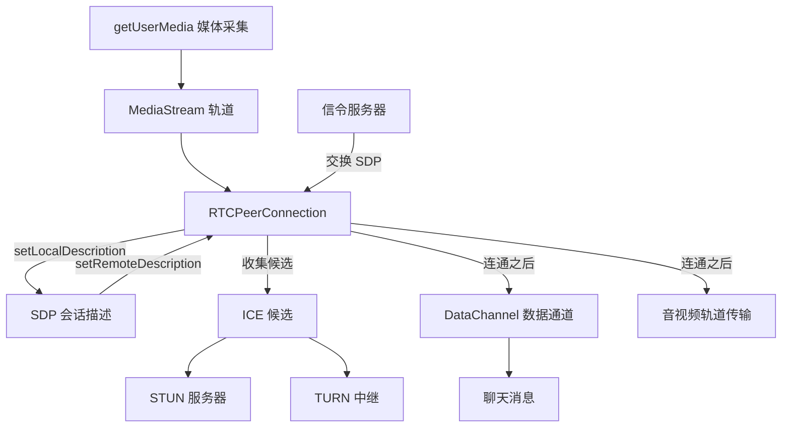
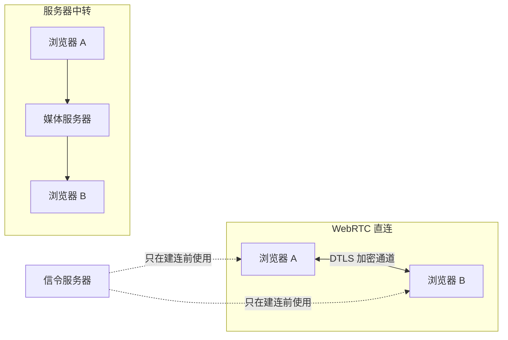
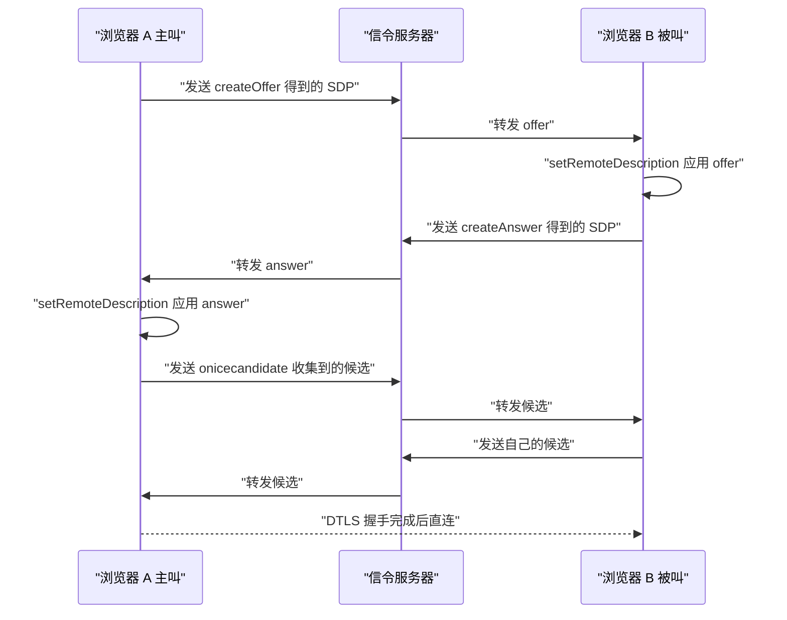
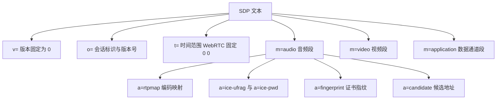
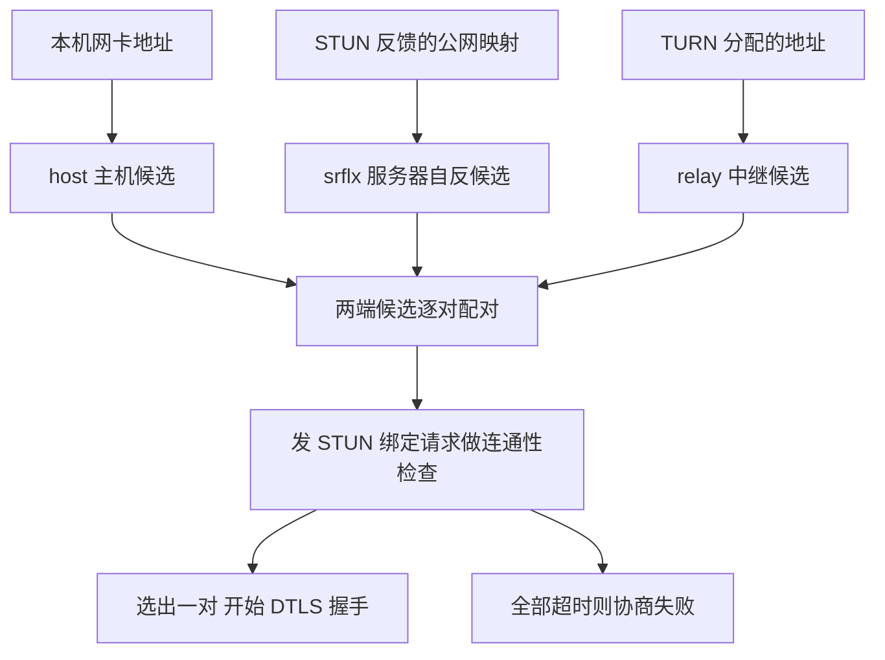
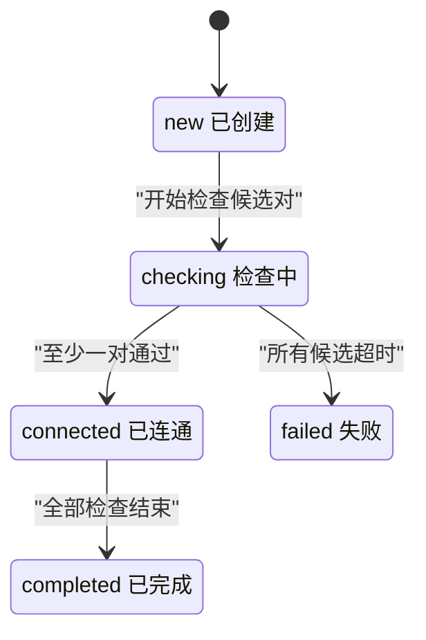
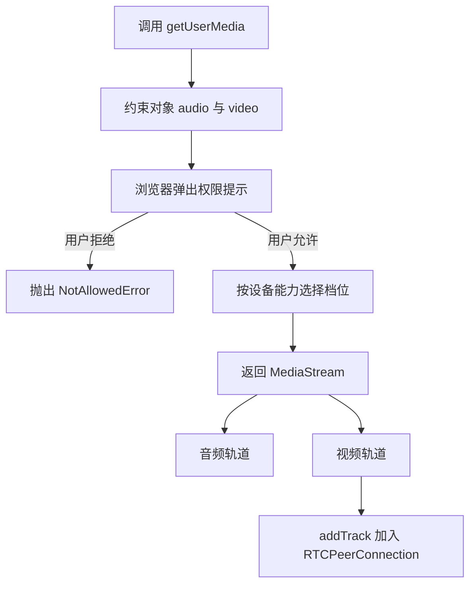
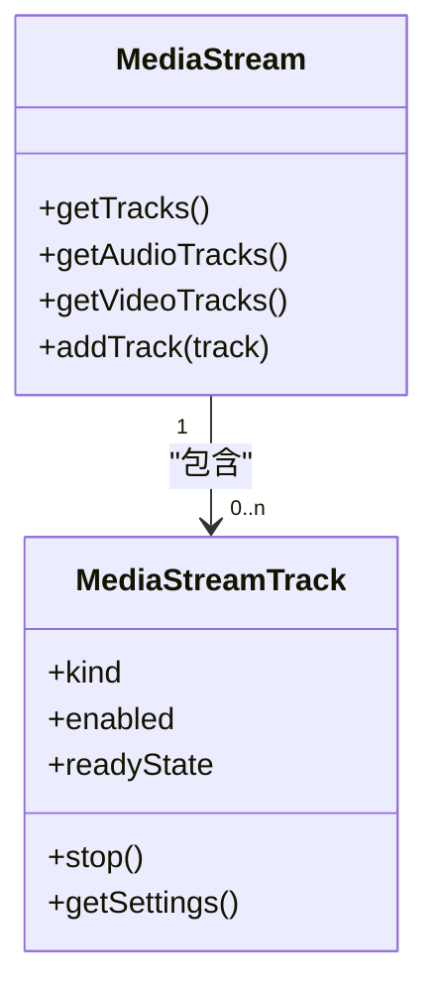
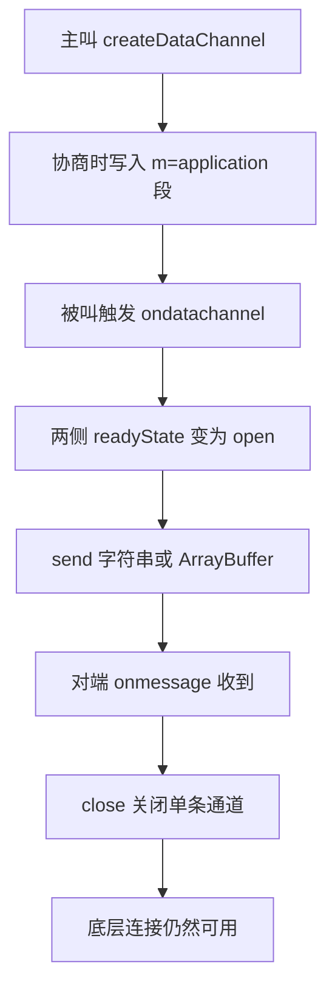
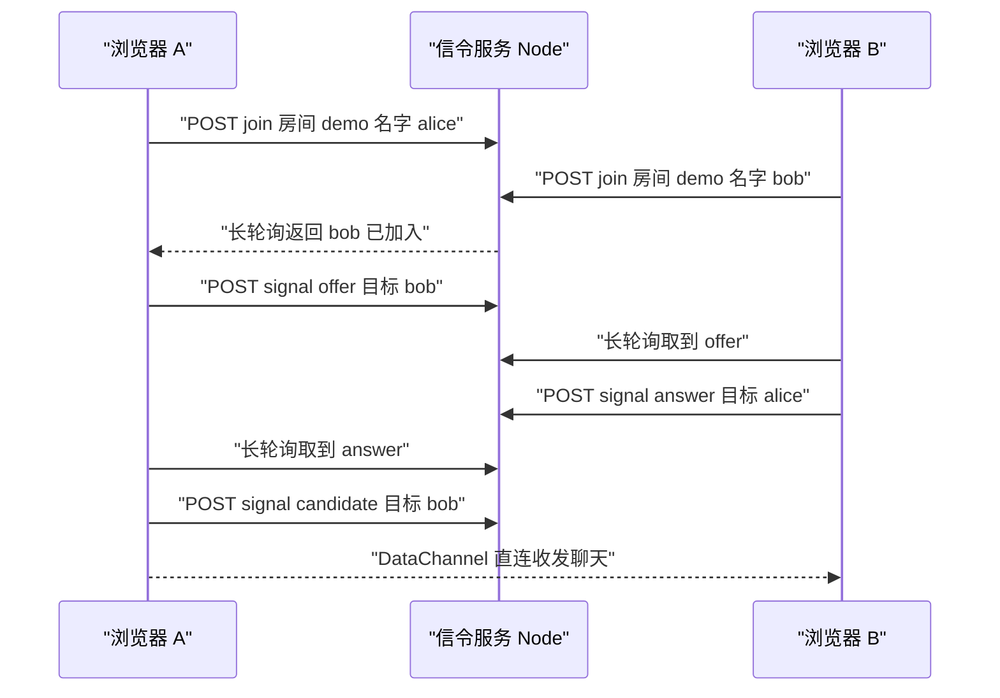

# WebRTC：浏览器里的点对点通信

!!! abstract "学完这一页你能"
    - 画出一次 WebRTC 建连里，信令、SDP、ICE 三段各自交换了什么。
    - 读懂一段 SDP 的 m= 行、a=ice-ufrag 与 a=candidate，说出每条媒体走向哪里。
    - 运行一个只用 Node 20 内置模块的信令服务，让两个浏览器交换 Offer 与 Answer 并打开 DataChannel。
    - 用一条公式算出 host、srflx、relay 三类候选的优先级，并说明流量在什么情况下会走 TURN。

## 0. 知识地图



建议怎么读：先读 1 到 3 节，把"信令换 SDP"这条主线走通。再读第 4 节，看候选地址怎么变成一条真正能通的链路。第 5 节解决媒体从哪里来，第 6 与第 7 节把所有零件拼成一个能跑的聊天。

## 1. WebRTC 到底省掉了什么

**先想一个问题**

10 个人开视频会议，每人上行码率 1.5 Mbps。如果所有流量先进服务器再转发，服务器的出带宽是多少？

**心智模型**

!!! tip "心智模型"
    一句话模型：WebRTC 是浏览器内置的一套协议栈加 API，让两个终端直接建立加密传输通道。
    日常类比：你要给同事送文件，先打电话问清他的工位，之后自己走过去，不再经过前台。
    类比不成立的地方：打电话这一步本身也要服务器，也就是信令；对称 NAT 或企业防火墙下打洞失败时，文件仍要经过 TURN 服务器转发。

**图解**



1. 左图里每个上行包都经过媒体服务器，服务器带宽随参与人数按乘积增长。
2. 右图里音视频与数据直接在 A、B 之间走，服务器只在开头帮着交换一次描述信息。
3. 虚线表示信令连接的存活时间通常短于媒体连接，媒体连上后信令断开不影响通话。

**一步一步来**

第 1 步：先算清中转与直连的带宽差。

① 这一步要做什么：用两个公式把两种拓扑的带宽成本写出来，看清差在哪里。

```js
// 中转拓扑：服务器要把每个人的流转发给其余所有人
function serverEgressMbps(n, b) { return n * (n - 1) * b; }
// 直连网格：服务器不出带宽，代价落在每个参与者的上行
function peerUplinkMbps(n, b) { return (n - 1) * b; }
```

**这段代码在做什么**

- 两个函数都接收参与人数 n 与单人码率 b。
- serverEgressMbps 算出服务器需要转发的总份数，等于 n 乘 n 减 1。
- peerUplinkMbps 算出每个参与者自己要上传几份，等于 n 减 1。
- 两个公式的差别就是"成本落在服务器"还是"成本落在终端"。

第 2 步：认出 WebRTC 只给了哪三块 API。

① 这一步要做什么：把浏览器能力先列成一张地图，后面每个细节都能挂到其中一块。

```js
// 浏览器里 WebRTC 相关能力可以归成三块
const webrtcSurface = {
  media: "navigator.mediaDevices.getUserMedia", // 采集摄像头与麦克风，得到 MediaStream
  connection: "RTCPeerConnection",              // 负责协商、收集候选、建立加密通道
  data: "RTCDataChannel",                       // 在已建立的通道上收发字符串或二进制
};
console.log(Object.keys(webrtcSurface).join(","));
```

**这段代码在做什么**

- 对象键名是用途，值是要调用的 API 名。
- 注释标明每块能力产出的对象：媒体流、连接、数据通道。
- 打印键名，确认三块能力并列存在。

运行结果：`media,connection,data`

第 3 步：列出 WebRTC 自己不提供的部分。

① 这一步要做什么：把必须由应用实现的服务列出来，避免后面误以为规范会替你解决。

```js
// 下面四件事规范故意不定义，要由应用自己实现
const outsideSpec = [
  ["信令服务器", "交换 SDP 与候选地址，用什么协议由应用决定"],
  ["STUN", "告诉终端它在 NAT 后面的公网地址"],
  ["TURN", "打洞失败时按字节转发，需要账号与配额"],
  ["业务鉴权", "谁能进入哪个房间，属于应用层逻辑"],
];
for (const [name, why] of outsideSpec) console.log(`${name}: ${why}`);
```

**这段代码在做什么**

- 数组每一项是两元组，第一项是组件名，第二项是它必须在规范之外的原因。
- 用 for...of 解构打印，输出四行。
- 这四行就是本页后面各节的目录。

运行结果：四行文本，分别是信令服务器、STUN、TURN、业务鉴权加各自的理由。

**动手验证**

```js
// 运行：node webrtc-cost.mjs
// 依赖：无，只用 Node 20 内置的 node:assert
import assert from "node:assert/strict";

const bitrateMbps = 1.5;   // 每人上行码率
const peers = 10;          // 参与人数

// 中转：服务器总出带宽等于 人数 乘 人数减一 乘 码率
const serverEgress = peers * (peers - 1) * bitrateMbps;
// 直连网格：每个参与者自己上传 人数减一 份
const perPeerUplink = (peers - 1) * bitrateMbps;

assert.equal(serverEgress, 135);      // 10 乘 9 乘 1.5
assert.equal(perPeerUplink, 13.5);    // 9 乘 1.5

// 三个人的小会议再看一次，差距随人数放大
assert.equal(3 * 2 * bitrateMbps, 9);
assert.equal((3 - 1) * bitrateMbps, 3);

console.log(`服务器中转出带宽 ${serverEgress} Mbps`);
console.log(`直连网格每人上行 ${perPeerUplink} Mbps`);
```

运行结果：

```text
服务器中转出带宽 135 Mbps
直连网格每人上行 13.5 Mbps
```

**常见坑**

| 现象 | 原因 | 怎么修 |
| --- | --- | --- |
| 以为引入 WebRTC 就不用服务器 | 信令与 TURN 都在规范之外 | 预算里同时列出信令服务与 TURN 带宽 |
| 本地能连，线上连不上 | 线上强制 https，WebRTC 只在安全上下文可用 | 部署时配置 TLS 证书 |
| 参会人数一多就卡 | 直连网格里每人上行按人数递增 | 超过 4 人改用 SFU 媒体服务器 |

**小结**

- WebRTC 省掉的是媒体与数据的转发路径，不省信令。
- 成本要么落在服务器出带宽，要么落在终端上行，两个公式可以提前估算。
- 规范只给三块 API：采集、连接、数据通道。

## 2. 信令流程：一次 Offer 一次 Answer

**先想一个问题**

A 的浏览器能编 H.264，B 的浏览器只支持 VP8。两边怎么知道对方的底牌，才不至于发出对方解不了的流？

**心智模型**

!!! tip "心智模型"
    一句话模型：信令是一条由应用自己挑的传输通道，只用来搬两样东西，会话描述和网络候选地址。
    日常类比：两个人约见面，先互发一条短信，写清"我几点到几点有空、我熟悉的地铁站是哪几个"。
    类比不成立的地方：短信谁先发都行，WebRTC 规定必须先有一方发出 Offer，另一方才能回 Answer，顺序反了协商会停在中间状态。

!!! note "术语：SDP"
    定义：Session Description Protocol，会话描述协议，是一份纯文本的键值清单，描述这次连接里有哪些媒体、每段媒体用什么编码、加密指纹是什么。例子：`m=audio 9 UDP/TLS/RTP/SAVPF 111` 表示这是一段音频，走 UDP，载荷类型是 111。

!!! note "术语：Offer 与 Answer"
    定义：Offer 是主叫方生成的会话描述，Answer 是被叫方针对该描述生成的回应描述，两者合起来叫一次协商。例子：主叫 `createOffer`，被叫 `createAnswer`。

**图解**



1. 主叫生成 Offer，此时只产生文本，还没有发出任何包。
2. 信令服务器只按目标地址转发，不解析 SDP 内容。
3. 被叫把 Offer 设为远端描述，浏览器据此算出自己能接受的编码组合。
4. 被叫生成 Answer 并回传，主叫把它设为远端描述。
5. 两侧各自收集候选地址，通过信令持续交换。
6. 候选对连通性检查通过后，两侧做 DTLS 握手。
7. 握手完成，音视频与数据开始在这条加密通道上走。

**一步一步来**

第 1 步：认识协商状态机。

① 这一步要做什么：先记住三个状态名，后面看日志能立刻判断卡在哪一步。

```js
// signalingState 在规范里是只读属性，取值决定当前能调哪个方法
const flow = [
  "stable",              // 初始状态，可以发起协商，也可以接受协商
  "have-local-offer",    // 已调用 setLocalDescription 传入 offer
  "stable",              // 收到 answer 并 setRemoteDescription 之后回到稳定
];
console.log(flow.join(" -> "));
```

**这段代码在做什么**

- 数组按时间顺序列出主叫方经历的状态。
- 首尾都是 stable，说明一次协商结束会回到可再次协商的状态。
- 中间状态有且只有一个，就是"我发了 Offer 还没收到 Answer"。

运行结果：`stable -> have-local-offer -> stable`

第 2 步：设计一条信令消息的最小结构。

① 这一步要做什么：把消息定成可以路由、可以序列化的形状，服务端只认外层字段。

```js
// 信令消息最小字段：谁发的、发给谁、什么类型、载荷是什么
const envelope = {
  type: "offer",                 // 取值有 offer、answer、candidate 三类
  from: "alice",                 // 发送方的连接标识
  to: "bob",                     // 接收方的连接标识
  payload: { sdp: "v=0" },       // offer 与 answer 放 SDP，candidate 放候选对象
};
const wire = JSON.stringify(envelope);  // 过网络前序列化成字符串
const back = JSON.parse(wire);          // 接收端反序列化后按 type 分发
console.log(back.type, back.to);
```

**这段代码在做什么**

- 外层四个字段负责路由，服务端只看 from 与 to。
- payload 的内容对信令服务透明，服务端不做解析。
- 序列化与反序列化各出现一次，说明跨进程传输的边界在 JSON 这一层。

运行结果：`offer bob`

第 3 步：写主叫方的调用顺序。

① 这一步要做什么：把创建通道、生成 Offer、应用本地描述、发出这一串动作排成确定顺序。

```js
// 主叫方顺序：建通道，生成 offer，设置本地描述，然后发出
async function startAsCaller(pc, send) {
  const dc = pc.createDataChannel("chat"); // 先建通道，offer 里会带上它
  const offer = await pc.createOffer();    // 生成 SDP 文本对象
  await pc.setLocalDescription(offer);     // 应用到本地，同时触发候选收集
  send({ type: "offer", payload: { sdp: pc.localDescription.sdp } });
  return dc;                               // 返回通道供后续发送消息
}
```

**这段代码在做什么**

- createDataChannel 必须在 createOffer 之前调用，否则 Offer 里没有数据通道段。
- `await pc.createOffer()` 只生成文本，不改变连接状态。
- setLocalDescription 才是状态迁移点，调用后 signalingState 变成 have-local-offer。
- `pc.localDescription.sdp` 是浏览器补全后的完整描述，发它比发原始 offer 对象稳妥。

第 4 步：写被叫方的应答顺序。

① 这一步要做什么：收到远端 Offer 后设置远端描述，再生成并发出 Answer。

```js
// 被叫方顺序：先应用远端 offer，再生成 answer，再应用并发出
async function answerAsCallee(pc, offerSdp, send) {
  await pc.setRemoteDescription({ type: "offer", sdp: offerSdp });
  const answer = await pc.createAnswer();  // 根据远端描述算出可接受的组合
  await pc.setLocalDescription(answer);    // 应用到本地，触发候选收集
  send({ type: "answer", payload: { sdp: pc.localDescription.sdp } });
}
```

**这段代码在做什么**

- createAnswer 之前必须先 setRemoteDescription，否则会抛错。
- Answer 的内容依赖远端 Offer，所以它不能由主叫方提前生成。
- 被叫方不调用 createDataChannel，它用 ondatachannel 事件拿通道。

**动手验证**

```js
// 运行：node signaling-fsm.mjs
// 依赖：无
import assert from "node:assert/strict";

// 用集合描述合法迁移，键的格式是 当前状态 加 动作 加 目标状态
const legal = new Set([
  "stable|setLocal(offer)->have-local-offer",
  "have-local-offer|setRemote(answer)->stable",
  "stable|setRemote(offer)->have-remote-offer",
  "have-remote-offer|setLocal(answer)->stable",
]);

function step(state, action, next) {
  const key = `${state}|${action}->${next}`;
  assert.ok(legal.has(key), `非法迁移 ${key}`);
  return next;
}

let state = "stable";
state = step(state, "setLocal(offer)", "have-local-offer");
state = step(state, "setRemote(answer)", "stable");
// 在稳定状态直接应用 answer 属于非法操作，规范里会抛错
assert.throws(() => step("stable", "setRemote(answer)", "stable"));
console.log("最终状态", state);
```

运行结果：

```text
最终状态 stable
```

**常见坑**

| 现象 | 原因 | 怎么修 |
| --- | --- | --- |
| 报 InvalidStateError 说 createAnswer 顺序不对 | 没有先 setRemoteDescription | 把 setRemoteDescription 放在 createAnswer 之前 |
| 信令收到消息但协商不动 | 服务端把 offer 发给了发送者自己 | 转发时按 to 字段定向投递 |
| 第二次协商直接失败 | 上一次没有回到 stable 就再次 createOffer | 用 signalingState 做前置判断 |

**小结**

- 一次协商就是 Offer 与 Answer 两个方向的描述交换。
- 状态迁移只发生在 setLocalDescription 与 setRemoteDescription 两处。
- 信令服务只做路由，不解析 SDP。

## 3. SDP：把它看成一份能力清单

**先想一个问题**

浏览器打印出 90 行 SDP，其中哪一行决定了音频用 Opus 编码？

**心智模型**

!!! tip "心智模型"
    一句话模型：SDP 是一张写明"我发什么、我收什么、我如何被加密"的表格，双方各交一张，交集就是可用的部分。
    日常类比：两份菜单对照，只有两边都写了的菜才能下单。
    类比不成立的地方：SDP 里有些行不是能力，而是连接参数，比如 ice-ufrag 与 fingerprint，它们必须匹配，不能取交集。

!!! note "术语：媒体段"
    定义：SDP 里以 `m=` 开头的一段内容，连同它后面所有 `a=` 行，描述一路独立的媒体或数据通道。例子：一段 `m=audio` 后面跟着 `a=rtpmap`，就是音频这一路的完整描述。

**图解**



1. v= 固定为 0，代表 SDP 版本号是 0，跟 WebRTC 版本无关。
2. o= 描述会话标识，答方会复用其中的部分字段。
3. t= 描述会话有效时间，WebRTC 场景写 0 0。
4. 一个 SDP 里可以有多个 m= 段落，每段对应一路媒体或数据通道。
5. a= 行是属性，前面的属于会话级，出现在 m= 之后的属于该媒体段。
6. rtpmap、ice-ufrag、fingerprint、candidate 都挂在各自媒体段里。

**一步一步来**

第 1 步：把 SDP 切成会话级与媒体段。

① 这一步要做什么：写一个只看 m= 边界的解析器，先把结构拆出来。

```js
// 逐行扫描，遇到 m= 就新开一段，其余行归到当前段
export function parseSdp(text) {
  const lines = text.split(/\r?\n/);      // SDP 允许 CRLF 与 LF
  const session = [];                     // m= 之前的行
  const media = [];                       // 每个元素是一段媒体的行数组
  for (const line of lines) {
    if (line.length === 0) continue;      // 忽略空行
    if (line.startsWith("m=")) media.push([line]);   // 新开一段
    else if (media.length === 0) session.push(line); // 还在会话级
    else media[media.length - 1].push(line);         // 归到当前段
  }
  return { session, media };
}
```

**这段代码在做什么**

- 用 `${"\r\n"}` 与 `\n` 两种换行都兼容的正则切行。
- session 收集 m= 之前的字段，媒体段数组收集每一段的全部行。
- media 数组的长度就是这次协商里有几路媒体或通道。
- 解析器不做语义判断，只负责分段，语义留给下一步。

第 2 步：从一段里取出属性值。

① 这一步要做什么：写一个按前缀找值的小函数，读取 ice-ufrag 这类关键字段。

```js
// 在某段的行里找以 prefix 开头的行，返回去掉前缀后的值
function attr(lines, prefix) {
  const hit = lines.find((l) => l.startsWith(prefix));
  return hit ? hit.slice(prefix.length) : null;  // 找不到返回 null
}
// ice-ufrag 与 ice-pwd 成对出现，缺任意一个说明这段媒体没启用 ICE
const ufrag = attr(mediaLines, "a=ice-ufrag:");
const pwd = attr(mediaLines, "a=ice-pwd:");
console.log(ufrag, pwd ? "有密码" : "缺密码");
```

**这段代码在做什么**

- find 返回第一个匹配行，SDP 里同名前缀通常只出现一次。
- slice 掉前缀长度，剩下的就是纯值。
- 缺失时返回 null，调用方用真假判断即可。
- 输出里只打印密码是否存在，避免把凭据写进日志。

第 3 步：读懂 m= 行的字段。

① 这一步要做什么：把 m= 行按空格拆开，认出每个位置代表什么。

```js
// m= 行格式：m= 媒体类型 端口 传输协议 载荷类型列表
const mLine = "m=application 9 UDP/DTLS/SCTP webrtc-datachannel";
const [, kind, port, proto, ...formats] = mLine.split(" ");
console.log(kind, port, proto, formats.join(" "));
```

**这段代码在做什么**

- 第一个元素是 `m=application` 整体，用数组解构的逗号位跳过。
- kind 是媒体类型，这里是 application，表示数据通道而不是音视频。
- port 在 WebRTC 里是占位值 9，真实端口由 ICE 候选给出。
- proto 描述传输协议栈，这里依次是 UDP、DTLS、SCTP。
- formats 是载荷类型列表，数据通道这里直接写协议名。

运行结果：`application 9 UDP/DTLS/SCTP webrtc-datachannel`

**动手验证**

```js
// 运行：node parse-sdp.mjs
// 依赖：无
import assert from "node:assert/strict";

// 精简示例，只保留本页要读的字段
const sample = [
  "v=0",
  "o=- 4611731400430051336 2 IN IP4 127.0.0.1",
  "s=-",
  "t=0 0",
  "m=audio 9 UDP/TLS/RTP/SAVPF 111",
  "a=ice-ufrag:F7gI",
  "a=ice-pwd:x9c1cdi073r5v0j9v",
  "a=rtpmap:111 opus/48000/2",
  "m=application 9 UDP/DTLS/SCTP webrtc-datachannel",
  "a=ice-ufrag:h2Kd",
  "a=ice-pwd:p0a1b2c3d4e5f6g7h8",
].join("\r\n");

function parseSdp(text) {
  const media = [];
  for (const line of text.split(/\r?\n/)) {
    if (line.startsWith("m=")) media.push([line]);
    else if (media.length > 0) media[media.length - 1].push(line);
  }
  return media;
}
function attr(lines, prefix) {
  const hit = lines.find((l) => l.startsWith(prefix));
  return hit ? hit.slice(prefix.length) : null;
}

const sections = parseSdp(sample);
assert.equal(sections.length, 2);
const kinds = sections.map((s) => s[0].split(" ")[0].slice(2));
assert.deepEqual(kinds, ["audio", "application"]);
const ufrags = sections.map((s) => attr(s, "a=ice-ufrag:"));
assert.deepEqual(ufrags, ["F7gI", "h2Kd"]);
assert.equal(attr(sections[0], "a=rtpmap:"), "111 opus/48000/2");
console.log("媒体段", kinds.join(","));
```

运行结果：

```text
媒体段 audio,application
```

**常见坑**

| 现象 | 原因 | 怎么修 |
| --- | --- | --- |
| Answer 里没有 m=application 段 | 被叫方也调了 createDataChannel | 只让主叫方创建，被叫方监听 ondatachannel |
| 两侧 ice-ufrag 相同 | 从模板复制粘贴了整段 SDP | 描述由浏览器自己生成，不要手写 |
| 手写的 SDP 行用 \n 拼接后校验失败 | 部分实现按 CRLF 校验 | 用 \r\n 拼接 |

**小结**

- SDP 是文本清单，m= 行划出媒体段，a= 行给出属性。
- 一段 SDP 里有几个 m=，这次协商就有几路媒体或通道。
- 解析时先分段再取值，两步分开写更容易测试。

## 4. ICE、STUN、TURN：把地址找到并连通

**先想一个问题**

A 在家庭路由器后面，浏览器只知道自己的私有地址 192.168.1.5。B 把包发到这个地址会发生什么？

**心智模型**

!!! tip "心智模型"
    一句话模型：ICE 是候选地址的集合加一套试错排序，STUN 帮候选发现公网映射，TURN 是最后一条保底通路。
    日常类比：在陌生商场约见面，先试对方手机，再试微信语音，都不通就请商场广播找人。
    类比不成立的地方：ICE 会同时发起多组连通性检查，不是一条不通再换下一条。

!!! note "术语：NAT"
    定义：Network Address Translation，网络地址转换，路由器把内网私有地址改写成公网地址再发出去。例子：内网的 192.168.1.5:5000 出门后显示为 203.0.113.7:51234。

!!! note "术语：ICE"
    定义：Interactive Connectivity Establishment，交互式连接建立，把所有可能地址都试一遍，选出一对能通的。例子：同时尝试 192.168.1.5:5000 与 203.0.113.7:51234。

!!! note "术语：STUN"
    定义：Session Traversal Utilities for NAT，用来问服务器"我在你眼里是什么公网地址和端口"。例子：向 stun 服务器发一个绑定请求，服务器回显你的公网映射。

!!! note "术语：TURN"
    定义：Traversal Using Relays around NAT，打洞失败时由服务器按字节转发数据。例子：两端都把包发到 TURN 服务器，再由它转给对方。

!!! note "术语：候选"
    定义：candidate，一个"IP 地址加端口加传输协议"的组合，配合类型与优先级参与连通性检查。例子：类型 host 的 192.168.1.5:5000，类型 relay 的 198.51.100.1:6000。

**图解**



1. host 候选来自本机网卡，优先级最高，同局域网时直接用它。
2. srflx 候选来自 STUN 回显，代表你在公网看到的地址。
3. relay 候选来自 TURN 分配，优先级最低，只在其他候选都不通时使用。
4. 两端候选互相配对，形成候选对列表。
5. 候选对按优先级排序，依次发起 STUN 绑定请求。
6. 收到成对响应就说明这条路径双向可达。
7. 选出一对后立刻进入 DTLS 握手，握手完成才可以传数据。

连接状态的变化顺序如下。



**一步一步来**

第 1 步：配置 ICE 服务器。

① 这一步要做什么：把 STUN 与 TURN 的地址交给浏览器，让它在收集阶段知道去哪里问。

```js
// 顺序决定候选被收集的先后，relay 永远排在最后被使用
const iceConfig = {
  iceServers: [
    { urls: "stun:stun.example.org:3478" },      // 只做地址发现
    { urls: "turns:turn.example.org:5349",        // 打洞失败时的中继
      username: "user1",
      credential: "token-from-server" },          // 凭据应由后端临时签发
  ],
  iceTransportPolicy: "all",   // 改为 relay 就只收集中继候选，便于排查
};
new RTCPeerConnection(iceConfig);
```

**这段代码在做什么**

- iceServers 是数组，每项至少要有 urls。
- STUN 条目不需要凭据，TURN 条目必须带 username 与 credential。
- turns 比 turn 多一层 TLS，用 5349 端口时通常走 TLS。
- iceTransportPolicy 设为 relay 可以强制走中继，用来验证 TURN 是否配置正确。

第 2 步：算候选优先级。

① 这一步要做什么：按 RFC 8445 的公式算，理解为什么 host 会排在 relay 前面。

```js
// RFC 8445 5.1.2.2 的优先级公式
const TYPE_PREF = { host: 126, prflx: 110, srflx: 100, relay: 0 };
const LOCAL_PREF = 65535;   // 规范默认值，取值范围 0 到 65535
function candidatePriority(type, component) {
  // 三项分别是类型偏好、本地偏好、组件编号的补数
  return (2 ** 24) * TYPE_PREF[type] + (2 ** 8) * LOCAL_PREF + (256 - component);
}
```

**这段代码在做什么**

- 类型偏好占最高 8 位，它直接决定候选大类之间的排序。
- 本地偏好占中间 8 位，用于同类型候选之间再做区分。
- 组件编号占最低 1 字节，音频用 1，它的补数是 255。
- 公式里出现 2 的 24 次方，是为了让类型偏好压过其余两项。

第 3 步：把候选对排序后依次检查。

① 这一步要做什么：先按优先级降序排列，再从高到低发绑定请求，第一个成功的就被选中。

```js
// 排序后从前往后检查，第一个收到成功响应的候选对被选中
function pairKey(local, remote) {
  return `${local.ip}:${local.port}|${remote.ip}:${remote.port}`;
}
function checkedPairs(locals, remotes) {
  const pairs = [];
  for (const l of locals) for (const r of remotes) {
    // 组合优先级取两个候选优先级的较小值，这是规范要求的做法
    pairs.push({ key: pairKey(l, r), priority: Math.min(l.priority, r.priority) });
  }
  return pairs.sort((a, b) => b.priority - a.priority);
}
```

**这段代码在做什么**

- 双重循环生成本地候选与远端候选的全部组合。
- 组合优先级取两个候选优先级的较小值，保证排序结果偏保守。
- 排序后按降序检查，高优先级通畅时就不会用到中继。
- 只返回键与优先级，真实检查由浏览器内部完成。

**动手验证**

```js
// 运行：node ice-priority.mjs
// 依赖：无
import assert from "node:assert/strict";

const TYPE_PREF = { host: 126, prflx: 110, srflx: 100, relay: 0 };
const LOCAL_PREF = 65535;

function priority(type, component) {
  return (2 ** 24) * TYPE_PREF[type] + (2 ** 8) * LOCAL_PREF + (256 - component);
}

const candidates = [
  { type: "relay", ip: "198.51.100.1", component: 1 },
  { type: "srflx", ip: "203.0.113.7", component: 1 },
  { type: "host", ip: "192.168.1.5", component: 1 },
].map((c) => ({ ...c, priority: priority(c.type, c.component) }));

candidates.sort((a, b) => b.priority - a.priority);

assert.equal(candidates[0].priority, 2130706431);   // host 最大
assert.equal(candidates[1].priority, 1694498815);   // srflx 居中
assert.equal(candidates[2].priority, 16777215);     // relay 最小
assert.equal(priority("host", 2), 2130706430);      // 组件编号变大，优先级减一
console.log(candidates.map((c) => `${c.type}=${c.priority}`).join(" "));
```

运行结果：

```text
host=2130706431 srflx=1694498815 relay=16777215
```

**常见坑**

| 现象 | 原因 | 怎么修 |
| --- | --- | --- |
| 本地能连，公司网络连不上 | 企业防火墙封 UDP，且没配 TURN | 在 iceServers 里补 turns 条目 |
| iceConnectionState 停在 checking | 只把一方的候选转发给了对方 | 检查 onicecandidate 是否全部转发 |
| TURN 流量费用异常高 | 长期有效的 TURN 凭据被外部复用 | 后端按次签发短期凭据并加配额 |

**小结**

- 候选分 host、srflx、relay 三类，优先级由类型偏好决定。
- STUN 只负责地址发现，不转发业务数据。
- 只有其他候选都不通时才会走 TURN，中继是保底而不是默认。

## 5. 媒体采集：getUserMedia 与轨道

**先想一个问题**

用户笔记本上有两个摄像头，代码申请 1280x720 的前置摄像头，浏览器最终会给他什么参数？

**心智模型**

!!! tip "心智模型"
    一句话模型：采集分两步，先用约束向浏览器申请，再由浏览器在设备能力范围内挑一个最接近的档位。
    日常类比：点外卖时写"微辣、不要香菜"，厨房按现有食材尽量满足。
    类比不成立的地方：浏览器不会主动告诉你它妥协了哪一条，要读 track.getSettings() 才能知道实际参数。

!!! note "术语：MediaStream"
    定义：媒体流，是一个容器，里面装着若干条 MediaStreamTrack，每条轨道是一路独立音视频源。例子：一条流里可以同时有 1 条音频轨道与 1 条视频轨道。

!!! note "术语：MediaStreamTrack"
    定义：单条轨道，常用属性有 kind、enabled、readyState，可以单独加入 RTCPeerConnection。例子：把 sender 上的视频轨道换成另一个摄像头的轨道。

**图解**



1. getUserMedia 接收一个约束对象，它描述你希望要什么。
2. 浏览器按站点权限决定是否弹出提示。
3. 用户拒绝时返回被拒绝的 Promise，错误对象带 name 字段。
4. 允许后浏览器在设备支持的档位里选一个最接近申请值的。
5. 返回的 MediaStream 是容器，里面可能有音频轨道，也可能有视频轨道。
6. 把轨道 addTrack 到连接上，协商通过后对方才能收到。

媒体对象之间的包含关系如下。



**一步一步来**

第 1 步：申请采集并处理失败。

① 这一步要做什么：发起采集请求，同时把三类常见错误接住，避免页面白屏。

```js
// 申请麦克风与摄像头，失败时打印错误名再向上抛
async function openDevices() {
  try {
    return await navigator.mediaDevices.getUserMedia({
      audio: { echoCancellation: true },   // 打开回声消除，通话场景常用
      video: {
        width: { ideal: 1280 },            // ideal 是希望值，不满足也不报错
        height: { ideal: 720 },
        facingMode: "user",                // 优先前置摄像头
      },
    });
  } catch (err) {
    // 常见 name 有 NotAllowedError、NotFoundError、NotReadableError
    console.error(err.name, err.message);
    throw err;
  }
}
```

**这段代码在做什么**

- audio 与 video 同时请求，任意一项失败整个 Promise 会拒绝。
- ideal 表示可接受偏差，换成 exact 就变成必须满足，不满足直接报错。
- facingMode 在笔记本上通常被忽略，在移动端用来选前后摄像头。
- 错误对象的 name 是判断原因的主要依据，message 只适合打日志。

第 2 步：把轨道加入连接。

① 这一步要做什么：遍历流里的轨道，逐条加进 RTCPeerConnection，加完等协商。

```js
// 把流里的每条轨道加进连接，返回被创建出来的 sender
function publish(pc, stream) {
  for (const track of stream.getTracks()) {
    const sender = pc.addTrack(track, stream);   // 第二个参数标记轨道归属
    console.log("已加入", track.kind, sender.constructor.name);
  }
}
```

**这段代码在做什么**

- getTracks 返回音频与视频轨道的合并数组。
- addTrack 返回 RTCRtpSender，后续替换轨道要靠它。
- 第二个参数 stream 用于让接收端的 track 事件拿到正确的流归属。
- 加入轨道后需要一次新的协商，否则对方收不到。

运行结果：两行文本，分别是 audio 与 video 加 sender 的类名。

第 3 步：核对实际生效的参数。

① 这一步要做什么：读 getSettings，看浏览器是否满足了申请值。

```js
// 浏览器可能降级，读 getSettings 才能知道真实参数
const track = stream.getVideoTracks()[0];
const s = track.getSettings();
console.log(s.width, s.height, s.frameRate);
// 打印 640 480 30 说明浏览器没有满足 1280 的申请
```

**这段代码在做什么**

- getVideoTracks 返回视频轨道的数组，取第 0 个即可。
- getSettings 返回当前实际生效的参数，不是申请值。
- 与申请值比对就能知道浏览器在哪一项上做了降级。

运行结果：例如 `640 480 30`。

第 4 步：替换轨道。

① 这一步要做什么：切换摄像头时不重建连接，只把 sender 上的轨道换掉。

```js
// 换摄像头：先取新流，再替换 sender 上的轨道
async function switchCamera(sender) {
  const next = await navigator.mediaDevices.getUserMedia({ video: true });
  const newTrack = next.getVideoTracks()[0];
  await sender.replaceTrack(newTrack);   // 连接不中断，对方画面直接切换
  return newTrack;
}
```

**这段代码在做什么**

- replaceTrack 不触发重新协商，比重新 addTrack 更快切换。
- 旧轨道不会自动停止，需要在替换后调用旧的 stop 释放摄像头。
- 返回新轨道便于调用方保存引用。

**动手验证**

```js
// 运行：node constraint-match.mjs
// 依赖：无
import assert from "node:assert/strict";

// 模拟浏览器在候选档位里挑一个：先过滤掉超过申请宽度的，再选最接近的
const ladder = [
  { width: 320, height: 240, frameRate: 30 },
  { width: 640, height: 480, frameRate: 30 },
  { width: 1280, height: 720, frameRate: 30 },
  { width: 1920, height: 1080, frameRate: 60 },
];

function pick(ideal) {
  const legal = ladder.filter((c) => c.width <= ideal.width);
  assert.ok(legal.length > 0, "没有可用档位");
  return legal.reduce((best, c) =>
    Math.abs(c.width - ideal.width) < Math.abs(best.width - ideal.width) ? c : best);
}

assert.deepEqual(pick({ width: 1280 }), { width: 1280, height: 720, frameRate: 30 });
assert.equal(pick({ width: 1000 }).width, 640);   // 190 与 360 相比，640 更接近
assert.equal(pick({ width: 300 }).width, 320);
assert.equal(pick({ width: 4000 }).width, 1920);
console.log("选中档位", JSON.stringify(pick({ width: 1000 })));
```

运行结果：

```text
选中档位 {"width":640,"height":480,"frameRate":30}
```

**常见坑**

| 现象 | 原因 | 怎么修 |
| --- | --- | --- |
| http 页面上 mediaDevices 是 undefined | 该 API 只在安全上下文可用 | 本地用 localhost，线上必须 https |
| 页面没弹提示就直接失败 | 用户之前选了拒绝，浏览器记住了 | 引导用户到地址栏权限设置重新允许 |
| 切到后台标签页帧率掉到 1 | 后台标签页被浏览器节流 | 测试时保持标签页在前台 |

**小结**

- 采集用约束描述需求，浏览器按设备能力挑档位。
- 实际生效的参数要读 getSettings，不能只看申请值。
- 替换轨道用 sender.replaceTrack，不需要重新协商。

## 6. DataChannel：不传媒体也能点对点

**先想一个问题**

两个浏览器已经建好连接，现在只想传一段 JSON 文本，还需要再开一路 RTP 吗？

**心智模型**

!!! tip "心智模型"
    一句话模型：DataChannel 是连接里的一个命名管道，可靠性与顺序由创建时的选项决定。
    日常类比：两个房间之间开了一个传菜口，传文件还是传便条由你决定。
    类比不成立的地方：传菜口只有一个，同一条连接上可以开多条 DataChannel，各自有独立的可靠性设置。

!!! note "术语：DataChannel"
    定义：RTCDataChannel，建立在 SCTP over DTLS 之上的双向数据通道，可以收发字符串或二进制，默认可靠有序。例子：`dc.send("hello")`，对端在 `dc.onmessage` 收到字符串。

!!! note "术语：SCTP"
    定义：Stream Control Transmission Protocol，为数据通道提供多路复用与可靠性控制的传输层协议。例子：SDP 里的 `m=application 9 UDP/DTLS/SCTP webrtc-datachannel`。

**图解**



1. 只有主叫方调用 createDataChannel，被叫方不要调用。
2. 协商时这一段会以 m=application 出现在 SDP 里。
3. 被叫方通过 ondatachannel 事件拿到同一条通道。
4. 两侧 readyState 都变成 open 之后才能发送。
5. send 接受字符串与 ArrayBuffer，对象要自己编码。
6. 对端在 onmessage 里收到，事件对象的 data 字段就是内容。
7. close 只关闭这一条通道，底层的 PeerConnection 不受影响。

**一步一步来**

第 1 步：用选项决定通道语义。

① 这一步要做什么：分清可靠有序与允许丢包的两种用法，按业务选。

```js
// 聊天场景：可靠且有序，丢失的分片会自动重传
const chat = pc.createDataChannel("chat", { ordered: true });
// 实时位置同步：允许乱序且不重传，宁可丢旧帧也不要延迟
const pos = pc.createDataChannel("pos", { ordered: false, maxRetransmits: 0 });
console.log(chat.label, pos.label);
```

**这段代码在做什么**

- label 是通道名，接收端靠它区分不同用途的通道。
- ordered 为 true 时按发送顺序交付，代价是前面卡住会拖住后面。
- maxRetransmits 设为 0 表示不重传，适合实时性优先的数据。
- 两个选项可以组合，但不能同时设置 maxRetransmits 与 maxPacketLifeTime。

运行结果：`chat pos`

第 2 步：被叫方监听通道。

① 这一步要做什么：被叫方不主动创建，改为监听事件，否则会多出两条通道。

```js
// 被叫方只监听，不要调 createDataChannel
pc.ondatachannel = (event) => {
  const dc = event.channel;               // 与对端创建的那条通道同源
  dc.onopen = () => console.log("通道打开", dc.label);
  dc.onmessage = (e) => console.log("收到", e.data);
  dc.onclose = () => console.log("通道关闭");
};
```

**这段代码在做什么**

- ondatachannel 的 event.channel 是对端发起的那条通道。
- 必须在这里挂 onmessage，挂晚了会丢掉先到的几条消息。
- onclose 在对端调用 close 或连接断开时触发。

第 3 步：收发 JSON 消息。

① 这一步要做什么：给 send 加状态判断，并约定两边都用字符串承载 JSON。

```js
// 通道只认字符串与二进制，对象要自己编码
function sendJson(dc, payload) {
  if (dc.readyState !== "open") return false;   // 未打开时 send 会抛错
  dc.send(JSON.stringify(payload));
  return true;
}
// 接收端按同样的约定解码
function onJson(dc, handler) {
  dc.onmessage = (e) => handler(JSON.parse(e.data));
}
```

**这段代码在做什么**

- readyState 只有 open 时才能发送，其余取值下 send 会抛错。
- sendJson 返回布尔值，调用方可以据此决定是否入队重试。
- onJson 把解码与业务处理分开，业务函数只关心对象。

第 4 步：处理发送缓冲区。

① 这一步要做什么：大文件或高频消息时读 bufferedAmount，避免内存一直涨。

```js
// bufferedAmount 是还没发出去的字节数，过高时要暂停发送
const HIGH_WATER = 8 * 1024 * 1024;   // 8 MiB 阈值，按业务调整
function safeSend(dc, text) {
  if (dc.readyState !== "open") return false;
  if (dc.bufferedAmount > HIGH_WATER) return false;  // 交给上层稍后重试
  dc.send(text);
  return true;
}
```

**这段代码在做什么**

- bufferedAmount 只统计还没交给网络的字节数，不包含在途数据。
- 返回 false 表示这次没发出去，调用方要负责重试或丢弃。
- 阈值按消息大小与网络条件设置，没有通用取值。

**动手验证**

```js
// 运行：node datachannel-sim.mjs
// 依赖：无
// 说明：Node 20 没有 RTCDataChannel，本脚本用内存事件复现 send 与 onmessage 的语义
import assert from "node:assert/strict";
import { EventEmitter } from "node:events";

function createPair() {
  const a = new EventEmitter();
  const b = new EventEmitter();
  a.readyState = "open";
  b.readyState = "open";
  a.send = (text) => { assert.equal(a.readyState, "open"); b.emit("message", { data: text }); };
  b.send = (text) => { assert.equal(b.readyState, "open"); a.emit("message", { data: text }); };
  return [a, b];
}

const [alice, bob] = createPair();
const seenByAlice = [];
alice.onmessage = (e) => seenByAlice.push(JSON.parse(e.data));

bob.send(JSON.stringify({ from: "bob", text: "在吗" }));
assert.equal(seenByAlice.length, 1);
assert.equal(seenByAlice[0].text, "在吗");

bob.readyState = "closed";                 // 关闭后再发必须报错
assert.throws(() => bob.send("x"));
console.log("收到消息", seenByAlice[0].from, seenByAlice[0].text);
```

运行结果：

```text
收到消息 bob 在吗
```

**常见坑**

| 现象 | 原因 | 怎么修 |
| --- | --- | --- |
| 协商后出现两条通道 | 两侧都调用了 createDataChannel | 只让主叫方创建，被叫方用 ondatachannel |
| send 抛 InvalidStateError | readyState 还停在 connecting | 在 onopen 之后再发，或先入队等到 open |
| 大文件发送失败 | 单条消息超过协商的 maxMessageSize | 分片到 16 KiB 以下并加序号重组 |

**小结**

- DataChannel 走的是 SCTP，不占用音视频的 RTP 通道。
- 可靠性由创建时的选项决定，聊天与实时同步要选不同配置。
- 发送前必须检查 readyState 与 bufferedAmount。

## 7. 手写一个 DataChannel 聊天（含信令服务）

**先想一个问题**

两位同学各自打开一个网页，输入同一个房间号就能互发消息。这中间最少要写哪几个文件？

**心智模型**

!!! tip "心智模型"
    一句话模型：信令服务是一个只做按名投递的中转站，它不解析 SDP 内容，只按房间与名字把消息放进对方收件箱。
    日常类比：小区传达室只管把信封按门牌号丢进对应信箱。
    类比不成立的地方：传达室不看信，信令服务要按 type 判断是广播给房间里所有人，还是只发给指定对象。

!!! note "术语：长轮询"
    定义：客户端发起一个请求，服务器在没有数据时把连接挂起，直到有数据或超时才返回。例子：客户端 GET /poll 挂住 20 秒，期间对方发来一条 offer，服务器立刻用这条 offer 回应。

**图解**



1. 两个浏览器先用自己的名字加入同一个房间。
2. 服务端记录房间内的成员，并让长轮询知道对方已经到达。
3. 主叫方把 Offer 按目标名字投递。
4. 被叫方的长轮询立刻拿到 Offer，生成 Answer 回投。
5. 主叫方拿到 Answer，协商进入 stable。
6. 两侧继续用同一条信令通道交换候选。
7. 候选连通后，聊天消息走 DataChannel，不再经过信令服务。

**一步一步来**

第 1 步：约定信令服务的接口。

① 这一步要做什么：先把三个端点定下来，服务端与客户端都按这份约定写。

```js
// 信令服务只做三件事：加入房间、投递消息、取走消息
const routes = [
  ["POST", "/join",   "登记 room 与 name，返回 ok"],
  ["POST", "/signal", "把消息放进目标 name 的收件箱"],
  ["GET",  "/poll",   "挂起到有消息或超时，返回消息数组"],
];
for (const [method, path, desc] of routes) console.log(method, path, desc);
```

**这段代码在做什么**

- 三条路由覆盖信令的全部职责，不涉及任何媒体逻辑。
- /join 与 /poll 都带 room 与 name 两个查询参数。
- /signal 额外带一个 to 参数，用来指定收件人。

运行结果：三行文本，分别是 POST /join、POST /signal、GET /poll 与各自的说明。

第 2 步：写房间表与投递逻辑。

① 这一步要做什么：用一个嵌套的 Map 记录每个房间每个名字的收件箱。

```js
// rooms 的结构是 room 到 name 到 消息数组
const rooms = new Map();
const waiters = new Map();   // 键是 room:name，值是挂起的响应对象

function inbox(room, name) {
  if (!rooms.has(room)) rooms.set(room, new Map());
  const r = rooms.get(room);
  if (!r.has(name)) r.set(name, []);
  return r.get(name);
}
function flush(room, name) {
  const key = `${room}:${name}`;
  const res = waiters.get(key);
  if (!res) return;                       // 没有人在等就直接留在收件箱
  waiters.delete(key);
  res.end(JSON.stringify(inbox(room, name).splice(0)));  // 取走并清空
}
```

**这段代码在做什么**

- inbox 是幂等的，首次访问某个名字时才创建数组。
- flush 只负责唤醒等待者，没人在等时消息留在数组里下次取。
- splice(0) 一次取走全部消息并清空数组，避免重复投递。
- waiters 的键带上房间，避免不同房间同名用户串消息。

第 3 步：写 HTTP 端点。

① 这一步要做什么：把投递与长轮询接到 node:http 上，不引入任何第三方依赖。

```js
import http from "node:http";

const server = http.createServer((req, res) => {
  const url = new URL(req.url, "http://localhost");
  const room = url.searchParams.get("room");
  const name = url.searchParams.get("name");

  if (req.method === "POST" && url.pathname === "/signal") {
    let body = "";
    req.on("data", (chunk) => (body += chunk));
    req.on("end", () => {
      const to = url.searchParams.get("to");
      inbox(room, to).push(JSON.parse(body));
      res.end("ok");
      flush(room, to);                    // 有等待者就立刻叫醒
    });
    return;
  }

  if (req.method === "GET" && url.pathname === "/poll") {
    res.setHeader("content-type", "application/json");
    if (inbox(room, name).length > 0) {
      return res.end(JSON.stringify(inbox(room, name).splice(0)));
    }
    waiters.set(`${room}:${name}`, res);   // 挂起，等投递或超时
    setTimeout(() => {
      if (!waiters.has(`${room}:${name}`)) return;
      waiters.delete(`${room}:${name}`);   // 超时必须清理键，否则会泄漏
      res.end("[]");
    }, 20000);
    return;
  }

  res.end("ok");   // 其余路径当作加入房间处理
});
server.listen(8080);
```

**这段代码在做什么**

- 用 URL 解析查询参数，room 与 name 是每次请求都带上的路由信息。
- /signal 先读完整请求体再投递，投递完立刻唤醒等待者。
- /poll 先查收件箱，有消息就立刻返回，没有才挂起。
- 挂起必须有超时，超时后要从 waiters 里删除，否则会把响应对象留在内存里。
- 所有路径都不解析信令内容，服务端不依赖任何 WebRTC 库。

第 4 步：写浏览器端建连与聊天。

① 这一步要做什么：加入房间、开长轮询、按消息类型驱动协商，最后把聊天接到通道上。

```js
// 浏览器端：初始化连接与数据通道
const room = "demo";
const me = crypto.randomUUID();
const pc = new RTCPeerConnection({ iceServers: [{ urls: "stun:stun.example.org:3478" }] });
const dc = pc.createDataChannel("chat");
const pending = [];   // 远端描述还没到时，候选先缓存在这里

dc.onopen = () => sendJson(dc, { from: me, text: "大家好" });
dc.onmessage = (e) => console.log("对方说", JSON.parse(e.data).text);

pc.onicecandidate = (e) => {
  if (e.candidate) signal({ kind: "candidate", candidate: e.candidate });
};
pc.onconnectionstatechange = () => console.log("连接状态", pc.connectionState);
```

**这段代码在做什么**

- 先创建通道再创建 Offer，这样 Offer 里会带上 m=application 段。
- onopen 里才发送第一条消息，避免 before open 报错。
- onicecandidate 会触发多次，最后一次的 candidate 是 null，要跳过。
- connectionState 是给界面用的综合状态，比 iceConnectionState 更直观。

```js
// 收到信令后按 kind 分派
async function onSignal(msg) {
  if (msg.kind === "offer") {
    await pc.setRemoteDescription(msg.sdp);
    await pc.setLocalDescription(await pc.createAnswer());
    signal({ kind: "answer", sdp: pc.localDescription });
  } else if (msg.kind === "answer") {
    await pc.setRemoteDescription(msg.sdp);
  } else if (msg.kind === "candidate") {
    if (pc.remoteDescription) await pc.addIceCandidate(msg.candidate);
    else pending.push(msg.candidate);      // 先缓存，等远端描述落地再补
  }
}
// 远端描述设置完成后把缓存的候选补进去
async function drainPending() {
  for (const c of pending.splice(0)) await pc.addIceCandidate(c);
}
```

**这段代码在做什么**

- offer 分支同时完成设置远端、生成 Answer、设置本地三步。
- answer 分支只需要设置远端描述。
- 候选可能早于远端描述到达，这种情况先入队，等 drainPending 再补。
- 用 remoteDescription 是否存在作为判断依据，比用计时器可靠。

第 5 步：联调顺序。

1. 终端 A 运行信令服务，输出监听 8080 的提示。
2. 终端 B 运行 `node --watch signaling-server.mjs`，改动后自动重启。
3. 浏览器开两个标签页，各访问一次客户端页面。
4. 两个页面都填房间名 demo，各自生成自己的名字。
5. 观察控制台，先看到 offer 与 answer 交换，再看到连接状态变成 connected。
6. 在一个页面输入文字，另一个页面控制台打印出收到的文本。

**动手验证**

下面三段是同一个文件 `signal-test.mjs` 的连续内容。

```js
// 运行：node signal-test.mjs
// 依赖：无，只用 node:http 与 node:assert
import http from "node:http";
import assert from "node:assert/strict";

const rooms = new Map();     // room 到 name 到 消息数组
const waiters = new Map();   // room:name 到 挂起的响应对象

function inbox(room, name) {
  if (!rooms.has(room)) rooms.set(room, new Map());
  const r = rooms.get(room);
  if (!r.has(name)) r.set(name, []);
  return r.get(name);
}
function flush(room, name) {
  const key = `${room}:${name}`;
  const res = waiters.get(key);
  if (!res) return;
  waiters.delete(key);
  res.end(JSON.stringify(inbox(room, name).splice(0)));
}
```

**这段代码在做什么**

- rooms 与 waiters 两张表撑起全部路由信息。
- inbox 保证首次访问时数组一定存在。
- flush 只处理"有人在等"的情况，没人等就交给下次 poll。

```js
// 第二段：HTTP 端点
const server = http.createServer((req, res) => {
  const url = new URL(req.url, "http://localhost");
  const room = url.searchParams.get("room") ?? "demo";
  const name = url.searchParams.get("name") ?? "anon";

  if (req.method === "POST" && url.pathname === "/signal") {
    let body = "";
    req.on("data", (c) => (body += c));
    req.on("end", () => {
      const to = url.searchParams.get("to");
      inbox(room, to).push(JSON.parse(body));
      res.end("ok");
      flush(room, to);
    });
    return;
  }
  if (req.method === "GET" && url.pathname === "/poll") {
    res.setHeader("content-type", "application/json");
    const box = inbox(room, name);
    if (box.length > 0) return res.end(JSON.stringify(box.splice(0)));
    waiters.set(`${room}:${name}`, res);
    setTimeout(() => {
      if (!waiters.has(`${room}:${name}`)) return;
      waiters.delete(`${room}:${name}`);
      res.end("[]");
    }, 15000).unref();
    return;
  }
  res.end("ok");
});
```

**这段代码在做什么**

- 与第 3 步的服务端结构一致，只是加了查询参数默认值。
- 超时定时器调用 unref，避免它阻止进程退出。
- /poll 在收件箱非空时立刻返回，不进入挂起分支。

```js
// 第三段：同进程内的端到端断言
server.listen(0);
await new Promise((r) => server.once("listening", r));
const base = `http://127.0.0.1:${server.address().port}`;
const post = (path, body) => fetch(base + path, { method: "POST", body: JSON.stringify(body) });
const poll = (name) => fetch(`${base}/poll?room=demo&name=${name}`).then((r) => r.json());

const waiting = poll("bob");                 // bob 先挂起长轮询
await new Promise((r) => setTimeout(r, 50));
await post("/signal?room=demo&to=bob", { kind: "offer", sdp: "v=0" });
const got = await waiting;

assert.equal(got.length, 1);
assert.equal(got[0].kind, "offer");
assert.equal(got[0].sdp, "v=0");
assert.deepEqual(await poll("bob"), []);     // 消息被取走之后收件箱必须为空
server.close();
console.log("bob 收到", JSON.stringify(got[0]));
```

运行结果：

```text
bob 收到 {"kind":"offer","sdp":"v=0"}
```

**常见坑**

| 现象 | 原因 | 怎么修 |
| --- | --- | --- |
| 长轮询请求越积越多 | 超时后没有从 waiters 删除响应对象 | 超时回调里先 delete 再 end |
| 候选加入报错说没有远端描述 | 候选比 answer 先到 | 先缓存到数组，等远端描述落地再补 |
| 两个标签页互相收不到消息 | 两侧用了不同的房间名 | 房间名由输入框统一提供，不要写死在代码里 |

**小结**

- 信令服务只需要三个端点，整套代码可以只依赖 node:http。
- 长轮询让服务端在没有消息时不返回，减少空转请求。
- 候选到达顺序不保证，必须缓存并在远端描述落地后补加。

## 综合对比

| 维度 | WebSocket | DataChannel | 媒体轨道 |
| --- | --- | --- | --- |
| 传输内容 | 文本或二进制帧 | 字符串或 ArrayBuffer | 编码后的音视频帧 |
| 是否必须经过服务器 | 必须，服务端就是通信端点 | 建连后可不经过 | 建连后可不经过 |
| 可靠性 | 基于 TCP，可靠有序 | 由 ordered 与 maxRetransmits 决定 | 由 RTP 与拥塞控制决定，允许丢包 |
| 加密 | 由 wss 提供传输层加密 | 强制 DTLS 加密 | 强制 DTLS 加密，媒体走 SRTP |
| 建连耗时来源 | TCP 握手与 TLS 握手 | 信令加 ICE 检查加 DTLS 握手 | 与 DataChannel 同一条连接，复用其结果 |
| 典型用途 | 聊天通知、信令本身 | 文件传输、状态同步、信令的替代承载 | 语音通话、视频通话、屏幕共享 |

三类候选的差别如下。

| 候选类型 | 来源 | 优先级系数 | 何时被选中 |
| --- | --- | --- | --- |
| host | 本机网卡地址 | 126 | 两端在同一局域网时最先通过 |
| srflx | STUN 回显的公网映射 | 100 | 双方都能直连公网时使用 |
| relay | TURN 分配的地址 | 0 | 其他候选全部超时时使用 |

## 应用与行业实践

### 应用场景地图

| 场景 | 用到本页哪个知识点 | 典型技术选型 | 注意事项 |
| --- | --- | --- | --- |
| 3 人异地白板画布同步 | DataChannel 有序传输笔画增量；信令交换 Offer/Answer | Node 20 内置 `http` 转发 JSON；`createDataChannel("whiteboard", { ordered: true })` | 服务端不缓存画布；同一用户重复加入要清理旧连接 |
| 1 对 1 视频客服（低端安卓） | getUserMedia 采集；SDP 协商 H264；ICE 候选优先级与 relay | `getUserMedia` 约束 VGA；TURN 使用 `relay` 候选 | 低端安卓要选 H264 硬件编解码；不要默认 1080p |
| 后台管理万行表格多人编辑 | DataChannel 传单元格增量；SDP 单条 `m=application` | 有序 DataChannel 加 JSON 操作日志 | 需要版本号或操作日志合并，否则后写覆盖先写 |
| 浏览器端 P2P 文件传输 | DataChannel 分片与 `bufferedAmount` 背压 | 分片 16 KiB；发送 ArrayBuffer 不转 base64 | 大文件不能一次 send；接收端要校验哈希 |
| 在线面试代码编辑器加视频 | SDP 多 `m=` 行同时传音频、视频、DataChannel | 单个 `RTCPeerConnection` 上同时加音视频轨道和 `createDataChannel` | 代码编辑器操作走有序 DataChannel，避免乱序 |
| 局域网内投屏屏幕共享 | `getDisplayMedia` 采集；ICE host 候选优先 | 采集约束 `video: { displaySurface: "monitor" }`；可只探测 host 候选 | 企业防火墙可能阻断 UDP，需要 TURN 或 ICE-TCP 兜底 |
| 游戏语音房间 | 音频轨道和 DataChannel 传房间状态 | Opus 音频；DataChannel `ordered=false` 或 `maxRetransmits=0` | 语音用无序降低延迟；房间状态用有序或应用层版本号 |

### 三个场景拆解

#### 场景 1：3 人异地白板画布同步

**业务背景**：三人异地评审同一白板，画线数据如果轮询服务器，延迟高且服务器出口带宽持续增长。每次笔画包含几十到几百个坐标点，三人频繁绘制时会产生大量增量消息。

**怎么用本页知识解决**：浏览器之间建立 DataChannel，直接发送笔画增量；信令服务只交换 SDP 和 ICE 候选。接收端按顺序重绘，不经过媒体服务器。

```js
// 创建连接并让一侧主动建 DataChannel
const pc = new RTCPeerConnection({ iceServers: [{ urls: "stun:stun.example.com" }] });
const dc = pc.createDataChannel("whiteboard", { ordered: true });

dc.onopen = () => console.log("通道已打开");

// 候选和 Offer 都通过信令服务转发
pc.onicecandidate = ({ candidate }) => candidate && signaling.send({ type: "candidate", candidate });
const offer = await pc.createOffer();
await pc.setLocalDescription(offer);
signaling.send({ type: "offer", sdp: pc.localDescription });

signaling.on("answer", async ({ sdp }) => await pc.setRemoteDescription(sdp));
signaling.on("candidate", async ({ candidate }) => await pc.addIceCandidate(candidate));

// 只发送笔画增量，不发送整张画布
function sendStroke(points) {
  if (dc.readyState === "open") dc.send(JSON.stringify({ type: "stroke", points }));
}
```

- 有序 DataChannel 保证路径点按绘制顺序到达，不需要媒体服务器。
- 信令中的 candidate 消息用于 ICE 找路径，信令不转发媒体数据。
- 每次只发送笔画点数组，接收端按索引重绘，避免传输整幅画布。
- `dc.readyState` 检查避免在通道 open 之前 `send` 抛异常。

**怎么度量收益**：

- 指标：从 `mousedown` 到远端渲染出该笔画的延迟。
- 测量方法：用 `performance.now()` 在发送端和接收端打时间戳，信令服务记录 Offer/Answer/candidate 消息时间。
- 对比：与 HTTP 轮询方案在相同 3 人、同一画布脚本下各测 10 次，比较 P95 延迟。

**什么时候不该用**：

- 参与方超过 5 人且每个人都要看到所有笔画时，网状 DataChannel 会变成 N×(N-1)/2 条链路，带宽和连接数上升。
- 需要完整操作回放和审计时，纯 DataChannel 不落服务器，单端离线后缺少历史记录。
- 白板内容必须严格一致且需要服务器仲裁时，分布式增量合并容易产生冲突。

#### 场景 2：1 对 1 视频客服（低端安卓）

**业务背景**：客服系统需要双向视频，用户手机型号旧，NAT 类型复杂。如果直接默认高清视频和 host 候选，容易黑屏或卡顿。

**怎么用本页知识解决**：先限制媒体能力，再用候选优先级公式把 relay 作为兜底。SDP 协商 H264，ICE 按 host、srflx、relay 排序探测。

```js
// RFC 8445 候选优先级：type 偏好 host=126, srflx=100, relay=0
const TYPE_PREF = { host: 126, srflx: 100, relay: 0 };
const LOCAL_PREF = 65535;
const COMPONENT_ID = 1; // RTP 为 1，RTCP 为 2

function candidatePriority(type) {
  return (2 ** 24) * TYPE_PREF[type]
       + (2 ** 8) * LOCAL_PREF
       + (256 - COMPONENT_ID);
}

// 从 SDP 每一行 a=candidate 的 typ 字段读取候选类型
// 再按 candidatePriority 排序，数值大的优先探测
const order = ["host", "srflx", "relay"]
  .sort((a, b) => candidatePriority(b) - candidatePriority(a));

console.log(order); // ["host", "srflx", "relay"]
```

- 在 SDP 的 `m=video` 行检查 `a=rtpmap` 或 `a=fmtp` 确认 H264 `profile-level-id`，不选默认 VP8/VP9。
- ICE 优先 host 和 srflx，连接建立超时后再选 relay，控制 TURN 带宽成本。
- 同一类型下 RTP 候选的组件 ID 为 1，RTCP 为 2，所以 RTP 候选优先级高于 RTCP。
- 解析 `a=candidate` 时抓取 `typ host/srflx/relay`，不要只按候选出现顺序选择。

**怎么度量收益**：

- 指标：首帧时间，从 getUserMedia 到远端出帧。
- 指标：通话 5 分钟内的码率、帧率、丢包率和候选类型。
- 测量方法：`chrome://webrtc-internals` 查看 `InboundRTP`/`OutboundRTP` 和 ICE 状态。
- 对比：同样网络下分别使用 host-only 与 host+relay 配置各测试 5 次，比较首帧时间和卡顿次数。

**什么时候不该用**：

- 如果业务只是单向观看，不需要双向音视频，使用播放方案即可，不需要 P2P。
- 如果通话必须录制并用于合规审计，P2P 直连不经服务器，录制需要另一端推流到服务器。
- 如果同时在线客服数超过数千，逐对 P2P 会带来 TURN 并发压力，需要引入 SFU 或 MCU。

#### 场景 3：浏览器端 P2P 文件传输

**业务背景**：内网传一个 100 MB 镜像包，需要不经过服务器。直接上传到服务器占带宽，DataChannel 可以点对点发。

**怎么用本页知识解决**：DataChannel 分片发送，避免一次 `send` 大数组；用 `bufferedAmount` 做背压暂停；用信令交换 SDP 和候选。

```js
const dc = pc.createDataChannel("file", { ordered: true });
dc.bufferedAmountLowThreshold = 256 * 1024; // 缓冲区低到 256 KiB 恢复发送

const file = input.files[0];
const CHUNK = 16 * 1024; // 每片 16 KiB
let offset = 0;
let paused = false;

dc.onopen = () => sendChunks();
dc.onbufferedamountlow = () => { paused = false; sendChunks(); };

async function sendChunks() {
  while (offset < file.size && !paused) {
    const chunk = file.slice(offset, offset + CHUNK);
    dc.send(await chunk.arrayBuffer()); // 按序发送二进制片段
    offset += CHUNK;
    if (dc.bufferedAmount > dc.bufferedAmountLowThreshold) paused = true;
  }
}
```

- 分片 16 KiB 避免 DataChannel 消息过大；接收端按顺序组装 Blob。
- `bufferedAmountLowThreshold` 与 `bufferedamountlow` 事件形成背压，避免浏览器内存暴涨。
- 有序 DataChannel 保证分片顺序，但每个分片丢失会重传，适合文件传输。
- 发送二进制用 `ArrayBuffer` 而不转 base64，减少 33% 体积。
- 接收端用 `crypto.subtle.digest("SHA-256", buffer)` 校验源文件与接收文件一致。

**怎么度量收益**：

- 指标：传输完成时间、重传次数、峰值 JS heap。
- 指标：接收端 Blob 的 SHA-256 是否与源文件一致。
- 测量方法：发送前后用 `performance.now()` 打点；在 `chrome://webrtc-internals` 查看 DataChannel 字节数；用 Chrome DevTools Memory 录制发送期间 heap。
- 对比：相同文件分别用 DataChannel 和 HTTP 上传到内网服务器，比较完成时间和服务器出口流量。

**什么时候不该用**：

- 文件需要在多个接收端下载，用服务器或 CDN 更合适，P2P 只能服务少数对端。
- 发送端或接收端不在线时不能传输，需要断点续传，DataChannel 本身不提供持久化。
- 公网跨 NAT 需要 TURN 时，100 MB 文件会占用 TURN 带宽，成本高于内网 HTTP。

### 行业先进实践

- **Trickle ICE（出处：WebRTC 1.0: Real-time Communication Between Browsers 规范草案）**。候选不等全部收集完就通过信令逐条发送，双方可以并行探测候选。这能缩短连接建立等待时间。你的项目应把 `candidate` 消息和 `offer`/`answer` 消息拆开处理。
- **Perfect Negotiation（出处：MDN WebRTC API 文档）**。双方设置 polite 和 impolite 角色，处理同时发起 offer 的冲突。这能避免两个浏览器同时 `createOffer` 导致 `InvalidStateError`。借鉴时可在信令协议中增加角色字段。
- **ICE-TCP 兜底（出处：RFC 6544）**。当 UDP 探测失败时，尝试 TCP 候选建立连接。部分企业防火墙只放行 TCP，TCP 候选能提升连通率。借鉴时在 ICE 服务器配置中增加 TCP 候选，并保留超时回退。
- **TURN over TLS/443（出处：coturn 官方文档；需核对文档中的 `tls-listening-port` 与证书配置参数名）**。TURN 服务监听 443 端口并使用 TLS，让流量像 HTTPS。这能绕过只允许 443 端口的企业防火墙。借鉴时客户端使用 `turns:` 地址。
- **mDNS 候选隐藏主机地址（出处：WebRTC mDNS Candidate 草案；需核对 Chrome 稳定版默认行为和 `chrome://flags` 中的开关名称）**。浏览器把 host 候选中的局域网 IP 替换为 `.local` mDNS 名称，防止网页读取本机 IP。这降低隐私泄露，但可能导致某些企业 DNS 解析失败。测试时不要只凭 `a=candidate` 里的 host 名判断是否直连。

### 从学到用：落地路线

1. **先在内部工具试点**：选 2-4 人维护后台的 DataChannel 文件传输或聊天，部署 Node 20 信令服务。验收标准：信令日志出现完整 offer、answer、candidate 三类消息。
2. **验证 NAT 与 TURN 连通率**：用 `chrome://webrtc-internals` 记录同局域网、跨 NAT、手机热点三类网络的候选类型。验收标准：每类网络完成 5 次连接，记录 host/srflx/relay 占比。
3. **推广到视频或屏幕共享小组**：在 3-5 人小组启用 `getUserMedia` 或 `getDisplayMedia`，复置信令服务。验收标准：连续 20 次连接中 `setRemoteDescription` 失败次数不超过预设阈值。
4. **防止回退**：把信令日志、ICE 状态、DataChannel 统计接入回归检查。验收标准：每次改配置后，三类网络各 5 次连接的候选类型与连接时间不劣于变更前。

### 动手作业

**目标**：用 Node 20 内置模块和浏览器 WebRTC，实现两个浏览器的 DataChannel 文件传输，接收端下载并用 SHA-256 校验。

**步骤**：

1. 用 `node:http` 和 `node:events` 实现信令服务，提供 `POST /send` 和 `GET /poll` 两个长轮询接口，不依赖 WebSocket。
2. 在页面创建 `RTCPeerConnection`，由一侧调用 `createDataChannel("file", { ordered: true })`。
3. 交换 Offer/Answer 和 candidate 消息，控制台打印每类消息。
4. 发送端用 `<input type="file">` 选文件，按 16 KiB 分片发送 `ArrayBuffer`。
5. 发送端用 `bufferedAmountLowThreshold` 和 `onbufferedamountlow` 做背压。
6. 接收端按到达顺序组装 `ArrayBuffer`，转成 Blob 下载。
7. 在手机热点与 Wi-Fi 之间测试一次，用 `chrome://webrtc-internals` 检查候选类型和 DataChannel 统计。

**验收标准**：

- 同机两个浏览器标签页完成 1 MB 随机文件传输，接收端 Blob 的 SHA-256 与源文件一致。
- 信令服务日志完整包含 offer、answer、candidate 三类消息，服务端不写文件保存 SDP。
- 发送 1 MB 文件时，单条 DataChannel 消息不超过 16 KiB，控制台无 `send` 异常。
- 在手机热点与 Wi-Fi 之间测试一次，`chrome://webrtc-internals` 中 ICE 状态进入 completed 或 connected。

## 深入阅读与参考

!!! tip "怎么用这些资料"
    先读「官方文档与规范」建立准确的概念，再读「源码与示例」核对细节，最后用「教程、书籍与视频」换一种讲法加深理解。每条都写明了读哪一节、带着什么问题读。

### 官方文档与规范

| 资源 | 为什么读 | 怎么读 |
|---|---|---|
| [MDN WebRTC API](https://developer.mozilla.org/en-US/docs/Web/API/WebRTC_API) | 权威 API 索引，连接流程与 ICE/STUN/TURN 分工讲得最准。 | 对照本页章节读 RTCPeerConnection 与 ICE 部分，读完画出连接状态机。 |
| [MDN WebRTC（中文）](https://developer.mozilla.org/zh-CN/docs/Web/API/WebRTC_API) | 中文概述降低门槛，可与英文版对照补齐新特性。 | 先读中文概述建立框架，再查英文版对应条目确认细节。 |

### 源码与示例

| 资源 | 为什么读 | 怎么读 |
|---|---|---|
| [WebRTC 官方示例](https://webrtc.github.io/samples/) | 官方示例集，覆盖采集、连接、DataChannel 全套可跑源码。 | 挑 DataChannel 示例改参数重跑，观察 SDP 与候选地址变化。 |

### 教程、书籍与视频

| 资源 | 为什么读 | 怎么读 |
|---|---|---|
| [MDN WebRTC 信令与视频通话](https://developer.mozilla.org/en-US/docs/Web/API/WebRTC_API/Signaling_and_video_calling) | 手把手实现信令服务，正对应本页 Offer/Answer 与聊天示例。 | 先跑通示例，再照它用 WebSocket 重写信令环节，对照本页代码。 |
| [WebRTC for the Curious](https://webrtcforthecurious.com/) | 免费开源书，把 NAT 穿透与信令讲透，适合深挖 ICE。 | 重点读信令与 NAT 穿透两章，配抓包工具验证候选地址交换。 |
| [web.dev：WebRTC 基础](https://web.dev/articles/webrtc-basics) | 基础概念梳理清楚，适合动手前建立整体流程直觉。 | 读完画出采集、建连、传数据三步图，再回头读本页。 |
| [阮一峰：WebSocket 教程](https://www.ruanyifeng.com/blog/2017/05/websocket.html) | 信令服务离不开 WebSocket，这篇把协议与代码讲得最直白。 | 跟着写完回显服务，再把它改成本页聊天用的信令转发。 |

## 自测题

??? question "1. 信令服务器为什么不能用 WebRTC 规范里的某个协议直接替代？"
    - 规范只规定连接建立后如何传媒体与数据，没有规定建连前怎么交换描述。
    - 交换描述需要业务身份，比如谁在哪个房间、谁是谁。
    - 因此信令承载方式由应用选择，WebSocket、长轮询、HTTP 轮询都能用。
    - 唯一要求是能把 Offer、Answer、候选三类消息送到正确的对端。

??? question "2. 一次协商里，signalingState 有哪几个关键取值？"
    - stable 是初始状态，也是协商结束后的状态。
    - have-local-offer 表示已设置本地 Offer，等待远端 Answer。
    - have-remote-offer 表示已设置远端 Offer，需要生成 Answer。
    - 在 stable 直接应用 Answer 属于非法迁移，会抛错。

??? question "3. m=application 段在 SDP 里代表什么？"
    - 它代表一条数据通道，而不是音视频。
    - 端口写 9 是占位值，真实端口由 ICE 候选给出。
    - 传输协议写 UDP/DTLS/SCTP，最后一项写 webrtc-datachannel。
    - 只有主叫方调用 createDataChannel 时才会出现这一段。

??? question "4. host、srflx、relay 三类候选的优先级为什么是这个顺序？"
    - 类型偏好占优先级公式的最高 8 位，host 是 126，srflx 是 100，relay 是 0。
    - 类型偏好越大，算出来的优先级数值越大。
    - 排序时从大到小检查，所以 host 先试，relay 最后试。
    - 这样设计的目的是尽量不用中继，省下服务器带宽。

??? question "5. getUserMedia 的 ideal 与 exact 有什么区别？"
    - ideal 表示希望值，浏览器可以在无法满足时降级。
    - exact 表示必须满足，无法满足时直接抛 OverconstrainedError。
    - 想确认是否降级，要读 track.getSettings() 返回的实际参数。
    - 移动端用 facingMode 选前后摄像头时，多数字段适合用 ideal。

??? question "6. DataChannel 的 ordered 与 maxRetransmits 组合出什么效果？"
    - ordered 为 true 且不限制重传，就是可靠有序，适合聊天与文件。
    - ordered 为 false 且 maxRetransmits 为 0，就是允许乱序且不重传。
    - 后者适合实时位置、鼠标坐标这类宁可丢旧数据也不要延迟的场景。
    - maxRetransmits 与 maxPacketLifeTime 不能同时设置。

??? question "7. 长轮询信令服务里，waiters 表为什么必须有超时清理？"
    - 挂起的响应对象如果既不返回也不删除，会一直被引用。
    - 请求持续到来时，被引用的对象会不断累积。
    - 超时回调里先删除键再返回空数组，可以释放引用。
    - 删除时还要判断键是否已被 flush 处理过，避免重复回应同一个响应对象。

??? question "8. ICE 全部候选都超时后，页面应该做哪些事？"
    - 读 pc.iceConnectionState 或 pc.connectionState 确认已经进入 failed。
    - 检查 iceServers 里是否配置了可用的 TURN 服务器与有效凭据。
    - 通过信令通知对端，由主叫方发起一次新的协商。
    - 界面上给出重试按钮，而不是让用户一直等在那里。

## 延伸阅读

- W3C《WebRTC 1.0: Real-Time Communication Between Browsers》，章节：RTCPeerConnection 接口、RTCDataChannel、setLocalDescription 与 setRemoteDescription。
- IETF RFC 8829《JavaScript Session Establishment Protocol》，章节：Offer 与 Answer 交换流程、会话描述的应用顺序。
- IETF RFC 8445《Interactive Connectivity Establishment》，章节：5.1.2.2 候选优先级公式、6 连通性检查。
- IETF RFC 8866《SDP: Session Description Protocol》，章节：5 SDP 语法、5.14 m= 行定义。
- IETF RFC 8831《WebRTC Data Channels》，章节：通道建立、可靠性与顺序控制选项。
- MDN Web Docs《WebRTC API》，章节：getUserMedia、MediaStreamTrack、RTCPeerConnection、RTCDataChannel。
